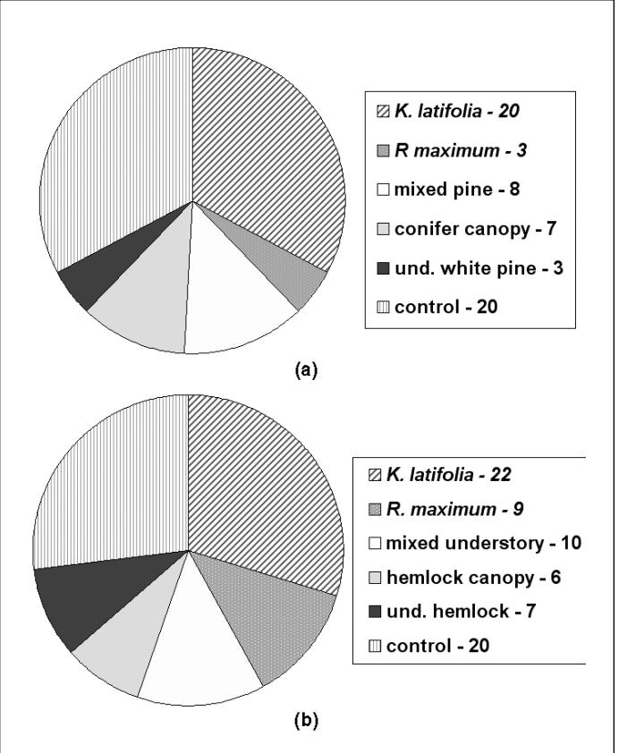
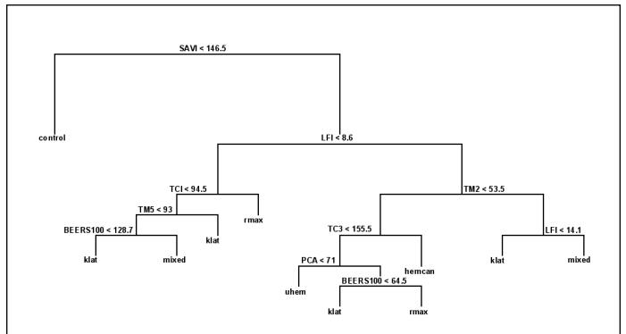
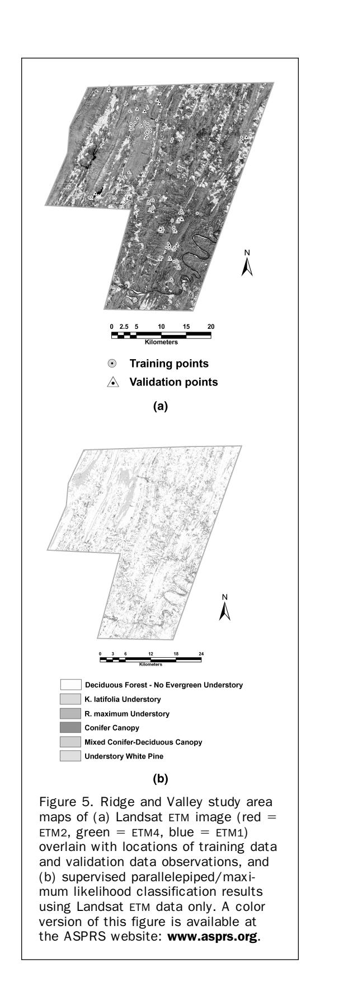

# Use of Landsat ETM and Topographic Data to Characterize Evergreen Understory Communities in Appalachian Deciduous Forests

Robert A. Chastain, Jr. and Philip A. Townsend

#### Abstract

Evergreen understory vegetation was classified using Landsat ETM imagery and ancillary data in two physiographic provinces in the central Appalachian highlands; the Ridge and Valley and the Allegheny Plateau. These evergreen understory communities are dominated by rosebay rhododendron (Rhododendron maximum L.) and mountain laurel (Kalmia latifolia L.), which are spatially extensive and ecologically important to the structure and functioning of Appalachian forests. DEM-derived topographic information was integrated with Landsat data to assess its potential to improve classification accuracy, maximum likelihood, and minimum distance, and decision tree classification approaches were tested with these data in a factorial manner. An overall accuracy of 87.1 percent  $(K_{hat} = .806)$ was achieved in the Ridge and Valley province by employing a maximum likelihood approach using Landsat data alone, while an 82.9 percent overall accuracy ( $K_{hat} = .755$ ) was obtained for the Allegheny Plateau employing a hybrid decision tree classification approach with Landsat and topographic data.

## Introduction

Society relies on forests to provide a number of economic and ecosystem services (Daily et al., 1997), requiring a balance between providing wood and other products with the maintenance of water quality, sediment retention, and the capacity for nutrient storage (Perry, 1998; Aber et al., 2000). In addition, forests act as carbon sinks that can attenuate climatic changes due to increases in atmospheric carbon (Schlesinger, 1977; Sedjo, 1992). Forest ecosystems also provide habitat and refuge for wildlife, and are valued for recreation and aesthetics. Given these societal services, there is general agreement on the importance of forest ecosystems to be self-replacing and sustainable into the foreseeable future.

Robert A. Chastain, Jr. is with the Fort Lewis Directorate of Public Works, Environmental and Natural Resources Division, IMNW-LEW-PWE, MS17, Box 339500, Bldg 2012, Fort Lewis, WA 98433 and formerly with the University of Maryland Center for Environmental Science Appalachian Laboratory, Frostburg, MD (robert.chastain2@us.army.mil).

Philip A. Townsend, Department of Forest Ecology and Management, University of Wisconsin-Madison, Russell Labs, 1630 Linden Drive, Madison, WI 53706 and formerly with the University of Maryland Center for Environmental Science Appalachian Laboratory, Frostburg, MD 21532.

In the eastern United States, the Appalachian region contains the most extensive contiguous area of forests, because high topographic relief precludes widespread transformation into agricultural or urban land uses. An important (but often understudied) component of Appalachian forests is the evergreen understory layer found beneath the canopy of large tracts of these forests. Appalachian evergreen understory communities are dominated by rosebay rhododendron (Rhododendron maximum L.) and mountain laurel (Kalmia latifolia L.) in nearly pure stands or mixed in varying proportions. Their locations are correlated with topo-edaphic gradients, with R. maximum thriving in protected, mesic locations and K. latifolia often located on exposed, upslope sites. The different landscape positions inhabited by these two species result from differences in plant physiological responses to solar radiation, cold air drainage, soil moisture, summer and winter temperature regimes, and atmospheric drying potentials (Monk et al., 1985; Lipscomb and Nilsen, 1990a and 1990b; Dobbs, 1995). Specifically, the evergreen understory layer species K. latifolia and R. maximum are important to forest community structure and ecosystem function because they:

- Have the potential for slowing mineral cycling (Thomas and Grigal, 1976; Monk et al., 1985), and therefore have water quality maintenance implications in the event of disturbance:
- Inhibit canopy tree regeneration when present in dense stands (Minkler, 1941; Phillips and Murdy, 1985; Clinton et al., 1994; Waterman et al., 1995; Clinton and Vose, 1996; Baker and Van Lear, 1998; Nilsen et al., 1999; Beckage et al., 2000; Nilsen et al., 2001; Lei et al., 2002);
- 3. Provide forage and refuge for various wildlife (Gates and Harman, 1980; Thackston *et al.*, 1982; Johnson *et al.*, 1995);
- 4. Are significant with respect to carbon sequestration and nutrient (N and P) cycling (Thomas and Grigal, 1976; Monk et al., 1985); and
- 5. Enhance the aesthetics of Appalachian forests (Hollenhorst *et al.*, 1993).

Further study of the evergreen understory species *K. latifolia* and *R. maximum* is needed because their spatial extent and temporal dynamics are poorly understood. Notably, the temporal dynamics of both leaf area (density) and spatial extent of these species is central to understanding their role in the inhibition of canopy tree regeneration. In addition,

Photogrammetric Engineering & Remote Sensing Vol. 73, No. 5, May 2007, pp. 563–575.

0099-1112/07/7305-0563/\$3.00/0 © 2007 American Society for Photogrammetry and Remote Sensing the spatial dynamics of *R. maximum* and *K. latifolia* provide the context to understand their role in carbon sequestration and mineral cycling on the landscape and regional scales, and subsequent role in water quality maintenance (Thomas and Grigal, 1976; Monk *et al.*, 1985). Accurate mapping of the current spatial extent of the *K. latifolia-* and *R. maximum-*dominated evergreen understory layer in the central Appalachian highlands will provide baseline data to examine the total regional scale influence of evergreen understories on the inhibition of canopy regeneration and the potential for carbon sequestration by forests.

Evergreen understories that are dominated by *K. latifolia* and R. maximum have steadily increased during the twentieth century in both spatial extent and density in Appalachian forests due to canopy tree disease, management practices, and other disturbances (Monk et al., 1985; Phillips and Murdy, 1985; Vandermast et al., 2002; Vandermast and Van Lear, 2002). Some researchers have observed that the spatial extent of *R. maximum* is increasing in the southern Appalachians (Vandermast et al., 2002; Vandermast and Van Lear, 2002), but that the cover of *K. latifolia* has remained comparatively stable (Dobbs, 1995). However, others have noted an increase in the area of dense stands of K. latifolia on xeric upper slope sites in the southern Appalachians resulting from high-grading of pitch pines and insect outbreaks (Waterman et al., 1995; Elliott et al., 1999). In the central Appalachians, it has been observed that R. maximum is becoming increasingly important, with thickets located in more mesic areas becoming denser and those in drier areas showing evidence of spreading (McGraw, 1989). Development of methods to accurately map evergreen understory communities will help provide currently non-existent baseline data to investigate temporal changes. Those changes are of particular interest to forest managers, who may be interested in decreases in canopy tree recruitment due to light and water competition (as well as other secondary effects) with understory shrubs (Phillips and Murdy, 1985; Clinton et al., 1994; Waterman et al., 1995; Clinton and Vose, 1996; Baker and Van Lear, 1998; Nilsen et al., 1999; Beckage et al., 2000; Nilsen et al., 2001; Lei et al., 2002).

A new approach is needed to determine the spatial extent of forest evergreen understory communities in Appalachian forests. Spaceborne remote sensing data has not been employed to map the forest evergreen understory layer in the Appalachian highlands, although interpretation of aerial photographs has been used toward this end in the southern Appalachians (Dobbs, 1995). Automated procedures have not been developed to apply increasingly available, inexpensive, and repeatable multispectral remote sensing data to this challenge. The neglect of digital remote sensing applications for landscape-scale understory vegetation community identification may be due to a perceived lack of need for this level of compositional detail in mapping Appalachian forest communities, or a mistaken belief that application of these data cannot be used to successfully map evergreen understory vegetation. The national land cover data set (NLCD), produced by the multi-resolution land characteristics (MRLC) consortium (Vogelmann et al., 2001) used Thematic Mapper (TM) image data to map land-cover classes on a regional scale, but only identified three forested classes: deciduous, evergreen, and mixed. The NLCD classification refers to the proportion of canopy tree species that have a deciduous habit, but does not include understory layer shrubs, thereby limiting its usefulness in Appalachian forests. In the NLCD, forests that have a "winter-green" vegetative cover beneath a deciduous overstory are ambiguously mapped as mixed or evergreen. It is arguable that none of the NLCD forest classes are technically correct in deciduous forests underlain by evergreen understory communities.

In this study, the spatial extent of the R. maximumand/or K. latifolia-dominated evergreen understory layer is assessed using Landsat Enhanced Thematic Mapper (ETM+) imagery and topographic data in two study areas in the central Appalachian highlands. The effectiveness of topographic data in improving classification results by exploiting the dissimilar landform positions of evergreen understory communities dominated by K. latifolia and R. maximum is also examined. The objectives of this study are to determine the appropriate data sources necessary to support an accurate classification of evergreen understory communities dominated by R. maximum, K. latifolia, and associated mixes, as well as to test the utility of different classification methods. The efficacy of three different classification methods are compared employing (a) a supervised decision rule classification using minimum distance to cluster means to solve for overlapping and unclassified pixels, (b) a supervised decision rule classification using maximum likelihood to solve for overlapping and unclassified pixels, and (c) a decision tree approach. The predictor (training) data sets are varied to compare the classification success obtained by using Landsat ETM+ data alone with the classification success achieved using a combination of Landsat and topographic data, and the interaction between the three classification methodologies and two training data combinations are ultimately assessed. The overarching goal is to develop a straightforward and repeatable method to assess the regional prevalence and landscape patterns of evergreen understory communities in Appalachian forests for management applications. Toward this end, well-established pixel-based classification methods that are available in a number of image processing and statistical software packages were used. Subpixel, feature based, and other more advanced classification approaches were not tested in this research.

## **Methods**

#### **Study Areas**

This research was conducted in two representative study areas within the U.S. central Appalachian highlands (39° 50'N, 79° 22'W by 39° 29'N, 78° 14'W), which is located in the heart of the geographic range of *K. latifolia* and *R. maximum* (Figure 1). These areas were selected for their differing topographic and climatic environments, including the warmer and drier Ridge and Valley physiographic province (39° 54'N, 78° 47'W by 39° 29'N, 78° 14'W), which includes Green Ridge and Buchanan State Forests in Maryland and Pennsylvania, and the cooler and wetter Allegheny Plateau (39° 50'N, 79° 22'W by 39° 21'N, 78° 49'W), which includes Savage River, Potomac, and Forbes State Forests. The study areas are largely public forest or game lands, and consequently experience less intensive development and logging pressure than adjacent privately held land. Because of differences in topography and climate, as well as land use history, the overall forest community composition and structure of the forest communities in these two study areas are dissimilar. The Ridge and Valley study area is located within the oak-chestnut forest type (Braun, 1950) and was heavily logged, extensively burned, and planted into orchards prior to being managed as public land (Mash, 1996). The forests are now largely mature 50 to 75 year old oakdominated forests (unpublished data, Maryland and Pennsylvania continuous forest inventories). Elevation ranges from 123 to 845 meters with steep northeast to southwest trending ridges. Average monthly temperatures range from  $-1^{\circ}$  to 23.6°C annually (National Climatic Data Center, 1971–2000), with an average annual precipitation of 1,023 mm (Lynch, personal communication) and actual evapotranspiration (AET) of 537 mm/yr (NCDC, 1948-1993; K. Eshelman, unpublished

Figure 1. Geographic range of rosebay rhododendron (Rhododendron maximum L.) and mountain laurel (Kalmia latifolia L.) and area map of present study showing the boundaries of the Allegheny Plateau and Ridge and Valley study areas and extent of state forestlands

data). The Allegheny Plateau study area is located in the mixed mesophytic forest zone (Braun, 1950). Like the ridge and valley these forests were largely cut in the early twentieth century and are now dominated by oaks, but also have a substantial component of conifers, including hemlock (*Tsuga canadensis*) and numerous pine species (*Pinus spp.*). Elevation ranges from 304 to 986 meters, with average monthly temperatures ranging from  $-3.2^{\circ}$  to  $20.9^{\circ}$ C annually (NCDC, 1971-2000), with an average annual precipitation of 1,216 mm (Lynch, personal communication), and AET of 587 mm/yr (K. Eshleman, unpublished data).

### **Image Classification**

Landsat Data

Spring leaf-off, snow-free Landsat ETM+ images were employed to map the evergreen understory beneath a deciduous forest

canopy. Late March image data were selected as optimal due to the availability of cloud- and snow-free images combined with the favorable illumination from a high sun angle. Evergreen understory community mapping employed the 31 March 2000 Landsat ETM+ from path 16, rows 32 and 33. The image was referenced to UTM Zone 17, NAD-83 coordinates using 52 ground control points that were identifiable on both the image and USGS 1:24 000 scale digital raster graphic quadrangle maps. A first order (linear) transformation and nearest neighbor resampling method were used to geographically reference the ETM+ image data. The resulting average root mean square error (RMSE) was 0.57 for the portion of the image that covered the two study areas, indicating that the spatial error between the map source and image data is expected to be about one half of a  $30 \times 30$ meter pixel. The alignment between the Landsat image data and the digital elevation model (DEM) data used in this study was assessed visually in ERDAS Imagine® using the swipe utility over numerous localized regions with differing illumination due to topography, and was determined to align with an error <0.5 pixels. This was satisfactory to proceed with the statistical classification and topographic normalization approaches discussed below. The ETM+ image data were corrected to at-sensor reflectance following Markham and Barker (1986) and parameters published in the Landsat-7 Science Data Users Handbook (Irish, 2000).

A statistical topographic normalization technique was then applied to the TM data to reduce the influence of differential solar illumination related to topography (Allen, 2000). The empirical model relating solar illumination angle  $(\cos(i),$  computed pixel by pixel from a 30-meter digital elevation model and solar azimuth and elevation values for the Landsat overflight) to differential reflectance of forested pixels was developed band by band such that illumination corrected reflectance  $(R_i)$  is calculated as:

$$R_i = R_o - \cos(i) * M - B + R(hat)$$

where M and B are regression parameters (Table 1),  $R_0$  is the original reflectance, and R(hat) is the mean reflectance (Meyer *et al.*, 1993). Finally, non-forested areas were masked from further analyses using an existing ancillary classification.

The six visible and non-thermal infrared Landsat ETM bands were used to identify evergreen understory communities, along with a number of common transformations or

Table 1. Model Parameters Applied to  $\cos i$  Correction of 2000 Landsat etm Images for the Ridge and Valley (n = 297) and Allegheny Plateau (n = 716) Study Areas. Normalization Equation Takes the Form of Y = old tm radiance  $-\cos i$ \*slope - intercept + mean Where Y is the New etm Radiance

|                   |        | Enhanced Thematic Mapper (ETM) Bands |        |        |        |        |  |  |  |
|-------------------|--------|--------------------------------------|--------|--------|--------|--------|--|--|--|
| Parameter         | ETM1   | ETM2                                 | ETM3   | ETM4   | ETM5   | ETM6   |  |  |  |
| Ridge and Valley  |        |                                      |        |        |        |        |  |  |  |
| Mean              | 68.6   | 51.6                                 | 57.7   | 55.3   | 97.5   | 62.6   |  |  |  |
| $\mathbb{R}^2$    | .72    | .81                                  | .72    | .87    | .83    | .77    |  |  |  |
| Intercept         | 30.0   | -5.5                                 | -48.4  | -51.9  | -176.2 | -114.1 |  |  |  |
| Slope             | .23    | .34                                  | .64    | .64    | 1.64   | 1.06   |  |  |  |
| р                 | >.0001 | >.0001                               | >.0001 | >.0001 | >.0001 | >.0001 |  |  |  |
| Allegheny Plateau |        |                                      |        |        |        |        |  |  |  |
| Mean              | 72.3   | 55.8                                 | 65.2   | 56.7   | 113.3  | 76.2   |  |  |  |
| $\mathbb{R}^2$    | .74    | .84                                  | .84    | .79    | .88    | .85    |  |  |  |
| Intercept         | 28.0   | -11.7                                | -65.0  | -45.9  | -198.6 | -136.0 |  |  |  |
| Slope             | .26    | .39                                  | .75    | .59    | 1.80   | 1.22   |  |  |  |
| p                 | >.0001 | >.0001                               | >.0001 | >.0001 | >.0001 | >.0001 |  |  |  |

derivatives from these bands. These six Landsat ETM visible and infrared bands typically contain substantial redundancy, which was reduced using principal components to three bands (PC1, PC2, and PC3) explaining 98.2 percent of the variance in the original image subset to the Ridge and Valley study area and 98.4 percent of the variance in the original Allegheny Plateau image. The two mid-infrared channels (ETM5 and ETM7) were most closely associated with PC1 in both study areas, and the near-infrared channel (ETM4) was most highly correlated with PC2. The tasseled cap transformation was also applied using coefficients from Huang *et al.* (2002) to derive the widely used Brightness (soils), Greenness (vegetation), and Wetness (plant canopy and soils) indices (Crist and Kauth, 1986).

Also derived for this study were the normalized difference vegetation index (NDVI), computed from ETM data as (NIR — Red)/(NIR + Red), and soil adjusted vegetation index (SAVI, (NIR — red)/(NIR + red + .5)). These indices correlate to leaf area, biomass, percent green cover, productivity, and photosynthetic activity (Tucker, 1979; Sellers, 1985). SAVI has been found to be more successful than NDVI in filtering out "vegetation equivalent noise" (background soil and standing litter reflectance) in complex plant communities (Huete, 1989; Van Leeuwen and Huete, 1996). Both of these vegetation indices were included in subsequent classification data *stacks* because one objective of this work was to determine the combination of raw bands and/or derivatives that best delineated evergreen understory communities.

# Topography

From pilot analyses, it was expected that some confusion would result from attempting to distinguish forest understory communities dominated by *K. latifolia* from those with *R. maximum* using the Landsat ETM image data alone. In addition, the possibility existed for confusion between evergreen understory communities and mixed oak-pine forests or even forests with regenerating coniferous understo-

ries (e.g., white pine and hemlock). It was hypothesized that topographic data could be used to distinguish among evergreen understory species based on niche specialization related to topographic gradients (Franklin, 1998).

Topographic indices that have been developed as landscape-scale representations of gradients associated with landform shape and position were derived from the 30-meter National Elevation Database (NED) DEM of the study areas (Table 2). These indices represent measurements of indirect gradients hypothesized to control species distribution (Austin and Smith, 1989; Franklin, 1995). Indirect indices have also been used to characterize the spatial distribution of species in predictive mapping (Parker, 1982; McNab, 1989 and 1993; Iverson et al., 1997), but have infrequently been used with remote sensing data (Frank, 1988; Ohmann and Gregory, 2002). From the DEM data, the indirect gradients of slope, aspect, elevation, slope position, and slope curvature were derived. These indirect gradients act as measurable surrogates to the direct gradients of exposure, moisture availability, temperature, and growing season length. Specifically, such derivatives represent the topographic moisture gradients resulting from slope position, exposure, or curvature, that separate R. maximum and K. latifolia based on their unique ecological niches. Topographic gradients are therefore used as independent variables similar to the spectral data. This use of topographic information is independent of and uncorrelated with the previous use of different DEM-derived variables to reduce illumination effects within the Landsat imagery.

#### Field Data

Detailed data on vegetation composition and structure was collected at 213 plots in the Green Ridge and Savage River State Forests in Maryland and the Buchanan State Forest in Pennsylvania between 1999 and 2002. Initially, the plots were designed such that they consisted of two crossing 60-meter transect tapes and five sample points located at the ends of the transects and at their intersection (Townsend and Walsh,

Table 2. Descriptions, Computations, and References for the Various Topographic Indices Used in the Classifications Performed for the Ridge and Valley and Allegheny Plateau Study Areas

| Name                               | Acronym | Computation                                                                             | Reference                     | Description                                                                                                                                |
|------------------------------------|---------|-----------------------------------------------------------------------------------------|-------------------------------|--------------------------------------------------------------------------------------------------------------------------------------------|
| Beers Transformation               | BEERS   | cos(aspect - 45) + 1                                                                    | Beers <i>et al.</i> , 1966 | Transforms circular aspect to linear variable oriented from southwest (warm, dry) to northwest (cool, wet)                                 |
| Relative Slope Position            | RSP     | distance to bottom/ (distance to top + distance to bottom) * 100                  |                               | Position on a slope face with respect to local drainage features and ridges                                                          |
| Topographic Convergence Index   | TCI     | $ln(\alpha/tan\beta)$ where $\alpha = slope$ and $\beta = upslope$ contributing area | Beven and Kirkby, 1979     | Measure of wetness potential based on upslope contributing area and local slope angle                                                |
| Terrain Shape Index                | TSI     | (Z')/R where Z' = mean elevation of plot and R = plot radius                      | McNab, 1989                   | Identifies the local geometric shape (convex or concave) of an area based on variability of a defined space (e.g., a plot)                 |
| Land form Index                    | LFI     | sum of slope observation/(N*100)                                                     | McNab, 1993                   | Identifies the regional context of a location with respect to macro-topographic features, e.g., exposed ridges and protected coves         |
| Terrain Relative Moisture Index | TRMI    | slope position + curvature + slope angle + slope aspect                              | Parker, 1982                  | Integrative measure of slope angle, position, aspect, and curvature scaled to represent xeric to progressively mesic and hydric conditions |

2001), creating a plot area favorable for integration with Landsat-scale remote sensing data (Justice and Townshend, 1981). Basal area was estimated at each of the sample points using the Bitterlich variable plot method (Grosenbaugh, 1952; Lindsey et al., 1958), and tree height measures (top and bottom of leaf canopy) were taken for three canopy and subcanopy trees each using a laser rangefinder. Heights (top and bottom of leaf canopy) were also noted for all shrub and sapling species present with greater than 15 percent coverage in the immediate vicinity of the sample points to estimate an average height for the shrub/sapling layer. Cover was estimated for the canopy, sub-canopy, shrub/sapling, and herb layers as a whole, as well as on an individual species basis. Due to the difficulty encountered in establishing dual 60meter transects in the heavy vegetation present in some of the evergreen understory plots, the initial plot design was modified to consist of one 60 meter transect with three sample points: one at each end and one in the middle (Figure 2). This design remains suitable for integration with Landsat-scale

Figure 2. Designs for the original vegetation survey plots consisting of two intersecting 60-meter transects with five subplots (a), and the abridged evergreen understory plots consisting of only one single 60-meter transect with three subplots (b).

data, as ground observations cover at least two contiguous 30-meter Landsat pixels. Plots located in deciduous forests with no evergreen understory cover (control plots) were randomly selected from a set of vegetation plots with identical sampling protocol established for a separate study (Seagle and Sturtevant, 2005). Plots established in evergreen understory communities were purposely located to ensure suitable spatial coverage at the landscape scale, and also based on access considerations (i.e., public lands). All of the detailed forest survey plots established in evergreen understory areas in the two study areas were used to validate the classification.

Additional observational data were obtained at a number of locations in the Ridge and Valley and Allegheny Plateau study areas to train the classifications of the Landsat image and topographic data, as well as to supplement the available classification validation data. Observations obtained at a total of 61 sites in the Ridge and Valley study area and 74 sites in the Allegheny Plateau served as training data for the classifications performed for this study (Figure 3). At least three training sites per class were used in both study areas, resulting in 3 to 36 ha (37 to 443 pixels) per class of training data in each study area. Training data for the decision tree classifications were extracted at the point locations of these sites. The field survey plot data was reserved for use as validation data, employing a total of 85 plots in the Ridge and Valley study area, including 57 of the 108 forest survey plots (discarding a number of control plots) and 28 additional plots in which only canopy and understory composition and coverage were recorded. A total of 140 observation points were used for classification

Figure 3. Pie charts illustrating the proportions of observations used to train the classifications performed in the (a) Ridge and Valley and (b) Allegheny Plateau study areas.

validation in the Allegheny Plateau, including 98 of the 105 forest survey plots and 42 less intensive observation points. All field survey, validation, and training sites were geolocated in the field using differential GPS.

Plots containing at least 30 percent cover of either K. latifolia or R. maximum were used to assess classification accuracy within evergreen understory areas. If a plot contained less than 25 percent cover of K. latifolia or R. maximum, then it was designated as a control plot (deciduous canopy with no evergreen understory present). When a mixture of R. maximum and K. latifolia occurred in a plot, it was designated as an R. maximum plot if K. latifolia cover was 20 percent or less (and vice versa). If both cover types were higher than 30 percent or were approximately equal (e.g., 25 percent of each), then the plot was designated as a *mixed* evergreen understory plot. Other cover types were also mapped to capture the variability in winter-green vegetation types and forest community assemblages present in the two study areas, including for the Allegheny Plateau: hemlock/conifer overstory, hemlock understory (deciduous canopy), and deciduous canopy with no evergreen understory (control). For the Ridge and Valley, secondary classes included conifer canopy, mixed conifer, understory white pine (with deciduous canopy), and *control*.

## Analytical Approaches

Image classification consisted of three methods and two combinations of predictor variable sets, resulting in a total of six classification approaches. First, Landsat data were employed exclusively, then, topographic data were added to assess improvements in classification accuracy. Only supervised classification methods were tested to take advantage of the extensive training data sets assembled for the two study areas. Supervised classifications using a nonparametric (parallelepiped) decision rule, then maximum likelihood or minimum distance rules to address overlap and/or unclassified cases (both implemented in ERDAS Imagine®), and decision tree (using S-Plus) classification methods were compared for each combination of data sets. Supervised classification methods using the parallelepiped, maximum likelihood, and minimum distance decision rules are widely used in vegetation remote sensing, whereas decision trees are becoming more prominent in light of their ability to identify the inputs that produce the best separability for classification (Hansen et al., 1996). Decision trees have been demonstrated to produce robust results for land-cover classification in a number of environments and over a spectrum of scales (Friedl and Brodley, 1997; Friedl et al., 1999; Hansen et al., 2000; Joy et al., 2003; de Colstoun et al., 2003). Decision tree-based models differ from linear and additive logistic models for classification problems, in that they recursively split the data to form homogeneous subsets. This layered approach represents a simpler method, with classes being formed at each step by splitting the data into classes based on a function that maximizes the reduction of class impurity (Therneau and Atkinson, 1997). Decision trees are also valuable data mining tools, in that the most relevant independent variables are chosen for the separate nodes (Venables and Ripley, 1994), and the structure of the resulting tree decision is heuristically valuable, providing insight into the predictive structure of the support data even in cases where it is non-homogenous over the measurement space (Breiman et al., 1984). An example of the recursive design of a decision tree can be seen in Figure 4.

Transformed divergence was used to determine the predictive utility of the ETM (spectral) and topographic data for the supervised classifications. A nonparametric

Figure 4. Decision tree used to generate an evergreen understory classification scheme for the Allegheny Plateau study area using multispectral and topographic information. The "uhem" (understory hemlock) class generated from this classification was merged with the results from a parallelepiped/maximum likelihood classification to produce the most accurate evergreen understory map produced in this study for the Allegheny Plateau. The "control" class refers to deciduous forest assemblages that contain no evergreen understory community cover. The "hemcan" class refers to forest communities dominated by a hemlock canopy. The "klat" class refers to evergreen understory communities dominated by K. latifolia, "rmax" refers to those dominated by R. maximum, and "mixed" refers to evergreen understory communities containing a mix of R. maximum and K. latifolia.

parallelepiped decision rule was used to assign individual training data cases to the vegetation assemblage classes based on patterns in these predictor variables. Cases that either fell into more than one parallelepiped class (overlap), or were not within any of the class boundaries (unclassified) were placed in one of the classes based on the result of a maximum likelihood decision rule, and then a minimum distance to mean decision rule. The choice to classify all of the training cases was motivated by the desire to emulate as closely as possible the greedy algorithm employed by the decision tree classifications also performed for this study, thus enhancing the comparability of the results of the two classification approaches.

Two decision tree classifications were performed in the S-Plus statistical software package for each study area. The class method was used to create a decision tree model to map plant community associations, using the Gini index of impurity as a splitting rule to maximize impurity reduction during data splitting at tree nodes with prior probabilities proportional to observed class frequencies. Pruning not was applied to the greedy outcome of the decision tree models so that none of the vegetation assemblage classes that were classified by the tree model would be omitted. A set of ifthen statements based on the parameters in the decision tree was coded and run in the ArcGIS™ GRID module to produce maps that could then be tested for classification accuracy.

## Results

# **Separability of Evergreen Understory Communities**

In the Allegheny Plateau study area, Landsat ETM bands 5 and 7 (1.55 to 1.75  $\mu m$  and 2.09 to 2.35  $\mu m$ ) proved to be

most useful in the separation of R. maximum and K. latifolia understory communities. PC2 and PC3, Greenness, and SAVI distinguished winter-green vegetation types based on their level of greenness, with training data sets for the K. latifoliadominated communities and hemlock understory classes having the lowest mean values, and the training data set for the hemlock canopy class having the highest mean value. ETM5 and ETM7 are sensitive to green vegetation moisture content, and have been shown elsewhere to be sensitive to understory vegetation (Stenback and Congalton, 1990). Specifically, K. latifolia leaves exhibit greater moisture content than R. maximum during the winter/spring because the stomata on R. maximum leaves remain closed during winter, and are not photosynthetically active. In contrast, the stomata of K. latifolia leaves were likely open during 31 March 2000, when the maximum temperature (15°C) was high enough for K. latifolia stomata to open (Nilsen, 1992). The topographic variables with the greatest degree of separability information were the relative slope position (RSP), Beers-transformed slope aspect, and topographic convergence index (TCI). R. maximum was discernable from K. latifolia-dominated and mixed understory communities as occurring at lower relative slope positions with higher topographic wetness (TCI) values.

In the decision tree classifications performed for the Allegheny Plateau, additional variables proved useful in making specific splits in the data due to the recursive nature of this classification method. ETM bands 1 through 5, PCA2 (correlated with the NIR channels), tasseled cap brightness and wetness, NDVI, and SAVI were chosen by the Gini splitting rule, along with the topographic indices land form index (LFI), BEERS, and TCI (Table 3). SAVI and NDVI are very similar, and thus were both effective in separating the study area into winter-green (dark) and brighter (control; no evergreen understory) areas. As such, the primary input variable selected in all of the decision trees for this study area was either SAVI or NDVI, regardless of the input predictor data. All of the classification trees are

not presented here because of the large number of analyses, but a tree diagram for the Plateau study area shown in Figure 4 serves as an example. In this example, LFI bifurcates the upslope *K. latifolia*, *R. maximum*, and mixed understory areas from the lower slope portions of those communities. In upslope locations, TCI separated the moisture-loving *R. maximum* communities from *K. latifolia*, which tolerates drier conditions. On lower slopes, ETM2 (sensitive to green reflectance) separated the denser and hence greener hemlock and *R. maximum* communities from the mixed and *K. latifolia* communities, which generally are sparser in coverage.

In the various classifications performed for the Ridge and Valley study area, the spectral variables that proved valuable to distinguish the different winter-green classes were ETM4, ETM5, ETM7, PCA3, Greenness, Wetness, and SAVI (Table 3). As in the Plateau study area, the topographic variables that were of use were RSP, BEERS, LFI, and TCI, although the topographic training data was not as useful as the Landsat data in separating the vegetation classes in this study area. The predictor variables derived from Landsat ETM that provided the best class separability in the parallelepiped/maximum likelihood classification included ETM4, ETM5, ETM7, PCA3, Greenness, Wetness, and SAVI, while ETM4, PC2, Brightness, and Greenness were used most often in the decision tree classifications (Table 3).

#### Map Accuracy

Maps derived from the classifications exhibited overall patterns of species distribution that were similar to each other, with a few notable localized differences. Map accuracy for the 140 validation locations on the Allegheny Plateau and 85 on the Ridge and Valley study area was assessed by comparing overall accuracy, user's accuracy (omission error), producer's accuracy (commission error), and the  $K_{hat}$  statistic (the improvement of the classification over chance agreement; Congalton, 1991; Congalton and Meade, 1983) (Table 4).

Table 3. Predictor Variables Used in the Various Classification Approaches Tested in this Study. The Variables Used in the Supervised Classifications (Parallelepiped with Maximum Likelihood or Minimum Distance to Means) Were Selected to Maximize the Transformed Divergence of the Training Data Set. The Predictor Variables Used in the Decision Tree Classifications Were Selected Using the Gini Index of Impurity as a Splitting Rule to Maximize Impurity Reduction

| Allegheny Plateau Study Area |                        |                          | Ridge and Valley Study Area |                             |                        |                          |                           |                             |
|------------------------------|------------------------|--------------------------|-----------------------------|-----------------------------|------------------------|--------------------------|---------------------------|-----------------------------|
| Variable                     | Supervised ETM Only | Supervised ETM + Topo | Decision Tree ETM Only   | Decision Tree ETM + Topo | Supervised ETM Only | Supervised ETM + Topo | Decision Tree ETM Only | Decision Tree ETM + Topo |
| ETM1                         |                        |                          | X                           |                             |                        |                          |                           |                             |
| ETM2                         |                        |                          |                             | X                           |                        |                          |                           |                             |
| ETM3                         |                        |                          | X                           |                             |                        |                          |                           | X                           |
| ETM4                         |                        |                          | X                           |                             | X                      | X                        | X                         | X                           |
| ETM5                         | X                      |                          | X                           | X                           | X                      | X                        | X X                    |                             |
| ETM7                         | X                      | X                        |                             |                             | X                      |                          |                           |                             |
| PCA1                         |                        |                          |                             |                             |                        |                          |                           | X                           |
| PCA2                         | X                      | X                        |                             | X                           |                        |                          | X                         | X                           |
| PCA3                         | X                      | X                        |                             |                             | X                      | X                        |                           |                             |
| TC1                          |                        |                          | $\mathbf{X}$                |                             |                        |                          | X                         | $\mathbf{X}$                |
| TC2                          | X                      | X                        |                             |                             | X                      | X                        | X                         | X                           |
| TC3                          |                        |                          |                             | X                           | X                      | X                        |                           |                             |
| SAVI                         | X                      | X                        |                             | X                           | X                      | X                        | X                         |                             |
| NDVI                         |                        |                          | $\mathbf{X}$                |                             |                        |                          |                           |                             |
| TRMI                         |                        |                          |                             |                             |                        |                          |                           |                             |
| RSP                          |                        | X                        |                             |                             |                        | X                        |                           |                             |
| BEERS                        |                        | X                        |                             | X                           |                        | X                        |                           |                             |
| LFI                          |                        |                          |                             | X                           |                        |                          |                           | X                           |
| TCI                          |                        | X                        |                             | X X                      |                        | X                        |                           | X                           |
| TSI                          |                        |                          |                             |                             |                        |                          |                           |                             |

In the Ridge and Valley, the best classification result was obtained through supervised classification using the parallelepiped/maximum likelihood decision rules with Landsat ETM data alone. Although the parallelepiped/maximum likelihood classification using both multispectral and topographic information had comparable overall accuracies and Khat measures, visual inspection of areas outside the validation data indicated that the addition of topographic data contributed to the over-estimation of *R. maximum* and *K. latifolia* in the southern portion of the study area. The misclassified areas were actually winter-green due to the presence of conifers in former agricultural areas. The similarity of the accuracy measures of the supervised classification using Landsat and topographic data and that using Landsat data alone was caused by the lack of validation data in these locations, underscoring the importance of extensive validation data collection. In addition, the southern region of the study area may have been more accurately classified if additional training data had been collected in the specific locations where this overestimation of evergreen understory vegetation occurred. Areas marked by extensive agricultural land use history are typically free of K. latifolia, with areas with a lesser extent of agricultural history acting as refugia for this species (Wilson and O'Keefe, 1983). In such cases, land-use history supercedes the predictive value of topography in land-cover classification.

The overall accuracy of the supervised parallelepiped/ maximum likelihood classification of the Landsat data alone was 82.3 percent ( $K_{hat} = .75$ ) (Table 5a). One source of classification error (occurring three times) involved the misclassification of areas with less than 30 percent of K. latifolia cover as areas free of evergreen understory cover. This indicates that a functional limit of classification reliability may exist at 30 percent cover of evergreen understory vegetation. Because the primary goal of this classification was to distinguish evergreen understory shrub communities from other wintergreen vegetation (conifers) and forested areas without an evergreen understory, the conifer classes were combined to focus exclusively on classification accuracy of the target classes. After combining the conifer classes, the overall accuracy of this classification was 87.1 percent ( $K_{hat} = .81$ ) (Table 5b). The highest per-class accuracy level was obtained for K. latifolia, with a producer's accuracy of 83.7 percent and a user's accuracy of 100 percent. The lowest per-class accuracy was obtained for R. maximum, with a producer's accuracy of 75 percent and a user's accuracy of 60 percent.

In the Allegheny Plateau study area, the parallelepiped/maximum likelihood supervised classification using spectral and topographic data provided the highest accuracy (80 percent), but did not include an understory hemlock class due to the insufficient size of the training data set for the supervised classifier. Understory hemlock was more accurately

TABLE 4. OVERALL ACCURACY AND KAPPA STATISTICS OBTAINED FROM THE DIFFERENT CLASSIFICATION METHODS TESTED

|                              | Ridge and Valley    |       | Allegheny Plateau   |       |  |
|------------------------------|---------------------|-------|---------------------|-------|--|
| Classification Method     | Overall Accuracy | Kappa | Overall Accuracy | Kappa |  |
| MaxLike ETM                  | 87.1                | .806  | 69.3                | .29   |  |
| MinDist ETM                  | 70.6                | .571  | 52.1                | .348  |  |
| MaxLike ETM + Topo           | 87.1                | .807  | 80.0                | .704  |  |
| MinDist ETM + Topo           | 50.6                | .345  | 49.3                | .27   |  |
| Decision Tree ETM            | 78.8                | .677  | 69.3                | .518  |  |
| Decision Tree ETM + Topo  | 80.0                | .693  | 70.7                | .579  |  |
| Merged MaxLike ETM + Topo | NA                  | NA    | 82.9                | .755  |  |

TABLE 5. RIDGE AND VALLEY PARALLELEPIPED/MAXIMUM LIKELIHOOD CLASSIFICATION (LANDSAT AND TOPOGRAPHIC DATA) ERROR MATRICES AND ACCURACY ASSESSMENT RESULTS FOR (A) ALL CLASSES AND (B) WITH CONIFER CLASSES COMBINED. K. LATIFOLIA IS ABBREVIATED AS KLAT, R. MAXIMUM IS ABBREVIATED AS RMAX, UND WHITE PINE REFERS TO WHITE PINE BEING PRESENT IN UNDERSTORY, AND CONTROL REFERS TO NO EVERGREEN UNDERSTORY PRESENT

| A. Classification Data | Reference Data |   |    |   |   |    | Row Total |
|---------------------------|----------------|---|----|---|---|----|--------------|
| KLAT                      | 36             | 0 | 0  | 0 | 0 | 0  | 36           |
| RMAX                      | 1              | 3 | 0  | 1 | 0 | 0  | 5            |
| Mixed pine                | 1              | 0 | 6  | 1 | 0 | 0  | 8            |
| Conifer canopy            | 0              | 0 | 2  | 5 | 0 | 0  | 7            |
| Und white pine            | 1              | 0 | 0  | 1 | 2 | 0  | 4            |
| Control                   | 4              | 1 | 2  | 0 | 0 | 18 | 25           |
| Column total              | 43             | 4 | 10 | 8 | 2 | 18 | 25           |

Overall Accuracy = 82.4%, kappa = .748.

| Class          | Producer's Accuracy | User's Accuracy |
|----------------|---------------------|-----------------|
| KLAT           | 83.7                | 100             |
| RMAX           | 75                  | 60              |
| Mixed pine     | 60                  | 75              |
| Conifer canopy | 62.5                | 71.4            |
| Und white pine | 100                 | 50              |
| Control        | 100                 | 72              |

| B. Classification Data Reference Data |    |   |    |    | Row Total |
|---------------------------------------|----|---|----|----|--------------|
| KLAT                                  | 36 | 0 | 0  | 0  | 36           |
| RMAX                                  | 1  | 3 | 1  | 0  | 4            |
| All conifers                          | 2  | 0 | 17 | 0  | 19           |
| Control                               | 4  | 1 | 2  | 18 | 25           |
| Column total                          | 43 | 4 | 20 | 18 | 25           |

Overall Accuracy = 87.1%, kappa = .806.

| Class        | Producer's Accuracy | User's Accuracy |
|--------------|---------------------|-----------------|
| KLAT         | 83.7                | 100             |
| RMAX         | 75                  | 60              |
| All conifers | 85                  | 89.5            |
| Control      | 100                 | 72              |

delineated by the rules specified in the recursive decision tree classification (50 percent producer's accuracy, 57 percent user's accuracy), so the final map employed the hemlock area mapped from the decision tree model (Figure 4). This hybrid approach utilizes the best aspects of the two methodologies to produce a superior overall map (82.9 percent overall accuracy,  $K_{\text{hat}} = .76$ ) compared to individual classifications (Townsend and Walsh, 2001). In both study areas, one of the sources of misclassification error (occurring twice in the Allegheny Plateau and three times in the Ridge and Valley) involved confusion of areas with low K. latifolia cover (less than 30 percent) as being free of evergreen understory.

The user's and producer's accuracies obtained for the Allegheny plateau classification were moderately high in most of the categories (Table 6). The relatively low user's accuracy result for *R. maximum* (50 percent) is due largely to confusion with *K. latifolia* communities, but in half of those instances a small amount of *R. maximum* was also in the understory at the validation point. In fact, half of the overall cases of confusion in the Allegheny Plateau classification occurred among the *R. maximum*, *K. latifolia*, and *mixed* broadleaf evergreen vegetation classes (see Table 5). From this result it is apparent that the discernability of these vegetation communities from *control* and hemlock-containing

Table 6. Allegheny Plateau Merged Parallelepiped/Maximum Likelihood and Decision Tree Classification (Landsat and Topographic Data) Error Matrix and Accuracy Assessment Results. *K. latifolia* is Abbreviated as Klat, *R. maximum* is Abbreviated as RMAX, Mixed Refers to *K. latifolia* and *R. maximum* Being Mixed in the Understory, Und Hemlock Refers to Hemlock in the Understory, and Control Refers to No Evergreen Understory Present

| Classification Data Reference Data |    |   |    |   |   | Row Total |     |
|------------------------------------|----|---|----|---|---|--------------|-----|
| KLAT                               | 56 | 1 | 2  | 0 | 1 | 1            | 61  |
| RMAX                               | 4  | 6 | 1  | 0 | 1 | 0            | 12  |
| Mixed                              | 3  | 1 | 9  | 0 | 1 | 1            | 15  |
| Hemlock canopy                     | 0  | 0 | 0  | 7 | 0 | 0            | 7   |
| Und hemlock                        | 1  | 1 | 0  | 0 | 4 | 1            | 7   |
| Control                            | 3  | 0 | 0  | 0 | 1 | 34           | 38  |
| Column total                       | 67 | 9 | 12 | 7 | 8 | 37           | 140 |

Overall Accuracy = 82.9%, kappa = .755.

| Class          | Producer's Accuracy | User's Accuracy |
|----------------|---------------------|-----------------|
| KLAT           | 83.6                | 91.8            |
| RMAX           | 66.7                | 50              |
| Mixed pine     | 75                  | 60              |
| Conifer canopy | 100                 | 100             |
| Und white pine | 59                  | 57.1            |
| Control        | 91.9                | 89.4            |

classes is excellent, but the discernability of *K. latifolia* from *R. maximum* is somewhat less accurate. Finally, understory hemlock (producer's accuracy = 50 percent, user's accuracy = 57 percent) proved to be difficult vegetation to classify accurately. High misclassification rates for hemlocks may occur as a consequence of its topographic location, typically in steep valley bottoms and ravines.

The significance of differences in map accuracies obtained through the combinations of classification method and input training data sets were compared using McNemar's test, which is a non-parametric test based on 2  $\times$  2 confusion matrices of correct and incorrect class allocations (Foody, 2004). The classification in each study area that had the highest overall classification accuracy and  $K_{hat}$  statistic value was compared individually to the less accurate classifications in the same study area using a chi-square test statistic ( $\chi^2 = 3.841, 0.05, df = 1$ ), with a test equation (corrected for continuity due to low sample sizes) expressed as:

$$\chi^2 = \frac{(|f_{12} - f_{21}| - 1)^2}{f_{12} - f_{21}}$$

where  $f_{12}$  is the number of validation observations that were correct in the most accurate classification and incorrect in the less accurate classification, and  $f_{21}$  is the number of observations that were incorrect in the most accurate classification and correct in the less accurate classification. Although the accuracy of the Landsat-only supervised classification using the parallelepiped and maximum likelihood decision rules had the highest overall accuracy and Khat statistic value in the Ridge and Valley study area, it was only significantly better than the two supervised classifications using the parallelepiped and minimum distance rules with different predictor variable combinations (Table 7). Also, the Landsat-with-topography supervised classification using the parallelepiped/maximum likelihood decision rules merged with understory hemlock from a decision tree classification was a significantly more accurate result in the Allegheny

TABLE 7. RESULTS OF MCNEMAR'S CHI-SQUARE TEST OF THE STATISTICAL SIGNIFICANCE OF DIFFERENCES IN THE ACCURACY OF THE CLASSIFICATIONS PERFORMED FOR THIS STUDY. THE MOST ACCURATE CLASSIFICATION FOR BOTH STUDY AREAS WERE COMPARED INDIVIDUALLY TO THE OTHER CLASSIFICATIONS, AND THE CHI-SQUARE VALUE OF THE INDIVIDUAL TESTS ARE REPORTED. SIGNIFICANT DIFFERENCES BETWEEN THE MOST ACCURATE CLASSIFICATION AND THE OTHER CLASSIFICATION RESULTS IN EACH STUDY

| Classification Approach               | Allegheny Plateau | Ridge and Valley |
|------------------------------------------|----------------------|---------------------|
| Max. Likelihood/Regression Tree Merged   | Highest Accuracy  | NA                  |
| Supervised Max. Likelihood ETM        | 11.2*                | Highest Accuracy |
| Supervised Max. Likelihood ETM + Topo | 0.41                 | 0.1                 |
| Supervised Min. Distance ETM             | 31.0*                | 13.5*               |
| Supervised Min. Distance ETM + Topo   | 37.4*                | 27.2*               |
| Regression Tree ETM                      | 9.8*                 | 2.1                 |
| Regression Tree ETM + Topo               | 7.5*                 | 1.6                 |

\*= significantly different than most accurate classification (0.05, df = 1).

plateau study area than all of the others except the Landsatwith-topography supervised classification using the parallelepiped/maximum likelihood rules without the merged understory hemlock class (Table 7).

The evergreen understory community maps derived for the Ridge and Valley and Allegheny Plateau study areas (Figures 5 and 6) illustrate distinct topographic patterns in both study areas. In the classification of Landsat data for the Ridge and Valley, K. latifolia- and R. maximum-dominated evergreen understory vegetation communities cover over 6 percent of the total forested region (Table 8). Most of this coverage is K. latifolia-dominated communities (5.9 percent of total forested area), with R. maximum-dominated communities covering only 245 hectares (0.25 percent). In the merged supervised-decision tree classification of the Allegheny Plateau study area, K. latifolia- and/or R. maximum-dominated communities cover 26.6 percent of the total forested area (Table 8). The total area of *K. latifolia*-dominated evergreen understory communities is more than the total of the *R. maxi*mum-dominated and mixed evergreen areal extent combined. The concentration of evergreen understory increases towards the western portion of the study area. Forests underlain by thick evergreen understory vegetation have historically characterized this region, as the early explorer Cristofer Gist reported spending two days cutting through an immense laurel thicket on an exploratory trip through the area in the eighteenth century (Robison, 1960). This area has since become known as the "Laurel Highlands."

## **Discussion and Conclusions**

An accurate classification (>80 percent) of the evergreen understory was obtainable using Landsat ETM image data and topographic data. The cost-benefit ratio associated with using Landsat ETM data should be considered high, especially considering the potential ecological importance and prevalence of these communities in some areas (i.e., Allegheny Plateau) and the low cost and wide availability of Landsat ETM and USGS digital elevation data. A number of the spectral bands (i.e., ETM4, ETM5, and ETM7) and derivatives (i.e., SAVI, PC2, PC3, and Greenness) of Landsat TM image data proved useful in discerning evergreen understory communities and separating those dominated by *R. maximum* and/or *K. latifolia* from other winter-green vegetation

assemblages. In addition, topographic information proved useful in improving classification accuracy in areas not impacted by an intensive land use history, as was observed in this study in the Ridge and Valley area. Whereas much of the literature pertaining to the distributions of  $R.\ maximum$ 

and *K. latifolia* in Appalachian forests focuses on topoedaphic constraints (Monk *et al.*, 1985; Lipscomb and Nilsen, 1990a and 1990b; but see Wilson and O'Keefe, 1983), the influence of land-use history as a regional-scale constraint to their distributions must also be recognized.

TABLE 8. AREAL COVERAGE OF CLASSIFIED VEGETATION COMMUNITY
ASSEMBLAGES AND PERCENT OF THE FORESTED PORTIONS OF THE TWO STUDY
AREAS COVERED BY THESE CATEGORIES

| Study Area | Class                         | Area (ha) | Percent of Total Forested Area |
|------------|-------------------------------|-----------|--------------------------------------|
| Ridge and  | KLAT                          | 5,882     | 5.9                                  |
| Valley     | RMAX                          | 246       | .3                                   |
|            | Total Evergreen Understory | 6,127     | 6.1                                  |
|            | Conifer Canopy                | 8,818     | 8.8                                  |
|            | Mixed Conifer                 | 17,076    | 17.0                                 |
|            | Understory White Pine      | 1,944     | 1.9                                  |
|            | No Evergreen Understory    | 66,337    | 66.1                                 |
| Allegheny  | KLAT                          | 16,105    | 15.0                                 |
| Plateau    | RMAX                          | 7,396     | 6.9                                  |
|            | Mixed Evergreen Understory | 5,023     | 4.7                                  |
|            | Total Evergreen Understory | 28,524    | 26.6                                 |
|            | Hemlock/Conifer Canopy     | 3,410     | 3.2                                  |
|            | Hemlock Component             | 3,848     | 3.6                                  |
|            | No Evergreen Understory       | 71,332    | 66.6                                 |

The spatial data developed in this research illustrate important differences between the two physiographic provinces in terms of landscape scale persistence of evergreen understory communities dominated by K. latifolia and R. maximum. Evergreen understory communities covered 26.7 percent of the forested area in the Allegheny Plateau, with 43 percent of that area containing *R. maximum*. In contrast, land-use history and geological constraints have limited the coverage of evergreen understory communities to 6.1 percent of the forested area in the Ridge and Valley, 96 percent of which is dominated by K. latifolia. Communities dominated by R. maximum are restricted to small areas located in steep stream drainages in this province. A potential application of the mapping approach developed for this study is to determine if similar patterns in the coverage of these understory communities occur in other locations in the Appalachian highlands. Knowledge of the spatial patterns of evergreen understory communities dominated by R. maximum and/or K. latifolia on the landscape and regional scales is valuable to assess the extent of their impacts on forest structure and functioning. Existing range maps for K. latifolia and R. maximum (Figure 1) indicate the potential for continuous coverage over the range of the Appalachian highlands, but perhaps their actual current ranges are correctly characterized by regional gaps coinciding with landscape scale patterns of geology and land use history.

The supervised classifications using the parallelepiped and maximum likelihood decision rules were more successful compared to the decision tree approaches applied in this study; with significantly higher classification accuracy obtained in the Allegheny Plateau study area (Table 7). The lack of success using decision tree classification may have resulted from the fact that this approach was naively applied in this study (cross-validation and subsequent pruning of tree models was not performed), contributing to an over-fitting of the training data and subsequent mapping errors. Also, it is possible that the lack of a very large training data set, and, possibly, the distribution of training data samples among categories, may have hindered the

success of the decision tree classification approach (e.g., Lawrence *et al.*, 2004).

This study was designed to demonstrate that relatively conventional classification techniques typically automated in image processing software can be successfully applied to readily available image (Landsat TM/ETM) and topographic (30-meter NED) data to characterize the landscape-scale extent and pattern of evergreen understory communities in central Appalachian deciduous forests. This information should be of value to a government agency, university research unit, or private company interested in the identification or monitoring of these communities on a local to regional scale.

The ability to accurately map evergreen understory plant communities will always be limited to some extent by the presence of a forest canopy above the shrub layer, even when a deciduous overstory predominates and high quality leaf-off imagery is available. The evergreen understory always remains at least partially obscured, and has confounded previous efforts to map understory vegetation in forests (Stenbeck and Congalton, 1990). In addition, R. maximum often occurs in riparian areas, where it may co-exist with or lie below conifer (primarily hemlock) canopies (Oosting and Billings, 1939), thus leading to confusion and misclassification between hemlock and R. maximum communities. Moreover, the effect of bright components of the forest such as leaf litter and the wood from the leaf-off deciduous trees (standing litter) causes the spectral response of evergreen understory vegetation to vary in an unpredictable manner compared to the response from a pure green canopy (Van Leeuwen and Huete, 1996). Pixels with evergreen understory cover therefore contain a mixed signal of green leaves, wood, litter and soil, and if the evergreen understory cover is low, the background forest floor litter layer can saturate the signal from the evergreen target. Because of these factors, it is expected that *R. maximum* and *K. latifolia* will be under-estimated to some degree even in the best classifications using the highest quality remote sensing data. Finally, the threshold to identify an evergreen understory (30 percent cover for K. latifolia) will potentially lead to confusion, as plots with significant K. latifolia coverage (25 or 28 percent, for example) were treated as control plots (no evergreen) in this study. Nevertheless, these analyses suggest that the coverage of an evergreen understory needs to exceed 30 percent before reliable identification can occur using remote sensing data.

Other image data sources or image processing approaches may hold promise for future research into the landscape scale characterization of extent, composition, and density of evergreen understory communities in Appalachian deciduous forests. For example, hyperspectral image data may improve the classification accuracy of evergreen understory communities, but because most available imagery was at least partially leaf-on, this data source was not tested in this study. Previous research has shown that the accurate detection of understory vegetation components using hyperspectral imagery becomes difficult once crown closure exceeds 25 percent (Wilson and Ference, 2001).

Because of its sensitivity to vegetation status, moisture, and biochemical content, leaf-off hyperspectral data would likely prove valuable in accurately discerning different wintergreen vegetation, especially in revealing variations in evergreen understory communities where *K. latifolia* and *R. maximum* are mixed in varying proportions. Should availability increase (and data/analytical costs decrease) for hyperspectral data, its utility will undoubtedly be proven for mapping evergreen understory communities. In addition, subpixel classification of evergreen understory communities dominated by *K. latifolia* and/or *R. maximum* may help improve upon the accuracy

of their identification, but only if adequate training data is available in the study area of interest. Specifically, at least one (preferably more) "pure" pixel(s) must be identified and spatially located to serve as an endmember to ensure success in a subpixel classification approach (Settle and Drake, 1993). Identifying pure training areas to serve as endmembers that represent these communities within areas examined in this study was not feasible, as these communities are located under a deciduous tree canopy with variable amounts of cover that (while barren of leaves during the time of image acquisition) are nonetheless at least partially obscured by varying amounts of tree limbs and branches. Also, varying amounts of ground litter are typically visible in even many of the thickest stands of evergreen understory communities. However, it may be practical to obtain endmember spectra for R. maximum and K. latifolia in heath bald communities more typically found in the southern Appalachian Mountains if this research were extended to this region.

# **Acknowledgments**

This research was supported in part by a grant from the U.S. Environmental Protection Agency (RA26598-01) and by graduate research awards from the University of Maryland Center for Environmental Science, Appalachian Laboratory. The authors wish to thank Steve Seagle, Brian Sturtevant, Jack Geary, Crystal Brandt, and Jodi Thompson for their contributions to this work.

#### References

- Aber, J., N. Christensen, I. Fernandez, J. Franklin, L. Hidinger, M. Hunter, J. MacMahon, D. Mladenoff, J. Pastor, D. Perry, R. Slangen, and H. van Miegroet, 2000. Applying ecological principles to management of the U.S. National Forests, *Issues in Ecology*, Number 6, Ecological Society of America, Washington, D.C.
- Allen, T.R., 2000. Topographic normalization of Landsat Thematic Mapper data in three mountain environments, *Geocarto International*, 15(2):13–19.
- Austin, M.P., and T.M. Smith, 1989. A new model for the continuum concept, *Vegetation*, 83(1–2):35–47.
- Baker, T.T., and D.H. Van Lear, 1998. Relations between density of rhododendron thickets and diversity of riparian forests, *Forest Ecology and Management*, 109(1–3):21–32.
- Beckage, B., J.S. Clark, B.D. Clinton, and B.L. Haines, 2000. A long-term study of tree seedling recruitment in southern Appalachian forests: The effects of canopy gaps and shrub understories, *Canadian Journal of Forest Research*, 30: 1617–1631.
- Beers, T.W., P.E. Dress, and L.C. Wensel, 1966. Aspect transformation in site productivity research, *Journal of Forestry*, 64:691–692.
- Beven, K.J., and M.J. Kirkby, 1979. A physically based variable contributing area model of basin hydrology, *Hydrologic Science Bulletin*, 24(1):43–69.
- Breiman, L., J.H. Friedman, R.A. Olshen, and C.J. Stone, 1984. *Classification and Regression Trees*, Chapman and Hall, New York.
- Braun, E.L., 1950. *Deciduous Forests of Eastern North America*, Free Press, New York, 596 p.
- Chastain, R.A., Jr., and P.A. Townsend, 2004. Influences of the evergreen understory layer on forest vegetation communities of the central Appalachian highlands *Proceedings of the 14th Central Hardwood Conference*, 17–19 March, USDA Forest Service General Technical Report.
- Clinton, B.D., L.R. Boring, and W.T. Swank, 1994. Regeneration patterns in canopy gaps of mixed-oak forests of the southern Appalachians: Influences of topographic position and evergreen understory, American Midland Naturalist, 132:308–319.
- Clinton, B.D., and J.M. Vose, 1996. Effects of *Rhododendron* maximum L. on *Acer rubrum* seedling establishment, *Castanea*, 61(1):38–45.

- Congalton, R.G., 1991. A review of assessing the accuracy of classifications of remotely sensed data, *Remote Sensing of Environment*, 37:35–46.
- Congalton, R.G., and R.A. Meade, 1983. A quantitative method to test for consistency and correctness in photointerpretation, *Photogrammetric Engineering & Remote Sensing*, 49(1):69–74.
- Crist, E.P., and R.J. Kauth, 1986. The Tasseled Cap de-mystified, Photogrammetric Engineering & Remote Sensing, 8(2):81–86.
- De Colstoun, E.C.B., M.H. Story, C. Thompson, K. Commiso, T.G. Smith, and J.R. Irons, 2003. National park vegetation mapping using multitemporal Landsat 7 data and a decision tree classifier, *Remote Sensing of Environment*, 85(3):316–327.
- Daily, G.C., S. Alexander, P.R. Erlich, L. Goulder, J. Lubchenco, P.A. Matson, H.A. Mooney, S. Postel, S.H. Schneider, D. Tilman, and G.M. Woodwell, 1997. Ecosystem services: benefits supplied to human societies by natural ecosystems, *Issues in Ecology*, Ecological Society of America, Washington, D.C.
- Dobbs, M.M., 1995. Spatial and Temporal Distribution of the Evergreen Understory in the Southern Appalachians, M.S. thesis, University of Georgia, Athens, Georgia.
- Elliott, K.J., R.L. Hendrick, A.E. Major, J.M. Vose, and W.T. Swank, 1999. Vegetation dynamics after a prescribed burn in the southern Appalachians, *Forest Ecology and Management*, 114:199–213.
- Foody, G.M., 2004. The matic map comparison: Evaluating the statistical significance of differences in classification accuracy, Photogrammetric Engineering & Remote Sensing, 70(5):627–633.
- Frank, T.D., 1988. Mapping dominant vegetation communities in the Colorado Rocky Mountain Front Range with Landsat Thematic Mapper and digital terrain data, *Photogrammetric Engineering & Remote Sensing*, 54(12):1727–1734.
- Franklin, J., 1995. Predictive vegetation mapping: Geographic modelling of biospatial patterns in relation to environmental gradients, *Progress in Physical Geography*, 19(4):474–499.
- Franklin, J., 1998. Predicting the distribution of shrub species in southern California from climate and terrain-derived variables, *Journal of Vegetation Science*, 9(5):733–748.
- Friedl, M.A., and C.E. Brodley, 1997. Decision tree classification of land cover from remotely sensed data, *Remote Sensing of Environment*, 61(3):399–409.
- Friedl, M.A., C.E. Brodley, and A.H. Strahler, 1999. Maximizing land cover classification accuracies produced by decision trees at continental to global scales, *IEEE Transactions on Geosciences and Remote Sensing*, 37(2):969–977.
- Gates, J.E., and D.M. Harmon, 1980. White-tailed deer wintering area in a hemlock-northern hardwood forest, *The Canadian Field-Naturalist*, 94(3):259–268.
- Grosenbaugh, L.R, 1952. Plotless timber estimates New, fast, easy, Journal of Forestry, 50:32–37.
- Hansen, M., R. Dubayah, and R. DeFries, 1996. Classification trees: An alternative to traditional land cover classifiers, *International Journal of Remote Sensing*, 17(5):1075–1081.
- Hansen, M.C., R. DeFries, J.R.G. Townshend, and R. Sohlberg, 2000. Global land cover classification at 1 km spatial resolution using a classification tree approach, *International Journal of Remote Sensing*, 21(6–7):1331–1364.
- Hollenhorst, S.J., S.M. Brock, W.A. Freimund, and M.J. Tweiry, 1993. Predicting the effects of gypsy moth on near-view aesthetic preferences and recreational appeal, *Forest Science*, 39(1):28–40.
- Huang, C., B. Wylie, C. Homer, L. Yang, and G. Zylstra, 2002.
  Derivation of a Tasseled Cap transformation based on Landsat 7 at-satellite reflectance, *International Journal of Remote Sensing*, 23(8):1741–1748.
- Huete, A.R., 1989. Soil influences in remotely sensed vegetationcanopy spectra, *Theory and Applications of Optical Remote Sensing* (G. Asrar, editor), John Wiley and Sons, New York, pp. 107–140.
- Irish, R.R., 2000. Data Products, Landsat 7 Science Data User's Handbook, Report 430-15-01-003-0, National Aeronautics and Space Administration, chapter 11, URL: http://landsathandbook.gsfc.nasa.gov/handbook/handbook\_htmls/chapter11/chapter11.html (last date accessed: 26 January 2007).

- Iverson, L.R., M.E. Dale, C.T. Scott, and A. Prasad, 1997. A GISderived integrated moisture index to predict forest composition and productivity of Ohio forests (U.S.A.), *Landscape Ecology*, 12:331–348.
- Johnson, A.S., P.E. Hale, W.M. Ford, J.M. Wentworth, J.R. French, O.F. Anderson, and G.B. Pullen, 1995. White-tailed deer foraging in relation to successional stage, overstory type and management of southern Appalachian forests, *American Midland Naturalist*, 133:18–35.
- Joy, S.M., R.M. Reich, and R.T. Reynolds, 2003. A non-parametric, supervised classification of vegetation types on the Kaibob National Forest using decision trees, *International Journal of Remote Sensing*, 24(9):1835–1852.
- Lei, T.T., S.W. Semones, J.F. Walker, B.D. Clinton, and E.T. Nilsen, 2002. Effects of *Rhododendron maximum* thickets on tree seed dispersal, seedling morphology, and survivorship, *International Journal of Plant Science*, 163(6):991–1000.
- Lindsey, A.A., J.D. Barton, Jr., and S.R. Miles, 1958. Field efficiencies of forest sampling methods, *Ecology*, 39(3):428–444.
- Lipscomb, M.V., and E.T. Nilsen, 1990a. Environmental and physiological factors influencing the natural distribution of evergreen and deciduous ericaceous shrubs on northeast and southwest slopes of the southern Appalachian Mountains, I. Irradiance tolerance, American Journal of Botany, 77(1):108–115.
- Lipscomb, M.V., and E.T. Nilsen, 1990b. Environmental and physiological factors influencing the natural distribution of evergreen and deciduous ericaceous shrubs on northeast and southwest facing slopes of the southern Appalachian Mountains, II. Water Relations, American Journal of Botany, 77(4):517–526.
- Markham, B.L., and J.L. Barker, 1986. Landsat MSS and TM post-calibration dynamic ranges, exo-atmospheric reflectance, and atsatellite temperatures, *Landsat Technical Notes (EOSAT)*, 1:3–8, URL: http://ltpwww.gsfc.nasa.gov/IAS/handbook/pdfs/L5\_c al\_document.pdf (last date accessed: 26 January 2007).
- Mash, J., 1996. The Land of the Living: The Story of Maryland's Green Ridge Forest, Commercial Press, Cumberland, Maryland.
- McGraw, J.B., 1989. Effects of age and size on life histories and population growth of *Rhododendron maximum* shoots, *American Journal of Botany*, 76(1):113–123.
- McNab, W.H., 1989. Terrain shape index: Quantifying effect of minor landforms on tree height, Forest Science, 35(1):91–104
- McNab, W.H., 1993. A topographic index to quantify the effect of mesoscale landform on site productivity, *Canadian Journal of Forest Research*, 23:1100–1107.
- Meyer, P., K.I. Itten, T. Kellenberger, S. Sandmeier, and R. Sandmeier, 1993. Radiometric corrections of topographically induced effects on Landsat data in an alpine environment, *ISPRS Journal of Photogrammetry and Remote Sensing*, 48(4):17–28.
- Monk, C.T., D.T. McGinty, and F.P. Day, 1985. The ecological importance of *Kalmia latifolia* and *Rhododendron maximum* in the deciduous forest of the southern Appalachians, *Bulletin of the Torrey Botanical Club*, 112(2):187–193.
- Nilsen, E.T., 1992. Thermonastic leaf movements: A synthesis of research with rhododendron, *Botanical Journal of the Linnean Society*, 110:205–233.
- Nilsen, E.T., J.F. Walker, O.K. Miller, S.W. Semones, T.L. Lei, and B.D. Clinton, 1999. Inhibition of seedling survival under *Rhododendron maximum (Ericaceae)*: Could allelopathy be a cause?, *American Journal of Botany*, 86(11):1597–1605.
- Nilsen, E.T., B.D. Clinton, T.T. Lei, O.K. Miller, S.W. Semones, and J.F. Walker, 2001. Does Rhododendron maximum L (Ericaceae) reduce the availability of resources above and belowground for canopy tree seedlings?, American Midland Naturalist, 145:325–343.
- Ohmann, J.L., and M.J. Gregory, 2002. Predictive mapping of forest composition and structure with direct gradient analysis and nearest neighbor imputation in coastal Oregon, USA, *Canadian Journal of Forest Research*, 32(4):725–741.
- Oosting, H.J., and W.D. Billings, 1939. Edapho-vegetational relations in Ravenel's Woods, *American Midland Naturalist*, 22:333–350.
- Parker, A.J., 1982. The topographic relative moisture index: An approach to soil-moisture assessment in mountain terrain, *Physical Geography*, 3(2):160–168.

- Perry, D.A., 1998. The scientific basis of forestry, *Annual Review of Ecology and Systematics*, 29:435–466.
- Phillips, D.L., and W.H. Murdy, 1985. Effects of rhododendron (R. maximum) on regeneration of southern Appalachian hardwoods, Forest Science, 31(1):226–233.
- Rivers, C.T., D.H. Van Lear, B.D. Clinton, and T.A. Waldrop, 1999. Community composition in canopy gaps as influenced by presence or absence of Rhododendron maximum, Proceedings of the 10th Biennial Southern Silvicultural Research Conference, Shreveport, Iowa, pp. 57–60.
- Robison, W.C., 1960. *Cultural Plant Geography of the Middle Appalachians*, Ph.D. dissertation, Boston University, Boston, Massachusetts.
- Schlessnger, W.H., 1977. Carbon balance in terrestrial detritus, Annual Review of Ecology and Systematics, 8:51–81.
- Seagle, S.W., and B.R. Sturtevant, 2005. Forest productivity predicts invertebrate biomass and ovenbird (*Seiurus aurocarpilus*) reproduction in Appalachian forests, *Ecology*, 86(6):1531–1539.
- Sedjo, S.A., 1992. Temperate Forest Ecosystems in the Global Carbon-Cycle, *Ambio*, 21(4):274–277.
- Settle, J.J., and N.A. Drake, 1993. Linear mixing and the estimation of ground cover proportions, *International Journal of Remote Sensing*, 14(6):1159–1177.
- Stenbeck, J.N., and R.G. Congalton, 1990. Using Thematic Mapper imagery to examine forest understory, *Photogrammetric Engineering & Remote Sensing*, 56(9):1285–1290.
- Thackston, R.E., P.E. Hale, A.S. Johnson, and M.J. Harris, 1982. Chemical composition of mountain laurel leaves from burned and unburned sites, *Journal of Wildlife Management*, 46(2): 492–496.
- Therneau, T.M., and E.J. Atkinson, 1997. An introduction to recursive partitioning using the RPART routines, *Technical Report Series No. 61*, Department of Health Science Research, Mayo Clinic, Rochester, Minnesota, URL: http://mayoresearch.mayo.edu/mayo/research/biostat/upload/61.pdf (last date accessed: 26 January 2007).
- Thomas, W.A., and D.F. Grigal, 1976. Phosphorus conservation by evergreenness of mountain laurel, *Oikos*, 27:19–26.
- Townsend, P.A., and S.J. Walsh, 2001. Remote sensing of forested wetlands: Application of multitemporal and multispectral satellite imagery to determine plant community composition and structure in southeastern USA, *Plant Ecology*, 157(2):129–149.
- Van Leeuwen, W.J.D., and A.R. Huete, 1996. Effects of standing litter on the biophysical interpretation of plant canopies with spectral indices, *Remote Sensing of Environment*, 55:123–138.
- Vandermast, D.B., and D.H. Van Lear, 2002. Riparian vegetation in the southern Appalachian Mountains (USA) following chestnut blight, Forest Ecology and Management, 155:97–106.
- Vandermast, D.B., D.H. Van Lear, and B.D. Clinton, 2002. American chestnut as an allelopath in the southern Appalachians, *Forest Ecology and Management*, 65:173–181.
- Venables, W.N., and B.D. Ripley, 1994. Modern Applied Statistics with S-Plus, Springer Verlag, New York.
- Vogelmann, J.E., S.M. Howard, L. Yang, C.R. Larson, B.K. Wylie, and N. Van Driel, 2001. Completion of the 1990s national land cover data set for the conterminous United States from Landsat Thematic Mapper data and ancillary data sources, *Photogrammetric Engineering & Remote Sensing*, 67(6):650–662.
- Waterman, J.R., A.R. Gillespie, J.W. Vose, and W.T. Swank, 1995. The influence of mountain laurel on regeneration in pitch pine canopy gaps of the Coweeta Basin, North Carolina, USA, Canadian Journal of Forest Research, 25:1756–1762.
- Wilson, B.A, and C.G. Ference, 2001. The influence of canopy closure on the detection of understory indicator plants in Kananaskis Country, *Canadian Journal of Remote Sensing*, 27(3):207–215.
- Wilson, B.F., and J.F. O'Keefe, 1983. Mountain laurel (*Kalmia latifolia L.*) distribution in Massachusetts, *Rhodora*, 85:115–123.

(Received 14 July 2005; accepted 04 November 2005; revised 07 December 2005)