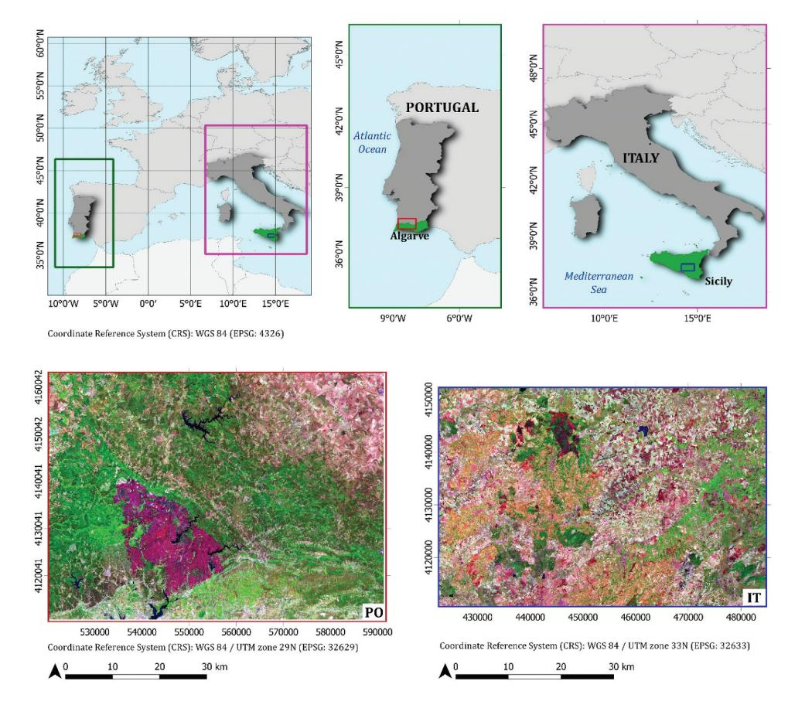
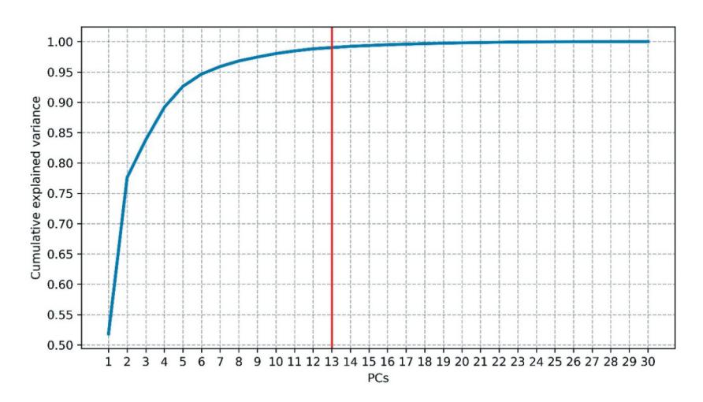
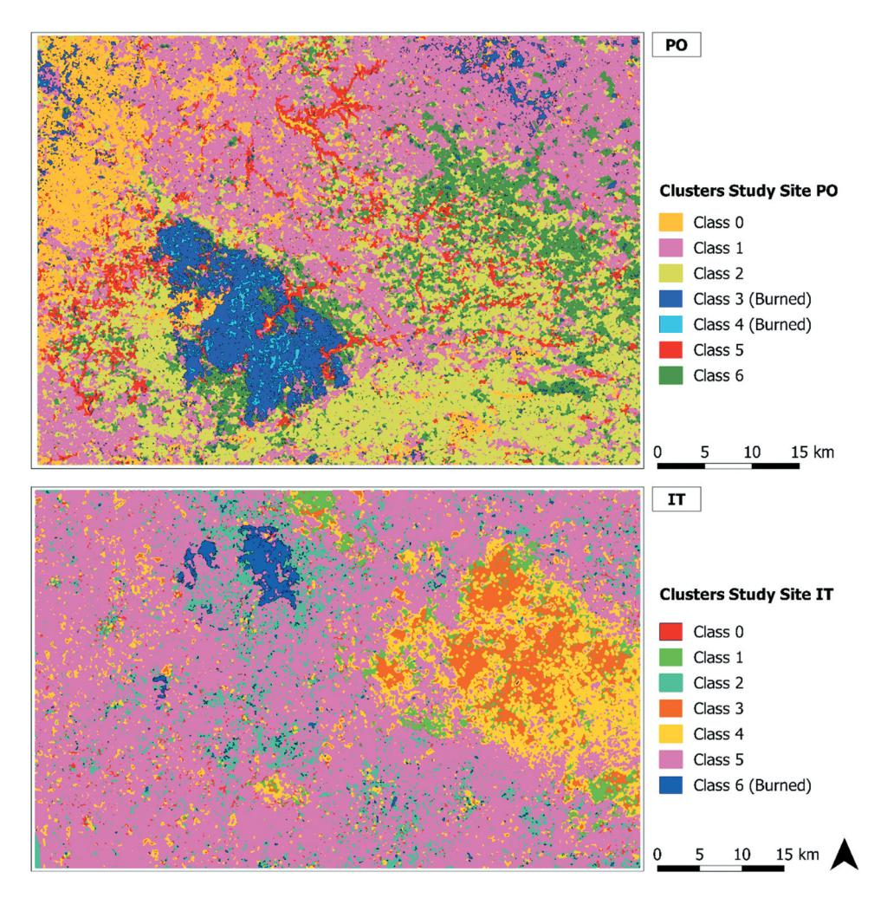
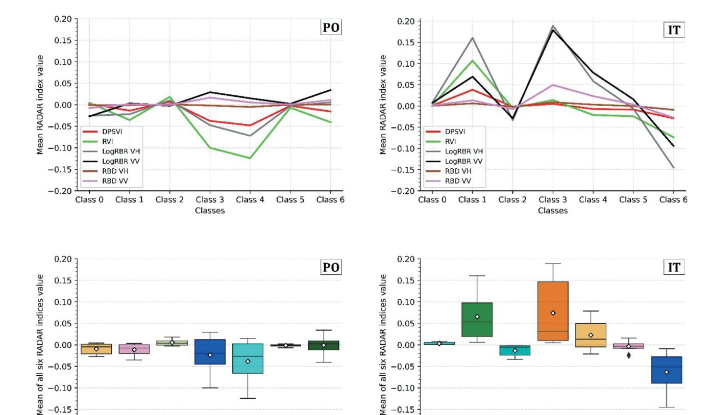
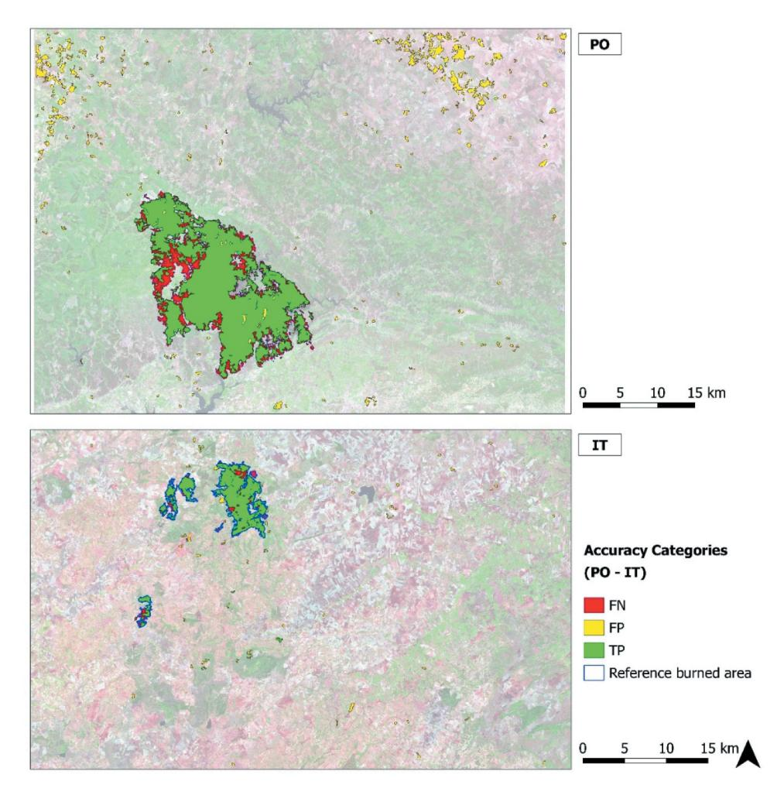

# **GIScience & Remote Sensing**

ISSN: 1548-1603 (Print) 1943-7226 (Online) Journal homepage: www.tandfonline.com/journals/tgrs20

# A workflow based on Sentinel-1 SAR data and open-source algorithms for unsupervised burned area detection in Mediterranean ecosystems

Giandomenico De Luca, João M.N. Silva & Giuseppe Modica

**To cite this article:** Giandomenico De Luca, João M.N. Silva & Giuseppe Modica (2021) A workflow based on Sentinel-1 SAR data and open-source algorithms for unsupervised burned area detection in Mediterranean ecosystems, GlScience & Remote Sensing, 58:4, 516-541, DOI: 10.1080/15481603.2021.1907896

To link to this article: <a href="https://doi.org/10.1080/15481603.2021.1907896">https://doi.org/10.1080/15481603.2021.1907896</a>

| +              | View supplementary material 🗷              |
|----------------|--------------------------------------------|
|                | Published online: 27 Apr 2021.             |
|                | Submit your article to this journal 🗗      |
| ılıl           | Article views: 5363                        |
| Q L | View related articles ☑                    |
| CrossMark      | View Crossmark data 🗹                      |
| 4              | Citing articles: 32 View citing articles ☑ |

# A workflow based on Sentinel-1 SAR data and open-source algorithms for unsupervised burned area detection in Mediterranean ecosystems

Giandomenico De Luca (p³, João M.N. Silva (pb and Giuseppe Modica (pa

aDipartimento di Agraria, Università degli Studi Mediterranea di Reggio Calabria, Reggio Calabria, Italy; bCentro de Estudos Florestais, Instituto Superior de Agronomia, Universidade de Lisboa, Lisbon, Portugal

#### **ABSTRACT**

This paper investigates the capability of the free synthetic aperture radar (SAR) Sentinel-1 (S-1) Cband data for burned area mapping through unsupervised machine learning open-source processing solutions in the Mediterranean forest ecosystems. The study was carried out in two Mediterranean sites located in Portugal (PO) and Italy (IT). The entire processing workflow was developed in Python-based scripts. We analyzed two time-series covering about one month before and after the fire events and using both VH and VV polarizations for each study site. The speckle noise effects were reduced by performing a multitemporal filter and the backscatter time averages of pre- and post-fire datasets. The spectral contrast between changed and unchanged areas was enhanced by calculating two single-polarization radar indices: the radar burn difference (RBD) and the logarithmic radar burn ratio (LogRBR); and two temporal differences of dual-polarimetric indices: the delta modified radar vegetation index (\( \Delta \text{VI} \)) and the delta dual-polarization SAR vegetation index (ΔDPSVI), all exhibiting greater sensitivity to the backscatter changes. The scene's contrast was enhanced by extracting the Gray Level Co-occurrence Matrix (GLCM) textures (dissimilarity, entropy, correlation, mean, and variance). A principal component analysis (PCA) was applied for reducing the number of the GLCM image layers. The burned area was delineated through unsupervised classification using the k-means clustering algorithm. A suitable number of clusters (k value) were set using a silhouette score analysis. To assess the accuracy of the resulting detected burned areas, an official burned area map based on multispectral Sentinel-2 (S-2) was used for PO, while for IT, a reference map was produced from S-2 data, based on the normalized burned ratio difference ( $\Delta$ NBR) index. Recall (r), precision (p) and the *F-score* accuracy metrics were calculated. Our approach reached the values of 0.805 (p), 0.801 (r) and 0.803 (F-score) for PO, and 0.851 (p), 0.856 (r) and 0.853 (F-score) for IT. These results confirm the suitability of our approach, based on SAR S-1 data, for burned area mapping in heterogeneous Mediterranean ecosystems. Moreover, the implemented workflow, completely based on free and open-source software and data, offers high adaptation flexibility, repeatability, and custom improvement.

#### **KEYWORDS**

SNAP-python (snappy) interface; *k*-means clustering; scikit-learn libraries; radar vegetation index (RVI); dual-polarization sar vegetation index (DPSVI)

#### 1. Introduction

In the Mediterranean basin, although wildfires are an integral part of natural ecosystems, their extent and impacts have increased in the last decades, with thousands of hectares of forest areas burned every year and with significant economic damages and landscape changes (Chuvieco, 2009; Gitas et al. 2012; Lanorte et al. 2012; Ruiz-Ramos, Marino, and Boardman 2018; San-Miguel-Ayanza et al. 2018; San-Miguel-Ayanza et al. 2019). Moreover, fires are a long-term threat, contributing to soil erosion and habitat degradation, releasing greenhouse gases (GHGs), affecting air quality and global climate (Chuvieco, 2009; Gitas et al. 2012; Rosa, Pereira, and Tarantola 2011).

Timely and accurate detection and quantification of burned areas are necessary to assess the damages, address the post-fire management, and implement medium and long-term territorial and landscape restoration strategies (Chuvieco et al., 2019; Lasaponara and Tucci 2019; Pepe et al. 2018). In this context, satellite remote sensing provides reliable tools and techniques for detecting and quantifying the extension of burned areas (Chu and Guo 2013; Chuvieco et al., 2019; Filipponi 2019; Lizundia-Loiola et al. 2020; Otón et al. 2019), permitting rapid, costeffective, temporally constant coverage and monitoring of large and less accessible regions (Pepe et al. 2018). Several studies concerning the localization and

mapping of fires' effects on vegetation were based on multispectral satellite data (Chuvieco et al., 2019; Filipponi 2019; Imperatore et al. 2017; Lizundia-Loiola et al. 2020; Mouillot et al. 2014; Otón et al. 2019). These sensors are very efficient for the purpose due to their sensitivity in the visible, near and short infrared (NIR and SWIR) bands to changes in the state of vegetation and soil (Pereira et al. 1999; Chuvieco et al., 2019; Meng and Zhao 2017; Tanase et al. 2020; Miller et al., 2007; De Santis et al., 2009; Fornacca et al., 2018; Filipponi et al., 2018; and Fernández-Manso et al. (2016). The optical spectral signature of the burned vegetation is unique and distinguishable from other disturbance factors or phenological changes in the short-term period after a fire. This is mainly due to the combined effect of diverse factors: the reduction of vegetation amount, the presence of coal and ash, changes in the moisture content and temperature, and the reflectance of soil. However, some of these elements tend to be attenuated in a few weeks or months after the fire event, in particular, where the fire severity was low (Pereira et al. 1999; Smith et al. 2005; Inoue et al. 2008), leading to a spectral confusion of burned areas with other disturbances or low unburned albedo surfaces (e.g. dark soils, water surfaces, shaded regions, plowed fields, timber harvesting) (Imperatore et al. 2017; Kurum 2015; Pepe et al. 2018; Fraser, Li, and Cihlar 2000; Stroppiana et al. 2015; Dijk et al., 2021; Rodman et al. 2021). Moreover, optical signal data are influenced by different phenological and physiological vegetation phases (e.g. seasonal senescence, leaf-off conditions), especially in the case of burned vegetation detection and monitoring at larger time intervals after the event (Gallagher et al. 2020; Verbyla, Kasischke, and Hoy 2008; Fraser, Li, and Cihlar 2000). In this context, the synthetic aperture radar (SAR) sensors are active systems that avoid some of these problems, proving to be an alternative or complementary data source for burned area detection and fire effects monitoring (Lehmann et al. 2015; Lasko 2019; Kurum 2015; Stroppiana et al. 2015; Tanase et al. 2011; Martinis et al. 2017; Chuvieco et al., 2019; Lasaponara and Tucci 2019). The response of the radar signal is affected by the ensemble of environmental variables (e.g. land cover, vegetation cover structure, moisture content, dielectric property of objects, size/shape, and orientation of the scatterers in the canopy) and variables related directly to the sensor (e.g. polarization,

wavelength, orbit) or the local surface properties (e. g. topography, orientation, surface roughness, and local incident angle) (Gimeno and San-Miguel-Ayanz 2004; Hachani et al. 2019; Imperatore et al. 2017; Lapini et al. 2020; Santi et al. 2019, 2017; Tanase et al. 2011, 2020, 2010). SAR data are more sensitive to the canopy structure than optical-based products (Martins et al. 2016). In detecting burned areas, SAR technology uses the variations in microwave backscatter caused by vegetation cover and soil structure and moisture content modifications, which implies a dielectric permittivity variation, thus providing an efficient system for discriminating events that cause changes in objects on the Earth's surface (Chuvieco et al., 2019; Donezar et al., 2019; Imperatore et al. 2017; Kurum 2015; Pepe et al. 2018; Santi et al. 2017; Tanase et al. 2011, 2020; Tanase, Kennedy, and Aponte 2015; Tanase et al. 2010; Zhou et al. 2019). Ruiz-Ramos, Marino, and Boardman (2018) noted that, in dry conditions, the backscatter signal tended to decrease even after several weeks after the fire, indicating how degraded conditions can persist significantly after the event. This highlights the efficiency of SAR data in monitoring burned areas and justifying the need for timely interventions to counteract the ecosystem degradation and avoid desertification phenomena (Hill et al. 2008; De Luis et al., 2001; Chuvieco, 2009).

The variation of the backscattering signal due to the fire's effect on reducing the crown structure can be of different evidence depending on the polarization. Generally, cross-polarized signals (vertical-horizontal, VH, and horizontal-vertical, HV) show a decrease in the backscatter response due to the consequent reduced volumetric dispersion contribution. Conversely, the change in the co-polarized backscatter coefficients (vertical-vertical, VV or horizontal-horizontal, HH) can be attributed to higher soil exposure (Imperatore et al. 2017). Due to this different interaction with the various aspects of the effects of fire on the environment, both types of polarization can be decisive in detecting burnt forest areas (Tanase et al. 2014). For other purposes, this aspect is already employed in vegetation monitoring through the use of radar-based polarimetric indices in which both types of polarization are used depending on the type of product and the SAR sensor used (Gururaj, Umesh, and Shetty 2019; Mandal et al. 2020; Nasirzadehdizaji et al. 2019). The radar vegetation

index (RVI) (Kim and Van Zyl 2009), full- or dual-polarimetric, is a well-established SAR index (Szigarski et al., 2018) and generally used in studies related to vegetation biomass growth (Kim et al. 2014), in the LAI (leaf area index) estimation (Pipia et al. 2019) or in the estimation of the water content of plants and soil (Kim et al. 2012; Trudel et al., 2012). Kim et al. (2012) demonstrated a high correlation between L-band RVI and other optical vegetation indices. The dual-polarization SAR vegetation index (DPSVI) (Periasamy 2018) also returned positive results for the study of plant biomass, demonstrating a good correlation with the normalized difference vegetation index (NDVI). However, single-polarization indices were also used with excellent results to map the burnt areas or fire severity (Lasaponara and Tucci 2019; Tanase, Kennedy, and Aponte 2015).

More generally, most of the studies explored the backscattering behavior after a fire in the Mediterranean environment (Imperatore et al. 2017; Kurum 2015; Minchella et al. 2009; Tanase, Kennedy, and Aponte 2015), but few of these have focused on the ability of SAR data to map the burned areas by measuring their accuracy with analytical methods (Belenguer-Plomer et al. 2019; Gimeno, San-Miguel-Ayanz, and Schmuck 2004; Gimeno and San-Miguel-Ayanz 2004; Lasaponara and Tucci 2019; Martinis et al. 2017; Zhang et al. 2019).

Several space missions provide satellite constellations operating SAR imaging dedicated to environment observation useful for fire monitoring purposes (Chuvieco, 2009; Chuvieco et al., 2019; Mouillot et al. 2014). Copernicus missions by the European Space Agency (ESA) provides free high spatial and temporal resolution SAR (S-1) and multispectral (S-2) data (ESA Sentinel Homepage 2020). The S-1 constellation comprises two polar-orbiting satellites (S-1A and S-1B) performing C-band (from 3.75 cm to 7.5 cm wavelength) radar imaging. The good spatial and temporal resolutions added to the free distribution make the Sentinel mission particularly suitable for risk monitoring and rapid mapping (Martinis et al. 2017). Several studies have demonstrated the sensitivity of the C-band to changes in the vegetation and environment affected by fire (Imperatore et al. 2017; Kurum 2015; Tanase et al. 2020, 2010).

One of the strengths of the S-1 and S-2 data is their high spatial and temporal resolution. The spatial resolution has a considerable effect on the detection of burnt areas and their subsequent monitoring, lowering the omission errors typical of the coarser resolution data in detecting the smallest areas and improving spectral discrimination (Verhegghen et al., 2016; Boschetti et al. 2015; Stroppiana et al. 2015; Belenguer-Plomer et al. 2019; Mouillot et al. 2014). The advantages become more evident when the acquisition revisit time of these products is a few days, allowing the monitoring of temporal trends at an appropriate temporal scale (Boschetti et al. 2015; Verhegghen et al., 2016; Gitas et al. 2012; Tanase et al. 2020).

Furthermore, ESA itself distributes the Sentinel application platform (SNAP) (ESA SNAP Homepage 2020), a free and open-source software platform containing the toolboxes necessary for pre-processing and processing Sentinel data. The SNAP toolboxes, initially Java-based, can also be accessed from the Python programming language (The Python Language Reference 2020), one of the most popular languages for remote sensing and scientific analysis, widely used in both operational and scientific domains (Hao and Ho 2019), through the ESA SNAP-Python (snappy) interface (ESA SNAP Cookbook 2020).

The present work aimed to develop a semi-automatic procedure for mapping burned areas in Mediterranean regions using SAR S-1 data and based on the *k*-means clustering algorithm for an unsupervised image classification approach. Therefore, supporting the state-of-the-art of SAR-based burned area mapping.

The k-means is one of the most straightforward iterative clustering algorithms, widely used in data mining and pattern recognition purposes (Dhanachandra et al., 2015; Nagpal, Jatain, and Gaur 2013; Jain 2010). One of the main difficulties for the kmeans cluster analysis is to set the more suitable number of clusters (k value) in the initialization phase. Among the different approaches proposed in the literature (Kodinariya and Makwana 2013), in our approach, we used the silhouette score (Rousseeuw 1987) to set the value of the *k* parameter, which statistically measures the average separation distance (dissimilarity) between points within neighboring clusters. The entire processing workflow (Figure 2), excluding accuracy assessment, was developed in Python-based open-source libraries and scripts, implementing ESA-snappy for image pre-processing

and Scikit-learn (Pedregosa et al. 2011) processing and classification. It consists of the following fundamental steps: 1) speckle-noise reduction by calculating the backscatter time average of pre- and post-fire datasets and then applying a multitemporal filter; 2) calculation of the radar burn difference (RBD) and the logarithmic radar burn ratio (LogRBR) single-polarization indices and the dual-polarimetric S-1 indices ( $\Delta$ RVI and  $\Delta$ DPSVI) in order to emphasize the areas of change; 3) gray-level co-occurrence matrix (GLCM) texture features extraction; 4) data reduction using the principal components analysis (PCA) transformation; 5) silhouette score analysis in order to set the k parameter value; 6) unsupervised classification using the k-means clustering algorithm.

To confirm the method's applicability, it was tested on two scenes representing two Mediterranean forest environments located in two different countries (Italy and Portugal). The validation of the classification maps was performed by comparison with reference maps based on S-2 Multispectral images and calculating accuracy metrics (recall, *r*, precision, *p*, and the *F-score*).

#### 2. Materials and Methods

#### 2.1 Study sites

The implemented methodology was tested in two Mediterranean areas of Southern Europe (Figure 1). The first is located in Algarve, the southernmost region of Portugal (37° 18′N; 08° 30′W), a forest area in the Serra de Monchique mountain range (study site PO). The second is located in the central area of Sicily (South of Italy, 37° 43′N; 14° 39′E), the "Rossomanno-Grottascura-Bellia" regional nature reserve (study site IT). The extent of the two study sites was obtained manually based on the overlapping area of the tiles of the various orbits of S-1. The two study sites extend to approximately 2550 km² (IT) and 3600 km² (PO). The

**Figure 1.** Study sites: in the top, location of the study sites in Europe and in the respective countries; in the bottom, the overviews of the two study sites (post-fire Sentinel-2 images, SWIR-NIR-Green false-color composite) where the burned areas are clearly visible (the dark-purple area in PO; the darker area in IT).

Figure 2. The workflow of the implemened approach.

sites are located at the same latitude and present very similar and comparable typical Mediterranean vegetation contexts. Most parts of the two study areas were dominated by genus Eucalyptus species (Eucalyptus spp.) and typical Mediterranean conifers (Pinus spp.), deriving mainly from artificial planting during the end of the 19th century and the 20th century. However, both areas study sites are also covered by areas with dense typical Mediterranean forest vegetation of secondary broad-leaved (ex. Quercus spp.) and coniferous trees, interspersed with sclerophyllous shrublands (Camerano, Cullotta, and Varese 2011; San-Miguel-Ayanz et al. 2016; Sistema Nacional de Informação Geográfica (SNIG) 2021). The PO study site also includes agricultural areas and pastures.

The events occurred in August from the third to the tenth, 2018, in the PO study site, covering 268.9 km2, while, in the IT study site, the fire occurred on 6 August 2017, covering an area of 38.51 km2. Regarding the Sicilian natural reserve, the fire also affected neighboring and similar forest areas outside its administrative boundaries. In the PO study site, fire affected the vegetation in a heterogeneous way at the spatial level, altering or removing the structure at various degrees, with a predominant crown fire occurrence, leaving residues of burns on the ground (ash and coal). In some places, where the severity was higher, the bare soil was exposed (Oom et al. 2018).

#### 2.2 Dataset

#### 2.2.1 Sentinel-1 dataset

The Sentinel-1A/B high-resolution ground range detected (GRDH) dual-polarized (VV and VH polarizations) time series, acquired in interferometric wide

(IW) mode, was searched through the Copernicus Open Access Hub (Copernicus Open Access Hub 2020). The spatial resolution of the product is 20 m × 22 m (ground range x azimuth), with a pixel spacing of 10 m x10 m (ground range x azimuth) on the image, corresponding to the mid-range value at mid-orbit altitude averaged over all sub-swaths (ESA Sentinel-1 User Guide 2016). The bulk downloading process was carried out using the aria2 command-line downloader (aria2 download utility Homepage 2020), allowing to automate and speed up the acquisition of huge datasets. In total, we acquired two S-1 image datasets, one for each of the two study sites, respectively. The images were acquired to cover a time frame of about a month before and after the event date during the summer fire season (July-September), taking into account the need for the absence of rain that could affect the backscatter signal. For the PO study site, the dataset was formed by eight images for the pre-fire period and five images for the post-fire period; for the IT study site, the prefire and the post-fire images were nine and five, respectively (Table 1).

#### 2.2.2 Reference data

As reference data for the PO study site, the burned area perimeters provided by Instituto de Conservação da Natureza e das Florestas (ICNF) based on S-2 satellite imagery (SNIG - Cartografia nacional de áreas ardidas, area ardita 2018, 2021) were adopted. The minimum extent of the mapped fires is 0.5 km2. Due to the insufficient quality of the official data (see the Supplementary material), we downloaded two Sentinel-2B Level-1 C images, acquired one before (sensing date: 2017/08/01, 09:50) and one after the

**Table 1.** Sentinel-1 dataset characteristics. The red line separates the images acquired before and after the fire occurrence.

| PO Study site |            |                 | IT Study site       |         |            |                 |                     |
|---------------|------------|-----------------|---------------------|---------|------------|-----------------|---------------------|
| Mission       | Orbit      | Product         | Sensing Date – Hour | Mission | Orbit      | Product         | Sensing Date – Hour |
| S-1B          | Ascending  | IW Level-1 GRDH | 2018/07/01 - 18:34  | S-1A    | Ascending  | IW Level-1 GRDH | 2017/07/05 - 17:04  |
| S-1A          | Ascending  |                 | 2018/07/07 - 18:35  | S-1A    | Descending |                 | 2017/07/06 - 05:04  |
| S-1A          | Descending |                 | 2018/07/08 - 06:35  | S-1B    | Descending |                 | 2017/07/12 - 05:04  |
| S-1B          | Ascending  |                 | 2018/07/13 - 18:34  | S-1A    | Ascending  |                 | 2017/07/17 - 17:04  |
| S-1A          | Ascending  |                 | 2018/07/19 - 18:35  | S-1B    | Ascending  |                 | 2017/07/18 - 16:55  |
| S-1A          | Descending |                 | 2018/07/20 - 06:35  | S-1A    | Ascending  |                 | 2017/07/24 - 16:56  |
| S-1B          | Ascending  |                 | 2018/07/25 - 18:34  | S-1A    | Ascending  |                 | 2017/07/29 - 17:04  |
| S-1A          | Ascending  |                 | 2018/07/31 - 18:35  | S-1B    | Ascending  |                 | 2017/07/30 - 16:55  |
| S-1A          | Ascending  |                 | 2018/08/12 - 18:35  | S-1B    | Descending |                 | 2017/08/05 - 05:04  |
| S-1B          | Ascending  |                 | 2018/08/18 - 18:34  | S-1A    | Ascending  |                 | 2017/08/17 - 16:56  |
| S-1A          | Ascending  |                 | 2018/08/24 - 18:35  | S-1A    | Ascending  |                 | 2017/08/22 - 17:04  |
| S-1A          | Descending |                 | 2018/08/25 - 06:35  | S-1A    | Descending |                 | 2017/08/23 - 05:04  |
| S-1B          | Ascending  |                 | 2018/08/30 - 18:34  | S-1B    | Ascending  |                 | 2017/08/23 - 16:55  |
|               | _          |                 |                     | S-1A    | Ascending  |                 | 2017/08/29 - 16:56  |

fire (sensing date: 2017/08/11, 09:50), respectively, in order produce the reference map for the IT event.

The two images were pre-processed (Section 2.4) and the normalized burn ratio (NBR) (Eq. 1) for the pre- and post-fire S-2 data and, consequently, their temporal difference represented by  $\Delta$ NBR index (Eq. 2) (Key and Benson 2006) was calculated:

$$NBR_{zj} = (NIR_{zj} - SWIR_{zy})/(NIR_{zj} + SWIR_{zj})$$
  
=  $(B8A_{zj} - B12_{zj})/(B8A_{zj} + B12_{zj})$  (1)

$$\Delta NBR = NBR_{prefire} - NBR_{postfire}$$
 (2)

where zi represents a fire-related time period (pre- or post-fire); NIR is the near infrared band that in this case was represented by the band B8A (865 nm) of S-2 data; SWIR is the short-wave infrared band represented by the band B12 (2190 nm) of S-2 data. These two bands are very sensitive to burned vegetation (Lanorte et al. 2012). For this reason, this index is generally used as a reference layer since it allows to better identify the perimeter of the burned areas than other methods (Ban et al. 2020; Donezar et al., 2018; Tanase, Kennedy, and Aponte 2015; Zhang et al. 2019; Kurum 2015; Tanase et al. 2010), in the absence of good quality official data. The shapefile used as reference was obtained by converting the binary map composed of pixels with  $\Delta NBR$  values greater than 0.1 (conventional burned/not-burned threshold (Keeley 2009). Moreover, the interpretation was visually strengthened and guided by using the RGB false-color combination (SWIR-NIR-Red). The IT reference shapefile was filtered, deleting all the polygons with an area less or equal to 0.05 km2 to reduce redundancy and make the data consistent with the PO.

#### 2.3 Processing libraries

The S-1 data pre-processing was carried out using the Sentinel-1 Toolbox implemented in ESA-SNAP v.7.0.4 (ESA SNAP Homepage 2020) and executed through Snappy (ESA SNAP Cookbook 2020), the SNAP-Python interface which enables accessing and managing the SNAP Java application programming interface (API) from Python. The application script was built on Python v.3.6.8 (The Python Language Reference 2020), a version compatible with the Snappy interface. The image processing and classification were

implemented in Scikit-learn v.0.23.1 (Pedregosa et al. 2011, Scikit-learn Homepage 2020), an open-source Python-based library that provides a collection of different data-processing modules concerning machine learning analysis and modeling (Hao and Ho 2019; Pedregosa et al. 2011). This library contains all the processing modules used in this study: the MinMaxScaler module (Section 2.5.1), the sklearn. decomposition.PCA module (Section 2.5.2), the sklearn.metrics.silhouette\_score module (Section 2.5.3) and the sklearn.cluster.KMeans module (Section 2.5.4).Image pre-processing and layers creation

The S-1 data pre-processing steps (Figure 2), carried out for both the two time-series datasets, started by applying the auto-downloaded orbit file, followed by thermal noise removal. The implemented process code is available as a repository on the GitHub platform. The web-link is in the Websites Section (GitHub Code repository 2021).

The images were then radiometric calibrated and converted to beta  $(\beta_0)$  noughts backscatter standard conventions. Due to the rough terrain topography of both study areas and consequently the presence of geometric and radiometric distortions, a radiometric terrain flattening (RTC processing), and a terrain correction were performed using a digital elevation model (DEM) obtained from the shuttle radar topography mission (SRTM) (Farr et al. 2007; Small 2011), presenting a spatial-sampling of 1 arc-second. The bilinear interpolation resampling method was used for both DEM and output image resampling. During the RTC processing, the images were converted from  $\beta_0$  to gamma ( $\gamma_0$ ) nought automatically. In contrast, in the terrain correction step, the images were projected to WGS84/UTM zone 29 N and 33 N for the PO study site and IT study site, respectively.

For each study site dataset, an image stack was made using the Create Stack Operator of Sentinel-1 Toolbox. The product geolocation was used as an initial offset method, and the extent of the master image was adopted on the slave images without resampling. The optimal master image for each dataset was chosen automatically by the tool. A multitemporal speckle Lee filter (Quegan et al. 2000; Santoso et al. 2015) of  $15 \times 15$  pixel window size was carried out to apply a first reduction of the radar speckle noise. Subsequently, the speckle reduction was improved by calculating the backscatter time

average (Lasaponara and Tucci 2019), separately for the images before and after the fire, for each polarization (VH and VV). Following the implemented preprocessing phase, four layers are obtained:

- 1.Pre-fire time average VH;
- 2.Pre-fire time average VV:
- 3.Post-fire time average VH;
- 4.Post-fire time average VV.

For both study sites, these individual layers were used to compute two single-polarization radar indices for change detection: the RBD (Eq. 3) (the difference between pre- and post-fire backscattered time average for each polarization) and the LogRBR (Eq. 4) (log-scaled ratio of the backscattering coefficients between pre- and post-fire for each polarization). This latter index is derived from the radar burn ratio (RBR) (Tanase, Kennedy, and Aponte 2015) used in change detection or fire severity detection (Lasaponara and Tucci 2019; Tanase, Kennedy, and Aponte 2015), scaled to logarithmic in order to optimize the noise distribution (Dekker, 1998).

The equations of the two indices are:

$$RBD_{xy} = Post - fireTimeAverage_{xy} - Pre - fireTimeAverage_{xy}$$
 (3)

$$\label{eq:logRBR} \begin{aligned} \textit{LogRBR}_{xy} &= \textit{log}_{10} \big(\textit{Post} - \textit{fireTimeAverage}_{xy} \\ & / \textit{Pre} - \textit{fireTimeAverage}_{xy} \big) \end{aligned} \tag{4}$$

where xy represents a specific polarization (VV or VH).

Besides, two dual-polarimetric radar vegetation indices, the radar vegetation index (RVI) (Eq. 5) proposed by (Kim and Van Zyl 2009) and modified for the S-1 dual-polarized SAR data (Gururaj, Umesh, and Shetty 2019; Mandal et al. 2020; Nasirzadehdizaji et al. 2019), and the dual-polarization SAR vegetation index (DPSVI) proposed by (Periasamy 2018) (Eq. 6) were computed for pre- and post-fire datasets, respectively:

$$RVI_{zj} = 4 \cdot_{TimeAverage} VH / \left(_{TimeAverage} VV +_{TimeAverage} VH\right)$$
 (5)

$$DPSVI_{zj} = (_{TimeAverage}VV + _{TimeAverage}VH) / _{TimeAverage}VV)$$
(6)

where zj represents a fire-related time period (pre- or post-fire).

Table 2. Name, group, and equation of used GLCM (Grey Level Co-occurrence Matrix) texture measures.  $P_{i,i}$  is the probability of values *i* and *j* occurring in adjacent pixels in the original image within the window defining the neighborhood. *i* and *j* are the labels of the columns and rows (respectively) of the GLCM: i refers to the digital number value of a target pixel; *i* is the digital number value of its immediate neighbor.  $\mu$  is mean and  $\sigma$  the standard deviation.

| GLCM Features | Group       | Equation                                                                                                                                  |
|---------------|-------------|-------------------------------------------------------------------------------------------------------------------------------------------|
| Dissimilarity | Contrast    | $\sum_{i,j=0}^{N-1} P_{i,j}  i-j $                                                                                                        |
| Entropy       | Orderliness | $\sum_{i,j=0}^{N-1} -\ln(P_{i,j})P_{i,j}$                                                                                                 |
| Correlation   | Statistics  | $\sum_{i,j=0}^{N-1} P_{i,j} \left[ \frac{(i-\mu_i) \left(i-\mu_j\right)}{\sqrt{\left(\sigma_i^2\right) \left(\sigma_j^2\right)}} \right]$ |
| Mean          |             | $\mu_{i} = \sum_{j=1}^{N-1} i(P_{i,j}); \mu_{j} = \sum_{j=1}^{N-1} j(P_{i,j})$                                                            |
| Variance      |             | $\sigma_{i}^{2} = \sum_{i,j=0}^{N-1} P_{i,j} (i - \mu_{i})^{2}; \sigma_{j}^{2} = \sum_{i,j=0}^{N-1} P_{i,j} (j - \mu_{j})^{2}$            |

From these two vegetation indices, the relative temporal difference was calculated (ΔRVI and  $\Delta$ DPSVI) (Eq. 7–8):

$$\Delta RVI = RVI_{post} - RVI_{pre} \tag{7}$$

$$\Delta DPSVI = DPSVI_{post} - DPSVI_{pre}$$
 (8)

For the RBDVH, RBDVV, LogRBRVH, LogRBRVV, ΔRVI and ΔDPSVI index layers, five GLCM (Grey Level Co-occurrence Matrix) texture features (Haralick 1979; Haralick, Shanmugam, and Shanmugam 1973) were computed for each of the two study sites (Table 2) fixing the size of the search window to  $11 \times 11$  pixels. The five GLCM textures were computed to exhibit a more marked contrast between changed and unchanged areas, adding extra spatial information to support classification accuracy performance (Hall-Beyer 2017; Li et al. 2014).

The GLCM process originated a dataset consisting of 30 layers for each study-site, which constituted the input data for the next processing workflow step.

The S-2 images downloaded to generate the IT reference data were pre-processed using the Sentinel-2 Toolbox. These were first resampled to 10 m  $\times$  10 m pixel size using the band B4 (Red; 664.6 nm) as reference source size and the bilinear interpolation as an upsampling method. Subsequently, the images were reprojected and clipped on the same area of the correspondent S-1 data. The Level-2A products (Bottom-of-

Atmosphere) were generated using Sen2Cor v2.8 processor (ESA sen2cor Homepage 2020).

#### 2.4 Data preparation

#### 2.4.1 Data normalization

The data normalization in the same continuous scale range [0–1] was carried out for all the S-1 single layers (Eq. 9). This operation converts the original values of the input data into the new range through rescaling. This step aimed to equalize the input features, reducing the influence of differences in their intervals, making them comparable in numerical values and optimizing the learning algorithm process (Angelov and Gu. 2019; Subasi 2020). The normalization was carried out using the specific MinMaxScaler module contained in scikit-learn, given by:

$$x_{norm} = \frac{x - x_{min}}{x_{max} - x_{min}} \tag{9}$$

where  $x_{norm}$  is the new normalized value, x is the value to be normalized,  $x_{min}$  and  $x_{max}$  are the smallest and the highest value of the data (feature range).

# 2.4.2 Data reduction: Principal Component Analysis (PCA) transformation

Considering the high number of input data layers, a principal component analysis (PCA) was performed to reduce the dimension of the dataset and select the optimum layer subset without losing the essential information (total variance) for image classification (Gimeno, San-Miguel-Ayanz, and Schmuck 2004; Richards 2013). The PCA module provides a linear dimensionality reduction based on singular value decomposition (SVD) in order to project the data in a lower-dimensional space (eigenspace) and derive the new principal components (PCs) representing the directions of maximum variance of the eigenspace (Subasi 2020). In this study, the first transformed PCs that explained a high enough cumulative variance (greater than or equal to 99%) were considered the optimal reduced representation of the original dataset and used as input in the classification process.

#### 2.5 Image Classification

#### 2.5.1 Classification algorithm (k-means algorithm)

The burned areas' classification was carried out using the popular k-means algorithm, a data clustering method introduced by James MacQueen (1967). It is known as

one of the simplest and fastest unsupervised machine learning algorithms (Dhanachandra et al., 2015; Nagpal, Jatain, and Gaur 2013; Soni and Patel 2017), widely used remote sensing applications (Celik 2009; Dhanachandra et al., 2015; Li et al. 2014; Phiri and Morgenroth 2017; Rehman et al. 2019; Senthilnath et al. 2017). Given a dataset, the algorithm is based on the grouping (clustering) of the pixels with homogeneous characteristics in a predefined number (k) of clusters. The homogeneity of the pixels is defined by the minimum distance between their value and the single cluster's centroid. The algorithm's initialization starts with a first random definition of the k centroids, optimized by the kmeans++ method (Arthur and Vassilvitskii 2007), and is based on the weighted distribution probability for the definition of the centroids. Then, it proceeds with the first assignment of each pixel to the nearest centroid, in terms of values' Euclidean distance, and therefore with the first *k* clusters' generation. After the first initialization of the *k* centroids, each of them is recalculated many times over so that the dataset belonging to a cluster can be reassigned to the new cluster, obtaining the most appropriate assignment of each pixel to the clusters. This process is repeated iteratively until the centroids' arrangement ceases to change, the tolerance or error value is satisfied, or until the maximum number of defined iterations is reached (Dhanachandra et al., 2015; Soni and Patel 2017). The centroid of a cluster is the point to which the sum of distances from all the pixels in that cluster is minimized. Therefore, the kmeans could be defined as an iterative algorithm that minimizes the value of the sum of squared errors (SSE) of distances from each object to its cluster centroid (Dhanachandra et al., 2015). The k-means algorithm used in this work was based on a combination with the expectation-maximization (EM) model (Dempster et al., 1977).

# 2.5.2 Definition of a suitable number of clusters using the Silhouette Score

One of the main issues at initializing a clustering algorithm is setting the optimal number of clusters (k parameter) (Kodinariya and Makwana 2013). To solve this issue, we used the silhouette score approach (Rousseeuw 1987), which is based on the separation distance between clusters, according to the following formula (equation 10):

$$SilhouetteScore = (b_i - a_i)/max(a_i, b_i)$$
 (10)

where i is the value of a single-pixel contained in a cluster, a is the average distance (dissimilarity) between i and all other objects of the same cluster, and b is the average distance between i and the nearest cluster of which i is not a part (Rousseeuw 1987). This coefficient measures how close each point in a cluster is to the neighboring clusters' points for a given number of clusters. The computation of its average results is a simple method to address k value (Rousseeuw 1987). We calculated the mean of the silhouette score for different k values (k-space, from 2 to 20) using the "relative" module provided in scikit-learn. To save on computation time, the calculation was performed on a sample of 100,000 points randomly distributed over the entire area of the two datasets. The score value can vary in a range from 1 (maximum separation: well clustered, best k-value) to -1 (minimum separation: misclassified, worst k-value).

### 2.5.3 Classification application and post-process enhancement

For each of the two transformed and reduced datasets. an unsupervised classification was carried out using the *k*-means algorithm. The number of clusters (*k* parameter) was set according to the silhouette score analysis result, while the default number of iteration (300) was left.

In order to identify the classes representing the real burned areas, the mean value of each radar index for each class was computed and plotted.

Despite the noise reduction operations, the SAR data still presents some outliers, which are persistent due to the signal's intrinsic characteristics. Moreover, since we used several images for each dataset covering a time frame of about one month before and one month after the fire event, different surface-changes could have occurred (small fires, agronomic operations, etc.), leading to an erroneous assessment of commission errors. Therefore, following the raster data's vectorization, preand post-fire scenes were filtered, eliminating clusters covering an area less or equal to 0.05 km2 (minimum mapping unit of reference data; see Section 2.2.2 Reference data).

#### 2.6 Accuracy Assessment

The resulting classification maps were compared to the respective reference burned areas to assess their accuracy.

The accuracy analysis regarded only those classes corresponding to the actual burned area, excluding the other classes. We chose these classes by observing the distribution of the average value of each of the six radar indices for each class. The classes that did not correspond to the burned area were aggregated together as "unburned class." Both the classified and the reference images were vectorized to facilitate their analytical comparison. Therefore, after their superimposing, each classified pixel was labeled into one of the following categories (pixel-based accuracy assessment) (Goutte and Gaussier 2005; Modica et al. 2020; Shufelt 1999; Sokolova, Japkowicz, and Szpakowicz 2006):

- True Positive (TP): when a pixel classified as burned corresponded to burned class in the reference data (pixel correctly classified).
- False Negative (FN): when a pixel representing burned in the reference data was classified as not-burned (pixel not detected).
- False Positive (FP): when a pixel classified as burned did not correspond to burned class in the reference data (pixel erroneously detected).

After counting the number of pixels belonging to one of the three categories for each image, the recall (r), Precision (p), and F-score accuracy metrics were calculated (Equations. 11–13) (Goutte and Gaussier 2005; Shufelt 1999; Sokolova, Japkowicz, and Szpakowicz 2006; Sokolova and Lapalme 2009):

$$r = \frac{|TP|}{|TP + FN|} \tag{11}$$

$$p = \frac{|TP|}{|TP + FP|} \tag{12}$$

$$Fscore = 2.\frac{r.p}{r+p} \tag{13}$$

where r and p are functions of omission and commission errors. Their opposites, 1-r and 1-p, indicate the omission and commission errors, respectively. The Fscore measures the overall accuracy using the harmonic mean of commission and omission errors. The r, p, and F can be in a range from 0 (total misclassification) to 1 (perfect classification) (Goutte and Gaussier 2005; Modica et al. 2020; Sokolova and Lapalme 2009).

Figure 3. The S-1 indices (RBDVH, LogRBRVH,  $\Delta$ RVI, RBDVV, LogRBRVV, and  $\Delta$ DPSVI) were obtained in the PO dataset pre-processing steps. For each of these indices, the GLCM (Grey Level Co-occurrence Matrix) texture features were calculated.

**Figure 4.** The S-1 indices (RBDVH, LogRBRVH, ΔRVI, RBDVV, LogRBRVV and ΔDPSVI) were obtained in the IT dataset pre-processing steps. For each of these indices, the GLCM (Grey Level Co-occurrence Matrix) texture features were calculated.

**Figure 5.** The cumulative variance explained by the principal components (PCs) for the PO study site. The red line identifies the first PCs that reached a cumulative variance of 0.99.

**Figure 6.** The cumulative variance explained by the principal components (PCs) for the IT study site. The red line identifies the first PCs that reached a cumulative variance of 0.99.

#### 3. Experimental Results

#### 3.1 Data preparation

To detect burned areas, the radiometric changes that occurred after the fire had to be highlighted. For this reason, radar vegetation indices were calculated, of which two were single-polarization (RBD and LogRBR) and two dual-polarimetric (RVI and DPSVI). Unlike the RBD and LogRBR indices that already express temporal differences, the respective  $\Delta$ RVI and  $\Delta$ DPSVI indices had to be derived from the original RVI and DPSVI. The RBD, LogRBR,  $\Delta$ RVI, and  $\Delta$ DPSVI, used as the input layer for successive GLCM computation step, are shown in Figures 3 and 4 for the PO, and IT study sites, respectively.

#### 3.2 PCA transformation

The PCA was performed on the entire dataset to reduce their dimension. The cumulative variance explained by the PCs is reported in Figures 5 (PO) and 6 (IT). As shown, the PO dataset reached the threshold (0.99) at the 9th PC, while the IT dataset expressed the same cumulative variance value at the 13th PC. These PCs, which for each dataset have reached the threshold and are represented by transformed images, have been chosen as input layers in the subsequent related processes.

#### 3.3 Silhouette score

Figures 7 (PO) 8 (IT) show the trend of the averaged silhouette score calculated on relative PCA outputs for

Figure 7. Silhouette score values, for the PO dataset, for a k-space range (k values) between 2 and 20.

Figure 8. Silhouette score values, for the IT dataset, for a k-space range (k values) between 2 and 20.

a k-space ranging from 2 to 20 clusters and for a sample of 100,000 random points. The highest values resulted from lower k-values, with the maximum value described by k=2 for both datasets. The next highest value was found when k=7 in both datasets with a Silhouette score of 0.166 and 0.191 for PO and IT, respectively.

#### 3.4 Image Classification and accuracy assessment

The clusters resulting from the two datasets are shown in Figure 9. The number of classes resulting from the classification was equal to seven for both study sites, resulting from the silhouette analysis, which defined k parameter setting.

From a first visual interpretation of the entire classified maps, the association between the resulting classes and the burned areas is evident if these are visually compared with the radar indices of Figures 3 and 4.

Figure 10 shows the distribution of the mean value of each of the six radar indices for each class (at the top). At the bottom is shown the mean of all the six indices for each class. For the PO study site, the RBD (both polarizations) and the LogRBR\_VV maintain stable behavior for all classes and do not allow class discrimination. The LogRBR\_VV shows a slight increase in classes 3, 4 and 6, while the RBD W in classes 3 and 4. The other three indices clearly show different behavior in classes 3 and 4 with lower values, especially observing the RVI and observing the IT plots, the LogRBR (both polarization), and the RVI lower value in class 6. Classes 1 and 3 are characterized by a positive peak given by some indices: DPSVI, RVI, LogRBR\_VH-VV and RBD\_VV, respectively. Also, in this case, the RBD\_VH had stable behavior between the classes.

In Figure 10, it is possible to clearly distinguish the classes that have lower and negative values and a mean below -0.02 for both study sites. Since we are using temporal difference indices, we

assume that classes 3, 4 (PO) and 6 (IT) represent the burned areas. In total, considering only these fire-related classes, they covered an area equal to 300.10 km2 in PO (classes 3 and 4 together) and 51.59 km2 in IT (class 6). However, we noted the presence of several small areas distributed over all the scenes. For this reason, all the single clusters with a size less or equal than 0.05 km2 belonging to the fire-related classes were excluded. This threshold corresponds to the minimum mapping unit of the reference data used in the accuracy assessment. The remaining filtered burned clusters covered an area of 269.67 km2 in PO and 43.28 km2 in IT.

We filtered the classification results and compared the pixels belonging to the fire-related classes with the reference burned area, according to the three accuracy categories (TP, FN, and FP) to analyze the classification's accuracy. Table 3 shows the distribution of the number of pixels in each of the three accuracy categories.

A visual overview showing the spatial distribution of the accuracy assessment categories (TP, green; FP, yellow; FN, red) is presented in Figure 11 for both study areas. In the same figure, the perimeter of the S-2 based reference burned area, used for accuracy assessment, has been superimposed (blue border).

The r, p and F-score accuracy metrics were calculated. The results show that the highest values for p and r and the F-score were reached by the IT classification, with 0.0.851, 0.0.856 and 0.853, respectively, compared to those produced by the PO dataset, which are 0.805, 0.801 and 0.803, respectively.

Figure 9. Classification results, showing the seven classes for both study areas. The blue clusters (classes 3-4 in the PO, and 6 in IT) represent the burned areas' classes.

Figure 10. The figure shows the distribution of the mean value of each radar index across all six classes for both study sites (PO and IT) (at the top). At the bottom, boxplots of indices values for each class are reported (the white rhombus marker indicates the mean values).

-0.10

0.15

-0.20

Class 0

Class 1

Class 2

Class 3

Classes

Class 4

Class 5 Class 6

Mean

#### 4. Discussion

-0.10

-0.15

-0.20

Class 0

Class 1

Class 2

Class 3

Classes

Class 4

Class 5

#### 4.1 SAR dataset and indices

SAR data entails a more complicated extraction, management and understanding of the extracted information. Compared to the generally more stable accuracy performance of optical data, under optimal time conditions, it must be considered that the research on these is much more consolidated over time, and numerous methodologies of analysis and optimizations have been developed (Chuvieco et al., 2019; Pereira et al. 1999; Meng and Zhao 2017; Tanase

Table 3. Distribution of each dataset's pixels and the three accuracy categories (true positive, TP; false negative, FN; false positive, FP) for both study sites (PO and IT).

| GLCM Features | PO     | IT     |
|---------------|--------|--------|
| TP            | 80.47% | 85.57% |
| FP            | 19.95% | 14.94% |
| FN            | 19.53% | 14.43% |

et al. 2020; Miller et al., 2007; De Santis et al., 2009; Fornacca et al., 2018; Filipponi et al., 2018; and Fernández-Manso et al. (2016). Tanase et al. (2020) also stated that the development of methodologies for detecting burned areas from SAR sensors is infancy compared to the optical sensors. Further contributions in this field could improve the results. Some studies using deep learning with SAR data, have already shown that accuracy can be high (Ban et al. 2020). We consider that the two types of data should be used as complementary to fill each other's gaps and optimize their usage potential (Lehmann et al. 2015; Stroppiana et al. 2015; Lasko 2019).

Concerning the number and dates of images used, we have decided to include approximately one month before and one month after the event, represented, in this case, by the more drastic months of the summer fire season (July and August). Since the events under study did not occur precisely on August 1, this resulted in a different number of pre- and post-fire images. We have

**Figure 11.** The maps show the spatial distribution of the three accuracy categories, true positive (TP, green), false positive (FP, yellow), false negative (FN), for IT and PO study sites, using the reference layer (blue) derived from S-2 data.

not included additional images (i.e. from September) to avoid rain interference, which would have involved further analyses in interpreting the noise. The imbalance in the number of pre- and post-fire images may affect their time average, an issue not explored in the present study. Nevertheless, even with a small number of post-fire images, the aim of reducing speckle noise has been fulfilled.

This study aimed to test and establish the work-flow's functionality, focusing mainly on extracting valid and useful information from the SAR data. The approach has been applied only to two regions of the Mediterranean, presenting similar vegetation, climate, and latitude. If further tested and optimized, this method could be easily applicable and with good results, at least in the Mediterranean environments.

The S-1 radar indices (Equations 3, 4, 7, and 8), calculated from the time-averaged data layers and

for both study sites (PO and IT), present a well-defined area of low backscatter (darker area), indicative of the fire occurrence. This is in agreement with several research works (e.g. Belenguer-Plomer et al. 2019; Carreiras et al. 2020; Imperatore et al. 2017; Tanase, Kennedy, and Aponte 2015; Tanase et al. 2010; Zhang et al. 2019) that show how a progressive fall in the cross-polarized intensity of the radar backscatter is always observed after a forest fire. This is related to the forest structure's loss, leading to a less reflection of the C-band signal (Carreiras et al. 2020; Chuvieco et al., 2019; Donezar et al., 2019; Imperatore et al. 2017; Kurum 2015; Pepe et al. 2018; Santi et al. 2017; Tanase et al. 2010, 2011, 2020, Tanase, Kennedy, and Aponte 2015; Zhang et al. 2019), and the soil changes following the fire occurrence (Hachani et al. 2019; Kurum 2015; Martinis et al. 2017; Ruiz-Ramos, Marino, and Boardman 2018; Tanase et al. 2010).

A clear difference is observed in the PO study site in the co-polarized indices (RBD and LogRBR) obtained from VV polarization. The corresponding burned areas are represented by lighter pixels (higher backscatter), but in any case, always distinguishable from the rest of the scene. This is partly observable in the upper plots of Figure 10. However, it must be taken into account that they represent the classes deriving from the classification and therefore affected by commission and omission errors. This particularity is not observed in the IT study site, demonstrating a different property of the signal from each polarization and the possibility of having a different result, depending on a multitude of local conditions as stated in several studies (Belenguer-Plomer et al. 2019; Donezar et al., 2019; Imperatore et al. 2017; Tanase et al. 2010). This is because polarizations have a different interaction with vegetation scattering components based on their size and space orientation. Standing vertical tree trunks depolarize the incoming waves with different strengths than branches or leaves (Flores et al. 2019). The total backscatter coefficient from vegetation surface is the combination of the scattering components given by the volume of the stand, by the volume of the soil, and the combination of these two (Richards 2009; Flores et al. 2019). The backscatter from co-polarization is typically stronger for rough surface scattering components (e.g. bare ground). The cross-polarized backscatter form vegetation is associated with the distribution of volume scatterers from leaves and small branches (Flores et al. 2019; Carreiras et al. 2020). So, the cross-polarized backscatter coefficient has higher sensitivity for volume changes, decreasing with the increase of burn severity at all frequencies due to the destruction of the canopy volume component (Tanase et al. 2010; Imperatore et al. 2017; Carreiras et al. 2020). The co-polarized signal VV is not so markedly affected by the loss of the canopy components but is affected by greater exposure of the underlying soil after the destruction of the canopy. As hypothesized by other studies (Tanase et al. 2010; Imperatore et al. 2017), this can result in a different and opposite behavior compared to the cross-polarized signal, with an increase in backscattering. The sensitivity of the signal to the vegetation structure also depends on the wavelength. It determines the signal's penetration capacity (the longer the band, the lower the frequency, the more the radar waves can penetrate the canopy of trees) and

diffusion from the smaller or larger woody components of the forest. Therefore, it affects the degree of interaction of the signal with the underlying components such as the soil, whose contribution increases after disastrous events such as a fire (Saatchi et al., 2016; Hosseini et al., 2017; Flores et al. 2019). The combined use of both polarizations, using dual-polarimetric difference indices (ΔRVI, ΔDPSVI), represents an effective tool for integrating the information. In general, the use of both polarizations (VV, VH) allows capturing the volume and structure variability of different sizes and orientations of the vegetation (Flores et al. 2019). Polarization impacts differently how each element of the surface affects the backscatter. Therefore, the use of combined polarization can help improve the retrieval of more information (Santi et al. 2019; Tanase et al. 2014), and it has already been shown how polarimetric data have high sensitivity toward changes in vegetation conditions (Engelbrecht et al. 2017; Chang, Shoshany, and Oh 2018; Mandal et al. 2020). Chen, Jiang, and Moriya (2018) show how indices that combine cross- and co-polarized bands had better performance than single-polarization when used to map post-fire regrowth in different recovery intervention conditions. Plank et al. (2019) investigated the different behaviors of the quad-polarimetric Lband SAR backscatter properties during active fire and post-fire conditions. Moreover, a series of polarimetric decomposition procedures, including the RVI index, were computed to map the burned scar with an overall accuracy similar to the one we obtained in this research. Martinins et al. (2016) used several dual- and quad polarimetric L-band indices for monitoring forest degradation after the fire, demonstrating that these are very sensitive to forest structure and its modifications. However, none of them was able to discriminate between the intermediate levels of degradation. Dos Santos et al. (2013) show that L-band polarimetric indices can be applied to quantify and monitor the carbon stocks in the tropical forest affected by the fire. Other studies investigated the capability of dominant scattering mechanisms in fully polarimetric data to detect burned areas using polarimetric decompositions models (Engelbrecht et al. 2017; Goodenough et al. 2011; Czuchlewski et al., 2005; Martins et al. 2016; Tanase et al. 2014). All these

researches obtained high accuracy values, demonstrating that polarimetric data increase SAR measurement sensitivity for scar detection and classification.

Although the potential of polarimetric indices and backscatter decomposition models has been proven in these mentioned research, some of these dealt with the L-band use (Chen, Jiang, and Moriya 2018; Plank et al., 2019; Martins et al. 2016; Dos Santos et al., 2013). Our research is the first to deal with  $\Delta RVI$  and DPSVI in mapping burned areas using S-1 C band data to our best knowledge. Therefore, more research should be carried out to investigate this issue deeply.

## 4.2 GLCM texture extraction and PCA transformation

For GLCM texture calculation, the square processing window size is crucial since it defines the number of neighbor pixels used for texture calculations (Coburn et al. 2004). GLCM analysis results largely depend on the relationship between the processing window's size and the objects' size and variability across the image (Coburn et al. 2004).

Several studies confirmed that small sizes could miss important information for texture characterization, failing to capture enough surface patterns, while too large windows could introduce systematic errors (Dorigo et al. 2012; Hall-Beyer 2017; Coburn et al. 2004; Franklin et al., 2020; Murray, Lucieer, and Williams 2010; Caridade, Marçal, and Mendonça 2008). This last hypothesis occurs when the window is too large, overlapping more land-use class edges (Franklin et al. 2000; and Dorigo et al. (2012). Coburn et al. (2004) and Murray, Lucieer, and Williams (2010) demonstrated that using medium-high window size (between  $7 \times 7$  and  $15 \times 15$  pixels), there are improvements in the overall accuracy. In our case, small fires (i. e. less than 0.5 km2) were not considered. Moreover, given our research's purpose (i.e. a binary detection of burned/not burned areas), delta indices are useful, considering that they highlight only those areas where changes occurred. Indeed, these indices do not provide any information on the actual land use cover. We fixed the window size to  $11 \times 11$  pixels following these considerations and based on Muthukumarasamy et al. (2019) research aimed at land cover classification using S-1 and S-2 data. However, if small and scattered burned areas have

to be mapped, smaller window sizes should be considered. Similar consideration could be addressed about the window size used for the spatial averaging in each image of the time-series in multitemporal speckle filtering (Quegan et al. 2000).

The datasets transformed and reduced by the PCA can be considered an optimal representation subset of the original ones. On the one hand, it maintains the most useful information in a few layers, speeding up the calculation process. On the other hand, the linear transformation performed on the original images, as a function of the maximum variance expressed, created new, improved imagery, able to discriminate better the changes caused by the fire, and therefore, optimizing the unsupervised classification, as already pointed out by Gimeno, San-Miguel-Ayanz, and Schmuck (2004).

The first PC represents the maximum proportion of the original dataset variance (Fung and Ledrew 1987). In our case, we used the first PCs obtained that explained a cumulative variance larger than 99%, which revealed with high contrast the area affected by the fire. This is evident in the first PC, as shown in Figures S2 and S3 (Supplementary material). This aspect is important so that the various characteristics of the scene can be circumscribed and classified within the various classes, directly influencing the values obtained in subsequent analyses.

# 4.3 K-means classification and accuracy assessment

The silhouette score in the preliminary choice of the most suitable number of clusters has solved the wellknown problem of parameter setting that allowed reducing the algorithm's implementation time, that is, avoiding a series of trial-and-error tests. It is evident from the graphs shown in Figures 7 and 8 that for lower k values (<10), the silhouette score and, therefore, the clusters' separation is more significant. A value of 7 seemed to be optimal to discriminate the various areas that characterized the scene, which was an expression of the different surface change levels.

The *k*-means unsupervised classification was applied to the transformed dataset (PCs) to discriminate the burned areas without having prior knowledge of the characteristics and the number of classes

characterizing the surface background. Although the easy to use and speed execution time characterizing the standard k-means algorithm has been widely recognized (Nagpal, Jatain, and Gaur 2013), extensions like the k-means++ (Arthur and Vassilvitskii 2007) improved the reliability of the obtained classifications. Indeed, the standard k-means algorithm is very prone to the different numerical distribution of the individual layers' values, making up the datasets, to the so-called outliers with extreme values. The choice of a centroid is generally random in this algorithm, leading to the definition of always different centroids, even in identical and repeated conditions, limiting the results' repeatability. Therefore, all data must be reported on the same scale. In our case, a normalization (Eq. 9) of all layers values in the range [0, 1] has been carried out. Normalization is a crucial step when the different input data have different value ranges. However, although MinMax normalization is one of the most common ways to rescale the data, it keeps all the data values, including any outliers that can influence the result (Kandanaarachchi, Muñoz, and Hyndman et al. 2020). These are very different values from the rest of the other data values, and the k-means algorithm is sensitive to them, affecting its performance (Gan and Ng 2017; Hautamäki et al. 2005). These arise from common noise or errors in remotely sensed data (Liu et al. 2017) with anomalous values concerning the surrounding pixels (Alvera-Azcárate et al. 2012). Several methods of outliers detection and correction are present in the literature for general data analysis (Kandanaarachchi, Muñoz, and Hyndman et al. 2020; Campos et al. 2016; Angelov et al. 2019; Gan and Ng 2017; Hautamäki et al. 2005) and specific remote sensing contexts (Liu et al. 2017; Alvera-Azcárate et al. 2012). Gan et al. (2017) reported a series of related work concerning outliers detection, dedicated to cluster analysis and specific to the k-means algorithm. Given the good results of the first test of the classification, this topic has not been addressed in this study case, but it could be further investigated in future work developments.

Since the quality of the final clustering results depends on the arbitrary selection of initial centroid (Dhanachandra et al., 2015), the *k-means++* (Arthur and Vassilvitskii 2007), and implemented in the scikitlearn module, optimize the standard *k*-means algorithm by choosing the initial cluster centroids basing

on the weighted distribution probability metric and only the first centroid is randomly selected. This seeding method yields a better performing algorithm and consistently finds a better clustering with lower resources than the standard *k*-means (Arthur and Vassilvitskii 2007).

To estimate SAR S-1 data accuracy in detecting burned areas, the classified maps were compared to the relative reference burned area obtained from S-2 images. From a first visual assessment of the classified maps (Figure 11), the 3, 4 (in IT) and 6 (in PO) classes seem to have detected a large part of the relative affected area, a condition confirmed by observing TPs' distribution in Figure Nevertheless, the *F-score*, *p* and *r* accuracy metrics are those that give an analytic and objective picture of the classification algorithm performance (Modica et al. 2020; Shufelt 1999). The results indicated a satisfying global accuracy, represented by the *F-score*, for both the study sites, similar to other works using only the SAR data (Belenguer-Plomer et al. 2019; Carreiras et al. 2020; Donezar et al., 2019; Gimeno, San-Miguel-Ayanz, and Schmuck 2004; Gimeno and San-Miguel-Ayanz 2004; Lasaponara and Tucci 2019; Zhang et al. 2019; Goodenough et al. 2011).

However, some commission and omission errors occurred. It should be noted that the omission and commission errors, represented by the opposite of r and p, respectively, presented similar values in both study sites. Figure 10 shows how most FPs are located in scattered areas throughout the scene and probably represented by local surface changing conditions (i.e. topography, roughness, humidity, local incidence angle) affecting the backscatter signal (Belenguer-Plomer et al. 2019; Donezar et al., 2019; Gimeno, San-Miguel-Ayanz, and Schmuck 2004; Gimeno and San-Miguel-Ayanz 2004; Kurum 2015). Concerning the effects of the terrain conformation and the sensor geometry, these were attenuated by using images deriving from both ascending and descending orbits (Table 1), allowing to observe the burned surfaces from multiple angles of incidence of radar beams. This is due to the reliefs' topographic characteristics that determine the radar beam's local incident angle, which plays a fundamental role in the radiometric radar response of the surface (Gimeno and San-Miguel-Ayanz 2004; Kurum 2015; Tanase et al. 2010). Also, Donezar et al. (2019) observed how the low

detection of some burned areas could be since orography overshadowed these areas facing the side opposite the radar beam, while this problem did not occur when using images of both orbits. This increases the chance that a burned surface that was shadowed in one image would be illuminated on another. The same behavior was observed in Sayedain, Maghsoudi, and Eini-Zinab (2020), where the use of both ascending and descending orbit directions improved the accuracy of land use classification with S-1 data.

Still, regarding the commission errors, it is necessary to consider the variations inherent in the observed scenario within the time considered from the first pre-fire acquisition date to the last post-fire image date. During this time-frame, other environmental and agricultural changes could also occur. More investigations should be carried out in these contexts. Taking these critical aspects into account, the time-series on which the backscatter was averaged has probably contributed to producing a better result, reducing the intrinsic noises of the radar data (Lasaponara and Tucci 2019). Obviously, previous knowledge of the meteorological conditions present at the date of image acquisition must be taken into account to select an optimal time series or possibly consider the effects of rains (Gimeno, San-Miguel-Ayanz, and Schmuck 2004). The multitemporal Lee filter's use allowed further reduction of the noise and amalgamated pixels with different intensities to be similar to their neighbors, thus eliminating small isolated regions (Imperatore et al. 2017).

# 4.4 Advantages and shortcomings of the implemented workflow

The use of specific Python-based libraries allowed us to build a complete workflow and enclose it in a single script. Furthermore, the use of Python scripts offers the repeatability of the proposed model with high flexibility, allowing any further improvement (e.g. more reliable classification algorithm) with only small script changes. The process is not entirely automatic. Many steps require the user's intervention, such as the imagery selection and the analysis of the results for clusters related to the burned areas. However, the availability of free and open-source software dedicated to remote sensing image processing such as ESA snappy allow connecting the first pre-processing steps to a large number of free

toolkits and libraries for exploration, in-depth analysis, data processing, implementing advanced algorithms and graphics (Hao and Ho 2019; Pedregosa et al. 2011).

The main advantages of the approach developed here were related to (i) self-adaptation to local scattering conditions without the need for a priori information of the observed area; (ii) total free and open-source-based workflow, from satellite data to the libraries used in the processing; (iii) possibility of adaptation and interchangeability of parts of the Python-based script (essential for custom improvements); (iv) ability to detect burnt areas during the summer period in territories with heterogeneous vegetation and topographical characteristics, typical in the Mediterranean environment. On the other hand, the main limitations concerned: (i) the misclassification of non-fire related modifications; (ii) dependence of accuracy on variables influencing radar scattering processes (e.g. type of ecosystem, topography). Therefore, there is a need for further improvements to reduce these limitations.

#### 5. Conclusions and Recommendations

Our study showed the potential of the implemented approach, based on Sentinel-1 SAR data, for semiautomated and accurate detection of burned areas in Mediterranean contexts, which is the first and necessary operational step for any subsequent investigations the disturbing effects on vegetation and the environment. This sensor showed to be sensitive to fire-induced changes, and this has been enhanced through the use of radar difference indices. In particular, the dual-polarimetric vegetation indices, RVI and DPSVI, used as differences between pre- and post-event ( $\Delta$ ), have never been used to the best of our knowledge for this purpose with S-1 data. Therefore, more investigation will have to be done to find out more about their behavior. It could be interesting to study these two for the medium and long-term monitoring of post-fire effects and vegetative dynamics.

The pre-processing approaches adopted have made it possible to reduce the adverse geometric and radiometric effects of sensor characteristics and local surface conditions (topography, roughness, humidity, local incidence angle, etc.). These factors mentioned above are those that most affect the backscatter signal. Meanwhile,

the combination of using a time-average of the pre- and post-fire time series with a multitemporal speckle-filter can reduce the intrinsic speckle noise of the SAR data. The PCA analysis, reducing the amount of data deriving from pre-processing steps, allowing to decrease the time and computational resources requesting.

Our findings confirm the reliability of open-source and Python-based processing solutions. On the one hand, they allow building an almost complete processing and analysis workflow, with a high degree of interchangeability and flexibility in the choice of components. On the other hand, they offer full repeatability when similar conditions arise or partially repeatability, in this case, using some parts of a process even if some steps requires user intervention.

research was conducted two Mediterranean areas with similar environmental characteristics, located in different countries, to test the operability of the methodological workflow and its various components. Future developments may involve testing our approach over larger study areas affected by large and small fires in order to assess the impact of the spatial pattern of burned areas on the classification accuracy. It is also planned to improve some workflow components, such as the use of other radar indices or the use of more robust machine learning techniques, to minimize the presence of commission errors, resulting from signal confusion between burned areas and other land cover types.

#### **Data availability statement**

The implemented process code is available online at https:// doi.org/10.5281/zenodo.4556927.

#### Acknowledgements

Giandomenico De Luca was supported by the European Commission through the European Social Fund (ESF) and the Regione Calabria. We would like to thank the three anonymous reviewers who provided helpful comments and suggestions to improve the manuscript.

#### **Disclosure**

No potential conflict of interest was reported by the author(s).

#### **ORCID**

Giandomenico De Luca http://orcid.org/0000-0002-4740-

João M.N. Silva (b) http://orcid.org/0000-0001-5201-9836 Giuseppe Modica (http://orcid.org/0000-0002-0388-0256)

#### References

- Alvera-Azcárate, A., D. Sirjacobs, A. Barth, and J.-M. Beckers. 2012. "Outlier Detection in Satellite Data Using Spatial Coherence." Remote Sensing of Environment 119 :84–91. doi:10.1016/j.rse.2011.12.009.
- Angelov, P., and X. Gu. 2019. "Empirical Approach to Machine Learning, IEEE Transactions on Cybernetics." Springer International Publishing. doi:10.1109/TCYB.2017.2753880.
- aria2 download utility Homeage. (2020). Accessed 05 October 2020. https://aria2.github.io/
- Arthur, D., and S. Vassilvitskii, 2007. "K-means++: The Advantages of Careful Seeding". SODA '07: Proceedings of the Eighteenth Annual ACM-SIAM Symposium on Discrete Algorithms. pp. 1027-1035.
- Ban, Y., P. Zhang, A. Nascetti, A. R. Bevington, and M. A. Wulder. 2020. "Near Real-Time Wildfire Progression Monitoring with Sentinel-1 SAR Time Series and Deep Learning." Scientific Reports 10 (1): 1-15. doi:10.1038/s41598-019-56967-x.
- Belenguer-Plomer, M. A., M. A. Tanase, A. Fernandez-Carrillo, and E. Chuvieco. 2019. "Burned Area Detection and Mapping Using Sentinel-1 Backscatter Coefficient and Thermal Anomalies." Remote Sensing of Environment 233: 111345. doi:10.1016/j.rse.2019.111345.
- Boschetti, L., D. P. Roy, C. O. Justice, and M. L. Humber. 2015. "MODIS-Landsat Fusion for Large Area 30m Burned Area Mapping." Remote Sensing of Environment 161: 27-42. doi:10.1016/j.rse.2015.01.022.
- Camerano, P., S. Cullotta, and P. Varese. 2011. Strumenti conoscitivi per la gestione delle risorse forestali della Sicilia. Arezzo: Tipi Forestali. Compagnia delle Foreste.
- Campos, G. O., A. Zimek, J. Sander, R. J. G. B. Campello, B. Micenková, E. Schubert, I. Assent, et al.. 2016. "On the Evaluation of Unsupervised Outlier Detection: Measures, Datasets, and an Empirical Study." Data Mining and Knowledge Discovery 30 (4): 891–927. doi:10.1007/s10618-015-0444-8.
- Caridade, C. M. R., A. R. S. Marçal, and T. Mendonça. 2008. ""The Use of Texture for Image Classification of Black & White Air Photographs." International Journal of Remote Sensing 29 (2): 593-607. doi:10.1080/01431160701281015.
- Carreiras, J. M. B., S. Quegan, K. Tansey, and S. Page. 2020. "Sentinel-1 Observation Frequency Significantly Increases Burnt Area Detectability in Tropical SE Asia." Environmental Research Letters 15 (5): 054008. doi:10.1088/1748-9326/ ab7765.
- Celik, T. 2009. "Unsupervised Change Detection in Satellite Images Using Principal Component Analysis and k-Means Clustering." IEEE Geoscience and Remote Sensing Letters 6: 1457. doi:10.1109/LGRS.2009.2025059.

- Chang, J. G., M. Shoshany, and Y. Oh. 2018. "Polarimetric Radar Vegetation Index for Biomass Estimation in Desert Fringe Ecosystems." IEEE Transactions on Geoscience and Remote Sensing 56 (12): 7102–7108. doi:10.1109/TGRS.2018.2848285.
- Chen, W., H. Jiang, and K. Moriya. 2018. "Monitoring of Post-fire Forest Regeneration under Different Restoration Treatments Based on ALOS/PALSAR Data." New Forests 49 (1): 105-121. doi:10.1007/s11056-017-9608-2.
- Chu, T., and X. Guo. 2013. "Remote Sensing Techniques in Monitoring Post-fire Effects and Patterns of Forest Recovery in Boreal Forest Regions: A Review." Remote Sensing 6 (1): 470-520. doi:10.3390/rs6010470.
- Chuvieco, E. 2009. "Earth Observation of Wildland Fires in Mediterranean Ecosystems." Earth Observation of Wildland Fires in Mediterranean Ecosystems. Berlin, Heidelberg: Springer. doi:10.1007/978-3-642-01754-4.
- Chuvieco, E., F. Mouillot, G. R. van der Werf, J. S. Miguel, M. Tanasse, N. Koutsias, M. García, et al. 2019. "Historical Background and Current Developments for Mapping Burned Area from Satellite Earth Observation." Remote Sensing of Environment 225 (November 2018): 45-64. Elsevier. doi:10.1016/j.rse.2019.02.013.
- Coburn, C. A., and A. C. B. Roberts. 2004. "A Multiscale Texture Procedure for Improved Forest Classification." International Journal of Remote Sensing 25: 4287-4308. doi:10.1080/0143116042000192367.
- Copernicus Open Access Hub. (2020). Accessed 05 October 2020. https://scihub.copernicus.eu/
- Czuchlewski, K.R. and Weissel, J.K.. 2005. "Synthetic Aperture Radar (SAR)-based mapping of wildfire burn severity and recovery." Int. Geosci. Remote Sens. Symp, 1, 1-4. doi:10.1109/igarss.2005.1526102
- Daan Van, D., S. Shoaie, T. Van Leeuwen, and S. Veraverbeke. 2021. "Spectral Signature Analysis of False Positive Burned Area Detection from Agricultural Harvests Using Sentinel-2 Data." International Journal of Applied Earth Observations and Geoinformation 97 (September 2020). Elsevier B.V. doi:10.1016/j.jag.2021.102296.
- De Luís, M., M. Francisca García-Cano, J. Cortina, J. Raventós, J. Carlos González-Hidalgo, and J. R. Sánchez. 2001. "Climatic trends, disturbances and short-term vegetation dynamics in Mediterranean shrubland." Forest Ecology and Management 147 (1), 25–37. doi:10.1016/s0378-1127(00) 00438-2
- Dekker, R. J. 1998. "Speckle filtering in satellite SAR change detection imagery." Int. J. Remote Sens. 19, 1133-1146. doi:10.1080/014311698215649
- Dempster, A. P., N. M. Laird, and D. B. Rubin. 1977. "Maximum Likelihood from Incomplete Data Via the EM Algorithm." Journal of the Royal Statistical Society: Series B (Methodological). doi:10.1111/j.2517-6161.1977.tb01600.x
- Dhanachandra, N., K. Manglem, and Y.J. Chanu. 2015. "Image Segmentation Using K-means Clustering Algorithm and Subtractive Clustering Algorithm." Procedia Comput. Sci. 54, 764–771. doi:10.1016/j.procs.2015.06.090
- Donezar, U., T. De Blas, A. Larrañaga, F. Ros, L. Albizua, A. Steel, and M. Broglia. 2019. "Applicability of the Multitemporal

- Coherence Approach to Sentinel-1 for the Detection and Delineation of Burnt Areas in the Context of the Copernicus Emergency Management Service." Remote Sensing 11 (22), doi:10.3390/rs11222607
- Dorigo, W., A. Lucieer, T. Podobnikara, and A. Carnid.. 2012. "Mapping Invasive Fallopia Japonica by Combined Spectral, Spatial, and Temporal Analysis of Digital Orthophotos." International Journal of Applied Earth Observation and Geoinformation 19: 185–195. doi:10.1016/j.jag.2012.05.004.
- dos Santos, J. R., F. Martins, L. S. Galvão, and H. A. M. Xaud. 2013. "Contribution of Polarimetric SAR Attributes for Modeling of the Tropical Forest Biomass Affected by Fire" In Proc. of 33rd EARSeL Symposium: Towards Horizon 2020: Earth Observation and Social Perspectives. edited by R. Lasaponara, N. Masini, and M. Biscione, 219-226. Matera, Italy: EARSeL and CNR.
- Engelbrecht, J., A. Theron, L. Vhengani, and J. Kemp. 2017. "A Simple Normalized Difference Approach to Burnt Area Mapping Using Multi-Polarisation C-Band SAR." Remote Sensing 764 (1): 9-11. doi:10.3390/rs9080764.
- ESA sen2cor Homepage. (2020). Accessed 30 September 2020. https://step.esa.int/main/snap-supported-plugins/sen2cor/
- ESA Sentinel Homepage. (2020). Accessed 08 September 2020. https://sentinel.esa.int/web/sentinel/home
- ESA Sentinel-1 User Guide. (2016). Accessed 02 January 2021. https://sentinel.esa.int/web/sentinel/user-guides/sentinel-1-sar/resolutions/level-1-ground-range-detected
- ESA SNAP Cookbook. (2020). Accessed 05 October 2020. https://senbox.atlassian.net/wiki/spaces/SNAP/pages/ 24051769/Cookbook
- ESA SNAP Homepage. (2020). Accessed 08 september 2020. http://step.esa.int/main/toolboxes/snap/
- Farr, T. G., P. A. Rosen, E. Caro, R. Crippen, R. Duren, S. Hensley, M. Kobrick, et al., 2007. "The Shuttle Radar Topography Mission." Reviews of Geophysics 45 (2): RG2004. doi:10.1029/2005RG000183.
- Filipponi, F. 2019. "Exploitation of Sentinel-2 Time Series to Map Burned Areas at the National Level: A Case Study on the 2017 Italy Wildfires." Remote Sensing 11 (6): 622. doi:10.3390/rs11060622.
- Flores, A., K. Herndon, R. Thapa, and E. Cherrington. 2019. "SAR Handbook: Comprehensive Methodologies for Forest Monitoring and Biomass Estimation." Huntsville: NASA. doi:10.25966/nr2c-s697.
- Franklin, S. E., R. J. Hall, L. M. Moskal, and M. B. Lavigne. 2000. "Incorporating Texture into Classification of Forest Species Composition from Airborne Multispectral Images." International Journal of Remote Sensing 21 (1): 61–79. doi:10.1080/014311600210993.
- Fraser, R., Z. Li, and J. Cihlar. 2000. "Hotspot and NDVI Differencing Synergy (HANDS): A New Technique for Burned Area Mapping over Boreal Forest." Remote Sensing of Environment 74 (3): 362-376. doi:10.1016/S0034-4257(00)00078-X.
- Fung, T., and E. Ledrew. 1987. "Application of Principal Components Analysis to Change Detection." Photogrammetric Engineering and Remote Sensing 53: 1649-1658.

- Gallagher, M. R., N. S. Skowronski, R. G. Lathrop, E. J. Green, M. R. Gallagher, N. S. Skowronski, and R. G. Lathrop. 2020. "An Improved Approach for Selecting and Validating Burn Severity Indices in Forested Landscapes an Improved Approach for Selecting and Validating Burn Severity Indices in Feux Dans Des Milieux Forestiers." Canadian Journal of Remote Sensing 46 (1): 100-111. doi:10.1080/ 07038992.2020.1735931.
- Gan, G., and M. K. P. Ng. 2017. "K-means Clustering with Outlier Removal." Pattern Recognition Letters 90: 8–14. doi:10.1016/j. patrec.2017.03.008.
- Gimeno, M., and J. San-Miguel-Ayanz. 2004. "Evaluation of RADARSAT-1 Data for Identification of Burnt Areas in Southern Europe." Remote Sensing of Environment 92 (3): 370-375. doi:10.1016/j.rse.2004.03.018.
- Gimeno, M., J. San-Miguel-Ayanz, and G. Schmuck. 2004. "Identification of Burnt Areas in Mediterranean Forest Environments from ERS-2 SAR Time Series." International Journal of Remote Sensing 25 (22): 4873–4888. doi:10.1080/ 01431160412331269715.
- Gitas, I., G. Mitri, S. Veraverbeke, and A. Polychronaki. 2012. "Advances in Remote Sensing of Post-Fire Vegetation Recovery Monitoring - A Review." Remote Sensing of Biomass - Principles and Applications. doi:10.5772/20571.
- GitHub Code repository. (2021). Accessed 23 February 2021. https://github.com/Jando93/Sentinel-1-unsupervisedburned-area-detection (DOI: 10.5281/zenodo.4556927).
- Goodenough, D. G., H. Chen, A. Richardson, S. Cloude, W. Hong, and Y. Li. 2011. "Mapping Fire Scars Using Radarsat-2 Polarimetric SAR Data." Canadian Journal of Remote Sensing 37 (5): 500-509. doi:10.5589/m11-060.
- Goutte, C., and E. Gaussier. 2005. "A Probabilistic Interpretation of Precision, Recall and F-Score, with Implication for Evaluation." Lecture Notes in Computer Science 3408: 345-359. doi:10.1007/978-3-540-31865-1 25.
- Gururaj, P., P. Umesh, and A. Shetty. 2019. "Assessment of Spatial Variation of Soil Moisture during Maise Growth Cycle Using SAR Observations". doi:10.1117/12.2532953.
- Hachani, A., M. Ouessar, S. Paloscia, E. Santi, and S. Pettinato. 2019. "Soil Moisture Retrieval from Sentinel-1 Acquisitions in an Arid Environment in Tunisia: Application of Artificial Neural Networks Techniques." International Journal of Remote Sensing 40 (24): 9159–9180. doi:10.1080/ 01431161.2019.1629503.
- Hall-Beyer, M. 2017. "Practical Guidelines for Choosing GLCM Textures to Use in Landscape Classification Tasks over a Range of Moderate Spatial Scales." International Journal of Remote Sensing 38 (5): 1312–1338. doi:10.1080/ 01431161.2016.1278314.
- Hao, J., and T. K. Ho. 2019. "Machine Learning Made Easy: A Review of Scikit-learn Package in Python Programming Language." Journal of Educational and Behavioral Statistics 44 (3): 348–361. doi:10.3102/1076998619832248.
- Haralick, R. M. 1979. "Statistical and Structural Approaches to Texture." Proceedings of the IEEE 67 (5): 786–804. doi:10.1109/PROC.1979.11328.

- Haralick, R. M., K. Shanmugam, and K. Shanmugam. 1973. "Textural Features for Image Classification." IEEE Transactions on Systems, Man, and Cybernetics SMC-3 (6): 610-621. doi:10.1109/TSMC.1973.4309314.
- Hautamäki, V., S. Cherednichenko, I. Kärkkäinen, T. Kinnunen, and P. Fränti. 2005. "Improving K-Means by Outlier Removal." In Image Analysis. SCIA 2005. Lecture Notes in Computer Science, edited by, H. Kalviainen, J. Parkkinen, and A. Kaarna, Vol. 3540, 978-987, Berlin, Heidelberg, Springer. doi: 10.1007/11499145\_99.
- Hill, J., M. Stellmes, T. Udelhoven, A. Röder, and S. Sommer. 2008. "Mediterranean Desertification and Land Degradation. Mapping Related Land Use Change Syndromes Based on Satellite Observations." Global and Planetary Change 64 (3-4): 146-157. doi:10.1016/j.gloplacha.2008.10.005.
- Homepage, S.-L. (2020). accessed 15 September 2020. https:// scikit-learn.org/
- Imperatore, P., R. Azar, F. Calo, D. Stroppiana, P. A. Brivio, R. Lanari, and A. Pepe. 2017. "Effect of the Vegetation Fire on Backscattering: An Investigation Based on Sentinel-1 Observations." IEEE Journal of Selected Topics in Applied Earth Observations and Remote Sensing 10 (10): 4478–4492. doi:10.1109/JSTARS.2017.2717039.
- Inoue, Y., J. Qi, A. Olioso, Y. Kiyono, T. Horie, H. Asai, K. Saito, et al. 2008. "Reflectance Characteristics of Major Land Surfaces in Slash - and - Burn Ecosystems in Laos." International Journal of Remote Sensing 29(7b). doi:10.1080/ 01431160701442039.
- Jain, A. 2010. "Data Clustering: 50 Years beyond K-means." Pattern Recognition Letters 31 (8): 651-666. doi:10.1016/j. patrec.2009.09.011.
- Kandanaarachchi, S., M. A. Muñoz, R. J. Hyndman, and K. Smith-Miles. 2020. "On Normalization and Algorithm Selection for Unsupervised Outlier Detection." Data Mining and Knowledge Discovery 34 (2): 309-354. doi:10.1007/s10618-019-00661-z.
- Keeley, J. E. 2009. "Fire Intensity, Fire Severity and Burn Severity: A Brief Review and Suggested Usage." International Journal of Wildland Fire 18 (1): 116–126. doi:10.1071/WF07049.
- Key, C., and N. Benson. 2006. "Ground Measure of Severity, the Composite Burn Index; and Remote Sensing of Severity, the Normalized Burn Ratio. Chapter Landscape Assess- Ment (LA): Sampling and Analysis Methods." In edited by RMRS-GTR-164, G.T.R, FIREMON: Fire Effects Monitoring and Inventory System, 1–51. Ogden: US Departement of Agriculture, Forest Service, Rocky Mountain Research Station, Fort Collins, CO, USA.
- Kim, Y., and J. J. Van Zyl. 2009. "A Time-series Approach to Estimate Soil Moisture Using Polarimetric Radar Data." IEEE *Transactions on Geoscience and Remote Sensing.* doi:10.1109/ TGRS.2009.2014944.
- Kim, Y., T. Jackson, R. Bindlish, H. Lee, and S. Hong. 2012. "Radar Vegetation Index for Estimating the Vegetation Water Content of Rice and Soybean." IEEE Geoscience and Remote Sensing Letters 9 (4): 564-568. doi:10.1109/LGRS.2011.2174772.

- Kim, Y., T. Jackson, R. Bindlish, S. Hong, G. Jung, and K. Lee. 2014. "Retrieval of Wheat Growth Parameters with Radar Vegetation Indices." IEEE Geoscience and Remote Sensing Letters 11: 4259-4272. doi:10.1109/LGRS.2013.2279255.
- Kodinariya, T. M., and P. R. Makwana. 2013. "Review on Determining Number of Cluster in K-Means Clustering." International Journal of Advance Research in Computer Science and Management Studies 1: 2321-7782.
- Kurum, M. 2015. "C-Band SAR Backscatter Evaluation of 2008 Gallipoli Forest Fire." IEEE Geoscience and Remote Sensing Letters 12: 1091-1095.
- Lanorte, A., M. Danese, R. Lasaponara, and B. Murgante. 2012. "Multiscale Mapping of Burn Area and Severity Using Multisensor Satellite Data and Spatial Autocorrelation Analysis." International Journal of Applied Earth Observation and Geoinformation 42-51. 20: doi:10.1016/j. jag.2011.09.005.
- Lapini, P., P. Santi, G. Fontanelli, S. Paloscia, G. Fontanelli, and A. Garzelli. 2020. "Comparison of Machine Learning Methods Applied to SAR Images for Forest Classification in Mediterranean Areas." Remote Sensing 12 (3): 369. doi:10.3390/rs12030369.
- Lasaponara, R., and B. Tucci. 2019. "Identification of Burned Areas and Severity Using SAR Sentinel-1." IEEE Geoscience and Remote Sensing Letters 16 (6): 917-921. doi:10.1109/ LGRS.2018.2888641.
- Lasko, K. 2019. "Incorporating Sentinel-1 SAR Imagery with the MODIS MCD64A1 Burned Area Product to Improve Burn Date Estimates and Reduce Burn Date Uncertainty in Wildland Fire Mapping Incorporating Sentinel-1 SAR Imagery with the MODIS MCD64A1 Burned Area Product to Improve Burn Date." Geocarto International: 1-21. doi:10.1080/10106049.2019.1608592.
- Lehmann, E. A., P. Caccetta, K. Lowell, A. Mitchell, Z. S. Zhou, A. Held, T. Milne, and I. Tapley. 2015. "SAR and Optical Remote Assessment of Complementarity Sensina. Interoperability in the Context of a Large-scale Operational Forest Monitoring System." Remote Sensing of Environment 156: 335-348. doi:10.1016/j.rse.2014.09.034.
- Li, M., S. Zang, B. Zhang, S. Li, and C. Wu. 2014. "A Review of Remote Sensing Image Classification Techniques: The Role of Spatio-contextual Information." European Journal of Remote Sensing 47 (1): 389-411. doi:10.5721/EuJRS20144723.
- Liu, Q., R. Klucik, C. Chen, G. Grant, D. Gallaher, D. Lv, and L. Shang. 2017. "Unsupervised Detection of Contextual Anomaly in Remotely Sensed Data." Remote Sensing of Environment 202: 75-87. doi:10.1016/j.rse.2017.01.034.
- Lizundia-Loiola, J., G. Otón, R. Ramo, and E. Chuvieco. 2020. "A Spatio-temporal Active-fire Clustering Approach for Global Burned Area Mapping at 250 M from MODIS Data." Remote Sensing of Environment 236: 111493. doi:10.1016/j. rse.2019.111493.
- MacQueen, J., 1967. "Some Methods for Classification and Analysis of Multivariate Observations". Proceedings of the Fifth Berkeley Symposium on Mathematical Statistics and Probability.

- Mandal, D., V. Kumar, D. Ratha, S. Dey, A. Bhattacharya, J. M. Lopez-sanchez, H. Mcnairn, and Y. S. Rao. 2020. "Remote Sensing of Environment Dual Polarimetric Radar Vegetation Index for Crop Growth Monitoring Using Sentinel-1 SAR Data." Remote Sensing of Environment 247: 111954. doi:10.1016/j.rse.2020.111954.
- Martinis, S., M. Caspard, S. Plank, S. Clandillon, and S. Haouet. 2017. "Mapping Burn Scars, Fire Severity and Soil Erosion Susceptibility in Southern France Using Multisensoral Satellite Data." International Geoscience and Remote Sensing Symposium 2017-July: 1099-1102. doi:10.1109/ IGARSS.2017.8127148.
- Martins, F. D. S. R. V., J. R. Dos Santos, L. S. Galvão, and H. A. M. Xaud. 2016. "Sensitivity of ALOS/PALSAR Imagery to Forest Degradation by Fire in Northern Amazon." International Journal of Applied Earth Observation and Geoinformation 49: 163-174. doi:10.1016/j.jag.2016.02.009.
- Meng, R., and F. Zhao. 2017. "Remote Sensing of Fire Effects. A Review for Recent Advances in Burned Area and Burnseverity Mapping." In Remote Sensing Hydrometeorological Hazards, edited by G. P. Petropoulos and T. Islam, 261-276. Boca Raton, FL, USA: CRC Press.
- Minchella, A., F. Del Frate, F. Capogna, S. Anselmi, and F. Manes. 2009. "Use of Multitemporal SAR Data for Monitoring Vegetation Recovery of Mediterranean Burned Areas." Remote Sensing of Environment 113 (3): 588–597. doi:10.1016/j.rse.2008.11.004.
- Modica, G., G. Messina, G. De Luca, V. Fiozzo, and S. Praticò. 2020. "Monitoring the Vegetation Vigor in Heterogeneous Citrus and Olive Orchards. A Multiscale Object-based Approach to Extract Trees' Crowns from UAV Multispectral Imagery." Computers and Electronics in *Agriculture* 175: 105500. doi:10.1016/j. compag.2020.105500.
- Mouillot, F., M. G. Schultz, C. Yue, P. Cadule, K. Tansey, P. Ciais, and E. Chuvieco. 2014. "Ten Years of Global Burned Area Products from Spaceborne Remote sensing-A Review: Analysis of User Needs and Recommendations for Future Developments." International Journal of Applied Earth Observation and Geoinformation 26: 64-79. doi:10.1016/j. jag.2013.05.014.
- Murray, H., A. Lucieer, and R. Williams. 2010. "Texture-based Classification of sub-Antarctic Vegetation Communities on Heard Island Int." International Journal of Applied Earth Observation and Geoinformation 12 (3): 138–149. doi:10.1016/j.jag.2010.01.006.
- Nagpal, A., A. Jatain, and D. Gaur. 2013. "Review Based on Data Clustering Algorithms. 2013 IEEE Conf. Inf. Commun." Information Communication Technology 2013: 298–303. doi:10.1109/CICT.2013.6558109.
- Nasirzadehdizaji, R., F. B. Sanli, S. Abdikan, Z. Cakir, A. Sekertekin, and M. Ustuner. 2019. "Sensitivity Analysis of Multi-temporal Sentinel-1 SAR Parameters to Crop Height and Canopy Coverage." Applied Sciences 9 (4): 655. doi:10.3390/app9040655.

- Oom, D., J. Silva, F. Aguiar, and N. Petit, (Instituto Superior de Agronomia – University of Lisbon, Lisbon, Portugal). "Personal Communication". 2018
- Otón, G., R. Ramo, J. Lizundia-Loiola, and E. Chuvieco. 2019. "Global Detection of Long-term (1982-2017) Burned Area with AVHRR-LTDR Data." Remote Sensing 11 (18): 2079. doi:10.3390/rs11182079.
- Pedregosa, F., G. Varoquaux, A. Gramfort, V. Michel, B. Thirion, O. Grisel, M. Blondel, et al.. 2011. "Scikit-learn: Machine Learning in Python." Journal of Machine Learning Research 12: 2825–2830.
- Pepe, A., D. Stroppiana, F. Calo, P. Imperatore, L. Boschetti, C. Bignami, and P. A. Brivio. 2018. "Exploitation of Copernicus Sentinels Data for Sensing Fire-disturbed Vegetated Areas". Institute for the Electromagnetic Sensing of the Environment (IREA), 7593-7596.
- Pereira, J. M. C., A. C. L. Sa, A. M. O. Sousa, J. M. N. Silva, T. N. Santos, and J. M. B. Carreiras. 1999. "Spectral Characterisation and Discrimination of Burnt Areas." In Remote Sensing of Large Wildfires in the European Mediterranean Basin, edited by E. Chuvieco, 123-138. Berlin: Springer-Verlag.
- Periasamy, S. 2018. "Significance of Dual Polarimetric Synthetic Aperture Radar in Biomass Retrieval: An Attempt on Sentinel-1." Remote Sensing of Environment 217: 537-549. doi:10.1016/j.rse.2018.09.003.
- Phiri, D., and J. Morgenroth. 2017. "Developments in Landsat Land Cover Classification Methods: A Review." Remote Sensing 9: 967. doi:10.3390/rs9090967.
- Pipia, L., J. Muñoz-Marí, E. Amin, S. Belda, G. Camps-Valls, and J. Verrelst. 2019. "Fusing Optical and SAR Time Series for LAI Gap Filling with Multioutput Gaussian Processes." Remote Sensing of Environment 235 (September): 111452. doi:10.1016/j.rse.2019.111452.
- Quegan, S., T. Toan, J. J. Le Yu, F. Ribbes, and N. Floury. 2000. "Multitemporal ERS SAR Analysis Applied to Forest Mapping." IEEE Transactions on Geoscience and Remote Sensing 38 (2): 741-753. doi:10.1109/36.842003.
- Rehman, T. U., M. S. Mahmud, Y. K. Chang, J. Jin, and J. Shin. 2019. "Current and Future Applications of Statistical Machine Learning Algorithms for Agricultural Machine Vision Systems." Computers and Electronics in Agriculture 156: 585-605. doi:10.1016/j.compag.2018.12.006.
- Richards, J. A. 2009. Remote Sensing with Imaging Radar. 1st ed. Berlin Heidelberg: Springer-Verlag. doi:10.1007/978-3-642-02020-9.
- Richards, J. A. 2013. Remote Sensing Digital Image Analysis: An Introduction.. 5th ed. Berlin Heidelberg.: Springer. doi:10.1007/978-3-642-30062-2.
- Rodman, K. C., R. A. Andrus, T. T. Veblen, and S. J. Hart. 2021. "Remote Sensing of Environment Disturbance Detection in Landsat Time Series Is Influenced by Tree Mortality Agent and Severity, Not by Prior Disturbance." Remote Sensing of

- Environment 254 (December 2020): 112244. doi:10.1016/j. rse.2020.112244.
- Rosa, I. M. D., J. M. C. Pereira, and S. Tarantola. 2011. "Atmospheric Emissions from Vegetation Fires in Portugal (1990–2008): Estimates, Uncertainty Analysis, and Sensitivity Analysis." Atmospheric Chemistry and Physics 11 (6): 2625-2640. doi:10.5194/acp-11-2625-2011.
- Rousseeuw, P. J. 1987. "Silhouettes: A Graphical Aid to the Interpretation and Validation of Cluster Analysis." Journal of Computational and Applied Mathematics 20: 53-65. doi:10.1016/0377-0427(87)90125-7.
- Ruiz-Ramos, J., A. Marino, and C. P. Boardman. 2018. "Using Sentinel 1-SAR for Monitoring Long Term Variation in Burnt Forest Areas." International Geoscience and Remote Sensing Symposium 2018-July: 4901-4904. doi:10.1109/ IGARSS.2018.8518960ù.
- San-Miguel-Ayanz, J., D. De Rigo, G. Caudullo, T. Houston Durrant, and A. Mauri. 2016. European Forest Tree Species. Luxemburg: Publication Office of the European Union.
- San-Miguel-Ayanza, J., T. Durrant, R. Boca, G. Libertà, A. Branco, D. De Rigo, D. Ferrari, et al., 2018. "Forest Fires in Europe, Middle East and North Africa 2017". JRC Technical Report. Publications Office of the European Union. doi:10.2760/
- San-Miguel-Ayanza, J., T. Durrant, R. Boca, G. Libertà, A. Branco, D. De Rigo, D. Ferrari, et al., 2019. "Forest Fires in Europe, Middle East and North Africa 2018". JRC Technical Report. Publications Office of the European Union. doi:10.2760/1128.
- Santi, E., M. Dabboor, S. Pettinato, S. Paloscia, C. Notarnicola, F. Greifeneder, and G. Cuozzo. 2019. "On the Use of Machine Learning and Polarimetry for Estimating Soil Moisture from Radarsat Imagery over Italian and Canadian Test Sites." 2019 IEEE International Geoscience and Remote Sensing Symposium 5760-5763. doi:10.1109/igarss.2019.8900269.
- Santi, E., S. Paloscia, S. Pettinato, G. Fontanelli, M. Mura, C. Zolli, F. Maselli, M. Chiesi, L. Bottai, and G. Chirici. 2017. "The Potential of Multifrequency SAR Images for Estimating Forest Biomass in Mediterranean Areas." Remote Sensing of Environment 200: 63-73. doi:10.1016/j.rse.2017.07.038.
- Santoso, A. W., D. Pebrianti, L. Bayuaji, and J. M. Zain. 2015. "Performance of Various Speckle Reduction Filters on Synthetic Aperture Radar Image." 2015 4th International Conference on Software Engineering and Computer Systems, ICSECS 2015: Virtuous Software Solutions for Big Data 11–14. doi:10.1109/ICSECS.2015.7333103.
- Sayedain, S. A., Y. Maghsoudi, and S. Eini-Zinab. 2020. "Assessing the Use of Cross-orbit Sentinel-1 Images in Land Cover Classification." International Journal of Remote Sensing 41 (20): 7801–7819. doi:10.1080/01431161.2020.1763512.
- Senthilnath, J., M. Kandukuri, A. Dokania, and K. N. Ramesh. 2017. "Application of UAV Imaging Platform for Vegetation Analysis Based on Spectral-spatial Methods." Computers and

- Electronics in Agriculture 140: 8-24. doi:10.1016/j. compag.2017.05.027.
- Shufelt, J. A. 1999. "Performance Evaluation and Analysis of Monocular Building Extraction from Aerial Imagery." IEEE Transactions on Pattern Analysis and Machine Intelligence 21 (4): 311-326. doi:10.1109/34.761262.
- Sistema Nacional de Informação Geográfica (SNIG). (2020). Accessed 15 January 2021. https://snig.dgterritorio.gov.pt/
- Small, D. 2011. "Flattening Gamma: Radiometric Terrain Correction for SAR Imagery." IEEE Transactions on Geoscience and Remote Sensing 49 (8): 3081-3093. doi:10.1109/ TGRS.2011.2120616.
- Smith, A. M. S., M. J. Wooster, N. A. Drake, F. M. Dipotso, M. J. Falkowski, and A. T. Hudak. 2005. "Testing the Potential of Multispectral Remote Sensing for Retrospectively Estimating Fire Severity in African Savannahs." Remote Sensing of Environment 97 (1): 92–115. doi:10.1016/j.rse.2005.04.014.
- SNIG Cartografia nacional de áreas ardidas, area ardita 2018 (2021). Accessed 20 January 2021. https://sig.icnf. pt/portal/home/item.html?id= 983c4e6c4d5b4666b258a3ad5f3ea5af
- Sokolova, M., and G. Lapalme. 2009. "A Systematic Analysis of Performance Measures for Classification Tasks." Information Processing & Management 45 (4): 427-437. doi:10.1016/j. ipm.2009.03.002.
- Sokolova, M., N. Japkowicz, and S. Szpakowicz, 2006. "Beyond Accuracy, F-Score and ROC: A Family of Discriminant Measures for Performance Evaluation", doi:10.1007/11941439\_114.
- Soni, K. G., and D. A. Patel. 2017. "Comparative Analysis of Kmeans and K-medoids Algorithm on Iris Data." International Journal of Computational Intelligence Research 5: 33-37. doi:10.5120/888-1261.
- Stroppiana, D., R. Azar, F. Calò, A. Pepe, P. Imperatore, M. Boschetti, J. M. N. Silva, P. A. Brivio, and R. Lanari. 2015. "Integration of Optical and SAR Data for Burned Area Mapping in Mediterranean Regions." Remote Sensing 7 (2): 1320-1345. doi:10.3390/rs70201320.
- Subasi, A. 2020. "Chapter 2 Data Prepocessing." In Practical Machine Learning for Data Analysis Using Python, 27-89. Accademic Press. doi:10.1016/B978-0-12-821379-7.00002-3.
- Tanase, M., J. De La Riva, M. Santoro, F. Pérez-Cabello, and E. Kasischke. 2011. "Sensitivity of SAR Data to Post-fire Forest

- Regrowth in Mediterranean and Boreal Forests." Remote Sensing of Environment 115 (8): 2075-2085. doi:10.1016/j. rse.2011.04.009.
- Tanase, M. A., M. Santoro, C. Aponte, and J. De La Riva. 2014. "Polarimetric Properties of Burned Forest Areas at C- and L-Band." IEEE Journal of Selected Topics in Applied Earth Observations and Remote Sensing 7 (1): 267–276. doi:10.1109/jstars.2013.2261053.
- Tanase, M. A., M. Santoro, J. De La Riva, F. Pérez-Cabello, and T. Le Toan. 2010. "Sensitivity of X-, C-, and L-band SAR Backscatter to Burn Severity in Mediterranean Pine Forests." IEEE Transactions on Geoscience and Remote Sensing 48 (10): 3663-3675. doi:10.1109/TGRS.2010.2049653.
- Tanase, M. A., M. A. Belenguer-Plomer, E. Roteta, A. Bastarrika, J. Wheeler, Á. Fernández-Carrillo, K. Tansey, et al., 2020. "Burned Area Detection and Mapping: Intercomparison of Sentinel-1 and Sentinel-2 Based Algorithms over Tropical Africa." Remote Sensing 12 (2): 334. doi:10.3390/rs12020334.
- Tanase, M. A., R. Kennedy, and C. Aponte. 2015. "Radar Burn Ratio for Fire Severity Estimation at Canopy Level: An Example for Temperate Forests." Remote Sensing of Environment 170: 14-31. doi:10.1016/j.rse.2015.08.025.
- The Python Language Reference. (2020). Accessed 15 September 2020. https://docs.python.org/3/reference/
- Trudel, M., F. Charbonneau, and R. Leconte. 2012. "Using RADARSAT-2 Polarimetric and ENVISAT-ASAR Dual-polarisation Data for Estimating Soil Moisture over Agricultural Fields." Canadian Journal of Remote Sensing 38 (4): 514–527. doi:10.5589/m12-043.
- Verbyla, D. L., E. S. Kasischke, and E. E. Hoy. 2008. "Seasonal and Topographic Effects on Estimating Fire Severity from Landsat TM/ETM + Data." International Journal of Wildland Fire 17 (4): 527-534. doi:10.1071/WF08038.
- Zhang, P., A. Nascetti, Y. Ban, and M. Gong. 2019. "An Implicit Radar Convolutional Burn Index for Burnt Area Mapping with Sentinel-1 C-band SAR Data." ISPRS Journal of Photogrammetry and Remote Sensing 158: 50-62. doi:10.1016/j. isprsjprs.2019.09.013.
- Zhou, Z., L. Liu, L. Jiang, W. Feng, and S. V. Samsonov. 2019. "Using Long-term SAR Backscatter Data to Monitor Post-fire Vegetation Recovery in Tundra Environment." Remote Sensing 11 (19): 2230. doi:10.3390/rs11192230.