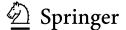
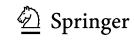
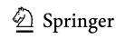
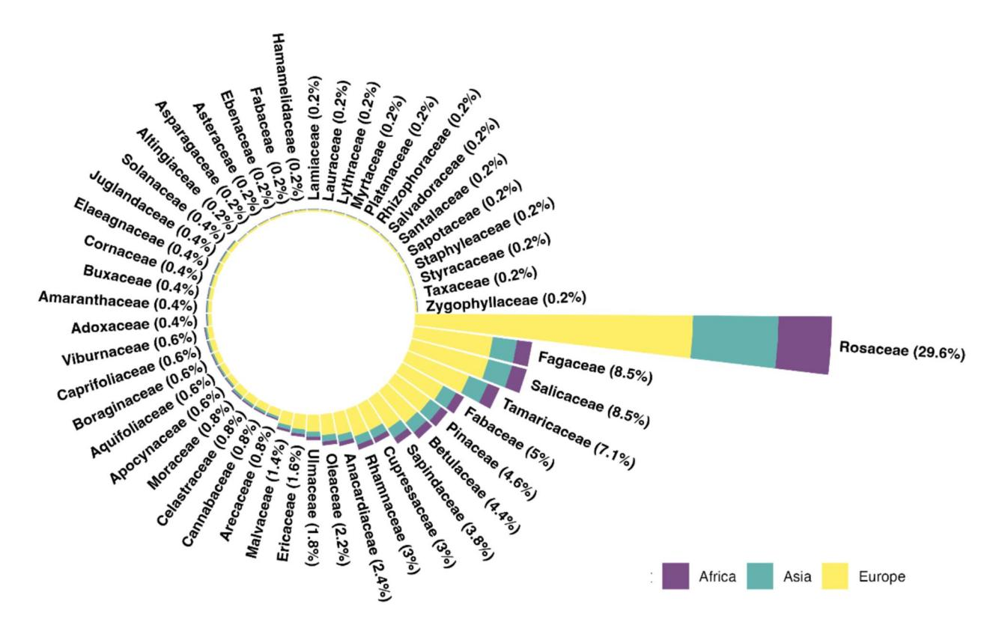
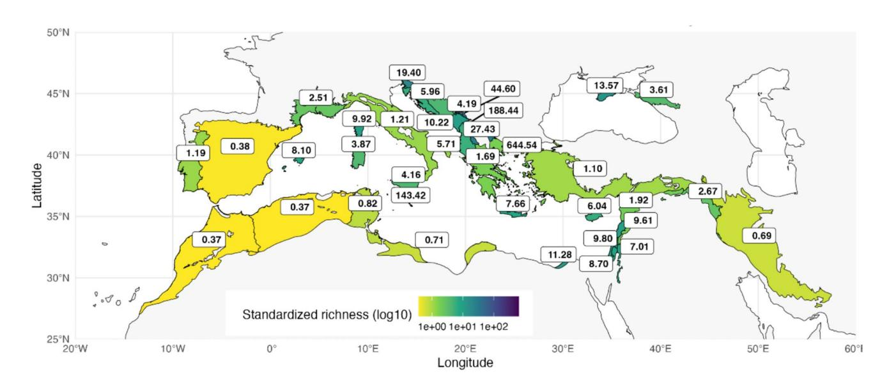
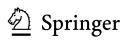
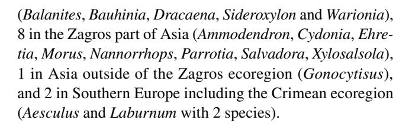
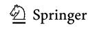
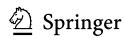

## **FOREST MANAGEMENT (M WATT, SECTION EDITOR)**

# Native Trees of the Mediterranean Region: Distribution, Diversity and Conservation Challenges

Bruno Fady1,2 • Anna-Maria Farsakoglou2 • Mercedes Caron2 • Khaled Abulaila3 • Jelena Aleksic4 • Sajad Alipour5 • Dalibor Balian6,7,8 • Heba Bedair9 • Faruk Bogunic6 • Marwan Cheikh Albassatneh10 • Rakefet David-Schwartz11 • Carmen Delgado Clavero2 • Ali A. Dönmez12 • Mohamed Fennane13 • Gildas Gateble14 • Thierry Gauquelin15 • Malika Hachi Illoul16 • Abelhamid Khaldi17 • Ilène Mahfoud-Saad18,19 • Frédéric Médail15 • Faten Mezni17 • Jotyar Jassim Muhammed20 • Bart Muys21 • Marko Perovic4 • Manam Saaed22 • Alexey P. Seregin23 • Jean Stephan24 • Errol Vela25 • Petar Zhelev26 • Magda Bou Dagher Karrat2,27

Accepted: 19 July 2025 © The Author(s) 2025

#### **Abstract**

**Purpose of Review** While 38% of tree species are at risk of extinction worldwide, their inventory and occurrence at ecologically and biogeographically meaningful scales is lacking in many parts of the world, including the biodiversity-rich Mediterranean region. Here, we provide presence/absence, extinction risk, biogeography and genetic diversity data of trees in 39 climatically and ecologically Mediterranean territories (so-called "botanical territories") in North Africa, Western Asia and Southern Europe.

Recent Findings The inventory includes 496 species and 147 subspecies from 50 families and 111 genera, including 48 species and 8 subspecies previously not considered as trees. We show that native tree species distribution is highly skewed across the tree of life with a few species-rich families such as the Rosaceae and the majority with less than 1% of all species. Endemism was not evenly distributed among botanical territories and neither was extinction risk, an assessment of which was lacking in almost half of the species. While no geographic trends were detectable, species richness was found to be positively correlated with botanical territory area and, when standardized by area, with habitat heterogeneity. Information on genetic diversity was lacking in two thirds of the species inventoried and mostly focused on species with economic importance.

Summary Our data are open access and can be used by researchers and stakeholders for a wide range of purposes, including conservation and restoration. Our findings identified major native tree richness hotspots as well as key knowledge gaps and biases related to extinction risk and genetic diversity. Our findings also emphasize the importance of increased collaboration to support the conservation of Mediterranean forest trees.

**Keywords** Occurrence · Species richness · Endemism · Genetic diversity · Risk of extinction · Adaptation

# Introduction

Published online: 13 August 2025

In an era of escalating threats to biodiversity globally [1, 2], inventorying species worldwide at ecologically and biogeographically meaningful scales is a first, imperative step for their conservation. This is particularly true of the large and long-lived trees which form the foundation of the biodiversity-rich forest ecosystems [3] and most of its biomass [4]. The documentation of their presence and distribution is crucial for understanding their ecological properties and

their adaptive potential, and, ultimately, for framing and prioritizing conservation efforts. In 2021, Botanic Gardens Conservation International (BGCI) estimated that 30% of the world's trees were at risk of extinction [5]. In 2025, the International Union for the Conservation of Nature's (IUCN) Red List summary statistics estimated this number to be between 35 and 43% (mean of 38%, [6]).

An increasing number of worldwide, regional and national species inventory lists exist for plants in general (e.g. [7–9]) and for trees in particular (e.g. [10–13]), but large compilations at ecologically and biogeographically meaningful scales are still surprisingly rare [14]. Yet, species

Extended author information available on the last page of the article

inventory lists at homogeneous biogeographic scales, even if at rough geographic scale, would provide much needed richness, endemism, extinction risks and diversity knowledge, interpretable under a common set of ecological drivers. Compiling such data in biodiversity-rich ecological regions with distinctive adaptations and where climate is changing faster than elsewhere in the world is particularly needed.

The Mediterranean basin falls under this category of combined diversity and threat [15–17]. Situated at the junction of Africa, Asia and Europe, surrounding an almost entirely closed sea, the Mediterranean land masses host a rich and distinctive flora resulting from the complex interaction between past geomorphologic and climate changes and sharp geographic contrasts [14, 18, 19]. Mediterranean tree species demonstrate morphological and ecophysiological adaptations to the typically dry and hot summer periods of the region ([20–22] and database therein) that emerged during the late Pliocene from a previously tropical climate [23]. Within species, increased summer drought also influences population level morphological and ecophysiological adaptation, including in species that occur in transition zones between temperate and Mediterranean climates [24–27].

This Mediterranean-type climate is predicted to spread across large parts of the temperate world while the climate of the Mediterranean itself will become hotter and dryer, particularly during the summer season [28–31]. Increased drought-induced mortality has already been observed in the Mediterranean regions over the last decades and is predicted to increase during the twenty-first century [16, 32, 33]. Actions to conserve tree species, their habitats and their populations, are and will be increasingly needed, both in situ and ex situ within and across borders [34].

While a complete occurrence list of tree species and subspecies exists for Mediterranean Europe at wide [14] and fine [35] spatial scales, none is available at the scale of the entire Mediterranean region. Our study provides a species inventory list of trees from the Mediterranean region, defined as the areas of North Africa, Western Asia and Southern Europe that are under a Mediterranean-type climate and share a common flora of mixed heritage [36, 37]. In addition to their occurrence within defined territories, our study identifies species widely distributed across borders at large geographic scales or, on the contrary, with a high level of endemism, and for each of them, their IUCN extinction risk category, their economic importance and what is known of their genetic diversity. With this detailed inventory, we highlight trends and knowledge gaps and provide researchers with a resource for further exploring patterns and processes shaping biodiversity in this recognized biodiversity hotspot [15, 17, 38]. And we provide countries, which have the legal responsibility of protecting their biodiversity and managing their forests sustainably, with a resource for jointly prioritizing their actions [39].

#### **Material and Methods**

# **Geographic Coverage**

Several approaches have been used to delineate the extent of the Mediterranean region in North Africa, Western Asia and Southern Europe, from strictly climatic or geographic to purely ecological [38, 40–42]. Here, we used a combined ecological and bioclimatic approach and defined as our study area the following biome and three ecoregions of [43]: (1) the "Mediterranean forests, woodlands, and scrub or sclerophyll forests" biome, restricted to its location around the Mediterranean sea (here after: Mediterranean basin), (2) the "Dinaric Mountains mixed forests" ecoregion in the Balkans, stretching from northeastern Italy to northern Albania across Slovenia, Croatia, Bosnia and Herzegovina, Montenegro, Serbia and northeastern Kosovo, (3) the "Crimean Submediterranean forest complex" ecoregion on the Black Sea coast covering parts of the Russian Federation in the North Caucasian and Southern Federal districts and parts of the Crimean peninsula in Ukraine, and (4) the "Zagros Mountains forest steppe" ecoregion, stretching from the eastern-most part of Türkiye to northern Iraq and southern Iran (Fig. 1). All four contain typical Mediterranean floristic elements [43, 44] and experience a Mediterranean-type climate with a marked alternance between hot and dry summers, and mild and humid winters [41, 43].

We excluded two types of regions from our study area. First, we left out steppe regions that meet the Mediterranean climate definition of Daget (1977) [41] and Roumieux et al. (2010) [45] but receive less than 300–400 mm of rain annually and lack many typical Mediterranean plant species [44]. These include areas in Saudi Arabia, Yemen, Tajikistan, Turkmenistan, Afghanistan, and Pakistan. Second, we excluded the Macaronesian Islands (Azores, Canary Islands, Madeira) (Fig. 1). Although Olson et al. (2001) [43] include them in the Mediterranean biome, their climate does not fit with the Mediterranean climate definition according to the Köppen-Geiger classification [42] or Daget (1977) [41]. While some Mediterranean floristic elements are present there, particularly in the Canary Islands, most of their flora is unique to Macaronesia [46].

This geographic ensemble in North Africa, Western Asia and Southern Europe forms an inclusive Mediterranean ecological, floristic and climatic region which we call the Mediterranean region (Fig. 1).

#### **Tree Definition and Taxonomic Considerations**

We adopted the tree definition of Médail et al. (2019) [14]: a perennial plant, typically with a single stem or trunk

Current Forestry Reports (2025) 11:20 Page 3 of 20 20

Fig. 1 Geographic coverage of the Mediterranean region with its different constitutive elements colored in shades of green. Parts of countries included in the Mediterranean region define botanical territories

(see text and Table 1). Land masses outside the Mediterranean region are featured in grey

and lateral branches away from the ground, and capable of reaching an adult height of three meters outside of cultivation systems. This architectural type corresponds to phanerophytes in the classification of Raunkiær (1934) [47]. We included all gymnosperms and angiosperms that form radial growth (thus with a cambium) as well as monocots that develop a trunk. This definition makes it possible to include taxa usually considered as shrubs that rarely develop single stems of at least three meters in height, often as a consequence of recurrent disturbances or of their occurrence in low fertility habitats [14]. While our definition fits with that used by BGCI [10] and by Plant of the World Online (POWO) [48], our list will include taxa considered as shrubs and not trees by either BGCI or POWO.

For taxonomy, we followed Médail et al. (2019) [14] and the GlobalTreeSearch database of BGCI [49]. Family level classification followed APG IV [50]. In general, we kept as accepted names the ones mostly used by the authors of the countries where the taxon is native. For example, following Majeský et al. (2017) [51], we kept all the *Aria*, *Cormus* and *Hedlundia* species within the genus *Sorbus*, for comparison

with earlier publications [11, 14]. Names considered as synonyms by either POWO [48] or Euro + Med [52] are listed in our inventory.

Our inventory includes taxa at species and subspecies levels. Variety-level names may be found as synonyms (when relevant and indicated as such in BGCI, POWO or EURO + Med) but were not included in the occurrence search. Also, we included hybrid species when their origin was clearly the result of natural hybridization and excluded them when their origin was clearly artificial or doubtful.

#### **Occurrence Data**

To build the backbone of our database, we searched the following references and online resources for occurrence data, in the following order: (1) species and subspecies considered as trees in the Northern Mediterranean by Médail et al. (2019) [14], and for all countries of our study area, (2) tree species in the GlobalTreeSearch database of BGCI [49], (3) species and subspecies indicated as tree or shrub in the POWO database [48], and (4) species and subspecies in the Euro + Med database [52]. After this initial step, all authors

reviewed the list and, using their expert knowledge and published sources, added species and subspecies that were missing and deleted species and subspecies that they knew were neither Mediterranean trees nor had their distribution in the Mediterranean ecoregion (see Supp. file "References" in [53]).

POWO (always) and Euro + Med (often) do not report occurrence data separately for the countries that belonged to the former Yugoslavia. Occurrence data there are also grouped as a single unit for Lebanon and Syria and for Israel, Jordan and the Palestinian authority. And while the Global-TreeSearch database of BGCI [49] lists tree species occurrence data at country level (as recognized by the United Nations), Médail et al. (2019) [14], POWO and Euro + Med list taxa at species and subspecies levels, and indicate where they are located within spatial entities that form Mediterranean "botanical territories". They can be whole countries or parts of countries that are included in the Mediterranean region, as defined above (Fig. 1). For France, for example, occurrence data are given separately for two botanical territories: the island of Corsica considered as Mediterranean in its entirety and the southern part of continental France that is within the limits of the Mediterranean region (Fig. 1).

Our occurrence data are thus at Mediterranean botanical territory level (Table 1, Supp. Table "Data\_Trees" in [53]). We excluded Vatican City from our inventory as it is not listed in the GlobalTreeSearch of BGCI [49]) whereas we considered Gibraltar, Monaco and San Marino as separate botanical territories for occurrence data. The botanical territory "Crimea" is the south east part of the Crimean Peninsula while "Southern Russia" is made of the southern parts of the North Caucasian and Southern Federal districts of the Russian Federation. Both are within the Crimean Submediterranean forest complex [43].

#### **Description of Taxonomic Data**

For each taxon, we indicated native presence (N), introduced presence (I) and absence (A) in each Mediterranean botanical territory, and whether this information differed from that found in the resources used for our initial search. The inventory only contains taxa that are native in at least one botanical territory. For example, Morus nigra L. and Morus alba L. are both present in many Mediterranean botanical territories. However, only *M. nigra* is native to the Mediterranean region (Iran), and thus *M. nigra* is found in the inventory while *M. alba* is not. We also indicated when presence or absence was uncertain. Further descriptions of introduced species and uncertainty can be found in Supp. file "Metadata\_trees" in [53]. When a subspecies was found present in a botanical territory, we then considered that the species-level taxon was present as well. For example, Abies pinsapo subsp. marocana is native to Morocco and Abies pinsapo subsp. pinsapo is native to Spain, thus Abies *pinsapo* is native to both Morocco and Spain. Each of these three taxa are listed separately in our inventory.

We also indicated the extinction risk of each taxon using the categories of the IUCN Red List [54]. Querying the IUCN Red List sometimes provided additional information on occurrence that was missing or incomplete in POWO or BGCI [48, 49].

When possible, we indicated which major uses each taxon had in the area where it is present. These uses are: food (including for animals), human medicine, ornamental (including windbreak), or timber (including cork, pallets or for construction or carpentry). Information on major uses was gathered from POWO [48] and IUCN Red List databases, as well as from our own expertise.

We highlighted species usually considered as shrubs that can develop into trees at least three meters high as adults, thus "cryptic trees", adding to the list of Médail et al. (2019) [14]. Conversely, we identified species that are considered as trees in reference databases but that never develop as trees in the Mediterranean region (although they may in other parts of the world), i.e. "true Mediterranean shrubs".

We considered as Mediterranean those species and subspecies that have at least part of their natural distribution area within Mediterranean botanical territories, even if their main distribution area falls outside of them. We thus characterized species from a biogeographic and bioclimatic perspective as either preferentially Mediterranean (Mediterranean chorotype, [55, 56]), with a shared distribution or only marginally Mediterranean. Other distributions were characterized as tropical, desert or temperate, in Africa, Asia or Europe.

We report the number of scientific publications addressing genetic diversity for each species (and not subspecies) of our inventory. For this, we used the PubMed database (data from 01 January 1966 to December 10, 2024) and a custommade bibliometric query. See the description of the query in Supp. file "Metadata\_genetics" in [53]. Analyzing the title and abstract, we characterized each retrieved publication as either studying adaptation, demography, both or neither.

Finally, we report ploidy level and DNA content when available. For this, we searched the Plant DNA C-values Database [57], at: https://cvalues.science.kew.org/. Additional genome size data were retrieved from [58]. We used the formula 1 pg = 978 Mbp [59] to transform data and homogenize across studies. When there were several values at species level for genome size, we selected the smallest one (as proposed in [60]).

## Analyses of the Data

#### Taxonomic Distribution Across the Tree of Life

Using occurrence data, we tested the hypothesis that native and endemic species are not evenly distributed across the

woodlands, and scrub or sclerophyll forests (restricted to the Mediterranean basin); Zagros MFS: Zagros Mountains forest steppe. The column "Native all taxa" indicates the number of native Mediterranean tree species and subspecies not counting the species level entry when it is subdivided into one or more subspecies. The last column reports the number of native species standardized per unit area (1000 km²), thus a native species richness density per botanical territory Table 1 Number of native and endemic species, genera and family in the 39 botanical territories of the Mediterranean region in North Africa, Western Asia and Southern Europe. Constitutive ecoregions [43] are abbreviated as follows: Crimean SFC: Crimean Sub-Mediterranean forest complex; Dinaric MMF: Dinaric Mountains mixed forests; Medit. FWSC: Mediterranean forests,

| •                         |                 | •                                 | •                   | •                              |                    |                   |                   |                  |                    |                    |                  |                          |
|---------------------------|-----------------|-----------------------------------|---------------------|--------------------------------|--------------------|-------------------|-------------------|------------------|--------------------|--------------------|------------------|--------------------------|
| Botanical territory       | Geographic type | Geographic type Geographic origin | Main biome          | Medit. area in Km 2 | l                  | Nb.               | Nb.               | Nb.              | Nb.                | Nb.                | Nb.              | Native spe-              |
| name                      |                 |                                   | or ecoregion ([43]) |                                | native families | native generas | native species | nati ve subsp | native all taxa | endemic species | endemic subsp | cies richness density |
| Albania                   | Continent       | Europe                            | Medit. FWSC         | 27,833                         | 33                 | 61                | 155               | 47               | 159                | 0                  | 0                | 5.713                    |
| Algeria                   | Continent       | Africa                            | Medit. FWSC         | 292323                         | 31                 | 57                | 109               | 23               | 109                | 5                  | 1                | 0.373                    |
| Balearic Islands          | Island          | Europe                            | Medit. FWSC         | 4818                           | 23                 | 31                | 40                | 6                | 39                 | 0                  | 0                | 8.095                    |
| Bosnia & Herzego- vina | Continent       | Europe                            | Dinaric MMF         | 32468                          | 30                 | 55                | 134               | 42               | 136                | 1                  | 0                | 4.189                    |
| Bulgaria                  | Continent       | Europe                            | Medit. FWSC         | 208                            | 27                 | 53                | 138               | 35               | 134                | 0                  | 0                | 644.535                  |
| Corsica                   | Island          | Europe                            | Medit. FWSC         | 8571                           | 28                 | 46                | 82                | 33               | 85                 | 0                  | 1                | 9.917                    |
| Crete                     | Island          | Europe                            | Medit. FWSC         | 7834                           | 25                 | 38                | 59                | 15               | 09                 | 2                  | 0                | 7.659                    |
| Crimea                    | Continent       | Europe                            | Crimean SFC         | 7516                           | 21                 | 36                | 96                | 35               | 102                | 9                  | 2                | 13.571                   |
| Croatia                   | Continent       | Europe                            | Medit. FWSC         | 24,484                         | 32                 | 99                | 138               | 46               | 146                | 0                  |                  | 5.963                    |
| Cyprus                    | Island          | Europe                            | Medit. FWSC         | 9110                           | 24                 | 33                | 54                | 10               | 55                 | 1                  | 2                | 6.037                    |
| Egypt                     | Continent       | Africa                            | Medit. FWSC         | 3636                           | 14                 | 22                | 41                | 4                | 41                 | 1                  | 0                | 11.276                   |
| France (continental)      | Continent       | Europe                            | Medit. FWSC         | 58188                          | 31                 | 58                | 139               | 44               | 146                | 1                  | 0                | 2.509                    |
| Gibraltar                 | Continent       | Europe                            | Medit. FWSC         | NA                             | 7                  | 8                 | 11                | 3                | ∞                  | 0                  | 0                | NA                       |
| Greece (without Crete) | Continent       | Europe                            | Medit. FWSC         | 108289                         | 34                 | 65                | 170               | 59               | 183                | 2                  | -                | 1.690                    |
| Iran                      | Continent       | Asia                              | Zagros MFS          | 351375                         | 40                 | 74                | 232               | 40               | 242                | 61                 | 7                | 0.689                    |
| Iraq                      | Continent       | Asia                              | Zagros MFS          | 31505                          | 26                 | 40                | 84                | 15               | 84                 | 1                  | 0                | 2.666                    |
| Israel                    | Continent       | Asia                              | Medit. FWSC         | 7243                           | 27                 | 46                | 74                | 6                | 71                 | 1                  | 0                | 9.803                    |
| Italy (continental)       | Continent       | Europe                            | Medit. FWSC         | 138802                         | 34                 | 63                | 154               | 56               | 168                | 0                  |                  | 1.210                    |
| Jordan                    | Continent       | Asia                              | Medit. FWSC         | 9554                           | 23                 | 39                | 99                | 11               | 29                 | 0                  | 0                | 7.013                    |
| Kosovo                    | Continent       | Europe                            | Medit. FWSC         | 557                            | 21                 | 36                | 112               | 31               | 105                | 0                  | 0                | 188.437                  |
| Lebanon                   | Continent       | Asia                              | Medit. FWSC         | 10091                          | 30                 | 52                | 100               | 16               | 26                 | -                  | 0                | 9.613                    |
| Libya                     | Continent       | Africa                            | Medit. FWSC         | 63650                          | 21                 | 31                | 46                | 5                | 45                 | 1                  | 0                | 0.707                    |
| Malta                     | Island          | Europe                            | Medit. FWSC         | 244                            | 20                 | 31                | 36                | 7                | 35                 | 0                  | 0                | 143.424                  |
| Monaco                    | Continent       | Europe                            | Medit. FWSC         | NA                             | 20                 | 24                | 31                | ∞                | 25                 | 0                  | 0                | NA                       |
| Montenegro                | Continent       | Europe                            | Dinaric MMF         | 13697                          | 31                 | 53                | 133               | 48               | 140                | 0                  | 0                | 10.221                   |
| Morocco                   | Continent       | Africa                            | Medit. FWSC         | 307557                         | 30                 | 59                | 112               | 25               | 114                | 4                  | 3                | 0.371                    |
| North Macedonia           | Continent       | Europe                            | Medit. FWSC         | 5541                           | 28                 | 51                | 142               | 50               | 152                | 0                  | _                | 27.430                   |
| Palestinian Territory     | Continent       | Asia                              | Medit. FWSC         | 5060                           | 20                 | 31                | 4                 | 7                | 44                 | 0                  | 0                | 8.695                    |
| Portugal (continental)    | Continent       | Europe                            | Medit. FWSC         | 73265                          | 28                 | 48                | 84                | 25               | 87                 | 1                  | 0                | 1.187                    |
| San Marino                | Continent       | Europe                            | Medit. FWSC         | NA                             | 3                  | 3                 | 4                 | 2                | 3                  | 0                  | 0                | NA                       |
|                           |                 |                                   |                     |                                |                    |                   |                   |                  |                    |                    |                  |                          |

20 Page 6 of 20 Current Forestry Reports (2025) 11:20

| Table 1 (continued)      |                 |                                                                                           |                                      |                    |                           |                          |                          |                        |                           |                           |                         |                                         |
|--------------------------|-----------------|-------------------------------------------------------------------------------------------|--------------------------------------|--------------------|---------------------------|--------------------------|--------------------------|------------------------|---------------------------|---------------------------|-------------------------|-----------------------------------------|
| Botanical territory name | Geographic type | Botanical territory Geographic type Geographic origin Main biome name or ecoregion ([43]) | Main biome or ecoregion ([43]) | Medit. area in Km² | Nb. native families | Nb. native generas | Nb. native species | Nb. native subsp | Nb. native all taxa | Nb. endemic species | Nb. endemic subsp | Native spe- cies richness density |
| Sardinia                 | Island          | Europe                                                                                    | Medit. FWSC                          | 23779              | 29                        | 43                       | 87                       | 28                     | 92                        | 3                         | 0                       | 3.869                                   |
| Serbia                   | Continent       | Europe                                                                                    | Dinaric MMF                          | 2130               | 20                        | 35                       | 102                      | 29                     | 95                        | 0                         | 0                       | 44.600                                  |
| Sicily                   | Island          | Europe                                                                                    | Medit. FWSC                          | 25266              | 30                        | 54                       | 102                      | 32                     | 105                       | 7                         |                         | 4.156                                   |
| Slovenia                 | Continent       | Europe                                                                                    | Dinaric MMF                          | 6289               | 29                        | 51                       | 119                      | 39                     | 122                       | 0                         | 0                       | 19.398                                  |
| Southern Russia          | Continent       |                                                                                           | Crimean SFC                          | 22160              | 20                        | 35                       | 77                       | 29                     | 80                        | 0                         | 0                       | 3.610                                   |
| Spain (continental)      | Continent       |                                                                                           | Medit. FWSC                          | 417712             | 33                        | 62                       | 150                      | 50                     | 161                       | 3                         | 4                       | 0.385                                   |
| Syria                    | Continent       | Asia                                                                                      | Medit. FWSC                          | 52140              | 30                        | 50                       | 102                      | 17                     | 100                       | 0                         | 0                       | 1.918                                   |
| Tunisia                  | Continent       | Africa                                                                                    | Medit. FWSC                          | 78942              | 23                        | 39                       | 89                       | 15                     | 65                        | 0                         | 0                       | 0.823                                   |
| Türkiye                  | Continent       | Asia                                                                                      | Medit. FWSC                          | 283364             | 40                        | 77                       | 277                      | 84                     | 311                       | 30                        | 12                      | 1.098                                   |
| Total                    | 1               | 1                                                                                         | 1                                    | 2515201            | 50                        | III                      | 496                      | 147                    | 585                       | 132                       | 37                      | 0.197                                   |
|                          |                 |                                                                                           |                                      |                    |                           |                          |                          |                        |                           |                           |                         |                                         |

tree of life, with some families much more species-rich than others.

# Biogeography, Abiotic Habitat Factors and Botanical Territories

We calculated the surface of each Mediterranean botanical territory (Fig. 1), using two GIS resources in ArcGIS Pro 3.3.0 (Esri Inc.). For administrative divisions (as of December 2022), we used: https://hub.arcgis.com/datasets/esri::world-administrative-divisions/explore?location=-0. 380188%2C0.000000%2C0.99, and for ecoregions [43], we used: https://www.worldwildlife.org/publications/terrestrial-ecoregions-of-the-world. The surface of continental France includes Monaco, that of continental Italy includes San Marino and that of continental Spain includes Gibraltar, as neither one of these three countries have native species of their own, different from the larger botanical territories that surround them.

We then tested the species—area richness relationship [61] at the spatial scale of the botanical territory. We also tested the effect of abiotic habitat variability using two proxies: elevation (range, mean and standard deviation) and topographic ruggedness (range, sum, mean and standard deviation) of each botanical territory [62, 63]. Elevation was calculated at the spatial scale of 3 arc-second cells and range, mean and standard deviation values were calculated using all cells of a given botanical territory. Ruggedness was also calculated for each 3 arc-second cell as the difference between the highest and lowest elevation values within each  $3 \times 3$ cell window (thus for approx. 100 m × 100 m windows at the latitude of the Mediterranean region) with higher values meaning higher rugosity, and range, sum, mean and standard deviation values were calculated using all cell windows of a given botanical territory. Ruggedness was also calculated for  $9 \times 9$  cell windows (thus for approx. 1 km  $\times$  1 km windows) to test for larger-scale geomorphological and habitat effects.

# **Endemism, Introductions and Extinction Risks**

Using occurrence data, we tested the hypothesis that autochthony and endemism at family, genus, species and subspecies levels are not evenly distributed across botanical territories as their area under Mediterranean climate is different, and because deep past geological events and alternating Pleistocene glacial and interglacial cycles have probably affected land masses, geographic ensembles and botanical territories differently [37, 64, 65].

We analyzed extinction risks at different taxonomic and biogeographic levels, testing the hypothesis that (1) some taxonomic groups are more endangered than others, (2) some botanical territories and biogeographic regions contain

Current Forestry Reports (2025) 11:20 Page 7 of 20 20

higher numbers of taxa at risk of extinction and (3) endemic taxa are more at risk of extinction than widespread taxa.

#### **Genetic Diversity and Ploidy**

Using the results of the query described in Supp. file "Metadata\_genetics" in [53], we tested the hypothesis that Mediterranean tree species are poorly known at the genetic level in general, and that information is preferentially present in tree species that have a large part of their range in temperate Europe, that are of economic importance (timber or food) or are mostly least concerned with extinction risk (thus that taxa at risk of extinction are poorly known genetically making this lack of knowledge critical for some families and areas of occurrence). We also tested the hypothesis that studies are more interested in demography than in adaptation due to the nature of available molecular markers. Finally, we tested the hypothesis that genome size is positively correlated with extinction risk as found for herbaceous angiosperms [60].

#### Statistical Tests

We tested our hypotheses of independence using chi-square tests when comparisons where made between categorical variables, such as richness, endemism, biogeographic and IUCN categories. For linear correlations between all other variables involving abiotic habitat variability, we used Pearson Product Moment Correlation and, for comparison, the non-parametric Spearman's test for rank correlations. As the two methods yielded very similar results (both coefficient and significant values, Supp. Table "Data\_correl", [53]), we only report Pearson's coefficients and p-values in the text below. We also used Pearson's coefficients to test for spatial autocorrelation of taxa in the different botanical territories, using as input for a Mantel statistic, taxon presence/absence and botanical territory distances.

We checked correlations among all abiotic habitat descriptors and discarded those that were highly correlated. For example,  $3\times3$  and  $9\times9$  ruggedness sum, mean, standard deviations and range were strongly correlated (Pearson's r>0.94), and  $3\times3$  ruggedness values only were used for correlations with richness data. Also, botanical territory area and  $3\times3$  ruggedness sum were highly correlated (Pearson's r>0.91) and  $3\times3$  ruggedness sum was dropped out of the analysis. Correlations between taxonomic richness and habitat factors were thus calculated between family, genus, species and subspecies native and endemic richness on the one hand, and botanical territory geographic coordinates, area, elevation (range, mean and standard deviation) and  $3\times3$  ruggedness (range, mean and standard deviation), on the other hand.

# **Data Accessibility**

All data and metadata are available open access at https://doi.org/10.57745/PEWSZG [53].

## **Results and Discussion**

#### Taxonomic Distribution Across the Tree of Life

Our taxonomic inventory of Mediterranean trees contains species and subspecies occurrences at botanical territory level, and information on their use, extinction risk, genetic diversity and genome size (Supp. Table "Data\_trees" in [53]). We also indicate the main synonym for each taxon, when more than one name is commonly used. The inventory contains a total of 25077 data points, with 4987 native presences and 620 introductions spanning 39 botanical territories (Fig. 1). The inventory contains 643 taxa (496 species and 147 subspecies) from 50 families and 111 genera (Table 1). It also indicates occurrence data that are new compared to at least one of the online resources we used to construct the backbone of our inventory. In total, 1557 occurrence data (807 "absence", 505 "native presence" and 245 "introduced presence") represent new information. Finally, 184 occurrence data were considered uncertain: 10 "absence", 163 "native presence" and 11 "introduced presence".

Our taxonomic inventory also includes a list of taxa that we considered as either not trees or not Mediterranean although presented as such in POWO and BGCI [48, 49]. Forty-two species and 2 subspecies cannot be considered as trees in the Mediterranean region, and are true Mediterranean shrubs, and 51 species and 1 subspecies were trees but not Mediterranean (Supp. Table "Data\_excluded" in [53]).

Conversely, we identified 48 species and 8 subspecies of cryptic trees, i.e. that should be considered as trees in the Mediterranean region although they are described as shrubs only in the references we consulted. They are noted as "POWO shrub" in Supp. Table "Data\_trees" in [53]. They are mostly widespread taxa (36 taxa) or endemic to Southern Europe (9 taxa), and families Rosaceae (11 taxa), Fabaceae (9 taxa) and Rhamnaceae (8 taxa) account for half of them. We also identified 22 species and 8 subspecies with a potential tree growth habit for which no indication of habit was available in the references we consulted. They are noted as "Not in POWO" or "No data in POWO" in Supp. Table "Data\_trees" [53]. They are mostly endemic to the Zagros (13 taxa) or Western Asia outside Zagros (5 taxa), and from family Rosaceae (23 taxa).

Taxonomic distribution across the tree of life was highly skewed (Fig. 2). The most species-rich family by far was the Rosaceae (147 species and 19 subspecies) followed by the Fagaceae (42 species and 24 subspecies), Salicaceae (42

species and 10 subspecies) and Tamaricaceae (35 species), while 19 families contained just one species. The first 10 most diverse families accounted for more than 3/4 of total taxonomic diversity (Fig. 2). The genera with the highest number of species and subspecies were *Quercus* (54), *Crataegus* (49), *Prunus* (43), *Acer* (40) and *Salix* (38). Shrubs that can be considered as trees were present in 23 families. Family Rosaceae included most of them (34 species and subspecies out of 56) followed by the Fabaceae and Rhamnaceae (8 each).

However, native family, genus, species and subspecies richness values were highly correlated (r between 0.73 and 0.99). Endemic species richness was moderately but significantly correlated with native taxonomic richness (r between 0.31 and 0.62) (Table 1 and Supp. Table "Data\_correl" in [53]).

# Biogeography, Abiotic Habitat Factors and Botanical Territories

Half of the species in the inventory were biogeographically Mediterranean while 11.5% were equally distributed in the Mediterranean and under a different bioclimate. The remaining species, while having part of their distribution area under a Mediterranean climate, were preferentially desert (3.5%),

temperate (30%) or tropical (5%) tree species (Supp. Table "Data\_trees", [53]).

While there were more species per family in Southern Europe than in Western Asia or North Africa (Fig. 2), mean richness averaged over botanical territories ranked higher in Western Asia than Southern Europe and North Africa (Table 1): 29.5 families versus 27.4 and 23.8; 51.1 genera versus 47.6 and 41.6; and 122.4 species versus 108.8 and 75.2, respectively in Western Asia, Southern Europe and North Africa. While family and genus richness differences among continents were not significant, species richness differences were (p-value = 0.003, chi-square test). Family, genus and species mean richness were also higher in botanical territories on the mainland than on large islands (Table 1): 27.6 families versus 26.5; 48.9 genera versus 40.8; and 114.5 species versus 70.7, respectively on the mainland and islands. While family and genus richness differences between mainland and island were not significant, again, species richness differences were (p-value = 0.001, chisquare test).

The distribution of native tree taxonomic richness varied greatly at botanical territory level (Fig. 3), although there was no clear longitudinal gradient of decreasing or increasing taxonomic richness at either family, genus or species level (Pearson's r values from -0.12 to 0.07, Supp. Table

Fig. 2 Circular barplot of ranked families according to the number of species they contain and their distribution in the three continents of the Mediterranean region. Species occurring in more than one conti-

nent are counted in each. The proportion indicated for each family is the number of species per family as a percentage of the total number of species

Current Forestry Reports (2025) 11:20 Page 9 of 20 20

"Data\_correl" in [53]). Correlations were slightly stronger for latitude, particularly for species richness which increased northwards (Pearson's r = 0.59).

In contrast, there was a strong and similar positive correlation, between tree richness at all three taxonomic levels and the area of each botanical territory (Pearson's r values from 0.57 to 0.64, Supp. Table "Data\_correl" in [53]). This richness – area relationship was stronger on islands than on continents: for species-level richness for example, Pearson's r was 0.89 on islands and 0.54 on continents. There was also a strong overall positive correlation between family, genus and species richness on the one hand, and landscape heterogeneity on the other hand. Pearson's r was between 0.70

and 0.79 for elevation range and r between 0.75 and 0.82 for ruggedness range, for example, similarly on islands and continents. The correlation was weaker for endemic species (r between 0.45 and 0.52).

Standardizing native species richness by botanical territory area provides an estimate of richness density per unit area per botanical territory. Native species richness density was significantly higher in Bulgaria than in any other botanical territory, with over 600 species per 1000 km2. Also appearing as high native species richness botanical territories with over 100 native species per 1000 km2 were Kosovo and Malta (Fig. 3, bottom panel). Large botanical territories with high overall native species richness (Fig. 3, top panel)

**Fig. 3** Taxonomic richness (number of native tree species, top panel) and standardized taxonomic richness (log10 number of native tree species per unit area of 1000 km², bottom panel) in each of the 39

botanical territories of the Mediterranean region of North Africa, Western Asia and Southern Europe, from highest in purple to lowest in yellow

such as Iran and Türkiye and most North African botanical territories were among the ones with the lowest native richness density index (1 native species per 1000 km2 or less), indicating that area alone does not generate increased density of native species richness.

Most correlations between native species richness density and abiotic factors became non-significant except for ruggedness mean and standard deviation (Pearson's r between 0.35 and 0.47, Supp. Table "Data\_correl" in [53]), indicating that ruggedness is a driver of taxonomic richness independently of area.

#### **Endemic and Shared Taxa**

Results of the Mantel tests indicated a significant taxonomic spatial autocorrelation. Species composition was more similar among nearby botanical territories (r=0.509, p-value=0.001). This pattern was also seen for genera (r=0.345, p-value=0.001) and families (r=0.253, p-value=0.002), although the effect was weaker. Thus, neighboring botanical territories tend to be more taxonomically similar than more distant ones, especially at the species level.

A total of 105 taxa (87 species and 18 subspecies, 36 of them newly considered as trees instead of shrubs) from 29 families were shared among the three continents (Supp. Table "Data\_shared", [53]) and 35 of them also occurred jointly in the Crimean, Dinaric and Zagros ecoregions. Their main biogeographic origin was Mediterranean (71 of them) or Temperate (29 of them), while the remaining five were desert trees. Shared species were in highest numbers in the families Rosaceae (13 shared species), Salicaceae (9 shared species) and Rhamnaceae (9 shared species).

Endemic species and subspecies to a single continent accounted for 41% of all taxa (262). While 105 endemic species and subspecies were restricted to Southern Europe (including Crimea), 24 were restricted to North Africa and 133 to Western Asia (including the Zagros). See Supp. Table "Data\_trees" in [53]. Endemic species at botanical territory level (132) were in significantly higher numbers in Iran (61) and Türkiye (30) (Table 1). Both contributed strongly to the medium effect positive correlation which was found between the number of endemic species and longitude (Pearson's r = 0.35). Of the remaining botanical territories, only Algeria, Crimea and Sicily had over four endemic species (Table 1). Endemic subspecies at botanical territory level were rarer (37) but also in higher frequency in Iran (7) and Türkiye (12) than elsewhere. Standardized by unit area, endemic species density was highest in small and isolated botanical territories such as Crimea, Crete and Sicily (Supp Table "Data\_Summary" in [53]).

Endemism at genus level mostly concerned single species genera: 5 single species genera occurred only in Africa

#### **Extinction Risks**

All non-extinct categories of the IUCN Red List [6] were represented in our Mediterranean trees. The taxa considered to be at risk of extinction, belonging to categories Vulnerable (VU), Endangered (EN) and Critically Endangered (CR), i.e. collectively identified as Threatened, accounted for 8.3% of all occurrences (45 species and 9 subspecies) and where spread across the tree of life irrespective of taxonomic richness within families (Chi-square test p-value < 0.001). Near-Threatened (NT, including the Conservation Dependent (CD) category) were only 4.2% of the total (24 species and 3 subspecies). Just over 40% of the occurrences were characterized as Least Concern (LC, 240 species and 20 subspecies) while the Data Deficient (DD) or Not evaluated (NE) (i.e., the taxon name could not be found in the IUCN Red List database) categories included 46.9% of the occurrences, thus the largest share, with 187 species (55 for DD and 132 – including 21 hybrid species—for NE) and 115 subspecies (4 for DD and 111 for NE). (Table 2).

Native species at risk of extinction were more frequent in Western Asia and North Africa than in Southern Europe while data deficient and no data species were present in high proportions in all three continents (Fig. 4 and Supp. Table "Data\_summary" in [53]). Both the number of native species at risk of extinction and DD and NE species were proportional to species richness in botanical territories (r=0.72 and 0.91, respectively, and Fig. 4). However, half (151) of the DD and NE species and subspecies were endemic to one continent or ecoregion, including 95 in Southern Europe (Supp. Table "Data\_trees" in [53]).

The strictly Mediterranean species at risk of extinction were proportionally in higher frequency than those that have only some or a limited part of their distribution in the Mediterranean. Comparing with preferentially temperate species for example, out of the 45 threatened species in categories CR, EN and VU, 32 were strictly Mediterranean while only 7 were temperate (Chi-square test *p*-value = 0.01). DD and NE species were proportionally equally high between preferentially Mediterranean and temperate species (Table 2).

#### **Genetic Diversity and Ploidy**

The bibliometric search for genetic diversity publications yielded 1460 results. The distribution of publication effort among the 496 species queried was highly skewed, with 327

Current Forestry Reports (2025) 11:20 Page 11 of 20 20

Table 2 Number of Mediterranean tree species per IUCN Red List category and biogeographic type. Species occur either under a dominant biogeographic type or are equally present under a Mediterranean bioclimate and another type (temperate, tropical or desert)

|                                       |    | atened tinction | ,  | Lower risk |     |    | cannot aluated |       |
|---------------------------------------|----|--------------------|----|------------|-----|----|-------------------|-------|
| Main biogeographic type/IUCN category | CR | EN                 | VU | NT (+CD)   | LC  | DD | NE                | Total |
| Desert                                |    |                    |    |            | 8   | 1  | 8                 | 17    |
| Mediterranean                         | 9  | 15                 | 8  | 15         | 97  | 25 | 79                | 248   |
| Mediterranean, desert                 |    |                    | 1  |            | 1   |    | 1                 | 3     |
| Mediterranean, temperate Asia         |    |                    |    |            | 5   |    | 1                 | 6     |
| Mediterranean, temperate Eurasia      |    |                    | 1  |            | 4   |    |                   | 5     |
| Mediterranean, temperate Europe       | 1  |                    | 2  |            | 18  | 6  | 7                 | 34    |
| Mediterranean, tropical Africa        |    |                    |    |            | 2   |    |                   | 2     |
| Mediterranean, tropical Asia          |    |                    |    | 1          | 4   |    | 1                 | 6     |
| Temperate Asia                        |    | 2                  | 3  | 4          | 19  | 10 | 17                | 55    |
| Temperate Eurasia                     |    |                    |    |            | 17  |    | 1                 | 18    |
| Temperate Europe                      |    | 1                  | 1  | 2          | 49  | 13 | 12                | 78    |
| Tropical Africa                       |    |                    |    |            | 7   |    | 2                 | 9     |
| Tropical Africa, Asia                 |    |                    |    |            | 6   |    |                   | 6     |
| Tropical Asia                         |    |                    | 1  | 2          | 3   |    | 3                 | 9     |
| Total                                 | 10 | 18                 | 17 | 24         | 240 | 55 | 132               | 496   |

species (66% of the total) retrieving no publication and 55 species (11%) retrieving more than 5 publications each. Just 80 species (16% of all species) provided more than 90% of all publications.

Genetic diversity publications were lacking in one quarter of the families (21 species in total) and more than half of the families (45 species in total) were described by less than 5 publications. At the other end of the spectrum, three families only totaled more than half of the genetic diversity publications: Pinaceae (263 publications), Rosaceae (254 publications) and Fagaceae (230 publications). Publications for these three families were concentrated on a limited number of their 212 species, all with a known societal usage, either timber or food: 6 out of 42 Fagaceae species, 6 out of 23 Pinaceae species and 6 out of 147 Rosaceae species accounted for 605 publications (81% of the total).

The 954 genetic diversity studies (65% of the total) attributed to demography or adaptation were split evenly between the two topics, approximately 40% dealing with demographic inferences (including phylogeography, and effects of drift and past climates), 40% with adaptation (including local adaptation and phenotypic trait variation) and 20% with both.

# Genetic Diversity Knowledge, Biogeography, Economic Importance and Iucn Extinction Risk

Botanical territories where at least one genetic diversity study per species was found (Supp. Table "Data\_summary" in [53]) were also those with the highest native tree species richness (r=0.94). Yet, species-rich botanical territories in Western Asia were proportionally less

genetically studied than North African or Southern European botanical territories (Fig. 5).

Most of the genetic diversity publications queried (Supp. Table "Data\_Genetics" in [53]) addressed Lower Risk species (1031 LC and 39 NT, thus 73%) while the 54 species at risk of extinction were the target of only 39 publications (thus less than 3% of all publications). The 55 species linked to more than 5 genetic diversity publications were LC for 45 of them (82%) and DD for all others except one VU species (Sideroxylon spinosum L., the Argan tree of western North Africa). The species for which no genetic study was retrieved by the search were mostly DD species. While genetic diversity studies addressed 129 (45%) of the LC species, they addressed only 10 (18%) of the species at risk of extinction and 30 (10%) of the DD and NE species. The eighty species regrouping more than 90% of all publications were mostly species not considered at risk of extinction (62 LC and 3 NT, 81%) while 11 lacked threat data (14%) and 4 were at risk of extinction

Genetic diversity publications were proportionally less numerous for species whose geographic distribution was mostly or partially Mediterranean (Supp. Table "Data\_Genetics" in [53]). A total of 342 genetic diversity publications addressed the 248 species with a predominantly Mediterranean distribution (1.4 publications per species average) while 804 addressed the 151 predominantly temperate species in Western Asia, Southern Europe or both (5.3 publications per species average), and 188 the 45 species found equally in temperate and Mediterranean bioclimates (4.2 publications per species average). The remaining 126 publications addressed 52 species predominantly

20 Page 12 of 20 Current Forestry Reports (2025) 11:20

Fig. 4 Number of threatened (categories CR, EN and VU) tree species (top panel) and number of Data Deficient (DD) or Not Evaluated (NE) tree species (bottom panel) in the Mediterranean region of North Africa, Western Asia and Southern Europe. The map indicates

the number of tree species for each IUCN category occurring in each of the 39 botanical territories of the Mediterranean region, from highest in purple to lowest in yellow

or partially found in desert or tropical bioclimates (2.4 publications per species average).

Out of the 169 species which had at least one study targeting their genetic diversity (Supp. Table "Data\_Genetics" in [53]), 43% (73 species) were characterized by at least one main use (food, timber or other). For the 327 species with no retrieved genetic study, this proportion was 5% (17 species).

Ploidy levels and 1 C DNA amounts were available for 30% and 35% of the species, respectively (Supp. Table "Data\_Genetics" in [53]). Genome size measured by 1 C DNA amount was significantly higher in gymnosperms (11.3 to 22.6 pg) than in angiosperms (0.36 to 4.5 pg) with the exception of the genus *Sambucus* in the Adoxaceae whose genome size was comparable to that of gymnosperms (12.3 pg). Except for some notable polyploidy cases

Current Forestry Reports (2025) 11:20 Page 13 of 20 20

**Fig. 5** Taxonomic richness and genetic diversity in the Mediterranean region of North Africa, Western Asia and Southern Europe. The map shows the proportion of tree species occurring in each of the 39

botanical territories of the Mediterranean region for which there is at least one genetic study (as retrieved from the bibliometric search performed), from highest in purple to lowest in yellow

in the genus *Juniperus* of the Cupressaceae ([66]), ploidy level was a constant 2x in these large genome size families. While it was also most frequently 2x in angiosperms (74% of assessable species), it was 4x in the Ulmaceae and 22x in the Moraceae, and ranged from 2x to 10x in the Betulaceae and from 2x to 22x in the Rosaceae. There were no discernable differences between any of the IUCN categories, neither for ploidy levels nor for 1 C DNA amounts, in either gymnosperms (22 and 26 species assessed respectively) or angiosperms (127 and 150 species assessed, respectively).

The major hypotheses tested and the outcomes of the tests are listed in Table 3.

## **Conclusion**

Despite long-standing efforts, the global number of tree species remains uncertain, but recent data estimate it to be around 73,000 species worldwide, 9,000 of which are still undiscovered [67]. The Mediterranean region of North Africa, Western Asia and Southern Europe has thus a modest contribution to global tree species diversity: 496 species in total, of which 392 have their distribution predominantly in the Mediterranean region, i.e. less than 1% of the total tree diversity. Most of the world's tree diversity is found in the inter-tropical biomes [68] and in the Mediterranean region, the late Pleistocene glacial cycles have resulted in the disappearance of a significant number of tree species [65]. However, as the size of the Mediterranean region is

only 2.2% of the world's total [69], this contribution is far from negligible.

In Europe (including Macaronesia), Rivers et al. (2019) [11] recognized 454 native tree species, of which 170 are in the genus *Sorbus*, making the Rosaceae the richest family (216 species in total) in Europe, similarly to the Mediterranean (147 species in total, although *Sorbus* accounts for only 25 of those). However, and supposing that the classification systems used are similar (APG IV), richness appears distributed slightly more widely across the tree of life in the Mediterranean than in Europe (50 versus 45 families, 111 versus 104 genera). And while 265 (over 58%) species are endemic to continental Europe [11], 169 are restricted to a single botanical territory and 196 to a single continent in the Mediterranean region.

Excluding from this comparison the genus *Sorbus* and its numerous apomictic and hybrid species [70] which complicate taxonomic richness comparisons [51], the Mediterranean is rich with 471 species while Europe sensu [11] has 284 species, of which 208 are also in the Mediterranean. Making the Mediterranean a comparatively taxonomic rich region for tree species.

Our inventory of 643 taxa (496 species and 147 subspecies) for the entire Mediterranean region adds 80 species and 67 subspecies (excepting Crimea and Southern Russia) to the tree list of Médail et al. (2019) [14] for Mediterranean Europe (which was defined with more restrictive limits than ours). It is also an upward update of previous, regionwide estimates [71]. It confirms previous expert knowledge

**Table 3** Summary of tested hypotheses and corresponding outcomes. The thirteen major hypotheses evaluated in the study each address patterns of biodiversity, endemism, extinction risk, and research biases in Mediterranean and global tree species. The table indicates

whether the data support each hypothesis (Supported), does not (Not supported) or is not conclusive (Data insufficient), based on the results of phylogenetic, biogeographic, and conservation analyses

|    | Hypothesis                                                                                                                                                        | Outcome           |
|----|-------------------------------------------------------------------------------------------------------------------------------------------------------------------|-------------------|
| 1  | Native and endemic Mediterranean tree species are unevenly distributed across the tree of life                                                                    | Supported         |
| 2  | Area and landscape heterogeneity drive Mediterranean tree species richness upwards                                                                                | Supported         |
| 3  | Mediterranean tree taxonomic richness decreases from east to west                                                                                                 | Not supported     |
| 4  | There is a spatial autocorrelation of presence/absence data, making nearby botanical territories more similar in their Mediterranean tree flora then distant ones | Supported         |
| 5  | Patterns of richness, autochthony and endemism vary across botanical territories and continents, at the family, genus, species, and subspecies levels             | Supported         |
| 6  | Some taxonomic groups are disproportionally more threatened with extinction than others across the tree of life                                                   | Supported         |
| 7  | Some botanical territories and biogeographic regions contain higher numbers of threatened taxa                                                                    | Supported         |
| 8  | Strictly Mediterranean tree species are more at risk of extinction than temperate species                                                                         | Supported         |
| 9  | Endemic taxa face a higher risk of extinction compared to widespread taxa                                                                                         | Data insufficient |
| 10 | Genetic diversity and structure of Mediterranean tree species remain poorly characterized                                                                         | Supported         |
| 11 | Genetic diversity information is preferentially available for tree species with economic value                                                                    | Supported         |
| 12 | Genetic studies prioritize understanding demographic over adaptation processes                                                                                    | Not supported     |
| 13 | Large genome size is positively correlated with increased extinction risk                                                                                         | Not supported     |

on tree species presence in Mediterranean countries, but it also improves the occurrence data in POWO [48] and Euro+Med [52], providing previously unavailable botanical territory occurrences in the Balkan peninsula (former Yugoslavia) and in western Asia. Some of these trees have gained international recognition because of how threatened they are (Abies nebrodensis or Zelkova sicula), how emblematic they are (Cedrus libani), how valuable they are in human diets (Ficus carica, Pinus pinea or Sideroxylon spinosum) or how invasive they are in other biomes (Pinus halepensis).

In the Mediterranean region, family, genus and species level richness values are correlated and thus, good predictors of one another. We also confirm some well-known biodiversity laws such as the richness—area correlation [14]. Landscape and habitat heterogeneity at botanical territory level (elevation or ruggedness variability) also correlates well with species richness. However, when standardizing for area, richness at different taxonomic levels remained significantly correlated with only a few landscape features such as ruggedness mean or variation, indicating that large botanical territories are not proportionally richer than small ones. Area alone does not explain diversity, rather a contrasted landscape with contrasted geomorphological features is needed for the area – diversity relationship to occur. This indicates the importance of niche processes for species richness and suggests that habitat diversity is a necessity for efficient biodiversity conservation [72].

Whereas species and genera tended to resemble one another in nearby botanical territories, neither latitude nor longitude (except for endemic species) correlated significantly with taxonomic diversity at any level, from families down to subspecies, contrary to global biodiversity patterns [73] or to patterns of genetic diversity in Europe and the Mediterranean [74, 75]. Areas of high taxonomic richness form a mosaic across the Mediterranean region, possibly as a consequence of past climatic cycles leading to the existence of a mosaic of refugial areas [64]. The Zagros part of Iran and the Mediterranean part of Türkiye are high tree-richness botanical territories, but so are the Mediterranean parts of continental Spain, Italy, Morocco or the Balkans [38]. Native tree richness is comparatively lower in islands and in parts of North Africa. These patterns are generally similar to those found globally for all plants [3].

When standardized by botanical territory area, native species richness identified as hotspot botanical territories are rather small and often situated at the edge of the Mediterranean region with Temperate Europe, notably in the Balkan peninsula. Tree populations in these peripheral botanical territories may exhibit local adaptations not present in the main part of the range of the species [26, 76–78]. They deserve sustained protection and may represent useful resources for a much needed climate adapted silviculture [79].

Tree taxa usually characterized as shrubs may also be considered as such resources. In comparison to that of the northern Mediterranean, we almost doubled the number of species described as shrubs worldwide that should be recognized as trees (39 added to the 44 already identified in [14]). Given a favorable environment, such as in protected areas or under cultivation, these species can reveal their cryptic tree habit, making them valuable genetic resources for a climate-changed adapted silviculture (or agroforestry and agriculture as almost 40% of them are from family Rosaceae) [80]. They

Current Forestry Reports (2025) 11:20 Page 15 of 20 20

need to be tested for their adaptability, and their genetic diversity and phenotypic plasticity in expressing a tree habit.

Worldwide, 38% of the species are threatened and at risk of extinction [6]. In Europe, this proportion is 37% [11], compared to just 9% for Mediterranean trees. The major difference between Europe and the Mediterranean lies first in the fact that 3/4 of the Sorbus species (including hybrids and apomictic species) of Europe are at risk of extinction, driving the proportion of threatened species upwards in Europe. The second major difference is in the proportion of tree species lacking extinction risk data. This proportion is 12.5% in Europe against over 37% (over 33% excluding hybrid species) in the Mediterranean. As for subspecies, 78% lack extinction risk data. Thus, trees of the Mediterranean maybe just as or more at risk of extinction as the trees of Europe and the rest of the world depending on the status of the tree species lacking data for extinction risk. As half of these species are endemics and more likely to be at risk of extinction, this lack of risk assessment is extremely worrisome (and particularly for subspecies) and should be urgently remedied, an observation also made for all vascular plants of the Mediterranean region [81]. The excellent taxonomic and ecological expertise that exists across the Mediterranean region could certainly be mobilized to generate extinction risk assessments [82].

There is also a strong need to increase knowledge on genetic diversity for Mediterranean tree taxa which were found to be largely understudied compared to temperate species, but also to desert and tropical species. There are undeniable biases in our query and the queried database, with species known to the authors as the focus of published genetic studies not appearing in our retrieved list (such as Abies cephalonica Loud. or Cedrus libani A.Rich., for example). Biases may include: absence of non-English language publications, non-exploration of abbreviated species names, possible but uncheckable biases in the search algorithms. However, we believe the following trends in genetic knowledge to remain true despite these shortcomings: from better known in Southern Europe to lesser known in Western Asia and then North Africa, from better known commercially important (timber and food) species to lesser known non-commercially important species, and from better known least threatened to lesser known species at risk of extinction. Also, we urge authors to correctly identify their studied species with both genus and species Latin names in the title, key words or summary for easier and accurate bibliometric referencing.

This general lack and highly uneven availability of genetic diversity information is hardly a problem of Mediterranean trees alone [83], but Mediterranean tree species are particularly concerned. It hampers progress in the field of systematics and the delineation of taxonomic entities at species and subspecies levels. It complicates the reporting

of progress for conservation [84] and undermines sustainable resource management and the prioritizing of species for genetic conservation management [85]. The few species at risk of extinction that have been genetically evaluated may be good priority candidates for genetic conservation measures, both in situ and ex situ [86].

Finally, we are convinced that our comprehensive inventory can be used for further ecological and biogeographic analyses, beyond the hypotheses tested in this study. As it is, it provides a basis for a highly needed collaboration in forest research, conservation and sustainable management in the Mediterranean [39, 85]. This resource can be used for prioritizing conservation action on shared taxa, by individual or groups of taxonomically similar botanical territories, continent, or overall. Alternatively, efforts can be placed on species that are endemic to countries or regions. Considering the multiple risks faced by Mediterranean forests in the twenty-first century, developing Mediterranean-wide habitat, species and genetic diversity conservation networks is a priority to which this publication can contribute.

# **Key References**

Aurelle D, Thomas S, Albert C, Bally M, Bondeau A, Boudouresque CF, Cahill AE, Carlotti F, Chenuil A, Cramer W, Davi H, De Jode A, Ereskovsky A, Farnet AM, Fernandez C, Gauquelin T, Mirleau P, Monnet AC, Prévosto B, Rossi V, Sartoretto S, Van Wambeke F, Fady B. Biodiversity, climate change, and adaptation in the Mediterranean. Ecosphere. 2022; 13(4): e3915. https://doi.org/https://doi.org/10.1002/ecs2.3915.

A review on adaptation and the opportunities and challenges offered by the heterogeneous habitats of the Mediterranean basin

• Bou Dagher-Kharrat M, de Arano IM, Zeki-Bašken E, Feder S, Adams S, Briers S, Fady B, Lefèvre F, Górriz-Mifsud E, Mauri E, Mavsar R, Muys B, Nocentini S, Pettenella D, Peñuelas J, Sardans J, Secco L, Travaglini D, Tripodi G, Wunder S, Bozzano M. Mediterranean Forest Research Agenda 2030. European Forest Institute, Barcelona, Spain. 2022. https://doi.org/https://doi.org/10.36333/rs5.

A roadmap for forest scientific research in the decade 2020–2030.

BGCI. GlobalTreeSearch online database. Botanic Gardens Conservation International. Richmond, UK. Published at https://www.bgci.org/resources/bgci-databases/globaltreesearch/. Last accessed: 31 January 2025.

A continuously updated online resource of tree species occurrences worldwide, at country level.

 Euro + Med. Euro + Med PlantBase—the information resource for Euro-Mediterranean plant diversity. – Published at http://www.europlusmed.org. Last access: 31 January 2025.

An online resource of occurrences of plant species, subspecies and varieties of the Mediterranean Basin, at country or regional level, including synonyms.

• Fady B, Esposito E, Abulaila K Aleksic JM, Alia R, Alizoti P, Apostol EN, Aravanopoulos FA, Ballian D, Bou Dagher Kharrat, M, Carrasquinho I, Cheikh Albassatneh M, Curtu AL, David-Schwartz R, de Dato G, Douaihy B, Eliades NG, Fresta L, Gaouar SB, Hachi Illoul M, Ivetic V, Ivankovic M, Kandemir G, Khaldi A, Khouja ML, Kraigher H, Lefèvre F, Mahfoud I, Marchi M, Pérez Martín F, Picard N, Sabatti M, Sbay H, Scotti-Saintagne C, Stevens DT, Vendramin GG, Vinceti B, Westergren M. Forest genetics research in the Mediterranean Basin: bibliometric analysis, knowledge gaps and perspectives. Current Forestry Reports. 2022; 8: 277–298. https://doi.org/https://doi.org/10.1007/s40725-022-00169-8.

A review spanning 30 years of genetic diversity research on trees of the Mediterranean region, highlighting the importance of marginal populations, experimentation and collaboration across borders.

• IUCN. The IUCN Red List of Threatened Species. Version 2024–1. Published at https://www.iucnredlist.org. Last accessed: 31 January 2025.

An online resource of risks of extinction (9 categories) of some of the world species.

Leites L, Benito Garzón M. Forest tree species adaptation to climate across biomes: Building on the legacy of ecological genetics to anticipate responses to climate change. Global Change Biology. 2023; 29(17): 4711–4730. https://doi.org/https://doi.org/10.1111/gcb.16711.

A review on the importance of within-species diversity for adaptation to climate change.

• Médail F, Monnet AC, Pavon D, Nikolic T, Dimopoulos P, Bacchetta G, Arroyo J, Barina Z, Cheikh Albassatneh M, Domina G, Fady B, Matevski V, Mifsud S, Leriche A. What is a tree in the Mediterranean Basin hotspot? A critical analysis. Forest Ecosystems. 2019; 6: 17. https://doi.org/https://doi.org/10.1186/s40663-019-0170-6.

A comprehensive definition of what is a tree phenotype and the presence of native, endemic and introduced tree species and subspecies in the countries of the Northern Mediterranean basin, from Portugal in the west to Greece and Cyprus in the east.

• Olson DM, Dinerstein E, Wikramanayake ED, Burgess ND, Powell GVN, Underwood EC, D'Amico JA, Itoua I, Strand HE, Morrison JC, Loucks CJ, Allnutt TF, Ricketts TH, Kura Y, Lamoreux JF, Wettengel WW, Hedao P, Kassem KR. Terrestrial ecoregions of the world: a new map of life on earth. A new global map of terrestrial ecoregions provides an innovative tool for conserving biodiversity. BioScience. 2001; 51: 933–938. https://doi.org/https://doi.org/10.1641/0006-3568(2001)051[0933:TEOTWA]2.0.CO;2.

A world map of natural communities and species, subdividing the world into 867 ecoregions, with the aim of contributing to their conservation.

 POWO. Plants of the World Online. Facilitated by the Royal Botanic Gardens, Kew. Published on the Internet. Published at https://powo.science.kew.org/. Last accessed: 31 January 2025.

A continuously updated online resource of occurrences of plant species, subspecies and varieties worldwide, at country or regional level, including synonyms.

**Author Contribution** All authors provided data, participated to the writing of the first draft of the manuscript and reviewed and approved the final version of the manuscript. BF curated the data. AMF, MC, BM and CDC carried out analyses and AMF prepared the figures. MBDK and BF conceptualized the project. BF wrote the manuscript.

Funding This work was made possible by an INRAE and EFI grant to the first author.

All data and metadata are available open access at https://doi.org/https://doi.org/10.57745/PEWSZG, and can be cited as: Fady B, Abulaila K, Al Atrash I, Aleksic J, Alipour S, Ballian D, Bedair H, Bogunić F, Bou Dagher Karrat M, Caron M, Cheikh Albassatneh M, Chiusi C, David-Schwartz R, Delgado Clavero C, Dönmez AA, Farsakoglou A-M, Fennane M, Gateble G, Gauquelin T, Hachi Hilloul M, Khaldi A, Los S, Mahfoud I, Médail F, Mezni F, Muhammed JJ, Muklada H, Muys B, Perovic M, Saaed M, Shaltout KH, Stephan J, Stevens DT, Tarnopilska O, Thabeet A, Vela E, Zhelev P. A complete inventory of all native Mediterranean tree species of North Africa, Western Asia and Southern Europe", https://doi.org/https://doi.org/10.57745/PEWSZG, Recherche Data Gouv. 2025.

#### **Declarations**

**Human or Animal Rights and Informed Consent** This article does not contain any studies with human or animal subjects performed by any of the authors.

**Conflict of interest** The authors declare no competing interests.

Current Forestry Reports (2025) 11:20 Page 17 of 20 20

Open Access This article is licensed under a Creative Commons Attribution 4.0 International License, which permits use, sharing, adaptation, distribution and reproduction in any medium or format, as long as you give appropriate credit to the original author(s) and the source, provide a link to the Creative Commons licence, and indicate if changes were made. The images or other third party material in this article are included in the article's Creative Commons licence, unless indicated otherwise in a credit line to the material. If material is not included in the article's Creative Commons licence and your intended use is not permitted by statutory regulation or exceeds the permitted use, you will need to obtain permission directly from the copyright holder. To view a copy of this licence, visit http://creativecommons.org/licenses/by/4.0/.

# References

- Díaz S, Settele J, Brondízio ES, Ngo HT, Agard J, Arneth A, Balvanera P, Brauman KA, Butchart SHM, Chan KMA, Garibaldi LA, Ichii K, Liu JG, Subramanian SM, Midgley GF, Miloslavich P, Molnár Z, Obura D, Pfaff A, Polasky S, Purvis A, Razzaque J, Reyers B, Chowdhury RR, Shin YJ, Visseren-Hamakers I, Willis KJ, Zayas CN. Pervasive human-driven decline of life on earth points to the need for transformative change. Science. 2019;366: eaax3100. https://doi.org/10.1126/science. aax3100
- Patacca M, Lindner M, Lucas-Borja ME, Cordonnier T, Fidej G, Gardiner B, Hauf Y, Jasinevičius G, Labonne S, Linkevičius E, Mahnken M, Milanovic S, Nabuurs G-J, Nagel TA, Nikinmaa L, Panyatov M, Bercak R, Seidl R, Ostrogović Sever MZ, Socha J, Thom D, Vuletic D, Zudin S, Schelhaas MJ. Significant increase in natural disturbance impacts on European forests since 1950. Glob Change Biol. 2023;29(5):1359–76. https://doi.org/10. 1111/gcb.16531.
- Kier G, Mutke J, Dinerstein E, Ricketts TH, Küper W, Kreft H, Barthlott W. Global patterns of plant diversity and floristic knowledge. J Biogeogr. 2005;32(7):1107–16. https://doi.org/10. 1111/j.1365-2699.2005.01272.x.
- Bar-On YM, Phillips R, Milo R. The biomass distribution on earth. Proc Natl Acad Sci. 2018;115(25):6506–11. https://doi. org/10.1073/pnas.1711842115.
- BGCI. State of the world's trees. Richmond, United Kingdom: BGCI; 2021.
- IUCN. The IUCN Red List of Threatened Species. Version 2024–1. Published at https://www.iucnredlist.org. Last accessed: 31 January 2025.
- 7. Govaerts R, Nic Lughadha E, Black N, Turner R, Paton A. The world checklist of vascular plants, a continuously updated resource for exploring global plant diversity. Sci Data. 2021;8:215. https://doi.org/10.1038/s41597-021-00997-6.
- Jiménez-Alfaro B, Carlón L, Fernández-Pascual E, Acedo C, Alfaro-Saiz E, Alonso Redondo R, Cires E, del Egido MF, del Río S, Díaz González TE, García González ME, Lence C, Llamas F, Nava HS, Penas Á, Rodríguez Guitián MA, Vázquez VM. Checklist of the vascular plants of the Cantabrian Mountains. Mediterr Bot. 2021;42:e74570. https://doi.org/10.5209/mbot.74570.
- TAXREF [Eds]. TAXREF v18.0, référentiel taxonomique pour la France. PatriNat (OFB-CNRS-MNHN-IRD), Muséum national d'Histoire naturelle, Paris. 2025. https://inpn.mnhn.fr/ telechargement/referentielEspece/taxref/18.0/menu.
- Beech E, Rivers M, Oldfield S, Smith PP. Globaltreesearch: the first complete global database of tree species and country distributions. J Sustain Forestry. 2017;36(5):454–89. https://doi. org/10.1080/10549811.2017.1310049.
- Rivers MC, Beech E, Bazos I, Bogunić F, Buira A, Caković D, Carapeto A, Carta A, Cornier B, Fenu G, Fernandes F, Fraga P,

- Garcia Murillo PJ, Lepší M, Matevski V, Medina FM, Menezes de Sequeira M, Meyer N, Mikoláš V, Montagnani C, Monteiro-Henriques T, Naranjo Suárez J, Orsenigo S, Petrova A, Reyes-Betancort JA, Rich T, Salvesen PH, Santana López I, Scholz S, Sennikov A, Shuka L, Silva LF, Thomas P, Troia A, Villar JL, Allen DJ. European red list of trees. IUCN, Cambridge, UK and Brussels, Belgium. 2019. https://doi.org/10.2305/IUCN. CH.2019.ERL.1.en.
- Meddour R, Sahar O, Médail F. Checklist of the native tree flora of Algeria: diversity, distribution, and conservation. Plant Ecol Evol. 2021;154(3):405–18. https://doi.org/10.5091/plecevo.2021.1868.
- 13. Shaltout K, Bedair H. Diversity, distribution and regional conservation status of the Egyptian tree flora. Afr J Ecol. 2022;60(4):1155–83. https://doi.org/10.1111/aje.13071.
- Médail F, Monnet AC, Pavon D, Nikolic T, Dimopoulos P, Bacchetta G, Arroyo J, Barina Z, Cheikh Albassatneh M, Domina G, Fady B, Matevski V, Mifsud S, Leriche A. What is a tree in the Mediterranean Basin hotspot? A critical analysis. Forest Ecosyst. 2019;6:17. https://doi.org/10.1186/s40663-019-0170-6.
- Myers N, Mittermeier RA, Mittermeier CG, da Fonseca GAB, Kent J. Biodiversity hotspots for conservation priorities. Nature. 2000;403:853–8. https://doi.org/10.1038/35002501.
- Sánchez-Salguero R, Camarero JJ, Carrer M, Gutiérrez E, Alla AQ, Andreu-Hayles L, Hevia A, Koutavas A, Martínez-Sancho E, Nola P, Papadopoulos A, Pasho E, Toromani E, Carreira JA, Linares JC. Climate extremes and predicted warming threaten Mediterranean Holocene firs forests refugia. Proceed Nat Acad Sci USA. 2017;114(47):E10142–50. https://doi.org/10.1073/pnas. 1708109114.
- 17. Aurelle D, Thomas S, Albert C, Bally M, Bondeau A, Boudour-esque CF, Cahill AE, Carlotti F, Chenuil A, Cramer W, Davi H, De Jode A, Ereskovsky A, Farnet AM, Fernandez C, Gauquelin T, Mirleau P, Monnet AC, Prévosto B, Rossi V, Sartoretto S, Van Wambeke F, Fady B. Biodiversity, climate change, and adaptation in the Mediterranean. Ecosphere. 2022;13(4):e3915. https://doi.org/10.1002/ecs2.3915.
- Blondel J, Aronson J, Bodiou J-Y, Boeuf G. The Mediterranean region: biological diversity in space and time. 2nd ed. Oxford, United Kingdom: Oxford University Press; 2010.
- Rundel PW, Arroyo MT, Cowling RM, Keeley JE, Lamont BB, Vargas P. Mediterranean biomes: evolution of their vegetation, floras, and climate. Annu Rev Ecol Evol Syst. 2016;47(1):383–407. https://doi.org/10.1146/annurev-ecolsys-121415-032330.
- Salleo S, Nardini A, Lo Gullo MA. Is sclerophylly of Mediterranean evergreens an adaptation to drought? New Phytol. 1997;135:603–12. https://doi.org/10.1046/j.1469-8137.1997.00696 x
- Maherali H, Pockman WT, Jackson RB. Adaptive variation in the vulnerability of woody plants to xylem cavitation. Ecology. 2004;85(8):2184–99. https://doi.org/10.1890/02-0538.
- Martin-StPaul N, Delzon S, Cochard H. Plant resistance to drought depends on timely stomatal closure. Ecol Lett. 2017;20(11):1437– 47. https://doi.org/10.1111/ele.12851.
- Suc J-P. Origin and evolution of the Mediterranean vegetation and climate of Europe. Nature. 1984;307:429–32. https://doi.org/10. 1038/307429a0.
- Cailleret M, Nourtier M, Amm A, Durand-Gillmann M, Davi H. Drought-induced decline and mortality of silver fir differ among three sites in Southern France. Ann For Sci. 2014;71:643–57. https://doi.org/10.1007/s13595-013-0265-0.
- Stephan JM, Teeny PW, Vessella F, Schirone B. Oak morphological traits: between taxa and environmental variability. Flora. 2018;243:32–44. https://doi.org/10.1016/j.flora.2018.04.001.
- Ramírez-Valiente JA, del Santos del Blanco L, Alía R, Robledo-Arnuncio JJ, Climent J. Adaptation of Mediterranean forest species to climate: Lessons from common garden experiments. J

20 Page 18 of 20 Current Forestry Reports (2025) 11:20

- Ecol. 2022; 110: 1022–1042. https://doi.org/10.1111/1365-2745.
- 27 Soheili F, Heydari M, Woodward S, Naji HR. Adaptive mechanism in *Quercus brantii* Lindl. leaves under climatic differentiation: morphological and anatomical traits. Sci Rep. 2023;13:3580. https://doi.org/10.1038/s41598-023-30762-1.
- Ozturk T, Ceber ZP, Türkeş M, Kurnaz ML. Projections of climate change in the Mediterranean Basin by using downscaled global climate model outputs. Int J Climatol. 2015;35(14):4276–92. https://doi.org/10.1002/joc.4285.
- Gao X, Giorgi F. Increased aridity in the Mediterranean region under greenhouse gas forcing estimated from high resolution regional climate projections. Glob Planet Change. 2008;62:195– 209. https://doi.org/10.1016/j.gloplacha.2008.02.002.
- MedECC. Climate and environmental change in the mediterranean basin – current situation and risks for the future. First mediterranean assessment report. In Cramer W, Guiot J, Marini K (eds) Union for the Mediterranean, Plan Bleu, UNEP/MAP, Marseille, France. 2020. https://doi.org/10.5281/zenodo.4768833.
- Boussalim Y, Dallahi Y. Future shifts in climatic conditions promoting northward expansion of the Mediterranean climate in the circum-Mediterranean region. Environ Monit Assess. 2024;196:1129. https://doi.org/10.1007/s10661-024-13286-7.
- Allen CD, Breshears DD, McDowell NG. On underestimation of global vulnerability to tree mortality and forest die-off from hotter drought in the Anthropocene. Ecosphere. 2015;6(8):1–55. https:// doi.org/10.1890/ES15-00203.1.
- Bose AK, Gessler A, Büntgen U, Rigling A. Tamm review: drought-induced Scots pine mortality-trends, contributing factors, and mechanisms. For Ecol Manage. 2024;561: 121873. https://doi. org/10.1016/j.foreco.2024.121873.
- Gauquelin T, Michon G, Joffre R, Duponnois R, Genin D, Fady B, Bou Dagher-Kharrat M, Derridj A, Slimani S, Badri W, Alifriqui M, Auclair L, Simenel R, Aderghal M, Baudoin E, Galiana A, Prin Y, Sanguin H, Fernandez C, Baldy V. Mediterranean forests, land use and climate change: a social-ecological perspective. Reg Environ Change. 2018;18:623–36. https://doi.org/10.1007/ s10113-016-0994-3.
- Monnet AC, Cilleros K, Médail F, Albassatneh MC, Arroyo J, Bacchetta G, Bagnoli F, Barina Z, Cartereau M, Casajus N, Dimopoulos P, Domina G, Doxa A, Escudero M, Fady B, Hampe A, Matevski V, Misfud S, Nikolic T, Pavon D, Roig A, Santos Barea E, Spanu I, Strid A, Vendramin GG, Leriche A. Woodiv, a database of occurrences, functional traits, and phylogenetic data for all Euro-Mediterranean trees. Sci Data. 2021;8:89. https://doi.org/ 10.1038/s41597-021-00873-3.
- Quézel P. Definition of the Mediterranean region and the origin of its flora. In: Gomez-Campo C, editor. Plant conservation in the Mediterranean area. Dordrecht: Dr. W. Junk Publishers; 1985. p. 9–24.
- Quézel P, Médail F. Ecologie et biogéographie des forêts du bassin méditerranéen. Paris: Elsevier; 2003.
- Médail F, Quézel P. Hot-spots analysis for conservation of plant biodiversity in the Mediterranean basin. Ann Mo Bot Gard. 1997;84:112–27. https://doi.org/10.2307/2399957.
- Bou Dagher-Kharrat M, de Arano IM, Zeki-Bašken E, Feder S, Adams S, Briers S, Fady B, Lefèvre F, Górriz-Mifsud E, Mauri E, Mavsar R, Muys B, Nocentini S, Pettenella D, Peñuelas J, Sardans J, Secco L, Travaglini D, Tripodi G, Wunder S, Bozzano M. Mediterranean forest research agenda 2030. European Forest Institute, Barcelona, Spain. 2022. https://doi.org/10.36333/rs5.
- Emberger L. Une classification biogéographique des climats.
   Recueil, travaux de laboratoire géolo-zoologique, Faculté des sciences de Montpellier. 1955;7:3–43.
- Le DP. bioclimat méditerranéen: caractères généraux, modes de caractérisation. Vegetatio. 1977;34:1–20. https://doi.org/10.1007/ BF00119883.

- Kottek M, Grieser J, Beck C, Rudolf B, Rubel F. World map of the Köppen-Geiger climate classification updated. Meteorol Z. 2006;15(3):259–63. https://doi.org/10.1127/0941-2948/2006/ 0130
- 43. Olson DM, Dinerstein E, Wikramanayake ED, Burgess ND, Powell GVN, Underwood EC, D'Amico JA, Itoua I, Strand HE, Morrison JC, Loucks CJ, Allnutt TF, Ricketts TH, Kura Y, Lamoreux JF, Wettengel WW, Hedao P, Kassem KR. Terrestrial ecoregions of the world: a new map of life on earth. A new global map of terrestrial ecoregions provides an innovative tool for conserving biodiversity. BioScience. 2001;51:933–8. https://doi.org/10.1641/0006-3568(2001)051[0933:TEOTWA]2.0.CO;2.
- 44 Aschmann H. A restrictive definition of Mediterranean climates. Bull Soc Bot Fr Actual Bot. 1984;131(2–4):21–30. https://doi.org/ 10.1080/01811789.1984.10826643.
- Roumieux C, Raccasi G, Franquet E, Sandoz A, Torre F, Metge G. Actualisation des limites de l'aire du bioclimat méditerranéen selon les critères de Daget (1977). Ecol Mediterr. 2010;36(2):17– 24. https://doi.org/10.3406/ecmed.2010.1363.
- 46. Fernández-Palacios JM, Otto R, Capelo J, Caujapé-Castells J, de Nascimento L, Duarte M, Elias RM, García-Verdugo C, Menezes de Sequeira M, Médail F, Naranjo-Cigala A, Patiño J, Price J, Romeiras M, Sánchez-Pinto L, Whittaker R. In defense of the entity of Macaronesia as a biogeographical region. Biological Reviews. 2024; 99: 2060–2081. https://doi.org/10.1111/brv.13112.
- Raunkiær CC. The life form of plants and statistical plant geography. Oxford, United Kingdom: Oxford University Press; 1934.
- POWO. Plants of the World Online. Facilitated by the Royal Botanic Gardens, Kew. Published on the Internet. Published at https://powo.science.kew.org/. Last accessed: 31 January 2025.
- BGCI. GlobalTreeSearch online database. Botanic Gardens Conservation International. Richmond, UK. Published at https:// www.bgci.org/resources/bgci-databases/globaltreesearch/. Last accessed: 31 January 2025.
- Angiosperm Phylogeny Group. An update of the Angiosperm Phylogeny Group classification for the orders and families of flowering plants: APG IV. Bot J Linn Soc. 2016;181(1):1–20. https://doi.org/10.1111/boj.12385.
- 51 Majeský Ľ, Krahulec F, Vašut RJ. How apomictic taxa are treated in current taxonomy: a review. Taxon. 2017;66(5):1017–40. https://doi.org/10.12705/665.3.
- Euro+Med. Euro+Med PlantBase the information resource for Euro-Mediterranean plant diversity. – Published at http://www. europlusmed.org. Last access: 31 January 2025.
- 53. Fady B, Abulaila K, Al Atrash I, Aleksic J, Alipour S, Ballian D, Bedair H, Bogunić F, Bou Dagher Karrat M, Caron M, Cheikh Albassatneh M, Chiusi C, David-Schwartz R, Delgado Clavero C, Dönmez AA, Farsakoglou A-M, Fennane M, Gateble G, Gauquelin T, Hachi Hilloul M, Khaldi A, Los S, Mahfoud I, Médail F, Mezni F, Muhammed JJ, Muklada H, Muys B, Perovic M, Saaed M, Shaltout KH, Stephan J, Stevens DT, Tarnopilska O, Thabeet A, Vela E, Zhelev P. A complete inventory of all native Mediterranean tree species of North Africa, Western Asia and Southern Europe", https://doi.org/10.57745/PEWSZG, Recherche Data Gouv. 2025.
- IUCN Standards and Petitions Committee. Guidelines for Using the IUCN Red List Categories and Criteria. Version 16. 2024. https://www.iucnredlist.org/documents/RedListGuidelines.pdf.
- Fattorini S. On the concept of chorotype. J Biogeogr. 2015;42:2246–51. https://doi.org/10.1111/jbi.12589.
- Leitch IJ, Johnston E, Pellicer J, Hidalgo O, Bennett MD. Plant DNA C-values database (release 7.1, April 2019). [WWW document] URL https://cvalues.science.kew.org/.
- Stephan JM, Hammoud Y, Korban M, Ferro I. Lebanon biogeography outlined by tree and shrub species distribution pattern. Ecol Evol. 2025;15: e71161. https://doi.org/10.1002/ece3.71161.

Current Forestry Reports (2025) 11:20 Page 19 of 20 2

 Bureš P, Elliott TL, Veselý P, Šmarda P, Forest F, Leitch IJ, Nic Lughadha E, Soto Gomez M, Pironon S, Brown MJ. The global distribution of angiosperm genome size is shaped by climate. New Phytol. 2024;242:744–59. https://doi.org/10.1111/nph.19544.

- Doležel J, Bartoš J, Voglmayr H, Greilhuber J. Nuclear DNA content and genome size of trout and human. Cytometry. 2003;51:127–8. https://doi.org/10.1002/cyto.a.10013.
- 60. Soto Gomez M, Brown MJM, Pironon S, Bureš P, Verde Arregoitia LD, Veselý P, Elliott TL, Zedek F, Pellicer J, Forest F, Nic Lughadha E, Leitch IJ. Genome size is positively correlated with extinction risk in herbaceous angiosperms. New Phytol. 2024;243:2470–85. https://doi.org/10.1111/nph.19947.
- Lomolino MV. Ecology's most general, yet protean pattern: the species-area relationship. J Biogeogr. 2000;27:17–26. https:// doi.org/10.1046/j.1365-2699.2000.00377.x.
- 62. Austin MP. Spatial prediction of species distribution: an interface between ecological theory and statistical modelling. Ecol Model. 2002;157:101–18. https://doi.org/10.1016/S0304-3800(02)00205-3.
- Leempoel K, Parisod C, Geiser C, Daprà L, Vittoz P, Joost S. Very high-resolution digital elevation models: are multi-scale derived variables ecologically relevant? Methods Ecol Evolution. 2015;6:1373–83. https://doi.org/10.1111/2041-210X.12427.
- Médail F, Diadema K. Glacial refugia influence plant diversity patterns in the Mediterranean Basin. J Biogeogr. 2009;36(7):1333–45. https://doi.org/10.1111/j.1365-2699.2008.02051.x.
- Magri D, Di Rita F, Aranbarri J, Fletcher W, González-Sampériz P. Quaternary disappearance of tree taxa from southern Europe: timing and trends. Quatern Sci Rev. 2017;163:23–55. https://doi. org/10.1016/j.quascirev.2017.02.014.
- Farhat P, Hidalgo O, Robert T, Siljak-Yakovlev S, Leitch IJ, Adams RP, Bou D-K. Polyploidy in the conifer genus *Juniperus*: an unexpectedly high rate. Front Plant Sci. 2019;10:676. https://doi.org/10.3389/fpls.2019.00676.
- 67. Cazzolla Gatti R, Reich PB, Gamarra JGP, Crowther T, Hui C, Morera A, Bastin J-F, de Miguel S, Nabuurs G-J, Svenning J-C, Serra-Diaz JM, Merow C, Enquist B, Kamenetsky M, Lee J, Zhu J, Fang J, Jacobs DF, Pijanowski B, Banerjee A, Giaquinto RA, Alberti G, Almeyda Zambrano AM, Alvarez-Davila E, Araujo-Murakami A, Avitabile V, Aymard GA, Balazy R, Baraloto C, Barroso JG, Bastian ML, Birnbaum P, Bitariho R, Bogaert J, Bongers F, Bouriaud O, Brancalion PHS, Brearley FQ, Broadbent EN, Bussotti F, Castro da Silva W, César RG, Češljar G, Chama Moscoso V, Chen HYH, Cienciala E, Clark CJ, Coomes DA, Dayanandan S, Decuyper M, Dee LE, Del Aguila PJ, Derroire G, Djuikouo MNK, Van Do T, Dolezal J, Đorđević IĐ, Engel J, Fayle TM, Feldpausch TR, Fridman JK, Harris DJ, Hemp A, Hengeveld G, Herault B, Herold M, Ibanez T, Jagodzinski AM, Jaroszewicz B, Jeffery KJ, Johannsen VK, Jucker T, Kangur A, Karminov VN, Kartawinata K, Kennard DK, Kepfer-Rojas S, Keppel G, Khan ML, Khare PK, Kileen TJ, Kim HS, Korjus H, Kumar A, Kumar A, Laarmann D, Labrière N, Lang M, Lewis SL, Lukina N, Maitner BS, Malhi Y, Marshall AR, Martynenko OV, Monteagudo Mendoza AL, Ontikov PV, Ortiz-Malavasi E, Pallqui Camacho NC, Paquette A, Park M, Parthasarathy N, Peri PL, Petronelli P, Pfautsch S, Phillips OL, Picard N, Piotto D, Poorter L, Poulsen JR, Pretzsch H, Ramírez-Angulo H, Restrepo Correa Z, Rodeghiero M, Rojas Gonzáles RDP, Rolim SG, Rovero F, Rutishauser E, Saikia P, Salas-Eljatib C, Schepaschenko D, Scherer-Lorenzen M, Šebeň V, Silveira M, Slik F, Sonké B, Souza AF, Stereńczak KJ, Svoboda M, Taedoumg H, Tchebakova N, Terborgh J, Tikhonova E, Torres-Lezama A, van der Plas F, Vásquez R, Viana H, Vibrans AC, Vilanova E, Vos VA, Wang H-F, Westerlund B, White LJT, Wiser SK, Zawiła-Niedźwiecki T, Zemagho L, Zhu Z-X, Zo-Bi IC, Liang J. The number of tree species on Earth. Proceed Nat

- Acad Sci. 2022;119:e2115329119. https://doi.org/10.1073/pnas. 2115329119.
- Gibson L, Lee TM, Koh LP, Brook BW, Gardner TA, Barlow J, Peres CA, Bradshaw CJA, Laurance WF, Lovejoy TE, Sodhi NS. Primary forests are irreplaceable for sustaining tropical biodiversity. Nature. 2011;478(7369):378–81. https://doi.org/10.1038/nature10425.
- FAO and Plan Bleu. State of Mediterranean Forests 2018. Food and Agriculture Organization of the United Nations, Rome (Italy) and Plan Bleu, Marseille, France. 2018.
- Hamston TJ, De Vere N, King RA, Pellicer J, Fay MF, Cresswell JE, Stevens JR. Apomixis and hybridization drives reticulate evolution and phyletic differentiation in *Sorbus L.*: implications for conservation. Front Plant Sci. 2018;9: 1796. https://doi.org/10. 3389/fpls.2018.01796.
- Quézel P, Médail F. Que faut-il entendre par "forêts méditerranéennes"? Forêt Méditerranéenne. 2003;XXIV(1):11–31.
- Udy K, Fritsch M, Meyer KM, Grass I, Hanß S, Hartig F, Kneib T, Kreft H, Kukunda CB, Pe'er G, Reininghaus H, Tietjen B, Tscharntke T, van Waveren C-S, Wiegand K. Environmental heterogeneity predicts global species richness patterns better than area. Glob Ecol Biogeography. 2021;30:842–51. https://doi.org/10.1111/geb.13261.
- Kinlock NL, Prowant L, Herstoff EM, Foley CM, Akin-Fajiye M, Bender N, Umarani M, Ryu HY, Sen B, Gurevitch J. Explaining global variation in the latitudinal diversity gradient: Meta-analysis confirms known patterns and uncovers new ones. Glob Ecol Biogeogr. 2018;27(1):125–41. https://doi.org/10.1111/geb.12665.
- Conord C, Gurevich J, Fady B. Large-scale longitudinal gradients of genetic diversity: a meta-analysis across six phyla in the Mediterranean basin. Ecol Evol. 2012;2(10):2595–609. https://doi.org/ 10.1002/ecc3.350.
- 75. Milesi P, Kastally C, Dauphin B, Cervantes S, Bagnoli F, Budde KB, Cavers S, Fady B, Faivre-Rampant P, González-Martínez SC, Grivet D, Gugerli F, Jorge V, Lesur-Kupin I, Ojeda DI, Olsson S, Opgenoorth L, Pinosio S, Plomion C, Rellstab C, Rogier O, Scalabrin S, Scotti I, Vendramin GG, Westergren M, GenTree Consortium, Lascoux M, Pyhäjärvi T. Resilience of genetic diversity in forest trees over the Quaternary. Nature Communications. 2024; 15: 8538. https://doi.org/10.1038/s41467-024-52612-y.
- Fréjaville T, Vizcaíno-Palomar N, Fady B, Kremer A, Benito GM. Range margin populations show high climate adaptation lags in European trees. Glob Change Biol. 2020;26:484–95. https://doi. org/10.1111/gcb.14881.
- Leites L, Benito GM. Forest tree species adaptation to climate across biomes: building on the legacy of ecological genetics to anticipate responses to climate change. Glob Change Biol. 2023;29(17):4711–30. https://doi.org/10.1111/gcb.16711.
- Modica A, Lalagüe H, Muratorio S, Scotti I. Rolling down that mountain: microgeographical adaptive divergence during a fast population expansion along a steep environmental gradient in European beech. Heredity. 2024;133:99–112. https://doi.org/10. 1038/s41437-024-00696-z.
- Fady B, Aravanopoulos FA, Alizoti P, Mátyás C, von Wühlisch G, Westergren M, Belletti P, Cvjetkovic B, Ducci F, Huber G, Kelleher CT, Khaldi A, Bou Dagher Kharrat M, Kraigher H, Kramer K, Mühlethaler U, Peric S, Perry A, Rousi M, Sbay H, Stojnic S, Tijardovic M, Tsvetkov I, Varela MC, Vendramin GG, Zlatanov T. Evolution-based approach needed for the conservation and silviculture of peripheral forest tree populations. Forest Ecol Manage. 2016;375:66–75. https://doi.org/10.1016/j.foreco.2016.05.015.
- 80. Swanston CW, Janowiak MK, Brandt LA, Butler PR, Handler SD, Shannon PD, Derby Lewis A, Hall K, Fahey RT, Scott L, Kerber A, Miesbauer JW, Darling L. Forest Adaptation Resources: climate change tools and approaches for land managers, 2nd ed. US

20 Page 20 of 20 Current Forestry Reports (2025) 11:20

- Department of Agriculture, Forest Service, Northern Research Station. 161. 2016. https://doi.org/10.2737/NRS-GTR-87-2.
- Le Roux J, Hui C, Castillo M, Iriondo JM, Keet J-H, Khapugin A, Médail F, Rejmanek M, Theron G, Yannelli F, Hirsch H. Recent anthropogenic plant extinctions differ in biodiversity hotspots and coldspots. Curr Biol. 2019;29:2912–8. https://doi.org/10.1016/j. cub.2019.07.063.
- Salmerón E, Mendoza-Fernández AJ, Moreno JL, Poveda JFM, de Giles JP. Plant conservation in Mediterranean-type ecosystems. Mediterr Bot. 2021;42(4):e71333. https://doi.org/10.5209/mbot. 71333.
- Laikre L, Hoban S, Bruford MW, Segelbacher G, Allendorf FW, Gajardo G, Rodríguez AG, Hedrick PW, Heuertz M, Hohenlohe PA, Jaffé R, Johannesson K, Liggins L, MacDonald AJ, OrozcoterWengel P, Reusch TBH, Rodríguez-Correa H, Russo I-RS, Ryman N, Vernesi C. Post-2020 goals overlook genetic diversity. Science. 2020;367:1083–5. https://doi.org/10.1126/science.abb2748.
- 84. Hoban S, da Silva JM, Mastretta-Yanes A, Grueber CE, Heuertz M, Hunter ME, Mergeay J, Paz-Vinas I, Fukaya K, Ishihama F, Jordan R, Köppä V, Latorre-Cárdenas MC, MacDonald AJ, Rincon-Parra V, Sjögren-Gulve P, Tani N, Thurfjell H, Laikre L. Monitoring status and trends in genetic diversity for

- the Convention on Biological Diversity: An ongoing assessment of genetic indicators in nine countries. Conserv Lett. 2023;16:e12953. https://doi.org/10.1111/conl.12953.
- 85. Fady B, Esposito E, Abulaila K, Aleksic JM, Alia R, Alizoti P, Apostol EN, Aravanopoulos FA, Ballian D, Bou Dagher Kharrat M, Carrasquinho I, Cheikh Albassatneh M, Curtu AL, David-Schwartz R, de Dato G, Douaihy B, Eliades NG, Fresta L, Gaouar SB, Hachi Illoul M, Ivetic V, Ivankovic M, Kandemir G, Khaldi A, Khouja ML, Kraigher H, Lefèvre F, Mahfoud I, Marchi M, Pérez Martín F, Picard N, Sabatti M, Sbay H, Scotti-Saintagne C, Stevens DT, Vendramin GG, Vinceti B, Westergren M. Forest genetics research in the Mediterranean Basin: bibliometric analysis, knowledge gaps and perspectives. Current Forest Rep. 2022;8:277–98. https://doi.org/10.1007/s40725-022-00169-8.
- Fady B, Scotti-Saintagne C. Why conserve genetic diversity? A
  perspective based on a case study with a European conifer. Annals
  Botany. 2025; mcaf041. https://doi.org/10.1093/aob/mcaf041.

**Publisher's Note** Springer Nature remains neutral with regard to jurisdictional claims in published maps and institutional affiliations.

# **Authors and Affiliations**

Bruno Fady1,2 • Anna-Maria Farsakoglou2 • Mercedes Caron2 • Khaled Abulaila3 • Jelena Aleksic4 • Sajad Alipour5 • Dalibor Balian6,7,8 • Heba Bedair9 • Faruk Bogunić6 • Marwan Cheikh Albassatneh10 • Rakefet David-Schwartz11 • Carmen Delgado Clavero2 • Ali A. Dönmez12 • Mohamed Fennane13 • Gildas Gateble14 • Thierry Gauquelin15 • Malika Hachi Illoul16 • Abelhamid Khaldi17 • Ilène Mahfoud-Saad18,19 • Frédéric Médail15 • Faten Mezni17 • Jotyar Jassim Muhammed20 • Bart Muys21 • Marko Perovic4 • Manam Saaed22 • Alexey P. Seregin23 • Jean Stephan24 • Errol Vela25 • Petar Zhelev26 • Magda Bou Dagher Karrat2,27

- National Research Institute for Agriculture, Food and Environment (INRAE), URFM, Avignon, France
- 2 European Forest Institute (EFI), Barcelona, Spain
- National Agricultural Research Center, Baqa'a, Jordan
- 4 University of Belgrade, Belgrade, Serbia
- Ferdowsi University of Mashhad, Mashhad, Iran
- 6 University of Sarajevo, Sarajevo, Bosnia and Herzegovina
- Slovenian Forestry Institute, Ljubljana, Slovenia
- Academy of Sciences and Arts, Sarajevo, Bosnia and Herzegovina
- 9 Tanta University, Tanta, Egypt
- National Museum of Natural History (MNHN), YSIEB, Paris, France
- Volcani Institute, Rishon LeZion, Israel
- Hacettepe University, Beytepe, Ankara, Türkiye
- 13 University Mohammed V, Rabat, Morocco

- National Research Institute for Agriculture, Food and Environment (INRAE), UEVT, Antibes, France
- Aix Marseille Univ, Univ Avignon, CNRS, IRD, IMBE, Marseille, France
- 16 University of Chlef, Chlef, Algeria
- National research Institute of Rural Engineering, Water and Forests (INRGREF), Tunis, Tunisia
- French National Forest Office (ONF), Avignon, France
- Latakia University, Latakia, Syria
- University of Duhok, Duhok, Iraq
- KU Leuven, Louvain, Belgium
- 22 Benghazi University, Benghazi, Libya
- M. V. Lomonosov State University, Moscow, Russian Federation
- Lebanese University, Fanar, Lebanon
- University of Montpellier, Montpellier, France
- 26 University of Forestry, Sofia, Bulgaria
- Saint Joseph University, Beirut, Lebanon

