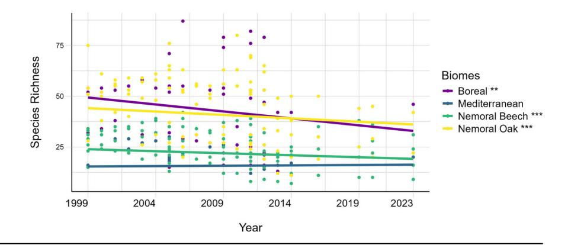

https://doi.org/10.1038/s44185-026-00126-9

# Canopy closure and intensifying climate extremes drive understory species loss over 25 years of forest monitoring

Check for updates

Maura Francioni¹ ⊠, Alessandro Bricca², Anna Andreetta³, Giorgio Brunialti⁴, Filippo Bussotti⁵, Giandiego Campetella¹, Roberto Canullo¹, Stefano Carnicelli⁶, Guia Cecchini⁶, Marco Cervellini¹, Francesco Chianucci⁻, Simone Di Piazza⁶, Zuzana Fačkovcová⁶,¹₀, Luisa Frati⁴, Paolo Giordani⁶, Martina Pollastrini⁵, Nicola Puletti⁻, Mirca Zotti⁶ & Stefano Chelli¹

Forest plant diversity is threatened by global change, highlighting the importance of long-term monitoring to disentangle short-term fluctuations from directional changes of communities. We investigate changes in understory vascular plant communities over 25 years (1999-2023) in 31 Italian permanent ICP Forests plots across four forest biomes. We assessed temporal dynamics of alpha diversity with respect to climate, forest structure and soil parameters. Analysing the two components of beta diversity (turnover and nestedness) at two temporal scales, we distinguish between interannual variations and long-term trends. Richness loss occurred in alpine coniferous and temperate deciduous forests, driven by increased canopy closure and climatic extremes. In these forests, species decline corresponded to long-term trends in both turnover and nestedness. Conversely, Mediterranean (i.e., sclerophyllous evergreen forests) forests exhibited stable richness, characterized by interannual species turnover. Species filtering and replacement have increased in alpine coniferous and temperate deciduous forests, reflecting shifts from initial environmental conditions. Our results underscore changes in forest understory diversity over time, particularly in forests impacted by historic management practices and climatic extremes. Conversely, Mediterranean drought-prone forests with steady canopy cover appear more stable. Continued long-term monitoring is essential to assess how canopy stabilization and climate change interact in shaping future dynamics.

Forests cover 31% of the world's land surface1, hosting the majority of Earth's terrestrial biodiversity2. Especially in temperate forests, the vascular plants occurring in the understory layer represent a crucial component of their biodiversity3. This component includes more than 80% of the overall plant species richness, showing great sensitivity to environmental changes, and influencing tree regeneration and biogeochemical cycles4,5. This huge diversity, which is vital for ecosystem functioning and stability, is increasingly facing multiple threats, including climate change, air pollution, and natural or anthropogenic disturbance dynamics (e.g., tree canopy defoliation, management intensification or abandonment)6-9, with cascading

effects on forests' capacity to sustain environmental processes underpinning human health and quality of life10.

Climate warming can drive the thermophilization of plant communities11 and may also lead to the reduction of understory plant species richness12. Increased soil resource availability – often associated with nitrogen deposition – enhances understory plant species richness by increasing the number of ubiquitous, eutrophic, and acidophilous species13. Changes in tree canopy cover are responsible for understory species compositional shifts, with species-poor communities often under dense forests due to low light-availability14–16 (but see Chianucci et al.8). Despite the

¹School of Biosciences and Veterinary Medicine, University of Camerino, Camerino, Italy. ²Faculty of Agricultural, Environmental and Food Sciences, Free University of Bozen-Bolzano, Bolzano, Italy. ³Department of Chemical and Geological Sciences, University of Cagliari, Cagliari, Italy. ⁴TerraData environmetrics, Spin-Off Company of the University of Siena, Monterotondo Marittimo, Italy. ⁵Department of Agriculture, Food, Environment and Forestry, University of Florence, Florence, Italy. ⁵Department of Earth Sciences, University of Florence, Florence, Italy. ⁵CREA, Research Centre for Forestry and Wood, Arezzo, Italy. ⁵Department of Earth, Environment and Life Sciences, University of Genoa, Genoa, Italy. ⁵Department of Pharmacy, University of Genoa, Genoa, Italy. ¹Plant Science and Biodiversity Centre, Slovak Academy of Sciences, Bratislava, Slovakia. ⊠e-mail: maura.francioni@unicam.it

advancement of knowledge regarding the understory's response to environmental changes, several key issues remain open. First, understory communities are expected to exhibit context-dependent responses to environmental drivers due to inherent site characteristics and the varying influences of multiple local and regional factors (e.g., a unique combination of soil and climatic properties, disturbance history, soil type, canopy density, tree composition)17–19. Indeed, when analyzing forest vegetation shifts after 40 years, Wrońska-Pilarek et al. 13 found clear patterns only when focusing on single forest types separately, since the magnitude and direction of understory changes varied greatly between forest types. This implies that research outcomes deriving from a given forest type cannot be automatically extended to other forests and highlights the importance of targeted investigations on forests characterized by similar ecological features to evaluate the impact of environmental changes on plant diversity17,20. Second, a large amount of the research findings come from studies based on space-for-time substitution approaches21,22 or studies involving the use of semi-permanent plots to resurvey historical locations where vegetation surveys were previously conducted23,24. Although the resurvey approach with semipermanent plots provides valuable insights, it is associated with notable limitations, including inconsistencies in sampling timing, relocation errors, and observer-related biases, which can affect data reliability25,26. Therefore, the use of permanent plots is strongly recommended in repeated surveys (see de Bello et al.27 and references therein). However, even when permanent plots are used, vegetation studies are often based on two or few survey events9,14,28,29, overlooking the effects of changing environmental conditions30,31 (but see Bernhardt-Römermann et al.32). The lack of continuous time series of monitoring vegetation changes fails to account for the intrinsic dynamics of plant communities, including their frequently delayed responses to environmental variations (see Richard et al.33; Wu et al.34 and references therein), thereby increasing uncertainty in resurvey outcomes25. Additionally, vegetation changes over time can be the result of fluctuation events, that is, non-directional and often transient changes in community composition reflecting natural dynamics rather than consistent trends33,35.

Vegetation change is most commonly evaluated by alpha diversity metrics, with species richness being by far the most widely applied measure of biodiversity36,37. Its prevalence reflects both its conceptual clarity and its practical advantages. Species richness provides a direct and intuitive representation of biodiversity change, as local declines in the number of species may indicate local extirpations or failures to maintain viable populations37. Furthermore, species richness is methodologically feasible and robust in long-term monitoring frameworks. Data required to estimate local richness can be collected consistently over time using standardized field protocols, and a wide range of well-developed statistical approaches exists to account for sampling effects and detection uncertainty (see Fletcher et al.37 and references therein). These features make species richness particularly suitable for temporal analyses aimed at detecting directional changes in biodiversity, which require comparable sampling designs through time. The widespread use of species richness, particularly in conservation contexts38, is further reinforced by its integration and central role in international policies39. However, stability in species richness over time can mask even drastic changes in species composition35,40. Therefore, incorporating other diversity metrics, such as beta diversity31,35,41, is crucial for a more comprehensive understanding of temporal community dynamics.

Temporal variation in community composition (i.e., beta diversity) can be partitioned into two additive components: species turnover and nestedness42. This distinction is fundamental because any difference in species compositions between two communities can arise from only two elementary processes: species replacement and species loss (or gain). Consequently, these two components are informative of different underlying ecological mechanisms. Turnover reflects changes in community composition driven by the replacement of species over time, whereby species lost between two time points are replaced by different species. High turnover is therefore expected to be associated with variation in environmental conditions that favour different species at different times, reflecting shifts in competitive hierarchies and immigration—extinction dynamics22,43. In such

a case, community composition changes substantially, while overall species richness may be maintained through compensatory replacement. In contrast, nestedness reflects directional species loss without replacement, indicating progressive community impoverishment. Thus, it arises when communities observed at later time points constitute subsets of past, speciesricher communities. This pattern can emerge under changes in environmental conditions imposing ordered disassembly of communities, where specialist or late-successional species are selectively lost42,43. Such phenomena are often associated with increasing environmental stress and habitat simplification (see Liu et al.44; Wang and Yang45 and references therein). Accordingly, nestedness is expected to increase when extinction processes dominate over colonization, and to decrease when compensatory dynamics restore previously lost species (recolonization). Disentangling turnover and nestedness is therefore essential for linking compositional change to underlying ecological mechanisms, as similar levels of overall beta diversity may arise either from dynamic species replacement or from directional diversity loss42,43. Moreover, by analyzing these two components at two different temporal scales (i.e., immediate and cumulative), it is possible to further distinguish between interannual variations and long-term trends in turnover and nestedness. Distinguishing between these two time scales enables inferences of whether observed compositional changes represent transient interannual fluctuations or consistent directional reorganization of forest communities over time (see Di Cavalho et al.46). Interannual fluctuations in composition may arise from stochastic demographic variation(i.e., the equilibrium dynamics47), conversely, long-term directional changes may reflect persistent shifts in environmental conditions or successional trajectories (see Hillebrand et al.35 and references therein).

In this context, using permanent monitoring plots repeatedly surveyed over a 25-year period (1999-2023), we investigated long-term patterns and drivers (i.e., climate, soil, and forest structure) of forest understory plant species alpha diversity, as well as changes in beta diversity at different time scales. Forest plots were classified into four different biomes48: boreal (i.e., alpine coniferous forests of the temperate oro belt49), Mediterranean (i.e., sclerophyllous evergreen forests49), nemoral beech and nemoral oak (i.e., temperate deciduous forests49). Our study utilized the Italian monitoring plots of the ICP Forests network (International Co-operative Program on the Assessment and Monitoring of Air Pollution Effects on Forests, http:// icp-forests.net/page/icp-forests-manual), which are distributed across a broad biogeographical gradient, from the Alps to the Mediterranean. This distribution encompasses diverse forest types and a wide variety of vascular plant species50, making Italian forests an optimal case study for assessing vegetation dynamics across different environmental conditions. Although temporal case studies from forests of central and northern Europe exist32, southern Europe remains largely overlooked, despite being a hot spot for global changes51.

We asked the following three questions:

- Q1) What are the temporal patterns of understory species richness across different biomes? Does species richness change significantly over a 25-year continuous monitoring period?
- Q2) What are the key environmental drivers of understory species richness in different biomes? Do climate, soil, and forest structure influence species richness similarly across the studied biomes?
- Q3) To what extent do turnover and nestedness drive temporal trends in understory beta diversity across biomes, and how do these dynamics vary between time scales i.e., reflecting interannual fluctuations vs. long-term trends?

The outcomes of this research will help understand the ongoing forest diversity dynamics and their drivers, providing valuable insights for science-based conservation policies and forest planning, in alignment with international policies 39,52,53.

#### Results

The total number of resurveys conducted over the study period (1999–2023) was as follows: 51 for the boreal biome, 29 for the Mediterranean biome, 101 for the nemoral Beech biome, and 96 for the nemoral oak biome. Over the

Fig. 1 | Temporal trends of understory species richness. Temporal trend of understory species richness (y-axis) over the 25 years of monitoring (x-axis) obtained with linear mixed models. Biomes are colour-coded for colour-blind accessibility117: violet for the boreal, deep blue for the Mediterranean, emerald green for the nemoral beech, and yellow for the nemoral oak. Significance levels are indicated as \* (p < 0.05), \*\* (p < 0.01), and \*\*\* (p < 0.001).

Table 1 | Explanatory variables showing significant relationships with understory species richness across biomes

| Biome         | Group            | Variable                  | Estimate (p-value) | Marginal R2 | Conditional R2 |
|---------------|------------------|---------------------------|--------------------|-------------|----------------|
| Boreal        | Forest structure | Tree cover                | -4.63 (***)        | 2.2%        | 99.2%          |
|               |                  | Shrub cover               | -3.82 (**)         |             |                |
| Nemoral beech | Soil             | рН                        | -0.4 (**)          | 6.9%        | 93.5%          |
|               | Climate          | CDD_gs                    | -1.63 (**)         | 1.7%        | 90.7%          |
|               | Forest structure | Tree cover                | -1.27 (***)        | 1.3%        | 91.9%          |
| Nemoral oak   | Climate          | Precipitation seasonality | -1.33 (*)          | 1.3%        | 95.7%          |
|               |                  | TX90p_y                   | -1.43 (*)          |             |                |
|               | Forest structure | Shrub cover               | -2.74 (**)         | 1.7%        | 95.3%          |
| Mediterranean | Climate          | CDD_gs                    | -0.85 (*)          | 1.9%        | 95.1%          |

The models presented here result from the model selection procedure. Marginal R-squared reflects variance explained by fixed factors, while conditional R-squared accounts for both fixed and random factors. Significance levels are indicated as \* (p < 0.05), \*\* (p < 0.01), and \*\*\* (p < 0.001).

25-year period, in the boreal biome, understory species richness ranged from 27 to 57 species, with a mean of 42 species. In the nemoral beech biome, understory species richness varied between 18 and 33 species, with a mean of 26 species. For the nemoral oak biome, the number of understory species ranged from 29 to 55, with a mean of 43 species. In the Mediterranean biome, understory species richness varied from 16 to 29 species, with a mean of 23 species. The complete values of mean species richness, separated by biome and year, are provided in Table S1.

# Trends in understory species richness and their environmental drivers

The species richness of understory vascular plants showed a significant decline from 1999 to 2023 in three out of four biomes (Fig. 1). Specifically, this trend was evident in the boreal (estimate= -0.69, p < 0.01), nemoral oak (estimate= -0.34, p < 0.001), and nemoral beech (estimate= -0.20, p < 0.001) biomes. In contrast, the Mediterranean biome showed no significant trend in the understory species richness (estimate= 0.04, p > 0.7). Aware that the distribution of surveys was not balanced across the years, we repeated the analyses considering only the 1999–2014 period, but the trends of understory species richness remained consistent in all biomes (see Table S2).

Climate and forest structure were the main drivers of these trends (Table 1). In the boreal biome, understory species richness showed a negative relationship with both the tree and shrub cover. In the nemoral beech biome, understory species richness decreased with increasing numbers of consecutive dry days during the growing season and with higher tree cover. A negative effect of soil pH on species richness was observed only in this biome. In the nemoral oak biome, understory species richness declined with increasing precipitation seasonality, the annual frequency of hot days, and higher shrub cover. In the

Table 2 | Beta-diversity components with significant temporal trends across biomes at the two temporal scales

| Biome         | Cumulative Turnover | Immediate Turnover | Immediate Nestedness | Cumulative Nestedness |
|---------------|------------------------|-----------------------|-------------------------|--------------------------|
| Boreal        |                        | -0.0184 (***)         |                         | 0.0113 (**)              |
| Nemoral beech | 0.0058 (***)           |                       |                         | 0.0025 (*)               |
| Nemoral oak   | 0.0093 (***)           |                       | 0.0042 (*)              |                          |
| Mediterranean |                        | 0.0107 (**)           |                         |                          |

Significance levels for the estimates are indicated as \* (p < 0.05), \*\* (p < 0.01), and \*\*\* (p < 0.001).

Mediterranean biome, understory species richness decreased with more consecutive dry days during the growing season. However, as previously mentioned, no significant temporal trend in species richness was observed in this biome over the study period.

### Temporal beta diversity

Significant temporal trends in the two beta diversity components (i.e., turnover and nestedness) were observed across the analyzed biomes at the considered time scales, highlighting shifts in the composition of understory vascular plant communities over time (Table 2). Specifically, the boreal biome showed a negative temporal trend for turnover at the immediate time scale, while a positive trend was observed for nestedness at the cumulative time scale. In the nemoral beech biome, both turnover and nestedness exhibited positive trends at the cumulative time scale. In the nemoral oak biome, turnover showed a positive trend at the cumulative time scale, whereas nestedness exhibited a positive trend at the immediate time scale. Finally, in the Mediterranean biome, turnover showed a positive trend at the immediate time scale.

3

## Discussion

Overstory dynamics of canopy closure over time appear to be a key driver of the understory species richness decline in boreal and nemoral forests, as also found by approaches based on space-for-time substitution and semipermanent plots54-57. This is probably related to the natural process of canopy regeneration after the last logging event (open-to-close dynamic 14), given that the permanent plots of the ICP Forests Level II network were not logged during the monitoring period. In many plots, the last logging event occurred 50-60 years before the first sampling year (i.e., 1999)58. Our interpretation is confirmed by the significant increase in tree cover over time, particularly for the boreal biome (Table S3). The occurrence of permanent monitoring plots undergoing strong canopy-closure dynamics is not a bias of our study; in fact, this dynamic is mirroring one of the most widespread and relevant phenomena ongoing in European forests, i.e., the abandonment of active forest management and the inherent increase in canopy cover59,60. Therefore, if the current socio-economic trends are consistent in future decades, we may expect a decline of species richness in nemoral and boreal European forests with the abandonment of forest management practices and related progressive canopy recovery. Opposite patterns should be expected in case of canopy opening due to natural disturbances, tree mortality, or revival of forest management practices61,62.

The reduction of species richness is not necessarily detrimental to the conservation of forest understory diversity. Indeed, species richness can be a misleading diversity metric for conservation purposes since it does not consider species identity and functioning63–65. Boch et al.66 found that high plant species richness indicates forest disturbances rather than conservation status. Furthermore, Hilmers et al.67 observed a U-shaped response of species richness to forest succession, with peak diversity values in early and late stages. We therefore do not exclude a future increase in species richness if the monitored forests are left undisturbed.

We speculate that light-demanding species are progressively filtered out by the increase in canopy cover, while shade-tolerant species are facilitated, as shown by many researchers60,68. Indeed, this is supported by the analysis of Ellenberg indicator values, which shows a decreased mean light value over time (Table S4). Shade-tolerant species are often forest specialists, sometimes of conservation interest, while light-demanding species are often generalists or typical of open ecosystems69. Our speculation is supported by data observation, which reveals that some non-forest species (sensu Heinken et al.70) - like *Holcus lanatus L*. and *Rhinanthus minor L*. were present in the nemoral biome plots during the early years of monitoring, but later disappeared. However, this aspect requires a further and more specific evaluation71.

Our results showed a significant effect of climate - particularly longer dry periods, higher frequency of hot days, and greater precipitation seasonality - in reducing species richness in the nemoral biomes. This suggests that the occurrence of extreme climatic events has a stronger effect than variations in total precipitation or mean temperature. Indeed, several studies have highlighted the predominant role of climatic extremes in shaping biodiversity responses72–74. However, it is important to note that our analysis focused on macroclimatic variables without considering the potential buffering effect of canopy cover. In fact, canopy cover may favour more stable microclimatic conditions (i.e., the climate experienced by the understory layer), as higher canopy cover is expected to generate a larger climate buffering capacity, thus increasing the difference between the macro- and the microclimate19,75.

Our findings point toward a potential shift in forest understory communities toward xerophilization, consistent with findings by Wrońska-Pilarek et al.13, and thermophilization, as reported by Zellweger et al.76 and Braziunas et al.12. This is further supported by the analysis of Ellenberg indicator values, which revealed a decrease in moisture values and an increase in temperature values over time in the nemoral oak biome (Table S4).

Soil variables showed a limited effect on understory species richness despite previous evidence77. However, our results indicate a negative effect of soil pH on species richness in nemoral beech forests. Probably, these forests have achieved a balanced cycle of uptake and release of basic cations (BC; i.e., K, Mg, Ca), so that the soil buffer capacity tends to improve, thanks to the

high levels of atmospheric BC deposition78. Changes in soil pH are known to influence both plant species richness and functioning, but with context-dependent effects21,79. However, we must acknowledge that our soil data were not available for all sampling years of the vegetation surveys, which may have constrained the assessment of the overall contribution of soil predictors to species richness.

Contrary to boreal and nemoral forests, Mediterranean forests did not show significant changes in understory species richness over time. This may depend on one or a combination of the following aspects. First, the understory of Mediterranean forests is largely composed of woody species, which are usually more persistent across years than herbaceous species. Second, the canopy cover of the sampled Mediterranean forests remained relatively stable throughout the monitoring period (see Table S5), suggesting that the understory species pool has not been subject to filtering effects from changes in canopy dynamics.

Another consideration concerns the amount of variance explained by the models. We found that the fixed factors explained less than 6.9% of the overall variance in all models. This suggests that a larger portion of the variance depends on the specific features of the study plots (i.e., the random factors), further confirming that local environmental conditions and disturbance history of each plot play a crucial role in determining diversity patterns81–83.

The complex temporal dynamics in species turnover and nestedness across biomes emphasize the multifaceted nature of beta diversity and its scale-dependent patterns. Examining both immediate and cumulative temporal scales, we disentangled key processes shaping vegetation communities over time. In general, both turnover and nestedness contributed to changes in beta diversity at both temporal scales, although with distinct trends and biome-specific exceptions.

In biomes where understory species richness decreases over time, both cumulative turnover and nestedness are observed. This suggests consistent increasing trends of beta diversity patterns during the monitoring period. In detail, the boreal biome showed an increasing trend in cumulative nestedness, indicating a progressive process of species filtering, leading to communities that are increasingly subsets of their original state42,84. In contrast, no evidence in the cumulative turnover was observed, while a decrease in immediate turnover was shown, suggesting that the rate of species replacement is stable considering the long-term perspective and is reducing considering consecutive years. These findings might be related to a stabilization process where nestedness is of overwhelming importance in the long-term perspective and is potentially associated with environmental-induced constraints, such as the reduction of light availability due to higher canopy cover.

Nemoral biomes exhibited increasing trends in cumulative turnover, suggesting that species replacement is the most important process behind understory community changes over time. Many researchers confirm that species turnover is a common response to substantial environmental changes from the initial conditions in terms of forest structure and resource availability62. The nemoral beech biome was also characterized by cumulative nestedness, revealing that these forests are experiencing a noticeable and complex reshaping of the understory communities over time.

The Mediterranean biome, characterized by understory species richness stability over time, showed a compositional dynamic marked by increasing turnover acting at the immediate time scale only. This pattern suggests a "carousel model" where species enter and exit the plots without leading to a cumulative trend over time. Such a mechanism reflects a dynamic equilibrium where the community maintains richness but is subject to interannual compositional fluctuations probably related to stochastic events or interannual climate variability. This interpretation is further supported by recent findings from Jandt et al. 40 and Bonari et al. 31, who demonstrated that stable species richness can conceal underlying trends of biodiversity reorganization, often resulting from species-specific responses to environmental changes.

In conclusion, in this paper, we used permanent monitoring plots spanning a wide environmental gradient to assess 25-year trends and drivers of forest understory plant species richness. We found that forests belonging to boreal and nemoral biomes (i.e., coniferous alpine forests and temperate deciduous forests, respectively) appear more sensitive to global changes than

Fig. 2 | Distribution of the 31 Italian ICP Level II plots. Study plots grouped into biome types according to Mucina et al.48 and colour-coded for colour-blind accessibility117.

Mediterranean forests. Specifically, boreal and nemoral forests are experiencing a decline in understory species richness, associated with increased canopy cover—partly a legacy of past forest management practices—as well as with greater precipitation seasonality, longer dry periods, and heat waves. In contrast, Mediterranean forests, which are generally adapted to recurrent droughts and characterized by a more stable canopy cover, showed stable levels of species richness over time.

Beta diversity analyses revealed that the processes behind species richness patterns vary by biome and temporal scale. In biomes with declining richness, both turnover and nestedness operate over the long term, suggesting deterministic processes such as environmental change and progressive species filtering. In contrast, Mediterranean forests exhibited interannual fluctuations without long-term trends in beta diversity, indicating a dynamic equilibrium likely driven by stochastic events or interannual climate variability.

Overall, we highlight the importance of long-term monitoring using permanent plots repeatedly sampled over time to uncover changes in diversity, as well as the processes and drivers behind these changes at different temporal scales. Despite the relatively high sampling effort and the costs associated with monitoring infrastructure, these types of data represent an unprecedented resource for understanding the site-specific effects of global change. For instance, continued long-term monitoring will be essential to assess how future canopy stabilization in boreal and nemoral biomes will interact with climate change in shaping understory dynamics. Additionally, continued monitoring can assess whether Mediterranean forests will experience shifts in understory species richness if tipping points related to climate change are reached.

Our findings also highlight the importance of developing adaptive forest management strategies considering site-specific responses to environmental change.

#### Methods

# Study Area and Vegetation Sampling

The study considers 31 permanent monitoring plots established under the ICP Forests Level II framework in Italy. These plots represent the intensive forest monitoring program and are key for providing insight into cause-and-effect relationships between the condition of forest ecosystems and various stress factors such as air pollution and drought (Fig. 2).

These ICP Forests Level II plots are located within environmentally homogeneous forest areas. Each plot has a dimension of 50 m  $\times$  50 m, subdivided into 25 sub-plots of 10 m  $\times$  10 m, of which 12 permanent sub-plots were selected in a chessboard pattern as sampling units for vegetation

monitoring over time86. All the plots are fenced, preventing disturbances from human activities (e.g., trampling and logging), as well as from medium- to large-sized mammals.

The ICP Forests program involves vegetation sampling in permanent plots (at least) every five years, following a standard and harmonized protocol, including crew training and intercalibration exercises87. Sampling followed quality assurance procedures88. All surveys were carried out during the summer season, when vegetation reached maximum development, collecting species occurrences and abundances (percent cover) according to different forest layers (herb, shrub, and tree layers). Here, we considered only occurrences of vascular plants, including both herbaceous and woody plants up to 0.5 m in height (hereafter, "understory"). Species nomenclature followed Pignatti89.

We grouped the 31 plots into homogeneous biomes according to the classification of Mucina et al.48, as species response is context-dependent. The classification resulted in 7 plots belonging to the boreal biome (i.e., alpine coniferous forests of the temperate oro belt49), 4 plots to the Mediterranean biome (i.e., sclerophyllous evergreen forests49), and 20 plots to the nemoral biome (i.e., temperate deciduous forests49). Due to the high number of plots within the nemoral biome and the significant differences in terms of climate and vegetation of this biome90, we further refined the classification by introducing a finer level48. As a result, we identified 10 plots as nemoral oak forest biome and 10 plots as nemoral beech forest biome, reflecting warm temperate and cool temperate climates, respectively (Fig. 2)90.

# **Explanatory variables**

Based on existing ecological knowledge on forest response to environmental conditions21,56 and data availability, we selected, for each specific plots, a set of predictors at different spatial scales, including climate, soil, and forest structure parameters (Table 3).

Climatic conditions for each study plot and year of vegetation sampling were obtained from the E-OBS dataset provided by the Copernicus Climate Change Service (https://surfobs.climate.copernicus.eu). This dataset is available on regular latitude-longitude grids with a spatial resolution of 0.1 degrees (approximately 8 km²) and daily temporal resolution. Using mean daily temperature (°C) and total daily precipitation (mm) data, we computed the following climatic variables: mean annual temperature, mean temperature of the growing season, total annual precipitation, total precipitation of the growing season, and precipitation seasonality. Precipitation seasonality was expressed as the coefficient of variation (CV) and calculated as  $\sigma/\mu \times 100$ , where  $\sigma$  and  $\mu$ , respectively, represent the standard deviation

Table 3 | List of the environmental variables considered for each group (climate, soil, forest structure), their units, and the range of values

| Group     | Variable                                              | Unit               | Range        |
|-----------|-------------------------------------------------------|--------------------|--------------|
| Climate   | Mean annual temperature                               | °C                 | 0.80-16.82   |
|           | Annual precipitation                                  | mm                 | 212.1–2402.6 |
|           | Precipitation seasonality (CV)                        | %                  | 36.67-125.90 |
|           | Precipitation of the growing season                   | mm                 | 28.9-972.4   |
|           | Mean temperature of the growing season                | °C                 | 5.66–22.78   |
|           | Annual consecutive dry days index (CDD_y)             | days               | 13–105       |
|           | Consecutive dry days index of growing season (CDD_gs) | days               | 7–91         |
|           | TX90p index                                           | %                  | 1.37-50.82   |
|           | Temperature seasonality                               |                    | 4.83-9.38    |
| Soil      | К                                                     | mg l -1 | 0.028-2      |
|           | NH 4 +                          | mg l -1 | 0.010-0.19   |
|           | SO 4 2-                         | mg l -1 | 0.162-2.88   |
|           | NO 3                                       | mg I -1 | 0.010-12.53  |
|           | рН                                                    |                    | 4.261-7.65   |
| Forest    | Tree cover                                            | %                  | 20.25–100    |
| Structure | Shrub cover                                           | %                  | 0–85         |
|           | Mean tree-defoliation                                 | %                  | 3–63         |

and the mean of the total monthly precipitation. This metric reflects the intra-annual (seasonal) variability in precipitation amount, indicating how stable or variable precipitation is across the twelve months of the year. In addition, temperature seasonality was calculated as the standard deviation (SD) of monthly mean temperatures, based on daily maximum temperature (°C) data. Similarly, this metric describes the intra-annual variability in temperature, indicating how stable or variable thermal conditions are throughout the year. Additionally, the following climatic indices were calculated: the number of annual consecutive dry days (CDD\_y), the number of consecutive dry days during the growing season (CDD\_gs), and the percentage of hot days during the year (TX90p). The Consecutive Dry Days (CDD) index is calculated by identifying the maximum number of consecutive days with daily precipitation less than 1 mm within a given period (https://etccdi.pacificclimate.org/list\_27\_indices.shtml). The TX90p index represents the percentage of days in a given year during which the daily maximum temperature exceeds the 90th percentile of daily maximum temperatures of the base period (1970-2000 in this study)91. The TX90p index was calculated using the 'climdex.tx90p' function from the 'Climdex.pcic' package. These climatic indices are designed to monitor extreme climate events, such as heat waves and droughts92. Widely used in previous studies, these indices are also straightforward to interpret33,92,93. They focus on capturing patterns of extreme conditions that typically occur multiple times a year, rather than rare, high-impact events that may only occur once a decade94.

Soil solutions were collected bi-weekly in the field at the study plots, following the standard procedures of the ICP Forests manual (http://icp-forests.net/page/icp-forests-manual). Tension lysimeters were installed in mineral soil to continuously collect gravitational and weakly retained soil water at specific tension levels (i.e., down to -60 kPa), allowing for ongoing monitoring of soil solutions without causing soil disturbance. This enables tracking nutrient availability and pollutants. Specifically, we employed the following variables from the topsoil (at a depth of 20 cm): pH, K, NH4+, NO3-, and SO42-. The bi-weekly measurements were aggregated into annual means. Correlation between variables was evaluated using the 'cor' function from the R package, and no intercorrelations were detected among the

selected variables (Table S6). Soil data were not available for the Mediterranean biome

Forest stand characteristics, also measured in the field at each plot during the same years as the vegetation surveys, followed ICP Forest procedures (http://icp-forests.net/page/icp-forests-manual). Specifically, data were collected on tree and shrub layer cover (in percentage) as well as average tree defoliation percentage, as these factors influence the subcanopy microclimate, directly affecting the understory layer76,95. Tree cover and tree defoliation are fundamental features for assessing forest conditions. Tree defoliation refers to the reduction in the foliage density of a tree's crown compared to a reference tree assumed to exhibit full foliage density96 and is considered an indicator of tree and forest health97. In contrast, tree cover refers to the percentage of forest area occupied by the vertical projection of tree crowns98,99, representing the actual extent of overstory cover100.

# Data analysis

We prepared two datasets for analysis: a species matrix and a predictor matrix. The species matrix comprised understory species occurrences at each plot and in each year, along with the total number of sampling units per plot. Since we aimed to analyze each biome separately, we created four distinct species matrices coupled with four predictor matrices, one for each forest biome. Species richness (S) was calculated from the species matrix by summing the number of species observed across all sampling units within each plot for each sampled year. The predictor matrix comprised all environmental variables for each sampling plot and year. Predictors were standardized using the 'scale()' function from the 'base' R package, which transforms each variable to have a mean of zero and a standard deviation of one. This standardization ensures comparability among variables with differing units, enhances model stability, and allows for comparable coefficients in statistical analyses.

For the statistical analysis, we fitted linear mixed-effects models (LMMs), using the 'Ime4' package. The analysis consisted of three major parts, each addressing one of the study's objectives: the first two focused on species richness as a metric of alpha diversity, while the third focused on Sørensen dissimilarity index as a metric of beta diversity.

Specifically, the first group of analyses (i) tested variation in the species richness over time in each biome. For this purpose, we ran models of the form "S  $\sim$  Year + (1|SiteID) + (1 | N.Su)", where 'S' is species richness and 'N.Su' is the number of sampling units. The analyses were conducted at the level of individual plots (SiteID), which serve as the statistical units of analysis. This approach was necessary to account for repeated measurements collected over time within each plot and adjust for an unequal number of sampling units across surveys.

The second group of analyses (ii) tested the effects of environmental variables (listed in Table 3) on species richness. For this task, we used LMMs of the form "S ~ Environmental variables + (1|SiteID) + (1 | N.Su)". Separate models were fitted for each group of environmental variables (climate, soil, forest structure) within each biome, to maximize data retention. In fact, not all environmental variables were measured during every survey or in every plot, and therefore, including all predictors in a single model would have excluded all cases with missing values, substantially reducing sample size and statistical power. Multicollinearity was assessed for each model using the variance inflation factor (VIF) from the 'car' package. Thus, none of the fixed factors included in our final models showed intercorrelation issues (VIF < 5)101. Then, we subjected the linear mixed models built with all variables of each group to model selection. Specifically, we applied a bidirectional stepwise selection procedure (both forward and backward) based on the Akaike Information Criterion  $(AIC)^{102-104}$ . This approach is based on an algorithm that adds or removes variables depending on whether they decrease the AIC, in order to obtain the model with the lowest AIC value. Model selection was performed with the 'step' function in 'lmerTest' package105.

Model assumptions (homoscedasticity, residual independence, and normal distribution of residuals) were assessed through visual inspection of histograms and residual plots, including O-O plots and fitted values versus

residuals plots106-108. Additionally, spatial and temporal autocorrelation of model residuals were evaluated using Moran's I and Mantel tests, respectively (Table S7 and S8)56,109. Temporal autocorrelation was computed as the Pearson correlation between the distance matrix of model residuals and the temporal distance matrix based on sampling year, using 9.999 permutations with the 'mantel' function in 'vegan' package110. Spatial autocorrelation was evaluated on plot-level residuals using geographical coordinates and distance-based neighbour lists with the 'moran.test' function in 'spdep' package111. Only the boreal biome showed temporal autocorrelation, and therefore, we incorporated an autoregressive correlation structure (corAR1)112. This model was fitted using the 'lme' function in the 'nlme' package, as 'lme4' package does not support correlation structures113. P-values for the variables in the model were obtained using the 'summary' function from the 'lmerTest' package105.

For the third group of analyses (iii), we investigated the temporal trends in beta diversity  $^{114}$  within each biome, focusing on its two primary components: turnover and nestedness  $^{42}$ . Beta diversity was quantified using the Sørensen dissimilarity index, which is one of the most widely used measures due to its dependence on the proportion of species shared between two communities  $^{42}$ . The Sørensen dissimilarity index ( $\beta$ sor) is formulated as:

$$\beta_{sor} = \frac{b+c}{2a+b+c}$$

where a is the number of species common to both plots, b is the number of species occurring only in the first plot, and c is the number of species occurring only in the second plot.

To describe species turnover, we used the Simpson pairwise dissimilarity index ( $\beta$ sim), calculated as:

$$\beta_{sim} = \frac{\min(b, c)}{a + \min(b, c)}$$

where a, b, and c are the same variables defined above. Since  $\beta$ sor and  $\beta$ sim are equal in the absence of nestedness, their difference represents the nestedness component of beta diversity. Accordingly, the nestedness-resultant dissimilarity ( $\beta$ nes) was derived and formulated as:

$$\beta_{nes} = \beta_{sor} - \beta_{sim}$$

Therefore, two distance matrices were computed to account for turnover and nestedness resultant components using the 'betapart' package115. Since beta diversity analysis is based on pairwise calculations and multiple sampling events were conducted over time at each plot, the analysis was performed across two temporal scales: immediate and cumulative46. For the immediate time scale, beta diversity was calculated between consecutive sampled years (e.g., t1-t2, t2-t3, ...), reflecting interannual changes in community composition. On the cumulative time scale, beta diversity was calculated between the first sampled year and each subsequent sample taken over time (e.g., t1-t2, t1-t3, t1-tn), capturing cumulative (i.e., long-term) changes in community composition. Temporal trends in turnover and nestedness were investigated by building separate LMMs for each biome, with distinct models for each combination of beta diversity component and temporal scale.

For immediate time scale models, beta-diversity values between consecutive years were used as the response variable, and a new variable identifying each pairwise comparison was included as a fixed factor. The 'SiteID' and 'temporal distance' (e.g., the time interval between consecutive samples  $t_1$ – $t_2$ ) were treated as random factors to account for the hierarchical structure of the sampling design and heterogeneous repeated measures over time. For example, if three repeated samplings were present for a plot ( $t_1$ – $t_2$ – $t_3$ ), temporal distance represented the interval between  $t_1$ – $t_2$ , and  $t_2$ – $t_3$ . For cumulative time scale models, 'temporal distance' (i.e., the number of years elapsed since the first sampling) was included as the fixed factor, while 'SiteID' was treated as a random factor. In this case, if

three repeated samplings were present for a plot  $(t_1-t_2-t_3)$ , the temporal distance represented the interval between  $t_1-t_2$ , and  $t_1-t_3$ . This approach allows for assessing whether compositional changes are continuous (e.g., indicating a linear relationship between cumulative turnover and temporal distance) or whether assemblages revert to earlier states 46. When the LMM did not meet the required assumptions, the dependent variable was transformed using a square-root function and/or a Generalized Linear Mixed Model (GLMM) was employed. This was the case for the boreal biome, where a GLMM with a beta distribution and a logit link function was fitted to investigate temporal trends in nestedness at the cumulative time scale. Nestedness values were adjusted to avoid 0 and 1 values in order to meet the assumptions of the beta distribution, and the analysis was performed using the 'glmmTMB' package.

All statistical analyses and visualizations were performed in the R statistical programming language116 (version 4.2.2).

# **Data availability**

The datasets generated and analyzed during the current study, as well as the underlying code, are available in Zenodo repository at https://zenodo.org/records/17544999.

# Code availability

The underlying code for this study is available in Zenodo and can be accessed via this link https://zenodo.org/records/17544999.

Received: 15 July 2025; Accepted: 17 February 2026; Published online: 01 April 2026

#### References

- FAO. Global Forest Resources Assessment 2020: Main Report. https://doi.org/10.4060/ca9825en (2020).
- Vié, H.-T. & Stuart. Wildlife in a Changing World An Analysis of the 2008 IUCN Red List of Threatened Species (2009).
- Tinya, F. et al. Environmental drivers of forest biodiversity in temperate mixed forests – A multi-taxon approach. Sci. Total Environ. 795, 148720 (2021).
- Gilliam, F. S. The Ecological Significance of the Herbaceous Layer in Temperate Forest Ecosystems. https://doi.org/10.1641/B571007 (2007).
- Landuyt, D. et al. The functional role of temperate forest understorey vegetation in a changing world. Glob. Chang Biol. 25, 3625–3641 (2019).
- Burrascano, S., Rosati, L. & Blasi, C. Plant species diversity in Mediterranean old-growth forests: A case study from central Italy. Plant Biosyst. - Int. J. Dealing All Asp. Plant Biol. 143, 190–200 (2009).
- Van Dobben, H. F. & de Vries, W. The contribution of nitrogen deposition to the eutrophication signal in understorey plant communities of European forests. *Ecol. Evol.* 7, 214–227 (2017).
- Chianucci, F. et al. Silvicultural regime shapes understory functional structure in European forests. J. Appl. Ecol. 61, 2350–2364 (2024).
- Havrdová, A. et al. Decadal decline in herbaceous species richness in wetland forests: Effects of an introduced pathogen and environmental change. Ecol. Manag. 583, 122569 (2025).
- Díaz, S. et al. Pervasive human-driven decline of life on Earth points to the need for transformative change | Science. https://www. science.org/doi/10.1126/science.aax3100 (2019).
- Govaert, S. et al. Rapid thermophilization of understorey plant communities in a 9 year-long temperate forest experiment. *J. Ecol.* 109, 2434–2447 (2021).
- Braziunas, K. H. et al. Projected climate and canopy change lead to thermophilization and homogenization of forest floor vegetation in a hotspot of plant species richness. Glob. Change Biol. 30, e17121 (2024).

- Wrońska-Pilarek, D., Rymszewicz, S., Jagodziński, A. M., Gawryś, R. & Dyderski, M. K. Temperate forest understory vegetation shifts after 40 years of conservation ScienceDirect. https://doi.org/10.1016/j.scitoteny.2023.165164 (2023).
- Cervellini, M. et al. Relationships between understory specialist species and local management practices in coppiced forests – Evidence from the Italian Apennines. *Ecol. Manag.* 385, 35–45 (2017).
- Kermavnar, J. & Kutnar, L. Three decades of understorey vegetation change in Quercus-dominated forests as a result of increasing canopy mortality and global change symptoms. *J. Veg. Sci.* 35, e13317 (2024).
- Vetaas, O. R., Shrestha, K. B. & Sharma, L. N. Changes in plant species richness after cessation of forest disturbance. *Appl. Veg. Sci.* 24, e12545 (2021).
- Bouchard, E. et al. Global patterns and environmental drivers of forest functional composition. *Glob. Ecol. Biogeogr.* 33, 303–324 (2024).
- Kermavnar, J. & Kutnar, L. Mixed Signals of Environmental Change and a Trend towards Ecological Contraction in Ground Vegetation across Different Forest Types. https://doi.org/10.21203/rs.3.rs-3017844/v1 (2023)
- De Frenne, P. et al. Forest microclimates and climate change: Importance, drivers and future research agenda. *Glob. Chang Biol.* 27, 2279–2297 (2021).
- Naaf, T. & Kolk, J. Initial site conditions and interactions between multiple drivers determine herb-layer changes over five decades in temperate forests. *Ecol. Manag.* 366, 153–165 (2016).
- Chelli, S. et al. Multiple drivers of functional diversity in temperate forest understories: Climate, soil, and forest structure effects. Sci. Total Environ. 916, 170258 (2024).
- Guclu, C., Luk, C., Ashton, L. A., Abbas, S. & Boyle, M. J. W. Beta diversity subcomponents of plant species turnover and nestedness reveal drivers of community assembly in a regenerating subtropical forest. *Ecol. Evol.* 14, e70233 (2024).
- Van Den Berge, S., Tessens, S., Baeten, L., Vanderschaeve, C. & Verheyen, K. Contrasting vegetation change (1974–2015) in hedgerows and forests in an intensively used agricultural landscape. *Appl. Veg. Sci.* 22, 269–281 (2019).
- Vild, O. et al. Long-term shift towards shady and nutrient-rich habitats in Central European temperate forests. *New Phytol.* 242, 1018–1028 (2024).
- Kapfer, J. et al. Resurveying historical vegetation data opportunities and challenges. Appl. Veg. Sci. 20, 164–171 (2017).
- Verheyen, K. et al. Observer and relocation errors matter in resurveys of historical vegetation plots. J. Veg. Sci. 29, 812–823 (2018).
- De Bello, F., Valencia, E., Ward, D. & Hallett, L. Why we still need permanent plots for vegetation science. *J. Veg. Sci.* 31, 679–685 (2020).
- Li, D. & Waller, D. Long-term shifts in the patterns and underlying processes of plant associations in W isconsin forests. *Glob. Ecol. Biogeogr.* 25, 516–526 (2016).
- Lanta, V. et al. Changes in plant diversity of European lowland forests: Increased homogenization and expansion of shade-tolerant trees. *Biol. Conserv.* 296, 110719 (2024).
- Harásek, M., Klinkovská, K. & Chytrý, M. Vegetation change in acidic dry grasslands in Moravia (Czech Republic) over three decades: Slow decrease in habitat quality after grazing cessation. *Appl. Veg. Sci.* 26, e12726 (2023).
- Bonari, G. et al. Grassland Changes in the Eastern Alps over four decades: unveiling patterns along an elevation gradient. *Appl. Veg. Sci.* 28, e70012 (2025).
- Bernhardt-Römermann, M. et al. Drivers of temporal changes in temperate forest plant diversity vary across spatial scales. *Glob. Change Biol.* 21, 3726–3737 (2015).

- Richard, B. et al. The climatic debt is growing in the understorey of temperate forests: Stand characteristics matter. *Glob. Ecol. Biogeogr.* 30, 1474–1487 (2021).
- 34. Wu, D. et al. Time-lag effects of global vegetation responses to climate change. *Glob. Change Biol.* **21**, 3520–3531 (2015).
- Hillebrand, H. et al. Biodiversity change is uncoupled from species richness trends: Consequences for conservation and monitoring. *J. Appl. Ecol.* 55, 169–184 (2018).
- Seidling, W. et al. Vascular plant species richness in forest vegetation records differs depending on surveyor. *Tuexenia* 34, 329–346 (2014).
- Fletcher, R. J. Jr et al. Beyond species richness for biological conservation. Conserv. Lett. 18, e13124 (2025).
- Paillet, Y. et al. Biodiversity differences between managed and unmanaged forests: meta-analysis of species richness in Europe. Conserv. Biol. 24, 101–112 (2010).
- European Commission. EU Biodiversity Strategy for 2030. https:// environment.ec.europa.eu/topics/nature-and-biodiversity/ habitats-directive en. (2020).
- 40. Jandt, U. et al. More losses than gains during one century of plant biodiversity change in Germany. *Nature* **611**, 512–518 (2022).
- Chelli, S. et al. The diversity of within-community plant species combinations: A new tool for assessing changes in forests and guiding protection actions. *Ecol. Indic.* 163, 112089 (2024).
- 42. Baselga, A. Partitioning the turnover and nestedness components of beta diversity. *Glob. Ecol. Biogeogr.* **19**, 134–143 (2010).
- Si, X., Baselga, A., Leprieur, F., Song, X. & Ding, P. Selective extinction drives taxonomic and functional alpha and beta diversities in island bird assemblages. *J. Anim. Ecol.* 85, 409–418 (2016).
- Liu, W. et al. Partitioning of beta-diversity reveals distinct assembly mechanisms of plant and soil microbial communities in response to nitrogen enrichment. *Ecol. Evol.* 12, e9016 (2022).
- Wang, R. & Yang, X. Nestedness theory suggests wetland fragments with large areas and macrophyte diversity benefit waterbirds. *Ecol. Evol.* 11, 12651–12664 (2021).
- Di Cavalho, J. A., Rönn, L., Prins, T. C. & Hillebrand, H. Temporal change in phytoplankton diversity and functional group composition. *Mar. Biodivers.* 53, 72 (2023).
- 47. Macarthur, R. H. & Wilson, E. O. *The Theory of Island Biogeography*. (Princeton University Press, 1967).
- Mucina, L., Divíšek, J. & Tsakalos, J. L. Europe, Ecosystems of. In *Encyclopedia of Biodiversity* 110–132, https://doi.org/10.1016/ B978-0-12-822562-2.00059-1 (Elsevier, 2024).
- Loidi, J. A multi-scalar classification system for the terrestrial vegetation of the world. Veg. Classif. Surv. 6, 69–78 (2025).
- Chiarucci, A. et al. Exploring patterns of beta-diversity to test the consistency of biogeographical boundaries: A case study across forest plant communities of Italy. Ecol. Evol. 9, 11716–11723 (2019).
- Burrascano, S. et al. Towards an effective in-situ biodiversity assessment in European forests. *Basic Appl. Ecol.* 84, 121–132 (2025).
- 52. European Parliament and Council. *NEC Directive* (EU) 2016/2284. https://www.eea.europa.eu/en/topics/in-depth/air-pollution/necd (2016).
- European Commission. A new EU Forest Strategy for 2030. https:// eur-lex.europa.eu/legal-content/EN/TXT/?uri=CELEX: 52021DC0572&utm (2021).
- 54. Bartha, S., Merolli, A., Campetella, G. & Canullo, R. Changes of vascular plant diversity along a chronosequence of beech coppice stands, central Apennines, Italy. *Plant Biosyst. Int. J. Deal. All Asp. Plant Biol.* **142**, 572–583 (2008).
- Becker, T., Spanka, J., Schröder, L. & Leuschner, C. Forty years of vegetation change in former coppice-with-standards woodlands as a result of management change and N deposition. *Appl. Veg. Sci.* 20, 304–313 (2017).

- 56. Bricca, A. et al. Biodiversity Within and Beyond the Native Distribution of Tree Species: The Case of Pinus nigra Forests in Europe. Glob. Ecol. Biogeogr. 34, e70036 (2025).
- Cubino, J. P. et al. The leaf economic and plant size spectra of European forest understory vegetation. *Ecography* 44, 1311–1324 (2021).
- Fabbio, G., Bertini, G., Calderisi, M. & Ferretti, M. Status and trend of tree growth and mortality rate at the CONECOFOR plots, 1997–2004 | Ann. Silvicult Res. https://doi.org/10.12899/asr-899 (2007).
- Hédl, R., Kopecký, M. & Komárek, J. Half a century of succession in a temperate oakwood: from species-rich community to mesic forest. *Divers. Distrib.* 16, 267–276 (2010).
- Kopecký, M., Hédl, R. & Szabó, P. Non-random extinctions dominate plant community changes in abandoned coppices. *J. Appl. Ecol.* 50, 79–87 (2013).
- Cacciatori, C., Czerepko, J. & Lech, P. Long-term changes in bryophyte diversity of central European managed forests depending on site environmental features. *Biodivers. Conserv* 31, 2657–2681 (2022).
- Šipoš, J., Košulič, O., Chudomelová, M., Dorňák, O. & Hédl, R. Ecological mechanisms of canopy thinning: Insights into biodiversity recovery in neglected coppice. *Biol. Conserv.* 303, 111003 (2025).
- Landuyt, D. et al. Combining multiple investigative approaches to unravel functional responses to global change in the understorey of temperate forests. Glob. Change Biol. 30, e17086 (2024).
- Lelli, C. et al. Biodiversity response to forest structure and management: Comparing species richness, conservation relevant species and functional diversity as metrics in forest conservation. *Ecol. Manag.* 432, 707–717 (2019).
- Santi, I. et al. Impact of coppicing on microclimate and understorey vegetation diversity in an ancient Mediterranean oak forest. Sci. Total Environ. 918, 170531 (2024).
- Boch, S. et al. High plant species richness indicates managementrelated disturbances rather than the conservation status of forests -ScienceDirect. https://doi.org/10.1016/j.baae.2013.06.001 (2013).
- Hilmers, T. et al. Biodiversity along temperate forest succession. J. Appl. Ecol. 55, 2756–2766 (2018).
- Kermavnar, J., Marinšek, A., Eler, K. & Kutnar, L. Evaluating Short-Term Impacts of Forest Management and Microsite Conditions on Understory Vegetation in Temperate Fir-Beech Forests: Floristic, Ecological, and Trait-Based Perspective. Forests 10, 909 (2019).
- Hermy, M., Honnay, O., Firbank, L., Grashof-Bokdam, C. & Lawesson, J. E. An ecological comparison between ancient and other forest plant species of Europe, and the implications for forest conservation - ScienceDirect. https://doi.org/10.1016/S0006-3207(99)00045-2 (1999).
- Heinken, T. et al. The European Forest Plant Species List (EuForPlant): Concept and applications. J. Veg. Sci. 33, e13132 (2022).
- Wiegmann, S. M. & Waller, D. M. Fifty years of change in northern upland forest understories: Identity and traits of "winner" and "loser" plant species. *Biol. Conserv.* 129, 109–123 (2006).
- Wu, Y. et al. Future extreme climate events threaten alpine and subalpine woody plants in China. Earth's. Future 13, e2024EF005147 (2025).
- 73. Su, R. et al. Vegetation dynamics and its response to extreme climate on the inner Mongolian Plateau during 1982–2020. *Remote Sens.* **15**, 3891 (2023).
- Jentsch, A., Kreyling, J., Boettcher-Treschkow, J. & Beierkuhnlein,
  Beyond gradual warming: extreme weather events alter flower phenology of European grassland and heath species. *Glob. Change Biol.* 15, 837–849 (2009).

- Sanczuk, P. et al. Microclimate and forest density drive plant population dynamics under climate change. Nat. Clim. Change 13, 840–847 (2023).
- 76. Zellweger, F. et al. Forest microclimate dynamics drive plant responses to warming. *Science* **368**, 772–775 (2020).
- 77. Soons, M. B. et al. Nitrogen effects on plant species richness in herbaceous communities are more widespread and stronger than those of phosphorus. *Biol. Conserv.* **212**, 390–397 (2017).
- Cecchini, G., Andreetta, A., Marchetto, A. & Carnicelli, S. Atmospheric deposition control of soil acidification in central Italy. CATENA 182, 104102 (2019).
- Crespo-Mendes, N., Laurent, A., Bruun, H. H. & Hauschild, M. Z. Relationships between plant species richness and soil pH at the level of biome and ecoregion in Brazil. *Ecol. Indic.* 98, 266–275 (2019).
- Matsuo, T. et al. Herbaceous species and dry forest species have more acquisitive leaf traits than woody species and wet forest species. *Funct. Ecol.* 38, 194–205 (2024).
- Halpern, C. B. Early Successional Patterns of Forest Species: Interactions of Life History Traits and Disturbance. *Ecology* 70, 704–720 (1989).
- Bunn, W. A., Jenkins, M. A., Brown, C. B. & Sanders, N. J. Change within and among forest communities: the influence of historic disturbance, environmental gradients, and community attributes. *Ecography* 33, 425–434 (2010).
- Motzkin, G., Wilson, P., Foster, D. R. & Allen, A. Vegetation patterns in heterogeneous landscapes: The importance of history and environment. *J. Veg. Sci.* 10, 903–920 (1999).
- Legendre, P. Interpreting the replacement and richness difference components of beta diversity. *Glob. Ecol. Biogeogr.* 23, 1324–1334 (2014).
- Van der Maarel, E. & Sykes, M. T. Small-scale plant species turnover in a limestone grassland: the carousel model and some comments on the niche concept. J. Veg. Sci. 4, 179–188 (1993).
- Campetella, G., Canullo, R. & Allegrini, M. C. Status and changes of ground vegetation at the CONECOFOR plots, 1999 - 2005. Ann. Silvicult. Res. 34, 29–48 (2008).
- Canullo, R., Allegrini, M. C. & Campetella, G. Manuale nazionale di riferimento per la raccolta dei dati di vegetazione nella rete italiana CONECOFOR LII (Programma Nazionale per il Controllo degli Ecosistemi Forestali – UN/ECE, ICP Forests). Braun-Blanquetia 48, 1–65 (2012).
- Allavena S., Isopi, R., Petriccione, B. & Pompei, E. Programma Nazionale Integrato per Il Controllo Degli Ecosistemi Forestali. Secondo Rapporto - 2000 (Ministero delle Politiche Agricole e Forestali – Direzione Generale delle Risorse Forestali, Montane ed Idriche – Corpo Forestale dello Stato, 2001).
- 89. Pignatti, S. Flora d'Italia. (Edagricole, Bologna, 1982).
- Alessi, N. et al. Probabilistic and preferential sampling approaches offer integrated perspectives of Italian forest diversity. *J. Veg. Sci.* 34, e13175 (2023).
- Zhang, X., Hegerl, G., Zwiers, F. W. & Kenyon, J. Avoiding Inhomogeneity in Percentile-Based Indices of Temperature Extremes. J. Clim. 18, 1641–1651 (2005).
- Xu, X. et al. Vegetation responses to extreme climatic indices in coastal China from 1986 to 2015. Sci. Total Environ. 744, 140784 (2020).
- Zhang, C., Wright, I. J., Nielsen, U. N., Geisen, S. & Liu, M. Linking nematodes and ecosystem function: a trait-based framework. *Trends Eco. Evol.* 39, 644–653 (2024).
- Peterson, T. C. & Manton, M. J. Monitoring changes in climate extremes: a tale of international collaboration. *Bull. Am. Meteor. Soc.* 89, 1266–1271 (2008).
- De Lombaerde, E. et al. Maintaining forest cover to enhance temperature buffering under future climate change. Sci. Total Environ. 810, 151338 (2022).

- 96. Eichhorn, J. et al. Part IV: Visual Assessment of Crown Conditon and Damaging Agents. In Manual on Methods and Criteria for Harmonized Sampling, Assessment, Monitoring and Analysis of the Effects of Air Pollution on Forests. (Thünen Institute of Forest Ecosystems, Eberswalde, Germany, 2016).
- Ferretti, M. et al. Tree canopy defoliation can reveal growth decline in mid-latitude temperate forests. Ecol. Indic. 127, 107749 (2021).
- 98. Avery, T. E. & Burkhart, H. E. Forest Measurements, 4th edn (McGraw-Hill, New York, 1994).
- Korhonen, L., Korhonen, K., Rautiainen, M. & Stenberg, P. Estimation of forest canopy cover: a comparison of field measurement techniques. Silva Fenn. 40, 315 (2006).
- Bonnor. Estimation of Ground Canopy Density from Ground Measurements | Journal of Forestry | Oxford Academic. https://doi. org/10.1093/jof/65.8.544 (1967).
- Kim, J. H. Multicollinearity and misleading statistical results. Korean J. Anesthesiol. 72, 558 (2019).
- Akaike. A New Look at the Statistical Model Identification | SpringerLink. https://doi.org/10.1007/978-1-4612-1694-0 16 (1974).
- Legendre, P. & Legendre, L. Numerical Ecology. (Elsevier, Amsterdam. 2012).
- Yamashita, T., Yamashita, K. & Kamimura, R. A Stepwise AlC Method for Variable Selection in Linear Regression. Commun. Stat. -Theory Methods 36, 2395–2403 (2007).
- Kuznetsova, A., Brockhoff, P. B. & Christensen, R. H. B. ImerTest Package: Tests in Linear Mixed Effects Models. J. Stat. Softw. 82, 1–26 (2017).
- Zuur, A. F., Ieno, E. N. & Elphick, C. S. A protocol for data exploration to avoid common statistical problems. *Methods Ecol. Evolution* 1, 3–14 (2010).
- Faraway, J. J. Linear Models with R, 2nd edn (CRC Press, Boca Raton, 2015).
- 108. Wang, X., Andrinopoulou, E.-R., Veen, K. M., Bogers, A. J. J. C. & Takkenberg, J. J. M. Statistical primer: an introduction to the application of linear mixed-effects models in cardiothoracic surgery outcomes research—a case study using homograft pulmonary valve replacement data. Eur. J. Cardiothorac. Surg. 62, ezac429 (2022).
- 109. Moran, P. A. P. Notes on Continuous Stochastic Phenomena. *Biometrika* **37**, 17 (1950).
- Oksanen, J. et al. vegan: Community Ecology Package, R package version 2.7, 2 (2025).
- Bivand, R. S. & Wong, D. W. S. Comparing implementations of global and local indicators of spatial association. TEST 27, 716–748 (2018).
- Zuur, A. F., Ieno, E. N., Walker, N., Saveliev, A. A. & Smith, G. M. *Mixed Effects Models and Extensions in Ecology with R*. https://doi. org/10.1007/978-0-387-87458-6 (Springer New York, New York, NY, 2009).
- Pinheiro, J., Bates, D. & R Core Team. nlme: Linear and Nonlinear Mixed Effects Models. 3.1-168 https://doi.org/10.32614/CRAN. package.nlme (Springer New York, New York, NY, 1999).
- Heino, J. et al. Navigating the spatial and temporal aspects of beta diversity to facilitate understanding biodiversity change. *Glob. Ecol. Conserv.* 56, e03343 (2024).
- Baselga, A. et al. Partitioning Beta Diversity into Turnover and Nestedness Components. https://cran.r-project.org/web/ packages/betapart/betapart.pdf (2023).
- R Core Team. R: A Language and Environment For Statistical Computing. https://www.r-project.org/. (2020).

 Rocchini, D. et al. Under the mantra: 'Make use of colorblind friendly graphs. Environmetrics 35, e2877 (2024).

# **Acknowledgements**

We thank the Italian ICP Forests - CON.ECO.FOR. network, managed by Arma dei Carabinieri, Comando Unità Forestali, Ambientali e Agroalimentari - SM – Ufficio Progetti, Convenzioni, Educazione Ambientale. The research has been carried out within the following projects: MultiForDiv (MUR, PRIN 2022, n.2022A42HL4) financed by the European Union—Next Generation EU, Missione 4 Componente 1, CUP J53D23006480001; "LIFE MODERn(NEC)—new Monitoring system to Detect the Effects of Reduced pollutants emissions resulting from NEC Directive adoption"—LIFE20 GIE/IT/000091. S.Ch., G.C., R.C., and M.C. were further supported by the RE.DI. (Reducing risks of natural Disasters) Consortium.

### **Author contributions**

F.M. and B.A. performed the formal analyses. F.M. and CH.S. conceptualized and wrote the main manuscript. F.M. prepared all the figures and tables. CH.S. and C.R. were responsible for supervision and project administration. A.A., CH.S., CA.S., C.M., C.R., C.G., C.F., P.N., B.F., and P.M. performed the field data collection. All authors contributed to the writing, reviewing, and editing of the manuscript. All authors read and approved the final manuscript.

# Competing interests

The authors declare no competing interests.

### **Additional information**

**Supplementary information** The online version contains supplementary material available at https://doi.org/10.1038/s44185-026-00126-9.

**Correspondence** and requests for materials should be addressed to Maura Francioni.

Reprints and permissions information is available at http://www.nature.com/reprints

**Publisher's note** Springer Nature remains neutral with regard to jurisdictional claims in published maps and institutional affiliations.

Open Access This article is licensed under a Creative Commons Attribution-NonCommercial-NoDerivatives 4.0 International License, which permits any non-commercial use, sharing, distribution and reproduction in any medium or format, as long as you give appropriate credit to the original author(s) and the source, provide a link to the Creative Commons licence, and indicate if you modified the licensed material. You do not have permission under this licence to share adapted material derived from this article or parts of it. The images or other third party material in this article are included in the article's Creative Commons licence, unless indicated otherwise in a credit line to the material. If material is not included in the article's Creative Commons licence and your intended use is not permitted by statutory regulation or exceeds the permitted use, you will need to obtain permission directly from the copyright holder. To view a copy of this licence, visit http://creativecommons.org/licenses/by-nc-nd/4.0/.

© The Author(s) 2026