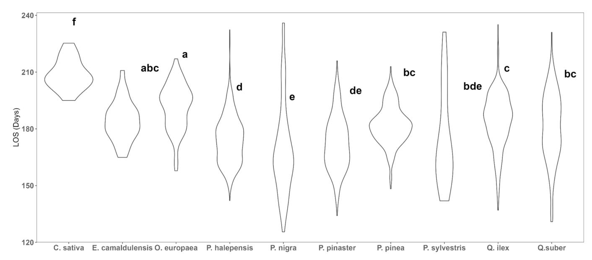
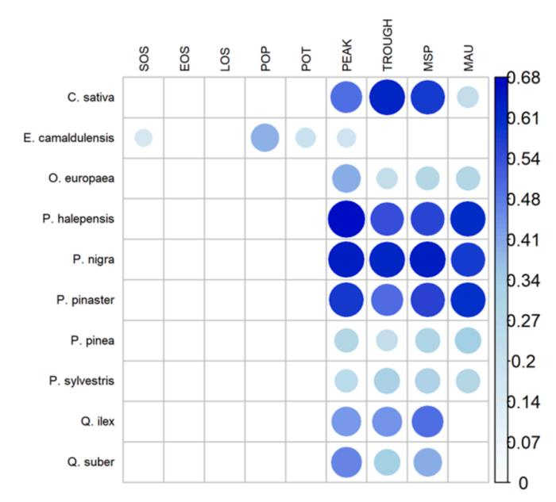

FISEVIER

Contents lists available at ScienceDirect

#### **Ecological Indicators**

journal homepage: www.elsevier.com/locate/ecolind

#### Original Articles

# Aridity-induced phenological shifts and greening trends in Mediterranean forest species: Insights from 28 years of Landsat data in southern Spain

Aurelio D. Herraiz a,b,\*, Pablo Salazar-Zarzosa a, Cristina Acosta-Muñoz a, Rocío Hernández-Clemente c, Rafael Villar a

- a Área de Ecología, Departamento de Botánica, Ecología y Fisiología Vegetal, Universidad de Córdoba, Campus de Rabanales, 14071 Córdoba, Spain
- b Instituto Federal de Educação, Ciência e Tecnologia do Amazonas, Campus Humaitá, Amazonas, Brasil
- c Departamento de Ingeniería Forestal, Universidad de Córdoba, Campus de Rabanales, 14071 Córdoba, Spain

#### ARTICLE INFO

#### Keywords: Aridity Climate change Greening NDVI Phenometrics

#### ABSTRACT

Land surface phenology is influenced by a complex interplay of various abiotic factors, including climatic, edaphic, and topographic conditions, along with biotic factors such as competition or species composition. It is particularly important to recognize the varied phenological responses of forest species to aridity, which reflect their different adaptations to climate change. Traditional field measurements may not effectively capture these phenological changes across extensive regions. Thus, this study aims to analyse the key phenological indicators of the ten most common Mediterranean forest species using remote sensing data. Specifically, we will investigate how aridity affects these indicators in areas like Southern Spain, where aridity levels are expected to rise, and we will track their changes over time. To achieve this, we processed the maximum monthly Normalized Difference Vegetation Index (NDVI) data from 1994 to 2021, obtained from Landsat 05 and 07 satellites for 2,358 plots of the Spanish National Forest Inventory in Andalucia (Southern Spain). Evergreen species showed the Start Of Season (SOS) in autumn with maximums NDVI in winter (December-February) and the End Of Season (EOS) in late spring with minimums NDVI in summer (June-August), indicating the important effect of precipitation on the physiological response of Mediterranean vegetation. Over the 28-year analysis period, a general positive trend in NDVI (greening) and its associated phenological metrics was observed for most species. However, aridity impacts surface phenology differently among Mediterranean species, notably shortening the growth season of Scots pine and causing significant seasonal phenology shifts in Cork oak, Stone pine, and Aleppo pine. These findings suggest that time-series Landsat data enhances our understanding of forest dynamics and aridity's effects on vegetation. Remote sensing of forest species' responses to aridity is crucial for resilience studies and species management in global change scenarios.

#### 1. Introduction

# Forests cover approximately 31 % of the Earth's land area (Anaya-Romero et al., 2016; Masiero et al., 2019) and play a crucial role in supporting terrestrial biodiversity (Hill et al., 2019; Santos et al., 2016), while providing vital ecosystem services to society. These services include regulating atmospheric gases and climate, preventing soil erosion, improving water quality, and supplying forest products and cultural services (Anaya-Romero et al., 2016; Mori et al., 2017; García

#### et al., 2020).

Given the large extents of the forests, reliance on field data poses significant logistical and financial challenges for studying forest dynamics. Fortunately, the availability of remote sensing data offers a cost-effective, rapid, and efficient solution for conducting spatio-temporal analysis (Linderholm, 2006). Vegetation indices such as NDVI (Normalised Difference Vegetation Index) (Rouse et al., 1973) have been used as indicators of forest health, growth, phenology, and biomass in the last decades (Birky, 2001; Zhu and Liu, 2015). The NDVI time series

Abbreviations: EOS, End of Season; SOS, Start of Season; LOS, Length of Season; MAU, Moment of Autumn (day of year with NDVI for EOS); MSP, Moment of Spring (Day of year with NDVI value for SOS); PEAK, maximum NDVI value of year; POP, Position of Peak (day of maximum NDVI value); POT, Position of Trough, (day of minimum NDVI value); TROUGH, minimum NDVI value of year..

E-mail address: z82dihea@uco.es (A.D. Herraiz).

https://doi.org/10.1016/j.ecolind.2025.113115

Received 3 June 2024; Received in revised form 5 December 2024; Accepted 14 January 2025 Available online 24 January 2025

1470-160X/© 2025 The Authors. Published by Elsevier Ltd. This is an open access article under the CC BY-NC license (http://creativecommons.org/licenses/by-nc/4.0/).

 $^{\star}$  Corresponding author.

show the differences in the intensity of photosynthetic capacity and phenological stages of the species throughout the year and provides an integrated measure of ecosystem responses to climatic factors and human-induced disturbances (Hadley et al., 2009; López-Trullén et al., 2022).

Phenological processes in forests are influenced by a myriad of abiotic and biotic factors. Climate, soil, topography, insolation, plagues, diseases, and vegetation type all play significant roles (Linderholm, 2006; Richardson et al., 2013). Future climate change scenarios project an increase in average temperature and a decrease in annual precipitation, resulting in an increase of aridity, particularly in regions such as the Mediterranean basin (IPCC, 2022). These changes can have varied effects on the phenology of forest species. For instance, deciduous forests in the Northern Hemisphere have experienced an advancement in the Start Of Season (SOS) by up to 5 days per decade since 1970, primarily due to temperature changes (Richardson et al., 2013; Rosenzweig et al., 2008). Similarly, Mediterranean evergreen species have exhibited changes in phenology in response to climate shifts (Gordo and Sanz, 2010). However, the responses of Mediterranean forests to climate change are complex, principally in the South of Europe and North of Africa where factors such as precipitation also play significant roles (Jeong et al., 2011; Atzberger et al., 2013).

The sensitivity of phenological metrics, such as the start of growing season (SOS), varies across different environmental conditions and forest types. Ecosystems in high and medium latitudes of the Northern Hemisphere tend to be more responsive to temperature fluctuations, whereas precipitation plays a more critical role in arid and semi-arid regions (Hadley et al., 2009; Liu et al., 2016; Yan et al., 2016). Furthermore, deciduous, and evergreen species may respond differently to changes in aridity (Sterck et al., 2008; Crabbe et al., 2016; Gazol et al., 2018). Although evergreen gymnosperms have a faster recovery compared to deciduous species, they show less resistance to extreme drought events, affecting their survival in cases of recurrent drought episodes (Forner et al., 2018; Salomón et al., 2022). Moreover, the same forest species can exhibit spatially differentiated behaviour due to climatic, topographic, and soil conditions (Herraiz et al., 2023).

While previous studies have explored temporal variations in phenology across different latitudes, there remains a gap in the literature regarding the examination of phenology in diverse forest types within regions characterized by significant climatic diversity at a medium spatial scale. This research gap is particularly evident in studies examining the phenology of Mediterranean forest species, which are severely exposed to the effects of climate change and increased aridity (but see Crabbe et al., 2016; Rodriguez-Galiano et al., 2016; López-Trullén et al., 2022). For instance, understanding the phenological responses of Mediterranean forest species, especially those adapted to water stress, such as *Quercus* and *Pinus*, to aridity changes becomes increasingly relevant, given the projected intensification of global warming in the region (Herraiz et al., 2023).

For this reason, the main objective of this work was to understand the phenological cycles and the influence of aridity of the ten most abundant tree forest species in the South of the Iberian Peninsula (1 deciduous and 9 evergreens): Castanea sativa Mill. (Sweet chestnut tree), Eucalyptus camaldulensis Dehnh. (River red gum), Olea europaea L. (Wild olive), Pinus halepensis Mill. (Aleppo pine), Pinus nigra Arn subsp. salzmanii (Black pine), Pinus pinaster Ait. (Maritime pine), Pinus pinea L. (Stone pine), Pinus sylvestris L. (Scots pine), Q. ilex L. subsp. ballota (Holm oak) and Quercus suber L. (Cork oak). The specific objectives were: 1) to characterise the phenological cycle and its associated metrics for the ten forest species using a Landsat time series comprising NDVI for the plots of the Spanish National Forest Inventory in Andalucia (SFNI); 2) to understand the effect of aridity on the phenological metrics; and 3) to know the temporal trends from 1994 to 2021 of the NDVI and the main phenological metrics.

#### 2. Study area and data

The study area includes the Andalusian region ( $36^{\circ} - 38.75^{\circ}$  N, and  $7.37^{\circ} - 1.53^{\circ}$  W, WGS84, Fig. 1), with 26 % of forest area. It has a high orographic variability and contrasting climate types, partly explaining its high biodiversity (Anaya-Romero et al., 2016). Most of its area has a Mediterranean climate, characterised by hot and dry summers. East to West has a strong climatic gradient from < 300 mm of accumulated annual rainfall and 20 °C of annual mean temperature to 2200 mm of accumulated annual rainfall and 17 °C of annual mean temperature (AEMET, 2011). The vegetation is dominated by evergreen sclerophyllous oak and coniferous forests, being the deciduous tree species restricted to the more humid areas (Khoury and Coomes, 2020). According to the predictions of future climate models (2060 projection), this region will suffer with an increase of aridity due to an increase in temperature (up to 4 °C in mean temperature and a decrease in precipitation (around 20 %) (IPCC, 2022; Gratsea et al., 2022). We selected the ten most prevalent forest species from 2,358 plots in the third Spanish Forest National Inventory. These species, in order of importance, include P. halepensis (24.8 %), Q. ilex (18.9 %), P. pinea (13.6 %), P. nigra 12 %), P. pinaster Ait. (11.5 %), Q. suber (10.2 %), P. sylvestris L. (4.1 %), O. europaea (2.8 %), E. camaldulensis (1.3 %), and C. sativa (0.9 %) (Table S1).

#### 2.1. Forest data

We used the third SFNI, the most recent dataset available for the Andalusian region (Fig. 1) (https://www.miteco.gob.es/es/biodiversida d/temas/inventarios-nacionales/inventario-forestal-nacional.html). The SNFI establishes permanent plots of 50 m in diameter (around 2000  $\rm m^2$ ) in a 1 km² square grid across the forest land of Spain. We filtered the plots with a percentage of aboveground biomass greater than 90 % of the dominant species quantifying forest biomass through species-specific allometric equations based on the DBH (Diameter at Breast Height) (Montero et al., 2005). Finally, we selected plots with a forest density greater than 150 trees ha $^{-1}$  to avoid plots with low tree cover or with many shrubs or herbaceous plants that could mask the trees NDVI signal.

#### 2.2. Spectral data

The assessment of forest phenological changes using remote sensing requires images of medium—high spatial resolution over a long period of time (Melaas et al., 2013). For this reason, NDVI data via Landsat were used (30-m pixel size, 16 days frequency; Hansen and Loveland, 2012) using the Google Earth Engine (GEE; https://earthengine.google.com) platform (Gorelick et al., 2017). More than 5000 satellite scenes from 1994 to 2021 were used. Specifically, Landsat 5 TM was used from 1994 to 2000 and Landsat 7 ETM + from 2001 to 2021. Using Landsat scenes from different missions (LA05 and LA07) does not affect the main results, as there was a high correlation between the value of the spectral bands (Claverie et al., 2015). To minimise the effect of cloudiness, we used the maximum value of monthly NDVI. We applied linear interpolation to the data series to mitigate data gaps caused by clouds and satellite failures (Li et al., 2021).

We calculated the NDVI value based on the specific pixel location with an area of 30 x 30 m (900 m²). The NDVI value of the SNFI plot polygon (50 m diameter circle, i.e. 1963 m²), averaging NDVI values up to 9 pixels (i.e. 8100 m²) could result in biased NDVI values due to possible change of neighbouring vegetation. To verify this, we relate the average NDVI value for the 50 m diameter polygon (9 pixels) and the NDVI of the central pixel, resulting in a strong correlation (R² = 0.93; P < 0.001) (see Herraiz et al., 2023). Therefore, our measurements rely on the NDVI of the central pixel. While it is true that MODIS and VIIRS offer a higher temporal resolution, for the spatiotemporal analyses carried out, the spatial resolution of Landsat (30 m) was shown to be more suitable than MODIS (250 m) or VIIRS (375 m), adjusting better to the

Fig. 1. A) Location of Andalusian region. b) Black points represent the 2,358 Spanish Forest Inventory permanent plots in the Andalusian region.

dimensions and analysis of the plots under study. On the other hand, other sensors such as Sentinel, with higher temporal and spatial resolution (10 m, 2015/2017-present), do not have data prior to 2015, a mandatory condition to be able to study time series (more than 25 data cycles) that Landsat does meet (1984-present).

As an explanatory variable of climate, we used an aridity index (AI) calculated based on a 20-year average of temperature and precipitation data obtained from WorldClim 2.1 (Hijmans et al., 2005), calculated based on the modified Martonne index (MI) = {[MAP] / [MAT + 10]} + {[12  $\times$  DMP] / [DMT + 10] / 2} (Stephen, 2005); where: MAP is the mean annual accumulated precipitation, MAT is the mean annual temperature, DMP and DMT are the precipitation and temperature in the driest month, respectively. Since high MI indicates high water availability, we transformed this variable into AI = 150 - MI (Salazar-Zarzosa et al., 2021). The transformation of AI (150 - MI) is the inverse of MI (high values of the aridity index indicate high aridity), and therefore, the relationship between these two variables is linear, not affecting the results. We did not include MAP or MAT as predictors because both were correlated with the Aridity index (Aridity-MAP, r = -0.67,  $P < 2 \ 10^{-16}$ ; Aridity-MAT, r = 0.31,  $P < 2.2 \ 10^{-16}$ ).

In addition to aridity, the temporal trend of accumulated precipitation and average temperature from 1994 to 2023 and their possible relationship with the forest spectral response were analysed for each of the species (Fig. S5).

#### 3. Phenometrics temporal analysis

To analyse the differences in NDVI between forest species, we used the hydrometeorological year, starting on September 1 and ending on August 30, reflecting with greater fidelity the vegetative activity of Mediterranean environments.

The processing and cleaning of the NDVI raw data as a time series was carried out following the methodology of Aragonés et al. (2019), using the *Rbeast* package (Hu et al., 2021). To obtain phenometrics (phenological metrics), we follow the methodology of Garonna et al. (2016) and García et al. (2019), recommended for cycles with a single growing season. Thus, we use the *Derivative* approach and Spline smoothing technique in the *Phenology* library (Greenbrown R package; Forkel et al., 2013). *Zoo* packages (Zeileis and Grothendieck, 2005) were

used to linearly interpolate the gaps in the NDVI signal and *Tidyverse* (Wickham et al., 2019) for data processing and graphic representation.

As some phenometrics (SOS, EOS, POP and POT) have circular (cyclical) dynamics, we applied circular or angular statistics, in order to average and interpret these variables using the package *Directional* (Tsagris and Alenazi, 2022) and *Circular* (Agostinelli and Lund, 2022).

All the statistical analysis was carried out on R software V.4.2. (R  $\overline{\text{Core Team 2022}}$ ).

The most important phenological variables per year were obtained using the 28-year time series for each SNFI plot [see Fig. 2 for an example of two contrasting species: *Castanea sativa* (deciduous) and *Pinus pinaster* (evergreen) using real data of one plot per species of our study]. The Start Of Season (SOS) establishes the start of phenological cycle (point with the highest positive slope), the End Of Season (EOS) identifies the end of the phenological cycle (point with the greatest negative slope), Length Of Season (LOS) as the duration of the period comprising the SOS and the EOS, Position of Peak (POP) and Position of Trough (POT) as the days with the maximum and minimum value of the NDVI, respectively (Garonna et al., 2016) (Fig. 2). Outliers of SOS, EOS, LOS, POT, and POP (DoY, day of the year) were cleaned, using the interquartile range (IQR) method, eliminating all values outside this range.

For some species, in the specific case of POT (DoY), where the distribution of the cyclical data was mainly in two large blocks, apparently opposite in time, it was necessary to add 365 to the data with values less than 100 DoY to facilitate the interpretation of the correlations (Mendoza, 2020).

In addition, four metrics related to the NDVI value were obtained throughout the cycle, such as PEAK and TROUGH (maximum and minimum NDVI value of the cycle) and MSP and MAU (NDVI value for SOS and EOS respectively, Fig. 2).

To characterize the phenological cycle and its associated metrics (objective 1), we computed monthly averages of NDVI, resulting in a single monthly value for each species (Fig. 3). The NDVI time trends along the year for the ten studied species was compared between them using a correlation matrix (Fig. S1). The phenological metrics of each plot were averaged over time (one value per plot), allowing to compare the differences in phenological metrics between species with a non-parametric test (Kruskall-Wallis) and then a *post-hoc* test (Dunn)

Fig. 2. Examples of phenological annual cycles modeled from *Castanea sativa* (deciduous, A) and *Pinus pinaster* (evergreen, B) data with the most important phenometrics using real data of one plot per species of our study. Start of Season (SOS), End of season (EOS), Length of Season (LOS), Peak point (POP) and trough point (POT), PEAK (maximum NDVI), TROUGH (minimum NDVI), MSP (NDVI value for SOS), and MAU (NDVI for EOS).

Fig. 3. Variation of mean NDVI (± standard deviation) along the hydrometeorological year for the 10 studied species (A: *Pinus* species, B: *Quercus* and the rest of species). Monthly values were averaged over 28 years (1994–2021).

#### (Table S1).

To understand the effect of aridity on the phenometrics (objective 2), we related the values of the phenological metrics averaged over time for each plot with the aridity index through linear regressions.

Finally, to achieve objective 3; to know the temporal trend of both NDVI and phenological metrics over time, the raw NDVI signal was broken down into seasonal, trend and residual using a time series decomposition function (Rbeast package). Then, for the temporal trend in NDVI along the 28 years we eliminated the seasonal and residual (noisy) components from the analysis, and use only the trend. The values of the NDVI were averaged per month (252 values) and the values of phenological metrics were averaged for each year and species (28 values). We know that the shrubland and herb layer may affect the NDVI signal of a forest plot (Wingate et al., 2019). Therefore, we investigate the potential impact of shrubland and/or herbaceous vegetation on the NDVI values. Using a histogram, we consider three categories of plots for each species: low, medium and high NDVI values, which may indicate plots with low, medium and high tree cover. Thus, for each species, we compared the phenological metrics of the plots categorised in low, medium and high NDVI values. If we observe clear differences in the phenological metrics between these three categories, we would suspect that the phenology may be affected by the shrubland and/or herb layer. However, we can see that the temporal trends of NDVI were very similar between the three categories (Table S3, Figs. S2 and S3) for most species, with a strong correlation coefficient. Therefore, we are confident that our main results are based on the signal of dominant forest species, with very minor effects on the shrubland and/or herb layer. Mountain pines (P. nigra and P. sylvestris) showed the greatest differences between the categories (Figs. S1 and S2), which could be due to the altitude gradient that can be related to the appearance of negative peaks associated with winter snow episodes.

#### 4. Results

### 4.1. Characterization of the phenological cycle and its metrics for Mediterranean forest species

The deciduous species *C. sativa* exhibits a very different phenological NDVI trend along the year from the evergreen species, showing minima of NDVI value in winter (January-March) and maxima in spring (May-

July) (Figs. 3 and 4). The NDVI values of *C. sativa* and the other evergreen species showed a negative correlation (indicating an opposite behaviour) or very low positive correlation (indicating no relation, as for *P. nigra* and *P. sylvestris*) (Fig. S1). We can identify a group of mountain pines (*P. sylvestris* and *P. nigra*), with a time trend strongly correlated (r = 0.77, P < 0.001) and, not so strongly with the other evergreen species (except for *Q. suber*) (Fig. S1). These pine species showed a less pronounced maximum between October and December, earlier than the rest of the pines and evergreen species (Figs. 3 and 4).

Finally, the rest of the evergreen species are characterised by minima in summer (July-August) and maxima in winter (December-January) (Figs. 3 and 4), showing a strong correlation coefficient between the NDVI values of species along the year (Figs. S1 and S2).

There are also statistical differences between species in the duration of the growth cycle (LOS) (Fig. 5, Table S1). *C. sativa* appears with LOS values close to 210 days, while *E. camaldulensis, O. europaea, P. pinea, Q. suber* and *Q. ilex* are close to 180 days. *P. pinaster* and *P. halepensis*, with a similar distribution of points, have LOS values of 170 days. Finally, *P. nigra* and *P. sylvestris* showed the lowest LOS values around 160 days but with a more dispersed distribution, having shorter growth cycles compared to the rest of the species (Fig. 5).

#### 4.2. Effect of aridity on species phenology metrics

For objective 2, we analyse the phenological response for each forest species along the spatial gradient of aridity of each species distribution (AI from 28 to 119). We found that all *Pinus* and *Quercus* species showed a positive relationship between aridity and SOS (Fig. 6, Fig. S4); plots located in more arid places seem to delay the start of the season. Only in *C. sativa* more arid plots are related to a reduction of SOS.

Regarding EOS, our results found that more arid plots of *P. halepensis*, *P. nigra*, *P. pinaster*, *P. sylvestris* and *Q. suber* showed later EOS (Fig. S4).

The SOS and EOS of *O. europaea* and *E. camaldulsensis* showed not to be sensitive to aridity, although they decreased the LOS as *P. pinea* and *P. sylvestris* (Figs. S4 and S5). Only *P. halepensis* and *P. pinaster* showed longer growth periods in more arid places. LOS of *Quercus* species were not influenced by aridity (Figs. 6 and S4). For POP and POT, in most of the studied species, arid places were related to a delay in both the time of the maximum and the minimum of the annual cycle.

Regarding the phenology metrics related to NDVI values, more arid

Fig. 4. Circular representation of annual cyclic phenometrics in the 10 most abundant forest species in the Andalusia region, SOS (Start Of Season in green), POP (Point of Peak in blue), POT (Point of Trough in orange) and EOS (End Of Season in yellow). (For interpretation of the references to colour in this figure legend, the reader is referred to the web version of this article.)

#### Lenght of season between species

Fig. 5. Length of season (LOS) violin plots for the 10 studied forest species. Letters show significant differences between species through post-hoc Dunn analysis.

places negatively affected the value of PEAK, TROUGH, MSP and MAU in most species; thus, more arid places were related to lower NDVI values, except for *C. sativa*, *P. nigra*, *P. pinaster* and *P. sylvestris* (Fig. 6).

#### 4.3. Temporal trend in species NDVI and phenology

The temporal trends of the main phenological metrics showed that all species, except *E. camaldulensis*, evidence a significant increase in

**Fig. 6.** Linear regression between phenology metrics and aridity index based on the modified Martonne aridity index. Higher values of aridity means higher aridity. Only significant regressions were represented, the grey area indicates the confidence interval. The value of EOS *P. sylvestris* was increased by 365 (see material and methods).

NDVI through the time (1994–2021) (Fig. 7). However, we can distinguish two types of temporal trends. The first one showed a clear period of increase in NDVI until the year 2005 where the NDVI signal stabilised (*E. camaldulensis, O. europaea, Q. suber, P. pinaster* and *P. pinea*; Fig. 7). The second type of temporal trend showed a positive trend of NDVI along the period (1994–2021) followed by *C. sativa, Q. ilex, P. halepensis* and *P nigra*.

The annual cycles of the mountain pines (*P. nigra* and *P. sylvestris*) showed more abrupt and irregular changes (Fig. 7) every year when compared to the rest of the pines, indicating more sensitivity to some temporary stimulus.

Regarding the temporal trajectory, it was observed that aridity and accumulated precipitation remain statistically stable (Fig. S6). However, the average annual temperature showed a positive trend in most of the species analysed (Fig. S8).

We also wanted to know if the phenological metrics vary along the 28 years period. We found that all NDVI phenology variables such as PEAK, TROUGH, MSP and MAU showed positive correlations with time for most species, except *E. camaldulensis* (Fig. 8), supporting the temporal dynamics of the NDVI in the temporal trend series (Fig. 7). However, the phenology metrics SOS, EOS, LOS, POT and POP did not show significant trends with time except *E. camaldulensis* that showed an increase of SOS, POP, POT and PEAK with time (Fig. 8, Fig. S7).

#### 5. Discussion

## 5.1. Characterization of the phenological cycle and its metrics for Mediterranean forest species

#### 5.1.1. Annual cycle of NDVI and principal phenological metrics

The fluctuation in NDVI values illustrates a consistent pattern among evergreen species, peaking during winter and declining in summer. This contradicts findings by Maselli (2004) regarding *Pinus* and *Quercus* on the Tuscany coast (Italy), where peak NDVI was observed in spring and its lowest in winter. Nonetheless, several studies with conifers in the Mediterranean basin (Chéret and Denux 2011, Helman et al. 2015, Aragonés et al. 2019) and with *Quercus* (Flexas et al., 2014) found similar photosynthetic activity cycles. Also, La Mancia et al. (2003), noted shoot elongation and leaf shedding in *Q. ilex* in winter leading to

NDVI peaks. Mild winters with frequent rainfall in South Mediterranean regions may explain NDVI peaks and the onset of the growing season, while dry summers with high temperatures lead to reduced physiological activity (Chéret and Denux, 2011; Garbulsky et al. 2013) and leaf area to prevent water loss (Gazol et al., 2018; Moore et al., 2020). The temporal phenological metrics (Fig. 4) reveal that the start of the growing season (SOS) for conifers in the Andalusian region typically commences in October, approximately a month later than the pine species examined by Aragonés et al. (2019), particularly in continental areas. Notably, the SOS for mountain pines (P. nigra and P. sylvestris) is more than 120 days delayed compared to those studied by Aragonés et al. (2019). Nevertheless, Aragonés et al. (2019) also observed an early SOS for a specific population of P. nigra in September, suggesting the potential influence of population genetics on forest phenology. Additionally, climatic conditions in the Mediterranean region of southern Spain may push the SOS to periods of warm temperatures and high rainfall, such as autumn (Atzberger et al., 2013).

In terms of End of Season (EOS), the pine species *P. halepensis, P. pinaster*, and *P. pinea* exhibit an EOS ranging from March to April, occurring 30–60 days earlier compared to observations by Aragonés et al. (2019), which documented EOS between June and July. This difference may be attributed to the warmer springs and drier summers experienced by southern pine populations, resulting in an earlier EOS (Atzberger et al., 2013). On other hand, mountain pine populations (*P. nigra* and *P. sylvestris*) showed a delayed EOS (30 to 60 days later) compared to Aragonés et al. (2019), who focused on continental populations. This delay could be linked to the persistence of favorable climatic conditions until the onset of warm Mediterranean spring and summer with an increase of water stress (Hereş et al., 2012; Atzberger, 2013).

For the other evergreen species studied (*E. camaldulensis, O. europaea, Q. ilex,* and *Q. suber*), the EOS typically occurs around May, slightly later compared to most conifers by approximately 30 days. This delay may be attributed to a robust anisohydric mechanism, allowing these species to manage water stress more effectively than pines (Sterck et al., 2008; Quero et al., 2011). Limited research exists on the phenology of these evergreen species specific to Iberian Mediterranean forests (but see Gordo and Sanz, 2010; Caparrós-Santiago et al., 2021), making it challenging to compare their phenological variations accurately.

**Fig. 7.** Evolution of NDVI between 1994–2021 for the 10 studied species. The thick line represents the smooth regression using the mean annual NDVI.  $\mathbb{R}^2$  and *P values* of the regression are shown and the grey area indicates the confidence interval of the regression.

Concerning the Length of Season (LOS), species such as *C. sativa, E. camaldulensis, O. europaea*, and *P. pinea* exhibit minimal variability, likely due to the presence of closely-clustered populations experiencing similar abiotic conditions. However, significant variation in LOS was observed in *P. halepensis, P. pinaster, Q. ilex*, and *Q. suber*, possibly influenced by diverse abiotic factors such as photoperiod, soil moisture, elevation, as well as biotic factors like genetics and competition (Schaber and Badeck, 2003; Hadley et al., 2009). LOS values for pine species differ from those reported by Aragonés et al. (2019), averaging around 300 days in their study, whereas our findings indicate mean LOS values ranging from 160 to 180 days for *P. halepensis, P. pinaster*, and *P. pinea*, and 230 days for *P. nigra* or *P. sylvestris*. The longer LOS observed in pine species by Aragonés et al. (2019) might be attributed to

**Fig. 8.** Response of phenology metrics with time for the 10 studied forest species. Blue means a positive response with time. Start of Season (SOS), End of Season (EOS), Length of Season (LOS), Peak Point (POP) and Trough Point (POT), PEAK (maximum NDVI), TROUGH (minimum NDVI), MSP (NDVI value for SOS), and MAU (NDVI for EOS). The colour scale indicates the value of the correlation coefficient and a bigger size indicates a higher level of significance. All relationships shown are significant (P < 0.05).

their later EOS. Notably, the Mediterranean climate, characterized as semi-arid, significantly influences the physiological activity of plants (Sterck et al., 2008; Quero et al., 2011). Many of the selected plots studied by Aragonés et al. (2019) are located in places with milder summer temperatures and higher annual rainfall than the plots chosen in our study region.

Furthermore, the disparity between our findings and those of Aragonés et al. (2019) may stem from variations in smoothing techniques and the absence of comprehensive phenological studies that would enable the establishment of precise methodologies for the studied species, as emphasized Caparrós-Santiago et al. (2021). While Atkinson et al. (2012) observed minimal differences among smoothing methods, conflicting results were reported by Lara and Gandini (2016), who identified significant discrepancies between techniques used for the same species. Hence, conducting a comparative analysis of different approaches and smoothing techniques is imperative to comprehend potential discrepancies between metrics.

#### 5.2. Effect of aridity on species phenology

#### 5.2.1. Temporal phenometrics

Numerous studies have investigated the impact of rainfall and temperature on phenology (Linderholm, 2006; Jeong et al., 2011), with some focusing on the effects of droughts on Mediterranean forest species (Hinckley et al., 1979; Misson et al., 2011). However, few studies have specifically addressed the influence of aridity on phenology in South Mediterranean forests using NDVI (but see Caparrós-Santiago et al., 2021). When analyzing the effect of precipitation or temperature in isolation, there is a risk of underestimating the concurrent impact of the other variable (Speich, 2019). Hence, considering aridity, which integrates both variables, allows for a comprehensive examination of their combined effects on phenology.

The observed positive correlation between SOS and aridity across all *Quercus* and *Pinus* species aligns with findings by Santos et al. (2016) and Liu et al. (2016). In more arid regions, the initiation of SOS in these species may be delayed until the onset of rains and the decline in

temperatures, which can be delayed until the end of the Mediterranean autumn (Atzberger, 2013).

A similar positive relationship between aridity and EOS was found for some species (*P. halepensis, P. nigra, P. pinaster, P. sylvestris* and *Q. suber*). Unlike the phenology of the North European Forest stands, the EOS of the Mediterranean evergreen species studied is located at the beginning of summer when photosynthetic activity can be limited due to water stress and high temperatures. In more arid places, species may have physiological mechanisms that prolong physiological activity over time, tolerating greater water stress (Quero et al., 2011). Moreover, the genetic origin of many of these species used to reforest large areas in the past may also be affecting the phenological response to aridity (Aragonés et al., 2019).

The impact of aridity on LOS varied among different tree species. While some species like *E. camaldulensis, O. europaea, P. pinea,* and *P. sylvestris* exhibited shorter growth periods in drier areas, as observed in previous studies (Piraino, 2020), others such as *P. halepensis* and *P. pinaster* seemed to prolong their LOS in more arid regions, consistent with findings by Linderholm (2006). These pine species may possess adaptations to climates with low rainfall and high temperatures, unlike other pine species, making them suitable choices for reforestation efforts in large areas (Cherif et al. 2020; Rodriguez-Vallejo and Navarro-Cerrillo 2019). Consequently, they have been selected for reforestation initiatives in various regions (Hereş et al., 2012; Atzberger, 2013; Aguadé et al., 2015).

The *Quercus* species did not exhibit a significant response of LOS with aridity, although the SOS and EOS were influenced by aridity. Thus, while aridity may affect the timing of SOS and EOS, it may not necessarily alter the overall LOS value. This could be attributed to the adaptation of these species to water stress of Mediterranean climatic conditions (Khoury and Coomes, 2020; Gazol et al., 2018). The postponement of SOS and EOS in most studied species (*Pinus* and *Quercus*) due to aridity could be linked to changes in other phenological metrics such as POP and POT. Consequently, in drier regions, the timing of maximum and minimum NDVI values (POP and POT, respectively) was delayed.

#### 5.3. Spectral phenometrics

For most tree species, phenological metrics linked to NDVI (PEAK, TROUGH, MSP, and MAU) exhibited a distinct negative correlation with aridity. To conserve internal water resources, plants undergo stomatal closure, reducing water evaporation. This leads to a significant decline in photosynthetic activity, even in plants with adaptive mechanisms to stress conditions (Quero et al., 2011). NDVI displays a pronounced sensitivity to aridity (He et al., 2019; Miranda et al., 2020). However, certain pine species like P. halepensis, P. nigra, and P. sylvestris did not demonstrate significant correlations between these metrics and aridity. P. halepensis exhibits strong adaptation to water stress conditions (Campo et al., 2007; Cherif et al., 2020), possibly explaining the insensitivity of NDVI to aridity in this species. As for P. nigra and P. sylvestris, these mountain pines are found at high altitudes (with mean values of 1516 and 1921 m, respectively), experiencing low mean temperatures (around 10 °C) and minimal aridity, with a limited geographical and climatic distribution, which could elucidate the absence of response of these phenological metrics to aridity in these species (López-Tirado and Hidalgo, 2014).

#### 5.4. Temporal trends of phenology

Our study revealed that the majority of tree species exhibited a consistent increase in vegetation greenness over time. However, contrary findings were reported by Maselli (2004), who observed negative NDVI trends for *Pinus* and *Quercus* in coastal regions of Italian Tuscany. Similarly, Aragonés et al. (2019) did not detect any discernible trends in NDVI for pine populations over a 16-year period (2000–2016).

Nevertheless, consistent with our findings, other studies (de Jong et al., 2011; Cortés et al., 2021; Prăvălie et al., 2022) have demonstrated positive temporal trends in forest greening, even within Iberian Peninsula forests (Alcaraz-Segura et al., 2010). Despite the challenging conditions imposed by the Mediterranean climate, the species under study continue to thrive and augment their biomass. Certain species such as *Q. ilex, P. nigra*, and *P. halepensis* exhibit forest masses that are still expanding and regenerating, likely a consequence of reforestation policies implemented in Spain during the last century (Vadell et al., 2016).

The stability trends of certain tree species commonly used in productive forests, such as *E. camaldulensis*, *P. sylvestris*, and *P. pinaster*, are noteworthy. The high densities employed in reforestation initiatives for some species may have constrained forest growth (Vadell et al., 2016). Conversely, species like *Q. suber*, subjected to intensive human management such as cork extraction, have experienced limitations in regeneration, density, and growth, leading to a stagnation in their temporal trend (Santos et al., 2016).

Mountain pines (*P. nigra* and *P. sylvestris*) displayed erratic and abrupt phenological behaviour, potentially attributed to snow episodes associated with their high-altitude distribution. *P. nigra* demonstrated a more favourable response over time compared to *P. sylvestris*, offering valuable insights for mountain forest management decisions. Studies by Forner et al. (2018) and López-Tirado and Hidalgo (2014) highlighted the resilience of *P. nigra* against extreme droughts in 2009 and 2013, reinforcing its positive temporal trend in NDVI. In contrast, *P. sylvestris* did not exhibited any temporal trend in NDVI. Some researchers (Jaime et al., 2019; Margalef-Marrase et al., 2020) have documented significant decline and mortality issues attributed to the challenging conditions of the Mediterranean climate.

The positive temporal trends observed in phenological spectral metrics (PEAK, TROUGH, MSP, MAU) align with our previous findings on NDVI. However, temporal phenological metrics such as SOS, EOS, or LOS have not demonstrated variation over time. While NDVI time series reflect the impact of extreme climatic events on the annual cycle of species, phenological cycles appear to maintain consistent temporal patterns, indicating significant resilience and fast recovery of species' photosynthetic capacity.

In our analysis, we compared temporal trends of average annual temperature and annual accumulated precipitation, both intrinsic indicators of aridity, with the observed trends in NDVI (Fig. S5 and S8). We observed a notable increase in mean annual temperatures over time, suggesting a possible link to the observed greening phenomenon. However, unlike findings from other studies (Jeong et al., 2011; Crabbe et al., 2016; Richardson et al., 2013) where warmer temperatures led to earlier vegetation activity, we did not find a significant correlation between temperature changes and phenological metrics. Species more adapted to high aridity, such as P. halepensis and Q. ilex, will show positive trends in the spectral trajectory over time indicating resilience to possible permanent climate alterations (Herraiz et al., 2023). This could be due to the physiological adaptations of Mediterranean species to withstand higher temperatures (Sterck et al., 2008; Khoury and Coomes, 2020). However, species from cold habitats such as P. sylvestris or humid habitats such as Q. suber will show greater spectral sensitivity over time indicating greater sensitivity of other species, which may mean a future reduction in their natural habitat in the region. Thus, the greening effect observed may be attributed to multiple factors, including the fertilization effect of rising CO2 levels from anthropogenic activities (Zhu et al., 2016), changes in forest management practices and land use patterns (reforestation policies), such as the abandonment of agricultural areas increase (Martínez-Fernández et al., 2015).

#### 6. Conclusions

Evergreen forest species in the southern regions of the Iberian Peninsula exhibit distinct phenological cycles, with the start of the growing season occurring in winter and the end in late spring. Aridity has a noticeable impact, causing delays in both the start and end of the growing season and negatively affecting vegetation greenness as indicated by NDVI-related metrics for most species. Despite the ongoing rise in average annual temperatures, the majority of species did not demonstrate a significant relationship between key phenological metrics and temperature increase. Some of these species, such as *P. halepenesis* and *Q. ilex*, continue to be more tolerant to rising temperatures, reinforcing their role as specific species for reforestation policies. Others such as *P. sylvestris* or *Q. suber*, have demonstrated their fragility. Our analysis revealed a consistent upward trend in NDVI-related metrics over a span of 28 years, indicating a continuous greening effect over time. This phenomenon could be attributed to various factors such as CO2 fertilization, physiological adaptations, the expansion of young forest populations, or the resilience of vegetation to changing climatic conditions

#### CRediT authorship contribution statement

Aurelio D. Herraiz: Writing – original draft, Visualization, Methodology, Investigation, Formal analysis, Data curation. Pablo Salazar Zarzosa: Writing – review & editing, Writing – original draft, Visualization, Supervision, Methodology, Investigation. Cristina Acosta Muñoz: Writing – review & editing, Methodology. Rocío Hernández-Clemente: Writing – review & editing, Supervision, Methodology. Rafael Villar: Writing – review & editing, Writing – original draft, Project administration, Methodology, Investigation, Funding acquisition, Conceptualization.

#### Declaration of competing interest

The authors declare that they have no known competing financial interests or personal relationships that could have appeared to influence the work reported in this paper.

#### Acknowledgements

Thanks to the Instituto Federal de Ciência e Tecnologia do Amazonas (IFAM, Brazil) for allowing me to attend the doctoral program in "Recursos Naturales y Gestión Sostenible" over 4 years at the University of Córdoba (UCO). Specially, we want to thank the researchers Irene Mendoza and David Aragonés from the Doñana Biological Station (Consejo Superior de Investigaciones Científicas, CSIC, Spain) and Salvador Arenas Castro for their help during the interpretation of the results. Financial support was provided by the projects Ecología funcional de los bosques andaluces y predicciones sobre sus cambios futuros (For-Change) (UCO-FEDER 18 REF 27943 MOD B), the Funcionalidad y servicios ecosistémicos de los bosques andaluces y normarroquíes: relaciones con la diversidad vegetal y edáfica ante el cambio climático (P18-RT-3455) from Junta de Andalucía (Spain), the Spanish MEC ECO-MEDIT (CGL2014-53236-R), FOR FUN (PID2020-115809RB-I00), Early detection of oak decline: disentangling biotic-abiotic stress interaction through the spectral plant traits dynamics (D-Traits) (PID2021-124058OA-I00, within the framework of the State Plan for Scientific, Technical Research and Innovation 2021-2023, subprogram for the generation of knowledge) and FORMEDY (TED2021-131722B-I00) and FEDER funds. We thank the MAPA (Ministerio de Agricultura, Pesca y Alimentación) and MITECO (Ministerio de Transición Ecológica) for the access and the open-access availability of the Spanish Forest Inventory (https://www. miteco.gob.es/es/biodiversidad/temas/inventarios-

nacionales/inventario-forestal-nacional.html). We appreciate the use of artificial intelligence provided by ChatGPT, developed by OpenAI, to assist in English correction.

#### Appendix A. Supplementary data

Supplementary data to this article can be found online at https://doi.

org/10.1016/j.ecolind.2025.113115.

#### Data availability

Data will be made available on request.

#### References

- Agencia Española de Meteorología (AEMET), 2011. Atlas climático ibérico. Temperatura del aire y precipitación (1971-2000). Agencia Estatal de Meteorología, Ministerio de Medio Ambiente y Medio Rural y Marino.
- Agostinelli C. and Lund U. (2022). R package 'circular': Circular Statistics (version 0.4-95). URL https://r-forge.r-project.org/projects/circular/.
- Aguadé, D., Poyatos, R., Gómez, M., Oliva, J., Martínez-Vilalta, J., 2015. The role of defoliation and root rot pathogen infection in driving the mode of drought-related physiological decline in Scots pine (Pinus sylvestris L.). Tree Physiol. 35 (3), 229–242. https://doi.org/10.1093/treephys/tpv005.
- Alcaraz-Segura, D., Liras, E., Tabik, S., Paruelo, J., Cabello, J., 2010. Evaluating the consistency of the 1982-1999 NDVI trends in the Iberian Peninsula across four timeseries derived from the AVHRR sensor: LTDR, GIMMS, FASIR, and PAL-II. Sensors 10 (2), 1291–1314. https://doi.org/10.3390/s100201291.
- Anaya-Romero, M., Muñoz-Rojas, M., Ibáñez, B., Marañón, T., 2016. Evaluation of forest ecosystem services in Mediterranean areas. A regional case study in South Spain. Ecosyst. Serv. 20, 82–90. https://doi.org/10.1016/j.ecoser.2016.07.002.
- Aragonés, D., Rodriguez-Galiano, V.F., Caparrós-Santiago, J.A., Navarro-Cerrillo, R.M., 2019. Could land surface phenology be used to discriminate Mediterranean pine species? Int. J. Appl. Earth Obs. Geoinf. 78, 281–294. https://doi.org/10.1016/j. ips. 2018.11.002
- Atkinson, P.M., Jeganathan, C., Dash, J., Atzberger, C., 2012. Inter-comparison of four models for smoothing satellite sensor time-series data to estimate vegetation phenology. Remote Sens. Environ. 123, 400–417. https://doi.org/10.1016/j.rse.2012.04.001.
- Atzberger, C., 2013. Advances in remote sensing of agriculture: context description, existing operational monitoring systems and major information needs. Remote Sens. (Basel) 5, 949–981. https://doi.org/10.3390/rs5020949.
- Birky, A.K., 2001. NDVI and a simple model of deciduous forest seasonal dynamics. Ecol. Model. 143 (1–2), 43–58. https://doi.org/10.1016/S0304-3800(01)00354-4.
- Campo, A.D., Navarro Cerrillo, R.M., Hermoso, J., Ibáñez, A.J., 2007. Relationships between site and stock quality in Pinus halepensis Mill. reforestation on semiarid landscapes in eastern SpainRelation entre station et qualité des plants de Pinus halepensis utilisés en reboisement dans des paysages semi-arides de l'est de. Ann. For. Sci. 64 (7), 719–731.
- Caparrós-Santiago, J.A., Rodriguez-Galiano, V., Dash, J., 2021. Land surface phenology as indicator of global terrestrial ecosystem dynamics: A systematic review. ISPRS J. Photogramm. Remote Sens. 171 (2020), 330–347. https://doi.org/10.1016/j. isprsiprs.2020.11.019.
- Chéret, V., Denux, J.P., 2011. Analysis of MODIS NDVI time series to calculate indicators of Mediterranean forest fire susceptibility. Giscience and Remote Sensing 48 (2), 171–194. https://doi.org/10.2747/1548-1603.48.2.171.
- Cherif, S., Ezzine, O., Khouja, M.L., Nasr, Z., 2020. A comparison of the physiological responses of three pine species in different bioclimatic zones in Tunisia. Appl. Ecol. Environ. Res. 18 (1), 1–13. https://doi.org/10.15666/aeer/1801\_001013.
- Claverie, M., Vermote, E.F., Franch, B., Masek, J.G., 2015. Evaluation of the Landsat-5 TM and Landsat-7 ETM+ surface reflectance products. Remote Sensing of Environment 169, 390–403. https://doi.org/10.1016/j.rse.2015.08.030.
- Cortés, J., Mahecha, M.D., Reichstein, M., Myneni, R.B., Chen, C., Brenning, A., 2021. Where are global vegetation greening and browning trends significant? Geophys. Res. Lett. 48. https://doi.org/10.1029/2020GL091496 e2020GL091496.
- Crabbe, R.A., Dash, J., Rodriguez-Galiano, V.F., Janous, D., Pavelka, M., Marek, M.V., 2016. Extreme warm temperatures alter forest phenology and productivity in Europe. Sci. Total Environ. 563–564, 486–495. https://doi.org/10.1016/j. scitoteny. 2016.04.124
- de Jong, R., de Bruin, S., de Wit, A., Schaepman, M.E., Dent, D.L., 2011. Analysis of monotonic greening and browning trends from global NDVI time-series. Remote Sens. Environ. 115 (2), 692–702. https://doi.org/10.1016/j.rse.2010.10.011.
- Flexas, J., Diaz-Espejo, a., Gago, J., Gallé, a., Galmés, J., Gulías, J., Medrano, H., 2014. Photosynthetic limitations in Mediterranean plants: A review. Environ. Exp. Bot. 103, 12–23. https://doi.org/10.1016/j.envexpbot.2013.09.002.
- Forkel, M., Carvalhais, N., Verbesselt, J., Mahecha, M.D., Neigh, C.S.R., Reichstein, M., 2013. Trend Change detection in NDVI time series: Effects of inter-annual variability and methodology. Remote Sens. (Basel) 5 (5), 2113–2144. https://doi.org/10.3390/ rs5052113.
- Forner, A., Valladares, F., Bonal, D., Granier, A., Grossiord, C., Aranda, I., 2018. Extreme droughts affecting Mediterranean tree species' growth and water-use efficiency: The importance of timing. Tree Physiol. 38 (8), 1127–1137. https://doi.org/10.1093/treephys/fpx022
- Garbulsky, M. F., Peñuelas, J., Ogaya, R., Filella, I. (2013): Leaf and stand-level carbon uptake of a Mediterranean forest estimated using the satellite-derived reflectance indices EVI and PRI, International Journal of Remote Sensing, 34:4, 1282-1296. doi: https://doi.org/10.1080/01431161.2012.718457.
- García, C., Espelta, J.M., Hampe, A., 2020. Managing forest regeneration and expansion at a time of unprecedented global change. J. Appl. Ecol. 57 (12), 2310–2315. https://doi.org/10.1111/1365-2664.13797.

A.D. Herraiz et al. Ecological Indicators 171 (2025) 113115

García, M.A., Moutahir, H., Casady, G.M., Bautista, S., Rodríguez, F., 2019. Using hidden Markov models for land surface phenology: An evaluation across a range of land cover types in Southeast Spain. Remote Sens. (Basel) 11 (5). https://doi.org/ 10.3390/rs11050507

- Garonna, I., de Jong, R., Schaepman, M.E., 2016. Variability and evolution of global land surface phenology over the past three decades (1982-2012). Glob. Chang. Biol. 22 (4), 1456–1468. https://doi.org/10.1111/gcb.13168.
- Gazol, A., Camarero, J.J., Vicente-Serrano, S.M., Sánchez-Salguero, R., Gutiérrez, E., de Luis, M., Sangüesa-Barreda, G., Novak, K., Rozas, V., Tíscar, P.A., Linares, J.C., Martín-Hernández, N., Martínez del Castillo, E., Ribas, M., García-González, I., Silla, F., Camisón, A., Génova, M., Olano, J.M., Galván, J.D., 2018. Forest resilience to drought varies across biomes. Glob. Chang. Biol. 24 (5), 2143–2158. https://doi. org/10.1111/gcb.14082.
- Gordo, O., Sanz, J.J., 2010. Impact of climate change on plant phenology in Mediterranean ecosystems. Glob. Chang. Biol. 16 (3), 1082–1106. https://doi.org/ 10.1111/j.1365-2486.2009.02084.x.
- Gorelick, N., Hancher, M., Dixon, M., Ilyushchenko, S., Thau, D., Moore, R., 2017. Google Earth Engine: Planetary-scale geospatial analysis for everyone. Remote Sens. Environ. 202, 18–27. https://doi.org/10.1016/j.rse.2017.06.031.
- Gratsea, M., Varotsos, K.V., López-Nevado, J., López-Feria, S., Giannakopoulos, C., 2022. Assessing the long-term impact of climate change on olive crops and olive fly in Andalusia, Spain, through climate indices and return period analysis. Clim Serv. 28. https://doi.org/10.1016/j.cliser.2022.100325.
- Hadley, J.L., O'Keefe, J., Munger, J.W., Hollinger, D.Y., Richardson, A.D., 2009. Phenology of forest-atmosphere carbon exchange for deciduous and coniferous forests in Southern and Northern New England: Variation with latitude and landscape position. In: Noormets, A. (Ed.), Phenology of Ecosystem Processes. © Springer Science + Business Media, LLC 2009, 10.1007/978-1-4419-0026-5 5.
- Hansen, M.C., Loveland, T.R., 2012. A review of large area monitoring of land cover change using Landsat data. Remote Sens. Environ. 122, 66–74. https://doi.org/ 10.1016/j.rse.2011.08.024.
- He, B., Wang, S., Guo, L., Wu, X., 2019. Aridity change and its correlation with greening over drylands. Agric. For. Meteorol. 278 (July), 107663. https://doi.org/10.1016/j. agrformet.2019.107663.
- Helman, D., Lensky, I.M., Tessler, N., Osem, Y., 2015. A phenology-based method for monitoring woody and herbaceous vegetation in mediterranean forests from NDVI time series. Remote Sens. (Basel) 7 (9), 12314–12335. https://doi.org/10.3390/ ps70912314.
- Hereş, A.M., Martínez-Vilalta, J., López, B.C., 2012. Growth patterns in relation to drought-induced mortality at two Scots pine (Pinus sylvestris L.) sites in NE Iberian Peninsula. Trees – Struct. Funct. 26 (2), 621–630. https://doi.org/10.1007/s00468-011-0628-9.
- Herraiz, A.D., Salazar-Zarzosa, P.C., Mesas, F.J., Arenas-Castro, S., Ruiz-Benito, P., Villar, R., 2023. Modelling aboveground biomass and productivity and the impact of climate change in Mediterranean forests of South Spain. Agric. For. Meteorol. 337. https://doi.org/10.1016/j.agrformet.2023.109498.
- Hijmans, R., Cameron, S., Parra, J., Jones, P., Jarvis, A., 2005. Very high resolution interpolated climate surfaces for global land areas. (25). pp. 1965–1978.
- Hill, S.L.L., Arnell, A., Maney, C., Butchart, S.H.M., Hilton-Taylor, C., Ciciarelli, C., Davis, C., Dinerstein, E., Purvis, A., Burgess, N.D., 2019. Measuring forest biodiversity status and changes globally. Front. For. Global Change 2, 1–11. https:// doi.org/10.3389/ffgc.2019.00070.
- Hinckley, T.M., Dougherty, P.M., Lassoie, J.P., Roberts, J.E., Teskey, R.O., 1979.
  A Severe Drought: Impact on Tree Growth, Phenology, Net Photosynthetic Rate and Water Relations. The American Midland Naturalist 102 (2), 307–316. https://doi.org/10.2307/2424658.
- Hu, T., Myers Toman, E., Chen, G., Shao, G., Zhou, Y., Li, Y., Zhao, K., Feng, Y., 2021. Mapping fine-scale human disturbances in a working landscape with Landsat time series on Google Earth Engine. ISPRS J. Photogramm. Remote Sens. 176 (August 2019), 250–261. https://doi.org/10.1016/j.isprsjprs.2021.04.008.
- IPCC, 2022. Global Warming of 1.5°C. An IPCC Special Report on the impacts of global warming of 1.5°C above pre-industrial levels and related global greenhouse gas emission pathways, in the context of strengthening the global response to the threat of climate change, sustainable development, and efforts to eradicate poverty, [V. Masson-Delmotte, P. Zhai, H.-O. Portner, D. Roberts, J. Skea, P.R. Shukla, A. Pirani, W. Moufouma-Okia, C. Pean, R. Pidcock, S. Connors, J.B.R. Matthews, Y. Chen, X. Zhou, M.I. Gomis, E. Lonnoy, T. Maycock, M. Tignor, & T. Waterfield (eds.)]. Available from https://www.ipcc.ch/sr15.
- Jaime, L., Batllori, E., Margalef-Marrase, J., Pérez Navarro, M.Á., Lloret, F., 2019. Scots pine (Pinus sylvestris L.) mortality is explained by the climatic suitability of both host tree and bark beetle populations. For. Ecol. Manage. 448 (May), 119–129. https://doi.org/10.1016/j.foreco.2019.05.070.
- Jeong, S.J., Ho, C.H., Gim, H.J., Brown, M.E., 2011. Phenology shifts at start vs. end of growing season in temperate vegetation over the Northern Hemisphere for the period 1982-2008. Glob. Chang. Biol. 17 (7), 2385–2399. https://doi.org/10.1111/ i.1365-2486.2011.02397.x.
- Khoury, S., Coomes, D.A., 2020. Resilience of Spanish forests to recent droughts and climate change. Glob. Chang. Biol. 26 (12), 7079–7098. https://doi.org/10.1111/ gcb.15268.
- La Mantia, T., Cullotta, S., Garfi, G. Phenology and growth of Quercus ilex L. in different environmental conditions in Sicily (Italy). In: Ecologia mediterranea, tome 29  $\rm n^{\circ}1$ , 2003. pp. 15-25.DOI: https://doi.org/10.3406/ecmed.2003.1525.
- Lara, B., Gandini, M., 2016. Assessing the performance of smoothing functions to estimate land surface phenology on temperate grassland. Int. J. Remote Sens. 37 (8), 1801–1813. https://doi.org/10.1080/2150704X.2016.1168945.

Li, X., Zhu, W., Xie, Z., Zhan, P., Huang, X., Sun, L., Duan, Z., 2021. Assessing the effects of time interpolation of NDVI composites on phenology trend estimation. Remote Sens. 13, 5018. https://doi.org/10.3390/rs13245018.

- Linderholm, H.W., 2006. Growing season changes in the last century. Agric. For. Meteorol. 137 (1–2), 1–14. https://doi.org/10.1016/j.agrformet.2006.03.006.
- Liu, Q., Fu, Y.H., Zeng, Z., Huang, M., Li, X., Piao, S., 2016. Temperature, precipitation, and insolation effects on autumn vegetation phenology in temperate China. Glob. Chang. Biol. 22 (2), 644–655. https://doi.org/10.1111/gcb.13081.
- López-Tirado, J., Hidalgo, P.J., 2014. A high resolution predictive model for relict trees in the Mediterranean-mountain forests (Pinus sylvestris L., P. nigra Arnold and Abies pinsapo Boiss.) from the south of Spain: A reliable management tool for reforestation. For. Ecol. Manage. 330, 105–114. https://doi.org/10.1016/j. foreco.2014.07.009.
- López-Trullén, D., Álvarez-Martínez, J.M., Sánchez Labrador, J.D., Jiménez-Alfaro, B., Pérez-Silos, I., Hernández-Romero, G., Barquín, J., 2022. Espectrofenología con datos Sentinel 2: definición de curvas de referencia para la caracterización de ecosistemas forestales. Ecosistemas 31 (3), 2411. https://doi.org/10.7818/ ecos.2411.
- Margalef-Marrase, J., Pérez-Navarro, M.Á., Lloret, F., 2020. Relationship between heatwave-induced forest die-off and climatic suitability in multiple tree species. Glob. Chang. Biol. 26 (5), 3134–3146. https://doi.org/10.1111/gcb.15042.
- Martínez-Fernández, J., Ruiz-Benito, P., Zavala, M.A., 2015. Recent land cover changes in Spain across biogeographical regions and protection levels: Implications for conservation policies. Land Use Policy 44, 62–75.
- Maselli, F., 2004. Monitoring forest conditions in a protected Mediterranean coastal area by the analysis of multiyear NDVI data. Remote Sens. Environ. 89 (4), 423–433. https://doi.org/10.1016/j.rse.2003.10.020.
- Masiero M, Pettenella D, Boscolo M, Barua S., Animon I, Matta JR. Valuing Forest Ecosystem Services: A Training Manual for Planners and Project Developers.; 2019. http://www.wipo.int/amc/en/mediation/rules.
- Melaas, E.K., Friedl, M.A., Zhu, Z., 2013. Detecting interannual variation in deciduous broadleaf forest phenology using Landsat TM/ETM+ data. Remote Sens. Environ. 132, 176–185. https://doi.org/10.1016/j.rse.2013.01.011.
- Miranda, A., Lara, A., Altamirano, A., Di Bella, C., González, M.E., Julio Camarero, J., 2020. Forest browning trends in response to drought in a highly threatened mediterranean landscape of South America. Ecol. Ind. 115 (April), 106401. https:// doi.org/10.1016/j.ecolind.2020.106401.
- Misson, L, Degueldre, D, Collin, C, et al., 2011. Phenological responses to extreme droughts in a Mediterranean forest. Glob Chang Biol 17 (2), 1036–1048. https://doi. org/10.1111/j.1365-2486.2010.02348.x.
- Montero, G., Ruiz-Peinado, R., Marta, M., 2005. Monografía Forestal 13. Producción de Biomasa y fijación CO2 por los bosques españoles. Instituto Nacional De Investigación y Tecnología Agraria y Alimentaria Ministerio De Educación y Ciencia.
- Moore (Dan), R., Gronsdahl, S., McCleary, R., 2020. Effects of forest harvesting on warm-season low flows in the Pacific Northwest. A review: Confluence. J. Watershed Sci. Manage. 4 (1), 29. https://doi.org/10.22230/jwsm.2020v4n1a35.
- Mori, A.S., Lertzman, K.P., Gustafsson, L., 2017. Biodiversity and ecosystem services in forest ecosystems: a research agenda for applied forest ecology. J. Appl. Ecol. 54 (1), 12–27. https://doi.org/10.1111/1365-2664.12669.
- Piraino, S., 2020. Assessing pinus pinea l. Resilience to three consecutive droughts in central-Western Italian Peninsula. iForest 13 (3), 246–250. https://doi.org/10.3832/ ifor3320-013.
- Prăvălie, R., Sîrodoev, I., Nita, I.A., et al., 2022. NDVI-based ecological dynamics of forest vegetation and its relationship to climate change in Romania during 1987–2018. Ecol Indic. 2022, 136. https://doi.org/10.1016/j.ecolind.2022.108629.
- Quero, J.L., Sterck, F.J., Martínez-Vilalta, J., Villar, R., 2011. Water-use strategies of six co-existing Mediterranean woody species during a summer drought. Oecologia 166 (1), 45–57. https://doi.org/10.1007/s00442-011-1922-3la. IForest, 13(3), 246-250. doi: 10.3832/ifor3320-013.
- R Core Team, 2020. R: A language and environment for statistical computing. R Foundation for Statistical Computing, Vienna, Austria https://www.R-project.org/.
- Richardson, A.D., Keenan, T.F., Migliavacca, M., Ryu, Y., Sonnentag, O., Toomey, M., 2013. Climate change, phenology, and phenological control of vegetation feedbacks to the climate system. Agric. For. Meteorol. 169, 156–173. https://doi.org/10.1016/ i.agrformet.2012.09.012.
- Rodriguez-Galiano, V.F., Sanchez-Castillo, M., Dash, J., Atkinson, P.M., Ojeda-Zujar, J., 2016. Modelling interannual variation in the spring and autumn land surface phenology of the European forest. Biogeosciences 13 (11), 3305–3317. https://doi. org/10.5194/bg-13-3305-2016.
- Rodriguez-Vallejo, C., Navarro-Cerrillo, R.M., 2019. Contrasting response to drought and climate of planted and natural Pinus pinaster aiton forests in southern Spain. Forests 10 (7). https://doi.org/10.3390/f10070603.
- Rosenzweig, C., Karoly, D., Vicarelli, M., Neofotis, P., Wu, Q., Casassa, G., Menzel, A., Root, T.L., Estrella, N., Seguin, B., Tryjanowski, P., Liu, C., Rawlins, S., Imeson, A., 2008. Attributing physical and biological impacts to anthropogenic climate change. Nature 453 (7193), 353–357. https://doi.org/10.1038/nature06937.
- Rouse, J.W., Haas, R.H., Schell, J.A., Deering, D.W., 1973. Monitoring vegetation systems in the great plains with ERTS (earth resources technology satellite). Proceedings of 3rd Earth Resources Technology Satellite Symposium.
- Salazar-Zarzosa, P., Diaz Herraiz, A., Olmo, M., Ruiz-Benito, P., Barrón, V., Bastias, C.C., de la Riva, E.G., Villar, R., 2021. Linking functional traits with tree growth and forest productivity in Quercus ilex forests along a climatic gradient. Sci. Total Environ. 786, 147468. https://doi.org/10.1016/j.scitotenv.2021.147468.
- Salomón, R.L., Peters, R.L., Zweifel, R., Sass-Klaassen, U.G.W., Stegehuis, A.I., Smiljanic, M., Poyatos, R., Babst, F., Cienciala, E., Fonti, P., Lerink, B.J.W., Lindner, M., Martinez-Vilalta, J., Mencuccini, M., Nabuurs, G.J., van der Maaten, E.,

- von Arx, G., Bär, A., Akhmetzyanov, L., Steppe, K., 2022. The 2018 European heatwave led to stem dehydration but not to consistent growth reductions in forests. Nat. Commun. 13 (1), 1–11. https://doi.org/10.1038/s41467-021-27579-9.
- Santos, M.J., Baumann, M., Esgalhado, C., 2016. Drivers of productivity trends in cork oak woodlands over the last 15 years. Remote Sens. (Basel) 8 (6). https://doi.org/ 10.3390/rs8060486.
- Schaber, J., Badeck, F.W., 2003. Physiology-based phenology models for forest tree species in Germany. Int. J. Biometeorol. 47 (4), 193–201. https://doi.org/10.1007/ s00484-003-0171-5. Epub 2003 Apr 16 PMID: 12698325.
- Speich, M.J.R., 2019. Quantifying and modeling water availability in temperate forests: a review of drought and aridity indices. iForest 12, 1–16. https://doi.org/10.3832/ ifor2934-011 [online 2019-01-10].
- Stephen, J., 2005. Aridity indexes. In: Oliver, J.E. (Ed.), Encyclopaedia of World Climatology. Encyclopaedia of Earth Sciences Series. Springer, Dordrecht, pp. 89–94 https://doi.org/10.1007/1-4020-3266-8\_17.
- Sterck, F.J., Zweifel, R., Sass-Klaassen, U., Chowdhury, Q., 2008. Persisting soil drought reduces leaf specific conductivity in Scots pine (Pinus sylvestris) and pubescent oak (Quercus pubescens). Tree Physiol. 28 (4), 529–536. https://doi.org/10.1093/ treephys/28 4 529
- Tsagris, M., Alenazi, A., 2022. An investigation of hypothesis testing procedures for circular and spherical mean vectors. Commun. Stat. Simul. Comput. https://doi.org/ 10.1080/03610918.2022.2045499.
- Vadell, E., de-Miguel, S., Pemán, J., 2016. Large-scale reforestation and afforestation policy in Spain: A historical review of its underlying ecological, socioeconomic and

- political dynamics. Land Use Policy 55, 37–48.  $https://doi.org/10.1016/j. \\ landusepol.2016.03.017.$
- Wickham, H., Averick, M., Bryan, J., Chang, W., McGowan, L.D., François, R., Grolemund, G., Hayes, A., Henry, L., Hester, J., Kuhn, M., Pedersen, T.L., Miller, E., Bache, S.M., Müller, K., Ooms, J., Robinson, D., Seidel, D.P., Spinu, V., Yutani, H., 2019. Welcome to the {tidyverse}. J. Open Source Software 4 (43), 1686. https://doi.org/10.21105/joss.01686.
- Wingate, V., Kuhn, N., Phinn, S., van der Waal, C., 2019. Mapping trends in woody cover throughout Namibian savanna with MODIS seasonal phenological metrics and field inventory data. Biogeosci. Discuss. 1–37. https://doi.org/10.5194/bg-2019-28.
- Yan, D., Zhang, X., Yu, Y., Guo, W., Hanan, N.P., 2016. Characterizing land surface phenology and responses to rainfall in the Sahara desert. J. Geophys. Res. Biogeosci. 121 (8), 2243–2260. https://doi.org/10.1002/2016JG003441.
- Zeileis, A., Grothendieck, G., 2005. zoo: S3 infrastructure for regular and irregular time series. J. Stat. Softw. 14 (6), 1–27. https://doi.org/10.18637/jss.v014.i06.
- Zhu, X., Liu, D., 2015. Improving forest aboveground biomass estimation using seasonal Landsat NDVI time-series. ISPRS J. Photogramm. Remote Sens. 102, 222–231. https://doi.org/10.1016/j.isprsjprs.2014.08.014.
- Zhu, Z., Piao, S., Myneni, R.B., Huang, M., Zeng, Z., Canadell, J.G., Ciais, P., Sitch, S., Friedlingstein, P., Arneth, A., Cao, C., Cheng, L., Kato, E., Koven, C., Li, Y., Lian, X., Liu, Y., Liu, R., Mao, J., Zeng, N., 2016. Greening of the Earth and its drivers. Nat. Clim. Chang. 6 (8), 791–795. https://doi.org/10.1038/nclimate3004.