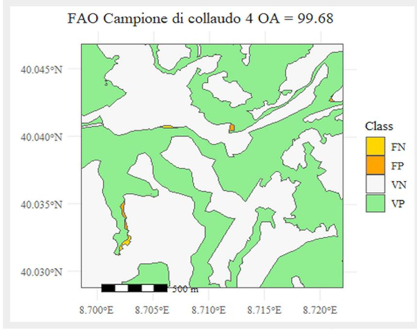

# La Carta Forestale d'Italia (CFI2020): un ritratto aggiornato dei boschi italiani

Walter Mattioli (1), Raoul Romano (2), Davide Botticelli (1), Gherardo Chirici (3), Giovanni D'Amico (3), Diego Giuliarelli (4), Matteo Pecchi (2), Piermaria Corona (1)

The Forest Map of Italy (CFI2020): an updated portrait of Italian forests

For many years, Italy lacked a coordinated data collection and monitoring system to support forest protection, management, and planning policies. In particular, there was no nationwide mapping of forested areas with a level of detail adequate for planning and management needs. Several regions and autonomous provinces have developed local forestry maps and cartographies based on their regulations and requirements to fill this gap. However, only recently, thanks to a Collaboration Agreement between the Directorate of Forests and Mountain Economy of the Ministry of Agriculture, Food Sovereignty and Forests and the Council for Agricultural Research and Economics, the first National Information System for Forests and the Forestry Sector (SINFor) was established. As part of this project, the first Forest Map of Italy was produced at a 1:10.000 scale, under the Article 15 of Legislative Decree No. 34 of April 3, 2018. This vector map, now available through SINFor, was created by updating and merging regional and local thematic cartographies, based on orthophotos provided by the Agency for Agricultural Payments for the 2018-2020. This resource allows private individuals, administrations, and public authorities to access detailed georeferenced information on Italian forests, promoting a more efficient and informed management of the national forest heritage.

Keywords: Forest Definition, Nomenclature System, Forest Map, National Forest Map

#### Introduzione

In Italia, dopo la pubblicazione della carta della Milizia Forestale del 1936 (Ferretti et al. 2018), non è stato sviluppato un progetto coordinato a livello nazionale per la mappatura e la classificazione delle superfici forestali con un livello di dettaglio adeguato alle esigenze di pianificazione e gestione forestale. Un tentativo in questa direzione è stato effettuato nel 2004, ma si è trattato di un approfondimento tematico di quarto livello della copertura Corine Land Cover a livello nazionale, caratterizzato da un'unità minima cartografabile di 25 ettari (Bologna et al. 2004), poco adatto agli scopi operativi legati alla gestione

(1) CREA, Centro di ricerca Foreste e Legno, IT-00166 Roma, Italy; (2) CREA, Centro di ricerca Politiche e Bioeconomia, IT-00184 Roma, Italy; (3) Università degli Studi di Firenze, Dipartimento di Scienze e Tecnologie Agrarie, Alimentari, Ambientali e Forestali (DAGRI), IT-50145 Firenze, Italy; (4) Università degli Studi della Tuscia, Dipartimento per la Innovazione nei sistemi Biologici, Agroalimentari e Forestali (DIBAF), IT-01100, Viterbo, Italy

@ Walter Mattioli (walter.mattioli@unitus.it)

Ricevuto: Feb 19, 2025 - Accettato: Mar 28, 2025

Citazione: Mattioli W, Romano R, Botticelli D, Chirici G, D'Amico G, Giuliarelli D, Pecchi M, Corona P (2025). La Carta Forestale d'Italia (CFI2020): un ritratto aggiornato dei boschi italiani. Forest@ 22: 39-44. - doi: 10.3832/efor4836-022 [online 2025-06-02]

forestale. In questo quadro, e nel rispetto delle competenze Costituzionali di cui all'art. 117, le singole Regioni e Province Autonome, per soddisfare le proprie esigenze gestionali e conoscitive, nonché per individuare le aree sottoposte a specifici vincoli, quale il vincolo idrogeologico, paesaggistico e vincoli speciali di tutela ambientale, hanno realizzato in modo indipendente progetti di mappatura forestale seguendo necessità e specifiche normative locali (D'Amico et al. 2023).

Disporre di informazioni sicure e affidabili sugli ecosistemi forestali è fondamentale per adempiere con efficacia agli impegni internazionali assunti dall'Italia in materia di lotta al cambiamento climatico e alla deforestazione, tutela ambientale e decarbonizzazione. Inoltre, tali informazioni sono essenziali per il raggiungimento degli obiettivi strategici europei e di sostenibilità economica e sociale definiti dalle Nazioni Unite (Pecchi et al. 2024). In risposta a questa esigenza, il Testo Unico in materia di Foreste e Filiere forestali (d.lgs. n. 34 del 3 aprile 2018 – TUFF) ha introdotto all'art. 15 la necessità di coordinare, armonizzare e digitalizzare le informazioni statistiche e cartografiche relative al patrimonio forestale nazionale. Tra le misure previste vi è la realizzazione della Carta Forestale d'Italia (CFI2020), una cartografia forestale georiferita con finalità informative e statistiche, mirata a migliorare la conoscenza e la gestione delle foreste italiane, riconosciute dalla stessa normativa come bene di rilevante interesse

Lo strato informativo prodotto, con anno di riferimento 2020, è stato realizzato a scala di 1:10.000 nel rispetto delle direttive europee (Direttiva 2007/2/CE del Parlamento europeo e del Consiglio del 14 marzo 2007 e della Direttiva 2003/4/CE del Parlamento europeo e del Consiglio del

28 gennaio 2003), ed è oggi consultabile attraverso il Sistema Informativo Nazionale delle foreste e delle filiere forestali (SINFor), incardinato nel Sistema Informativo Agricolo Nazionale (http://sinfor.sian.it), istituito con la legge n. 194 del 4 giugno 1984 (art. 15). Il SINFor, così come CFl2020, sono frutto di un accordo di collaborazione tra la Direzione Foreste ed Economia Montana (DIFOR) del Ministero dell'Agricoltura, della Sovranità Alimentare e delle Foreste (MASAF) e il Consiglio per la ricerca in agricoltura e l'analisi dell'economia agraria (CREA).

La Carta rappresenta una dettagliata è funzionale mappa vettoriale, ottenuta tramite l'aggiornamento (via fotointerpretazione) e la mosaicatura di cartografie tematiche regionali e locali, basata sulle ortofoto fornite dall'Agenzia per le Erogazioni in Agricoltura (AGEA), relative al triennio 2018-2020.

Grazie a questa risorsa, privati, amministrazioni ed enti pubblici competenti possono visualizzare e scaricare tutte le informazioni georeferenziate disponibili sulle foreste italiane, favorendo una gestione più efficiente e consapevole del patrimonio forestale nazionale.

Questo contributo vuole presentare alcuni dei dati ottenibili dalla CFI2020, con particolare riferimento alla superficie forestale italiana, fornendo un aggiornamento più recente dei dati sulle risorse forestali che ad oggi si possono rinvenire principalmente come stime nell'ultimo Inventario Nazionale delle Foreste e dei Serbatoi di Carbonio (INFC 2015).

## Materiali e metodi

Due elementi hanno principalmente guidato la creazione della CFI: (i) la definizione di bosco da adottare; (ii) il sistema nomenclaturale da utilizzare.

In Italia, l'assenza di una definizione univoca di bosco ha rappresentato a lungo una criticità. Fin dalla prima legge forestale del 1877 e dal Regio Decreto Serpieri del 1923, la mancanza di disposizioni chiare ha portato a differenti classificazioni a livello giurisprudenziale regionale (Stefani & Romano 2024). L'esigenza di una definizione giuridica si è accentuata con l'emanazione della Legge n. 353 del 2000 sugli incendi boschivi, che ha introdotto nel Codice penale il reato specifico di incendio boschivo, la cui applicabilità risultava però limitata in assenza di una definizione valida a livello nazionale. Il decreto legislativo n. 227 del 2001 ha cercato di colmare questa lacuna equiparando i termini "bosco" e "foresta" e stabilendo parametri numerici minimi di superficie e copertura per definire un bosco in senso giuridico. Tuttavia, l'articolo aveva una validità di soli 12 mesi, in attesa delle definizioni regionali, che si sono allineate solo parzialmente a quella nazionale.

Di conseguenza, le definizioni di bosco sono rimaste eterogenee tra le diverse normative forestali regionali (Cutini

et al. 2018), creando disparità giuridiche tra i cittadini italiani a seconda della regione di appartenenza, con effetti sull'applicazione delle leggi penali (Stefani & Romano 2024).

Sul punto è intervenuto il TUFF, con la definizione valida sull'intero territorio nazionale in caso di applicazione di norme nazionali di carattere ambientale e paesaggistico. La definizione si rinviene all'art. 3, comma 3, mentre l'art. 4 definisce assimilate a bosco, e quindi altrettanto vincolate, altre tipologie di superfici con alberi e arbusti. L'art. 5 definisce invece le aree escluse dalla definizione di bosco. I chiarimenti resisi necessari in sede applicativa sono stati portati all'attenzione degli operatori con la Circolare DI-FOR Prot. 0146184 del 8 marzo 2023, per l'applicazione dell'art.5, comma 1, lett. a) e b) del TUFF. Inoltre, l'articolo 15 del TUFF ha risolto la questione delle diverse definizioni di bosco a fini statistici, stabilendo che, esclusivamente per scopi statistici, si adotta la definizione FAO, già utilizzata negli inventari forestali nazionali, per garantire la comparabilità dei dati a livello internazionale. Per quanto riguarda invece le esigenze normative legate alla tutela ambientale e paesaggistica, è stata introdotta una definizione univoca, che verrà approfondita più avanti in questo paragrafo.

Negli anni sono state dunque utilizzate diverse definizioni di "bosco" in funzione dei fini applicativi (normativo, gestionale e statistico informativo), sia nel contesto nazionale che internazionale, come dettagliato in Tab. 1.

Per superare questo limite, la CFI ha adottato un approccio modulare e multi-definizione, mappando la superficie a bosco secondo:

- la definizione normativa nazionale (TUFF, art.3): superficie minima di 2000 m², copertura minima del 20%, larghezza minima di 20 m;
- la definizione statistico-informativa internazionale (FAO) (TUFF, art.15): superficie minima di 5000 m², copertura minima del 10%, larghezza minima di 20 m, coerente con l'Inventario Forestale Nazionale (IFNI);
- le definizioni locali vigenti, dove presenti, legate alle normative forestali regionali.

Questo approccio ha consentito di mappare prima, e visualizzare poi, le tre diverse definizioni di bosco (Fig. 1) su tutta la superficie italiana, alternativamente.

Riguardo alla scelta del sistema nomenclaturale da utilizzare, il principio cardine su cui è stata realizzata la CFI2020 è stato l'impiego, per quanto possibile, di tutto il materiale preesistente, in termini sia di sistemi nomenclaturali, sia di disegno delle cartografie forestali. Pertanto, al fine di garantire la massima fruibilità della Carta sia a scala nazionale che locale, le categorie e i tipi forestali rappresentati nelle cartografie forestali regionali sono stati connessi univocamente ai principali sistemi nomenclaturali disponi-

**Tab. 1** - Elenco delle più recenti definizioni di bosco adottate in Italia.

| Definizione                                           | Superficie minima (m²) | Copertura minima (%) | Larghezza minima (m) |
|-------------------------------------------------------|---------------------------|-------------------------|-------------------------|
| IFNI 1985                                             | 2000                      | 20                      | 20                      |
| Global Forest Resources Assessment - FAO 2000         | 5000                      | 10                      | 20                      |
| D.lgs. n. 227/2001                                    | 2000                      | 20                      | 20                      |
| Istat (adottata ufficialmente fino al 2004)           | 5000                      | 50                      | 20                      |
| TUFF (Definizione normativa, art. 3)                  | 2000                      | 20                      | 20                      |
| TUFF (Definizione statistica, art. 15)                | 5000                      | 10                      | 20                      |
| INFC 2005 (adottata ufficialmente da Istat 2005-2008) | 5000                      | 10                      | 20                      |
| INFC 2015                                             | 5000                      | 10                      | 20                      |
| IFNI (dal 2025)                                       | 5000                      | 10                      | 20                      |

**Fig. 1** - Esempio di visualizzazione multi-definizione di bosco nella CFI. In verde la superficie boscata sia TUFF che FAO, in celeste le porzioni che sono bosco per la definizione FAO ma non per il TUFF, in giallo le porzioni che sono bosco per il TUFF ma non per la FAO.

bili sia livello nazionale che internazionali, quali: le categorie INFC, utilizzate coerentemente ai dati forniti dall'ultimo Inventario Nazionale delle Foreste e dei serbatoi forestali di Carbonio (INFC 2015 – Gasparini et al. 2022) e ripresa dal nuovo Inventario Forestale Nazionale Italiano (IFNI); gli European Forest Types, sviluppati per conto dell'Agenzia Europea per l'Ambiente (Barbati et al. 2014) costruiti per fornire una classificazione armonizzata per valutazioni a livello pan-europeo; le categorie forestali definite da Del Favero nei tre volumi sulle tipologie forestali in Italia (Del Favero 2004, 2008, 2010 – Tab. 2).

Dal punto di vista pratico, a partire dallo strato informativo di una determinata zona geografica (Regione o Provincia Autonoma), è stato dapprima creato un prodotto vettoriale derivante dalla mosaicatura delle cartografie locali, e poi, attraverso fotointerpretazione a video delle ortofoto aeree fornite dall'AGEA, sia in colori reali che in falsi colori, la superficie a bosco è stata mappata, corretta ed aggiornata seguendo un approccio multi-definizione (Fig. 2).

In questo modo è stata creata una maschera bosco/non bosco per ciascuna delle tre definizioni adottate, che è

stata sottoposta ad un severo processo di collaudo che ha previsto una overall accuracy, influenzata quindi sia da aspetti geometrici che di classificazione pari ad almeno il 90% a uno standard di restituzione in scala 1:10.000 su tutto il territorio nazionale. Il calcolo dell'accuratezza è stato svolto nell'intorno di 250 punti selezionati sulla base di un sistema di campionamento casuale stratificato in base alla consistenza delle superfici forestali regionali; nell'intorno dei punti estratti è stato generato un quadrato di 2 km di lato all'interno del quale collaudatori esperti hanno realizzato, per fotointerpretazione di contrasto, la mappatura della copertura forestale per quella determinata superficie considerando tale mappatura come priva di errore secondo gli standard di definizione del bosco adottati (Fig. 3).

3). Tutti i poligoni componenti la maschera bosco/non bosco sono stati connessi con un sistema nomenclaturale omogeneo per la classificazione forestale integrando le nomenclature locali, presenti a livello regionale, con i tre sistemi più diffusi a scala nazionale e internazionale descritti sopra. Oltre a queste informazioni, tutti i poligoni presenti in CFl2020 presentano: (i) informazioni geometri-

Tab. 2 - Esempio di connessione tra i sistemi nomenclaturali utilizzati dalla CFI2020 per la categoria faggete.

| Cod. Cat. Locale | Categoria locale                                                      | Codice Tipologia locale | Tipologia locale                                                                                                                         | Codice EFT | European Forest Types             | Codice CFI | Categoria forestale CFI | Codice INFC | Categoria INFC |
|---------------------|--------------------------------------------------------------------------|-------------------------------|------------------------------------------------------------------------------------------------------------------------------------------|---------------|--------------------------------------|---------------|-------------------------------|----------------|-------------------|
|                     |                                                                          | A1 Boschi con faggio do       | Boschi con faggio dominante                                                                                                              | 7.3           | Faggete montane appenniniche e corse | FA            | Faggete                       | 8              | Faggete           |
|                     | A2 Boschi con faggio prevalente 7.3 Faggete montane appenniniche e corse | FA                            | Faggete                                                                                                                                  | 8             | Faggete                              |               |                               |                |                   |
| A                   | Boschi di faggio                                                      | А3                            | Boschi misti di faggio con abete bianco; faggio dominante o comunque prevalente; presenza significativa (> 10%) di abete bianco | 7.3           | Faggete montane appenniniche e corse | FA            | Faggete                       | 8              | Faggete           |
|                     |                                                                          | A4                            | Boschi misti di faggio con cerro; faggio dominante o comunque prevalente; presenza significativa (> 10%) di cerro               | 7.3           | Faggete montane appenniniche e corse | FA            | Faggete                       | 8              | Faggete           |

Fig. 2 - Metodologia utilizzata per la creazione della CFI2020.

che relative a superficie e perimetro; (ii) informazioni relative agli ambiti amministrativi di appartenenza; (iii) informazioni relative a grado di copertura delle chiome, sistema selvicolturale adottato (fustaie ordinariamente gestite, cedui ordinariamente gestiti, boschi non ordinariamente gestiti); forme di disturbo (danni da incendio, valanga, frana), se presenti.

Le informazioni (iii) derivano da quanto contenuto nelle cartografie locali, senza essere sottoposte a ulteriore collaudo. Pertanto, vanno intese in termini solamente preliminari e saranno oggetto di prossimi aggiornamenti.

## Principali risultati

La CFl2020 è composta da circa 850.000 poligoni, di dimensione media pari a 12.50 ettari. Il numero più alto di poligoni si rinviene nella provincia di Bolzano per la definizione "locale", in quanto secondo la normativa attualmente vigente "è considerato bosco qualsiasi appezzamento di terreno dell'estensione superiore a 500 metri quadrati e coperto da specie forestali arboree od arbustive, compresi i castagneti da frutto esistenti ed altri popolamenti assimilabili", e quindi sono stati cartografati appezzamenti, sotto forma di poligoni, molto più piccoli rispetto al resto delle regioni italiane.

La Carta Forestale rivela che la superficie forestale nazionale supera 10 milioni di ettari, con riferimento all'anno 2020 (Tab. 3).

Tra le regioni italiane, la Toscana si distingue come quella con la maggiore superficie forestale (circa 1.2 milioni di ettari), seguita dal Piemonte (circa 1 milione di ettari) e dal Trentino-Alto Adige (circa 750.000 ettari). La differenza in termini di superficie forestale tra la definizione FAO e quella TUFF (circa 60.000 ettari) è soprattutto attribuibile alla diversa classificazione degli impianti di arboricoltura da legno, considerati "bosco" dalla FAO ma non dal TUFF. Analogamente, i circa 500.000 ettari in più mappati secondo le definizioni locali si concentrano prevalentemente in Sardegna, dove la normativa regionale include la macchia mediterranea nella categoria "bosco", a differenza delle altre regioni italiane: questo aspetto, per la Sardegna, era già stato evidenziato da INFC (2015) che fornisce la stima anche delle "altre terre boscate".

A livello nazionale è confermato il trend di crescita della superficie forestale, già evidenziato da altre fonti (RAF Italia 2017, Legambiente 2023). In Tab. 4 è riportato il confronto con INFC 2015 (Gasparini et al. 2022), prendendo come riferimento la definizione FAO, quella appunto adottata per gli inventari nazionali. Nel confronto, non sono considerate le "altre terre boscate".

Come si evince dalla Tab. 4, le regioni del sud Italia e le isole mostrano incrementi più marcati rispetto al nord Italia e in particolare alle regioni alpine: questo può essere

**Fig. 3** - Esempio di report di collaudo della CFI2020. FN= falso negativo, superficie boscata da mappare in quanto mancante; FP= falso positivo, superficie boscata mappata in eccesso; VN = vero negativo, superficie non boscata correttamente fotointerpretata; VP = vero positivo, superficie boscata correttamente fotointerpretata.

Tab. 3 - Superficie forestale (espressa in ettari) secondo la CFI2020.

| Desire                | Definizione di bosco |            |                           |  |
|-----------------------|----------------------|------------|---------------------------|--|
| Regione               | FAO                  | TUFF       | Leggi forestali regionali |  |
| Abruzzo               | 419.641              | 419.182    | 419.182                   |  |
| Basilicata            | 344.572              | 343.348    | 343.348                   |  |
| Calabria              | 637.862              | 637.358    | 637.358                   |  |
| Campania              | 491.822              | 492.127    | 492.127                   |  |
| Emilia-Romagna        | 633.400              | 634.345    | 634.345                   |  |
| Friuli-Venezia Giulia | 354.186              | 353.823    | 353.823                   |  |
| Lazio                 | 626.881              | 614.248    | 613.934                   |  |
| Liguria               | 394.494              | 392.584    | 392.584                   |  |
| Lombardia             | 678.821              | 674.251    | 674.251                   |  |
| Marche                | 305.008              | 305.118    | 304.781                   |  |
| Molise                | 153.026              | 152.834    | 152.834                   |  |
| Piemonte              | 981.191              | 977.313    | 977.313                   |  |
| Prov. Aut. Bolzano    | 357.628              | 345.903    | 357.628                   |  |
| Prov. Aut. Trento     | 399.721              | 399.531    | 399.531                   |  |
| Puglia                | 149.341              | 147.844    | 147.807                   |  |
| Sardegna              | 708.639              | 689.675    | 1.231.500                 |  |
| Sicilia               | 359.592              | 351.377    | 351.377                   |  |
| Toscana               | 1.193.546            | 1.197.268  | 1.197.268                 |  |
| Umbria                | 383.349              | 381.980    | 381.980                   |  |
| Valle d'Aosta         | 104.139              | 103.612    | 103.612                   |  |
| Veneto                | 450.043              | 449.716    | 449.716                   |  |
| Totale                | 10.126.903           | 10.063.436 | 10.616.297                |  |

spiegato da una parte con l'abbandono delle terre e delle coltivazioni e susseguente ricolonizzazione del bosco che avviene con una dinamica più accentuata in queste regioni, ma anche con difficoltà intrinseche nella fotointerpretazione delle formazioni come la macchia mediterranea, gli oliveti inselvatichiti e gli impianti di arboricoltura ab-

bandonati che sono di difficile discriminazione rispetto ai boschi veri e propri. I numeri negativi che si rinvengono per Umbria e Valle d'Aosta sono probabilmente dovuti alla diversa modalità con cui sono state ottenute le superfici (campionamento statistico per INFC2015, fotointerpretazione per CFI2020).

Tab. 4 - Confronto tra INFC 2015 e CFI2020. Superficie boscata secondo la definizione FAO/FRA 2000.

| Regioni               | INFC2015 (ha) | CFI2020 (ha) | Differenza (ha) | Differenza (%) |
|-----------------------|------------------|-----------------|--------------------|-------------------|
| Abruzzo               | 411.588          | 419.641         | 8.053              | 1.96              |
| Basilicata            | 288.020          | 344.572         | 56.552             | 19.63             |
| Calabria              | 495.177          | 637.862         | 142.685            | 28.81             |
| Campania              | 403.927          | 491.822         | 87.895             | 21.76             |
| Emilia-Romagna        | 584.901          | 633.400         | 48.499             | 8.29              |
| Friuli-Venezia Giulia | 332.556          | 354.186         | 21.630             | 6.50              |
| Lazio                 | 560.236          | 626.881         | 66.645             | 11.90             |
| Liguria               | 343.160          | 394.494         | 51.334             | 14.96             |
| Lombardia             | 621.968          | 678.821         | 56.853             | 9.14              |
| Marche                | 291.767          | 305.008         | 13.241             | 4.54              |
| Molise                | 153.248          | 153.026         | -222               | -0.14             |
| Piemonte              | 890.433          | 981.191         | 90.758             | 10.19             |
| Prov. Aut. Bolzano    | 339.270          | 357.628         | 18.358             | 5.41              |
| Prov. Aut. Trento     | 373.259          | 399.721         | 26.462             | 7.09              |
| Puglia                | 142.349          | 149.341         | 6.992              | 4.91              |
| Sardegna              | 626.140          | 708.639         | 82.499             | 13.18             |
| Sicilia               | 285.489          | 359.592         | 74.103             | 25.96             |
| Toscana               | 1.035.448        | 1.193.546       | 158.098            | 15.27             |
| Umbria                | 390.305          | 383.349         | -6.956             | -1.78             |
| Valle d'Aosta         | 99.243           | 104.139         | 4.896              | 4.93              |
| Veneto                | 416.743          | 450.043         | 33.300             | 7.99              |
| Totale                | 9.085.186        | 10.126.903      | 1.041.717          | 11.47             |

## Discussione e conclusioni

Le foreste sono al centro dell'attenzione globale e la diffusione delle tecnologie geomatiche e dell'informazione ha contribuito in modo significativo all'innovazione e all'efficientamento dei processi di monitoraggio, gestione e valorizzazione delle risorse forestali (Corona et al. 2023). La realizzazione della CFI2020 colma finalmente una lacuna storica necessaria alla conoscenza e gestione delle risorse forestali, raggiungendo il livello di altre nazioni europee storicamente all'avanguardia per quanto riguarda le tematiche connesse al mondo forestale. Dopo INFC 2015, CFI2020 fornisce un'aggiornata fotografia dei boschi italiani, con 10 milioni di ettari mappati all'anno di riferimento 2020.

Dal punto di vista pratico vengono finalmente messe a disposizione di privati, amministrazioni, enti pubblici e/o competenti sul territorio, tutte le informazioni cartografiche georeferenziate disponibili in materia forestale sottoforma di un database cartografico inserito all'interno del neonato SINFor, a sua volta costruito su specifici indicatori allineati al sistema di controllo previsto al capitolo 6 della Strategia Forestale Nazionale (SFN), coerenti con gli standard di monitoraggio e valutazione definiti dal processo pan-europeo Forest Europe e con quelli previsti dall'Unione Europea e dalle organizzazioni delle Nazioni Unite (Corona & Mattioli 2023). În questo modo i dati raccolti permetteranno una verifica periodica dello stato del settore forestale e saranno funzionali alla produzione di statistiche, report (Rapporti periodici sulle Foreste, RAF), studi ed analisi, come disposto all'art. 15 comma 3 del TUFF.

CFI2020 assume un ruolo strategico fondamentale non solamente nel supportare i decisori a livello nazionale e locale nelle scelte di programmazione, ma anche per supportare la pianificazione forestale a varia scala di dettaglio. Infatti, può essere utilizzata per derivare numerosi prodotti cartografici sia sulla base delle diverse definizioni di bosco adottate, sia sulla base dei diversi sistemi di nomenclatura locali e regionali, garantendo, nel contempo, contenuti intrinsecamente consistenti sia in termini topologici che semantici. La rilevanza di dati geografici espliciti, come quelli forniti dalla CFI, risiede nella possibilità di integrarli con altri strati informativi nazionali, ad esempio su aree protette, vincolate o di particolare interesse ambientale oppure attraverso l'integrazione con i dati ottenibili dal nuovo IFNI, dalle banche dati presenti in SINFor e dalle nuove missioni satellitari tarate sull'Italia (Planet, Iride). Nell'attesa ed auspicio di poter finalmente usufruire di tutti i vantaggi (per il mondo forestale) derivanti dalla possibilità di utilizzare una copertura Lidar a scala nazionale (Chirici et al. 2020, D'Amico et al. 2021).

L'aggiornamento della Carta, con riferimento nominale all'anno 2024, è previsto nel nuovo accordo tra il CREA e la DIFOR MASAF. In ogni caso, CFI2020 è sottoposta a continui controlli di qualità e congruenza ed è soggetta a modifiche e integrazioni per migliorarne ulteriormente l'accuratezza: attualmente, è possibile scaricare uno strato vettoriale aggiornato al sito: https://cfi-sinfor.crea.gov.it/.

## Ringraziamenti

Lavoro svolto nell'ambito del progetto FORMIPAAF "Programma di attività di base per il settore forestale", finanziato dalla Direzione delle foreste e dell'economia montana (DIFOR) del Ministero dell'Agricoltura, della Sovranità Alimentare e delle Foreste (MASAF); triennio 2022-2024.

## Bibliografia

Barbati A, Marchetti M, Chirici G, Corona P (2014). European

Forest Types and Forest Europe SFM indicators: Tools for monitoring progress on forest biodiversity conservation. For. Ecol. Manag. 321: 145-157. - doi: 10.1016/j.foreco.2013.07.004

Bologna S, Chirici G, Corona P, Marchetti M, Pugliese A, Munafò M (2004). Sviluppo e implementazione del IV livello Corine Land Cover per i territori boscati e ambienti semi-naturali in Italia. Atti Conferenza Nazionale Asita, pp. 467-472.

Chirici G, Giannetti F, McRoberts RE, Travaglini D, Pecchi M, Maselli F, Chiesi M, Corona P (2020). Wall-to-wall spatial prediction of growing stock volume based on Italian National Forest Inventory plots and remotely sensed data. Int. J. Appl. Earth Obs. Geoinf. 84: 101959. - doi: 10.1016/j.jag.2019.101959

Corona P, Costa C, Barbetti R, Bergante S, Cesaretti L, Chiarabaglio PM, Chirici G, Giannetti F, Ferrara C, Gennaro M, Guasti M, Laschi A, Mariotti B, Marra E, Mattioli W, Puletti N, Marchi E (2023). Foreste digitali: innovazioni e opportunità. Forest@ 20: 52-60. - doi: 10.3832/efor4353-020

Corona P, Mattioli W (2023). La strategia forestale italiana. In: "2023 - Foreste d'Italia. Inventario Forestale Nazionale" (De Laurentis D, Papitto G eds). Arma dei Carabinieri, Comando Unità Forestali Ambientali e Agroalimentari, Roma, pp. 32-33.

Cutini A, Mattioli W, Roggero F, Fabbio G, Romano R, Quatrini V, Corona P (2018). Selvicoltura nei cedui italiani: le normative sono allineate alle attuali condizioni? Forest@ 15: 20-28. - doi: 10.3832/efor2772-015

D'Amico G, Vangi E, Francini S, Giannetti F, Nicolaci A, Travaglini D, Massai L, Giambastiani Y, Terranova C, Chirici G (2021). Are we ready for a national forest information system? State of the art of forest maps and airborne laser scanning data availability in Italy. iForest 14: 144-154. - doi: 10.3832/ifor3648-014

D'Amico G, Chirici G, Corona P, Romano R, Di Domenico G, Giannetti F, Mattioli W (2023). Differenze locali e prospettive globali per le foreste italiane: la definizione di bosco nel prossimo Sistema Informativo Forestale Nazionale. L'Italia Forestale e Montana 78 (1): 15-29. - doi: 10.36253/ifm-1094

Del Favero R (2004). I boschi delle regioni alpine italiane: tipologia, funzionamento, selvicoltura. CLEUP, Padova. [ISBN 88-7178-891-5]

Del Favero R (2008). I boschi delle regioni meridionali e insulari d'Italia: tipologia, funzionamento, selvicoltura. CLEUP, Cooperativa Libraria Editrice Università di Padova. Padova. [ISBN 978-88-6129-176-8]

Del Favero R (2010). I boschi delle regioni dell'Italia centrale: tipologia, funzionamento, selvicoltura. CLEUP, Padova. [ISBN 978-88-6129-550-6]

Ferretti F, Sboarina C, Tattoni C, Vitti A, Zatelli P, Geri F, Pompei E, Ciolli M (2018). The 1936 Italian Kingdom Forest Map reviewed: a dataset for landscape and ecological research. Ann. Silvic. Res. 42: 3-19. - doi: 10.12899/asr-1411

Gasparini P, Di Cosmo L, Floris A, De Laurentis D (2022). Italian National Forest Inventory - Methods and Results of the Third Survey - Inventario Nazionale delle Foreste e dei Serbatoi Forestali di Carbonio - Metodi e Risultati della Terza Indagine. Springer, pp. 598. - doi: 10.1007/978-3-030-98678-0

Legambiente (2023). La bioeconomia delle foreste. VI Forum Nazionale sulla gestione forestale sostenibile. A cura di: F. Barbera, B. Berardi, G. De Castro, L. Gallerano, A. Nicoletti. S. Raimondi, S. Visca, Osservatorio per il Capitale Naturale dell'Ufficio aree protette e biodiversità di Legambiente.

Pecchi M, D'Amico G, Mattioli W, Sossai M, Petrucci D, Romano R (2024). Towards open data sharing initiatives in the forestry sector: the example of the Italian National Forestry Information System (SINFor). Forest Policy and Economics 169: 103320. - doi: 10.1016/j.forpol.2024.103320

RAF Italia (2018). Rapporto nazionale sullo stato delle foreste e del settore forestale in Italia 2017-2018. Rete Rurale Nazionale, Compagnia delle Foreste, Roma. [ISBN 978-88-98850-34-1]

Stefani A, Romano R (2024). Direzione generale dell'economia montana e delle foreste: i primi cinque anni di attività. Forest@ 21: 60-71. - doi: 10.3832/efor4692-021