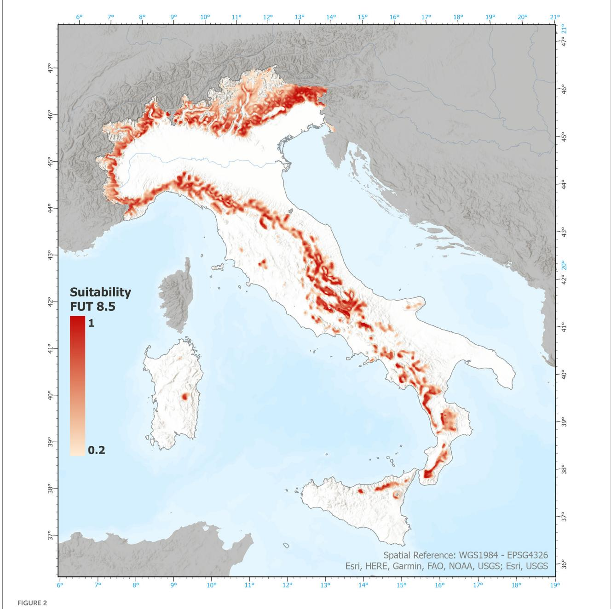

#### **OPEN ACCESS**

REVIEWED BY

EDITED BY Mohsen Ahmadi, Isfahan University of Technology, Iran

Farzin Shabani, Qatar University, Qatar Luciano Bosso, Anton Dohrn Zoological Station Naples. Italy

\*CORRESPONDENCE
Sergio Noce

☑ sergio.noce@cmcc.it

RECEIVED 30 June 2023 ACCEPTED 04 August 2023 PUBLISHED 08 September 2023

#### CITATION

Noce S, Cipriano C and Santini M (2023) Altitudinal shifting of major forest tree species in Italian mountains under climate change. *Front. For. Glob. Change* 6:1250651. doi: 10.3389/ffqc.2023.1250651

#### COPYRIGHT

© 2023 Noce, Cipriano and Santini. This is an open-access article distributed under the terms of the Creative Commons Attribution License (CC BY). The use, distribution or reproduction in other forums is permitted, provided the original author(s) and the copyright owner(s) are credited and that the original publication in this journal is cited, in accordance with accepted academic practice. No use, distribution or reproduction is permitted which does not comply with these terms.

# Altitudinal shifting of major forest tree species in Italian mountains under climate change

Sergio Noce1,2\*, Cristina Cipriano1,2 and Monia Santini1

1Impacts on Agriculture, Forests and Ecosystem Services (IAFES) Division, Fondazione Centro Euro-Mediterraneo sui Cambiamenti Climatici, Viterbo, Italy, 2National Biodiversity Future Center (NBFC), Palermo, Italy

Climate change has profound implications for global ecosystems, particularly in mountainous regions where species distribution and composition are highly sensitive to changing environmental conditions. Understanding the potential impacts of climate change on native forest species is crucial for effective conservation and management strategies. Despite numerous studies on climate change impacts, there remains a need to investigate the future dynamics of climate suitability for key native forest species, especially in specific mountainous sections. This study aims to address this knowledge gap by examining the potential shifts in altitudinal range and suitability for forest species in Italy's mountainous regions. By using species distribution models, through MaxEnt we show the divergent impacts among species and scenarios, with most species experiencing a contraction in their altitudinal range of suitability whereas others show the potential to extend beyond the current tree line. The Northern and North-Eastern Apennines exhibit the greatest and most widespread impacts on all species, emphasizing their vulnerability. Our findings highlight the complex and dynamic nature of climate change impacts on forest species in Italy. While most species are projected to experience a contraction in their altitudinal range, the European larch in the Alpine region and the Turkey oak in the Apennines show potential gains and could play significant roles in maintaining wooded populations. The tree line is generally expected to shift upward, impacting the European beech—a keystone species in the Italian mountain environment-negatively in the Alpine arc and Northern Apennines, while showing good future suitability above 1,500 meters in the Central and Southern Apennines. Instead, the Maritime pine emerges as a promising candidate for the future of the Southern Apennines. The projected impacts on mountain biodiversity, particularly in terms of forest population composition, suggest the need for comprehensive conservation and management strategies. The study emphasizes the importance of using high-resolution climate data and considering multiple factors and scenarios when assessing species vulnerability. The findings have implications at the local, regional, and national levels, emphasizing the need for continued efforts in producing reliable datasets and forecasts to inform targeted conservation efforts and adaptive management strategies in the face of climate change.

KEYWORDS

forests, global warming, Italy, MaxEnt, mountains, SDM, species distribution modeling, suitability

# 1. Introduction

The findings of the most recent Italian National Inventory of Forests and forest Carbon Pools (Inventario Nazionale delle Foreste e dei Serbatoi forestali di Carbonio INFC-2015, Gasparini et al., 2022), published in September 2021, highlight a consistent increase in the forested area across Italy. Italian forests now cover 15 million hectares, which accounts for about one-third of the national territory. This data emphasizes the crucial importance of these areas from a land management perspective. Following estimates by the Italian National Institute of Statistics (ISTAT), the forested area was 5.7 million hectares in 1954, shortly after the Second World War, when significant deforestation occurred due to energy and wartime demands. However, the forested area gradually expanded to nearly 9 million hectares by 1985, as documented by the first National Inventory of Forests and forest Carbon Pools, and has continued to grow since then. Italian forests are steadily increasing in surface, recolonizing areas that were previously abandoned due to human activities. Recent data from the Food and Agriculture Organization (FAO) in their Forest Resources Assessment (FAO, 2020) positions Italy among the top ten countries globally in terms of the rate of expansion of forested areas. Such a consistent increase is likely influenced by various factors, including changes in land use and management practices, but is in particular dominated by natural processes (Agnoletti et al., 2022). This trend can have positive implications for biodiversity providing new habitats or corridors for wildlife. However, mountain forests in particular face heightened vulnerability to the impacts of climate change, primarily as a result of temperature limitations and their increased susceptibility to warming (Albrich et al., 2020). Italian wooded areas are of paramount importance, contributing significantly to both economic and non-economic sectors and providing multipurpose services in terms of production (timber, firewood, and their derivatives), protection and recreation, among others. Indeed, the concept of Forest Ecosystem Services (FES), intended as the direct and indirect contributions to human wellbeing by forest ecosystems, was developed and well-described by the Millennium Ecosystem Assessment in 2010 (Millenium Ecosystem Assessment, 2010). The multifaceted contributions of Italian wooded areas underscore their significance as vital assets, crucial for sustaining both the economy and the overall wellbeing of society, providing industries and individuals with raw materials and sustainable energy sources—if managed according to modern sustainable forestry criteria (Buonincontri et al., 2023; Testolin et al., 2023). Similarly, non-wood forest products (i.e., mushrooms, chestnuts, truffles, seeds, etc.) represent additional sources of value as they supply human nutrition, renewable materials, cultural and experiential services, creating job and income opportunities in rural areas (Weiss et al., 2020). Furthermore, forests provide invaluable contributions to soil creation and preservation, serving as essential regulators of the hydro-geological cycle, as well as influencing water availability and quality. Forests also support and enhance biodiversity, fostering the existence of a wide range of species and contributing to the overall richness and ecological balance of ecosystems. Lastly, the recreational benefits offered by forests have gained recognition as essential for human wellbeing

(Anderson et al., 2023). Hence, Italian forests offer valuable aid to local economies, even in cases where wood may not be fully utilized or economically optimized as a resource. Finally, forests are the most efficient and cheapest means of carbon dioxide removal from the atmosphere.

The rapid changes in climate, as highlighted by the Intergovernmental Panel on Climate Change (IPCC, 2022), have raised significant concerns regarding the health and functionality of forest ecosystems. Over the past few decades, there has been a notable intensification of disturbance regimes, posing challenges to the provision of various FES, particularly in terms of biodiversity protection. Extreme events such as droughts and storms are becoming more frequent, prolonged, and intense, significantly impacting the resilience of Italian forests (i.e., the "Vaia" storm in the North-Eastern Alps, in November 2018). Over several decades, widespread reports of forest mortality and decay have emerged in both the Apennines and plain environments [e.g., leading to the deterioration of oak species (Conte et al., 2019)] as well as in Alpine regions [notably with Scots pine forests in the North-West (Vacchiano et al., 2012)]. Additionally, the climate crisis has undeniably contributed to an increase in the number, intensity, and relative risk of forest fires (Bacciu et al., 2012). These mounting pressures are driving substantial changes in the species composition of historic Italian forest stands (Di Pasquale et al., 2020; Pecchi et al., 2020; Sferlazza et al., 2023). The rapid pace of these complex transformations surpasses the potential for evolutionary adaptation (Lindner et al., 2010; Trumbore et al., 2015) and migration processes. Fully understanding these dynamics is crucial to try defining hypotheses about future scenarios.

Species Distribution Models (SDMs)-also referred to as Correlative Species Distribution Models, bioclimatic envelope models, correlative ecological niche models, or habitat suitability models—are computational models used to examine the relationships and equilibrium between the geographic distribution of species or species groups and a set of environmental variables (Guisan and Thuiller, 2005; Austin and Niel, 2011; Noce et al., 2017, 2019). SDMs, in conjunction with Geographic Information Systems (GIS) tools, offer promising approaches for mapping and predicting the potential range expansion of endemic or invasive species in both historical and future contexts, respectively (Franklin, 2010; Ali et al., 2021; Sofi et al., 2022). By integrating species presence-location data with geospatial information, SDMs rely on various algorithmic approaches, including machine learning and regression-based methods, among others, to develop non-linear and discontinuous relationships between species and their environmental conditions (Heumann et al., 2013). These models provide valuable insights into the potential distribution ranges of species under different environmental scenarios, aiding in the assessment of species' responses to changing environmental conditions. Through the utilization of SDMs, a better understanding of how species distributions may shift in response to factors such as climate change, land use change, or other environmental drivers can be obtained (Salinas-Ramos et al., 2021; Jamwal et al., 2022). Such information is crucial for effective conservation and management strategies, as it

allows for proactive measures to be implemented to mitigate potential negative impacts or to promote the preservation of endangered species.

This study aims to project the potential suitability of selected target forest species in Italy into the medium-term future, considering the foreseen environmental changes associated with the ongoing climate crisis, especially in mountain areas. We seek to assess the potential shifts in the distribution areas of these species under two distinct socio-economic forcing scenarios: a moderate scenario (RCP 4.5, Thomson et al., 2011) and a high-emission scenario (RCP 8.5 Riahi et al., 2011). By examining the variations in potential distribution areas, both in terms of areas lost and gained, we aim to provide insights into the potential impacts of different future trajectories on these forest species. This analysis will contribute to a better understanding of the potential consequences of the climate crisis on Italian mountain forest ecosystems and will assist in developing informed strategies for their conservation and management.

## 2. Materials and methods

For comprehensive methodological reporting, we adhered to the ODMAP (Overview, Data, Model, Assessment, Prediction) protocol v1.0 (for detail see Supplementary Table 1), as proposed by Feng et al. (2019) and Zurell et al. (2020). Further details can be found in the Supplementary material. All analyses were conducted in ESRI ArcGIS Pro 3.1.1, ESRI ArcMap 10.8.2 and SAGA-GIS

7.8.2. NetCDf files were processed with the Climate Data Operators 2.0.6 collection.

# 2.1. Study area and species occurrence data

To encompass the entire Italian territory, the study area was delimited by national administrative boundaries. Presence data for forest species were obtained from the second National Inventory of Forests and forest Carbon Pools - INFC 2005 (https:// www.inventarioforestale.org/it/). This inventory, freely available for research purposes, provides presence data (Figure 1A) for both native and allochthonous forest species across Italy. The data was collected using a random sampling method based on a 1 km x 1 km grid system aligned with meridians and parallels (Gasparini and Tabacchi, 2011). From this dataset, we derived a subset consisting of the 20 most representative species in terms of coverage across the entire territory, including 13 broad-leaved and seven needleleaved species (Table 1). The characteristics of the survey that generated the INFC 2005 inventory led us to classify the occurrence dataset used for the SDM approach as a presence-only dataset. At the time of our analysis, the most recent data from the third National Inventory of Forests and forest Carbon Pools-INFC 2015 (published in a geospatial compatible format in October 2022) was not yet available, thus necessitating the use of the INFC 2005 dataset. The final rarefied occurrence dataset was obtained removing spatially autocorrelated occurrence points with a 20 km distance.

TABLE 1 Species selected for the analyses, with their Latin and Common names.

| Latin name                        | Common name       | Presence points | AUC   |
|-----------------------------------|-------------------|-----------------|-------|
| Abies alba Mill.                  | Silver fir        | 348             | 0.928 |
| Acer campestre L.                 | Field maple       | 533             | 0.815 |
| Carpinus betulus L.               | European hornbeam | 296             | 0.845 |
| Castanea sativa Mill.             | Chestnut          | 1,150           | 0.844 |
| Corylus spp.                      | Common hazel      | 393             | 0.817 |
| Fagus sylvatica L.                | European beech    | 1,316           | 0.910 |
| Fraxinus ornus L.                 | Manna ash         | 1,506           | 0.804 |
| Larix decidua Mill.               | European larch    | 661             | 0.906 |
| Ostrya carpinifolia Scop.         | Hop hornbeam      | 1,403           | 0.824 |
| Picea abies (L.) H.Karst          | Norway spruce     | 951             | 0.901 |
| Pinus cembra L.                   | Swiss stone pine  | 87              | 0.963 |
| Pinus halepensis Mill.            | Aleppo pine       | 172             | 0.810 |
| Pinus pinaster Aiton              | Maritime pine     | 149             | 0.922 |
| Pinus sylvestris L.               | Scots pine        | 437             | 0.910 |
| Quercus cerris L.                 | Turkey oak        | 1,468           | 0.822 |
| Quercus ilex L.                   | Holm oak          | 708             | 0.822 |
| Quercus petraea (Matt.) Liebl. | Sessile oak       | 313             | 0.847 |
| Quercus pubescens Willd.          | Downy oak         | 2,111           | 0.771 |
| Quercus robur L.                  | Pedunculate oak   | 126             | 0.866 |
| Quercus suber L.                  | Cork oak          | 205             | 0.921 |

Presence points identify the number of INFC2005 samples where individuals of the selected species have been identified. The AUC is the Area Under Curve value obtained from the best MayErt model.

# 2.2. Environmental predictors

To ensure optimal modeling performance, we incorporated Very High Resolution (VHR) climate data into our analyses. The VHR-REA\_IT dataset (Raffa et al., 2021), with a resolution of 2.2 km, covers the entirety of the Italian territory. This dataset was obtained by downscaling the ERA5 reanalysis dataset, which has a native resolution of '31 km (Hersbach et al., 2018), to a resolution of around 2.2 km for the reference period 1981–2020, and using the Regional Climate Model (RCM) COSMO-CLM (Rockel et al., 2008).

From the VHR-REA\_IT dataset, we selected four variables (maximum, minimum, mean temperature, and precipitation) at a native temporal resolution of 1 hour. These variables were then converted into monthly mean values for the period 1991-2020, referred to as the "historical" period. Subsequently, the Climate Tools Library in SAGA-GIS 7.8.2 (https://saga-gis.sourceforge.io/saga\_tool\_doc/7.7.0/climate\_tools.html) was employed to process these variables and derive a series of 19 bioclimatic indicators following the definitions provided by Worldclim (https://www.worldclim.org/data/bioclim.html).

For the analysis of altitude and slope, the Digital Elevation Model (DEM) over Europe (EU-DEM v1.1) was used, as available from the Copernicus Land Monitoring Service (https://land.copernicus.eu/imagery-in-situ/eu-dem/eu-dem-v1.1). This DEM combines data from SRTM and ASTER GDEM sources, is at 25 m resolution and covers the EEA39 countries and provides information on altitude within the study area, allowing to derive other topographic derivatives through GIS tools. In this case, the slope was calculated. The environmental predictors considered for the SDM analyses comprise the 19 bioclimatic indicators and the 2 topographic variables.

# 2.3. Model fitting and tuning

To tune the modeling process, we used the SDMtoolbox package v2.5 (Brown et al., 2017) based on MaxEnt v3.4.3 (Merow et al., 2013; Phillips et al., 2017) (http://biodiversityinformatics. amnh.org/open\_source/maxent) to develop spatial models with a logistic output of historical suitability. The presence data for the 20 target species, obtained from INFC2005, were used for model training. The MaxEnt machine learning algorithm was selected due to its several advantages over other algorithms, particularly its requirement of presence-only data (Chiang and Valdez, 2019).

During the tuning phase, various settings were explored to train the MaxEnt models, including the number of predictors, background data selection, model complexity, and threshold selection. To address multicollinearity among the predictors, a preliminary analysis was conducted as indicated by Dormann et al. (2013). Additionally, to prevent overfitting (Elith et al., 2010), we performed correlation analyses with pairwise Pearson excluding predictors higher than defined thresholds (0.7, 0.8, 0.9).

For the background data, different selection types (Minimum Convex Polygon, Buffer Distance from Observation Points) and selection distances ranging from 20 to 500 km were considered. As it was not possible to calibrate the model on independent data as suggested by Araujo et al. (2005), in each run, the presence data were divided into three groups to train both spatially segregated and non-spatially segregated models.

In the MaxEnt settings, "logistic" was set as the output format, the replicated run type was selected as "crossvalidate", and the random test percentage was set to 20. The Replicates number was set to 5. Five feature classes were included: linear, quadratic, product, hinge, and threshold. Moreover, a combination of regularization multipliers (0.2, 0.5, 1, 1.5, 2, 5, 10) was employed to fine-tune the models. Response curves were generated to analyze the relationships between predictor variables and habitat suitability for the target species. Additionally, we assessed the importance of the predictor variables through jackknifing (Baldwin, 2009) with minimum occurrence points set to 15. The best model was selected considering AUC values and then the Omission Error Rate (OER). Additionally, the True Skill Statistic (TSS) (Allouche et al., 2006) was assessed for the best models. The minimum number of occurrence points to model distribution of species was set to 5.

We generated both continuous and binary outputs to assess the habitat suitability, or probability of occurrence, for each species. However, this study will focus solely on the discussion

of the continuous outputs, whereas the binary outputs (presence-no presence) will not be addressed. To convert the continuous data into binary format, we employed two threshold methods: the 10th percentile training presence (PTP) and the maximum test sensitivity and specificity logistic (MTSS).

Subsequently, we employed a model selection approach (Zurell et al., 2020) to identify the best model. This approach involves comparing different model structures and settings to choose a single optimal model or a set of best-performing models. The selection of the best model is based on the need to enhance prediction accuracy by reducing the variance of predicted values or to facilitate interpretation (Hastie et al., 2009). In our study,

the best model from MaxEnt was chosen based on a combination of evaluation measures, including omission error, area under the receiver operating characteristic curve (AUC), and prediction rate.

# 2.4. Future projections

Following the tuning phase and selection of the best model, we proceeded to use it to generate maps depicting the future land suitability for the target species for the future time period of 2021–2050. To obtain future projections, we recalculated the 19 bioclimatic indicators using the VHR-PRO\_IT dataset (Raffa et al.,

Example of raw data, representing the output of our modeling procedure. Map of expected suitability for European beech 2021–2050, under the RCP 8.5 scenario. Visualization threshold 0.2.

TABLE 2 Results for Section 1—Western Alps.

| Species              | 1991–2020 | STD  | 2021–2050 4.5 | STD  | 2021-2050 8.5 | STD  | An 4.5 (%) | An 8.5 (%) |
|----------------------|-----------|------|------------------|------|------------------|------|------------|------------|
| Silver fir           | 0.35      | 0.27 | 0.19             | 0.19 | 0.28             | 0.24 | -44.73     | -19.77     |
| Field maple          | 0.34      | 0.26 | 0.43             | 0.23 | 0.45             | 0.27 | 26.15      | 32.16      |
| European hornbeam | 0.33      | 0.32 | 0.34             | 0.30 | 0.39             | 0.32 | 3.24       | 17.13      |
| Chestnut             | 0.43      | 0.35 | 0.40             | 0.31 | 0.40             | 0.31 | -7.65      | -7.17      |
| Common hazel         | 0.55      | 0.32 | 0.40             | 0.27 | 0.31             | 0.23 | -26.80     | -42.27     |
| European beech       | 0.39      | 0.28 | 0.28             | 0.26 | 0.35             | 0.27 | -26.79     | -8.66      |
| Manna ash            | 0.30      | 0.27 | 0.28             | 0.27 | 0.38             | 0.29 | -6.40      | 29.16      |
| European larch       | 0.44      | 0.27 | 0.59             | 0.38 | 0.61             | 0.40 | 32.61      | 37.18      |
| Hop hornbeam         | 0.30      | 0.26 | 0.29             | 0.22 | 0.47             | 0.29 | -4.37      | 54.82      |
| Norway spruce        | 0.49      | 0.26 | 0.57             | 0.32 | 0.52             | 0.33 | 17.52      | 6.98       |
| Swiss stone pine     | 0.16      | 0.20 | 0.16             | 0.20 | 0.13             | 0.19 | 0.50       | -17.74     |
| Aleppo pine          | 0.03      | 0.08 | 0.02             | 0.06 | 0.06             | 0.11 | -26.61     | 73.14      |
| Maritime pine        | 0.10      | 0.21 | 0.07             | 0.18 | 0.11             | 0.23 | -29.19     | 4.93       |
| Scots pine           | 0.43      | 0.30 | 0.50             | 0.31 | 0.40             | 0.29 | 16.79      | -5.66      |
| Turkey oak           | 0.17      | 0.23 | 0.20             | 0.25 | 0.24             | 0.26 | 14.72      | 37.97      |
| Holm oak             | 0.05      | 0.14 | 0.04             | 0.13 | 0.07             | 0.15 | -29.43     | 29.23      |
| Sessile oak          | 0.52      | 0.39 | 0.46             | 0.36 | 0.43             | 0.34 | -11.79     | -17.45     |
| Downy oak            | 0.28      | 0.26 | 0.21             | 0.24 | 0.33             | 0.27 | -23.50     | 19.21      |
| Pedunculate oak      | 0.19      | 0.27 | 0.20             | 0.29 | 0.21             | 0.25 | 6.22       | 9.54       |
| Cork oak             | 0.01      | 0.06 | 0.01             | 0.03 | 0.01             | 0.06 | -42.60     | 47.59      |

The values shown represent the average suitability and the standard deviation referred to the species, obtained within the mountain section. The historical and future periods, the two RCPs, and the anomaly (%) between the future and historical periods are reported.

2023). This dataset is a downscaled version of the COSMO-CLM simulation over Italy, previously produced at 8 km (Bucchignani et al., 2016; Zollo et al., 2016) resolution and driven by the CMCC-CM General Circulation Model (Scoccimarro et al., 2011).

The VHR-PRO\_IT dataset covers the time window of 1981-2070, for 1981-2005 under the historical greenhouse gas forcing, and for 2006-2070 under the Representative Concentration Pathways (RCPs) 4.5 and 8.5 (also "scenarios" hereafter). RCP 4.5 is a stabilization scenario where total radiative forcing is stabilized, shortly after 2100, to 4.5 Wm-2 ( 650 ppm CO2equivalent) by employing technologies and strategies to reduce GHG emissions, whereas RCP 8.5 is a business as usual scenario and it is characterized by increasing GHG emissions and high GHG concentration levels, leading to 8.5 Wm-2 in 2100 (1,370 ppmv CO2-equivalent). In our calculations, we specifically considered the time span of 2021-2050, aligning with the guidelines provided by the Intergovernmental Panel on Climate Change (IPCC) in their 6th Assessment Report (IPCC, 2022) for evaluating climate change. Additionally, we adhered to the recommendations of the World Meteorological Organization (https://public.wmo.int/en/media/news/updated-30year-reference-period-reflects-changing-climate) and the National Oceanic and Atmospheric Administration (NOAA, Bates et al., 2016) for statistical analyses of climate data, which recommend

using a 30-year period as a representative measure of climate conditions in a given area.

The VHR-PRO\_IT dataset is a scenario-driven simulation, therefore a correction of model bias was required to ensure comparability with the historical dataset VHR-REA\_IT. We applied a constant anomaly correction based on the difference (for temperatures) or ratio (for precipitation) between VHR-REA\_IT and VHR-PRO\_IT during the overlapping period of 1991–2020, following the approach outlined in Maraun and Widmann (2018). This corrected version of the VHR-PRO\_IT dataset was denoted as VHR-PRO\_IT-ac and was calculated according to the following equations:

$$Tx^{\text{VHR-PRO\_IT-ac}}(fut) = Tx^{\text{VHR-PRO\_IT}}(fut) + (Tx^{\text{VHR-REA\_IT}}(over) - Tx^{\text{VHR-PRO\_IT}}(over))$$
 (1)

$$Px^{\text{VHR-PRO\_IT-ac}}(fut) = Px^{\text{VHR-PRO\_IT}}(fut) * \frac{Px^{\text{VHR-REA\_IT}}(over)}{Px^{\text{VHR-PRO\_IT}}(over)}$$
where 
$$\frac{Px^{\text{VHR-REA\_IT}}(over)}{Px^{\text{VHR-PRO\_IT}}(over)} < 4$$
(2)

and

$$Px^{\text{VHR-PRO\_IT-ac}}(fut) = Px^{\text{VHR-PRO\_IT}}(fut) * 4$$
  
where  $\frac{Px^{\text{VHR-REA\_IT}}(over)}{Px^{\text{VHR-PRO\_IT}}(over)} \geqslant 4$  (3)

Where fut is the 2021–2050 time period; over is the 1991–2020 overlapping period; T x are temperatures (mean, max, min); P is precipitation. The threshold for the correction factor of precipitation was set to 4, simplifying the approach in Sperna Weiland et al. (2010) and considering analyses previously done for the domain under study.

To address the potential challenges arising from differences in environmental conditions between the historical and future periods, we employed the clamping option in MaxEnt during the future projection phase (Phillips et al., 2006; Radosavljevic and Anderson, 2014). This approach helps mitigate the effects of environmental discrepancies by constraining the model's response to values within the range observed during the calibration phase. By setting the clamping option, we aimed to enhance the reliability and accuracy of future projections, enabling better comparisons and interpretation of the results.

# 2.5. Elevation analyses

At first, the EU-DEM dataset was classified into 150-meter bands. Afterward, zonal statistics were conducted on the three suitability datasets within five distinct and homogeneous mountainous biogeographical regions defined by the "Italian Ecoregion Map" (Blasi et al., 2014, 2018). Specifically, we focused on five sections representing two regions in the Alps (Western and Central-Eastern) and three regions in the Apennines (Northern-Northwestern, Central, and Southern) (refer to Figure 1B for a visual representation of the selected sections). This division allowed for a more focused analysis of the suitability data within these specific mountainous regions, taking into account their unique characteristics and ecological dynamics.

## 3. Results

## 3.1. Model performance

The tuning phase, aimed at optimizing the model performance based on AUC values, resulted in the selection of specific MaxEnt settings. These settings include the exclusion of highly correlated predictors with a threshold of 0.9, background selection using the Minimum Convex Polygon method with a distance of 500 km, 5 replicates, and the consideration of Linear, Quadratic, Hinge, and Threshold feature classes with a regularization multiplier of 0.5. These settings were carefully chosen to ensure that a consistent and effective set of parameters maximized the performance of all 20 species simultaneously. The AUC results for these settings can be found in Table 1, providing a comprehensive overview of the model's discriminatory power for each species. We found higher AUC values for Swiss stone pine (0.963), Silver fir (0.928), and

TABLE 3 Results for Section 2—Central and Eastern Alps.

| Species              | 1991–2020 | STD  | 2021–2050 4.5 | STD  | 2021–2050 8.5 | STD  | An 4.5 (%) | An 8.5 (%) |
|----------------------|-----------|------|------------------|------|------------------|------|------------|------------|
| Silver fir           | 0.40      | 0.32 | 0.22             | 0.23 | 0.28             | 0.26 | -43.28     | -30.07     |
| Field maple          | 0.28      | 0.29 | 0.22             | 0.22 | 0.31             | 0.29 | -20.18     | 11.40      |
| European hornbeam | 0.37      | 0.32 | 0.33             | 0.31 | 0.45             | 0.36 | -9.37      | 2.32       |
| Chestnut             | 0.37      | 0.31 | 0.34             | 0.28 | 0.33             | 0.27 | -8.59      | -10.67     |
| Common hazel         | 0.55      | 0.30 | 0.29             | 0.26 | 0.23             | 0.18 | -46.18     | -57.14     |
| European beech       | 0.36      | 0.26 | 0.27             | 0.25 | 0.34             | 0.27 | -24.46     | -4.97      |
| Manna ash            | 0.41      | 0.29 | 0.36             | 0.29 | 0.52             | 0.33 | -12.17     | 27.68      |
| European larch       | 0.55      | 0.27 | 0.76             | 0.34 | 0.77             | 0.35 | 38.61      | 40.19      |
| Hop hornbeam         | 0.42      | 0.31 | 0.37             | 0.27 | 0.59             | 0.33 | -12.10     | 41.56      |
| Norway spruce        | 0.60      | 0.29 | 0.73             | 0.34 | 0.64             | 0.34 | 21.21      | 6.69       |
| Swiss stone pine     | 0.27      | 0.31 | 0.27             | 0.31 | 0.24             | 0.29 | 0.00       | -12.73     |
| Aleppo pine          | 0.03      | 0.09 | 0.02             | 0.06 | 0.04             | 0.11 | -4.48      | 33.23      |
| Maritime pine        | 0.02      | 0.05 | 0.01             | 0.02 | 0.02             | 0.03 | -60.15     | 4.29       |
| Scots pine           | 0.53      | 0.32 | 0.56             | 0.34 | 0.49             | 0.32 | 6.22       | -7.54      |
| Turkey oak           | 0.09      | 0.13 | 0.07             | 0.09 | 0.13             | 0.15 | -29.78     | 40.41      |
| Holm oak             | 0.04      | 0.11 | 0.02             | 0.11 | 0.04             | 0.08 | -38.63     | -1.80      |
| Sessile oak          | 0.47      | 0.34 | 0.37             | 0.32 | 0.32             | 0.27 | -22.50     | -31.21     |
| Downy oak            | 0.37      | 0.27 | 0.25             | 0.21 | 0.39             | 0.30 | -33.65     | 0.52       |
| Pedunculate oak      | 0.23      | 0.33 | 0.23             | 0.33 | 0.27             | 0.33 | -1.07      | 15.90      |
| Cork oak             | 0.00      | 0.02 | 0.00             | 0.02 | 0.00             | 0.01 | -32.87     | -25.07     |

The values shown represent the average suitability and the standard deviation referred to the species, obtained within the mountain section. The historical and future periods, the two RCPs, and the anomaly (%) between the future and historical periods are reported.

Maritime pine (0.922), lower values for Downy oak (0.771), Manna ash (0.804) and Aleppo pine (0.810). The TSS results can be found in Supplementary Table 2.

# 3.2. Elevation analyses

The generated suitability maps for the historical (4.5 and 8.5 scenarios) and future periods have a spatial resolution of approximately 2.2 km. Figure 2 displays as an example the predicted suitability specifically for the European beech under RCP 8.5 scenario.

# 3.2.1. Western Alps

This section encompasses a total area of 1,794,031 hectares and is bordered by the Maritime Alps to the South—West and Lake Maggiore to the Eastern boundary. The altitude within this section ranges from 26 to 4,790 meters. Notable changes in suitability are observed for various species within this area as shown in Table 2. The Silver fir is projected to experience a significant loss in suitability, ranging from —44% under the RCP 4.5 scenario to —20% under the RCP 8.5 scenario. Similarly, the Common hazel,

European beech, and Sessile oak are also expected to undergo substantial suitability losses (-27% to -42% for Common hazel, -27% to -9% for European beech, and -12% to -17% for Sessile oak). A moderate loss in suitability is anticipated for the Chestnut (-8% to -7%). On the other hand, the Field maple, European larch, and Turkey oak are expected to experience significant gains in suitability (+26% to +32% for Field maple, +33% to +37% for European larch, and +15% to +38% for Turkey oak). A moderate gain in suitability is projected for the Pedunculate oak (+6% to +10%), Norway spruce (+18% to +7%), and European hornbeam (+3% to +17%). Divergent projections are observed between the two scenarios for the Manna ash (-6% to +29%), Hop hornbeam (-4% to +53%), Swiss stone pine (+1% to -18%), Maritime pine (-29% to +5%), and Downy oak (-24% to +19%).

Regarding altitudinal shifts, noteworthy observations include the upward shifting of the maximum suitability range for the European hornbeam and Turkey oak, with an increase from 2 bands (300 m) under the RCP 4.5 scenario to 3 bands (450 m) under the RCP 8.5 scenario. The Chestnut (Figure 3A) is expected to experience a reduction in suitability at lower altitudes in both scenarios, with an upward shift of 2 bands (300 m) under RCP 8.5. Similar projections apply to the European beech, but only under the RCP 8.5 scenario, where a gain in suitability at higher altitudes

with an upward shift of 3 bands (450 m) is expected. The Manna ash exhibits no changes in suitability under the RCP 4.5 scenario, but a substantial gain is projected above 600 meters above sea level (a.s.l.) under the RCP 8.5 scenario. The European larch (Figure 3B) and Hop hornbeam display similar patterns with a strong gain in suitability across all higher altitude bands. For the Norway spruce (Figure 3C), a gain in suitability is expected at altitudes above 1200 m, whereas no changes are anticipated below this threshold. The optimal range for the Swiss stone pine appears to shift upwards by approximately 450 m (3 bands). Unclear or divergent signals are observed for the other species. Supplementary Figure S1 contains all graphs not included in the main text.

#### 3.2.2. Central and Eastern Alps

This section covers a total area of 3,656,143 hectares and extends from the Eastern shore of Lake Maggiore to the Julian Alps. The altitude within this section ranges from 25 to 3,950 meters above sea level. Noteworthy findings (Table 3) include a significant reduction in suitability for the Silver fir (-43% to -30%), Common hazel (-46% to -57%), and Sessile oak (-23% to -31%). A moderate reduction in suitability is projected for the Chestnut (-9% to -11%), European beech (-24% to -5%), and Swiss stone pine (0 to -13%), whereas gains are expected for the European larch (+39% to +40%) and Norway spruce (+21% to +7%). Divergent projections are observed between the two scenarios for the Field maple (-20% to +11%), European hornbeam (-9% to +23%), Scots pine (+6% to -8%), Manna ash (-12% to +42%), and Pedunculate oak (-34% to +5%).

Regarding altitudinal shifts, significant reductions in suitability are predicted across the entire altitudinal range for the Silver fir (Figure 4A), Common hazel, and Sessile oak. Minor reductions in suitability are expected for the Chestnut, particularly at altitudes below 1,000 meters. For the Field maple, a shift of 2 bands (300 meters) upwards is anticipated, particularly under the RCP 8.5 scenario. Similar shifts, but under both scenarios, are projected for the two Hornbeams and the Manna ash. The European beech (Figure 4B) shows an upward shift of 1 band (150 meters). Strong gains in suitability, even above the current tree line, are expected for the European larch and Norway spruce, particularly above the 1,350-1,500 meter band. Projections for the Stone and Scots pines (Figure 4C) indicate no major changes, whereas the Downy oak shows divergent results. Supplementary Figure S2 contains all graphs not included in the main text.

# 3.2.3. Northern and Northwestern Apennines

This section covers an area of 3,880,014 hectares and extends from the Ligurian Apennines in the North to the Tuscan—Romagna Apennines in the South, including the hills known as the "Colline Metallifere". The altitude within this section ranges from 10 to 2,142 meters above sea level. Our projections (Table 4) indicate a reduction in suitability for all species, except for the Pedunculate and Sessile oaks, under the RCP 4.5 scenario. Specifically, there is a strong reduction in suitability for the Silver fir (–43% to –33%), Common hazel (–5% to –42%), European hornbeam (–26% to –56%), Hop hornbeam (–38% to –14%), Chestnut (–23% to –26%), European beech (–32% to –22%),

TABLE 4 Results for Section 3—Northern and Northwestern Apennines.

| Species              | 1991–2020 | STD  | 2021–2050 4.5 | STD  | 2021–2050 8.5 | STD  | An 4.5 (%) | An 8.5 (%) |
|----------------------|-----------|------|------------------|------|------------------|------|------------|------------|
| Silver fir           | 0.16      | 0.23 | 0.09             | 0.16 | 0.11             | 0.19 | -42.53     | -32.90     |
| Field maple          | 0.59      | 0.20 | 0.49             | 0.22 | 0.51             | 0.28 | -17.86     | -14.85     |
| European hornbeam | 0.57      | 0.22 | 0.43             | 0.44 | 0.25             | 0.28 | -25.53     | -55.91     |
| Chestnut             | 0.48      | 0.27 | 0.37             | 0.31 | 0.36             | 0.30 | -22.92     | -25.87     |
| Common hazel         | 0.48      | 0.22 | 0.46             | 0.26 | 0.28             | 0.21 | -4.56      | -41.94     |
| European beech       | 0.22      | 0.29 | 0.15             | 0.24 | 0.17             | 0.25 | -32.48     | -22.09     |
| Manna ash            | 0.60      | 0.17 | 0.48             | 0.18 | 0.43             | 0.28 | -20.99     | -27.96     |
| European larch       | 0.03      | 0.07 | 0.03             | 0.06 | 0.03             | 0.06 | -19.31     | -17.69     |
| Hop hornbeam         | 0.59      | 0.22 | 0.36             | 0.24 | 0.50             | 0.29 | -38.41     | -14.34     |
| Norway spruce        | 0.12      | 0.17 | 0.09             | 0.15 | 0.07             | 0.12 | -20.85     | -3.82      |
| Swiss stone pine     | 0.01      | 0.01 | 0.01             | 0.01 | 0.00             | 0.00 | 0.00       | -69.08     |
| Aleppo pine          | 0.28      | 0.16 | 0.11             | 0.09 | 0.24             | 0.14 | -59.08     | -12.69     |
| Maritime pine        | 0.41      | 0.27 | 0.22             | 0.27 | 0.29             | 0.30 | -47.71     | -31.02     |
| Scots pine           | 0.24      | 0.26 | 0.19             | 0.25 | 0.13             | 0.18 | -1.83      | -47.34     |
| Turkey oak           | 0.64      | 0.19 | 0.57             | 0.29 | 0.56             | 0.26 | -11.18     | -11.82     |
| Holm oak             | 0.37      | 0.27 | 0.15             | 0.21 | 0.26             | 0.17 | -58.87     | -29.43     |
| Sessile oak          | 0.54      | 0.18 | 0.56             | 0.22 | 0.47             | 0.22 | 4.72       | -13.21     |
| Downy oak            | 0.62      | 0.15 | 0.46             | 0.15 | 0.48             | 0.26 | -25.59     | -22.03     |
| Pedunculate oak      | 0.40      | 0.17 | 0.51             | 0.31 | 0.38             | 0.24 | 27.13      | -4.27      |
| Cork oak             | 0.07      | 0.11 | 0.04             | 0.06 | 0.08             | 0.10 | -48.41     | 10.59      |

The values shown represent the average suitability and the standard deviation referred to the species, obtained within the mountain section. The historical and future periods, the two RCPs, and the anomaly (%) between the future and historical periods are reported.

Manna ash (-21% to -28%), Norway spruce (-21% to -38%), Aleppo pine (-59% to -13%), Maritime pine (-48% to -31%), and Downy oak (-26% to -22%), as well as a moderate reduction for the Field maple (-18% to -15%) and Turkey oak (-11% to -12%). Divergent results are observed for the Sessile oak (+5% to -13%) and Pedunculate oak (+5% to -13%).

Regarding altitudinal shifts, a reduction in suitability for the Silver fir is expected at lower altitudes (below 1,500 m a.s.l.). The Field maple, European beech (Figure 5A), and Maritime pine (Figure 5B) are projected to shift upward by one band (150 meters), whereas the European hornbeam, Scots pine, and Sessile oak are anticipated to shift up by two bands (300 meters). Similar projections are expected for the Chestnut and Turkey oak (Figure 5C), with a reduction in suitability up to 800 m a.s.l. and a gain in suitability above. There is a significant reduction in suitability for the Holm oak (across the entire altitudinal range) and Downy oak (up to 600 m a.s.l.), whereas divergent results are observed for the Hop hornbeam. Supplementary Figure S3 contains all graphs not included in the main text.

## 3.2.4. Central Apennines

This particular section covers an area of 2,639,776 hectares and extends from the Umbria-Marche Apennines in the North to the Mainarde and Maiella mountains in the South. The altitude

within this section ranges from 0 to 2,850 meters above sea level. As reported in Table 5, we expect a strong reduction in suitability for the Silver fir (-30% to -24%), Aleppo Pine (-60% to -18%), and the Holm (-49% to -25%) and Downy (-40% to -16%) oaks. There is a moderate reduction for the Chestnut (-6% to -4%), European beech (-14% to -8%), Manna ash (-14% to -16%), European (-15%) and Hop (-20% to 0%) hornbeam, Field maple (-6% to -12%), and Maritime pine (-13% to 0%), whereas a gain in suitability is expected for the Turkey oak (+8% to +1%) and Pedunculate oak (+26% to +17%). Divergent projections are observed between the two scenarios for the Common hazel (+16% to -19%) and Sessile oak (+15% to -13%).

Regarding altitudinal shifts, a reduction in suitability is projected across the entire altitudinal range for the Silver fir (particularly under the RCP 4.5 scenario), Aleppo pine, and Holm and Downy oaks (Figure 6A). Our projections indicate an upward shift (two bands or 300 meters) for the Maritime pine. Similar patterns are observed for several species, with a reduction in suitability up to specific altitudes and a gain in suitability above. For example, the Field maple shows a reduction up to 600 m a.s.l. and a gain above, the Chestnut (Figure 6B) shows a reduction up to 900 m a.s.l. and a gain above the tree line, the European beech shows a reduction up to 1,500 m a.s.l. and a gain up to the tree line, and the Turkey oak (Figure 6C) shows a reduction up to

600 m a.s.l. and a gain up to the tree line. We also anticipate an increase in suitability for the Pedunculate oak in the 500–1,000 m a.s.l. range. In conclusion, projections for the Manna ash, Hop hornbeam, Common hazel, and Sessile oak show divergent results. Supplementary Figure S4 contains all graphs not included in the main text.

#### 3.2.5. Southern Apennines

Encompassing a total area of 1,943,464 hectares, the Southern Apennines section stretches from the Matese massif in the North to Pollino in the South. Altitude ranges from 32 to 2,250 meters above sea level. Projections (Table 6) indicate a significant decrease in suitability for the Silver fir (-39% to -39%), Aleppo pine (-56% to -26%), and Holm (-11% to -31%) and Downy (-26% to -26%)to -20%) oaks. The Chestnut (-3% to -12%), European beech (-3% to -12%), Manna ash (-12% to -8%), and European (-13% to -20%) and Hop (-12% to -8%) hornbeams are expected to experience a moderate reduction in suitability. On the other hand, the Turkey (+13% to +5%) and Pedunculate (+35% to +36%) oaks, as well as the Maritime pine (+46% to +15%), are projected to gain suitability. Divergent outcomes are observed between the two scenarios for the Common hazel (0% to -32%), Field maple (+5% to -1%), and Sessile oak (+34%to -23%). Regarding altitudinal shifts, reductions in suitability are expected across the entire altitudinal range for the Silver fir (Figure 7A), European hornbeam, Common hazel (especially under the RCP 8.5 scenario), Manna ash, Aleppo pine (under RCP 4.5), and Downy oak. The results indicate minor reductions in suitability for the European beech up to an altitude of 1,400 meters, followed by an increase above this altitude, primarily around the current tree line. Strong gains in suitability, accompanied by an upward shift, are expected for the Maritime pine (especially from 750 meters to the current tree line—Figure 7B) and Turkey oak (from 600 meters above sea level to the current tree line—Figure 7C). Additionally, an increase in suitability for the Pedunculate oak is projected within the 450-1,050-meter bands, similar to the previous section. Divergent results were obtained for the Hop hornbeam. Supplementary Figure S5 contains all graphs not included in the main text.

# 4. Discussion

The findings of this study provide insights into the potential future dynamics of climate suitability for key native forest species in Italy.

Despite exhibiting strong performance values during the training phase, the modeling results revealed variations in performance among species. These discrepancies can be attributed to the ecological characteristics of the species. The performance values align well with the findings of Tsoar et al. (2007) and more notably, with McPherson and Jetz (2007), who observed that predictions tend to be more accurate for species with smaller range sizes and higher habitat specificity (as exemplified by the Swiss stone pine in our study) compared to more generalist species with broader ranges (such as the Downy oak or Manna ash).

TABLE 5 Results for Section 4—Central Apennines.

| Species              | 1991–2020 | STD  | 2021–2050 4.5 | STD  | 2021–2050 8.5 | STD  | An 4.5 (%) | An 8.5 (%) |
|----------------------|-----------|------|------------------|------|------------------|------|------------|------------|
| Silver fir           | 0.24      | 0.28 | 0.17             | 0.24 | 0.18             | 0.26 | -29.77     | -0.24      |
| Field maple          | 0.68      | 0.19 | 0.63             | 0.24 | 0.60             | 0.29 | -0.76      | -11.57     |
| European hornbeam | 0.53      | 0.27 | 0.45             | 0.26 | 0.45             | 0.29 | -1.46      | -14.98     |
| Chestnut             | 0.39      | 0.23 | 0.37             | 0.26 | 0.37             | 0.27 | -5.58      | -4.32      |
| Common hazel         | 0.45      | 0.23 | 0.52             | 0.30 | 0.36             | 0.28 | 15.67      | -19.46     |
| European beech       | 0.31      | 0.30 | 0.27             | 0.29 | 0.29             | 0.29 | -13.55     | -7.73      |
| Manna ash            | 0.64      | 0.19 | 0.55             | 0.19 | 0.54             | 0.26 | -14.26     | -1.61      |
| European larch       | 0.09      | 0.14 | 0.05             | 0.11 | 0.06             | 0.13 | -44.85     | -2.94      |
| Hop hornbeam         | 0.58      | 0.24 | 0.46             | 0.26 | 0.59             | 0.28 | -21.32     | 0.00       |
| Norway spruce        | 0.17      | 0.21 | 0.13             | 0.20 | 0.11             | 0.16 | -22.31     | -37.57     |
| Swiss stone pine     | 0.01      | 0.02 | 0.01             | 0.02 | 0.00             | 0.01 | 2.54       | -66.28     |
| Aleppo pine          | 0.37      | 0.22 | 0.15             | 0.11 | 0.31             | 0.18 | -59.75     | -17.72     |
| Maritime pine        | 0.23      | 0.20 | 0.20             | 0.23 | 0.23             | 0.25 | -12.77     | 0.00       |
| Scots pine           | 0.22      | 0.21 | 0.14             | 0.17 | 0.14             | 0.18 | -38.58     | -35.74     |
| Turkey oak           | 0.59      | 0.26 | 0.63             | 0.32 | 0.59             | 0.31 | 7.87       | 1.44       |
| Holm oak             | 0.33      | 0.20 | 0.17             | 0.17 | 0.25             | 0.19 | -49.20     | -25.31     |
| Sessile oak          | 0.39      | 0.17 | 0.45             | 0.21 | 0.34             | 0.21 | 15.48      | -12.98     |
| Downy oak            | 0.64      | 0.20 | 0.42             | 0.20 | 0.54             | 0.26 | -33.99     | -16.07     |
| Pedunculate oak      | 0.37      | 0.21 | 0.47             | 0.34 | 0.43             | 0.31 | 26.44      | 16.91      |
| Cork oak             | 0.02      | 0.04 | 0.02             | 0.03 | 0.03             | 0.05 | -21.81     | 49.80      |

The values shown represent the average suitability and the standard deviation referred to the species, obtained within the mountain section. The historical and future periods, the two RCPs, and the anomaly (%) between the future and historical periods are reported.

Our focus was on five mountainous sections, including two in the Alps and three in the Apennines. Although with many overlapping points, future trajectories reveal diversified impacts among species and scenarios, with the RCP 4.5 scenario showing slightly worse overall outcomes. Most species are expected to experience a contraction in their altitudinal range of suitability, but some show a propensity to extend beyond the current tree line, as observed in previous studies (Cudlin et al., 2017; Beniston et al., 2018). Among the mountain sections considered, the Northern and North-Eastern Apennines exhibit the greatest and most widespread impacts on all species. Overall, it is difficult to unambiguously define successful or unsuccessful species, except for the Silver fir, which is projected to be highly vulnerable across all altitudinal bands and mountainous sections. Two species worth noting are the larch in the Alpine region and the Turkey oak in the Apennines, as they show potential gains and could play significant roles in maintaining wooded populations. However, our results regarding the European larch differ from previous studies, which found negative variations (Dyderski et al., 2018; Mamet et al., 2019; Pecchi et al., 2020), whereas our findings suggest the opposite. If confirmed, this species could become crucial for future planning activities, particularly at higher altitudes (1,300-1,500 m). Our results for the Turkey oak contradict some studies (Vitale et al., 2012; Pecchi et al., 2020) but align with others (Noce et al., 2017).

The expected increase in suitability at very high altitudes for some major species, both in the Alps and, particularly, the Southern Apennines, implies a potential upward shift of the tree line, consistent with previous research (Harsch et al., 2009; Greenwood and Jump, 2014).

This may result in various consequences. Firstly, it could lead to a loss of diversity as specialized species with limited niche tolerance might disappear due to competition from more widely distributed species (Jump et al., 2012). Additionally, it may lead to a reduction in the number and available area of high mountain ecosystems, such as nival vegetation or alpine grasslands (Moiseev and Shiyatov, 2003; García-Romero et al., 2010), thereby altering the balance between various ecosystem services provided (Peng et al., 2009). For a comprehensive examination of the consequences of treeline shifts, please refer to the valuable work by Greenwood and Jump (2014).

The European beech, a keystone species in the Italian mountain environment, shows evident impacts as reported in Buonincontri et al. (2023). We observe an upward shift in its distribution within the Alpine arc and Northern Apennines, whereas good future suitability is expected at higher altitudes (above 1500 meters) in the Central and Southern Apennines. The Maritime pine emerges as a promising candidate for the future of the Southern Apennines, potentially expanding its presence and altitudinal distribution in

association with other broad-leaved species. These findings align with a study in Spain (Barrio-Anta et al., 2020). However, the increased flammability of the Maritime pine (Núñez-Regueira et al., 1996) raises concerns, particularly considering the expected rise in fire risk in the region (Spano et al., 2020).

Regarding the predicted tree line upward shifting, it is plausible to attribute this phenomenon to the expected temperature increase in mountainous areas, which is known to impact the thermal limitations on the altitudinal distribution of species, including freezing tolerance and growth requirements (Körner, 2021). However, it is crucial to emphasize that our study focused solely on modeling climatic suitability, without considering other relevant factors that regulate the establishment of stable forest populations, such as soil availability and the potential intensification of highaltitude winds, including extreme wind events, which are expected to increase in frequency for Southern Europe (Outten and Sobolowski, 2021).

However, it is important to acknowledge certain limitations associated with the approach we have adopted and therefore the results obtained. The SDM approach is known to be subject to various assumptions and uncertainties (Guisan and Thuiller, 2005; Watling et al., 2014; Santini et al., 2021). Moreover, the assumption that the relationships between environmental variables and species presence observed in the historical period will remain consistent in the future introduces a considerable degree of uncertainty (Gavin et al., 2014). Furthermore, the accuracy and quality of the occurrence dataset represent a crucial factor that can influence the reliability of the results (Bloom et al., 2018). Although the INFC dataset is robust and based on a systematic sampling scheme across Italy, the privacy restrictions associated with providing only the coordinates of the southwestern corner of the 1 km grid introduce a certain level of uncertainty. However, given the coarser resolution of the climate data (2.2 km), this uncertainty is considered negligible, as demonstrated by Marchi and Ducci (2018). Another source of uncertainty stems from the temporal mismatch between the INFC 2005 survey, which took place over a couple of years starting in 2003, and the historical climatic data used to calibrate the model, which refers to the period 1991-2020. Despite this temporal discrepancy, it is important to consider that changes in forest species composition occur over longer timescales. The reliability of the results is also linked to the quality of the environmental variables used . In this regard, the VHR datasets employed in our study allow us to provide useful information at different scales, from local to regional and national. This highlights the importance of considering different emission scenarios to capture the range of possible outcomes and effectively plan for future conservation and management strategies. Lastly, it should be noted that the results obtained are highly dependent on the parameterization or configuration of the applied models (Hallgren et al., 2019). Adhering to the best practices defined by the ODMAP scheme has allowed us to address this aspect with a logical, transparent, and reproducible methodology (Fitzpatrick et al., 2021). The aforementioned aspects, among others (Jarnevich et al., 2015), highlight the significance of uncertainty in these types of studies. Consequently, all our results are presented as anomalies between the different simulations (historical and future).

TABLE 6 Results for Section 5-Southern Apennines.

| Species              | 1991–2020 | STD  | 2021–2050 4.5 | STD  | 2021–2050 8.5 | STD  | An 4.5 (%) | An 8.5 (%) |
|----------------------|-----------|------|------------------|------|------------------|------|------------|------------|
| Silver fir           | 0.19      | 0.24 | 0.11             | 0.19 | 0.11             | 0.19 | -39.48     | -38.87     |
| Field maple          | 0.61      | 0.18 | 0.65             | 0.22 | 0.61             | 0.25 | 5.06       | -1.05      |
| European hornbeam | 0.51      | 0.22 | 0.44             | 0.21 | 0.40             | 0.22 | -12.68     | -20.38     |
| Chestnut             | 0.45      | 0.21 | 0.43             | 0.24 | 0.39             | 0.23 | -3.09      | -12.15     |
| Common hazel         | 0.40      | 0.19 | 0.40             | 0.21 | 0.27             | 0.18 | 0.00       | -32.34     |
| European beech       | 0.26      | 0.29 | 0.25             | 0.28 | 0.23             | 0.26 | -3.16      | -11.49     |
| Manna ash            | 0.67      | 0.20 | 0.59             | 0.19 | 0.57             | 0.23 | -12.68     | -14.67     |
| European larch       | 0.02      | 0.03 | 0.01             | 0.02 | 0.01             | 0.02 | -57.23     | -48.11     |
| Hop hornbeam         | 0.57      | 0.20 | 0.50             | 0.22 | 0.52             | 0.25 | -12.09     | -8.05      |
| Norway spruce        | 0.08      | 0.11 | 0.05             | 0.08 | 0.04             | 0.06 | -40.78     | -54.30     |
| Swiss stone pine     | 0.01      | 0.01 | 0.01             | 0.01 | 0.00             | 0.00 | 2.95       | -74.65     |
| Aleppo pine          | 0.53      | 0.19 | 0.23             | 0.12 | 0.39             | 0.16 | -56.32     | -26.28     |
| Maritime pine        | 0.28      | 0.22 | 0.40             | 0.28 | 0.32             | 0.26 | 46.02      | 14.70      |
| Scots pine           | 0.13      | 0.13 | 0.09             | 0.12 | 0.06             | 0.10 | -28.58     | -50.13     |
| Turkey oak           | 0.68      | 0.17 | 0.77             | 0.21 | 0.72             | 0.22 | 13.12      | 5.26       |
| Holm oak             | 0.48      | 0.16 | 0.42             | 0.21 | 0.33             | 0.16 | -11.26     | -31.13     |
| Sessile oak          | 0.38      | 0.15 | 0.51             | 0.19 | 0.30             | 0.15 | 34.03      | -22.89     |
| Downy oak            | 0.69      | 0.17 | 0.51             | 0.17 | 0.55             | 0.21 | -25.84     | -20.10     |
| Pedunculate oak      | 0.49      | 0.18 | 0.66             | 0.27 | 0.66             | 0.26 | 35.69      | 36.35      |
| Cork oak             | 0.05      | 0.08 | 0.06             | 0.08 | 0.10             | 0.13 | 23.68      | 117.39     |

The values shown represent the average suitability and the standard deviation referred to the species, obtained within the mountain section. The historical and future periods, the two RCPs, and the anomaly (%) between the future and historical periods are reported.

The divergent projections observed between scenarios suggest varying impacts of climate change on suitability for the species under consideration, which can be seen as both a limitation and a strength of our study. These differences can be interpreted as the upper and lower bounds of the projected outcomes. Our results highlight the complex and dynamic nature of possible climate change impacts, emphasizing the need to consider multiple factors and scenarios when assessing species vulnerability and planning conservation actions. In conclusion, we expect significant and far-reaching impacts on mountain biodiversity, particularly in terms of forest population composition. The rapid pace of climate change in mountainous regions appears incompatible with the adaptive capacities and dynamics of arboreal plant organisms. This work also emphasizes the importance of using very high-resolution climate data, which is essential for formulating hypotheses about future forest dynamics and providing valuable information across different scales. Our findings have implications at the local, regional, and national levels and provide information that can improve future woodland management strategies. In further detail, this study can be useful in identifying priority locations for conservation, offering valuable guidance for multiple aspects of forest management and restoration. Firstly, providing insights that can assist in the selection of suitable species for future

reforestation policies, considering their potential success in specific areas. Moreover, our results can aid in promoting certain species over others in silvicultural choices, which is crucial for optimizing ecosystem benefits and promoting biodiversity and resilience in managed forest stands (Testolin et al., 2023). Accelerating the onset of new species compositions can be particularly important in the context of ongoing environmental changes and the need to enhance forest ecosystem adaptability. Furthermore, our study has practical applications in guiding silvicultural decisions, including the number, frequency, and intensity of treatments. This aspect is essential for sustainable forest management, as it ensures proper stand development and growth dynamics. Our research also sheds light on areas where certain species are currently uncommon, offering options for potential successful species introductions and diversification. Conversely, we identify species that are already highly present in certain areas, suggesting the need to exclude them to avoid ecological imbalances and support biodiversity conservation efforts. Moreover, our findings suggest that processes aimed at making conditions more favorable for upward migration and tree line elevation on mountain ranges should be undertaken accompanied by soil protection actions and recurring stand health surveys and monitoring as described in Tomback et al. (2022). Simultaneously, it is essential to

FIGURE 7
Suitability in altitudinal bands for the Southern Apennines section. In gray, historical (1981–2020); light blue, future RCP 4.5 (2021–2050); orange, future RCP 8.5 (2021–2050). (A) Silver fir (B) Maritime pine (C) Turkey oak.

Suitability

0.4

minimize anthropic disturbances, including the expansion of ski facilities or the construction of new slopes, particularly in proximity to the current upper limit of forest stands across all the mountain sections under consideration (Maliniemi and Virtanen, 2021). As demonstrated in previous studies (Jactel et al., 2017; González de Andrés, 2019), our findings support the transition toward silvicultural practices that favor mixed stands. This approach has been shown to promote ecosystem stability, increase resistance to disturbances, and improve overall forest health. In summary, our research has wide-ranging implications for conservation and forest management strategies. It provides valuable information to guide decisions related to species selection, silvicultural practices, and compositional arrangements in forest stands. By prioritizing these considerations, we can foster more resilient and diverse forests, enhancing their ecological value and ensuring their ability to adapt to changing environmental conditions.

Furthermore, they highlight once again the importance of considering different emission scenarios to encompass the full range of potential outcomes and effectively plan for future conservation and management strategies. It is important to acknowledge that this type of study is characterized by considerable uncertainty, and continued efforts are required to produce increasingly reliable datasets and forecasts. Understanding the climatic vulnerability of different species can assist in prioritizing conservation efforts and implementing targeted management strategies.

In the near future, our goal is to update our analyses using data from the latest national forest inventory, enlarging the set of species considered. Additionally, the inclusion of human-introduced, allochthonous, and invasive species could be a further step in enhancing our understanding of future forest dynamics.

# Data availability statement

The datasets generated for this study are available in GIS format, primarily in raster form, from the corresponding author upon reasonable request. All datasets related to the RCP 8.5 scenario, including bioclimatic indicators and species suitability, are openly accessible in NetCDF format at https://dds.highlanderproject.eu/app/datasets/land-suitability-forforests.

## **Author contributions**

SN: conceptualization, formal analysis, and visualization. SN, CC, and MS: methodology and writing—review and editing. SN and CC: data curation and writing—original draft preparation. All authors have read and agreed to the published version of the manuscript.

# **Funding**

This research was partially funded by the HIGHLANDER (HIGH performance computing to support smart LAND

400

200

0.0

1.0

0.8

sERvices) project (Connecting European Facility—CEF— Telecommunications sector under agreement INEA/CEF/ICT/A2018/1815462) by the and European Union-NextGenerationEU in scope of the National Biodiversity Future Center through Italian Ministry of Education, Universities and Research MIUR PNRR Mission 4.

# Acknowledgments

The authors wish to thank Giulia Capotorti from Sapienza University (Rome, Italy) for providing the last version of the Italian Ecoregion Map dataset.

# Conflict of interest

The authors declare that the research was conducted in the absence of any commercial or financial relationships

that could be construed as a potential conflict of interest.

# Publisher's note

All claims expressed in this article are solely those of the authors and do not necessarily represent those of their affiliated organizations, or those of the publisher, the editors and the reviewers. Any product that may be evaluated in this article, or claim that may be made by its manufacturer, is not guaranteed or endorsed by the publisher.

# Supplementary material

The Supplementary Material for this article can be found online at: https://www.frontiersin.org/articles/10.3389/ffgc.2023. 1250651/full#supplementary-material

# References

Agnoletti, M., Piras, F., Venturi, M., and Santoro, A. (2022). Cultural values and forest dynamics: The italian forests in the last 150 years. *For. Ecol. Manage*. 503, 119655. doi: 10.1016/j.foreco.2021.119655

Albrich, K., Rammer, W., and Seidl, R. (2020). Climate change causes critical transitions and irreversible alterations of mountain forests. *Glob. Chang. Biol.* 26, 4013–4027. doi: 10.1111/gcb.15118

Ali, H., Din, J., Bosso, L., Hameed, S., Kabir, M., Younas, M., et al. (2021). Expanding or shrinking? Range shifts in wild ungulates under climate change in pamir-karakoram mountains, Pakistan. *PLoS ONE* 16, e0260031. doi: 10.1371/journal.pone.0260031

Allouche, O., Tsoar, A., and Kadmon, R. (2006). Assessing the accuracy of species distribution models, prevalence, kappa and the true skill statistic (tss). *J. Appl. Ecol.* 43, 1223–1232. doi: 10.1111/j.1365-2664.2006.01214.x

Anderson, E., Locke, D., Pickett, S., and LaDeau, S. (2023). Just street trees? Street trees increase local biodiversity and biomass in higher income, denser neighborhoods. *Ecosphere* 14, e4389. doi: 10.1002/ecs2.4389

Araujo, M., Thuiller, W., and Reginster, P. W. I. (2005). Downscaling european species atlas distributions to a finer resolution: implications for conservation planning. *Global Ecol. Biogeog.* 14, 17–30. doi: 10.1111/j.1466-822X.2004.00128.x

Austin, M., and Niel, K. V. (2011). Improving species distribution models for climate change studies: variable selection and scale. *J. Biogeogr.* 38, 1–8. doi: 10.1111/j.1365-2699.2010.02416.x

Bacciu, V., Marras, S., Mereu, V., Funaro, M., Mongili, S., Cossu, S., et al. (2012). Application of a participatory process for the selection of adaptation actions in the context of rural and forest fires: preliminary results from the experience conducted within the Italy-France maritime med-star project. *Environ. Sci. Proc.* 17, 81. doi: 10.3390/environsciproc2022017081

Baldwin, A. (2009). Use of maximum entropy modeling in wildlife research.  $Entropy.~11,\,854-866.$  doi: 10.3390/e11040854

Barrio-Anta, M., Castedo-Dorado, F., Cámara-Obregón, A., and López-Sánchez, C. (2020). Predicting current and future suitable habitat and productivity for atlantic populations of maritime pine (pinus pinaster aiton) in spain. *Ann. For. Sci.* 77, 1–19. doi: 10.1007/s13595-020-00941-5

Bates, J., Privette, J., Kearns, E., Glance, W., and Zhao, X. (2016). Sustained production of multidecadal climate records, Lessons from the noaa climate data record program. *Bull. Am. Meteorol. Soc.* 97, 1573–1581. doi: 10.1175/BAMS-D-15-00015.1

Beniston, M., Farinotti, D., Stoffel, M., Andreassen, L., Coppola, E., Eckert, N., et al. (2018). The european mountain cryosphere: a review of its current state, trends, and future challenges. *Cryosphere*. 12, 759–794. doi: 10.5194/tc-12-759-2018

Blasi, C., Capotorti, G., Copiz, R., Guida, D., Mollo, B., Smiraglia, D., et al. (2014). Classification and mapping of the ecoregions of italy. *Plant Biosyst.* 148, 1255–1345. doi: 10.1080/11263504.2014.985756

Blasi, C., Capotorti, G., Copiz, R., and Mollo, B. (2018). A first revision of the Italian ecoregion map. *Plant Biosyst.* 152, 1201–1204. doi: 10.1080/11263504.2018.1492996

Bloom, T., Flower, A., and DeChaine, E. (2018). Why georeferencing matters, Introducing a practical protocol to prepare species occurrence records for spatial analysis. *Ecol. Evol.* 8, 765–777. doi: 10.1002/ece3.3516

Brown, J., Bennet, J., and French, C. (2017). Sdmtoolbox 2.0, the next generation python-based gis toolkit for landscape genetic, biogeographic and species distribution model analyses. *PeerJ*, 5, e4095. doi: 10.7717/peerj.4095

Bucchignani, E., Montesarchio, M., Zollo, A., and Mercogliano, P. (2016). High-resolution climate simulations with cosmo-clm over Italy: performance evaluation and climate projections for the 21st century. *Int. J. Climatol.* 36, 735–756. doi: 10.1002/joc.4379

Buonincontri, M., Bosso, L., Smeraldo, S., Chiusano, M., Pasta, S., and Pasquale, G. D. (2023). Shedding light on the effects of climate and anthropogenic pressures on the disappearance of fagus sylvatica in the Italian lowlands: evidence from archaeo-anthracology and spatial analyses. *Sci. Total Environ.* 877, 162893. doi: 10.1016/j.scitotenv.2023.162893

Chiang, S.-H., and Valdez, M. (2019). Tree species classification by integrating satellite imagery and topographic variables using maximum entropy method in a mongolian forest. *Forests* 10, 961. doi: 10.3390/f10110961

Conte, A., Pietro, R. D., Iamonico, D., Marzio, P. D., Cillis, G., Lucia, D., et al. (2019). Oak decline in the mediterranean basin: a study case from the southern apennines (Italy). *Plant Sociol.* 56, 69–80. doi: 10.7338/pls2019562/05

Cudlin, P., Klopčič, M., Tognetti, R., Máli, F., Alados, C., Bebi, P., et al. (2017). Drivers of treeline shift in different european mountains. *Clim. Res.* 73, 135–150. doi: 10.3354/cr01465

Di Pasquale, G., Saracino, A., Bosso, L., Russo, D., Moroni, A., Bonanomi, G., et al. (2020). Coastal pine-oak glacial refugia in the mediterranean basin: a biogeographic approach based on charcoal analysis and spatial modelling. *Forests* 11, 673. doi: 10.3390/f11060673

Dormann, C., Elith, J., Bacher, S., Buchmann, C., Carl, G., Carré, G., et al. (2013). Collinearity: a review of methods to deal with it and a simulation study evaluating their performance. *Ecography* 36, 27–46. doi: 10.1111/j.1600-0587.2012. 07348.x

Dyderski, M., Paź, S., Frelich, L., and Jagodziński, A. (2018). How much does climate change threaten european forest tree species distributions? *Glob. Chang. Biol.* 24, 1150–1163. doi: 10.1111/gcb.13925

Elith, J., Kearney, M., and Phillips, S. (2010). The art of modelling range-shifting species. *Methods Ecol. Evol.* 1, 330–342. doi: 10.1111/j.2041-210X.2010.00036.x

FAO. (2020). Global Forest Resources Assessment 2020: Main Report. Rome: FAO. Available online at: http://www.fao.org/documents/card/en/c/ca9825en

Feng, X., Park, D., Walker, C., Peterson, A., Merow, C., and Pape, M. (2019). A checklist for maximizing reproducibility of ecological niche models. *Nat. Ecol. Evol.* 3, 1382–1395. doi: 10.1038/s41559-019-0972-5

Fitzpatrick, M., Lachmuth, S., and Haydt, N. (2021). The odmap protocol: a new tool for standardized reporting that could revolutionize species distribution modeling. Ecography~44,~1067-1070.~doi:~10.1111/ecog.05700

Franklin, J. (2010). Mapping Species Distributions: Spatial Inference and Prediction. Cambridge, UK: Cambridge University Press.

García-Romero, A., Munoz, J., Andrés, N., and Palacios, D. (2010). Relationship between climate change and vegetation distribution in the mediterranean mountains, Manzanares head valley, sierra de guadarrama (central spain). *Clim. Chan.* 100, 645–666. doi: 10.1007/s10584-009-9727-7

Gasparini, P., Cosmo, L. D., Floris, A., and Laurentis, D. D. (2022). Inventario Nazionale delle Foreste e dei Serbatoi Forestali di Carbonio-Metodi e Risultati della Terza Indagine. Cham: Springer.

Gasparini, P., and Tabacchi, G. (2011). "L'Inventario Nazionale delle Foreste e dei serbatoi forestali di Carbonio INFC 2005," in *Secondo inventario forestale nazionale Italiano*. Metodi e risultati (Milano: Edagricole-Il sole 24 Ore).

Gavin, D., Fitzpatrick, M., Gugger, P., Heath, K., Rodríguez-Sánchez, F., Dobrowski, S., et al. (2014). Climate refugia: joint inference from fossil records, species distribution models and phylogeography. *New Phytol.* 204, 37–54. doi: 10.1111/nph.12929

González de Andrés, E. (2019). Interactions between climate and nutrient cycles on forest response to global change: the role of mixed forests. *Forests* 10, 609. doi: 10.3390/f10080609

Greenwood, S., and Jump, A. (2014). Consequences of treeline shifts for the diversity and function of high altitude ecosystems. *Arct. Antarct. Alp. Res.* 46, 829–840. doi: 10.1657/1938-4246-46.4.829

Guisan, A., and Thuiller, W. (2005). Predicting species distribution, offering more than simple habitat models. *Ecol. Lett.* 8, 993–1009. doi: 10.1111/j.1461-0248.2005.00792.x

Hallgren, W., Santana, F., Low-Choy, S., Zhao, Y., and Mackey, B. (2019). Species distribution models can be highly sensitive to algorithm configuration. *Ecol. Modell.* 408, 108719. doi: 10.1016/j.ecolmodel.2019.108719

Harsch, M., Hulme, P., McGlone, M., and Duncan, R. P. (2009). Are treelines advancing? A global meta-analysis of treeline response to climate warming. *Ecol. Lett.* 12, 1040–1049. doi: 10.1111/j.1461-0248.2009.01355.x

Hastie, T., Tibshirani, R., and Friedman, J. (2009). The Elements of Statistical Learning Data Mining, Inference, and Prediction, volume 2. Cham: Springer. doi: 10.1007/978-0-387-84858-7

Hersbach, H., Bell, B., Berrisford, P., Biavati, G., Horányi, A., Muñoz Sabater, J., et al. (2018). *ERA5 Hourly Data on Single Levels From 1979 to Present*. Copernicus Climate Change Service (C3S) Climate Data Store (CDS). doi: 10.24381/cds.adbb2d4

Heumann, B., Walsh, S., Verdery, A., McDaniel, P., and Rindfuss, R. (2013). Land suitability modeling using a geographic socio-environmental niche-based approach: a case study from northeastern thailand. *Ann. Am. Assoc. Geogr.* 103, 764–784. doi: 10.1080/00045608.2012.702479

IPCC (2022). "Climate change 2022, Impacts, adaptation and vulnerability,"? in Contribution of Working Group ii to the Sixth Assessment Report of the Intergovernmental Panel on Climate Change. New York, NY: Cambridge University Press

Jactel, H., Bauhus, J., Boberg, J., Bonal, D., Castagneyrol, B., Gardiner, B., et al. (2017). Tree diversity drives forest stand resistance to natural disturbances. *Curr.Forestry Rep.* 3, 223–243. doi: 10.1007/s40725-017-0064-1

Jamwal, P., Febbraro, M. D., Carranza, M., and Savage, M. (2022). Global change on the roof of the world: vulnerability of himalayan otter species to land use and climate alterations. *Divers. Distribut.* 28, 1635–1649. doi: 10.1111/ddi.13377

Jarnevich, C., Stohlgren, T., Kumar, S., Morisette, J., and Holcombe, T. (2015). Caveats for correlative species distribution modeling. *Ecol. Inform.* 29, 6–15. doi: 10.1016/j.ecoinf.2015.06.007

Jump, A., Huang, T., and Chou, C. (2012). Rapid altitudinal migration of mountain plants in taiwan and its implications for high altitude biodiversity. *Ecography* 35, 204-210. doi: 10.1111/j.1600-0587.2011.06984.x

Körner, C. (2021). The cold range limit of trees. Trends Ecol. Evol. 36, 979–989. doi: 10.1016/j.tree.2021.06.011

Lindner, M., Maroschek, M., Netherer, S., Kremer, A., Barbati, A., Garcia-Gonzalo, J., et al. (2010). Climate change impacts, adaptive capacity, and vulnerability of european forest ecosystems. *For. Ecol. Manage.* 259, 698–709. doi: 10.1016/j.foreco.2009.09.023

Maliniemi, T., and Virtanen, R. (2021). Anthropogenic disturbance modifies long-term changes of boreal mountain vegetation under contemporary climate warming. Appl. Vegetat. Sci. 24, e12587. doi: 10.1111/avsc.12587

Mamet, S., Brown, C., Trant, A. J., and Laroque, C. (2019). Shifting global Larix distributions: Northern expansion and southern retraction as species respond to changing climate. *J. Biogeogr.* 46, 30–44. doi: 10.1111/jbi.13465

Maraun, D., and Widmann, M., (2018). Statistical Downscaling and Bias Correction for Climate Research. Cambridge; New York, NY: Cambridge University Press.

Marchi, M., and Ducci, F. (2018). Some refinements on species distribution models using tree-level national forest inventories for supporting forest management and marginal forest population detection. *Iforest-Biogeosci. Forest.* 11, 291. doi: 10.3832/ifor2441-011

McPherson, J. M., and Jetz, W. (2007). Effect of species' ecology on the accuracy of distribution models. *Ecography* 30, 135–151. doi: 10.1111/j.2006.0906-7590.

Merow, C., Smith, M., and Silander, J. (2013). A practical guide to maxent for modeling species' distributions: what it does, and why inputs and settings matter. <code>Ecography 36, 1058–1069. doi: 10.1111/j.1600-0587.2013.07872.x</code>

Millenium Ecosystem Assessment (2010). Ecosystems and Human Wellbeing: Biodiversity Synthesis. Washington, D.C.: World Resources Institute.

Moiseev, P., and Shiyatov, S. (2003). Vegetation Dynamics at the Treeline Ecotone in the Ural Highlands, Russia. Cham: Springer.

Noce, S., Caporaso, L., and Santini, M. (2019). Climate change and geographic ranges: the implications for russian forests. *Front. Ecol. Evol.* 7, 57. doi: 10.3389/fevo.2019.00057

Noce, S., Collalti, A., and Santini, M. (2017). Likelihood of changes in forest species suitability, distribution, and diversity under future climate: the case of southern europe. *Ecol. Evol.* 7, 9358–9375. doi: 10.1002/ece3.3427

Núñez-Regueira, L., Añón, J. R., and Proupín Casti neiras, J. (1996). Calorific values and flammability of forest species in galicia coastal and hillside zones. *Biores. Technol.* 57, 283–289. doi: 10.1016/S0960-8524(96)00083-1

Outten, S., and Sobolowski, S. (2021). Extreme wind projections over europe from the euro-cordex regional climate models. *Weather Clim. Extre.* 33, 100363. doi: 10.1016/j.wace.2021.100363

Pecchi, M., Marchi, M., Moriondo, M., Forzieri, G., Ammoniaci, M., Bernetti, I., et al. (2020). Potential impact of climate change on the forest coverage and the spatial distribution of 19 key forest tree species in italy under RCP 4.5 IPCC trajectory for 2050s. Forests 11, 934. doi: 10.3390/f11090934

Peng, C., Zhou, X., Zhao, S., Wang, X., Zhu, B., Piao, S., et al. (2009). Quantifying the response of forest carbon balance to future climate change in northeastern china, model validation and prediction. *Glob. Planet. Chan.* 66, 179–194. doi: 10.1016/j.gloplacha.2008.12.001

Phillips, S., Anderson, R., Dudík, M., Schapire, R., and Blair, M. (2017). Opening the black box: an open-source release of maxent. *Ecography* 40, 887–893. doi: 10.1111/ecog.03049

Phillips, S., Anderson, R., and Schapire, R. (2006). Maximum entropy modeling of species geographic distributions. *Ecol. Modell.* 190, 231–259. doi: 10.1016/j.ecolmodel.2005.03.026

Radosavljevic, A., and Anderson, R. (2014). Making better maxent models of species distributions: complexity, overfitting and evaluation. *J. Biogeogr.* 41, 629–643. doi: 10.1111/jbi.12227

Raffa, M., Adinolfi, M., Reder, A., Marras, G. F., Mancini, M., Scipione, G., et al. (2023). Very high resolution projections over Italy under different CMIP5 IPCC scenarios. *Sci. Data* 10, 238. doi: 10.1038/s41597-023-0

Raffa, M., Reder, A., Marras, G., Mancini, M., Scipione, G., Santini, M., et al. (2021). VHR-REA\_IT dataset: very high resolution dynamical downscaling of era5 reanalysis over italy by cosmo-clm. *Data* 6, 88. doi: 10.3390/data6080088

Riahi, K., Rao, S., Krey, V., Cho, C., Chirkov, V., Fischer, G., et al. (2011). Rcp 8.5-a scenario of comparatively high greenhouse gas emissions. *Clim. Chan.* 109, 33–57. doi: 10.1007/s10584-011-0149-y

Rockel, B., Will, A., and Hense, A. (2008). The regional climate model cosmo-clm (cclm). *Meteorologische Zeitschrift* 17, 347–348. doi: 10.1127/0941-2948/2008/0309

Salinas-Ramos, V., Ancillotto, L., Cistrone, L., Nastasi, C., Bosso, L., Smeraldo, S., et al. (2021). Artificial illumination influences niche segregation in bats. *Environ. Pollut.* 284, 117187. doi: 10.1016/j.envpol.2021.117187

Santini, L., Benítez-López, A., Maiorano, L., Čengić, M., and Huijbregts, M. (2021). Assessing the reliability of species distribution projections in climate change research. *Divers. Distrib.* 27, 1035–1050. doi: 10.1111/ddi.13252

Scoccimarro, E., Gualdi, S., Bellucci, A., Sanna, A., Fogli, P., Manzini, E., et al. (2011). Effects of tropical cyclones on ocean heat transport in a high-resolution coupled general circulation model. *J. Clim.* 24, 4368–4384. doi: 10.1175/2011JCLI4104.1

Sferlazza, S., Londi, G., Veca, D. L. M., Maetzke, F., Vinciguerra, S., and Spampinato, G. (2023). Close-to-nature silviculture to maintain a relict population of white oak on etna volcano (Sicily, Italy): preliminary results of a peculiar case study. *Plants* 12, 2053. doi: 10.3390/plants12102053

Sofi, I., Verma, S., Charles, B., Ganie, A., Sharma, N., and Shah, M. (2022). Predicting distribution and range dynamics of trillium govanianum under climate change and growing human footprint for targeted conservation. *Plant Ecol.* 3, 1–17. doi: 10.1007/s11258-021-01189-3

Spano, D., Mereu, V., Bacciu, V., Marras, S., Trabucco, A., Adinolfi, M., et al. (2020). Analisi del rischio. I Cambiamenti Climatici in Italia. Lecce: Fondazione CMCC. Centro Euro-Mediterraneo sui Cambiamenti Climatici.

Sperna Weiland, F., Van Beek, L., Kwadijk, J., and Bierkens, M. (2010). The ability of a gcm-forced hydrological model to reproduce global discharge variability. *Hydrol. Earth Syst. Sci.* 14, 1595–1621. doi: 10.5194/hess-14-1595-2010

Testolin, R., Dalmonech, D., Marano, G., Bagnara, M., D'Andrea, E., Matteucci, G., et al. (2023). Simulating diverse forest management options in a changing climate on a pinus nigra subsp. laricio plantation in southern italy. *Sci. Total Environ.* 857, 159361. doi: 10.1016/j.scitotenv.2022.159361

Thomson, A., Calvin, K., Smithand, S., Kile, G. P., Volke, A., Patel, P., et al. (2011). Rcp4.5: a pathway for stabilization of radiative forcing by 2100. *Clim. Change* 109, 77–94. doi: 10.1007/s10584-011-0151-4

Tomback, D., Keane, R., Schoettle, A., Sniezko, R., Jenkins, M., Nelson, C., et al. (2022). Tamm review: current and recommended management practices for the restoration of whitebark pine (pinus albicaulis engelm.), an imperiled high-elevation western north american forest tree. For. Ecol. Manage 522, 119929. doi: 10.1016/j.foreco.2021.119929

Trumbore, S., Brando, P., and Hartmann, H. (2015). Forest health and global change. Science 349, 814–818. doi: 10.1126/science.aac6759

Tsoar, A., Allouche, O., Steinitz, O., Rotem, D., and Kadmon, R. (2007). A comparative evaluation of presence-only methods for modelling species distribution. *Divers. Distrib.* 13, 397–405. doi: 10.1111/j.1472-4642.2007. 00346.x

Vacchiano, G., Garbarini, M., Mondino, E. B., and Motta, R. (2012). Evidences of drought stress as a predisposing factor to scots pine decline in valle d'aosta (Italy). *Eur. J. For. Res.* 131, 989–1000. doi: 10.1007/s10342-011-0570-9

Vitale, M., Mancini, M., Matteucci, G., Francesconi, F., Valenti, R., and Attorre, F. (2012). Model-based assessment of ecological adaptations of three forest tree species growing in Italy and impact on carbon and water balance at national scale under current and future climate scenarios. *iForest-Biogeosci. Forest.* 5, 235. doi: 10.3832/ifor06

Watling, J., Fletcher, R., Speroterra, C., Bucklin, D., Brandt, L., Romanach, S., et al. (2014). Assessing effects of variation in global climate datasets on spatial predictions from climate envelope models. *J. Fish Wildlife Manage.* 5, 1. doi: 10.3996/072012-IFWM-056

Weiss, G., Emery, M., Corradini, G., and Živojinovic, I. (2020). New values of non-wood forest products. *Forests* 11, 347–348. doi: 10.3390/f11 020165

Zollo, A., Rillo, V., Bucchignani, E., Montesarchio, M., and Mercogliano, P. (2016). Extreme temperature and precipitation events over Italy: assessment of high-resolution simulations with cosmo-clm and future scenarios. *Int. J. Climatol.* 36, 987–1004. doi: 10.1002/joc.4401

Zurell, D., Franklin, J., Konig, C., Bouchet, P., Dormann, C., Elith, J., et al. (2020). A standard protocol for reporting species distribution models. *Ecography* 43, 1261–1277. doi: 10.1111/ecog.04960