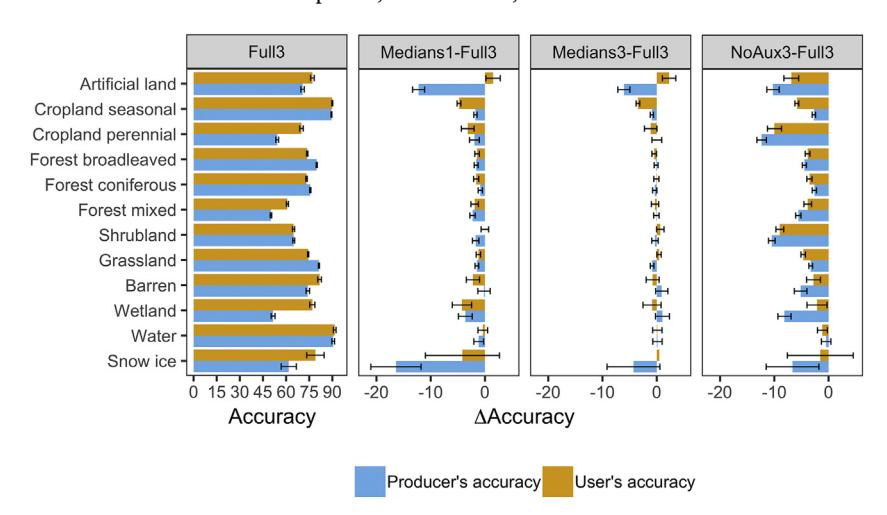
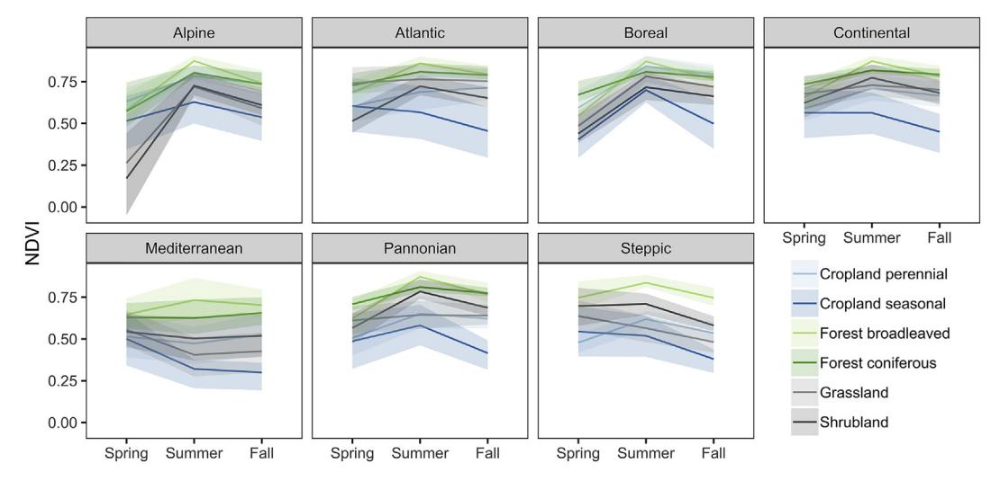

ELSEVIER

Contents lists available at ScienceDirect

### Remote Sensing of Environment

journal homepage: www.elsevier.com/locate/rse

# Mapping pan-European land cover using Landsat spectral-temporal metrics and the European LUCAS survey

Dirk Pflugmachera,\*, Andreas Rabea, Mathias Petersb,1, Patrick Hosterta,c

- a Geography Department, Humboldt University of Berlin, Unter den Linden 6, 10099 Berlin, Germany
- b Computer Science, Humboldt University of Berlin, Germany
- c Integrative Research Institute on Transformation of Human-Environment Systems (IRI THESys), Humboldt University of Berlin, Unter den Linden 6, 10099 Berlin, Germany

#### ARTICLE INFO

#### Keywords: Landsat Land cover classification Europe CORINE LUCAS

#### ABSTRACT

This study analyzed, for the first time, the potential of combining the large European-wide land survey LUCAS (Land Use/Cover Area frame Survey) and Landsat-8 data for mapping pan-European land cover and land use. We used annual and seasonal spectral-temporal metrics and environmental features to map 12 land cover and land use classes across Europe. The spectral-temporal metrics provided an efficient means to capture seasonal variations of land surface spectra and to reduce the impact of clouds and cloud-shadows by relaxing the otherwise strong cloud cover limitations imposed by image-based classification methods. The best classification model was based on Landsat-8 data from three years (2014-2016) and achieved an accuracy of 75.1%, nearly 2 percentage points higher than the classification model based on a single year of Landsat data (2015). Our results indicate that annual pan-European land cover maps are feasible, but that temporally dynamic classes like artificial land, cropland, and grassland still benefit from more frequent satellite observations. The produced pan-European land cover map compared favorably to the existing CORINE (Coordination of Information on the Environment) 2012 land cover dataset. The mapped country-wide area proportions strongly correlated with LUCAS-estimated area proportions (r = 0.98). Differences between mapped and LUCAS sample-based area estimates were highest for broadleaved forest (map area was 9% higher). Grassland and seasonal cropland areas were 7% higher than the LUCAS estimate, respectively. In comparison, the correlation between LUCAS and CORINE area proportions was weaker (r = 0.84) and varied strongly by country. CORINE substantially overestimated seasonal croplands by 63% and underestimated grassland proportions by 37%. Our study shows that combining current state-of-the-art remote sensing methods with the large LUCAS database improves pan-European land cover mapping, Although this study focuses on European land cover, the unique combination of large survey data and machine learning of spectral-temporal metrics, may also serve as a reference case for other regions. The pan-European land cover map for 2015 developed in this study is available under https://doi.pangaea.de/10.1594/PANGAEA.896282.

#### 1. Introduction

Land cover is a key variable influencing the Earth's energy balance, the hydrological and carbon cycle, and the provisioning of natural resources and habitat (Bonan, 2008; Brovkin et al., 2004; Foley et al., 2005). Satellite imagery has long been used for mapping land cover from space (Townshend et al., 1991). The first systematic observations of the Earth land surface became available with the launch of Landsat-1 in 1972, which opened new opportunities for automated land cover mapping (Gordon, 1980; Landgrebe, 1976). In the 1990s and early 2000s, a number of operational land cover programs emerged based on

Landsat and Landsat-like data, e.g. CORINE (Coordination of Information on the Environment) land cover in Europe (Büttner, 2014), NLCD (National Land Cover Database) in the USA (Homer et al. 2004, Jin et al., 2013, Vogelmann et al., 2001), EOSD (Earth Observation for Sustainable Development of Forests) in Canada (Wulder et al., 2008), NCAS-LCCP (National Carbon Accounting System-Land Cover Change Project) in Australia (Furby, 2002), and PRODES (Programa Despoluição de Bacias Hidrográficas) in Brazil (INPE, 2002). Over the last decades, tremendous progress has been made in developing up-to-date and accurate land cover information. The availability of high quality, ready-to-analyze medium resolution sensor data (Drusch et al., 2012;

\* Corresponding author.

E-mail address: dirk.pflugmacher@geo.hu-berlin.de (D. Pflugmacher).

&lt;sup>1 Currently at Senacor Technologies AG, Germany.

Wulder et al., 2012) and advances in IT infrastructures and cloud computing have made it possible to produce regional to global land cover maps in a relatively short period of time (Gong et al., 2013; Xiong et al., 2017).

In Europe, CORINE provides the most comprehensive and detailed maps of land cover and land use change at medium spatial resolution (Büttner, 2014). The CORINE program was established by the European Commission to create harmonized geographical information on the state of the environment in the European Community. CORINE land cover is mapped in 44 classes using a minimum mapping unit of 25 ha for areal phenomena and a minimum width of 100 m for linear phenomena. The first CORINE land cover map was created for the reference year 1990 using satellite data from 1986 to 1998. The project involved 25 countries, and it took ten years to complete. Subsequent land cover updates were produced for the years 2000, 2006, and 2012. Over the years, the product chain has evolved and production times have decreased. The most recent CORINE land cover 2012 involved 39 countries and took two years to complete. CORINE's approach builds on harmonized protocols and guidelines that are executed independently by each country. This way, countries can integrate their national efforts and inventory resources and make the best use of local expert knowledge. The disadvantage is that variable mapping approaches may be employed and that the majority of countries heavily rely on visual interpretation of high-resolution satellite imagery. Only a few countries apply semi-automatic solutions combining national in-situ data and satellite image analysis. Considering the increasing demand for consistent and up-to-date land cover information, there is a strong need to develop and test automated approaches for mapping pan-European land

The increasing and free availability of ready-to-analyze medium resolution imagery has brought new opportunities for the automated mapping of land cover and land cover change over large areas (Hansen and Loveland, 2012). Traditional image-based classification approaches require cloud-free or near-cloud free imagery, and they often go along with heavy user-interaction and visual interpretation methods. Scaling image-based approaches over large areas is technically and logistically challenging, particularly in areas that have a lot of clouds. Mass-processing of Landsat and Landsat-like data has become easier with perpixel approaches that integrate multiple (potentially all) cloud-free reflectance values for a given pixel and time period, and produce seamless mosaics across image boundaries (Roy et al., 2010).

A variety of per-pixel approaches exist that may be categorized as follows: composites based on the best pixel observation within a given time period (Griffiths et al., 2012; Hermosilla et al., 2015; Roy et al., 2010), spectral-temporal metrics based on statistical moments (Azzari and Lobell, 2017; Potapov et al., 2015), and phenological metrics derived from fitting time series functions (Schwieder et al., 2016; Zhu and Woodcock, 2014a). All these methods have advantages and disadvantages; sometimes they are used in combination. Composites select the best pixel observations for a given time period using a set of rules and optimization functions. The goal is to reduce atmospheric effects while retaining original reflectance observations. Spectral-temporal metrics do not (necessarily) yield observed reflectance. Rather they describe the spectral distribution and variance of a pixel over a year or season. Spectral-temporal metrics are a simple means to express seasonal land cover dynamics related to vegetation growth and land use, and they have been used to map land cover (Azzari and Lobell, 2017; Hansen et al., 2011), tree species (Thompson et al., 2015), and forest disturbances (Potapov et al., 2015). Time series approaches yield a detailed model of land surface phenology because they directly estimate parameters that describe the timing, shape, and periodicity of the land surface changes. In this respect, time series methods are superior to spectral-temporal composites, but they also have higher requirements regarding data density and computing power. Research is ongoing to evaluate how to scale time series methods effectively across very large areas. In this study, we build on spectral-temporal metrics to automate land cover classification across Europe.

Collecting reference data for training and validation is an essential component in land cover mapping. Ideally, a combination of photointerpretation and field work is employed that covers the expected range of land cover and environmental conditions (Strahler et al., 2006). If reference data are used for validation, then a probability sampling design is required to ensure statistical estimates of map accuracy (Stehman, 1997). Since reference data collection takes a major effort, there is a paucity of reference datasets at the regional (country to continental) and global scale. For global scale validation, tremendous progress has been made through crowdsourcing activities (Fritz et al., 2017) and probability-based samples of high-resolution imagery (Pengra et al., 2015). These approaches fill a crucial gap, but they also have trade-offs concerning interpretation uncertainty (Foody and Boyd, 2013) and sample size (Banaszkiewicz et al., 2014). Countries that support national land cover programs often rely on photo-interpretation and field survey data (Vogelmann et al., 2001; Homer et al., 2004; Wickham et al., 2010), which are usually not publicly available.

The European Land Use/Cover Area frame Survey (LUCAS) provides a unique source of publicly available land cover survey data. LUCAS is coordinated by Eurostat, the statistical office of the European Commission, with the aim to inform decision makers and the general public about changes in management and coverage of the European territory (Martino and Fritz, 2008). LUCAS collects information on land cover and land use, agro-environmental, and soil data every three years in the European Union since 2006. The survey is conducted in two phases. In the first phase, land cover is recorded via photo-interpretation at a systematic sampling grid with points spaced 2 km apart. In the second phase, a stratified sample is visited in the field. This sample represents the largest harmonized in-situ land cover record in Europe. In 2012, the in-situ measurements involved 750 field surveyors. The main purpose of LUCAS is statistical estimation. The survey was not designed for mapping. However, the potential benefits are high, if LUCAS data can be successfully used to train modern machine learning classification algorithms. Past remote sensing studies that incorporated LUCAS data have been limited to statistical estimates (Gallego and Bamps, 2008), map validation (EEA, 2006), and semi-automated training of classification models over smaller regions (Mack et al., 2017). No study has utilized LUCAS for automated, pan-European land cover mapping.

The objective of this study was to develop a method for mapping pan-European land cover by automated classification of Landsat spectral-temporal metrics using the largest European-wide land cover survey LUCAS. We evaluate the mapping approach at the continental and regional scales and specifically address the following research questions:

- How does data density impact classification accuracy?
- How do environmental predictors improve classification accuracy?
- How does the automated land cover map compare to the existing CORINE product?

#### 2. Study area

The study area covers Europe from approximately 10°W to 30°E longitude and 35°N to 71°N latitude (Fig. 1). The area is similar to the CORINE land cover dataset (2012) excluding Iceland, Turkey, Malta, and Cyprus. On the eastern boundary, we included the Kaliningrad region and the western part of Ukraine to complete the Carpathian region. Europe's climate ranges from dry-warm Mediterranean climate of the south to subarctic and tundra climates in the northeast. Western and Northwestern Europe has a mild, generally humid Atlantic climate, while Central and Eastern Europe have a continental climate with less precipitation.

The European Environmental Agency (EEA, 2016) identifies seven main biogeographical regions in the study area: *Alpine, Atlantic, Boreal*,

Fig. 1. Study area and its biogeographical regions (EEA, 2016).

Continental, Mediterranean, Pannonian, and Steppic (Fig. 1). The Alpine region constitutes several mountain ranges from the Mediterranean to Scandinavia. The region exhibits a great variety of ecosystems and habitat types, of which 90% are natural or semi-natural. Forests cover > 40% of the region's area and grasslands about 25% (EEA, 2012). The Atlantic region has a mild and humid climate. The present forest cover is relatively sparse but increasing mainly due to plantations (EEA, 2012). The Boreal region is dominated by conifer forests and has a cool and mainly continental climate. Vegetation growth is strongly influenced by the length of the growing season, which varies between 100 days in the north and 200 days in the south. The Continental biogeographic region has warm summers and cold winters. Soils have naturally high fertility. Hence, the region is a main crop-producing area. Permanent grasslands are still widespread but decreasing, while forest area is increasing (EEA, 2012). The Mediterranean region has a warm climate with hot summers and mild winters. Forests are mainly broadleaved and highly diverse in species composition. Due to the hot and dry climate, however, crown cover is much lower compared to Continental and Boreal forests. Agricultural land including grasslands occupies about 40% of the region, and permanent crops such as orchards and olive groves play a significant role. The *Pannonian* region is dominated by sandy grasslands and steppes. Historically, the region was covered extensively by forests, which now make up about 17% of the area (EEA, 2012). Only a small part of the study region (eastern Romania) belongs to the *Steppic* biogeographic region, an area dominated by tree-less vegetation such as Stipa and other turf grasses.

#### 3. Methods

#### 3.1. Landsat data and data availability

We downloaded all orthorectified (L1T) Operational Land Imager (OLI) images acquired between January 1st 2014 and December 31st 2016 with an estimated cloud cover of < 75% from the United States Geological Service (USGS). In total, we used 18,675 images across 476 WRS-2 footprints. On average, this yielded 40 images per footprint over the three-year period. The number of available images varied regionally being lowest in the northern Scandinavian peninsula (minimum = 16) and highest in the Mediterranean region (maximum = 66).

All Landsat images had been corrected to surface reflectance by the USGS using the methods described in Vermote et al. (2016), and cloud-masked using FMask (Zhu and Woodcock, 2014b). We excluded the coastal, cirrus, thermal and panchromatic bands from further processing and analysis. Based on the remaining six spectral bands, we calculated the tasseled cap components brightness, greenness, and wetness (Crist, 1985), the normalized difference vegetation index (NDVI, Tucker, 1979), normalized burn ratio (NBR, Key and Benson, 2006), and modified soil-adjusted vegetation index (MSAVI2, Qi et al., 1994).

The availability of clear-sky Landsat-8 observations for Europe varied greatly, spatially and seasonally (Fig. 2). Based on the Landsat quality band, the time periods with the lowest number of clear observations were spring and fall with an average of 3.2 and 3.1 observations, respectively (in 2015). About 6.7% and 6.8% of the area, respectively, remained unobserved during the two seasons due to

Fig. 2. Clear observation counts from Landsat-8 across Europe for different time intervals of a 1-year (top) vs. 3-year observation period (bottom).

clouds and cloud-shadows. The data gaps (i.e., no clear-sky) occurred mostly in high latitudes of Scandinavia and the UK and Ireland, and in mountainous regions in Central and Eastern Europe. In the summer period, the average number of observations increased to 4.8, and the gap proportion decreased to 1.8%. Summer gaps affected mostly the areas of Scotland and Wales. During the year 2015, Landsat-8 acquired an average of 12.7 clear observations, though a clear latitudinal gradient from < 3 to > 15 was still visible. Increasing the time period to adjacent years (2014–2016) tripled the clear observations and eliminated nearly all gaps, i.e., data gaps accounted for < 0.2% of the area in each season.

#### 3.2. LUCAS reference data

LUCAS data from 2015 served as reference dataset for training and validating classification models. LUCAS is the largest and most comprehensive land cover database in Europe (Gallego and Bamps, 2008). It has been successfully used for analyzing and verifying land cover maps in a few countries (Karydas et al., 2015; Mack et al., 2017), but it has not been utilized for Europe-wide land cover mapping, yet. It is important to note that only EU member countries are included in the survey. Hence, LUCAS data are not available for Norway, Switzerland, Liechtenstein, Ukraine, and the non-EU Balkan states. This precluded an error assessment of our approach for these countries. It is to be expected, though, that our results and findings also apply to these areas since the LUCAS survey well covers the broad geographic and environmental gradients of Europe.

LUCAS collects land cover and land use data, agro-environmental, and soil data by field observation and photo-interpretation at a systematic grid of  $2\times 2$  km (Gallego and Bamps, 2008). Concerning land cover, LUCAS distinguishes eight main categories (artificial land, cropland, woodland, shrubland, grassland, bare land, water, and wetland) and 76 sub-classes. For our mapping, we extended the main categories to further differentiate between seasonal and perennial croplands, broadleaf, coniferous and mixed forest, and permanent snow/ice (Table 1).

Depending on land cover type, the LUCAS protocol defines the

sampling units as circular plots with a radius of  $1.5\,\mathrm{m}$  or  $20\,\mathrm{m}$ . Overall, we used  $221,110\,$  LUCAS samples distributed across  $12\,$  land cover classes (Table 1). Except for artificial land and perennial cropland, we used only direct observations made at the plot in the field or via photo-interpretation for which the land cover area was  $> 0.5\,\mathrm{ha}$ , the land cover proportion was > 50%, and plots for which the field-observed GPS location was  $< 30\,\mathrm{m}$  away from the LUCAS point. For artificial land and perennial cropland, we relaxed the selection requirement because it would otherwise leave only 6% of the artificial land samples and 26% of the perennial cropland samples. For artificial land, we used all samples were photo-interpretation and field-observations agreed. For perennial land, we relaxed the minimum required land cover proportion to 25%. Finally, we excluded linear artificial features, linear water features, and classes with potential thematic ambiguity: spontaneously revegetated surfaces and other bare land.

#### 3.3. Spectral-temporal features

Per-pixel spectral-temporal metrics (Griffiths et al., 2013; Potapov et al., 2015; Rufin et al., 2015) computed from six reflectance bands and six vegetation indices served as input features for classifying land cover (Table 2). Spectral-temporal metrics are statistical metrics that describe the distribution of a spectral band or index over a specified period of time. Here, we selected five time intervals covering different phenologically relevant seasons and time periods: spring (March-May), summer (June-August), fall (September-November), core growing season (May-September), and an entire year (Table 2). The growing season interval was selected to cover the vegetation season in Europe, though vegetation growth can be longer or shorter depending on latitude and elevation. We did not calculate metrics for the winter season (December-February). The low sun angles limited availability of surface reflectance images for that time period. For the four seasonal time periods, we calculated the medians of the six reflectance bands and six spectral indices (Table 2). For the annual interval, we included a larger number of statistical metrics that describe more fully the spectral means and variances: minimum, maximum, mean, standard deviation, and the 5th, 25th, 50th, 75th and 95th percentile.

**Table 1**Pan-European land cover legend, corresponding LUCAS classes, and number of LUCAS samples.

| Land cover class    | LUCAS class                                                                                                                                                                                                                                                                                                                                                                                                                                                                                                                                                                                                                                                                                    | Used (total) samples |
|---------------------|------------------------------------------------------------------------------------------------------------------------------------------------------------------------------------------------------------------------------------------------------------------------------------------------------------------------------------------------------------------------------------------------------------------------------------------------------------------------------------------------------------------------------------------------------------------------------------------------------------------------------------------------------------------------------------------------|----------------------|
| Artificial land     | Artificial land (A00): Areas characterized by an artificial and often impervious cover of constructions and pavement. Includes roofed built-up areas (A10) and non-built-up area features (A11) such as parking lots and yards. Excludes non-built-up linear features (A22) such as roads, and other artificial areas (A30) such as bridges and viaducts, mobile homes, solar panels, power plants, electrical substations, pipelines, water sewage plants, open dump sites.                                                                                                                                                                                                                   | 5010 (14,479)        |
| Cropland, seasonal  | Areas where seasonal crops are planted and cultivated, including Cereals (B10), root crops (B20), non-permanent industrial crops (B30), dry pulses, vegetables, and flowers (B40), and fodder crops (B50); excluding temporary grasslands (B55)                                                                                                                                                                                                                                                                                                                                                                                                                                                | 38,359 (67,225)      |
| Cropland, perennial | Permanent crops: fruit trees (B70) and other permanent crops (B80)                                                                                                                                                                                                                                                                                                                                                                                                                                                                                                                                                                                                                             | 7861 (12,470)        |
| Forest, broadleaved | Broadleaved woodland (C10): Areas with a tree canopy cover of at least 10% and composed of > 75% of broadleaved species                                                                                                                                                                                                                                                                                                                                                                                                                                                                                                                                                                        | 39,179 (53,498)      |
| Forest, coniferous  | Coniferous woodland (C20): Areas with a tree canopy cover of at least 10% and composed of > 75% of coniferous species.                                                                                                                                                                                                                                                                                                                                                                                                                                                                                                                                                                         | 32,988 (42,263)      |
| Forest, mixed       | Mixed woodland (C30): Areas with a tree canopy cover of at least 10% and composed of broadleaved and coniferous trees comprising both > 25% of the tree canopy.                                                                                                                                                                                                                                                                                                                                                                                                                                                                                                                                | 24,362 (29,079)      |
| Shrubland           | Areas dominated (at least 10% of the surface) by shrubs and low woody plants normally not able to reach > 5 m of height. It may include sparsely occurring trees with a canopy below 10% (D00).                                                                                                                                                                                                                                                                                                                                                                                                                                                                                                | 18,602 (27,285)      |
| Grassland           | Grassland (E00): Land predominantly covered by communities of grassland, grass-like plants and forbs. This class includes permanent grassland and permanent pasture that is not part of a crop rotation (normally for 5 years or more). It may include sparsely occurring trees within a limit of a canopy below 10% and shrubs within a total limit of cover (including trees) of 20%. Excludes: Spontaneously re-vegetated surfaces (E30) consisting of agricultural land which has not been cultivated this year or the years before. It has not been prepared for sowing any crop this year, clear-cut forest areas, industrial "brownfields", storage land, and abandoned or unused land. | 42,386 (69,504)      |
| Barren              | Bare land and lichens/moss (F00): Areas with no dominant vegetation cover on at least 90% of the area or areas covered by lichens/moss, excluding: Other bare soil (F40), which includes bare arable land, temporarily unstocked areas within forests, burnt areas, secondary land cover for tracks and parking areas/yards.                                                                                                                                                                                                                                                                                                                                                                   | 4460 (10308)         |
| Wetland             | Inland wetlands (H10): Wetlands located inland and having fresh water. Coastal wetlands (H20): Wetlands located on marine coasts or having salty or brackish water, as well as areas of a marine origin.                                                                                                                                                                                                                                                                                                                                                                                                                                                                                       | 3641 (4506)          |
| Water               | Water areas (G00): Inland or coastal areas without vegetation and covered by water and flooded surfaces, or likely to be so over a large part of the year.                                                                                                                                                                                                                                                                                                                                                                                                                                                                                                                                     | 4006 (8640)          |
| Snow/ice            | Glaciers, permanent snow (G50): Areas covered by glaciers (generally measured at the time of their greatest expansion in the season) or permanent snow                                                                                                                                                                                                                                                                                                                                                                                                                                                                                                                                         | 256 (266)            |

Table 2
Temporal intervals and bands used for calculating spectral-temporal metrics, and a list of auxiliary features. A more detailed list of bioclimatic variables is in Supplement Table S1.

| Category                                                    | Features/Intervals                                                                                                                                                                                                                               |
|-------------------------------------------------------------|--------------------------------------------------------------------------------------------------------------------------------------------------------------------------------------------------------------------------------------------------|
| Annual interval (1) Seasonal intervals (4) Bands (12) | 1 January–31 December 15 May–15 September, 1 March–31 May, 1 June–31 August, 1 September–30 November Blue, Green, Red, NIR, SWIR1, SWIR2, Normalized Difference Vegetation Index (NDVI), Normalized Burn Ratio (NBR), and Modified Soil-adjusted |
| Auxiliary features (22)                                     | Vegetation Index (MSAVI2), Tasseled Cap Brightness (TCB), Tasseled Cap Greenness (TCG), Tasseled Cap Wetness (TCW) Elevation, Geographic latitude, Geographic longitude, WorldClim bioclimatic variables (19)                                    |

#### 3.4. Auxiliary features

We included environmental variables as auxiliary predictors to reduce the spectral-temporal overlap between land cover classes. When training data are collected over a geographic region, the resulting spectral-temporal signatures may be representative for that region (and time period) but how far they extend (apply) to other areas and time periods is limited (Woodcock et al., 2001). To map land cover over large areas, signatures are often collected over a wide geographic and environmental gradient while the map classes are geographically agnostic. For example, conifer forests range from the dry-warm Mediterranean region to the cool Boreal region, albeit species composition, structure, understory vegetation, and soil types are quite different. Likewise, croplands in Europe represent a diverse range of crop types and cycles. Thus, class signatures representing a potentially wide range of vegetation physiognomy, species composition, and land management are pooled to represent single land cover classes. To address this issue, large-area studies have developed strategies to account for geographic variations in land cover class signatures, e.g. 1) by using environmental covariates as auxiliary predictors (Baccini et al., 2004; Vogelmann et al., 2001; Ohmann and Gregory, 2002), or 2) locally adaptive approaches that divide the geographic space into smaller subsets or windows (Latifovic et al., 2017; Zhang and Roy, 2017). Locally adaptive classification approaches are appealing but they are not easy to set up, and they require a large number of training samples. Using environmental variables provides a means to partition the feature space into geographically similar areas via continuous environmental gradients as opposed to distinct area subsets.

We used auxiliary variables that exploit the relationships between climate, topography, and terrestrial vegetation (Franklin, 1995) to potentially improve classification accuracy. For example, long-term precipitation data may help explain spectral differences between opencanopy forests in the dry Mediterranean region and dense forests in the moister temperate mountain ranges. Similarly, temperature drives vegetation green-up or may inhibit vegetation growth at all. Furthermore, we included geographic latitude and longitude (World Geodetic System 1984) as predictors to capture geographic gradients related to land use, e.g. different cropping systems, perennial croplands vs forest, and artificial land vs barren. Elevation was derived from the global 30 Arc-Second Elevation Data Set (GTOPO30) developed by the United States Geological Survey, and 19 bioclimatic variables were taken from the WorldClim dataset (Fick and Hijmans, 2017). WorldClim is gridded monthly temperature and precipitation data aggregated over 30 years

(1970–2000) and with a spatial resolution of about  $1\,\mathrm{km}^2$ . The bioclimatic variables are biologically meaningful variables derived from the monthly temperature and rainfall values. To match the Landsat pixel grid, all auxiliary features were reprojected and resampled to 30 m spatial resolution using nearest neighbor interpolation.

#### 3.5. Classification models

We used random forest classification (Breiman, 2001; Liaw and Wiener, 2002) to predict the 12 LUCAS-based land cover classes (Table 1). Random forest is an ensemble learning method based on many randomized decision trees. When constructing an ensemble of n trees, each tree is trained independently based on a bootstrap sample of the data. Furthermore, each decision node (of a tree) is split with a random subset of predictor variables. As a result, random forest performs well on large and noisy input data, and it is robust against overfitting (Breiman, 2001). To make a class prediction, random forest takes the majority vote of all n trees. In this study, random forest was trained with n = 500 trees, and the number of variables randomly sampled as candidates at each split were set to  $\sqrt{p}$ , where p is number of features.

To better understand the role of data density, auxiliary information, and spectral-temporal metrics for classifying pan-European land cover, we trained and tested four separate classification models (Table 3). To assess the influence of data density we constructed and compared the models: Medians 1 and Medians 3. Both models were trained on seasonal and annual medians, and auxiliary features. However, Medians1 used only Landsat data from 2015, whereas Medians3 utilized data acquired over a period of three years. To calculate the seasonal and annual statistics for the three-year model, data from multiple years were pooled by ignoring the year of acquisition. For example, a single median for the red band and summer season was calculated using all summer acquisitions from 2014 to 2016, not three annual medians for each year. Model NoAux3 was built to assess the influence of auxiliary information on model performance. The model has the same spectral-temporal features as Medians3 (calculated over three years), but it does not include auxiliary environmental predictor variables. Finally, Full3 also builds on Medians3 but it adds additional statistical variance metrics for the annual time period with the aim to more fully describe the phenological differences between land covers. With a total of 178 features, Full3 represented the most complex model.

Table 3 Classification models (numbers of features are in parenthesis). Each metric was calculated for 12 bands, and there are four seasonal intervals, e.g. 4 seasons  $\times$  12 bands = 48 median metrics. Seasons and bands are listed in Table 2.

| Model name | Year range of Landsat data | Annual metrics                                                                               | Seasonal metrics | Auxiliary features | Total number of features |
|------------|-------------------------------|----------------------------------------------------------------------------------------------|------------------|--------------------|--------------------------|
| Medians1   | 2015                          | Median (12)                                                                                  | Median (48)      | All (22)           | 82                       |
| Medians3   | 2014-2016                     | Median (12)                                                                                  | Median (48)      | All (22)           | 82                       |
| NoAux3     | 2014-2016                     | Median (12)                                                                                  | Median (48)      | No (0)             | 60                       |
| Full3      | 2014–2016                     | Minimum, maximum, mean, median, standard deviation, percentiles: 5th, 25th, 75th, 95th (108) | Median (48)      | All (22)           | 178                      |

#### 3.6. Accuracy assessment

We estimated classification accuracies and associated confidence intervals (CI) for the pan-European area, for each biogeographic region, and for each European Union country using the LUCAS samples and the post-stratified estimator described in Olofsson et al. (2013). Landsat pixels served as sampling units. Instead of splitting the LUCAS data set into a single training and test dataset, we performed a cross-validation on the entire reference data set (n = 221,110). This enabled us to utilize as many plots as possible for model training. Cross-validation techniques based on resampling provide accurate estimates of error (Lyons et al., 2018) and substantially reduce production times of land cover mapping efforts (Homer et al., 2004). With random forest, cross-validation errors can be estimated through the out-of-bag (OOB) predictions (Liaw and Wiener, 2002). Recall that each tree is constructed from a bootstrap sample of the data (sampling with replacement). Therefore, only a portion (63%) of the entire dataset is used for training an individual tree. When an OOB prediction is made for a sample x, the prediction is also a majority vote of an ensemble of trees, but only the trees in which x was not involved in training are aggregated for that prediction. Based on the OOB predictions and the LUCAS reference data, we built confusion matrices and estimated overall accuracy (OA), user's accuracy (UA), and producer's accuracy (PA).

#### 3.7. Comparison with CORINE

We compared our classification results with the CORINE-2012 dataset based on mapped area proportions grouped by country and land cover class. First, we aggregated the CORINE legend to the 12 LUCAS classes (Table 4). Then, we plotted the mapped area proportions against the area proportions estimated from the LUCAS sample. Because we were interested in estimating area proportion, we used all LUCAS samples (n=339,523) not the dataset used for model training and validation. The training and validation dataset had been screened to minimize geolocation errors and differences in sampling units when overlaying Landsat pixels with LUCAS plots. We opted not to include a pixel-based confusion matrix between CORINE and LUCAS because of the very large differences in mapping units and sampling units. CORINE's large minimum mapping unit (25 ha) relative to the map produced in this paper (0.09 ha), makes a more direct spatial comparison challenging.

#### 4. Results and discussion

#### 4.1. Classification accuracy and class confusions

In this section, we present the thematic class confusion of the *Full3* model (Table 5), which is based on seasonal medians and annual variance metrics calculated over three years, and auxiliary predictors. We

start with the six dominant land cover classes that account together for 94% of the study area: seasonal croplands, broadleaved forests, coniferous forest, mixed forest, shrublands, and grasslands. Then, we focus on the small land cover classes: water, barren, artificial, perennial croplands, wetlands, and snow and ice. A comparison of different models is presented in Section 4.2.

Seasonal croplands were mapped with the highest accuracy among dominant classes (UA = 89.9  $\pm$  0.2%, PA = 89.4  $\pm$  0.1%, Table 5). Accuracies were also relatively consistent across biogeographic regions (Fig. 3). Except for the Alpine region, user's accuracies and producer's accuracies ranged between 82.5% and 95.4%. Grasslands achieved the second highest accuracy (UA =  $74.3 \pm 0.2\%$ ,  $PA = 81.3 \pm 0.2\%$ ), albeit omission and commission errors were unbalanced. The proportion of falsely included grassland was higher than the proportion of falsely excluded grasslands. Most of the seasonal croplands omission and commission errors were caused by class confusions with grasslands, and most of the grassland errors were caused by confusions with seasonal croplands, broadleaved forest, and shrublands. Considering the diversity of grassland and seasonal croplands in Europe and the spectral-temporal similarity of some grassland classes with seasonal crops, the obtained classification accuracies confirm the potential of large-area cropland mapping using medium resolution sensor time series (Griffiths et al., 2019; Xiong et al., 2017).

Broadleaved and coniferous forests achieved producer's accuracies of  $79.8 \pm 0.2\%$  and  $75.7 \pm 0.2\%$ , and user's accuracies of  $73.7 \pm 0.2\%$  and  $73.2 \pm 0.2\%$ , respectively. However, much of the class confusion was among forest classes, particularly with mixed forests. The relatively low accuracy of mixed forests is plausible since mixed forests are notoriously difficult to map (Friedl et al., 2002; Wickham et al., 2010; Jin et al., 2013), and the geolocation accuracy of sampling plots is usually lower under forest canopy. For the combined forest classes, the user's and producer's accuracy were  $91.7 \pm 0.1\%$  and  $91.8 \pm 0.2\%$ , respectively, which is higher than the accuracy of seasonal croplands. The balanced omission and commission errors indicate that the total mapped forested area is (nearly) unbiased.

The obtained classification accuracies showed no substantial regional bias in the dominant classes, which indicates that the presented approach captured the regional differences in spectral properties and seasonality (Fig. 3). However, some regional differences in map accuracy were seemingly related to data availability, prevalence, and regional land cover characteristics. For example, the lowest classification accuracy of broadleaved forests was observed in the Boreal region (UA = 62.5  $\pm$  0.9%, PA = 59.7  $\pm$  0.8%, Fig. 3). Broadleaved forests are often limited to frequently disturbed areas or particular soils in the Boreal region, and thus, they make up a relatively small area (8.4%) compared to conifer forests (32.8%). The relatively low Landsat data availability may also have contributed to the confusion of broadleaved forests with spectrally similar classes such as mixed forests, which achieved their highest accuracies in this region. Regional land cover

**Table 4**Cross-walk of the classified LUCAS map legend with the CORINE land cover legend.

| LUCAS map           | CORINE land cover                                                                                                                                                     |
|---------------------|-----------------------------------------------------------------------------------------------------------------------------------------------------------------------|
| Artificial land     | Artificial surfaces (111–142)                                                                                                                                         |
| Cropland, seasonal  | Agricultural areas: Arable land (211 – 213), heterogeneous agricultural areas (241–244)                                                                               |
| Cropland, perennial | Agricultural areas: Permanent crops (221 – 223)                                                                                                                       |
| Forest, broadleaved | Forests: Broad-leaved forest (311)                                                                                                                                    |
| Forest, coniferous  | Forests: Coniferous forest (312)                                                                                                                                      |
| Forest, mixed       | Forests: Mixed forest (313)                                                                                                                                           |
| Shrubland           | Scrub and/or herbaceous vegetation associations: (322–324)                                                                                                            |
| Grassland           | Agricultural areas: Pastures (231); Scrub and/or herbaceous vegetation associations: Natural grasslands (321); Artificial: non-agricultural vegetated areas (141–142) |
| Barren              | Open spaces with little or no vegetation: Beaches, dunes, sands, bare rocks, sparsely vegetated areas, burnt areas (331–334)                                          |
| Water               | Water bodies (511–523)                                                                                                                                                |
| Wetland             | Inland wetlands (411-412), Maritime wetlands (421-423)                                                                                                                |
| Snow/ice            | Open spaces with little or no vegetation: Glaciers and perpetual snow (335)                                                                                           |

Table 5

Confusion matrix for the pan-European region based on model *Full3*: 48 seasonal median metrics and 108 annual variance metrics pooled over three years, and 22 auxiliary features (Table 3). Values are in percent area. UA = User's accuracy (%). SE = Standard error (%).

| #  | Map class           | Reference class (LUCAS) |        |       |        |        |       |       |        |       |       |       |       |      |     |
|----|---------------------|-------------------------|--------|-------|--------|--------|-------|-------|--------|-------|-------|-------|-------|------|-----|
|    |                     | 1                       | 2      | 3     | 4      | 5      | 6     | 7     | 8      | 9     | 10    | 11    | 12    | UA   | SE  |
| 1  | Artificial land     | 1.601                   | 0.052  | 0.095 | 0.038  | 0.019  | 0.015 | 0.036 | 0.131  | 0.068 | 0.012 | 0.011 |       | 77.0 | 0.6 |
| 2  | Cropland seasonal   | 0.092                   | 15.510 | 0.251 | 0.190  | 0.025  | 0.032 | 0.095 | 0.999  | 0.011 | 0.031 | 0.008 |       | 89.9 | 0.2 |
| 3  | Cropland perennial  | 0.131                   | 0.107  | 1.928 | 0.161  | 0.040  | 0.019 | 0.191 | 0.169  | 0.005 | 0.005 | 0.000 |       | 70.0 | 0.6 |
| 4  | Forest broadleaved  | 0.048                   | 0.167  | 0.310 | 14.148 | 0.611  | 2.009 | 0.913 | 0.876  | 0.006 | 0.088 | 0.022 |       | 73.7 | 0.2 |
| 5  | Forest coniferous   | 0.016                   | 0.017  | 0.022 | 0.464  | 11.292 | 2.918 | 0.373 | 0.201  | 0.027 | 0.052 | 0.041 |       | 73.2 | 0.2 |
| 6  | Forest mixed        | 0.013                   | 0.023  | 0.009 | 1.070  | 2.049  | 5.527 | 0.114 | 0.185  | 0.007 | 0.072 | 0.017 |       | 60.8 | 0.3 |
| 7  | Shrubland           | 0.075                   | 0.034  | 0.225 | 0.558  | 0.542  | 0.186 | 5.466 | 0.844  | 0.173 | 0.314 | 0.012 |       | 64.8 | 0.3 |
| 8  | Grassland           | 0.270                   | 1.434  | 0.715 | 1.058  | 0.271  | 0.255 | 1.058 | 15.578 | 0.189 | 0.127 | 0.016 |       | 74.3 | 0.2 |
| 9  | Barren              | 0.014                   |        |       | 0.004  | 0.016  | 0.006 | 0.068 | 0.155  | 1.494 | 0.015 | 0.013 | 0.044 | 81.7 | 0.6 |
| 10 | Wetland             | 0.002                   | 0.004  |       | 0.014  | 0.045  | 0.040 | 0.093 | 0.020  | 0.005 | 0.849 | 0.030 | 0.000 | 77.0 | 0.9 |
| 11 | Water               | 0.004                   |        |       | 0.014  | 0.009  | 0.011 | 0.007 | 0.011  | 0.014 | 0.082 | 1.640 |       | 91.5 | 0.4 |
| 12 | Snow and ice        |                         |        |       |        |        |       |       |        | 0.019 |       | 0.000 | 0.071 | 79.0 | 2.9 |
|    | Producer's accuracy | 70.7                    | 89.4   | 54.2  | 79.8   | 75.7   | 50.2  | 65.0  | 81.3   | 74.1  | 51.6  | 90.5  | 61.7  | 75.1 |     |
|    | Standard error      | 0.6                     | 0.1    | 0.5   | 0.2    | 0.2    | 0.3   | 0.3   | 0.2    | 0.6   | 0.6   | 0.4   | 2.5   |      | 0.1 |

Correctly classified land cover proportions are highlighted in italics.

Fig. 3. User's and producer's accuracies for each biogeographic region based on the best classification model (images from a 3-year period and auxiliary features). Error bars show the 95% confidence interval.

characteristics were also an influential factor as indicated by the low accuracy of grasslands in the Mediterranean region (UA = 62.8  $\pm$  0.6%, PA = 63.7  $\pm$  0.5%,). Grasslands cover about 12.3% of the Mediterranean, and they occupy a relatively broad ecological and landuse gradient, ranging from natural grasslands that are too dry for trees and dense vegetation to intensively managed rangelands and pastures. Thus, the spectral-temporal separability of grasslands, shrublands, and barren land can be challenging (Friedl et al., 2010), particularly in ecotones (Pflugmacher et al., 2011).

Among the small land cover classes, water showed the highest

accuracy (UA = 91.5  $\pm$  0.4%, PA = 90.5  $\pm$  0.4%), which is expected since water exhibits distinct spectral absorption features. Also, artificial land and barren achieved accuracies comparable to the dominant classes, i.e., ranging from 71 to 82%. The results are promising, particularly the small area and heterogeneous nature of artificial land makes this class challenging to map over large areas (Chen et al., 2015; Herold, 2009). In this study, we did not include artificial linear features (e.g., roads, bridges) in the training and test dataset but the remaining samples may still contain mixed pixels.

Perennial croplands and wetlands showed substantial omission

errors (PA =  $54.2 \pm 0.5\%$  and  $51.6 \pm 0.6\%$ , respectively). Both classes are not primarily defined through land cover features but through their land use and soil hydrology, respectively. Thus, map errors are intrinsically linked to the ambiguity of the class definitions (Lunetta et al., 2001; Pflugmacher et al., 2011). We mapped perennial croplands to separate treed from herbaceous crops, though perennial herbaceous crops also exist. The best accuracies were achieved in the Mediterranean region, where perennial croplands are somewhat endemic (UA = 69.7  $\pm$  0.6%, PA = 72.2  $\pm$  0.5%, Fig. 3, Table S10). About 68.4% of the study region's perennial croplands are in the Mediterranean region (covering 11.8% of the Mediterranean). In other biogeographic regions, a substantial proportion of perennial croplands was classified as shrublands and forests. The high omission errors are understandable since perennial croplands share a similar vegetation physiognomy with forests and shrublands. If perennial crops have a distinct canopy structure, then methods that are more sensitive to forest structure, such as texture and context-based metrics from higher resolution Sentinel-2 data (Sothe et al., 2017), may be a useful addition to pan-European mapping.

## 4.2. Influence of data density, spectral-temporal features, and auxiliary features

In Section 4.1, we presented the overall and class-wise accuracies of the *Full3* model (OA =  $75.1 \pm 0.1\%$ ), which used seasonal medians and annual variance metrics calculated over three years, and auxiliary environmental features. In this section, we evaluate whether and how reducing data density (*Medians1*), the number of spectral-temporal features (*Medians3*), and auxiliary features (*NoAux3*) influenced classification accuracies.

There was a small but significant increase in accuracy associated with higher data density (p-value < 0.05, Fig. 4). Overall accuracy increased by 1.4 percentage points when spectral medians were calculated over three years instead of one year (Medians1: OA = 73.2  $\pm$  0.1%, Medians3: OA = 74.6  $\pm$  0.1%). Artificial land, wetlands, and snow and ice, benefited the most, showing increases in accuracy between 3 and 12 percentage points. Accuracies of seasonal and perennial croplands improved by 1 and 2 percentage points. The differences between the one-year and three-year models may seem small but they are large enough to matter, at least if users are interested in the full map legend. To put these numbers into perspective it may help to understand that 1% roughly represents an area equivalent in the European Union of the size of the country Slovakia. Hence, each incremental increase in accuracy observed here can have profound impacts on the map.

Including annual variance metrics further improved the classification accuracies of seasonal croplands, snow and ice, and artificial land. Although, the overall accuracy of *Full3* was only 0.5 percentage points higher than the overall accuracy of the spectral medians model (Medians3), the producer's accuracy of seasonal croplands increased by 3 percentage points when including annual variance metrics (i.e., omission decreased). The user's accuracy increased by 4 percentage points for snow/ice and by 6 percentage points for artificial land. For the other classes, the differences in accuracy were not statistically significantly different from 0 (p-value < 0.05).

The observed increase in seasonal cropland and grassland accuracies associated with higher data densities and additional variance metrics is promising, indicating that the spectral-temporal features captured phenological differences between the two land cover types. Seasonal croplands and grasslands exhibit substantial seasonal variations, but they can also produce similar spectral signatures over certain periods of time (Esch et al., 2014; Senf et al., 2015). Because the seasonal spectral-temporal metrics are limited in their expression of highly dynamic systems, it is reasonable to assume that denser multi-sensor time series coupled with more advanced time series algorithms can further improve classification accuracy of pan-European maps. The alternative hypothesis is that intra-class variability related to climate, management type, and management intensity limits differentiation and that further increasing data density does not improve classification accuracy. Which of these hypothesis holds true at the pan-European scale remains to be tested, but recent country-scale studies have demonstrated the added value of multi-sensor time series from Landsat and Sentinel-2 to differentiate crop types and grasslands (Griffiths et al., 2019). More generally, time series algorithms have emerged over the last decade that can exploit dense, multi-sensor time series to derive improved land cover classifications (Zhu and Woodcock, 2014a). However, these methods are not yet readily available for large-area applications and their data requirements may pose significant challenges when mapping land cover in data scarce regions or for historic time periods.

The auxiliary environmental features had the highest impact on model performance. Compared to the *Full3* model, overall accuracy decreased by 4.7 percentage points when auxiliary features were excluded from the model (NoAux3: 70.4  $\pm$  0.1%). The median decrease in user's and producer's accuracy was 3.9 and 5.0 percentage points, respectively. For perennial croplands, shrubland, and artificial land, the effect was even higher: user's and producer's accuracies decreased between 10 and 12 percentage points for perennial croplands, 9–10 percentage points for shrublands, and 7–10 percentage points for artificial land (Fig. 4). The strong influence of auxiliary features on these three classes may be explained by the distinct regionality of these land cover types, i.e. the majority of Europe's perennial croplands and shrublands are in the Mediterranean region (Fig. S1, Supplemental Material). Artificial lands are well distributed across all biogeographic regions, but

Fig. 4. User's and producer's accuracies for the best classification model Full3 and the change in accuracy when selecting a simpler model, i.e. Medians1, Medians3, and NoAux3 (Table 3). All models include seasonal and annual median metrics. In Medians1, medians are calculated from a single year of Landsat data, whereas the other models use three years of Landsat data. NoAux3 is the only model that does not include auxiliary features, and Full3 also includes annual variance and percentile statistics. Negative values indicate a decrease in accuracy relative to the model Full3. Error bars show the 95% Confidence Interval.

this land cover tends to be spatially clustered.

In this study, we used climate, elevation, and geographic location (latitude and longitude) as auxiliary data by including them as predictors in the classification model (Ohmann and Gregory, 2002; Powell et al., 2010). Other studies have included auxiliary data with decision tree classifiers in the form of prior probabilities (McIver and Friedl, 2002). Studies have also used other land cover and land use datasets as priors and/or auxiliary features (Friedl et al., 2002; Friedl et al., 2010). Hence, incorporating existing maps such as CORINE or specialized land cover maps from Copernicus Land Services (Kuntz et al., 2014) such as imperviousness, grasslands, wetlands, and urban atlas, may be useful to further improve classification accuracy. Furthermore, the mapping of wetlands is often facilitated through geomorphic indices derived from elevation data (Chignell et al., 2018; Maxwell et al., 2016). Here, we used common environmental variables as auxiliary features to keep the scope as general as possible.

The large sample size and systematic nature of the LUCAS sample provides a unique opportunity for modeling approaches that are able to exploit the spatial covariance structure among samples. Including geographic location or distances as predictors is an effective way to include spatial context and neighborhood relationships in spatial models (Bivand et al., 2013) but there are more sophisticated methods (Zhang and Roy, 2017). The geographic location variables had a higher impact on classification accuracy than elevation and climate (based on the random forest variable importance metrics: mean decrease in accuracy and GINI), which suggests that there is potential of spatial models in future mapping of pan-European land cover.

#### 4.3. Spectral-temporal variability of European land cover

Spectral-temporal metrics are a simple but efficient means to capture seasonal variations of land cover that may be spectrally ambiguous if observed at a single point in time. The spectral-temporal profiles of European land cover reveal two main patterns: 1) land surface phenology varies spatially reflecting the wide environmental and land-use gradients across Europe, and 2) land surface phenology varies within biogeographic regions (Fig. 5). For example, the phenology of natural vegetation in the Mediterranean and Steppe region is largely influenced by water availability. Hence, vegetation greenness of herbaceous and shrub vegetation is highest in spring and decreases throughout the year. In contrast, forest vegetation in these regions show either a phenological peak during the summer or no clear phenological pattern (in the seasonal metrics). Seasonal croplands show a distinct summer peak only in the Alpine, Boreal, and Pannonian region as a result of the

shorter vegetation period. Seasonal croplands also have the highest variance within biogeographic regions. In comparison, forests have the lowest variance in land surface phenology except in the Mediterranean region. It is important to note that the NDVI profiles shown in Fig. 5 are meant to illustrate the seasonal patterns captured by the spectral-temporal metrics. However, NDVI is only a two-band index, whereas the temporal-spectral metrics implemented in this study utilize all bands and multiple indices.

#### 4.4. Comparison with CORINE

The mapped area proportions calculated for each country were very strongly correlated with the LUCAS-based area proportions (r = 0.98, Fig. 6). In comparison, the correlation between CORINE-based area proportions and LUCAS-based proportions was not as strong (r = 0.84). Both maps tended to slightly underpredict certain small classes and overpredict certain large classes (slope = 1.13 and slopeCORINE = 1.22). Since the LUCAS sampling unit can be smaller than the Landsat pixel size, particularly for classes that include linear features like roads and rivers, some of this difference may be explained by the resolution bias (Boschetti et al., 2004; Krankina et al., 2008). For example, our mapped artificial surface area was 15% smaller than the LUCAS estimate, whereas CORINE slightly overestimated artificial surface area by 8%. Overall, CORINE showed a substantially stronger class-specific area bias. Total map area of seasonal croplands was 63% larger than the LUCAS-based estimate, and the grassland area was 37% smaller than LUCAS. In comparison, our mapped grassland and seasonal cropland area was 7% larger than LUCAS, respectively.

The comparison of class area proportions indicates that the map produced by spectral-temporal metrics and machine learning is superior to CORINE for the 12 analyzed land cover classes. Since the automated classification was trained with LUCAS samples, the strong agreement is somewhat expected. However, LUCAS is also the best statistical land cover and land use sample in Europe, and therefore considered the gold-standard. The large differences with CORINE-based area proportions are difficult to explain by the use of different input and training data sources. Differences in thematic class definitions are also negligible at the thematic resolution analyzed here. A closer look at the area proportions revealed that CORINE's agreement with LUCAS varied substantially by country (Fig. 7). The correlation between CORINE and LUCAS area proportions ranged from 0.35 to 0.98 (mean = 0.81, standard deviation = 0.14), whereas the correlation between our map and LUCAS ranged from 0.91 to 1.00 (mean = 0.98, standard deviation = 0.02). Thus, the automated classification provides a level of

Fig. 5. Temporal variability of median NDVI for the dominant land cover classes grouped by biogeographic region. Lines represent the regional median and ribbons show the 25th and 75th percentile. Not all classes are shown to improve readability.

Fig. 6. Mapped area proportions versus LUCAS-based area proportions (left) and CORINE-2012 area proportions versus LUCAS-based proportions (right). Each colored dot represents the class area proportion of a single country. Error bars are the standard error estimates of the LUCAS sample-based area proportion estimates.

**Fig. 7.** Country effect on map accuracy. The box-plot shows the distribution of the Pearson correlation coefficients (calculated for each country) between LUCAS area proportions (reference) and mapped area proportions from CORINE-2012 and the map developed in this study.

consistency that is lacking in CORINE's bottom-up approach, which builds on nationally produced land cover datasets. It is also reasonable to assume that CORINE's large minimum mapping unit (25 ha) contributes to the observed discrepancies. Only a few studies have compared CORINE with local and national land cover datasets, and they report similar findings (Felicísimo and Gago, 2002; Gallego, 2001).

Ultimately, all maps have errors and user's need to decide which map meets their requirements. If unbiased area estimates are of interest, estimates are often derived from probability samples using the maps as strata (Stehman, 2009). In this regard, CORINE still represents European land cover at an unprecedented level of thematic detail; and the maps have been combined with LUCAS to improve area estimates (Gallego, 2001). However, spatial applications such as land use models, habitat and ecosystem models (Kuemmerle et al., 2016; Schadt et al., 2002; Verburg et al., 2011) will benefit from the improved spatial accuracy, consistency, and minimum mapping unit achieved with the presented approach.

#### 4.5. LUCAS: sources of uncertainty

LUCAS provides a unique source for estimating land cover and land use statistics in Europe, but the use of this data as reference for remote sensing analysis is not without challenges. The most prominent sources of error are probably geolocation errors related to GPS measurements in the field and image misregistration errors, differences in spatial sampling units, interpreter errors, and land cover ambiguities related to different land uses (EEA, 2006; Karydas et al., 2015; Mack et al., 2017). We tried to minimize some of the errors by disregarding LUCAS samples that are unlikely to conform with the sampling protocol imposed by the remote sensing data (while all LUCAS samples were used for estimating area proportions). However, a true estimate of measurement error is not possible without a rigorous re-analysis of LUCAS data at the pan-European scale. For the accuracy assessment of CORINE-2000, the EEA (2006) conducted a reinterpretation of a subset of 8231 LUCAS samples using Landsat images. For this subset of reinterpreted samples, the agreement with CORINE-2000 increased by 6.4 percentage points (to 81.2%). Since the reinterpreted samples accounted for CORINE's minimum mapping unit, it is difficult to transfer this estimate to our study and our minimum mapping unit (30 × 30 m). However, we believe that our accuracy estimate is conservative rather than optimistic because it includes uncertainties in the LUCAS observations at the Landsat pixel scale. To facilitate future pan-European land cover mapping, it seems promising to combine efforts from Earth observation programs like Copernicus and LUCAS.

Mapping small classes and estimating accuracies of small classes is a known problem (Stehman, 2000). Collecting additional training data through manual or automated approaches (Radoux et al., 2014) may help to improve the accuracy of those classes that are spectrally or temporally distinct. However, an independent reference sample based on a probability sampling design would still be needed to estimate classification accuracy. In this study, we employed one of the largest training samples used for large area land cover mapping. However, the LUCAS sample may still be too small to reliably estimate the regional accuracy of small classes in some regions (indicated by large 95% Confidence intervals in Fig. 3). Additional efforts are needed if reliable classification accuracies are needed for these regions or regions of similar size and geography.

#### 5. Conclusions

This study demonstrated the potential for automated mapping of pan-European land cover by integrating machine learning, Landsat spectral-temporal metrics, and the European land cover survey LUCAS. The acquisition of ground-truth data plays a major part in the

development and validation of land cover maps (Fritz et al., 2017; Olofsson et al., 2012), which highlights the unique value of the internationally coordinated, Europe-wide LUCAS survey. Although the thematic resolution of our map (12 classes) is lower than the 44 classes currently mapped with Europe's CORINE program, the accuracy and mapping unit substantially improved in those 12 classes, despite the large regional differences in data availability, land use, and climate. The results are promising for European programs such as Copernicus Land Services, but whether the approach fulfills operational requirements needs to be evaluated separately. For example, the accuracy target of the CORINE program is 85%, nearly 10 percentage points higher than this study. Increasing the minimum mapping unit is likely to increase accuracy (Knight and Lunetta, 2003), but it may also limit the use of the map for certain applications (Fassnacht et al., 2006). Overall, our mapping accuracies for Europe are very similar to the pixel-level accuracies obtained by NLCD in the US, where level-1 classification accuracies ranged from 74.5 to 75.8% for the 2001, 2006, and 2011 land cover (Wickham et al., 2017). Looking forward, we wish to conclude with the following suggestions for potential future work:

- Our proof of concept shows that the land cover survey LUCAS, which is not designed for remote sensing analysis, is useful for training machine learners to map pan-European land cover. Future work might focus on extending training data collection for small classes and on combining validation efforts with LUCAS to better understand the current limitations of LUCAS for remote sensing and to make LUCAS more compatible with Copernicus Services.
- Increasing data density by pooling multiple years of Landsat-8 data improved classification accuracy for temporally dynamic classes such as seasonal croplands and grasslands. To reduce the mapping period from three years to one year and potentially further improve classification accuracy will likely require multi-sensor time series such as Landsat and Sentinel-2a/b. Combining Landsat and Sentinel-2 data will shorten revisit time to 2–5 days (Drusch et al., 2012; Wulder et al., 2015). Finally, studies are starting to explore the synergies of optical and high-resolution C-Band SAR time series from Sentinel-1 for mapping land cover (Baumann et al., in press; Reiche et al., 2018).
- Including environmental predictors and spatial information as predictors improved overall classification accuracy. To further improve classification accuracy of small and region-specific classes like artificial surfaces (Potere et al., 2009) and wetlands (Pekel et al., 2016), it may be useful to extend the auxiliary features to include other land cover datasets and more advanced geomorphic metrics and texture metrics. Furthermore, it remains to be tested whether spatial algorithms that explicitly model the spatial dependencies between observations might be a viable extension to the spectral-temporal models (Ienco et al., 2017).
- Building on the long history of the Landsat program, it is now the right time to study and map historic trends in European land cover and land use over the last three and more decades. As of February 2018, the United States Geological Survey (USGS) has adapted the algorithm chain to allow processing a large number of European Landsat TM scenes (with missing payload correction data) that were previously unavailable through the USGS. The change should substantially improve data availability and density for Europe for the pre-2000 era in the USGS archive. Although, data density will still be lower compared to current acquisitions, land cover mapping with spectral-temporal metrics is robust and can be extended over multiple years if needed.

#### Acknowledgements

This work was supported by the German Federal Ministry of Education and Research through the GeoMultiSens project (grant no. 01IS14010B). We used an extended version of the open source analytics

engine Apache Flink to conduct our experiments. We thank the open source community of Apache Flink for supporting us in extending the system to fit our needs. We also acknowledge the helpful suggestions of the anonymous reviewers. This research contributes to the Landsat Science Team 2018-2023 (https://landsat.usgs.gov/2018-2023-science-team). The pan-European land cover map for 2015 developed in this study is available for download under https://doi.pangaea.de/10. 1594/PANGAEA.896282.

#### Appendix A. Supplementary data

Supplementary data to this article can be found online at https://doi.org/10.1016/j.rse.2018.12.001.

#### References

- Azzari, G., Lobell, D.B., 2017. Landsat-based classification in the cloud: An opportunity for a paradigm shift in land cover monitoring. Remote Sens. Environ. 202, 64–74. https://doi.org/10.1016/j.rse.2017.05.025.
- Baccini, A., Friedl, M.A., Woodcock, C.E., Warbington, R., 2004. Forest biomass estimation over regional scales using multisource data. Geophys. Res. Lett. 31, L10501. https://doi.org/10.1029/2004GL019782.
- Banaszkiewicz, M., Smith, G., Gallego, F.J., Aleksandrowicz, S., Lewinski, S., Kotarba, A., Bochenek, Z., Dabrowska-Zielinska, K., Turlej, K., Groom, A., Lamb, A., Esch, T., Metz, A., Törma, M., Vassilev, V., Vaitkus, G., 2014. European area frame sampling based on very high resolution images. In: Manakos, I., Braun, M. (Eds.), Land Use and Land Cover Mapping in Europe: Practices & Trends. Springer, New York, pp. 75–88.
- Baumann, M., Levers, C., Macchi, L., Bluhm, H., Waske, B., Gasparri, N.I., Kuemmerle, T., 2018. Mapping continuous fields of tree and shrub cover across the Gran Chaco using Landsat 8 and Sentinel-1 data. Remote Sens. Environ. 216 (June), 201–211. https:// doi.org/10.1016/i.rse.2018.06.044.
- Bivand, R., Pebesma, E.J., Gómez-Rubio, V., 2013. Applied Spatial Data Analysis With R, Second edition. Springer, New York.
- Bonan, G.B., 2008. Forests and climate change: Forcings, feedbacks, and the climate benefits of forests. Science 320, 1444–1449.
- Boschetti, L., Flasse, S.P., Brivio, P.A., 2004. Analysis of the conflict between omission and commission in low spatial resolution dichotomic thematic products: the Pareto Boundary. Remote Sens. Environ. 91, 280–292.
- Breiman, L., 2001, Random forests, Mach, Learn, 45, 5–32,
- Brovkin, V., Sitch, S., von Bloh, W., Claussen, M., Bauer, E., Cramer, W., 2004. Role of land cover changes for atmospheric CO2increase and climate change during the last 150 years. Glob. Chang. Biol. 10, 1253–1266.
- Büttner, G., 2014. CORINE land cover and land cover change products. In: Manakos, I., Braun, M. (Eds.), Land Use and Land Cover Mapping in Europe: Practices & Trends. Springer, New York, pp. 55–74.
- Chen, J., Chen, J., Liao, A., Cao, X., Chen, L., Chen, X., He, C., Han, G., Peng, S., Lu, M., Zhang, W., Tong, X., Mills, J., 2015. Global land cover mapping at 30m resolution: a POK-based operational approach. ISPRS J. Photogramm. Remote Sens. 103, 7–27.
- Chignell, S.M., Luizza, M.W., Skach, S., Young, N.E., Evangelista, P.H., Pettorelli, N., Fatoyinbo, L., 2018. An integrative modeling approach to mapping wetlands and riparian areas in a heterogeneous Rocky Mountain watershed. In: Remote Sensing in Ecology and Conservation. 4. pp. 150–165.
- Crist, E.P., 1985. A TM Tasseled Cap equivalent transformation for reflectance factor data. Remote Sens. Environ. 17, 301–306.
- Drusch, M., Del Bello, U., Carlier, S., Colin, O., Fernandez, V., Gascon, F., Hoersch, B., Isola, C., Laberinti, P., Martimort, P., Meygret, A., Spoto, F., Sy, O., Marchese, F., Bargellini, P., 2012. Sentinel-2: ESA's optical high-resolution mission for GMES operational services. Remote Sens. Environ. 120, 25–36.
- EEA, 2006. The thematic accuracy of Corine land cover 2000. Assessment using LUCAS (land use/cover area frame statistical survey). In: European Environment Agency Technical report No 7/2006, https://www.eea.europa.eu/publications/technical\_report\_2006\_7.
- EEA, 2012. Europe's Biodiversity Biogeographical Regions and Seas. EEA Report No 1/2002
- EEA, 2016. Biogeographical Regions. https://www.eea.europa.eu/data-and-maps/data/biogeographical-regions-europe-3.
- Esch, T., Metz, A., Marconcini, M., Keil, M., 2014. Differentiation of crop types and grassland by multi-scale analysis of seasonal satellite data. In: Manakos, I., Braun, M. (Eds.), Land Use and Land Cover Mapping in Europe. Springer, London, pp. 329–339.
- Fassnacht, K.S., Cohen, W.B., Spies, T.A., 2006. Key issues in making and using satellite-based maps in ecology: a primer. For. Ecol. Manag. 222, 167–181.
- Felicísimo, A.M., Gago, L.M.S., 2002. Thematic and spatial accuracy: a comparison of the Corine Land Cover with the Forestry Map of Spain. In: 5th AGILE Conference on Geographic Information Science. Palma (Balearic Islands), Spain.
- Fick, S.E., Hijmans, R.J., 2017. WorldClim 2: new 1-km spatial resolution climate surfaces for global land areas. Int. J. Climatol. 37, 4302–4315.
- Foley, J.A., Defries, R., Asner, G.P., Barford, C., Bonan, G., Carpenter, S.R., Chapin, F.S., Coe, M.T., Daily, G.C., Gibbs, H.K., Helkowski, J.H., Holloway, T., Howard, E.A., Kucharik, C.J., Monfreda, C., Patz, J.A., Prentice, I.C., Ramankutty, N., Snyder, P.K., 2005. Global consequences of land use. Science 309, 570–574.
- Foody, G.M., Boyd, D.S., 2013. Using volunteered data in land cover map validation:

- mapping west African forests. IEEE J. Sel. Top. Appl. Earth Observ. Remote Sens. 6, 1305–1312.
- Franklin, J., 1995. Predictive vegetation mapping: geographic modelling of biospatial patterns in relation to environmental gradients. In: Progress in Physical Geography: Earth and Environment. 19. pp. 474–499.
- Friedl, M.A., McIver, D.K., Hodges, J.C.F., Zhang, X.Y., Muchoney, D., Strahler, A.H., Woodcock, C.E., Gopal, S., Schneider, A., Cooper, A., Baccini, A., Gao, F., Schaaf, C.B., 2002. Global land cover mapping from MODIS: algorithms and early results. Remote Sens. Environ. 83, 287–302.
- Friedl, M.A., Sulla-Menashe, D., Tan, B., Schneider, A., Ramankutty, N., Sibley, A., Huang, X.M., 2010. MODIS collection 5 global land cover: algorithm refinements and characterization of new datasets. Remote Sens. Environ. 114, 168–182.
- Fritz, S., See, L., Perger, C., McCallum, I., Schill, C., Schepaschenko, D., Duerauer, M., Karner, M., Dresel, C., Laso-Bayas, J.-C., Lesiv, M., Moorthy, I., Salk, C.F., Danylo, O., Sturn, T., Albrecht, F., You, L., Kraxner, F., Obersteiner, M., 2017. A global dataset of crowdsourced land cover and land use reference data. Scientific Data 4, 170075.
- Furby, S.L., 2002. Land Cover Change: Specification for Remote Sensing Analysis, National Carbon Accounting System Technical Report No. 9, November 2002.
- Gallego, F.J., 2001. Comparing CORINE Land Cover with a more detailed database in Arezzo (Italy). In: EEA (2001). Towards Agri-environmental Indicators - Integrating Statistical and Administrative Data With Land Cover Information. European Environment Agency Topic report No 6, Luxembourg, Belgiumpp. 120–129. https:// www.eea.europa.eu/publications/topic\_report\_2001\_06.
- Gallego, J., Bamps, C., 2008. Using CORINE land cover and the point survey LUCAS for area estimation. Int. J. Appl. Earth Obs. Geoinf. 10, 467–475.
- Gong, P., Wang, J., Yu, L., Zhao, Y., Zhao, Y., Liang, L., Niu, Z., Huang, X., Fu, H., Liu, S., Li, C., Li, X., Fu, W., Liu, C., Xu, Y., Wang, X., Cheng, Q., Hu, L., Yao, W., Zhang, H., Zhu, P., Zhao, Z., Zhang, H., Zheng, Y., Ji, L., Zhang, Y., Chen, H., Yan, A., Guo, J., Yu, L., Wang, L., Liu, X., Shi, T., Zhu, M., Chen, Y., Yang, G., Tang, P., Xu, B., Giri, C., Clinton, N., Zhu, Z., Chen, J., Chen, J., 2013. Finer resolution observation and monitoring of global land cover: first mapping results with Landsat TM and ETM + data. Int. J. Remote Sens. 34, 2607–2654.
- Gordon, S.I., 1980. Utilizing LANDSAT imagery to monitor land-use change: a case study in Ohio. Remote Sens. Environ. 9, 189–196.
- Griffiths, P., van der Linden, S., Kuemmerle, T., Hostert, P., 2012. A pixel-based Landsat compositing algorithm for large area land cover mapping. IEEE J. Sel. Top. Appl. Earth Observ. Remote Sens. 6, 2088–2101.
- Griffiths, P., Muller, D., Kuemmerle, T., Hostert, P., 2013. Agricultural land change in the Carpathian ecoregion after the breakdown of socialism and expansion of the European Union. Environ. Res. Lett. 8, 045024. https://doi.org/10.1088/1748-9326/ 8/4/045024.
- Griffiths, P., Nendel, C., Hostert, P., 2019. Intra-annual reflectance composites from Sentinel-2 and Landsat for national-scale crop and land cover mapping. Remote Sens. Environ. 220, 135–151.
- Hansen, M.C., Loveland, T.R., 2012. A review of large area monitoring of land cover change using Landsat data. Remote Sens. Environ. 122, 66-74.
- Hansen, M.C., Egorov, A., Roy, D.P., Potapov, P., Ju, J.C., Turubanova, S., Kommareddy, I., Loveland, T.R., 2011. Continuous fields of land cover for the conterminous United States using Landsat data: first results from the Web-Enabled Landsat Data (WELD) project. Remote Sens. Lett. 2. 279–288.
- Hermosilla, T., Wulder, M.A., White, J.C., Coops, N.C., Hobart, G.W., 2015. An integrated Landsat time series protocol for change detection and generation of annual gap-free surface reflectance composites. Remote Sens. Environ. 158, 220–234.
- Herold, M., 2009. Some recommendations for global efforts in urban monitoring and assessments from remote sensin. In: Gamba, P., Herold, M. (Eds.), Global Mapping of Human Settlement. CRC Press, Boca Raton.
- Homer, C., Huang, C.Q., Yang, L.M., Wylie, B., Coan, M., 2004. Development of a 2001 National Land-Cover Database for the United States. Photogramm. Eng. Remote Sens. 70, 829–840.
- Ienco, D., Gaetano, R., Dupaquier, C., Maurel, P., 2017. Land cover classification via multitemporal spatial data by deep recurrent neural networks. IEEE Geosci. Remote Sens. Lett. 14, 1685–1689.
- Instituto Nacional de Pesquisas Espaciais (INPE), 2002. Deforestation Estimates in the Brazilian Amazon. São José dos Campos: INPE Available at: http://www.obt.inpe.br/prodes.
- Jin, S., Yang, L., Danielson, P., Homer, C., Fry, J., Xian, G., 2013. A comprehensive change detection method for updating the National Land Cover Database to circa 2011. Remote Sens. Environ. 132, 159–175.
- Karydas, C., Gitas, I., Kuntz, S., Minakou, C., 2015. Use of LUCAS LC point database for validating country-scale land cover maps. Remote Sens. 7, 5012–5041.
- Key, C.H., Benson, N.C., 2006. Landscape Assessment (LA). FIREMON: fire effects monitoring and inventory systems. In: Lutes, D.C., Keane, R.E., Carati, J.F., Key, C.H., Benson, N.C. (Eds.), General Technical Report RMRS-GTR-164-CD. USDA Forest Service, Rocky Mountains Research Station, Fort Collins, CO.
- Knight, J.F., Lunetta, R.S., 2003. An experimental assessment of minimum mapping unit size. IEEE Trans. Geosci. Remote Sens. 41, 2132–2134.
- Krankina, O.N., Pflugmacher, D., Friedl, M., Cohen, W.B., Nelson, P., Baccini, A., 2008. Meeting the challenge of mapping peatlands with remotely sensed data. Biogeosciences 5, 1809–1820.
- Kuemmerle, T., Levers, C., Erb, K., Estel, S., Jepsen, M.R., Muller, D., Plutzar, C., Sturck, J., Verkerk, P.J., Verburg, P.H., Reenberg, A., 2016. Hotspots of land use change in Europe. Environ. Res. Lett. 11.
- Kuntz, S., Schmeer, E., Jochum, M., Smith, G., 2014. Towards an European land cover monitoring service and high-resolution layers. In: Manakos, I., Braun, M. (Eds.), Land Use and Land Cover Mapping in Europe. Springer, London, pp. 43–52.
- Landgrebe, D., 1976. Computer-based remote sensing technology a look to the future.

- Remote Sens. Environ. 229-246.
- Latifovic, R., Pouliot, D., Olthof, I., 2017. Circa 2010 land cover of Canada: local optimization methodology and product development. Remote Sens. 9, 1098. https://doi.org/10.3390/rs9111098.
- Liaw, A., Wiener, M., 2002. Classification and regression by randomForest. R News 2, 18–22.
- Lunetta, R.S., Liames, J., Knight, J., Congalton, R.G., Mace, T.H., 2001. An assessment of reference data variability using a "Virtual Field Reference Database". Photogramm. Eng. Remote Sens. 67, 707–715.
- Lyons, M.B., Keith, D.A., Phinn, S.R., Mason, T.J., Elith, J., 2018. A comparison of resampling methods for remote sensing classification and accuracy assessment. Remote Sens. Environ. 208. 145–153.
- Mack, B., Leinenkugel, P., Kuenzer, C., Dech, S., 2017. A semi-automated approach for the generation of a new land use and land cover product for Germany based on Landsat time-series and Lucas in-situ data. Remote Sens. Lett. 8, 244–253.
- Martino, L., Fritz, M., 2008. New insight into land cover and land use in Europe. In: Eurostat: Statistics in focus: European Comission, Eurostat.
- Maxwell, A.E., Warner, T.A., Strager, M.P., 2016. Predicting palustrine wetland probability using random forest machine learning and digital elevation data-derived terrain variables. Photogramm. Eng. Remote Sens. 82, 437–447.
- McIver, D.K., Friedl, M.A., 2002. Using prior probabilities in decision-tree classification of remotely sensed data. Remote Sens. Environ. 81, 253–261.
- Ohmann, J.L., Gregory, M.J., 2002. Predictive mapping of forest composition and structure with direct gradient analysis and nearest-neighbor imputation in coastal Oregon, USA. Can. J. For. Res. 32, 725–741.
- Olofsson, P., Stehman, S.V., Woodcock, C.E., Sulla-Menashe, D., Sibley, A.M., Newell, J.D., Friedl, M.A., Herold, M., 2012. A global land-cover validation data set, part I: fundamental design principles. Int. J. Remote Sens. 33, 5768–5788.
- Olofsson, P., Foody, G.M., Stehman, S.V., Woodcock, C.E., 2013. Making better use of accuracy data in land change studies: estimating accuracy and area and quantifying uncertainty using stratified estimation. Remote Sens. Environ. 129, 122–131.
- Pekel, J.F., Cottam, A., Gorelick, N., Belward, A.S., 2016. High-resolution mapping of global surface water and its long-term changes. Nature 540, 418–422.
- Pengra, B., Long, J., Dahal, D., Stehman, S.V., Loveland, T.R., 2015. A global reference database from very high resolution commercial satellite data and methodology for application to Landsat derived 30 m continuous field tree cover data. Remote Sens. Environ. 165, 234–248.
- Pflugmacher, D., Krankina, O., Cohen, W.B., Friedl, M.A., Sulla-Menashe, D., Kennedy, R.E., Nelson, P., Loboda, T.V., Kuemmerle, T., Dyukarev, E., Elsakov, V., Kharuk, V.I., 2011. Comparison and assessment of coarse resolution land cover maps for Northern Eurasia. Remote Sens. Environ. 115, 3539–3553.
- Potapov, P.V., Turubanova, S.A., Tyukavina, A., Krylov, A.M., McCarty, J.L., Radeloff, V.C., Hansen, M.C., 2015. Eastern Europe's forest cover dynamics from 1985 to 2012 quantified from the full Landsat archive. Remote Sens. Environ. 159, 28–43.
- Potere, D., Schneider, A., Angel, S., Civco, D., 2009. Mapping urban areas on a global scale: which of the eight maps now available is more accurate? Int. J. Remote Sens. 30, 6531–6558.
- Powell, S.L., Cohen, W.B., Healey, S.P., Kennedy, R.E., Moisen, G.G., Pierce, K.B., Ohmann, J.L., 2010. Quantification of live aboveground forest biomass dynamics with Landsat time-series and field inventory data: a comparison of empirical modeling approaches. Remote Sens. Environ. 114, 1053–1068.
- Qi, J., Chehbouni, A., Huete, A.R., Kerr, Y.H., Sorooshian, S., 1994. A modified soil adjusted vegetation index. Remote Sens. Environ. 48, 119–126.
- Radoux, J., Lamarche, C., Van Bogaert, E., Bontemps, S., Brockmann, C., Defourny, P., 2014. Automated training sample extraction for global land cover mapping. Remote Sens. 6, 3965–3987.
- Reiche, J., Hamunyela, E., Verbesselt, J., Hoekman, D., Herold, M., 2018. Improving near-real time deforestation monitoring in tropical dry forests by combining dense Sentinel-1 time series with Landsat and ALOS-2 PALSAR-2. Remote Sens. Environ. 204. 147–161.
- Roy, D.P., Ju, J.C., Kline, K., Scaramuzza, P.L., Kovalskyy, V., Hansen, M., Loveland, T.R., Vermote, E., Zhang, C.S., 2010. Web-enabled Landsat Data (WELD): Landsat ETM plus composited mosaics of the conterminous United States. Remote Sens. Environ. 114, 35–49
- Rufin, P., Müller, H., Pflugmacher, D., Hostert, P., 2015. Land use intensity trajectories on Amazonian pastures derived from Landsat time series. Int. J. Appl. Earth Obs. Geoinf. 41, 1–10
- Schadt, S., Revilla, E., Wiegand, T., Knauer, F., Kaczensky, P., Breitenmoser, U., Bufka, L., Cerveny, J., Koubek, P., Huber, T., Stanisa, C., Trepl, L., 2002. Assessing the suitability of central European landscapes for the reintroduction of Eurasian lynx. J. Appl. Ecol. 189–203.
- Schwieder, M., Leitao, P.J., Bustamante, M.M.D., Ferreira, L.G., Rabe, A., Hostert, P., 2016. Mapping Brazilian savanna vegetation gradients with Landsat time series. Int. J. Appl. Earth Obs. Geoinf. 52, 361–370.
- Senf, C., Leitão, P.J., Pflugmacher, D., van der Linden, S., Hostert, P., 2015. Mapping land cover in complex Mediterranean landscapes using Landsat: improved classification accuracies from integrating multi-seasonal and synthetic imagery. Remote Sens. Environ. 156, 527–536.
- Sothe, C., Almeida, C., Liesenberg, V., Schimalski, M., 2017. Evaluating Sentinel-2 and Landsat-8 data to map successional forest stages in a subtropical forest in southern Brazil. Remote Sens. 9.
- Stehman, S.V., 1997. Selecting and interpreting measures of thematic classification accuracy. Remote Sens. Environ. 62, 77–89.
- Stehman, S.V., 2000. Practical implications of design-based sampling inference for thematic map accuracy assessment. Remote Sens. Environ. 72, 35–45.
- Stehman, S.V., 2009. Model-assisted estimation as a unifying framework for estimating

- the area of land cover and land-cover change from remote sensing. Remote Sens. Environ. 113. 2455–2462.
- Strahler, A., Boschetti, L., Foody, G.M., Friedl, M.A., Hansen, M.C., Herold, M., Mayaux, P., Morisette, J.T., Stehman, S.V., Woodcock, C., 2006. Global land cover validation: Recommendations for evaluation and accuracy assessment of global land cover maps. In: Report of Institute of Environmental Sustainability. Joint Research Centre, European Commission, Ispra, Italy, pp. 58. https://landval.gsfc.nasa.gov/pdf/GlobalLandCoverValidation.pdf.
- Thompson, S.D., Nelson, T.A., White, J.C., Wulder, M.A., 2015. Mapping dominant tree species over large forested areas using Landsat best-available-pixel image composites. Can. J. Remote. Sens. 41, 203–218.
- Townshend, J., Justice, C., Li, W., Gurney, C., McManus, J., 1991. Global land cover classification by remote-sensing present capabilities and future possibilities. Remote Sens. Environ. 35, 243–255.
- Tucker, C.J., 1979. Red and photographic infrared linear combinations for monitoring vegetation. Remote Sens. Environ. 8, 127–150.
- Verburg, P.H., Neumann, K., Nol, L., 2011. Challenges in using land use and land cover data for global change studies. Glob. Chang. Biol. 17, 974–989.
- Vermote, E., Justice, C., Claverie, M., Franch, B., 2016. Preliminary analysis of the performance of the Landsat 8/OLI land surface reflectance product. Remote Sens. Environ. 185, 46–56. https://doi.org/10.1016/j.rse.2016.04.008.
- Vogelmann, J.E., Howard, S.M., Yang, L.M., Larson, C.R., Wylie, B.K., Van Driel, N., 2001. Completion of the 1990s National Land Cover Data set for the conterminous United States from Landsat Thematic Mapper data and Ancillary data sources. Photogramm. Eng. Remote Sens. 67 (650 +).
- Wickham, J.D., Stehman, S.V., Fry, J.A., Smith, J.H., Homer, C.G., 2010. Thematic accuracy of the NLCD 2001 land cover for the conterminous United States. Remote Sens. Environ. 114, 1286–1296.

- Wickham, J., Stehman, S.V., Gass, L., Dewitz, J.A., Sorenson, D.G., Granneman, B.J., Poss, R.V., Baer, L.A., 2017. Thematic accuracy assessment of the 2011 National Land Cover Database (NLCD). In: Remote Sens. Environ. 191. pp. 328–341.
- Woodcock, C.E., Macomber, S.A., Pax-Lenney, M., Cohen, W.B., 2001. Monitoring large areas for forest change using Landsat: generalization across space, time and Landsat sensors. Remote Sens. Environ. 78, 194–203.
- Wulder, M.A., White, J.C., Cranny, M., Hall, R.J., Luther, J.E., Beaudoin, A., Goodenough, D.G., Dechka, J.A., 2008. Monitoring Canada's forests. Part 1: completion of the EOSD land cover project. Can. J. Remote. Sens. 34, 549–562.
- Wulder, M.A., Masek, J.G., Cohen, W.B., Loveland, T.R., Woodcock, C.E., 2012. Opening the archive: How free data has enabled the science and monitoring promise of Landsat. Remote Sens. Environ. 122, 2–10. https://doi.org/10.1016/j.rse.2012.01. 010
- Wulder, M.A., Hilker, T., White, J.C., Coops, N.C., Masek, J.G., Pflugmacher, D., Crevier, Y., 2015. Virtual constellations for global terrestrial monitoring. Remote Sens. Environ. 170, 62–76.
- Xiong, J., Thenkabail, P.S., Gumma, M.K., Teluguntla, P., Poehnelt, J., Congalton, R.G., Yadav, K., Thau, D., 2017. Automated cropland mapping of continental Africa using Google Earth Engine cloud computing. ISPRS J. Photogramm. Remote Sens. 126, 225–244.
- Zhang, H.K., Roy, D.P., 2017. Using the 500 m MODIS land cover product to derive a consistent continental scale 30 m Landsat land cover classification. Remote Sens. Environ. 197, 15–34.
- Zhu, Z., Woodcock, C.E., 2014a. Continuous change detection and classification of land cover using all available Landsat data. Remote Sens. Environ. 144, 152–171.
- Zhu, Z., Woodcock, C.E., 2014b. Automated cloud, cloud shadow, and snow detection in multitemporal Landsat data: An algorithm designed specifically for monitoring land cover change. Remote Sens. Environ. 152, 217–234.