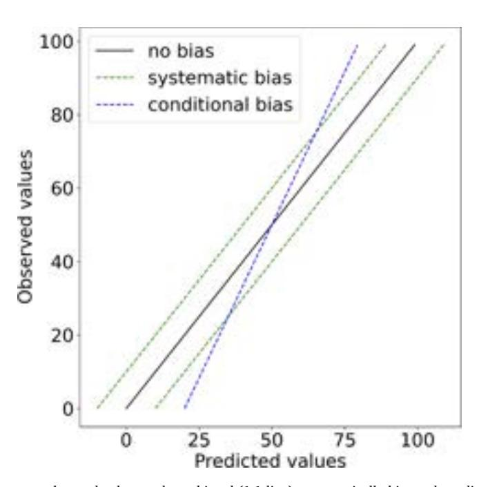
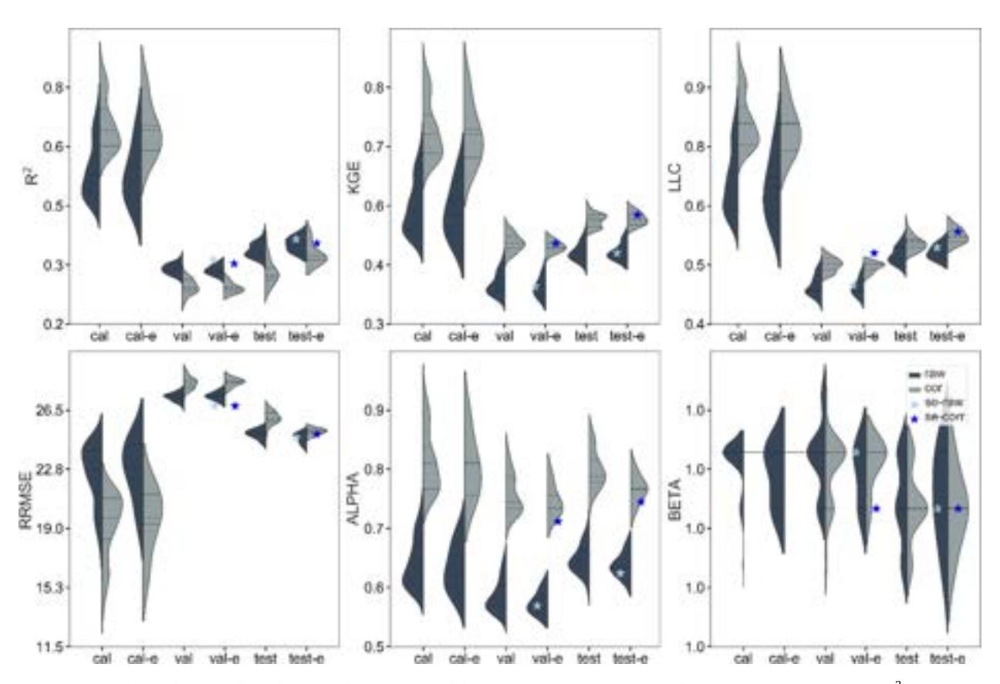
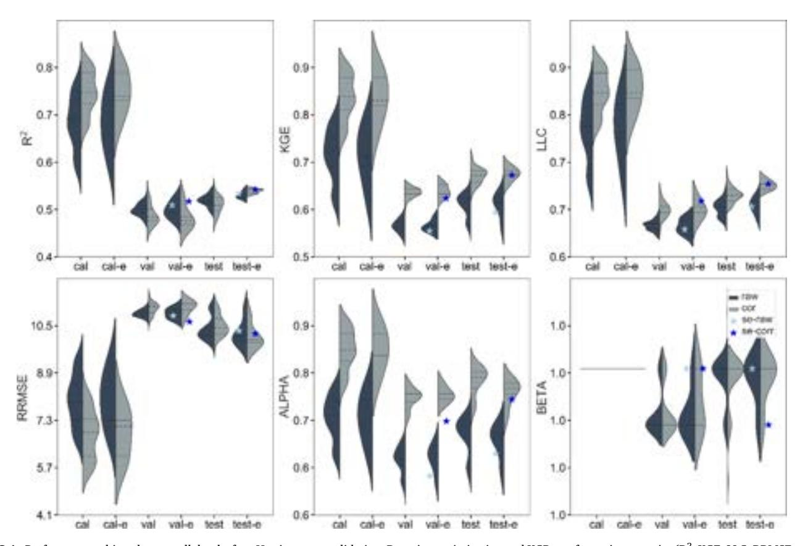
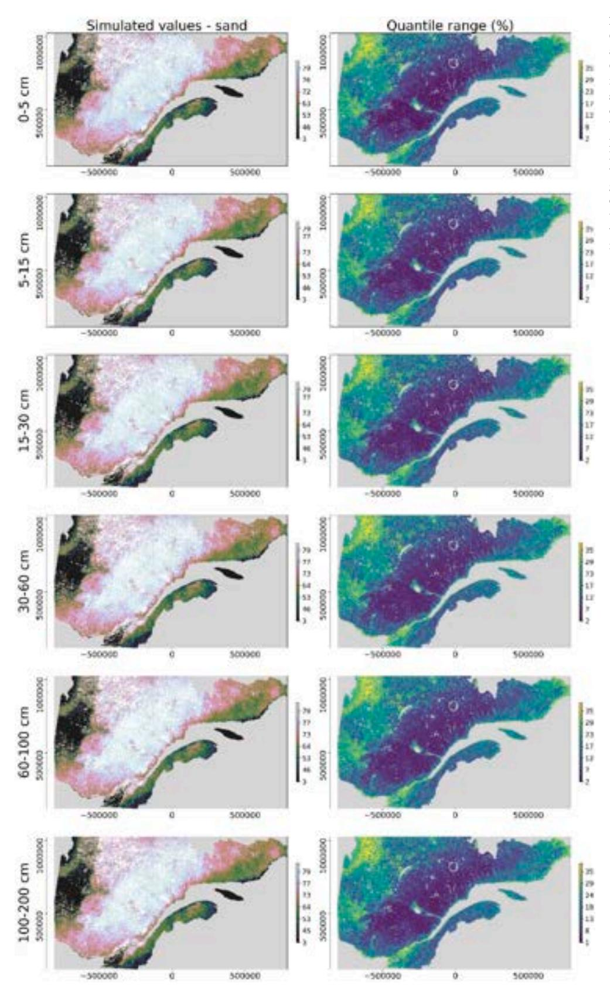
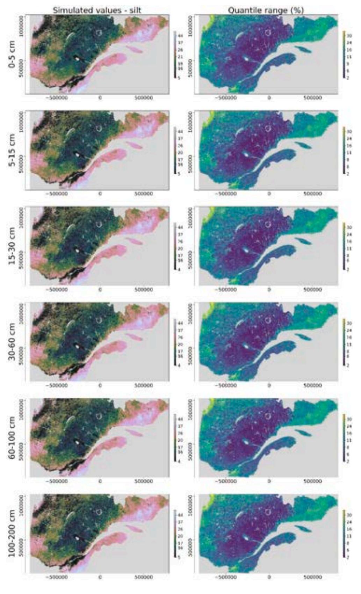
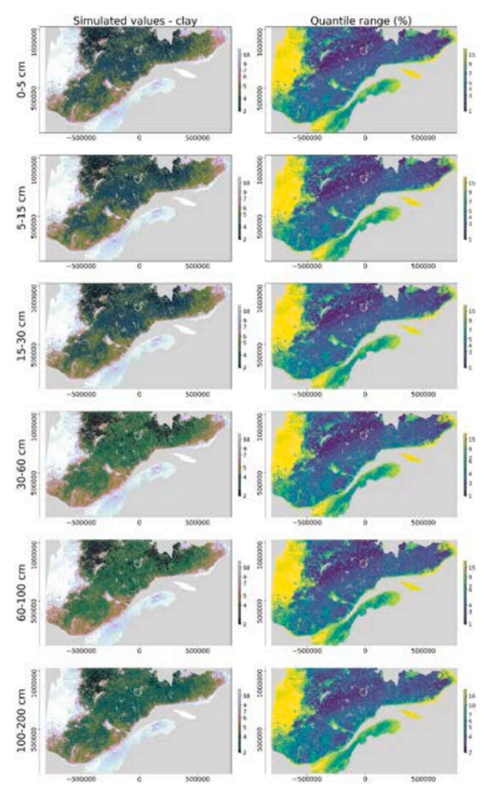
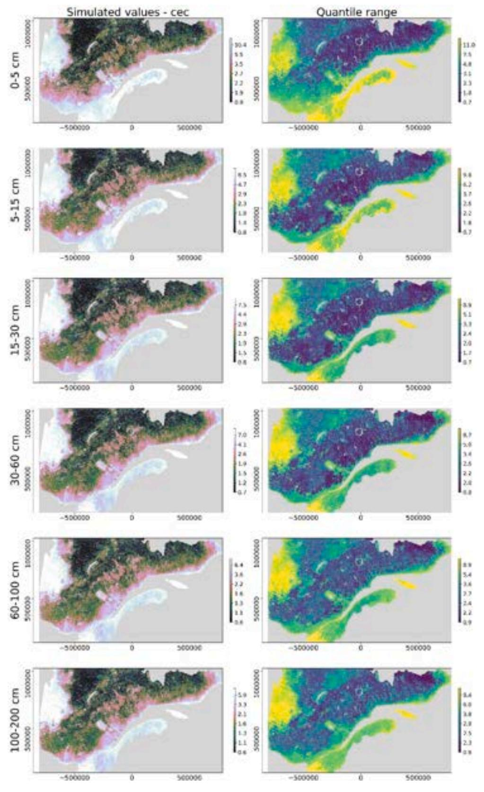
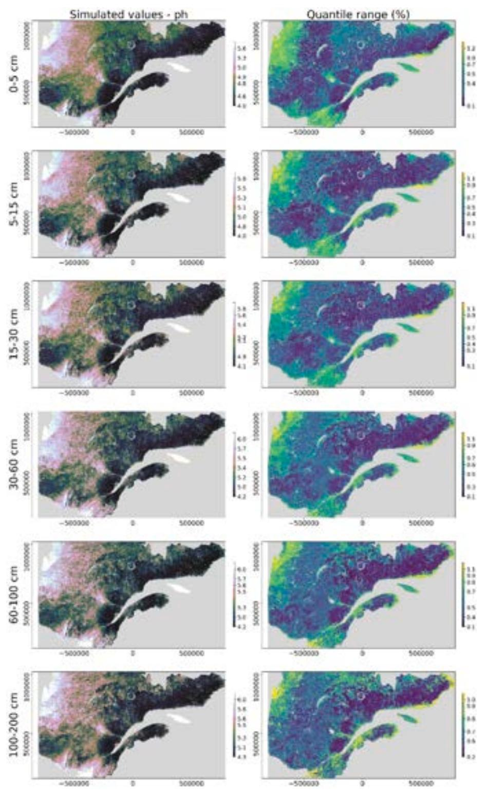
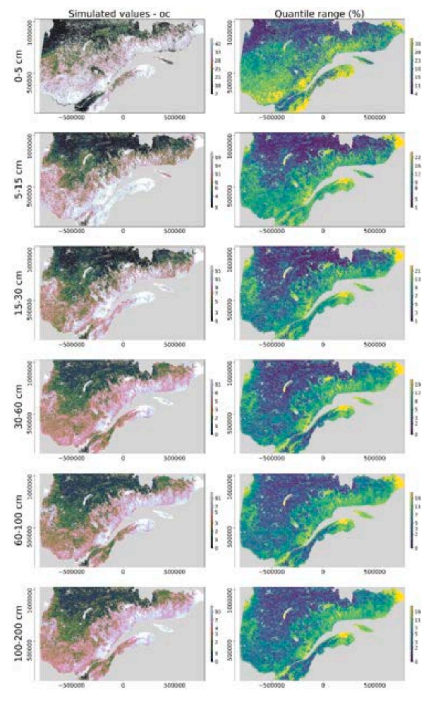

Contents lists available at ScienceDirect

# Geoderma

journal homepage: www.elsevier.com/locate/geoderma

# and

# Using bias correction and ensemble modelling for predictive mapping and related uncertainty: A case study in digital soil mapping

Jean-Daniel Sylvain a,b,\*, François Anctil b, Évelyne Thiffault c

- a Direction de la recherche forestière, Ministère des Forêts, de la Faune et des Parcs, Canada
- b Département de génie civil et de génie des eaux, faculté des sciences et de génie, Université Laval, Canada
- c Département des sciences du bois et de la forêt, faculté de foresterie, de géographie et de géomatique, Université Laval, Canada

#### ARTICLEINFO

Handling Editor: Kristin Piikki

Keywords:
Bias correction
Ensemble modelling
Uncertainty assessment
Predictive mapping
Digital soil mapping
Remote sensing
Soil texture
Cations exchange capacity
Organic carbon
pH

# might be interesting

#### ABSTRACT

In this study, we explored the potential benefits of using bias correction and ensemble modelling for the prediction of soil properties and assessment of related uncertainty. The proposed approach combines resampling techniques applied to soil observations, covariates and hyperparameters to generate a set of simulated values at the same location. The ensemble predictions resulting from the resampling are then used to generate deterministic predictions for the final mapping product along with the related uncertainty. We also introduced bias correction into the modelling framework in order to overcome conditional bias that is commonly encountered in digital soil mapping products. We compared the accuracy of our predictions resulting from bias correction and ensemble modelling with previously published global soil mapping products. Our results demonstrated that bias correction improves the linearity and the ratio of the variance between simulated and observed values and reduces conditional bias by a factor of 25 to 50% for different soil properties. The performance of the deterministic predictions obtained from ensemble modelling is better than most of its individual component models, and is always located in the first quantile of the performance of all members. The analysis of uncertainty suffers from underdispersion, which means that local uncertainty tends to be underestimated by our approach 40 to 60% of the time. A comparison with the performance achieved by global soil mapping products in our area, indicates that global mapping products achieved low performance (R2: -0.48-0.13) and suffered from an important conditional bias (alpha: 0.23–0.59, where alpha is the ratio of variance between predicted and observed values), leading to unrealistic predictions at the local scale. Ultimately, the combination of bias correction and ensemble modelling appears to be both useful and relevant for digital soil mapping and helps to address three common problems: equifinality, assessment of uncertainty and, correction of conditional bias in simulated values. The procedure described in this study is relatively easy to implement and is not computationally intensive. In operational use, the combination of bias correction and ensemble modelling should increase the quality of the information produced for environmental management and modelling, while additionally providing uncertainty

#### 1. Introduction

Predictive mapping is a means to develop tools and models for the assessment of a variable of interest over space and time. Predictive mapping aims to improve the supply of spatially explicit data and information required for environmental modelling, decision-making, and land-use policies. Predictive maps are produced using an empirical model that relates georeferenced observations of some target variable or class to spatially continuous covariates. The covariates act as surrogates that account for the effect of latent environmental factors, which cannot

directly be observed, but which are anticipated to influence the expression of the variable, or class, of interest (Lagacherie et al., 2006; McBratney, 2003). The resulting model is then applied to spatially exhaustive covariates to provide an optimized representation of the spatial distribution of the variable of interest for a given area. As the representation of any model at a given scale and spatial resolution is only partially true, it is common to test many approaches and to compare their respective performance relative to an independent dataset and to then select the model that achieved the best performance (Beguin et al., 2017). Performance values are reported to decision

https://doi.org/10.1016/j.geoderma.2021.115153

Received 4 April 2020; Received in revised form 5 April 2021; Accepted 9 April 2021 Available online 26 May 2021

0016-7061/© 2021 Ministère des Forêts, de la Faune et des Parcs du Québec. Published by Elsevier B.V. This is an open access article under the CC BY-NC-ND

\* Corresponding author at: Direction de la recherche forestière, Ministère des Forêts, de la Faune et des Parcs, Canada. E-mail address: jean-daniel.sylvain@mffp.gouv.qc.ca (J.-D. Sylvain).

makers to ensure informed use of the final product. As decision-making and field operations involve the use of spatially explicit information, one must also provide a spatially explicit representation of the uncertainty of the simulated values (Uusitalo et al., 2015; Goovaerts, 2001). The need for uncertainty maps is also emphasized by the high level of spatial heterogeneity of many environmental variables, as underlined by recent work in several environmental domains (Franklin et al., 2013; Ashcroft et al., 2012; MacMillan et al., 2007), including digital soil mapping (Dobarco et al., 2019; Szatmári and Pásztor, 2019; Wadoux et al., 2018).

Digital soil maps are subject to multiple sources of error that increase uncertainty and may limit their operational usefulness. Uncertainty arises from several factors: (1) complexity and non-linearity of the physical processes that influence soil property expression, (2) inappropriate representation of the spatial and statistical distribution of the variable of interest by available observations or covariates and, (3) use of inappropriate models, parameterization, or configuration, that leads to over/under fitting of the model (Szatmári and Pásztor, 2019; Beguin et al., 2017; Efstratiadis and Koutsoyiannis, 2010). (4) The performance of predictive maps will also be impacted if a discrepancy exists between the spatial scale of the latent covariates and the variable of interest (Goovaerts, 2000; Goovaerts, 1994). For instance, the expression of local variations in soil properties (higher frequency variations) cannot be described adequately by a covariate showing coarser spatial resolution (low frequency variations). (5) The occurrence of random or systematic errors in the observations and covariates (spatial coordinates, random noise, bias, trend) also represents an important source of uncertainty (Nussbaum et al., 2018). Finally, (6) the selection of hyperparameter values that lead to suboptimal performance and (7) inadequate model or objective functions that fail to properly represent the statistical (normal, skewed, log) and spatial distributions of the observations (quality, quantity, distribution, density) may also alter the performance of the model (Arrouays et al., 2017; Seiller et al., 2017; Pushpalatha et al., 2012; Gupta et al., 2009). Many approaches have been proposed to quantify uncertainty in digital soil mapping. They can generally be classified into three categories: approaches that rely on the spatial structure of the data (spatial), others that rely on the intrinsic variability of the dataset and model (probabilistic), and combinations of both.

Spatial prediction approaches make use of the spatial structure and intrinsic covariance among observations. These parameters are then used to infer a measure of uncertainty that will typically depend on the spatial distribution of the observation and the local variance of the variable of interest. Spatial approaches are dependent on their underlying assumptions (e.g. stationarity), the spatial distribution of the data and may be affected by the properties of the variables of interest and the parameters chosen to model the spatial structure: lag intervals, bin width, marginal distribution, occurrence of trend, and anisotropy of the data (Oliver and Webster, 2014), which can result in the development of a suboptimal model for digital soil mapping. Application of spatial approaches may be restricted when the number of observations is limited, sparse, or not equally distributed in space (Arrouays et al., 2017). Spatial approaches may lead, as well, to underestimation of the prediction variance (Oliver and Webster, 2014). The use of spatial approaches may ultimately be prohibitive when the numbers of soil observations and grid points become too large (Goovaerts, 2001).

Probabilistic approaches combine resampling strategies and statistics to estimate the underlying distribution of the errors without incorporating the spatial structure of the data or the errors in the modeling. Bootstrapping is a common tool for assessing uncertainty (Hastie et al., 2009). It makes use of a random component to select a subsample of the original dataset to refit the same model several times. As each resampling affects identification of the model parameters, it results in different outcomes. These outcomes are next postprocessed to derive a probability density function of the predicted values and their related uncertainties at a given location (Rossel et al., 2015). Most probabilistic approaches are non-parametric. This allows for relaxation of statistical assumptions required by parametric methods, and is particularly well

suited when statistical assumptions are violated or when the variable of interest is an extreme event (Wetterhall et al., 2013). Recently, quantile regression has been introduced into digital soil mapping to assess prediction intervals (Szatmári and Pásztor, 2019; Vaysse and Lagacherie, 2017; Rossel et al., 2015; Malone et al., 2014). Instead of minimizing error on a conditional mean, quantile regression minimizes error on conditional quantiles. Quantile regression can therefore be used to infer deterministic predictions (median) and the related uncertainty for a given quantile. Quantile regression is particularly well suited when a high number of covariates are used and when normality assumptions cannot be respected (Meinshausen, 2006).

Another set of approaches combines spatial structure and probabilistic features to generate spatially explicit realizations: Gaussian process, sequential Gaussian simulation (Poggio et al., 2016), and Gaussian random fields (Malone et al., 2017). As these methods are based on analysis of the spatial structure of residuals, they are also partially dependent on the spatial density and distribution of the observations. As limited observations may provide an incomplete understanding of the spatial structure of the residuals, these methods may fail to adequately represent uncertainty when the spatial variability of the variable of interest is greater than the observation density, or when a limited set of observations is used. Moreover, uncertainty maps resulting from analysis of the spatial structure of the residuals may yield a spatial resolution that is not compatible with spatial variation in the variable of interest. More recently Beguin et al. (2017), Huang et al. (2017) and Poggio et al. (2016) used an alternative to stochastic approaches (INLA-SPDE, integrated nested Laplace approximation - stochastic partial differential equation) that combines a spatial latent Gaussian model and a stochastic partial differential equation for geostatistical modelling and uncertainty assessment. Although INLA-SPDE can be a powerful optimized way to integrate spatial components, actual implementations are limited to a set of specific models (Bivand et al., 2015; Lindgren and Hâvard, 2015) and may suffer from computational problems when a large number of observations is available. This may limit its adoption for large projects at national or regional scale (Poggio et al., 2016).

Machine learning algorithms have been increasingly used by the digital soil mapping community in recent years. The learning process of machine learning algorithms is objective, data driven and controlled by hyperparameters, rather than relying on the knowledge of experts. Hyperparameters are a specific set of parameters that are used to control the learning process in machine learning algorithms. Machine learning represents an "easy" way to study higher order interaction between covariates, latent processes, and variables of interest. Most machine learning methods are efficient and have shown a low sensitivity to collinearity among covariates (Hastie et al., 2009). As many of these methods are non-parametric, they also overcome potential issues related to satisfying statistical assumptions. Machine learning algorithms can, however, lead to a poor model if their application is not executed using state of the art practices (Wadoux et al., 2020). As with any other method, machine learning algorithms may experience the problem of equifinality, in which many suboptimal sets of hyperparameters can achieve similar performance, but lead to different predictions (Beven and Freer, 2001; Anderton et al., 2002; Luo et al., 2009; Efstratiadis and Koutsoyiannis, 2010). Machine learning methods, like neural networks, general additive models, gradient boosting regression trees and, random forest, are especially sensitive to equifinality as they use a random component to initialize the training process and subsample observations and covariates. Consequently, the training of the algorithm may lead to a different model each time the algorithm is applied.

Ensemble models may be used to reduce equifinality problems with appropriate tuning. Indeed, as in bootstrapping, ensemble models can make use of the random component to generate multiple realizations of the variable of interest (Sylvain et al., 2019; Brochero et al., 2015; Anctil and Lauzon, 2004). The random component is used to generate different subsets of observations, covariates, or hyperparameters that ultimately affect the convergence of the algorithms and the resulting model. The

Fig. 1. Spatial distribution of vegetation subzones, mean annual temperature, geology and superficial deposits for the study area. Sources: Ministère des Forêts, de la Faune et des Parcs du Ouébec.

diversity of outcomes generated using these pseudo-models can be seen as potential realizations of the variable of interest. These realizations can then be combined (averaged) to achieve a deterministic prediction (Møller et al., 2019; Rasaei and Bogaert, 2019; Dobarco et al., 2017; Rossel et al., 2015; Malone et al., 2014). As in bootstrapping, we can also

make use of the probability distribution function of the realizations to assess the uncertainty of the deterministic predictions for each point in an area of interest. Ensemble models are recognized to stabilize the performance of the model and increase the robustness of the deterministic predictions (Sylvain et al., 2019; Thiboult et al., 2016; Brochero

 Table 1

 Descriptive statistics for each soil property.

| Properties | Unit    | profile (n) | horizon (n) | Mean | Min | p25 | p50 | p75 | Max | Skew  |
|------------|---------|-------------|-------------|------|-----|-----|-----|-----|-----|-------|
| sand       | %       | 8790        | 13800       | 63   | 0   | 52  | 68  | 78  | 100 | -0.92 |
| silt       | %       | 8790        | 13755       | 26   | 0   | 16  | 24  | 34  | 84  | 0.61  |
| clay       | %       | 8790        | 13288       | 12   | 0   | 4   | 6   | 12  | 94  | 2.95  |
| pН         | -       | 7476        | 11214       | 5    | 3   | 5   | 5   | 5   | 8   | 1.26  |
| CEC        | cmol/kg | 8164        | 12350       | 6    | 0   | 1   | 3   | 7   | 185 | 6.21  |
| OC         | g/kg    | 2985        | 5361        | 13   | 0   | 2   | 7   | 18  | 385 | 4.84  |

et al., 2015; Anctil and Lauzon, 2004). A shortcoming of probabilistic and ensemble approaches is that they are often time consuming and computationally intensive.

Most machine learning, ensemble, and geostatistical approaches suffer from a conditional bias (Nguyen et al., 2015; Mclennan and Deutsch, 2002; Zhang and Lu, 2012). In contrast to systematic bias, which is a systematic difference between modeled results and their observation counterparts, conditional bias occurs when the distribution of the simulated values has a lower variability than the distribution of the observations (Cannon et al., 2015); i.e. when higher simulated values are lower than the observed highest values or, vice versa, when lower simulated values are greater than the observed lowest values. We can illustrate the difference between each bias using a graphical representation (A.1). As shown in this figure, 1) unbiased predictions (back line) are equally spread around the 1:1 line, a line that would be delineated by a perfect model, 2) systematically-biased predictions are spread along the 1:1 line but have an overall tendency to overestimate (upper green line) or underestimate (lower green line) the observed values, while for 3) conditional biased predictions, residuals will be positive for lower values and negative for higher values (blue line). Conditional bias may be due to extrapolation, smoothing effect of the methods used (e.g. kriging, bagging), or the use of inadequate objective functions to train the model (Beaudoin et al., 2014; Magnussen et al., 2010). Conditional bias is an important problem in digital soil mapping as it propagates directly into decision-making, land-use planning, or modelling (Goovaerts, 2001). Conditional bias has been addressed in climatology and hydrology, but not yet directly in digital soil mapping (Cannon et al., 2015; Song, 2015; Hempel et al., 2013; Zhang and Lu, 2012; Magnussen et al., 2010).

In this study, we propose a generic framework for the assessment of soil properties and their related uncertainty for non-evenly distributed soil datasets. The proposed approach relies on the use of bias correction and ensemble modelling to deal with three common problems in digital soil mapping: equifinality, assessment of uncertainty and occurrence of a conditional bias in simulated values. The proposed approach is next applied to a case study in digital soil mapping for the Province of Quebec (Canada), modelling six soil properties: sand, silt, clay, pH water, cation exchange capacity (CEC), and organic carbon (OC). Performance is compared to existing global and national digital soil maps for the same area. Benefits and limitations of the bias correction and ensemble

Fig. 2. Spatial distribution of soil profiles across the study area according to each of the soil properties: a) texture, b) pH, c) CEC, and d) organic carbon. Background credits: Google Maps API.

**Table 2**Description of original and final resolutions, software, number of covariates, data processing and related references for each type of covariate.

| Covariates             | Туре                                      | Original resolution (m) | Final resolution (m) | Data preprocessing                                                                                            | Software                  | Number of covariates | Reference for data preprocessing                                                 |
|------------------------|-------------------------------------------|-------------------------|----------------------|---------------------------------------------------------------------------------------------------------------|---------------------------|----------------------|----------------------------------------------------------------------------------|
| Terrain derivatives | SRTM 3.0 1 arc second                  | 30                      | 50                   | Noise filtering SAGA GIS, Hydrological burning Python Gaussian pyramid (4 levels) DEM derivatives |                           | 120                  | Behrens et al. (2018) Millan et al. (2003) Richter and Schläpfer (2006) |
| Geophysical data    | Magnetic Gravity                       | 1000                    | 250                  | Resampling (100 m), 3 x Mean filter (5x5), Resampling (250 m)                                           | 3 x Mean filter (5x5),    |                      | Richter and Schläpfer (2006)                                                     |
| Superficial deposits   | Vectorized maps                        | 1/20 000                | 50                   | Classification Python Rasterization                                                                        |                           | 27                   | This study.                                                                      |
| Bioclimatic            | Worldclim 2.0 10 s                     | 1000                    | 250                  | Resampling (100 m), Python 3 x Mean filter (7x7) Resampling (250 m)                                     |                           | 21                   | Richter and Schläpfer (2006)                                                     |
| MODIS                  | MOD09A1 MYD09A1 MCD15A3H MYD11A2 | 250–1000                | 250                  | Spectral indices Time series analysis Filtering outlier Median value                                 | Google earth engine | 127                  | This study                                                                       |
| Landuse                | GLC30                                     | 30                      | 30                   | Conversion to dummy Python variables                                                                          |                           | 9                    | Chen and Guestrin (2016).                                                        |
| Landsat5-TM            | Surface reflectance Tier 1          | 30                      | 60                   | Spectral indices Time series analysis Filtering outlier Median value                                 | Google earth engine | 105                  | This study and Behrens et al. (2018)                                          |
| Total                  |                                           |                         |                      |                                                                                                               |                           | 416                  |                                                                                  |

modelling are discussed by comparing the performance of the approach with independent datasets.

### 2. Material and methods

# 2.1. Study area

The Province of Quebec is located in the eastern part of Canada and covers an area of approximately 1,7 M km2 of which the half (0.77 M km2) is covered by forest. The Province of Quebec encompasses a wide range of abiotic and biotic environments that act at different scales on soil properties (Fig. 1). At the coarsest scale, soil genesis is mostly conditioned by climatic conditions (Fig. 1a), superficial deposits (Fig. 1b), and geology (Fig. 1c), whereas topography and vegetation (Fig. 1d) influence finer scale processes (Bastianelli et al., 2017). Quebec's geology reflects three main geological provinces of different origin: (1) the Canadian shield, which is composed of igneous and metamorphic rocks (2) the Appalachians, which result from the lifting and light metamorphism of sedimentary rocks, and (3) the St-Lawrence platform, composed of horizontal sedimentary strata. Most of the Canadian shield is dominated by acidic glacial till, glaciofluvial materials, and organic soil. Its southern part displays a transition zone influenced by the retreat of the Quaternary Sea, which is characterized by a great variability of superficial deposits. Deltaic and organic deposits are prominent near the St-Lawrence River while organic soil and clay deposits dominate the western part of Quebec (Abitibi plains). The southern part of Quebec is covered by basic superficial deposits from marine (Champlain Sea) to lacustrine (Lampsilis Lake) deposits overlying glacial till. Till deposits dominate higher elevations (>250 m) in the Appalachians. In this study, we limit the characterization of soils to upland mineral horizons only.

#### 2.2. Soil database

We used 10 legacy soil databases collected between 1983 and 2017 by different national and provincial agencies. These databases support characterization of spatial variability of mineral soil for soil texture (sand, silt, clay), pH water, cation exchange capacity (CEC) and organic carbon (OC). Soil texture was determined by the hydrometer method (Bouyoucos, 1962), OC with LECO (LECO corporation, Saint-Joseph Michigan USA) or with the loss on ignition method at 550°C using Van Bemmelen factor or by wet combustion (Walkley and Black, 1934). Soil pH was determined with a 1:2.5 water solution and CEC with an inductively coupled plasma emission spectrophotometry after extracting exchangeable cations with an unbuffered 1 M NH4Cl solution.

Most soil observations were collected during forest inventory projects, which mainly aimed to characterize vegetation and, to a lesser extent, abiotic conditions. Database format, spatial distribution and density of soil observations were specific to each individual project. Therefore, all soil profile depths were reclassified to match the following GlobalSoilMap.net project specifications (0-5, 5-15, 15-30, 30-60, 60-100 and 100-200 cm) and reorganized into a common format and units. For each soil property, we ensured that observed values fell within a valid range and confirmed the availability of spatial coordinates and depth information. When depth was missing, soil profile information was used to assign a conditional random depth. Conditional random depth was assigned using the solum depth provided in field observations using the following rules; Soil samples in B-horizon had to be shallower than the solum depth, whereas soil samples in C-horizon had to be deeper than the solum depth but shallower than depth to rock or the maximum depth observed in the profile. No correction was applied for time, assuming stationarity of the soil properties.

Table 1 summarizes the numbers of soil profiles and soil horizons, and provides the descriptive statistics for each soil property. Soil observations and profiles are representative of an important range of conditions that characterize the spatial and statistical distribution of geology, superficial deposits, climatic conditions, and land-use classes across Quebec (Fig. 1a). Soil observations are admittedly unevenly spread across the study area and among soil properties (Fig. 2). As sampling follows vegetation gradients and diversity, more observations tend to be located in the central and southern parts of the province. Soil texture, pH and CEC are more evenly and widely sampled, whereas soil organic carbon content samples are often clustered in specific regions.

Fig. 3. Schematic representation of the modelling framework used in this study. Spatial coordinates of each observation point were used to extract values from a series of covariates. Soil profiles were split to create training (cal, val) and testing datasets based on the soil profiles' unique identifiers. Each calibration dataset was further split into 5 k-folds that were used to parametrize the hyperparameters of the XGBoost model. For each model, we introduced a bias correction at the end of the modelling to increase the representativeness of the predictions. All predictions resulting from the models (n = 50) were aggregated to generate a deterministic prediction and to assess uncertainty using the 5 th and 95 th percentiles of the predictions.

#### 2.3. Environmental covariates

We used depth of soil observations, along with a series of covariates, to simulate the influence of biotic and abiotic factors on soil genesis. A total of 416 covariates was derived from a digital elevation model, bioclimatic variables, geophysical datasets, superficial deposit maps and remote sensing imagery. We deliberately generated a large number of covariates to benefit from the diversity and uncertainty related to each covariate and to introduce higher variability into the simulated values. Due to differences in spatial resolution and features among all covariates, we did not apply any co-registration between the images and covariates. To address potential errors in the location of soil profiles, we extracted the median value of each environmental covariate using a 3 x 3 window centered on the spatial coordinates of each observation point using the original resolution of the covariates. For soil mapping, we built a grid of 250 x 250 m resolution and extracted the median value using a 3 x 3 window of all predictors used for the modelling. Table 2 provides a general description of the original dataset and of the processing steps performed to generate all the covariates exploited in this study. The interested reader can refer to the appendix B for a detailed description of the methods used to generate the covariates.

# 2.4. Assessment of soil properties and related uncertainty

With operational use in mind, we developed a general framework for the prediction of soil properties and of their related uncertainty for both numerical and categorical variables (Fig. 3). A modelling approach of gradient boosting regression trees (GBRT, Friedman, 2001) was chosen for its robustness to collinearity and outliers, its ability to model complex interactions, and its capacity to be extended to both regression and classification problems (Hastie et al., 2009; Chen and Guestrin, 2016). GBRT is a non-parametric method for building a number (N) of additive models that minimizes the error of poorly predicted observations. The

optimization process is performed with a weighting function that updates the weight of each observation based on the prediction errors from the previous step. Higher weights are then attributed to the poorly predicted observations whereas lower weights are given to better predicted observations. Using such an iterative process, GBRT is able to model the properties among sub-populations observed in the sample population.

Many studies have demonstrated the ability of GBRT to achieve similar, or better, performance relative to spatial and other non-spatial algorithms in digital soil mapping (Nussbaum et al., 2018; Beguin et al., 2017; Randin et al., 2009; Marmion et al., 2008). This efficiency is, in part, due to the use of a stochastic component that enables subsampling of the samples and the covariates, and to the robustness of GBRT when there is a large number of predictors and the proportion of relevant predictors is small (Hastie et al., 2009, Chaps. 15, Fig.15.7). GBRT is also somewhat interpretable and may be used to identify the most important predictors (relative importance) or assess the effect of a given covariate on the variable of interest (partial dependence plot). However, such analyses must be done with caution owing to potential instability particularly when higher-order interactions may be involved (Hastie et al., 2009; Friedman, 2001).

In this study we used the stochastic component and the potential instability of GBRT to generate a series of realizations of the variable of interest using the XGBoost implementation (Chen and Guestrin, 2016). XGBoost (XGBoost Python API, v0.90) was used in combination with resampling techniques to simulate an ensemble of potential realizations for each variable of interest. We split all the horizons in the soil profile database based on the soil profile's unique identifier and generated 10 subsets of the original data by selecting training (0.9) and testing datasets (0.1). Training datasets were used to optimize the hyperparameters of the XGBoost model and to assess the expected prediction errors and avoid overfitting using an early stopping strategy. Testing datasets, which the model had not yet seen, were used to assess the

Fig. 4. Performance achieved across all depths for pH using cross-validation Bayesian optimization and XGBoost for various metrics ( $R^2$ , KGE, LLC, RRMSE, alpha, beta). Violin plots represent the distribution for individual metrics, types of datasets (calibration (cal), validation (val), and test), and types of prediction (raw (n = 50), corrected (corr), ensemble (e, n = 10), and super-ensemble (se, n = 1)). Prediction types are illustrated by different colours: dark gray for non-corrected and light gray for bias correction. For each model configuration and prediction type, the star identifies the performance resulting from the super-ensemble for raw (se-raw) and corrected (se-corr) predictions.

generalization errors on predictions of 50 models (10 generations x 5 populations). XGBoost hyperparameters were optimized by running a Bayesian optimization algorithm to minimize the root mean square error. To avoid conditional bias in XGBOOST, we applied a bias correction at the end of each iteration. Finally, uncertainty was assessed for each point using the potential realizations. The following sections describe each step of the proposed approach and the experimental design used to assess its benefits.

#### 2.4.1. Data sampling

For a given set of soil properties and a given model, we split the soil profiles into two datasets based on the soil profiles' unique identifiers: a training dataset (9/10) and a testing dataset (1/10). The training dataset

**Table 3**Performance values of the deterministic models for raw and super-ensemble unbiased predictions for test datasets.

| Properties | Status  | $R^2$ | kge  | llc  | RRMSE | Alpha | Beta |
|------------|---------|-------|------|------|-------|-------|------|
| sand       | raw     | 0.37  | 0.47 | 0.56 | 25.0  | 0.64  | 0.99 |
|            | se-corr | 0.39  | 0.55 | 0.60 | 25.0  | 0.73  | 0.99 |
| silt       | raw     | 0.16  | 0.14 | 0.27 | 47.0  | 0.38  | 0.97 |
|            | se-corr | 0.17  | 0.28 | 0.36 | 46.6  | 0.55  | 0.99 |
| clay       | raw     | 0.49  | 0.58 | 0.66 | 90.5  | 0.70  | 1.00 |
|            | se-corr | 0.54  | 0.64 | 0.71 | 86.4  | 0.76  | 0.99 |
| pН         | raw     | 0.50  | 0.59 | 0.67 | 10.4  | 0.71  | 1.00 |
|            | se-corr | 0.53  | 0.65 | 0.71 | 10.2  | 0.77  | 0.99 |
| CEC        | raw     | 0.52  | 0.60 | 0.68 | 84.1  | 0.71  | 0.97 |
|            | se-corr | 0.53  | 0.66 | 0.71 | 84.5  | 0.78  | 1.00 |
| OC         | raw     | 0.25  | 0.23 | 0.36 | 116.3 | 0.40  | 0.92 |
|            | se-corr | 0.29  | 0.45 | 0.52 | 104.1 | 0.69  | 1.05 |

was split again into 5 equal-sized datasets in order to train 5 models. For each model we used 4/5 of the training dataset to fit the model (calibration dataset) and the remaining (1/5) to reduce overfitting and to estimate the prediction error of the ith model (validation dataset). The test dataset was used as a previously unseen source to assess the generalization error of each model. Each time data are split using the soil profiles' unique identifiers to ensure that all horizons of the same soil profile belong to only one dataset (calibration, validation or testing), maximizing independency between datasets and the representativeness of the cross-validation. The entire soil database was resampled 10 times in order to generate a total of 50 calibration datasets, 50 validation datasets, and 10 testing datasets. Calibration, validation and testing datasets were used respectively to calibrate, to parametrize, and to assess the accuracy of 50 inference models (Fig. 3). We used conditional Latin hypercube sampling (Minasny and McBratney, 2006) with 5000 iterations to maximize the representativeness of the validation and testing datasets over the calibration dataset.

# 2.4.2. Bias correction

To limit conditional bias induced by machine learning algorithms (e. g. XGBOOST), we introduced a bias correction procedure into the processing chain. Since bias is space dependent, it is not advisable to opt for an additive, or multiplicative, methodology to compensate for it. The method must support correction of the variance in the data conditional to the simulated values according to their spatial location. Conditional bias is then assessed using non-parametric approaches that map simulated values to observed values based on contextual information that accounts for the spatial variability of the bias, which may vary across the study area.

**Table 4**Relative effects of ensemble modelling and bias correction on performance scores for test datasets. These scores were calculated using Eq. (8). Normal font is used to denote a positive effect on the bias correction and super-ensemble on scores, whereas a bold font indicates a decrease in performance.

| Properties | R2   | KGE   | LLE  | RRMSE | alpha | beta |
|------------|------|-------|------|-------|-------|------|
| Sand       | 5.4  | 17.0  | 7.1  | -0.1  | 14.1  | 0.0  |
| Silt       | 6.3  | 100.0 | 33.3 | -0.7  | 44.7  | 2.1  |
| Clay       | 10.2 | 10.3  | 7.6  | -4.5  | 8.6   | -1.0 |
| OC         | 16.0 | 95.7  | 44.4 | -10.5 | 72.5  | 14.1 |
| CEC        | 1.9  | 10.0  | 4.4  | 0.5   | 9.9   | 3.1  |
| pН         | 6.0  | 10.2  | 6.0  | -1.5  | 8.5   | -1.0 |

The proposed procedure is adapted from Zhang and Lu (2012). It relies on a mapping function derived from ensemble regression trees (random forest), where the mapping function is derived from the calibration dataset and applied to the validation and test datasets. The mapping function links simulated values, SRTM elevation, and XY-grids derived using oblique geographic coordinates (Møller et al., 2019) to observed values using the MSE minimization scores. The use of SRTM elevation and XY-grids accounts for the spatial variability of the bias that varies across the study area, while the regression of simulated values against observed values is used to assess the bias at all points within the maps. Oblique geographic coordinates were used to minimize orthogonal artefacts that may arise from the use of raw spatial coordinates (x, y) in machine learning algorithms (Beguin et al., 2017). Oblique geographic coordinates (Møller et al., 2019) are produced by

reprojecting the original x- and y- coordinates along a series of axes, tilted at various oblique angles relative to the x-axis. This produces a fuzzy representation of the original x, and y-spatial coordinates. This fuzzy representation lets hard classifiers, like decision trees, achieve oblique splitting of the data, which in turn leads to a smoothed representation of the variable of interest, in comparison to using a Cartesian representation, while permitting management of the potential anisotropy of conditional bias.

The procedure is similar to the interpolation phase in regression kriging, but allows management of cases when soil observations are non-evenly distributed across the study area. The proposed algorithm consists of three steps:

- 1. Fit the main model using the training dataset (see Section 2.4) and then compute the simulated values on calibration ( $sim_{xgb-val}$ ), validation ( $sim_{xgb-val}$ ) and test ( $sim_{xgb-test}$ ) datasets, respectively;
- 2. The calibration dataset is then used to train a second model that exploits a random forest algorithm to fit simxgb-cal, SRTM elevation, and 36 XY-grids derived from oblique geographic coordinates against observed values (obscal). This model approximates the regional bias observed in the calibration dataset by minimizing the MSE between values simulated with XGBOOST and observed values;
- 3. The model resulting from the previous step is then applied to the validation and test datasets to produce the final predictions.

This simple and efficient procedure leads to minimization of the conditional bias in the final predictions while circumventing the

Fig. 5. Prediction interval reliability of the super-ensemble model for all soil properties. Assessment of the prediction interval was done using test datasets only. Black line indicates 1:1. The blue line indicates the noncorrected super-ensemble predictions and the yellow line, the super-ensemble corrected predictions. Observed probabilities depicted the proportion of observations that fall within the range of minimum and maximum predicted values defined by the percentile intervals, while the theoretical probabilities are the proportion of observations expected in a given percentile interval.

**Fig. 6.** Cation exchange capacity (*cmol/kg*) for the horizons 00–05 and 100–200 cm and the associated uncertainty for each of the six GlobalSoilMap standard depths. Deterministic predictions were achieved using the super-ensemble with bias correction. Uncertainty was derived using the difference between upper and lower limits of the 90% prediction interval of all 50 predictions. The legend colour of CEC indicates low values in blue while yellow, pink, and white gradients indicate a positive increase in the values of CEC. The legend colours for the uncertainty maps portray low values in yellow while green and blue gradients indicate an increase in uncertainty.

imperative use of observations for assessment of the residuals on a new dataset (for which the observations are by definition not available) (Zhang and Lu, 2012). It also overcomes the problem of non-evenly distributed observations in the spatial interpolation of the residuals.

2.4.3. Hyperparameter optimization, inference, and uncertainty assessment The hyperparameters used to run XGBoost were tuned independently for each training dataset (n=10) using a Bayesian optimizer (Snoek et al., 2012) that generalized the performance of the model as a sample of a Gaussian process (Larmarange et al., 2017). We used the Python package Bayesian-optimization (v1.0.1) to evaluate multiple

combinations of the hyperparameters. The evaluation of each set of hyperparameters was performed using the calibration dataset through a 5-fold cross-validation procedure. The inverse of the mean square error (MSE) was used to guide the optimization. The set of hyperparameters that maximized the inverse of MSE is provided by the Bayesian optimization and used for subsequent modelling in the active iteration. For the optimization, we fixed the number of estimators (n = 100) and tuned 10 hyperparameters with a limited parametric space (min–max): (1) maximum depth (3–10), (2) learning rate( $1^{e-4}$ - $1^{e-1}$ ), (3) number of boosting (3–8), (4) minimum child weight (5–20), (5) L1 (0–0.5) and (6) L2 (0.5–1) regularization terms, (7) number of samples (0.5–1.0), (8)

Table 5
Performance achieved by different soil map products for sand, silt, and clay contents in available horizons (0–15 cm) in Quebec (n = 7490). All products were generated at a spatial resolution of 250m using DSM approaches except Shangguan et al. (2014) that was produced by rasterization of polygonal legacy soil maps. Silt and clay were not available from Beguin et al. (2017) dataset.

| Properties | $R^2$ | kge  | llc  | RRMSE | R    | Alpha | Beta | Dataset               |
|------------|-------|------|------|-------|------|-------|------|-----------------------|
| sand       | -0.08 | 0.12 | 0.21 | 36.0  | 0.27 | 0.53  | 0.90 | Beguin et al. 2017    |
|            | 0.01  | 0.11 | 0.22 | 34.5  | 0.37 | 0.39  | 0.88 | Hengl et al. 2017     |
|            | -0.32 | 0.41 | 0.42 | 39.8  | 0.42 | 1.12  | 1.01 | Shangguan et al. 2014 |
|            | 0.46  | 0.68 | 0.70 | 25.6  | 0.72 | 0.87  | 1.06 | This study            |
| silt       | _     | _    | _    | _     | _    | _     | _    | Beguin et al. 2017    |
|            | -0.22 | 0.06 | 0.18 | 53.3  | 0.31 | 0.42  | 1.27 | Hengl et al. 2017     |
|            | -0.48 | 0.26 | 0.26 | 58.6  | 0.26 | 0.98  | 0.91 | Shangguan et al. 2014 |
|            | 0.15  | 0.40 | 0.46 | 44.5  | 0.57 | 0.64  | 0.80 | This study            |
| clay       | _     | _    | _    | _     | _    | _     | _    | Beguin et al. 2017    |
| -          | 0.13  | 0.05 | 0.20 | 105.4 | 0.36 | 0.29  | 1.02 | Hengl et al. 2017     |
|            | -0.18 | 0.34 | 0.36 | 122.7 | 0.37 | 0.91  | 1.17 | Shangguan et al. 2014 |
|            | 0.69  | 0.80 | 0.83 | 62.5  | 0.83 | 0.89  | 1.00 | This study            |

Fig. 7. Spatial distribution of sand in the 0–15 cm layer for 4 different soil map products. a) Soilgrids-250m (Hengl et al., 2017); Beguin et al., 2017; Shangguan et al., 2014 and this study (se-corr model). To achieve a fair comparison among all products, the colour legend has been defined based on Shangguan datasets, which exhibits the greatest spread of values.

Fig. 8. Spatial distribution of USDA soil texture classification in the 0–15 cm layer for 3 different soil map products. a) Soilgrids-250m (Hengl et al., 2017), Shangguan et al. (2014) this study (se-corr model). The colour legend has been defined to illustrate the full range of soil textures portrayed by all 3 datasets.

number of columns sampled constructing each tree (0.5-1.0), (9) number of columns sampled for each level (0.5-1.0), and (10) number of columns sampled for each node (0.5-1.0). All other hyperparameters were fixed to their default value. We limited the number of runs to tune hyperparameters to 400 in order to increase the diversity of hyperparameters used to train XGBoost from one iteration to another. This was done with the intent of introducing diversity that can account for the uncertainty in the hyperparameters' values. For each set of hyperparameters (n = 10), we trained 5 models that we used to generate one prediction on validation datasets (n = 1 model x 10 iterations) and 5 predictions on test datasets (n = 5 model x 10 iteration) to account for the uncertainty related to observations. We also limited the number of estimators to 100 to increase the variance in the final predictions, which is required for an appropriate assessment of the prediction interval (Breiman, 1999). Finally, we evaluated the performance of an individual model (n = 1) on the validation and the testing dataset. We also used ensemble (n = 5) and the super-ensemble (n = 50) models to generate a deterministic prediction and assess the uncertainty.

#### 2.4.4. Ensemble predictions

All soil properties were modelled independently at 250 m resolution. For each property, we recorded the mean value of all outcomes (n =50) as the deterministic prediction. We applied all the models to each cell of the grid to generate 50 simulated values for each cell. We also applied bias correction to obtain a corrected simulated value for each grid cell. We then assessed the deterministic predictions and the related uncertainty as described previously.

#### 2.4.5. Comparison with global soil maps

To assess the benefits of our approach for bias correction, we compared the performance of our model against the performance achieved by three sets of digital soil maps that were available for our study area (Hengl et al., 2017; Beguin et al., 2017; Shangguan et al., 2014). These maps had been generated using different sets of soil observations and different modelling approaches. Hengl et al. (2017) used 150,000 soil profiles and a stack of remote sensing-based soil covariates to train ensemble of machine learning based on Globalsoilmap.net specifications. Beguin et al. (2017) used a limited set of observations (≥500) acquired in the surface mineral horizon (0-15 cm) and limited covariates (12) to predict specific soil properties and related uncertainties through Bayesian geostatistical modelling based on Globalsoilmap.net specifications. Shangguan et al. (2014) developed a global soil dataset based on its own specification, by combining a soil map of the world with regional and national soil databases through a set of rules and aggregating methods that were based on the soil type.

### 2.4.6. Performance of ensemble models and bias correction

We assessed the performance of ensemble models and bias correction on the validation and test datasets. We used 4 statistical metrics to achieve this. The coefficient of determination was used as an indicator of the standardized covariance, or the degree of association, that exists between observed and simulated values (Rodgers and Nicewander, 1988).

$$R^{2} = 1 - \frac{\sum_{i=1}^{n} (y_{i} - \widehat{y}_{i})^{2}}{\sum_{i=1}^{n} (y_{i} - \overline{y})^{2}}$$
(1)

where  $y_i$  is ith the observed values,  $\widehat{y_i}$  is the simulated values and  $\overline{y}$  is the mean of observations. The second metric is the relative root mean square

error (RRMSE), which is a measure of accuracy of the simulated values (Rodgers and Nicewander, 1988). It was used to compare the relative accuracy among soil properties.

$$RRMSE = \frac{\sqrt{\frac{1}{n}\sum_{i=1}^{n}(y_i - \widehat{y}_i)^2}}{\overline{y}_i} \times 100$$
 (2)

The third metric is the Kling-Gupta efficiency (KGE, Gupta et al., 2009) a measure of the goodness of fit that is often used in hydrology to assess the similarity between observed and simulated values. The KGE reports the Euclidean distance of a given model from coordinates occupied by a perfect prediction in a dimensional space delineated by three axes: 1) correlation, 2) conditional bias and 3) systematic bias. Therefore, the predictions achieved with a perfect model would be fully correlated (r = 1) and unbiased (conditionally, alpha = 1, or unconditionally, b = 1), resulting in a Euclidean distance of 0. The three components of KGE were used to evaluate the effect of bias correction: the correlation (r) between simulated and observed values, the ratio between the simulated and observed standard deviation (alpha, used as an indicator of the conditional bias) and the ratio between the simulated and observed mean ( $\beta$ , is used as an indicator of the unconditional bias). KGE can be calculated using the following equations:

$$KGE = 1 - \sqrt{(r-1)^2 + (\alpha - 1)^2 + (\beta - 1)^2}$$
(3)

$$r = \frac{\sum_{i=1}^{n} (y_i - \hat{y}_i)(y_i - \overline{y})}{\sqrt{\sum_{i=1}^{n} (y_i - \hat{y}_i)^2 (y_i - \overline{y})^2}}$$
(4)

$$\alpha = \frac{\sigma_{sim}}{\sigma_{obs}} \tag{5}$$

where  $\sigma_{sim}$  and  $\sigma_{obs}$  are respectively the standard deviation of simulated and observed values

$$\beta = \frac{\mu_{sim}}{\mu_{obs}} \tag{6}$$

where  $\mu_{sim}$  and  $\mu_{obs}$  are respectively the mean of simulated and observed values. The final metric is Lin's concordance correlation coefficient (LCC, Lin (1989)), which assesses the degree of concordance between two measures. It is calculated on the expected value of their squared difference. LCC can be seen as a measure of the perpendicular distance between observed and simulated values from the 1:1, a line that would be delineated by a perfect model. In comparison, correlation coefficient looks at the vertical distance of simulated values from the 1:1 line. The coefficient takes a value 1 when the sum of the perpendicular distance is equal to 0 (perfect agreement) and -1 when relationships between observed and simulated is inverted.

$$LLC = \frac{2 * \hat{S}_{i} S_{i}}{(\hat{y}_{i} - y_{i})^{2} + \hat{S}_{i}^{2} + S_{i}^{2}}$$
(7)

where  $\widehat{S_i}$  and  $S_i$  are respectively the variance of simulated and observed values. All metrics were standardized to evaluate the relative effect of ensemble modelling and bias correction on model performance. The relative effect of ensemble modelling and bias correction on predictions was calculated using the following formula:

$$scores_{relative}(\%) = \frac{scores_{cor} - scores_{raw}}{scores_{cor}} \times 100$$
(8)

#### 2.4.7. Uncertainty assessment

*Uncertainty maps* - In this study, we used the difference between the 95th and 5th percentiles of all simulated values at any given point as a measure of the uncertainty of the final predictions at specific locations. These calculations were applied to all grid cells and used to generate an uncertainty map for each layer.

**Prediction interval reliability diagram** - To evaluate the ability of ensemble models to represent uncertainty, we used the prediction interval reliability diagram. This is a graphical tool that provides a comparison of the proportion of observations that fall within the range of minimum and maximum predicted values defined by 10 percentile intervals: 45–55, 40–60, 35–65, 30–70, 25–75, 20–80, 15–85, 10–90, 5–95. The resulting ratio is then compared to the theoretical curve (Vaysse and Lagacherie, 2017; Szatmári and Pásztor, 2019; Van and Goovaerts, 2001). The uncertainty model is declared valid when the distribution of observations in a previously unseen dataset follows the distribution of theoretical values (pitheo == pisim). The uncertainty model underestimates the uncertainty when pitheo > pisim and overestimates it when pitheo < pisim.

#### 3. Results and discussion

#### 3.1. Bias correction and ensemble and super-ensemble predictions

**Bias correction** - Fig. 4 illustrates the distribution of the performance values achieved for pH by each member (n = 50), each ensemble (n = 5), and the super-ensemble (n = 1) for non-corrected (light gray) and corrected (dark gray) predictions, for the calibration, validation and testing datasets. The figure illustrates that bias correction induces more variation in the member and ensemble performance values compared to the raw predictions. In Fig. 4 bias correction generally increases the range of scores compared to the non-corrected simulations. Our results demonstrated that bias correction increases the variance of the simulations to the detriment of correlation, which hardly penalizes indicators like R2 and RRMSE. On the other hand, Fig. 4 emphasizes that bias correction largely increases the values of KGE, alpha, and LLC metrics, which indicates a better physical representation of the simulated values when compared to non-corrected values. The benefit of bias correction is observed in most performance scores and most soil properties (Appendices, C.1-C.5). All Beta values in Fig. 4 and Appendix C are close to 1, which indicates that neither raw nor corrected predictions are significantly affected by systematic bias.

Ensemble - Comparable performance in validation and testing datasets suggests a good parameterization of the model during the optimization of the hyperparameters (Fig. 4). Ensemble modelling reduces the range of performance observed for the test datasets when compared to the raw members in test datasets. This behaviour is, however, less marked in the calibration and validation datasets, which were used respectively for bias correction and tuning. This can be attributed to the fact that resampling of soil samples has a greater effect on the overall performance than a change in hyperparameters. Yet, test datasets were resampled 5 times (hyperparameters effect), whereas calibration and validation datasets were resampled 50 times (resample effect) during the training process. The best performance of ensemble modelling is, on average, always better than any single one of the raw datasets (Fig. 4). The distribution of ensemble simulations also leads to optimal performance and increases the probability of attaining a performance equal to that achieved by the best realization. This is particularly relevant for the corrected dataset. These benefits of ensemble

modelling and bias correction are observed in most performance scores and for all soil properties (Appendices, C.1–C.5).

Super-ensemble - Super-ensemble modelling, representing the mean of all outcomes, also had a positive effect on performance. The scores of the super-ensemble typically occupy the upper range of the distribution for most of the performance scores. The benefits are, however, greater for corrected predictions than for raw ones. This can be explained by the fact that bias correction improves variance among predictions, which dramatically increases the scores for KGE, alpha, and LLC and, to a lesser extent, for R2 and RRMSE. Again, corrected predictions always achieved better performance than non-corrected ones. This result justifies our interest in combining ensemble modelling and bias correction.

Table 3 provides a comparison of the performance values achieved by the best model for raw and the super-ensemble bias corrected predictions (se-corr) of all soil properties for test datasets. The differences observed between both configurations demonstrate that a combination of the super-ensemble and bias corrected predictions systematically improves the accuracy and representativeness of the predictions for all soil properties. Unconditional bias (beta  $\approx$  1) remains small for all variables and all models. This was an expected behaviour as boosting regression trees are built recursively to reduce unconditional bias. All models still underestimated the full variance of soil properties: alpha coefficients varying between 70% and 77% with the exception of silt that was underestimated even more (55%).

The relative effect of ensemble modelling and bias correction on performance is summarized in Table 4. Relative scores vary slightly among soil properties and metrics. R2 values increase from 5 to 16%. The combined effect of ensemble modelling and bias correction is greater for KGE (10–100%) than for any other scores for all soil properties and all soil depths. These improvements largely result from an increase in variance (alpha criterion) and a reduction of the error for larger values, which are more penalized by R2 and RRMSE. Bias correction also improves LLC scores, which evaluate how closely the combinations of simulated and observed values fall on the 1:1 line. The increases in LLC and alpha criterion values also provide support that bias correction leads to a more realistic modelling. Bias correction improves the variance of the simulated values, but has a limited impact on the other metrics. Bias correction greatly improves alpha values, which indicates that the corrected predictions are less biased and are more representative of the statistical distribution of the soil properties. These results confirm again that ensemble modelling and bias correction together both lead to more accurate and realistic physical representation of the spatial distribution of soil properties.

#### 3.2. General performance for soil properties

From all simulations realized using ensemble modelling and bias correction (Table 3), clay achieved the best  $R^2$  (0.54), followed by pH (0.49), CEC (0.43), sand (0.41), OC (0.27), and silt (0.21). While silt had the lowest  $R^2$ , it still exhibited a lower RRMSE (53%) than organic carbon content (111%), CEC (99%), and clay (88%). Considering LLC (0.32) and alpha coefficient (0.39), it seems that the silt model suffered from a marked underdispersion (alpha = 0.32) that also affected linearity (0.36). In comparison, values for LLC and alpha, respectively, ranged between 0.55 and 0.73 and 0.56–0.97 for other soil properties. KGE values indicate suitable models (KGE > 0.6) for most of the properties except for organic carbon (0.45) and silt (0.28).

#### 3.3. Reliability of uncertainty model

Prediction interval reliability diagrams aim to evaluate the ability of ensemble models to accurately represent uncertainty of the superensemble model. Fig. 5 illustrates the prediction interval reliability diagrams for raw and corrected predictions resulting from an ensemble of 50 iterations for 4 soil properties: sand (Fig. 5a), CEC (Fig. 5b), pH (Fig. 5c), and clay (Fig. 5d). All curves fall below the 1:1 line, which indicates underdispersion. It suggests that local uncertainty tends to be underestimated for most of the observations and soil properties. Bias correction helps to reduce this underdispersion by increasing the total variance of each ensemble and increasing the accuracy of the prediction interval. pH and sand showed a better assessment of uncertainty in comparison with clay and CEC, which exhibited a highly skewed distribution (Table 1). Our results indicate that our reported prediction intervals are suiTable 30-40% of the time, but underestimate uncertainties 60-70% of the time. Underdispersion is very common in ensemble modelling and generally arises when multiple models lead to simulations that are quite close to each other or when all sources of uncertainty have not been fully addressed.

#### 3.4. Mapping soil properties and related uncertainties

Fig. 6 depicts the deterministic predictions achieved using the superensemble with bias correction for CEC. CEC is used as an example to illustrate the magnitude of change in values and related uncertainty over depth. Maps for other soil properties are provided in Appendix D.1–D.6. Simulated values were obtained using the mean of the super-ensemble while the quantile range was obtained using the difference between the 95th and 5th percentiles of all simulated values at any given point. Spatial distribution of CEC, and its associated uncertainty, vary substantially in x, y, and z. We observe low CEC in the Northeastern part of the area, which is consistent with the nature of its igneous and metamorphic rocks and acidic glacial till deposits. The highest values for CEC are associated with clay deposits and calcareous sedimentary rocks of the Appalachians. One can also observe a decrease in CEC with depth, which corresponds to an alleviation of pedogenetic processes and reduction of fertility in the soil profile with depth. However, the decrease in CEC with depth is more notable for soils in the northern part and less pronounced in areas dominated by clayey soils. It is interesting to note that the level of variability uncertainty in the first layer is higher and decreases with depth, which supposes that pedogenetic processes in the upper horizon generate a higher level of variability compared to one's active in the parent material (100–200 cm). Yet, the relative values of the uncertainty in the 100-200 cm horizon (9.4 vs 5.9) increase dramatically compared to 5-15 cm uncertainty (11.0 vs 10.4), which could be attributed to a lower sample density for deeper horizons. Anthropic activities related to soil management may impact physical (e.g. deep plowing) and chemical soil properties (e.g. fertilizers) and land use. These changes induced local noise in soil observations and as well as in covariates, which consequently can contribute to increasing the uncertainty of predictions in agricultural areas. Forest management may also impact organic layers, but these effects are expected to be minor in mineral horizons (Johnson and Curtis, 2001; Nave et al., 2010). For most of the maps, the ratio between the simulated values and the uncertainty is relatively low and generally represents less than 25% of the observed value, which indicates a high level of agreement among models. However, reliability diagrams demonstrate that most of the prediction intervals are underdispersed and overly optimistic. Albeit that uncertainty

maps failed to quantify uncertainty accurately, they still permit identification of areas where higher uncertainties likely occur. From a user perspective, this permits identification of areas where predictions should be used with caution. It should also provide support for designing a soil sampling strategy that could improve the accuracy of future digital soil maps (Fig. 6).

#### 3.5. Comparison with available soil map products

Table 5 provides a comparison of the performance of our model relative to available digital soil maps generated at global and national scales. Scores achieved by global and national products suggest that they fail to adequately depict the spatial variability of the reviewed soil properties in the 0–15 cm depth for our specific area. This is indicated by negative R2 and low KGE values (< 0.3). Global and national products also yield RRMSE that is 1.5 times higher than that achieved in this study. Global maps derived from DSM (Hengl et al., 2017; Beguin et al., 2017) suffer from an important conditional bias (alpha criterion < 0.5) and achieve a low correlation with soil observations used for this study (R < 0.37). The maps derived from pedotransfer functions and legacy soil maps by Shangguan et al. (2014) provide a better representation of the soil properties when compared to other global soil map products, even if they are limited by a lower spatial resolution. Decomposition of the KGE (R, alpha and bias) reveals that Shangguan et al. (2014) products are more highly correlated (R) with available soil point data while minimizing the conditional and unconditional bias (alpha and beta scores  $\approx$  1). The increase in KGE is, however, mostly explained by a reduction of the conditional bias and, to a lesser extent, by an increase in correlation (R). These findings are also confirmed by an increase in LLC. In contrast, Hengl et al. (2017) exhibits an important conditional bias (alpha: 0.29-0.42). This suggests that the maps generated in this study are more accurate than other available products for all soil properties and using all accuracy metrics.

Fig. 7 presents a visual comparison of the spatial distribution of sand content for four soil map products. All soil map products vary in their ability to represent the spatial pattern of the soil properties. Soilgrids-250m (Hengl et al., 2017) and Beguin et al. (2017), which profess a very high spatial resolution, failed to recognize the spatial pattern of legacy soil maps that is apparent in Shangguan et al. (2014). Soilgrids-250 m and Beguin et al. (2017) maps also suffer from an important conditional bias and highly underestimate the sand content when compared to Shangguan et al., 2014 and to this study. This can be explained by the scale of modelling and the fact that soil observations in eastern Canada were of limited availability for this area in both these projects. The integration of expert knowledge from the Soil Landscapes of Canada (SLC-3.2, Soil Landscapes of Canada working Group, 2010) in Shangguan et al. (2014) products results in a better delineation of the geomorphological patterns and reduces conditional bias compared to the two previous products, although the spatial resolution is low. (See Fig. 8).

The maps generated by this study show less bias than other available digital soil mapping products. However, our simulated values still suffer from an important conditional bias and fail to depict local variability among sites in the northern part of the study area. This can be explained by the large extent of the study area, the highly skewed behaviour of sand fraction content, the sparse distribution of observations across the landscape, and the inability of currently available covariates to adequately represent soil spatial variability at finer resolutions (Piikki and Söderström, 2017). Nevertheless, this project captures most of the

dominant spatial patterns evident in the soil texture map of Shangguan et al. (2014) (Fig. 7b, c), even in higher latitudes where no soil observations were available. Soilgrids; 250 m maps, which suffer from a conditional bias, identified only two soil texture classes over the entire area (Fig. 7a).

Readers should keep in mind that the purpose, scale, size of the area, data and method differ from one project to another. Hengl et al. (2017) and Beguin et al. (2017) both acknowledged that accuracy of their products was limited in many areas due to an insufficient number of ground truth training points in many undersampled geographic regions. The map comparisons provided here mostly aim to demonstrate to potential users that 1) conditional bias is very common in many current DSM products (see alpha Table 5), 2) that conditional bias may affect any applications that require physical consistency, such as hydrological modelling or pedotransfer functions, and 3) that any use of soil mapping products should be preceded by a validation that is specific to the area of interest.

#### 3.6. Limitations of the proposed methodology and future work

Ensemble modelling - This work demonstrates the validity and potential utility of adopting ensemble modelling and bias correction for digital soil mapping. It demonstrates that ensemble models provide, on average, a more robust representation of soil properties than any of the individual component models, while bias correction increases the range of prediction values and reduces the conditional bias that is a common feature of machine learning and geostatistical interpolation. The combination of machine learning algorithms, ensemble modelling, and bias correction results in a more realistic representation of the spatial distribution of soil properties in the context of environmental modelling, while also providing a spatially explicit assessment of the uncertainty. The bulked accuracy resulting from the aggregation of the ensemble is always in the upper range of the distribution of all the models used to build the ensemble. Therefore, ensemble modelling helps overcome the equifinality problem by reducing the risk of selecting a suboptimal model that would underperform in reality. Although the performance achieved here for most soil properties is quite good and comparable, or better, than for similar digital soil mapping projects, it is possible that resorting to more localized high-quality datasets would have provided a complementary perspective to the proposed procedure.

bias correction - The proposed methodology utilizes several principles that can be implemented for other digital soil mapping projects. The method used for bias correction is simple, easy to implement and improves the representativeness of the values (linearity and variance) without reducing the overall performance. In this study, random forest, which is simple to parametrize, was used for bias correction, as a proof of concept.

Uncertainty assessment - As our approach relies on a diversity of models, it reduces the number of subjective decisions that must be taken by the modeller and increases the generalization and reproducibility of the mapping process and its operationalization. Ensemble modelling helps to stabilize performance for both validation and testing. Unlike typical spatial approaches, the assessment of uncertainty with ensembles is not dependent on the spatial distribution of the data, which was a problem in this study. However, the predictions resulting from our approach still contain conditional bias that may result in underestimation of the uncertainty in the final map.

Future work - For demonstration purposes, we limited our

exploration to the use of GBRT for the modelling and to the use of random forest for bias correction. Future work should investigate how other approaches would perform at generating diversity in simulated values. In a similar way, it would be relevant to evaluate how the number of soil observations and covariates might alter the ability of the proposed method to assess uncertainty. Assessment of uncertainty with ensembles relies on the hypothesis that ensemble predictions are drawn from the same underlying distribution. However, this hypothesis is rarely respected by ensemble machine learning approaches. This may result in biased predictions that tend to underestimate the variance of the observed values and lead to underdispersion of the uncertainty as encountered in this study. The latter is a common problem in geosciences (geophysics, climate, hydrology), and generally arises when not all sources of uncertainty are considered. It could be possible to overcome underdispersion by post-processing ensemble probability density functions resulting from the ensemble using Bayesian theory (Bröcker and Smith, 2008; Thiboult et al., 2016; Goovaerts, 2001). By doing so, ensemble outcomes would be considered as information and not as direct observations, which would relax the hypothesis that ensemble predictions are drawn from the same underlying distribution. Future work should investigate the potential of other modelling approaches for bias correction (e.g. support vector regression, deep neural networks,

Finally, it is worth recalling that most digital soil maps result from a model that aims to explain the largest possible variance of the variable of interest. The size of the area, the number, density, and spatial distribution of soil observations and covariates may also impact the potential representation of the variable of interest in feature space as defined by covariates. This can then limit the ability of the model to express variability at a local scale (Hastie et al., 2009) and the accuracy of the prediction interval. This study covers a large region with significant gradients in climate, superficial deposits and geological materials. The large size of the region may have favoured the representation of largerscale processes and reduced the ability of the model to recognize shorter range, local, variations. Likewise, many variables exhibited a skewed behaviour, which can arise from the spatial distribution of observations  $% \left( 1\right) =\left( 1\right) \left( 1\right) \left( 1\right) \left( 1\right) \left( 1\right) \left( 1\right) \left( 1\right) \left( 1\right) \left( 1\right) \left( 1\right) \left( 1\right) \left( 1\right) \left( 1\right) \left( 1\right) \left( 1\right) \left( 1\right) \left( 1\right) \left( 1\right) \left( 1\right) \left( 1\right) \left( 1\right) \left( 1\right) \left( 1\right) \left( 1\right) \left( 1\right) \left( 1\right) \left( 1\right) \left( 1\right) \left( 1\right) \left( 1\right) \left( 1\right) \left( 1\right) \left( 1\right) \left( 1\right) \left( 1\right) \left( 1\right) \left( 1\right) \left( 1\right) \left( 1\right) \left( 1\right) \left( 1\right) \left( 1\right) \left( 1\right) \left( 1\right) \left( 1\right) \left( 1\right) \left( 1\right) \left( 1\right) \left( 1\right) \left( 1\right) \left( 1\right) \left( 1\right) \left( 1\right) \left( 1\right) \left( 1\right) \left( 1\right) \left( 1\right) \left( 1\right) \left( 1\right) \left( 1\right) \left( 1\right) \left( 1\right) \left( 1\right) \left( 1\right) \left( 1\right) \left( 1\right) \left( 1\right) \left( 1\right) \left( 1\right) \left( 1\right) \left( 1\right) \left( 1\right) \left( 1\right) \left( 1\right) \left( 1\right) \left( 1\right) \left( 1\right) \left( 1\right) \left( 1\right) \left( 1\right) \left( 1\right) \left( 1\right) \left( 1\right) \left( 1\right) \left( 1\right) \left( 1\right) \left( 1\right) \left( 1\right) \left( 1\right) \left( 1\right) \left( 1\right) \left( 1\right) \left( 1\right) \left( 1\right) \left( 1\right) \left( 1\right) \left( 1\right) \left( 1\right) \left( 1\right) \left( 1\right) \left( 1\right) \left( 1\right) \left( 1\right) \left( 1\right) \left( 1\right) \left( 1\right) \left( 1\right) \left( 1\right) \left( 1\right) \left( 1\right) \left( 1\right) \left( 1\right) \left( 1\right) \left( 1\right) \left( 1\right) \left( 1\right) \left( 1\right) \left( 1\right) \left( 1\right) \left( 1\right) \left( 1\right) \left( 1\right) \left( 1\right) \left( 1\right) \left( 1\right) \left( 1\right) \left( 1\right) \left( 1\right) \left( 1\right) \left( 1\right) \left( 1\right) \left( 1\right) \left( 1\right) \left( 1\right) \left( 1\right) \left( 1\right) \left( 1\right) \left( 1\right) \left( 1\right) \left( 1\right) \left( 1\right) \left( 1\right) \left( 1\right) \left( 1\right) \left( 1\right) \left( 1\right) \left( 1\right) \left( 1\right) \left( 1\right) \left( 1\right) \left( 1\right) \left( 1\right) \left( 1\right) \left( 1\right) \left( 1\right) \left( 1\right) \left( 1\right) \left( 1\right) \left( 1\right) \left( 1\right) \left( 1\right) \left( 1\right) \left( 1\right) \left( 1\right) \left( 1\right) \left( 1\right) \left( 1\right) \left( 1\right) \left( 1\right) \left( 1\right) \left( 1\right) \left( 1\right) \left( 1\right) \left( 1\right) \left( 1\right) \left( 1\right) \left( 1\right) \left( 1\right) \left( 1\right) \left( 1\right) \left( 1\right) \left( 1\right) \left( 1\right) \left( 1\right) \left( 1\right) \left( 1\right) \left( 1\right) \left( 1\right) \left( 1\right) \left( 1\right) \left( 1\right) \left( 1\right) \left( 1\right) \left( 1\right) \left( 1\right) \left( 1\right) \left( 1\right) \left( 1\right) \left( 1\right) \left( 1\right) \left( 1\right) \left( 1\right) \left( 1\right) \left( 1\right) \left( 1\right) \left( 1\right) \left( 1\right) \left( 1\right) \left( 1\right) \left( 1\right) \left( 1\right) \left( 1\right) \left( 1\right) \left( 1\right) \left( 1\right) \left( 1\right) \left( 1\right) \left( 1\right) \left( 1\right) \left( 1\right) \left( 1\right) \left( 1\right) \left( 1\right) \left( 1\right) \left( 1\right) \left( 1\right) \left( 1\right) \left( 1\right) \left( 1\right) \left( 1\right) \left( 1\right) \left( 1\right) \left( 1\right) \left( 1\right) \left( 1\right) \left( 1\right) \left( 1\right) \left( 1\right) \left( 1\right) \left( 1\right) \left( 1\right) \left( 1\right) \left( 1\right) \left( 1\right) \left( 1\right) \left( 1\right) \left( 1\right) \left( 1\right) \left( 1\right) \left( 1\right) \left( 1\right) \left( 1\right) \left( 1\right) \left( 1\right) \left( 1\right) \left( 1\right) \left( 1\right) \left( 1\right) \left( 1\right) \left( 1\right) \left( 1\right) \left( 1\right) \left( 1\right) \left( 1\right) \left( 1\right) \left( 1\right) \left( 1\right) \left( 1\right) \left( 1\right) \left( 1\right) \left( 1\right) \left( 1\right) \left( 1\right) \left( 1\right) \left( 1\right) \left( 1\right) \left( 1\right) \left( 1\right) \left( 1\right) \left( 1\right) \left$ across the landscape or the inability of spatial covariates to represent soil spatial variability at finer resolutions. It is important to recall that most of the soil observations were collected in the context of forest inventory, which mainly aimed at characterizing vegetation and, to a lesser extent, abiotic conditions. Such a stratified sampling design may lead to an unbalanced dataset and to an important bias in the assessment of statistical and spatial distributions of soil properties (Rossel et al., 2015). For instance, only the productive sites were sampled and only a minority of soil profiles were sampled over their entire depth. Sampling strategies used have potentially limited the ability of the model to capture short range variations. This could also explain why the proposed approach has underestimated the uncertainty in this study (Vaysse and Lagacherie, 2017).

#### 4. Conclusion

In this study, we proposed and examined the introduction of bias correction in a digital soil mapping framework and explored the potential use of ensemble modelling to assess soil properties and their related uncertainty. Bias correction increased the range of predicted values and the linearity of the predictions when compared to original raw values, with only a very limited impact on other performance

scores. Bias correction yielded a better representation of the absolute values of the soil properties, which is a prerequisite for environmental modelling under non-stationary conditions like climate change. Through cross-validation, we showed that ensemble modelling helped deal with the equifinality problem and achieved better performance than most of the raw members, while supporting assessment of uncertainty when the number of observations is limited or not equally distributed in space. However, analysis of prediction interval diagrams demonstrated that our intervals were underestimated for most of the soil properties. This could be related to factors that were not adequately explored in this study, such as the quality of legacy soil datasets, the size of the area, the clustered spatial distribution of the soil observations, the highly skewed behaviour of soil properties, the inability of covariates to fully represent soil spatial variability, or the overwhelming weights of the overall variance in the model compared to local variance. The approach presented here remains a proof of concept and requires further investigation. More work should be devoted to identifying which part of the modelling has the greatest impact on the spread of the ensemble predictions and consequently on the accuracy of the prediction interval. A comparison of the products resulting from this study with other available products suggests that global and national scale modelling produced a biased and poor representation of the spatial distribution of the examined soil properties. In this context, we would recommend limiting the use of current global mapping products for fine scale studies. Although this work focused on a case study in digital soil mapping, the proposed methodology can be applied equally to other

predictive mapping tasks. At an operational level, it is expected that products that make use of ensemble modelling and bias correction together will increase the quality of the information derived in the context of environmental modelling. All digital soil maps resulting from this study will be available for download via <a href="https://www.donneesquebec.ca">https://www.donneesquebec.ca</a> under the Creative Commons 4.0 License.

#### **Declaration of Competing Interest**

The authors declare that they have no known competing financial interests or personal relationships that could have appeared to influence the work reported in this paper.

#### Acknowledgments

This project was funded by the Ministère des Forêts, de la Faune et des Parcs du Québec (project #142332118). The authors want thank to Guillaume Drolet, Rock Ouimet, Nelson Thiffault, Isabelle Auger, Élizabeth Dufour Pierre-Étienne Lord, Antoine Thiboult and Jean Noël for insightful and constructive comments that helped improve this work. A special thank to Maripierre Jalbert for help in graphical editing, and all the technical teams that collected and analysed soil samples used in this study. We are also grateful to Robert A. MacMillan who reviewed the manuscript for English usage and provided insightful suggestions and constructive advice. Finally, we want to thank the editor and four anonymous reviewers for their valuable comments and suggestions.

#### Appendix A. Conditional bias vs systematic bias

See Fig. A.1.

Fig. A.1. Comparison between observed values and non-biased (1:1 line), systematically bias and conditionally bias predictions.

#### Appendix B. Processing of environmental covariates

#### B.1. Terrain derivatives

We used the NASA Shuttle Radar Topography Mission version 3.0 Global 1 arc second digital surface model (SRTM-DSM) to generate a series of topographic derivatives to simulate the effect of topography on water and sediment accumulation patterns (Moore et al., 1993; Pennock, 2003). SRTM-DSM, which has an optimal resolution of 30m at the equator, was resampled to 50m resolution and then filtered with multiple average filter windows to reduce the effect of local noise in inducing spurious errors in topographical derivatives (Macmillan et al., 2000). SRTM-DSM was hydrologically corrected using hydrological features provided by local agencies (Gouvernement du Québec, 2016). The elevation values along known hydrological networks were reduced by 5m using the "Burn stream network into dem" function in SAGA GIS software (Conrad et al., 2015). The resulting DEM was next used to generate 19 common topographical derivatives in SAGA GIS. We also implemented the mixed scaling approach proposed by Behrens et al. (2018) to derive a multiscale representation of the DEM and associated topographical features (at 4, 8, 16, 32, and 64 octaves). These procedural steps resulted in 120 final topographical covariates.

#### B.2. Bioclimatic variables

We used 10-s worldclim 2.0 bioclimatic variables to represent the effects of annual, seasonal, and extreme climatic conditions on soil pedogenesis. All covariates were resampled to 250m spatial resolution following the procedure proposed by Richter and Schläpfer (2006) (Section 9.5). Resampling of the bioclimatic variables ensures a smooth transition of climatic conditions and reduces block effects that typically result from the extraction of pixels at their original horizontal resolution.

#### B.3. Aeromagnetic and gravitational datasets

Compilations of aeromagnetic and gravity survey data from the Geological Survey of Canada (Gouvernement du Canada, 2019a) were used as covariates to account for the effects of geology on soil properties. The aeromagnetic grid resulted from an interpolation of continuous flight-lines spacied 800 m apart and taken at an altitude of 305 m above the ground surface. All aeromagnetic data were homogenized to account for the arbitrary datums, slow variations of the Earth's magnetic field over time, and differing survey specifications (Gouvernement du Canada, 2019b). From all available datasets, we used the 1st Vertical Derivative and Residual Total field. Magnetic field reflects bedrock properties and provides qualitative and quantitative information useful for geological delineation (Kiss and Tschirhart, 2017). Compilations of magnetic layers were available at a 200 m resolution and were not resampled. From the gravity survey, we used Bouguer effect, gravity anomalies, 1st vertical and horizontal gradients, and isostatic residual. These data can reflect the spatial distribution of geology and superficial deposits (Haldar, 2013). Gravity layers were resampled to a 250 m spatial resolution using the method proposed by Richter and Schläpfer (2006) (Section 9.5).

#### B.4. Superficial deposits

We extracted information about superficial deposits from 1:20k forest maps produced by the Quebec Government (Direction des inventaires forestiers, 2009). As the number of unique classes was very high and would have required the creation of a significant number of dummy variables (>180), we reclassified superficial deposits based on their functional attributes and properties. This operation led to the creation of 27 unique classes differentiated according to deposit type (till, eolian, etc.), granulometric fractions (sand, silt, clay, boulder), occurrence of organic layers, deposition depth, deposition process, landforms, mineralogical class, and land use.

#### B.5. Remote sensing imagery

Remote sensing imagery was used to account for the effects of disturbance and land use influences on soil properties. We used Moderate Resolution Imaging Spectroradiometer (MODIS) imagery and Landsat5-TM to derive proxies of vegetation phenology, land surface temperature, and surface states, as we hypothesized that local conditions or soil properties should vary in response to different land covers or land uses. To account for uncertainty in remote sensing imagery and to maximize the ability of ensemble models to generate a higher diversity of simulations, we exploited various indices that facilitate characterization of the surface. We used Google Earth Engine to process and extract seasonal, annual, and multiannual spectral indices.

MODIS time series - We used surface reflectance (MOD09A1, MYD09A1), leaf area index, fraction of photosynthetically active radiation (MCD15A3H) and land surface temperature (MYD11A2) products between 2002 and 2012 to derive a series of covariates based on a sensor with high temporal resolution (multi-day) but a low spatial resolution (250–1000 m). MYOD9A and MYD11A2 reported surface reflectance at a resolution of 500 m over an 8-day period for 7 spectral bands ranging between 459 nm and 2155 nm. Surface reflectance images included an atmospheric correction and were published with quality data and observation bands (solar zenith angle, view zenith angle). We first used information from the quality and observations band to select only pixels with no clouds, a view angle lower than 25° and a solar zenith angle higher than <45°. The stacks resulting from the preprocessing were then used to create a time series that represented the evolution of a spectral band over time. We used the normalized difference vegetation index (NDVI, Tucker and Sellers, 1986), enhanced vegetation index (EVI, Huete et al., 1994), and land surface water index (LSWI, Chandrasekar et al., 2010) to characterize the structure and the seasonal behaviour of the vegetation and land surfaces. These indices were calculated for each 8-day period and aggregated to various lag times (month, seasonal growth, annual, and multi-annual). To reduce artefacts in the resulting

layers and to limit the analysis to the growth period, we assessed the mean to pixel values located between 50th and 90th percentile of each pixel. MCD15A3H and MYD11A2 datasets provided an assessment of the vegetation (LAI, FPAR) and land surface temperature (daily, nightly) at a resolution of 500 m and 1000 m, respectively. Finally, we extracted the 75th percentile from the raw values for each lag time.

Landsat5-TM spatio-temporal series - We also used surface reflectance products from USGS Landsat 5 Surface Reflectance Tier 1, a series of covariates from a sensor with high spatial resolution (30–120 m) but a low temporal resolution (16 days). These products assess reflectance in 6 spectral bands spread between 459 nm and 2155 nm and assess brightness temperature for 1 thermal band (10.4–12.5 nm). All data were corrected for atmospheric disturbance and orthorectified for geometrical distortions. Quality information was used to remove pixels that were saturated, masked by clouds, cloud shadowed, or covered by snow or water. We calculated a series of indices for observations and aggregated the resulting values to different lag times (monthly, seasonal growth, annual, and multi-annual). Finally, we applied the mixed scaling approach proposed by Behrens et al. (2018) to derive a multiscale representation that could enhance low frequency features (4, 8, 16, 32, and 64 octaves). All Landsat5-TM derivatives were resampled to a 60 m resolution to address memory problems encountered in Google Earth engine. Processing resulted in the creation of 127 layers for MODIS and 105 layers for Landsat5-TM.

#### Appendix C. Cross-validation

C.1. Cross-validation - sand (%)

See Fig. C.1.

Fig. C.1. Performance achieved across all depths for sand using cross-validation, Bayesian optimization and XGBoost for various metrics ( $R^2$ , KGE, LLC, RRMSE, alpha, beta). Violin plots represent the distribution for individual metrics, types of dataset (calibration (cal), validation (val), and test) and types of prediction (raw (n = 50), corrected (corr), ensemble (e, n = 10), and super-ensemble (se, n = 1)). Prediction types are illustrated with different colours: dark gray for non-corrected, light gray for bias correction. For each model configuration and prediction type, the star identifies the performance resulting from the super-ensemble for raw (seraw) and corrected (se-corr) predictions.

# C.2. Cross-validation - silt (%)

See Fig. C.2.

Fig. C.2. Performance achieved across all depths for silt using cross-validation, Bayesian optimization and XGBoost for various metrics ( $R^2$ , KGE, LLC, RRMSE, alpha, beta). Violin plots represent the distribution for individual metrics, types of dataset (calibration (cal), validation (val), and test) and types of prediction (raw (n = 50), corrected (corr), ensemble (e, n = 10), and super-ensemble (se, n = 1)). Prediction types are illustrated with different colours: dark gray for non-corrected, light gray for bias correction. For each model configuration and prediction type, the star identifies the performance resulting from the super-ensemble for raw (se-raw) and corrected (se-corr) predictions.

#### C.3. Cross-validation - clay (%)

See Fig. C.3.

Fig. C.3. Performance achieved across all depths for clay using cross-validation, Bayesian optimization and XGBoost for various metrics ( $R^2$ , KGE, LLC, RRMSE, alpha, beta). Violin plots represent the distribution for individual metrics, types of dataset (calibration (cal), validation (val), and test) and types of prediction (raw (n = 50), corrected (corr), ensemble (e, n = 10), and super-ensemble (se, n = 1)). Prediction types are illustrated with different colours: dark gray for non-corrected, light gray for bias correction. For each model configuration and prediction type, the star identifies the performance resulting from the super-ensemble for raw (seraw) and corrected (se-corr) predictions.

# C.4. Cross-validation - pH

See Fig. C.4.

Fig. C.4. Performance achieved across all depths for pH using cross-validation, Bayesian optimization and XGBoost for various metrics ( $R^2$ , KGE, LLC, RRMSE, alpha, beta). Violin plots represent the distribution for individual metrics, types of dataset (calibration (cal), validation (val), and test) and types of prediction (raw (n = 50), corrected (corr), ensemble (e, n = 10), and super-ensemble (se, n = 1)). Prediction types are illustrated with different colours: dark gray for non-corrected, light gray for bias correction. For each model configuration and prediction type, the star identifies the performance resulting from the super-ensemble for raw (se-raw) and corrected (se-corr) predictions.

# C.5. Cross-validation - Organic carbon (g/kg)

See Fig. C.5.

Fig. C.5. Performance achieved across all depths for organic carbon using cross-validation, Bayesian optimization and XGBoost for various metrics ( $R^2$ , KGE, LLC, RRMSE, alpha, beta). Violin plots represent the distribution for individual metrics, types of dataset (calibration (cal), validation (val), and test) and types of prediction (raw (n = 50), corrected (corr), ensemble (e, n = 10), and super-ensemble (se, n = 1)). Prediction types are illustrated with different colours: dark gray for non-corrected, light gray for bias correction. For each model configuration and prediction type, the star identifies the performance resulting from the super-ensemble for raw (se-raw) and corrected (se-corr) predictions.

# Appendix D. Digital soil maps

# D.1. Digital soil maps – sand (%)

See Fig. D.1.

Fig. D.1. Sand content for each of the six GlobalSoilMap standard depths and the associated uncertainty for each of the six GlobalSoilMap standard depths. Deterministic predictions were achieved using the super-ensemble with bias correction. Uncertainty was derived using the difference between upper and lower limits of the 90% prediction interval of all 50 predictions. The legend colour of sand content illustrates low values in blue while yellow, pink, and white gradients indicate increasing values of sand content. The legend colour for the uncertainty maps identifies low values in yellow while green and blue gradients indicate increasing values for uncertainty.

# D.2. Digital soil maps - silt (%)

See Fig. D.2.

Fig. D.2. Silt content for each of the six GlobalSoilMap standard depths and the associated uncertainty for each of the six GlobalSoilMap standard depths. Deterministic predictions were achieved using the super-ensemble with bias correction. Uncertainty was derived using the difference between the upper and lower limits of the 90% prediction interval of all 50 predictions. The legend colour for silt content indicates low values in blue while yellow, pink, and white gradients indicate a positive progression values of silt content. The legend colour for the uncertainty map indicates low values in yellow while green and blue gradients indicate increasing uncertainty.

# D.3. Digital soil maps - clay (%)

See Fig. D.3.

Fig. D.3. Clay content for each of the six GlobalSoilMap standard depths and the associated uncertainty for each of the six GlobalSoilMap standard depths. Deterministic predictions were achieved using the super-ensemble with bias correction. Uncertainty was derived using the difference between the upper and lower limits of the 90% prediction interval of all 50 predictions. The legend colour for clay content indicates low values in blue while yellow, pink, and white gradients indicate a positive progression of values for clay content. The legend colour for the uncertainty map indicates low values in yellow while green and blue gradients indicate increasing uncertainty.

#### D.4. Digital soil maps – CEC (cmol/kg)

See Fig. D.4.

Fig. D.4. Cation exchange capacity for each of the six GlobalSoilMap standard depths and the associated uncertainty for each of the six GlobalSoilMap standard depths. Deterministic predictions were achieved using the super-ensemble with bias correction. Uncertainty was derived using the difference between the upper and lower limits of the 90% prediction interval of all 50 predictions. The legend colour for CEC identify low values in blue while yellow, pink, and white gradients indicate a positive progression in the values for CEC. The legend colours for the uncertainty map identifies low values in yellow while green and blue gradients indicate a progressive increase in values of uncertainty.

# D.5. Digital soil maps - pH

See Fig. D.5.

Fig. D.5. pH for each of the six GlobalSoilMap standard depths and the associated uncertainty for each of the six GlobalSoilMap standard depths. Deterministic predictions were achieved using the super-ensemble with bias correction. Uncertainty was derived using the difference between the upper and lower limits of the 90% prediction interval of all 50 predictions. The legend colour ramp for pH identifies low values in blue while yellow, pink, and white gradients indicate a positive progression in the values of pH. The legend colour for the uncertainty map identifies low values in yellow while green and blue gradients indicate a progressive increase in values of uncertainty.

# D.6. Digital soil maps - OC (g/kg)

See Fig. D.6.

Fig. D.6. Organic carbon for each of the six GlobalSoilMap standard depths and the associated uncertainty for each of the six GlobalSoilMap standard depths. Deterministic predictions were achieved using the super-ensemble with bias correction. Uncertainty was derived using the difference between the upper and lower limits of the 90% prediction interval of all 50 predictions. The legend colour ramp used for OC identifies low values in blue while yellow, pink, and white gradients indicate a positive progression of values for OC. The legend colour ramp for the uncertainty map identifies low values in yellow while green and blue gradients indicate a progressive increase in values of uncertainty.

#### Appendix E. Supplementary data

Supplementary data associated with this article can be found, in the online version, athttps://doi.org/10.1016/j.geoderma.2021.115153.

#### References

- Anctil, F., Lauzon, N., 2004. Generalisation for neural networks through data sampling and training procedures, with applications to streamflow predictions. Hydrology and Earth System Sciences 8, 940–958. https://doi.org/10.5194/hess-8-940-2004.
- Anderton, S., Latron, J., Gallart, F., 2002. Sensitivity analysis and multi-response, multi-criteria evaluation of a physically based distributed model. Hydrological Processes 16, 333–353. https://doi.org/10.1002/hyp.336.
- Arrouays, D., Lagacherie, P., Hartemink, A.E., 2017. Digital soil mapping across the globe. Geoderma Regional 9, 1-4. https://doi.org/10.1016/j.geodrs.2017.03.002.
- Ashcroft, M.B., French, K.O., Chisholm, L. a., 2012. A simple post-hoc method to add spatial context to predictive species distribution models. Ecological Modelling, 228, 17–26. 10.1016/j.ecolmodel.2011.12.020.
- Bastianelli, C., Ali, A., Beguin, J., Bergeron, Y., Grondin, P., Hely, C., Pare, D., 2017. Boreal coniferous forest density leads to significant variations in soil physical and geochemical properties. Biogeosciences 14, 3445–3459. https://doi.org/10.5194/bg-14-3445-2017.
- Beaudoin, A., Bernier, P.Y., Guindon, L., Villemaire, P., Guo, X.J., Stinson, G., Bergeron, T., Magnussen, S., Hall, R.J., 2014. Mapping attributes of Canada's forests at moderate resolution through kNN and MODIS imagery. Canadian Journal of Forest Research 44, 521–532. https://doi.org/10.1139/cjfr-2013-0401.
- Beguin, J., Fuglstad, G.-A., Mansuy, N., Paré, D., 2017. Predicting soil properties in the Canadian boreal forest with limited data: Comparison of spatial and non-spatial statistical approaches. Geoderma 306, 195–205. https://doi.org/10.1016/j. geoderma.2017.06.016.
- Behrens, T., Schmidt, K., MacMillan, R.A., Viscarra Rossel, R.A., 2018. Multi-scale digital soil mapping with deep learning. Scientific Reports 8, 2–10. https://doi.org/ 10.1038/s41598-018-33516-6.
- Beven, K., Freer, J., 2001. Equifinality, data assimilation, and uncertainty estimation in mechanistic modelling of complex environmental systems using the GLUE methodology. Journal of Hydrology 249, 11–29. https://doi.org/10.1016/S0022-1694(01)00421-8.
- Bivand, R.S., Gómez-Rubio, V., Rue, H., 2015. Spatial data analysis with R-INLA with some extensions. Journal of Statistical Software 63, 1–31, 10.18637/jss.v063.i20.
- $Bouyoucos, G.J., 1962. \ Hydrometer \ Method \ Improved for \ Making \ Particle \ Size \ Analyses of Soils1. \ Agronomy \ Journal 54, 464–465. \ https://doi.org/10.2134/agronj1962.00021962005400050028x \ https://acsess.onlinelibrary.wiley.com/doi/abs/10.2134/agronj1962.00021962005400050028x.$
- Breiman, L., 1999. Using adaptive bagging to debias regressions. University of California at Berkeley, pp. 1-16.
- Brochero, D., Hajji, I., Pina, J., Plana, Q., Sylvain, J.-D., Vergeynst, J., Anctil, F., 2015. One-day-ahead streamflow forecasting via super-ensembles of several neural network architectures based on the Multi-Level Diversity Model. European Geosciences Union (EGU), Geophysical Research Abstract 17, 1.
- Bröcker, J., Smith, L.A., 2008. From ensemble forecasts to predictive distribution functions. Tellus, Series A: Dynamic Meteorology and Oceanography 60 A, 663–678. https://doi.org/10.1111/j.1600-0870.2008.00333.x.
- Cannon, A.J., Sobie, S.R., Murdock, T.Q., 2015. Bias correction of GCM precipitation by quantile mapping: How well do methods preserve changes in quantiles and extremes? Journal of Climate 28, 6938–6959. https://doi.org/10.1175/JCLI-D-14-00754 1
- Chandrasekar, K., Sesha Sai, M.V., Roy, P.S., Dwevedi, R.S., 2010. Land Surface Water Index (LSWI) response to rainfall and NDVI using the MODIS vegetation index product. International Journal of Remote Sensing 31, 3987–4005. https://doi.org/ 10.1080/01431160802575653.
- Chen, T., Guestrin, C. 2016. XGBoost: A Scalable Tree Boosting System, DOI: 10.1145/ 2939672.2939785. arXiv:1603.02754.
- Conrad, O., Bechtel, B., Bock, M., Dietrich, H., Fischer, E., Gerlitz, L., Wehberg, J., Wichmann, V., Böhner, J., 2015. System for Automated Geoscientific Analyses (SAGA) v. 2. 1. 4. Geoscientific Model Development 8, 1991–2007. https://doi.org/ 10.5194/gmd-8-1991-2015.
- Direction des inventaires forestiers, 2009, Normes de cartographie écoforestière Troisième inventaire écoforestier.
- Efstratiadis, A., Koutsoyiannis, D., 2010. One decade of multi-objective calibration approaches in hydrological modelling: a review. Hydrological Sciences Journal 55, 58–78. https://doi.org/10.1080/02626660903526292.
- Franklin, J., Davis, F.W., Ikegami, M., Syphard, A.D., Flint, L.E., Flint, A.L., Hannah, L., 2013. Modeling plant species distributions under future climates: how fine scale do climate projections need to be? Global Change Biology 19, 473–483. https://doi. org/10.1111/gcb.12051.
- Friedman, J.H., 2001. Greedy function approximation: A gradient boostinf machine. Statistics 29, 1189–1232. https://doi.org/10.1214/aos/1013203451.
- Goovaerts, P., 1994. Study of spatial relationships between two sets of variables using multivariate geostatistics. Geoderma 62, 93–107. https://doi.org/10.1016/0016-7061(94)90030-2.
- Goovaerts, P., 2000. Geostatistical approaches for incorporating elevation into the spatial interpolation of rainfall. Journal of Hydrology 228, 113–129. https://doi. org/10.1016/S0022-1694(00)00144-X.

- Goovaerts, P., 2001. Geostatistical modelling of uncertainty in soil science. Geoderma 103, 3–26. https://doi.org/10.1016/S0016-7061(01)00067-2.
- Gouvernement du Québec, 2016. Géobase du réseau hydrographique du Québec. Gouvernement du Canada, 2019a. Aeromagnetic, Airborne Electromagnetic, Gravity and Radiometric Survey/ Compilation Data.
- Gouvernement du Canada, 2019b. Gravity Data. Technical Report Canadian Geodetic Survey, Surveyor General Branch, Lands and Minerals Sector, Natural Resources Canada
- Gupta, H.V., Kling, H., Yilmaz, K.K., Martinez, G.F., Kling, H., 2009. Decomposition of the mean squared error and NSE performance criteria: Implications for improving hydrological modelling. Journal of Hydrology 377, 80–91. https://doi.org/10.1016/ j.jhydrol.2009.08.003. arXiv:arXiv:1011.1669v3.
- Haldar, S.K., 2013. Chapter 6 Photogeology, Remote Sensing and Geographic Information System in Mineral Exploration. In: Haldar, S.K. (Ed.), Mineral Exploration. Elsevier, Boston, pp. 95–115. https://doi.org/10.1016/B978-0-12-416005-7.00006-4.
- Hastie, T., Tibsharani, R., Friedman, J., 2009. The Elements of Statistical Learning. Springer Series in Statistics, 27, pp. 1–745, 10.1007/b94608.arXiv:arXiv: 1011.1669v3.
- Hempel, S., Frieler, K., Warszawski, L., Schewe, J., Piontek, F., 2013. A trend-preserving bias correction - The ISI-MIP approach. Earth System Dynamics 4, 219–236. https://doi.org/10.5194/esd-4-219-2013.
- Hengl, T., Jesus, J.M.D., Heuvelink, G.B.M., Ruiperez, M., Shangguan, W., Wright, M.N., Kilibarda, M., Blagoti, A., Geng, X., Bauer-marschallinger, B., Guevara, M.A., Macmillan, R.A., Batjes, N.H., Leenaars, J.G.B., Ribeiro, E., Wheeler, I., Mantel, S., Kempen, B., Shangguan, W., Wright, M.N., Geng, X., Bauer-marschallinger, B., Guevara, M.A., Vargas, R., Macmillan, R.A., Batjes, N.H., Leenaars, J.G.B., Ribeiro, E., Wheeler, I., Mantel, S., Kempen, B., 2017. SoilGrids250m: Global gridded soil information based on machine learning. PLoS ONE 12, 1–40. https://doi.org/10.1371/journal.pone.016974.
- Huang, J., Malone, B.P., Minasny, B., McBratney, A.B., Triantafilis, J., 2017. Evaluating a Bayesian modelling approach (INLA-SPDE) for environmental mapping. Science of the Total Environment. https://doi.org/10.1016/j.scitotenv.2017.07.201.
- Huete, A., Justice, C., Liu, H., 1994. Development of vegetation and soil indices for MODIS-EOS. Remote Sensing of Environment 49, 224–234.
- Johnson, D.W., Curtis, P.S., 2001. Effects of forest management on soil C and N storage: Meta analysis. Forest Ecology and Management 140, 227–238. https://doi.org/ 10.1016/S0378-1127(00)00282-6.
- Kiss, F., Tschirhart, V., 2017. Residual total magnetic field aeromagnetic survey of the Marguerite River area, Alberta, parts of NTS 74-E North and 74-E South; Alberta Energy Regulator, AER/AGS Map 585. Technical Report Natural Resources Canada, 20
- Lagacherie, P., McBratney, A.B., Voltz, M., 2006. Digital Soil Mapping: An Introductory Perspective.
- Larmarange, J., Sow, K., Broqua, C., Akindès, F., Bekelynck, A., Koné, M., 2017. Social and implementation research for ending AIDS in Africa. The Lancet Public Health 2, e540. https://doi.org/10.1016/S2468-2667(17)30214-1.
- Lin, L.I.-k., 1989. A concordance correlation coefficient to evaluate reproducibility. Biometrics 45, 255–268.
- Lindgren, F., Hâvard, R., 2015. Bayesian spatial modelling with R-INLA. Journal Of Statistical Software 63, 1–25.
- Luo, Y., Weng, E., Wu, X., Gao, C., Zhou, X., Zhang, L., 2009. Parameter identifiability, constraint, and equifinality in data assimilation with ecosystem models. Ecological Applications: A Publication of the Ecological Society of America 19, 571–574.
- Macmillan, R.A., Pettapiece, W.W., Nolan, S.C., Goddard, T.W., 2000. A generic procedure for automatically segmenting landforms into landform elements using DEMs, heuristic rules and fuzzy logic. Fuzzy Sets and Systems 113, 81–109. https://doi.org/10.1016/S0165-0114(99)00014-7.
- Mac Millan, R.A., Martin, T.C., Earle, T.J., Mc Nabb, D.H., 2003. Automated analysis and classification of landforms using high-resolution digital elevation data: Applications and issues. Canadian Journal of Remote Sensing 29, 592–606. https://doi.org/10.5589/m03-031.
- MacMillan, R.A., Moon, D.E., Coupé, R.A., 2007. Automated predictive ecological mapping in a Forest Region of B.C., Canada, 2001–2005. Geoderma 140, 353–373. https://doi.org/10.1016/j.geoderma.2007.04.027.
- Magnussen, S., Tomppo, E., McRoberts, R.E., 2010. A model-assisted k-nearest neighbour approach to remove extrapolation bias. Scandinavian Journal of Forest Research 25, 174–184. https://doi.org/10.1080/02827581003667348.
- Malone, B.P., Minasny, B., Odgers, N.P., McBratney, A.B., 2014. Using model averaging to combine soil property rasters from legacy soil maps and from point data. Geoderma 232–234. https://doi.org/10.1016/j.geoderma.2014.04.033.
- Malone, B.P., Styc, Q., Minasny, B., McBratney, A.B., 2017. Digital soil mapping of soil carbon at the farm scale: A spatial downscaling approach in consideration of measured and uncertain data. Geoderma 290, 91–99. https://doi.org/10.1016/j.geoderma.2016.12.008.
- Marmion, M., Hjort, J., Thuiller, W., Luoto, M., 2008. A comparison of predictive methods in modelling the distribution of periglacial landforms in Finnish. Earth Surface Processes and Landforms 2254, 2241–2254. https://doi.org/10.1002/esp.

- McBratney, A.B., 2003. On digital soil mapping. Geoderma 117, 3–52. https://doi.org/ 10.1016/S0016-7061(03)00223-4 http://linkinghub.elsevier.com/retrieve/pii/ S0016706103002234.
- Mclennan, J., Deutsch, C.V., 2002. Conditional Bias of Geostatistical Simulation for Estimation of Recoverable Reserves. CCG. Annual Report 1–26.
- Meinshausen, N., 2006. Quantile regression forests. Journal of Machine Learning Research 7, 983–999. https://doi.org/10.1016/j.jmva.2014.06.005.
- Minasny, B., McBratney, A.B., 2006. A conditioned Latin hypercube method for sampling in the presence of ancillary information. Computers & Geosciences 32, 1378–1388. https://doi.org/10.1016/j.cageo.2005.12.009.
- Møller, A.B., Beucher, A.M., Pouladi, N., Greve, M.H., 2019. Oblique geographic coordinates as covariates for digital soil mapping. SOIL Discussions 1–20. https:// doi.org/10.5194/soil-2019-83.
- Møller, A.B., Malone, B., Odgers, N.P., Beucher, A., Iversen, B.V., Greve, M.H., Minasny, B., 2019. Improved disaggregation of conventional soil maps. Geoderma 341, 148–160. https://doi.org/10.1016/j.geoderma.2019.01.038.
- Moore, I., Gessler, P., Nielsen, G., Peterson, G.A., 1993. Soil attribute prediction using terrain analysis. Soil Science Society of America Journal 57, 443–452.
- Nave, L.E., Vance, E.D., Swanston, C.W., Curtis, P.S., 2010. Harvest impacts on soil carbon storage in temperate forests. Forest Ecology and Management 259, 857–866. https://doi.org/10.1016/j.foreco.2009.12.009.
- Nguyen, T.T., Huang, J.Z., Nguyen, T.T., 2015. Two-level quantile regression forests for bias correction in range prediction. Machine Learning 101, 325–343. https://doi. org/10.1007/s10994-014-5452-1.
- Nussbaum, M., Spiess, K., Baltensweiler, A., Grob, U., Keller, A., Greiner, L., Schaepman, M.E., Papritz, A., 2018. Evaluation of digital soil mapping approaches with large sets of environmental covariates. Soil 4, 1–22. https://doi.org/10.5194/ soil-4-1-2018.
- Oliver, M.A., Webster, R., 2014. Catena A tutorial guide to geostatistics: Computing and modelling variograms and kriging. Catena 113, 56–69. https://doi.org/10.1016/j.catena.2013.09.006.
- Pennock, D., 2003. Terrain attributes, landform segmentation, and soil redistribution. Soil and Tillage Research 69, 15–26. https://doi.org/10.1016/S0167-1987(02) 00125-3.
- Piikki, K., Söderström, M., 2017. Digital soil mapping of arable land in Sweden Validation of performance at multiple scales. Geoderma 1–9. https://doi.org/ 10.1016/j.geoderma.2017.10.049.
- Poggio, L., Gimona, A., Spezia, L., Brewer, M.J., 2016. Bayesian spatial modelling of soil properties and their uncertainty: The example of soil organic matter in Scotland using R-INLA. Geoderma 277, 69–82. https://doi.org/10.1016/j. geoderma.2016.04.026.
- Pushpalatha, R., Perrin, C., Moine, N.L., Andréassian, V., 2012. A review of efficiency criteria suitable for evaluating low-flow simulations. Journal of Hydrology. https:// doi.org/10.1016/j.jhydrol.2011.11.055.
- Randin, C.F., Engler, R., Normand, S., Zappa, M., Zimmermann, N.E., Pearman, P.B., Vittoz, P., Thuiller, W., Guisan, A., 2009. Climate change and plant distribution: local models predict high-elevation persistence. Global Change Biology 15, 1557–1569. https://doi.org/10.1111/j.1365-2486.2008.01766.x.
- Rasaei, Z., Bogaert, P., 2019. Spatial filtering and Bayesian data fusion for mapping soil properties: A case study combining legacy and remotely sensed data in Iran. Geoderma 344, 50–62. https://doi.org/10.1016/j.geoderma.2019.02.031. DOI: 10.1016/j.geoderma.2019.02.031.
- Richter, R., Schläpfer, D., 2006. Atmospheric/ Topographic Correction for Satellite Imagery. ATCOR-2/3 user guide vol 9.0.2.
- Rodgers, J., Nicewander, W., 1988. Thirteen ways to look at the correlation coefficient. The American Statistician, 42, 59–66. DOI: 10.2307/2685263. arXiv:Rodgers, J.L., Nicewander, W.A., 2008. Thirteen Ways to Look at the Correlation Coefficient, 42 (1), 59-66.
- Román Dobarco, M., Arrouays, D., Lagacherie, P., Ciampalini, R., Saby, N.P., 2017.
  Prediction of topsoil texture for Region Centre (France) applying model ensemble methods. Geoderma 298, 67–77. https://doi.org/10.1016/j.geoderma.2017.03.015.

- Román Dobarco, M., Bourennane, H., Arrouays, D., Saby, N.P., Cousin, I., Martin, M.P., 2019. Uncertainty assessment of GlobalSoilMap soil available water capacity products: A French case study. Geoderma 344, 14–30. https://doi.org/10.1016/j. geoderma.2019.02.036.
- Seiller, G., Roy, R., Anctil, F., 2017. Influence of three common calibration metrics on the diagnosis of climate change impacts on water resources. Journal of Hydrology. https://doi.org/10.1016/j.jhydrol.2017.02.004.
- Shangguan, W., Dai, Y., Duan, Q., Liu, B., Yuan, H., 2014. A global soil data set for earth system modeling. Journal of Advances in Modeling Earth Systems 6, 513–526. https://doi.org/10.1002/2013MS000282.Received.
- Snoek, J., Larochelle, H., Adams, R.P., 2012. Practical bayesian optimization of machine learning algorithms. In: NIPS.
- Soil Landscapes of Canada working Group, 2010. Soil Landscapes of Canada version 3.2.

  Agriculture and Agri-Food Canada. (digital map and database at 1:1 million scale).
- Song, J., 2015. Bias corrections for Random Forest in regression using residual rotation. Journal of the Korean Statistical Society 44, 321–326. https://doi.org/10.1016/j. ikss 2015.01.003
- Sylvain, J.-D., Drolet, G., Brown, N., 2019. Mapping dead forest cover using a deep convolutional neural network and digital aerial photography. ISPRS Journal of Photogrammetry and Remote Sensing 156, 14–26. https://doi.org/10.1016/j. isprsiors.2019.07.010.
- Szatmári, G., Pásztor, L., 2019. Comparison of various uncertainty modelling approaches based on geostatistics and machine learning algorithms. Geoderma 337, 1329–1340. https://doi.org/10.1016/j.geoderma.2018.09.008.
- Thiboult, A., Anctil, F., Boucher, M.A., 2016. Accounting for three sources of uncertainty in ensemble hydrological forecasting. Hydrology and Earth System Sciences 20, 1809–1825. https://doi.org/10.5194/hess-20-1809-2016.
- Tucker, C.J., Sellers, P.J., 1986. Satellite remote sensing of primary production. International Journal of Remo 7, 1395–1416. https://doi.org/10.1080/ 01431168608948944.
- Uusitalo, L., Lehikoinen, A., Helle, I., Myrberg, K., 2015. An overview of methods to evaluate uncertainty of deterministic models in decision support. Environmental Modelling and Software 63, 24–31. https://doi.org/10.1016/j.envsoft.2014.09.017.
- Van Meirvenne, M., Goovaerts, P., 2001. Evaluating the probability of exceeding a site-specific soil cadmium contamination threshold. Geoderma 102, 75–100. https://doi.org/10.1016/S0016-7061(00)00105-1.
- Vaysse, K., Lagacherie, P., 2017. Using quantile regression forest to estimate uncertainty of digital soil mapping products. Geoderma 291, 55–64. https://doi.org/10.1016/j. geoderma.2016.12.017.
- Viscarra Rossel, R.A., Chen, C., Grundy, M.J., Searle, R., Clifford, D., Campbell, P.H., 2015. The Australian three-dimensional soil grid: Australia's contribution to the GlobalSoilMap project. Soil Research 53, 845–864. https://doi.org/10.1071/ SR14366.
- Wadoux, A., Brus, D.J., Heuvelink, G.B., 2018. Accounting for non-stationary variance in geostatistical mapping of soil properties. Geoderma 324, 138–147. https://doi.org/ 10.1016/j.geoderma.2018.03.010.
- Wadoux, A., Samuel-Rosa, A., Poggio, L., Mulder, V.L., 2020. A note on knowledge discovery and machine learning in digital soil mapping. European Journal of Soil Science 71, 133–136. https://doi.org/10.1111/ejss.12909.
- Walkley, A., Black, I.A., 1934. An examination of the degtjareff method for determining soil organic matter, and a proposed modification of the chromic acid titration method. Soil Science 37, 29–38. https://doi.org/10.1097/00010694-193401000-00003
- Wetterhall, F., Pappenberger, F., Alfieri, L., Cloke, H.L., Pozo, J.T.-d., Balabanova, S., Vogelbacher, A., Salamon, P., Carrasco, I., Ardilouze, C., Jurela, S., Terek, B., Csik, A., Casey, J., Ceres, V., Sprokkereef, E., Stam, J., Anghel, E., Vladikovic, D., Eklund, C.A., Hjerdt, N., Djerv, H., Holmberg, F., Nilsson, J., Hazlinger, M., Holubecka, M., Commission, E., Republic, C., Management, W., Service, S.H., Meteorological, S., Agency, S.E., 2013. HESS Opinions Forecaster priorities for improving probabilistic flood forecasts, pp. 4389–4399. 10.5194/hess-17-4389-2013.
- Zhang, G., Lu, Y., 2012. Bias-corrected random forests in regression. Journal of Applied Statistics 39, 151–160. https://doi.org/10.1080/02664763.2011.578621.