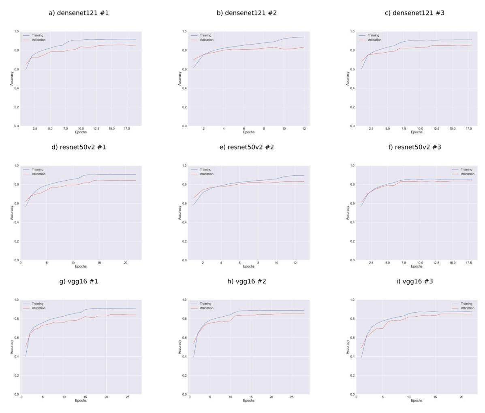
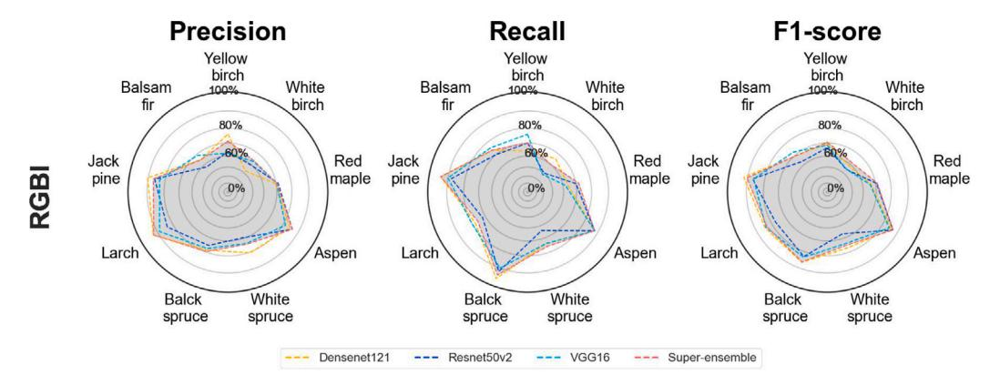

ELSEVIER

Contents lists available at ScienceDirect

### International Journal of Applied Earth Observation and Geoinformation

journal homepage: www.elsevier.com/locate/jag

## High-resolution mapping of tree species and associated uncertainty by combining aerial remote sensing data and convolutional neural networks ensemble

Jean-Daniel Sylvain a,b,\*, Guillaume Drolet b, Évelyne Thiffault c, François Anctil a

- a Département de génie civil et de génie des eaux, faculté des sciences et de génie, Université Laval, 1065, av. de la Médecine, Québec, GIV 0A6, Québec, Canada
- b Direction de la recherche forestière, Ministère des Ressources naturelles et des Forêts, 2700, rue Einstein, Québec, G1P 3W8, Québec, Canada
- c Département des sciences du bois et de la forêt, Faculté de foresterie, de géographie et de géomatique, Université Laval, 2405, rue de la Terrasse, Québec, G1V 0A6, Québec, Canada

#### ARTICLE INFO

# Keywords: Deep learning Ensemble modelling Uncertainty assessment Boreal tree species Land cover type Predictions reliability

#### ABSTRACT

Mapping tree species diversity is essential for monitoring and managing forest ecosystems. Automating ecoforestry mapping using remote sensing images remains an important challenge due to the tremendous variability in forest covers and the conditions under which images used for classification are acquired. Deep learning algorithms have been increasingly used over the last few years to analyse remote sensing data for mapping tree species. However, most of these studies focus only on a small number of species or a limited area and avoid providing a spatially explicit representation of the uncertainty related to the predictions, rendering them unsuitable for operational use.

In this study, we used an ensemble of convolutional neural networks to map forest species and land cover types across a  $10,000 \, \mathrm{km^2}$  area in Quebec, Canada, spanning mixed and boreal forests. We built a georeferenced label database to train and test nine models, which resulted from the combination of three training datasets and three-commonly used convolutional neural network architectures (VGG16, ResNet50v2, Densenet121). These models were trained on multiband aerial photographs and a canopy height model derived from airborne lidar point clouds and used to map the diversity and distribution of tree species and land cover types. The level of agreement among models was used to generate uncertainty maps. The performance of the super-ensemble using 1311 independent forest inventory plots and assessed the extent to which uncertainty maps could serve as a spatially explicit indicator of model performance.

The super-ensemble achieved 90% global accuracy. Our results indicated that the performance of the super-ensemble surpassed that of all individual architectures while also showing a positive effect of the canopy height model on performance. The comparison of the super-ensemble map with the proportion of basal area measured in forest inventory plots confirmed the reliability of the model over the study area. Our results also indicated that mapping the inter-model agreement provides a reliable spatially explicit estimate of model performance. The robustness and reliability of the proposed approach support its use in an operational context while also providing a conceptual framework to evaluate the reliability of uncertainty maps.

#### 1. Introduction

Climate change and human activities are two major drivers of land cover diversity of forest ecosystems (IPCC, 2014), affecting ecosystem traits, functions and services that could ultimately impact ecosystems stability and productivity and by extension the human communities that depend on them (Oliver et al., 2015). Monitoring, mapping and quantifying species diversity are essential tasks supporting sound

decision-making and ensuring the sustainable management of forest ecosystems (IPCC, 2014; Bergseng et al., 2014; Ewald et al., 2016). Methodological developments are still needed to quantify the amplitude and distribution of these changes in space and time, notwithstanding an active field of research (Sylvain et al., 2017).

Over the last decade, several approaches have been developed to map forest attributes using remote sensing technologies (Pu and

\* Corresponding author at: Département de génie civil et de génie des eaux, faculté des sciences et de génie, Université Laval, 1065, av. de la Médecine, Québec, G1V 0A6, Québec, Canada.

E-mail addresses: jeandaniel.sylvain@gmail.com (J.-D. Sylvain), guillaume.drolet@mrnf.gouv.qc.ca (G. Drolet), evelyne.thiffault@sbf.ulaval.ca (É. Thiffault), francois.anctil@gci.ulaval.ca (F. Anctil).

Landry, 2012; Oliver et al., 2015; Karasiak et al., 2017; Shao et al., 2017; Mäyrä et al., 2021). Most combine field measurements or photo-interpreted observations with airborne or satellite data (optical, radar, lidar) using statistical or machine learning algorithms to produce maps of forest cover attributes and land use (Bergseng et al., 2014; Yin and Wang, 2016; Shao et al., 2017; Pu, 2021). Nowadays, procedures based on hyperspectral imagery still provide state-of-the-art performance for mapping tree species (Sothe et al., 2020; Mäyrä et al., 2021). However, the cost, complexity and availability of hyperspectral imagery, added to the important computing resources they require, still restrict their use over large territories and for operational applications (Ewald et al., 2016).

To our knowledge, there is currently no method for mapping tree species distribution at a submeter resolution using remote sensing imagery, over large areas in an operational context. Several reasons may explain this methodological gap, but the inherent characteristics of remote sensing data remain the most challenging because of the tremendous variability in the conditions under which images are acquired (timing, frequency, atmospheric properties, geometric conditions), sensors characteristics (calibration, radiometric, spectral and spatial resolutions, spatial coverage) and, forest type and complexity (high diversity, multiple forest stands, overlapping tree crowns, crowns with different shapes and sizes) (Ewald et al., 2016; Pu, 2021; Mäyrä et al., 2021). Variability and background vary even further across forest biomes, making the development of models that generalize well across regions even more difficult (Tolan et al., 2024). Clouds and haze over boreal and temperate forests also greatly reduce the ability to describe these biomes, even on an annual basis (Ewald et al., 2016; Labonté et al., 2020). In addition, most classification algorithms are based on statistical assumptions about populations (pixels) and subpopulations (groups of pixels) that are rarely met in practice (e.g. normality, stationarity, etc.), which also considerably reduce the generalization capacity of such models over larger areas (Olson, 2009; Pu, 2021). Although recent studies have demonstrated the potential of remote sensing technology in mapping tree species at the site level (Michałowska, 2021; Li et al., 2019; Wang and Wang, 2019; Pu, 2021), the majority of these studies have been limited to small territories, restricted range of ecological conditions, and a small number of test sites (Ewald et al., 2016). This may raise questions about the reliability and generalization capabilities of their findings for operational use over larger areas (Pu, 2021). Nonetheless, ecoforest maps continue to be widely used by forest agencies as the primary tool for depicting tree species occurrence and spatial distribution in forested ecosystems.

An ecoforestry map relies on photointerpretation and field observations to delineate spatial entities with relatively homogeneous stand characteristics (stem density, height, tree species). The stereoscopic view of aerial photographs provides a detailed view of land attributes from an axial and overhead perspective. While these attributes are visible, they may not always be easily identifiable but photo-interpreters generally use shape, pattern, size, colour, shadow, texture, timing and 3D rendering to delineate homogeneous spatial entities. Hence, photointerpretation requires expert knowledge and specialized equipment, making this operation time-consuming and costly (Bergseng et al., 2014). Furthermore, producing an ecoforestry map over a large area requires the work of many photo-interpreters, which increases subjectivity (White, 2019), limits reproducibility and introduces unknown uncertainties. It also requires a field campaign for the acquisition of ground control points. In this context, full or partial automation of ecoforestry map production would represent a major advantage compared to the current workflow, while creating opportunities for the production of fine-scale raster maps supporting the development of precision forestry (Achim et al., 2021). Recent developments in artificial intelligence, particularly in computer vision, offer new and promising opportunities to generalize and automate their production (Tolan et al., 2024).

Convolutional neural networks (CNNs) are undoubtedly one of the most important advances in computer vision, mainly concerned with object detection and image classification (Lecun et al., 2015; Krizhevsky et al., 2012). The enhanced performance of CNNs over most other image classification approaches lies in their ability to extract and enhance the shape and texture attributes of objects embedded directly in the image (Ma et al., 2019). Convolution filters make the recognition of complex attributes possible, which, when applied sequentially or hierarchically, allow the extraction of various self-learned representations of a class/object at increasing levels of abstraction (Lecun et al., 2015). The predictive power of CNNs results from a filter conditioning process, performed by a neural network that links image features extracted by an encoder to the attributes of the associated class or object. CNNs also helps to alleviate the common problems of offset and noise often present in remote sensing imagery (Sylvain et al., 2019). Additionally, CNNs relax statistical assumptions imposed by traditional approaches. The accuracy and the generalization of CNNs far exceeds that of more conventional classification methods (e.g., random forests, support vector machine, K-Nearest-Neighbours) and is now comparable, or even superior to the accuracy of photointerpretation (Audebert et al., 2018; Chen et al., 2018). Therefore, CNNs could constitute a reliable and objective tool for mapping forest cover attributes, while also providing an objective assessment of the map errors (Sylvain et al., 2019). Some studies have employed CNNs for tree species classification, although most of them have targeted only a small number of species or a limited area (Natesan et al., 2020; Sothe et al., 2020; Zhang et al., 2021; Guo et al., 2022), rendering them unsuitable for operational use. These limitations were justified by the difficulty in obtaining high-quality samples at the stem level for training and validation and the diversity of landscape and ecosystems (Natesan et al., 2020; Pu, 2021). Most samples were obtained from field investigations based on the global navigation satellite system (GNSS) or forest plot data. Such field measurements are lengthy and costly to obtain and must still be co-registered with remote sensing data, potentially increasing noise in training and testing datasets. On the other hand, image photointerpretation remains a valuable and cost-effective tool of acquiring co-registered high-quality data (Pu, 2021).

In this study, we tested the explanatory and generalization power of three convolutional neural network for submeter mapping of forest species and land cover type in a study area of 10,000 km2 at the junction between the mixedwood forest and boreal forest vegetation zones in Quebec, Canada. To do this, we developed a standardized photointerpretation protocol to build a georeferenced label database describing the distribution of the main tree species and land cover type present in the study area. From these data, we trained and tested nine models combining three training datasets and three commonly used CNN architectures (VGG16, ResNet50v2, Densenet121). The selected architectures leverage the structural and spectral information extracted from multiband aerial photographs and a canopy height model derived from airborne lidar point clouds based on a supervised learning process. The performance of these chosen architectures was evaluated against an independent dataset. We also compared the performance of these individual architectures with that obtained from a super-ensemble resulting from the aggregation of all the architectures used, and evaluated whether the addition of the canopy height model improved the models performance. Applying the super-ensemble on aerial photographs and canopy height models allowed for a detailed mapping of the diversity of tree species and land cover over types of the study area. The level of agreement among models was used to assess the uncertainty of the predicted values. The performance of the super-ensemble was also validated using a completely independent dataset consisting of 1311 forest inventory plots. The inventory plots were further used to assess to what extent the level of agreement between the models could be used as a spatially explicit indicator of uncertainty. The study also provides a comparison between the super-ensemble map and the ecoforestry map derived through photointerpretation.

Fig. 1. Schematic representation of the ensemble-modelling approaches used for mapping tree species and land cover diversity.

#### 2. Material and methods

Fig. 1 shows a schematic representation of the modelling framework used to map forest attributes and their related uncertainty. The following sections describe the study area, and each step of the procedure used to map tree species and land cover types across a  $10,000~\rm km^2$  area at  $0.9~\rm m$  resolution.

#### 2.1. Study area

The study area is located in the western part of the Province of Quebec, Canada, near the southern edge of the boreal forest, in ecological sub-region 5B (white birch fir forest). The study area covers nearly 10,000 km² and is occupied mainly by tree species common to temperate deciduous, mixed and boreal forests (Fig. 2). Temperate deciduous forests dominate in southern zones. They are characterized by tree species such as red maple (Acer rubrum L.), yellow birch (Betula alleghaniensis Britt.) and trembling aspen (Populus tremuloides Michx.). The mixed forest mostly covers the central part and is characterized by mixed stands composed mostly of balsam fir (Abies balasamea L.) Mill), white (Betula papyrifera Marsh.) and yellow birch, eastern larch (Larix laricina), trembling aspen and white spruce (Picea glauca Moench Voss). Boreal forests occupy the northern part and are dominated by black spruce (Picea mariana (Mill.)), jack pine (Pinus banksiana (Lamb.)), trembling aspen and white birch trees.

#### 2.2. Data collection

#### 2.2.1. Orthoimages

We used 2994 high-resolution multispectral digital aerial photos acquired by the Government of Quebec for forest mapping and planning purposes. The images were captured using two models of calibrated Vexcel UltraCam (X and Xp) large-format airborne cameras, specifically designed to capture panchromatic and multispectral imagery simultaneously. These cameras deliver digital count values (8 bits) across four spectral channels at a resolution of 50 cm: red (R), green (G), blue (B), and near-infrared (I). The multispectral images were pansharpened by the image provider using 30 cm panchromatic images. Subsequently, the images were stacked into multi-channel GeoTiff images with a pixel

resolution of 30 cm (referred to as RGBI-images). Most images were acquired over the study area between June 26 and September 13, 2017. A few additional images (31) in the southern part of the area were acquired on June 01, 2015; these were used for complementing the number of deciduous tree species in the database. The acquisition time for the images ranged from 08:55 to 15:11 local time.

The interior and exterior camera parameters provided by the supplier were optimized using Match-AT from the Trimble Inpho® Photogrammetry Suite version 13.2. The optimized parameters and a digital elevation model were used to create precise multispectral RGBI orthoimages using OrthoMaster Inpho® software. To increase homogeneity across the images, we performed a radiometric adjustment to compensate for intensity, colour and contrast variations between adjacent images using OrthoVista Inpho® software. For mapping purposes, we merged all the images into a seamless mosaic using the feature detection algorithm available in OrthoVista. The feature detection algorithm uses image objects to automatically compute seamlines between adjacent images. The resulting mosaic was saved in 5443 tiles of 5000  $\times$  5000 pixels, representing approximately 1,000,000 hectares.

#### 2.2.2. Canopy height model

Airborne Laser Scanning datasets (ALS) were used to produce a canopy height model (CHM). The CHM allows to integrate information regarding the structure and relative height of land use types and forest stands. ALS data were collected during the summer of 2017 using a discrete-return system operating at 1064 nm (Leica ALS70-HP). Cloud point densities ranged between 0.5 and 4 pts/m2 in most areas, except over water bodies. All returns in the cloud points were initially classified using the lasclassify function and default parameters in LAStools (Rapidlasso, GmbH). This classification process distinguishes between the ground and non-ground points required to build a CHM using the lidR package (Roussel et al., 2017). The absolute elevation of each cloud point was normalized based on its k-nearest neighbouring points using lidR normalize height function. CHMs were generated using lidR rasterize canopy with the pitfree functions. The resulting CHMs provide a detailed representation of the canopy structure and height at the same horizontal resolution as that of the orthoimagery (0.3 m) and with a vertical resolution of 0.1 m.

Fig. 2. Location of sub-vegetation zones and of the study area in the Province of Quebec, Canada. The study area is located at the intersection of the boreal and mixed forest sub-vegetation zones. The inset shows the location of the study area and of areas containing tree species labelled points and polygons. The black line delineates ecological sub-region 5B. Red squares show the location of 1-ha polygons containing labelled trees (points) and of labelled stands (polygons) in which tree species were photo-interpreted. Labelled points used for land cover type classification are not shown as they are uniformly distributed across the study area.

#### 2.2.3. Tree species and land cover database

Orthoimages, CHM, and ecoforestry maps are the primary data sources for generating the labelled points used to calibrate and validate the CNNs. Training and testing labelled-points were generated using three sampling approaches: stem, stand and land cover.

Stem database - For the first sampling approach, senior photointerpreters used 3D stereo rendering to characterize all trees taller than 7 meters within 1-hectare polygons. This characterization focused on nine of the main tree species in the study area, according to the procedure described in Sylvain et al. (2019): black spruce, white spruce, jack pine, balsam fir, larch, red maple, vellow birch, white birch, and trembling aspen. These polygons were randomly sampled from a set of candidate polygons distributed across the study area. They were extracted from the 2017 1:20,000 Quebec ecoforestry map based on the following criteria: (1) a polygon must contain at least 10% of its forest stand basal area in the species under study, (2) a stand height must be higher than 7 m, and (3) a stand age class equal to or higher than 40 years. Each photointerpreter was then asked to georeference each eligible tree with a point on the tree crown centre of mass (X, Y coordinates), identify the tree species, assess the percentage of defoliation (0%, greater than 0% but below 50%, 50% or more) and associate a level of certainty to its diagnostic (strong, moderate, weak). Trees with moderate and weak certainty levels or affected by defoliation were removed from the final database. At the end of the process, a senior photointerpreter validated the position of each tree in the 2D imagery and corrected its position when the centre of mass located in the 3D stereo rendering exhibited an offset larger than 1 m. The photointerpreter also revised tree labels to ensure consistency among diagnoses. Finally, for each point, we extracted image values of the four spectral channels and of the canopy height model using a 30-m window (patch) centred around the tree's spatial coordinates. The 30 m window is utilized to prevent the occurrence of no data values resulting from transformations such as zooming out and rotation used in data augmentation

**Stand database** – In the second sampling approach, a senior photointerpreter used 3D stereo rendering to delineate spatial units (polygons) of homogeneous species composition and structure. Each resulting polygon was shrunk using a 3-m internal buffer to remove any potential edge effect. Point samples were randomly drawn within each buffered polygon, and their spatial coordinates were used to extract image values of the four spectral channels and of the CHM using a 30-m window (patch) centred around the tree's spatial coordinates.

land cover database – To increase reliability of the models, we added four land cover classes to the database: wetland/swamp, water body, road and ground/low vegetation. Samples for the additional classes were automatically generated by sampling ecoforestry map polygons and road network linear segments following the procedure described in Sylvain et al. (2019). All generated points were visually validated and corrected to improve geometric alignment with the orthoimagery and CHM, to increase the representativeness and consistency within land cover classes, and to remove misclassification errors due to differences between input polygons and lines semantic classes and our definition of land cover types. As with the other sampling approach, points spatial coordinates were used to extract image values of the four spectral channels and of the CHM within a 30-m window. Fig. 3 illustrates examples for each tree species and land cover classes used in this study.

#### 2.2.4. Data splitting

The labelled images were divided into training, validation, and test datasets. The training dataset was used to train the model, while the validation dataset was employed to monitor model performance during the training process, tune hyperparameters and assess the expected error of the model. The test dataset was utilized to evaluate model performances on unseen data, assessing its generalization error. The database was then resampled thrice to generate three different sets of training and validation datasets. A unique test dataset was used to evaluate all resulting models.

Fig. 3. Examples of 101x101-pixel labelled images in enhanced false colour (IRG) for each but one class (white spruce not shown): (a) yellow birch, (b) red maple, (c) trembling aspen, (d) larch, (e) balsam fir, (f) ground/low vegetation, (g) jack pine, (h) white birch, (i) black spruce, (j) road, (k) water body, (l) wetland/swamp.

Table 1
Number of trainable and non-trainable parameters across architectures.

| Architecture | Parameters | antectures.   |
|--------------|------------|---------------|
|              | Trainable  | Non-trainable |
| VGG-16       | 28,378,061 | 0             |
| ResNet-50v2  | 23,552,269 | 45,440        |
| Densenet-121 | 6,973,453  | 83,648        |

Validation and test datasets were first created by randomly sampling 50 labelled images from each class. To minimize overfitting and warrant a good assessment of the generalization error, we imposed a spatial constraint on the sampling procedure so that all labelled images of a given class in the validation (or test) datasets were located at least 7 m apart from the remaining points in the training dataset. All points that could not meet that constraint were removed from the training dataset. Three training datasets were created by randomly sampling a maximum of 5000 labelled images in each class. At the end of the process, training, validation, and test datasets contained approximately 50,000, 550 and 550 labelled images, respectively. Fig. 4 summarizes the average number of labelled images for each class in each dataset.

#### 2.3. Deep convolutional neural networks architectures

This study used feature extractors of three well-known architectures available in the Keras Python API (Chollet, 2015). Feature extractors were selected based on their suitability for our case study. Architectures should be (1) available in common open-source software, (2) easily adapted to small windows and (3) able to detect small objects such as trees in 30 cm resolution images. Feature extractors were also selected based on their ability to exploit different schemes of the CNNs algorithm.

#### 2.3.1. VGG16

The first architecture, VGG16 (Fig. 5, Simonyan and Zisserman (2015)), was chosen as a baseline model, as it is simple, widely used, and has shown good performance for the detection of small objects such as trees in a previous study (Sylvain et al., 2019). VGG16 uses a stack of 3 × 3 convolutional filters and max-pooling layers that allow features to be downsampled by a factor of 2. Despite its relative success, the architectural design of VGG16 leads to a loss of information from one level to another due to the pooling operation. Therefore, successive VGG16 architectures lead to the loss of higher frequency variations in the first layer, potentially limiting feature reuse and increasing the probability of losing important features. On the other hand, it could also contribute to reducing the effect of noise common in aerial imagery. The VGG16 feature extractor implementation followed Simonyan and Zisserman (2015). The feature maps of the extractor were flattened and passed through two dense layers before being passed to the final classifier. The combination of feature extractor and classifier used in this VGG16 architecture required the adjustment of 28,378,061 trainable parameters (Table 1).

#### 2.3.2. ResNet50-V2

The second architecture, ResNet50-v2 (Fig. 5), introduces residual connections that mainly aim to overcome the problem of vanishing gradients, which is common in very deep CNN architectures like VGG16. The introduction of residual connections (additive identity mapping) allows features from the previous level to be reintroduced, consequently limiting the loss of information and reinforcing the use of higher frequency variations in previous features. By alleviating the vanishing gradient problem, residual connections also enable the development of deeper networks that are easier to parametrize and generalize better. In this study, we opted for the ResNet50-V2 architecture as the feature extractor as in He et al. (2016). The ResNet50-V2 feature extractor is combined with a global average pooling layer passed to the classifier. The feature extractor and classifier used in our ResNet50-V2 architecture require the adjustment of 23,552,269 parameters (Table 1).

Fig. 4. Distribution of labelled images across tree species and land cover classes for training, validation, and test datasets.

#### 2.3.3. Densenet-121

The third architecture, Densenet-121 (Fig. 5), reinforces the concept of feature reuse, as proposed in ResNet architectures, by directly linking layers with light dense connections. Dense connections allow relevant information in input data and previous feature maps to be transmitted to all subsequent layers. These connections optimize the availability of the information throughout the network, while reducing the number of parameters to train, leading to a better generalization of the algorithm. Due to the high number of feature maps generated via dense connections, the authors introduced transition layers (yellow boxes) consisting of  $1 \times 1$  convolutions and max-pooling operators. Using  $1 \times 1$ convolutions allows information compression, while the max-pooling operation downsamples the feature maps for subsequent levels. In this study, we used the DenseNet121 implementation described in the original paper by Huang et al. (2017). The Densenet-121 architecture requires fewer parameters than the other two, in our case 6,973,453 trainable parameters (Table 1).

#### 2.4. Tree species and land cover classification

#### 2.4.1. Modelling

Preprocessing − The four bands of aerial orthophotos and lidar CHM were stacked into 3D arrays. Pixel values in the labelled images were standardized between −1 and 1 by subtracting half of the maximum value of each band in the training dataset minus 1. Data augmentation was applied on 30 m window array to increase the robustness of our algorithm to variability associated with view angle, illumination, sensor training, and lens distortion (Krizhevsky et al. 2012). Data augmentation consisted of randomly applying combinations of the following transformations to the labelled images of the training datasets: horizontal and vertical shift, rotation, horizontal and vertical flip, brightness adjustment, contrast adjustment, and shape distortion (shear). Due to CNNs probabilistic nature, class imbalances may lead to biased predictions in favour of the dominant classes,

impacting the generalization of the model. To obtain a balanced dataset, minority classes were oversampled for data augmentation, resulting in 5000 training examples in each class. Original and augmented data were then merged. All labelled images were cropped to  $31\times31$  pixels windows (9.3 m) around their centre. Subsequently, the resulting images were upsampled to a size of  $71\times71$  to accommodate deeper architectures. While the upsampling process is necessary to ensure compatibility with DenseNet and ResNet architectures, it also helps mitigate scale sensitivity in the model, particularly regarding smaller objects during zooming in and out. Standardizing image dimensions through upsampling (71  $\times$  71) enhances the model's capacity to detect and classify objects across diverse scales with heightened efficacy.

Training - All networks were trained from scratch for a maximum of 150 epochs using the Adam optimizer and a batch size of 256. Hyperparameters were tuned using the hyperband algorithm (Li et al., 2018). The following hyperparameters were optimized: learning rate, dropout rate, L2 regularization rate, Leaky coefficient, and the number of nodes in the final densely connected layers (VGG16 only). During training, the learning rate was initialized to the optimized value and decreased inversely with the number of epochs. The weights of the network were randomly initialized using the He uniform variance scaling initializer. A dropout layer was enforced between each fully connected layer and after the feature extractor. The loss function used to train the model was the sparse categorical cross-entropy, and it was weighted according to the inverse proportion of each class in the training dataset. An earlystopping approach was also adopted to avoid overfitting. The training was stopped when the validation loss did not decrease less than 0.01 for five consecutive epochs. The final weights used for subsequent steps were those that provided the best overall validation accuracy.

**Ensemble modelling** – All network architectures were tuned, trained, and validated using three datasets (Section 2.2.4) for each architecture (3 datasets x 3 architectures = 9 models) and each type of input. The test dataset was used to report the generalization error. Each model was used for pixel-wise predictions. The resulting predictions

Fig. 5. Comparison between VGG16, ResNet50-v2 and DenseNet-121 architectures. VGG16 employs a series of convolutional and max pooling operations. ResNet architectures facilitate the reintroduction of textural features from previous layers or blocks (indicated by red boxes) through residual connections (red lines on the left). DenseNet extends this concept by introducing direct connections from any layer to all subsequent layers within a dense block (green boxes). Patterns lost in VGG16 are reintroduced by residual and dense connections, maximizing the number of high-frequency patterns across the network and helping to overcome the vanishing gradient problem inherent in deeper networks.

were then aggregated at the pixel level using the mode of the predicted classes. The level of agreement between all predictions, which is the proportion of models that predicted the class with the highest frequency among the nine predictions, was used to assess the uncertainty of the predictions for each pixel. Model ensembles were made at two levels: architecture level, that is, ensembles of 3 models of the same architecture, and a super-ensemble that aggregates predictions from all 9 trained models. Ensembles were also generated according to each input data type (RGBI vs RGBI-CHM).

**Testing** – To assess the effect of input data (RGBI vs RGBI-CHM), model architecture (VGG16, ResNet50-v2, Densenet-121) and ensemble modelling, we compare the performance values on labelled images from the test dataset using the classification metrics described in Section 2.6.

#### 2.4.2. Model inference

Tree species and land cover maps were produced by applying the nine models to radiometrically adjusted orthoimages and the CHM dataset using a sliding window (31  $\times$  31 pixels, resampled to 71  $\times$  71 pixels) over a 10,000  $\rm km^2$  area centred at 48.9 N, 74.6 W. The maps were generated at a resolution of 0.89 m, corresponding to applying our model to every three pixels on the original images. The nine models were applied on a pixel-wise basis. The deterministic predictions consist

of the modal value of each pixel. The degree of agreement between the final predictions and the nine models was used to generate uncertainty maps according to Sylvain et al. (2019).

#### 2.5. External validation

In a second step, we compared the accuracy of the super-ensemble map for tree species identification using temporary forest plots (Ministère des Ressources naturelles et des Forêts, 2023) acquired during the forest inventory program of the Quebec government.

#### 2.5.1. Forest plots survey

Temporary plots of the Quebec government provide a detailed description of tree species in circular plots of  $400\text{-m}^2$  (radius = 11.28 m). The plots report the specie, DBH, and health status of all stems with a diameter at breast height (DBH, measured at 1.3 m above ground) larger than 9 cm. Species and DBH class ( $\pm$  1 cm) are also available for all stems with a DBH between 2 and 9 cm.

Forest inventory plots were used to evaluate the ability of the super-ensemble to predict the occurrence and the prevalence of each species in the forest cover. Overall, 1311 plots were used to assess the performance of the models for the study area on the unseen dataset.

The basal area of each stem, which represents the cross-sectional area of a tree, was first calculated using the DBH. Basal areas of healthy stems were aggregated and normalized using the sum of the basal area for each plot. The normalization yielded a ratio that would ease the comparison between plots and the tree species map. We then extracted all pixels within an 11.28 m radius around the centre of the plot (400  $\rm m^2$  area) using the spatial coordinates of each plot. The proportion of each species in the plot was calculated by dividing the number of pixels occupied by a particular species by the total number of pixels belonging to any species reported in a plot. To focus the sensitivity analysis on the species recognized by our model, pixels classified as land use types and all other tree species present in the plots but not in our model were excluded for the comparison.

The ability of the model to predict the occurrence and the prevalence of each species and vegetation type (Broadleaf deciduous, Evergreen needleleaf) was assessed using the classification and regression metrics described in Section 2.6.

#### 2.6. Performance metrics

#### 2.6.1. Classification metrics

The performance of all architectures and ensembles was evaluated using precision, recall, and F1-score. Precision, also known as producer's accuracy, is the proportion of good predictions made by a model, relative to the predicted labels. It allows us to evaluate the ability of a model to identify species correctly. This indicator evaluates the ability of the models to overestimate the occurrence of species.

$$Precision = \frac{tp}{tp + fp} \tag{1}$$

where tp is the number of true positives and fp is the number of false positives. Recall, also known as user's accuracy, is the proportion of good predictions, relative to the observed labels. Recall is an indicator of the models' ability to accurately predict or underestimate the occurrence of species.

$$Recall = \frac{tp}{tp + fn} \tag{2}$$

where fn is the number of false negatives. F1-score provides a balanced measure of the models accuracy and is assessed using the harmonic mean of the precision and recall. F1-score ranges from 0 to 1. It is particularly useful to evaluate performance in an imbalanced dataset as is the case with ecoforestry plots.

$$F1 - score = \frac{2 \times (precision \times recall)}{2 \times (precision + recall)}$$
 (3)

All metrics range from 0 (minimum) to 1 (maximum), where 1 indicates a perfect prediction.

#### 2.6.2. Regression metrics

Two metrics were used to compare the spatial coverage predicted by the models with basal area measured in forest plots: the Spearman correlation coefficient ( $\rho$ ) and the regression slope ( $\alpha$ ). The Spearman correlation coefficient was employed to study the relationship between forest cover predicted using the super-ensemble and values measured from plot data. It was chosen due to its ability to handle non-normal distributions and non-linear relationships

$$\rho = 1 - \frac{6 \sum d_i^2}{n \times (n^2 - 1)} \tag{4}$$

where  $\rho$  is the Spearman correlation coefficient,  $d_i$  is the differences between the ranks of paired observations, and n is the number of observations. The regression slope denoted as  $\alpha$  was used to assess the linear relationship between forest cover predicted using the super-ensemble and the species-specific proportions of plot basal area.

$$y_i = \alpha x + \beta \tag{5}$$

where  $\alpha$  is the regression slope,  $\beta$  is the intercept, y is the proportion of basal area for the species and x is the proportion of basal area and pixels for each species, respectively.

#### 2.7. Reliability of uncertainty

Training CNN with ReLU activations functions has been shown to yield overconfident predictions (Kristiadi et al., 2020). This makes the predicted probabilities generated for each class by these types of models a poor estimator for uncertainty assessment (Dimitriadis et al., 2021). To overcome this issue, we propose using the agreement among models (N = 9) as a proxy for uncertainty. However, to what extent inter-model agreement remains a reliable indicator of the uncertainty of an ensemble of estimators used in a multi-class problem is questionable. A good indicator should yield lower uncertainty when the estimator predictions lead to good performances and higher uncertainty when the estimator leads to poor performances. To evaluate whether the agreement among models is a good predictor of uncertainty, we propose the following method :

- 1. Evaluate the model's performance in each plot:
  - (a) For each forest plot (n = 1331), assess the proportion of each species recorded during the forest inventory that is also the list of 9 species predicted by the models. If the proportion of a species is greater than zero, the species is considered present ( $y_{true} = 1$ ), if the proportion is equal to zero, the species is considered absent ( $y_{true} = 0$ ).
  - (b) For each forest plot, extract all pixels of the superensemble that fall within it and that are not from land cover classes. This results in a total of up to 444 pixels given the area of the plots used in this study (400 m2). Then, assess the occurrence of each species in each plot. If the proportion of pixels from a species is greater than zero, the species is considered present ( $y_{pred} = 1$ ), if the proportion is equal to zero, the species is considered absent ( $y_{pred} = 0$ ).
  - (c) Use  $y_{true}$  and  $y_{pred}$  to compute classification metrics for assessing the super-ensemble's performance. Here we used the F1-score.
- Assess the cumulative distribution function of agreement values in each plot :
  - (a) For each forest plot, extract model agreement values of the pixels that fall within it and that are not predicted as land cover classes. Compute the empirical cumulative distribution function (ecdf) of the agreement values in each plot using 10 percentile intervals (ecdfi), where *i* takes values 10, 20, 30, 40, 50, 60, 70, 80, 90. Each percentile interval indicates the percentage of **pixels** that fall below a particular agreement value associated with that interval.
  - (b) Using all forest plots, compute the cumulative distribution function of percentile  $10 \, (\operatorname{ecdf}_{10})$  and  $90 \, (\operatorname{ecdf}_{90})$  calculated in step 2a, again using 10 percentile intervals. The percentile resulting from this operation  $\operatorname{ecdf}_i(j)$  indicates the percentage of **plots** that fall at or below a particular agreement value. These thresholds will be used to split the dataset in  $10 \, \operatorname{intervals}$ . For instance, all plots that fall within the range defined by  $\operatorname{ecdf}_{10}(10)$  and  $\operatorname{ecdf}_{90}(10)$  will be grouped together.

#### 3. Agreement reliability diagram

(a) For each percentile *i* retrieved from ecdfi and for each bin j, extract all plots within the limits defined by bins *j* (ecdf10(*j*) and ecdf90(*j*)). Then, evaluate the average F1score and join the maximum agreement percentile of bin *j* (ecdf90(*j*)).

Table 2
Comparison of classification metrics from the test dataset for super-ensemble, Densenet-121, ResNet50-v2, and VGG16 ensemble models using RGBI images with (RGBI-CHM) and without (RGBI) the canopy height model (CHM). The evaluation of metrics was done for two classification schemes. The 12 class scheme involved distinguishing between yellow birch and white birch, whereas the 12 class scheme treated both species as a single genus.

| Classification | Architecture   | RGBI-CHM  |        |          | RGBI      |        |          |
|----------------|----------------|-----------|--------|----------|-----------|--------|----------|
|                |                | Precision | Recall | F1-score | Precision | Recall | F1-score |
|                | Super-ensemble | 0.87      | 0.87   | 0.87     | 0.83      | 0.82   | 0.82     |
| 13 classes     | Densenet121    | 0.86      | 0.86   | 0.86     | 0.81      | 0.81   | 0.81     |
|                | VGG16          | 0.85      | 0.85   | 0.85     | 0.81      | 0.81   | 0.81     |
|                | ResNet50v2     | 0.85      | 0.84   | 0.84     | 0.79      | 0.79   | 0.79     |
| 12 classes     | Super-ensemble | 0.90      | 0.90   | 0.90     | 0.85      | 0.84   | 0.85     |
|                | Densenet121    | 0.89      | 0.88   | 0.88     | 0.85      | 0.84   | 0.84     |
|                | VGG16          | 0.88      | 0.88   | 0.88     | 0.84      | 0.84   | 0.84     |
|                | ResNet50v2     | 0.88      | 0.88   | 0.88     | 0.83      | 0.82   | 0.82     |

(b) The resulting dataset provides a comparison between model agreement and performance by regressing the F1score values on the ecdf90(*j*) values for each percentile *i*. The diagram should demonstrate a positive relationship between agreement percentile and performance. The performance should also be higher for lower percentile intervals (e.g. p10).

A schematic representation of the approach used to evaluate the reliability of agreement maps for uncertainty assessment is provided as Fig. A.12.

#### 2.8. Hardware and software

All CNNs and experiments in this study were implemented in Python 3.9, utilizing Tensorflow 2.6 (Abadi et al. 2015). The models were trained and validated on a PC workstation with an Intel(R) Xeon(R) W-2145 CPU, 256 GB DDR4 memory and a NVIDIA Quadro P5000 16 GB graphic card. The training (excluding optimization) step took less than one hour for each model. Mapping and prediction were generated using the Narval cluster, which is part of the advanced research computing infrastructure provided by the Digital Research Alliance of Canada (https://docs.alliancecan.ca/wiki/Narval). Mapping our study area required 10 days for each model, utilizing 9 nodes (1 node per model), 2.7 Tb of RAM (300 Gig per model), 36 GPUs A100 (4 GPUs per model), and 160 compute nodes (40 CPUs per model) on average.

#### 3. Results and discussion

Nine models were trained and used to create ensembles for both configurations, namely RGBI and RGBI-CHM. The RGBI-CHM models were then used to map our study area, which spans  $10,000~\rm km^2$ , at a  $0.9~\rm m$  pixel resolution. The production of the super-ensemble for our study area required nearly a trillion ( $10^{12}$ ) predictions. Appendix A.2 detailed the hyperparameter values resulting from optimization (Table A.5), along with accuracy graphs (Fig. A.13) and loss graphs (Fig. A.14) for the 9 models.

#### 3.1. Model architectures

Table 2 presents a comparison of classification metrics for the superensemble, Densenet-121, ResNet50-v2, and VGG16 ensemble models on the test dataset based on two classification schemes. The evaluation of metrics for the 13-class scheme involved distinguishing between yellow and white birch, whereas the 12-classes scheme treated both species as a single genus. This aggregation was done due to the visual and spectral similarities between the two species and the limited number of labelled images for yellow birch. The precision, recall, and F1-score metrics ranged from 84% to 87%. The super-ensemble, which combines predictions from all architectures, demonstrated the highest performance, followed by Densenet121, VGG16, and ResNet50v2,

respectively. Again, this indicates that ensemble modelling allows for more accurate predictions than a single architecture.

The performance of the super-ensemble, Densenet-121, ResNet50-v2, and VGG16 ensemble models for each species is compared in Fig. 6. The super-ensemble, represented by the grey area, demonstrates the highest performance, closely followed by the Densenet-121 and VGG16 architectures. The lower performance of the ResNet50-v2 model can be attributed to its inability to detect all positive samples, as revealed by lower recall values.

#### 3.2. Tree species and land cover

Among all species, trembling aspen, black spruce, larch, and jack pine were most accurately predicted (Fig. 6). In contrast, white birch exhibited the poorest performance, follow by yellow birch, red maple, and white spruce. The confusion between yellow and white birches can largely explain the lower performance of white birch. However, by combining both species, the performance of the super-ensemble increased from an average of 0.70 to 0.87 for all metrics (Fig. 7). The accuracy of the white birch class may have suffered due to the limited number of labelled data available for yellow birch.

The variability in the classification performance of all models used to generate the super-ensemble is depicted for each species in Fig. 7. Notably, there is a discernible difference in the spread of performances between broadleaf deciduous species, evergreen needleleaf species and land cover classes, indicating that the agreement among the models is higher for land cover classes, and lower for tree species. This is most probably due to the higher heterogeneity in spatial contexts, tree crown assemblages and pixel compositions, backgrounds and textures within images of tree species classes compared with those of land cover classes, which usually show more consistency between examples of a same class.

Moreover, classes with a limited number of original (i.e. not dataaugmented) labelled data points in the training dataset (N < 800, Fig. 4) exhibit a larger spread in metrics. Specifically, yellow birch, red maple, and white spruce demonstrate this characteristic, suggesting that acquiring more labelled data could potentially improve the performance for these classes. The lower performance of white birch can largely be attributed to confusion with yellow birch. White and yellow birch, in particular, are frequently mistaken by photointerpreters at this spatial resolution (30 cm) due to their close resemblance. Merging vellow and white birch into one class improved the median performance of all models by 10%, indicating that a class with too few samples may decrease the overall performance of deep learning algorithms (Table 2). Moreover, the scarcity of yellow birch samples in our spatial domain, predominantly found in the southern region, exacerbates the misclassification of white birch. This highlights the importance of maximizing the sampling size of each class and considering the potential effects of underrepresented classes on commission errors. It is noteworthy that we restricted the comparison to these two species only, as the degree of similarity between other species is considerably lower.

Fig. 6. Comparison of classification metric from forest plot data for each species for super-ensemble, Densenet-121, ResNet50-v2, and VGG16 models using the four bands of aerial photography and canopy height model derived from lidar cloud points (RGBI-CHM).

Fig. 7. Distribution of metrics scores among nine models for tree species and land-use classes using RGBI images with (RGBI-CHM) and without (RGBI) a canopy height model (CHM). Metrics were assessed on the test dataset. BJ:yellow birch, BP:white birch, EO:red maple, PT:trembling aspen, EB:white spruce, EN:black spruce, ML:larch, PG:jack pine, SB: balsam fir, GR:ground/low vegetation, HY:water body, RO:road, WE:wetland/swamp. Dashed horizontal lines are provided for comparison purpose.

#### 3.3. Canopy height model

The combined use of the CHM and RGBI channels allowed global accuracy to be improved by 5% compared to classifications based on RGBI alone. The benefits of the CHM on global accuracy were the

same for all architectures. The use of CHM did not change the rank of the models according to their performance. Fig. 7(a) allows the effect of including CHM on the overall performance of each class to be compared. The introduction of the CHM improved the classification success of all classes by around 5%–6% according to ensemble

Fig. 8. Relationship between species or vegetation type-specific forest cover proportion assessed using the super-ensemble and proportion of basal area occupied by species or vegetation types estimated from forest plots for broadleaf deciduous species (a), evergreen needleleaf species (b) and vegetation types (c), and the relationship between average model agreement and F1-score using different percentile thresholds of agreement (d). The spread of the lines in a, b and c indicate the 95% confidence interval for each species or vegetation type. In d, line colour refers to the percentile intervals used.

performance (Table 2). Additionally, it stabilized model performance across all classes. Models using the CHM showed lower variations in their performance, indicating that they are more likely to perform consistently well compared to models that do not use it. The introduction of the CHM dramatically reduces the variance of performance in broadleaf species and ground/low-vegetation classes, while also increasing the performance in ground/low vegetation, balsam fir, white spruce, white birch, yellow birch, and red maple classes. This suggests that the CHM allows for better discrimination between the low vegetation/ground class, mostly composed of shrubs, grasses, ericaceous plants, lichen, mosses etc. and trees.

#### 3.4. External validation

The external validation supports a good match between the proportion of basal area calculated from forest inventory plots data and the proportion of forest cover calculated using the map derived from the super-ensemble (Table 3). Firstly, the recall values indicate that the super-ensemble is very sensitive and allows for the systematic detection of all species in each plot. On the other hand, precision scores suggest that the super-ensemble tends to overestimate species occurrence. The super-ensemble provides very accurate predictions for black spruce and

white birch (precision > 0.90) but tends to significantly overestimate the occurrence of larch, yellow birch, red maple, and white spruce (precision < 0.42).

Fig. 8 shows the average relationship between the species-specific proportion of basal area measured in 1311 forest plots and the species-specific proportion of forest cover estimated from the super-ensemble, for broadleaf deciduous species, evergreen needleleaf species, and species aggregated into vegetation types. Overall, the figure indicates a good agreement between the forest cover map and the forest inventory data. The relationships shown in Figs. 8a, 8b and 8c demonstrate a greater bias for evergreen species and a lower bias for broadleaf species. Both the regression slope and correlation coefficients ( $\rho$ ) indicate a positive relationship between the forest cover map and proportion of basal area in forest inventory plots. However, the relationship is weaker for red maple, larch and white spruce.

The lower performance of the model on some species suggests a potential issue with the imbalanced dataset available for the study (Fig. 4). This problem may have been exacerbated by the use of inversely proportional class weights during the training phase, a mechanism designed to give more attention to underrepresented classes but which can increase the occurrence of false positives. Collecting more samples specifically for these classes would be beneficial to address

Table 3 Comparison of classification and regression metrics on forest inventory plots for the super-ensemble using RGBI images with canopy height model (RGBI-CHM). Rows are sorted according to vegetation type and precision values. n is the number of plots with occurrence of the species.

| Vegetation type | Species         | n   | Mean cover (%) | Slope | ρ    | Precision | Recall |
|-----------------|-----------------|-----|-------------------|-------|------|-----------|--------|
|                 | Black spruce    | 776 | 61.02             | 0.55  | 0.62 | 0.95      | 1.0    |
| Essananaan      | Balsam fir      | 895 | 27.14             | 0.40  | 0.45 | 0.76      | 1.0    |
| Evergreen       | Jack pine       | 615 | 24.97             | 0.81  | 0.64 | 0.55      | 1.0    |
|                 | White spruce    | 653 | 6.05              | 0.25  | 0.31 | 0.42      | 1.0    |
|                 | White birch     | 762 | 24.54             | 0.47  | 0.61 | 0.92      | 1.0    |
| Broadleaf       | Trembling aspen | 135 | 18.86             | 0.53  | 0.64 | 0.62      | 1.0    |
|                 | Red maple       | 163 | 5.06              | 0.21  | 0.25 | 0.35      | 1.0    |
|                 | Larch           | 643 | 2.78              | 0.14  | 0.26 | 0.19      | 1.0    |
|                 | Yellow birch    | 272 | 3.52              | 0.47  | 0.58 | 0.11      | 1.0    |

Fig. 9. Regional mapping of trees species and land cover diversity at 0.9 m for the study area $(10,000 \text{ km}^2)$ . Deterministic predictions were achieved using the super-ensemble (N = 9) derived from the modal prediction of Densenet121, Resnets50v2 and VGG16 architectures at each pixel. See Fig. A.17 for an overview of vegetation and land cover diversity thorough aerial photography.

this issue. Additionally, a visual analysis of the map reveals that lower vegetation types, such as ericaceae and grasses, which did not have dedicated classes but were rather included in the low vegetation/ground class, are more likely to occur in open areas and were frequently misclassified as red maple and yellow birch. These factors could have contributed to the increased number of false positives observed for these species.

While these comparisons provide a valid assessment of the model's performance, it is important to acknowledge that they remain limited by important differences between forest cover and basal area. Plot-level measurements allow for the direct measurement and identification of each tree, while the super-ensemble reports the class membership of a pixel. The super-ensemble's detection is limited to objects that can be viewed from a nadir (90°) perspective, which restricts the detection of understory vegetation. The spatial resolution of aerial photos may also limit the detection of small-diameter trees measured in the plots.

This comparison also relies on the assumption that the relationship between forest crown diameter and basal area diameter is linear and does not vary among species, which does not hold in practice (Beaudet et al., 2011; Pretzsch, 2014). Finally, it is important to note that most temporary forest plots were acquired around the same time as the aerial flight survey of the study area. However, temporal discrepancies may still exist between these two datasets due to a possible disturbance in the forest canopy that could have occurred between the time of acquisition of the images and the forest plots measurements.

#### 3.5. Reliability of agreement for uncertainty assessment

Reliability diagrams aim to evaluate the ability of the model agreement map to accurately represent the uncertainty of the super-ensemble model. Fig. 8d illustrates the general relationship between the agreement percentile intervals and the F1-score observed in forest inventory

Fig. 10. Regional mapping of the proportion of agreement among models (N = 9) used to map trees species and land cover diversity at 0.9 m for the study area (10,000 km2). The legend colour of agreement maps indicate a larger consensus with blue gradient while yellow and red gradients indicate a decrease in consensus and a larger uncertainty.

plots. All curves exhibit a positive relationship between agreement percentile and F1-score, indicating that the model's performance increases with higher agreement among the models. The performance of the model in a specific plot also tends to decrease with an increase in the percentage of pixels exhibiting lower agreement values. For instance, a plot with 10% of pixels (light blue line) having an agreement below or equal to 30% will have, on average, a F1-score of 0.75. In contrast, a plot with 70% of its pixels (light blue line) having an agreement below or equal to 45%, will show a F1-score of 0.68, representing a difference of 7% between the two scenarios.

Geographically, these results indicate that regions with a higher concentration of lower agreement will show lower performance than those with a higher agreement value. Additionally, performance tends to decrease when many pixels exhibit lower agreement. Therefore, our findings suggest that the model agreement map can be used to recognize areas where mapping is more uncertain and to guide the additional label acquisition required for fine-tuning the model. It could also potentially be used to translate the agreement map into a performance map. However, further work is needed to validate such use.

#### 3.6. Regional submeter mapping

#### 3.6.1. Tree species and land cover map

Fig. 9 depicts the spatial distribution of tree species and land cover classes for the 10,000 km² study area at 0.9 m resolution. The map results from pixel-wise aggregation of predictions from three iterations of the three models that were applied to the RGBI orthoimage and lidar CHM dataset. The map depicts a highly detailed overview of tree species diversity and composition and adequately delineates the main hydrological features (wetlands/swamps) and anthropogenic features

like roads, gravel pits, and forest windthrows. It also allows to discriminate between dryland and wetland enabling the identification of potential constraints for both forest productivity and forest operations.

The upper panels (a and b) in Fig. 9 shown the effectiveness of the super-ensemble map in delineating features that result from anthropic and natural disturbances. In particular, the upper left panel (Fig. 9a) exemplifies the accuracy of the maps in delineating a series of linear features now occupied by white birch, one of the first species to colonize disturbed areas in the northern latitudes. These features result from old forest roads that are now occupied mainly by white birch. The upper right panel shows another example that our approach successfully delineated the impact of two important fire disturbances in the western and northeastern part of the central area. Following the forest inventory map, these footprints perfectly delineate two fires that occurred in 2007 and 2012 (see Fig. A.17). Our map suggests that the land affected by these fires has not yet recovered and is now occupied by wetlands and swamps, which could greatly impact forest productivity. It also shows the potential of the map in identifying locations that could greatly benefit from silvicultural treatment.

#### 3.6.2. Model agreement

A visual analysis of the level of agreement between models leads to the following conclusions (Fig. 10). In general, models exhibit a higher level of agreement within homogeneous surfaces. The level of agreement appears to be influenced by the scale and structure of the surface, with a higher agreement (blue gradient) observed for surfaces with large footprint, such as large bodies of water, pure stands, roads, and wetlands. Conversely, smaller and noisier features like transition zones, such as the edges of roads and lakes, exhibit weaker agreement (yellow to red gradients). Additionally, agreement is lower at tree edges and in shaded areas. The lower agreement in these spots suggests that the models operate at different scales.

Fig. 11. Visual comparison between raster and polygonal map of trees species and land cover diversity. Ecoforest polygon maps depict the dominant species or land cover in each polygon according to 1:20,000 scale, while raster maps depicts the same information for each pixel of 0.9 m. The colour legend between both maps have been homogenized whenever it was possible. Figure also provide an aerial view and the location of the region in the study area.

Furthermore, broadleaf and mixed stands generally display a lower degree of agreement than coniferous stands. This discrepancy can be attributed to the higher heterogeneity within such stands, the interference between canopies of different types, and the overlap between trees. These factors contribute to the complexity of species identification in mixed stands compared to pure stands. These findings are consistent with the results depicted in the boxplots of Fig. 7 and with what photo-interpreters have been reporting.

#### 3.6.3. A comparison with the ecoforest map

Fig. 11 visually compares the super-ensemble map against the forest polygon map. The ecoforestry map is a choropleth map that documents the characteristics of the 550,000 km² of managed forest stands throughout the province of Quebec. It serves as an essential tool for sustainable forest management and its polygons describe the abundance of tree species within each forest polygon in which the dominant trees are taller than 7 m and occupy more than 25% of the polygon area. The abundance of tree species is assessed through photointerpretation for species that occupy more than 10% of the basal area. Species that occupy less than 10% of the polygon basal area are not reported and the others are reported by their proportion of the polygon total basal area, in 10% intervals. In Fig. 11a, polygons of the ecoforestry map are coloured based on the dominant class or species observed by photointerpretation in each polygon.

The figure first highlights significant differences in the ability of each product to present and convey information. Regional submeter mapping provides a spatially explicit representation of species composition and forest cover across the landscape, allowing for an accurate location of tree species within forest stands. Conversely, the choropleth map can only provide information about the dominant species of each polygon without their specific locations. Both products allow for quantification of the abundance of tree species. However, the detection of

species in the ecoforestry map is limited to the 10% intervals, whereas the raster map can theoretically provide the occurrence of the species at each meter. This characteristic is essential for monitoring changes in species composition that occupy only a small fraction of the forest canopy, or for detecting alien species.

The ecoforestry map can also provide information about tree height and forest coverage, but it requires multiple maps or the analysis of a very detailed label to convey the same amount of information. By using the raster map, we can provide the same information at once, by adding transparency to the super-ensemble map and displaying a canopy height model in the background. In this representation, elevation is depicted by a colour ramp from black (lower canopy) to white (higher canopy). Furthermore, due to the generalization process, the ecoforestry map fails to render the occurrence of many smaller features such as roads, wetlands/swamps, and disturbances. Conversely, forest cover is conveyed by default in the raster map, as non-vegetation classes can be delineated at 0.9 m resolution, enabling a better assessment of forested areas. Finally, the raster map is also proficient at providing information at various scales and can be easily generalized to any scale (plot, stand, watershed, landscape, or any cartographic entity or map unit).

#### 3.7. Limitations and perspectives

This work has demonstrated the ability of our approach to make accurate and generalizable predictions over a large spatial domain, despite the limited representativeness of the data, different acquisition conditions and the use of an unbalanced dataset. However, it remains unclear how minority classes or oversampling directly influence the performance of the approach. Although the approach showed good potential for mapping purpose, further work should be devoted to testing its sensitivity to changes in the domain (such as camera, territory,

acquisition period) and the quality of sampling (quantity and quality of the data), which may impact the cost and performance in the context of a real-world application. Methods such as adversarial discriminative domain adaptation demonstrate a great potential to overcome such a problem (Tzeng et al., 2017). Similarly, model training using algorithms based on self-supervised learning could reduce the amount of data required for training (Ericsson et al., 2022). Self-supervised learning allows the creation of valuable representations that capture meaningful and relevant information from the data and can be built without the need for human-labelled annotations. This concept is also appealing in environmental mapping as it makes it easier to adapt a model or add a new class if required.

#### 4. Conclusion

This study supports the potential of using convolutional neural networks with aerial photography and a lidar-derived canopy height model data to generate high-resolution maps of tree species and land cover with uncertainty assessment. Results indicated only a slight difference in performance among architectures and showed that ensemble modelling outperforms all individual architectures while also providing a conceptual framework for uncertainty assessment. Adding information on canopy height derived from aerial lidar survey in the predictors improves the performance of all architectures compared to using only multispectral aerial photography. Validation on forest inventory data demonstrated a strong relationship between the species or vegetation type-specific proportion of basal area measured in the plots and the proportion of forest cover calculated using our map, further confirming the accuracy of our approach. Moreover, this work also demonstrates the operational feasibility of this approach by effectively mapping a large area of 90,000 km2 (3 model architectures x 3 training datasets x 10,000 km2).

Regional submeter resolution provides a cost-efficient way to map tree species at an unprecedented level of detail. High-resolution maps offer a very detailed description of key information for sustainable forest management, allowing for a spatially explicit characterization of land cover, tree species and anthropogenic features. Results support many other potential applications of our mapping approach: targeting areas of species concentration, detecting alien or rare species, identifying constraints to forestry activities, better assessment of productive and unproductive areas, and delineation of forest disturbance and sensitive areas such as wetlands and flooded zones.

#### CRediT authorship contribution statement

Jean-Daniel Sylvain: Writing – review & editing, Writing – original draft, Visualization, Validation, Software, Methodology, Investigation, Formal analysis, Data curation, Conceptualization. Guillaume Drolet: Writing – review & editing, Software, Methodology, Data curation, Conceptualization. Évelyne Thiffault: Writing – review & editing, Supervision. François Anctil: Writing – review & editing, Supervision, Methodology.

#### Declaration of competing interest

The authors declare that they have no known competing financial interests or personal relationships that could have appeared to influence the work reported in this paper.

#### Data availability

Data could be made available on request.

#### Acknowledgements

The authors want to thank Isabelle Auger who reviewed the manuscript and provided insightful suggestions and constructive advices. The authors also acknowledge Jasmin Bergeron for the photointerpretation work, Véronique Poirier for her help with aerial orthophotos processing, Geneviève Picher for its suggestions on the analyses with forest data and Patrick Dumontier for IT support. We are also grateful to Philippe Bournival from Direction des inventaires forestiers for its constructive suggestions and supporting this project. Special thanks to Luc Lebel and the FORAC consortium (project IRCPJ 545469-18) for providing access to the high-performance computing infrastructure, and Daniel Stubbs and Lucas Nogueira from Digital Research Alliance of Canada (Calcul Québec) for their technical support and advice. During the preparation of this work the main author used ChapGPT in order to improve English readability. After using this tool, all authors reviewed and edited the content as needed and take full responsibility for the content of the publication. Finally, we would like to thank the editor and the three anonymous reviewers for their valuable comments and suggestions.

#### **Appendix**

A.1. Aerial photography

See Table A.4.

A.2. Reliability of uncertainty maps

See Fig. A.12.

A.3. Model hyperparameters and learning curves

See Table A.5, Figs. A.13 and A.14.

A.4. Model architectures

See Fig. A.15.

A.5. Classification scheme

See Fig. A.16.

A.6. Diversity and land cover maps

See Fig. A.17.

**Table A.4**Distribution of aerial photography across dates and camera.

| Year | Date       | Camera            | N   | Angle |
|------|------------|-------------------|-----|-------|
| 2015 | 2015-06-01 | UC-SXp-1-70214392 | 31  | 31    |
|      | 2017-06-14 | UCX-SX-1-10519431 | 349 | 349   |
|      | 2017-06-26 | UCX-SX-1-70912643 | 404 | 404   |
|      | 2017-07-08 | UCX-SX-1-00418469 | 43  | 43    |
|      | 0017 07 10 | UC-SXp-1-80515278 | 279 | 279   |
|      | 2017-07-13 | UCX-SX-1-70912643 | 406 | 406   |
|      | 2017-07-14 | UCX-SX-1-70912643 | 447 | 447   |
| 2017 | 2017-07-15 | UCX-SX-1-70912643 | 101 | 101   |
| 2017 | 2017-07-17 | UCX-SX-1-70912643 | 178 | 178   |
|      | 2017-07-25 | UC-SXp-1-70214391 | 450 | 450   |
|      | 2017-07-25 | UCX-SX-1-00418469 | 251 | 251   |
|      | 0017 07 01 | UC-SXp-1-70214391 | 27  | 27    |
|      | 2017-07-31 | UCX-SX-1-00418469 | 20  | 20    |
|      | 2017-09-02 | UC-SXp-1-80515278 | 25  | 25    |
|      | 2017-09-13 | UC-SXp-1-70214391 | 11  | 11    |
|      |            |                   |     |       |

Fig. A.12. Schematic representation of the approach used to evaluate the reliability of agreement maps for uncertainty assessment. The reliability of agreement maps is validated when higher agreement among models is observed, and it is further enhanced when higher values are observed for lower percentiles.

**Table A.5**Hyperparameter values resulting from the optimization of the three architectures.

| Model             | val_acc | val_loss | learning_rate | drop_rate | 12_rate | units |
|-------------------|---------|----------|---------------|-----------|---------|-------|
| keras_densenet121 | 0.83    | 0.44     | 0.0010        | 0.254     | 0.0016  | None  |
| keras_resnet50v2  | 0.82    | 0.33     | 0.0001        | 0.235     | 0.0033  | None  |
| keras_vgg16       | 0.84    | 0.60     | 0.0002        | 0.373     | 0.0022  | 512   |

 $\textbf{Fig. A.13.} \ \ \text{Evolution of training accuracy (blue line) and validation accuracy (red line) for each architecture (N = 3) and dataset (N = 3).$ 

Fig. A.14. Evolution of training loss (blue line) and validation loss (red line) for each architecture (N=3) and dataset (N=3).

Fig. A.15. Precision, recall and accuracy of ensemble model on forest plots dataset for each species from the super-ensemble using the four bands of aerial image only.

Fig. A.16. Distribution of models performance on test dataset, for each class and model configuration. The first configuration (RGBI-CHM) combines the four bands of orthoimages and the canopy height model, whereas the second one only uses the four bands of orthoimages. For each model class and configuration, the red star represents the performances of the Super-Ensemble.

Fig. A.17. Aerial overview of the regions in Fig. 9 vegetation and land cover diversity through aerial photography. These images are provided for comparison only and were not used for mapping purpose. The white lines in the lower right inlet allow to delineate two important fire disturbances in the western and northeastern part of central area.

#### References

Achim, A., Moreau, G., Coops, N.C., Axelson, J.N., Barrette, J., Bédard, S., Byrne, K.E., Caspersen, J., Dick, A.R., D'Orangeville, L., Drolet, G., Eskelson, B.N.I., Filipescu, C.N., Flamand-Hubert, M., Goodbody, T.R.H., Griess, V.C., Hagerman, S.M., Keys, K., Lafleur, B., Girona, M.M., Morris, D.M., Nock, C.A., Pinno, B.D., Raymond, P., Roy, V., Schneider, R., Soucy, M., Stewart, B., Sylvain, J.D., Taylor, A.R., Thiffault, E., Thiffault, N., Vepakomma, U., White, J.C., 2021. The changing culture of silviculture. For. Int. J. For. Res. 1–10. http://dx.doi.org/10.1093/forestry/cpab047

Audebert, N., Le Saux, B., Lefèvre, S., 2018. Beyond RGB: Very high resolution urban remote sensing with multimodal deep networks. ISPRS J. Photogramm. Remote Sens. 140, 20–32. http://dx.doi.org/10.1016/j.isprsjprs.2017.11.011, arXiv:1711. 08681.

Beaudet, M., Harvey, B.D., Messier, C., Coates, K.D., Poulin, J., Kneeshaw, D.D., Brais, S., Bergeron, Y., 2011. Managing understory light conditions in boreal mixedwoods through variation in the intensity and spatial pattern of harvest: A modelling approach. Forest Ecol. Manag. 261 (1), 84–94. http://dx.doi.org/10.1016/j.foreco.2010.09.033.

Bergseng, E., Ørka, H.O., Næsset, E., Gobakken, T., 2014. Assessing forest inventory information obtained from different inventory approaches and remote sensing data sources. Ann. For. Sci. 72, 33–45.

Chen, K., Fu, K., Yan, M., Gao, X., Sun, X., Wei, X., 2018. Semantic segmentation of aerial images with shuffling convolutional neural networks. IEEE Geosci. Remote Sens. Lett. 15 (2), 173–177. http://dx.doi.org/10.1109/LGRS.2017.2778181.

Chollet, F., 2015. Keras. GitHub repository, GitHub, https://github.com/fchollet/keras. Dimitriadis, T., Gneiting, T., Jordan, A.I., 2021. Stable reliability diagrams for probabilistic classifiers. Proc. Natl. Acad. Sci. USA 118 (8), 1–16. http://dx.doi.org/10. 1073/pnas.2016191118. arXiv:2008.03033.

Ericsson, L., Gouk, H., Loy, C.C., Hospedales, T.M., 2022. Self-supervised representation learning: Introduction, advances, and challenges. IEEE Signal Process. Mag. 39 (3), 42–62. http://dx.doi.org/10.1109/MSP.2021.3134634, arXiv:2110.09327.

Ewald, F., Lati, H., Stere, K., Modzelewska, A., Lefsky, M., Waser, L.T., Straub, C., Ghosh, A., 2016. Review of studies on tree species classification from remotely sensed data. Remote Sens. Environ. J. 186, 64–87. http://dx.doi.org/10.1016/j.rse. 2016.08.013.

Guo, X., Li, H., Jing, L., Wang, P., 2022. Individual tree species classification based on convolutional neural networks and multitemporal high-resolution remote sensing images. Sensors 22 (9), http://dx.doi.org/10.3390/s22093157, URL: https://www. mdpi.com/1424-8220/22/9/3157.

He, K., Zhang, X., Ren, S., Sun, J., 2016. Identity mappings in deep residual networks. In: Lecture Notes in Computer Science (including subseries Lecture Notes in Artificial Intelligence and Lecture Notes in Bioinformatics), vol. 9908 LNCS, pp. 630–645. http://dx.doi.org/10.1007/978-3-319-46493-0\_38, arXiv:1603.05027. Huang, G., Liu, Z., van der Maaten, L., Weinberger, K.Q., 2017. Densely connected convolutional networks. In: 2017 IEEE Conference on Computer Vision and Pattern Recognition, CVPR 2017, Honolulu, HI, USA, July 21-26, 2017. IEEE Computer Society, pp. 2261–2269. http://dx.doi.org/10.1109/CVPR.2017.243, https://doi. org/10.1109/CVPR.2017.243.

IPCC, 2014. Climate Change 2014: Synthesis Report, IPCC Fifth Assessment Report (AR5). Technical Report, Intergovernmental Panel on Climate Change, pp. 1–151, URL: http://www.ipcc.ch/report/ar5/syr/.

Karasiak, N., Sheeren, D., Fauvel, M., Willm, J., Dejoux, J.-F., Monteil, C., 2017.
Mapping tree species of forests in southwest France using Sentinel-2 image time series. In: 2017 9th International Workshop on the Analysis of Multitemporal Remote Sensing Images. MultiTemp, IEEE, pp. 1–4. http://dx.doi.org/10.1109/Multi-Temp.2017.8035215, URL: http://ieeexplore.ieee.org/document/8035215/.

Kristiadi, A., Hein, M., Henni, P., 2020. Being Bayesian, even Just a Bit, Fixes Overconfidence in ReLU Networks. In: 37th International Conference on Machine Learning, Vol. PartF168147-7. ICML 2020, pp. 5392–5402, arXiv:2002.10118.

Krizhevsky, A., Sutskever, I., Hinton, G.E., 2012. ImageNet Classification with Deep Convolutional Neural Networks. In: Pereira, F., Burges, C.J.C., Bottou, L., Weinberger, K.Q. (Eds.), Advances in Neural Information Processing Systems 25. Curran Associates, Inc., pp. 1097–1105. http://dx.doi.org/10.1016/j.protcy.2014.09.007, arXiv:1102.0183, URL: https://papers.nips.cc/paper/4824-imagenet-classification-with-deep-convolutional-neural-networks.

Labonté, J., Drolet, G., Sylvain, J.D., Thiffault, N., Hébert, F., Girard, F., 2020.
Phenology-based mapping of an alien invasive species using time series of multispectral satellite data: A case-study with Glossy Buckthorn in Québec, Canada.
Remote Sens. 12 (6), 922. http://dx.doi.org/10.3390/rs12060922.

Lecun, Y., Bengio, Y., Hinton, G., 2015. Deep learning. Nature 521 (7553), 436–444. http://dx.doi.org/10.1038/nature14539.

Li, X., Chen, W.Y., Sanesi, G., 2019. Remote Sensing in Urban Forestry: Recent Applications and Future Directions. Remote Sens. 11 (10), 1–20.

Li, L., Jamieson, K., DeSalvo, G., Rostamizadeh, A., Talwalkar, A., 2018. Hyperband: A novel bandit-based approach to hyperparameter optimization. J. Mach. Learn. Res. 18, 1–52, arXiv:1603.06560.

Ma, L., Liu, Y., Zhang, X., Ye, Y., Yin, G., Johnson, B.A., 2019. Deep learning in remote sensing applications: A meta-analysis and review. ISPRS J. Photogramm. Remote Sens. 152 (November 2018), 166–177. http://dx.doi.org/10.1016/j.isprsjprs.2019. 04.015.

Mäyrä, J., Keski-Saari, S., Kivinen, S., Tanhuanpää, T., Hurskainen, P., Kullberg, P., Poikolainen, L., Viinikka, A., Tuominen, S., Kumpula, T., Vihervaara, P., 2021. Tree species classification from airborne hyperspectral and LiDAR data using 3D convolutional neural networks. Remote Sens. Environ. 256, 112322. http://dx.doi.org/10.1016/j.rse.2021.112322, URL: https://www.sciencedirect.com/science/article/pii/S0034425721000407.

- Michałowska, M., 2021. A review of tree species classification based on airborne LiDAR data and applied classifiers. Remote Sens. 13 (353), http://dx.doi.org/10.3390/rs13030353
- Ministère des Ressources naturelles et des Forêts, 2023. Placette-échantillon temporaire du cinquième inventaire. URL: https://www.donneesquebec.ca/recherche/dataset/placettes-echantillons-temporaires-du-cinquieme-inventaire. (Accessed 01 May 2023)
- Natesan, S., Armenakis, C., Vepakomma, U., 2020. Individual tree species identification using dense convolutional network (Densenet) on multitemporal RGB images from UAV. J. Unmanned Veh. Syst. 8 (4), 310–333. http://dx.doi.org/10.1139/juvs-2020-0014.
- Oliver, T.H., Isaac, N.J., August, T.A., Woodcock, B.A., Roy, D.B., Bullock, J.M., 2015. Declining resilience of ecosystem functions under biodiversity loss. Nature Commun. 6, http://dx.doi.org/10.1038/ncomms10122.
- Olson, C.E., 2009. The fallacy of normality in remotely sensed data. In: American Society for Photogrammetry and Remote Sensing Annual Conference 2009, Vol. 2. ASPRS 2009, pp. 619–621.
- Pretzsch, H., 2014. Canopy space filling and tree crown morphology in mixed-species stands compared with monocultures. Forest Ecol. Manag. 327, 251–264. http://dx.doi.org/10.1016/j.foreco.2014.04.027.
- Pu, R., 2021. Mapping tree species using advanced remote sensing technologies: A state-of-the-art review and perspective. J. Remote Sens. 2021, 26. http://dx.doi. org/10.34133/2021/9812624.
- Pu, R., Landry, S., 2012. A comparative analysis of high spatial resolution IKONOS and WorldView-2 imagery for mapping urban tree species. Remote Sens. Environ. 124, 516–533. http://dx.doi.org/10.1016/J.RSE.2012.06.011, URL: https://www.sciencedirect.com/science/article/abs/pii/S0034425712002477.
- Roussel, J.R., Caspersen, J., Béland, M., Thomas, S., Achim, A., 2017. Removing bias from LiDAR-based estimates of canopy height: Accounting for the effects of pulse density and footprint size. Remote Sens. Environ. 198, 1–16. http://dx.doi.org/10. 1016/j.rse.2017.05.032.
- Shao, Z., Zhang, L., Wang, L., 2017. Stacked sparse autoencoder modeling using the synergy of airborne LiDAR and satellite optical and SAR data to map forest above-ground biomass. IEEE J. Sel. Top. Appl. Earth Obs. Remote Sens. 10 (12), 5569–5582. http://dx.doi.org/10.1109/JSTARS.2017.2748341.
- Simonyan, K., Zisserman, A., 2015. Very deep convolutional networks for large-scale image recognition. In: ICLR 2015. pp. 1–14. http://dx.doi.org/10.1016/j.infsof. 2008.09.005. arXiv:1409.1556.

- Sothe, C., La Rosa, L.E., De Almeida, C.M., Gonsamo, A., Schimalski, M.B., Castro, J.D., Feitosa, R.Q., Dalponte, M., Lima, C.L., Liesenberg, V., Miyoshi, G.T., Tommaselli, A.M., 2020. Evaluating a convolutional neural network for feature extraction and tree species classification using uav-hyperspectral images. ISPRS Ann. Photogramm. Remote Sens. Spatial Inf. Sci. 5 (3), 193–199. http://dx.doi.org/10.5194/isprs-Annals-V-3-2020-193-2020.
- Sylvain, J.D., Drolet, G., Brown, N., 2019. Mapping dead forest cover using a deep convolutional neural network and digital aerial photography. ISPRS J. Photogramm. Remote Sens. 156 (August), 14–26. http://dx.doi.org/10.1016/j.isprsjprs.2019.07.
- Sylvain, J.-D., Drolet, G., Thiffault, N., Beguin, J., Hébert, F., 2017. A conditional probability index to quantify the amplitude and the direction of spatiotemporal changes in communities. Ecosphere 8 (4), 1–17. http://dx.doi.org/10.1002/ecs2. 1782, URL: http://onlinelibrary.wiley.com/doi/10.1002/ecs2.1782/epdf.
- Tolan, J., Yang, H.-i., Nosarzewski, B., Couairon, G., Vo, H.V., Brandt, J., Spore, J., Majumdar, S., Haziza, D., Vamaraju, J., Moutakanni, T., Bojanowski, P., Johns, T., White, B., Tiecke, T., Couprie, C., Ai, F., Way, H., Park, M., 2024. Very high resolution canopy height maps from RGB imagery using self-supervised vision transformer and convolutional decoder trained on aerial lidar. Remote Sens. Environ. 300 (November 2023), 113888. http://dx.doi.org/10.1016/j.rse.2023.113888.
- Tzeng, E., Hoffman, J., Saenko, K., Darrell, T., 2017. Adversarial discriminative domain adaptation. In: 2017 IEEE Conference on Computer Vision and Pattern Recognition (CVPR). pp. 2962–2971. http://dx.doi.org/10.1109/CVPR.2017.316.
- Wang, K., Wang, T., 2019. A review: Individual tree species classification using integrated airborne LiDAR and optical imagery with a focus on the urban environment. Forests 20 (2), 1–18. http://dx.doi.org/10.3390/f10010001.
- White, A.R., 2019. Human expertise in the interpretation of remote sensing data: A cognitive task analysis of forest disturbance attribution. Int. J. Appl. Earth Obs. Geoinf. 74 (March 2018), 37–44. http://dx.doi.org/10.1016/j.jag.2018.08.026.
- Yin, D., Wang, L., 2016. How to assess the accuracy of the individual tree-based forest inventory derived from remotely sensed data: a review. Int. J. Remote Sens. 37 (19), 4521–4553.
- Zhang, C., Xia, K., Feng, H., Yang, Y., Du, X., 2021. Tree species classification using deep learning and RGB optical images obtained by an unmanned aerial vehicle. J. For. Res. 32 (5), 1879–1888. http://dx.doi.org/10.1007/s11676-020-01245-0.