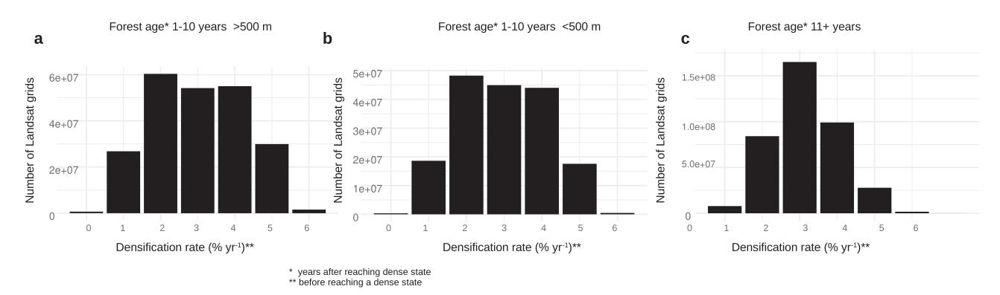

# **communications**\nearth & environment

**ARTICIF** 

Check for updates

1

https://doi.org/10.1038/s43247-023-00923-1

OPEN

# Reforestation policies around 2000 in southern China led to forest densification and expansion in the 2010s

Xiaowei Tong1⊠, Martin Brandt1,2, Yuemin Yue® 1⊠, Xiaoxin Zhang® 2, Rasmus Fensholt® 2, Philippe Ciais® 3, Kelin Wang1, Siyu Liu2, Wenmin Zhang2, Chen Mao1,4 & Martin Rudbeck Jepsen2

Forest expansion has been observed in China over the past decades, but the typically applied coarse resolution satellite data does not reveal spatial details about China's forest transition. By using three decades of satellite observations at a 30-m spatial resolution, we reveal here the complex spatiotemporal patterns of individual forest stands forming the forest return history of southern China. We calculate forest age, forest densification rates, and annual forest fragmentation and show that the observed forest area surge around 2010 is a result of trees planted after 2000 that formed dense forests about a decade later. We document that old forests in the 1980s were mostly fragmented into scattered patches located on mountain tops, but forests rapidly expanded downhill by 729,540 km² and alleviated the clear-cut and logging pressure from old forests. Our study provides a detailed documentation of forest densification and expansion for a country that had been largely deforested three decades ago.

&lt;sup>1 Key Laboratory for Agro-ecological Processes in Subtropical Region, Institute of Subtropical Agriculture, Chinese Academy of Sciences, Changsha, China. 2 Department of Geosciences and Natural Resource Management, University of Copenhagen, Copenhagen, Denmark. 3 Laboratoire des Sciences du Climat et de l'Environnement, CEA/CNRS/UVSQ/Université Paris Saclay, Gif-sur-Yvette, France. 4 University of Chinese Academy of Sciences, Beijing, China. 8 email: tongxiaowei@isa.ac.cn; ymyue@isa.ac.cn

hree decades ago, southern China was almost entirely deforested1, but the region now hosts one of the largest tropical and subtropical forest fractions in the world2,3. This implies that only fractions of primary forests are left and that the vast majority of current forest areas are secondary forests. most of them being planted. A similar forest transition, from deforestation to reforestation, was observed in Europe and USA already in the 19th and 20th centuries4–6 and has recently been documented for Vietnam and China starting in the 1980s6,7. What makes the transition starting in the 80s particularly interesting from a monitoring perspective is that the entire period has been recorded by satellites, starting with deforested landscapes in the early 1980s until today, with large parts of the region covered by forests. Forestation measures in China intensified after the year 2000, with several large-scale tree plantation programs being initialized8-10, either as monoculture plantations or as seminatural forests with a more heterogenous species composition. Several studies have reported a dramatic increase in greenness in the recent decade, which has often been interpreted as either climate-driven or intensified plantation efforts11, both in area and density. However, the spatial resolution of the imagery used in these studies was too coarse to attribute the greening to either densification of existing forests or forest expansion. Therefore, it remains largely unclear if increased plantation activities alone could have caused this phenomenon12 when new forest stands were added to the landscape and whether these new forests are fragmented patches or form larger forest stands.

Satellite instruments, providing coarse spatial resolution satellite images since the early 1980s, have documented the extensive greening of the region, characterizing the transition of a landscape dominated by grass- and croplands into tree cover3,11. This transition happened progressively over the past decades, supposedly by successively creating fractions of forests, however impossible to identify from the use of coarse resolution satellite data. While upscaling from field plots and stand growth modeling provide an overall indication of forest ages for a region as a whole 13,14, this kind of information is often not sufficiently detailed to pinpoint spatial nuances and differences in forestation. It does also not support an in-depth understanding of the history and future potential of forest expansion and densification for areas dominated by mosaics of planted forests. This is because a majority of the tree planting activities in China have been conducted by individual farmers who have replaced their croplands with forests, and this forest patchwork is then managed at the level of individual fields15. This landscape heterogeneity is intensified by large differences in elevation and slope within small areas, which is typical for karst areas dominating southern China10.

Over the past decade, forest stands began converging into larger areas of closed canopies9, but the age structure of the forests remains undocumented because the areas appear as homogeneous forests seen from space. Consequently, information on forest growth, coverage, age, and growth saturation are mostly based on models, coarse spatial resolution satellite data sources, or upscaled from field plots, which includes considerable uncertainty13,16. This is problematic because information on forest age, growth rate, and whether a given forest is a monocultural plantation or a seminatural forest with heterogenous species composition is crucial information for estimates of the potential biodiversity and ecosystem services of the forests, including time-averaged carbon stocks and carbon sequestration potentials 17. This challenge is not only the case for southern China but applies to all areas of heterogeneous landscapes where forest management, such as tree plantations, shifting cultivation, forestry, and restoration, happens at a small scale. Hence, large regions where forests are locally managed are labeled as forestation areas and merged into broad forest age groups, often neglecting the complexity of very

heterogeneous forest structures, amplified by regular harvest and replanting.

To give clear and reliable accounts of forest expansion, densification, age, and consequently on carbon stocks and sequestration potentials in managed forest areas, more detailed monitoring techniques are needed. Medium-resolution images (30 m) have been available over several decades via the Landsat program, but the temporal depth of these data has rarely been applied to estimate the age of individual forest stands in highly heterogeneous plantation landscapes18 and plantations characterized by successive planting and harvesting are generally challenging to map19. This study attempts to overcome this by making use of the long time series of Landsat images to quantify forest area, age, densification rate, and fragmentation changes in southern China between 1986 and 2018 at 30-m spatial resolution to resolve the complex spatiotemporal patterns of forestation in southern China. We train a machine-learning model and create annual forest probability (fp) maps as a proxy for forest density9. These maps are used to analyze the age of forests, their growth rate (densification), as well as the annual degree of forest fragmentation, defined here as the relationship between core and non-core forests20. Generally, emerging forests are detectable at forest probabilities above around 20%. An area is considered a dense forest if the predicted probability surpasses and remains above a certain threshold (50%) until 2018 (Fig. 1a). This generally excludes short-rotation plantations but includes plantations and forestry where tree stands are allowed to grow and create dense canopy covers. We define forest age as the number of years a forest has been in a dense state, and the growth or densification rate is calculated as the mean annual change in forest probability between early-stage forests (fp = 20%) until the forest is dense (fp = 50) (Fig. 1a). Thus, age refers to the number of years a forest has been in a dense state (fp  $\geq$  50%). Using these data, we reconstructed the forestation history of southern China (Fig. 1b), offering another level of detail in our understanding of the underlying mechanisms of the recent pronounced increase in greening and how this relates to forest expansion and densification.

#### Results

Forests expansion in southern China. We observe a continued strong forest expansion (dense forest area) during 1986–2018, with two pronounced peaks in the mid-1990s and around 2010 (Fig. 2a). A gain in forest is here reported when a  $30 \times 30$  m area exceeds the dense forest stage. We find that the forest extent increased from 249,414 km² in 1986 to 491,496 km² in 2003 and 978,954 km² in 2018, which means the area fraction of southern China covered by forest increased from 9 to 35%. We did not observe large contractions or losses of forests, defined as areas where the forest probability falls below 50%. However, the first large forest expansion in the mid-1990s was followed by minor (dense) forest contractions. A similar contraction after the second forest expansion period around 2010 has not yet been observed (Fig. 2a).

Only minor forest areas are older than the satellite records. We then studied the age of the dense forests by counting how many years each forest has been in a dense state (fp  $\geq$  50%) until 2018. We found that only 225,890 km² (23%) of the current forest area contains forests older than our 33-year time series that were present in 1986 and have not been cut until 2018. Only 10,326 km² of these 'old' forests (fp  $\geq$  50% in 1986) have been lost over the past three decades. A total of 32% of the current forests have reached their dense forest stage during the past 10 years (Fig. 2b). A closer look at the age distribution shows a clear spatial diffusion process where new dense forests often expand from remnants of older forests that existed in 1986 (Fig. 2f).

**Fig. 1 Schematic overview of definitions and study area. a** The figure exemplifies our definitions of forest, non-forest, forest age, and densification rate. Forest probability is the output from a Random Forest model and shows how likely an area resembles a dense forest. We set a threshold of 50% to define an area as a dense forest, and the number of years from the year the threshold is crossed until 2018 as the forest age. Note that the area must remain above 50% until 2018 to qualify as a forest. The years before the threshold is crossed are used to calculate the densification rate. It is defined as the mean probability change per year in the period where an area is between a probability of 20% and 50%. If the area falls below 20%, the count is reset. **b** The study area covers the southern provinces in China. Red points reflect training samples from non-forest areas, and green points are training samples from forests

Accelerated densification rate of recent forests. For dense forests, we calculated how fast they reached their dense state. This period is the number of years it takes for a forest to go from fp = 20% to fp = 50%, and the densification rate is the mean annual probability increment with the unit probability % per year. We did not calculate the continued densification rate for dense forests (fp > 50%). The densification rates of different forest age groups (years after reaching a dense state) (Fig. 2c) can be grouped into two different classes: forests that reached a dense state more than 10-11 years ago have a homogeneously slow densification rate, and forests that reached the dense state in the past decade have an almost doubled densification rate, that means they reach the dense state much faster.

The densification rate and period depend on managementrelated factors, including species selection and planting densities, but also on growing conditions, such as soil and climate. We assume that management and climate vary over space and time while site conditions are static. In the following, we investigate which of these conditions could have caused the high densification rates of recent dense forests.

Climate conditions, reflected here by rainfall and temperature21, started being more favorable around 2010–2013, which could contribute to the shorter densification period of recent forests (Figs. 3a and 2c). We further investigated the elevation reflecting site conditions for different forest age groups (Fig. 3b). We find that there is a clear pattern showing that forests that reached the dense state more than 15 years ago were located at higher elevation areas, indicating a progressive forest expansion from mountains into valleys, where we find today the younger dense forests. Although growing conditions in lower elevation areas may be more favorable, our results demonstrate comparable densification rates of recent forests between mountain (Fig. 4a) and valley areas (Fig. 4b).

Our data show that forests that reached the dense stage during the past 10 years are likely the result of plantation programs starting around 2000. When entering a dense stage, they become clearly visible in satellite images, and then their densification rate can be tracked back in time. Although forest expansion rates have recently declined just as swiftly as they increased around 15 years ago (Fig. 2a), younger dense forests reached their dense state almost twice as fast as older dense forests did (Fig. 2c), independent of terrain (Fig. 4a, b), signifying that forests planted after 2000 have a

different species composition as previous forests. This is supported by Fig. 4c, showing that the densification rates of forests that reached a dense state more than 11 years ago were relatively normally distributed across the populations, while there was a clear shift toward fast-growing forests for forests that reached a dense state less than 10 years ago (left skewed distribution), irrespective of elevation (Fig. 4a, b). High densification rates typically suggest fastgrowing plantations, which often have low diversity.

Continued growth of dense forests. We visually studied the continued probability increment of forests after they reached a dense state, that is, after the fp exceeded 50% (Fig. 3c). Here, we find that even earlier formed forests (>33 years) progressively increased in density over the full period. We also find that the increasing forest probability values converge across dense forest age groups toward the end of the time series and almost approach forest probabilities of dense forests that formed more than 33 years ago (upper line in Fig. 3c). This implies that the continued probability increment of forests that reached a dense state in recent years is faster than it was the case for forests that reached a dense state in earlier years, and the same is observed for the densification rate. The increased probability increment during 1995–2005 may be due to favorable climate conditions (Fig. 3a).

This pattern is also reflected in the biomass accumulation of forests, which was obtained by using the ESA CCI Globbiomass dataset22. The data show that biomass density increases with forest age (years after reaching a dense state) up to about 15 years back from 2018 (Fig. 5a). The older dense forests (16–32 years by 2018) have similar levels of biomass and only forests that formed before our time series (33+ years), which includes old forests, had notably higher values. The similar levels of biomass are supported by the forest probability (Fig. 5b), which shows that all forests from 1987 to 2008 reached similar forest probability levels toward 2018

**Reversed fragmentation**. Next, we go beyond analyzing the forest transition and study the spatial distribution of forest expansion and how it contributes to large coherent forest areas and increased landscape connectivity. Forest fragmentation is typically seen as an ecosystem degradation process23,24, but the reverse case, increased

Fig. 2 Forest gain, loss, age, and densification rate over 1986-2018. a Dense forest expansion and contraction per year. b Forest age\*, reflecting the number of years after a forest area reaches a dense state. c Mean densification rates\*\* (the unit is probability in % per year) of different forest age\* groups. d The forest age\* of the entire region in 2018, e same for densification rate\*. Note that older forests existing in 1986 are not shown here. f, g Close-ups on forest age\* in 2018 and densification rate\* for a selected area. \* = years after reaching a dense state. \*\* = before reaching a dense state.

landscape connectivity via restoration, has rarely been shown. Here, we study the connectivity of the forest patches by dividing them into core and non-core forests (only dense forests). Core forests is defined as minimum 9 dense forest grids in a 3 by 3 square at a 30 m resolution, implying a minimum size of 0.9 ha for a core forest. Non-core forests are edges of core forests, as well as island forests (isolated  $30 \times 30$  m grids) in a non-forest matrix. Individual plantations are typically first seen as islands of non-core forest, which, if not regularly harvested and more trees are planted at the edges of the plantation areas, progressively expand into larger coreforest areas.

Our data show that forests in 1986 were mostly scattered patches; core forests covered 93,197 km², but 63% of the forests were noncore forests (Fig. 5c). Out of these non-core forests,  $36,003 \, \text{km}^2$  were unconnected islands ( $30 \times 30 \, \text{m}$ ), the other non-core forests were bridges and edges. Connected core forests started increasing in the mid-1990s but increased massively in the past decade (much more than non-core forests) with a total increase of 517% ( $482,092 \, \text{km}^2$ ). These numbers imply that 84% of the core forests in 2018 are new (i.e., less than three decades). Interestingly, forests that were younger than 10 years in 2018 are rarely core forests (Fig. 5d). The average core forest patch size, which is a connected core forest area, increased from  $0.03 \, \text{km}^2$  in 1986 to  $0.07 \, \text{km}^2$  in 2018 (Fig. 6e), and

the number of core forest patches increased from about 3 million to more than 7 million (Fig. 6f). In 2018, 403,664 km² (41% of the forests) are non-core forests, which are forests with reduced ecological importance. These may be recently converted farmlands or the result of patch-wise forest harvest activities through selective logging or small-scale forestry, but also edges of core forests contribute to this class. Figure 6 illustrates the distribution of existing and new core forests as well as non-core forests in southern China and a close-up example illustrating the progressive forestation of an area between 1986 and 2018.

### **Discussion**

This study has developed a dataset and method for tracking individual forests at an annual scale, which allows us to study the forestation history of southern China. The difference to previous maps is that we provide forest age at a high spatial resolution 13,14,25, which better captures the patchwork from different forest planting programs and individual farmer's land management decisions in the complex karst landscapes. We track the evolution of dense forest areas over time and document how they have quadrupled over three decades, confirming the massive forest expansion found in previous studies2,9,26. Here we go

**Fig. 3 Growing conditions and densification of forests in southern China. a** The PDSI (Palmer drought severity index) uses rainfall and temperature data to estimate positive and negative climate conditions. **b** The distribution of forest age\* from 2018 is shown along the elevation gradient (ASTER GDEM; 30 m). The color shadings reflect the 5, 10, 25, 75, 90, 95th percentiles; the line is the median. **c** Continued annual probability of dense forests that have surpassed the 50% probability threshold is shown for different age classes. The age groups are derived from the year a line crossed a probability of 50%, which is here the starting year. The upper line starting at around 70% fp are all forests older than 1986. \* = years after reaching a dense state.

**Fig. 4 Densification rate\*\*, forest age\*, and elevation. a** Number of Landsat grids (30 × 30 m) having a certain densification rate\*\* (rounded to full numbers) for forests with an age\* of 1-10 years growing above 500 m elevation. **b** Same but for forests below 500 m elevation. **c** Distribution of densification rates\*\* for forests with an age\* of at least 11 years. \* = years after reaching a dense state. \*\* = before reaching a dense state.

beyond the reporting of forest area3 and show that also core forests have sextupled over recent decades. Our maps can also be used to study forest changes and forest age structure at the regional level, revealing that recent planting campaigns are in particular visible in Chongqing, Guizhou, and Hubei provinces (Supplementary Fig. 2), while early planting campaigns from the 1990s are more dominant in Fujian, Zhejiang, Guangxi, and Hunan. Old forests dominate Taiwan, while basically all forests in Shanghai are recently planted.

We found two distinctive waves of dense forest cover increase: one in the 1990s, likely the result of the earlier "greening the barren mountain" program aiming to recover forest mountain tops. Interestingly, this wave of increase was followed by a wave of forest loss. The second wave of forest cover increase manifested as dense forest around 2010, being the driver of the pronounced increase in greening observed in other studies 11. This second wave is the result of forest expansions resulting from plantation activities starting around 2000, which reached a dense state around 2010. The densification rate of the second wave, that is, the growing speed before a forest reaches a dense state, is a magnitude higher than the densification rate of the first wave, and it is relatively homogeneous over the years. These insights contradict previous assumptions that the greening starting around

2010 is attributable to intensified forestation measures or changed policies that took place around 201010 but are the result of previous forest expansion measures, which become visible from satellite imagery approximately a decade after plantation. The question of whether forest expansion or densification caused the pronounced greening after 2010 cannot be answered with one or the other. The forests were planted and thus expanded in the early 2000s, after which they densified over approximately one decade, becoming visible in satellite observations once reaching a dense state. After becoming visible, it was then possible to track back the temporal evolution of the forests, here termed the densification rate of emerging forests. Moreover, after a long dry period in the 2000s, climate conditions were more favorable over the past decade, likely contributing to the increased densification rate.

Our study shakes several widely accepted assumptions represented by an expectation of a uni-directional interaction between humans and forest resources. First, previous studies have shown that human influence has increasingly caused the removal of forests, leaving forests to steep terrain and mountain tops in large parts of the world27,28; here the opposite is observed to be the case with forests expanding progressively down the mountains into valleys and flat areas (Figs. 3c and 4, Supplementary Fig. 1). Second, it has also been shown that small forest areas and remnants of old forests are

**Fig. 5 Biomass and forest fragmentation related to forest age\*. a** Biomass from ESA CCI Globbiomass (from 2018) and associated standard deviations for different forest age\* groups from 2018. **b** Average forest probability for different forest ages from 2018. **c** Forests split into core (gray) and non-core forests (black) and the annual distribution of both classes. **d** The ratio between core and non-core forests for different forest ages\*. \* = years after reaching a dense state. **e** The average size of core forest patches is shown for each year. A patch is defined as a connected core forest area. **f** The number of core forest patches. \* = years after reaching a dense state.

increasingly lost29; here we show that new forests expand around 'old' forests (here defined as dense forests that formed before 1986) and only small areas of 'old' forests are lost over three decades. On the contrary, we observe increased densification of 'old' forests (upper line in Fig. 3c), likely because new forests serve as buffer zones around 'old' forests (Supplementary Fig. 1) serving as a primary source for logging, thereby alleviating the pressure from woody resource exploitation in 'old' forests. Moreover, with millions of people migrating from rural areas into cities, human pressure is strongly declining8. Third, several studies find globally increasing forest fragmentation23,24, destroying habitats and biodiversity; here, the opposite is the case, and we show that forest expansion connects previously disconnected patches leading to a massive increase in core forests (Fig. 5c).

Nevertheless, China's 'new' forests are the result of human management, and the homogeneous and rapid growing speed is an indication of low woody plant diversity. For being a stable carbon sink, biodiversity should be kept high and harvest low30. Also, the forest transition in Europe generated a forest landscape with a relatively low diversity, which becomes problematic in times of climate change31,32, where droughts and insects threaten forest stands. Also, in China, climate can have positive or negative effects on forest growth33,34, and the coming years will show how sustainable, resistant, and resilient China's new forests are.

#### Methods

**Concept.** This study aims at creating temporally stable long time series of forest dynamics in southern China using the entire Landsat archive. We use a Random Forest regression model with two classes, validated with field plots and sub-meter GF satellite data to estimate the "forest probability" (fp): a high probability implies the area comes close to the training data of the dense forest class, a low probability implies it comes close to the training data of the non-forest class. If an area crosses a uniform probability threshold (fp 50%), it can be considered a forest (termed here "dense state"); if it remains above this threshold until 2018, the number of years after crossing the threshold until 2018 is the forest age; the speed in probability increase per year between 20 and 50% is the densification rate (Fig. 1).

Landsat data. We make use of the entire Landsat 5/7/8 archive available in Google Earth Engine ranging from 1986 to 2020, which provides atmospherically corrected surface reflectance images. For each image, we used the quality assurance band to identify and remove the bad-quality observations caused by clouds and snow/ice. Previous studies have shown that the temporal depth of the archive is sufficient for time series analyses over this period35, but southern China is a very cloudy region, and we had to form annual median images and, in addition, use a 3-year moving median to reduce noise9, which shortened the study period to 1986–2018. In addition to the six bands, we calculated two widely used vegetation indices (NDVI and NBR) for each year. The annual composites were then downloaded.

**Modeling forest probability.** A total of 15,991 training pixels  $(30 \times 30 \text{ m})$  were selected in dense forests and 158,728 pixels in non-forest areas across southern China. To identify dense forests, we made use of national forest inventory data from 2014 to 2018, 10,000+ high-resolution satellite images from GF-1 (2 m resolution) and GF-2 (80 cm resolution) images, and the time slide function Google

**Fig. 6 Forest fragmentation during 1986–2018.** The map shows the distribution of new and existing core forests, as well as non-core forests. The close-up figures show how core and non-core forests changed for an example area for three selected years. A core forest is defined as an area that is surrounded by at least 30 m of forest.

Earth to ensure that forests in the training samples existed as dense forest over the full period. Training samples were distributed over the full time range of Landsat images, making sure that the model performs robustly over the different Landsat sensors. When selecting the training samples in historic images, we verified the existence of forests using the Google Earth time slide function. We then trained a Random Forest model using all Landsat bands, NDVI and NBR, and a digital elevation model (ASTER GDEM v3; 30 m) to predict the probability for each  $30 \times 30$  m pixel if it belongs to the forest class (fp = 100%) or the non-forest class (fp = 0%). The accuracy was assessed using a bootstrapping procedure that randomly holds back 25% of the samples which are not used for training but only for calculating the accuracy values: the overall accuracy was 98% (Kappa 93%); the true positive rate was 90.4%, the true negative rate 8.6%; the false negative rate 0.6% and the false positive rate 0.4%. The model was applied each year, predicting the forest probability for each 30 × 30 m pixel. Previous work has shown that this forest probability is highly correlated with tree cover, and annual probability maps can be used to track the densification of forests over time9. The forest probability ranges from 0 to 100%, and we defined that a pixel with a probability larger or equal to 50% can be considered a "dense forest", following ref. 9. Pixels with a forest probability between 20 and 50% were considered as emerging forest, and their increase in probability per year was defined as densification rate in % yr-1

Since the probability output of the Random Forest model was used to estimate forest growth, it could not be applied to assess the classification uncertainty. Instead, we used forest inventory data from 167 plots (13 m radius; 2015) in Guangxi to calculate the agreement showing if an area identified as dense forest by our classification (fp  $\geq$  50%) was also identified as forest (measured canopy cover > 10%) during the field campaign. The results show that 88% of the dense forests in our classification were also marked as forest in the field data.

**Deriving forest age and densification rate**. Our method is very sensitive to noise and disturbances; for example, the densification rate calculation requires a continuous increase without drop, and the forest age calculation requires the probability to remain above 50% for all years after the threshold has been reached. It was thus necessary to remove short-term drops resulting from noise, data quality, and small disturbances from the time series but keep large disturbances, such as harvest, that have a footprint of several years. We thus applied a polynomial fitting to the forest probability time series, in addition to the annual median and 3-year moving median that was applied to the raw Landsat time series.

After a pixel has crossed the 50% forest probability threshold and it is classified as forest, it must remain above this threshold. We then count the number of years after it crossed the 50% forest probability threshold until 2018, which we define as forest age. We estimate the "plantation year" as the year when a pixel crosses 20% forest probability and remains above this threshold, continuously increasing up to 50%. Note that the term "plantation year" may be misleading, as it can also imply

that a forest recovers from a natural or anthropogenic disturbance, such as drought or harvest, and the crossing of a forest probability threshold implies that certain tree structures are visible, which is not the case directly after a plantation. The speed at which an emerging forest grows between the 20 and 50% thresholds is the densification rate; the unit is the probability change per year.

Our definition of forest age is derived from the year a forest stand reaches a dense stage. A forest that meets our definition has, on average, already accumulated around 60 (±37) Mg biomass per hectare (Fig. 6a), according to the biomass map from ref. 22. (for comparison purposes, our maps were aggregated to 100 m by averaging the results). This does not exclude that the real plantation year is earlier. In other words, a forest with an age of 5 years in 2018 could have been planted 20 years ago but only reached a dense state 5 years prior to 2018 due to unfavorable growing conditions. Although we do estimate the "plantation year" using a low threshold value, the confidence in the date when reaching a dense state is much higher, as lower probability values may be noisy and clear dates are difficult to determine. These definitions imply that areas we map as forests are closed canopy forests, and newly planted or recently harvested forests are mostly not included. Forest plantations that are regularly harvested, such as Eucalyptus and rubber, are typically not included, as they do not reach or maintain high probability values. While this approach has high reliability on the mapped forests, it may underestimate the actual extent by excluding young forests.

**Forest fragmentation**. We used MSPA, a morphological segmentation approach, on the binary annual forest/no-forest maps20. The method segments forest pixels into two major classes: core forest and non-core forest. Core forests require to be surrounded by at least 30 m of forests from all sides; the remaining pixels are non-core forests. These non-core forests can be divided into many subclasses, such as island, bridge, edge20. The ecological meaning of both classes varies with a large range of interpretations. The method has been successfully applied to study forestation programs in China, however, at a 250 m resolution36.

## **Data availability**

The data produced in this study is available at https://doi.org/10.5281/zenodo.804624937. See https://xiaoxinz1214.users.earthengine.app/view/forestchangesouthernchina for online visualization.

#### Code availability

The study did not generate custom codes but made use of standard packages in Google Earth Engine, R, Python, and GRASS GIS (https://grass.osgeo.org). MSPA codes are freely available at https://forest.jrc.ec.europa.eu/en/activities/lpa/mspa/.

Received: 14 February 2023; Accepted: 4 July 2023; Published online: 18 July 2023

#### References

- Zhang, D. China's forest expansion in the last three plus decades: why and how? For. Policy Econ. 98, 75–81 (2019).
- Yu, Z. et al. Forest expansion dominates China's land carbon sink since 1980. Nat. Commun. 13, 5374 (2022).
- Song, X.-P. et al. Global land change from 1982 to 2016. Nature 560, 639–643 (2018).
- Mather, A. The transition from deforestation to reforestation in Europe. *Agricultural Technologies and Tropical Deforestation*, 35–52 (CAB International, 2001).
- Infante-Amate, J. et al. From woodfuel to industrial wood: a socio-metabolic reading of the forest transition in Spain (1860–2010). Ecol. Econ. 201, 107548 (2022).
- Kauppi, P. E. et al. Returning forests analyzed with the forest identity. Proc. Natl Acad. Sci. USA 103, 17574–17579 (2006).
- Meyfroidt, P. & Eric, F. L. Forest transition in Vietnam and its environmental impacts. Glob. Change Biol. 14, 1319–1336 (2008).
- Zhang, X. et al. A large but transient carbon sink from urbanization and rural depopulation in China. Nat. Sustain. 5, 321–328 (2022).
- 9. Tong, X. et al. Forest management in southern China generates short term extensive carbon sequestration. *Nat. Commun.* 11, 129 (2020).
- Tong, X. et al. Increased vegetation growth and carbon stock in China karst via ecological engineering. Nat. Sustain. 1, 44–50 (2018).
- Chen, C. et al. China and India lead in greening of the world through land-use management. Nat. Sustain. 2, 122–129 (2019).
- Wang, J. et al. Large Chinese land carbon sink estimated from atmospheric carbon dioxide data. Nature 586, 720–723 (2020).
- Zhang, Y. et al. Mapping spatial distribution of forest age in China. Earth Space Sci. 4, 108–116 (2017).
- Besnard, S. et al. Mapping global forest age from forest inventories, biomass and climate data. Earth Syst. Sci. Data 13, 4881–4896 (2021).
- Gutiérrez Rodríguez,, L. et al. China's conversion of cropland to forest program: a systematic review of the environmental and socioeconomic effects. *Environ. Evid.* 5, 1–22 (2016).
- Yu, Z. et al. Mapping forest type and age in China's plantations. Sci. Total Environ. 744, 140790 (2020).
- Xu, B. et al. Biomass carbon stocks in China's forests between 2000 and 2050: a prediction based on forest biomass-age relationships. Sci. China Life Sci. 53, 776–783 (2010).
- Ma, S. et al. Identification of forest disturbance and estimation of forest age in subtropical mountainous areas based on Landsat time series data. *Earth Sci. Inform.* 15, 321–334 (2022).
- Erb, K. H. et al. Land management: data availability and process understanding for global change studies. *Glob. Change Biol.* 23, 512–533 (2017).
- Soille, P. & Peter, V. Morphological segmentation of binary patterns. *Pattern Recognit. Lett.* 30, 456–459 (2009).
- Zhao, T. & Dai, A. The magnitude and causes of global drought changes in the twenty-first century under a low-moderate emissions scenario. *J. Clim.* 28, 4490–4512 (2015).
- Santoro, M. & Cartus, O. ESA Biomass Climate Change Initiative (Biomass\_cci): Global Datasets of Forest Above-Ground Biomass for the Years 2010, 2017 and 2018, v2 (Centre for Environmental Data Analysis, 2021).
- 23. Brinck, K. et al. High resolution analysis of tropical forest fragmentation and its impact on the global carbon cycle. *Nat. Commun.* **8**, 14855 (2017).
- 24. Fischer, R. et al. Accelerated forest fragmentation leads to critical increase in tropical forest edge area. *Sci. Adv. 7*, eabg7012 (2021).
- Zhang, C. et al. Mapping forest stand age in China using remotely sensed forest height and observation data. J. Geophys. Res. Biogeosci. 119, 1163–1179 (2014)
- Cheng, K. et al. Mapping China's planted forests using high resolution imagery and massive amounts of crowdsourced samples. ISPRS J. Photogramm. Remote Sens. 196, 356–371 (2023).
- Sandel, B. & Svenning, J.-C. Human impacts drive a global topographic signature in tree cover. *Nat. Commun.* 4, 2474 (2013).
- Yang, C. et al. Human expansion into Asian highlands in the 21st century and its effects. Nat. Commun. 13, 4955 (2022).

- Riva, F. et al. Loss of the world's smallest forests. Glob. Change Biol. 28, 7164–7166 (2022).
- Mills, M. B. et al. Tropical forests post-logging are a persistent net carbon source to the atmosphere. Proc. Natl Acad. Sci. USA 120, e2214462120 (2023).
- 31. George, J.-P. et al. Long-term forest monitoring reveals constant mortality rise in European forests. *Plant Biol.* **24**, 1108–1119 (2022).
- Obladen, N. et al. Tree mortality of European beech and Norway spruce induced by 2018-2019 hot droughts in central Germany. *Agric. For. Meteorol.* 307, 108482 (2021).
- Yang, R.-Q. et al. Growth-climate sensitivity of two pine species shows species-specific changes along temperature and moisture gradients in southwest China. Agric. For. Meteorol. 318, 108907 (2022).
- Fang, J. et al. Climate change, human impacts, and carbon sequestration in China. Proc. Natl Acad. Sci. USA 115, 4015–4020 (2018).
- 35. Liu, Z. et al. Forest disturbance decreased in China from 1986 to 2020 despite regional variations. *Commun. Earth Environ.* **4**, 15 (2023).
- Wang, Y. et al. Do afforestation projects increase core forests? Evidence from the Chinese Loess Plateau. Ecol. Indic. 117, 106558 (2020).
- Tong, X., & Brandt, M. Forest cover, age and densification rate for southern China at 30 m resolution. Zenodo https://doi.org/10.5281/zenodo.8046249.

#### **Acknowledgements**

This work was funded by the National Key Research and Development Program of China (2022YFF1300701), National Natural Science Fund for Excellent Young Scientists (Overseas), European Research Council (ERC) under the European Union's Horizon 2020 Research and Innovation Programme (grant agreement no. 947757 TOFDRY), DFF Sapere Aude (grant no. 9064–00049B), International Partnership Program of Chinese Academy of Sciences (092GJHZ2022029GC) and CAS Interdisciplinary Team (JCTD-2021-16). R.F. acknowledges support by the Villum Fonden through the project Deep Learning and Remote Sensing for Unlocking Global Ecosystem Resource Dynamics (DeReEco).

#### **Author contributions**

X.T. and M.B. designed the study. X.T. conducted the analyses, supported by X.Z., M.B., S.L., W.Z., and C.M. M.B. designed the figures. The manuscript was prepared by M.B. and X.T., supported by R.F., P.C., M.J., Y.Y., and K.W.

#### **Competing interests**

The authors declare no competing interests.

#### **Additional information**

 $\label{eq:Supplementary information} Supplementary information The online version contains supplementary material available at <a href="https://doi.org/10.1038/s43247-023-00923-1">https://doi.org/10.1038/s43247-023-00923-1</a>.$ 

Correspondence and requests for materials should be addressed to Xiaowei Tong or Yuemin Yue.

Peer review information Communications Earth & Environment thanks Daowei Zhang and the other anonymous reviewer(s) for their contribution to the peer review of this work. Primary handling editor: Aliénor Lavergne. A peer review file is available.

Reprints and permission information is available at http://www.nature.com/reprints

**Publisher's note** Springer Nature remains neutral with regard to jurisdictional claims in published maps and institutional affiliations.

**Open Access** This article is licensed under a Creative Commons Attribution 4.0 International License, which permits use, sharing,

adaptation, distribution and reproduction in any medium or format, as long as you give appropriate credit to the original author(s) and the source, provide a link to the Creative Commons license, and indicate if changes were made. The images or other third party material in this article are included in the article's Creative Commons license, unless indicated otherwise in a credit line to the material. If material is not included in the article's Creative Commons license and your intended use is not permitted by statutory regulation or exceeds the permitted use, you will need to obtain permission directly from the copyright holder. To view a copy of this license, visit <a href="http://creativecommons.org/licenses/by/4.0/">http://creativecommons.org/licenses/by/4.0/</a>.

© The Author(s) 2023