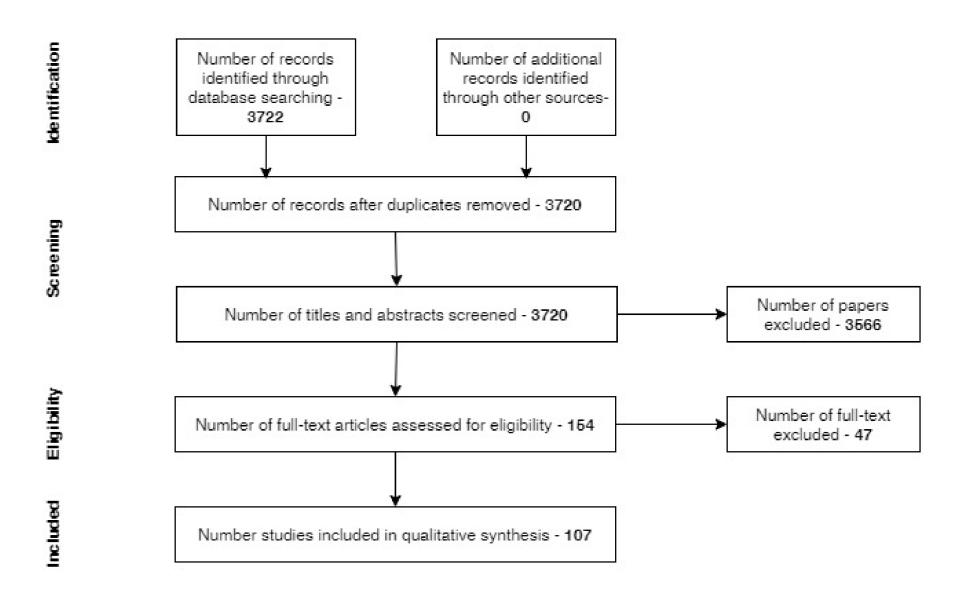

Systematic Review

# The Role of Remote Sensing for the Assessment and Monitoring of Forest Health: A Systematic Evidence Synthesis

Pablo Torres 1,2,\*, Marina Rodes-Blanco 2, Alba Viana-Soto 2, Hector Nieto 1,0 and Mariano García 2,0

- COMPLUTIG—Complutum Tecnologías de la Información Geográfica SL, 28801 Alcalá de Henares, Spain; hector.nieto@complutig.com
- Universidad de Alcalá, Departamento de Geología, Geografía y Medio Ambiente, Environmental Remote Sensing Research Group, Calle Colegios 2, 28801 Alcalá de Henares, Spain; marina.rodes@uah.es (M.R.-B.); alba.viana@uah.es (A.V.-S.); mariano.garcia@uah.es (M.G.)
- \* Correspondence: pablo.torres@complutig.com

Abstract: Forests are increasingly subject to a number of disturbances that can adversely influence their health. Remote sensing offers an efficient alternative for assessing and monitoring forest health. A myriad of methods based upon remotely sensed data have been developed, tailored to the different definitions of forest health considered, and covering a broad range of spatial and temporal scales. The purpose of this review paper is to identify and analyse studies that addressed forest health issues applying remote sensing techniques, in addition to studying the methodological wealth present in these papers. For this matter, we applied the PRISMA protocol to seek and select studies of our interest and subsequently analyse the information contained within them. A final set of 107 journal papers published between 2015 and 2020 was selected for evaluation according to our filter criteria and 20 selected variables. Subsequently, we pair-wise exhaustively read the journal articles and extracted and analysed the information on the variables. We found that (1) the number of papers addressing this issue have consistently increased, (2) that most of the studies placed their study area in North America and Europe and (3) that satellite-borne multispectral sensors are the most commonly used technology, especially from Landsat mission. Finally, most of the studies focused on evaluating the impact of a specific stress or disturbance factor, whereas only a small number of studies approached forest health from an early warning perspective.

Keywords: forest health; remote sensing; PRISMA; review

Citation: Torres, P.; Rodes-Blanco, M.; Viana-Soto, A.; Nieto, H.; García, M. The Role of Remote Sensing for the Assessment and Monitoring of Forest Health: A Systematic Evidence Synthesis. *Forests* **2021**, *12*, 1134. https://doi.org/10.3390/f12081134

Academic Editors: Gillian Petrokofsky and Sini Savilaakso

Received: 10 June 2021 Accepted: 13 August 2021 Published: 23 August 2021

**Publisher's Note:** MDPI stays neutral with regard to jurisdictional claims in published maps and institutional affiliations.

Copyright: © 2021 by the authors. Licensee MDPI, Basel, Switzerland. This article is an open access article distributed under the terms and conditions of the Creative Commons Attribution (CC BY) license (https://creativecommons.org/licenses/by/4.0/).

# 1. Introduction

Forests are complex ecosystems distributed around the globe, covering approximately 31% of Earth's land surface [1]. Such complexity is due to the wide range of climates that forests occupy as well as their typical structural heterogeneity. Forests encompass not just physical and biological components but also the processes and interactions between them. They provide many ecosystem services, such as habitat, raw materials, chemicals, water and scenic beauty, among others [2]. This makes them an invaluable asset for their importance to maintaining biodiversity and mitigating climate change, as well as for their importance to cultural heritage and socio-economic development. Despite these facts, forests are globally affected by different factors, either natural or anthropogenic, that can lead to different grades of forest decline, widely observed around the globe [3–6]. Within the group of natural factors that lead to forest decline, we find a wide variety of elements such as plagues, droughts or nutrient unavailability [7–9]. These factors have always been present, so species and communities have evolved or developed different mechanisms to mitigate them or to recover after these events. There is also a broad range of humancaused stress factors, particularly those derived from global climate change [10]. The importance of human-caused stress factors is due to the speed of the produced changes compared with natural dynamics, their spatial extent and, most of all, the increase in

Forests **2021**, 12, 1134 2 of 35

the magnitude of natural events caused by anthropogenic influence upon climate change. Climate change predictions foresee a global rise in temperatures, changes in precipitation patterns, an increase in extreme weather events and a series of unpredictable changes in climate trends that will put at risk the global health of forests. These climate changes also have the potential of interacting with natural pest dynamics, modifying them in a way that is difficult to predict.

There is not just one definition of forest health because the complexity of the matter, but many authors have addressed this issue from different approaches [10–12]. Amongst them, utilitarian-ecological points of view [13] and the ability of forests to adapt to changes in the environment [14] stand out. This methodological wealth has led to a wide range of monitoring programmes at different levels, from local to international networks. One of the most extensive long-term programmes is the International Co-operative Programme on Assessment and Monitoring of Air Pollution Effects on Forests (ICP Forests), in operation since 1985. Nowadays more than 40 countries are involved. This programme has two main objectives: (1) to provide a periodic general perspective on the variation of forests conditions and (2) to gain knowledge of the cause-effect between forest conditions and stress factors, both natural and anthropogenic, through ongoing monitoring [15]. To achieve its goals, this programme has set a plot network where forest health is analysed on a field-data-gathering basis. Despite the good quality and large amount of data, fieldsampling methods have some serious limitations in projects of this scope, such as the great involvement of manpower, monetary and time resources, as well as the difficulty of representing spatial variability and heterogeneity.

The broad range of capabilities of remote sensing technologies and the possibility of assessing health at an early stage [16–18] make remote sensing an excellent choice for assessing forest status both spatially and temporally at low cost [19]. This wide variety of strengths, along with the broadness of the concept of forest health, have led to a wide diversity of studies from a methodological perspective. Some authors have previously reviewed the use of remote sensing in the field of forestry [20,21] or even focused on forest health [12,22-27]. The approaches are varied, most of time focusing on specific attributes related to forest health or, as in the case of Lausch et al. [12,26,27], analysing in a comprehensive way the different aspects of remote sensing applied to forest health. Reviews of previous studies are very useful for the scientific community to support decisionmaking. Nevertheless, previous approaches to literature review may be subjective and biased towards specific aspects of the analysed topic, such as focusing on some particular species or functional type or reviewing just part of the methodological spectrum. For instance, Pause et al. [25] aimed their review at the integration of in situ and remote sensing data to assess forest health. Likewise, despite the comprehensive review by Lausch et al. [12], lesser attention was paid to the multitemporal component of forest health. The significant increase in papers related to forest health applications of remote sensing since the last published review in 2018 [27], together with the advances in platforms and sensors launched since then, makes it necessary to update the current state of the art. Systematic reviews, which were originally developed in the field of medicine and human health, provide methods and guidelines for a systematic search of literature, with the aim of including all relevant studies on a particular topic and summarizing their information [28]. These methods lead to a decrease in selection bias; as such, Preferred Reporting Items for Systematic Reviews and Meta-Analyses (PRISMA), an update of the QUORUM Statement, consists of a methodology for developing systematic reviews in the field of human health, composed of a 27-item list divided in four different phases [29]. The objectives of this review are (1) to identify papers published from 2015 to 2020 that studied forest health with remote sensing techniques, (2) to analyse the different methodological approaches to this topic and (3) to quantify the role of different remote sensing technologies addressing forest health issues. To date, no PRISMA methodology has been applied to reviewing the current literature of remote sensing of forest health. Using PRISMA methodology in this

Forests **2021**, 12, 1134 3 of 35

paper affords us a good opportunity to evaluate the state of the art in the last six years (from 2015 to 2020) of the use of remote sensing technologies in the field of forest health.

#### 2. Materials and Methods

This review was conducted following the PRISMA protocol. To perform the review according to PRISMA, we included original journal articles that explored forest health based on remote sensing techniques. These papers had to meet the following eligibility criteria: (1) study forest health from tree to stand scale; (2) only studies of strictly terrestrial forest were selected; (3) among studies of tree–grass biomes, such as savannah, only those studies focusing on tree canopy were included; (4) all studies must focus on actual forest health issues, so those using only simulations were also discarded.

Web of Science was selected as the information source. It was accessed on 15 March 2021 and 30 July 2021 to obtain all the studies included in this review. We used the following keyword chain to carry out the query: "((remote sensing) OR (proximal sensing)) AND (forest OR vegetation OR tree OR woodland) AND (health OR decline OR dieback OR stress OR mortality)". We also applied language and date filters to obtain only articles published in English between 1 January 2015 and 31 December 2020. English language was chosen as it is considered the language of science. Despite some authors recommend not to exclude papers due to language constraints, this criterion could help to include only papers truly accessible to the whole scientific community.

After gathering the journal articles, duplicates were removed, and then titles and abstracts were screened to exclude previous reviews and those articles that did not meet the eligibility criteria defined above. To assure that all papers met the eligibility criteria this phase, each paper was assessed independently by two screeners. They verified point by point the agreement of each record with the criteria and excluded works not in compliance with all of them. As the criteria was clear and concise, just a few disagreements emerged. In those particular cases, both screeners checked together the matching points between the paper and the criteria until agreement.

In this step, we discarded a few articles studying forest health at leaf scale or referring to species community engagement due to disagreement with eligibility criterion (1), several papers studying mangroves (eligibility criterion (2)) and some papers simulating forest health issues (eligibility criterion (3)). The next step was a full reading of the remaining studies to assess them for eligibility and filtering. After that, the remaining papers were finally included in our study.

Once we obtained all the papers to include in the review, we elaborated a list of variables to extract from each study (Table 1). Variables were selected to represent information structured by the location and ecological aspects of the studies (spatial scale, functional type, biome and geographic region), remote sensing technology used (technology, sensor type, platform and/or satellite programme) and applied methodologies (health parameter, early warning, analysis type, analysis unit, classification/regression, statistical method, machine learning and machine learning method, physically based modelling, validation and time series analysis). The spatial scale was defined according to the extent of the study area of each paper. Local scale was set as a small study area with specific characteristics of the location; regional scale comprised broader areas comprising one or several common biomes; continental scale was chosen when the study areas closely matched with some of the geographical regions. These variables tried to represent in a broad manner the possibility of techniques and methods developed to study forest health. Every article was read extensively and information was extracted to a table according to the target variables. Each paper was independently reviewed by two of the authors to avoid inconsistencies between the extracted data. The tables were compared, and disagreements were discussed and resolved by the reviewers involved. Subsequently, the extracted data were analysed using RStudio software with customized scripts in order to obtain the results and to represent them. Data analysis focused on describing the frequency of the different elements

Forests **2021**, 12, 1134 4 of 35

within each variable. No attempt was done to evaluate the quality of the different papers evaluated, i.e., no critical appraisal was done.

Although critical appraisal is strongly recommended for systematic reviews [30], it is not necessary for systematic maps, which is what our systematic evidence synthesis is.

**Table 1.** Summary of the variables extracted from the analysed papers.

| Variable                   | Extracted Data                          |
|----------------------------|-----------------------------------------|
| Year                       | Year of publication                     |
| Spatial scale              | Local, Regional or Continental          |
| Functional type            | Conifer, Broadleaf or Mixed             |
| Biome                      | Biomes according to Olson [31]          |
| Geographic region          | Name of the geographic region           |
| Technology                 | Remote sensing technology used          |
| Sensor type                | Passive, Active or Both                 |
| Platform                   | Satellite, Airborne, Terrestrial or UAV |
| Satellite programme        | Name of the programme                   |
| Health parameter           | Parameter used to study health          |
| Early warning              | Yes or No                               |
| Analysis type              | Quantitative or Qualitative             |
| Analysis unit              | Object, Pixel or Subpixel               |
| Classification/Regression  | Classification or Regression            |
| Statistical method         | Parametric, Nonparametric or Both       |
| Machine learning           | Yes or No                               |
| Machine learning method    | Method used                             |
| Physically based modelling | Yes or No                               |
| Validation                 | Yes or No                               |
| Time series analysis       | Yes or No                               |

#### 3. Results

## 3.1. Selected Papers

From the 3722 papers returned by the query in Web of Science, the subsequent analysis of the title and abstract resulted in the exclusion of 3566 papers, 54 of them due to being previous reviews. Finally, another 47 papers were discarded due to a lack of compliance with the eligibility criteria. Therefore, 107 articles were finally analysed in our study. Figure 1 shows a flowchart of the query process followed.

Figure 1. PRISMA flow diagram.

Forests **2021**, 12, 1134 5 of 35

After selecting the articles to analyse, all of them were extensively read. The information from the selected variables was extracted and included in Appendix A, Table A1.

The analysis of the number of papers published by year tended to increase in the 6-year period of study, with a minimum of 11 papers in 2016 and a maximum of 24 in 2019. For 2020, the number of papers was 22, suggesting a sustained rate of papers in the last year (Figure 2).

Figure 2. Number of published papers during the period included in the review.

#### 3.2. Location and Ecological Aspects

The studies included in this review, assessed forest health at different spatial scales. The vast majority of the studies (77.6%) were carried out at a local scale, followed by the regional scale (19.6%), whereas 2.8% of the studies considered the continental scale. Regarding the location of the studies, an even distribution is observed between North America (29.9%) and Europe (29%), followed by Asia (22.4%). The remaining studies were carried out in Oceania (10.3%), South America (9.3%) and Africa (1.9%). Moreover, there were two studies encompassing more than one geographic region: North America and South America [32] and Europe, Asia and Africa [33] (Table 2).

The third variable analysed considered the biome evaluated. Temperate broadleaf and mixed forests stood out as the most studied biome, with 35.5% of the studies carried out in this biome, followed by Mediterranean (19.6%), tropical and subtropical moist broadleaf (13.1%) and temperate needle forests (12.1%). The remaining types of biomes were studied to a much lesser extent, none of them reaching more than 10% of the studies. Regarding the functional type studied, broadleaf forests were the most analysed (41.1%), followed by conifer forests (40.2%), with the health of mixed forest being the least evaluated (18.7%) (Table 2). While in North America and Europe conifer was the most studied functional type (75% and 77%, respectively), in Asia, South America and Oceania, broadleaf was the most studied (58.3%, 70% and 72.7%, respectively). Europe, Asia and Oceania also stood out as the geographical regions where local scale studies were developed to a higher degree (90% of the studies in Europe, 87.5% in Asia and 90.9% in Oceania).

Forests **2021**, 12, 1134 6 of 35

| Table 2. Results of parameters related to the location and ecological aspects of the papers, including scale, continent | , |
|-------------------------------------------------------------------------------------------------------------------------|---|
| functional type and biome.                                                                                              |   |

| Scale       | Total                                          | %           | Geographic Region           | Total        | %            | Functional Type | Total | %    |  |
|-------------|------------------------------------------------|-------------|-----------------------------|--------------|--------------|-----------------|-------|------|--|
| Local       | 83                                             | 77.6        | North America               | 32           | 29.9         | Broadleaf       | 44    | 41.1 |  |
| Regional    | 21                                             | 19.6        | Europe                      | 31           | 29           | Conifer         | 43    | 40.2 |  |
| Continental | 3                                              | 2.8         | Asia                        | 24           | 22.4         | Both            | 20    | 18.7 |  |
|             |                                                |             | Oceania                     | 11           | 10.8         |                 |       |      |  |
|             |                                                |             | South America               | 10           | 9.35         |                 |       |      |  |
|             |                                                |             | Africa                      | 2            | 1.9          |                 |       |      |  |
|             |                                                |             | Biome                       |              |              |                 | Total | %    |  |
|             |                                                | Ter         | nperate broadleaf and mix   | ed forests   |              |                 | 38    | 35.5 |  |
|             | Medit                                          | erranean fo | orests, woodlands and scru  | b or sclerop | hyll forests | <b>;</b>        | 21    | 19.6 |  |
|             |                                                |             | l and subtropical moist bro |              |              |                 | 14    | 13.1 |  |
|             |                                                | •           | Temperate coniferous for    |              |              |                 | 13    | 12.1 |  |
|             |                                                |             | Several                     |              |              |                 | 9     | 8.4  |  |
|             |                                                | Temper      | ate grasslands, savannas ai | nd shrublan  | ds           |                 | 4     | 3.7  |  |
|             | Tropical and subtropical dry broadleaf forests |             |                             |              |              |                 |       |      |  |
|             | 3                                              | 2.8         |                             |              |              |                 |       |      |  |
|             |                                                |             | Boreal forests/taiga        |              |              |                 | 2     | 1.7  |  |

#### 3.3. Remote Sensing

Our analysis included the following variables concerning remote sensing science and technology: platform, technology and programme. Results show that 72.9% studies used satellite data, 22.4% used airborne manned platforms, 10.3% used unmanned aerial vehicles (UAV) and 4.7% used terrestrial platforms (Table 3). Furthermore, the vast majority of the studies (91.6%) were based on a single platform, 7.5% included two platforms and only 0.9% used three different platforms.

**Table 3.** Platforms where the sensors were placed.

| Platform                       | Total | %    |
|--------------------------------|-------|------|
| Satellite                      | 70    | 65.4 |
| Airborne                       | 18    | 16.8 |
| UAV                            | 7     | 6.5  |
| Airborne and Satellite         | 4     | 3.7  |
| Terrestrial                    | 3     | 2.8  |
| Satellite and UAV              | 2     | 1.9  |
| UAV and Airborne               | 1     | 0.9  |
| Satellite and Terrestrial      | 1     | 0.9  |
| Airborne and UAV and Satellite | 1     | 0.9  |

With regard to the technology used, passive sensors were indisputably the most widely used technology, with 85% of the studies using them, whereas active sensors were used alone just 4.7% of the time. The remaining 10.3% combined both types of sensors (Figure 3a). More specifically, multispectral data were used in 88 studies, either alone or in combination with other sensors, while LiDAR was used in 15 studies, hyperspectral in 16, thermal in 3 and radar and microwaves in 1 study each (Figure 3a,b).

As previously stated, most sensors used were on board satellite platforms. The most frequently used imagery corresponded to the US programmes Landsat (51.3%) and Terra/Aqua (26.9%), followed by the European Copernicus programme (16.7%) (Figure 3c). Following these programmes appeared commercial satellites (Worldview, Digital Globe) with very high spatial resolution capabilities. Finally, 17.9% of the papers used data from different programmes (Figure 3d).

No apparent differences on the usage of different remote sensing technologies among different functional types were found. On the contrary, multispectral technology was the

Forests **2021**, 12, 1134 7 of 35

most employed among all biomes (82.2% of the studies), but in the cases of temperate coniferous forests and desert and xeric shrublands, it was used in 100% of their studies (13 and 3 papers, respectively).

**Figure 3.** Summary of result related to remote sensing technologies, including: (a) type of remote sensing technologies, (b) number of different remote sensing technologies included in every study, (c) satellite programme and (d) number of different satellite programmes included in every study.

## 3.4. Applied Methodologies

Due to "forest health" being an open concept, we flagged different health parameters analysed in the different studies. Moreover, most of the studies analysed a single health parameter (66.6%), but some analysed forest health based on several parameters, such as the case of Tane [34], who tried to detect conifer mortality under drought and beetle infestation (Figure 4). The use of the different health parameters among the different

Forests **2021**, 12, 1134 8 of 35

biomes appears to be generally well distributed, with the exception of the use of stress and plague in tropical and subtropical moist broadleaf forests, temperate coniferous forests and tropical and subtropical dry broadleaf forests. In these biomes, stress and plague parameters were used in the 71.4%, 84.6% and 100% of the cases, respectively.

**Figure 4.** Health parameters addressed in each paper and combinations.

Developing early warning systems has been pointed out as paramount to improve forest management and to reduce and mitigate the impact of climate change [35,36]; only 14% of the studies developed early warning approaches to forest health, whereas the remaining 86% of the studies focused on assessing the impact of different elements on forest health (Table 4). In 13 out of 15 papers that included early warning approaches, the studied health parameter was stress or plague. In addition, no apparent relationship between early warning approaches and studies developed in different biomes was found, except in the case of temperate broadleaf and mixed forest. In this case, this approach was present in 8 out of 15 studies. Furthermore, articles included in this review usually studied forest health at a specific moment, but 42 (39.2%) of the papers employed multitemporal or time series analysis.

This assessment was mainly carried out qualitatively, with 45.8% of the studies providing continuous data, whereas 37.4% were based on quantitative analyses providing the degree of damage. The remaining 16.8% provided both, quantitative and qualitative assessment (Table 4). Regarding the unit of analysis, most of the studies (72%) used a pixel approach, although in the case of high-resolution imagery, the Geographic Object-Based Image Analysis (GEOBIA) approach was preferred (15.9%). Both approaches were used in nine (8.4%) of the papers analysed, and the remaining papers included a subpixel approach (Table 4). It should be noted that all of the studies but one that applied two or more of these approaches in the same research included OBIA in their methodology, and all of them developed the study at local scale.

Forests **2021**, 12, 1134 9 of 35

**Table 4.** Results of parameters related to the methodological approach of the papers, including early warning, analysis type, analysis unit, classification/regression and machine learning method.

| <b>Early Warning</b> | Total           | %                      | <b>Analysis Type</b>      | Total | %    |
|----------------------|-----------------|------------------------|---------------------------|-------|------|
| No                   | 92              | 86                     | Qualitative               | 49    | 45.8 |
| Yes                  | 15              | 14                     | Quantitative              | 40    | 37.4 |
|                      |                 |                        | Both                      | 18    | 16.8 |
| Analysis Unit        |                 |                        | Classification/Regression |       |      |
| Pixel                | 77              | 72                     | Classification            | 40    | 37.4 |
| OBIA                 | 17              | 15.9                   | Regression                | 39    | 36.4 |
| Subpixel             | 2               | 21.9                   | Both                      | 18    | 16.9 |
| Pixel and OBIA       | 9               | 8.4                    |                           |       |      |
| Pixel and Subpixel   | 1               | 0.9                    |                           |       |      |
| Subpixel-OBIA        | 1               | 0.9                    |                           |       |      |
|                      | Machine Lear    | ning Method            |                           | Total | %    |
|                      | Randon          | n Forest               |                           | 20    | 18.7 |
|                      | SV              | M                      |                           | 3     | 2.8  |
|                      | Boosted Reg     | ression Trees          |                           | 2     | 1.9  |
|                      | kN              |                        |                           | 2     | 1.9  |
|                      | CART and Randon | m Forest and SVN       | 1                         | 1     | 0.9  |
| Cubist and Random    | Forest and SVM  | and Extreme Gra        | dient Boosting Trees      | 1     | 0.9  |
|                      | Feature         |                        |                           | 1     | 0.9  |
| 1                    | kNN and SVM ar  | d Random Fores         | t                         | 1     | 0.9  |
|                      | Maximum Entr    | opy Algorithm          |                           | 1     | 0.9  |
|                      | SVM ar          |                        |                           | 1     | 0.9  |
| S                    | VM and Gradient | <b>Boosting Machir</b> | ie                        | 1     | 0.9  |
|                      | and kNN and Bo  |                        |                           | 1     | 0.9  |
|                      | Tree            |                        |                           | 1     | 0.9  |
|                      | Random For      | est and kNN            |                           | 1     | 0.9  |
|                      | Neural N        | letworks               |                           | 1     | 0.9  |
|                      | N               | A                      |                           | 68    | 63.5 |

Concerning the statistical analysis techniques, classification was used more often (37.4%) than regression(36.4%) since most of the papers aimed at providing a qualitative analysis of forest health status, focusing on different health parameters such as stress or plagues among others rather than a quantitative representation of the damage. A total of 16.8% of the papers provided both a quantitative and qualitative analysis. Remarkably, 9.3% of the studies did not used either regression or classification approaches, but used correlation analysis [37–39], inversion of radiative transfer models [40] or time series analysis [41] (Table 4). Interestingly, despite the recent popularity of machine learning algorithms, a bit more than a third of the studies (36.4%) used this modelling framework, and almost two-thirds used other statistical approaches. Within the machine learning approach, Random Forest was the most preferred algorithm (Table 4). Furthermore, most of the articles made use of empirically based modelling, but only two of them (1.9%) used physically based models.

Finally, with regard to the validation of the studies, 67.3% of them performed some kind of validation to assess the quality and the potential of the study.

## 4. Discussion

Forest health has been studied for decades from different perspectives. The literature on this topic is very large and varied. In the last 6 years, an increase in the number of papers related to forest health and remote sensing has been observed, especially since 2018. It should be noted that as of this year, Copernicus data have been used in some of the papers and UAVs have begun to be used to gather data. In addition, the rise in the number of papers fitting this scope might reflect the interest in studying the increase of observed forest decay and mortality worldwide [42,43], in addition to an increase of interest

Forests **2021**, 12, 1134 10 of 35

in public opinion on topics related to the effects of global climate change. Most papers included in this review focused on studying forest health at the local scale. Gathering field data, especially in broad areas, is time and budget consuming, so developing remote sensing-based methodologies allowing researchers to scale up local estimates of forest health to broader areas is an interesting topic that requires further attention.

Despite the fact that forest decay has been reported across the globe, most of the studies were carried out in North America and Europe. We found that diverse biomes were represented through the different articles in our study from temperate to Mediterranean or tropical. Tropical forests, in spite of occupying a high percentage of forested lands on the planet and harbouring a great biodiversity, were not as highly represented in the papers included in this review. The high cloud coverage present in most of the year in this biome constrains the possibility of developing studies applying optical methods. Nevertheless, radar technology can perform better in this kind of condition, but it was applied only once [41] in tropical biomes in the papers included in the review. Furthermore, remote sensing has been traditionally aimed at studying carbon content and fixation [44] due to its important role in the global carbon cycle. Nevertheless, in addition to deforestation and forest degradation, these forests also face health issues affecting their functioning.

It should be noticed that a high number of studies focused on Mediterranean forests, even though their presence on the planet is limited, based on their total area. The importance of these forests lies in their function as biodiversity hotspots, along with tropical forests [45]. Mediterranean forests, especially those placed in the Mediterranean Basin, host a great variety of vegetation species and many of them are endemic [46]. In addition to being historically affected by human activity, this type of forest is prone to be affected in the future by extreme droughts, and some of the diseases present in forests that are now considered minor may become more severe. Furthermore, invasion of exotic species and punctual disturbances such as fires or storms are expected to increase [47].

Southern Hemisphere woodlands (some of them in Mediterranean areas) share some of the risks mentioned above, such as changes in precipitation and fire regimes [48]. Studies focusing in this area during the length of our review tended to use multispectral sensors carried on aircrafts as the main technology. Future studies could benefit from methodologies developed in other Mediterranean areas that make use of the different sensors placed in satellites, in addition to exploiting the time series generated by programmes such as Landsat or Copernicus.

We should underline the low number of studies in taiga, even though it represents a high percentage of forested land on the planet. It also contrasts with the tradition of Nordic countries in forest management and the important role that this biome plays as a carbon pool [49].

Regarding the functional types studied in the different papers, our results indicate that broadleaved forests were studied at an extent that was similar to conifer forests, both ahead of studies that comprised mixed or both functional types together. This fact concurs with data extracted from FAO [50] that claims that the production of coniferous industrial roundwood in 2018 was 30% of the global production, while non-coniferous reached 22% of the total. This can be explained by the interest in conducting research based on the economic return of the forest (for timber production), the chances of obtaining some kind of ecosystem service [51] or the changes in forest value due to climate change [52]. Furthermore, the interest in studying conifer forests might be related to the special sensitivity to climate change of these forests, especially to droughts, and the changes in growth rates and increased mortality rates [53].

Satellite platforms stand out as the most used in the articles analysed due to their global systematic observation of the Earth's surface, the catalogue of historic data and the high temporal and spatial resolution of some of them. Moreover, the free access to Landsat, MODIS and Sentinel data, and their suitable spectral characteristics to evaluate different forest health parameters, makes them the most commonly used. Despite the recent release of Sentinel-2 imagery with better temporal and spatial resolutions and with the inclusion of

Forests **2021**, 12, 1134 11 of 35

a red-edge band, Landsat is still the satellite mission most employed in this kind of study. Some of the potential studies of this kind usually take a long time to gather the necessary data, sometimes years. Thus, it is possible that this trend will change in the near future.

Sensors on board manned or unmanned aircrafts and terrestrial platforms offer higher spatial resolution information, which can provide more spatial detailed information. Moreover, structural information derived from photogrammetric point clouds using structure from motion (SfM) techniques can complement the spectral information of these sensors. Nevertheless, airborne UAV and terrestrial platforms are more limited in terms of spatial and temporal coverage. Despite UAV being far less scalable and with higher unitary cost than using satellite data, hence limiting the possibility of gathering data over time, the use of UAVs to collect remote sensing data has been increasing over the years. In fact, the first article found in our review that included this kind of platform dated from 2017 [54], and in 2018 we found three articles using UAV data [55–57], four in 2019 [58–61] and three in 2020 [62–64]. UAVs are very versatile platforms that can host many different sensors, can obtain very high spatial resolutions, fly over difficult-to-reach areas and are a relatively cheap tool but are limited by weather conditions, flight regulations, payload and autonomy range, which limits the area of study [65,66]. Terrestrial platforms, however, have some accessibility limitations and low potential to cover large areas.

Different remote sensing techniques can help to assess forest health in different ways. Methods based in shortwave spectral information of vegetation canopies provide us with information on the biophysical condition of the vegetation [67] as well as on its moisture content [68,69] and structural information [70], but their penetration capability through the canopy is very limited, and it is also greatly influenced by weather conditions, mainly cloudiness.

According to the results of this review, multispectral sensors are the main choice for forest health assessment. They normally take information in three zones of the electromagnetic spectrum where vegetation has different behaviours. The visible region (0.4–0.7 µm), where pigment concentration has a relevant importance due to a high absorption of solar irradiance, yields low reflectance values. In the near-infrared region (NIR 0.7–1.2 µm), higher reflectance values in vegetation are caused by cellular structure, which produces a larger leaf transmittance and reflectance, increased by the multiple scattering between the canopy leaves. In the boundary between the visible and NIR zones, the red-edge is located. Bands in this zone have a high potential to estimate chlorophyll and nitrogen content [71], as it is a transition zone between the high leaf chlorophyll absorption in the red and very little absorption in the NIR. Lastly, mid-infrared is divided into short-wave infrared or SWIR (1.2–2.5 µm) and mid-infrared (2.5–8 µm), with the former one having potential uses in measuring moisture content [72]. Among the sensors and platforms capable of obtaining information at these wavelengths are Landsat, MODIS, MSI from Sentinel-2, Worldview and RapidEye, as well as hyperspectral sensors such as AVIRIS. Multispectral sensors covering some specific wavelengths placed in the red-edge, NIR and SWIR regions have proved their potential to assess forest health indicators such as water content [73], leaf discoloration [74], leaf area index [75] and pigment content [76]. Furthermore, most effects due to the presence of plagues are shown by any of the above indicators, making multispectral sensors suitable to also assess and detect forest pest damage. As an example, Abdullah [77] found significant differences in NIR and SWIR regions between healthy and infested trees with bark beetles, as expected from the changes produced by this plague in the physiological and biochemical status of the trees. In addition, it is important to consider that both plagues and abiotic stresses such as droughts can show similar symptoms.

Hyperspectral technology uses the same kind of information as multispectral, but it is gathered from a greater number of bands with narrower bandwidth that provide us with very specific information. Ahmad [78] used hyperspectral bands to calculate different indices related to the biochemical content of the vegetation, such as carotenoid reflectance index 1 (CRI1) or photochemical reflectance index (PRI), as well as information related to canopy water content, such as the water band index (WBI). It should be noted that

Forests **2021**, 12, 1134 12 of 35

computing vegetation indices with hyperspectral data might be considered a sub-optimal usage of this type of information, as the relevant information is extracted from only a few bands. However, no study in this review was found that optimally used the hyperspectral data cube by applying dedicated techniques such as inversion of radiative transfer models, feature extraction or spectral mixture analysis. Despite hyperspectral imaging being able to offer good capabilities to detect impacts of stressors on vegetation, the low number of operational satellite missions during the period analysed limited their application. Recently launched and future satellite missions such as CHIME, PRISMA, EnMAP or HyspIRI may help address this lack.

Active sensors emit microwave beams in the case of radar, or laser beams in the case of LiDAR, and measure the time and/or intensity of the beams to travel back to the sensor after the surface of study reflected them. These kinds of sensors are very useful for studying vegetation structure due to their capacity to penetrate through the canopies. In addition, synthetic aperture radar (SAR) has the possibility of operating under cloudy weather conditions, unlike optical sensors or LiDAR. Despite this fact, the information that it provides is limited to moisture and structural information [79,80], yet the potential of SAR sensors remains largely unexplored [81].

LiDAR is also a good choice when the objective is to study vegetation structure, allowing accurate assessment of defoliation associated with forest decline and insect attacks [61,82,83]. Among the studies included in the review, Balzotti [84] used LiDAR data to study temporal variation of forest structure parameters, such as canopy height and gap distribution, and Huo [85] used it to explore different grades of defoliation. Radar data are commonly used to study parameters or events related to moisture content as in Van Emmerik [86], where passive radar was applied to detect water stress in the Amazon.

Including data obtained from different kinds of sensors in the methodology has been tested not just in forest health studies but also in other fields [81,87–90]. Studies that combine sensors try to take advantage of the strengths and to avoid weak points of the different technologies. Approaches are varied; we found in this review that studies that fulfil this characteristic tend to integrate the data in different phases of the methodology, exploiting the potential of each technology. For example, Abdullah [77] used two different types of sensors—multispectral (OLI) and thermal (TIRS), both carried by Landsat 8 satellite—to generate vegetation indices and canopy surface temperature and to subsequently integrate them in the analysis of bark beetle infestation through the use of leaf traits, such as stomatal conductance, chlorophyll fluorescence and water content. Similarly, Campbell [62] integrated information from three different platforms, including UAV, airborne and satellite, and three different kinds of sensors, RGB, LiDAR and multispectral. Thus, they combined the spectral and the structural information that passive and active sensors are able to provide, such as tree crown delineation (LiDAR), individual tree mortality interpretation (RGB) and tree mortality at regional scale (multispectral). In spite of their more complex procedures and sometimes the need for higher processing capacity, combining different remote sensing technologies could lead to a better understanding of forest health.

Just as in the case of multisensor approaches, studies that incorporate data from different platforms try to bring specific strengths together. Navarro-Cerrillo [91], for example, used airborne data (LiDAR) to segment images at the individual tree level, while using satellite imagery to generate vegetation indices to classify tree-damage levels. In the case of Campbell [62], UAV, airborne and satellite data were integrated to develop a multiscale approach to mapping tree mortality.

The variety of technologies and methodologies applied to the study of forest health aligns with the variety of forest health definitions. It is an open concept that—depending on the scale, among other factors—can be studied from different perspectives. Concerning forest health, according to Trumbore [10], at the scale of an individual, health can be defined as the absence of disease. If our interest shifts to larger areas, this concept gets more diffuse, and indicators of forest health turn out to be more difficult to define. In this review, we included different keywords or concepts that could be grouped in two different

Forests **2021**, 12, 1134 13 of 35

classes—namely, causes and consequences of a decrease in forest health. Most of the articles focused on one of them, but as a result of including the two classes of concepts and the co-occurrence of these kind factors, it was easy to find papers that targeted more than one of these concepts. Different causes of disease and observed symptoms used to appear together, many times one as a direct consequence of the other, such as in Pérez-Romero [92], where the presence of a plague, in this case *Thaumetopoea pityocampa*, caused different levels of defoliation. Similarly, in Marusig [39], the stress produced by droughts led to forest decline. Regarding forest health terms, most of the studies focused on plagues, followed by decay. The results from studies dealing with changes in the relationship between forests and pests or pathogens due to climate change were varied. Nevertheless, expected rising temperatures, extreme and more frequent droughts and climate extremes will increase forest vulnerability [93]. Moreover, native plague and pathogen species that in the past were not a significant problem in forests could become one in the future [94].

Most of the studies attempted to quantify the damage caused by different biotic or abiotic factors on forest health, yet development of early warning systems based on remote sensing could allow making decisions about corrective measures to avoid or reduce the impact of such factors on forest health. The meaning of early warning varies among different fields, but some studies try to answer key questions about this concept, such as "How early is early?" or "Why is this a threat?" among others [95]. An early knowledge of forest health decline could help us to prevent not just ecologic but also economic losses. According to Trumbore [10], it is very important to define thresholds for rapid forest decline since it could take decades to restore the capacity of forests to provide services. In other areas such as security, research has shown that the economic benefits of developing and implementing early warning systems sometimes exceed the costs by more than 10 times [96]. We found that methodologies applied to assess forest health in a direct early warning approach were varied, but almost every study focused on plagues or stress. Abdullah [77] tried to identify an early stage of bark beetle infestation on the differences in some leaf traits between infested and healthy leaves. Likewise, Zhan [63] studied three stages of a pest infestation, one of them the early stage, when the attack has been detected but the leaves are still green. The three stages were identified based on visual assessment of canopy colour, defoliation damage and the presence of beetle holes in the trunk. On the contrary, Rogers [97] studied early signals of mortality based on the temporal series of a vegetation index. We should underline the lack of studies addressing early symptoms or setting early warning thresholds despite the importance of the matter. Moreover, the existence of satellite programmes, such as Landsat, with a large temporal database, in addition to relatively new missions with more suitable technical specifications, such as Sentinel, along with better and powerful processing machines, makes it easier nowadays to develop and implement forest health early warning systems.

Despite having found just fifteen papers addressing this matter, many of the methodologies developed in the rest of the articles could be adapted and applied in an early warning perspective, especially those including time series analysis and spectral trajectories, such as Bode [98], Cohen [99] or Assal [100]. Methodologies based on structural changes, therefore those using active sensor as LiDAR or SAR, are less susceptible to be applied to address early symptoms due to structural changes taking longer to manifest than biochemical or water content changes. Moreover, structural changes are a manifestation of a more severe impact than changes in water or pigment content, as in the case of bark beetle infestation. Changes between its first infestation stage and its second stage are characterised by changes in spectral information, in particular leaf colour, while changes between the second and third stages are based in structural changes that concretely involve defoliation [77]. Finally, it is noteworthy to admit that the capability of remote sensing data for detecting a symptom of a disease at an early stage is limited to the type of affliction. For example, early warning of defoliating insects is limited to cases in which the attack has already succeeded (i.e., observed by a decrease in leaf biomass/pigment concentration), and hence the damage has likely been already significant. On the other hand, droughts

Forests **2021**, 12, 1134 14 of 35

and/or trunk/root diseases that cause a hydric stress are detected earlier with thermal infrared data than with data in the solar spectrum, as stomata closure induces an increase of canopy temperature.

In addition to the wide variety in the remote sensing technologies that the studies chose, their statistical methods were also diverse. In terms of statistical methods that help to develop different kinds of monitoring systems, time series analysis and multitemporal analysis stand out. We found diverse approaches to this matter, but most of them were based in the study of the trend or the temporal variation of a parameter during a temporal series, such as in Anderson [68], Assal [100] or Pasquarella [86]. They are very useful tools that help to understand forest health dynamics [101] and are a good complement to early warning systems. In this review, we found that a bit more than a third of the articles made use of time series data. On the contrary, the combination of early warning and time series was found in only seven of the articles, most of them including Landsat data as part of their dataset. This fact is possibly due to Landsat collections offering free of charge satellite imagery from 1972 to the present time, and hence, the importance of long-term data collection programmes, such as some of the earth observation satellite programmes.

In terms of the minimum analysis unit, the pixel has been the most typically used, followed by object-based and sub-pixel analysis, respectively. The pixel has been broadly used as the unit of analysis because it is the minimal unit in a digital image and its use is therefore capable of being extended to studies at every scale and from a wide variety of methodological perspectives. On the contrary, OBIA has been applied in fewer studies and mostly in those where the need of identifying objects or individual trees is crucial. This methodological approach is very useful in studies with very high spatial resolution data availability. Spectral unmixed techniques have been commonly used in agricultural studies and have been applied together with hyperspectral data. In our study, we found that in the last 6 years, spectral unmixing methods have been used in the field of forest health with spectral satellite data. He [102] used spectral unmixing techniques to extract spectra from green vegetation, non-photosynthetic vegetation and bare soil and later used OBIA techniques to generate high resolution disease maps.

Depending on the perspective and the approach of the study, quantitative or qualitative methods were used according to the need to estimate or measure (quantitative) or according to the need to differentiate between different health statuses (qualitative). It must also be noted that some qualitative studies were based in a previous quantitative analysis. According to the chosen statistical approach, modelling techniques were chosen. Parametric and nonparametric techniques were found among the papers. One of the facts to be emphasized is the increase during last five years of studies that included machine learning (ML) within their statistical methods. Recent progress in processing capacity and the development of new methods and algorithms will drive new uses in the near future. These techniques have the potential to deal with highly dimensional data in addition to being able to classify into categories the complex features that have been widely used in the field of forestry. Typical applications of these particular statistical methods are the estimation of structural parameters [103–105], modelling and prediction of disturbances [106,107], species classification [108,109], tree biochemical traits retrieval [110,111] and biomass dynamics [112,113]. We found that Random Forest (RF) is the ML algorithm that was most applied. It could be used both as classifier and as a regression algorithm, and according to Cutler [114], RF has some advantages compared with other ML methods. Apart from performing with high accuracy, RF allows the researcher to determine the importance of the predictor variables, hence allowing for a more transparent interpretation of the model structure and variable sensitivity than other ML methods, such as artificial neural networks, which could act more like a black box.

Additionally, RF has the capability of modelling complex relationships between different variables and the flexibility to develop several statistical analyses. Apart from RF, other ML methods were used by Hawrylo [115], who compared the performance of some ML algorithms for estimating pine defoliation. Regarding statistical methods, the low appear-

Forests **2021**, 12, 1134 15 of 35

ance of physically based methods among the studies included in this review should also be noted. Only two articles [40,116] included this technique in their methodologies. Physically based methods, such as radiative transfer models (RTM), describe the absorption, transmission and multiple scattering processes that occur when electromagnetic radiation passes through a medium, in this case a tree canopy. The inversion of RTMs offer researchers a great opportunity to retrieve different vegetation variables (e.g., canopy structure, pigment and water concentration, leaf temperature) with remote sensing data when access to in situ data for developing a statistical model is limited. Despite their potential to achieve this goal, research including this approach has to deal with problems such as the need for high processing capacity, which can be solved nowadays with the current computing capabilities of a personal computer, but also particularly with parallel cloud computing and the use of graphical processing units (GPUs).

#### 5. Conclusions

This paper reviewed the use of remote sensing for the assessment of forest health in a systematic way. The number of different sensors and platforms is limited, but nonetheless, the flexible combinations of them make remote sensing a good perspective from which study forest health. Despite this review being conducted to cover just the last six years, it is possible to observe how the remote sensing field and specifically its forest health branch is incorporating new methods and technologies as they evolve.

The US Landsat mission was the most used source of data among the studies included in this review. In spite of new satellite missions with a priori better specifications to our goal, such as Sentinel, the long data history and the open data politics (as with Copernicus programme) still makes Landsat the most chosen. Despite the development and emergence of new technologies and methods, multispectral data are still the most used remote sensing technology in the field of forest health.

In spite of the knowledge of forest health early warning systems, as well as the knowledge of current approaches to forest health and all the available methodological strategies, the development of early warning systems is still required to mitigate the impacts of climate change. Moreover, the combination of time series analysis and multitemporal studies with early warning approaches could boost the performance of these studies.

Methodological approaches to forest health monitoring and assessment from a remote sensing perspective are varied and their use depends on the goals that are sought to achieve in each study. Among the different statistical methods found in the analysed papers ML algorithms stood out, and their use has been increasing over the years both for regression and classification purposes.

**Author Contributions:** Conceptualization, P.T., H.N. and M.G.; methodology, P.T.; resources, P.T.; investigation, P.T., M.R.-B., A.V.-S., H.N. and M.G.; formal analysis, P.T., M.R.-B., A.V.-S., H.N. and M.G.; visualization, P.T. and M.R.-B.; writing—original draft preparation, P.T.; writing—review and editing, P.T., H.N. and M.G.; funding acquisition, M.G. All authors have read and agreed to the published version of the manuscript.

**Funding:** P.T. and M.R.-B. were supported by the Department of Education and Science of the Madrid Region, under the project Desarrollo de un sistema para el seguimiento de la salud forestal en la Comunidad de Madrid mediante técnicas de teledetección-SaFoT (IND2018/AMB-9861).

Conflicts of Interest: The authors declare no conflict of interest. The funders had no role in the design of the study; in the collection, analyses, or interpretation of data; in the writing of the manuscript; or in the decision to publish the results.

# Appendix A

**Table A1.** Extracted data from the articles included in the review.

| Reference | Year             | Spatial Scale | Functional Type | Biome                                            | Geographic Region                  | Technology                   | Sensor Type | Platform                         | Satellite Programme | Health Parameter                 |
|-----------|------------------|---------------|--------------------|--------------------------------------------------|---------------------------------------|------------------------------|-------------|----------------------------------|------------------------|-------------------------------------|
| [117]     | 2019             | Regional      | Broadleaf          | Temperate broadleaf and mixed forests            | Asia                                  | Multispectral                | Passive     | Satellite                        | Landsat                | Plague                              |
| [77]      | 2019             | Local         | Both               | Temperate broadleaf and mixed forests            | Europe                                | Multispectral and Thermal | Passive     | Satellite                        | Landsat                | Plague                              |
| [78]      | 2020             | Local         | Broadleaf          | Tropical and subtropical moist broadleaf forests | Asia                                  | Hyperspectral                | Passive     | Airborne                         |                        | Health and Stress                |
| [32]      | 2019             | Regional      | Broadleaf          | Several                                          | North America and South America | Multispectral                | Passive     | Satellite                        | Landsat                | Stress and Mortality             |
| [118]     | 2015             | Regional      |                    | Several                                          | South America                         | Multispectral                | Passive     | Satellite                        | Terra/Aqua             | Stress                              |
| [68]      | 2018             | Regional      | Broadleaf          | Tropical and subtropical moist broadleaf forests | South America                         | Multispectral                | Passive     | Satellite                        | Terra/Aqua             | Stress                              |
| [119]     | 2015             | Local         | Broadleaf          | Tropical and subtropical moist broadleaf forests | South America                         | Hyperspectral                | Passive     | Satellite                        | NMP                    | Stress                              |
| [120]     | 2018             | Local         | Broadleaf          | Tropical and subtropical moist broadleaf forests | Oceania                               | Multispectral                | Passive     | Terrestrial                      |                        | Plague                              |
| Reference | Early Warning | Analysis Type | Analysis Unit   | Classification/ Regression                    | Statistical Method                 | Machine Learning             | ML Method   | Physically Based Modelling | Validation             | TimeSeries Analysis              |
| [117]     | No               | Qualitative   | OBIA               | Classification                                   | Nonparametric                         | Yes                          | TreeNet     | No                               | Yes                    | Yes                                 |
| [77]      | Yes              | Quantitative  | Pixel              | Regression                                       | Both                                  | No                           |             | No                               | Yes                    | No                                  |
| [78]      | No               | Quantitative  | Pixel              | Classification                                   |                                       | No                           |             | No                               | Yes                    | No                                  |
| [32]      | Yes              | Quantitative  | Subpixel           | Regression                                       | Parametric                            | No                           |             | No                               | Yes                    | No                                  |
| [118]     | No               | Qualitative   | Pixel              | Classification                                   |                                       | No                           |             | No                               | No                     | Yes                                 |
| [68]      | No               | Quantitative  | Pixel              | Classification                                   |                                       | No                           |             | No                               | No                     | Yes                                 |
| [119]     | No               | Quantitative  | Pixel              | Classification                                   |                                       | No                           |             | No                               | No                     | N                                   |
| [120]     | No               | Quantitative  | Pixel              | Regression                                       | Parametric                            | No                           |             | No                               | Yes                    | No                                  |
| Reference | Year             | Spatial Scale | Functional Type | Biome                                            | Geographic Region                  | Technology                   | Sensor Type | Platform                         | Satellite Programme | Health Parameter                 |
| [100]     | 2016             | Regional      | Both               | Temperate grasslands, savannas and shrublands | North America                         | Multispectral                | Passive     | Satellite                        | Landsat                | Mortality, Decline and Stress |
| [121]     | 2020             | Local         | Broadleaf          | Temperate broadleaf and mixed forests            | North America                         | LiDAR                        | Active      | Terrestrial                      |                        | Plague and Decline               |

Table A1. Cont.

| Reference | Year             | Spatial Scale | Functional Type | Biome                                                                   | Geographic Region  | Technology                         | Sensor Type      | Platform                         | Satellite Programme                      | Health Parameter      |
|-----------|------------------|---------------|--------------------|-------------------------------------------------------------------------|-----------------------|------------------------------------|------------------|----------------------------------|---------------------------------------------|--------------------------|
| [122]     | 2017             | Local         | Conifer            | Temperate grasslands, savannas and shrublands                           | North America         | Multispectral                      | Passive          | Satellite                        | Terra/Aqua and Landsat and Copernicus | Plague and Mortalityt |
| [123]     | 2019             | Local         | Conifer            | Several                                                                 | Europe                | Multispectral                      | Passive          | Satellite                        | RapidEye                                    | Decline and Health    |
| [84]      | 2017             | Local         | Broadleaf          | Tropical and subtropical moist broadleaf forests                     | Oceania               | LiDAR                              | Active           | Airborne                         |                                             | Decline                  |
| [70]      | 2017             | Local         | Broadleaf          | Tropical and subtropical moist broadleaf forests                        | Asia                  | Hyperspectral and Multispectral | Passive          | Satellite                        | EO-1                                        | Stress and Decline    |
| [67]      | 2017             | Local         | Broadleaf          | Temperate broadleaf and mixed forests                                   | Oceania               | Hyperspectral                      | Passive          | Airborne                         |                                             | Health and Stress     |
| [124]     | 2015             | Local         | Conifer            | Mediterranean forests, woodlands and scrub or sclerophyll forests | Europe                | Multispectral                      | Passive          | Satellite                        | Terra/Aqua                                  | Stress                   |
| Reference | Early Warning | Analysis Type | Analysis Unit   | Classification/ Regression                                           | Statistical Method | Machine Learning                   | ML Method        | Physically Based Modelling | Validation                                  | Time Series Analysis  |
| [100]     | No               | Quantitative  | Pixel              | Regression                                                              | Parametric            | No                                 |                  | No                               | Yes                                         | Yes                      |
| [121]     | No               | Qualitative   | Pixel              | Classification                                                          | Nonparametric         | Yes                                | Random Forest | No                               | No                                          | No                       |
| [122]     | No               | Quantitative  | Subpixel           | Both                                                                    | Parametric            | No                                 |                  | No                               | Yes                                         | Yes                      |
| [123]     | No               | Quantitative  | Pixel              | Regression                                                              | Parametric            | No                                 |                  | No                               | Yes                                         | No                       |
| [84]      | No               | Quantitative  | Pixel              | Classification                                                          |                       | No                                 |                  | No                               | No                                          | No                       |
| [70]      | No               | Quantitative  | Pixel              | Regression                                                              | Parametric            | No                                 |                  | No                               | Yes                                         | No                       |
| [67]      | No               | Qualitative   | Pixel              | Classification                                                          | Parametric            | No                                 |                  | No                               | No                                          | No                       |
| [124]     | No               | Quantitative  | Pixel              | Regression                                                              | Parametric            | No                                 |                  | No                               | Yes                                         | No                       |
| Reference | Year             | Spatial Scale | Functional Type | Biome                                                                   | Geographic Region  | Technology                         | Sensor Type      | Platform                         | Satellite Programme                      | Health Parameter      |
| [125]     | 2018             | Regional      | Both               | Temperate broadleaf and mixed forests                                   | Europe                | Multispectral                      | Passive          | Satellite                        | Copernicus and Landsat                   | Health                   |
| [126]     | 2018             | Regional      | Conifer            | Temperate coniferous forests                                            | North America         | Multispectral                      | Passive          | Satellite                        | Landsat                                     | Decline and Stress    |
| [127]     | 2020             | Local         | Broadleaf          | Mediterranean forests, woodlands and scrub or sclerophyll forests | Oceania               | Multispectral                      | Passive          | Airborne                         |                                             | Decline and Mortality |
| [128]     | 2016             | Regional      | Both               | Tropical and subtropical moist broadleaf forests                        | South America         | Multispectral                      | Passive          | Satellite                        | Terra/Aqua                                  | Stress                   |

Table A1. Cont.

| Reference      | Year             | Spatial Scale                | Functional Type | Biome                                            | Geographic Region        | Technology                                        | Sensor Type                                                                 | Platform                         | Satellite Programme                | Health Parameter                 |
|----------------|------------------|------------------------------|--------------------|--------------------------------------------------|-----------------------------|---------------------------------------------------|-----------------------------------------------------------------------------|----------------------------------|---------------------------------------|-------------------------------------|
| [98]           | 2018             | Local                        | Conifer            | Temperate grasslands, savannas and shrublands    | North America               | Multispectral                                     | Passive                                                                     | Satellite                        | Landsat                               | Plague                              |
| [129]          | 2019             | Local                        | Broadleaf          | Boreal forests/taiga                             | North America               | Multispectral                                     | Passive                                                                     | Satellite                        | Terra/Aqua and Landsat and NOAA | Plague and Stress                |
| [130]          | 2019             | Local                        | Broadleaf          | Tropical and subtropical moist broadleaf forests | South America               | Multispectral                                     | Passive                                                                     | Satellite                        | Terra/Aqua                            | Stress                              |
| [131]          | 2020             | Local                        | Conifer            | Temperate coniferous forests                     | North America               | Multispectral                                     | Passive                                                                     | Satellite                        | Landsat                               | Plague                              |
| Reference      | Early Warning | Analysis Type                | Analysis Unit   | Classification/ Regression                    | Statistical Method       | Machine Learning                                  | ML Method                                                                   | Physically Based Modelling | Validation                            | Time Series Analysis             |
| [125]          | No               | Both                         | Pixel              | Regression                                       | Parametric                  | No                                                |                                                                             | No                               | Yes                                   | Yes                                 |
| [126]          | No               | Quantitative                 | Pixel              | Regression                                       | Nonparametric               | No                                                |                                                                             | No                               | Yes                                   | Yes                                 |
| [127]          | No               | Both                         | OBIA               | Classification                                   |                             | No                                                |                                                                             | No                               | Yes                                   | No                                  |
| [128]          | No               | Quantitative                 | Pixel              | Classification                                   |                             | No                                                | Cubist and                                                                  | No                               | No                                    | Yes                                 |
| [98]           | No               | Quantitative                 | Pixel              | Regression                                       | Both                        | Yes                                               | Random Forest and SVM and Extreme Gradient Boosting Trees | No                               | Yes                                   | Yes                                 |
| [129] [130] | No No         | Quantitative Quantitative | Pixel Pixel     | Regression Classification                     | Parametric Nonparametric | No No                                          |                                                                             | No No                         | Yes No                             | Yes Yes                          |
|                |                  |                              |                    |                                                  | Nonparametric               |                                                   | Random                                                                      |                                  |                                       |                                     |
| [131]          | No               | Both                         | Pixel              | Both                                             | Nonparametric               | Yes                                               | Forest                                                                      | No                               | Yes                                   | Yes                                 |
| Reference      | Year             | Spatial Scale                | Functional Type | Biome                                            | Geographic Region        | Technology                                        | Sensor Type                                                                 | Platform                         | Satellite Programme                | Health Parameter                 |
| [132]          | 2017             | Local                        | Conifer            | Temperate broadleaf and mixed forests            | Europe                      | Hyperspectral and Multispectral and Thermal | Passive                                                                     | Airborne and Satellite        | Terra/Aqua and Landsat             | Decline and Health               |
| [55]           | 2018             | Local                        | Conifer            | Temperate broadleaf and mixed forests            | Europe                      | Multispectral                                     | Passive                                                                     | UAV                              |                                       | Decline and Health               |
| [133]          | 2019             | Local                        | Broadleaf          | Boreal forests/taiga                             | North America               | Multispectral                                     | Passive                                                                     | Satellite                        | Terra/Aqua and Landsat             | Health                              |
| [56]           | 2018             | Local                        | Conifer            | Temperate broadleaf and mixed forests            | Europe                      | Multispectral                                     | Passive                                                                     | UAV                              |                                       | Mortality, Decline and Stress |

Table A1. Cont.

| Reference     | Year             | Spatial Scale                | Functional Type | Biome                                                                   | Geographic Region           | Technology                     | Sensor Type        | Platform                             | Satellite Programme     | Health Parameter           |
|---------------|------------------|------------------------------|--------------------|-------------------------------------------------------------------------|--------------------------------|--------------------------------|--------------------|--------------------------------------|----------------------------|-------------------------------|
| [134]         | 2017             | Local                        | Both               | Temperate coniferous forests                                            | North America                  | Multispectral                  | Passive            | Satellite                            | Terra/Aqua                 | Stress and Mortality       |
| [37]          | 2015             | Local                        | Broadleaf          | Mediterranean forests, woodlands and scrub or sclerophyll forests | Europe                         | Multispectral                  | Passive            | Satellite                            | Landsat                    | Stress                        |
| [62]          | 2020             | Local                        | Conifer            | Deserts and xeric shrublands                                            | North America                  | LiDAR and Multispectral     | Both               | Airborne and UAV and Satellite | Landsat                    | Mortality                     |
| [54]          | 2017             | Local                        | Conifer            | Mediterranean forests, woodlands and scrub or sclerophyll forests | Europe                         | Multispectral                  | Passive            | UAV                                  |                            | Plague                        |
| Reference     | Early Warning | Analysis Type                | Analysis Unit   | Classification/ Regression                                           | Statistical Method          | Machine Learning               | ML Method          | Physically Based Modelling     | Validation                 | Time Series Analysis       |
| [132]         | No               | Qualitative                  | Pixel              | Regression                                                              | Parametric                     | No                             |                    | No                                   | Yes                        | No                            |
| [55]          | No               | Qualitative                  | Pixel and OBIA  | Classification                                                          |                                | No                             |                    | No                                   | Yes                        | No                            |
| [133] [56] | No No         | Quantitative Quantitative | Pixel Pixel     | Regression Regression                                                | Parametric Nonparametric    | No No                       |                    | No No                             | Yes Yes                 | Yes Yes                    |
| [134]         | No               | Both                         | Pixel              | Both                                                                    | Both                           | Yes                            | Random Forest   | No                                   | Yes                        | Yes                           |
| [37]          | No               | Quantitative                 | Pixel              |                                                                         |                                | No                             | Torest             | No                                   | Yes                        | No                            |
| [62]          | No               | Qualitative                  | Pixel and OBIA  | Regression                                                              | Parametric                     | No                             |                    | No                                   | Yes                        | No                            |
| [54]          | No               | Both                         | OBIA               | Both                                                                    | Parametric                     | No                             |                    | No                                   | Yes                        | No                            |
| Reference     | Year             | Spatial Scale                | Functional Type | Biome                                                                   | Geographic Region           | Technology                     | Sensor Type        | Platform                             | Satellite Programme     | Health Parameter           |
| [135]         | 2020             | Local                        | Broadleaf          | Temperate broadleaf and mixed forests                                   | Europe                         | Hyperspectral                  | Passive            | Airborne                             |                            | Plague and Mortality       |
| [136] [99] | 2016 2016     | Local Continental         | Broadleaf Both  | Deserts and xeric shrublands Several                                 | South America North America | Multispectral Multispectral | Passive Passive | Satellite Satellite               | Landsat Landsat         | Stress Decline                |
| [137]         | 2018             | Regional                     | Broadleaf          | Several                                                                 | Oceania                        | Multispectral                  | Passive            | Satellite and Terrestrial         | RapidEye and Landsat    | Health                        |
| [40]          | 2019             | Local                        | Conifer            | Temperate broadleaf and mixed forests                                   | Europe                         | Multispectral                  | Passive            | Satellite                            | Copernicus and RapidEye | Health                        |
| [58]          | 2019             | Local                        | Conifer            | Temperate coniferous forests                                            | Europe                         | Multispectral                  | Passive            | UAV                                  | - •                        | Decline, Stress and Plague |
| [138]         | 2015             | Local                        | Conifer            | Deserts and xeric shrublands                                            | Asia                           | Multispectral                  | Passive            | Satellite                            | Landsat                    | Mortality                     |
| [139]         | 2020             | Local                        | Both               | Temperate broadleaf and mixed forests                                   | Europe                         | Multispectral                  | Passive            | Satellite                            | Copernicus                 | Plague                        |

Forests **2021**, 12, 1134 20 of 35

Table A1. Cont.

| Reference | Early Warning | Analysis Type | Analysis Unit   | Classification/ Regression                                           | Statistical Method         | Machine Learning | ML Method                                  | Physically Based Modelling | Validation                   | Time Series Analysis               |
|-----------|------------------|---------------|--------------------|-------------------------------------------------------------------------|-------------------------------|------------------|--------------------------------------------|----------------------------------|------------------------------|---------------------------------------|
| [135]     | No               | Qualitative   | OBIA               | Classification                                                          | Nonparametric                 | Yes              | LDA and PCA-LDA and PLS-DA and RF | No                               | Yes                          | No                                    |
| [136]     | Yes              | Both          | Pixel and OBIA  | Both                                                                    | Parametric                    | No               |                                            | No                               | No                           | Yes                                   |
| [99]      | No               | Quantitative  | Pixel              | Regression                                                              | Nonparametric                 | Yes              | Random Forest Neural                 | No                               | Yes                          | Yes                                   |
| [137]     | No               | Both          | Pixel              | Both                                                                    | Nonparametric                 | Yes              | Network and Regression Trees         | No                               | Yes                          | Yes                                   |
| [40]      | No               | Quantitative  | Pixel              |                                                                         |                               | No               |                                            | Yes                              | Yes                          | No                                    |
| [58]      | No               | Quantitative  | Pixel              |                                                                         |                               | No               |                                            | No                               | No                           | No                                    |
| [138]     | No               | Qualitative   | Pixel              | Regression                                                              | Parametric                    | No               |                                            | No                               | No                           | Yes                                   |
| [139]     | Yes              | Both          | Pixel              | Both                                                                    | Parametric                    | No               |                                            | No                               | Yes                          | Yes                                   |
| Reference | Year             | Spatial Scale | Functional Type | Biome                                                                   | Geographic Region          | Technology       | Sensor Type                                | Platform                         | Satellite Programme       | Health Parameter                   |
| [140]     | 2017             | Local         | Conifer            | Mediterranean forests, woodlands and scrub or sclerophyll forests | North America                 | Multispectral    | Passive                                    | Airborne                         |                              | Mortality                             |
| [141]     | 2015             | Local         | Conifer            | Temperate coniferous forests                                            | North America                 | Multispectral    | Passive                                    | Airborne                         |                              | Plague and Mortality Mortality, |
| [142]     | 2020             | Local         | Broadleaf          | Temperate broadleaf and mixed forests                                   | Asia                          | Multispectral    | Passive                                    | Satellite                        | IRS                          | Decline and Stress                 |
| [143]     | 2020             | Regional      | Conifer            | Temperate coniferous forests                                            | North America                 | Multispectral    | Passive                                    | Satellite                        | Terra/Aqua and Copernicus | Plague                                |
| [144]     | 2016             | Local         | Broadleaf          | Temperate broadleaf and mixed forests                                   | Asia                          | Multispectral    | Passive                                    | Satellite                        | Landsat                      | Plague                                |
| [145]     | 2019             | Local         | Both               | Temperate coniferous forests                                            | North America                 | Multispectral    | Passive                                    | Satellite                        | Landsat                      | Mortality                             |
| [33]      | 2017             | Regional      | Both               | Several                                                                 | Africa and Asia and Europe | Hyperspectral    | Passive                                    | Satellite                        | Envisat                      | Stress                                |
| [146]     | 2020             | Local         | Conifer            | Temperate broadleaf and mixed forests                                   | Europe                        | Multispectral    | Passive                                    | Satellite                        | Copernicus                   | Health                                |

Table A1. Cont.

| Reference | Early Warning | Analysis Type | Analysis Unit   | Classification/ Regression                                           | Statistical Method | Machine Learning | ML Method                              | Physically Based Modelling | Validation             | Time Series Analysis |
|-----------|------------------|---------------|--------------------|-------------------------------------------------------------------------|-----------------------|------------------|----------------------------------------|----------------------------------|------------------------|-------------------------|
| [140]     | No               | Qualitative   | OBIA               | Classification                                                          | Nonparametric         | Yes              | Feature Analyst                     | No                               | Yes                    | No                      |
| [141]     | No               | Oualitative   | Pixel              | Classification                                                          | Parametric            | No               | ritaryst                               | No                               | Yes                    | No                      |
| [142]     | Yes              | Oualitative   | Pixel              |                                                                         |                       | No               |                                        | No                               | No                     | Yes                     |
| [143]     | Yes              | Qualitative   | Pixel              | Classification                                                          |                       | No               |                                        | No                               | No                     | Yes                     |
| [144]     | No               | Qualitative   | Pixel              | Regression                                                              | Parametric            | No               |                                        | No                               | No                     | No                      |
| [145]     | No               | Qualitative   | Pixel              | Regression                                                              |                       | No               |                                        | No                               | No                     | No                      |
| [33]      | Yes              | Quantitative  | Pixel              | Regression                                                              | Parametric            | No               |                                        | No                               | No                     | No                      |
| [146]     | No               | Qualitative   | Pixel              | Classification                                                          | Nonparametric         | Yes              | Random Forest                       | No                               | Yes                    | Yes                     |
| Reference | Year             | Spatial Scale | Functional Type | Biome                                                                   | Geographic Region  | Technology       | Sensor Type                            | Platform                         | Satellite Programme | Health Parameter     |
| [38]      | 2020             | Local         | Broadleaf          | Temperate broadleaf and mixed forests                                   | Asia                  | Multispectral    | Passive                                | Satellite                        | Copernicus             | Plague                  |
| [147]     | 2015             | Local         | Both               | Temperate coniferous forests                                            | Europe                | Multispectral    | Passive                                | Satellite                        | Landsat                | Plague                  |
| [115]     | 2018             | Local         | Conifer            | Temperate broadleaf and mixed forests                                   | Europe                | Multispectral    | Passive                                | Satellite                        | Copernicus             | Plague                  |
| [115]     | 2019             | Local         | Broadleaf          | Mediterranean forests, woodlands and scrub or sclerophyll forests | North America         | Multispectral    | Passive                                | Satellite                        | Landsat                | Mortality               |
| [148]     | 2015             | Local         | Conifer            | Temperate coniferous forests                                            | North America         | Multispectral    | Passive                                | Satellite                        | NOAA                   | Stress                  |
| [82]      | 2019             | Continental   | Conifer            | Several                                                                 | North America         | Multispectral    | Passive                                | Satellite                        | Landsat                | Plague                  |
| [85]      | 2019             | Local         | Conifer            | Temperate broadleaf and mixed forests                                   | Asia                  | LiDAR            | Active                                 | Terrestrial                      |                        | Stress                  |
| [149]     | 2019             | Local         | Broadleaf          | Temperate broadleaf and mixed forests                                   | Asia                  | Multispectral    | Passive                                | Satellite                        | Landsat                | Decline                 |
| Reference | Early Warning | Analysis Type | Analysis Unit   | Classification/ Regression                                           | Statistical Method | Machine Learning | ML Method                              | Physically Based Modelling | Validation             | Time Series Analysis |
| [38]      | No               | Qualitative   | Pixel              |                                                                         |                       | No               |                                        | No                               | Yes                    | No                      |
| [147]     | No               | Qualitative   | Pixel              | Classification                                                          | Parametric            | No               |                                        | No                               | Yes                    | No                      |
| [115]     | No               | Quantitative  | Pixel              | Both                                                                    | Nonparametric         | Yes              | kNN and SVM and Random Forest | No                               | Yes                    | No                      |
| [102]     | No               | Quantitative  | Subpixel and OBIA  | Both                                                                    | Parametric            | No               |                                        | No                               | Yes                    | No                      |
| [148]     | No               | Qualitative   | Pixel              | Regression                                                              | Parametric            | No               |                                        | No                               | No                     | Yes                     |

Forests **2021**, 12, 1134 22 of 35

Table A1. Cont.

| Reference      | Early Warning | Analysis Type     | Analysis Unit   | Classification/ Regression                    | Statistical Method | Machine Learning                   | ML Method          | Physically Based Modelling | Validation             | Time Series Analysis |
|----------------|------------------|-------------------|--------------------|--------------------------------------------------|-----------------------|------------------------------------|--------------------|----------------------------------|------------------------|-------------------------|
| [82]           | No               | Qualitative       | OBIA               | Classification                                   | Nonparametric         | Yes                                | Random Forest   | No                               | Yes                    | Yes                     |
| [85]           | No               | Qualitative       | OBIA               | Classification                                   | Nonparametric         | Yes                                | Random Forest   | No                               | Yes                    | No                      |
| [149]          | Yes              | Both              | Pixel              | Both                                             | Both                  | Yes                                | SVM                | No                               | No                     | Yes                     |
| Reference      | Year             | Spatial Scale     | Functional Type | Biome                                            | Geographic Region  | Technology                         | Sensor Type        | Platform                         | Satellite Programme | Health Parameter     |
| [150]          | 2018             | Local             | Both               | Temperate broadleaf and mixed forests            | Europe                | LiDAR and Multispectral         | Both               | Airborne                         |                        | Mortality               |
| [151]          | 2016             | Local             | Both               | Temperate broadleaf and mixed forests            | North America         | LiDAR and Multispectral         | Both               | Airborne                         |                        | Plague and Mortality |
| [152]          | 2019             | Local             | Broadleaf          | Tropical and subtropical dry broadleaf forests   | Asia                  | Hyperspectral and Multispectral | Passive            | Satellite                        | Landsat and EO-1       | Health and Stress    |
| [153] [154] | 2016 2020     | Local Regional | Conifer Both    | Temperate coniferous forests Several          | Asia Europe        | Multispectral Multispectral     | Passive Passive | Satellite Satellite           | Landsat Terra/Aqua  | Decline Stress       |
| [155]          | 2019             | Regional          | Broadleaf          | Tropical and subtropical moist broadleaf forests | Africa                | Multispectral                      | Passive            | Satellite                        | Terra/Aqua             | Stress                  |
| [9]            | 2016             | Regional          | Both               | Tropical and subtropical moist broadleaf forests | Asia                  | Multispectral                      | Passive            | Satellite                        | Terra/Aqua             | Stress                  |
| [156]          | 2018             | Local             | Conifer            | Temperate coniferous forests                     | North America         | LiDAR and Multispectral         | Both               | Airborne                         |                        | Stress                  |
| Reference      | Early Warning | Analysis Type     | Analysis Unit   | Classification/Regression                        | Statistical Method | Machine Learning                   | ML Method          | Physically Based Modelling | Validation             | Time Series Analysis |
| [150]          | No               | Qualitative       | OBIA               | Classification                                   | Nonparametric         | Yes                                | Random Forest   | No                               | Yes                    | No                      |
| [151]          | No               | Qualitative       | Pixel              | Classification                                   | Nonparametric         | Yes                                | SVM                | No                               | Yes                    | No                      |
| [152]          | No               | Qualitative       | Pixel              | Classification                                   | Nonparametric         | Yes                                | SVM and SAM     | No                               | Yes                    | No                      |
| [153]          | No               | Qualitative       | Pixel              | Classification                                   | Parametric            | No                                 |                    | No                               | No                     | No                      |
| [154]          | No               | Quantitative      | Pixel              | Regression                                       | Parametric            | No                                 |                    | No                               | No                     | Yes                     |
| [155]          | No               | Both              | Pixel              | Both                                             |                       | No                                 |                    | No                               | Yes                    | Yes                     |
| [69]           | No               | Quantitative      | Pixel              | Regression                                       | Parametric            | No                                 |                    | No                               | No                     | Yes                     |
| [156]          | No               | Quantitative      | Pixel              | Regression                                       | Parametric            | No                                 |                    | No                               | Yes                    | No                      |

Forests **2021**, 12, 1134 23 of 35

Table A1. Cont.

| Reference | Year             | Spatial Scale    | Functional Type | Biome                                                                   | Geographic Region  | Technology                 | Sensor Type                 | Platform                         | Satellite Programme | Health Parameter     |
|-----------|------------------|------------------|--------------------|-------------------------------------------------------------------------|-----------------------|----------------------------|-----------------------------|----------------------------------|------------------------|-------------------------|
| [39]      | 2020             | Local            | Both               | Mediterranean forests, woodlands and scrub or sclerophyll forests | Europe                | Multispectral              | Passive                     | Satellite                        | Copernicus             | Decline and Stress   |
| [157]     | 2020             | Local            | Conifer            | Temperate broadleaf and mixed forests                                   | Oceania               | Hyperspectral              | Passive                     | Airborne                         |                        | Plague and Stress    |
| [158]     | 2020             | Local            | Conifer            | Temperate broadleaf and mixed forests                                   | Oceania               | LiDAR and Multispectral | Both                        | Airborne and Satellite        | WorldView              | Plague and Stress    |
| [159]     | 2016             | Local            | Broadleaf          | Tropical and subtropical moist broadleaf forests                        | Asia                  | Multispectral              | Passive                     | Satellite                        | SPOT                   | Health                  |
| [160]     | 2018             | Local            | Broadleaf          | Mediterranean forests, woodlands and scrub or sclerophyll forests | Oceania               | LiDAR                      | Active                      | Airborne                         |                        | Mortality               |
| [161]     | 2020             | Local            | Broadleaf          | Mediterranean forests, woodlands and scrub or sclerophyll forests | South America         | Multispectral              | Passive                     | Satellite                        | Terra/Aqua             | Stress                  |
| [162]     | 2017             | Local            | Broadleaf          | Tropical and subtropical moist broadleaf forests                        | Asia                  | Multispectral              | Passive                     | Satellite                        | Terra/Aqua             | Stress                  |
| [163]     | 2016             | Local            | Broadleaf          | Temperate broadleaf and mixed forests                                   | North America         | Multispectral              | Passive                     | Satellite                        | WorldView              | Plague and Decline   |
| Reference | Early Warning | ANALYSIS TYPE | Analysis Unit   | Classification/Regression                                               | Statistical Method | Machine Learning           | ML Method                   | Physically Based Modelling | Validation             | Time Series Analysis |
| [39]      | No               | Qualitative      | Pixel              |                                                                         | Parametric            | No                         |                             | No                               | No                     | No                      |
| [157]     | No               | Quantitative     | Pixel and OBIA  | Regression                                                              | Both                  | Yes                        | Random Forest            | No                               | Yes                    | No                      |
| [158]     | Yes              | Quantitative     | Pixel and OBIA  | Regression                                                              | Both                  | Yes                        | Random Forest            | No                               | Yes                    | No                      |
| [159]     | No               | Quantitative     | Pixel              |                                                                         |                       | No                         | ъ. 1                        | No                               | Yes                    | No                      |
| [160]     | No               | Both             | Pixel              | Both                                                                    | Nonparametric         | Yes                        | Random Forest and kNN | No                               | Yes                    | No                      |
| [161]     | No               | Both             | Pixel              | Regression                                                              | Parametric            | No                         |                             | No                               | Yes                    | Yes                     |
| [162]     | No               | Both             | Pixel              | _                                                                       |                       | No                         |                             | No                               | No                     | Yes                     |
| [163]     | Yes              | Qualitative      | OBIA               | Both                                                                    | Both                  | Yes                        | Random Forest            | No                               | Yes                    | No                      |

Forests **2021**, 12, 1134 24 of 35

Table A1. Cont.

| Reference | Year             | Spatial Scale | Functional Type | Biome                                                                   | Geographic Region  | Technology                 | Sensor Type                                | Platform                         | Satellite Programme    | Health Parameter          |
|-----------|------------------|---------------|--------------------|-------------------------------------------------------------------------|-----------------------|----------------------------|--------------------------------------------|----------------------------------|---------------------------|------------------------------|
| [164]     | 2017             | Regional      | Broadleaf          | Tropical and subtropical moist broadleaf forests                        | South America         | Multispectral              | Passive                                    | Satellite                        | Terra/Aqua and Landsat | Decline                      |
| [59]      | 2019             | Local         | Broadleaf          | Mediterranean forests, woodlands and scrub or sclerophyll forests | Europe                | Multispectral              | Passive                                    | Satellite and UAV             | Copernicus                | Decline                      |
| [91]      | 2019             | Local         | Broadleaf          | Mediterranean forests, woodlands and scrub or sclerophyll forests | Europe                | LiDAR and Multispectral | Both                                       | Airborne and Satellite        | WorldView                 | Decline                      |
| [165]     | 2015             | Local         | Broadleaf          | Mediterranean forests, woodlands and scrub or sclerophyll forests | Europe                | Multispectral              | Passive                                    | Satellite                        | Terra/Aqua                | Defoliation and Mortality |
| [86]      | 2018             | Local         | Broadleaf          | Temperate broadleaf and mixed forests                                   | North America         | Multispectral              | Passive                                    | Satellite                        | Landsat                   | Plague                       |
| [166]     | 2017             | Local         | Broadleaf          | Mediterranean forests, woodlands and scrub or sclerophyll forests | North America         | LiDAR and Hyperspectral | Both                                       | Airborne                         |                           | Stress                       |
| [92]      | 2019             | Local         | Conifer            | Mediterranean forests, woodlands and scrub or sclerophyll forests | Europe                | Multispectral              | Passive                                    | Satellite                        | Landsat                   | Defoliation and Plague    |
| [57]      | 2018             | Local         | Conifer            | Mediterranean forests, woodlands and scrub or sclerophyll forests | North America         | Hyperspectral              | Passive                                    | UAV                              |                           | Stress and Mortality      |
| Reference | Early Warning | Analysis Type | Analysis Unit   | Classification/ Regression                                           | Statistical Method | Machine Learning           | ML Method                                  | Physically Based Modelling | Validation                | Time Series Analysis      |
| [164]     | No               | Quantitative  | Pixel              | Regression                                                              | Parametric            | No                         |                                            | No                               | Yes                       | Yes                          |
| [59]      | No               | Qualitative   | OBIA               | Classification                                                          |                       | No                         | Random                                     | No                               | Yes                       | Yes                          |
| [91]      | No               | Quantitative  | OBIA               | Classification                                                          | Nonparametric         | Yes                        | Forest                                     | No                               | Yes                       | No                           |
| [165]     | No               | Quantitative  | Pixel              | Regression                                                              | Parametric            | No                         |                                            | No                               | No                        | Yes                          |
| [86]      | No               | Both          | Pixel              | Regression                                                              | Parametric            | No                         |                                            | No                               | No                        | Yes                          |
| [166]     | Yes              | Both          | OBIA               | Classification                                                          | Nonparametric         | Yes                        | SVM and Gradient boosting machine | No                               | Yes                       | No                           |
| [92]      | No               | Quantitative  | Pixel              | Regression                                                              | Nonparametric         | Yes                        | kNN                                        | No                               | No                        | Yes                          |
| [57]      | No               | Quantitative  | OBIA               | Regression                                                              | Nonparametric         | No                         |                                            | No                               | Yes                       | No                           |

Forests **2021**, 12, 1134 25 of 35

Table A1. Cont.

| Reference | Year             | Spatial Scale | Functional Type | Biome                                                                   | Geographic Region  | Technology                 | Sensor Type      | Platform                         | Satellite Programme    | Health Parameter      |
|-----------|------------------|---------------|--------------------|-------------------------------------------------------------------------|-----------------------|----------------------------|------------------|----------------------------------|---------------------------|--------------------------|
| [167]     | 2017             | Regional      | Both               | Temperate coniferous forests                                            | North America         | Multispectral              | Passive          | Satellite                        | Landsat                   | Stress                   |
| [168]     | 2019             | Regional      | Both               | Mediterranean forests, woodlands and scrub or sclerophyll forests | North America         | Microwaves                 | Passive          | Satellite                        | Terra/Aqua                | Stress and Mortality  |
| [169]     | 2018             | Local         | Broadleaf          | Mediterranean forests, woodlands and scrub or sclerophyll forests | Europe                | Multispectral              | Passive          | Satellite                        | Copernicus                | Decline and Health    |
| [97]      | 2018             | Continental   | Both               | Several                                                                 | North America         | Multispectral              | Passive          | Satellite                        | Terra/Aqua and Landsat | Decline and Mortality |
| [170]     | 2015             | Local         | Broadleaf          | Mediterranean forests, woodlands and scrub or sclerophyll forests | Europe                | Multispectral              | Passive          | Satellite                        | Landsat                   | Plague                   |
| [60]      | 2019             | Local         | Conifer            | Temperate broadleaf and mixed forests                                   | Asia                  | Multispectral              | Passive          | UAV                              |                           | Plague                   |
| [171]     | 2018             | Local         | Broadleaf          | Temperate broadleaf and mixed forests                                   | Oceania               | Multispectral              | Passive          | Satellite                        | Landsat and Worldview  | Health                   |
| [172]     | 2016             | Local         | Broadleaf          | Temperate grasslands, savannas and shrublands                           | Oceania               | LiDAR and Hyperspectral | Both             | Airborne                         |                           | Health                   |
| Reference | Early Warning | Analysis Type | Analysis Unit   | Classification/ Regression                                           | Statistical Method | Machine Learning           | ML Method        | Physically Based Modelling | Validation                | Time Series Analysis  |
| [167]     | No               | Quantitative  | Pixel              | Both                                                                    | Parametric            | No                         |                  | No                               | No                        | No                       |
| [168]     | No               | Quantitative  | Pixel              | Regression                                                              | Nonparametric         | Yes                        | Random Forest | No                               | No                        | No                       |
| [169]     | No               | Quantitative  | Pixel              | Classification                                                          |                       | No                         |                  | No                               | No                        | No                       |
| [97]      | Yes              | Quantitative  | Pixel              | Regression                                                              | Parametric            | No                         |                  | No                               | No                        | Yes                      |
| [170]     | No               | Quantitative  | Pixel              | Regression                                                              | Parametric            | No                         |                  | No                               | Yes                       | No                       |
| [60]      | Yes              | Qualitative   | Pixel and OBIA  | Classification                                                          | Nonparametric         | No                         |                  | No                               | Yes                       | No                       |
| [171]     | No               | Quantitative  | Pixel              |                                                                         | Both                  | Yes                        | Random Forest | No                               | Yes                       | No                       |
| [172]     | No               | Both          | OBIA               | Classification                                                          | Nonparametric         | Yes                        | Random Forest | No                               | Yes                       | No                       |

Forests **2021**, 12, 1134 26 of 35

Table A1. Cont.

| Reference | Year             | Spatial Scale | Functional Type    | Biome                                                                   | Geographic Region  | Technology                 | Sensor Type                    | Platform                         | Satellite Programme | Health Parameter                |
|-----------|------------------|---------------|-----------------------|-------------------------------------------------------------------------|-----------------------|----------------------------|--------------------------------|----------------------------------|------------------------|------------------------------------|
| [173]     | 2020             | Local         | Broadleaf             | Temperate broadleaf and mixed forests                                   | Asia                  | Multispectral              | Passive                        | Satellite                        | Terra/Aqua             | Decline and Mortalityt          |
| [61]      | 2019             | Local         | Conifer               | Temperate broadleaf and mixed forests                                   | Europe                | Thermal and LiDAR          | Both                           | UAV and Airborne              |                        | Plague and Stress               |
| [167]     | 2019             | Local         | Both                  | Temperate broadleaf and mixed forests                                   | Europe                | LiDAR and Hyperspectral | Both                           | Airborne                         |                        | Plague and Mortality            |
| [174]     | 2020             | Local         | Conifer               | Temperate broadleaf and mixed forests                                | Europe                | LiDAR and Multispectral | Both                           | Airborne                         |                        | Plague                             |
| [34]      | 2018             | Regional      | Conifer               | Mediterranean forests, woodlands and scrub or sclerophyll forests | North America         | Hyperspectral              | Passive                        | Airborne                         |                        | Plague, Mortality and Stress |
| [175]     | 2019             | Local         | Conifer               | Mediterranean forests, woodlands and scrub or sclerophyll forests | Europe                | Multispectral              | Passive                        | Satellite                        | Landsat                | Plague and Stress               |
| [41]      | 2017             | Regional      | Broadleaf             | Tropical and subtropical moist broadleaf forests                        | South America         | Radar                      | Active                         | Satellite                        | ISS                    | Stress                             |
| [176]     | 2017             | Local         | Conifer               | Temperate broadleaf and mixed forests                                   | North America         | Multispectral              | Passive                        | Satellite                        | Landsat                | Plague                             |
| Reference | Early Warning | Analysis Type | Analysis Unit      | Classification/ Regression                                           | Statistical Method | Machine Learning           | ML Method                      | Physically Based Modelling | Validation             | Time Series Analysis            |
| [173]     | No               | Qualitative   | Pixel                 | Regression                                                              | Parametric            | No                         |                                | No                               | No                     | Yes                                |
| [61]      | No               | Quantitative  | Pixel and OBIA     | Regression                                                              | Parametric            | No                         |                                | No                               | Yes                    | No                                 |
| [83]      | No               | Qualitative   | OBIA                  | Classification                                                          | Nonparametric         | Yes                        | Random Forest               | No                               | No                     | No                                 |
| [174]     | No               | Both          | Pixel                 | Both                                                                    | Nonparametric         | Yes                        | Boosted Regression Trees | No                               | Yes                    | No                                 |
| [34]      | No               | Qualitative   | Pixel and Subpixel | Classification                                                          | Nonparametric         | Yes                        | Random Forest               | No                               | Yes                    | No                                 |
| [175]     | No               | Quantitative  | Pixel                 | Both                                                                    | Nonparametric         | Yes                        | kNN                            | No                               | Yes                    | Yes                                |
| [41]      | No               | Qualitative   | Pixel                 |                                                                         |                       | No                         | Boosted                        | No                               | No                     | Yes                                |
| [176]     | No               | Quantitative  | Pixel                 | Both                                                                    | Both                  | Yes                        | Regression Trees            | No                               | Yes                    | No                                 |

Forests **2021**, 12, 1134 27 of 35

Table A1. Cont.

| Reference | Year             | Spatial Scale | Functional Type | Biome                                                                   | Geographic Region  | Technology                         | Sensor Type                                          | Platform                         | Satellite Programme      | Health Parameter     |
|-----------|------------------|---------------|--------------------|-------------------------------------------------------------------------|-----------------------|------------------------------------|------------------------------------------------------|----------------------------------|-----------------------------|-------------------------|
| [177]     | 2015             | Local         | Broadleaf          | Temperate broadleaf and mixed forests                                   | Asia                  | Multispectral                      | Passive                                              | Satellite                        | DigitalGlobe                | Decline and Health   |
| [178]     | 2015             | Local         | Broadleaf          | Temperate broadleaf and mixed forests                                   | Asia                  | Multispectral                      | Passive                                              | Satellite                        | DigitalGlobe and Landsat | Decline and Health   |
| [179]     | 2017             | Regional      | Both               | Temperate broadleaf and mixed forests                                   | North America         | Multispectral                      | Passive                                              | Satellite                        | Landsat                     | Plague                  |
| [180]     | 2020             | Local         | Conifer            | Temperate broadleaf and mixed forests                                   | Oceania               | Multispectral                      | Passive                                              | Airborne                         |                             | Health                  |
| [181]     | 2018             | Regional      | Conifer            | Temperate coniferous forests                                            | North America         | Multispectral                      | Passive                                              | Satellite                        | Landsat                     | Plague                  |
| [182]     | 2018             | Local         | Conifer            | Tropical and subtropical dry broadleaf forests                          | Asia                  | Multispectral                      | Passive                                              | Satellite                        | Landsat                     | Plague                  |
| [183]     | 2020             | Local         | Conifer            | Tropical and subtropical dry broadleaf forests                          | Asia                  | Multispectral                      | Passive                                              | Satellite                        | WorldView                   | Plague                  |
| [116]     | 2018             | Local         | Conifer            | Mediterranean forests, woodlands and scrub or sclerophyll forests | Europe                | Hyperspectral and Multispectral | Passive                                              | Airborne and Satellite        | Copernicus                  | Decline                 |
| Reference | Early Warning | Analysis Type | Analysis Unit   | Classification/ Regression                                           | Statistical Method | Machine Learning                   | ML Method                                            | Physically Based Modelling | Validation                  | Time Series Analysis |
| [177]     | No               | Qualitative   | Pixel              | Classification                                                          | Parametric            | No                                 |                                                      | No                               | Yes                         | No                      |
| [178]     | No               | Qualitative   | Pixel              | Classification                                                          | Nonparametric         | Yes                                | Random Forest                                     | No                               | Yes                         | No                      |
| [179]     | No               | Qualitative   | Pixel              | Classification                                                          | Nonparametric         | Yes                                | Maximum Entropy Algorithm                      | No                               | Yes                         | No                      |
| [180]     | No               | Qualitative   | OBIA               | Classification                                                          | Nonparametric         | Yes                                | SVM and kNN and Boosted regression trees | No                               | Yes                         | No                      |
| [181]     | No               | Quantitative  | Pixel              | Both                                                                    | Nonparametric         | Yes                                | Random Forest                                     | No                               | No                          | No                      |
| [182]     | Yes              | Both          | Pixel              | Classification                                                          |                       | No                                 |                                                      | No                               | Yes                         | Yes                     |
| [183]     | No               | Qualitative   | OBIA               | Regression                                                              | Both                  | Yes                                | Random Forest                                     | No                               | Yes                         | No                      |
| [116]     | No               | Quantitative  | Pixel and OBIA  | Regression                                                              |                       | No                                 |                                                      | Yes                              | Yes                         | No                      |

Forests **2021**, 12, 1134 28 of 35

Table A1. Cont.

| Reference | Year             | Spatial Scale | Functional Type | Biome                                 | Geographic Region  | Technology       | Sensor Type                             | Platform                         | Satellite Programme  | Health Parameter     |
|-----------|------------------|---------------|--------------------|---------------------------------------|-----------------------|------------------|-----------------------------------------|----------------------------------|-------------------------|-------------------------|
| [63]      | 2020             | Local         | Conifer            | Temperate broadleaf and mixed forests | Asia                  | Multispectral    | Passive                                 | Satellite and UAV             | CHEOS and Copernicus | Plague and Mortality |
| [64]      | 2020             | Local         | Conifer            | Temperate broadleaf and mixed forests | Asia                  | Hyperspectral    | Passive                                 | UAV                              | •                       | Plague                  |
| [184]     | 2018             | Local         | Conifer            | Temperate broadleaf and mixed forests | Asia                  | Multispectral    | Passive                                 | Satellite                        | Landsat                 | Plague                  |
| Reference | Early Warning | Analysis Type | Analysis Unit   | Classification/ Regression         | Statistical Method | Machine Learning | ML Method                               | Physically Based Modelling | Validation              | Time Series Analysis |
| [63]      | Yes              | Qualitative   | Pixel and OBIA  | Classification                        | Nonparametric         | Yes              | CART and Random Forest and SVM | No                               | Yes                     | No                      |
| [64]      | No               | Qualitative   | Pixel              | Classification                        | Nonparametric         | Yes              | SVM                                     | No                               | Yes                     | No                      |
| [184]     | No               | Quantitative  | Pixel              | Regression                            | Parametric            | No               |                                         | No                               | No                      | Yes                     |

Forests **2021**, 12, 1134 29 of 35

#### References

1. Keenan, R.J.; Reams, G.A.; Achard, F.; de Freitas, J.V.; Grainger, A.; Lindquist, E. Dynamics of global forest area: Results from the FAO Global Forest Resources Assessment 2015. For. Ecol. Manag. 2015, 352, 9–20. [CrossRef]

- 2. Krieger, D.J. Economic Value of Forest Ecosystem Services: A Review; The Wilderness Society: Washington, DC, USA, 2001.
- 3. Clare, J.; McKinney, S.T.; Simons-Legaard, E.M.; DePue, J.E.; Loftin, C.S. Satellite-detected forest disturbance forecasts American marten population decline: The case for supportive space-based monitoring. *Biol. Conserv.* **2019**, 233, 336–345. [CrossRef]
- 4. Domínguez-Begines, J.; De Deyn, G.B.; García, L.V.; Eisenhauer, N.; Gómez-Aparicio, L. Cascading spatial and trophic impacts of oak decline on the soil food web. *J. Ecol.* **2019**, *107*, 1199–1214. [CrossRef]
- 5. Hibit, J.; Daehler, C.C. Long-term decline of native tropical dry forest remnants in an invaded Hawaiian landscape. *Biodivers. Conserv.* **2019**, *28*, 1699–1716. [CrossRef]
- 6. Morcillo, L.; Gallego, D.; González, E.; Vilagrosa, A. Forest decline triggered by phloem parasitism-related biotic factors in Aleppo pine (*Pinus halepensis*). Forests **2019**, *10*, 608. [CrossRef]
- 7. Gentilesca, T.; Camarero, J.J.; Colangelo, M.; Nole, A.; Ripullone, F. Drought-induced oak decline in the western Mediterranean region: An overview on current evidences, mechanisms and management options to improve forest resilience. *Iforest-Biogeosci. For.* **2017**, *10*, 796. [CrossRef]
- 8. Hevia, A.; Sánchez-Salguero, R.; Camarero, J.J.; Querejeta, J.I.; Sangüesa-Barreda, G.; Gazol, A. Long-term nutrient imbalances linked to drought-triggered forest dieback. *Sci. Total Environ.* **2019**, *690*, 1254–1267. [CrossRef] [PubMed]
- 9. Wong, C.M.; Daniels, L.D. Novel forest decline triggered by multiple interactions among climate, an introduced pathogen and bark beetles. *Glob. Chang. Biol.* **2017**, 23, 1926–1941. [CrossRef] [PubMed]
- 10. Trumbore, S.; Brando, P.; Hartmann, H. Forest health and global change. Science 2015, 349, 814–818. [CrossRef] [PubMed]
- 11. Finley, K.; Chhin, S. Forest health management and detection of invasive forest insects. Resources 2016, 5, 18. [CrossRef]
- 12. Lausch, A.; Erasmi, S.; King, D.J.; Magdon, P.; Heurich, M. Understanding forest health with remote sensing-part I—A review of spectral traits, processes and remote-sensing characteristics. *Remote Sens.* **2016**, *8*, 1029. [CrossRef]
- 13. Kolb, T.E.; Wagner, M.R.; Covington, W.W. Concepts of forest health: Utilitarian and ecosystem perspectives. *J. For.* **1994**, 92, 10–15. [CrossRef]
- 14. Gauthier, S.; Bernier, P.; Kuuluvainen, T.; Shvidenko, A.Z.; Schepaschenko, D.G. Boreal forest health and global change. *Science* **2015**, 349, 819–822. [CrossRef] [PubMed]
- 15. Seidling, W.; Hansen, K.; Strich, S.; Lorenz, M. Part I: Objectives, Strategy and Implementation of ICP Forests. In *Manual on Methods and Criteria for Harmonized Sampling, Assessment, Monitoring and Analysis of the Effects of Air Pollution on Forests*; Forests Programme Co-Ordinating Centre: Eberswalde, Germny, 2017. Available online: <a href="http://www.icp-forests.net/page/icp-forests-manual">http://www.icp-forests.net/page/icp-forests-manual</a> (accessed on 27 April 2021).
- Hernández-Clemente, R.; Hornero, A.; Mottus, M.; Penuelas, J.; González-Dugo, V.; Jiménez, J.C.; Suárez, L.; Alonso, L.; Zarco-Tejada, P.J. Early diagnosis of vegetation health from high-resolution hyperspectral and thermal imagery: Lessons learned from empirical relationships and radiative transfer modelling. Curr. For. Rep. 2019, 5, 169–183. [CrossRef]
- 17. Navarro-Cerrillo, R.M.; Trujillo, J.; de la Orden, M.S.; Hernández-Clemente, R. Hyperspectral and multispectral satellite sensors for mapping chlorophyll content in a Mediterranean *Pinus sylvestris* L. plantation. *Int. J. Appl. Earth Obs. Geoinf.* **2014**, 26, 88–96. [CrossRef]
- 18. Orozco-Fuentes, S.; Griffiths, G.; Holmes, M.J.; Ettelaie, R.; Smith, J.; Baggaley, A.W.; Parker, N.G. Early warning signals in plant disease outbreaks. *Ecol. Model.* **2019**, *393*, 12–19. [CrossRef]
- 19. Lamber, J.; Drenou, C.; Denux, J.P.; Balent, G.; Cheret, V. Monitoring forest decline through remote sensing time series analysis. *Glsci. Remote Sens.* **2013**, *50*, 437–457. [CrossRef]
- 20. White, J.C.; Coops, N.C.; Wulder, M.A.; Vastaranta, M.; Hilker, T.; Tompalski, P. Remote sensing technologies for enhancing forest inventories: A review. *Can. J. Remote Sens.* **2016**, 42, 619–641. [CrossRef]
- 21. Guimarães, N.; Pádua, L.; Marques, P.; Silva, N.; Peres, E.; Sousa, J.J. Forestry remote sensing from unmanned aerial vehicles: A review focusing on the data, processing and potentialities. *Remote Sens.* **2020**, *12*, 1046. [CrossRef]
- 22. Wulder, M.A.; Dymond, C.C.; White, J.C.; Leckie, D.G.; Carroll, A.L. Surveying mountain pine beetle damage of forests: A review of remote sensing opportunities. *For. Ecol. Manag.* **2006**, 221, 27–41. [CrossRef]
- 23. Wang, J.; Sammis, T.W.; Gutschick, V.P.; Gebremichael, M.; Dennis, S.O.; Harrison, R.E. Review of satellite remote sensing use in forest health studies. *Open Geogr. J.* **2010**, *3*, 28–42. [CrossRef]
- 24. Hall, R.J.; Castilla, G.; White, J.C.; Cooke, B.J.; Skakun, R.S. Remote sensing of forest pest damage: A review and lessons learned from a Canadian perspective. *Can. Entomol.* **2016**, *148*, S296–S356. [CrossRef]
- 25. Pause, M.; Schweitzer, C.; Rosenthal, M.; Keuck, V.; Bumberger, J.; Dietrich, P.; Heurich, M.; Jung, A.; Lausch, A. In situ/remote sensing integration to assess forest health—A review. *Remote Sens.* **2016**, *8*, 471. [CrossRef]
- 26. Lausch, A.; Erasmi, S.; King, D.J.; Magdon, P.; Heurich, M. Understanding forest health with remote sensing-part II—A review of approaches and data models. *Remote Sens.* **2017**, *9*, 129. [CrossRef]
- 27. Lausch, A.; Borg, E.; Bumberger, J.; Dietrich, P.; Heurich, M.; Huth, A.; Jung, A.; Klenke, R.; Knapp, S.; Mollenhauer, H.; et al. Understanding forest health with remote sensing, part III: Requirements for a scalable multi-source forest health monitoring network based on data science approaches. *Remote Sens.* 2018, 10, 1120. [CrossRef]
- 28. Uman, L.S. Systematic reviews and meta-analyses. J. Can. Acad. Child Adolesc. Psychiatry 2011, 20, 57.

Forests **2021**, 12, 1134 30 of 35

29. Liberati, A.; Altman, D.G.; Tetzlaff, J.; Mulrow, C.; Gøtzsche, P.C.; Ioannidis, J.P.; Clarke, M.; Devereaux, P.J.; Kleijnen, J.; Moher, D. The PRISMA statement for reporting systematic reviews and meta-analyses of studies that evaluate health care interventions: Explanation and elaboration. *J. Clin. Epidemiol.* **2009**, *62*, e1–e34. [CrossRef]

- 30. Haddaway, N.R.; Bethel, A.; Dicks, L.V.; Koricheva, J.; Macura, B.; Petrokofsky, G.; Pullin, A.S.; Savilaakso, S.; Stewart, G.B. Eight problems with literature reviews and how to fix them. *Nat. Ecol. Evol.* **2020**, *4*, 1582–1589. [CrossRef] [PubMed]
- 31. Olson, D.M.; Dinerstein, E.; Wikramanayake, E.D.; Burgess, N.D.; Powell, G.V.; Underwood, E.C.; D'amico, J.A.; Itoua, I.; Strand, H.E.; Morrison, J.C.; et al. Terrestrial Ecoregions of the World: A New Map of Life on Earth: A new global map of terrestrial ecoregions provides an innovative tool for conserving biodiversity. *BioScience* **2001**, *51*, 933–938. [CrossRef]
- 32. Anderegg, W.R.; Anderegg, L.D.; Huang, C.Y. Testing early warning metrics for drought-induced tree physiological stress and mortality. *Glob. Chang. Biol.* **2019**, 25, 2459–2469. [CrossRef]
- 33. Gouveia, C.M.; Trigo, R.M.; Beguería, S.; Vicente-Serrano, S.M. Drought impacts on vegetation activity in the Mediterranean region: An assessment using remote sensing data and multi-scale drought indicators. *Glob. Planet. Chang.* **2017**, *151*, 15–27. [CrossRef]
- 34. Tane, Z.; Roberts, D.; Koltunov, A.; Sweeney, S.; Ramirez, C. A framework for detecting conifer mortality across an ecoregion using high spatial resolution spaceborne imaging spectroscopy. *Remote Sens. Environ.* **2018**, 209, 195–210. [CrossRef]
- 35. de Groot, W.J.; Goldammer, J.G.; Keenan, T.; Brady, M.A.; Lynham, T.J.; Justice, C.O.; Csiszar, I.A.; O'Loughlin, K. Developing a global early warning system for wildland fire. *For. Ecol. Manag.* **2006**, 234, S10. [CrossRef]
- 36. Bernier, P.; Schoene, D. Adapting forests and their management to climate change: An overiew. Inf. Serv. FAO Unasylva 2009, 60, 5–11.
- Camarero, J.J.; Franquesa, M.; Sangüesa-Barreda, G. Timing of drought triggers distinct growth responses in holm oak: Implications to predict warming-induced forest defoliation and growth decline. Forests 2015, 6, 1576–1597. [CrossRef]
- 38. Haghighian, F.; Yousefi, S.; Keesstra, S. Identifying tree health using sentinel-2 images: A case study on *Tortrix viridana* L. infected oak trees in Western Iran. *Geocarto Int.* **2020**, *1*, 1–11. [CrossRef]
- 39. Marusig, D.; Petruzzellis, F.; Tomasella, M.; Napolitano, R.; Altobelli, A.; Nardini, A. Correlation of field-measured and remotely sensed plant water status as a tool to monitor the risk of drought-induced forest decline. *Forests* **2020**, *11*, 77. [CrossRef]
- 40. Darvishzadeh, R.; Skidmore, A.; Abdullah, H.; Cherenet, E.; Ali, A.; Wang, T.; Nieuwenhuis, W.; Heurich, M.; Vrieling, A.; O'Connor, B.; et al. Mapping leaf chlorophyll content from Sentinel-2 and RapidEye data in spruce stands using the invertible forest reflectance model. *Int. J. Appl. Earth Obs. Geoinf.* **2019**, *79*, 58–70. [CrossRef]
- 41. Van Emmerik, T.; Steele-Dunne, S.; Paget, A.; Oliveira, R.S.; Bittencourt, P.R.; Barros, F.D.V.; Van de Giesen, N. Water stress detection in the Amazon using radar. *Geophys. Res. Lett.* **2017**, *44*, 6841–6849. [CrossRef]
- 42. Allen, C.D.; Macalady, A.K.; Chenchouni, H.; Bachelet, D.; McDowell, N.; Vennetier, M.; Kitzberg, T.; Rigling, A.; Breshears, D.D.; Hogg, E.H.; et al. A global overview of drought and heat-induced tree mortality reveals emerging climate change risks for forests. *For. Ecol. Manag.* 2010, 259, 660–684. [CrossRef]
- 43. Senf, C.; Pflugmacher, D.; Zhiqiang, Y.; Sebald, J.; Knorn, J.; Neumann, M.; Hostert, P.; Seidl, R. Canopy mortality has doubled in Europe's temperate forests over the last three decades. *Nat. Commun.* **2018**, *9*, 1–8. [CrossRef] [PubMed]
- 44. Sun, W.; Liu, X. Review on carbon storage estimation of forest ecosystem and applications in China. *For. Ecosyst.* **2020**, *7*, 1–14. [CrossRef]
- 45. Marchese, C. Biodiversity hotspots: A shortcut for a more complicated concept. Glob. Ecol. Conserv. 2015, 3, 297–309. [CrossRef]
- 46. Fady-Welterlen, B. Is there really more biodiversity in Mediterranean forest ecosystems? Taxon 2005, 54, 905–910. [CrossRef]
- 47. De Dios, V.R.; Fischer, C.; Colinas, C. Climate change effects on Mediterranean forests and preventive measures. *New For.* **2007**, 33, 29–40. [CrossRef]
- 48. Pitman, A.J.; Narisma, G.T.; McAneney, J. The impact of climate change on the risk of forest and grassland fires in Australia. *Clim. Chang.* **2007**, *84*, 383–401. [CrossRef]
- 49. Moen, J.; Rist, L.; Bishop, K.; Chapin III, F.S.; Ellison, D.; Kuuluvainen, T.; Petersson, H.; Puettmann, K.J.; Rayner, J.; Warkentin, I.G.; et al. Eye on the taiga: Removing global policy impediments to safeguard the boreal forest. *Conserv. Lett.* **2014**, *7*, 408–418. [CrossRef]
- 50. FAO. World Food and Agriculture-Statistical Yearbook; FAO: Rome, Italy, 2020. [CrossRef]
- 51. Apsalyamova, S.O.; Khuazhev, O.Z.; Khashir, B.O.; Tkhagapso, M.B.; Bgane, Y.K. The economic value of forest ecosystem services. *J. Environ. Manag. Tour.* **2015**, *6*, 117–122. [CrossRef]
- 52. Hanewinkel, M.; Cullmann, D.A.; Schelhaas, M.J.; Nabuurs, G.J.; Zimmermann, N.E. Climate change may cause severe loss in the economic value of European forest land. *Nat. Clim. Chang.* **2013**, *3*, 203–207. [CrossRef]
- 53. Gazol, A.; Camarero, J.J.; Sánchez-Salguero, R.; Vicente-Serrano, S.M.; Serra-Maluquer, X.; Gutiérrez, E.; de Luis, M.; Sangüesa-Barreda, G.; Novak, K.; Rozas, V.; et al. Drought legacies are short, prevail in dry conifer forests and depend on growth variability. *J. Ecol.* 2020, 108, 2473–2484. [CrossRef]
- 54. Cardil, A.; Vepakomma, U.; Brotons, L. Assessing pine processionary moth defoliation using unmanned aerial systems. *Forests* **2017**, *8*, 402. [CrossRef]
- 55. Brovkina, O.; Cienciala, E.; Surový, P.; Janata, P. Unmanned aerial vehicles (UAV) for assessment of qualitative classification of Norway spruce in temperate forest stands. *Geo Spat. Inf. Sci.* **2018**, 21, 12–20. [CrossRef]
- 56. Buras, A.; Schunk, C.; Zeiträg, C.; Herrmann, C.; Kaiser, L.; Lemme, H.; Straub, C.; Taeger, S.; Gößwein, S.; Klemmt, H.J.; et al. Are Scots pine forest edges particularly prone to drought-induced mortality? *Environ. Res. Lett.* **2018**, *13*, 025001. [CrossRef]

Forests **2021**, 12, 1134 31 of 35

57. Polley, H.W.; Johnson, D.M.; Jackson, R.B. Projected drought effects on the demography of Ashe juniper populations inferred from remote measurements of tree canopies. *Plant. Ecol.* **2018**, 219, 1259–1267. [CrossRef]

- 58. Dimitrov, S.; Georgiev, G.; Mirchev, P.; Georgieva, M.; Iliev, M.; Doychev, D.; Bencheva, S.; Zaemdzhikova, G.; Zaphirov, N. Integrated model of application of remote sensing and field investigations for sanitary status assessment of forest stands in two reserves in West Balkan Range, Bulgaria. In Proceedings of the Seventh International Conference on Remote Sensing and Geoinformation of the Environment (RSCy2019), Paphos, Cyprus, 18–21 March 2019; International Society for Optics and Photonics: Bellingham, WA, USA, 2019.
- 59. Navarro, A.; Catalao, J.; Calvao, J. Assessing the use of Sentinel-2 time series data for monitoring Cork Oak decline in Portugal. *Remote Sens.* **2019**, *11*, 2515. [CrossRef]
- 60. Safonova, A.; Tabik, S.; Alcaraz-Segura, D.; Rubtsov, A.; Maglinets, Y.; Herrera, F. Detection of fir trees (*Abies sibirica*) damaged by the bark beetle in unmanned aerial vehicle images with deep learning. *Remote Sens.* **2019**, *11*, 643. [CrossRef]
- 61. Smigaj, M.; Gaulton, R.; Suárez, J.C.; Barr, S.L. Canopy temperature from an Unmanned Aerial Vehicle as an indicator of tree stress associated with red band needle blight severity. *For. Ecol. Manag.* **2019**, *433*, 699–708. [CrossRef]
- 62. Campbell, M.J.; Dennison, P.E.; Tune, J.W.; Kannenberg, S.A.; Kerr, K.L.; Codding, B.F.; Anderegg, W.R. A multi-sensor, multi-scale approach to mapping tree mortality in woodland ecosystems. *Remote Sens. Environ.* **2020**, 245, 111853. [CrossRef]
- 63. Zhan, Z.; Yu, L.; Li, Z.; Ren, L.; Gao, B.; Wang, L.; Luo, Y. Combining GF-2 and Sentinel-2 images to detect tree mortality caused by red turpentine beetle during the early outbreak stage in North China. *Forests* **2020**, *11*, 172. [CrossRef]
- 64. Zhang, N.; Wang, Y.; Zhang, X. Extraction of tree crowns damaged by *Dendrolimus tabulaeformis* Tsai et Liu via spectral-spatial classification using UAV-based hyperspectral images. *Plant Methods* **2020**, *16*, 1–19. [CrossRef]
- 65. Salamí, E.; Barrado, C.; Pastor, E. UAV flight experiments applied to the remote sensing of vegetated areas. *Remote Sens.* **2014**, *6*, 11051–11081. [CrossRef]
- 66. Pajares, G. Overview and current status of remote sensing applications based on unmanned aerial vehicles (UAVs). *Photogramm. Eng. Remote Sens.* **2015**, *81*, 281–329. [CrossRef]
- 67. Banerjee, B.P.; Raval, S.; Zhai, H.; Cullen, P.J. Health condition assessment for vegetation exposed to heavy metal pollution through airborne hyperspectral data. *Environ. Monit. Assess.* **2017**, *189*, 1–11. [CrossRef] [PubMed]
- 68. Anderson, L.O.; Ribeiro Neto, G.; Cunha, A.P.; Fonseca, M.G.; Mendes de Moura, Y.; Dalagnol, R.; Wagner, F.H.; de Aragão, L.E.O.E.C. Vulnerability of Amazonian forests to repeated droughts. *Philos. Trans. R. Soc. B Biol. Sci.* **2018**, 373, 20170411. [CrossRef] [PubMed]
- 69. Luo, H.; Zhou, T.; Wu, H.; Zhao, X.; Wang, Q.; Gao, S.; Li, Z. Contrasting responses of planted and natural forests to drought intensity in Yunnan, China. *Remote Sens.* **2016**, *8*, 635. [CrossRef]
- 70. Bandyopadhyay, D.; Bhavsar, D.; Pandey, K.; Gupta, S.; Roy, A. Red edge index as an indicator of vegetation growth and vigor using hyperspectral remote sensing data. *Proc. Natl. Acad. Sci. India Sect. A Phys. Sci.* **2017**, *87*, 879–888. [CrossRef]
- 71. Clevers, J.G.; Gitelson, A.A. Remote estimation of crop and grass chlorophyll and nitrogen content using red-edge bands on Sentinel-2 and-3. *Int. J. Appl. Earth Obs. Geoinf.* **2013**, 23, 344–351. [CrossRef]
- 72. Chuvieco, E. Teledetección Ambiental: La Observación de la Tierra Desde el Espacio, 3rd ed.; Editorial Ariel: Barcelona, Spain, 2010.
- 73. Wang, L.; Qu, J.J.; Hao, X.; Zhu, Q. Sensitivity studies of the moisture effects on MODIS SWIR reflectance and vegetation water indices. *Int. J. Remote Sens.* **2008**, *29*, 7065–7075. [CrossRef]
- 74. Parent, M.B.; Verbyla, D. The browning of Alaska's boreal forest. Remote Sens. 2010, 2, 2729–2747. [CrossRef]
- 75. Curran, P.J.; Dungan, J.L.; Gholz, H.L. Seasonal LAI in slash pine estimated with Landsat TM. *Remote Sens. Environ.* **1992**, 39, 3–13. [CrossRef]
- 76. Gitelson, A.A.; Keydan, G.P.; Merzlyak, M.N. Three-band model for noninvasive estimation of chlorophyll, carotenoids, and anthocyanin contents in higher plant leaves. *Geophys. Res. Lett.* **2006**, *33*, 1–17. [CrossRef]
- 77. Abdullah, H.; Darvishzadeh, R.; Skidmore, A.K.; Heurich, M. Sensitivity of Landsat-8 OLI and TIRS data to foliar properties of early stage bark beetle (*Ips typographus*, L.) infestation. *Remote Sens.* **2019**, *11*, 398. [CrossRef]
- 78. Ahmad, S.; Pande, A.C.; Kumar, A.; Lele, N.V.; Bhattacharya, B.K. Forest health estimation in Sholayar Reserve Forest, Kerala using AVIRIS-NG hyperspectral data. *Spat. Inf. Res.* **2020**, *28*, 25–38. [CrossRef]
- 79. Tuong, T.T.C.; Tani, H.; Wang, X.; Thang, N.Q.; Bui, H.M. Combination of SAR Polarimetric Parameters for Estimating Tropical Forest Aboveground Biomass. *Pol. J. Environ. Stud.* **2020**, 29, 3353–3365. [CrossRef]
- 80. Vermunt, P.; Steele-Dunne, S.; Khabbazan, S.; Judge, J.; Guerriero, L. Effects of sub-daily internal and external canopy water fluctuations on radar backscatter. In Proceedings of the EGU General Assembly Conference Abstracts, Berlin, Germany, 4–8 May 2020; p. 131128. [CrossRef]
- 81. Tanase, M.A.; Villard, L.; Pitar, D.; Apostol, B.; Petrila, M.; Chivulescu, S.; Leca, S.; Borlaf-Mena, I.; Pascu, I.S.; Dobre, A.C.; et al. Synthetic aperture radar sensitivity to forest changes: A simulations-based study for the Romanian forests. *Sci. Total Environ.* **2019**, *689*, 1104–1114. [CrossRef] [PubMed]
- 82. Huo, L.Z.; Boschetti, L.; Sparks, A.M. Object-based classification of forest disturbance types in the conterminous United States. *Remote Sens.* **2019**, *11*, 477. [CrossRef]
- 83. Stereńczak, K.; Mielcarek, M.; Modzelewska, A.; Kraszewski, B.; Fassnacht, F.E.; Hilszczański, J. Intra-annual *Ips typographus* outbreak monitoring using a multi-temporal GIS analysis based on hyperspectral and ALS data in the Białowieża Forests. *For. Ecol. Manag.* **2019**, 442, 105–116. [CrossRef]

Forests **2021**, 12, 1134 32 of 35

84. Balzotti, C.S.; Asner, G.P. Episodic canopy structural transformations and biological invasion in a Hawaiian forest. *Front. Plant. Sci.* **2017**, *8*, 1256. [CrossRef] [PubMed]

- 85. Huo, L.; Zhang, N.; Zhang, X.; Wu, Y. Tree defoliation classification based on point distribution features derived from single-scan terrestrial laser scanning data. *Ecol. Indic.* **2019**, *103*, 782–790. [CrossRef]
- 86. Pasquarella, V.J.; Elkinton, J.S.; Bradley, B.A. Extensive gypsy moth defoliation in Southern New England characterized using Landsat satellite observations. *Biol. Invasions* **2018**, *20*, 3047–3053. [CrossRef]
- 87. Rowlands, A.; Sarris, A. Detection of exposed and subsurface archaeological remains using multi-sensor remote sensing. J. Archaeol. Sci. 2007, 34, 795–803. [CrossRef]
- 88. Brooke, C.; Clutterbuck, B. Mapping heterogeneous buried archaeological features using multisensor data from unmanned aerial vehicles. *Remote Sens.* **2020**, *12*, 41. [CrossRef]
- 89. Valentini, E.; Taramelli, A.; Cappucci, S.; Filipponi, F.; Nguyen Xuan, A. Exploring the dunes: The correlations between vegetation cover pattern and morphology for sediment retention assessment using airborne multisensor acquisition. *Remote Sens.* **2020**, *12*, 1229. [CrossRef]
- 90. Mansour Badamassi, M.B.; El-Aboudi, A.; Gbetkom, P.G. A New Index to Better Detect and Monitor Agricultural Drought in Niger Using Multisensor Remote Sensing Data. *Prof. Geogr.* **2020**, *72*, 421–432. [CrossRef]
- 91. Navarro-Cerrillo, R.M.; Varo-Martínez, M.A.; Acosta, C.; Rodríguez, G.P.; Sánchez-Cuesta, R.; Gómez, F.J.R. Integration of WorldView-2 and airborne laser scanning data to classify defoliation levels in Quercus ilex L. Dehesas affected by root rot mortality: Management implications. *For. Ecol. Manag.* 2019, 451, 117564. [CrossRef]
- 92. Pérez-Romero, J.; Navarro-Cerrillo, R.M.; Palacios-Rodriguez, G.; Acosta, C.; Mesas-Carrascosa, F.J. Improvement of remote sensing-based assessment of defoliation of Pinus spp. caused by Thaumetopoea Pityocampa Denis and Schiffermüller and related environmental drivers in Southeastern Spain. *Remote Sens.* 2019, 11, 1736. [CrossRef]
- 93. Lindner, M.; Maroschek, M.; Netherer, S.; Kremer, A.; Barbati, A.; Garcia-Gonzalo, J.; Seidl, R.; Delzon, S.; Corona, P.; Kolström, M.; et al. Climate change impacts, adaptive capacity, and vulnerability of European forest ecosystems. *For. Ecol. Manag.* **2010**, 259, 698–709. [CrossRef]
- 94. Haavik, L.J.; Billings, S.A.; Guldin, J.M.; Stephen, F.M. Emergent insects, pathogens and drought shape changing patterns in oak decline in North America and Europe. For. Ecol. Manag. 2015, 354, 190–205. [CrossRef]
- 95. Kelman, I.; Glantz, M.H. Early warning systems defined. In *Reducing Disaster: Early Warning Systems for Climate Change*; Springer: Dordrecht, The Netherlands, 2014; pp. 89–108.
- 96. Rogers, D.; Tsirkunov, V. Costs and benefits of early warning systems. In *Global Assessment Rep. World Band Document*; United Nations International Strategy for Disaster Reduction: Geneva, Switzerland; World Bank: Washington DC, USA, 2011. Available online: http://documents1.worldbank.org/curated/pt/609951468330279598/pdf/693580ESW0P1230aster0Risk0Reduction.pdf (accessed on 28 April 2021).
- 97. Rogers, B.M.; Solvik, K.; Hogg, E.H.; Ju, J.; Masek, J.G.; Michaelian, M.; Berner, L.T.; Goetz, S.J. Detecting early warning signals of tree mortality in boreal North America using multiscale satellite data. *Glob. Chang. Biol.* **2018**, 24, 2284–2304. [CrossRef]
- 98. Bode, E.T.; Lawrence, R.L.; Powell, S.L.; Savage, S.L.; Trowbridge, A.M. Time-series approach for mapping mountain pine beetle infestation extent and severity in the US Central Rocky Mountains. *J. Appl. Remote Sens.* **2018**, *12*, 046030. [CrossRef]
- 99. Cohen, W.B.; Yang, Z.; Stehman, S.V.; Schroeder, T.A.; Bell, D.M.; Masek, J.G.; Huang, C.; Meigs, G.W. Forest disturbance across the conterminous United States from 1985–2012: The emerging dominance of forest decline. *For. Ecol. Manag.* **2016**, *360*, 242–252. [CrossRef]
- 100. Assal, T.J.; Anderson, P.J.; Sibold, J. Spatial and temporal trends of drought effects in a heterogeneous semi-arid forest ecosystem. *For. Ecol. Manag.* **2016**, *365*, 137–151. [CrossRef]
- 101. Kuenzer, C.; Dech, S.; Wagne, W. Remote Sensing Time Series. Remote Sensing and Digital Image Processing, 1st ed.; Springer: Berlin/Heidelberg, Germany, 2015.
- 102. He, Y.; Chen, G.; Potter, C.; Meentemeyer, R.K. Integrating multi-sensor remote sensing and species distribution modeling to map the spread of emerging forest disease and tree mortality. *Remote Sens. Environ.* **2019**, 231, 111238. [CrossRef]
- 103. Stojanova, D.; Panov, P.; Gjorgjioski, V.; Kobler, A.; Džeroski, S. Estimating vegetation height and canopy cover from remotely sensed data with machine learning. *Ecol. Inform.* **2010**, *5*, 256–266. [CrossRef]
- 104. García, M.; Saatchi, S.; Ustin, S.; Balzter, H. Modelling forest canopy height by integrating airborne LiDAR samples with satellite Radar and multispectral imagery. *Int. J. Appl. Earth Obs. Geoinf.* **2018**, *66*, 159–173. [CrossRef]
- 105. Zhao, K.; Popescu, S.; Meng, X.; Pang, Y.; Agca, M. Characterizing forest canopy structure with lidar composite metrics and machine learning. *Remote Sens. Environ.* **2011**, *115*, 1978–1996. [CrossRef]
- 106. Pham, B.T.; Jaafari, A.; Avand, M.; Al-Ansari, N.; Dinh Du, T.; Yen, H.P.H.; Phong, T.P.; Nguyen, D.H.; Le, H.V.; Mafi-Gholami, D.; et al. Performance evaluation of machine learning methods for forest fire modeling and prediction. *Symmetry* **2020**, *12*, 1022. [CrossRef]
- 107. Bui, D.T.; Van Le, H.; Hoang, N.D. GIS-based spatial prediction of tropical forest fire danger using a new hybrid machine learning method. *Ecol. Inform.* **2018**, *48*, 104–116. [CrossRef]
- 108. Shang, X.; Chisholm, L.A. Classification of Australian native forest species using hyperspectral remote sensing and machine-learning classification algorithms. *IEEE J. Sel. Top. Appl. Earth Obs. Remote Sens.* **2013**, 7, 2481–2489. [CrossRef]

Forests **2021**, 12, 1134 33 of 35

109. Wessel, M.; Brandmeier, M.; Tiede, D. Evaluation of different machine learning algorithms for scalable classification of tree types and tree species based on Sentinel-2 data. *Remote Sens.* **2018**, *10*, 1419. [CrossRef]

- 110. Ali, A.M.; Darvishzadeh, R.; Skidmore, A.; Gara, T.W.; Heurich, M. Machine learning methods' performance in radiative transfer model inversion to retrieve plant traits from Sentinel-2 data of a mixed mountain forest. *Int. J. Digit. Earth.* **2020**, *14*, 106–120. [CrossRef]
- 111. Li, Y.; Zhang, Y.; Jiang, L. Modeling chlorophyll content of Korean pine needles with NIR and SVM. *Procedia Environ. Sci.* **2011**, 10, 222–227. [CrossRef]
- 112. García, M.; Saatchi, S.; Casas, A.; Koltunov, A.; Ustin, S.L.; Ramirez, C.; Balzter, H. Extrapolating forest canopy fuel properties in the California Rim Fire by combining airborne LiDAR and Landsat OLI data. *Remote Sens.* **2017**, *9*, 394. [CrossRef]
- 113. Ali, I.; Greifeneder, F.; Stamenkovic, J.; Neumann, M.; Notarnicola, C. Review of machine learning approaches for biomass and soil moisture retrievals from remote sensing data. *Remote Sens.* **2015**, *7*, 16398–16421. [CrossRef]
- 114. Cutler, D.R.; Edwards, T.C., Jr.; Beard, K.H.; Cutler, A.; Hess, K.T.; Gibson, J.; Lawler, J.J. Random forests for classification in ecology. *Ecology* **2007**, *88*, 2783–2792. [CrossRef]
- 115. Hawryło, P.; Bednarz, B.; Wężyk, P.; Szostak, M. Estimating defoliation of Scots pine stands using machine learning methods and vegetation indices of Sentinel-2. *Eur. J. Remote Sens.* **2018**, *51*, 194–204. [CrossRef]
- 116. Zarco-Tejada, P.J.; Hornero, A.; Hernández-Clemente, R.; Beck, P.S.A. Understanding the temporal dimension of the red-edge spectral region for forest decline detection using high-resolution hyperspectral and Sentinel-2a imagery. *ISPRS J. Photogramm. Remote Sens.* **2018**, 137, 134–148. [CrossRef] [PubMed]
- 117. Abdi, O. Climate-triggered insect defoliators and forest fires using multitemporal Landsat and TerraClimate data in NE Iran: An application of GEOBIA TreeNet and panel data analysis. *Sensors* **2019**, *19*, 3965. [CrossRef] [PubMed]
- 118. Anderson, M.C.; Zolin, C.A.; Hain, C.R.; Semmens, K.; Yilmaz, M.T.; Gao, F. Comparison of satellite-derived LAI and precipitation anomalies over Brazil with a thermal infrared-based Evaporative Stress Index for 2003–2013. *J. Hydrol.* 2015, 526, 287–302. [CrossRef]
- 119. Arellano, P.; Tansey, K.; Balzter, H.; Boyd, D.S. Detecting the effects of hydrocarbon pollution in the Amazon forest using hyperspectral satellite images. *Environ. Pollut.* **2015**, 205, 225–239. [CrossRef]
- 120. Asner, G.P.; Martin, R.E.; Keith, L.M.; Heller, W.P.; Hughes, M.A.; Vaughn, N.R.; Hughes, R.F.; Balzotti, C. A spectral mapping signature for the Rapid Ohia Death (ROD) pathogen in Hawaiian forests. *Remote Sens.* **2018**, *10*, 404. [CrossRef]
- 121. Atkins, J.W.; Bond-Lamberty, B.; Fahey, R.T.; Haber, L.T.; Stuart-Haëntjens, E.; Hardiman, B.S.; LaRue, E.; McNeill, B.E.; Orwig, D.A.; Stovall, L.; et al. Application of multidimensional structural characterization to detect and describe moderate forest disturbance. *Ecosphere* 2020, 11, e03156. [CrossRef]
- 122. Baker, E.H.; Painter, T.H.; Schneider, D.; Meddens, A.J.; Hicke, J.A.; Molotch, N.P. Quantifying insect-related forest mortality with the remote sensing of snow. *Remote Sens. Environ.* **2017**, *188*, 26–36. [CrossRef]
- 123. Bałazy, R.; Hycza, T.; Kamińska, A.; Osińska-Skotak, K. Factors Affecting the Health Condition of Spruce Forests in Central European Mountains-Study Based on Multitemporal RapidEye Satellite Images. *Forests* **2019**, *10*, 943. [CrossRef]
- 124. Barbarella, M.; De Giglio, M.; Greggio, N. Effects of saltwater intrusion on pinewood vegetation using satellite ASTER data: The case study of Ravenna (Italy). *Environ. Monit. Assess.* **2015**, *187*, 1–19. [CrossRef]
- 125. Barka, I.; Lukeš, P.; Bucha, T.; Hlásny, T.; Strejček, R.; Mlčoušek, M.; Křístek, Š. Remote sensing-based forest health monitoring systems–case studies from Czechia and Slovakia. *Lesn. Cas.* **2018**, *64*, 259–275. [CrossRef]
- 126. Bell, D.M.; Cohen, W.B.; Reilly, M.; Yang, Z. Visual interpretation and time series modeling of Landsat imagery highlight drought's role in forest canopy declines. *Ecosphere* **2018**, *9*, e02195. [CrossRef]
- 127. Bell, R.A.; Callow, J.N. Investigating Banksia coastal woodland decline using multi-temporal remote sensing and field-based monitoring techniques. *Remote Sens.* **2020**, *12*, 669. [CrossRef]
- 128. Bi, J.; Myneni, R.; Lyapustin, A.; Wang, Y.; Park, T.; Chi, C.; Yan, K.; Knyazikhin, Y. Amazon forests' response to droughts: A perspective from the MAIAC product. *Remote Sens.* **2016**, *8*, 356. [CrossRef]
- 129. Boyd, M.A.; Berner, L.T.; Doak, P.; Goetz, S.J.; Rogers, B.M.; Wagner, D.; Walker, X.J.; Mack, M.C. Impacts of climate and insect herbivory on productivity and physiology of trembling aspen (Populus tremuloides) in Alaskan boreal forests. *Environ. Res. Lett.* **2019**, *14*, 085010. [CrossRef]
- 130. Branco, E.R.F.; Dos Santos, A.R.; Pezzopane, J.E.M.; Dos Santos, A.B.; Alexandre, R.S.; Bernardes, V.P.; Da Silva, R.G.; De Souza, K.B.; Moura, M.M. Space-time analysis of vegetation trends and drought occurrence in domain area of tropical forest. *J. Environ. Manag.* **2019**, 246, 384–396. [CrossRef] [PubMed]
- 131. Bright, B.C.; Hudak, A.T.; Meddens, A.J.; Egan, J.M.; Jorgensen, C.L. Mapping multiple insect outbreaks across large regions annually using Landsat time series data. *Remote Sens.* **2020**, *12*, 1655. [CrossRef]
- 132. Brovkina, O.; Cienciala, E.; Zemek, F.; Lukeš, P.; Fabianek, T.; Russ, R. Composite indicator for monitoring of Norway spruce stand decline. *Eur. J. Remote Sens.* **2017**, *50*, 550–563. [CrossRef]
- 133. Bumann, E.; Awada, T.; Wardlow, B.; Hayes, M.; Okalebo, J.; Helzer, C.; Mazis, A.; Hiller, J.; Cherubini, P. Assessing responses of *Betula papyrifera* to climate variability in a remnant population along the Niobrara River Valley in Nebraska, USA, through dendroecological and remote-sensing techniques. *Can. J. For. Res.* **2019**, 49, 423–433. [CrossRef]
- 134. Byer, S.; Jin, Y. Detecting drought-induced tree mortality in Sierra Nevada forests with time series of satellite data. *Remote Sens.* **2017**, *9*, 929. [CrossRef]

Forests **2021**, 12, 1134 34 of 35

135. Chan, A.H.; Barnes, C.; Swinfield, T.; Coomes, D.A. Monitoring ash dieback (*Hymenoscyphus fraxineus*) in British forests using hyperspectral remote sensing. *Remote Sens. Ecol. Conserv.* **2020**, *7*, 306–320. [CrossRef]

- 136. Chávez, R.O.; Clevers, J.G.P.W.; Decuyper, M.; De Bruin, S.; Herold, M. 50 years of water extraction in the Pampa del Tamarugal basin: Can *Prosopis tamarugo* trees survive in the hyper-arid Atacama Desert (Northern Chile)? *J. Arid Environ.* **2016**, 124, 292–303. [CrossRef]
- 137. Cunningham, S.C.; Griffioen, P.; White, M.D.; Nally, R.M. Assessment of ecosystems: A system for rigorous and rapid mapping of floodplain forest condition for Australia's most important river. *Land Degrad. Dev.* **2018**, 29, 127–137. [CrossRef]
- 138. Dorman, M.; Svoray, T.; Perevolotsky, A.; Moshe, Y.; Sarris, D. What determines tree mortality in dry environments? A multi-perspective approach. *Ecol. Appl.* **2015**, 25, 1054–1071. [CrossRef]
- 139. Fernandez-Carrillo, A.; Patočk, Z.; Dobrovolný, L.; Franco-Nieto, A.; Revilla-Romero, B. Monitoring bark beetle forest damage in Central Europe. A remote sensing approach validated with field data. *Remote Sens.* **2020**, *12*, 3634. [CrossRef]
- 140. Freeman, M.P.; Stow, D.A.; An, L. Patterns of mortality in a montane mixed-conifer forest in San Diego County, California. *Ecol. Appl.* 2017, 27, 2194–2208. [CrossRef] [PubMed]
- 141. Gartner, M.H.; Veblen, T.T.; Leyk, S.; Wessman, C.A. Detection of mountain pine beetle-killed ponderosa pine in a heterogeneous landscape using high-resolution aerial imagery. *Int. J. Remote Sens.* **2015**, *36*, 5353–5372. [CrossRef]
- 142. Gheitury, M.; Heshmati, M.; Noroozi, A.; Ahmadi, M.; Parvizi, Y. Monitoring mortality in a semiarid forest under the influence of prolonged drought in Zagros region. *Int. J. Environ. Sci. Technol.* **2020**, *17*, 4589–4600. [CrossRef]
- 143. Gomez, D.F.; Ritger, H.M.; Pearce, C.; Eickwort, J.; Hulcr, J. Ability of Remote Sensing Systems to Detect Bark Beetle Spots in the Southeastern US. *Forests* **2020**, *11*, 1167. [CrossRef]
- 144. Gooshbor, L.; Bavaghar, M.P.; Amanollahi, J.; Ghobari, H. Monitoring infestations of oak forests by *Tortrix viridana* (Lepidoptera: Tortricidae) using remote sensing. *Plant Prot. Sci.* **2016**, *52*, 270–276. [CrossRef]
- 145. Goulden, M.L.; Bales, R.C. California forest die-off linked to multi-year deep soil drying in 2012–2015 drought. *Nat. Geosci.* **2019**, 12, 632–637. [CrossRef]
- 146. Grabska, E.; Hawryło, P.; Socha, J. Continuous detection of small-scale changes in scots pine dominated stands using dense sentinel-2 time series. *Remote Sens.* **2020**, *12*, 1298. [CrossRef]
- 147. Havašová, M.; Bucha, T.; Ferenčík, J.; Jakuš, R. Applicability of a vegetation indices-based method to map bark beetle outbreaks in the High Tatra Mountains. *Ann. For. Res.* **2015**, *58*, 295–310. [CrossRef]
- 148. Huang, K.; Yi, C.; Wu, D.; Zhou, T.; Zhao, X.; Blanford, W.J.; Wei, S.; Wu, H.; Ling, D.; Li, Z. Tipping point of a conifer forest ecosystem under severe drought. *Environ. Res. Lett.* **2015**, *10*, 024011. [CrossRef]
- 149. Imanyfar, S.; Hasanlou, M.; Mirzaei Zadeh, V. Mapping oak decline through long-term analysis of time series of satellite images in the forests of Malekshahi, Iran. *Int. J. Remote Sens.* **2019**, *40*, 8705–8726. [CrossRef]
- 150. Kamińska, A.; Lisiewicz, M.; Stereńczak, K.; Kraszewski, B.; Sadkowski, R. Species-related single dead tree detection using multi-temporal ALS data and CIR imagery. *Remote Sens. Environ.* **2018**, 219, 31–43. [CrossRef]
- 151. Kantola, T.; Lyytikainen-Saarenmaa, P.; Coulson, R.N.; Holopainen, M.; Tchakerian, M.D.; Streett, D.A. Development of monitoring methods for Hemlock Woolly Adelgid induced tree mortality within a Southern Appalachian landscape with inhibited access. *IForest* 2016, 9, 178–186. [CrossRef]
- 152. Kayet, N.; Pathak, K.; Chakrabarty, A.; Singh, C.P.; Chowdary, V.M.; Kumar, S.; Sahoo, S. Forest health assessment for geo-environmental planning and management in hilltop mining areas using Hyperion and Landsat data. *Ecol. Indic.* **2019**, *106*, 105471. [CrossRef]
- 153. Kharuk, V.I.; Im, S.T.; Petrov, I.A.; Yagunov, M.N. Decline of dark coniferous stands in Baikal Region. *Contemp. Probl. Ecol.* **2016**, *9*, 617–625. [CrossRef]
- 154. Khoury, S.; Coomes, D.A. Resilience of Spanish forests to recent droughts and climate change. *Glob. Chang. Biol.* **2020**, *26*, 7079–7098. [CrossRef]
- 155. Liu, Z.; Wimberly, M.C.; Dwomoh, F.K. Vegetation dynamics in the upper guinean forest region of West Africa from 2001 to 2015. *Remote Sens.* **2017**, *9*, 5. [CrossRef]
- 156. Martin, R.E.; Asner, G.P.; Francis, E.; Ambrose, A.; Baxter, W.; Das, A.J.; Vaughn, N.R.; Paz-Kagan, T.; Dawson, T.; Nydick, K.; et al. Remote measurement of canopy water content in giant sequoias (*Sequoiadendron giganteum*) during drought. *For. Ecol. Manag.* **2018**, *419*, 279–290. [CrossRef]
- 157. Meiforth, J.J.; Buddenbaum, H.; Hill, J.; Shepherd, J. Monitoring of canopy stress symptoms in New Zealand Kauri trees analysed with AISA hyperspectral data. *Remote Sens.* **2020**, 12, 926. [CrossRef]
- 158. Meiforth, J.J.; Buddenbaum, H.; Hill, J.; Shepherd, J.D.; Dymond, J.R. Stress detection in New Zealand kauri canopies with WorldView-2 Satellite and LiDAR data. *Remote Sens.* **2020**, *12*, 1906. [CrossRef]
- 159. Meng, J.; Li, S.; Wang, W.; Liu, Q.; Xie, S.; Ma, W. Mapping forest health using spectral and textural information extracted from spot-5 satellite images. *Remote Sens.* **2016**, *8*, 719. [CrossRef]
- 160. Miltiadou, M.; Campbell, N.D.; Aracil, S.G.; Brown, T.; Grant, M.G. Detection of dead standing Eucalyptus camaldulensis without tree delineation for managing biodiversity in native Australian forest. *Int. J. Appl. Earth Obs. Geoinf.* **2018**, *67*, 135–147. [CrossRef]
- 161. Miranda, A.; Lara, A.; Altamirano, A.; Di Bella, C.; González, M.E.; Camarero, J.J. Forest browning trends in response to drought in a highly threatened mediterranean landscape of South America. *Ecol. Indic.* **2020**, *115*, 106401. [CrossRef]

Forests **2021**, 12, 1134 35 of 35

162. Mondal, S.; Jeganathan, C.; Amarnath, G.; Pani, P. Time-series cloud noise mapping and reduction algorithm for improved vegetation and drought monitoring. *Glsci. Remote Sens.* **2017**, *54*, 202–229. [CrossRef]

- 163. Murfitt, J.; He, Y.; Yang, J.; Mui, A.; De Mille, K. Ash decline assessment in emerald ash borer infested natural forests using high spatial resolution images. *Remote Sens.* **2016**, *8*, 256. [CrossRef]
- 164. Murillo-Sandoval, P.J.; Van Den Hoek, J.; Hilker, T. Leveraging multi-sensor time series datasets to map short-and long-term tropical forest disturbances in the Colombian Andes. *Remote Sens.* **2017**, *9*, 179. [CrossRef]
- 165. Ogaya, R.; Barbeta, A.; Başnou, C.; Peñuelas, J. Satellite data as indicators of tree biomass growth and forest dieback in a Mediterranean holm oak forest. *Ann. For. Sci.* 2015, 72, 135–144. [CrossRef]
- 166. Paz-Kagan, T.; Asner, G.P. Drivers of woody canopy water content responses to drought in a Mediterranean-type ecosystem. *Ecol. Appl.* **2017**, *27*, 2220–2233. [CrossRef]
- 167. Rao, M.; Silber-Coat, Z.; Powers, S.; Fox III, L.; Ghulam, A. Mapping drought-impacted vegetation stress in California using remote sensing. *Glsci. Remote Sens.* **2017**, *54*, 185–201. [CrossRef]
- 168. Rao, K.; Anderegg, W.R.; Sala, A.; Martínez-Vilalta, J.; Konings, A.G. Satellite-based vegetation optical depth as an indicator of drought-driven tree mortality. *Remote Sens. Environ.* **2019**, 227, 125–136. [CrossRef]
- 169. Recanatesi, F.; Giuliani, C.; Ripa, M.N. Monitoring Mediterranean Oak decline in a peri-urban protected area using the NDVI and Sentinel-2 images: The case study of Castelporziano State Natural Reserve. *Sustainability* **2018**, *10*, 3308. [CrossRef]
- 170. Rullán-Silva, C.; Olthof, A.E.; Pando, V.; Pajares, J.A.; Delgado, J.A. Remote monitoring of defoliation by the beech leaf-mining weevil *Rhynchaenus fagi* in northern Spain. *For. Ecol. Manag.* **2015**, *347*, 200–208. [CrossRef]
- 171. Shamsoddini, A.; Raval, S. Mapping red edge-based vegetation health indicators using Landsat TM data for Australian native vegetation cover. *Earth Sci. Inform.* **2018**, *11*, 545–552. [CrossRef]
- 172. Shendryk, I.; Broich, M.; Tulbure, M.G.; McGrath, A.; Keith, D.; Alexandrov, S.V. Mapping individual tree health using full-waveform airborne laser scans and imaging spectroscopy: A case study for a floodplain eucalypt forest. *Remote Sens. Environ.* **2016**, 187, 202–217. [CrossRef]
- 173. Shiranvand, H.; Hosseini, S.A. An analysis of dieback areas of Zagros oak forests using remote sensing data case study: Lorestan oak forest, Iran. *Model. Earth Syst Environ.* **2020**, *6*, 697–713. [CrossRef]
- 174. Stereńczak, K.; Mielcarek, M.; Kamińska, A.; Kraszewski, B.; Piasecka, Ż.; Miścicki, S.; Heurich, M. Influence of selected habitat and stand factors on bark beetle *Ips typographus* (L.) outbreak in the Białowieża Forest. *For. Ecol. Manag.* **2020**, 459, 117826. [CrossRef]
- 175. Trujillo-Toro, J.; Navarro-Cerrillo, R.M. Analysis of Site-dependent *Pinus halepensis* Mill. Defoliation Caused by 'Candidatus *Phytoplasma pini*' through Shape Selection in Landsat Time Series. *Remote Sens.* **2019**, *11*, 1868. [CrossRef]
- 176. Vorster, A.G.; Evangelista, P.H.; Stohlgren, T.J.; Kumar, S.; Rhoades, C.C.; Hubbard, R.M.; Cheng, A.S.; Elder, K. Severity of a mountain pine beetle outbreak across a range of stand conditions in Fraser Experimental Forest, Colorado, United States. *For. Ecol. Manag.* 2017, 389, 116–126. [CrossRef]
- 177. Wang, H.; Pu, R.; Zhu, Q.; Ren, L.; Zhang, Z. Mapping health levels of *Robinia pseudoacacia* forests in the Yellow River delta, China, using IKONOS and Landsat 8 OLI imagery. *Int. J. Remote Sens.* **2015**, *36*, 1114–1135. [CrossRef]
- 178. Wang, H.; Zhao, Y.; Pu, R.; Zhang, Z. Mapping *Robinia pseudoacacia* forest health conditions by using combined spectral, spatial, and textural information extracted from IKONOS imagery and random forest classifier. *Remote Sens.* **2015**, 7, 9020–9044. [CrossRef]
- 179. Williams, J.P.; Hanavan, R.P.; Rock, B.N.; Minocha, S.C.; Linder, E. Low-level *Adelges tsugae* infestation detection in New England through partition modeling of Landsat data. *Remote Sens. Environ.* **2017**, *190*, 13–25. [CrossRef]
- 180. Windrim, L.; Carnegie, A.J.; Webster, M.; Bryson, M. Tree detection and health monitoring in multispectral aerial imagery and photogrammetric pointclouds using machine learning. *IEEE J. Sel. Top. Appl. Earth Obs. Remote Sens.* **2020**, *13*, 2554–2572. [CrossRef]
- 181. Woodward, B.D.; Evangelista, P.H.; Vorster, A.G. Mapping Progression and Severity of a Southern Colorado Spruce Beetle Outbreak Using Calibrated Image Composites. *Forests* **2018**, *9*, 336. [CrossRef]
- 182. Yu, L.; Huang, J.; Zong, S.; Huang, H.; Luo, Y. Detecting shoot beetle damage on Yunnan pine using Landsat time-series data. *Forests* 2018, 9, 39. [CrossRef]
- 183. Yu, L.; Zhan, Z.; Ren, L.; Zong, S.; Luo, Y.; Huang, H. Evaluating the Potential of WorldView-3 Data to Classify Different Shoot Damage Ratios of *Pinus yunnanensis*. Forests 2020, 11, 417. [CrossRef]
- 184. Zhu, C.; Zhang, X.; Zhang, N.; Hassan, M.A.; Zhao, L. Assessing the defoliation of pine forests in a long time-series and spatiotemporal prediction of the defoliation using Landsat data. *Remote Sens.* **2018**, *10*, 360. [CrossRef]