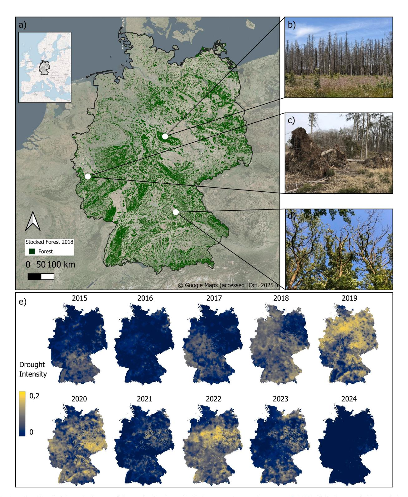
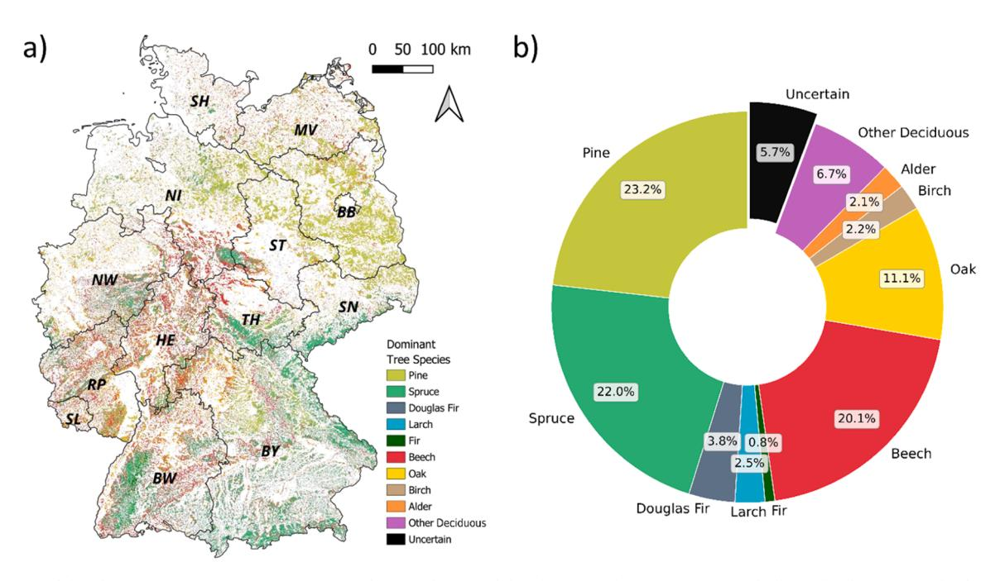

ELSEVIER

Contents lists available at ScienceDirect

#### Forest Ecology and Management

journal homepage: www.elsevier.com/locate/foreco

# Tree species–specific forest canopy cover loss in Germany (2018–2024): A national-scale remote sensing assessment

Marco Wegler a, D, Frank Thonfeld D, Sarah Asam D, Patrick Kacic D, Claudia Kuenzer D,

#### ARTICLE INFO

Keywords:
Earth Observation
Disturbance
Deforestation
Central Europe
Climate Change
Tree Species

#### ABSTRACT

Effective forest management and climate adaptation require a detailed understanding of tree species-specific disturbance dynamics. In recent years forest disturbances in Central Europe have intensified, driven by rising temperatures and recurring droughts. In Germany, drought and windthrow events since 2018 have triggered unprecedented Forest Canopy Cover Loss (FCCL). Here, we present the first national-scale assessment of FCCL for dominant tree species in Germany from 2018 to 2024, based on multi-temporal remote sensing data. We produced a dominant tree species map for 2016 by majority-voting on annual Sentinel-2 tree species classifications (2016-2024) and filtering with forest structure data. This yields a robust baseline for ten dominant species classes (F1-scores > 0.90 for nine pure-species classes). We quantified FCCL, derived from Sentinel-2 and Landsat time series at monthly intervals and 10 m resolution, by aggregating species-specific canopy loss pixels across different temporal (monthly, annual) and spatial (district, state, and national) scales. FCCL predominantly affected coniferous species: Spruce-dominated forests accounted for 4497 km2 (51.3% of total FCCL), corresponding to 18.6% of initial spruce area, with peak FCCL in 2020-2021 and a distinct late-summer peak. Pine ranked second with 1893 km2 (21.6 % of total FCCL and 7.4 % relative). Deciduous species such as beech and oak were less affected, with total FCCL below 300 km2 each and relative declines of 1 %. Spatial hotspots of spruce FCCL were concentrated in central low mountain ranges. Our results provide a tree species-specific overview of forest loss dynamics in Germany, revealing tree species-dependent FCCL since 2018, thus supporting long-term forest management and adaptation to climate change.

#### 1. Introduction

Forests across Europe play a key role in climate-change mitigation and the bioeconomy (Verkerk et al., 2022; Wolfslehner et al., 2016). They provide renewable resources (Pan et al., 2013), regulate hydrological cycles (Duffy et al., 2020), store carbon (Friedlingstein et al., 2020; Pan et al., 2011) and sustain biodiversity (García-Ruiz, 2010; World Resources Institute, 2005). Yet Europe's forests are increasingly affected by climate extremes (Buras et al., 2018; Patacca et al., 2022). In recent decades, heatwaves, storms, and drought episodes have become more frequent and severe (Boboc et al., 2025; Rädler et al., 2019). These climate extremes led to climate-driven disturbances, which caused substantial economic implications: projected timber losses across Europe are expected to rise from  $\varepsilon$ 115 to  $\varepsilon$ 247 billion by mid-century, with Central Europe emerging as a cost hotspot (Mohr et al., 2025).

In Germany, drought intensity has increased markedly since 2018

(Rakovec et al., 2022), signaling a turning point in national forest health (Holzwarth et al., 2023; Schuldt et al., 2020; Senf et al., 2021). According to the 2024 National Forest Condition Survey (BMLEH, 2025), only 21 % of regularly monitored trees showed no crown damage, and crown conditions have not recovered despite several years of favorable weather conditions. Severe droughts and storms between 2018 and 2020 triggered widespread crown defoliation, compounded by windthrow and bark beetle outbreaks (Grieger et al., 2025; Schuldt et al., 2020; Senf and Seidl, 2020). From September 2017 to September 2024, a cumulative canopy area loss exceeding 9240 km2 was recorded nationwide (Thonfeld et al., 2026). These disturbances have reduced the forests' capacity to sequester carbon, maintain biodiversity, and protect against natural hazards (Allen et al., 2010; Boonman et al., 2024). Fig. 1 provides contextual background on forest conditions in Germany by illustrating the national forest distribution, representative disturbance types, and the recent increase and interannual variability of drought conditions

E-mail address: marco.wegler@dlr.de (M. Wegler).

a German Aerospace Center (DLR), German Remote Sensing Data Center (DFD), Münchener Straße 20, 82234 Oberpfaffenhofen, Wessling, Germany

&lt;sup>b University of Würzburg, Institute of Geography and Geology, Department of Remote Sensing, Am Hubland, 97074 Würzburg, Germany

 $^{\star}$  Corresponding author.

during the vegetation period, as reported by Boeing et al. (2022).

Several studies in Germany highlight species-specific responses of temperate tree species to drought. Rieder et al. (2026) examined 520 mature European beech trees across 20 sites in southern Germany and observed early discoloration, defoliation, and mortality following the

2018/19 drought. Their analyses, combining Airborne Laser Scanning (ALS) derived crown assessments, topography, soil conditions, and dendrochronology, showed that canopy gaps and mixed stands buffered drought impacts, whereas large trees on water-rich sites were more affected. Buras et al. (2018) studied Scots pine dieback in Franconia

Fig. 1. Overview of stocked forests in Germany. (a) Map showing forest distribution across Germany (Languer et al. 2022). (b–d) Photographs (by Frank Thonfeld) illustrating different types of forest disturbances: (b) standing dead spruce following bark beetle infestation in the Harz Mountains, (c) windthrow in the Eifel region, (d) dieback of beech crowns in the Steigerwald region. (e) Time series of the German Drought Monitor during the vegetation period (April–October) over the past ten years, where drought intensity reflects reductions in soil moisture relative to normal conditions, modified from Boeing et al. (2022).

after the 2015 hot and dry summer and found higher vulnerability, growth decline, and mortality at forest edges using dendroecology and close-range remote sensing. Ecke et al. (2024) applied UAV multispectral surveys across 235 plots in Bavaria (2020-2022) and combined these with convolutional neural networks to classify tree species and crown health, demonstrating high accuracy for dead trees and healthy spruce. Wang et al. (2025) quantified drought responses of four abundant species (oak, beech, spruce, and pine) across Germany in 2018 and 2022 using canopy greenness derived from remote sensing and environmental variables such as plant-available water capacity and vapor pressure deficit. Isohydric species showed stronger declines than anisohydric species, while oak maintained relatively higher greenness in 2022 compared to 2018. Despite these insights, all studies are either small-scale, regional, focus on a single species or infer stress from spectral or health indicators rather than mapping actual canopy cover loss. A consistent, nationwide assessment of species-specific canopy cover loss in Germany is therefore still missing.

Recent advances in satellite remote sensing have made such analyses increasingly feasible. Sentinel-2's (S2) high spectral and spatial resolution enables detailed mapping of forest characteristics (Holzwarth et al., 2023). The Landsat series extends this capacity through long, harmonized time series of canopy change (Viana-Soto and Senf, 2025), while Sentinel-1 (S1) radar data provide complementary structural information under all-weather conditions (Dostálová et al., 2016). Together, these sensors allow monitoring of forest tree species composition (Blickensdörfer et al., 2024; Hermosilla et al., 2022; Wegler et al., 2025) and disturbance (Senf and Seidl, 2020; Thonfeld et al., 2022) at high spatial and temporal detail.

For Germany, several recent tree species products have been developed. Welle et al. (2022) produced the first nationwide S2-based classification of seven dominant tree species by linking dense seasonal reflectance composites with National Forest Inventory (NFI) data; however, this product is not publicly available. Blickensdörfer et al. (2024) extended this approach by integrating Sentinel-2 and Sentinel-1 time series with environmental covariates and NFI data to generate a classification of eleven tree species classes. Wegler et al. (2025) developed a national 10 m resolution classification of ten major tree species using combined Sentinel-2/-1 imagery, a digital elevation model, and a canopy-optimized reference dataset. The reference data do not rely on access-restricted NFI information and can be further expanded using the same data sources. The approach is transferable across years and therefore allows reconstruction of the tree species composition before the major disturbances that began in 2018. Its temporal flexibility further enables the creation of a stabilized dominant tree species map by integrating multi-annual classifications, which reduces noise and provides a robust baseline for analyzing species-specific FCCL.

At the same time, continental and national forest disturbance monitoring systems have emerged. The European Forest Disturbance Atlas (EFDA) by Viana-Soto and Senf (2025) provides annual, Landsat-based disturbance maps for Europe from 1985 until 2023 in 30 m spatial resolution. It quantifies among other attributes disturbance occurrence, severity, and agent with an overall F1-score of 0.89 and maps over 439,000 km² of disturbed forest area across the continent. For Germany, the FCCL dataset by Thonfeld et al. (2026) provides monthly 10 m maps of canopy cover loss between 2017 and 2024, based on S2 and Landsat time series. The product detects both natural and anthropogenic disturbances, and includes winter months, therefore avoiding seasonal data gaps. FCCL therefore offers a uniquely high temporal resolution and seasonal coverage of canopy cover dynamics at the national scale.

In this study, we adapted the tree species classification approach of Wegler et al. (2025) to produce annual single-year dominant tree species maps from satellite data. These annual classifications were subsequently integrated to generate a Stabilized Dominant Tree Species Map for 2016, representing forest conditions before the consecutive drought years starting in 2018 that caused widespread tree mortality. The canopy

cover loss was derived from the monthly 10 m FCCL dataset developed by Thonfeld et al., 2026, which provides a temporally continuous record of complete canopy disturbances across Germany. By combining the Stabilized Dominant Tree Species Map for 2016 with the FCCL dataset, we conducted a spatially and temporally explicit analysis of species-specific canopy cover loss dynamics at the national scale. Based on this integrated framework, our research objectives (RO) are fourfold:

- to develop a stabilized dominant tree species map for 2016, combining S2 classifications from multiple years to enhance temporal robustness and represent pre-disturbance conditions
- to provide a quantitative synthesis of temporal and spatial speciesspecific FCCL patterns across Germany from 2018 to 2024
- 3) to identify hotspot regions of species-specific disturbances
- to compare the remotely sensed stabilized dominant tree species map with available NFI data.

This study offers forest practitioners and policymakers spatially and temporally explicit data on species-specific disturbance patterns, which directly inform tree species selection for reforestation, risk assessment, and climate adaptation planning. The Stabilized Dominant Tree Species Map for 2016 provides a robust pre-disturbance baseline for monitoring ongoing forest change. This integrated framework supports both operational forest management and the development of long-term policies for climate-resilient forests.

#### 2. Data

#### 2.1. Sentinel-2 time series

S2 satellites provide 10 m spatial resolution and a broad spectral range that is well suited for forest applications, including species discrimination (Blickensdörfer et al., 2024; Schulz et al., 2024). Building on the methodology of Wegler et al. (2025), we constructed Germany-wide S2 surface reflectance time series using spectral bands and indices previously shown to be effective for tree species delineation (Blickensdörfer et al., 2024; Wegler et al., 2025; Welle et al., 2022). Specifically, seven spectral bands were included: Blue, Green, Red, NIR (Near-Infrared), SWIR1 (Short-Wave Infrared), SWIR2, and Red Edge 2, along with two vegetation indices: the Normalized Difference Vegetation Index (NDVI) and the Normalized Difference Moisture Index (NDMI). All S2 Level-2A C1 (https://stac.terrabyte.lrz.de/browser/coll ections/sentinel-2-c1-l2a) scenes with cloud cover greater than 80 %, as well as pixels flagged as cloud, shadow, snow, or ice (ESA, 2024), were excluded. Monthly time series from March (excluding 2015) through October for the years 2015-2025 were gap-filled using linear interpolation to account for missing observations.

#### 2.2. Tree species reference data

A Germany-wide reference dataset of dominant tree species was originally compiled by Wegler et al. (2025) using a multisource approach combining urban tree cadastres, open tree and conservation databases, Google Street View, Google Earth Pro Images, available forest management maps, and own data acquisition. To ensure a top-of-canopy perspective, all homogeneous single-species polygons were delineated directly from high-resolution aerial images. These polygons were converted into sample points following defined spacing rules (Wegler et al., 2025). Class and spatial balancing were performed using Germany's forest growth regions ("Wuchsgebiete"), which are ecologically and environmentally homogeneous areas aggregated from smaller forest growth districts (Gauer and Kroiher, 2012). Each growth region exhibits relatively uniform conditions in terms of landscape, climate, topography, geology, vegetation composition, and forest history, making them suitable units for spatially balanced and ecologically representative sampling, while capturing the natural variability of forest

composition across Germany. In this study, we used the original reference dataset and expanded it by collecting 20,000 additional sample points using the same data sources and labelling strategy, resulting in a total of approximately 100,000 samples.

#### 2.3. Calculated pure stand NFI Data

The German NFI is a comprehensive, nationwide forest survey conducted approximately every ten years to assess the state and development of forests in Germany (Riedel et al., 2024, 2017). It plays a central role in German forest policy, climate reporting, and sustainable forest management. The NFI follows a systematic sampling design based on a regular  $4 \times 4 \text{ km}^2$  grid, with tracts located at each grid intersection and inventory plots on each tract corner. In some regions, the sampling density is increased to improve the precision of regional estimates. This includes a double-density grid of 2.83  $\times$  2.83 km2 and a fourfold-density grid of  $2 \times 2 \text{ km}^2$ . Each plot is surveyed by trained field teams that collect detailed measurements and observations, including tree species, tree height, diameter at breast height, age, and deadwood volume, as well as indicators of forest health and disturbance (Riedel et al., 2017). Data collection is supported by standardized software systems to ensure consistency and accuracy across all regions. The most recent inventory, NFI 4, was conducted between April 2021 and December 2022, surveying approximately 80,000 plots and covering the entire forested area of Germany (Riedel et al., 2024). This extensive dataset provides valuable insights into tree species composition, structure, growth dynamics, and temporal changes, thereby supporting evidence-based decision-making in forest management and policy. For analytical purposes, the NFI applies the concept of calculated pure stand ("rechnerischer Reinbestand"), a methodological approach that mathematically partitions mixed stands into pure stands by tree species and age class according to their proportional area shares. These idealized reference areas enable standardized comparisons of key forest indicators, such as growing stock, increment, and yield (Riedel et al., 2024). It is important to note that calculated pure stand is a statistical construct rather than a physical forest structure, designed to enhance the comparability and interpretability of inventory data. We used those proportional shares to compare them with shares of the Stabilized Dominant Tree Species Map for 2016 (RO4).

#### 2.4. FCCL and forest structure

To determine the date prior to the disturbance for the majority voting process of the tree species maps and to capture the temporal dynamics of canopy disturbance, we employed the FCCL dataset (Thonfeld et al., 2026). This product provides monthly 10 m maps of canopy cover loss for Germany from September 2017-2024, derived from S2 and Landsat 8/9 imagery. Following comprehensive cloud, snow, and shadow masking, tasseled cap components (brightness, greenness, wetness) were used to compute a monthly disturbance index (DI) (Healey et al., 2005). FCCL was detected using a threshold-based temporal persistence approach, whereby a pixel was labeled as loss if DI anomalies exceeded a calibrated threshold for at least six consecutive times (months). This approach captures both gradual and abrupt disturbance events, including storm damage, drought- or heat-induced mortality, bark beetle infestations, wildfires, salvage logging, and planned harvests. The FCCL product distinguishes between coniferous, deciduous, and unclassified forest types and was validated against an independent national reference dataset, achieving an overall accuracy of 0.92. A key advantage of FCCL is its year-round monitoring capability, which includes winter months and thus minimizes seasonal data gaps.

To further refine our tree species map, we applied a forest structure mask derived from the Forest Structure maps by Kacic et al. (2023), which combine S2/1 time series with GEDI (Global Ecosystem Dynamics Investigation) LiDAR data. Machine-learning models trained on GEDI-derived canopy height, cover, and biomass metrics produced

wall-to-wall 10 m forest structure maps for 2017–2022.

#### 3. Methods

To assess species-specific FCCL processes between 2018 and 2024, we combined tree species information, based on the method of Tree Species 2022 (Wegler et al., 2025) and FCCL (Thonfeld et al., 2026) datasets. The workflow underlying this analysis is illustrated in Fig. 2. The tree species classification originally developed for 2022 was applied to satellite imagery across a broader temporal range, resulting in a continuous annual sequence of tree species composition from 2016 to 2024. To ensure temporal consistency and data quality, the annual tree species maps were stabilized through majority voting and prefiltered using remotely sensed forest structure information (Kacic et al., 2023). This step produced a consistent pre-disturbance dominant tree species product for 2016, providing a stable baseline prior to the onset of major drought-related forest impacts in 2018 (Schuldt et al., 2020; Senf and Seidl, 2020). The Stabilized Dominant Tree Species Map for 2016 is systematically compared to independently collected data from the NFI 2012 and 2022 to evaluate reliability. The intersection of monthly FCCL with the Stabilized Dominant Tree Species Map for 2016 enables the quantification of disturbance dynamics across absolute, proportional, temporal, and spatial dimensions.

#### 3.1. Stabilized dominant tree species map for 2016

#### 3.1.1. Annual dominant tree species classifications

Wegler et al. (2025) found that tree-species classification based solely on Sentinel-2 achieved nearly the same performance (only 0.03 lower F1-score) as a classification using Sentinel-2, Sentinel-1, and DEM data, while requiring substantially less computational effort. Building on the methodology described in Wegler et al. (2025), we used the pre-processed S2 time series data to generate annual tree species classification products for the period 2016-2024. To construct the individual feature sets, all spectral bands and vegetation indices were aggregated for each target year using data from the respective year as well as from the adjacent years ( $\pm 1$  year). For each variable, we derived the median, variance, and standard deviation. In addition, we computed separate seasonal aggregates for March, June, August, and October in order to capture key phenological stages relevant for species discrimination. These features served as inputs to a XGBoost classifier trained on our enriched reference database. Each yearly product was generated in terms of model training and prediction to ensure methodological consistency and comparability among years. Nevertheless, due to the use of a  $\pm$  1-year temporal window in the majority-voting approach, temporal dependencies between adjacent annual products are inherent and cannot be fully avoided. The resulting nine-year sequence of annual maps provides dominant tree species information for each year, consistently representing the same ten species classes as in the original product.

#### 3.1.2. Dominant tree species stabilization

Due to interannual variability in phenological signals and the availability of cloud-free S2 imagery, the time series exhibited varying levels of noise, reflected in locally inconsistent classification results. To reduce these inconsistencies, we consolidated the annual classifications using a multi-year majority-voting approach, in which the most frequently occurring class across the nine-year sequence was assigned to each pixel. This procedure was used to refine the 2016 base classification and to derive a robust pre-drought reference for subsequent canopy cover loss analyses. For pixels that were labeled as loss in the FCCL, only classification results from years prior to the loss were included with a one-year offset because the annual species classification already includes spectral information from the previous and following year (Wegler et al., 2025). Table 1 summarizes which annual tree species classifications were used in the stabilization process for each loss year. In

Fig. 2. Presentation of the workflow.

cases where no distinct majority class was identified, pixels were labeled as 'uncertain' to preserve data integrity and explicitly mark areas of higher uncertainty; in the event of a tie in the majority voting, the tree species classes involved in the tie were additionally recorded for the uncertain pixel to quantify frequent confusions. We then added the respective species of the frequent confusions to the certain pixels as additional potential pixels to quantify the maximum possible area.

Because areas with saplings or early regrowth are particularly prone to misclassification of dominant tree species and to erroneous detection of canopy cover loss, we applied an auxiliary forest structure mask (canopy height > 10 m; canopy cover > 35%) derived from the Forest Structure maps by Kacic et al. (2023) in addition to the stabilization approach. Canopy height (MAE of 4.4 m and RMSE of 6.6 m) and canopy cover (MAE of 12.5 % and RMSE of 19.1 %) information from 2017

Table 1
Utilization of annual tree species classifications corresponding to the Forest Canopy Cover Loss (FCCL) year. For example, for pixels showing FCCL in 2021, only the annual tree species maps from 2016 to 2019 were used.

|              |         | Annual Tr | Annual Tree Species Map |      |      |      |      |      |      |      |  |  |  |
|--------------|---------|-----------|-------------------------|------|------|------|------|------|------|------|--|--|--|
|              |         | 2016      | 2017                    | 2018 | 2019 | 2020 | 2021 | 2022 | 2023 | 2024 |  |  |  |
| Year of FCCL | No FCCL | Х         | Х                       | Х    | Х    | Х    | X    | Х    | Х    | X    |  |  |  |
|              | 2018    | X         |                         |      |      |      |      |      |      |      |  |  |  |
|              | 2019    | X         | X                       |      |      |      |      |      |      |      |  |  |  |
|              | 2020    | X         | X                       | X    |      |      |      |      |      |      |  |  |  |
|              | 2021    | X         | X                       | X    | X    |      |      |      |      |      |  |  |  |
|              | 2022    | X         | X                       | X    | X    | X    |      |      |      |      |  |  |  |
|              | 2023    | X         | X                       | X    | X    | X    | X    |      |      |      |  |  |  |
|              | 2024    | X         | X                       | X    | X    | X    | X    | X    |      |      |  |  |  |

were used to identify such areas, which typically represent zones of prior FCCL or the absence of canopy cover before the study period. To avoid bias in the disturbance analysis, these pixels were subsequently labeled as uncertain. The individual annual tree species maps were not further considered in this study.

#### 3.2. Integration of stabilized dominant tree species and FCCL

To quantify species-specific canopy cover loss, we combined the Stabilized Dominant Tree Species Map for 2016 with the FCCL dataset at 10 m spatial resolution. FCCL events from 2018 to 2024 were assigned to pre-disturbance dominant tree species based on the stabilized classification. Events from late 2017 were excluded due to insufficient temporal consistency with the stabilized mapping approach (Table 1).

The integrated dataset was used to analyze species-specific canopy cover loss across spatial and temporal aggregation levels:

- 1) Absolute and proportional loss: Cumulative FCCL across dominant tree species
- 2) Temporal dynamics: Interannual and seasonal patterns of speciesspecific FCCL
- 3) Spatial patterns: Aggregation from 10 m pixels to districts and federal states

The analysis focused on the four major species in Germany (pine, spruce, beech, and oak), which together represent more than three quarters of forest area (>76.4 %). Classes with minor shares (Douglas fir, fir, larch, birch, alder, other deciduous, uncertain) are presented separately in the Appendix.

#### 3.3. Validation

The accuracy of both the annual and the Stabilized Dominant Tree Species 2016 maps was assessed using independent reference data. Following the methodology of Wegler et al. (2025), polygons representing pure stands were delineated and randomly split into training and test sets, which were subsequently populated with validation sample points. In total, 21,962 test samples were available, with class-specific sample sizes ranging from 248 for alder (the smallest class) to more than 6000 for beech or pine. The same test dataset was used to validate each annual tree species map, ensuring that temporal differences in classification performance were directly comparable across all years. Classification accuracy was quantified using the F1-score.

# 3.4. Comparison between area shares of NFI pure stands and stabilized dominant tree species map

To address RO4, we compared the proportional area of each tree species in our Stabilized Dominant Tree Species Map for 2016 with the publicly available estimates of pure stands from the German NFI 2012 and NFI 2022. We examined both national-level shares (the overall distribution of dominant tree species across Germany) and federal-level

shares (distributions within individual states). These comparisons provide an additional, independent assessment of the plausibility and the consistency of our mapped forest-composition baseline.

#### 4. Results

#### 4.1. Stabilized dominant tree species map for 2016

#### 4.1.1. Validation and presentation

A Stabilized Dominant Tree Species Map for 2016 was generated for Germany, based on multi-annual tree species data from 2016 to 2024. Validation of this map is essential to ensure the reliability of subsequent species-specific FCCL analyses.

Temporal classification accuracies per tree species classes are shown in Fig. 3a. F1-scores fluctuate across years, reflecting variability in S2 observations and interannual differences in canopy reflectance. The majority-voting procedure applied in the stabilization process improved the F1-scores to 0.85-0.99 (Fig. 3b), surpassing the accuracies of the individual classifications for each species. The "Other Deciduous" class, representing less abundant deciduous species or mixed stands, remained the least accurate but achieved an F1-score of 0.85. Across all nine purespecies classes, F1-scores exceeded 0.9 in the Stabilized Dominant Tree Species Map for 2016, indicating high classification performance.

Spatial distribution of stabilized dominant tree species is presented in Fig. 4a. Coniferous forests form large, continuous areas in northern, central and southern Germany, whereas deciduous species occur in more heterogeneous, mosaic-like patterns. The proportional distribution of forest area in 2016 (Fig. 4b) shows pine (23.2 %) and spruce (22.0 %) as the most common dominant species, followed by beech (20.1 %) and oak (11.1 %). Other coniferous species are Douglas fir (3.8 %), larch (2.5 %), and fir (0.8 %), bringing the total proportion of coniferdominated forest to just over 50 %. Less common deciduous species, including ash, elm, poplar, linden, and other deciduous species, collectively cover 6.7 % of the forest area, while birch and alder contribute slightly more than 2 % each. Approximately 5.7 % of forest area could not be confidently assigned to a single species and is classified as "uncertain", primarily due to temporal fluctuations in the yearly classifications (93 % of uncertain pixels) or due to sparse canopy cover or low canopy heights (7 % of uncertain pixels). A detailed analysis of classification uncertainty, including absolute and normalized shares of mixedspecies areas, is provided in the Appendix Figure A1. This analysis shows that species confusions are generally limited. While confusions occur most frequently among deciduous species in general, the largest individual contributions arise from pine/spruce and beech/oak confusions.

## 4.1.2. Comparison between area shares of NFI pure stands and stabilized dominant tree species map

Detailed plot-level tree species data in Germany are not publicly available, and only aggregated NFI results can be used for comparison. Table 2 presents the relative proportions of each tree species class derived from NFI 2012 (Thünen-Institut, 2014), Stabilized Dominant Tree Species Map for 2016 and NFI 2022 (Thünen-Institut, 2024).

Fig. 3. Temporal F1-scores for each tree species map from 2016 to 2024, showing (a) the sequence of F1-scores and (b) the F1-scores of Stabilized Dominant Tree Species Map for 2016.

Fig. 4. Map of Stabilized Dominant Tree Species in 2016 (a), showing the spatial distribution of dominant species including federal states and (b) the proportional distribution of the distinct classes.

Table 2
Relative proportions tree species in Germany's forests from NFI 2012 (Thünen-Institut, 2014), NFI 2022 (Thünen-Institut, 2024), and the Stabilized Dominant Tree Species Map 2016. Values in parentheses indicate the additional potential area share if uncertain pixels are assigned to the respective species.

| Dataset - Year      | Pine     | Spruce   | Fir      | Douglas Fir | Larch    | Beech    | Oak      | Birch    | Alder    | Other Deciduous | Gaps  | Uncertain |
|---------------------|----------|----------|----------|----------------|----------|----------|----------|----------|----------|--------------------|-------|-----------|
| NFI 2012            | 22.3 %   | 25.4 %   | 1.7 %    | 2.0 %          | 2.8 %    | 15.4 %   | 10.4 %   | _        | _        | 17.6 %             | 2.4 % | _         |
| Stabilized Dominant | 23.2     | 22.0     | 0.8      | 3.8            | 2.5      | 20.1     | 11.1     | 2.2      | 2.1      | 6.7                | -     | 5.7 %     |
| Tree Species 2016   | (+0.7 %) | (+0.7 %) | (+0.1 %) | (+0.4 %)       | (+0.4 %) | (+0.8 %) | (+0.9 %) | (+0.4 %) | (+0.3 %) | (+0.7 %)           |       |           |
| NFI 2022            | 21.8 %   | 20.9 %   | 1.9 %    | 2.4 %          | 2.9 %    | 16.6 %   | 11.5 %   | 4.7 %    | 2.6 %    | 11.2 %             | 3.4 % | -         |

Values in parentheses for the Stabilized Dominant Tree Species Map 2016 indicate the additional potential area share if uncertain pixels are assigned to the respective species. Pine accounts for 22.3 % in NFI 2012, 23.2 % in the Stabilized Dominant Tree Species Map 2016, and 21.8 % in NFI 2022. Spruce ranges from 25.4 % in NFI 2012 to 22.0 % in the Stabilized Dominant Tree Species Map 2016 and declines further to 20.9 % in NFI 2022. Beech exhibits an increasing trend, from 15.4 % in NFI 2012 to 16.6 % in NFI 2022, compared to the higher value of 20.1 % in the Stabilized Dominant Tree Species Map 2016. Oak proportions are relatively stable, with 10.4 % in NFI 2012, 11.1 % in the Stabilized Dominant Tree Species Map 2016, and 11.5 % in NFI 2022. Minor species (fir, Douglas fir, larch, birch, alder) show greater variability among datasets, with the Stabilized Dominant Tree Species Map generally reporting slightly higher shares for Douglas fir and lower shares for other minor species compared to the NFI inventories. Notably, the Stabilized Dominant Tree Species Map 2016 includes 5.7 % uncertain pixels, resulting mainly from indistinct majority voting or from forest structure filtering.

Table 3 offers a detailed spatial overview of forest composition in Germany by presenting state-level proportional shares of Pine, Spruce, Beech, and Oak across the federal states. These proportions are derived from NFI 2012, the Stabilized Dominant Tree Species Map 2016, and NFI 2022, with values listed in this sequence within each cell.

Pine exhibits strong concordance among all three data sources, particularly in regions dominated by this species. For example, in Brandenburg + Berlin, Pine accounts for 70.1 % (NFI 2012), 70.2 % (Tree Species 2016), and 68.7 % (NFI 2022). Similarly, in Saxony-Anhalt, the values are 42.6 %, 44.8 %, and 41.4 %, respectively. These minor deviations suggest temporal stability and reliable map performance. Spruce also demonstrates high agreement in southern and eastern Germany. In Bavaria, Spruce shares are 40.9 %, 42.2 %, and 37.8 %, while in Thuringia, the values are 38.4 %, 33.7 %, and 31.2 %. The mapped values generally fall between the two NFI years and closely align with inventory observations. Beech displays moderate agreement, with the Stabilized Dominant Tree Species Map for 2016 consistently reporting higher values. In Hesse, Beech increases from 30.1 % (NFI 2012) to 32.5 % (NFI 2022) and shows a higher value of 39.4 % in the Stabilized Dominant tree Species Map for 2016. In Rhineland-Palatinate, the values are 21.8 %, 30.8 %, and 23.1 %. The largest discrepancies are observed for Oak. In Baden-Württemberg, Oak shares increase from 7.5 % (NFI 2012) to 8.4 % (NFI 2022) with an elevated proportional share of 10 % in the Stabilized Dominant Tree Species Map for 2016. In Saarland, the deviation is more pronounced, with values of 19.8 %, 25.8 %, and 23.7 %. Across several federal states, the Stabilized Dominant Tree Species Map reports Oak and especially Beech proportions that exceed those in both inventories.

#### 4.2. Species-specific FCCL 2018-2024

### 4.2.1. Absolute and proportional loss: cumulative FCCL across dominant tree species

Canopy cover loss varied strongly among the dominant tree species for the study period 2018-2024. Between 2018 and 2024, a total of 8764 km2 (7.6 % of Germany's forest area) was affected. Fig. 5 presents species-specific FCCL for the four major tree species. Spruce-dominated forests experienced the largest absolute loss (Fig. 5a), covering 4497 (+332) km2, corresponding to 51.3 (+3.8) % of the total canopy cover loss. Pine-dominated forests were affected across 1893 (+319) km2, representing 21.6 (+3.6) % of the total loss. Beech- and oak-dominated forests showed substantially lower losses, at 284 (+85) km2 and 175  $(+97) \text{ km}^2$ , corresponding to 3.2 (+1.0) % and 2.0 (+1.1) % of the total, respectively. The first value for each species indicates the area unambiguously assigned to that species, while the value in parentheses represents potential additional FCCL inferred from pixels with shared ties in the majority-voting stabilization process. Overall, around 80 % of FCCL occurred in coniferous forests, primarily spruce and pine, as further detailed in the Appendix (Figure A2).

When related to the total area of each species (Fig. 5b), spruce exhibited the largest relative decline, losing nearly 18.6 (+1.1) % of its total area over the seven-year period, which is almost three times higher than other species. Pine forests experienced a relative FCCL of about 7.4 % over the same period. Beech and Oak areas remained largely unaffected, with relative losses slightly above 1 %, indicating low susceptibility to large-scale canopy disturbance.

# 4.2.2. Temporal dynamics: interannual and seasonal patterns of species-specific FCCL

To assess temporal dynamics in canopy cover loss and address the research question on temporal variability among dominant tree species, FCCL was analyzed annually for pine, spruce, beech, and oak (Fig. 6). Fig. 6a shows the total annual FCCL for Germany from 2018 to 2024. The mean annual loss across the study period was approximately 1250 km2, with pronounced interannual variability. Losses increased from about 1100 km2 in 2018 to a maximum of over 1900 km2 in 2020, followed by a gradual decline to less than 900 km2 in 2024. Fig. 6b depicts annual FCCL disaggregated by dominant tree species. Sprucedominated forests clearly drove the overall dynamics, peaking at almost 1200 km2 of FCCL in 2020. Pine-dominated forests showed a more stable trend, with moderate losses each year and no pronounced peak, indicating lower interannual variability. In contrast, beech- and oak-dominated forests exhibited consistently low disturbance levels throughout the period, with annual losses never exceeding 100 km2. Relative losses, shown in Fig. 6c, confirm these contrasting patterns.

Table 3
Comparison of tree species shares (%) for Pine, Spruce, Beech, and Oak by federal state. Values in each cell represent, in order, NFI 2012 (Thünen-Institut, 2014), Stabilized Dominant Tree Species Map 2016, and NFI 2022 (Thünen-Institut, 2024). The full table including all tree species is provided in the Appendix (Table A1).

| Federal State                      | Pine [%]    |                         |             | Spruce [%]  |                         |             | Beech [%]   |                         |             | Oak [%]     |                         |             |
|------------------------------------|-------------|-------------------------|-------------|-------------|-------------------------|-------------|-------------|-------------------------|-------------|-------------|-------------------------|-------------|
|                                    | NFI 2012 | Tree Species 2016 | NFI 2022 | NFI 2012 | Tree Species 2016 | NFI 2022 | NFI 2012 | Tree Species 2016 | NFI 2022 | NFI 2012 | Tree Species 2016 | NFI 2022 |
| Baden-Württemberg (BW)             | 5.8         | 6.9                     | 5.5         | 33.5        | 28.3                    | 30.6        | 21.5        | 26.9                    | 22.2        | 7.5         | 10.0                    | 8.4         |
| Bavaria (BY)                       | 16.8        | 15.4                    | 16.4        | 40.9        | 42.2                    | 37.8        | 13.6        | 15.7                    | 15.0        | 6.6         | 6.9                     | 7.2         |
| Brandenburg + Berlin (BB)          | 70.1        | 70.2                    | 68.7        | 1.8         | 1.3                     | 1.1         | 3.3         | 4.1                     | 3.6         | 6.6         | 8.8                     | 8.0         |
| Hesse (HE)                         | 9.3         | 10.4                    | 8.6         | 21.7        | 11.5                    | 13.4        | 30.1        | 39.4                    | 32.5        | 13.2        | 14.3                    | 14.2        |
| Mecklenburg-Western Pomerania (MV) | 36.7        | 37.3                    | 35.7        | 7.6         | 3.9                     | 6.3         | 12.3        | 16.9                    | 13.1        | 9.4         | 12.3                    | 11.0        |
| Lower Saxony (NI)                  | 28.6        | 33.4                    | 28.0        | 16.4        | 11.9                    | 11.6        | 13.5        | 17.1                    | 14.7        | 12.3        | 12.0                    | 13.3        |
| North Rhine-Westphalia (NW)        | 6.7         | 10.6                    | 7.3         | 29.0        | 20.3                    | 18.2        | 18.3        | 24.0                    | 19.2        | 16.0        | 16.7                    | 17.4        |
| Rhineland-Palatinate (RP)          | 9.9         | 11.3                    | 9.2         | 19.5        | 13.0                    | 14.9        | 21.8        | 30.8                    | 23.1        | 20.2        | 16.7                    | 21.5        |
| Saarland (SL)                      | 5.1         | 5.0                     | 3.4         | 12.3        | 7.0                     | 11.1        | 19.8        | 32.4                    | 23.2        | 19.8        | 25.8                    | 23.7        |
| Saxony (SN)                        | 28.2        | 29.1                    | 27.3        | 34.4        | 32.2                    | 30.4        | 4.2         | 7.4                     | 5.6         | 8.6         | 9.2                     | 10.5        |
| Saxony-Anhalt (ST)                 | 42.6        | 44.8                    | 41.4        | 9.9         | 7.6                     | 4.2         | 6.7         | 11.8                    | 7.9         | 12.3        | 13.2                    | 14.2        |
| Schleswig-Holstein (SH)            | 7.7         | 10.7                    | 7.1         | 16.0        | 8.0                     | 12.6        | 19.3        | 25.6                    | 20.5        | 15.8        | 16.3                    | 17.3        |
| Thuringia (TH)                     | 14.1        | 14.6                    | 14.2        | 38.4        | 33.7                    | 31.2        | 19.8        | 25.5                    | 21.0        | 6.8         | 8.2                     | 7.8         |

Fig. 5. Distribution of FCCL in km2 and relative damage (in %) for the four major tree species in Germany for the entire study period 2018–2024, showing (a) FCCL area and (b) relative damage by tree species including potential adjustments from uncertain class mixtures, in parentheses.

Spruce again stood out with an exceptional 4 % loss in 2020 alone, while pine displayed smaller but persistent relative declines of around 0.8–1.4 % per year. Beech and Oak remained largely stable, with annual relative losses consistently below 0.3 %. Fig. 6d presents each species' relative contribution to total FCCL per year. Spruce contributed more than 60 % of total loss during 2020 and 2021, underscoring its dominant role in national disturbance dynamics. Pine contributed 15–25 % each year, whereas beech and oak rarely exceeded 1–5 % each.

While the interannual analysis revealed strong temporal variability and a clear dominance of coniferous species in overall canopy cover loss, finer temporal resolution provides additional insights into the timing of FCCL. This section therefore examines seasonal patterns of canopy cover loss, distinguishing between major disturbance periods and speciesspecific dynamics. Fig. 7 summarizes the monthly aggregated FCCL for the period 2018-2024 across the four major tree species. Solid bars represent the monthly medians and the line the monthly mean. Results for additional species are provided in the Appendix (Figure A4). Across all species, FCCL displayed a distinct spring maximum, with the highest values typically occurring between February and April. This pattern was most pronounced for pine, where median monthly losses reached approximately 40 km2 during winter/spring, but dropped to below 10 km2 from May to December before increasing again in January. Spruce showed a less consistent seasonal signal: while elevated losses were also recorded during spring, additional peaks occurred in late summer (August). The large difference between median and mean values, reflects high interannual variability driven by extreme disturbance years. At lower absolute levels, beech- and oak-dominated forests also exhibited a winter/spring-centered loss pattern. Oak showed a sharper decline in FCCL from March onward, whereas beech maintained moderately elevated mean values until April, suggesting subtle differences in seasonal disturbance between the two deciduous species.

#### 4.2.3. Spatial patterns of species-specific FCCL

Building on the temporal and seasonal patterns described above, the spatial distribution of FCCL provides further insights into the regional dynamics of species-specific forest disturbance. Fig. 8 illustrates, in the first panel, the dominant tree species per district (Landkreis) based on the Stabilized Dominant Tree Species 2016 map. Spruce dominated in southern and southeastern Germany, pine in the northeast, beech in central and western parts, and oak in some districts of central Germany. Districts with less than 10 % forest cover are not shown in the figure to

enhance readability. The second panel presents the species with the highest share of FCCL over the entire study period per district. Colour intensity indicates their relative FCCL area (< 5 %, 5-10 %, and > 10 %). The highest disturbance levels were observed primarily for spruce, and to a lesser extent for pine, particularly across central Germany. Even in districts dominated by beech, spruce often emerged as the most disturbed species, highlighting its disproportionate contribution to national canopy cover loss. Both, dominant abundance per district and highest FCCL per district, are covered by only four species. The subsequent panels display the annually most affected species and the corresponding relative FCCL per district, revealing a clear temporal shift in disturbance hotspots. In 2018, FCCL was concentrated in central Germany, particularly in the Harz region. In the following years, extensive FCCL in spruce dominated forest expanded southward and partially northward. Since 2020, severe 10 % annual FCCL have been recorded in the Saxon Switzerland region along the Czech border. By 2024, increased FCCL also appeared in northern Bavaria, while the Thuringian Forest, first heavily affected in 2020, remained a persistent hotspot through the end of the study period. In many districts, spruce accounted for the majority of canopy cover losses exceeding 10 % of total forest area. Other species were considerably less affected. In some pinedominated districts of northeastern Germany, annual losses reached 5-10 %, although parts of these losses were associated with adjacent spruce FCCL areas. Across all other regions, disturbance intensity remained below 5 % per year.

Aggregating FCCL across federal states highlights broad-scale regional contrasts (Table 4). Total FCCL ranged from 2.4 % in Schleswig-Holstein to 17.6 % in North Rhine-Westphalia, reflecting pronounced spatial heterogeneity. Spruce forests exhibited the highest losses, exceeding 25 % in seven states and peaking at 76.7 % in Saxony-Anhalt. In contrast, Bavaria, despite its large spruce-dominated area, showed relatively low loss rates (around 5%), emphasizing strong regional variation in disturbance exposure and resilience. Pine forests experienced intermediate losses (4.9-16.1 %) with clear northeastsouthwest gradients, while beech and oak remained comparatively stable, both consistently below 2 % across all states. The highest absolute canopy cover losses occurred in North Rhine-Westphalia (1492.9 km2), Bavaria (1273.2 km2), and Lower Saxony (901.2 km2), reflecting the combined effect of extensive forest area and high disturbance pressure. Overall, spatial analysis confirms that disturbances in spruce-dominated forests drive FCCL dynamics in Germany, but are

Fig. 6. Annual FCCL by the four major dominant tree species—pine, spruce, beech, and oak—in Germany from 2018 to 2024, showing (a) total FCCL across all species, (b) species-specific annual canopy cover loss, (c) relative annual loss, (d) proportional contribution of each species to total canopy cover loss.

regionally clustered.

#### 5. Discussion

#### 5.1. A stabilized dominant tree species map for 2016

#### 5.1.1. Stabilization framework, uncertainty treatment

In Germany, drought intensity increased markedly from 2018 onward (Rakovec et al., 2022), marking a critical turning point in national forest health (Holzwarth et al., 2023; Schuldt et al., 2020). The severe droughts of 2018–2020, combined with the major storm event in early 2018 (Xoplaki et al., 2025), triggered widespread canopy defoliation, windthrow, and bark beetle outbreaks. To establish a robust

pre-disturbance baseline (RO1), we developed a Stabilized Dominant Tree Species Map for 2016. This map integrates annual S2 species classifications from 2016 to 2024 using a majority-voting approach to reduce interannual artifacts arising from variable illumination, cloud conditions, and sensor-specific limitations (Martín-Ortega et al., 2020; Zekoll et al., 2021). Previous studies have demonstrated that incorporating multi-year time series improves classification stability and accuracy (Grabska et al., 2019; Schulz et al., 2024), and that harmonizing multiple land-cover products can further enhance class consistency (Li et al., 2020; Meng et al., 2022). To quantify classification ambiguity, we introduced an uncertain class representing pixels repeatedly assigned to different species. Most misclassifications occurred among deciduous species with highly similar spectral signatures, like oak and beech

Fig. 7. Monthly FCCL aggregated for the period 2018–2024 for the four major dominant tree species in Germany. Bars show median values and dotted lines show mean values, both in km2.

#### (Ballanti et al., 2016; Wegler et al., 2025).

# 5.1.2. Accuracy improvements and comparison with existing products, and methodological limitations

The Stabilized Dominant Tree Species Map for 2016 demonstrates markedly higher robustness and improved accuracy compared to the 2022 single-year map (Wegler et al., 2025), as indicated by F1-scores that increased by 0.10-0.15 across all species when assessed with the same validation dataset and protocol. Notably, improvements were most pronounced for the oak and other deciduous classes, with F1-scores rising from 0.76 and 0.86, respectively, to 0.91. Direct quantitative comparisons of accuracy metrics with other Germany-wide tree species maps are constrained by differences in validation datasets and assessment protocols. However, previous studies have documented variable performance across species groups, with notable challenges observed for oak, birch, and fir (Blickensdörfer et al., 2024; Wegler et al., 2025; Welle et al., 2022). In the Stabilized Dominant Tree Species Map for 2016 the F1-scores for all pure classes were above 0.91 and reached 0.99 for the pine class. From this comparison, we conclude that integrating multiple annual classifications effectively reduces artifacts and yields a map that is resilient to interannual environmental variability, including atmospheric and phenological differences.

To contextualize area shares, we aggregated species areas reported in the dominant tree species map (2017/2018) of Blickensdörfer et al. (2024). Their product showed dominant-species proportions of 19.5 % pine, 27.1 % spruce, 22.0 % beech, and 12.4 % oak, compared to 23.2 % pine, 22.0 % spruce, 20.1 % beech, and 11.1 % oak in our Stabilized Dominant Tree Species Map for 2016. To further contextualize species shares and address RO4, we compared the stabilized map with publicly available estimates of pure stands from the German NFI. Although the

reference year lies between inventory periods, this temporal mismatch is minor relative to structural differences between the datasets. The NFI includes classes such as "Gaps," which are not explicitly represented in the remote-sensing products used in this study, whereas our map introduces an additional "uncertain" class. Moreover, NFI results are plot-based and classify stands as "pure" or "mixed" by basal area thresholds, whereas the satellite-based products considered in this comparison report only the dominant species per pixel (Blickensdörfer et al., 2024). Several studies have demonstrated that satellite data can be used to estimate tree species proportions or fractions, either directly or indirectly, including non-dominant species (Bolyn et al., 2022; Klehr et al., 2025). However, these methods typically require detailed information about species fractions within a polygon (Bolyn et al., 2022), which is not available for this study or time-expensive survey procedure (Klehr et al., 2025). Therefore, our mapping approach focuses on representing dominant species, in line with the scope and structure of the reference data used. Consequently, species frequently occurring as admixtures but rarely dominating the canopy, such as maple, are not present or underestimated in most satellite-based products for Germany. In this context, "Other deciduous" species accounted for 17.6 % of forest area in 2012 (including birch and alder) and 11.2 % in 2022 in the NFI, versus only 6.7 % in our stabilized map. Fir shows a similar discrepancy (1.7–1.9 % in NFI vs. 0.8 % in our map), with this species also having the highest sampling uncertainty among conifers (Thünen-Institut, 2024). In contrast, spruce, pine, and oak show good agreement with NFI values, while beech appears slightly overestimated in our map.

Annual species models were trained and validated using homogeneous reference samples. Consequently, accuracy metrics reflect performance predominantly in pure stands, whereas mixed canopies are less reliably represented. Mixed-species pixels remain the primary

Fig. 8. The dominant tree species per district is shown the first panel and, in the second, the dominant tree species with highest share of FCCL per district. The remaining panels represent a sequence from 2018 to 2024 showing the most affected species per year and district. Relative FCCL is represented by the transparency of the tree species label color.

source of uncertainty in large-scale satellite-based tree species products (Blickensdörfer et al., 2024; Welle et al., 2022). According to the German NFI (Riedel et al., 2024), around 79 % of forests are mixed stands, but this concept cannot be translated directly to remote sensing products. A stand is considered mixed when  $\geq 10$  % of its basal area belongs to another species, whereas satellite-based maps represent only

the dominant upper canopy. Furthermore, approximately 77 % of German forests have two or more canopy layers, meaning that mixed-stand conditions can occur even when the upper canopy is visually homogeneous. At the same time, major calamities in recent years have primarily affected homogeneous conifer stands (Das et al., 2025; Seliger et al., 2023; UNECE, 2024), in which the Stabilized Dominant

**Table 4**Forest FCCL (2018–2024) by federal state and dominant tree species. Values indicate the affected area, with the percentage loss relative to each species' total area shown in parentheses. The highest absolute and relative values per state are highlighted in bold. City-states are excluded.

| 0 0                 | •              |               |                  |                |              |
|---------------------|----------------|---------------|------------------|----------------|--------------|
| Federal State       | Total [km²/ | Pine [km²/ | Spruce [km²/     | Beech [km²/ | Oak [km²/ |
|                     | (%)]           | (%)]          | (%)]             | (%)]           | (%)]         |
| Baden-              | 571.4          | 67.7          | <b>252</b> (6.5) | 54.2           | 18.6         |
| Württemberg (BW) | (4.1)          | (7.2)         |                  | (1.5)          | (1.3)        |
| Bavaria (BY)        | 1273.2         | 191.7         | 749.6            | 51.1           | 23.3         |
|                     | (5.0)          | (4.9)         | (7.0)            | (1.3)          | (1.3)        |
| Brandenburg (BB)    | 691.1          | 477.1         | 39.7             | 5.7 (1.3)      | 17.8         |
| <b>9</b>            | (6.4)          | (6.3)         | (28.1)           |                | (1.9)        |
| Hesse (HE)          | 837.5          | 121.4         | 420.2            | 47.6           | 22.6         |
|                     | (9.7)          | (13.5)        | (42.1)           | (1.4)          | (1.8)        |
| Mecklenburg-        | 280.6          | 115.1         | 58.2             | 8.5 (0.9)      | 6.5 (1.0)    |
| Western             | (5.2)          | (5.7)         | (27.4)           |                |              |
| Pomerania (MV)      |                |               |                  |                |              |
| Lower Saxony (NI)   | 901.2          | 218.4         | 458.6            | 20.1           | 15.5         |
|                     | (8.3)          | (6.0)         | (35.3)           | (1.1)          | (1.2)        |
| North Rhine-        | 1492.9         | 145.2         | 1008.1           | 34.2           | 21.8         |
| Westphalia (NW)  | (17.6)         | (16.1)        | (58.7)           | (1.7)          | (1.5)        |
| Rhineland-          | 581.0          | 65.3          | 310.2            | 29.1           | 20.4         |
| Palatinate (RP)     | (7.0)          | (7.0)         | (28.7)           | (1.1)          | (1.5)        |
| Saarland (SL)       | 53.1           | 7.2           | 23.9             | 2 (0.7)        | 2 (0.8)      |
|                     | (5.6)          | (15.3)        | (36.3)           |                |              |
| Saxony (SN)         | 530.6          | 159.4         | 249.2            | 4.7 (1.2)      | 6.7 (1.4)    |
| •                   | (10.3)         | (10.6)        | (15.0)           |                |              |
| Saxony-Anhalt       | 645.5          | 221.1         | 274.6            | 8.9 (1.6)      | 11.4         |
| (ST)                | (13.7)         | (10.5)        | (76.7)           |                | (1.8)        |
| Schleswig-Holstein  | 42.4           | 9.9 (5.3)     | 12.8             | 1.8 (0.4)      | 1.3 (0.5)    |
| (SH)                | (2.4)          |               | (9.2)            |                |              |
| Thuringia (TH)      | 854.6          | 91.6          | 636.8            | 15.5           | 6.5 (1.5)    |
|                     | (15.6)         | (11.4)        | (34.5)           | (1.1)          |              |
|                     |                |               |                  |                |              |

Tree Species Map for 2016 performs especially well, making it particularly valuable for large-scale loss analyses.

#### 5.2. Tree species-specific FCCL

The combination of the FCCL product with the Stabilized Dominant Tree Species Map for 2016 enables the first monthly and annual quantification of species-specific FCCL across Germany based on remote sensing data, directly addressing research objectives RO2 (quantification of temporal and spatial species-specific loss patterns) and RO3 (identification of hotspot regions). It is critical to note that canopy cover loss captures FCCL regardless of its underlying cause. The product does not distinguish between natural disturbance-driven losses (e.g., bark beetle outbreaks, drought mortality, windthrow) and management-driven removals (e.g., planned harvest, forest conversion measures). Both processes result in canopy opening and are thus detected equally.

#### 5.2.1. Spruce FCCL dominates in Germany

Spruce emerges as the most susceptible species to FCCL across Germany, both in absolute area and relative share. The primary drivers are large-scale calamities affecting central Germany, notably in the Harz and Sauerland regions, evident across spatial, annual, and monthly analyses (RO2). Major damage events in these regions, driven by drought stress and subsequent spruce bark beetle outbreaks, are well documented in both in-situ studies (Anders et al., 2025; Kautz et al., 2022; Trautwein et al., 2025) and remote sensing investigations (Dalponte et al., 2022; Nardi et al., 2022).

Comparable disturbance patterns have been reported from other Central European countries. Washaya et al. (2024) used annual forest change maps derived from optical and Synthetic Aperture Radar imagery to quantify bark beetle outbreak areas in spruce-dominated forests across the Czech Republic. Between 2016 and 2022, approximately

11 % of the national forest area and 17 % of the initial spruce area were disturbed. In comparison, our results for Germany between 2018 and 2024 show that about 8 % of the total forest area and at least 18.6 % of spruce-dominated forests were affected. Despite differing time periods and mapping approaches, both studies reveal a similar magnitude of spruce-related canopy cover loss, further corroborating the regional consistency of disturbance-driven spruce decline in central Europe.

Seasonal dynamics of spruce FCCL show distinct increases toward late summer, coinciding with annual population peaks of the bark beetle and associated canopy decline (Jaakkola et al., 2023; Marini et al., 2013). These seasonal trends mirror the biological cycle of the disturbance agent rather than forest management practices. The underlying mechanism follows a well-established sequence in which prolonged drought reduces tree vitality and resin-based defenses, allowing rapid beetle population expansion and ultimately leading to widespread stand mortality within a few consecutive growing seasons (Kautz et al., 2022; Trautwein et al., 2025).

The spatial heterogeneity in FCCL patterns thus reflects regions where disturbances are either species-specific (bark beetle outbreaks preferentially affecting spruce) or where site conditions interact with species characteristics to create heightened vulnerability. Regions with comparatively lower losses, such as Bavaria, remain at substantial risk of reaching similar severity levels under comparable storm and drought conditions, as demonstrated by studies from northern Italy and Austria. Bozzini et al. (2023) documented how Storm Vaia shifted populations of spruce bark beetle from endemic to epidemic phase in predominantly monospecific spruce stands characterized by even-aged mature trees and high density. Similarly, Hallas et al. (2024) reported two distinct outbreak waves in Austria: the first (2015–2018) affected low-elevation forests (<600 m) in northern Austria, peaking at 2.6 % of growing stock lost; the second (2021-2022) affected mountainous forests in the south following storm and snow damage, with losses reaching 2.4 % of growing stock. High temperatures enabled completion of two bark beetle generations up to 1400 m elevation, with damage significantly affected by climatic water balance.

The interpretation of FCCL patterns becomes more complex when considering that detected losses include both disturbance-driven mortality and active forest conversion measures. In response to changing climate conditions, federal states are actively promoting forest conversion by removing vulnerable, site-maladapted tree species, particularly spruce in low-elevation sites (UBA, 2021). Consequently, observed canopy cover losses likely represent a combination of uncontrolled disturbance events and planned removal of at-risk stands as part of adaptive management strategies. Spruce already grows outside its suitable climatic niche across large parts of Germany today, and projections indicate that by the end of the century no climatically suitable areas for spruce will remain, apart from isolated high-elevation zones in the Alps (Kölling, 2007; Mauri et al., 2022). This underscores that widespread site maladaptation is the central vulnerability factor driving both the severity of recent disturbance events and the limited management options available for spruce-dominated forests (UBA, 2021).

# 5.2.2. Species-specific FCCL pattern in pine, beech and oak dominated forests

Pine represents the second-most affected species, accounting for roughly 20 % of total canopy cover loss. Over the seven-year study period, around 7 % of pine-dominated forest area experienced canopy cover loss. Considering typical rotation lengths of 80–120 years (Spathelf and Ammer, 2015), this slightly exceeds the area expected to be removed through planned harvesting alone, indicating that disturbances contribute to observed losses beyond routine management. This aligns with findings from Knocke et al. (2025), who assessed the condition of pine in northwestern Germany. Based on practitioners' reports, they observed increasing non-wind disturbance impacts under prolonged drought, while storm events remain the dominant overall driver of natural timber loss.

The seasonal pattern of pine losses differs markedly from that of spruce. Pine-dominated forests show low loss rates from May through December and elevated losses during winter/spring months. This pattern is consistent with common forestry practice, in which pine harvests are preferentially scheduled during the colder season to minimize soil damage during extraction (Leuschner et al., 2022; Spathelf and Ammer, 2015). In contrast to the biologically driven seasonal signal observed for spruce, the pine pattern primarily reflects management decisions.

Deciduous-dominated forests, such as beech and oak, show substantially lower interannual variability and much smaller cumulative canopy cover losses, amounting to only about 1-2 % of their total forest area during the study period. Obladen et al. (2021) reported comparable patterns in central Germany during the 2018-2019 drought, where approximately 7 % of beech trees died, compared to around 50 % of spruce trees under similar conditions. Forest damage patterns differ markedly between deciduous and coniferous monocultures: in beechand oak-dominated stands, drought impacts are often partial, prolonged. and sometimes reversible, whereas bark beetle infestations in conifers typically cause rapid and extensive stand-scale mortality. These contrasting species-specific dynamics are further supported by recent analyses of drought responses during the extreme events of 2018 and 2022, which showed that conifers generally exhibited stronger declines in canopy greenness and greater drought vulnerability than deciduous species (Wang et al., 2025).

#### 5.2.3. Methodological limitations and uncertainties

Both the FCCL product and the Stabilized Dominant Tree Species Map for 2016 have undergone independent validation; however, species-specific loss estimates derived from their combination cannot be validated at the pixel level. National harvest statistics lack spatial specificity and therefore serve only as contextual background rather than ground truth. Combining two independently produced datasets inevitably introduces compounded uncertainties that require consideration.

A further limitation is that the analysis assigns all detected FCCL within a pixel to the dominant tree species. Losses affecting cooccurring, non-dominant species therefore remain unrepresented. This is especially relevant in mixed stands where species dominance may be ambiguous, increasing the likelihood of misattribution. Consequently, the reported species-specific loss areas indicate where forests dominated by a given species experienced canopy cover loss, rather than capturing all trees of that species affected within those pixels.

Spatial resolution also imposes constraints. S2's 10 m pixel size limits the detection of single-tree mortality and small canopy gaps. Scattered standing deadwood, which can contribute substantially to total mortality, often remains undetected in medium-resolution products (Cheng et al., 2024). Schiefer et al. (2025) also reported that tree mortality was underestimated in Thonfeld et al. (2022), a dataset similar to the one used here, although the overall spatial patterns were consistent with their findings. Thus, extensive stand-scale disturbances, such as bark beetle outbreaks followed by salvage logging, are well represented, whereas gradual or spatially dispersed mortality, common in deciduous and mixed forests, frequently falls below the detection threshold. Kacic et al. (2024) also showed that structural changes in beech-dominated stands resulting from distributed treatments (selective tree removal) cannot be detected using S2 or S1, in contrast to aggregated treatments (gap felling, 30 m diameter). The detection biases of distributed treatments lead to conservative estimates of canopy cover loss, particularly in broadleaved-dominated forests.

Temporal uncertainties arise from cloud cover and reduced winter data availability over Germany (Thonfeld et al., 2022; Wegler et al., 2025). Kautz et al. (2024), in a review on early detection of spruce bark beetle infestations, highlight that weather conditions remain a major challenge for accurately timing disturbance events with spectral satellite data. Delayed detections accumulate FCCL events since the last

cloud-free observation, often resulting in elevated counts at the end of winter. Nevertheless, key seasonal patterns remain discernible. For instance, pronounced secondary summer peaks in spruce-dominated forests, driven by bark beetle population dynamics, are still clearly detectable due to generally favorable imaging conditions. In deciduous stands, seasonal variation in the disturbance index is smaller, although early wilting can occasionally produce false positives (Thonfeld et al., 2026).

Uncertainty also arises from the underlying forest mask. The analysis uses the validated Stocked Forest Map of the Thuenen Institute (Langner et al., 2022), which is based on the NFI's forest definition. Forest area estimates can vary substantially depending on the applied definition. In the case of the Stocked Forest Map, this includes a minimum canopy cover threshold of 50 % or less and a minimum mapping unit of 0.25 ha or less.

#### 5.3. Implications for policy, management and future research

Spruce is the most economically important tree species in Europe (Overbeck and Schmidt, 2012), largely due to its economically efficient management compared with the more complex requirements of mixed stands (Pach et al., 2018). Its current spatial distribution in Germany reflects historical silvicultural priorities rather than ecological suitability. Extensive plantations were established primarily for timber production without consideration of the species' natural range (Honkaniemi et al., 2020; Schmied et al., 2022). Our results show that spruce monocultures in Germany have already declined substantially, with 18.6 % of all spruce-dominated forest lost, and this trend will likely continue because spruce in Central Europe is particularly vulnerable to drought-induced disturbances (Schröter et al., 2025).

Most spruce stands lie outside their natural distribution range, and climatically suitable areas are projected to decrease substantially. Studies suggest that almost no naturally suitable sites will remain under future climate scenarios (Falk and Hempelmann, 2013; Mauri et al., 2022; Wessely et al., 2024). The ongoing shift in forest composition, particularly the retreat of spruce plantations, will therefore continue through either natural disturbances or targeted removals. Forest management agencies are systematically removing site-maladapted and vulnerable species as part of climate adaptation strategies, implementing conversion measures that aim to establish more drought-tolerant and site-appropriate species mixtures (Jandl et al., 2019; UBA, 2021).

This development underscores the growing need for improved, spatially explicit forest monitoring. Our approach contributes to this objective by providing species-specific FCCL information that complements existing monitoring systems such as the National Forest Condition Survey and the German NFI (Fassnacht et al., 2024). Such remotely sensed products can fill temporal and spatial gaps in traditional inventories, supporting forest administrations in planning and implementing adaptation measures. This aligns with the goals of the EU Forest Strategy for 2030, which calls for enhanced monitoring to better assess forest condition and to facilitate management practices that promote biodiversity and resilience. The strategy emphasizes functionally diverse, mixed-species forests with higher proportions of broadleaved and deciduous species and a range of biotic and abiotic sensitivities and recovery mechanisms (European Environment Agency, 2025; European Commission, 2022).

Our mapping of species-specific FCCL illustrates distinct seasonal and regional disturbance dynamics in spruce-dominated forests, providing insights into underlying processes and forest vulnerability. While full attribution of disturbance agents was not an objective of this study, integrating FCCL with species information and spatiotemporal disturbance patterns can help narrow down potential disturbance causes. Approaches such as that of Viana-Soto and Senf (2025), who distinguished bark beetle/windthrow, fire, and harvest using Landsat time series, could be further enhanced through such causal interpretation.

The current analysis identifies only the dominant species prior to canopy cover loss. To capture forest dynamics more comprehensively, future work should also assess regrowth areas, which would enable monitoring of complete transitions in species composition following disturbance. Earlier studies have examined disturbance impacts on microclimate, showing that disturbed stands exhibit higher surface temperatures than intact forests (Grieger et al., 2025), and on recovery processes, demonstrating that undisturbed patches can accelerate regeneration in adjacent damaged areas (Mandl et al., 2025). However, nationwide assessments that explicitly track the composition and development of regenerating or newly afforested stands remain scarce. To deepen the understanding of natural disturbance dynamics, future studies should additionally intersect canopy cover loss patterns with key environmental variables such as available soil water, slope, aspect and elevation, which are likely to influence both disturbance susceptibility and post-disturbance recovery.

#### 6. Conclusion

This study presents the first national-scale, species-specific assessment of FCCL in Germany between 2018 and 2024. In our analyses we developed a new Stabilized Dominant Tree Species Map for 2016 and combined it with monthly FCCL observations at 10 m spatial resolution. The product achieved high accuracy (F1 > 0.90 for all nine pure-species classes) and provides a robust pre-disturbance baseline for multi-annual canopy cover loss analysis. Between 2018 and 2024, approximately 8764 km2 (approximately 7.6 %) of Germany's forest canopy cover was lost. Spruce-dominated stands were most severely affected, with at least 4497 km2 of canopy cover loss, representing more than 51 % of total forest disturbance and 18.6 % of the 2016 spruce area. Losses peaked in 2020-2021, when annual disturbance rates exceeded 4 % of spruce area, and were spatially concentrated in the Harz, Thuringian Forest, Sauerland, and Saxon Switzerland regions. In addition to a winter peak, spruce exhibited a distinct late-summer peak, reflecting the strong influence of drought-induced bark beetle outbreaks. Pine-dominated forests ranked second, losing at least 1893 km2 (approximately 7.4 % of pine area), primarily during winter/spring, consistent with the beginning of harvesting and storm-related damage patterns. In contrast, beech and oak demonstrated high stability, with total canopy cover losses of at least 284 km2 and 175 km2 respectively, corresponding to only about 1 % of each species' area and showing lower FCCL under recent disturbance regimes. Regionally, disturbance rates varied substantially, ranging from 2.4 % in Schleswig-Holstein to 17.6 % in North Rhine-Westphalia. Spruce losses exceeded 25 % in seven federal states, while broadleaved species remained largely unaffected (< 2 %).

By intersecting species information with temporally detailed FCCL observations, this study provides a consistent foundation for tracking ongoing forest transformation in Germany. These results directly support forest management by delivering species-specific, spatially and temporally explicit information that helps prioritize management decisions across disturbance-prone regions. The monthly temporal resolution fills critical gaps in traditional forest inventories that operate on 10-year remeasurement cycles, enabling more timely detection of disturbance events and supporting responsive forest management planning. The results highlight the extreme vulnerability of spruce monocultures to compound climatic and biotic stressors. Given that spruce already grows outside its climatically suitable range across much of Germany and projections indicate near-complete loss of suitable habitat by 2100, the ongoing shift in forest composition through either natural disturbances or targeted removals will continue. Forest conversion toward drought-tolerant, mixed-species stands with higher structural and functional diversity, as promoted by climate adaptation strategies and the EU Forest Strategy for 2030, is essential for maintaining resilience under intensifying disturbance regimes. Future research should extend monitoring to regrowth dynamics and species composition transitions following disturbance, and integrate canopy

cover loss patterns with key environmental variables to better understand site-specific disturbance susceptibility and recovery potential.

#### Additional information - Funding

This Research was conducted within the ForstEO project (FKZ 2220WK81A4), funded by the Federal Ministry of Agriculture, Food and Regional Identity and the Federal Ministry for the Environment, Climate Action, Nature Conservation and Nuclear Safety based on a decision of the German Bundestag from Waldklimafonds through the Fachagentur Nachwachsende Rohstoffe e.V. (FNR). PK was supported by the Deutsche Forschungsgemeinschaft (DFG, German Research Foundation – 459717468).

#### CRediT authorship contribution statement

Marco Wegler: Writing – original draft, Visualization, Validation, Software, Methodology, Investigation, Data curation, Conceptualization. Frank Thonfeld: Writing – review & editing, Conceptualization. Sarah Asam: Writing – review & editing, Supervision, Conceptualization. Patrick Kacic: Writing – review & editing, Conceptualization. Claudia Kuenzer: Writing – review & editing, Supervision, Funding acquisition, Conceptualization.

#### Disclosure statement

No potential conflict of interest was reported by the author(s).

#### **Declaration of Competing Interest**

The authors declare that they have no known competing financial interests or personal relationships that could have appeared to influence the work reported in this paper.

#### Acknowledgements

The authors gratefully acknowledge the computational and data resources provided through the joint high-performance data analytics (HPDA) project "terrabyte" of the German Aerospace Center (DLR) and the Leibniz Supercomputing Center (LRZ).

#### Appendix A. Supporting information

Supplementary data associated with this article can be found in the online version at <a href="doi:10.1016/j.foreco.2026.123630">doi:10.1016/j.foreco.2026.123630</a>.

#### Data availability

The remote sensing data is available on the terrabyte STAC API: Collection 1 Level-2A (https://stac.terrabyte.lrz. Sentinel-2 de/browser/collections/sentinel-2-c1-l2a). The Stabilized Dominant Tree Species Map for 2016 for Germany, derived from multi-annual available classifications is at: https://doi. org/10.15489/epg4bddif308. The FCCL raster dataset (https://doi. org/10.15489/ef9wwc5sff75) as well as the aggregated results at administrative units (https://doi.org/10.15489/jctru9ze1t42) are available on DLR's EOC geoservice (https://geoservice.dlr. de/web/datasets/fccl). Other data will be made available on reasonable request.

#### References

Allen, C.D., Macalady, A.K., Chenchouni, H., Bachelet, D., McDowell, N., Vennetier, M., Kitzberger, T., Rigling, A., Breshears, D.D., Hogg, E.H., et al., 2010. A global overview of drought and heat-induced tree mortality reveals emerging climate change risks for forests. For. Ecol. Manag. 259. https://doi.org/10.1016/j. foreco.2009.09.001.

- Anders, T., Hetzer, J., Knapp, N., Forrest, M., Langan, L., Tölle, M.H., Wellbrock, N., Hickler, T., 2025. Modelling past and future impacts of droughts on tree mortality and carbon storage in Norway spruce stands in Germany. Ecol. Model. 501. https:// doi.org/10.1016/j.ecolmodel.2024.110987.
- Ballanti, L., Blesius, L., Hines, E., Kruse, B., 2016. Tree species classification using hyperspectral imagery: a comparison of two classifiers. Remote Sens. 8. https://doi. org/10.3390/rs8060445.
- Blickensdörfer, L., Oehmichen, K., Pflugmacher, D., Kleinschmit, B., Hostert, P., 2024. National tree species mapping using Sentinel-1/2 time series and German National Forest Inventory data. Remote Sens. Environ. 304. https://doi.org/10.1016/j. rse.2024.114069.
- Boboc, L., Dima, M., Vaideanu, P., Ionita, M., 2025. Trends and variability of heat waves in Europe and the association with large-scale circulation patterns. Weather Clim. Extrem. 49. https://doi.org/10.1016/j.wace.2025.100794.
- Boeing, F., Rakovec, O., Kumar, R., Samaniego, L., Schrön, M., Hildebrandt, A., Rebmann, C., Thober, S., Müller, S., Zacharias, S., et al., 2022. High-resolution drought simulations and comparison to soil moisture observations in Germany. Hydrol. Earth Syst. Sci. 26. https://doi.org/10.5194/hess-26-5137-2022.
- Bolyn, C., Lejeune, P., Michez, A., Latte, N., 2022. Mapping tree species proportions from satellite imagery using spectral–spatial deep learning. Remote Sens. Environ. 280. https://doi.org/10.1016/j.rse.2022.113205.
- Boonman, C.C.F., Serra-Diaz, J.M., Hoeks, S., Guo, W.Y., Enquist, B.J., Maitner, B., Malhi, Y., Merow, C., Buitenwerf, R., Svenning, J.C., 2024. More than 17,000 tree species are at risk from rapid global change. Nat. Commun. 15. https://doi.org/10.1038/s41467-023-44321-9.
- Bozzini, A., Francini, S., Chirici, G., Battisti, A., Faccoli, M., 2023. Spruce bark beetle outbreak prediction through automatic classification of Sentinel-2 imagery. Forests 14. https://doi.org/10.3390/f14061116.
- Buras, A., Schunk, C., Zeiträg, C., Herrmann, C., Kaiser, L., Lemme, H., Straub, C., Taeger, S., Gößwein, S., Klemmt, H.-J., et al., 2018. Are Scots pine forest edges particularly prone to drought-induced mortality? Environ. Res. Lett. 13. https://doi. org/10.1088/1748-9326/aaa0b4.
- Cheng, Y., Oehmcke, S., Brandt, M., Rosenthal, L., Das, A., Vrieling, A., Saatchi, S., Wagner, F., Mugabowindekwe, M., Verbruggen, W., et al., 2024. Scattered tree death contributes to substantial forest loss in California. Nat. Commun. 15. https://doi.org/10.1038/s41467-024-44991-z.
- Dalponte, M., Solano-Correa, Y.T., Frizzera, L., Gianelle, D., 2022. Mapping a European spruce bark beetle outbreak using Sentinel-2 remote sensing data. Remote Sens. 14. https://doi.org/10.3390/rs14133135.
- Das, A.K., Baldo, M., Dobor, L., Seidl, R., Rammer, W., Modlinger, R., Washaya, P., Merganicova, K., Hlasny, T., 2025. The increasing role of drought as an inciting factor of bark beetle outbreaks can cause large-scale transformation of Central European forests. Land. Ecol. 40. https://doi.org/10.1007/s10980-025-02125-w.
- Dostálová, A., Hollaus, M., Milenković, M., Wagner, W., 2016. Forest area derivation from Sentinel-1 data. ISPRS Ann. Photogramm. Remote Sens. Spat. Inf. Sci. III-7. https://doi.org/10.5194/isprsannals-III-7-227-2016.
- Duffy, C., O'Donoghue, C., Ryan, M., Kilcline, K., Upton, V., Spillane, C., 2020. The impact of forestry as a land use on water quality outcomes: an integrated analysis. For. Policy Econ. 116. https://doi.org/10.1016/j.forpol.2020.102185.
- Ecke, S., Stehr, F., Frey, J., Tiede, D., Dempewolf, J., Klemmt, H.-J., Endres, E., Seifert, T., 2024. Towards operational UAV-based forest health monitoring: species identification and crown condition assessment by means of deep learning. Comput. Electron. Agric. 219. https://doi.org/10.1016/j.compag.2024.108785.
- BMLEH, Bundesministerium für Landwirtschaft Ernährung und Heimat, (2025). Ergebnisse der Waldzustandserhebung 2024. (https://www.bmleh.de/SharedDocs/Downloads/DE/Broschueren/waldzustandserhebung-2024?j\_internal\_customer=BMEI.) (accessed 05 October 2025).
- European Environment Agency, 2025. Assessing progress in monitoring and implementing the EU biodiversity strategy for 2030. Publications Office of the European Union.
- Falk, W., Hempelmann, N., 2013. Species favourability shift in Europe due to climate change: a case study for Fagus sylvatica L. and Picea abies (L.) Karst. Based on an ensemble of climate models. J. Climatol. 2013. https://doi.org/10.1155/2013/ 727350
- Fassnacht, F.E., White, J.C., Wulder, M.A., Næsset, E., Achim, A., 2024. Remote sensing in forestry: current challenges, considerations and directions. For. Int. J. For. Res. 97. https://doi.org/10.1093/forestry/cpad024.
- Friedlingstein, P., O'Sullivan, M., Jones, M.W., Andrew, R.M., Hauck, J., Olsen, A., Peters, G.P., Peters, W., Pongratz, J., Sitch, S., et al., 2020. Global carbon budget 2020. Earth Syst. Sci. Data 12. https://doi.org/10.5194/essd-12-3269-2020.
- García-Ruiz, J.M., 2010. The effects of land uses on soil erosion in Spain: a review. Catena 81. https://doi.org/10.1016/j.catena.2010.01.001.
- $Gauer,\,J.,\,Kroiher,\,F.,\,Wald\"{o}kologische\,\,Naturr\"{a}ume\,\,Deutschlands.\,\,2012.$
- Grabska, E., Hostert, P., Pflugmacher, D., Ostapowicz, K., 2019. Forest stand species mapping using the Sentinel-2 time series. Remote Sens. 11. https://doi.org/ 10.3390/rs11101197.
- Grieger, S., Kappas, M., Karel, S., Koal, P., Koukal, T., Löw, M., Zwanzig, M., Putzenlechner, B., 2025. Impact of forest disturbance derived from Sentinel-2 time series on Landsat 8/9 land surface temperature: the case of Norway spruce in Central Germany. ISPRS J. Photogramm. Remote Sens. 228. https://doi.org/10.1016/j. isprsiprs.2025.07.006.
- Hallas, T., Steyrer, G., Laaha, G., Hoch, G., 2024. Two unprecedented outbreaks of the European spruce bark beetle, Ips typographus L. (Col., Scolytinae) in Austria since 2015: different causes and different impacts on forests. Cent. Eur. For. J. 70. https:// doi.org/10.2478/forj-2024-0014.

- Healey, S.P., Cohen, W.B., Zhiqiang, Y., Krankina, O.N., 2005. Comparison of tasseled cap-based landsat data structures for use in forest disturbance detection. Remote Sens. Environ. 97. https://doi.org/10.1016/j.rse.2005.05.009.
- Hermosilla, T., Bastyr, A., Coops, N.C., White, J.C., Wulder, M.A., 2022. Mapping the presence and distribution of tree species in Canada's forested ecosystems. Remote Sens. Environ. 282. https://doi.org/10.1016/j.rse.2022.113276.
- Holzwarth, S., Thonfeld, F., Kacic, P., Abdullahi, S., Asam, S., Coleman, K., Eisfelder, C., Gessner, U., Huth, J., Kraus, T., et al., 2023. Earth-observation-based monitoring of forests in Germany—recent progress and research frontiers: a review. Remote Sens. 15. https://doi.org/10.3390/rs15174234.
- Honkaniemi, J., Rammer, W., Seidl, R., 2020. Norway spruce at the trailing edge: the effect of landscape configuration and composition on climate resilience. Land. Ecol. 35. https://doi.org/10.1007/s10980-019-00964-y.
- Jaakkola, E., Gärtner, A., Jönsson, A.M., Ljung, K., Olsson, P.-O., Holst, T., 2023. Spruce bark beetles (Ips typographus) cause up to 700 times higher bark BVOC emission rates compared to healthy Norway spruce (Picea abies). Biogeosciences 20. https:// doi.org/10.5194/bg-20-803-2023.
- Jandl, R., Spathelf, P., Bolte, A., Prescott, C.E., 2019. Forest adaptation to climate change—is non-management an option? Ann. For. Sci. 76. https://doi.org/10.1007/ s13595-019-0827-x
- Kacic, P., Thonfeld, F., Gessner, U., Kuenzer, C., 2023. Forest structure characterization in Germany: novel products and analysis based on GEDI, Sentinel-1 and Sentinel-2 data. Remote Sens. 15. https://doi.org/10.3390/rs15081969.
- Kacic, P., Gessner, U., Holzwarth, S., Thonfeld, F., Kuenzer, C., 2024. Assessing experimental silvicultural treatments enhancing structural complexity in a central European forest – BEAST time-series analysis based on Sentinel-1 and Sentinel-2. Remote Sens. Ecol. Conserv. 10. https://doi.org/10.1002/rse2.386.
- Kautz, M., Peter, F.J., Harms, L., Kammen, S., Delb, H., 2022. Patterns, drivers and detectability of infestation symptoms following attacks by the European spruce bark beetle. J. Pest Sci. 96. https://doi.org/10.1007/s10340-022-01490-8.
- Kautz, M., Feurer, J., Adler, P., 2024. Early detection of bark beetle (Ips typographus) infestations by remote sensing A critical review of recent research. For. Ecol. Manag. 556. https://doi.org/10.1016/j.foreco.2023.121595.
- Klehr, D., Stoffels, J., Hill, A., Pham, V.-D., van der Linden, S., Frantz, D., 2025. Mapping tree species fractions in temperate mixed forests using Sentinel-2 time series and synthetically mixed training data. Remote Sens. Environ. 323. https://doi.org/ 10.1016/i.rse.2025.114740.
- Knocke, H.C., Sennhenn-Reulen, H., Zeppenfeld, T., Axer, M., Langer, G.J., Nagel, R.-V., Albert, M., 2025. Contributing to the disturbance ecology of Scots pine in Northwest Germany: analyzing practitioners' reports on damage severities. Trees For. People 20. https://doi.org/10.1016/j.tfp.2025.100895.
- Kölling, C., 2007. Klimahüllen für 27 Waldbaumarten. AFZ-DerWald.
- Langner, N., Oehmichen, K., Henning, L., Blickensdörfer, L., Riedel, T., 2022. Bestockte Holzbodenkarte 2018. Openagrar. https://doi.org/10.3220/data20221205151218.
- Leuschner, C., Förster, A., Diers, M., Culmsee, H., 2022. Are northern German Scots pine plantations climate smart? The impact of large-scale conifer planting on climate, soil and the water cycle. For. Ecol. Manag. 507. https://doi.org/10.1016/j. forecg. 2022.120013
- Li, Z., White, J.C., Wulder, M.A., Hermosilla, T., Davidson, A.M., Comber, A.J., 2020.
  Land cover harmonization using latent dirichlet allocation. Int. J. Geogr. Inf. Sci. 35.
  https://doi.org/10.1080/13658816.2020.1796131.
- Mandl, L., Cerioni, M., Bače, R., Bončina, A., Brůna, J., Chećko, E., de Koning, J.H.C., Diaci, J., Dobrowolska, D., Fidej, G., et al., 2025. The amount of undisturbed forest in proximity of severe disturbance patches enhances their recovery in temperate Europe. Landsc. Ecol. 40. https://doi.org/10.1007/s10980-025-02231-9.
- Marini, L., Lindelöw, Å., Jönsson, A.M., Wulff, S., Schroeder, L.M., 2013. Population dynamics of the spruce bark beetle: a long-term study. Oikos 122.
- Martín-Ortega, P., García-Montero, L.G., Sibelet, N., 2020. Temporal patterns in illumination conditions and its effect on vegetation indices using landsat on google earth engine. Remote Sens. 12. https://doi.org/10.3390/rs12020211.
- Mauri, A., Girardello, M., Strona, G., Beck, P.S.A., Forzieri, G., Caudullo, G., Manca, F., Cescatti, A., 2022. EU-Trees4F, a dataset on the future distribution of European tree species. Sci. Data 9. https://doi.org/10.1038/s41597-022-01128-5.
- Meng, S., Pang, Y., Huang, C., Li, Z., 2022. Improved forest cover mapping by harmonizing multiple land cover products over China. GIScience Remote Sens. 59. https://doi.org/10.1080/15481603.2022.2124044.
- Mohr, J.S., Bastit, F., Grünig, M., Knoke, T., Rammer, W., Senf, C., Thom, D., Seidl, R., 2025. Rising cost of disturbances for forestry in Europe under climate change. Nat. Clim. Change 15. https://doi.org/10.1038/s41558-025-02408-9.
- Nardi, D., Jactel, H., Pagot, E., Samalens, J.C., Marini, L., 2022. Drought and stand susceptibility to attacks by the European spruce bark beetle: a remote sensing approach. Agric. For. Entomol. 25. https://doi.org/10.1111/afe.12536.
- Obladen, N., Dechering, P., Skiadaresis, G., Tegel, W., Keßler, J., Höllerl, S., Kaps, S., Hertel, M., Dulamsuren, C., Seifert, T., et al., 2021. Tree mortality of European beech and Norway spruce induced by 2018-2019 hot droughts in central Germany. Agric. For. Meteorol. 307. https://doi.org/10.1016/j.agrformet.2021.108482.
- Overbeck, M., Schmidt, M., 2012. Modelling infestation risk of Norway spruce by Ips typographus (L.) in the Lower Saxon Harz Mountains (Germany). For. Ecol. Manag. 266. https://doi.org/10.1016/j.foreco.2011.11.011.
- Pach, M., Sansone, D., Ponette, Q., Barreiro, S., Mason, B., Bravo-Oviedo, A., Löf, M., Bravo, F., Pretzsch, H., Lesiński, J., et al., 2018. Silviculture of mixed forests: a European overview of current practices and challenges. In: Bravo-Oviedo, A., Pretzsch, H., del Río, M. (Eds.), Dynamics, Silviculture and Management of Mixed Forests. Springer International Publishing, Cham, pp. 185–253.

- Pan, Y., Birdsey, R.A., Fang, J., Houghton, R., Kauppi, P.E., Kurz, W.A., Phillips, O.L., Shvidenko, A., Lewis, S.L., Canadell, J.G., et al., 2011. A large and persistent carbon sink in the world's forests. Science 333. https://doi.org/10.1126/science.1201609.
- Pan, Y., Birdsey, R.A., Phillips, O.L., Jackson, R.B., 2013. The structure, distribution, and biomass of the world's forests. Annu. Rev. Ecol. Evol. Syst. 44. https://doi.org/ 10.1146/annurev-ecolsys-110512-135914.
- Patacca, M., Lindner, M., Lucas-Borja, M.E., Cordonnier, T., Fidej, G., Gardiner, B., Hauf, Y., Jasinevičius, G., Labonne, S., Linkevičius, E., et al., 2022. Significant increase in natural disturbance impacts on European forests since 1950. Glob. Change Biol. 29. https://doi.org/10.1111/gcb.16531.
- Rädler, A.T., Groenemeijer, P.H., Faust, E., Sausen, R., Púčik, T., 2019. Frequency of severe thunderstorms across Europe expected to increase in the 21st century due to rising instability. npj Clim. Atmos. Sci. 2. https://doi.org/10.1038/s41612-019-0083-7
- Rakovec, O., Samaniego, L., Hari, V., Markonis, Y., Moravec, V., Thober, S., Hanel, M., Kumar, R., 2022. The 2018–2020 multi-year drought sets a new benchmark in Europe. Earth's. Future 10. https://doi.org/10.1029/2021ef002394.
- European Commission (2022). New EU Forest Strategy for 2030. (accessed 10 October 2025).
- World Resources Institute, 2005. Ecosystems and human well-being: synthesis. Millennium Ecosystem Assessment. (accessed 10 August 2025).
- ESA, European Space Agency, 2024. S2 Processing. (https://sentiwiki.copernicus.eu/web/s2-processing) (accessed 05 August 2025).
- Riedel, T., Hennig, P., Kroiher, F., Polley, H., Schmitz, F., & Schwitzgebel, F. (2017). Die dritte Bundeswaldinventur BWI 2012. Inventur- und Auswertungsmethoden. In B.f. L.R. Johann Heinrich von Thünen-Institut, Wald, & u. Fischerei (Eds.). Berlin.
- Riedel, T., Bender, S., Hennig, P., Kroiher, F., Schnell, S., Schwitzgebel, F., Stauber, T., Stahlmann, J.K., & Kühling, M. (2024). Der Wald in Deutschland - Ausgewählte Ergebnisse der vierten Bundeswaldinventu. Bonn: Bundesministerium für Ernährung und Landwirtschaft (BMEL).
- Rieder, J.S., Žmegač, A., Link, R.M., Köthe, K., Ullmann, T., Seidel, D., Fäth, J., Zang, C., Schuldt, B., 2026. Tree size, neighbourhood composition and structure affect individual tree vitality of European beech following extreme drought. For. Ecol. Manag. 599. https://doi.org/10.1016/j.foreco.2025.123293.
- Schiefer, F., Schmidtlein, S., Hartmann, H., Schnabel, F., Kattenborn, T., Latifi, H., 2025. Large-scale remote sensing reveals that tree mortality in Germany appears to be greater than previously expected. For. Int. J. For. Res. 98. https://doi.org/10.1093/ forestry/cnae062.
- Schmied, G., Hilmers, T., Uhl, E., Pretzsch, H., 2022. The past matters: previous management strategies modulate current growth and drought responses of Norway spruce (Picea abjes H. Karst.). Forests 13. https://doi.org/10.3390/f13020243.
- Schröter, J., Wagner-Jacht, M., Sauerbrei, R., Kreienkamp, F., 2025. Hitzeereignis in Deutschland Juli 2025. Ber. Des. Dtsch. Wetterd. https://doi.org/10.5676/dwd\_pub/ attribution/2025\_02.
- Schuldt, B., Buras, A., Arend, M., Vitasse, Y., Beierkuhnlein, C., Damm, A., Gharun, M., Grams, T.E.E., Hauck, M., Hajek, P., et al., 2020. A first assessment of the impact of the extreme 2018 summer drought on Central European forests. Basic Appl. Ecol. 45. https://doi.org/10.1016/j.baae.2020.04.003.
- Schulz, C., Förster, M., Vulova, S.V., Rocha, A.D., Kleinschmit, B., 2024. Spectral-temporal traits in Sentinel-1C-band SAR and Sentinel-2 multispectral remote sensing time series for 61 tree species in Central Europe. Remote Sens. Environ. 307. https://doi.org/10.1016/j.rse.2024.114162.
- Seliger, A., Ammer, C., Kreft, H., Zerbe, S., 2023. Diversification of coniferous monocultures in the last 30 years and implications for forest restoration: a case study from temperate lower montane forests in Central Europe. Eur. J. For. Res. 142. https://doi.org/10.1007/s10342-023-01595-4.
- Senf, C., Seidl, R., 2020. Mapping the forest disturbance regimes of Europe. Nat. Sustain. 4. https://doi.org/10.1038/s41893-020-00609-y.
- Senf, C., Sebald, J., Seidl, R., 2021. Increasing canopy mortality affects the future demographic structure of Europe's forests. One Earth 4. https://doi.org/10.1016/j. oneear.2021.04.008.

- Spathelf, P., Ammer, C., 2015. Forest management of Scots pine (Pinus sylvestris L.) in northern Germany – A brief review of the history and current trends. forstarchiv 86. https://doi.org/10.4432/0300-4112-86-59.
- Thonfeld, F., Gessner, U., Holzwarth, S., Kriese, J., da Ponte, E., Huth, J., Kuenzer, C., 2022. A first assessment of canopy cover loss in Germany's forests after the 2018–2020 drought years. Remote Sens. 14. https://doi.org/10.3390/rs14030562.
- Thonfeld, F., Kacic, P., Holzwarth, S., Wegler, M., Asam, S., Kuenzer, C., 2026. Forest canopy cover loss dynamics in Germany between 2017 and 2024: Revealing regional differences. Int. J. Appl. Earth Obs. Geoinf. 146, 105157. https://doi.org/10.1016/j.iae.2026.105157.
- Thünen-Institut (2014). Dritte Bundeswaldinventur Ergebnisdatenbank. (https://bwi.info/) (accessed 05 November 2025).
- Thünen-Institut (2024). Vierte Bundeswaldinventur Ergebnisdatenbank. (https://bwi.info/) (accessed 05 November 2025).
- Trautwein, J.-F., Rohde, L.R., Militz, H., Brischke, C., 2025. Outer appearance of bark-beetle-infested stands of Norway spruce after different standing storage durations: a case study in the Harz Mountains, Germany. J. For. Res. 36. https://doi.org/10.1007/s11676-025-01889-w.
- UBA, German Environment Agency (2021). Climate Impact and Risk Assessment 2021 for Germany. (accessed 10 October 2025).
- UNECE, United Nations Economic Commission for Europe (2024). Reporting on forest damages and disturbances in the UNECE region. (https://unece.org/sites/default/files/2024-05/ECE TIM SP 57E 2326208WEB 0.pdf) (accessed 05 August 2025).
- Viana-Soto, A., Senf, C., 2025. The European forest disturbance atlas: a forest disturbance monitoring system using the landsat archive. Earth Syst. Sci. Data 17. https://doi. org/10.5194/essd-17-2373-2025.
- Wang, Y., Rammig, A., Blickensdorfer, L., Wang, Y., Zhu, X.X., Buras, A., 2025. Species-specific responses of canopy greenness to the extreme droughts of 2018 and 2022 for four abundant tree species in Germany. Sci. Total Environ. 958. https://doi.org/10.1016/j.scitotenv.2024.177938.
- Washaya, P., Modlinger, R., Tyšer, D., Hlásny, T., 2024. Patterns and impacts of an unprecedented outbreak of bark beetles in Central Europe: a glimpse into the future? For. Ecosyst. 11. https://doi.org/10.1016/j.fecs.2024.100243.
- Wegler, M., Kacic, P., Thonfeld, F., Holzwarth, S., Jaggy, N., Gessner, U., Kuenzer, C., 2025. Tree species from space: a new product for Germany based on Sentinel-1 and -2 time series. Int. J. Remote Sens. 46. https://doi.org/10.1080/ 01431161.2025.2530236.
- Welle, T., Aschenbrenner, L., Kuonath, K., Kirmaier, S., Franke, J., 2022. Mapping dominant tree species of German forests. Remote Sens. 14. https://doi.org/10.3390/ rs14143330.
- Wessely, J., Essl, F., Fiedler, K., Gattringer, A., Hulber, B., Ignateva, O., Moser, D., Rammer, W., Dullinger, S., Seidl, R., 2024. A climate-induced tree species bottleneck for forest management in Europe. Nat. Ecol. Evol. 8. https://doi.org/10.1038/ s41559-024-02406-8.
- Xoplaki, E., Ellsäßer, F., Grieger, J., Nissen, K.M., Pinto, J.G., Augenstein, M., Chen, T.-C., Feldmann, H., Friederichs, P., Gliksman, D., et al., 2025. Compound events in Germany in 2018: drivers and case studies. Nat. Hazards Earth Syst. Sci. 25. https://doi.org/10.5194/nhess-25-541-2025
- Zekoll, V., Main-Knorn, M., Alonso, K., Louis, J., Frantz, D., Richter, R., Pflug, B., 2021.
  Comparison of masking algorithms for Sentinel-2 imagery. Remote Sens. 13. https://doi.org/10.3390/rs13010137.
- Verkerk, P.J., Delacote, P., Hurmekoski, E., Kunttu, J., Matthews, R., Mäkipää, R., Mosley, F., Perugini, L., Reyer, C.P.O., Roe, S., et al., From Science to Policy 14 (2022). Forest-based climate change mitigation and adaptation in Europe. (accessed 05 August 2025).
- Wolfslehner, B., Linser, S., Pülzl, H., Bastrup-Birk, A., Camia, A., & Marchetti, M., From Science to Policy 4 (2016). Forest bioeconomy – a new scope for sustainability indicators. (accessed 05 August 2025).