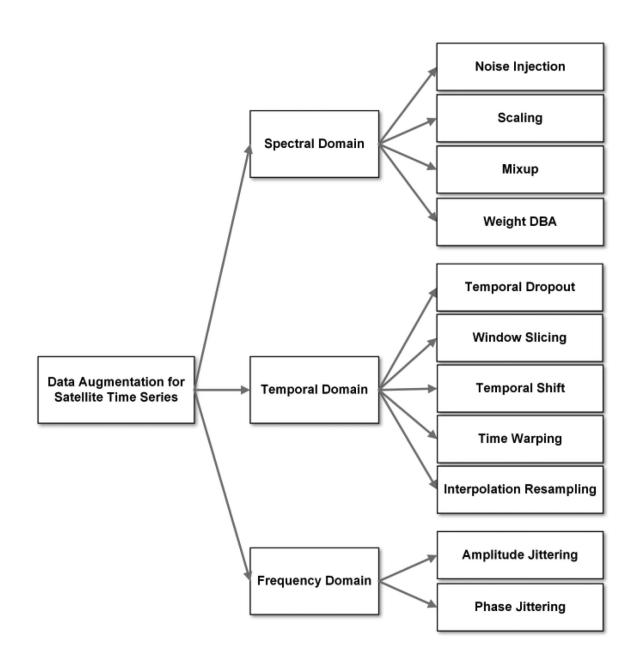
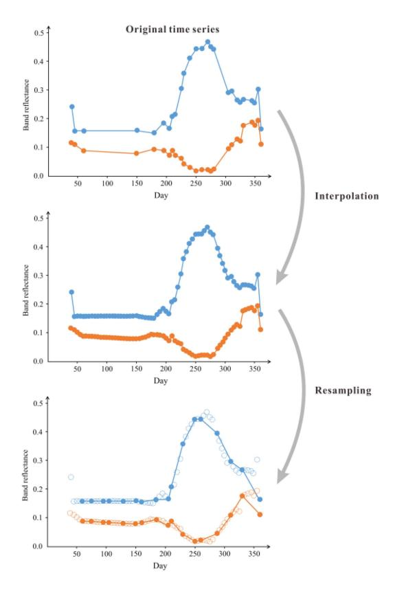
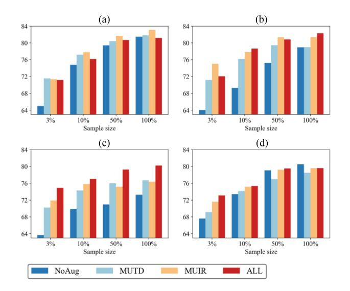
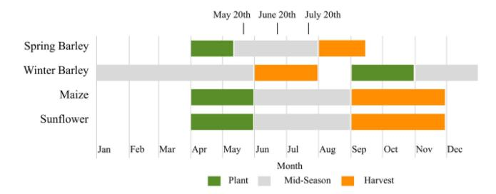
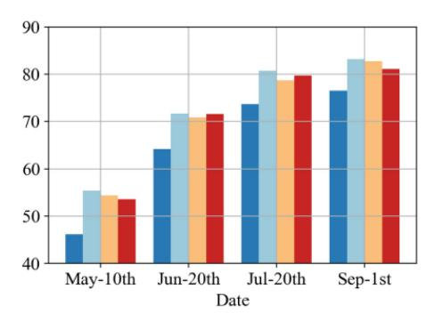
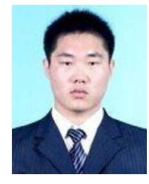

# An Empirical Study on Data Augmentation for Pixelwise Satellite Image Time-Series Classification and Cross-Year Adaptation

Yuan Yuan ®, Lei Lin ®, Qi Xin ®, Zeng-Guang Zhou ®, and Qingshan Liu ®, Senior Member, IEEE

Abstract—Satellite image time series (SITS) are widely used for land cover mapping and vegetation monitoring. Despite the success of deep learning methods in SITS classification, their performance strongly depends on large labeled datasets. Data augmentation is a cost-effective strategy to prevent deep learning models from overfitting with limited labeled data, but its effectiveness for SITS has yet to be thoroughly explored. This paper provides an empirical study of 11 alternative augmentation techniques for pixelwise satellite time series, including noise injection, scaling, mixup, weighted dynamic time warping barycentric averaging, temporal dropout, window slicing, temporal shift, time warping, interpolation resampling, amplitude jittering, and phase jittering. Notably, interpolation resampling was introduced to handle irregularly sampled satellite time series, enhancing model robustness to data incompleteness and spatiotemporal heterogeneity. We evaluated the performance gains of different augmentation techniques and their combinations on both same-year and cross-year test data under varying conditions (sequence length, sample size, time period, parameter setting) and assessed their processing speeds. Based on the results, we summarized the conditions under which different augmentation techniques are effective and provided a systematic analysis of their performance. Our study offers practical guidance for data augmentation in various SITS classification applications.

*Index Terms*—Classification, data augmentation, deep learning, interannual adaption, satellite image time series (SITS).

Received 24 September 2024; revised 11 December 2024; accepted 4 January 2025. Date of publication 8 January 2025; date of current version 13 February 2025. This work was supported in part by the National Key Research and Development Program of China under Grant 2022YFF0711703, in part by the National Natural Science Foundation of China under Grant 62471245, and Grant 41901356, in part by the Natural Science Research of Jiangsu Higher Education Institutions of China under Grant 23KJB420006), and in part by the Youth Innovation Promotion Association CAS under Grant 2023140. (Corresponding authors: Zeng-Guang Zhou; Qingshan Liu.)

Yuan Yuan and Qingshan Liu are with the School of Computer and Software, Nanjing University of Information Science and Technology, Nanjing 210044, China, and also with the School of Computer Science, Nanjing University of Posts and Telecommunications, Nanjing 210023, China (e-mail: yuanyuan@njupt.edu.cn; qsliu@njupt.edu.cn).

Lei Lin is with Skywork Team, Kunlun Inc., Beijing 100005, China (e-mail: linlei1214@163.com).

Qi Xin is with the School of Internet of Things, Nanjing University of Posts and Telecommunications, Nanjing 210023, China (e-mail: 19852888123@163.com).

Zeng-Guang Zhou is with the Aerospace Information Research Institute, Chinese Academy of Sciences, Beijing 100094, China (e-mail: zhouzg@aircas.ac.cn).

The source code is available at https://github.com/linlei1214/SITS-Aug. Digital Object Identifier 10.1109/JSTARS.2025.3527017

# I. INTRODUCTION

RECENT years have witnessed remarkable advancements in low-Earth orbit satellite constellation technology, leading to an explosive growth in satellite image time series (SITS) with high spatial resolution and short temporal intervals. This has offered unprecedented opportunities for various remote sensing applications, including land cover mapping and vegetation monitoring [1], [2], [3]. To cope with the high-dimensionality challenge posed by SITS, deep learning has become an inevitable trend due to its outstanding feature learning capability [4]. Deep neural networks, such as convolutional neural networks (CNNs) [5], [6], recurrent neural networks [RNN, including long short-term memory (LSTM) and gated recurrent units] [7], [8], self-attention networks (or transformer) [9], [10], and hybrid models [11], [12], have emerged as powerful tools for SITS classification.

However, current mainstream supervised deep learning methods rely heavily on vast amounts of labeled data. In remote sensing, data annotation is labor-intensive, time-consuming, and expensive. This makes it challenging to collect sufficient training samples. Due to cognitive biases of human annotators and inaccessible field sites, it is often impractical for the training data to cover all possible real-world situations [13], [14]. Unsupervised learning methods, such as K-means- dynamic time warping (DTW) [15] and deep transformation-invariant time series [16], do not rely on labeled samples but instead automatically cluster samples based on the principle of intra-class similarity. These methods are particularly effective in capturing intraclass variability, making them a potential alternative to supervised learning approaches. However, these methods still require manual annotation assistance, and their performance is generally inferior to that of supervised methods. In a word, the shortage and low quality of labeled data hinder the full exploitation of deep learning methods in SITS classification

Data augmentation is a cost-effective way to increase the size and diversity of labeled samples by generating new samples through appropriate transformations while keeping the labels correct. This process is dataset-dependent and necessitates professional expertise [17]. Typically, SITS are classified at either object level or pixel level [18], [19], [20]. For object-based approaches, common image augmentation techniques like scaling, cropping, flipping, and rotation can be directly applied to each

image in a time series to synthesize new samples [21], [22], [23], [24]. However, for pixel-based approaches, data augmentation techniques are infrequently used due to the complexity of the data. While several review studies have delved into time-series augmentation [25], [26], [27], [28], their scope did not extend to the methods' application to SITS. Several recent studies have investigated data augmentation for remote sensing imagery [29], [30], [31], [32]. However, they only concentrated on single-scene images, neglecting the crucial aspect of temporal information.

This study primarily focuses on pixelwise time series derived from optical satellite imagery, such as Sentinel-2. Compared to general time-series data that prior studies have mainly concentrated on, satellite time series are particular in the following aspects.

- 1) *Multivariate:* Satellite time series generally involve several interrelated variables, such as multiple spectral bands.
- Incompleteness: Satellite time series often have unequal sampling intervals and varying lengths due to cloud contamination.
- Label ambiguity: A single satellite time series may be characterized by more than one class label due to mixed pixels [33].
- 4) Spatiotemporal heterogeneity: Satellite time series of the same land cover type vary across different years and regions due to phenology discrepancies and observation time variations [34], [35].

Given these characteristics, certain augmentation techniques that are effective for general time-series data may not be suitable for satellite time series. For instance, permutation (rearranging subsequences derived from a time series) [36] can violate the intrinsic vegetation phenological patterns in satellite time series [37], resulting in unrealistic samples. This rationale also applies to other augmentation techniques such as flipping, reversing, cutmix (replacing part of a time series with the corresponding time period in another series, which may introduce phenological errors) [38], magnitude warping (changing the magnitude of each time points differently, which may lead to unrealistic changes in spectral trajectories) [36], etc. In addition, specific augmentation techniques that are tailored to the unique properties of satellite time series still need to be further explored.

Recently, deep generative models have emerged as promising data augmentation techniques for time-series data, among which generative adversarial networks (GANs) [39] are popular methods to generate synthetic samples and increase the training set effectively. For instance, TimeGAN combines adversarial training with a supervised loss and embedding network to synthesize realistic time-series data while preserving temporal dependencies [40]. Time-series GAN focuses on improving the stability and performance of GANs in generating time-series data by leveraging Wasserstein distance for loss optimization and incorporating conditional generation to ensure the synthetic data retains key characteristics of the original series [41]. However, due to the complex architecture and training requirements of such models, deep generative models like GANs are currently rarely employed as data augmentation methods for satellite time series in prior studies, despite their significant potential to enhance model robustness and performance.

This article presents the first empirical study on data augmentation for pixelwise satellite time series, with the aim of improving classification performance. The main contributions are outlined as follows.

- 1) We comprehensively evaluate ten existing time-series augmentation techniques, including noise injection, scaling, mixup, weighted dynamic time warping barycentric averaging (DBA), temporal dropout, window slicing, temporal shift, time warping, amplitude jittering, and phase jittering, for pixel-wise satellite time-series classification using four popular neural network architectures: CNN, RNN, transformer, and hybrid models.
- 2) We introduce a new data augmentation technique called interpolation resampling, specifically designed for irregularly sampled satellite time series. This technique addresses the challenges brought by the inherent incompleteness and observation time variations of SITS, achieving significant performance improvements in situations of severe missing data and cross-year adaptation.
- We evaluate the interannual adaptability of augmentation techniques by applying models trained on single-year augmented data to different year data.
- 4) We summarize the conditions for the applicability of different augmentation techniques and provided reasonable explanations for their effectiveness or failure.

The findings in this study offer practical guidance for selecting data augmentation techniques for various SITS classification tasks. The source code is available on GitHub for further use and research.

# II. RELATED WORK

Time-series augmentation methods can be broadly categorized into two groups: basic and advanced [27]. Basic methods apply preset transformations on the training data, providing straightforward and computationally efficient ways to generate new samples. Conversely, advanced methods, such as variational autoencoders [42], [43], GANs [40], [41], [44], and diffusion models [45], use generative models to learn the data distribution of a training set and create new samples. While advanced methods can capture the underlying data distribution, they often require more computational resources and may be complex to implement and fine-tune. Considering these factors, this study primarily focuses on basic augmentation methods. A significant advantage of basic methods is their off-the-shelf applicability across various applications, eliminating the need for external training [25].

In the fields of remote sensing, several time-series augmentation methods have been explored with promising results. For instance, Ondieki [46] explored the effects of mixup and its variant, manifold mixup, on Sentinel-2 time series and confirmed that these techniques can enhance crop classification performance. Garnot et al. [47] introduced temporal dropout for multimodal satellite time-series classification to reduce the over-reliance of the model on a single modality. Temporal dropout has also been applied for instance segmentation [48] and rapeseed recognition [49] based on multitemporal satellite images. Barriere and Claverie [50] showcased a window slicing-based method to

simulate pre-harvest data for in-season crop classification. Jo et al. [51] developed a temporal shift augmentation method to simulate early- and late-planting rice. Temporal shift has also been adopted to simulate cross-regional variations in crop phenology [52]. Xu et al. [53] combined three data augmentation methods, i.e., noise injection, temporal shift, and temporal dropout, to create two positive views in a contrastive learning framework for pretraining on Sentinel-2 time series.

Although data augmentation has seen preliminary application in the aforementioned scenarios, a detailed investigation of these techniques and their combinations for pixel-wise satellite time-series classification remains absent. In addition, the unique characteristics of satellite time series, especially the incompleteness and spatio-temporal heterogeneity, have not been fully considered in the design of augmentation methods.

The most relevant prior work [25] to our study systematically evaluated 12 time-series augmentation methods on general time-series data. While their contributions are valuable, our study differs in the following three key aspects:

- our research primarily targets satellite time series and, consequently, draws distinct conclusions;
- we evaluate augmentation techniques using modern neural network architectures tailored for satellite time-series classification, including the transformer [9] and channel attention-based temporal convolutional network (CATCN) [11], whereas the prior study employed conventional architectures;
- 3) in addition to surveying existing techniques, we propose a novel augmentation method, interpolation resampling, specifically designed for satellite time series to accommodate missing data and observation time variations.

#### III. DATA AUGMENTATION METHODS

First, we provide a taxonomy of the data augmentation techniques considered in this study, as illustrated in Fig. 1. Eleven augmentation techniques are examined (Fig. 2), which are organized into three categories based on the space in which a transformation is performed: spectral-domain, temporal-domain, and frequency-domain. Specifically, spectral-domain augmentation is defined as directly varying the spectral reflectance (or spectral indices) of satellite time series, including *noise injection*, *scaling*, *mixup*, and *weighted DBA*. Temporal-domain augmentation is defined as introducing variability into the temporal locations of satellite time series, including *temporal dropout*, *window slicing*, *temporal shift*, *time warping*, and *interpolation resampling*. Frequency-domain augmentation is defined as perturbing the amplitude or phase spectrum of satellite time series after Fourier transform, including *amplitude jittering* and *phase jittering*.

To our knowledge, weighted DBA, time warping, amplitude jittering, and phase jittering have not been previously applied to SITS augmentation. Interpolation resampling is first introduced as a specific data augmentation method for irregularly sampled satellite time series.

Before introducing the specific techniques, let us first provide the mathematical definitions. Consider a pixelwise satellite time series denoted by  $X = \{x_1, \dots, x_L\} \in \mathbb{R}^{L \times D}$ , where

Fig. 1. Taxonomy of the surveyed data augmentation techniques for pixelwise satellite time series.

L represents the length of the time series and D denotes the number of dimensions (i.e., spectral bands). The corresponding series of observation times is  $T = \{t_1, \ldots, t_L\}$ . Therefore,  $x_i \in \mathbb{R}^D$  is the observation acquired at time  $t_i$ . It is assumed that cloud-contaminated observations have been removed from the series, allowing the intervals between consecutive times  $t_i$  and  $t_{i+1}$  to vary. For convenience, we denote  $x^d$  as the dth univariate time series of a specific spectral band.

#### A. Spectral Domain Augmentations

Noise injection directly adds zero-mean Gaussian noise  $\mathcal{N}(0,\sigma_{NI}^2)$  with a user-specified standard deviation  $\sigma_{NI}$  to an input time series, enhancing model robustness to additive noise [36]. The noise added to each spectral band of the observation is independent and identically distributed. Formally, noise injection can be defined as follows:

$$\tilde{X} = \{x_1 + \epsilon_1, \dots, x_i + \epsilon_i, \dots, x_L + \epsilon_L\}$$
 (1)

where  $\epsilon_i \in \mathbb{R}^D$  is a vector of independent noise terms added to each spectral band of the observation, where each component  $\epsilon_i^d$  of the noise vector is drawn from a Gaussian distribution  $\epsilon_i^d \sim \mathcal{N}(0, \sigma_{\mathrm{NI}}^2)$ .

Scaling multiplies each univariate time series by a scaling factor randomly drawn from a Gaussian distribution  $\mathcal{N}(1,\sigma_{\text{SC}}^2)$  with a mean of 1 and a user-specified standard deviation  $\sigma_{\text{SC}}$  [36]. This technique aims to enhance model robustness to multiplicative noise. In our setup, the scaling factor is unique for each spectral band and is independently generated from the same distribution. Scaling can be formally defined as follows:

$$\tilde{\boldsymbol{X}} = \left\{ s^1 \boldsymbol{x}^1; \dots; s^d \boldsymbol{x}^d; \dots; s^D \boldsymbol{x}^D \right\}$$
 (2)

where  $s^d$  is the scaling factor for a specific spectral band,  $s^d \sim \mathcal{N}(1,\sigma_{\text{SC}}^2).$ 

Fig. 2. Example of the surveyed augmentation techniques on a yearly Sentinel-2 time series. (a) Original time series. (b) *Noise injection*. (c) *Scaling*. (d) *Mixup*. (e) *Weighted DBA*. (f) *Temporal Dropout*. (g) *Window slicing*. (h) *Temporal shift*. (i) *Time warping*. (j) *Interpolation resampling*. (k) *Amplitude jittering*. (l) *Phase jittering*. Only two spectral bands (red and NIR) are shown for clarity. Red and cyan represent the spectral trajectories of the red band and NIR band, respectively. In (b)–(l), gray represents the original time series. In (d)–(e), yellow represents the randomly selected time series to be mixed or averaged.

Mixup, initially an image augmentation technique [17], has been adapted for time-series data [46]. It linearly combines two samples and their class probability vectors at a specified ratio to create a new sample. The class probability vector of a training sample is a one-hot encoding vector, featuring all zeros except for a single one at the target class. The mixing weight,  $\lambda$ , is randomly chosen from a Beta distribution  $B(\alpha, \alpha)$ , for  $\alpha \in (0, \infty)$ . Mixup is designed to simulate mixed pixels in remote sensing images, thereby enhancing the robustness of neural networks against label ambiguity. Two training samples are randomly selected and mixed on the same date

$$\begin{split} \tilde{\boldsymbol{X}} &= \lambda \boldsymbol{X}_i + (1 - \lambda) \, \boldsymbol{X}_j, \\ \tilde{\boldsymbol{y}} &= \lambda \boldsymbol{y}_i + (1 - \lambda) \, \boldsymbol{y}_j. \end{split} \tag{3}$$

Here,  $(X_i, y_i)$  and  $(X_j, y_j)$  are two randomly selected samples from the training set, with  $X_i, X_j$  representing the time-series data and  $y_i, y_j$  representing the one-hot encoding vectors. If acquisition dates differ, one time series is interpolated to match the other before mixing.

Weighted DBA is an augmentation technique derived from a time-series averaging method called DTW barycentric averaging (DBA) [54]. This method computes a weighted average of time series within the same category using the DTW distance metric to ensure balanced class distributions [55]. We use a simple strategy to allocate weights to each contributing time series. First, an initial time series, denoted as  $X^*$ , is chosen from the training set with an assigned weight of 1, serving as the initial medoid for DBA [54]. Subsequently, 5 candidate time

series, consistent with the category of  $X^*$ , are extracted from the training set. Among these candidates, only the one that is nearest to  $X^*$ , denoted as  $X^\circ$ , is retained and assigned a weight of 0.5. Finally, the weighted DBA algorithm computes the average time series based on  $X^*$  and  $X^\circ$ , normalized by their weights

$$\tilde{\boldsymbol{X}} = \text{DBA}(\boldsymbol{X}^*, 0.5\boldsymbol{X}^\circ) \tag{4}$$

where the  $DBA(\cdot)$  function represents the DBA algorithm that computes the weighted average time series of the two sequences. Weighted DBA has no hyperparameters for tuning.

#### B. Temporal Domain Augmentations

Temporal dropout randomly discards some observations in a time series to enhance model robustness to missing data in optical satellite time series [47]. A dropout ratio  $0 \le r_{\rm TD} < 1$  controls the probability of a time point being dropped out. When a time point is dropped, all variables at that point are discarded. The augmented time series and the corresponding timestamps are defined as follows:

$$\tilde{X} = \{x_i | i \in S\}$$

$$\tilde{T} = \{t_i | i \in S\}$$
(5)

where S is a random subset of the indices  $[1, 2, \ldots, L]$ , with each index i being independently selected with a probability of  $(1 - r_{\text{TD}})$ .

Window slicing randomly crops a subsequence from the original time series to create a new sample, preventing neural networks from over-relying on specific time ranges [26]. The

length of the cropped subsequence can vary, being either equal or unequal to other subsequences, depending on the specific implementation. Given that satellite time series naturally vary in length, we utilize a cropping ratio,  $0 < r_{\rm WS} \le 1$ , to control the length of the cropped subsequence relative to the original time series. Window slicing is defined as follows:

$$\tilde{X} = \{x_{\varphi}, \dots, x_{\varphi+W-1}\}$$

$$\tilde{T} = \{t_{\varphi}, \dots, t_{\varphi+W-1}\}$$
(6)

where  $\varphi$  is the initial index from which the slicing is performed, W is the length of the cropped subsequence.  $W=r_{\rm WS}\times L$  and  $1\leq \varphi \leq L-W$  to ensure the subsequence is within the bounds of the original series.

Temporal shift involves randomly shifting the acquisition dates of a satellite time series forward or backward by  $|\delta|$  days [52], enhancing model generalization to linear phenological shifts across different years and regions. The value of  $\delta$  is sampled from a Uniform distribution  $U(-\Delta_{\rm TS}, \Delta_{\rm TS})$ , where  $\Delta_{\rm TS}$  defines the maximum allowable shift in days. The modified time series is given by:

$$\tilde{X} = X$$

$$\tilde{T} = \{t_1 + \delta, \dots, t_i + \delta, \dots, t_L + \delta\}$$
(7)

where  $\delta$  is an integer sampled uniformly from the interval  $[-\Delta_{TS}, \Delta_{TS}]$ .

Time warping smoothly distorts the timeline of a satellite time series, enhancing model generalization to nonlinear phenological shifts. Based on the implementation in [36], a smooth warping curve maps the original time points to their new positions, which is characterized by a cubic spline with knots sampled from a Gaussian distribution  $\mathcal{N}(1,\sigma_{\text{TW}}^2)$  with a mean of 1 and a user-defined standard deviation  $\sigma_{\text{TW}}$ . Initially, an irregularly-sampled time series is interpolated into a regularly-sampled format. Then, the original time points  $\{t_1,\ldots,t_L\}$  are mapped to new positions  $\{\tau(t_1),\ldots,\tau(t_L)\}$  using a warping function  $\tau(\cdot)$  determined by the warping curve. The observations at these new, warped timestamps are calculated by interpolating the original data according to the newly defined timeline

$$\tilde{\bm{X}} = \left\{ \tilde{\bm{x}}^1; \dots; \tilde{\bm{x}}^d; \dots; \tilde{\bm{x}}^D \right\}$$
  $\tilde{\bm{T}} = \bm{T}.$  (8)

Each univariate time series  $\tilde{x}^d = \{x^d(\tau(t_1)), \dots, x^d(\tau(t_i)), \dots, x^d(\tau(t_L))\}$  is processed independently using the same warping function, where  $x^d(\tau(t_i))$  denotes the dth observation acquired at time  $\tau(t_i)$ .

Interpolation Resampling is a novel data augmentation technique specifically designed for pixelwise satellite time series. Satellite time series are often irregularly sampled due to cloud cover and sensor availability. Additionally, satellite time series collected across different years typically have different timestamps, leading to potential temporal misalignments. Classification models trained on such data can suffer from performance degradation when faced with missing observations or temporal inconsistencies during inference. Interpolation resampling

Fig. 3. Illustration of the proposed Interpolation Resampling augmentation method.

addresses these challenges by generating augmented time series that modify the temporal distribution of acquisition dates while preserving the original shape of the series. This simulates various temporal configurations, exposing the model to diverse temporal patterns and improving its robustness to missing data and variations in observation times.

Below, we detail the step-by-step procedure of the technique (see Fig. 3):

Step 1. Input Time Series

Start with an original satellite time series  $X = \{x^1; \ldots; x^d; \ldots; x^D\}$  and the corresponding timestamps  $T = \{t_1, \ldots, t_L\}$ , where  $x^d = \{x^d(t_i), \ldots, x^d(t_L)\} \in \mathbb{R}^L$  denotes the dth univariate time series. The series may be irregularly sampled.

## Step 2. Interpolation to a Regular Grid

Interpolate each univariate time series  $x^d$  to a new, regularly sampled timestamp set

$$T_{\text{reg}} = \{t_{\text{reg}, 1}, t_{\text{reg}, 2}, \dots, t_{\text{reg}, M}\}$$
 (9)

where M is the length of the regularly-sampled series, determined by the satellite's revisit period. Linear interpolation is used in this work, but other methods such as spline or cubic interpolation are also applicable. The interpolated time series is

denoted as follows:

$$\boldsymbol{X}_{\text{reg}} = \left\{ \boldsymbol{x}_{\text{reg}}^{1}; \dots; \boldsymbol{x}_{\text{reg}}^{d}; \dots; \boldsymbol{x}_{\text{reg}}^{D} \right\}$$
 (10)

where  $x_{\text{reg}}^d = \{x^d(t_{\text{reg}, 1}), \dots, x^d(t_{\text{reg}, M})\}.$ 

# Step 3. Random Temporal Resampling

Define the resampling ratio  $r_{\rm RS}$ , which determines the length N of the augmented time series relative to the original series. Specifically,  $N=r_{\rm RS}\ \times L$  and  $N\leq M$ . By adjusting  $r_{\rm RS}$ , the generated time series can be either more densely sampled  $(r_{\rm RS}>1)$  or more sparsely sampled  $(r_{\rm RS}<1)$ . Randomly select N timestamps from  $T_{\rm reg}$  to form a new timestamp set

$$\tilde{T} = \{t_1', \dots, t_i', \dots, t_N'\} \tag{11}$$

where  $t_i' \in T_{\text{reg}}$ . Use the interpolated univariate series  $x_{\text{reg}}^d$  to construct the augmented time series:

$$\tilde{\boldsymbol{X}} = \{\tilde{\boldsymbol{x}}^1; \dots; \tilde{\boldsymbol{x}}^d; \dots; \tilde{\boldsymbol{x}}^D\}$$
 (12)

where each resampled univariate series is  $\tilde{\boldsymbol{x}}^d = \{x^d(t_1'), \dots, x^d(t_N')\}$ . The final output is the augmented time series  $\tilde{\boldsymbol{X}}$  and its corresponding new timestamps  $\tilde{\boldsymbol{T}}$ .

#### C. Frequency Domain Augmentations

Frequency-domain augmentations are popular for audio and speech recognition tasks [25]. However, they are rarely used for satellite time series. Here we consider two prevailing Fourier transform-based augmentation techniques: *Amplitude jittering* and *phase jittering* [56]. Since Fourier transform requires evenly-spaced signals without gaps, we first interpolate satellite time series at regular intervals.

Amplitude jittering is an augmentation technique that involves perturbing the amplitude spectrum of a time series in the frequency domain by replacing a segment of the amplitude spectrum with Gaussian random noise  $\mathcal{N}(\mu, \sigma^2)$ , where the mean  $\mu$  and the standard deviation  $\sigma$  are calculated per-band over the segment. The length of the changed segment to the entire time series is controlled by a change ratio  $r_{\rm AJ}$ .

Phase jittering is an augmentation technique that involves perturbing the phase spectrum of a time series by adding zero-mean Gaussian noise. The intensity of the noise is controlled by a user-defined hyperparameter  $\beta_{PJ}$ , which indicates the ratio of the standard deviations between the noise distribution and the original time series.

#### IV. DESIGN OF EXPERIMENTS

#### A. Data Description

Our experiments were conducted on two pixel-wise crop classification benchmarks: TimeSen2Crop [57] and BreizhCrops [58]. The TimeSen2Crop dataset is collected from 15 Sentinel-2 tiles between September 2017 and September 2018, covering the entirety of Austria. We adhered to the official train/validation/test splits described in the original paper, ensuring that the samples in each set were derived from distinct Sentinel-2 tiles. Additionally, we utilized another test set provided by the dataset, collected between September 2018 and

TABLE I Hyperparameter Search Space for Different Augmentation Methods

| Method                      | Hyperparameter       | Search space                 |
|-----------------------------|----------------------|------------------------------|
| Noise Injection             | $\sigma_{\rm NI}$    | 0.01, 0.02, 0.05, 0.1        |
| Scaling                     | $\sigma_{\rm SC}$    | 0.01, 0.02, 0.05, 0.1        |
| Mixup                       | α                    | 1, 2, 8, 32                  |
| Temporal Dropout            | $r_{\rm TD}$         | 0.1, 0.3, 0.5                |
| Window Slicing              | $r_{\rm WS}$         | 0.5, 0.7, 0.9                |
| Temporal Shift              | $\Delta_{\text{TS}}$ | 10, 20, 30                   |
| Time Warping                | $\sigma_{\rm TW}$    | 0.1, 0.2, 0.3                |
| Interpolation Resampling | $r_{\rm IR}$         | 0.5, 0.7, 0.9, 1.0, 1.1, 1.3 |
| Amplitude Jittering         | $r_{\rm AJ}$         | 0.1, 0.3, 0.5                |
| Phase Jittering             | $\beta_{\text{PJ}}$  | 0.01, 0.02, 0.05, 0.1        |

August 2019, to evaluate the performance of data augmentation for inter-annual adaptation. The BreizhCrops dataset consists of Sentinel-2 image time series from the entire year of 2017. The dataset is partitioned into four regions (FRH01–FRH04). In this study, we used FRH01 for training, FRH03 for validation, and FRH02 for evaluation.

We used raw L2A-level Sentinel-2 data provided by the original datasets. For the TimeSen2Crop dataset, we considered nine spectral bands: blue (B2–490 nm), green (B3–560 nm), red (B4–665 nm), four vegetation red edge bands (B5–705, B6–740, B7–783, B8A–865 nm), and two shortwave infrared (SWIR) bands (B11–1610, B12–2190 nm). For the BreizhCrops dataset, we used ten spectral bands: B2, B3, B4, B5, B6, B7, B8 (NIR–832 nm), B8A, B11, and B12.

For both datasets, we randomly selected 10% of the training samples and split them into five folds to assess the effectiveness of data augmentation with small sample sizes. Along with the reduced training set, we also created a 10% reduced validation set for hyperparameter selection. All selected training samples contained at least 5 cloud-free observations. In particular, for the TimeSen2Crop dataset, the training, validation, and test set sizes were 16 357 (per fold), 11 636, 133 419 (same-year), and 139 593 (cross-year), respectively. For the BreizhCrops dataset, the corresponding sizes were 4243, 4039, and 170 392, respectively.

All samples were standardized using z-normalization per band [4]. Time-series interpolation was not performed by default, unless explicitly stated in specific augmentation methods. When necessary, we employed linear interpolation, which has proven efficient and effective in our experiments.

#### B. Method Implementation

Table I outlines the hyperparameter search spaces for different augmentation methods. Besides analyzing each method individually, we also explored various combinations of them. Given the vast number of possible combinations, we focused our discussion on a few selected techniques. The principle for selecting candidate methods for combination was that they have proven effective individually. In experiments using a single augmentation method, each training sample was transformed online. For experiments involving combined augmentation methods,

Bi-LSTM

Transformer

| PARAMETERS OF THE CONSIDERED NEURAL NETWORKS |            |                                   |       |  |  |
|----------------------------------------------|------------|-----------------------------------|-------|--|--|
| Model                                        | Parameters | Hyper-parameter                   | Value |  |  |
|                                              |            | Number of 1D-convolutional layers | 3     |  |  |
|                                              |            | Channels                          | 128   |  |  |
| 1D-CNN                                       | 726K       | Kernel size                       | 5     |  |  |
|                                              |            | Padding                           | 0     |  |  |

Activation function

Hidden size

Dropout

Dropout

Bidirectional

encoder lavers

Attention heads

Numer of LSTM layers

Numer of Transformer

Feedforward dimension

Activation function

Relu

True

0.2

3

8

512

Relu

0.2

0.2

3 128

TABLE II

Numer of CA-TCN blocks 4 3 Kernel size 64 Hidden size CA-TCN 50K Reduction index 4 Dilation factors [1, 2, 4, 8]Activation function Relu Dropout 0.28

each method was applied to each sample with a probability of 50%.

#### C. Evaluated Deep Learning Models

1107K

631K

We considered four basic deep learning models for SITS classification: the one-dimensional convolutional neural network (1D-CNN, or TempCNN) [5], the bidirectional long-short term memory (Bi-LSTM) network [59], Transformer [9], and CA-TCN [11]. These models represent the four most commonly used architectures in SITS classification tasks: CNN-based, RNN-based, attention-based, and hybrid models [11]. We chose these models based on their performance demonstrated in recent studies and their different mechanisms for capturing temporal structures in sequential data. Positional encoding [18] was employed for all models to handle the irregularly sampling issue. Since the primary goal of this study was to investigate the applicability of data augmentation on different deep learning architectures, we use the network setting presented in Table II without parameter tuning.

#### D. Experiment Settings

All models were implemented using the PyTorch framework. Each model was trained for 500 epochs with a batch size of 128, using the Adam optimizer (learning rate = 0.001) and crossentropy loss. Early stopping was applied if the validation loss did not improve for 100 epochs, and the best model was selected based on minimum validation loss.

We used the macroaveraged F1-score (F1-score for short) to assess the performance of different augmentation techniques. Results were averaged over 5 training folds. To determine the effectiveness of a specific technique, a one-sided T-test was conducted at a 0.05 significance level. An augmentation technique is

considered effective if it improves F1-scores across all training folds and the p-values are below the significance level compared to no augmentation.

#### V. RESULTS AND ANALYSIS

#### A. Comparison of Augmentation Techniques on Same-Year Test Data

Table III reports the classification accuracies achieved on the same-year test data using different augmentation techniques. Among spectral-domain augmentations, only Mixup consistently improves performance across all models. This success is due to Mixup's alignment with the composition of mixed pixels in multispectral images. According to the linear spectral mixing model, a mixed pixel's spectrum is a blend of its pure components' spectra, weighted by their coverage ratios [60]. From this perspective, Mixup acts as a natural method for simulating mixed pixels commonly found in remote sensing images. Conversely, noise injection and scaling do not enhance performance as they disrupt the multivariate relationships between spectral bands. Despite being similar to Mixup, weighted DBA performs poorly due to several reasons. First, satellite time series, especially for crops, exhibit large intra-class variations due to diverse factors, such as different local crop calendars, weather/soil conditions, and land management [61]. Averaging two or more time series may fail to capture these subtle variations, resulting in a generalized representation that might not be representative of any specific instance. Second, the DBA algorithm tends to map multiple time points from one series to the same position in another series [54], causing unrealistic alterations in the corresponding observations. Third, averaging samples from the same class results in less diversity compared to mixing samples from different classes, as Mixup takes advantage of the variability between distinct classes.

Among all temporal-domain augmentations, temporal dropout and interpolation resampling show outstanding results. These methods preserve the spectral trajectories while changing temporal positions. In contrast, temporal shift and time warping do the opposite. Window slicing, as a special case of temporal dropout, performs relatively worse due to limited diversity and possible selection of uninformative subsequences. For example, selecting a subsequence during summer while the sample represents a winter crop may lead to misleading augmented data.

Both frequency-domain augmentations fail to improve classification performance. This may be because satellite time series, sampled at much lower frequencies than acoustic data, record discrete events or terrestrial changes. Therefore, any perturbation in the frequency domain might introduce artifacts that do not represent the true underlying phenomena, rendering the augmented data ineffective.

# B. Comparison of Augmentation Techniques on Cross-Year Test Data

Table IV presents the classification accuracies achieved on the cross-year test data of TimeSen2Crop. Notably, time warping

| Method                   | TimeSen2Crop |              |              |              | BreizhCrops  |              |              |              |
|--------------------------|--------------|--------------|--------------|--------------|--------------|--------------|--------------|--------------|
| Method                   | 1D-CNN       | Bi-LSTM      | Transformer  | CA-TCN       | 1D-CNN       | Bi-LSTM      | Transformer  | CA-TCN       |
| None                     | 77.68        | 76.50        | 80.98        | 77.63        | 44.84        | 48.35        | 51.05        | 51.55        |
| Noise Injection          | 77.20        | 77.11        | 81.23        | 78.27        | 44.59        | 48.34        | 50.59        | 52.53        |
| Scaling                  | 77.51        | 77.69        | 82.05        | <u>79.12</u> | 44.80        | 48.32        | 50.98        | 51.78        |
| Mixup                    | <u>79.98</u> | <u>82.89</u> | <u>82.13</u> | <u>79.81</u> | <u>54.27</u> | <u>54.52</u> | <u>55.98</u> | <u>54.47</u> |
| Weighted DBA             | 76.75        | 77.67        | 80.30        | 77.34        | 43.96        | 48.28        | 51.05        | 51.57        |
| Temporal Dropout         | 77.08        | <u>79.56</u> | 83.50        | 77.32        | 47.83        | <u>51.88</u> | <u>55.49</u> | <u>54.06</u> |
| Window Slicing           | <u>78.10</u> | 78.00        | 80.63        | 75.19        | 48.53        | 51.22        | 53.88        | 53.03        |
| Temporal Shift           | 76.90        | 75.81        | 80.79        | 76.74        | 45.49        | 47.99        | 50.27        | 51.32        |
| Time Warping             | 77.53        | 77.31        | 81.04        | <u>78.37</u> | 45.62        | 49.47        | 53.00        | 52.30        |
| Interpolation Resampling | 77.33        | 78.02        | 82.09        | 77.20        | <u>49.86</u> | 52.39        | <u>55.93</u> | 54.27        |
| Amplitude Jittering      | 78.02        | 77.54        | 80.85        | 76.62        | 44.69        | 48.41        | 50.51        | 51.56        |

TABLE III
F1-Scores of Different Data Augmentation Techniques on the Same-Year Test Set

Note: Techniques passing the significance test are highlighted in bold. The top-3 best techniques for each model are underlined.

81.85

77.43

TABLE IV F1-Scores of Different Data Augmentation Techniques on the Cross-Year Test Set

Phase Jittering

| M.d. I                   | TimeSen2Crop |              |              |              |  |  |  |
|--------------------------|--------------|--------------|--------------|--------------|--|--|--|
| Method                   | 1D-CNN       | Bi-LSTM      | Transformer  | CA-TCN       |  |  |  |
| None                     | 73.51        | 68.80        | 73.00        | 73.41        |  |  |  |
| Noise Injection          | 74.54        | 69.34        | 72.55        | 73.23        |  |  |  |
| Scaling                  | 74.68        | 69.83        | 73.94        | 73.47        |  |  |  |
| Mixup                    | <u>76.35</u> | <u>76.46</u> | 73.77        | <u>74.58</u> |  |  |  |
| Weighted DBA             | 72.59        | 70.07        | 73.93        | 72.38        |  |  |  |
| Temporal Dropout         | 73.14        | 71.91        | <u>76.64</u> | 71.55        |  |  |  |
| Window Slicing           | 74.58        | 71.86        | 72.54        | 67.83        |  |  |  |
| Temporal Shift           | <u>75.24</u> | 70.32        | 74.71        | 73.86        |  |  |  |
| Time Warping             | <u>75.29</u> | <u>74.39</u> | <u>76.20</u> | <u>74.07</u> |  |  |  |
| Interpolation Resampling | 74.62        | <u>76.91</u> | <u>77.37</u> | <u>75.53</u> |  |  |  |
| Amplitude Jittering      | 75.18        | 68.99        | 72.18        | 71.96        |  |  |  |
| Phase Jittering          | 74.72        | 69.17        | 71.47        | 73.79        |  |  |  |

Note: Techniques passing the significance test are highlighted in bold. The top-3 best techniques for each model are underlined.

significantly boosts classification performance across all models. *Temporal shift*, as a special case of *time warping*, fails to yield substantial performance improvement. This implies that nonlinearly perturbing the speed of spectral trajectory timelines is a more natural way to simulate interannual variations than linearly shifting them. *Mixup* and *interpolation resampling* exhibit strong performance on certain models. In particular, *interpolation resampling* outperforms *temporal dropout* and *window slicing* across all models, indicating that altering the temporal positions could enhance the interannual adaptability more effectively than merely discarding several observations. Lastly, neither frequency-domain augmentation method proves effective in cross-year scenarios.

# C. Combination of Augmentation Techniques on Same-Year Test Data

Figs. 4 and 5 display the classification accuracies achieved on the same-year test data using pairwise combinations of four

48.15

50.74

51.34

42.99

78.21

Fig. 4. F1-scores achieved on the same-year test set of TimeSen2Crop via pairwise combinations of four augmentation techniques: *Mixup* (MU), *Temporal Dropout* (TD), *Interpolation Resampling* (IR), and *Time Warping* (TW). Diagonal elements represent the accuracies obtained with a single data augmentation technique.

effective augmentation techniques: *mixup*, *temporal dropout*, *interpolation resampling*, and *time warping*. The results indicate that using two augmentation techniques simultaneously generally leads to greater performance improvements than using either technique alone. The top-performing combinations are *mixup+temporal dropout* and *mixup+interpolation resampling*. This suggests that jointly utilizing augmentation methods in both spectral and spatial domains yields better results than employing either one individually.

Table V reports the classification accuracies achieved on the same-year test data using multiple augmentation techniques. A key finding is that using more augmentation techniques does not consistently lead to increased performance improvements.

|              | Method Usage        |                             |                 |              | TimeSen2Crop |              |              |              | Brei         | zhCrops      |              |
|--------------|---------------------|-----------------------------|-----------------|--------------|--------------|--------------|--------------|--------------|--------------|--------------|--------------|
| Mixup        | Temporal Dropout | Interpolation Resampling | Time Warping | 1D- CNN   | Bi- LSTM  | Transformer  | CA- TCN   | 1D- CNN   | Bi- LSTM  | Transformer  | CA- TCN   |
| ×            | ×                   | ×                           | ×               | 77.68        | 76.50        | 80.98        | 77.63        | 44.84        | 48.35        | 51.05        | 51.55        |
| √            | √                   | ×                           | ×               | <u>81.87</u> | 83.24        | 83.72        | 80.11        | 53.66        | 54.51        | 56.43        | 55.49        |
| $\sqrt{}$    | ×                   | $\checkmark$                | ×               | 82.16        | 82.74        | 82.72        | 79.45        | 54.04        | 54.99        | <u>56.66</u> | <u>56.05</u> |
| $\sqrt{}$    | ×                   | ×                           | $\checkmark$    | 79.07        | 81.89        | 82.85        | 79.23        | 50.45        | 53.04        | 54.73        | 54.94        |
| ×            | $\sqrt{}$           | $\checkmark$                | ×               | 79.34        | 81.17        | 83.27        | 78.65        | 52.70        | 53.78        | 55.59        | 55.42        |
| ×            | $\checkmark$        | ×                           | $\sqrt{}$       | 80.88        | 81.14        | <u>83.51</u> | 79.23        | 50.47        | 52.73        | 54.95        | 55.48        |
| ×            | ×                   | $\checkmark$                | $\sqrt{}$       | 80.03        | 80.46        | 82.60        | 78.97        | 50.91        | 52.85        | 55.02        | 55.11        |
| √            | √                   | √                           | ×               | 80.58        | 82.59        | 83.18        | 78.80        | <u>55.44</u> | <u>55.90</u> | <u>57.41</u> | 55.60        |
| $\checkmark$ | $\sqrt{}$           | ×                           | $\checkmark$    | 81.97        | <u>83.14</u> | <u>85.05</u> | 80.55        | <u>54.40</u> | <u>55.07</u> | 56.04        | <u>56.07</u> |
| $\checkmark$ | ×                   | $\sqrt{}$                   | $\sqrt{}$       | 81.55        | 82.98        | 83.28        | <u>80.16</u> | 53.76        | 54.94        | 55.88        | <u>56.34</u> |
| ×            | $\checkmark$        | $\sqrt{}$                   | $\sqrt{}$       | 79.07        | 80.83        | 82.91        | 78.57        | 52.62        | 54.00        | 55.68        | 55.01        |
| √            | √                   | <b>√</b>                    | √               | 80.64        | 81.14        | 82.61        | 78.65        | 55.56        | 55.78        | 57.28        | 56.04        |

TABLE V
F1-Scores of Different Combinations of Data Augmentation Techniques on the Same-Year Test Set

Note: Techniques passing the significance test are highlighted in bold. The top-3 best techniques for each model are underlined.

Fig. 5. F1-scores achieved on the same-year test set of BreizhCrops via pairwise combinations of four augmentation techniques: MU, TD, IR, TW.

Fig. 6. F1-scores achieved on the cross-year test set of TimeSen2Crop via pairwise combinations of four augmentation techniques: MU, TD, IR, TW.

The best results are typically achieved by integrating two or three augmentation techniques. The simultaneous application of all augmentation techniques tends to degrade classification performance. This can be attributed to the excessive deformation of spectral trajectories induced by augmentation, which surpasses the real variations observed in satellite time series over a year.

# D. Combination of Augmentation Techniques on Cross-Year Test Data

Fig. 6 displays the classification accuracies achieved on the cross-year test data using pairwise combinations of the four selected augmentation techniques. It is noteworthy that combining *time warping* with another technique significantly improves the classification performance across all models. The top-performing combinations are *time warping+temporal dropout* and *time warping+interpolation resampling*.

Table VI reports the classification accuracies achieved on the cross-year test data. Interestingly, using more augmentation techniques generally leads to better results, which contradicts the findings for the same-year test data. For example, for the Bi-LSTM and Transformer models, the best results are achieved by utilizing all augmentation techniques simultaneously. For the 1D-CNN and CA-TCN models, the best results are obtained by using the combination of *mixup*, *interpolation resampling*, and *time warping*. This suggests that integrating *interpolation* 

| Method Usage |                     |                             |                 |              | TimeS        | Sen2Crop     |              |
|--------------|---------------------|-----------------------------|-----------------|--------------|--------------|--------------|--------------|
| Mixup        | Temporal Dropout | Interpolation Resampling | Time Warping | 1D-CNN       | Bi-LSTM      | Transformer  | CA-TCN       |
| ×            | ×                   | ×                           | ×               | 73.51        | 68.80        | 73.00        | 73.41        |
| $\sqrt{}$    | V                   | ×                           | ×               | 76.08        | 75.56        | 76.01        | 74.15        |
| $\checkmark$ | ×                   | $\checkmark$                | ×               | 77.71        | 77.19        | 77.69        | 75.21        |
| $\sqrt{}$    | ×                   | ×                           | $\sqrt{}$       | 76.40        | 77.59        | 77.67        | 75.71        |
| ×            | $\sqrt{}$           | $\checkmark$                | ×               | 75.47        | 77.26        | 78.38        | 75.23        |
| ×            | $\sqrt{}$           | ×                           | $\sqrt{}$       | 78.03        | 76.79        | 79.03        | 74.52        |
| ×            | ×                   | $\checkmark$                | $\checkmark$    | 77.76        | 77.90        | 78.52        | <u>76.97</u> |
| √            | V                   | √                           | ×               | 76.81        | 77.70        | 78.91        | 75.73        |
| $\sqrt{}$    | $\sqrt{}$           | ×                           | $\sqrt{}$       | <u>78.09</u> | <u>78.22</u> | <u>79.99</u> | 75.61        |
| $\checkmark$ | ×                   | $\checkmark$                | $\sqrt{}$       | 78.91        | 78.81        | 80.02        | 77.47        |
| ×            | V                   | $\sqrt{}$                   | $\sqrt{}$       | 76.98        | 78.07        | 79.76        | 76.11        |

TABLE VI F1-Scores of Different Combinations of Data Augmentation Techniques on the Cross-Year Test Set

Note: Techniques passing the significance test are highlighted in bold. The top-3 best techniques for each model are underlined.

76.95

78.87

*resampling* and *time warping* can more realistically simulate the inter-annual variations of satellite time series caused by phenological shifts and observation time variations.

#### VI. DISCUSSION

#### A. Impact of Sequence Length

The length of satellite time series, or the number of clear observations, is one of the key factors for SITS classification [62], [63]. This section explores the performance of various augmentation techniques at varying sequence lengths. We divided the samples from the official training set of the TimeSen2Crop dataset into two groups based on length: one group with fewer than 20 observations (sparse time series) and another group with 20 or more observations (dense time series). Next, we randomly chose 100 samples per class from each group to form a balanced training fold, which has 1600 samples in total. We generate 5 such training folds and train the models separately using these folds. The achieved results using the Bi-LSTM model are shown in Table VII.

For both test sets with sparse time series, only mixup and interpolation resampling effectively improve the performance, with dense resampling  $(r_{\rm IR} > 1)$  consistently outperforms sparse or equal resampling  $(r_{\rm IR} \leq 1)$  in both cases. In particular, interpolation resampling significantly outperformed other methods on the cross-year test set with accuracy gains of 8.2% F1-score. A recent study has revealed that linearly interpolating missing values in satellite time series does not significantly improve land cover classification using recurrent networks [64]. We infer that resampling, not interpolation, is the key factor driving the performance improvement. In contrast, temporal dropout is less effective for sparse time series, as it intensifies the incompleteness of SITS and disrupts continuity between successive time points. It is worth mentioning that BreizhCrops itself is a sparse-sampled time-series dataset, with nearly 85% of the samples having a length of less than 20. According to Table III,

TABLE VII
F1-SCORES OF DIFFERENT DATA AUGMENTATION TECHNIQUES ON THE
TIMESEN2CROP DATASET USING BI-LSTM WITH VARYING TRAINING
SEQUENCES

80.02

75.38

| Mada d                   | Same         | year         | Cross year   |              |  |
|--------------------------|--------------|--------------|--------------|--------------|--|
| Method                   | Sparse       | Dense        | Sparse       | Dense        |  |
| None                     | 56.39        | 65.46        | 57.00        | 57.35        |  |
| Noise Injection          | 55.16        | 66.59        | 58.49        | 56.23        |  |
| Scaling                  | 55.91        | 67.22        | 58.69        | 56.25        |  |
| Mixup                    | <u>64.32</u> | <u>72.07</u> | <u>61.10</u> | 60.52        |  |
| Weighted DBA             | 59.34        | 68.47        | 57.56        | 59.52        |  |
| Temporal Dropout         | <u>59.90</u> | 68.94        | 58.18        | <u>61.30</u> |  |
| Window Slicing           | 58.44        | 67.46        | <u>60.31</u> | 58.03        |  |
| Temporal Shift           | 57.98        | 63.93        | 56.77        | 56.70        |  |
| Time Warping             | 54.70        | 65.96        | 58.84        | 59.99        |  |
| Interpolation Resampling | <u>63.21</u> | 68.18        | <u>65.17</u> | <u>60.68</u> |  |
| Amplitude Jittering      | 56.78        | 66.52        | 57.15        | 57.77        |  |
| Phase Jittering          | 57.08        | 65.99        | 58.15        | 57.06        |  |

Note: Techniques passing the significance test are highlighted in bold. The top-3 best techniques for each model are underlined.

interpolation resampling outperforms temporal dropout on this dataset as well.

For both test sets with dense time series, *temporal dropout* outperforms *interpolation resampling*. This suggests that omitting some observations in dense satellite time series can greatly improve classification performance.

#### B. Impact of Sample Size

The sample size also significantly influences the performance of deep learning models. This section evaluates the effectiveness of different augmentation techniques at varying sample size. We randomly selected 3%, 10%, 50%, and 100% of the training samples of the TimeSen2Crop dataset and tested the models on the

Fig. 7. F1-scores achieved on the same-year test set of TimeSen2Crop with varying sample sizes. Each subfigure's four bars in each group represent the results obtained with no augmentation (NoAug), *Mixup+Temporal Dropout* (MUTD) augmentation, *Mixup+Interpolation Resampling* (MUIR) augmentation, and *Mixup+Temporal Dropout+Interpolation Resampling+Time Warping* (ALL) augmentation, respectively.

Fig. 8. F1-scores achieved on the cross-year test set of TimeSen2Crop with varying sample sizes.

entire test set. Three promising combinations of augmentation techniques were tested: MUTD (mixup + temporal dropout), MUIR (mixup + interpolation resampling), and ALL (mixup + temporal dropout + interpolation resampling + time warping).

As shown in Figs. 7 and 8, in the same-year scenario, the gains in F1-score from data augmentation diminish as the sample size increases. However, in the cross-year scenario, appropriate augmentation methods significantly enhance model performance across all sample sizes. Notably, data augmentation is beneficial for CA-TCN with limited sample sizes but may reduce performance when samples are abundant, due to the model's lightweight nature and lower susceptibility to overfitting. In contrast, larger models like 1D-CNN and Bi-LSTM

Fig. 9. Crop calendar for typical crops in Austria by the USDA foreign agricultural service. The stopping dates are set to May 20th, June 20th, and July 20th according to the crop phenology.

Fig. 10. F1-scores achieved by Bi-LSTM on the same-year test set of Time-Sen2Crop across different time periods. Each group in the subfigures contains four bars, representing the results obtained with NoAug, MUTD, MUIR, and ALL, respectively.

achieve superior performance with sufficient training samples and appropriate augmentations. Specifically, our study achieves an F1-score of 88.61%, surpassing the previous state-of-the-art result of 84.08% [57], highlighting the large potential of data augmentation in SITS classification.

#### C. Impact of Time Period

In crop classification tasks, timely crop identification before harvest is crucial, necessitating the recognition of crops using only the initial fragments of satellite time-series data. This section evaluates various augmentation techniques for early crop mapping on the TimeSen2Crop dataset. Based on the crop calendar for Austria (see Fig. 9), we selected three key dates: May 20th, June 20th, and July 20th. These dates correspond to critical periods before the harvest of spring barley, maize, and sunflower. We used time-series data before each date as model inputs to assess classification performance over time. As in the previous section, we tested three augmentation techniques: MUTD, MUIR, and ALL. Full-season results were also included for comparison.

Fig. 10 shows the classification accuracies achieved by Bi-LSTM on the same-year test set across these time periods. MUTD significantly improves early crop mapping performance, with F1-scores exceeding 70% before June 20th, and provides substantial gains across all periods. Fig. 11 illustrates per-class F1-scores for maize, sunflower, winter barley, and spring barley, with and without MUTD augmentation. Data augmentation leads to the greatest F1-score improvements from mid-season

Fig. 11. F1-score for each crop type with and without MUTD augmentation across varying time periods.

to one month before harvest. For example, augmentation does not improve sunflower classification before May 20th, as it is still in its sowing period. As the time series extends, the benefits of augmentation become more apparent. For winter barley, the greatest gains occur on May 20th, while during the harvest period, F1-scores have saturated (>90%), making further improvements negligible. These results highlight the effectiveness of data augmentation for early crop mapping, particularly during mid-season.

#### D. Parameter Sensitivity Analysis of Interpolation Resampling

This section evaluates the parameter sensitivity of the proposed *interpolation resampling* method.

Fig. 12 compares the F1-scores achieved with different neural networks across varying resampling ratios. The results reveal that the optimal resampling ratios vary across models. Notably, transformers tend to favor smaller resampling ratios, such as 0.5. We hypothesize that this is due to the transformer's inherent global attention mechanism, which enables it to capture dependencies across all time steps effectively. This characteristics makes Transformers less sensitive to missing data, as they rely on global patterns rather than local temporal continuity.

Fig. 13 further presents box plots illustrating the F1-scores achieved using Bi-LSTM across the five training-test folds. The results indicate that while the optimal resampling ratio depends on the dataset, the models exhibit relatively stable performance when the ratio is close to 1.0, specifically within the range of 0.7 to 1.1. Beyond this range, particularly with large resampling ratios (e.g., 1.3), model performance drops significantly. This suggests that excessive resampling may introduce too much interpolation noise or distort the temporal structure of the data, thereby reducing sample quality.

# E. Application on Object-Based Satellite Image Time-Series Classification

Although the data augmentation methods considered in this study are primarily designed for pixel-level satellite time series,

TABLE VIII

CLASSIFICATION METRICS OF DIFFERENT EXPERIMENT CONFIGURATIONS

| Experimental configuration | OA    | F1-score | mIoU  |
|----------------------------|-------|----------|-------|
| No augmentation            | 94.40 | 62.08    | 51.72 |
| Default augmentation       | 94.36 | 61.63    | 51.25 |
| Recommended augmentation   | 94.57 | 64.05    | 53.49 |

they can be particularly useful for object-based SITS classification tasks when applied to certain neural network architectures. For instance, the pixel-set encoder (PSE) [18] is a widely used spatial encoder that can be effectively combined with various temporal encoders, such as the transformer or the lightweight temporal attention encoder (LTAE) [65], to create hybrid models suitable for object-based SITS classification. PSE randomly samples a set of pixels from a given parcel image and aggregates their spectral information without considering their specific spatial locations. As a result, common image augmentation techniques, such as scaling, cropping, flipping, or rotation, are inapplicable. In contrast, the augmentation methods explored in this study can be independently applied to each selected pixel time series within a specific parcel, thereby introducing diversity.

This section investigates the integration of pixelwise timeseries augmentation with the PSE-LTAE framework on a parcellevel crop classification dataset known as PASTIS [18]. This dataset comprises 191 703 parcels corresponding to 20 classes, derived from a single Sentinel-2 tile captured over the period from January to October 2017. We adhered to the experimental settings outlined in the original paper. The default augmentation method in the original paper is *Noise Injection*, with  $\sigma_{NI} = 0.02$ and clipped to  $\pm 0.05$  for pixel values. Given the similarity in data distribution between the training and test sets, we employed a combination of mixup and temporal dropout as alternative augmentation methods, with  $\alpha = 1$  and  $r_{TD} = 0.1$ . Specifically, mixup was implemented by blending pixels from one parcel with the average time series of pixels from another parcel. *Temporal* dropout was implemented by randomly dropping a portion of time steps for each individual pixel within a parcel, with the dropped observations across all spectral bands set to zero. Notably, the discarded time steps can vary among pixels within the same parcel. We compared three experimental configurations: no augmentation, default augmentation (noise injection), and the recommended augmentation (mixup + temporal dropout). Three evaluation metrics were utilized: overall accuracy (OA), macroaveraged F1-score, and mean per-class intersection over union (mIoU).

Table VIII presents the results achieved with different configurations. The recommended augmentation techniques outperform the baseline in F1-score by 1.97 points and in mIoU by 1.77 points, while the default *noise injection* augmentation actually does harm to the performance. This indicates that the time-series augmentation techniques recommended in this study can effectively promote object-based SITS classification performance using appropriate neural network architectures.

Fig. 12. Performance of different models across varying resampling ratios.

Fig. 13. Performance of Bi-LSTMs across varying resampling ratios.

TABLE IX
AVERAGE EXECUTION TIME OF DIFFERENT DATA AUGMENTATION TECHNIQUES
APPLIED ONCE ON THE OFFICIAL TRAINING SET

| Method                   | Execution time (100 millisecond) |
|--------------------------|----------------------------------|
| Noise Injection          | 9                                |
| Scaling                  | 8                                |
| Mixup                    | 415                              |
| Weighted DBA             | 7637                             |
| Temporal Dropout         | 13                               |
| Window Slicing           | 3                                |
| Temporal Shift           | 3                                |
| Time Warping             | 781                              |
| Interpolation Resampling | 438                              |
| Amplitude Jittering      | 2524                             |
| Phase Jittering          | 2437                             |

#### F. Processing Speed

Processing speed is a critical consideration for online augmentation. This section evaluates the execution time of each technique by applying it once to the entire training set using a 2.40 GHz Intel Xeon Silver CPU. The experiment was repeated 10 times, and the average time recorded.

As shown in Table IX, techniques not requiring interpolation, including *noise injection*, *scaling*, *temporal dropout*, *window slicing*, and *temporal shift*, demonstrate swift execution times. However, techniques involving interpolation, such as *mixup*, *interpolation resampling*, *time warping*, *amplitude jittering*, and *phase jittering*, are much slower. *Weighted DBA*, despite not requiring interpolation, is the slowest overall.

Our deeper analysis reveals that over 90% of the execution time for *mixup* and *interpolation resampling* is consumed by time-series interpolation. *Time warping* requires an additional 35% of time to generate a warping curve. For *amplitude jittering* and *phase jittering*, the Fourier transform adds to the time overhead. The silver lining is that time-series interpolation is needed only once across all training epochs, so pre-storing interpolation results can save significant time.

## VII. RECOMMENDATIONS ON DATA AUGMENTATION USAGE

Based on theoretical analysis and experimental findings, we list the advantages and limitations of each time-series augmentation method and summarize their optimal use cases in Table X. In addition, we offer the following empirical recommendations for employing data augmentation techniques in pixelwise SITS classification tasks.

1) For datasets acquired from the same year and region, the combinations of *mixup* and *temporal dropout or interpolation resampling* are recommended.

| Method                      | Advantages                                                        | Limitations                                     | Situations                   |
|-----------------------------|-------------------------------------------------------------------|-------------------------------------------------|------------------------------|
| Noise Injection             | Limited evidence of improving robustness to additive noise        | Reduces sample quality                          | Not applicable               |
| Scaling                     | Limited evidence of improving robustness to multiplicative noise  | Disturbs multivariate relationships             | Not applicable               |
| Mixup                       | Improve robustness to label ambiguity                             | May reduce interpretability of training samples | IID, OOD                     |
| Weighted DBA                | Limited evidence of improving robustness to class imbalance       | Increases intra-class heterogeneity             | Not applicable               |
| Temporal Dropout            | Improve robustness to missing data                                | May exacerbate missing data problems            | IID, OOD; dense time series  |
| Window Slicing              | Improve robustness to missing data                                | Lack diversity; may produce meaningless samples | IID, OOD                     |
| Temporal Shift              | Limited evidence of improving robustness to phenology discrepancy | Increases intra-class heterogeneity             | Not applicable               |
| Time Warping                | Improve robustness to phenology discrepancy                       | Increases intra-class heterogeneity             | OOD                          |
| Interpolation Resampling | Improve robustness to timestamp variations                        | May introduce interpolation errors              | IID, OOD; sparse time series |
| Amplitude Jittering         | Limited evidence of improving robustness to frequency noise       | Reduces sample quality                          | Not applicable               |
| Phase Jittering             | Limited evidence of improving robustness to frequency noise       | Reduces sample quality                          | Not applicable               |

TABLE X
ADVANTAGES AND LIMITATIONS OF DIFFERENT DATA AUGMENTATION TECHNIQUES

IID: Independent and identically distributed, where the training and test sets share similar locations and durations.

OOD: Out-of-distribution, where the training and test sets have distinct locations or durations.

- 2) For datasets acquired from different years or regions, integrating *mixup*, *time warping*, and *interpolation resampling* is recommended.
- 3) In scenarios with severe missing data, the combination of *mixup* and *interpolation resampling* is recommended. when missing data is not serious, the combination of *mixup* and *temporal dropout* is preferable.
- 4) When training samples are scarce, data augmentation is necessary for deep learning methods. However, when training samples are abundant, data augmentation is not essential for lightweight models like CA-TCN, although using larger models with data augmentation typically yields higher classification performance.
- For efficiency-sensitive applications, techniques that do not necessitate time-series interpolation can be applied online. Techniques requiring interpolation should pre-store interpolation results.
- 6) Exercise caution with augmentation techniques including noise injection, scaling, weighted dba, temporal shift, amplitude jittering, and phase jittering for pixelwise SITS classification, as they did not demonstrate significant performance improvement on our specific datasets.

# VIII. CONCLUSION

In this study, we conducted an empirical survey of ten existing data augmentation techniques for pixelwise satellite time-series classification. We also proposed a new technique called *interpolation resampling*, which addresses irregularly sampled satellite time series and significantly improves classification performance in cases of severe missing data and interannual adaptation. We evaluated the performance of these techniques

and their combinations on both same-year and cross-year test data using four fundamental deep learning architectures. We discussed factors influencing the choice of augmentation methods, including sequence length, sample size, parameter sensitivity, and processing speed. Our paper provides practical guidance for selecting appropriate data augmentation methods across various SITS classification tasks. It also suggests incorporating these techniques with advanced semi-supervised learning [66] and self-supervised learning [67] frameworks, where data augmentation serves as a key component.

It is important to note that classifying satellite image time series at the object level generally offers more advantages than at the pixel level, especially for high-resolution data. This is because object-based classification methods can fully leverage the rich spectral, spatial, and textural information inherent in the data. In contrast, pixel-based classification methods are generally more suitable for medium to low spatial resolution data, especially in areas with complex planting structures. In regard of object-based classification, for neural networks designed to process parcel images holistically, such as CNNs, traditional image augmentation techniques from computer vision can be directly applied to each image within the time series. Augmenting individual pixels within a parcel using time-series methods is usually unnecessary or inefficient. However, our findings show that certain neural network architectures, such as those using PSE modules as spatial encoders, can effectively incorporate time-series augmentation to improve object-based SITS classification performance. While the methods explored in this study offer valuable insights for developing data augmentation techniques tailored to object-based SITS classification, further empirical research is needed to determine how these methods can be optimally adapted for practical object-based classification tasks and models.

#### REFERENCES

- [1] W. Xi, S. Du, Y.-C. Wang, and X. Zhang, "A spatiotemporal cube model for analyzing satellite image time series: Application to land-cover mapping and change detection," *Remote Sens. Environ.*, vol. 231, 2019, Art. no. 111212, doi: 10.1016/j.rse.2019.111212.
- [2] L. Liu et al., "Mapping cropping intensity in China using time series Landsat and Sentinel-2 images and Google Earth Engine," *Remote Sens. Environ.*, vol. 239, 2020, Art. no. 111624, doi: 10.1016/j.rse.2019.111624.
- [3] C. Y. Chen, L. H. Jing, H. Li, Y. W. Tang, F. L. Chen, and B. X. Tan, "Using time-series imagery and 3DLSTM model to classify individual tree species," *Int. J. Digit. Earth*, vol. 17, no. 1, 2024, Art. no. 2308728, doi: 10.1080/17538947.2024.2308728.
- [4] L. Miller, C. Pelletier, and G. I. Webb, "Deep learning for satellite image time-series analysis: A review," *IEEE Geosci. Remote Sens. Mag.*, vol. 12, no. 3, pp. 81–124, Sep. 2024, doi: 10.1109/mgrs.2024.3393010.
- [5] C. Pelletier, G. I. Webb, and F. Petitjean, "Temporal convolutional neural network for the classification of satellite image time series," *Remote Sens.*, vol. 11, no. 5, 2019, doi: 10.3390/rs11050523.
- [6] L. H. Zhong, L. N. Hu, and H. Zhou, "Deep learning based multi-temporal crop classification," *Remote Sens. Environ.*, vol. 221, pp. 430–443, 2019, doi: 10.1016/j.rse.2018.11.032.
- [7] Z. Sun, L. Di, and H. Fang, "Using long short-term memory recurrent neural network in land cover classification on Landsat and cropland data layer time series," *Int. J. Remote Sens.*, vol. 40, no. 2, pp. 593–614, 2019, doi: 10.1080/01431161.2018.1516313.
- [8] Y. Zhou, J. Luo, L. Feng, Y. Yang, Y. Chen, and W. Wu, "Long-short-term-memory-based crop classification using highresolution optical images and multi-temporal SAR data," GI-Science Remote Sens., vol. 56, no. 8, pp. 1170–1191, 2019, doi: 10.1080/15481603.2019.1628412.
- [9] M. Rußwurm and M. Körner, "Self-attention for raw optical satellite time series classification," *ISPRS J. Photogrammetry Remote Sens.*, vol. 169, pp. 421–435, 2020, doi: 10.1016/j.isprsjprs.2020.06.006.
- [10] Y. Yuan and L. Lin, "Self-supervised pretraining of transformers for satellite image time series classification," *IEEE J. Sel. Topics Appl. Earth Observ. Remote Sens.*, vol. 14, pp. 474–487, 2021, doi: 10.1109/js-tars.2020.3036602.
- [11] P. Tang, P. Du, J. Xia, P. Zhang, and W. Zhang, "Channel attention-based temporal convolutional network for satellite image time series classification," *IEEE Geosci. Remote Sens. Lett.*, vol. 19, 2022, Art. no. 8016505, doi: 10.1109/lgrs.2021.3095505.
- [12] Y. Wang, L. Feng, W. Sun, L. Wang, G. Yang, and B. Chen, "A lightweight CNN-Transformer network for pixel-based crop mapping using timeseries Sentinel-2 imagery," *Comput. Electron. Agriculture*, vol. 226, 2024, Art. no. 109370, doi: 10.1016/j.compag.2024.109370.
- [13] Y. Kim, N. W. Park, and K. D. Lee, "Self-learning based land-cover classification using sequential class patterns from past land-cover maps," *Remote Sens.*, vol. 9, no. 9, 2017, Art. no. 921, doi: 10.3390/rs9090921.
- [14] X. Q. Lu et al., "Simple and efficient: A semisupervised learning framework for remote sensing image semantic segmentation," *IEEE Trans. Geosci. Remote Sens.*, vol. 60, 2022, Art. no. 5543516, doi: 10.1109/Tgrs.2022.3220755.
- [15] F. Petitjean, J. Inglada, and P. Gancarski, "Clustering of satellite image time series under time warping," in *Proc. 6th Int. Workshop Anal. Multi-Temporal Remote Sens. Images*, 2011, pp. 69–72.
- [16] E. Vincent, J. Ponce, and M. Aubry, "Pixel-wise agricultural image time series classification: Comparisons and a deformable prototype-based approach," 2023, arXiv:2303.12533.
- [17] H. Zhang, M. Cisse, Y. N. Dauphin, and D. Lopez-Paz, "MixUp: Beyond empirical risk minimization," in *Proc. 6th Int. Conf. Learn. Representation*, 2018, pp. 1–13.
- [18] V. S. F. Garnot, L. Landrieu, S. Giordano, and N. Chehata, "Satellite image time series classification with pixel-set encoders and temporal self-attention," in *Proc. IEEE Conf. Comput. Vis. Pattern Recognit.*, 2020, pp. 12325–12334.
- [19] L. Khiali, D. Ienco, and M. Teisseire, "Object-oriented satellite image time series analysis using a graph-based representation," *Ecological Inform.*, vol. 43, pp. 52–64, 2018, doi: 10.1016/j.ecoinf.2017.11.003.
- [20] M. Belgiu and O. Csillik, "Sentinel-2 cropland mapping using pixel-based and object-based time-weighted dynamic time warping analysis," *Remote Sens. Environ.*, vol. 204, pp. 509–523, 2018, doi: 10.1016/j.rse.2017.10.005.

- [21] P. Yuan, Q. Zhao, Y. Zheng, X. Wang, and B. Hu, "Capturing small objects and edges information for cross-sensor and cross-region land cover semantic segmentation in arid areas," *IEEE J. Sel. Topics Appl. Earth Observ. Remote Sens.*, vol. 16, pp. 983–997, 2023, doi: 10.1109/js-tars.2022.3232409.
- [22] K. Li, W. Zhao, R. Peng, and T. Ye, "Multi-branch self-learning vision transformer (MSViT) for crop type mapping with optical-SAR timeseries," *Comput. Electron. Agriculture*, vol. 203, 2022, Art. no. 107497, doi: 10.1016/j.compag.2022.107497.
- [23] C. C. Liu et al., "Clouds classification from Sentinel-2 imagery with deep residual learning and semantic image segmentation," *Remote Sens.*, vol. 11, no. 2, 2019, Art. no. 119, doi: 10.3390/rs11020119.
- [24] Y. Yuan, L. Lin, Q. Liu, R. Hang, and Z.-G. Zhou, "SITS-former: A pre-trained spatio-spectral-temporal representation model for Sentinel-2 time series classification," *Int. J. Appl. Earth Observ. Geoinf.*, vol. 106, 2022, Art. no. 102651, doi: 10.1016/j.jag.2021.102651.
- [25] B. K. Iwana and S. Uchida, "An empirical survey of data augmentation for time series classification with neural networks," *PLoS One*, vol. 16, no. 7, 2021, Art. no. e0254841, doi: 10.1371/journal.pone.0254841.
- [26] A. L. Guennec, S. Malinowski, and R. Tavenard, "Data augmentation for time series classification using convolutional neural networks," in *Proc.* ECML/PKDD Workshop Adv. Analytics Learn. Temporal Data, 2016, pp. 1–8.
- [27] G. Iglesias, E. Talavera, A. Gonzalez-Prieto, A. Mozo, and S. Gomez-Canaval, "Data augmentation techniques in time series domain: A survey and taxonomy," *Neural Comput. Appl.*, vol. 35, no. 14, pp. 10123–10145, 2023, doi: 10.1007/s00521-023-08459-3.
- [28] A.-A. Semenoglou, E. Spiliotis, and V. Assimakopoulos, "Data augmentation for univariate time series forecasting with neural networks," *Pattern Recognit.*, vol. 134, 2023, Art. no. 109132, doi: 10.1016/j.patcog.2022.109132.
- [29] V. Lalitha and B. Latha, "A review on remote sensing imagery augmentation using deep learning," *Mater. Today: Proc.*, vol. 62, pp. 4772–4778, 2022, doi: 10.1016/j.matpr.2022.03.341.
- [30] A. Oubara, F. L. Wu, A. Amamra, and G. L. Yang, "Survey on remote sensing data augmentation: Advances, challenges, and future perspectives," *Int. Conf. Comput. Syst. Appl.*, vol. 513, pp. 95–104, 2022, doi: 10.1007/978-3-031-12097-8 9.
- [31] X. J. Hao, L. Liu, R. J. Yang, L. Z. Y. Yin, L. Zhang, and X. H. Li, "A review of data augmentation methods of remote sensing image target recognition," *Remote Sens.*, vol. 15, no. 3, 2023, Art. no. 827, doi: 10.3390/rs15030827.
- [32] T. Burgert and B. Demir, "Estimating physical information consistency of channel data augmentation for remote sensing images," in *Proc. IEEE Int. Geosci. Remote Sens. Symp.*, 2024, pp. 8624–8628.
- [33] P. F. Hsieh, L. C. Lee, and N. Y. Chen, "Effect of spatial resolution on classification errors of pure and mixed pixels in remote sensing," *IEEE Trans. Geosci. Remote Sens.*, vol. 39, no. 12, pp. 2657–2663, Dec. 2001, doi: 10.1109/36.975000.
- [34] L. Blickensdorfer, M. Schwieder, D. Pflugmacher, C. Nendel, S. Erasmi, and P. Hostert, "Mapping of crop types and crop sequences with combined time series of Sentinel-1, Sentinel-2 and Landsat 8 data for Germany," *Remote Sens. Environ.*, vol. 269, 2022, Art. no. 112831, doi: 10.1016/j.rse.2021.112831.
- [35] Z. Wang, H. Zhang, W. He, and L. Zhang, "Phenology alignment network: A novel framework for cross-regional time series crop classification," in Proc. IEEE Conf. Comput. Vis. Pattern Recognit., 2021, pp. 2934–2943.
- [36] T. T. Um et al., "Data augmentation of wearable sensor data for Parkinson's disease monitoring using convolutional neural networks," in *Proc. 19th* ACM Int. Conf. Multimodal Interact., 2017, pp. 216–220.
- [37] P. V. Arun and A. Karnieli, "Augmentation of vegetation index curves considering the crop-specific phenological characteristics," *IEEE J. Sel. Topics Appl. Earth Observ. Remote Sens.*, vol. 15, pp. 1235–1243, 2022, doi: 10.1109/jstars.2022.3142395.
- [38] P. Guo, H. Yang, and A. Sano, "Empirical study of mix-based data augmentation methods in physiological time series data," in *Proc. 11th IEEE Int. Conf. Healthcare Inform.*, 2023, pp. 206–213.
- [39] I. J. Goodfellow et al., "Generative adversarial nets," in *Proc. 28th Annu. Conf. Neural Inf. Process. Syst.*, 2014, pp. 2672–2680.
- [40] J. Yoon, D. Jarrett, and M. van der Schaar, "Time-series generative adversarial networks," in *Proc. 33rd Annu. Conf. Neural Inf. Process. Syst.*, 2019, pp. 1–11.
- [41] Z. Yang, Y. Li, and G. Zhou, "TS-GAN: Time-series GAN for sensor-based health data augmentation," *ACM Trans. Comput. Healthcare*, vol. 4, no. 2, pp. 1–21, 2023, doi: 10.1145/3583593.

- [42] F. J. Moreno-Barea, J. M. Jerez, and L. Franco, "Improving classification accuracy using data augmentation on small data sets," *Expert Syst. Appl.*, vol. 161, 2020, Art. no. 113696, doi: 10.1016/j.eswa.2020.113696.
- [43] M. Goubeaud, P. Joußen, N. Gmyrek, F. Ghorban, L. Schelkes, and A. Kummert, "Using variational autoencoder to augment sparse time series datasets," in *Proc. 7th Int. Conf. Optim. Appl.*, 2021, pp. 1–6.
- [44] J. Jeon, J. Kim, H. Song, S. Cho, and N. Park, "GT-GAN: General purpose time Series Synthesis with generative adversarial networks," in *Proc. 36th Conf. Neural Inf. Process. Syst.*, 2022, pp. 1–12.
- [45] X. Yuan and Y. Qiao, "Diffusion-TS: Interpretable diffusion for general time series generation," in *Proc. 12th Int. Conf. Learn. Representations*, 2024, pp. 1–29.
- [46] V. K. Ondieki, "Mix up as a data augmentation technique for time series data," M.S. thesis, Fac. Sci. & Eng., Univ. Bretagne Sud, Lorient, France, 2021.
- [47] V. S. Garnot, L. Landrieu, and N. Chehata, "Multi-modal temporal attention models for crop mapping from satellite time series," *IS-PRS J. Photogrammetry Remote Sens.*, vol. 187, pp. 294–305, 2022, doi: 10.1016/j.isprsjprs.2022.03.012.
- [48] A. O. de Albuquerque et al., "Dealing with clouds and seasonal changes for center pivot irrigation systems detection using instance segmentation in Sentinel-2 time series," *IEEE J. Sel. Topics Appl. Earth Observ. Remote Sens.*, vol. 14, pp. 8447–8457, 2021, doi: 10.1109/jstars.2021.3104726.
- [49] Y. Zang et al., "Mapping rapeseed in China during 2017-2021 using Sentinel data: An automated approach integrating rule-based sample generation and a one-class classifier (RSG-OC)," GI-Science Remote Sens., vol. 60, no. 1, 2023, Art. no. 2163576, doi: 10.1080/15481603.2022.2163576.
- [50] V. Barriere and M. Claverie, "Multimodal crop type classification fusing multi-spectral satellite time series with farmers crop rotations and local crop distribution," in *Proc. 2nd Workshop Complex Data Challenges Earth Observ.*, 2022, pp. 50–57.
- [51] H.-W. Jo et al., "Deep learning applications on multitemporal SAR (Sentinel-1) image classification using confined labeled data: The case of detecting rice paddy in South Korea," *IEEE Trans. Geosci. Remote Sens.*, vol. 58, no. 11, pp. 7589–7601, Nov. 2020, doi: 10.1109/tgrs.2020.2981671.
- [52] J. Nyborg, C. Pelletier, S. Lefevre, and I. Assent, "TimeMatch: Unsupervised cross-region adaptation by temporal shift estimation," IS-PRS J. Photogrammetry Remote Sens., vol. 188, pp. 301–313, 2022, doi: 10.1016/j.isprsjprs.2022.04.018.
- [53] Y. J. Xu, Y. C. Ma, and Z. Zhang, "Self-supervised pre-training for large-scale crop mapping using Sentinel-2 time series," IS-PRS J. Photogrammetry Remote Sens., vol. 207, pp. 312–325, 2024, doi: 10.1016/j.isprsjprs.2023.12.005.
- [54] F. Petitjean, G. Forestier, G. I. Webb, A. E. Nicholson, Y. Chen, and E. Keogh, "Faster and more accurate classification of time series by exploiting a novel dynamic time warping averaging algorithm," *Knowl. Inf. Syst.*, vol. 47, no. 1, pp. 1–26, 2016, doi: 10.1007/s10115-015-0878-8.
- [55] G. Forestier, F. Petitjean, H. A. Dau, G. I. Webb, and E. Keogh, "Generating synthetic time series to augment sparse datasets," in *Proc. IEEE Int. Conf. Data Mining*, 2017, pp. 865–870.
- [56] J. Gao, X. Song, Q. Wen, P. Wang, L. Sun, and H. Xu, "Robusttad: Robust time series anomaly detection via decomposition and convolutional neural networks," 2020, arXiv:2002.09545.
- [57] G. Weikmann, C. Paris, and L. Bruzzone, "Timesen2crop: A million labeled samples dataset of Sentinel 2 image time series for crop-type classification," *IEEE J. Sel. Top. Appl. Earth Observ. Remote Sens.*, vol. 14, pp. 4699–4708, 2021, doi: 10.1109/Jstars.2021.3073965.
- [58] M. Rucwurm, C. Pelletier, M. Zollner, S. Lefevre, and M. Korner, "BreizhCrops: A time series dataset for crop type mapping," in *Proc. 24th ISPRS Congr., Tech. Commission II*, 2020, pp. 1545–1551.
- [59] H. Wang, X. Zhao, X. Zhang, D. Wu, and X. Du, "Long time series land cover classification in China from 1982 to 2015 based on Bi-LSTM deep learning," *Remote Sens.*, vol. 11, no. 14, 2019, Art. no. 1639, doi: 10.3390/rs11141639.
- [60] J. M. Bioucas-Dias et al., "Hyperspectral unmixing overview: Geometrical, statistical, and sparse regression-based approaches," *IEEE J. Sel. Topics Appl. Earth Observ. Remote Sens.*, vol. 5, no. 2, pp. 354–379, Apr. 2012, doi: 10.1109/Jstars.2012.2194696.
- [61] J. M. Peña-Barragán, M. K. Ngugi, R. E. Plant, and J. Six, "Object-based crop identification using multiple vegetation indices, textural features and crop phenology," *Remote Sens. Environ.*, vol. 115, no. 6, pp. 1301–1316, 2011, doi: 10.1016/j.rse.2011.01.009.

- [62] X. Blaes, L. Vanhalle, and P. Defourny, "Efficiency of crop identification based on optical and SAR image time series," *Remote Sens. Environ.*, vol. 96, nos. 3/4, pp. 352–365, 2005, doi: 10.1016/j.rse.2005.03.010.
- [63] M. Busquier, J. M. Lopez-Sanchez, F. Ticconi, and N. Floury, "Combination of time series of L-, C-, and X-band SAR images for land cover and crop classification," *IEEE J. Sel. Topics Appl. Earth Observ. Remote Sens.*, vol. 15, pp. 8266–8286, 2022, doi: 10.1109/Jstars.2022.3207574.
- [64] X. H. Che et al., "Linearly interpolating missing values in time series helps little for land cover classification using recurrent or attention networks," ISPRS J. Photogrammetry Remote Sens., vol. 212, pp. 73–95, 2024, doi: 10.1016/j.isprsjprs.2024.04.021.
- [65] V. S. F. Garnot and L. Landrieu, "Lightweight temporal self-attention for classifying satellite images time series," in *Proc. Adv. Analytics Learn. Temporal Data*, 2020, pp. 171–181.
- [66] Q. Xie, Z. Dai, E. Hovy, T. Luong, and Q. V. Le, "Unsupervised data augmentation for consistency training," in *Proc. Adv. Neural Inf. Process.* Syst., 2020, pp. 6256–6268.
- [67] P. H. Le-Khac, G. Healy, and A. F. Smeaton, "Contrastive representation learning: A framework and review," *IEEE Access*, vol. 8, pp. 193907–193934, 2020, doi: 10.1109/Access.2020.3031549.

Yuan Yuan received the B.S. degree in geography from Nanjing University, Nanjing, China, in 2011, and the Ph.D. degree in signal and information processing from the Institute of Remote Sensing and Digital Earth, Chinese Academy of Sciences, Beijing, China, in 2016.

She is currently an Associate Professor with the School of Computer Sciences, Nanjing University of Posts and Telecommunications, Nanjing. She is also a Postdoctoral Researcher with the School of Computer and Software, Nanjing University of Information Sci-

ence and Technology, Nanjing. Her research interests include remote sensing time series analysis and deep learning.

Lei Lin received the B.S. degree in geographic information system from Shandong Agricultural University, Taian, China, in 2013, and the Ph.D. degree in signal and information processing from the Institute of Remote Sensing and Digital Earth, Chinese Academy of Sciences, Beijing, China, in 2018.

He has previously worked as a Researcher with Qihoo Technology Co., Ltd. and Xiaomi Technology Co., Ltd. He is currently a Senior Researcher with Skywork Team, Kunlun Inc., Beijing. His research interests include time series analysis and natural language processing.

Qi Xin received the B.S. degree in geographic information science from the Nanjing University of Posts and Telecommunications, Nanjing, China, in 2021. She is currently working toward the master's degree in surveying and mapping science and technology in the Nanjing University of Posts and Telecommunications.

Her research interests include the simulation of forest fire spread, and anomaly detection using satellite image time series.

Zeng-Guang Zhou received the Ph.D. degree in signal and information processing from the Institute of Remote Sensing and Digital Earth, Chinese Academy of Sciences, Beijing, China, in 2015.

He is currently an Associate Professor with the Aerospace Information Research Institute, Chinese Academy of Sciences. His research interests include the field of change detection and monitoring, specifically, in time series analysis, anomaly detection and disaster monitoring using optical and SAR images. He conducts research on these topics within the con-

text of several national and international projects.

Dr. Zhou is a member of the Working Group on Disasters (WGDisasters) of the Committee on Earth Observation Satellites and the Youth Innovation Promotion Association CAS.

Qingshan Liu (Senior Member, IEEE) received the M.S. degree in automation from Southeast University, Nanjing, China, in 2000, and the Ph.D. degree in pattern recognition and intelligence systems from the Chinese Academy of Sciences, Beijing, China, in 2003

He is currently a Professor with the Nanjing University of Posts and Telecommunications. His research interests include pattern recognition, image understanding, and artificial intelligence + crossapplication research.

Dr. Liu has been selected as a Distinguished Professor of the Ministry of Education, Leading young and middle-aged innovation talents of the Ministry of Science and Technology, Leading Talent of Double Innovation of Jiangsu Province, Outstanding Educator of Jiangsu Province, Distinguished Professor of Jiangsu Province, etc. He was the recipient of the first prize of Science and Technology of Jiangsu Province, the second prize of Natural Science of the Ministry of Education, and the first prize of Natural science of the Chinese Society of Electronics. He is also the Deputy Director of the Computer Vision Committee of the Chinese Computer Society and the Jiangsu Artificial Intelligence Society, and the Director of the Academic Working Committee of the Chinese Graphic and Image Society.