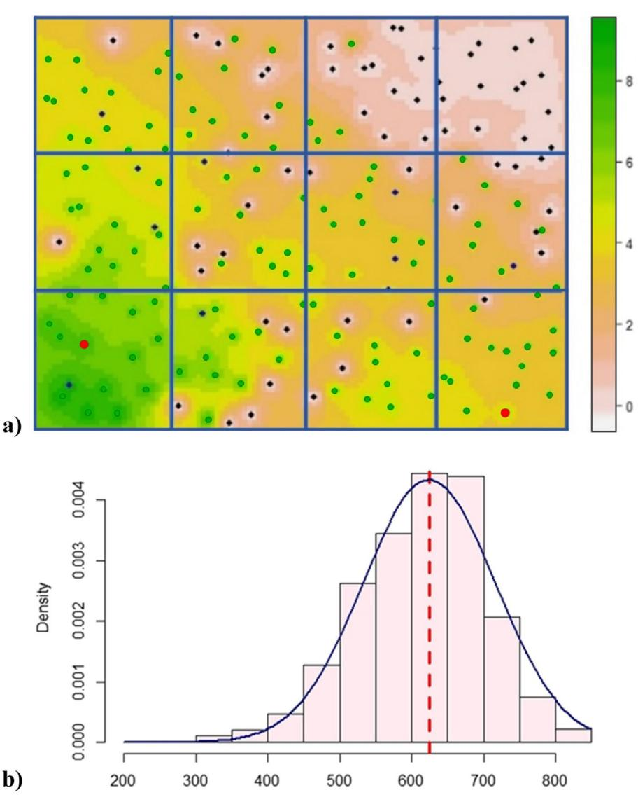
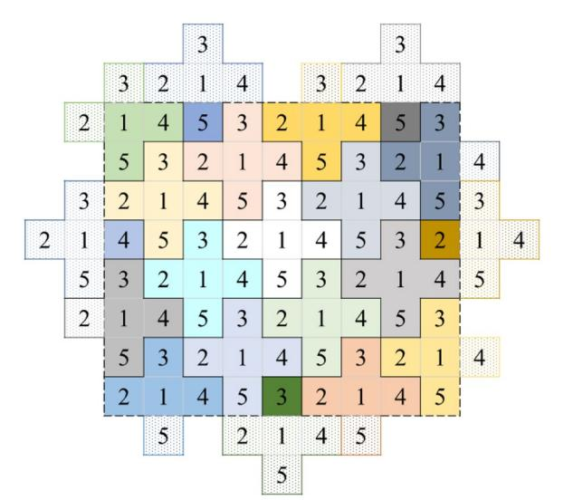
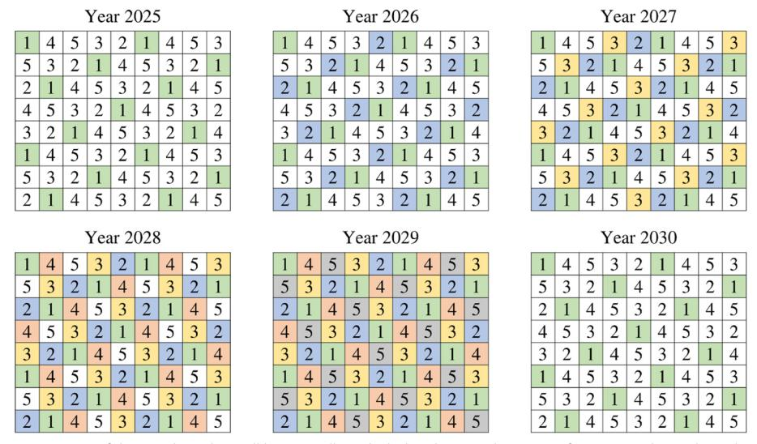
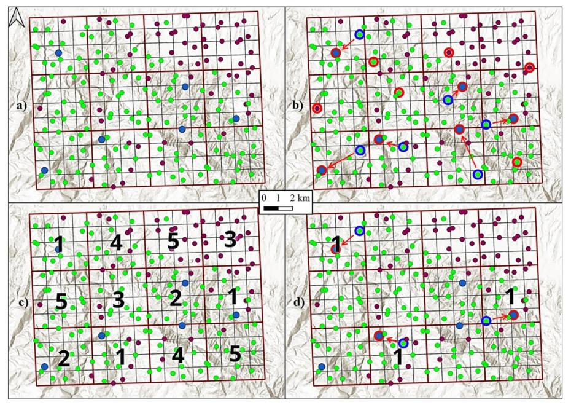
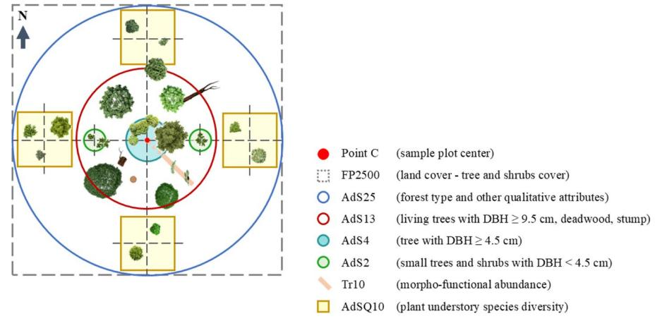

# OPINION PAPER Open Access

# Check for updates

# National Forest Inventory in Italy: new perspectives for forest monitoring

Giovanni D'Amico1\*, Gherardo Chirici1,2, Giandiego Campetella3, Roberto Canullo3, Marco Cervellini3, Stefano Chelli3, Rosa Maria Di Biase4, Lorenzo Fattorini4, Antonio Floris5, Sara Franceschi4, Saverio Francini6, Francesca Giannetti1, Agnese Marcelli4, Marzia Marcheselli4, Walter Mattioli7, Monica Notarangelo5, Giancarlo Papitto8, Francesco Parisi9, Caterina Pisani4, Emanuele Presutti Saba7, Valerio Quatrini8, Elia Vangi1,10 and Piermaria Corona11

**Key message** Natural and anthropogenic pressures, combined with frequent extreme events driven by climate change, are altering the dynamics of forest ecosystems. As a result, social needs, forest policies, and forest management require precise and reliable information that can be obtained through forest monitoring, including national forest inventories (NFIs).

In this context, the new Italian NFI introduces multiple innovations:

- During the preliminary stages of the new NFI, strategy and procedure developments were based on the needs and suggestions of various stakeholders through an effective participatory approach.
- Transitioning from periodic to annual estimates of forest attributes and their changes has been deemed essential for assessing the effects of increasingly frequent large-scale disturbances, such as major wildfires and extreme weather events.
- Partial integration with other monitoring programs, such as ICP Forests, has proven beneficial.
- Given the global climate change and biodiversity loss challenges, dedicated surveys have become essential for enhancing our understanding of forest ecosystem components.
- The use of remotely sensed data for mapping forest variables as a component of the new NFI (i.e., enhanced NFI) plays a key role in supporting policymakers.
- Data collected at tree level or aggregated at plot level will be made available, and plot coordinates may be released for scientific purposes and research projects, subject to case-by-case evaluation.

The planned updates and modifications in the new forest inventory are outlined. Additionally, these innovations are discussed to support similar national and international advancements, focusing on modernizing forest inventory methods while balancing established best practices with innovation.

**Keywords** Enhanced forest inventory, Forestry, Remote sensing, Sustainable forest management, Tessellation stratified sampling

Handling editor: Marco Ferretti

\*Correspondence: Giovanni D'Amico giovanni.damico@unifi.it Full list of author information is available at the end of the article

© The Author(s) 2025. **Open Access** This article is licensed under a Creative Commons Attribution 4.0 International License, which permits use, sharing, adaptation, distribution and reproduction in any medium or format, as long as you give appropriate credit to the original author(s) and the source, provide a link to the Creative Commons licence, and indicate if changes were made. The images or other third party material in this article are included in the article's Creative Commons licence, unless indicated otherwise in a credit line to the material. If material is not included in the article's Creative Commons licence and your intended use is not permitted by statutory

to the material. In materials in the included in the articles clearly confined science and your interface use is not permitted by statutor regulation or exceeds the permitted use, you will need to obtain permission directly from the copyright holder. To view a copy of this licence, visit http://creativecommons.org/licenses/by/4.0/.

#### 1 Introduction

Forests are a vital global resource (FAO-FRA, 2020) and play a crucial role in mitigating climate change (Verkerk et al. 2022), protecting biodiversity, and promoting social well-being (Ferretti et al. 2024). In this context, statistics on forest resources are essential for making informed decisions, particularly during times of environmental change (Breidenbach et al. 2020; Corona & Alivernini 2024). Specifically, forest data are necessary for multiple purposes at both national and international levels, including reporting and assessing forest resources (FAO-FRA, (FAO 2020)), monitoring biodiversity (Corona et al. 2011; FOREST EUROPE 2020), tracking deforestation and forest degradation (Corona et al. 2023), as well as managing local-scale efforts to enhance decision-making processes, silvicultural practices, harvesting, and conservation activities (Chirici et al. 2020). The need for proper forest information and the necessity for sustainable forest management planning led to the implementation of samplebased National Forest Inventories (NFIs) in the twentieth century. Notably, Norway established a sample-based NFI in 1919, followed by Finland and Sweden in 1921 and 1923, respectively (Fridman, et al., 2014); Gschwantner et al. 2022). In the 1960s, the development of sampling theory and mathematical statistics, along with the incorporation of aerial photographs as auxiliary data sources, substantially advanced large-scale forest inventories in numerous countries including France, Austria, Spain, Portugal, and Greece (Vidal et al. 2016). While most developed nations now maintain regular NFI programs (Breidenbach et al. 2021), more recently climate change and initiatives such as REDD + have prompted the establishment of NFIs in many emerging nations.

By the late 1970s, updating and integrating Italy's official forest statistics had become crucial to support the evolving forest policy. This information gap was addressed by the first Italian NFI (Inventario Forestale Nazionale 1985—IFN85) conducted in the mid-1980s (Gasparini et al. 2022). However, the survey was not repeated until the early 2000 s when the Italian NFI was established by law (L. 353/2000) as a permanent institutional practice. This development enabled design of an NFI to meet multiple emerging and urgent information needs at both national and international levels (Gasparini et al., 2011): defining forests and other wooded lands according to the FAO international standard; classifying land use and land cover along with vegetation types according to CORINE international standards (see https://land.copernicus.eu/en/products/ corine-land-cover); establishing internationally harmonized inventory variables (McRoberts et al. 2009; Alberdi et al. 2016); and improving estimate precision through a new sampling design. In 2005 the second NFI

(INFC—Inventario Nazionale delle Foreste e dei serbatoi forestali di Carbonio) was carried out (INFC2005) and repeated in 2015 (INFC2015) with a similar sampling design and methods, the only differences being sample size and the definition of strata (Gasparini et al. 2022 — see also the "Past inventory designs" section). When designing the new inventory, however, technological advancements, the augmented availability of remotely sensed data, and the increasing frequency and severity of forest disturbances driven by climate change led to strategic updates, as has been the case in other countries (e.g., Bontemps & Bouriaud 2024).

The updated strategies for the new Italian NFI (Inventario Forestale Nazionale Italiano, IFNI) have been identified and refined through multiple preliminary ad hoc meetings that began in 2023. Technical, organizational, scientific, and local government professionals, along with stakeholders, engaged in hands-on exchanges. Meetings included presentations and discussions on the proposed IFNI with the objective of identifying the most effective solutions (for details, see the "Relevance and data availability" section). Revisions incorporated into the survey protocol include tree positioning and biodiversity surveys, simplification of the statistical design, instrument updates including especially the Global Navigation Satellite System (GNSS) receiver, and integration with remotely sensed data.

NFIs continuously adapt to improve the accuracy of estimators and ensure the multitemporal consistency of estimates. Since the 1980s, multiple countries (Vidat et al., 2016) have established and regularly remeasured permanent plots as a means of tracking forest changes. Consequently, most NFIs today require permanent plots or a combination of permanent and temporary plots. Accordingly, permanent plots are designated for the IFNI implementation. Additionally, remote sensing technology has been increasingly integrated in heavily forested countries such as those in northern Europe (Kangas et al. 2018) and North America (Wulder et al. 2024) to produce forest variable maps (McRoberts & Tomppo 2007; Corona 2016). This feature has been considered for IFNI.

Furthermore, recent NFIs have updated their survey protocols for supporting the growing monitoring demands associated with international agreements aimed at protecting forests, conserving biodiversity, and addressing climate change adaptation and mitigation. Data provided by NFIs are essential for assessing the response of forests to current environmental challenges including drought episodes, storms, pest and disease outbreaks, invasive species (Giannetti et al. 2021; D'Amico et al. 2022a; Forzieri et al. 2023; Bozzini et al. 2023), and plant biodiversity conservation (ICP Forests 2020; Canullo et al. 2020). Recently, tree-related

microhabitats (TreMs) have emerged as important for monitoring forest biodiversity (Asbeck et al. 2021; Borghi et al. 2024). The presence, abundance, and diversity of TreMs which provide vital habitats for many living organisms serve as indicators of potential biodiversity (Bütler et al. 2013; Parisi et al. 2021). TreMs facilitate assessment of forest stand naturalness (Parisi et al. 2022, 2024) and the impact of forest management on biodiversity conservation (Martin et al. 2022). Thus, TreMs as an indicator of biodiversity have been introduced into IFNI.

In addition to upgrading field survey measurements as reported by Ferretti et al. (2024), European NFIs could be more effectively integrated with the international forest monitoring conducted under the United Nations Economic Commission for Europe (UNECE) ICP Forests (Ferretti & Fischer 2013). Indeed, the relationships between the two monitoring networks vary according to the methods used by individual countries to implement their NFIs (Gasparini et al. 2013a, b). In Italy, although the ICP Forests program was initially integrated into the NFI network (IFN85), the two efforts were subsequently separated (Gasparini et al. 2013a, b). The new Italian NFI aims to re-establish the connection. Considering the various approaches to integrating NFI and ICP Forests (Ferretti 2010), it is clear that value is consistently added by enhancing understanding and efficiently using resources. In this regard, as demonstrated by other countries, the overlap between NFI and ICP Forests is facilitated by co-locating some sample plots. Further, the establishment of IFNI which involves greater integration with remotely sensed data gave due consideration to the monitoring proposal for resilient European forests by the European Parliament and Council (European Commission, 2023).

The aim of this opinion paper is fourfold: (i) to provide an overview of the evolution of Italian NFIs over time; (ii) to describe the design strategy and the new variables implemented in the new Italian NFI (IFNI); (iii) to consider the integration with remote sensing; and (iv) to discuss the participatory process followed for the implementation of new monitoring approaches, the enhancement of forestry knowledge, and the new regulation on monitoring proposed by the European Commission (European Commission, 2023).

# 2 Past inventory designs

#### 2.1 IFN85

The first NFI (*Inventario Forestale Nazionale*—IFN85) was conducted by staff from the National Forest Service between 1983 and 1987. A single field survey was conducted using a 3-km×3-km systematic grid which yielded estimates with acceptable precision at the

national level. The nationwide sampling grid included more than 33,400 points which were later analyzed using a combination of maps, limited available aerial photos, or a brief survey to exclude survey points that fell outside forest cover. Approximately 9000 remaining forest points were visited and assessed on the ground with plots of radius of 13.8 m (approximately 600 m2). (MAF-ISAFA 1988).

#### 2.2 INFC2005 and INFC2015

The second Italian NFI (Inventario Nazionale delle Foreste e dei serbatoi forestali di Carbonio-INFC2005), known as the National Inventory of Forests and Forest Carbon Pools, was established between 2002 and 2007 by the National Forest Service. The primary goal of the survey was to assess the carbon content of the specified forest pools for activities under the United Nations Framework Convention on Climate Change (UNFCCC) (IPCC 2003). Specifically, the protocol involved investigating forest carbon pools, including aboveground biomass, deadwood, litter, and soil (Di Cosmo et al. 2013; Gasparini et al. 2013a, b; Gasparini & Di Cosmo 2016). Compared to IFN85, the survey techniques and sampling strategy were completely changed to achieve more precise estimates. Furthermore, the internationally recognized forest definition from the Global Forest Resources Assessment was applied.

Instead of single-phase sampling as used in the previous inventory, the design of INFC2005 used three sampling phases (Fattorini et al. 2006). The first phase involved covering the national territory with a grid of over R = 301,000 quadrats, each of 1 km2, and subsequently, randomly selecting one point per quadrat based on the sampling scheme commonly referred to as tessellation stratified sampling (TSS) (Cordy &Thompson, (Cordy, and Thompson, 1995); Corona et al. 2017). IFNC2005 was the first NFI to adopt TSS instead of the widely used systematic grid sampling (SGS) (Fattorini 2015). The rationale for this choice was theoretical; specifically, for large R, TSS ensures normality and variance estimates that decrease faster than  $R^{-1}$ . These features are not guaranteed by SGS which suffers significant precision loss under spatial regularities (Barabesi et al. 2012). In the second phase, the points from the first phase were classified by Italian administrative districts (21, including Regions and Autonomous Provinces) as well as by land use and land cover classes using orthophotos. These classes then served as strata for stratum-based estimation. Non-forest points were excluded, while more than 30,000 s-phase points were randomly selected within forest and other wooded land strata in proportion to the sizes of the land cover strata in the 21 Italian administrative regions. The second-phase points were visited on

the ground to assess qualitative forest attributes including the main tree species or species group as a basis for identifying forest types and subtypes. On the whole, 23 types and 91 subtypes were observed. In the third phase, the points were further classified by Italian administrative regions and by the forest types recorded in the second phase, resulting in the random selection of more than 7000 third-phase points. Despite the numerous classes that served as strata, the forest point populations in the second and third phases were sufficiently large to ensure adequate sample sizes for sufficiently accurate and precise estimates in almost all strata. However, in some cases, such as in rare forest types for a region, the scarcity of sample units leads to significant errors in the estimates. Lastly, the third-phase points were visited on the ground to observe and record forest attributes within circular plots of 13 m radius (approximately 530 m2) centered at those points, thereby simplifying field measurements relative to IFN85 (plot design details in the "Inventory variables" section). The totals and density estimates were then calculated using estimators provided by Fattorini et al. (2006) and fully reported in Gasparini et al. (2022).

The third Italian NFI, INFC2015, was designed in 2013 by the Research Unit for Forest Monitoring and Planning of the Italian Council for Research in Agriculture and was implemented by the National Forest Service, closely following the strategy of INFC2005. This process occurred from 2015 to 2020, with 2015 as the reference year, and was conducted by the Forestry Specialty of the Carabinieri. During this period, the reorganization of Italian public administrations integrated the National Forest Service into this specialty (as per Legislative Decree 177/2016, art. 7, paragraph 2, letters n. and p.) which coordinates three Italian forest monitoring networks: (i) NFI Network; (ii) ICP Forests Network; and (iii) NEC Network, in implementation of Directive 2016/2284/EU (National Emissions Ceilings).

#### 3 The new Italian NFI

The new Italian NFI (Inventario Forestale Nazionale Italiano – IFNI) introduces substantial changes relative to previous inventories. Key updates include the adoption of a new national grid and the implementation of a two-phase sampling design based on annually rotating panels. In this widely adopted system, the sampling frame is systematically divided into distinct panels (e.g., Roesch 2007) each of which consists of a set of plots measured in the same year (Gschwantner et al. 2022; Bontemps & Bouriaud 2024). Each panel, despite being part of a rotation, includes a complete and spatially distributed sample of the country. The major redesign of IFNI has been largely driven by the increasing impact of

large-scale disturbances, such as wildfires and extreme weather events, that have severely affected forest ecosystems across Italy over the past decade. Notably, the 2018 "Vaia" storm damaged more than 12 million cubic meters of growing stock (Giannetti et al. 2021), followed by further losses due to bark beetle outbreaks (Nardi et al. 2023). At the time of the Vaia storm, the latest Italian NFI (INFC2015) had just been completed, but it was quickly rendered outdated by the extent of the damage. This led to a decisive transition from a periodic NFI to an annual NFI, adopting the new design featuring rotating panels that can provide yearly estimates of forest attributes and their changes. Interestingly, it was the 1999 Lothar storm in France that prompted a similar revision of the French NFI design (Bontemps & Bouriaud 2024).

The transition from a periodic NFI (conducted every 10 years) to an annual NFI (with the entire inventory cycle completed in five years) required simplifying the relatively complex sampling design of INFC2005/2015. This change has streamlined the process from three sampling phases to just two. In addition, by simplifying the design, organization, and management of the inventory process, it improves feasibility and efficiency by allowing all sampling points within a given panel to be surveyed within a single year.

IFNI introduces numerous innovations relative to INFC2005/2015. Nonetheless, to maintain consistency with estimates from previous Italian NFIs, the definitions of forest variables have largely remained unchanged. The following subsections outline the key modifications introduced by the new inventory.

#### 3.1 Sampling design

#### 3.1.1 First phase

The first change in IFNI involves the grid adopted to cover the national territory with quadrats of equal area for conducting TSS in the first phase. The new grid is derived from the 1-km×1-km grid used in INFC2005 and INFC2015, which consisted of quadrangular cells measuring approximately 1-km×1-km and aligned with meridians and parallels. Although the cells are square only near the central meridian, each maintains an area of 1 km² (see Floris & Scrinzi 2011 for detailed algorithms). The IFNI grid merges adjacent quadrats to form new 4-km×4-km quadrats (Fig. 1a), the standard size for multiple NFIs in Europe including Croatia, Germany, Greece, Hungary, Latvia, Lithuania, Poland, Serbia, and Slovakia. Thus, the new inventory grid comprises 20,117 quadrats of 16 km² each, covering a total area of 321,872 km².

In the first phase, one of the 16 INFC2005/2015 firstphase points within each previous quadrat was randomly selected. From a probabilistic standpoint, randomly selecting one point from each of the 16 quadrats and then D'Amico et al. Annals of Forest Science (2025) 82:35 Page 5 of 16

**Fig. 1 a** A map depicting the intensity of an unspecified forest attribute within plots in a study area consisting of  $16 \times 12$  quadrats, each measuring  $1 \text{ km}^2$ , grouped into new quadrats of  $16 \text{ km}^2$ . It includes a set of 192 points categorized as non-forest points (black points), forest points (green points), and ICP Forests Level 1 points (red points). **b** Monte Carlo distributions of the total estimates obtained from genuine TSS (black line) and pseudo TSS (pink histogram)

choosing one of the 16 points is equivalent to directly selecting a random point from within the larger quadrat formed by the union of the 16 smaller quadrats. This procedure represents a genuine TSS applied to the new grid. Consequently, the resulting set of selected points serves as a set of permanent first-phase IFNI points.

To ensure continuity of time series from previous NFIs and ICP Forests surveys, we slightly deviated from the TSS scheme by integrating some first-phase points from INFC2015 and ICP Forests Level I points into IFNI's first-phase points, as reported below. This integration is valuable for gathering comparable, long-term,

multiscale, high-quality data to monitor changes in forest ecosystems (Ferretti 2010; Ferretti et al. 2024). In 2024, all selected IFNC2005/2015 first-phase points were classified as forest or non-forest via on-screen classifications using multiple, current, remotely sensed images (see the "On screen classification" section). Then, in each new quadrat, the following protocol was implemented:

(i) If the point randomly selected from among the 16 INFC2005/2015 first-phase points was classified as a non-forest, it was retained in the new set of permanent first-phase points.

(ii) If the point randomly selected from among the 16 INFC2005/2015 first-phase points was classified as forest, three situations were possible (Fig. 4):

(ii.a) If at least one ICP Forests Level 1 point was present in the cell and classified as forest, the originally selected point was replaced by the nearest ICP Forests Level 1 point.

(ii.b) If no ICP Forests Level 1 point was present in the cell, but at least one point selected in the third phase of INFC2015 was classified as forest, the nearest INFC2015 third-phase forest point replaced the originally selected point.

(ii.c) If neither ICP Forests Level 1 points nor INFC2015 third-phase forest points were present in the cell, the originally selected point was retained in the set of permanent first-phase points.

Due to the limited number of ICP Forests Level 1 plots (261 in Italy) and the requirement to take measurements annually, these plots are the first choice when present in the cell. According to this procedure, the IFNI first-phase points for 2024 consisted of 13,331 non-forest points, 185 ICP Forests Level 1 points (2.7% of forest points), 3159 INFC2015 third-phase forest points (46.6% of forest points), and 3442 new forest points (50.7% of forest points). In terms of the quality of estimates, the uncertainty of the adopted estimators for quantitative attributes is expected to be consistent with that observed for INFC2015, given that the size of the field sample is similar. In contrast, the area estimates from the first phase will likely have greater uncertainty due to the larger grain of the grid.

Assuming the genuineness of TSS selection of the first phase points and the subsequent replacement procedure, the entire sampling procedure can be considered as a pseudo-TSS. A simulation study empirically demonstrated that this pseudo-TSS yields results similar to those of a genuine TSS. For this purpose, an artificial surface representing the intensity of an unspecified forest attribute within plots was constructed across a study region of 192 km2. The study area was partitioned into a 16×12 array of 1-km×1-km quadrats, each of size 1 km2. These 1-km2 quadrats were then grouped into a 4×3 array of new 4-km×4-km quadrats, each of size 16 km2 (Fig. 1a). A fixed set of 192 points was placed in the study area with one point in each 1-km2 quadrat, and each classified into non-forest points, forest points, and ICP Forests Level 1 points. Subsequently, 10,000 samples were generated by genuine TSS, where one point was randomly selected from among the 16 points within each new  $4-\text{km}\times4-\text{km}$  quadrat of the  $4\times3$  array. An equal number of samples were generated by pseudo-TSS, following the modified procedure described earlier. The resulting samples were used to estimate the total of the artificial attribute across the entire area. The Monte Carlo distributions derived from both the genuine TSS and the pseudo-TSS were quite similar (Fig. 1b). While the genuine TSS was unbiased with a relative standard error of 15.2%, the pseudo-TSS exhibited a slight negative bias of 1.3% and demonstrated comparable, if not greater, precision with a relative mean squared error of 14.6%. These results indicate that the values of the variable of interest for the originally selected points classified as forest are similar to those of the replaced points, i.e., the ICP Forest Level 1 points or the third-phase INFC2015 points classified as forest, ensuring overall representativeness for the simulation procedure.

For purposes of deriving estimators and their uncertainties, and given these encouraging empirical results, the set of first-phase points selected by the pseudo-TSS will be treated as if a genuine TSS had selected them and will be retained permanently in subsequent years.

#### 3.1.2 Second phase

Traditionally, second phases involve probabilistic sampling of first-phase points to create overlap between samples, thereby resulting in more accurate and precise estimators of changes over time (Duncan & Kalton 1987). However, Zhao and Grafström (2020) demonstrated that large overlaps between successive samples do not necessarily guarantee good estimators of change. Thus, we adopted the sampling scheme from the Forest Inventory and Analysis (FIA) program of the U.S. Forest Service (McRoberts & Miles 2016) in which, across the entire country, the 16-km2 quadrats are systematically assigned to five mutually exclusive groups called panels, each of which was selected yearly on a rotating basis to complete assessment of all first-phase points in five years. Each panel constitutes a complete sample of the country, although of reduced intensity, and enables calculation of statistically rigorous annual estimates in support of continuous monitoring of forest resources. This approach ensures the detection and estimation of sudden changes resulting from extreme disturbance events such as occurred in northeastern Italy in 2018 (Giannetti et al. 2021). Additionally, because the 5-year rotation is short enough to allow for negligible changes under normal circumstances, estimates can be usually calculated by aggregating data for the current year and previous four years, thereby improving precision. For extreme events within the cycle, estimates from all sample plots reflect a moving average of conditions over the entire measurement period (Hou et al. 2021).

This implemented scheme entails conducting annual survey campaigns of one-fifth of the points established during the first phase. The IFNI 4-km×4-km grid was organized into crossed blocks of five quadrats. In this

arrangement, the central quadrat is designated as 1, the left-sided quadrat as 2, the upper quadrat as 3, the right-sided quadrat as 4, and the lower quadrat as 5 (Fig. 2).

Quadrat sampling was conducted in 2024 by randomly selecting a number between 1 and 5. Using a rotating panel approach, the selected number uniquely determines the order in which the quadrats are sampled in a given year (e.g., 1, 2, 3, 4, 5 if 1 is selected, or 2, 3, 4, 5, 1 if 2 is selected, etc.). Because the outcome of the random

**Fig. 2** Partition of the quadrat grid into crossed blocks of five quadrats, giving rise to the five possible samples that can be selected by a systematic sampling scheme

selection was 1, the sequence of quadrats selected for the annual survey is shown in Fig. 3.

Every year, the sampling points included in the selected quadrats will be classified as either forest or non-forest using on-screen classification ("On screen classification" section). As previously stated, approximately 1400 points are expected to be classified as forest annually. Field surveys will be conducted for the plots identified by these points, assessing both qualitative and quantitative forest variables, as well as the components related to plant biodiversity, lichen, and TreMs. Conversely, non-forest points will be ignored and will have values of 0 assigned for forest variables (Fig. 4).

From the data recorded yearly at the second-phase points, and over five years at the first-phase points, the design-based single- and two-phase estimators of totals and means of forest attributes, along with their statistical properties, have been derived within the framework of Monte Carlo integration based on TSS in the first phase and systematic sampling in the second phase (Di Biase RM, Fattorini L, Franceschi S, Marcelli A, Marcheselli M, Pisani C, Corona P: A two-phase sampling strategy for design-based estimation and mapping of forest resources and their changes, submitted).

Additionally, (Di Biase RM, Fattorini L, Franceschi S, Marcelli A, Marcheselli M, Pisani C, Corona P: A two-phase sampling strategy for design-based estimation and mapping of forest resources and their changes, submitted) derived model-assisted estimators and their statistical properties to improve design-based estimators. This was achieved by leveraging auxiliary variables obtained from remotely sensed sources (see the "Mapping"

**Fig. 3** Graphical representation of the quadrats that will be annually included in the sample starting from 2025. The cycle ends in five years. In the sixth year, the surveys are repeated in the quadrats numbered 1

D'Amico et al. Annals of Forest Science (2025) 82:35

**Fig. 4** a Classification of INFC2005/2015 first-phase points into forest (green) and non-forest (brown). The blue points represent the INFC2015 third-phase points. **b** Selection of the new first-phase points using pseudo-TSS for which the blue-circled forest points are those originally selected, while the red-circled points are included in the final first-phase sample. **c** Five-year panel area partition. **d** Field sampling point selection for panel 1

Sect. 4.2) and environmental data (Särndal et al. 1992; McRoberts & Tomppo 2007). Because these derivations involve advanced statistics, they are not included here but can be referenced in (Di Biase RM, Fattorini L, Franceschi S, Marcelli A, Marcheselli M, Pisani C, Corona P: A two-phase sampling strategy for design-based estimation and mapping of forest resources and their changes, submitted).

# 3.2 Inventory variables

Field surveys enable land use and land cover classifications, as well as the identification of vegetation characteristics within the IFNI domain. They also collect data for both qualitative and quantitative forest variables. Based on sampling points, field assessments and measurements can be either point-based or associated with areal plots. Assessments, measurements, and plot design largely follow methods from INFC2005 and INFC2015, with minor modifications discussed below.

Page 8 of 16

Fig. 5 IFNI plots and related attributes to be classified and measured within

The sample units used for photointerpretation consist of a 50-m×50-m square centered on the sample point (Fig. 5) called a *photoplot* (FP2500). For qualitative characteristics, a circular area with a 25 m radius, yielding approximately 2000 m² in total area (AdS25, Italian "Area di Saggio," i.e., sample plot) is used. Quantitative surveys for estimation of dendrometric parameters are conducted in circular plots defined in the field by measuring distances from the sample point (Point C, see Fig. 5). From each sample point, nested circular sub-plots are established with radii of 4 m (AdS4, with an area of 50.27 m²) and 13 m (AdS13, with an area of 530.93 m²). In AdS13, all trees with DBH  $\geq$  10 cm (DBH: diameter at breast height, 1.30 m above ground) are measured, while in AdS4, trees with 5 cm  $\leq$  DBH  $\leq$  10 cm are also measured.

In contrast to the INFC2015 surveys, IFNI involves recording the positions of all trees within AdS13 (DBH≥10 cm). Additional modifications to the survey protocol include identifying TreMs, measuring height and canopy crown projections, and conducting increment core sampling in sample trees. Tree height measurements and canopy crown projections are taken for at least 10 sample trees: the five trees with the largest DBH, the tree with DBH closest to the average DBH, and all trees with DBH≥10 cm within AdS4 (at least four). If such trees are absent, the four trees nearest to the sample point are included. The TreMs survey is performed for all trees with DBH≥17.5 cm, visually identifying TreMs types and their occurrences (presence/absence) (Kraus et al. 2016; Larrieu et al. 2018; Parisi et al. 2022; 2024). Crown projections measured in the four cardinal directions serve as a proxy for canopy size, a key variable related to biomass, intraspecific and interspecific interactions, and the physiological functions of trees (Pretzsch et al. 2015; Owen & Lines 2024). As successfully tested by other NFIs (Gschwantner et al. 2016; Breidenbach et al. 2020), measuring the heights of 10 sample trees ensures adequate reference data for remote sensing applications when combined with accurate GNSS measurements. Then, for each tree recorded in AdS13, height is predicted using a height-diameter model from previous NFIs (Gasparini et al. 2022). Using DBH and the predicted height, volumes and biomass are predicted through species-specific double-entry models available in Tabacchi et al. (2011). For species without a model, the most suitable model is selected according to morphological species affinity.

Increment cores are obtained for as many as six heightmeasured trees according to common NFI protocols (Duchesne et al. 2017). Cores are obtained for the largest tree with no coring impairments (e.g., no tumors, decay, etc.), the tree with DBH closest to the average DBH, and four additional trees with DBH  $\geq$  10 cm in AdS4, or the nearest alternatives, if such trees are absent.

Deadwood measurements are conducted in AdS13, with minor changes compared to the IFNI2015. Specifically, deadwood with diameters of at least 9.5 cm and lengths of 1 m within AdS13 are.

measured. This differs from the INFC2015 for which fragments with diameters greater than 9.5 cm but with reduced length of 9.5 cm were measured.

Forest tree regeneration and shrub species measurements were acquired within two circular subplots with a radius of 2 m (AdS2, covering 12.57 m²). AdS2s are centered 10 m from the sample point in the east and west directions. In these areas, all stems with DBH>0.5 cm are measured, thereby enabling estimation of forest variable parameters as outlined by the European proposal for a new regulation on a forest monitoring framework (European Commission, 2023).

Botanical surveys are conducted at each forest plot using the "line intercept method" (Gayton 2013; Hufft et al. 2019). A 10-m transect (Tr10) is set with a metric string, starting 2 m from the sample point to minimize trampling during coordinate recording. If the point is on a slope, the string follows the contour line (i.e., the line connects points of equal elevation). On flat terrain or at peaks, it stretched northward. The total length (in cm) of contacts or overlaps between living plant parts and the string within the observed meter segment for a given morphological group is recorded (Hnatiuk et al. 2009) with 1 cm as minimum detectable resolution, even with a threadlike leaf touching the string. The survey assessed the presence and abundance of morphological groups (i.e., lichens, bryophytes, pteridophytes, forbs, grasses, and woody species), providing insights into understory plant functions.

An additional survey is conducted in a sub-sample of second-phase forest plots (approximately 700 plots with approximately 135 plots per year) selected using a sampling scheme that ensures spatial balance across the country. This survey is conducted in four 10-m×10-m quadrats (AdSQ10) oriented in the four cardinal points and centered 19 m from Point C, but completely external to AdS13, and provides descriptive data on the diversity of plant understory species.

The final activity is the lichen survey (Brunialti & Frati 2024) conducted in AdS25. This analysis involves selecting the 10 sample trees closest to point C with a DBH  $\geq$  20 cm to obtain images of undamaged tree stems for assessing epiphytic lichen diversity. Four images from cardinal points are taken using a standard 10-cm $\times$ 15-cm survey frame positioned 1 m above the

D'Amico et al. Annals of Forest Science (2025) 82:35

**Table 1** IFNI variables measured in the field and their corresponding plots

| Variable                                             | Sample unit       | Variable                        | Sample unit          |
|------------------------------------------------------|-------------------|---------------------------------|----------------------|
| Forest stand attribute                               |                   | Trees                           |                      |
| Canopy cover                                         | FP2500            | Species                         | AdS4/AdS13           |
| Inventory Category                                   | Analysis window   | DBH                             | AdS4/AdS13           |
| Forest type                                          | AdS25             | Position (distance and azimuth) | AdS13                |
| Conifers and broadleaves pure-mixed condition        | AdS25             | Vitality and integrity          |                      |
| (ICP Forests-Tree damage status)                     | AdS13             |                                 |                      |
| Stand origin                                         | AdS25             | Type of tree (dendrotype)       | AdS13                |
| Development stage                                    | AdS25             | Height of broken trees          | AdS13                |
| Stand age (even-aged stands)                         | AdS25             | Social position                 |                      |
| (ICP Forests-Social class)                           | AdS13             |                                 |                      |
| Vertical structure                                   | AdS25             | Sample trees                    |                      |
| Legal status                                         | Tree total height | AdS4/AdS13                      |                      |
| Ownership                                            | Central point     | Crown base height               | AdS4/AdS13           |
| Constraints                                          | Central point     | Canopy projection               | AdS4/AdS13           |
| Nature protection                                    | Central point     | TreMs                           | AdS4/AdS13           |
| Forest planning                                      | Central point     | Increment cores                 | AdS4/AdS13           |
| Site conditions                                      |                   | Forest understorey              |                      |
| Accessibility                                        | Central point     | Diameter and height class       | AdS2                 |
| Distance of roads                                    | Central point     | Species or group of species     | AdS2                 |
| Altitude                                             | Central point     | Number                          | AdS2                 |
| Slope                                                | Central point     | Origin                          | AdS2                 |
| Aspect                                               | Central point     | Damages                         | AdS2                 |
| Land position                                        | AdS25             | Standing dead trees             |                      |
| Terrain instability                                  | AdS25             | Species or group of species     | AdS4/AdS13           |
| Terrain roughness                                    | AdS25             | DBH                             | AdS4/AdS13           |
| Silviculture                                         | Decay class       | AdS4/AdS13                      |                      |
| Silviculture system                                  | AdS25             | Tree height (if broken)         | AdS4/AdS13           |
| Primary designed management objective                | AdS25             | Deadwood lying on the ground    |                      |
| Woody products and services                          | AdS25             | Species                         | Ads13                |
| Non-wood products and services                       | AdS25             | End sections diameter           | AdS13                |
| Utilization mode                                     | AdS25             | Length                          | AdS13                |
| Logging mode                                         | AdS25             | Decay class                     | AdS13                |
| Forest health                                        |                   | Stump                           |                      |
| Damaging diffusion and severity                      |                   |                                 |                      |
| (ICP Forests-Defoliation)                            | AdS13             | Species                         | AdS13                |
| Damages or pathologies causes                        |                   |                                 |                      |
| (ICP Forests-Causal agents)                          | AdS13             | Diameter                        | AdS13                |
| Defoliation localization                             |                   |                                 |                      |
| (ICP Forests-Location in crown)                      | AdS13             | Height                          | AdS13                |
| Removal and mortality                                |                   |                                 |                      |
| (Same as ICP Forests)                                | AdS13             | Decay class                     | AdS13                |
| Botanical survey                                     |                   | Lichens survey                  |                      |
| Morpho-functional plantgroups presence and abundance | Tr10              | Lichen diversity                | Sample trees (DBH≥20 |
| Vascular plant presence and abundance                | AdSQ10            |                                 |                      |

ground. Subsequent image analysis provides the epiphytic lichen diversity by summing the frequencies of all species observed within the frame.

The 185 ICP Forests Level 1 points, which also serve as IFNI plots, link the pure IFNI plots and their attributes (forest health variables in Table 1) and the pure ICP

Forests Level 1 plots and their attributes. Specifically, among the mandatory surveys for ICP Forests Level 1, some expeditious surveys are included in IFNI, mainly with qualitative surveys of assessable crown, defoliation, tree damage status, causal agent or factors. In addition, with permanent plots, removals and mortality will also be estimated at the start of the second cycle (Eichhorn et al. 2020). Staff trained for ICP Forests Level 1 assessments will conduct measurements and evaluations at the ICP Forests Level 1 points that also function as IFNI plots. However, it is not feasible to train all IFNI field staff to assess defoliation and discoloration levels in all the pure IFNI plots.

Table 1 shows the qualitative and quantitative variables covered by IFNI, accompanied by information on the sampling unit in which the survey is conducted.

# 4 Remote sensing integration

As a modern NFI, IFNI combines field data with remotely sensed and other auxiliary sources (GIS layers, previous inventories) to improve efficiency (White et al. 2016). Aerial orthophotos support preliminary forest cover classification (already included in INFC2005/2015), while remotely sensed data support forest attribute mapping (Breidenbach et al. 2021; Fassnacht et al. 2024).

# 4.1 On screen classification

To support on-screen land cover classification, multiple remotely sensed data sources are integrated. Recent orthophotos provide the finest spatial resolution available (20 cm), linking temporal homogeneity with triennial national cover. Therefore, Planet Scope images with daily 3-m spatial resolution complemented the annual first phase photointerpretation (Francini et al. 2020).

The IFNI design facilitates updates and integration with additional remotely sensed data. Particularly, the Italian IRIDE satellite missions, operational from 2026, offer a viable solution, comprising approximately 70 satellites from six constellations. These include multispectral, optical, radar, and hyperspectral sensors, offering fine-resolution data streams (Mastracci & Geraldini 2023). IFNI data will support IRIDE land monitoring products by serving as reference data.

# 4.2 Mapping

Forest inventories over the globe have evolved from simply producing aggregated statistics to producing spatially explicit forest attribute maps. Constructed using a variety of methods (Corona et al. 2014; Di Biase et al. 2022), these maps integrate ground survey data and various sources of remotely sensed information (White et al. 2016; Kangas et al. 2018). In Italy, early forest attribute maps (e.g., Chirici et al. 2020; Vangi et al. 2021; Giannetti

et al. 2022) were constructed using both parametric (e.g., linear regression) and non-parametric (e.g., random forests) methods with wall-to-wall remote sensing-based predictors (Barrett et al. 2016; Corona et al. 2014; Chirici et al. 2016).

Map accuracy and precision is typically assessed through cross-validation or leave-one-out techniques which lack site-level accuracy (Franceschi et al. 2025). To ensure consistent accuracy and precision in estimating totals and mapping, analyses for both should adopt a design-based approach. To this end, we tentatively introduce a design-based framework (Fattorini et al. 2018), applying Tobler's Law (Tobler 1970) through inverse distance weighting (IDW). The smoothing parameter, which controls weight reduction based on distance, is chosen via leave-one-out cross-validation (Fattorini et al. 2023).

Data from statistical sampling, such as that of IFNI, led to the development of design-based single- and twophase IDW interpolators for mapping forest attributes and their statistical properties (Di Biase RM, Fattorini L, Franceschi S, Marcelli A, Marcheselli M, Pisani C, Corona P: A two-phase sampling strategy for designbased estimation and mapping of forest resources and their changes, submitted). Model-assisted interpolators and their properties further enhance design-based mapping (Di Biase et al. 2022; Francini et al. 2024) for which maps can serve as pseudo- or artificial populations for bootstrap precision estimation (Fattorini et al. 2022). Due to the complexity of these derivations, detailed statistics are not included here but can be found in (Di Biase RM, Fattorini L, Franceschi S, Marcelli A, Marcheselli M, Pisani C, Corona P: A two-phase sampling strategy for design-based estimation and mapping of forest resources and their changes, submitted).

Regarding remotely sensed auxiliary data, ALS is particularly effective for mapping (Coops et al. 2021; D'Amico et al. 2022b), and Italy's first national ALS wall-to-wall campaign is currently underway (D'Amico et al. 2021). Data from IRIDE and Sentinel Expansion missions will soon enhance IFNI, aiding in disturbance and harvest mapping (Fassnacht et al. 2024; Francini et al. 2021; 2022).

### 5 Relevance and data availability

The development of IFNI has involved substantial interaction among various stakeholders. Moreover, the Carabinieri have leveraged the expertise of multiple research groups. A preliminary discussion on the new Italian NFI took place during a meeting in Florence on March 21, 2023 (https://www.aisf.it/2023/02/16/la-proposta-dellarma-dei-carabinieri-per-il-nuovo-inventario-forestale-nazionale-21-marzo-2023/). At this meeting, the Carabinieri, the Italian

Academy of Forest Sciences, and CREA (Consiglio per la ricerca in agricoltura e l'analisi dell'economia agraria) initiated a dialogue on designing a new NFI aimed at identifying and integrating innovations to meet emerging forest monitoring needs while preserving effective past practices. Representatives from the Italian Botanical Society and the Italian Institute for Environmental Protection and Research (ISPRA) also contributed, and substantial time was dedicated to discussion with stakeholders. The meeting set the foundation for a participatory and collaborative process throughout 2023 and 2024 that focused on multiple tasks: (i) updating and simplifying the statistical methods of previous NFIs; (ii) ground survey innovations to incorporate biodiversity assessments; and (iii) enhancing fieldwork with new instrumentation, such as satellite positioning systems, that are crucial for effectively integrating remotely sensed data.

The first field survey tests were conducted on October 10–11, 2023. During these tests, the survey procedure developed based on the outcomes of the Florence meeting and subsequent suggestions from stakeholders was assessed for feasibility. Potential challenges were identified, and necessary refinements were highlighted by expert forest mensurationists, botanists, and forestry professionals. Particular attention was given to evaluating the quality of the newly introduced GNSS instruments and biodiversity surveys.

The IFNI proposal has also been showcased and discussed at international events, including the *Forest Factor* conference, organized by the Carabinieri in Rome, Italy on June 6–7, 2023; the 26th IUFRO conference in Stockholm, Sweden, on June 23–29, 2024; and The *Smart Forest Monitoring* conference in Rome, Italy on September 18, 2024.

The most relevant suggestions that emerged from presentations, discussions, and field tests include among others: (i) simplifying the statistical design from three to two phases; (ii) recording the position of each tree to establish permanent plots and enable long-term monitoring of individual trees; (iii) expanding biodiversity assessments to include lichens, conducting botanical surveys (measuring the presence and abundance of morphological groups), and incorporating TreMs; and (iv) integrating ground-based and remotely sensed data to generate spatialized maps of forest variables.

In pursuit of an integrated, collaborative, and adaptable project, ensuring data accessibility for the research community has also emerged as a key priority. As a result, IFNI has been designed to enable the dissemination of acquired data while maintaining a non-disclosure agreement to safeguard sensitive

information. Multiple other countries have already adopted this approach for sharing NFI data. Given the strategic importance of inventory data, balancing confidentiality with open distribution remains a delicate issue as highlighted by Gessler et al. (2024). However, the debate on data-sharing practices continues (Päivinen et al. 2023) and access to location-specific information must be evaluated on a case-by-case basis to maintain both transparency and credibility (Schadauer et al. 2024).

#### **6 Conclusions**

The critical role of forests in mitigating climate change, coupled with the increasing frequency and severity of disturbances, has sparked debate and intensified the focus on forest monitoring (Ferretti et al. 2024; Nabuurs et al. 2022; Päivinen et al. 2023). In response to this growing awareness, efforts to improve and update knowledge of forest resources have become essential. It is both encouraging and effective that numerous projects focused on forest monitoring—utilizing innovative and potentially harmonized approaches—have received funding across Europe. As a result, new NFIs, including the Italian IFNI, have been driven by scientific and technical advancements and innovation.

IFNI will provide crucial information to support efforts aimed at strengthening the protection and resilience of Italy's forests, as well as their ability to deliver both tangible and intangible benefits. This new inventory program introduces important innovations aimed at modernizing and enhancing available products, while balancing innovation with the preservation of best practices and lessons learned from the three previous Italian national inventory surveys.

The primary innovation is the transition to an annual inventory (Chirici et al. 2020; D'Amico et al. 2021) based on a two-phase sampling approach. The rotating panel approach, conducted every five years, enables production of both annual and five-year estimates (assuming that conditions remain largely unchanged over the period) for multiple attributes: (i) total and per-hectare estimates of attribute parameters of interest, along with corresponding precision estimates; (ii) changes in total and per-hectare estimates of the attribute parameters of interest between the current year and previous years, including precision estimates; and (iii) wall-to-wall maps of attributes of interest, accompanied by precision maps.

Efforts have also been made to integrate, at least within a subsample, the ICP Forest Level 1 monitoring survey with IFNI. Previously, the two projects relied on different samples and maintained different temporal resolutions. Additionally, aligning with modern approaches, IFNI has improved temporal resolution, strengthened synergies

D'Amico et al. Annals of Forest Science

among existing information management systems, and enhanced the integration of terrestrial measurements with remotely sensed data (Ferretti et al. 2024). Given that the development of a modern NFI requires the integration of multiple disciplines, continuous and intensive dialogue between inventory experts and stakeholders at various institutional levels has been essential and will remain so.

#### Acknowledgements

We are grateful to Dr. Ronald E. McRoberts for his kind revision of the manuscript.

#### Authors' contributions

GD, GCh, LF, and PC co-wrote the first draft of the manuscript. PC, GCh, LF, and GP supervised the manuscript editing. RD, LF, SF, AM, MM, and CP provided intellectual insights for the development of the statistical approach. GCa, RC, MC, SC, AF, WM, FP, and EP provided intellectual insights to innovate the survey protocol. All authors provided intellectual insights for the development of IFNI volunteered their valuable time in field tests and meetings and edited and contributed to the advanced drafts of this manuscript. All the authors included in the manuscript agreed to the publication of the article.

#### **Funding**

This study was supported via the following projects: (1) MULTIFOR "Multi-scale observations to predict Forest response to pollution and climate change" PRIN 2020 Research Project of National Relevance funded by the Italian Ministry of University and Research (prot. 2020E52THS). (2) SUPERB "Systemic solutions for upscaling of urgent ecosystem restoration for forest related biodiversity and ecosystem services" H2020 project funded by the European Commission, number 101036849 call LC-GD-7-1-2020. 3. EFINET "European Forest Information Network" funded by the European Forest, Institute Network Fund G-01-2021. 4. FORWARDS "The ForestWard Observatory to Secure Resilience of European Forests," HORIZON project funded by the European Commission, number 101084481 call HORIZON-CL6-2022-CLIMATE-01. 5. MONIFUN. H2020 project funded by the European Commission, number 101134991 call HORIZON-CL6-2023-CircBio-01-14. 6. NextGenCarbon. H2020 project funded by the European Commission, number 101184989 call HORIZON-CL5-2024-D1-01-07. 7. NBFC "National Biodiversity Future Center" project funded under the National Recovery and Resilience Plan (NRRP), NextGenerationEU; Project code CN\_00000033, adopted by the Italian Ministry of University and Research, CUP B83C22002930006. 8. Space It Up. Project funded by the Italian Space Agency and the Ministry of University and Research—Contract No. 2024-5-E.0—CUP No. I53D24000060005.

# Data availability

Preliminary data submitted as included in IFNI's products may be requested provided there is a non-disclosure agreement to ensure that sensitive information is not made public.

#### Code availability

Not applicable.

# **Declarations**

#### **Ethics approval**

Not applicable.

# Consent to participate

Not applicable.

## Consent for publication

All the authors included in the manuscript agree to the publication of the article.

#### Competing interests

The authors declare that they have no competing interests.

#### **Author details**

geoLAB-Laboratorio Di Geomatica Forestale, Dipartimento Di Scienze E Tecnologie Agrarie Alimentari Ambientali e Forestali. Università Degli Studi Di Firenze, Via San Bonaventura 13, 50145 Florence, Italy. 2Fondazione Per Il Futuro Delle Città, Florence, Italy. 3School of Biosciences and Veterinary Medicine, Plant Diversity and Ecosystems Management Unit, University of Camerino, Camerino, Italy. 4Department of Economic and Statistics, University of Siena, Siena, Italy. 5CREA Research Centre for Forestry and Wood, P.Za Nicolini 6, 38123 Trento, Italy. 6Department of Science and Technology of Agriculture and Environment (DISTAL), University of Bologna, 40126 Bologna, Italy. 7CREA Research Centre for Forestry and Wood, Via Valle Della Quistione 27, 00166 Rome, Italy. 8 Arma Dei Carabinieri, Ambientali E Agroalimentari, Comando Unità Forestali, Via. G. Carducci 5, 00187 Rome, Italy. 9Dipartimento Di Bioscienze E Territorio, Università Degli Studi del Molise, C.da Fonte Lappone, 86090 Pesche, IS, Italy. 10Forest Modelling Laboratory, Institute for Agriculture and Forestry Systems in Mediterranean, National Research Council of Italy (CNR-ISAFOM), 06128 Perugia, Italy. 11 CREA Research Centre for Forestry and Wood, Viale Santa Margherita 80, 52100 Arezzo, Italy.

Received: 6 January 2025 Accepted: 7 July 2025 Published online: 16 October 2025

#### References

- Alberdi I, Michalak R, Fischer C, Gasparini P, Brändli U-B, Tomter SM, Kuliesis A, Snorrason A, Redmond J, Hernández L, Lanz A, Vidondo B, Stoyanov N, Stoyanova M, Vestman M, Barreiro S, Marin G, Cañellas I, Vidal C (2016) Towards harmonized assessment of European forest availability for wood supply in Europe. For Policy Econ 70:20–29. https://doi.org/10.1016/j. forpol 2016.05.014
- Asbeck T, Großmann J, Paillet Y, Winiger N, Bauhus J (2021) The use of treerelated microhabitats as forest biodiversity indicators and to guide integrated forest management. Curr for Rep 7:59–68. https://doi.org/10. 1007/s40725-020-00132-5
- Barabesi L, Franceschi S, Marcheselli M (2012) Properties of design-based estimation under stratified spatial sampling. Ann Appl Stat 6:210–228. https://doi.org/10.1214/11-AOAS509
- Barrett F, McRoberts RE, Tomppo E, Cienciala E, Waser LT (2016) A questionnaire-based review of the operational use of remotely sensed data by national forest inventories. Remote Sens Environ 174:279–289. https:// doi.org/10.1016/j.rse.2015.08.029
- Bontemps JD, Bouriaud O (2024) Take five: about the beat and the bar of annual and 5-year periodic national forest inventories. Ann For Sci 81:53. https://doi.org/10.1186/s13595-024-01268-1
- Borghi C, Francini S, McRoberts RE, Parisi F, Lombardi F, Nocentini S, Maltoni A, Travaglini D, Chirici G (2024) Country-wide assessment of biodiversity, naturalness and old-growth status using national forest inventory data. Eur J For Res 143:271–303. https://doi.org/10.1007/s10342-023-01620-6
- Bozzini A, Francini S, Chirici G, Battisti A, Faccoli M (2023) Spruce bark beetle outbreak prediction through automatic classification of Sentinel-2 imagery. Forests 14:1116. https://doi.org/10.3390/f14061116
- Breidenbach J, Granhus A, Hylen G, Eriksen R, Astrup R (2020) A century of national forest inventory in Norway informing past, present, and future decisions. For Ecosyst 7:1–19. https://doi.org/10.1186/s40663-020-00261-0
- Breidenbach J, McRoberts RE, Alberdi I, Antón-Fernández C, Tomppo E (2021) A century of national forest inventories informing past, present and future decisions. For Ecosyst 8:1–4. https://doi.org/10.1186/s40663-021-00315-x
- Brunialti G, Frati L (2024) Diversità lichenica e intelligenza artificiale nel monitoraggio delle foreste italiane: linee guida per l'acquisizione di immagini in campo nell'ambito della rete NEC Livello 1 e dell'IFNI (in Italian). Rep TDe R 139–2024/03 (V1R0):7 pp
- Bütler R, Lachat T, Larrieu L, Paillet Y (2013) Habitat trees: key elements for forest biodiversity. Integrative approaches as an opportunity for the conservation of forest biodiversity. In: D. Kraus & F. Krumm (Eds.), Integrative approaches as an opportunity for the conservation of forest biodiversity (pp. 84-91). European Forest Institute. 284 pp. ISBN: 978–952–5980–07.

- Canullo R, Starlinger F, Granke O, Fischer R, Aamlid D, Dupouey JL (2020) Part VII.1: assessment of ground vegetation. Version 2020–1. In: UNECE ICP Forests Programme Coordinating Centre (ed): Manual on methods and criteria for harmonized sampling, assessment, monitoring and analysis of the effects of air pollution on forests. Thünen Inst For Ecosyst, Eberswalde:14 pp + Annex. http://www.icpforests.org/manual.htm. ISBN: 978–3-86576–162–0. Accessed 03 Jun 2025.
- Chirici G, Giannetti F, McRoberts RE, Travaglini D, Pecchi M, Maselli F, Chiesi M, Corona P (2020) Wall-to-wall spatial prediction of growing stock volume based on Italian National Forest Inventory plots and remotely sensed data. Int J Appl Earth Obs Geoinf 84:101959. https://doi.org/10.1016/j.jag. 2019.101959
- Chirici G, Mura M, McInerney D, Py N, Tomppo EO, Waser LT, Travaglini D, McRoberts RE (2016) A meta-analysis and review of the literature on the k-nearest neighbors technique for forestry applications that use remotely sensed data. Remote Sens Environ 176:282–294. https://doi.org/10. 1016/irse.2016.02.001
- Coops NC, Tompalski P, Goodbody TRH, Queinnec M, Luther JE, Bolton DK, White JC, Wulder MA, van Lier OR, Hermosilla T (2021) Modelling lidar-derived estimates of forest attributes over space and time: a review of approaches and future trends. Remote Sens Environ 260:112477. https://doi.org/10.1016/j.rse.2021.112477
- Cordy CB, Thompson CM (1995) An application of the deterministic variogram to design-based variance estimation. Math Geol 27:173–205. https://doi.org/10.1007/BF02083210
- Corona P (2016) Consolidating new paradigms in large-scale monitoring and assessment of forest ecosystems. Environ Res 144:8–14. https://doi.org/10.1016/j.envres.2015.10.017
- Corona P, Chirici G, McRoberts RE, Winter S, Barbati A (2011) Contribution of large-scale forest inventories to biodiversity assessment and monitoring. For Ecol Manage 262:2061–2069. https://doi.org/10.1016/j.foreco.2011.
- Corona P, Fattorini L, Franceschi S, Chirici G, Maselli F, Secondi L (2014) Mapping by spatial predictors exploiting remotely sensed and ground data: a comparative design-based perspective. Remote Sens Environ 152:29–37. https://doi.org/10.1016/j.rse.2014.05.011
- Corona P, Franceschi S, Pisani C, Portoghesi L, Mattioli W, Fattorini L (2017)
  Inference on diversity from forest inventories: a review. Biodivers Conserv 26:3037–3049. https://doi.org/10.1007/s10531-015-1017-2
- Corona P, Di Stefano V, Mariano A (2023) Knowledge gaps and research opportunities in the light of the European Union Regulation on deforestation-free products. Ann Silvic Res 48:87–89. https://doi.org/10.12899/asr-2445
- Corona P, Alivernini A (2024) Forests for the world. Ann Silvic Res 49:80–81. https://doi.org/10.12899/asr-2583
- D'Amico G, McRoberts RE, Giannetti F, Vangi E, Francini S, Chirici G (2022b)

  Effects of lidar coverage and field plot data numerosity on forest growing
  stock volume estimation. Eur J Remote Sens 55:199–212. https://doi.org/
  10.1080/22797254.2022.2042397
- D'Amico G, Francini S, Parisi F, et al (2022a) Multitemporal optical remote sensing to support forest health condition assessment of Mediterranean pine forests in Italy. In: Benítez-Andrades, J.A., García-Llamas, P., Taboada, Á., Estévez-Mauriz, L., Baelo, R. (eds) Global challenges for a sustainable society. EURECA-PRO 2022. Springer Proceedings in Earth and Environmental Sciences. Springer, Cham. https://doi.org/10.1007/978-3-031-25840-4\_15
- D'Amico G, Vangi E, Francini S, Giannetti F, Nicolaci A, Travaglini D, Massai L, Giambastiani Y, Terranova C, Chirici G (2021) Are we ready for a National Forest Information System? State of the art of forest maps and airborne laser scanning data availability in Italy. iForest 14:144–154. https://doi.org/10.3832/ifor3648-014
- Di Biase RM, Fattorini L, Franceschi S, Grotti M, Puletti N, Corona P (2022) From model selection to maps: a completely design-based data-driven inference for mapping forest resources. Environmetrics 33:e2750. https://doi.org/10.1002/env.2750
- Di Cosmo L, Gasparini P, Paletto A, Nocetti M (2013) Deadwood basic density values for national-level carbon stock estimates in Italy. For Ecol Manage 295:51–58. https://doi.org/10.1016/j.foreco.2013.01.010
- Duchesne L, D'Orangeville L, Ouimet R, Houle D, Kneeshaw D (2017) Extracting coherent tree-ring climatic signals across spatial scales from extensive forest inventory data. PLoS One 12:e0189444. https://doi.org/10.1371/journal.pone.0189444

- Duncan GJ, Kalton G (1987) Issues of design and analysis of surveys across time. Int Stat Rev 55:97–117. https://doi.org/10.2307/1403273
- Eichhorn J, Roskams P, Potočić N, Timmermann V, Ferretti M, Mues V, Szepesi A, Durrant D, Seletković I, Schröck HW, Nevalainen S, Bussotti F, Garcia P, Wulff S (2020) Part IV: visual assessment of crown condition and damaging agents. Version 2020–3. In: UNECE ICP Forests Programme Coordinating Centre (ed) Manual on methods and criteria for harmonized sampling, assessment, monitoring and analysis of the effects of air pollution on forests. Thünen Institute of Forest Ecosystems, Eberswalde, Germany, 49 p. + Annex. http://www.icp-forests.org/manual.htm. ISBN 978–3–86576–162–0
- European Commission (2023) Proposal for a regulation of the European Parliament and of the Council on a monitoring framework for resilient European forests. Brussels, COM(2023)728 final. https://eur-lex.europa.eu/legal-content/EN/TXT/?uri=celex:52023PC0728#document2. Accessed 02 Jan 2025
- FAO (2020) Global forest resources assessment 2020 key findings. Rome. https://doi.org/10.4060/ca8753en
- Fassnacht FE, White JC, Wulder MA, Næsset E (2024) Remote sensing in forestry: current challenges, considerations and directions. Forestry 97:11–37. https://doi.org/10.1093/forestry/cpad024
- Fattorini L (2015) Design-based methodological advances to support national forest inventories: a review of recent proposals. iForest 8:6–11. https://doi.org/10.3832/ifor1239-007
- Fattorini L, Marcheselli M, Pisani C (2006) A three-phase sampling strategy for multiresource forest inventories. J Biol Agric Environ Stat 11:296–316. https://doi.org/10.1198/108571106X130548
- Fattorini L, Marcheselli M, Pisani C, Pratelli L (2018) Design-based maps for continuous spatial populations. Biometrika 105:419–429. https://doi.org/10.1093/biomet/asy012
- Fattorini L, Marcheselli M, Pisani C, Pratelli L (2022) Design-based properties of the nearest neighbor spatial interpolator and its bootstrap mean squared error estimator. Biometrics 78:1454–1463. https://doi.org/10.1111/biom. 13505
- Fattorini L, Franceschi S, Marcheselli M, Pisani C, Pratelli L (2023) Designbased spatial interpolation with data driven selection of the smoothing parameter. Environ Ecol Stat 30:103–129. https://doi.org/10.1007/ s10651-023-00555-w
- Ferretti M (2010) Harmonizing forest inventories and forest condition monitoring—the rise or the fall of harmonized forest condition monitoring in Europe? iForest, https://doi.org/10.3832/ifor0518-003
- Ferretti M, Fischer C, Gessler A, Graham C, Meusburger K, Abegg M et al (2024) Advancing forest inventorying and monitoring. AnnFor Sci 81:6. https://doi.org/10.1186/s13595-023-01220-9
- Ferretti M, Fischer R (2013) Forest monitoring: methods for terrestrial investigations in Europe with an overview of North America and Asia. Dev Environ Sci 12. Elsevier, Oxford. https://doi.org/10.1111/gcb.16912
- Floris A, Scrinzi G (2011) II reticolo nazionale. In: Gasparini P, Tabacchi G (eds) L'Inventario Nazionale delle Foreste e dei serbatoi forestali di Carbonio INFC 2005. Edagricole–II Sole 24 Ore, Milano, pp 30–36. ISBN 978–88–506–5394–2
- FOREST EUROPE (2020) State of Europe's Forests 2020. Ministerial Conference on the Protection of Forests in Europe FOREST EUROPE Liaison Unit, Bratislava. https://www.foresteurope.org. Accessed 16 Dec 2024
- Forzieri G, Dutrieux LP, Elia A, Eckhardt B, Caudullo G, Taboada FÁ et al (2023)
  The database of European forest insect and disease disturbances: DEFID2.
  Glob Chang Biol 29:6040–6065. https://doi.org/10.1111/gcb.16912
- Franceschi S, Pisani C, Fattorini L, Corona P (2025) Statistical considerations for enhanced forest resource mapping. Silva Fennica vol. 59 no. 2 article id 24063. https://doi.org/10.14214/sf.24063
- Francini S, D'Amico G, Vangi E, Borghi C, Chirici G (2022) Integrating GEDI and Landsat: spaceborne lidar and four decades of optical imagery for the analysis of forest disturbances and biomass changes in Italy. Sensors (Basel) 22:2015. https://doi.org/10.3390/s22052015
- Francini S, Marcelli A, Chirici G, Di Biase RM, Fattorini L, Corona P (2024) Perpixel forest attribute mapping and error estimation: the Google Earth engine and R datadriven tool. Sensors (Basel) 24:3947. https://doi.org/10. 3390/524123947
- Francini S, McRoberts RE, Giannetti F, Mencucci M, Marchetti M, Scarascia Mugnozza G, Chirici G (2020) Near-real time forest change detection using

- PlanetScope imagery. Eur J Remote Sens 53:233–244. https://doi.org/10. 1080/22797254.2020.1806734
- Francini S, McRoberts RE, Giannetti F, Marchetti M, Scarascia Mugnozza G, Chirici G (2021) The Three Indices Three Dimensions (3I3D) algorithm: a new method for forest disturbance mapping and area estimation based on optical remotely sensed imagery. Int J Remote Sens 42:4697–4715. https://doi.org/10.1080/01431161.2021.1899334
- Fridman J, Holm S, Nilsson M, Nilsson P, Ringvall A, Ståhl G (2014) Adapting national forest inventories to changing requirements the case of the Swedish National Forest Inventory at the turn of the 20th century. Silva Fenn 48:1095. https://doi.org/10.14214/sf.1095
- Gasparini P, Di Cosmo L, Pompei E (2013a) Il contenuto di carbonio delle foreste italiane. Inventario Nazionale delle Foreste e dei Serbatoi forestali di Carbonio INFC2005. Metodi e risultati dell'indagine integrativa. Ministero delle Politiche Agricole, Alimentari e Forestali, Corpo Forestale dello Stato; CRA-MPF, Trento, 248 pp. ISBN 978-88-97081-36-4
- Gasparini P, Di Cosmo L, Cenni E, Pompei E, Ferretti M (2013b) Towards the harmonization between National Forest Inventory and Forest Condition Monitoring. Consistency of plot allocation and effect of tree selection methods on sample statistics in Italy. Environ Monit Assess 185:6155–6171. https://doi.org/10.1007/s10661-012-3014-1
- Gasparini P, Di Cosmo L (2016) National forest inventory reports—Italy. In: Vidal C, Alberdi I, Hernández L, Redmond J (eds) National forest inventories—assessment of wood availability and use. Springer, pp 485–506. https://doi.org/10.1007/978-3-319-44015-6
- Gasparini P, Di Cosmo L, Floris A, De Laurentis D (2022) Italian National Forest Inventory—methods and results of the third survey: Inventario Nazionale delle Foreste e dei Serbatoi Forestali di Carbonio—Metodi e Risultati della Terza Indagine. Springer, Cham, 576 pp. https://doi.org/10.1007/978-3-030-98678-0
- Gasparini P, Tabacchi G (2011) L'Inventario Nazionale delle Foreste e dei serbatoi forestali di Carbonio INFC2005. Secondo inventario forestale nazionale. Metodi e risultati. Ministero delle Politiche Agricole, Alimentari e Forestali, Corpo Forestale dello Stato; CRA-MPF, Edagricola, Milano, 653 pp. ISBN 978–88–506–5394–2
- Gayton D (2013) Grassland and forest understorey vegetation monitoring: an introduction to field methods. J Ecosyst Manag 14(3):1–9. https://doi.org/10.22230/iem.2013v14n3a173
- Gessler A, Schaub M, Bose A, Trotsiuk V, Valbuena R, Chirici G, Buchmann N (2024) Finding the balance between open access to forest data while safeguarding the integrity of National Forest Inventory-derived information. New Phytol. 242:344–346. https://doi.org/10.1111/nph.19466
- Giannetti F, Chirici G, Vangi E, Corona P, Maselli F, Chiesi M, D'Amico G, Puletti N (2022) Wall-to-wall mapping of forest biomass and wood volume increment in Italy. Forests 13:1989. https://doi.org/10.3390/f13121989
- Giannetti F, Pecchi M, Travaglini D, Francini S, D'Amico G, Vangi E, Cocozza C, Chirici G (2021) Estimating VAIA windstorm damaged forest area in Italy using time series Sentinel-2 imagery and continuous change detection algorithms. Forests 12:680. https://doi.org/10.3390/f12060680
- Gschwantner T, Lanz A, Vidal C, Bosela M, Di Cosmo L, Fridman J, Schadauer K et al (2016) Comparison of methods used in European National Forest Inventories for the estimation of volume increment: towards harmonisation. Ann For Sci 73:807–821. https://doi.org/10.1007/s13595-016-0554-5
- Gschwantner T, Alberdi I, Bauwens S, Bender S, Borota D, Bosela M, Tomter SM et al (2022) Growing stock monitoring by European National Forest Inventories: historical origins, current methods and harmonisation. For Ecol Manag 505:119868. https://doi.org/10.1016/j.foreco.2021.119868
- Hnatiuk RJ, Thackway R, Walker J (2009) Vegetation. In: National Committee on Soil, Terrain (Australia), CSIRO Publishing (eds) Australian Soil and Land Survey Field Handbook (3rd edn). CSIRO Publishing, Melbourne, pp 73–126
- Hou Z, Domke GM, Russell MB, Coulston JW, Nelson MD, Xu Q, McRoberts RE (2021) Updating annual state-and county-level forest inventory estimates with data assimilation and FIA data. For Ecol Manage 483:118777. https://doi.org/10.1016/j.foreco.2020.118777
- Hufft R, Alba C, Sahud A (2019) Vegetation Monitoring Protocol for measuring and collecting ecological data. protocols.io. https://doi.org/10.17504/ protocols.io.4imguk6
- ICP Forests (2020) Forest Condition in Europe The 2020 Assessment. ICP Forests Technical Report under the UNECE Convention on Long-range Transboundary Air Pollution (Air Convention). https://www.icp-forests.org/pdf/ICPForests\_TR2020.pdf. Accessed 03 Jun 2025.

- IPCC (2003) Good practice guidance for land use, land-use change and forestry. IPCC National Greenhouse Gas Inventories Programme. Institute for Global Environmental Strategies, Hayama, Japan. ISBN 4–88788–003–0. https://www.ipcc-nggip.iges.or.jp/public/gpglulucf/gpglulucf\_files/GPG\_ LULUCE\_FULL.pdf. Accessed 16 Dec 2024.
- Kangas A, Astrup R, Breidenbach J, Fridman J, Gobakken T, Korhonen KT, Maltamo M, Nilsson M, Nord-Larsen T, Næsset E (2018) Remote sensing and forest inventories in Nordic countries–roadmap for the future. Scand J for Res 33:397–412. https://doi.org/10.1080/02827581.2017.1416666
- Kraus D, Bütler R, Krumm F, Lachat T, Larrieu L, Mergner U, Paillet Y, Rydkvist T, Schuck A, Winter S (2016) Catalogue of tree microhabitats reference field list. Integrate + Technical Paper, European Forest Institute, 16 pp
- L 353/2000 (2000) Legge 21 novembre 2000, n. 353. Legge-quadro in materia di incendi boschivi. Gazzetta Ufficiale della Repubblica Italiana n. 280, 30 novembre 2000 (in Italian). https://www.normattiva.it/uri-res/N2Ls?urn: nir:stato:legge:2000;353
- Larrieu L, Paillet Y, Winter S, Bütler R, Kraus D, Krumm F, Lachat T, Michel AK, Regnery B, Vandekerkhove K (2018) Tree related microhabitats in temperate and Mediterranean European forests: a hierarchical typology for inventory standardization. Ecol Indic 84:194–207. https://doi.org/10.1016/j.ecolind.2017.08.051
- MAF-ISAFA (1988) Inventario forestale nazionale—IFN1985. Sintesi metodologica e risultati (in Italian). Ministero dell'Agricoltura e delle Foreste, Corpo Forestale dello Stato, Istituto Sperimentale per l'Assestamento Forestale e per l'Alpicoltura, Trento, pp 461
- Martin M, Paillet Y, Larrieu L, Kern CC, Raymond P, Drapeau P, Fenton NJ (2022)
  Tree-related microhabitats are promising yet underused tools for biodiversity and nature conservation: a systematic review for international
  perspectives. Front for Glob Change 5:818474. https://doi.org/10.3389/
  ffgc.2022.818474
- Mastracci F, Geraldini S (2023) IRIDE dai servizi definiti dall'utente alle costellazioni di satelliti, il primo sistema Italiano end-to-end di osservazione della Terra dallo spazio (in Italian). GEOmedia 27(6) 6–12. https://www.mediageo.it/ojs/index.php/GEOmedia/article/view/1977/1791
- McRoberts RE, Miles PD (2016) United States of America. In: Vidal C, Alberdi I, Hernández L, Redmond J (eds) National Forest Inventories. Assessment of Wood Availability and Use, Springer, Cham, pp 829–842
- McRoberts RE, Tomppo EO (2007) Remote sensing support for national forest inventories. Remote Sens Environ 110:412–419. https://doi.org/10.1016/j.rse.2006.09.034
- McRoberts RE, Tomppo E, Schadauer K, Vidal C, Ståhl G, Chirici G, Smith WB (2009) Harmonizing national forest inventories. J for 107(4):179–187. https://doi.org/10.1093/jof/107.4.179
- Nabuurs GJ, Harris N, Sheil D, Palahi M, Chirici G, Boissière M, Fay C, Reiche J, Valbuena R (2022) Glasgow forest declaration needs new modes of data ownership. Nat Clim Change 12(5):415–417. https://doi.org/10.1038/ s41558-022-01343-3
- Nardi D, Jactel H, Pagot E, Samalens JC, Marini L (2023) Drought and stand susceptibility to attacks by the European spruce bark beetle: a remote sensing approach. Agric For Entomol 25(1):119–129. https://doi.org/10. 1111/afe.12536
- Owen HJF, Lines ER (2024) Common field measures and geometric assumptions of tree shape produce consistently biased estimates of tree and canopy structure in mixed Mediterranean forests. Ecol Indic 112219. https://doi.org/10.1016/j.ecolind.2024.112219
- Päivinen R, Astrup R, Birdsey RA, Breidenbach J, Fridman J, Kangas A, Wernick IK (2023) Ensure forest-data integrity for climate change studies. Nat Clim Change 13(6):495–496. https://doi.org/10.1038/s41558-023-01683-8
- Parisi F, D'Amico G, Vangi E, Chirici G, Francini S, Cocozza C, Giannetti F, Londi G, Nocentini S, Borghi C, Travaglini D (2024) Tree-related microhabitats and multi-taxon biodiversity quantification exploiting ALS data. Forests 15:660. https://doi.org/10.3390/f15040660
- Parisi F, Innangi M, Tognetti R, Lombardi F, Chirici G, Marchetti M (2021) Forest stand structure and coarse woody debris determine the biodiversity of beetle communities in Mediterranean mountain beech forests. Glob Ecol Conserv 28:e01637. https://doi.org/10.1016/j.gecco.2021.e01637
- Parisi F, Francini S, Borghi C, Chirici G (2022) An open and georeferenced dataset of forest structural attributes and microhabitats in central and southern Apennines (Italy). Data Brief 43:108445. https://doi.org/10.1016/j.dib.2022.108445

- Pretzsch H, Biber P, Uhl E, Dahlhausen J, Rötzer T, Caldentey J, Pauleit S (2015) Crown size and growing space requirement of common tree species in urban centres, parks, and forests. Urban for Urban Green 14(3):466–479. https://doi.org/10.1016/j.ufug.2015.04.006
- Roesch FA (2007) Compatible estimators of the components of change for a rotating panel forest inventory design. For Sci 53(1):50–61. https://doi.org/10.1093/forestscience/53.1.50
- Särndal CE, Swensson B, Wretman J (1992) Model assisted survey sampling. Springer-Verlag, New York. ISBN 0-387-40620-4
- Schadauer K, Astrup R, Breidenbach J, Fridman J, Gräber S, Köhl M, Korhonen KT, Johannes VK, Morneau F, Päivinen R, Riedel T (2024) Access to exact National Forest Inventory plot locations must be carefully evaluated. New Phytol 242(2):347–350. https://doi.org/10.1111/nph.19564
- Tabacchi G, Di Cosmo L, Gasparini P, Morelli S (2011) Stima del volume e della fitomassa delle principali specie forestali italiane. Equazioni di previsione, tavole del volume e tavole della fitomassa arborea epigea (in Italian). Consiglio per la Ricerca e la sperimentazione in Agricoltura, Unità di Ricerca per il Monitoraggio e la Pianificazione Forestale Trento, pp 412
- Tobler WR (1970) A computer movie simulating urban growth in the Detroit region. Econ Geogr 46:234–240. https://doi.org/10.2307/143141
- Vangi E, D'Amico G, Francini S, Giannetti F, Lasserre B, Marchetti M, McRoberts RE, Chirici G (2021) The effect of forest mask quality in the wall-to-wall estimation of growing stock volume. Remote Sens 13(5):1038. https://doi.org/10.3390/rs13051038
- Verkerk PJ, Delacote P, Hurmekoski E, Kunttu J, Matthews R, Mäkipää R, Mosley F, Perugini L, Reyer CPO, Roe S, Trømborg E (2022) Forest-based climate change mitigation and adaptation in Europe. From Science to Policy 14. Eur For Inst. https://doi.org/10.36333/fs14
- Vidal C, Alberdi I, Hernández L, Redmond J, eds (2016) National forest inventories assessment of wood availability and use. Springer Verlag, Heidelberg, ISBN 978-3-319-44015-6. https://doi.org/10.1007/978-3-319-44015-6
- White JC, Coops NC, Wulder MA, Vastaranta M, Hilker T, Tompalski P (2016)
  Remote sensing technologies for enhancing forest inventories: a review.
  Can J Remote Sens. 42, 5. https://doi.org/10.1080/07038992.2016.12074
- Wulder MA, Hermosilla T, White JC, Bater CW, Hobart G, Bronson SC (2024)
  Development and implementation of a stand-level satellite-based forest inventory for Canada. Forestry 97(4):546–563. https://doi.org/10.1093/forestry/cpad065
- Zhao X, Grafström A (2020) A sample coordination method to monitor totals of environmental variables. Environmetrics 31:e2625. https://doi.org/10.1002/env.2625

### **Publisher's Note**

Springer Nature remains neutral with regard to jurisdictional claims in published maps and institutional affiliations.