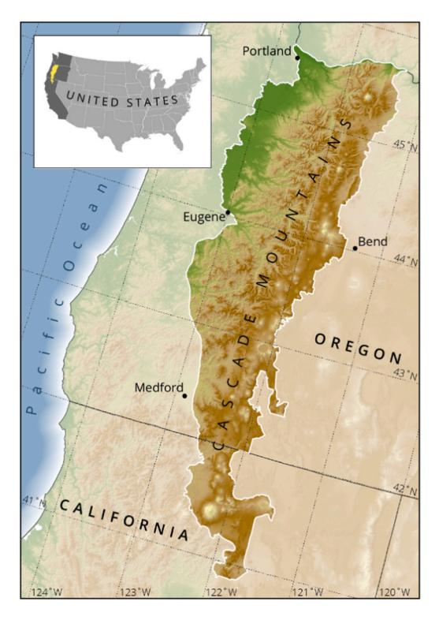
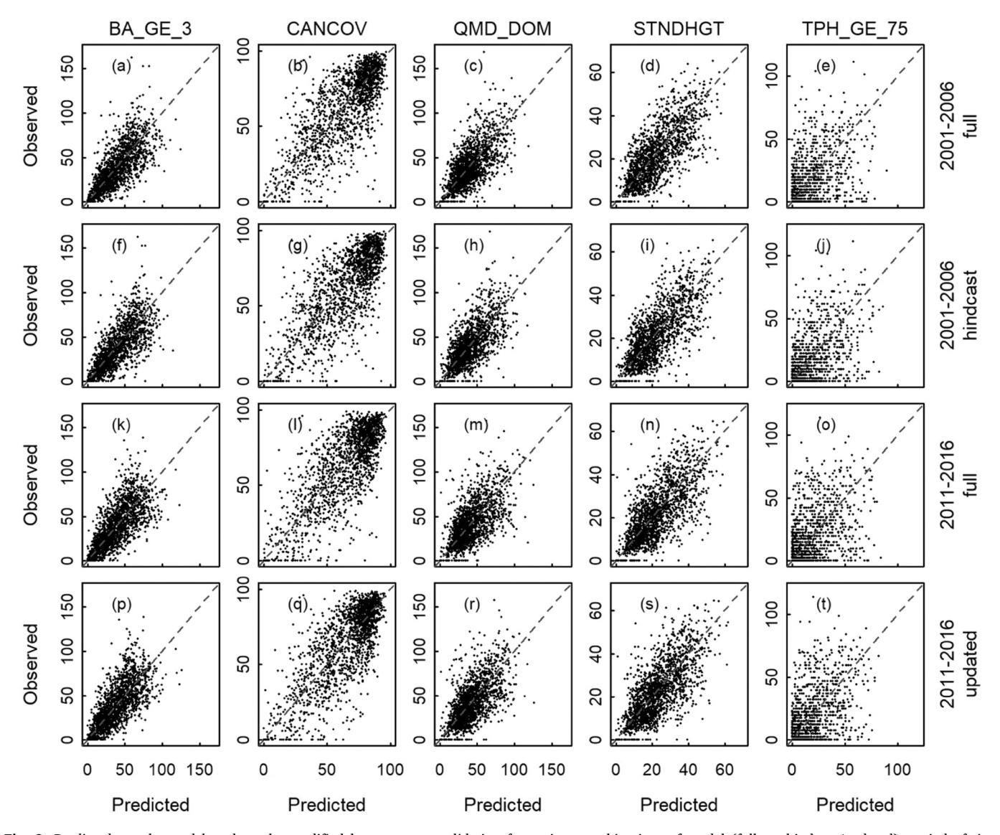
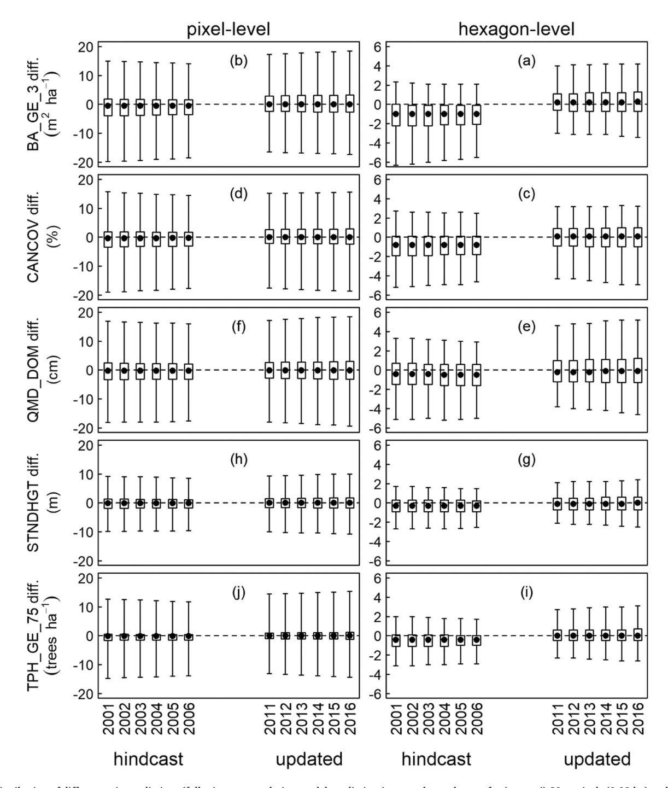
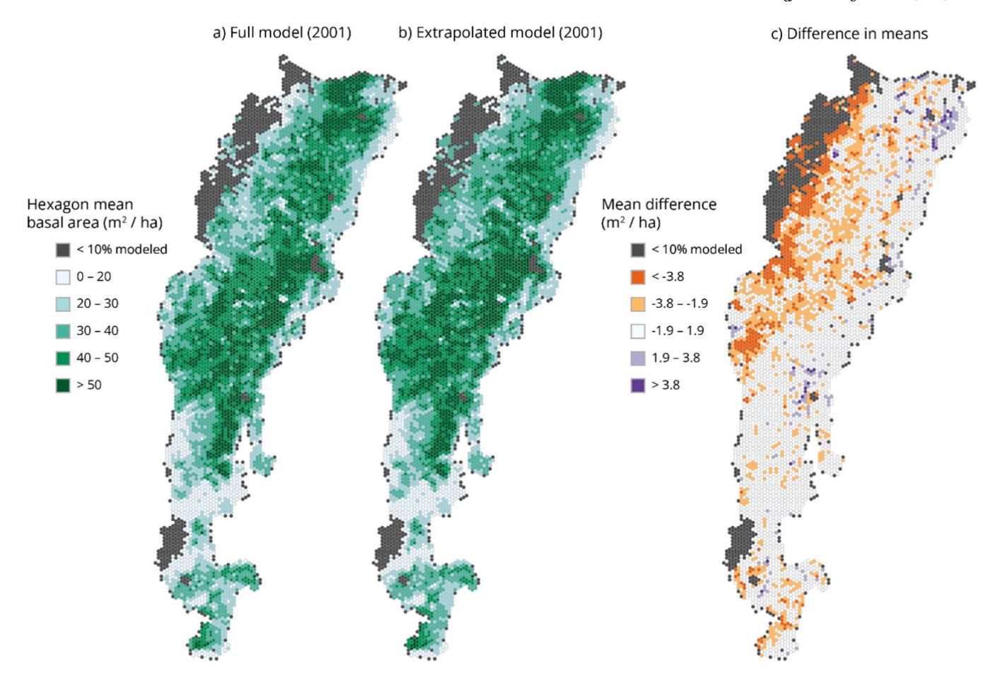
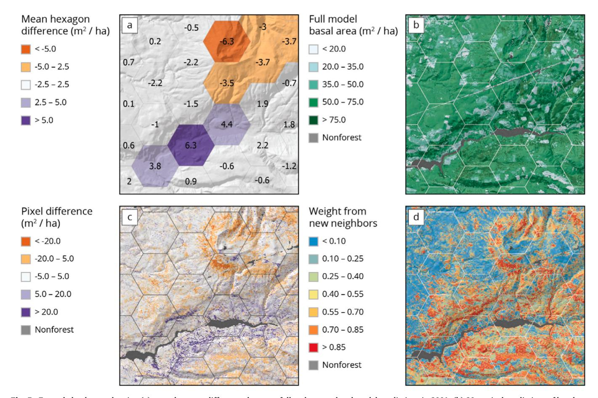

ELSEVIER

Contents lists available at ScienceDirect

### Forest Ecology and Management

journal homepage: www.elsevier.com/locate/foreco

# Hindcasting and updating Landsat-based forest structure mapping across years to support forest management and planning

David M. Bella,\*, Matthew J. Gregoryb, Zhiqiang Yangc

- a USDA Forest Service Pacific Northwest Research Station, United States
- b Oregon State University, Department of Forest Ecosystems and Society, United States
- c USDA Forest Service, Rocky Mountain Research Station, United States

### ARTICLEINFO

Keywords:
Forest inventory
Forest structure
Landsat
Nearest neighbor imputation
Temporal transferability

### ABSTRACT

Forest vegetation mapping that integrates forest inventory data with multispectral remote sensing data provides valuable geospatial products for public land management agencies, but resource managers may require rapid updating of maps as new imagery becomes available (updating) or retrospective mapping for times prior to forest inventory plot measurement (hindcasting). While forest attribute mapping using Landsat multispectral imagery is common, the accuracy of applying models outside of reference epoch to support long-term forest monitoring is not normally quantified. We examine whether a Landsat-based mapping approach can support robust, temporally consistent multivariate mapping of forest structure and composition data in support of forest management planning and landscape analysis. Specifically, we ask: how accurate forest attribute mapping was when hindcasting or updating outside of a period of time when forest inventory plot data were available (reference epoch)? In the western Cascade Mountains of Oregon and California, USA, we used the gradient nearest neighbor approach to annually impute USDA Forest Inventory and Analysis (FIA) plot data (2001-2016) to all 30-m forested pixels based on temporally smoothed Landsat multispectral imagery (1986-2021), including basal area, canopy cover, quadratic mean diameter of dominant trees, stand height, and the density of large diameter trees. We made extrapolations from models fit to a 10-year reference epoch to both earlier periods (2001–2006 hindcast) and to later period (2011-2016 update) and quantified prediction accuracies relative to models based on the full data (2001-2016). To evaluate the influence of spatial scale on hindcasting and updating, we compared full and extrapolation model predictions at pixel-level (0.09 ha) and hexagon-level (780 ha).

At the plot-level, we found no strong differences between the full and extrapolation model predictions for  $\mathbb{R}^2$  and mean error nor among predicted vs. observed regression coefficients. At the pixel-level, average differences due to hindcasting and updating were near zero, though differences varied up to 20 % across pixels. At the hexagon-level, the range in map differences was small (+/- 5 %), but hindcasting resulted in lesser forest attribute predictions. We observed greater variability in pixel-level and hexagon-level prediction differences when hindcasting or updating was temporally further away from the reference period. Using 2001 hindcast and 2016 updated maps as a case study, we found that with hindcasting and updating map differences were spatially aggregated across the study region. Our results support Landsat-based hindcasting and updating of forest attribute mapping beyond the time period covered by forest plot data. Our results suggest aggregating data to coarse spatial resolutions may minimize differences due to hindcasting and updating. Further research is needed to identify the key drivers for prediction differences to improve the accuracy of both hindcasting and updating as a basis for forest monitoring.

### 1. Introduction

Multivariate forest attribute mapping provides valuable geospatial data for land management agencies in support of forest monitoring and

landscape analysis. However, for forest monitoring based on relating satellite imagery with reference plot data, the temporal coverage of plot data is often more limited than remotely sensed covariates, creating challenges for mapping forest attributes outside the time with reference

\* Correspondence to: 1-541-750-7298, 3200 SW Jefferson Way, Corvallis, OR, 97331, USA. *E-mail address:* david.bell@usda.gov (D.M. Bell).

data (Filippelli et al., 2024; Foody et al., 2003; Olofsson et al., 2014; Woodcock et al., 2001). For example, disturbances, such as the increasing prevalence of large wildfires (Reilly et al., 2022, 2017; Westerling et al., 2006; Westerling, 2016), can quickly invalidate forest attribute maps over large areas, indicating a need to regularly update mapping to keep pace with major agents of landscape change. Therefore, broad-scale forest attribute mapping products, such as those developed by integrating forest inventory plot data (e.g., USDA Forest Inventory and Analysis, FIA) with multispectral satellite imagery and other spatial covariates using nearest neighbor imputation (Ohmann and Gregory, 2002; Riley et al., 2021, 2016; Wilson et al., 2013, 2012), may require additional analyses to determine whether maps developed during one time period can be extrapolated to other periods of time to support long-term forest monitoring.

One approach to solving the limited temporal coverage of plot reference data is to use models developed with geospatial predictors and forest inventory data for one time period (i.e., reference epoch), but apply new imagery from after the reference epoch in an updating mode. This would facilitate generating updated maps in-between major development cycles, such as annual map updating. Hindcasting of models fit to reference data in one epoch to an earlier epoch of multispectral imagery is another important application which supports landscape monitoring through time (McRoberts and Tomppo, 2007; Myroniuk et al., 2022; Ohmann et al., 2012; Thapa et al., 2020; Wolter et al., 2008). For example, in the Pacific Northwest USA, forest attribute models based on nearest neighbor imputation of recent forest inventory measurements (2001-present) have been applied to earlier epochs (1986-2000) to examine long-term trends (1986-present) in forest structure (Bell et al., 2021; Davis et al., 2022; Kennedy et al., 2018). This approach to generating updated and hindcast mapping has the benefit of generating long-term forest monitoring data, but the accuracy of such maps outside of reference epoch is not normally quantified.

Application of forest attribute mapping techniques beyond the temporal window used to develop models fundamentally depends on an assumption of stationary relationships between geospatial predictors, particularly remote sensing, and the forest inventory data (Bell et al., 2023). However, there are reasons to question this assumption. Sensor drift has been noted in Landsat data due to changes in satellite orbit (Qiu et al., 2021; Roy et al., 2020). Additionally, changes in reflectance of forest canopies may have little to do with changes in forest structure. Lichen communities in upper canopies are known to influence canopy reflectance (Cohen and Spies, 1992), such that changes in lichen community composition could produce different reflectance signals without any change in forest structure or composition. Similarly, tree phenology is shifting in response to climate change (Buitenwerf et al., 2015; Liu et al., 2022), influencing spectral properties of forest canopies at specific times of year (e.g., Isaacson et al., 2012). For example, while forest attributes may be relatively stable at decadal time-scales in undisturbed forests, the spectral properties of those forests may be shifting, drawing into question the stationarity assumptions. Time-series algorithms for analyzing multispectral imagery, such as LandTrendr (Cohen et al., 2018; Kennedy et al., 2010) and Continuous Change Detection and Classification (CCDC) (Zhu and Woodcock, 2014), may improve temporal transferability of forest attribute mapping (Filippelli et al., 2024), by generating modeled, temporally-smoothed multispectral data in an effort to minimize temporal noise in the imagery signal (e.g., Kennedy et al., 2018). These methods may stabilize the relationship between forest attributes and multispectral reflectance, enabling robust projections of forest structure and composition outside the period with reference plot data.

Our research aims to examine the effect of hindcasting and updating on spatially-explicit (i.e., mapped), multivariate forest structure and composition data products at annual timesteps generated using the gradient nearest neighbor imputation method (GNN) (Ohmann et al., 2012; Ohmann and Gregory, 2002). Specifically, we ask: (1) how accurate our forest attribute mapping on forest inventory data from

differing epoch in predicting forest inventory data? (2) How consistent are maps of forest attributes based on forest inventory data from different reference epochs with each other? In other words, are updating and hindcasting of GNN models based on CCDC a reliable approach to generating mapped forest attributes suitable for long-term monitoring of forests? We address these questions by examining the accuracy (compare different maps based on their ability to predict field observations) and consistency (compare different maps based on the predictions themselves) of GNN predictions with and without the extrapolation of the relationship between forest attributes and geospatial predictors. We perform these comparisons for both hindcasting and updating scenarios (Table 1) as an assessment of the generality of results. We evaluate this question in the western Cascade Mountains of Oregon and California, USA for a suite of variables: basal area, canopy cover, large live tree density, quadratic mean diameter of dominant trees, and stand height. These variables play an important role in supporting landscape analysis, management and planning of state and federal agencies and so the accuracy of predictions is vital to achieving objectives.

### 2. Methods

### 2.1. Study area

For this study, we focused on the western Cascade Mountains of Oregon and California, USA (Fig. 1). The study region provides a diverse suite of forest conditions to examine the temporal consistency of our mapping framework. The climate is generally mediterranean, with temperate, wet winters and warm, dry summers, supporting forests dominated by coniferous tree species (Waring and Franklin, 1979). Douglas-fir (Pseudotsuga menziessii), western hemlock (Tsuga heterophylla), and western redcedar (Thuja plicata) dominate in warm and wet forests at lower elevations in the western area, Pacific silver fir (Abies amabilis) and mountain hemlock (Tsuga mertensiana) dominate at higher elevations, and ponderosa pine (Pinus ponderosa) and western juniper (Juniperus occidentalis) dominate in the warm and dry eastern margin of the study area.

### 2.2. Geospatial predictors

We used two key types of geospatial predictors in this study: satellite imagery and environmental data. Landsat satellite derived imagery provided annual remotely sensed observations of vegetation conditions while environmental data provided information regarding relatively stable biophysical gradients related to vegetation pattern. For the purposes of mapping, all environmental geospatial predictors were reprojected to the USGS National Albers projection and resampled to 30-m grain size to match the native resolution of the Landsat imagery. All reprojection and resampling of geospatial layers was performed in Google Earth Engine, which is a cloud-computing platform specifically designed for broad-scale geospatial modeling and mapping (Gorelick et al., 2017).

### 2.2.1. Landsat imagery

In this study, modeling and mapping utilized Collection 2 surface

**Table 1**Description of temporal windows for model comparisons with plot counts used in modeling and validation.

| Extrapolation type | Full model reference epoch  | Extrapolation reference epoch | Validation epoch            |  |
|--------------------|--------------------------------|-------------------------------|--------------------------------|--|
| Hindcasting        | 2001–2016 ( <i>n</i> =4314) | 2007–2016 (n=2602)            | 2001–2006 ( <i>n</i> =1712) |  |
| Updating           | 2001–2016 ( <i>n</i> =4314) | 2001–2010 (n=2719)            | 2011–2016 ( <i>n</i> =1595) |  |

Fig. 1. Study region map showing elevation and the location of the western Cascades Mountains of Oregon and California.

reflectance from three different Landsat sensors (Landsat 5 TM, Landsat 7 ETM+, and Landsat 8 OLI). We generated annual synthetic imagery layers based on the Continuous Change Detection and Classification (CCDC) algorithm (Zhu and Woodcock, 2014).

The CCDC algorithm on Google Earth Engine (Gorelick et al., 2023; Zhu and Woodcock, 2014) provides a harmonic regression-based approach to capture intra-annual and inter-annual variation as well as detecting forest change due to disturbance and regrowth. The primary output of the CCDC algorithm is one or more sets of harmonic regression coefficients (segments) that characterize the spectral trajectory of each 30-m pixel. For any given target date, a user can calculate the synthetic surface reflectance using the harmonic coefficients corresponding to the segment where the target date is located. Where there is a break between CCDC segments (representing a change of model coefficients), a user can choose to retrieve the modeled value through extrapolation from either the previous (past) segment or the next (future) segment. For this project, we preferentially chose the next segment when the target date fell within an epoch not covered by a CCDC segment. We constructed a stack of yearly synthetic surface reflectance imagery for visible, near-infrared (NIR) and shortwave infrared (SWIR) bands (1986-2021) using August 1 as our target date. Using these stacks of reflectance imagery, we calculated for each year four common indices associated with forest mapping (Table S1): the first three axes of the tasseled-cap transformation (Crist and Cicone, 1984) and the normalized burn ratio (Key and Benson, 2006). Tasseled-cap indices explain a majority of the variance in the Landsat spectral space (Huang et al., 2002) and normalized burn ratio is sensitive to major forest disturbances (Key and Benson, 2006).

### 2.2.2. Climate data

We downloaded 800-m PRISM monthly 30-year normals rasters for precipitation and minimum, maximum and mean temperature from the PRISM website (PRISM Climate Group, Oregon State University, <a href="http://prism.oregonstate.edu">http://prism.oregonstate.edu</a>, downloaded 28 September 2016). These 30-year normals represent the average monthly conditions from 1981 to

2010. From these monthly rasters, we derived climatic variables representing mean and seasonal variation in temperature and precipitation (Table S2) that have been found useful in characterizing forest vegetation patterns (Ohmann and Gregory, 2002). Derived rasters were projected and resampled from 800-m to 30-m using bilinear interpolation. In addition to these climate indices, we used a coastal proximity raster to characterize maritime influence on vegetation patterns (Daly et al., 2008).

### 2.2.3. Topographic and location data

We downloaded 10-m USGS digital elevation models (DEMs) as 1-degree by 1-degree blocks, then reprojected these to 30-m resolution using bilinear interpolation. Derived topographic variables (elevation, slope, aspect, potential relative radiation, and topographic position index) were calculated from the 30-m DEM to maintain consistency between topographic covariates, although this likely dampens the magnitude of variables such as slope percent. In addition to these topographic variables, we included both latitude and longitude as spatial predictors to help constrain the geographic range of the nearest neighbor candidates. Table S3 lists the topographic and location variables used for modeling and mapping.

### 2.3. Forest inventory data

We used forest inventory plot data (hereafter, plot data) with at least 50 % forested conditions (i.e., at least half of the plot was classified by field crews as supporting or being capable of supporting  $10\,\%$  tree canopy cover) from California, Oregon, and Washington forests within 10 km of our study region (Fig. 1) for 2001–2016 as the source of our forest attribute data. USDA Forest Service Forest Inventory and Analysis is a national program measuring forest ecosystems across the USA (Gray et al., 2012), supplemented in our study region by additional plots of the same design installed as a regional intensification on National Forest System lands (excluding wilderness areas) for Oregon and Washington (Max et al., 1996). In our study region, FIA measures plots on a 10-year cycle (beginning in 2001) following the annual plot design using a nested, fixed radius plot design which samples trees on four 13.5 m2 (>2.5 cm diameter breast height [DBH]),  $168 \text{ m}^2$  (>12.7 cm DBH), and 1013 m2 (61 cm DBH for eastern OR or 76 cm DBH for western OR) areas. On USDA Forest Service non-reserved lands (i.e., outside of wilderness areas), there is one plot per 620 ha, and elsewhere there is one plot per 2428 ha. To facilitate forest attribute mapping work, the FIA program has granted us access to true plot coordinates, thus minimizing errors related to the use of publicly available, fuzzed plot coordinates. A variety of measurements are taken, but here we focus on tree species, diameter, and survival status measurements.

Based on live tree species, diameter, and height measurements, we calculated plot-level forest structural and compositional metrics to be used in modeling and mapping (Table 2, Table S4). For each plot, tree measurements were rescaled and aggregated to per-hectare forest attribute values to describe the forested portion of the plot. We assumed that forest attributes were homogenous for the forested portion of each plot (i.e., variation amongst subplots was not described). Thus, nonforest portions of plots were not accounted for in our modeling. Additional details on variables of interest are provided below (section 3.4)

**Table 2**Descriptions of forest attributes mapped and tested as part of this research.

| Forest Attribute                                             | Abbreviation | Units                           |
|--------------------------------------------------------------|--------------|---------------------------------|
| Basal area of trees $\geq$ 2.54 cm diameter at breast height | BA_GE_3      | $\mathrm{m}^2~\mathrm{ha}^{-1}$ |
| Tree canopy cover                                            | CANCOV       | %                               |
| Quadratic mean diameter of dominant trees                    | QMD_DOM      | cm                              |
| Stand height                                                 | STNDHGT      | m                               |
| Density of trees ≥ 75 cm diameter at breast height           | TPH_GE_75    | trees                           |
|                                                              |              | $\mathrm{ha^{-1}}$              |

and additional details regarding FIA sampling can be found elsewhere (Bechtold et al., 2005; Westfall et al., 2022).

### 2.4. Forest structure mapping

GNN provides a multivariate, non-parametric methodology for annual vegetation mapping (Kennedy et al., 2018; Ohmann and Gregory, 2002) suitable for landscape- and regional-scale analysis and monitoring across a broad range of forest conditions (Davis et al., 2022, 2015). It combines geospatial data with forest inventory data to model and impute forest attributes (structure and composition) across all forest lands in the study area. Any forest attribute that can be computed for individual plots can be imputed. In this research, we focus on five forest attributes commonly used in forestry applications related to the live tree components of forest structure (Table 2).

The GNN framework uses canonical correspondence analysis (CCA), a method of constrained ordination (direct gradient analysis) (Ter Braak, 1986), to define a multivariate gradient space as the basis of mapping. In our case, the CCA used to define the gradient space was based on an environment matrix consisting of spectral and environmental predictors (Tables S1-S3) and a species matrix consisting of basal area partitioned in 99 species and size class combinations (Table S4). Species and size class categories follow our previous mapping efforts and generally reflect a greater number of size categories for more common species with a greater range of tree sizes (e.g., Pseudotsuga menziessi) (Ohmann and Gregory, 2002). Weighted Euclidean distances based on eigenvalues from the CCA between plots and pixels in that multivariate gradient space are calculated such that the *k* nearest neighbors for every pixel can be identified as those plots that minimize the distance to the pixel in question in gradient space. Annual maps are generated by altering the year of temporally smoothed Landsat imagery used for defining nearest neighbors: e.g., forest attribute maps for 2001 are based on the CCA model, climate and topographic rasters that do not change through time, and the 2001 temporally-smoothed Landsat imagery. For mapping, forest attributes are imputed to pixels based on some function of those nearest neighbors, such as the mean. Differing number of neighbors (k) can be selected based on the objectives of the user. For example, using only the nearest neighbor (i.e., k = 1) may help to maintain more realistic combinations of variables (e.g., species lists) by imputing only those combinations that were actually observed in the forest inventory (Ohmann et al., 2014). Conversely, using multiple neighbors (k > 1) may reduce some types mapping errors and allows for the estimation of prediction uncertainties (Bell et al., 2015). For this study, we use a weighted mean of the seven nearest neighbors to approximate the bootstrap sampling approach (Bell et al., 2021).

## 2.5. Evaluating Imputation Updating and Hindcasting Accuracy and Consistency

In this work, we evaluated imputation updating and hindcasting by comparing GNN imputation models fit with all forest inventory years (full model) to those fit with a subset of years and applied to imagery from beyond the reference window (extrapolation). Comparisons of accuracy involve comparing full and extrapolated models based on their ability to predict observations from the forest inventory data. Accuracy comparisons indicate whether model performance relative to field observations is influenced by predicting beyond the reference epoch. Consistency refers to a direct comparison of full and extrapolated prediction maps, either at the pixel or aggregate scale. By examining consistency, we can assess whether maps based on different reference epochs provide substantially different information to map users.

To assess the accuracy of GNN imputed forest attributes (Table 2), we compared GNN predictions, whether from the full or extrapolated models, to FIA plot data and generated associated accuracy metrics. We examined both extrapolation to the epoch before (2001–2006, hind-casting) and after (2011–2016, updating) the reference epoch (Table 1).

In addition to examining predicted vs. observed forest attributes, model accuracy was assessed using several metrics, including coefficient of determination  $(R^2)$ , mean error relative to the mean observation, and the slope and intercept from a linear regression relating predicted to observed using ordinary least squares regression (lm function) in R (version 4.0.3; R Development Core Team, 2020). Performance metrics were estimated using a modified leave-one-out procedure, where predictions for a given plot used the seven nearest independent neighbors (i.e., plots not measured at that location), weighted by their chance of being nearest neighbor in a bootstrap sample (Bell et al., 2015). Traditional leave-one-out model validation generates predictions for each observation (*n* total observations) by fitting the model without that focal observation, thus fitting the model n distinct times. In contrast, the modified leave-one-out procedure generates predictions for individual observations using the model fit to all data, but generating predictions based only on independent neighbors (i.e., plots not measured at the same location) for the year of that observation (Ohmann and Gregory, 2002). The modified leave-one-out procedure is computationally efficient and generates similar results as a traditional leave-out-out approach for comparing a given set of predictions to the observations. Performance metrics were calculated for each year of the validation epoch (Table 1), and we report the mean and 95 % confidence interval for that sample of years for each metric and model assuming five degrees of freedom (n = 6 years) and unknown variance.

To assess the consistency between GNN imputed forest attributes based on differing reference data epochs, we examined differences between mapped predictions of the full model and extrapolation models. Thus, we directly compared predictions from different GNN maps to better understand the consequences of updating and hindcasting on mapped forest attributes. For all variables, we examined the distribution of predictions for full and extrapolation models (Table 1) as well as the distribution of differences at the pixel-scale (0.09 ha) and the aggregate scale (780 ha). Aggregation was achieved by generating a lattice of 780ha hexagons with centroids spaced 3 km apart and calculating the mean prediction for forest pixels within the hexagon. The aggregate size of 780 ha was selected to represent stand- to landscape-level conditions. Previous research in this region indicated that Landsat-based live tree biomass predictions converge on lidar-based predictions when aggregated to 100 ha - 1000 ha (Bell et al., 2018). Additionally, we examine spatial patterns in hexagon prediction differences, focusing on mean tree basal area, to assess the geographic consequences of hindcasting and updating. The exploration of basal area maps is meant to be an illustrative example rather than an exhaustive assessment.

### 3. Results

### 3.1. Imputation accuracy outside reference epoch

Comparisons of predicted and observed forest structure attributes based on the modified leave-one-out validation approach indicated good agreement between predictions and field data across all models, suggesting no major differences between full and extrapolation models in terms of predictive performance (Fig. 2). For any given forest structure attribute, the pattern of predicted vs. observed between all models (full, hindcast, and updated) and epochs (2001–2006 or 2011–2016) appear similar. For all combinations of forest attribute and epoch, the 95 % confidence intervals for the full and extrapolated (hindcast or updated) models were overlapping for  $\mathbb{R}^2$ , mean error relative to the mean observation, and intercept and slope parameters (Table 3), indicating no statistically significant differences in model performance.

For  $R^2$ , the greatest exception was extrapolated quadratic mean diameter (QMD\_DOM) and large tree density (TPH\_GE\_75) for 2001–2006, which indicated a tendency toward greater  $R^2$  for extrapolation models compared to full models. The  $R^2$  varied among variable of interest, with canopy cover (CANCOV) predictions exhibiting the greatest  $R^2$  and large tree density (TPH\_GE\_75) exhibiting the least  $R^2$ .

Fig. 2. Predicted vs. observed based on the modified leave-one-out validation for various combinations of model (full vs. hindcast/updated), period of time (2001–2006 vs. 2011–2016) for (a,f,k,p) basal area (BA\_GE\_3,  $m^2$  ha-1), (b,g,j,q) canopy cover (CANCOV, %), (c,h,m,r) quadratic mean diameter (QMD\_DOM, cm), (d,i,n,s) stand height (STNDHGT (m), and (e,j,o,t) large tree density (TPH\_GE\_75, tree ha-1). For each epoch, all observations across years are presented together as no visual differences in their distributions were noted.

Mean error relative to the mean observation for the full and extrapolation models were also similar, though there appeared to be more variation in error across years than across variables. Across models we compared based on linear regression results, slopes were less than 1.0 and intercepts were greater than 0.0 (Table 3), indicating a general tendency to overpredict at low values, converge at moderate values, and under-predict at high values (Fig. 2). Differences between extrapolation and full model regression results were generally similar across structural variables.

### 3.2. Prediction consistency at multiple scales

Comparisons of the distribution of differences (i.e., consistency) between the full and extrapolated models (i.e., full – extrapolated) under hindcasting and updating scenarios at pixel-level and hexagon-level predictions indicate that differences were generally distributed around zero, with the range of differences being narrower for the hexagon-level comparisons than the pixel-level comparisons (Fig. 3). At the pixel-level, differences between full and extrapolated model predictions were centered on zero, indicating little average pixel-level difference. Most of

the observed differences in predictions (i.e., 25th to 75th percentile range) were tightly clustered around zero, but the 95th percentile ranges were much broader. The bounds of the 50th percentile ranges for pixel differences were  $-3.9\text{-}3.3~\text{m}^2~\text{ha}^{-1}$  basal area, -3.4-2.9~% canopy cover, -3.3-3.0~cm quadratic mean diameter, -1.9-1.7~m stand height, and -1.6-1.2 trees ha $^{-1}$  of live trees  $\geq\!75~\text{cm}$  DBH. The 95th percentile ranges for pixel-level differences in predictions were 5.3–10.8 times wider than the 50th percentile ranges.

At the hexagon-level, differences for the hindcasting scenario were slightly less than zero and differences for the updating were slightly greater than zero. Variation in hexagon-level differences were less than pixel-level differences, with the bounds of the 50th percentile ranges at  $-2.2\text{--}1.3~\text{m}^2~\text{ha}^{-1}$  basal area, -1.9--1.0~% canopy cover, -1.6--1.2~cm quadratic mean diameter, -0.9--0.6~m stand height, and -1.1--0.7~trees ha $^{-1}$  of live trees  $\geq 75~\text{cm}$  DBH. The 95th percentile ranges for hexagon-level differences in predictions were 2.9–3.7 times wider than the 50th percentile ranges, indicating less frequent extreme differences at hexagon-vs. pixel-level. There was no evidence of increasing or decreasing differences in predicted forest attributes at the pixel- or hexagon-level as extrapolation moved further away from the reference epoch

Table 3
Mean and 95 % CI across years for  $R^2$ , mean error relative to mean observed value, and intercept and slope parameters between predicted and observed for five attributes, two epochs (2001–2006, 2011–2016), and full vs. extrapolation (hindcast or updated) model. Accuracy metrics were calculated for each year independently, with confidence intervals for a sample mean with unknown variance equal to mean  $\pm$  2.571  $\times$  sample standard error.

| Attribute                      | Epoch     | Model    | $R^2$        | Relative Mean Error          | Intercept    | Slope        |
|--------------------------------|-----------|----------|--------------|------------------------------|--------------|--------------|
| BA_GE_3 2001–2006 2011–2016 | 2001–2006 | full     | 0.50         | 0.009                        | 0.05         | 0.81         |
|                                |           |          | (0.45, 0.56) | (0.001, 0.018)               | (0.04, 0.06) | (0.77, 0.85) |
|                                |           | hindcast | 0.49         | 0.016                        | 0.04         | 0.81         |
|                                |           |          | (0.42, 0.56) | (0.009, 0.024)               | (0.03, 0.06) | (0.74, 0.88) |
|                                | 2011-2016 | full     | 0.46         | 0.000 (-0.007, 0.007)        | 0.07         | 0.79         |
|                                |           |          | (0.42, 0.51) |                              | (0.05, 0.09) | (0.74, 0.85) |
|                                |           | updated  | 0.48         | $-0.001 \; (-0.013,  0.011)$ | 0.06         | 0.82         |
|                                |           |          | (0.45, 0.52) |                              | (0.04, 0.08) | (0.77, 0.86) |
| CANCOV                         | 2001-2006 | full     | 0.58         | 0.006 (-0.001, 0.013)        | 0.07         | 0.89         |
|                                |           |          | (0.53, 0.64) |                              | (0.04, 0.10) | (0.84, 0.93) |
|                                |           | hindcast | 0.59         | 0.007 (-0.006, 0.019)        | 0.06         | 0.91         |
|                                |           |          | (0.54, 0.63) |                              | (0.03, 0.08) | (0.88, 0.94) |
|                                | 2011-2016 | full     | 0.58         | 0.013                        | 0.08         | 0.86         |
|                                |           |          | (0.51, 0.64) | (0.007, 0.020)               | (0.06, 0.10) | (0.82, 0.89) |
|                                |           | updated  | 0.57         | 0.021                        | 0.07         | 0.86         |
|                                |           |          | (0.51, 0.63) | (0.014, 0.027)               | (0.04, 0.10) | (0.82, 0.90) |
| QMD_DOM                        | 2001-2006 | full     | 0.34         | 0.006 (-0.005, 0.016)        | 0.09         | 0.72         |
|                                |           |          | (0.26, 0.41) |                              | (0.07, 0.10) | (0.67, 0.77) |
|                                |           | hindcast | 0.39         | 0.006                        | 0.07         | 0.76         |
|                                |           |          | (0.34, 0.44) | (0.000, 0.013)               | (0.05, 0.08) | (0.72, 0.81) |
|                                | 2011-2016 | full     | 0.4          | 0.005 (-0.003, 0.012)        | 0.07         | 0.77         |
|                                |           |          | (0.32, 0.49) |                              | (0.05, 0.09) | (0.71, 0.84) |
|                                |           | updated  | 0.36         | 0.008 (-0.003, 0.019)        | 0.07         | 0.75         |
|                                |           |          | (0.26, 0.46) |                              | (0.05, 0.10) | (0.68, 0.83) |
| STNDHGT                        | 2001-2006 | full     | 0.51         | 0.011                        | 0.06         | 0.80         |
|                                |           |          | (0.43, 0.58) | (0.001, 0.020)               | (0.05, 0.08) | (0.75, 0.86) |
|                                |           | hindcast | 0.49         | 0.012                        | 0.06         | 0.80         |
|                                |           |          | (0.46, 0.53) | (0.003, 0.021)               | (0.05, 0.07) | (0.76, 0.83) |
|                                | 2011-2016 | full     | 0.44         | 0.008 (-0.002, 0.019)        | 0.08         | 0.77         |
|                                |           |          | (0.40, 0.48) |                              | (0.06, 0.09) | (0.73, 0.81) |
|                                |           | updated  | 0.45         | 0.011                        | 0.06         | 0.79         |
|                                |           |          | (0.39, 0.51) | (0.002, 0.020)               | (0.04, 0.09) | (0.73, 0.85) |
| TPH_GE_75                      | 2001-2006 | full     | 0.21         | 0.007                        | 0.04         | 0.63         |
|                                |           |          | (0.00, 0.42) | (0.003, 0.012)               | (0.02, 0.07) | (0.49, 0.77) |
|                                |           | hindcast | 0.28         | -0.001 (-0.011, 0.008)       | 0.04         | 0.70         |
|                                |           |          | (0.17, 0.39) |                              | (0.03, 0.06) | (0.59, 0.8)  |
|                                | 2011-2016 | full     | 0.21         | 0.000 (-0.008, 0.008)        | 0.05         | 0.64         |
|                                |           |          | (0.08, 0.35) |                              | (0.03, 0.07) | (0.54, 0.74) |
|                                |           | updated  | 0.21         | 0.015                        | 0.04         | 0.63         |
|                                |           | •        | (0.02, 0.40) | (0.009, 0.022)               | (0.02, 0.06) | (0.51, 0.76) |

(2006–2001 for hindcasting and 2011–2016 for updating), but the variation in differences did appear to increase, indicating increasing local divergence in predictions.

### 3.3. Geographic patterns of differences due to extrapolation: Basal area case study

Here we present an exploration of the mapped basal area from the full and extrapolated model for 2001 and 2016 as a case study in the geographic patterns of prediction differences, and thus consistency. Both the full and extrapolated models predicted similar geographic patterns in tree basal area across the study region (Fig. 4a-b, S1a-b). At the scale of 780-ha hexagons, differences in basal area predictions were generally small, with differences in the mean predictions falling between -1.9 and  $1.9 \text{ m}^2$  ha-1 (2.5 % of maximum predicted basal area) for 66.3 % of hexagons for 2001 and 77.0 % for 2016 and -3.8 and  $3.8 \text{ m}^2$ ha-1 (5 % of maximum predicted basal area) for 90.0 % of hexagons for 2001 and 94.9 % for 2016 (Fig. 4c, S1c, Table S5). However, there was a tendency for the extrapolation model to predict more basal area than the full model in the northwest portion of the study area, often coinciding with lower basal area portions of the region in the hindcasting (Fig. 4c), but not updating (Figure S1c), mode. These comparisons of the full vs. extrapolation models indicate that map prediction sensitivity (i.e., magnitude of differences) to data inputs varies geographically in a nonrandom fashion. Similar maps for the other forest attributes are provided in the supplementary material (Figures S1-S9). Like basal area,

differences between full and extrapolation model aggregated predictions were spatially clustered, though patterns differed somewhat based on the variable being examined.

At the scale of individual 30-m pixels, differences between the predicted basal area from the full vs. the extrapolated models could be substantial (Figs. 5a, 5c). Visual comparisons of basal area predictions (Fig. 5b) and the differences in model predictions (Fig. 5c) do not indicate consistent differences as a function of the magnitude of model predictions. However, large differences do appear to be more common in areas where the full model predictions – a weighted mean of the seven nearest neighbors – were based on plots falling outside of the reference epoch used to fit the extrapolated model (Fig. 5d).

### 4. Discussion

Based on plot-level assessments, our study generally supports the transferability of the GNN mapping for hindcasting or updating outside of the reference epoch, though biases may be elevated in some situations. Plot-level accuracies ( $R^2$ ) and mean errors for the full and extrapolated models were similar to each other across all variables and epochs (Table 3). The differences in mean error were not evident when comparing predicted and observed (Fig. 2) or linear regression parameters, which were generally similar based on the regression parameter estimates (Table 3). If substantial drift in the Landsat multispectral imagery (Qiu et al., 2021; Roy et al., 2020) was influencing GNN predictions, we anticipated that model accuracy would decline as time

Fig. 3. Distribution of differences in predictions (full minus extrapolation model predictions) across the study area for (a,c,e,g,i) 30-m pixels (0.09 ha) and (b,d,f,h,j) 3-km hexagons under the hindcasting and updating scenarios. Boxes represent 16th to 84th percentile values and whiskers indicate 2.5th and 97.5th percentile values.

between prediction year and reference epoch increased. It is possible that a six-year extrapolation window was insufficient to identify major influences of changes in the spectral properties of the Landsat data. Still, these results support temporal extrapolation of Landsat-based mapping results for several years prior to refitting models with new data. Given the both national and international application of nearest neighbor imputation for forest attribute mapping in support of forest management (Chirici et al., 2016), there is an need to test the temporal transferability of nearest neighbor imputation models across forest biomes globally.

Landsat multispectral imagery at 30-m resolutions has been available for nearly four decades, with both changes in the quality of data from individual sensors (e.g., orbital drift [Roy et al., 2020]) as well as differences among sensors observing during different epochs (TM, ETM+, and OLI). Therefore, errors in hindcasting and updating could arise from changes in the Landsat imagery itself through time. However, there was a lack of model performance differences in the updating scenario, where the reference epoch included data from TM and ETM+ and the extrapolation epoch included ETM+ and OLI data. While more tests of temporal transferability of models are needed to understand the role of imagery and image processing in hindcasting and updating and the use of resulting maps in forest monitoring (Filippelli et al., 2024), our results suggest that Landsat-based mapping, like the nearest neighbor

Fig. 4. Comparisons of the mean basal area predictions aggregated across forests in 3-km hexagons for the full model (a) and the extrapolated model (b) for 2001 as well as the differences between model predictions (c). Dark gray areas are hexagons where less than 10 % of the area was comprised of forest. Thresholds for differences are  $\pm 2.5$  % (lighter shade of orange and blue) and  $\pm 5$  % (darker shade of orange and blue) of the maximum predicted basal area for hexagons.

imputation, for this region is generally a robust approach for forest attribute mapping across years.

With respect to the consistency between models leveraging different plot data, geospatial comparisons of full and extrapolation model predictions to all forests in the study area indicated that pixel-level differences were clustered near zero, but aggregation revealed consistent, but small differences at broader spatial scales (780 ha, Fig. 3). These results imply that positive and negative differences are spatially clustered, resulting in some areas where positive or negative deviations in model predictions predominate. In the cases of hindcasting to 2001 and updating to 2016, differences between basal area, as well as other forest attributes, predictions for full and extrapolation models were often spatially aggregated (Fig. 4, S1-S9). Careful examination of the CCA results do not indicate that the addition of plots from outside the reference epoch altered the gradient space that characterizes the relationships between geospatial predictor variables and forest structure (Figure S10). In some cases, large differences in mapped predictions were associated with locations where the full model heavily relied on plots from outside the reference epoch (Fig. 5). Therefore, it appears that differences associated with hindcasting or updating of nearest neighbor imputation models are likely driven by changes in the pool of plots that can be imputed. The overall consistency in comparisons between full and extrapolation models when examining periods before (2001–2006) and after (2011-2016) the respective reference epochs (2007-2016 and 2001-2010, respectively) still implies some generality to our results even when plot pools differ somewhat. Thus, while our results suggest that as imputation mapping for a region matures (i.e., involves many years of forest inventory data) overall performance may not change

substantially, we do not yet know whether prediction uncertainty in some landscapes will attenuate.

Time-series of GNN mapping in the Pacific Northwest has been used to examine changes in forest structure and composition, such as status and trend monitoring for mature and old-growth forests (Davis et al., 2022, 2015), threatened and endangered species habitat suitability (Davis et al., 2016; Falxa and Raphael, 2016), and large live and dead tree availability (Bell et al., 2021). The importance of plot pool in causing differences in imputed maps suggest that forest monitoring aiming to examine forest change using nearest neighbor imputation (i.e., differencing map predictions between two years) should ensure that all maps in the associated time-series not only use the same methods, but also the same plot pools to minimize artifacts.

Forest managers make decisions based on the best available information, resulting in a tension between information availability and accuracy. In the case of regional forest attribute mapping with GNN, that tension manifests in a tradeoff between (1) reinitiating model development, including data management, model development, accuracy assessment, and full peer review for what is often an updated approach, and (2) rapid updating, which applies updated remote sensing to the pre-existing models and workflows. Furthermore, appropriate reference data (e.g., annual FIA plots measured 2001-present) may not be available for the full time period of interest, making hindcasting and updating a necessary component of our regional monitoring work. Traditionally, regional updates to GNN have taken five to six years to complete, including substantial updates to methodologies to generate improved mapping each time (Davis et al., 2022, 2015; Moeur et al., 2011). However, the lengthy development cycle between map updates can

Fig. 5. Example landscape showing (a) mean hexagon differences between full and extrapolated model predictions in 2001, (b) 30-m pixel predictions of basal area, (c) 30-m pixel differences in predictions of basal area, and (d) the contribution of new neighbors (2001–2006) relative to the reference epoch neighbors (2007–2016) to the full model 30-m pixel predictions, calculated as the summed weight associated with plots from outside the reference epoch in the pixel-level weighted mean of neighbors.

allow for significant changes in the status and trends of forest attributes to manifest, such as reporting losses and gains in Pacific Northwest mature forest during differing reporting cycles (Davis et al., 2015), followed by major losses due to large wildfire (Reilly et al., 2022). These abrupt changes could erode trust in map products, even when extensive accuracy assessments are provided. Our study indicates that interim updated maps can be generated quickly from new Landsat imagery, and likely other multispectral data from optical sensors (e.g., 10-m Sentinel-2), ensuring that managers can incorporate changes in their landscapes due to recent disturbances. Moreover, these intermediate updates may reduce the predicted differences between major mapping updates, enhancing trust in the best available science among maps users.

### CRediT authorship contribution statement

Zhiqiang Yang: Writing – review & editing, Methodology, Investigation, Formal analysis, Data curation, Conceptualization. Matthew J. Gregory: Writing – review & editing, Visualization, Validation, Methodology, Investigation, Formal analysis, Data curation, Conceptualization. David M Bell: Writing – review & editing, Writing – original draft, Visualization, Validation, Supervision, Project administration, Methodology, Investigation, Funding acquisition, Formal analysis, Conceptualization.

### **Declaration of Competing Interest**

The authors declare the following financial interests/personal relationships which may be considered as potential competing interests:

Matthew Gregory reports financial support was provided by USDA Forest Service Pacific Northwest Research Station. Matthew Gregory reports financial support was provided by USDA Forest Service Pacific Northwest Region. If there are other authors, they declare that they have no known competing financial interests or personal relationships that could have appeared to influence the work reported in this paper.

### **Data Availability**

Data will be made available on request.

### Acknowledgements

We thank Raymond Davis, Matthew Ehrman, and Marin Palmer for valuable conversations and feedback regarding the development of this manuscript. We thank Joshua Goldberg and two anonymous reviewers for helpful comments that improved the manuscript. USDA Forest Service Northwest Region (21-CR-11062756-046) and Pacific Northwest Research Station (19-JV-11261959-064) funded this project. We thank USDA Forest Service Forest Inventory and Analysis program for collecting the field data used in this manuscript.

### Appendix A. Supporting information

Supplementary data associated with this article can be found in the online version at doi:10.1016/j.foreco.2024.122239.

#### References

- Bechtold, W.A., Patterson, P.L., Editors, 2005. The enhanced forest inventory and analysis program - national sampling design and estimation procedures. Gen. Tech. Rep. SRS-80. Asheville, NC: U.S. Department of Agriculture, Forest Service, Southern Research Station. 85 p. 080. https://doi.org/10.2737/SRS-GTR-80.
- Bell, D.M., Acker, S.A., Gregory, M.J., Davis, R.J., Garcia, B.A., 2021. Quantifying regional trends in large live tree and snag availability in support of forest management. For. Ecol. Manag. 479, 118554 https://doi.org/10.1016/J. FORECO.2020.118554.
- Bell, D.M., Gregory, M.J., Ohmann, J.L., 2015. Imputed forest structure uncertainty varies across elevational and longitudinal gradients in the western Cascade Mountains, Oregon, USA. For. Ecol. Manag. 358, 154–164. https://doi.org/10.1016/ i.foreco.2015.09.007.
- Bell, D.M., Gregory, M.J., Kane, V., Kane, J., Kennedy, R.E., Roberts, H.M., Yang, Z., 2018. Multiscale divergence between Landsat- and lidar-based biomass mapping is related to regional variation in canopy cover and composition. Carbon Balance Manag. 13, 15. https://doi.org/10.1186/s13021-018-0104-6.
- Bell, D.M., Gregory, M.J., Palmer, M., Davis, R., 2023. Guidance for forest management and landscape ecology applications of recent gradient nearest neighbor imputation maps in California, Oregon, and Washington (No. Gen. Tech. Rep. PNW-GTR-1018. Portland, OR: U.S. Department of Agriculture, Forest Service, Pacific Northwest Research Station. 41 p. (Online only).).
- Buitenwerf, R., Rose, L., Higgins, S.I., 2015. Three decades of multi-dimensional change in global leaf phenology. Nat. Clim. Change 5, 364–368. https://doi.org/10.1038/ nclimate/533
- Chirici, G., Mura, M., McInerney, D., Py, N., Tomppo, E.O., Waser, L.T., Travaglini, D., McRoberts, R.E., 2016. A meta-analysis and review of the literature on the k-Nearest Neighbors technique for forestry applications that use remotely sensed data. Remote Sens. Environ. 176, 282–294. https://doi.org/10.1016/j.rse.2016.02.001.
- Cohen, W.B., Spies, T.A., 1992. Estimating structural attributes of Douglas-fir/western hemlock forest stands from landsat and SPOT imagery. Remote Sens. Environ. 41, 1–17. https://doi.org/10.1016/0034-4257(92)90056-P.
- Cohen, W.B., Yang, Z., Healey, S.P., Kennedy, R.E., Gorelick, N., 2018. A LandTrendr multispectral ensemble for forest disturbance detection. Remote Sens. Environ. 205, 131–140. https://doi.org/10.1016/J.RSE.2017.11.015.
- Crist, E.P., Cicone, R.C., 1984. A physically-based transformation of Thematic Mapper data — The TM Tasseled Cap. IEEE Trans. Geosci. Remote Sens. GE 22, 256–263. https://doi.org/10.1109/TGRS.1984.350619.
- Daly, C., Halbleib, M., Smith, J.I., Gibson, W.P., Doggett, M.K., Taylor, G.H., Curtis, J., Pasteris, P.P., 2008. Physiographically sensitive mapping of climatological temperature and precipitation across the conterminous United States. Int. J. Climatol. 28, 2031–2064 https://doi.org/DOI: 10.1002/joc.1688.
- Davis, R.J., Bell, D.M., Gregory, M.J., Yang, Z., Gray, A.N., Healey, S., Stratton, A.E., 2022. Northwest Forest Plan the first 25 years: status and trends in late-successional and old-growth forests.
- Davis, R.J., Hollen, B., Hobson, J., Gower, J.E., Keenum, D., 2016. Northwest Forest Plan—the first 20 years (1994–2013): status and trends of northern spotted owl
- Davis, R.J., Ohmann, J.L., Kennedy, R.E., Cohen, W.B., Gregory, M.J., Yang, Z., Roberts, H.M., Gray, A.N., Spies, T.A., 2015. Northwest Forest Plan-the first 20 years (1994-2013): status and trends of late-successional and old-growth forests. Gen. Tech. Report PNW-GTR-911.
- Falxa, G.A., Raphael, M.G., 2016. Northwest Forest Plan—the first 20 years (1994–2013): status and trend of marbled murrelet populations and nesting habitat. Gen. Tech. Rep. PNW-GTR-933. Portland, OR: U.S. Department of Agriculture, Forest Service, Pacific Northwest Research Station. 132 p. 933. https://doi.org/10.2737/ PNW-GTR-933.
- Filippelli, S.K., Schleeweis, K., Nelson, M.D., Fekety, P.A., Vogeler, J.C., 2024. Testing temporal transferability of remote sensing models for large area monitoring. Sci. Remote Sens. 9, 100119 https://doi.org/10.1016/j.srs.2024.100119.
- Foody, G.M., Boyd, D.S., Cutler, M.E.J., 2003. Predictive relations of tropical forest biomass from Landsat TM data and their transferability between regions. Remote Sens. Environ. 85, 463–474. https://doi.org/10.1016/S0034-4257(03)00039-7.
- Gorelick, N., Hancher, M., Dixon, M., Ilyushchenko, S., Thau, D., Moore, R., 2017.
  Google Earth Engine: Planetary-scale geospatial analysis for everyone. Remote Sens.
  Environ. 202, 18–27. https://doi.org/10.1016/J.RSE.2017.06.031.
- Gorelick, N., Yang, Z., Arévalo, P., Bullock, E.L., Insfrán, K.P., Healey, S.P., 2023. A global time series dataset to facilitate forest greenhouse gas reporting. Environ. Res. Lett. 18, 084001 https://doi.org/10.1088/1748-9326/ace2da.
- Gray, A.N., Brandeis, T.J., Shaw, J.D., McWilliams, W.H., Miles, P., 2012. Forest Inventory and Analysis Database of the United States of America (FIA). In: Dengler, J., Oldeland, J., Jansen, F., Chytry, M., Ewald, J., Finckh, M., Glockler, F., Lopez-Gonzalez, G., Peet, R.K., Schaminee, J.H.J. (Eds.), Vegetation databases for the 21st century. Biodiversity and Ecology, 4, pp. 225–231. https://doi.org/ 10.7809/b-e.00079, 225-231.
- Huang, C., Wylie, B., Yang, L., Homer, C., Zylstra, G., 2002. Derivation of a tasselled cap transformation based on Landsat 7 at-satellite reflectance. Int. J. Remote Sens. 23, 1741–1748. https://doi.org/10.1080/01431160110106113.
- Isaacson, B.N., Serbin, S.P., Townsend, P.A., 2012. Detection of relative differences in phenology of forest species using Landsat and MODIS. Landsc. Ecol. 27, 529–543. https://doi.org/10.1007/S10980-012-9703-X/FIGURES/6.
- Kennedy, R.E., Ohmann, J., Gregory, M., Roberts, H., Yang, Z., Bell, D.M., Kane, V., Hughes, M.J., Cohen, W., Powell, S., Neeti, N., Larrue, T., Hooper, S., Kane, J.T., Miller, D.L., Perkins, J., Braaten, J., Seidl, R., 2018. An empirical, integrated forest

- biomass monitoring system. Environ. Res. Lett. 13, 41001. https://doi.org/10.1088/1748-9326/aa9d9e
- Kennedy, R.E., Yang, Z., Cohen, W.B., 2010. Detecting trends in forest disturbance and recovery using yearly Landsat time series: 1. LandTrendr — Temporal segmentation algorithms. Remote Sens. Environ. 114, 2897–2910. https://doi.org/10.1016/j. res 2010.07.008
- Key, C.H., Benson, N.C., 2006. Landscape assessment (LA): Sampling and Analysis Methods. RMRS-GTR-164-CD. In: Lutes, D.C., Keane, R.E., Caratti, J.F., Key, C.H., Benson, N.C., Sutherland, S., Gangi, L.J. (Eds.), FIREMON: Fire Effects Monitoring and Inventory System. General Technical Report. USDA Forest Service, Rocky Mountain Research Station, Fort Collins, CO.
- Liu, H., Wang, H., Li, N., Shao, J., Zhou, X., van Groenigen, K.J., Thakur, M.P., 2022. Phenological mismatches between above- and belowground plant responses to climate warming. Nat. Clim. Chang 12, 97–102. https://doi.org/10.1038/s41558-021-01244-x
- Max, T.A., Schreuder, H.T., Hazard, J.W., Oswald, D.D., Teply, J., Alegria, J., 1996. Res. Paper. PNW-RP-493. The Pacific Northwest Region Vegetation and Inventory Monitoring System. USDA, Forest Service, Pacific Northwest Research Station, Portland, OR, p. 22. PNW-RP-493.
- McRoberts, R.E., Tomppo, E.O., 2007. Remote sensing support for national forest inventories. Remote Sens. Environ. 110, 412–419. https://doi.org/10.1016/J. RSE.2006.09.034.
- Moeur, M., Ohmann, J.L., Kennedy, R.E., Cohen, W.B., Gregory, M.J., Yang, Z., Roberts, H.M., Spies, T.A., Fiorella, M., 2011. Status and Trends of Late-Successional and Old-Growth Forests (General Technical Report No. PNW-GTR-853). U.S. Department of Agriculture. Forest Service. Pacific Northwest Research Station. Portland. OR. USA.
- Myroniuk, V., Bell, D.M., Gregory, M.J., Vasylyshyn, R., Bilous, A., 2022. Uncovering forest dynamics using historical forest inventory data and Landsat time series. For. Ecol. Manag. 513, 120184 https://doi.org/10.1016/j.foreco.2022.120184.
- Ohmann, J.L., Gregory, M.J., Roberts, H.M., 2014. Scale considerations for integrating forest inventory plot data and satellite image data for regional forest mapping. Remote Sens. Environ. 151, 3–15. https://doi.org/10.1016/j.rse.2013.08.048.
- Ohmann, J.L., Gregory, M.J., 2002. Predictive mapping of forest composition and structure with direct gradient analysis and nearest-neighbor imputation in coastal Oregon, U.S.A. Can. J. For. Res. 32, 725–741. https://doi.org/10.1139/x02-011.
- Ohmann, J.L., Gregory, M.J., Roberts, H.M., Cohen, W.B., Kennedy, R.E., Yang, Z., 2012.
  Mapping change of older forest with nearest-neighbor imputation and Landsat time-series. For. Ecol. Manag. 272, 13–25. https://doi.org/10.1016/j.foreco.2011.09.021.
- Olofsson, P., Foody, G.M., Herold, M., Stehman, S.V., Woodcock, C.E., Wulder, M.A., 2014. Good practices for estimating area and assessing accuracy of land change. Remote Sens. Environ. 148, 42–57. https://doi.org/10.1016/J.RSE.2014.02.015.
- Qiu, S., Zhu, Z., Shang, R., Crawford, C.J., 2021. Can Landsat 7 preserve its science capability with a drifting orbit? Sci. Remote Sens. 4, 100026 https://doi.org/ 10.1016/j.srs.2021.100026.
- R Development Core Team, 2020. R: A Language and Environment for Statistical Computing, Version 4.0.3. R Foundation for Statistical Computing., R Foundation for Statistical Computing. https://doi.org/10.1007/978-3-540-74686-7.
- Reilly, M.J., Dunn, C.J., Meigs, G.W., Spies, T.A., Kennedy, R.E., Bailey, J.D., Briggs, K., 2017. Contemporary patterns of fire extent and severity in forests of the Pacific Northwest, USA (1985-2010). Ecosphere. https://doi.org/10.1002/ecs2.1695.
- Reilly, M.J., Zuspan, A., Halofsky, J.S., Raymond, C., McEvoy, A., Dye, A.W., Donato, D. C., Kim, J.B., Potter, B.E., Walker, N., Davis, R.J., Dunn, C.J., Bell, D.M., Gregory, M. J., Johnston, J.D., Harvey, B.J., Halofsky, J.E., Kerns, B.K., 2022. Cascadia Burning: The historic, but not historically unprecedented, 2020 wildfires in the Pacific Northwest. Usa. Ecosphere 13, e4070. https://doi.org/10.1002/ecs2.4070.
- Riley, K.L., Grenfell, I.C., Finney, M.A., 2016. Mapping forest vegetation for the western United States using modified random forests imputation of FIA forest plots. Ecosphere 7, e01472. https://doi.org/10.1002/ECS2.1472.
- Riley, K.L., Grenfell, I.C., Finney, M.A., Wiener, J.M., 2021. TreeMap, a tree-level model of conterminous US forests circa 2014 produced by imputation of FIA plot data. Sci. Data 8, 11. https://doi.org/10.1038/s41597-020-00782-x.
- Roy, D.P., Li, Z., Zhang, H.K., Huang, H., 2020. A conterminous United States analysis of the impact of Landsat 5 orbit drift on the temporal consistency of Landsat 5 Thematic Mapper data. Remote Sens. Environ. 240, 111701 https://doi.org/10.1016/j. rss 2020.111701
- Ter Braak, C.J.F., 1986. Canonical correspondence analysis: A new eigenvector technique for multivariate direct gradient analysis. Ecology 67, 1167–1179. https://doi.org/ 10.1007/BF00877430
- Thapa, B., Wolter, P.T., Sturtevant, B.R., Townsend, P.A., 2020. Reconstructing past forest composition and abundance by using archived Landsat and national forest inventory data. Int. J. Remote Sens. 41, 4022–4056. https://doi.org/10.1080/ 01431161.2019.1711245.
- Waring, R.H., Franklin, J.F., 1979. Evergreen coniferous forests of the pacific northwest. Science 204, 1380–1386. https://doi.org/10.1126/science.204.4400.1380.
- Westerling, A.L.R., 2016. Increasing western US forest wildfire activity: sensitivity to changes in the timing of spring. Philos. Trans. R. Soc. B: Biol. Sci. 371, 20150178. https://doi.org/10.1098/RSTB.2015.0178.
- Westerling, A.L., Hidalgo, H.G., Cayan, D.R., Swetnam, T.W., 2006. Warming and earlier spring increase Western U.S. forest wildfire activity. Science 313, 940–943.
- Westfall, J.A., Coulston, J.W., Moisen, G.G., Andersen, H.-E., 2022. Sampling and estimation documentation for the Enhanced Forest Inventory and Analysis Program: 2022. Gen. Tech. Rep. NRS-GTR-207. Madison, WI: U.S. Department of Agriculture, Forest Service, Northern Research Station. 129 p. 207, 1–129. https://doi.org/ 10.2737/NRS-GTR-207.
- Wilson, B.T., Lister, A.J., Riemann, R.I., 2012. A nearest-neighbor imputation approach to mapping tree species over large areas using forest inventory plots and moderate

- resolution raster data. For. Ecol. Manag. 271, 182–198. https://doi.org/10.1016/j.foreco.2012.02.002.
- Wilson, B.T., Woodall, C.W., Griffith, D.M., 2013. Imputing forest carbon stock estimates from inventory plots to a nationally continuous coverage. Carbon Balance Manag. 8, 1–15. https://doi.org/10.1186/1750-0680-8-1.
- Wolter, P.T., Townsend, P.A., Sturtevant, B.R., Kingdon, C.C., 2008. Remote sensing of the distribution and abundance of host species for spruce budworm in Northern Minnesota and Ontario. Remote Sens. Environ. 112, 3971–3982. https://doi.org/ 10.1016/j.rse.2008.07.005.
- Woodcock, C.E., Macomber, S.A., Pax-Lenney, M., Cohen, W.B., 2001. Monitoring large areas for forest change using Landsat: Generalization across space, time and Landsat sensors. Remote Sens. Environ., Landsat 7 (78), 194–203. https://doi.org/10.1016/ S0034-4257(01)00259-0.
- Zhu, Z., Woodcock, C.E., 2014. Continuous change detection and classification of land cover using all available Landsat data. Remote Sens. Environ. 144, 152–171. https:// doi.org/10.1016/j.rse.2014.01.011.