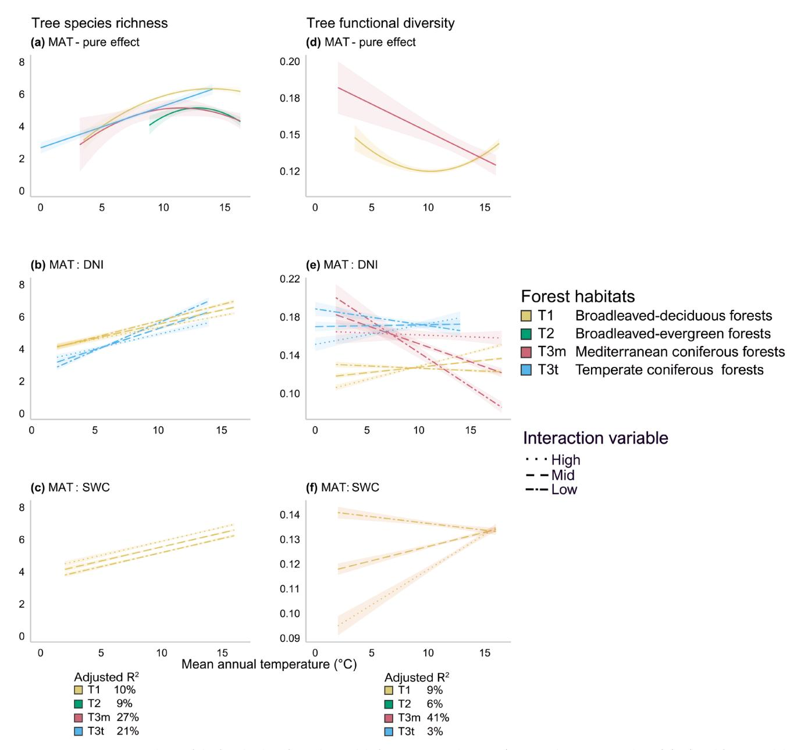
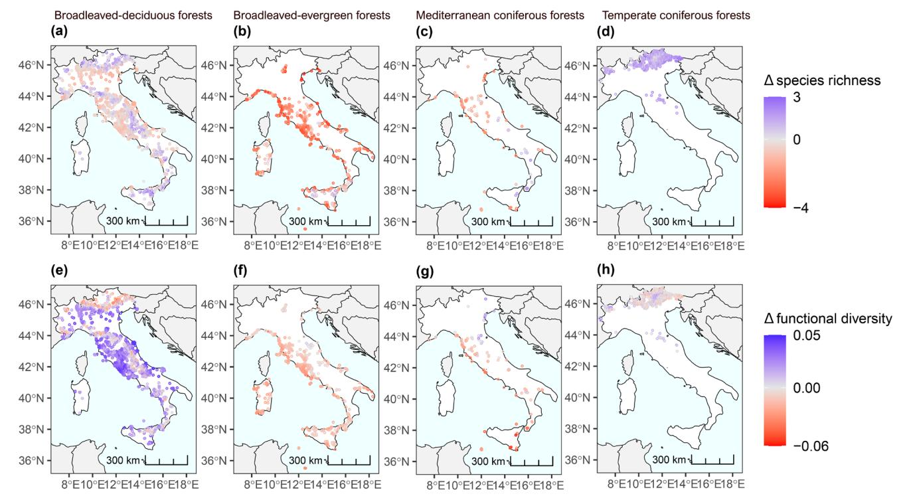
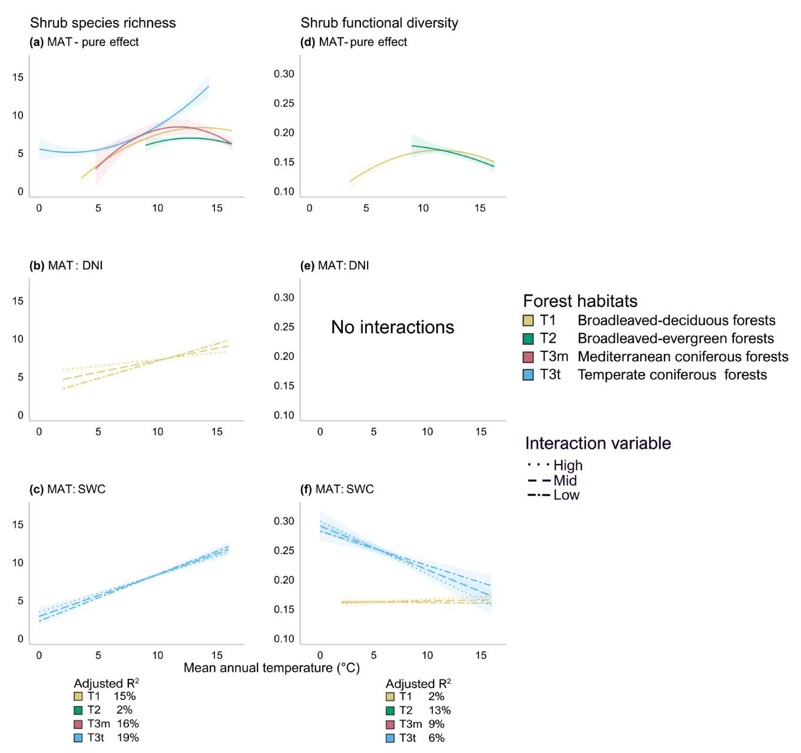
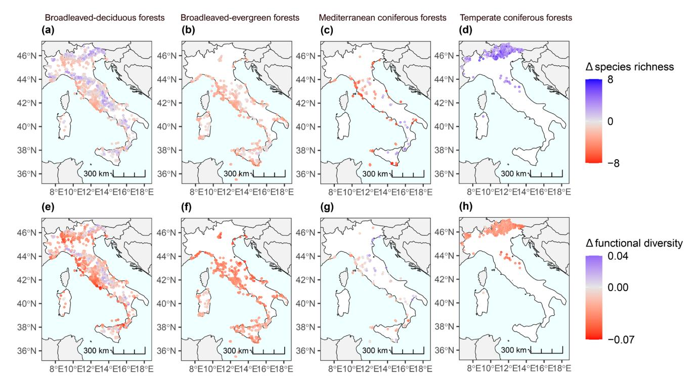

# Topography and Soil Moisture Regulate the Temperature-Biodiversity Relationship of Forests

Alessandro Bricca1

1Faculty of Agricultural, Environmental and Food Sciences, Free University of Bozen-Bolzano, Bolzano, Italy | 2University of Applied Sciences and Arts (HAWK), Göttingen, Germany | 3BIOME Lab, Department of Biological, Geological and Environmental Sciences (BiGeA), Alma Mater Studiorum University of Bologna, Bologna, Italy | 4Department of Geography, University of Innsbruck, Innsbruck, Austria | 5Department of Life, Health & Environmental Science, University of L'Aquila, L'Aquila, Italy | 6Ecology and Conservation Biology, Institute of Plant Sciences, University of Regensburg, Regensburg, Germany | 7Department of Geoinformation, Swiss National Park, Zernez, Switzerland | 8Italian Institute for Environmental Protection and Research, Rome, Italy | 9Department of Life Sciences, University of Siena, Siena, Italy | 10NBFC, National Biodiversity Future Center, Palermo, Italy

 $\textbf{Correspondence:} \ Alessandro \ Bricca \ (alessandro.bricca@unibz.it; ale.bricca@gmail.com)$ 

Received: 13 May 2025 | Revised: 28 November 2025 | Accepted: 7 December 2025

Handling Editor: Wubing Xu

Keywords: biodiversity change | drought | forest ecology | functional diversity | habitat conservation | plant traits | temperature | woody species

#### **ABSTRACT**

**Aim:** Climate change poses a global threat to forest ecosystems. However, its effects are usually examined independently of local factors, assuming that functionally diverse forest habitat types within a single biome will react similarly. Here we evaluated how temperature influences the taxonomic and functional diversity of tree and shrub guilds, accounting for the regulatory effects of local factors across forest habitat types.

Location: Italy.

Time Period: From 1970 to 2020.

Major Taxa Studied: Trees and shrubs.

**Methods:** We integrated > 5000 forest vegetation plots from a national databases with data on seven functional traits. We fitted regression models to quantify the individual and interaction effects of temperature, solar radiation (a proxy for topography), and soil moisture on the taxonomic and functional diversity of tree and shrub guilds across four main forest habitat types.

**Results:** Temperature gradients similarly affected the taxonomic and functional diversity of both tree and shrub guilds, although with a stronger magnitude for trees. Topographic solar radiation regulated mainly the temperature-diversity relationship in trees, with a stronger positive effect on cold forest habitats compared to warm ones. Soil moisture exerted a stronger control on shrub guilds, especially in cold forest habitats, but with positive and negative effects on taxonomic and functional diversity, respectively. Assuming climate-diversity responses will hold under climate change, projections to 2100 suggest that the diversity of warm forest habitats might reduce, possibly due to intensification of summer drought stress, while the diversity of cold forest habitats might increase as winter frost stress lessens.

Nicola Alessi and Gianmaria Bonari shared senior authorship.

This is an open access article under the terms of the Creative Commons Attribution License, which permits use, distribution and reproduction in any medium, provided the original work is properly cited.

© 2026 The Author(s). Global Ecology and Biogeography published by John Wiley & Sons Ltd.

**Main Conclusion:** Temperature is a strong biodiversity determinant. Still, projections should account for local regulatory mechanisms and consider that grouping different forest habitat types into a broad category can obscure critical diversity responses. The distinct responses of forest habitat types to topography-mediated climate conditions suggest the need for targeted adaptive management strategies.

# 1 | Introduction

Earth's climate has already warmed by more than 1°C over the past century, significantly impacting biodiversity globally (De Frenne et al. 2013; Scheffers et al. 2016; IPCC 2023). This warming is shifting species' geographical distributions, with wide-ranging consequences for ecological processes and services, and represents a significant threat to human wellbeing (Díaz et al. 2019; Atwoli et al. 2021; Pretzsch et al. 2023; Pacheco-Riaño et al. 2023). Given the critical role of forests in providing essential ecosystem services, understanding the mechanisms driving forest community reorganisation in response to climate change is crucial for predicting future biodiversity changes and developing mitigation strategies (Gamfeldt et al. 2013; Biber et al. 2020; del Martinez Castillo et al. 2024).

Climate effects on forest diversity have been intensively studied, but usually it is assumed that climate acts independently of local factors (Bruelheide et al. 2018; Wieczynski et al. 2019; Loidi et al. 2021; Bricca, Jiménez-Alfaro, et al. 2025). Local factors are known to regulate climate change mechanisms (Lenoir et al. 2013), modulating the impacts on plants (Walther et al. 2002; Colwell et al. 2008; Wigley et al. 2016; Gazol et al. 2018). For example, topographical features (e.g., slope, aspect, elevation) and soil conditions can significantly modify local heat exchanges and water availability, thus creating locally heterogeneous responses of plant communities to warming (Simpson et al. 2016). Topographic conditions also capture the amount of fine-scale variation in solar radiation, which in turn is expected to influence microclimatic factors such as temperature (Bennie et al. 2008; Barry and Blanken 2016). The regulating effect of local factors on climate has been previously assessed at the global scale for forest plant communities (Bouchard et al. 2024; Hordijk et al. 2025). Nonetheless, such assessments necessarily lumped different forest habitat types into one or a few broader groups, thus assuming that all forests, for example broadleaved evergreen and deciduous, have similar responses to changes in climatic conditions. However, depending on the physiology and ecology of tree-dominant species, different forest habitat types might be differentially vulnerable to climate change (Borderieux et al. 2024). For example, broadleavedevergreen tree species, having harder leaves and a more conservative water-use, are more tolerant to drought conditions compared to broadleaved-deciduous species (Mediavilla and Escudero 2004). Yet, broadleaved-evergreen forests often grow in areas where the severity and frequency of droughts are increasing rapidly, which may lead to higher tree mortality if the new climatic conditions are beyond their range of physiological tolerance (Gazol et al. 2018; Encinas-Valero et al. 2022).

The interplay between forest vulnerability and changes in climatic conditions highlights the critical need to examine how traits mediate species' responses to environmental stressors. Traits capturing the major axes of plant form and functions relate to the so-called

plant size, leaf and root economics, and reproductive spectra (Díaz et al. 2016; Carmona et al. 2021; Weigelt et al. 2021), which together provide fundamental insight into species' adaptive capacities (Funk et al. 2017). Since traits are directly linked to species' ecological niches, they can serve as proxies for tolerance limits (Violle et al. 2007). Consequently, forest habitat types dominated by tree species with different functional strategies may show divergent climatic sensitivities depending on the overlap between their physiological limits and the magnitude of climatic stressors they face. Understanding trait-mediated responses to local climate mechanisms is therefore crucial for accurately forecasting forest habitat types' responses and guiding effective conservation strategies (Gallagher et al. 2021; Bricca et al. 2024). Such a task is urgent, especially considering the climatic projections from the IPCC (2023), which indicate that global temperatures could rise by up to 4.4°C by 2100 under a worst-case scenario. The projected temperature increase might compromise the suitability of forest habitats, especially those already close to their physiological tolerance limits.

One way to better understand trait-environment relationships is by considering groups of functionally similar species (guilds), since forests are not exclusively composed of trees and the influence of climate and local factors can differ across these groups (De Frenne et al. 2019; Bricca, Zerbe, et al. 2025). Besides trees, understory woody species are a vital component of forest habitats. They provide shelter and food sources for a variety of wildlife, including fungi, insects, birds, and mammals, contributing also to productivity (Chen et al. 2025). This biodiversity enhances ecosystem stability and resilience against disturbances, including those driven by climate change. Compared to trees, understory woody species should respond more quickly to variation in climatic conditions due to their shorter life cycles (Loidi et al. 2021). Nonetheless, their response can be regulated by the degree of tree canopy cover, which can buffer climatic variations (De Frenne et al. 2013; Davis et al. 2019). Deconstructing forest vegetation into guilds representative of different layers can help to characterise the relationships between vegetation and climatic conditions by allowing to test whether different guilds follow similar or different patterns.

Here, we used >5000 vegetation-plot observations, seven plant traits capturing the largest part of the plant functional spectrum (Burton et al. 2020; Carmona et al. 2021), as well as four down-scaled climate-regulation variables to compare the individual and combined effects of temperature, topography, and soil conditions as spatial determinants of the distribution of tree and shrub species guilds across four main forest habitat types in Italy (Chytrý et al. 2020). This approach will help determine whether different forest habitat types and guilds within habitat types respond differently to local warming. We addressed three specific questions:

1. Do current climatic conditions differently influence taxonomic and functional diversity in forest habitats? We expect a positive influence of warmer temperature on the diversity of colder forest habitat types (broadleaveddeciduous and temperate coniferous forests), since higher temperatures may reduce the winter constraints, compared to warmer forest habitat types (broadleaved-evergreen and Mediterranean coniferous forests) where increasing summer drought can lead to higher mortality rates and a decrease in diversity overall (del Martinez Castillo et al. 2024)

- To what extent is the effect of climatic conditions regulated by local environmental conditions? We hypothesise that topographic solar radiation and soil moisture may regulate the response of taxonomic and functional diversity to climatic variation (Bouchard et al. 2024).
- Are these effects consistent across woody species guilds? We postulate that tree and shrub guilds will show similar general responses to warming, but with higher intensity for the shrub guild (Loidi et al. 2021).

By assessing the current climate-biodiversity relationship, we will produce spatially explicit maps projecting the hypothetical tree and shrub diversity changes of forest habitats under future climate scenarios for the year 2100.

# 2 | Material and Methods

# 2.1 | Study System

The study system is Italian forests. Italy is an ideal study area due to its broad environmental gradients in latitude and elevation, and because it spreads across three biogeographical regions (Mediterranean, Continental, and Alpine) (Alessi et al. 2023; Chelli et al. 2024). The peculiar geographic position in the middle of the Mediterranean makes Italy highly vulnerable to climate change (Giorgi and Lionello 2008). The Mediterranean region, a transition zone between the arid climate of North Africa and the Temperate, rainy climate of central Europe, has experienced significant climate shifts in the past (Luterbacher et al. 2006) and is identified as a prominent 'hot spot' in future climate change projections (Giorgi and Lionello 2008). These changes will pose a major threat to forest habitats (Janssen et al. 2016). Italy's forest coverage spans 90,851 km2, representing 37% of its territory (Gasparini et al. 2022). Because of considerable variation in latitude (from 35° to 47°), elevation, geomorphology (Fredi and Palmieri Lupia 2017), and climate (Fratianni and Acquaotta 2017), Italian forest habitats are highly diverse, mainly belonging to the Temperate biome (sensu Mucina 2019). Main forest habitats include broadleaved evergreen forest, and coniferous forests of Mediterranean climates, broadleaved deciduous forests and coniferous forests of temperate climates (Alessi et al. 2023).

# 2.2 | Vegetation and Trait Data

We retrieved tree and shrub community data from the Italian Forest Database, a database collector containing 16,259 vegetation plots and 2948 species (Alessi et al. 2023; Appendix S1). The database is composed of vegetation plot data containing georeferenced information on all vascular plant species (trees, shrubs, and herbs) co-occurring in survey plots of variable sizes, normally

with information on the relative abundance of each species, but no specific information of individuals (e.g., diameter at breast height). To reduce the noise typical of the analysis of large opportunistic databases (e.g., Loiola et al. 2018; Bonari et al. 2021), we cleaned the data according to specific criteria described in detail in the Appendix S2. The final datasets used in this study consist of (i) 5450 plots with 94 tree species and (ii) 5940 plots with 359 shrub species, from the main forest habitats namely 'broadleaved-deciduous forests' (EUNIS habitat type—T1), 'broadleaved-evergreen forests' (T2) and 'coniferous forests' (T3). These three forest habitats enable a representative picture of Italian forests (Alessi et al. 2023), representing the main European forest habitats (Chytrý et al. 2020) with coniferous tree covering approximately 46%, and broadleaved (deciduous and evergreen) trees 37%. The rest is represented by mixed forests (De Rigo et al. 2016).

However, since the EUNIS habitat type of coniferous forests consists of both forests occurring in temperate climates on higher elevations such as the Alps, and in Mediterranean climates close to the sea (Chytrý et al. 2020), we decided to group temperate coniferous habitats (i.e., T31, T32, T34, T35, T36, T3C, and T3J) in 'temperate coniferous forests' (T3t), and Mediterranean coniferous habitats (i.e., T33, T37 and T3A) in 'mediterranean coniferous forests' (T3m). Their geographic distribution is reported in Appendix S2.

We considered plant traits expressing independent axes of the plant size spectrum (plant height), the reproductive spectrum (seed mass), the leaf economic spectrum (specific leaf area; SLA), the root economic spectrum (specific root length), and the woody economic spectrum (stem specific density) (Salguero-Gómez et al. 2016; Díaz et al. 2016; Carmona et al. 2021). Trait data were obtained from the TRY database (Kattge et al. 2020), except for specific root length which was retrieved from the GRooT database (Guerrero-Ramírez et al. 2021). Before extracting trait data, we cleaned the databases to reduce the inconsistency between trait values (Augustine et al. 2024). Trait data cleaning process is reported in Appendix S2.

Finally, we classified each tree species based on its life habit (i.e., broadleaved tree and needle-leaved tree) and leaf phenology (i.e., evergreen and deciduous). For shrub species, we considered only leaf phenology since a few shrub species are needle-leaved (i.e., only *Juniperus* spp.).

All data manipulations and statistical analyses were done in the R statistical programming language (version 4.4.2).

# 2.3 | Climatic and Climate-Regulation Variables

We considered climatic variables known to affect vegetation in general and forests in particular, namely mean annual temperature (MAT—°C), annual precipitation amount (kgm-2), temperature seasonality (°C/100), and precipitation seasonality (CV) (Padullés-Cubino et al. 2021; Alessi et al. 2023; Chelli et al. 2024). We extracted bioclimatic variables from CHELSA (Karger et al. 2017). CHELSA's data have a 30 arc-second resolution, which may not adequately characterise the microclimatic conditions that forest communities experience. Thus, we downscaled bioclimatic variables to a finer resolution (i.e., 250 m; Appendix S3).

As climate-regulation variables, we selected the direct normal irradiation (DNI; kWh/m2), hereafter solar radiation, for topographic conditions and soil water capacity (SWC;  $\theta$ ) for soil conditions (Kambach et al. 2024). Solar radiation captures fine-scale variation in energy availability driven by topographic conditions (e.g., slope, aspect, elevation), which in turn influences microclimatic factors such as temperature (Bennie et al. 2008; Barry and Blanken 2016). Solar radiation was extracted from Global Solar Atlas 2 (n.d.) (https://globalsolaratlas. info), whereas the soil water capacity was calculated according to the formula of Dijkerman (1988) based on the sand content of the soil. The soil sand content values (%) for each plot were extracted from the SoilGrids 2.0 database for a depth of 15-30 cm (Poggio et al. 2021). Both climate-regulation variables share the same resolution consistent with the downscaled climate data at 250 m resolution

Then, we performed a principal component analysis (PCA) with all climatic and climate-regulation variables to check their degree of correlation, considering all forest habitats and for each forest habitat separately. For tree data, we found consistent patterns for each forest habitat with all climatic variables loading on the first PC axis, soil water capacity and solar radiation loading on the second PC and third PC axes. Thus, we decided to keep only mean annual temperatures as a climate variable since this variable showed the strongest correlation with the first axis (Appendix S4).

However, since the light availability that filters from the canopy can influence forest understory markedly, and since it can regulate climatic conditions under the canopy (Davis et al. 2019; Chelli et al. 2024; Perez-Navarro et al. 2024), we decided to include tree canopy cover in the PCA of shrub data. Specifically, we calculated the tree canopy cover (%) for each plot using Jennings-Fischer's formula, which combines the covers of all tree species present in the plot into a single cover value, while accounting for potential overlap among individuals (Jennings et al. 2009; Fischer 2015). We found contrasting trends for each forest habitat. While for broadleaved-deciduous, broadleavedevergreen, and Mediterranean coniferous forests we found mean annual temperature, solar radiation, and soil water capacity as representative of the first three PC axes, in the case of temperate coniferous forests, we found higher variation explained by mean annual temperature, soil water capacity, and tree canopy cover (Appendix S5). Therefore, for the shrub guild, we calibrated different models for different forest habitats, depending on the importance of the predictors (see paragraph 2.5).

# 2.4 | Statistical Analysis

We considered two distinct facets of plant diversity, namely taxonomical and functional diversity. We selected species richness as an indicator of taxonomic diversity (TD), while we selected Rao's Quadratic Entropy based on the five selected quantitative traits in addition to two categorical traits of life-history and leaf phenology for tree species and leaf phenology for shrub species as an indicator of functional diversity (multi-FD). The multi-FD index measures the degree of functional dissimilarity among species in a given assemblage: lower values indicate the coexistence of functionally similar species (i.e., species with the same trait values), whereas higher values indicate the coexistence of functionally dissimilar species (i.e., species with different trait values). We used Gower's distance to measure species functional distance since it handles missing trait values and multi-traits together (Pavoine et al. 2009; de Bello et al. 2010). Quantitative traits were log-10 transformed to reduce the skewness of data distribution (Májeková et al. 2016). To reduce the disproportional contribution of categorical traits in the functional diversity, we used the updated version of Gower's distance which provides a more balanced weight between quantitative and categorical traits (de Bello et al. 2021). We are aware that taxonomic and functional diversity are not necessarily independent, and positive or negative relationships are possible. In the case of a positive relationship, an increase in taxonomic diversity followed by an increase in functional diversity depicts a reduction of 'functional redundancy' as more species perform dissimilar functions. On the contrary, a negative relationship points out a larger 'functional redundancy' since it increases the presence of species sharing similar traits (Díaz and Cabido 2001; Ricotta et al. 2016). However, in our case, we did not find a strong correlation between the taxonomic and functional diversity for tree and shrub data for each of the four forest habitats (i.e., -0.5 > x < 0.5; details in Appendix S6).

We used regression models to examine the effect of temperature, solar radiation, and soil water capacity on the taxonomic and functional diversity of the tree guilds for each forest habitat. For shrub guilds, we used temperature, soil water capacity, canopy cover, and solar radiation according to forest habitat type as predictors. We considered interaction terms between solar radiation, soil water capacity, and canopy cover with temperature to account for a possible regulating effect of these variables on climate. Since previous investigations found non-linear relationships along broad environmental gradients (Bouchard et al. 2024), we considered and compared three sets of models, that is, (1) models with only linear terms, (2) models with quadratic terms only for mean annual temperatures, and (3) models with quadratic trends for all three predictors. Model selection according to the residual sum of squares was evaluated with the chi-squared test (Bricca et al. 2023). Since the models selected respected all the assumptions (i.e., normality of residuals and homogeneity of variance), we did not use more sophisticated models (St-Pierre et al. 2018).

To hypothesise how taxonomic and functional diversity will change under climate change, we adopted a space-for-time substitution approach, assuming that the climate-diversity relationships observed in space will hold under climate change. Space-for-time substitution is a widely adopted approach using the knowledge gained from the analysis of contemporary spatial patterns to make inferences on temporal ecological processes (e.g., Backhaus et al. 2021; Kambach et al. 2023). It relies on the assumption that spatial variation among sites can reflect the trajectory of vegetation change over time, thereby allowing reconstruction of long-term dynamics from a single temporal snapshot (Pickett 1989). Specifically, we used the fitted climate-diversity linear models to predict the taxonomic and functional diversity of different guilds in different habitat types under new climate conditions. We made projections for three alternative climate change scenarios provided by the IPCC (2023), namely mild (+1.4°C; SSP1-1.9), intermediate (+2.7°C; SSP2-4.5), and worst-case (+4.4°C; SSP5-8.5) by 2100 (del Martinez Castillo et al. 2024). In the results section, we focused on the predictions generated with the worst-case scenario (+4.4°C) and report the results related to the mild scenario in Appendix S7. Climate-regulation variables (solar radiation, soil moisture, and canopy cover for shrubs) were assumed to remain constant over time. Projections were contrasted with the diversity estimates predicted by the model using climatic data for the period of 1980–2010. In this way, we quantified the relative diversity variation (delta) for both species guilds as follows: delta = diversity prediction 2100—diversity prediction 1980–2010. Positive and negative delta values mean a relative increase or decrease of diversity estimates over time, respectively.

Taxonomic and functional diversity were calculated with the *RaoRel* function in the cati package, Gower's distance with the *gawdis* function (optimised algorithm) in the gawdis package, and the regression model with the *lm* function in the stats package. Model comparisons were performed with the *ANOVA* function in the stats package. A detailed list of package references is reported in the Appendix S8.

### 3 | Results

## 3.1 | Tree Guild

Regarding tree guild, temperate coniferous habitat type had the lowest mean taxonomic diversity (4), followed by Mediterranean coniferous and broadleaved-evergreen habitat types (5), and broadleaved-deciduous habitat type (6). We found an opposite pattern for functional diversity with the highest values for temperate coniferous habitat type (0.17), followed by Mediterranean coniferous habitat type (0.15), broadleaved-evergreen habitat type (0.14) and broadleaveddeciduous habitat type (0.13) (Appendix S9). Overall, our regression models detected a direct effect of mean annual temperature on both taxonomic and functional diversity of the tree guild in all four forest habitat types. We found inverted U-shaped trends for broadleaved-evergreen habitat type, Mediterranean coniferous habitat type and broadleaveddeciduous habitat type (Figure 1a). Contrarily, for temperate coniferous habitat type, we found a significant linear effect of mean annual temperature (Figure 1a). For the broadleaveddeciduous and temperate coniferous habitat types, we found that solar radiation regulates the effect of mean annual temperature on taxonomic diversity, being more intense in forest stands where solar radiation is higher and lower, respectively. Moreover, only for the broadleaved-deciduous forests, we found a significant negative interaction between soil water capacity and mean annual temperature, indicating a linear relationship in which taxonomic diversity increases faster with temperature where soil water capacity is higher (Figure 1c). For functional diversity, we found a linear negative relationship for Mediterranean coniferous habitat type and a positive unimodal trend for broadleaved-deciduous habitat type (Figure 1d). We detected a significant interaction between solar radiation and mean annual temperature for broadleaved-deciduous and Mediterranean coniferous habitat types but also with temperate coniferous habitat type. In the case of broadleaved-deciduous habitat type, we found a steeper variation of functional diversity in stands where solar radiation is higher. In Mediterranean coniferous habitat type, functional diversity decreased slowly with increasing solar radiation (Figure 1e), while the opposite was true for temperate coniferous habitat type (Figure 1e). Lastly, we found a regulating effect of soil water capacity on mean annual temperature but exclusively for broadleaved-deciduous forests, depicting an increasing and decreasing effect of mean annual temperature on functional diversity occurring under high and low soil water capacity (Figure 1f). Detailed information on models' selection and parameters of the best fitting model is reported in the Appendices S10 and S11.

For each forest habitat type, we mapped the hypothetical geographical projected changes in taxonomic and functional diversity of the tree guild under a 4.4°C temperature increase by 2100, according to the worst-case IPCC scenario (2023), as shown in Figure 2. For the broadleaved-deciduous habitat type, our projection highlights a geographic pattern of a gain in taxonomic diversity coupled with a loss of functional diversity in the inner parts of Italy (central and eastern Alps and along the Apennine chain), but a loss of taxonomic diversity coupled with a gain in functional diversity along the coastline (Figure 2a-e). For the broadleaved-evergreen habitat type (Figure 2b-f) and Mediterranean coniferous habitat type (Figure 2c-g), projections highlight a slight loss in taxonomic and functional diversity, especially strong along the coasts of Central Italy. For the temperate coniferous habitat type, projections suggest a general gain in taxonomic diversity in the Alps, although functional diversity remains quite stable (Figure 2d-h).

## 3.2 | Shrub Guild

The lowest mean value in taxonomic diversity for the shrub guild was found in broadleaved-evergreen habitat type (7) and temperate coniferous habitat type (7). Mediterranean coniferous forests and broadleaved-deciduous habitat type displayed a slightly higher taxonomic diversity (8). Similarly to the tree guild, also for the functional diversity of the shrub guild, we found an opposite pattern with the highest values for temperate coniferous habitat type (0.24), followed by Mediterranean coniferous habitat type (0.15), broadleaved-evergreen habitat type (0.16), and broadleaved-deciduous habitat type (0.17) (Appendix S9).

Overall, our regression model found a stronger relationship between taxonomic diversity and mean annual temperature (Figure 3). Specifically, increasing mean annual temperature had similar effects on shrub taxonomic diversity as those observed for trees (Figure 3a). Only for broadleaved-deciduous habitat type did we detect a relatively weak, though significant, interaction between solar radiation and mean annual temperature, with the increase of taxonomic diversity being steeper where solar radiation is low (Figure 3b). Soil water capacity also interacted with mean annual temperature, but only in temperate coniferous habitat type (Figure 3c). Regarding functional diversity, we found a significant effect of mean annual temperature for all forest habitat types except Mediterranean coniferous habitat type. For broadleaved-evergreen habitat type, functional diversity decreases for increasing values of mean annual temperature (Figure 3).

FIGURE 1 | Regression lines of the fitted values from the models for taxonomic diversity (expressed as species richness) (a–c) and functional diversity values (d–f) of the tree guild for the different forest habitat types. Only the significant effect of mean annual temperature (MAT), single or in interaction with climate-regulator variables (DNI, solar radiation; SWC, soil water capacity) is shown. The categories of explanatory variables (high, mid, low) denote the 90th, 50th and 10th percentiles of their distribution.

For broadleaved-deciduous habitat type, we detected a unimodal pattern with lower functional diversity values at the extremes of the gradient (Figure 3d). This pattern was also regulated by soil water capacity, with a steeper increase of functional diversity on soil with higher water capacity (Figure 3f). For the latter, the effect of mean annual temperature was regulated by soil water capacity producing a linear decrease of functional diversity. However, we detected a steeper reduction of functional diversity in higher soil water capacity (Figure 3f). Detailed information on models' selection and parameters of the best fitting model is reported in the Appendices S12 and S13.

Maps of the hypothetical geographical projected changes in taxonomic and functional diversity of the shrub guild under

a 4.4°C temperature increase by 2100, according to the worst-case IPCC scenario (2023), are shown in Figure 4. For the broadleaved-deciduous habitat type, our projections highlight a gain in both taxonomic and functional diversity along the main mountain ranges (Alps and along the Apennine chain) and a loss along the coastline (Figure 4a–e). The shrub guild of broadleaved-evergreen habitat type (Figure 4b–f) and Mediterranean coniferous habitat type (Figure 4c–g) is predicted to face a loss of taxonomic and functional diversity, more marked along the coasts, especially for the taxonomic diversity in Mediterranean coniferous habitat type. For temperate coniferous habitat type, projections suggest an overall gain in taxonomic diversity in the Alps, coupled with a loss in functional diversity (Figure 4d–h).

**FIGURE 2** | Relative predicted variation (delta) on tree species richness (a, b, c, and d) and on functional diversity (e, f, g, and h) for each forest habitat type after an increase of  $4.4^{\circ}$ C temperature rise for 2100. Each point represents a plot in a cell size of  $1 \text{ km} \times 1 \text{ km}$  of CHELSA.

## 4 | Discussion

Understanding how forest plant communities will respond to temperature change is crucial to mitigate the negative effects of climate change and to deploy appropriate mitigation strategies to minimise biodiversity loss (Dyderski et al. 2018). Notwithstanding the wealth of recent studies (Loidi et al. 2021; Kambach et al. 2023; Bouchard et al. 2024), the relation between climate and biodiversity is still not fully understood, especially when it comes to the interactions between temperature and local factors, and the individual response of different forest habitat types within the same biome. Our study uses distinct forest habitat types (i.e., broadleaved-evergreen, broadleaveddeciduous, temperate, and Mediterranean coniferous forests) as model systems to unravel the response of taxonomic and functional diversity of the tree and shrub guilds to the interaction between temperature and local topographical and soil conditions. Our results demonstrated that (1) tree taxonomic and functional diversity in different forest habitats exhibit a distinct relationship with temperature, which can be related to their biogeographical distribution. Warmer forests, such as broadleaved-evergreen and Mediterranean coniferous forests, which are near their physiological tolerance limits, are predicted to experience a decrease in taxonomic and functional diversity, possibly as a consequence of the predicted increase in summer drought stress (Pretzsch et al. 2023; del Martinez Castillo et al. 2024; Borderieux et al. 2024). By contrast, taxonomic and functional diversity is predicted to increase in colder forests, such as temperate coniferous forests, which we interpret as the possible effect of reduced winter frost stress. While temperature emerged as a key determinant, (2) topographic solar radiation and soil moisture were found to regulate the temperature-diversity relationship, modulating the temperature effect on tree guild and shrub guild, respectively (Kambach et al. 2023; Bouchard et al. 2024). This regulatory influence varied among forest habitat types and was stronger for colder forests. Finally, (3) tree guild and shrub guild diversity displayed broadly similar responses to temperature, whether directly or modulated by local factors (Loidi et al. 2021), although the climate–diversity relation was slightly stronger for trees, as compared to shrubs.

## 4.1 | Tree Guild

Tree guilds respond differently to temperature, depending on which forest habitat they belong to. Moving from warmer forests (Mediterranean coniferous forests) to colder forests (temperate coniferous forests), we found a gradual negative to positive transition of the effect of mean annual temperature on diversity.

Diversity of the Mediterranean coniferous forest habitat type was negatively correlated with temperature, suggesting that a temperature rise could negatively impact the diversity in these habitats in the future. Mean annual temperature increase might amplify the magnitude of the typical summer drought stress characterising the biogeographic area where Mediterranean coniferous forest habitat occurs. This intensification can overcome the physiological limits of tolerance for conifers (Pretzsch et al. 2023), reducing the functional and taxonomic diversity in the case of higher temperatures. In fact, at lower elevations, higher temperatures should promote the establishment of tree guilds dominated by locally-adapted droughtresistant broadleaved-evergreen and coniferous tree species. Nonetheless, the filtering effect of temperature on functional diversity is regulated by solar radiation. Increases in temperatures in forest stands where solar radiation is high slightly promoted

FIGURE 3 | Regression lines of the fitted values from the models for taxonomic diversity (expressed as species richness) (a–c) and functional diversity values (d–f) of the shrub data for the different forest habitat type. Only the significant effect of mean annual temperature (MAT), single or in interaction with climate-regulator variables (DNI, solar radiation; SWC, soil water capacity) is shown. The categories of predictors (high, mid, low) denote the 90th, 50th, and 10th percentiles of their distribution.

functional diversity. These forest stands hosted species tolerating cold (e.g., *Pinus nigra*) and hot conditions (e.g., *Pinus halepensis*), at low and high mean annual temperature, respectively. On the contrary, a stronger filtering effect has been detected in forest stands where solar radiation is low. Here, the increase in temperature might reduce the diversity of tree guilds by ruling out species not adapted to drought conditions (e.g., *Abies alba*).

Broadleaved-evergreen forests are projected to be less negatively impacted by temperature change compared to other forest habitats, despite lower taxonomic diversity coupled with higher temperatures. The negative trend seems to suggest that a mean annual temperature of 12°C–13°C represents a threshold over which temperature becomes challenging for some tree species.

As for Mediterranean coniferous forest habitat type, mean annual temperature values over this threshold may exacerbate Mediterranean summer drought stress, creating stressful conditions hard to cope even for evergreen tree species well-adapted to Mediterranean climate (Conte et al. 2019). We speculate that an increase in temperature could force the current species pool of broadleaved-evergreen forest to migrate towards new suitable geographic areas, but it cannot be fuelled by the immigration of species adapted to new drier conditions, due to the biogeographical barrier represented by the Mediterranean Sea.

For both cold forest habitats, namely broadleaved-deciduous and temperate coniferous forests, temperature is projected to have a positive effect on taxonomic diversity. Nonetheless, the

**FIGURE 4** | Relative predicted variation (delta) on shrub species richness (a, b, c, and d) and on functional diversity (e, f, g, and h) for each forest habitat type after an expected increase of  $4.4^{\circ}$ C temperature rise for 2100. Each point represents a plot in a cell size of  $1 \text{ km} \times 1 \text{ km}$  of CHELSA.

temperature-functional diversity relationship differed between these two forest habitats, suggesting different mechanisms are at work. For broadleaved-deciduous forests, we detected a higher taxonomic diversity coupled with lower functional diversity in the first half of the temperature gradient. Contrary to the possible intensification of the summer drought in Mediterranean forests, increasing mean annual temperatures might lower the winter frost stress (Pretzsch et al. 2023), thus creating benign climatic conditions for the arrival and spreading of new, more warm-adapted tree species, in a process known as 'thermophilization' (Lenoir et al. 2010; Pacheco-Riaño et al. 2023; Borderieux et al. 2024). In fact, tree guilds under lower temperatures are mainly composed of tree species which cope with the frost stress using different functional strategies such as deciduous leaves or needle-like leaves (e.g., Betula pendula, Fagus sylvatica, Picea abies). On the contrary, warmer conditions tend to rule out cold-adapted species, and the tree guild is mainly dominated by a higher number of tree species having similar leaf habits (e.g., Acer pseudoplatanus, Ostrya carpinifolia, Quercus pubescens). Nonetheless, moving from the second part of the temperature gradient (i.e., above 10°C), the effect of temperature shifts from negative to positive and the functional diversity starts increasing. This might be due to the prevailing temperature conditions that currently favour the establishment of warmer species. The effects of temperatures on both diversity facets were also regulated by solar radiation and soil moisture similarly. Increased solar radiation and soil moisture might weaken the limitations imposed by low temperatures, extending the growing season, reducing frost damage, and enhancing photosynthesis and growth, without causing heat stress. Thus, higher temperatures where solar radiation and soil moisture are high can significantly increase both species richness and functional diversity by mitigating the cold stress that limits warmer species establishment and survival. On the contrary, where

solar radiation and soil moisture are low, higher temperatures may increase edaphic aridity that leads to a finer division of niche space rather than to a greater niche partitioning (de Bello et al. 2006).

In the case of temperate coniferous forest habitat type, the increase of taxonomic diversity within the same functional diversity suggested that the habitat becomes more hospitable (i.e., resources are less limited), leading to reduced competition among species that can share the same resources (Tilman 1982). Compared to the results for Mediterranean coniferous forests, this opposite pattern might be interpreted in light of the distinct climatic contexts in which these two forest habitats occur. Temperate coniferous forests are typically found in cooler, higher elevation conditions where low temperature is a primary limiting factor for plant growth and survival (Körner 2003). Here, tree species are adapted to withstand cold temperatures. This consideration is also confirmed by the regulating effect of solar radiation, which modulates the temperature relationship with both diversity facets, similarly to what occurs for broadleaveddeciduous forest habitat type.

## 4.2 | Shrub Guild

The shrub life form represents an integrated evolutionary response to environmental stress (Rundel 1991). It usually displays faster life cycles than trees, higher survival in extreme conditions and earlier seed production and dispersal, which make shrubs more responsive to climatic conditions changing (Loidi et al. 2021). Nonetheless, we did not find a marked difference in the shrub temperature–diversity relationship, as compared to trees. Similarly to the tree guild, we found varying relationships with temperature depending on forest habitats. Across the gradient from warmer

forests (e.g., Mediterranean coniferous forests) to colder forests (e.g., temperate coniferous forests), we observed a gradual shift in the effect of mean annual temperature on shrub diversity, transitioning from negative to positive. Further, the negative temperature-diversity relationship for shrub diversity in warm forests suggests that the expected temperature increase under climate change will have a detrimental effect on shrub diversity. Nonetheless, we should note that in Mediterranean coniferous forests, warming is likely to decrease only the taxonomic diversity, leaving functional diversity unaffected. On the contrary, in the case of the broadleaved-evergreen forest habitat type, increasing temperatures are expected to impact both facets of diversity.

Regarding the colder forests, only the broadleaved-deciduous forests showed a similar response of taxonomic and functional diversity to temperature variation. With increasing temperatures, taxonomic and functional diversity first increased up to a maximum value and then declined. We speculate that this reversed U-shaped relationship hints at a weakening of the negative effects of winter frost stress on shrub diversity, which might promote the coexistence of a higher number of species having different ecological tolerances like *Crataegus monogyna*, *Juniperus communis*, and *Ruscus aculeatus*.

However, we found a lower regulating effect of local factors. Forest canopies can buffer climate conditions and serve as refugia for understory species under climate change (Davis et al. 2019). Nonetheless, in our case, tree canopy cover never acted as a temperature-regulating variable. Only in two out of four forest habitats, we found a regulating effect of local factors, especially soil moisture. A pattern that contrasts with tree guilds, where topographic solar radiation has a higher contribution compared to soil moisture. This difference may be associated with the spatial scale at which these guilds interact with the environmental conditions. Shrubs, being part of the understory and therefore closer to the ground, are more sensitive to microenvironmental factors such as soil moisture retention, soil nutrient availability, and light filtered through the canopy. By contrast, trees, whose canopies define the forest structure, are more influenced by large-scale factors like topography, which in turn influences broader patterns of temperature (Burton et al. 2014). Only for broadleaved-deciduous forests did we find a regulating effect of topographic solar radiation. The increase in species richness coupled with temperature increase is expected to be more marked where solar radiation is low. This may suggest that, in such environments, the reduction of winter frost stress is more pronounced, weakening climatic barriers and allowing more species to persist. Temperate coniferous forests showed a clear regulating effect of soil water capacity on both taxonomic and functional diversity. On more humid soils, functional diversity is expected to decrease steeply with the increase of temperature, while taxonomic diversity increases, with an overall increase in redundancy. This pattern aligns with the concept that in a more resource-rich environment, species tend to converge because of a similar pressure for resource use (Mason et al. 2011; Chelli et al. 2024).

# 4.3 | Limitations

Functional traits are defined as individual measurements that affect an organism's performance (Violle et al. 2007). They are

therefore not fixed attributes of a species. Our study did not account for intraspecific trait variation (ITV) in trees and shrubs, which may influence trait–climate relationships (Kunstler et al. 2021; Ferrara et al. 2024). Instead, we used trait values aggregated at the species level, a common approach in biogeographical studies (Padullés-Cubino et al. 2021; Kambach et al. 2024; Bricca, Jiménez-Alfaro, et al. 2025). This choice reflects the current lack of intraspecific trait data in global databases such as TRY, as collecting trait measurements for each population or individual across sites at a continental scale is not feasible. Importantly, evidence suggests that ITV is generally smaller in magnitude than between-species trait variation (Siefert et al. 2015; Puglielli et al. 2024), supporting the robustness of our species-level approach.

Similarly, while our goal was to understand how different habitats varied in their responses to temperature, we did not explicitly account for within-habitat variability. Including this aspect could help determine whether a habitat's baseline climate adaptation, rather than its broad classification, drives its temperature response. However, this was not feasible with our dataset: dividing the four main habitat types into more specific sub-habitats would have resulted in too few data points to reliably characterise each sub-habitat's response to climate.

Finally, our analysis is based on a space-for-time substitution. While this method is widely used in ecological studies where long-term data are unavailable, it provides less robust inferences about temporal vegetation change. Specifically, this approach may: (i) overestimate change due to lagging mechanisms (Elmendorf et al. 2015); (ii) overlook delayed migrations of trees and shrubs, since plant migration is typically slower than isotherm shifts (Pacheco-Riaño et al. 2023). The inherently slow life cycles of trees compared to shrubs might further contribute to these lags and to the different diversity response of plant guilds in relation to temperature. Migration processes and species tolerance to environmental conditions changing likelihood are governed by independent functional dimensions, which are the drivers of gains and losses in species and functional diversity, respectively (e.g., Borderieux et al. 2024). Our model did not distinguish these two processes, as well as other factors that can play a role in plant establishment, such as land use. In fact, consistent information on current forest management in our data is not available, and forest practices are highly heterogeneous at the regional scale. As a result, our future projections should be interpreted with caution.

## 5 | Conclusions

Temperature is a key determinant influencing the pattern of forest diversity. Nonetheless, the effect of climate varies across forest habitat types, being more marked for tree and shrub guilds in forest habitats located at the extreme of the considered temperature gradient, that is, temperate and Mediterranean coniferous forest habitats. Temperate forests are expected to experience an increase in diversity, likely through immigration of southern and/or lowland species that find more benign conditions. On the contrary, Mediterranean forests are foreseen to experience a decrease in taxonomic and functional diversity, possibly due to the intensification of drought stress. Also, we documented a regulating effect of local topographical and soil factors on the

temperature-diversity relationship in forest habitats, with the result of making this relationship steeper or shallower in different forest habitat types and for different guilds. Topographic solar radiation had a stronger modulating effect for trees, while soil moisture played a stronger modulating role for the shrub guild. This distinction underscores the importance of considering vertical stratification when assessing how forest species respond to environmental conditions. These results further highlight the importance of local factors regulating effects on climate. Importantly, to accurately predict the effects of climate change on biodiversity, we recommend considering the interplay between climate and climate-modulating factors. Furthermore, in habitat assessments, using overly broad habitat categories should be avoided to reveal finer responses based on dominant strategies and common life habits. The results of our study discourage management practices uniformly applied to large areas; instead, they must be tailored to specific habitat types and their specific diversity.

#### **Author Contributions**

Alessandro Bricca: conceptualization (lead); data curation (lead); methodology (lead); formal analysis (lead); writing – original draft (lead); visualisation (lead); writing – review and editing (led). Stefan Zerbe: writing – review and editing (equal). Francesco Maria Sabatini: conceptualization (equal); methodology (equal); writing – review and editing (equal). Benedikt Hiebl: writing – review and editing (equal). Martin Rutzinger: writing – review and editing (equal). Michele di Musciano: methodology (equal). Giacomo Calvia: writing – review and editing (equal). Alessandro Chiarucci: resource (equal); writing – review and editing (equal). Peter Poschlod: resource (equal); writing – review and editing (equal). Nicola Alessi: resource (equal); conceptualization (equal); writing – review and editing (equal). Gianmaria Bonari: supervision (lead); resource (equal); conceptualization (equal); writing – review and editing (equal).

#### Acknowledgements

We thank Jeremy Borderieux for his review. A.B., G.B., G.C., N.A., and S.Z. acknowledge funding from the TracEve project. The TracEve project has received funding from the Autonomous Province of Bolzano-Bozen as a Joint-Project South Tyrol-Austria 2022.

#### Funding

This work was supported by Autonomous Province of Bolzano-Bozen, Dep. 34 (6/34) and Austrian Science Fund (I 6452-B).

#### **Conflicts of Interest**

The authors declare no conflicts of interest.

#### **Data Availability Statement**

The original species composition data are presented in Alessi et al. (2023). The data used to run the analysis and associated R codes are available in Bricca, A., Zerbe, S., Sabatini, F. M., Hiebl, B., Rutzinger, M., di Musciano, ..., Bonari, G. (2025). Dataset for: "Topography and Soil Moisture Regulate the Temperature-Biodiversity Relationship of Forests" [Data set]. Zenodo. https://doi.org/10.5281/zenodo.17143285.

# References

Alessi, N., G. Bonari, P. Zannini, et al. 2023. "Probabilistic and Preferential Sampling Approaches Offer Integrated Perspectives of Italian Forest Diversity." *Journal of Vegetation Science* 34, no. 1: e13175. https://doi.org/10.1111/jvs.13175.

Atwoli, L., A. H. Baqui, T. Benfield, et al. 2021. "Call for Emergency Action to Limit Global Temperature Increases, Restore Biodiversity, and Protect Health." *Lancet Regional Health - Western Pacific* 14: 100274. https://doi.org/10.1016/j.lanwpc.2021.100274.

Augustine, S. P., I. Bailey-Marren, K. T. Charton, N. G. Kiel, and M. S. Peyton. 2024. "Improper Data Practices Erode the Quality of Global Ecological Databases and Impede the Progress of Ecological Research." *Global Change Biology* 30, no. 1: e17116. https://doi.org/10.1111/gcb. 17116.

Backhaus, L., G. Albert, A. Cuchietti, L. M. J. Nino, N. Fahs, and N. Hölzel. 2021. "Shift From Trait Convergence to Divergence Along Old-Field Succession." *Journal of Vegetation Science* 32: e12986. https://doi.org/10.1111/jvs.12986.

Barry, R. G., and P. D. Blanken. 2016. "Topoclimatic Effects on Microclimate." In *Microclimate and Local Climate*, vol. 2016, 1st ed., 261–274. Cambridge University Press.

Bennie, J., B. Huntley, A. Wiltshire, M. O. Hill, and R. Baxter. 2008. "Slope, Aspect and Climate: Spatially Explicit and Implicit Models of Topographic Microclimate in Chalk Grassland." *Ecological Modelling* 216, no. 1: 47–59. https://doi.org/10.1016/j.ecolmodel.2008.04.010.

Biber, P., A. Felton, M. Nieuwenhuis, et al. 2020. "Forest Biodiversity, Carbon Sequestration, and Wood Production: Modeling Synergies and Trade-Offs for Ten Forest Landscapes Across Europe." *Frontiers in Ecology and Evolution* 8: 547696. https://doi.org/10.3389/fevo.2020. 547696.

Bonari, G., F. Fernández-González, S. Çoban, et al. 2021. "Classification of the Mediterranean Lowland to Submontane Pine Forest Vegetation." *Applied Vegetation Science* 24: e12544. https://doi.org/10.1111/avsc. 12544.

Borderieux, J., J. C. Gégout, and J. M. Serra-Diaz. 2024. "Extinction Drives Recent Thermophilization but Does Not Trigger Homogenization in Forest Understorey." *Nature Ecology & Evolution* 8, no. 4: 695–704. https://doi.org/10.1038/s41559-024-02362-3.

Bouchard, E., E. B. Searle, P. Drapeau, et al. 2024. "Global Patterns and Environmental Drivers of Forest Functional Composition." *Global Ecology and Biogeography* 33, no. 2: 303–324. https://doi.org/10.1111/geb.13790.

Bricca, A., G. Bonari, J. Padullés Cubino, and M. Cutini. 2023. "Effect of Forest Structure and Management on the Functional Diversity and Composition of Understorey Plant Communities." *Applied Vegetation Science* 26, no. 1: e12710. https://doi.org/10.1111/avsc.12710.

Bricca, A., T. Deola, S. Zerbe, et al. 2024. "Higher Levels of Protection Do Not Consistently Improve Habitat Quality: Insights From Mediterranean and Alpine Shrublands." *Biological Conservation* 293: 110571. https://doi.org/10.1016/j.biocon.2024.110571.

Bricca, A., B. Jiménez-Alfaro, M. Chytrý, et al. 2025. "Biodiversity Within and Beyond the Native Distribution of Tree Species: The Case of *Pinus Nigra* Forests in Europe." *Global Ecology and Biogeography* 34, no. 4: e70036. https://doi.org/10.1111/geb.70036.

Bricca, A., S. Zerbe, H. Fellin, N. Alessi, S. Maccherini, and G. Bonari. 2025. "Passive Rewilding of Old-Established Plantations Into Native Forests." *Journal of Vegetation Science* 36, no. 6: e70085. https://doi.org/10.1111/jvs.70085.

Bruelheide, H., J. Dengler, O. Purschke, et al. 2018. "Global Trait-Environment Relationships of Plant Communities." *Nature Ecology & Evolution* 2, no. 12: 1906–1917. https://doi.org/10.1038/s4155 9-018-0699-8.

Burton, J. I., L. M. Ganio, and K. J. Puettmann. 2014. "Multi-Scale Spatial Controls of Understory Vegetation in Douglas-Fir-Western Hemlock Forests of Western Oregon, USA." *Ecosphere* 5, no. 12: 1–34. https://doi.org/10.1890/ES14-00049.1.

Burton, J. I., S. S. Perakis, J. R. Brooks, and K. J. Puettmann. 2020. "Trait Integration and Functional Differentiation Among Co-Existing Plant Species." *American Journal of Botany* 107, no. 4: 628–638. https://doi.org/10.1002/ajb2.1451.

Carmona, C. P., C. G. Bueno, A. Toussaint, et al. 2021. "Fine-Root Traits in the Global Spectrum of Plant Form and Function." *Nature* 597, no. 7878: 683–687. https://doi.org/10.1038/s41586-021-03871-y.

Chelli, S., A. Bricca, J. L. Tsakalos, et al. 2024. "Multiple Drivers of Functional Diversity in Temperate Forest Understories: Climate, Soil, and Forest Structure Effects." *Science of the Total Environment* 916: 170258. https://doi.org/10.1016/j.scitotenv.2024.170258.

Chen, C., G. Yan, B. Schmid, et al. 2025. "Understory Shrub Diversity: Equally Vital as Overstory Tree Diversity to Promote Forest Productivity." *National Science Review* 12: nwaf093. https://doi.org/10.1093/nsr/nwaf093.

Chytrý, M., L. Tichý, S. M. Hennekens, et al. 2020. "EUNIS Habitat Classification: Expert System, Characteristic Species Combinations, and Distribution Maps of European Habitats." *Applied Vegetation Science* 23, no. 4: 648–675. https://doi.org/10.1111/avsc.12519.

Colwell, R. K., G. Brehm, C. L. Cardelús, A. C. Gilman, and J. T. Longino. 2008. "Global Warming, Elevational Range Shifts, and Lowland Biotic Attrition in the Wet Tropics." *Science* 322, no. 5899: 258–261. https://doi.org/10.1126/science.1162547.

Conte, A. L., R. Di Pietro, D. Iamonico, et al. 2019. "Oak Decline in the Mediterranean Basin: A Study Case From the Southern Apennines (Italy)." *Plant Sociology* 56, no. 2: 69–80. https://doi.org/10.3897/ved. 160170.

Davis, K. T., S. Z. Dobrowski, Z. A. Holden, P. E. Higuera, and J. T. Abatzoglou. 2019. "Microclimatic Buffering in Forests of the Future: The Role of Local Water Balance." *Ecography* 42, no. 1: 1–11. https://doi.org/10.1111/ecog.03836.

de Bello, F., Z. Botta-Dukát, J. Lepš, and P. Fibich. 2021. "Towards a More Balanced Combination of Multiple Traits When Computing Functional Differences Between Species." *Methods in Ecology and Evolution* 12, no. 3: 443–448. https://doi.org/10.1111/2041-210X.

de Bello, F., S. Lavergne, C. N. Meynard, J. Lepš, and W. Thuiller. 2010. "The Partitioning of Diversity: Showing Theseus a Way out of the Labyrinth." *Journal of Vegetation Science* 21, no. 5: 992–1000. https://doi.org/10.1111/j.1654-1103.2010.01195.x.

de Bello, F., J. Lepš, and M. T. Sebastià. 2006. "Variations in Species and Functional Plant Diversity Along Climatic and Grazing Gradients." *Ecography* 29, no. 6: 801–810. https://doi.org/10.1111/j.2006.0906-7590. 04683.x.

De Frenne, P., F. Rodríguez-Sánchez, D. A. Coomes, et al. 2013. "Microclimate Moderates Plant Responses to Macroclimate Warming." *Proceedings of the National Academy of Sciences* 110, no. 46: 18561–18565. https://doi.org/10.1073/pnas.1311190110.

De Frenne, P., F. Zellweger, F. Rodríguez-Sánchez, et al. 2019. "Global Buffering of Temperatures Under Forest Canopies." *Nature Ecology & Evolution* 3, no. 5: 744–749.

De Rigo, D., C. Bosco, J. San-Miguel-Ayanz, et al. 2016. "Forest Resources in Europe: An Integrated Perspective on Ecosystem Services, Disturbances and Threats." In *European Atlas of Forest Tree Species*, 8–19. Publication Office of the European Union JRC103181.

del Martinez Castillo, E., M. C. Torbenson, F. Reinig, E. Tejedor, M. de Luis, and J. Esper. 2024. "Contrasting Future Growth of Norway Spruce and Scots Pine Forests Under Warming Climate." *Global Change Biology* 30, no. 11: e17580. https://doi.org/10.1111/gcb.17580.

Díaz, S., J. Kattge, J. H. Cornelissen, et al. 2016. "The Global Spectrum of Plant Form and Function." *Nature* 529, no. 7585: 167–171. https://doi.org/10.1038/nature16489.

Díaz, S., J. Settele, E. S. Brondízio, et al. 2019. "Pervasive Human-Driven Decline of Life on Earth Points to the Need for Transformative Change." *Science* 366, no. 6471: eaax3100. https://doi.org/10.1126/science.aax3100.

Dijkerman, J. C. 1988. "An Ustult-Aquult-Tropept Catena in Sierra Leone, West Africa, II. Land Qualities and Land." *Geoderma* 42: 29–49. https://doi.org/10.1016/0016-7061(88)90021-3.

Díaz, S., and M. Cabido. 2001. "Vive la Différence: plant functional diversity matters to ecosystem processes." *Trends in Ecology & Evolution* 16, no. 11: 646–655. https://doi.org/10.1016/S0169-5347(01)02283-2.

Dyderski, M. K., S. Paź, L. E. Frelich, and A. M. Jagodziński. 2018. "How Much Does Climate Change Threaten European Forest Tree Species Distributions?" *Global Change Biology* 24, no. 3: 1150–1163. https://doi.org/10.1111/gcb.13925.

Elmendorf, S. C., G. H. Henry, R. D. Hollister, et al. 2015. "Experiment, Monitoring, and Gradient Methods Used to Infer Climate Change Effects on Plant Communities Yield Consistent Patterns." *Proceedings of the National Academy of Sciences* 112, no. 2: 448–452. https://doi.org/10.1073/pnas.1410088112.

Encinas-Valero, M., R. Esteban, A. M. Hereş, et al. 2022. "Holm Oak Decline Is Determined by Shifts in Fine Root Phenotypic Plasticity in Response to Belowground Stress." *New Phytologist* 235, no. 6: 2237–2251. https://doi.org/10.1111/nph.18182.

Ferrara, A., A. Bricca, D. Alberti, F. M. Sabatini, and A. Chiarucci. 2024. "Elevation Differentially Shapes Functional Diversity Patterns in Understorey Forest Communities When Considering Intraspecific and Interspecific Trait Variability." *Journal of Vegetation Science* 35, no. 3: e13277. https://doi.org/10.1111/jvs.13277.

Fischer, H. S. 2015. "On the Combination of Species Cover Values From Different Vegetation Layers." *Applied Vegetation Science* 18, no. 1: 169–170. https://doi.org/10.1111/avsc.12130.

Fratianni, S., and F. Acquaotta. 2017. "The Climate of Italy." In Landscapes and Landforms of Italy. World Geomorphological Landscapes, edited by M. Soldati and M. Marchetti, 29–38. Springer. https://doi.org/10.1007/978-3-319-26194-2\_4.

Fredi, P., and E. Palmieri Lupia. 2017. "Morphological Regions of Italy." In *Landscapes and Landforms of Italy. World Geomorphological Landscapes*, edited by M. Soldati and M. Marchetti, 39–74. Springer. https://doi.org/10.1007/978-3-319-26194-2\_5.

Funk, J. L., J. E. Larson, G. M. Ames, et al. 2017. "Revisiting the Holy Grail: Using Plant Functional Traits to Understand Ecological Processes." *Biological Reviews* 92, no. 2: 1156–1173. https://doi.org/10.1111/brv.12275.

Gallagher, R. V., N. Butt, A. J. Carthey, et al. 2021. "A Guide to Using Species Trait Data in Conservation." *One Earth* 4, no. 7: 927–936. https://doi.org/10.1016/j.oneear.2021.06.013.

Gamfeldt, L., T. Snäll, R. Bagchi, et al. 2013. "Higher Levels of Multiple Ecosystem Services Are Found in Forests With More Tree Species." *Nature Communications* 4, no. 1: 1340. https://doi.org/10.1038/ncomms2328.

Gasparini, P., L. Di Cosmo, A. Floris, and D. De Laurentis. 2022. Italian National Forest Inventory—Methods and Results of the Third Survey: Inventario Nazionale Delle Foreste e Dei Serbatoi Forestali di Carbonio—Metodi e Risultati Della Terza Indagine. Springer Nature.

Gazol, A., J. J. Camarero, S. M. Vicente-Serrano, et al. 2018. "Forest Resilience to Drought Varies Across Biomes." *Global Change Biology* 24, no. 5: 2143–2158. https://doi.org/10.1111/gcb.14082.

Giorgi, F., and P. Lionello. 2008. "Climate Change Projections for the Mediterranean Region." *Global and Planetary Change* 63: 90–104. https://doi.org/10.1016/j.gloplacha.2007.09.005.

Global Solar Atlas 2.0: Technical Report (English) n.d. *Energy Sector Management Assistance Program*. World Bank Group. http://documents.worldbank.org/curated/en/529431592893043403/Global-Solar-Atlas-2-0-Technical-Report.

Guerrero-Ramírez, N. R., L. Mommer, G. T. Freschet, et al. 2021. "Global Root Traits (GRooT) Database." *Global Ecology and Biogeography* 30, no. 1: 25–37. https://doi.org/10.1111/geb.13179.

Hordijk, I., L. Poorter, J. Liang, et al. 2025. "Effect of Climate on Traits of Dominant and Rare Tree Species in the World's Forests." *Nature Communications* 16, no. 1: 4773. https://doi.org/10.1038/s41467-025-59754-7.

IPCC. 2023. "Summary for Policymakers." In Climate Change 2023: Synthesis Report. Contribution of Working Groups I, II and III to the Sixth Assessment Report of the Intergovernmental Panel on Climate Change edited by Core Writing Team, H. Lee and J. Romero, 1–34. IPCC. https://doi.org/10.59327/IPCC/AR6-9789291691647.001.

Janssen, J. A., J. Rodwell, M. Garcia Criado, et al. 2016. *European Red List of Habitats*. Publications Office of the European Union.

Jennings, M. D., D. Faber-Langendoen, O. L. Loucks, R. K. Peet, and D. Roberts. 2009. "Standards for Associations and Alliances of the U.S. National Vegetation Classification." *Ecological Monographs* 79: 173–199. https://doi.org/10.1890/07-1804.1.

Kambach, S., F. Attorre, I. Axmanová, et al. 2024. "Climate Regulation Processes Are Linked to the Functional Composition of Plant Communities in European Forests, Shrublands, and Grasslands." Global Change Biology 30, no. 2: e17189. https://doi.org/10.1111/gcb. 17189.

Kambach, S., F. M. Sabatini, F. Attorre, et al. 2023. "Climate-Trait Relationships Exhibit Strong Habitat Specificity in Plant Communities Across Europe." *Nature Communications* 14, no. 1: 712. https://doi.org/10.1038/s41467-023-36240-6.

Karger, D. N., O. Conrad, J. Böhner, et al. 2017. "Climatologies at High Resolution for the Earth Land Surface Areas." *Scientific Data* 4: 170122. https://doi.org/10.1038/sdata.2017.122.

Kattge, J., G. Bönisch, S. Díaz, et al. 2020. "TRY Plant Trait Database–Enhanced Coverage and Open Access." *Global Change Biology* 26, no. 1: 119–188. https://doi.org/10.1111/gcb.14904.

Körner, C. 2003. Alpine Plant Life: Functional Plant Ecology of High Mountain Ecosystems. Springer.

Kunstler, G., A. Guyennon, S. Ratcliffe, et al. 2021. "Demographic Performance of European Tree Species at Their Hot and Cold Climatic Edges." *Journal of Ecology* 109, no. 2: 1041–1054. https://doi.org/10.1111/1365-2745.13533.

Lenoir, J., J. C. Gégout, J. L. Dupouey, D. Bert, and J. C. Svenning. 2010. "Forest Plant Community Changes During 1989-2007 in Response to Climate Warming in the Jura Mountains (France and Switzerland)." *Journal of Vegetation Science* 21, no. 5: 949–964. https://doi.org/10.1111/j.1654-1103.2010.01201.x.

Lenoir, J., B. J. Graae, P. A. Aarrestad, et al. 2013. "Local Temperatures Inferred From Plant Communities Suggest Strong Spatial Buffering of Climate Warming Across Northern Europe." *Global Change Biology* 19, no. 5: 1470–1481. https://doi.org/10.1111/gcb.12129.

Loidi, J., M. Chytrý, B. Jiménez-Alfaro, et al. 2021. "Life-Form Diversity Across Temperate Deciduous Forests of Western Eurasia: A Different Story in the Understory." *Journal of Biogeography* 48, no. 11: 2932–2945. https://doi.org/10.1111/jbi.14254.

Loiola, P. P., F. de Bello, M. Chytrý, et al. 2018. "Invaders Among Locals: Alien Species Decrease Phylogenetic and Functional Diversity While Increasing Dissimilarity Among Native Community Members." *Journal of Ecology* 106: 2230–2241. https://doi.org/10.1111/1365-2745.12986.

Luterbacher, J., E. Xoplaki, C. Casty, et al. 2006. "Mediterranean Climate Variability Over the Last Centuries. A Review." In *Mediterranean* 

Climate Variability, edited by P. Lionello, P. Malanotte-Rizzoli, and R. Boscolo, 27–148. Elsevier. https://doi.org/10.1016/S1571-9197(06) 80004-2

Májeková, M., T. Paal, N. S. Plowman, et al. 2016. "Evaluating Functional Diversity: Missing Trait Data and the Importance of Species Abundance Structure and Data Transformation." *PLoS One* 11, no. 2: e0149270. https://doi.org/10.1371/journal.pone.0149270.

Mason, N. W., F. de Bello, J. Doležal, and J. Lepš. 2011. "Niche Overlap Reveals the Effects of Competition, Disturbance and Contrasting Assembly Processes in Experimental Grassland Communities." *Journal of Ecology* 99, no. 3: 788–796. https://doi.org/10.1111/j.1365-2745.2011.

Mediavilla, S., and A. Escudero. 2004. "Stomatal Responses to Drought of Mature Trees and Seedlings of Two Co-Occurring Mediterranean Oaks." *Forest Ecology and Management* 187, no. 2–3: 281–294. https://doi.org/10.1016/j.foreco.2003.07.006.

Mucina, L. 2019. "Biome: Evolution of a Crucial Ecological and Biogeographical Concept." *New Phytologist* 222, no. 1: 97–114. https://doi.org/10.1111/nph.15609.

Pacheco-Riaño, L. C., F. Høistad Schei, S. G. A. Flantua, and J.-A. Grytnes. 2023. "Lags in the Response of Plant Assemblages to Global Warming Depends on Temperature-Change Velocity." *Global Ecology and Biogeography* 32, no. 5: 719–733. https://doi.org/10.1111/geb. 13653.

Padullés-Cubino, J. P., I. Biurrun, G. Bonari, et al. 2021. "The Leaf Economic and Plant Size Spectra of European Forest Understory Vegetation." *Ecography* 44, no. 9: 1311–1324. https://doi.org/10.1111/ecog.05598.

Pavoine, S., J. Vallet, A. B. Dufour, S. Gachet, and H. Daniel. 2009. "On the Challenge of Treating Various Types of Variables: Application for Improving the Measurement of Functional Diversity." *Oikos* 118, no. 3: 391–402. https://doi.org/10.1111/j.1600-0706.2008.16668.x.

Perez-Navarro, M. A., F. Lloret, R. Molina-Venegas, J. M. Alcántara, and M. Verdú. 2024. "Plant Canopies Promote Climatic Disequilibrium in Mediterranean Recruit Communities." *Ecology Letters* 27, no. 2: e14391. https://doi.org/10.1111/ele.14391.

Pickett, S. T. A. 1989. "Space-For-Time Substitutions as an Alternative to Long-Term Studies." In *Long-Term Studies in Ecology*, edited by G. E. Likens, 110–135. Springer.

Poggio, L., L. M. de Sousa, N. H. Batjes, et al. 2021. "SoilGrids 2.0: Producing Soil Information for the Globe With Quantified Spatial Uncertainty." *Soil* 7: 217–240. https://doi.org/10.5194/soil-7-217-2021.

Pretzsch, H., M. Del Río, C. Arcangeli, et al. 2023. "Forest Growth in Europe Shows Diverging Large Regional Trends." *Scientific Reports* 13, no. 1: 15373. https://doi.org/10.1038/s41598-023-41077-6.

Puglielli, G., A. Bricca, S. Chelli, et al. 2024. "Intraspecific Variability of Leaf Form and Function Across Habitat Types." *Ecology Letters* 27, no. 3: e14396.

Ricotta, C., F. de Bello, M. Moretti, M. Caccianiga, B. E. Cerabolini, and S. Pavoine. 2016. "Measuring the Functional Redundancy of Biological Communities: A Quantitative Guide." *Methods in Ecology and Evolution* 7, no. 11: 1386–1395. https://doi.org/10.1111/2041-210X.12604.

Rundel, P. W. 1991. "Shrub Life Forms." In *Responses of Plants to Multiple Stresses*, edited by H. A. Mooney, W. E. Winner, and E. J. Pell, 345–370. Elsevier.

Salguero-Gómez, R., O. R. Jones, E. Jongejans, et al. 2016. "Fast-Slow Continuum and Reproductive Strategies Structure Plant Life-History Variation Worldwide." *Proceedings of the National Academy of Sciences* 113: 230–235. https://doi.org/10.1073/pnas.150621511.

Scheffers, B. R., L. De Meester, T. C. Bridge, et al. 2016. "The Broad Footprint of Climate Change From Genes to Biomes to People." *Science* 354, no. 6313: aaf7671. https://doi.org/10.1126/science.aaf7671.

Siefert, A., C. Violle, L. Chalmandrier, et al. 2015. "A Global Meta-Analysis of the Relative Extent of Intraspecific Trait Variation in Plant Communities." *Ecology Letters* 18, no. 12: 1406–1419.

Simpson, A. H., S. J. Richardson, and D. C. Laughlin. 2016. "Soil–Climate Interactions Explain Variation in Foliar, Stem, Root and Reproductive Traits Across Temperate Forests." *Global Ecology and Biogeography* 25, no. 8: 964–978. https://doi.org/10.1111/geb.12457.

St-Pierre, A. P., V. Shikon, and D. C. Schneider. 2018. "Count Data in Biology—Data Transformation or Model Reformation?" *Ecology and Evolution* 8: 3077–3085. https://doi.org/10.1002/ece3.3807.

Tilman, D. 1982. *Resource Competition and Community Structure*. Vol. 17. Princeton University Press.

Violle, C., M. L. Navas, D. Vile, et al. 2007. "Let the Concept of Trait Be Functional!" *Oikos* 116, no. 5: 882–892. https://doi.org/10.1111/j.0030-1299.2007.15559.x.

Walther, G. R., E. Post, P. Convey, et al. 2002. "Ecological Responses to Recent Climate Change." *Nature* 416, no. 6879: 389–395. https://doi.org/10.1038/416389a.

Weigelt, A., L. Mommer, K. Andraczek, et al. 2021. "An Integrated Framework of Plant Form and Function: The Belowground Perspective." *New Phytologist* 232, no. 1: 42–59. https://doi.org/10.1111/nph.17590.

Wieczynski, D. J., B. Boyle, V. Buzzard, et al. 2019. "Climate Shapes and Shifts Functional Biodiversity in Forests Worldwide." *Proceedings of the National Academy of Sciences* 116, no. 2: 587–592. https://doi.org/10.6084/m9.figshare.7436951.v1.

Wigley, B. J., J. A. Slingsby, S. Díaz, W. J. Bond, H. Fritz, and C. Coetsee. 2016. "Leaf Traits of African Woody Savanna Species Across Climate and Soil Fertility Gradients: Evidence for Conservative Versus Acquisitive Resource-Use Strategies." *Journal of Ecology* 104, no. 5: 1357–1369. https://doi.org/10.1111/1365-2745.12598.

#### **Supporting Information**

Additional supporting information can be found online in the Supporting Information section. Appendix S1: List of original databases. Appendix S2: Detailed information on vegetation and trait data cleaning and geographic distribution of vegetation data. Appendix S3: Detailed description of climatic variables downscaled to 250 m resolution and temperature correlation. Appendix S4: Principal component analysis with climatic and climate-regulation variables for tree guild. Appendix S5: Principal component analysis with climatic and climate-regulation variables for shrub guild. Appendix S6: Correlation between taxonomic and functional diversity. Appendix S7: Predicted tree and shrub guilds diversity according to the best scenario for 2100. Appendix S8: Reference list of the R packages. Appendix S9: Descriptive statistics of species richness and functional diversity for each forest habitat for tree and shrub communities. Appendix S10: Detailed information on model selection for tree guild. Appendix S11: Results of the regression model for tree species richness and functional diversity. Appendix S12: Detailed information on model selection for shrub guild. Appendix S13: Results of the regression model for shrub species richness and functional diversity.