RESEARCH Open Access

# Mapping fruit tree dynamics using phenological metrics from optimal Sentinel-2 data and Deep Neural Network

Yingisani Chabalala1,2\*, Elhadi Adam1 and Mahlatse Kganyago3

### **Abstract**

Accurate and up-to-date crop-type maps are essential for efficient management and well-informed decision-making, allowing accurate planning and execution of agricultural operations in the horticultural sector. The assessment of crop-related traits, such as the spatiotemporal variability of phenology, can improve decision-making. The study aimed to extract phenological information from Sentinel-2 data to identify and distinguish between fruit trees and co-existing land use types on subtropical farms in Levubu, South Africa. However, the heterogeneity and complexity of the study area—composed of smallholder mixed cropping systems with overlapping spectra—constituted an obstacle to the application of optical pixel-based classification using machine learning (ML) classifiers. Given the socio-economic importance of fruit tree crops, the research sought to map the phenological dynamics of these crops using deep neural network (DNN) and optical Sentinel-2 data. The models were optimized to determine the best hyperparameters to achieve the best classification results. The classification results showed the maximum overall accuracies of 86.96%, 88.64%, 86.76%, and 87.25% for the April, May, June, and July images, respectively. The results demonstrate the potential of temporal phenological optical-based data in mapping fruit tree crops under different management systems. The availability of remotely sensed data with high spatial and spectral resolutions makes it possible to use deep learning models to support decision-making in agriculture. This creates new possibilities for deep learning to revolutionize and facilitate innovation within smart horticulture.

Keywords Classification, Deep neural network, Phenology, Dynamics, Sentinel-2

### Introduction

The phenological stages of vegetation act as important indicators in monitoring vegetation growth and evaluating how climate change may affect vegetation, among other functions (Pan et al. 2021). Phenology and related studies may be as old as civilization itself—farmers settled in particular places and carried out certain agricultural tasks, including sowing seeds, tending crops, and harvesting, at certain times of the year (Pan et al. 2021). Historical interest in phenology was sparked by a desire to understand how farming evolved and how it related to the climate (Chabalala et al. 2020). Phenological dynamics are influenced by local environmental interactions, genetic factors, seasons, and agronomic management of the growing environment which results in phenology variation (Xie and Niculescu 2022; Chabalala et al. 2023a). Mapping crop types using phenological information acquired during crop key growth stages offers additional

Yingisani Chabalala

echabayw@unisa.ac.za

&lt;sup>3 Department of Geography, Environmental Management, and Energy Studies, University of Johannesburg, Johannesburg 2092, South Africa

\*Correspondence:

&lt;sup>1 Faculty of Science, School of Geography, Archaeology and Environmental Studies, University of the Witwatersrand, Johannesburg 2000, South Africa

&lt;sup>2 Science Campus, Department of Environmental Science, University of South Africa, Florida 1710, South Africa

possibilities for tracking crop growth changes (Pan et al. 2021; Aitelkadi et al. 2021). The information about crop phenological events and their spatiotemporal variability can assist in improving the quality of crops and yields through the implementation of appropriate and sustainable crop management practices (Pan et al. 2021; Elders et al. 2022; Yedage et al. 2013). Therefore, accurate mapping of crops' phenological dynamics is essential in crop production estimation, especially given the current climate uncertainty in sub-tropical Africa (Pan et al. 2021). Accurate crop yield prediction assists decision-makers and farmers in planning harvests, storage, and preparing for food import or export in the event of either shortage or surplus (Kordi and Yousefi 2022a).

Previous fruit-tree inventories were based on conventional field surveys, which are costly, time-consuming, and impractical over vast areas, lack spatial variability, and are often subject to farmers' reporting biases (Chabalala et al. 2020, 2023a; Xie and Niculescu 2022). Conversely, remote sensing can be applied to monitor crop phenology at a landscape level in a timely and effective manner (Chabalala et al. 2023b). The application of phenological metrics for crop classification is mostly conducted using stacked time-series data (Pan et al. 2021; Xie and Niculescu 2022). (Singh et al. 2022) used phenology metrics derived from Landsat for sugarcane crop mapping in North India and obtained an overall mapping accuracy of 84.5%. A study by Feng et al. (2023) used phenology metrics derived from Sentinel-2 to map rice, maize, and soybean for crop type mapping in Fujin, China and achieved an overall accuracy of 97.14%. However, existing approaches used for extracting temporal features lack the adaptability to handle sub-tropical farming systems with complex vegetation dynamics, characterized by intra-class variability, interclass similarity, and persistent clouds resulting in disparate temporal patterns (Pan et al. 2021; Zhong et al. 2019). Furthermore, stacked images have high data dimensionality, and are highly computational (Pan et al. 2021). Other studies applied vegetation indices (VIs) derived from time-series data, which has been proven to produce high classification accuracy in vegetation and crop mapping (Chen et al. 2019). Although the approach captures important traits related to vegetation health and growth. The vegetation indices (VI) are effective for crop types with distinct temporal spectral characteristics and remain challenged by the spectral complexities emanating from diverse cropping patterns in morphologically heterogeneous landscapes with similar spectra (Chabalala et al. 2023b). However, the classification accuracy depends on the number of images used to create the time-series product (Pan et al. 2021). Vegetation indices are created using specific spectral features, which ignores other bands that might be crucial in the overall classification model.

While crop phenology mapping approaches are well established, their applicability is subjected to uncertainties in smallholder agriculture due to agronomic factors (Aitelkadi et al. 2021). Furthermore, it is challenging to map fruit tree crops in sub-tropical smallholder regions due to the limited availability of cloud-free observations (Yin 2023). Although many studies have mapped horticulture crops and heterogeneous landscapes (Yin 2023). Sub-tropical smallholder agriculture in South Africa is planted in small plots (<1 ha) and is characterized by multiple scales of mixed, irregular, and intercropping systems resulting in landscape heterogeneities—crops with different textures, shapes, sizes, colours, and morphological features, and sharing spectral and canopy similarities (Biffi et al. 2021; Ukwuoma et al. 2022). Also, intra-class variation occurs because of fruit-tree mutations (Gao and Zhang 2021; Bal and Kayaalp 2021). Furthermore, the farming systems follow different growing calendars and management strategies, resulting in within-farm heterogeneity and fruit trees with similar growth profiles and morphological features (appearances, shapes, and colour) (Elders et al. 2022). This results in a multi-form classification problem that is difficult to solve using single-date images as the available observations might not be sensitive to specific crop growth stages (Gao and Zhang 2021; Kordi and Yousefi 2022b). The management strategies for horticultural crop cultivation differ from those for common crops (Elders et al. 2022). Therefore, the classification models that are suitable for common crops tested in these regions cannot be transferred to other regions as they are sensor, region, and crop-specific (Villa et al. 2015).

According to existing literature, two classification approaches exist, i.e., Machine Learning (ML) and Deep Learning (DL). Machine learning (ML) algorithms such as random forest (RF), k-nearest neighbors (kNN), and support vector machines (SVM) have been applied in various plant studies (Prins and Niekerk 2020; Chabalala et al. 2022; Schreier et al. 2021). Although remarkable results were achieved in classifying certain crop types, difficulties in distinguishing between crop types were nevertheless reported. Machine learning (ML) approaches are generative and require predetermined classes, which render them unsuitable for identifying heterogeneous crop types with high crop variation, occlusion, and overlapping spectra (Kestur et al. 2018). Machine Learning classifiers such as SVM rely on features that are not designed for multi-temporal data, making them unable to model the inherent feature variation in time-series data (Pan et al. 2021). Deep Learning (DL) has opened new horizons for innovation and the introduction of novel approaches within the agricultural industry (Vasconez et al. 2020; Southworth and Muir 2021). As such, the extraction of information from nonlinear objects in complex farming systems is now possible through DL (Elders et al. 2022; Vasconez et al. 2020). Deep learning (DL) models are versatile tools that assimilate heterogeneous big data and solve the complex problem of fruit tree classification accuracy (Elders et al. 2022). Thus far, different DL models, such as Convolutional Neural Networks (CNN), YOLOv5, and RetinaNet, have been used to distinguish and classify crop types (Biffi et al. 2021; Ukwuoma et al. 2022; Cai et al. 2018; Xiong et al. 2022). Ismail and Malik (2021) compared five DL models (DenseNet, EfficientNet, NASNet, MobileNetV2, and ResNet) for grading apples and bananas and obtained a recognition rate of 98.6% and 99.2% for bananas and apples respectively using the EfficientNet model. The study by Xiong et al. (2022) evaluated five deep learning models (VGC16, AlexNet, InceptionV3, MobileNetV2, and ResNet) for classifying date fruit types and obtained a classification accuracy of 99% based on the Mobile-VetV2 model. When mapping wheat, maize, squash, and sunflower in China, (Xiong et al. 2022) found the Unet model to be superior to RF, SVM, Extreme Gradient Boosting (XGB,) and deplabv3+. However, most of these studies concentrated on large-scale crops such as maize, rice, wheat, apple, citrus, and olives, grown in commercial farms with no overlapping spectra (Elders et al. 2022; Li et al. 2022; Mashonganyika et al. 2021). Each crop has a microclimate that is dependent on plant development and such traits differ tremendously under climatic conditions (Kumar et al. 2021). Therefore, the performance of these mapping approaches tested on single crops might be limited if transferred to landscape locations with smallholder management practices (Ukwuoma et al. 2022; Zhang et al. 2021).

The horticulture industry has a crucial role to play in advancing the economy, ensuring food and nutritional security in South Africa, and creating job opportunities for residents in Levubu (Vasconez et al. 2020). Despite this, the horticulture industry in South Africa is still faced with challenges, including a lack of innovation, outdated agricultural practices, and insufficient technical skills. As a result, decision-making by farmers in Levubu relies on fruit tree inventories compiled manually, which is expensive, time-consuming, and prone to human errors. There are no fruit tree datasets or maps of the spatial distribution of fruit trees, and only farm boundaries ascertained by means of Google Earth are available—and this is for only a small number of farming systems. Research on improving the mapping approach is crucial to obtaining robust results and thus developing appropriate management strategies.

Although phenology metrics and time series data have been widely used to map fruit trees (Pan et al. 2021; Feng et al. 2023). Crop type mapping using time-series data in the context of smallholder agriculture is still challenging due to the lack of remote sensing data during the current analyzed season, mostly caused by clouds in sub-tropical regions (Pan et al. 2021). Thus, the development of a remote sensing-based fruit tree mapping model requires the selection of optimal images and adequate training data (Gallo et al. 2023). The study by Chabalala et al. 2023b identified the optimal window period to map fruit tree crops during their critical phenological stages in Levubu, using Sentinel-2 monthly composites and Random Forest. Their study revealed that fruit trees can be optimally mapped with an accuracy of 85% using images acquired from April to July. However, image composites have high data dimensionality, reported to limit the performance of the ML models (Pan et al. 2021).

Therefore, the research aimed to overcome the inherent problem of data dimensionality in time series data and the inability of the ML classifiers to handle heterogeneous information. This research applied phenological metrics derived from Sentinel-2 images acquired during optimal crop-growing seasons (i.e., flowering, fruiting, harvesting) to map fruit trees in Levubu, South Africa, using a Deep Neural Network (DNN) model. These months correspond to clear conditions with no cloud interference in Levubu, which will enable the characterization of the seasonal patterns of fruit trees based on their temporal phenological profiles according to their seasonal events (Singh et al. 2019). This approach can provide reliable results for a challenging and highly heterogeneous agricultural region, like Levubu, which is characterized by fragmented small-sized fields with mixed cropping systems. The results of this research can help innovate and improve fruit management in smallholder horticulture systems.

### Materials and methods

### Methodological framework

The research tested the applicability of Sentinel-2 time series images acquired during the optimal growing season using a Deep Neural Network (DNN) to distinguish fruit trees and surrounding land use types on sub-tropical horticultural farms in Levubu, South Africa. Figure 1 shows the methodology followed in this study.

### Research area

The research area, Levubu sub-tropical farms, is located in the Northern Limpopo Province (Fig. 2) which is very productive in horticultural farming in South Africa. The area has a total land coverage of approximately 10, 000 hectares, and much of the land is over the Soutpansberg

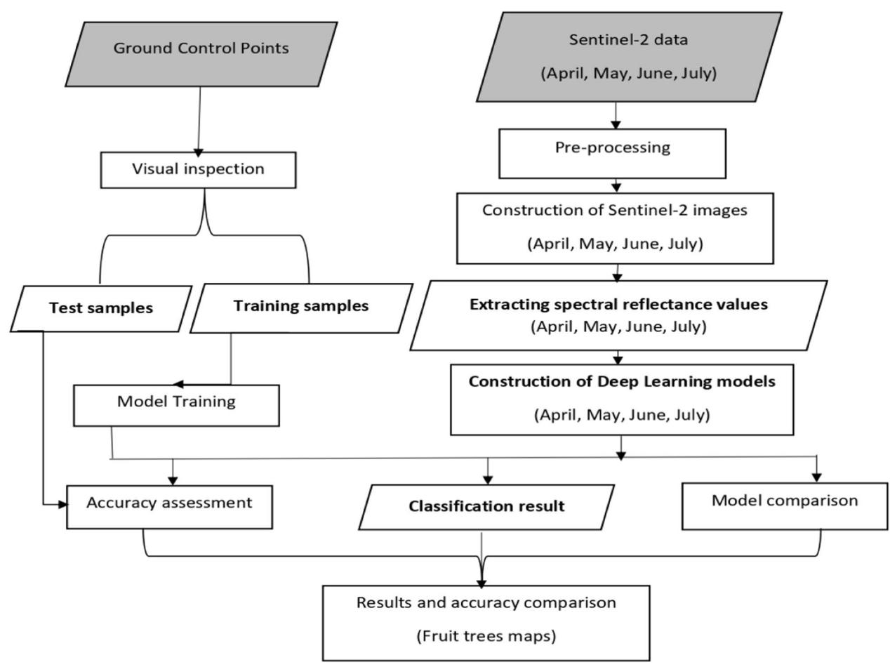

Fig. 1 Flowchart showing the Methodology followed to identify fruit trees and other land use types using Sentinel-2 images and the DNN algorithm

Mountains located at 775 m above sea level (Chabalala et al. 2023a)]. The area is characterized by a warm climate and an average rainfall of 1000 mm accompanied by persistent cloud cover along the mountains area, especially during the summer seasons (September to March) which coincide with the beginning of the flowering and fruiting seasons. Cloud cover is a bit better in winter months, (i.e., April to August). Hence the images acquired during this period will be used in this research. The Levubu farming area is composed of fragmented smallholder horticultural farming systems. The average agricultural field sizes are smaller than 1 hectare (ha) planted with fruit tree crops (i.e., avocado, banana, guava, mango, macadamia nut) and surrounding land use types (i.e., bare soil, build-up, pine trees, water body, and woody vegetation) (Chabalala et al. 2023a, 2022). The fruits are used for local, national, and global consumption and contribute to seasonal employment generation to the local surrounding communities and Gross domestic product in South Africa.

### Data collection and processing

This section explains the datasets used in this study (insitu and earth observation) and how earth observation data was pre-processed before analyzing the data. Furthermore, it shows the behavioural changes of crops in different growing seasons. Additionally, it discusses the classification algorithm applied in this study, and how it was implemented in Jupyter Notebook in a Python environment. The concluding sub-subsection explains the assessment of the classification results.

### In-situ data collection

The *in-situ* data were collected during field campaigns conducted in December 2019, January 2020, and April 2020. A handheld Garmin eTrex 20X global positioning system (GPS) with an accuracy of a sub-meter was used to record the geographic locations (latitude and longitude). A total number of 304 (n=304) ground control points were captured from the dominant land cover

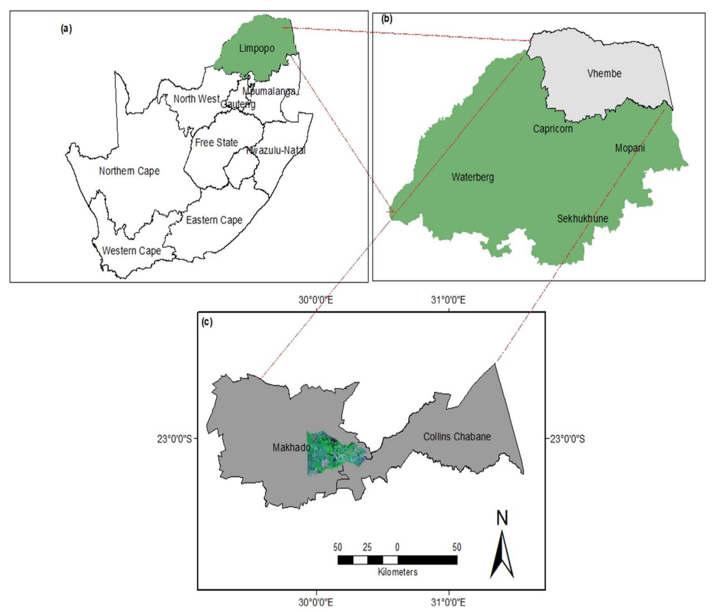

**Fig. 2** Location of the research areas at the National (Top left corner) and District Municipality levels (Top right corner). Scene of the Sentinel-2 RGB image indicates the research area. The green **a** and light grey areas, **b** represent Limpopo Province and the Vhembe District Municipality, while the dark grey **c** represents the Makhado and Collins Chabane Local Municipalities

classes; these include avocado (n = 49), banana (n = 53), built-up (n = 7), guava (n = 12), macadamia nut (n = 95), mango (n = 18), pine tree (n = 22), water bodies (n = 4) and woody vegetation (n = 10) (Fig. 3). These points (n = 304) were then used to guide digitizing additional points using the visual interpretation of Sentinel-2 Images on ArcMap (ArcGIS® v. 10.6; ESRI, Redlands, CA, USA) and Google Earth Pro (Chabalala et al. 2020, 2023a). The ground data were subdivided into a 70% training set which was used to train and fine-tune the hyperparameters of the classification models, while the remaining 30% testing set was used to validate the classification results.

## Spectral characteristics of fruit-tree crops and co-existing land use types

Efficient orchard management is dependent on crop phenology. The farming systems are intensive and intercropped making it challenging to map using single-date images (Chabalala et al. 2023b). Hence, for this research, phenological metrics were extracted from four optimal Sentinel-2 images acquired during key phenological stages of the fruit trees (i.e., flowering, fruiting, and senescence) (Table 1). This information was utilized to account for spectral confusion that mostly occurs while mapping crop types using single-date images in heterogeneous landscapes. The spectral reflectance data for each image was extracted using the

**Table 1** Phenology calendar of the major fruit trees in Levubu subtropical farms

| Class     | Varieties | Jan  | Feb  | Mar  | Apr  | May  | June | July | Aug  | Sept | Oct  | Nov  | Dec  |
|-----------|-----------|------|------|------|------|------|------|------|------|------|------|------|------|
| Avocado   | Hass      | Fru  | Fru  | Fru  | Fru  | Harv | Harv |      |      | Flo  | Flo  | Flo  | Fru  |
|           |           |      |      |      |      |      |      |      |      |      |      |      |      |
|           | Fuerte    | Fru  | Harv | Harv |      |      |      |      |      | Flo  | Flo  | Flo  | Fru  |
|           | Pinkerton | Fru  | Fru  | Fru  | Harv | Harv |      |      | Flo  | Flo  | Flo  | Fru  | Fru  |
|           | Ryan      | Flo  | Flo  | Fru  | Fru  | Fru  | Fru  | Harv | Harv |      |      |      | Flo  |
| Banana    |           | Harv | Harv | Flo  | Flo  | Flo  | Fru  | Fru  | Fru  | Fru  | Harv | Harv | Harv |
| Guava     |           | Fru  | Fru  | Fru  | Harv |      |      |      |      |      |      | Flo  | Flo  |
| Macadamia | Beaumont  | Fru  | Fru  | Fru  | Harv | Harv |      |      | Flo  | Flo  | Fru  | Fru  | Fru  |
| nut       | 695       |      |      |      |      |      |      |      |      |      |      |      |      |
|           | Nelmak 2  | Fru  | Harv | Harv |      |      | Flo  | Flo  | Fru  | Fru  | Fru  | Fru  | Fru  |
|           | A4        | Fru  | Harv | Harv |      |      | Flo  | Flo  | Fru  | Fru  | Fru  | Fru  | Fru  |
|           | 814       | Fru  | Harv | Harv |      |      | Flo  | Flo  | Fru  | Fru  | Fru  | Fru  | Fru  |
|           | 816       | Fru  | Harv | Harv |      |      | Flo  | Flo  | Fru  | Fru  | Fru  | Fru  | Fru  |
|           | 344       | Fru  | Harv | Harv |      |      | Flo  | Flo  | Fru  | Fru  | Fru  | Fru  | Fru  |
| Mango     | Tommy     | Harv |      |      |      |      |      | Flo  | Flo  | Fru  | Fru  | Fru  | Harv |
|           | Atkins    |      |      |      |      |      |      |      |      |      |      |      |      |
|           | Sabre     |      |      |      |      |      | Flo  | Flo  | Fru  | Fru  | Fru  | Harv | Harv |
|           | Keitt     | Fru  | Harv | Harv |      |      |      |      |      | Flo  | Flo  | Fru  | Fru  |

The colour shading represents the flowering Flo fruiting (Fru), and harvesting (Harv)) stages

collected in-situ data using ArcGIS version 10.5. The average spectral characteristics curves of the fruit trees and other land use types considered in the research are presented in Fig. 4. The spectral curves were extracted from 10 Sentinel-2 multispectral bands using the collected ground truth data.

### Earth observation data and pre-processing Sentinel-2 data

The Sentinel-2 (S2) images were downloaded from the website (https://scihubcopernicus.eu/) owned by the European Space Agency (ESA). S2 consists of two satellites (Sentinel-2A and Sentinel-2B) with a temporal spatial resolution of 5-6 days (Darvishzadeh et al. 2019). The data have 13 spectral bands with spatial resolutions of 10, 20, and 60 that are in different wavelengths ranging from 443 to 2190 nm and consist of three additional red edge bands with a central wavelength of 705 nm (Band 5), 710 nm (Band 6), and 783 nm (Band 7), respectively (Table 2). The visible and red edge bands have been proven to have capabilities to detect vegetation foliar properties due to their sensitivity to leaf chlorophyll and water content (Darvishzadeh et al. 2019). In this research, four Sentinel-2 time series images optimally acquired from April to July, acquired in 2019/2020, corresponding to key fruit tree phenological stages (i.e., flowering, fruiting, and harvesting) were used (Table 1

**Table 2** Spectral characteristics of Sentinel-2 sensor

| Band | Description         | Spatial resolution | Wavelength centre | Wavelength width |
|------|---------------------|--------------------|-------------------|---------------------|
| B2   | Blue                | 10                 | 490               | 65                  |
| В3   | Green               | 10                 | 560               | 35                  |
| B4   | Red                 | 10                 | 665               | 30                  |
| B5   | Red-edge 1          | 20                 | 705               | 15                  |
| B6   | Red-edge 2          | 20                 | 740               | 15                  |
| В7   | Red-edge 3          | 20                 | 783               | 20                  |
| B8   | Near-infrared (NIR) | 10                 | 842               | 115                 |
| B8A  | Red-edge 4          | 20                 | 865               | 20                  |
| B11  | SWIR 1              | 20                 | 1375              | 30                  |
| B12  | SWIR 2              | 20                 | 2190              | 180                 |

**Table 3** Sentinel-2 image acquisition dates

| Images | Acquisition dates | Day of Year |
|--------|-------------------|-------------|
| April  | 2020-04-06        | 97          |
| May    | 2020-05-26        | 147         |
| June   | 2019-06-11        | 163         |
| July   | 2020-07-05        | 187         |

and Table 3). The utilization of optimal images acquired during critical crop growth stages has the capability to reveal the within-crop spectral similarities for accurate

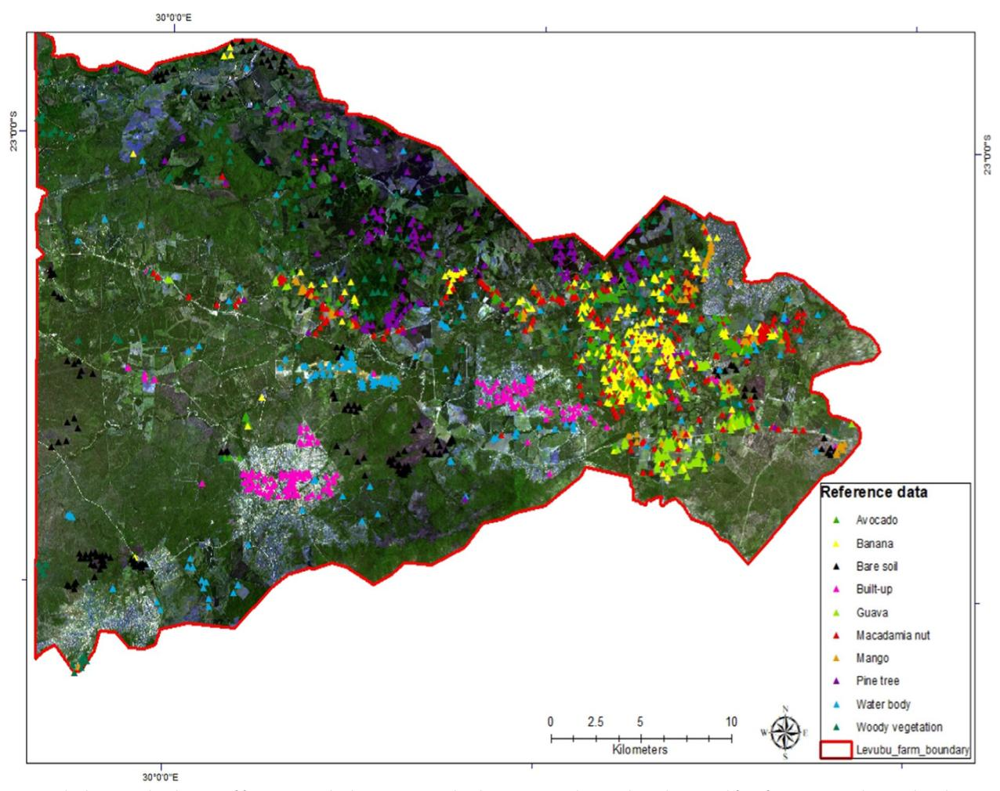

**Fig. 3** The location distribution of fruit trees and other co-existing land-use types in the Levubu sub-tropical fruit farming area. The RGB bands represent S2 image downloaded from the European Space Agency

spectral separability of a wide range of crop types (Zhang et al. 2018).

### Image pre-processing

The selected Sentinel-2 images used in the research were atmospherically and geometrically corrected using the SEN2COR processor in the ESA SNAP software to obtain the reflectance data in Level-2A Top-Of-Atmosphere (TOA) format (Darvishzadeh et al. 2019). During pre-processing, the selected Sentinel-2 images were resampled to 10 m spatial resolution and the remaining 10 bands (i.e., band 2, band 3, band 4, band 5, band 6, band 7, band 8, band 9, band 11, and band 12) were stacked together using ArcGIS version 10.6 to form the four Sentinel-2 images used in this research. The corrected images were classified using a Deep Neural Network (DNN).

### Deep learning models

A Deep Neural Network (DNN) algorithm that uses multiple artificial neural networks and has the capability to model complex non-linear objects (Hu et al. 2016). DL can (a) extract features directly from the dataset; (b) use a deep network to learn hierarchical features; and (c) automate predictions, making it more robust and generalized than traditional ML classifiers (Biffi et al. 2021; Ukwuoma et al. 2022). DL methods have high complexities and are designed to solve complex problems with non-linear transformations (Biffi et al. 2021; Bargiel 2017).

The study employed Keras Python 3.6.13 libraries on top of Tensorflow 2.4.1 using an interactive Jupyter Notebook to implement the DNN model. Typically, the DNN model architecture is determined using four parameters, namely, the number of neurons, the number of layers, the learning algorithm, and the activation function. For the

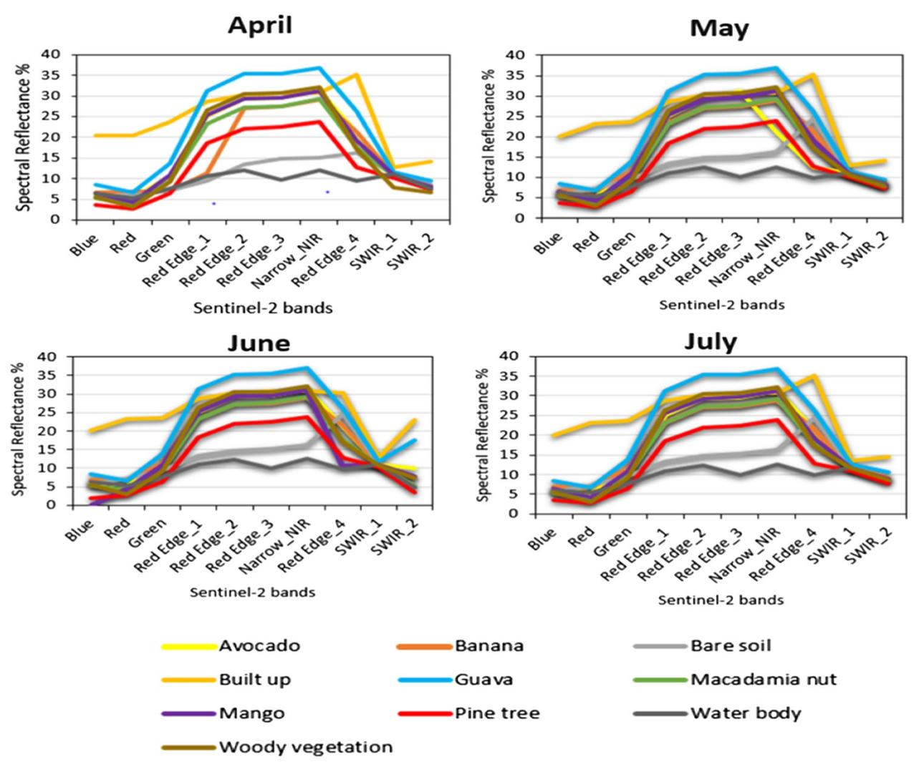

**Fig. 4** The variations in temporal spectral reflectance curves of within-season phenological stages of fruit trees and other land use types derived from Sentinel-2 multispectral images acquired over a different time range (April, May, June, and July). All fruit trees and their co-existing land use types are plotted together

study, three layers/neurons, one input layer consisting of 10 classes, two hidden layers, and one output layer consisting of 10 classes. The layers were added sequentially to identify the best network architecture—all neurons were activated to achieve the best model performance using the ReLu and SoftMax activation functions (Tian et al. 2019a). The transfer learning approaches were applied by fine-tuning the model using different image batch sizes of 10, 50, and 100. The model performance was optimized by applying the glorum\_uniform, which draws samples from a uniform distribution (Amani et al. 2020). Furthermore, other optimization functions such as ADAM, RMSprop, and SDG were tested with a learning rate of 0.1 and 1 to identify the differences between in-situ data and network outputs (Loss Function)

(Ukwuoma et al. 2022; Li et al. 2022). Different iterations with 50 and 100 epochs were tested to identify the model that would be more sensitive to fruit- trees and co-existing land use types and give the best classification accuracy (Amani et al. 2020). The dropout rate was set to 0,0.3 and a 'max' mode was used for early stopping when the model accuracy stopped improving. The trained models were assessed using the test dataset. The loss and accuracy of the training and validation data were recorded, and the optimum overall accuracy was computed at the last batch/epoch (Xiong et al. 2022).

### **Accuracy assessment**

Accuracy assessment is the process of evaluating the classification results as a way of assessing the reliability of

the classification approach proposed in research (Amani et al. 2020). The results of this research were assessed using a confusion matrix which was calculated using test samples (30% of the dataset) (Amani et al. 2020). The performance of the DNN model in classifying the optimal images was assessed by computing the performance evaluation metrics user's accuracy (UA), producer's accuracy (PA), and overall accuracy (OA) which were computed from the confusion matrix of the four DNN models applied in the study.

### Results

### Overall accuracies of the DNN models

Figure 5 presents the accuracy and loss curves on the validation and training datasets of Model 1 (April image), Model 2 (May image), Model 3 (June image), and Model 4 (July image). The curves show the relationships between model accuracy and loss function, indicating the performance and stability of the models across the datasets were tested using 100 epochs. In all models, the learning curves are smooth, suggesting that the models were robust in learning the data and had the capacity to

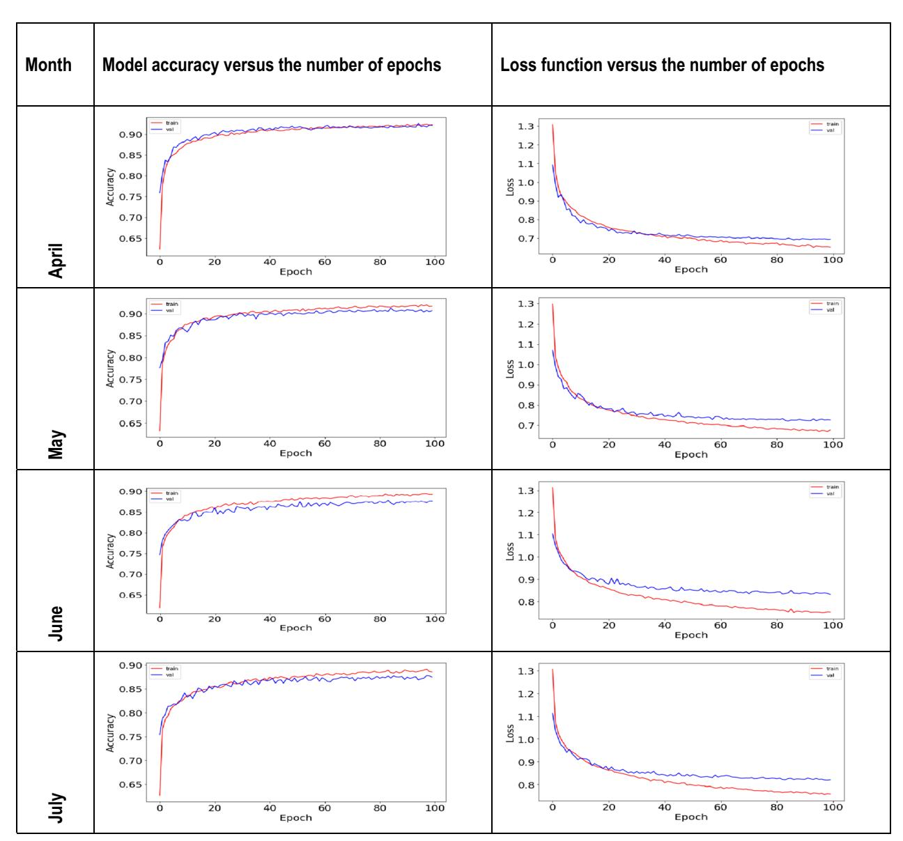

Fig. 5 Comparison of the variation of model accuracy and loss function curves with increasing epochs on the prediction of the DNN models tested in different phenological stages of the fruit trees during April (Model 1), May (Model 2), June (Model 3), and July (Model 4)

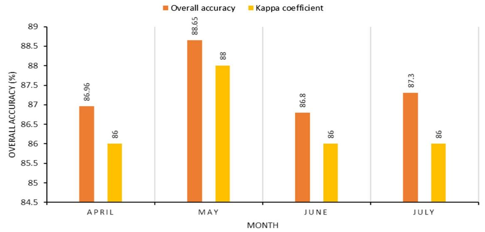

Fig. 6 Relationship between the model accuracy and the loss function, showing the stability of the models across the tested 100 epochs

produce promising results. A direct correlation is observable between the training and testing data.

In April, the loss function of the DNN model is around 40 epochs and stabilizes around 60 epochs. In May, the loss started at epoch 40 and saturated around 57 epochs. The loss started at 5 epochs and saturated early at around 49 in June. A similar trend was observed in July, where a loss was experienced at three epochs and reached a maximum performance at around 67 epochs. In terms of accuracy, the May model achieved a superior performance of 87% compared with the other models, indicating that the recall and overall precision performance of the DNN model in May were better than in the other months (April, June, and July).

### Performance of the classification models

The overall classification accuracies of the models followed a similar order of 88.64%, 87.25%, 86.96 and 87.25% (Figure 6). The kappa coefficient values ranged from 86% to 88% for May to July, respectively. The May image was decisive and made an important contribution towards identifying the fruit trees and co-existing land use types.

Figure 7 shows the validation results of each fruit-tree species and co-existing land use types. These figures show that better class accuracies were achieved using the images from late autumn (May) and late winter (July).

In April (Fig. 7A), the producer accuracy (PA) ranged from 64.76 to 98.66% for the avocado (AV) and woody vegetation (WV), respectively. The other crops (i.e., banana (BN), bare soil (BS), build-up (BU), pine tree (PT), macadamia nut (MN), and water body (WB) had a

PA accuracy of 90% and above. The user accuracy (UA) ranged from 62.96% for the avocado class to 98.66% for the BU class.

In May (Fig. 7B), the PA ranged from 64.95 to 100%, with the AV class recording the lowest while the WB class had the highest. An increase was observed for all classes except for the BU, MN, and WB. The PA for the BU class decreased by 1.23%. The UA increased for all classes ranging from 70.79 to 99.37%.

In June (Fig. 7C), the PA ranged from 67,39 to 98.01%. The UA decreased from 83.01% to 72% for the GV class, while for the mango (MG) and BN classes, it decreased from 84.75 to 75,23%, and 96.83 to 93.24%, respectively. The UA ranged from 65.96 to 96.88 for the WB class. There was a decrease in UA values recorded for AV, BU, GV, MN, PT, WB, and MN.

In the July image (Fig. 7D), the PA ranged from 68 to 99%, while the UA ranged from 65 to 100%. The PA value for the avocado crop was 67.33%, indicating that 32.67% of pixels, attributed to avocado, were misclassified. The UA values ranged from 65 to 100%, showing an increase for the BN, GV, MN, MG, and WB.

### Mapping outputs

A DNN model was applied to four Sentinel-2 monthly images (April, May, June, and July) and used to distinguish the presence of fruit trees and surrounding landuse types in subtropical farms in Levubu, South Africa.

Figure 8 shows pixel-based classification maps produced using four optimal Sentinel-2 images acquired in April to July and classified using the DNN algorithm. The proposed approach made it possible to distinguish

OA = 86.80% Kappa = 0.86%

**Table 4** Confusion matrices for the fruit trees and co-existing land use types in four growing months (April, May, June, and July).

| Class      | (A) DNN | (A) DNN APRIL |    |     |    |     |     |     |    |     |       |  |  |  |
|------------|---------|---------------|----|-----|----|-----|-----|-----|----|-----|-------|--|--|--|
|            | AV      | BN            | BS | BU  | GV | MN  | MG  | PT  | WB | wv  | Tota  |  |  |  |
| AV         | 68      | 3             | 1  | 1   | 11 | 9   | 12  | 0   | 0  | 3   | 108   |  |  |  |
| BN         | 3       | 141           | 1  | 0   | 2  | 0   | 3   | 0   | 0  | 0   | 150   |  |  |  |
| BS         | 2       | 1             | 79 | 1   | 0  | 1   | 0   | 0   | 0  | 2   | 86    |  |  |  |
| BU         | 0       | 0             | 0  | 147 | 1  | 0   | 0   | 0   | 1  | 0   | 149   |  |  |  |
| GV         | 6       | 1             | 1  | 0   | 56 | 0   | 4   | 0   | 0  | 0   | 68    |  |  |  |
| MN         | 12      | 0             | 0  | 0   | 0  | 76  | 13  | 6   | 0  | 1   | 108   |  |  |  |
| MG         | 9       | 0             | 0  | 0   | 4  | 11  | 105 | 1   | 0  | 1   | 131   |  |  |  |
| PT         | 1       | 0             | 0  | 0   | 0  | 2   | 0   | 135 | 0  | 3   | 141   |  |  |  |
| WB         | 0       | 0             | 1  | 0   | 0  | 0   | 1   | 0   | 30 | 1   | 33    |  |  |  |
| WV         | 4       | 0             | 2  | 0   | 1  | 1   | 4   | 6   | 0  | 197 | 215   |  |  |  |
| Total      | 105     | 146           | 85 | 149 | 75 | 100 | 142 | 148 | 31 | 208 | 1189  |  |  |  |
| OA: 86.969 | 6       |               |    |     |    |     |     |     |    |     |       |  |  |  |
| kappa: 869 | %       |               |    |     |    |     |     |     |    |     |       |  |  |  |
|            | (B) DNN | I MAY         |    |     |    |     |     |     |    |     |       |  |  |  |
| Class      | AV      | BN            | BS | BU  | GV | MN  | MG  | PT  | WB | wv  | Total |  |  |  |
| AV         | 63      | 2             | 0  | 1   | 3  | 12  | 7   | 1   | 0  | 0   | 89    |  |  |  |
| DNI        | _       | 122           | 0  | 0   | 1  | 2   | 1   | 0   | 0  | 0   | 122   |  |  |  |

|            | (B) DNN MAY |     |    |     |    |     |     |     |    |     |       |  |  |  |
|------------|-------------|-----|----|-----|----|-----|-----|-----|----|-----|-------|--|--|--|
| Class      | AV          | BN  | BS | BU  | GV | MN  | MG  | PT  | WB | wv  | Total |  |  |  |
| AV         | 63          | 2   | 0  | 1   | 3  | 12  | 7   | 1   | 0  | 0   | 89    |  |  |  |
| BN         | 6           | 122 | 0  | 0   | 1  | 2   | 1   | 0   | 0  | 0   | 132   |  |  |  |
| BS         | 1           | 1   | 82 | 2   | 3  | 0   | 0   | 3   | 0  | 1   | 93    |  |  |  |
| BU         | 0           | 0   | 0  | 158 | 1  | 0   | 0   | 0   | 0  | 0   | 159   |  |  |  |
| GV         | 11          | 0   | 0  | 0   | 59 | 1   | 2   | 0   | 0  | 1   | 74    |  |  |  |
| MN         | 10          | 1   | 0  | 0   | 0  | 88  | 7   | 2   | 0  | 5   | 113   |  |  |  |
| MG         | 4           | 0   | 0  | 0   | 2  | 11  | 100 | 2   | 0  | 6   | 125   |  |  |  |
| PT         | 0           | 0   | 1  | 0   | 2  | 4   | 1   | 152 | 0  | 5   | 165   |  |  |  |
| WB         | 0           | 0   | 0  | 0   | 0  | 0   | 0   | 0   | 32 | 1   | 33    |  |  |  |
| WV         | 2           | 0   | 0  | 1   | 0  | 1   | 0   | 1   | 0  | 198 | 206   |  |  |  |
| Total      | 97          | 126 | 83 | 162 | 71 | 119 | 118 | 164 | 32 | 21  | 1189  |  |  |  |
| OA: 88.659 | %           |     |    |     |    |     |     |     |    |     |       |  |  |  |
| kappa: 889 | %           |     |    |     |    |     |     |     |    |     |       |  |  |  |

Class (C) DNN JUNE A۷ BN BS BU G۷ MN MG PT WB W۷ Total ΑV BN BS ВU GV MN MG PT WB WV Total 

Table 4 (continued)

| Class      | (D) DNI | (D) DNN JULY |    |     |    |     |     |     |    |     |       |  |  |  |  |
|------------|---------|--------------|----|-----|----|-----|-----|-----|----|-----|-------|--|--|--|--|
|            | AV      | BN           | BS | BU  | GV | MN  | MG  | PT  | WB | wv  | Total |  |  |  |  |
| AV         | 68      | 2            | 0  | 1   | 10 | 9   | 11  | 0   | 0  | 3   | 104   |  |  |  |  |
| BN         | 3       | 108          | 3  | 1   | 3  | 1   | 0   | 0   | 1  | 0   | 120   |  |  |  |  |
| BS         | 2       | 0            | 73 | 0   | 0  | 0   | 0   | 2   | 0  | 0   | 77    |  |  |  |  |
| BU         | 1       | 0            | 1  | 161 | 0  | 0   | 0   | 0   | 0  | 0   | 163   |  |  |  |  |
| GV         | 3       | 0            | 3  | 0   | 50 | 2   | 1   | 0   | 0  | 0   | 59    |  |  |  |  |
| MN         | 11      | 0            | 2  | 0   | 0  | 91  | 15  | 2   | 0  | 1   | 125   |  |  |  |  |
| MG         | 9       | 0            | 0  | 0   | 2  | 13  | 90  | 0   | 0  | 5   | 119   |  |  |  |  |
| PT         | 1       | 0            | 0  | 0   | 0  | 7   | 1   | 142 | 0  | 5   | 156   |  |  |  |  |
| WB         | 0       | 0            | 0  | 0   | 0  | 0   | 0   | 0   | 33 | 0   | 33    |  |  |  |  |
| WV         | 3       | 0            | 0  | 0   | 0  | 2   | 2   | 5   | 2  | 219 | 233   |  |  |  |  |
| Total      | 101     | 110          | 82 | 163 | 65 | 128 | 120 | 151 | 36 | 233 | 1189  |  |  |  |  |
| OA = 87.30 | 0%      |              |    |     |    |     |     |     |    |     |       |  |  |  |  |
| Kappa = 8  | 6%      |              |    |     |    |     |     |     |    |     |       |  |  |  |  |

The land use classes are namely, AV avocado, BN banana, BS bare soil, BU built-up, GV guava, MN macadamia nut, MG mango, PT pine tree, WB water body, WV woody vegetation

and classify fruit trees and co-existing land use types. As depicted in 6A, the pine trees are preferentially found in high-elevation areas on the northern side of the research area. During this month, the avocado crop overlapped with the macadamia nut (MN) guava (GV), and mango (MG) crops resulting in high spectral confusion between the classes (Table 4A). This could have been attributed to the fact that some of the avocado cultivars (Hass, Ryan) are fruiting, while the (Fuerte cultivar) is in the senescence stage and the AV (Pinkerton cultivar) is in the harvesting stage. These phenological stages coincide with the senescence stage of the mango crop and some macadamia nuts (A4,814,816,344) while the Beaumont 695 and Nelmark 2 cultivars are in their harvesting stages (Table 1).

In Fig. 8B, the classification during May showed misclassification between banana (BN), MN, and MG although the spatial distribution is similar to April. However, it is evident in Table 4B that 11, 10, and 6 pixels belonging to the avocado crop were misclassified as GV, MN, and BN, respectively. Furthermore, pixels 12, and 11 belonging to the mango crop were misclassified as avocado and woody vegetation (WV), while 6, 5, and 5 pixels of the WV class were misclassified as mango, guava, and macadamia nut, respectively. In Fig. 5, it was observed that there are spectral similarities between these classes due to overlapping phenological stages. The spectral

similarities emanated from the senescence stage of the mango crop which coincides with the senescence stage of the majority of the MN varieties (A4, 814, 816, 344) and that of the avocado, specifically the Fuerte cultivar.

The image acquired in June (Fig. 8C) was able to detect the banana and mango crops located within the built-up areas on the southern side of the study area, which decreased the spectral confusion between the crops (Table 4C). However, spectral confusion was observed within the avocado, mango, and guava crops. The AV (Hass) cultivar was in the harvesting stage, and the AV (Fuerte, Pinkerton) cultivars together with GV, MN (Beaumont 695), and MG (Keitt) were in their senescence stages, while the AV (Ryan) variety, the BN and MN (Nelmark 2, A4, 814, 816, 344) and MG (Sabre cultivar) were in flowering stages.

Figure 8D shows the spatial distribution of the fruit trees in July. It was observed from the confusion matrix that 11, 10, and 9 pixels corresponding to the avocado crop were misclassified as mango, guava, and macadamia nut, respectively (Table 4D). During this month, all crops were in their fruiting and flowering stages except for the MN (Keith cultivar), the GV, and the AV (Hass, Fuerte) cultivars. Overall, all fruit trees were accurately detected during the wet season (i.e., June and July) as they correspond to the flowering and fruiting seasons which are easily detected by the optical sensor due to the high presence of the chlorophyll and water contents in leaves.

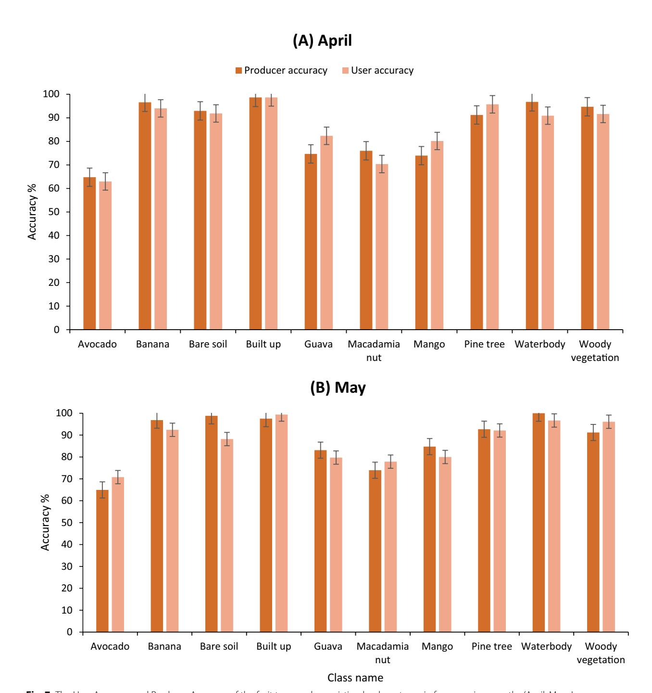

Fig. 7 The User Accuracy and Producer Accuracy of the fruit trees and co-existing land use types in four growing months (April, May, June, and July)

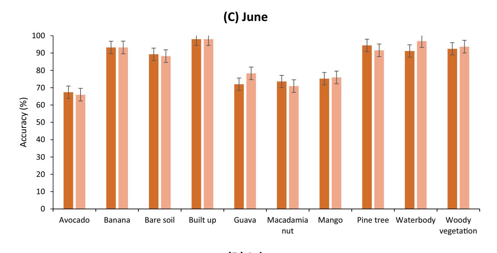

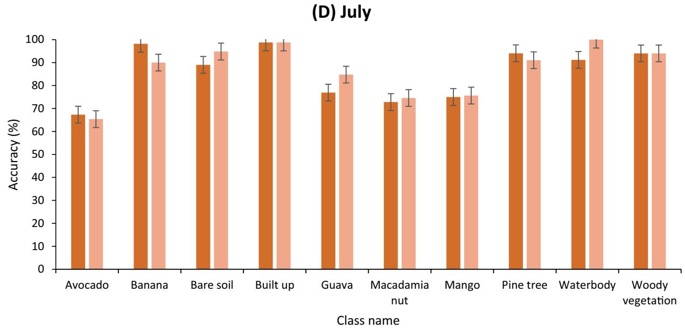

Fig. 7 continued

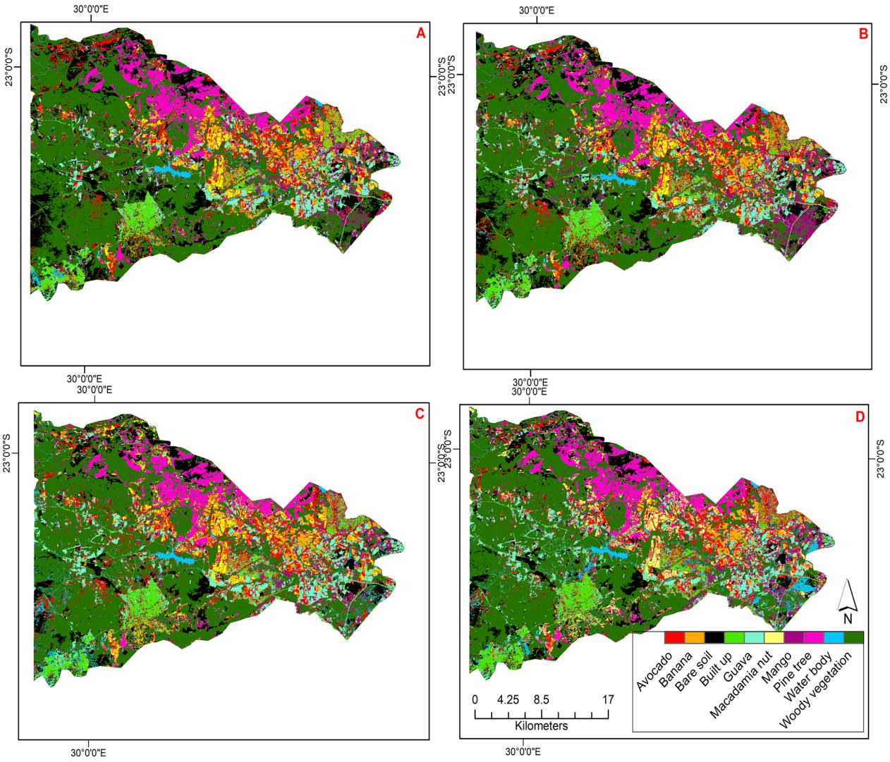

Fig. 8 Discrimination results for fruit trees and co-existing land use types by DNN and Sentinel-2 images acquired in **A** April, **B** May, **C** June, and **D** July

Figure 9, shows the visual enhancement through the provision of zoomed-in maps of the regions with classification irregularities (Figure 9: inset a, b, and c). The first inset region (Fig. 9, insert (a)) is located in the northwestern part of Levubu, where mountains and irregular patches of pine trees exist. The approach applied made it possible to distinguish pine trees from woody vegetation. The dominant fruit trees were avocado and macadamia nut. Similarly, the applied approach was able to classify the fruit trees in the central north of Levubu [Fig. 9, May, insert (b)]. The guava, avocado, mango, and pine trees have dominated this region. Furthermore, the approach was also effective in classifying fruit and co-existing land use areas in the northeastern part of Levubu [Fig. 9, June, insert (c)]. This region is dominated by banana, guava, and avocado.

In Fig. 9, insert (a), located in the Southeastern part of the study area, shows the differences in the detection of the guava crop across the four months. However, in April, a few pixels of the guava crop were detected by the model. In May, June, and July, more pixels of the guava crop were detected as depicted on insert b-c, however, some of the bare soils and avocado and woody vegetation classes. The central part of the study area, depicted by inserts (b), shows the spectral confusion between the guava, avocado, and woody vegetation in April and May, while in June and July, the same areas are correctly classified as guava, avocado and macadamia nut. On insert (c), some of the pixels of the woody vegetation were misclassified as guava and built-up areas during June. However, the water features present around those areas were

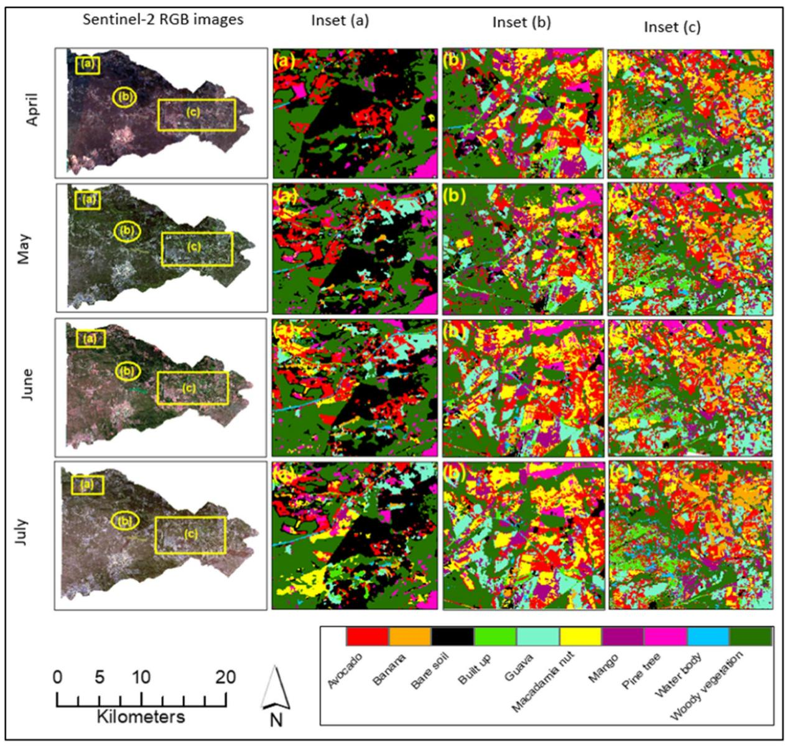

**Fig. 9** Fruit tree maps obtained using DNN with some zoomed spots showing the spatial structure of the classified fruit crops and co-existing land use types based on Sentinel-2 images across growing seasons in April, May, June, and July. The **a**–**c** depicts the zoomed areas of three sites with major classification differences obtained using the DNN classifier across the four months considered in this study

detected in July, while they were slightly detected in April to June image acquisitions.

### Discussion

### Overall classification accuracies

Fragmented smallholder landscapes dominated by fruit trees with similar spectral characteristics present difficulties in terms of the performance of machine learning classifiers. This situation can be overcome through the application of DL models and new-generation sensors with a high temporal and spatial resolution such as

Sentinel-2 (Lanaras et al. 2018). The research constituted an investigation into the utility of using Sentinel-2 (S2) optimal multispectral data and phenological information integrated with DNN for mapping heterogeneous fruit trees and co-existing land use types in Levubu, South Africa. The performance of S2 multi-temporal images across crop growth season was compared using the overall accuracy, user, and producer accuracies. The approach produced satisfactory results, and superior results of 88.64% OA were achieved for the month of May. As shown by the results in Fig. 6, the model performance

was not affected by the image acquisition gaps from April to July, corroborating findings by Zhou et al. 2022. In their research, an OA of 91% was achieved using the ANN model, constituting an 8% improvement on the RF results. The accuracy obtained in the research is comparable with the study by Pena et al. (2017), who obtained 85.56% when classifying crop types using DL and Sentinel-2-time series data. In this research, the spectral features extracted in late winter (July) contributed 0.87%, whereas those extracted in early autumn (April) and early winter (June) contributed 86.96% and 86.8% to the classification model. Although the research produced various accuracies, an OA of 80% and above was achieved in both months. This suggests that the optimal period for mapping fruit trees in Levubu is autumn to winter (i.e., April to July). Similar to observations in Paris et al. (2020), the OA was low during the early seasons of crops, but an increase in OA was achieved as the seasons progressed. Identifying the optimal window period has proven to be an alternative to the utilization of all-time series images present in the year. The results are comparable with studies that used image composites from time series data (Kordi and Yousefi 2022b; Vuolo et al. 2018).

### Comparison of spatiotemporal accuracies of individual classes

In terms of individual class accuracies, better results were achieved for specific crops (Fig. 7 and Table 4(A-D)). The spectral differences with respect to fruit trees were large in late autumn and late winter, as most of the fruit trees were in the vegetative stage (flowering and fruiting). The early seasons are characterized by low vegetation cover and high reflectance originating from the soil background, and they provide little contrast between crops and their spectral differences (Vuolo et al. 2018). In May, the banana and mango crops begin production and seed development, while macadamia nut and mango begin to senesce. The structural differences were evident in May, with the banana and avocado crops (Ryan) cultivar in fruit development while the macadamia nut (Beaumont 695) cultivar, avocado (Pinkerton and Hass) cultivars, and guava crops were in the senescence and harvest stages. Similar to what was reported by Vuolo et al. (2018), low accuracies were obtained using the image acquired in June. The low accuracies for the avocado crops in the tested months are attributed to the sensitivity of the DNN model and the robustness of the applied classification approach to subtle changes.

In contrast, the differences in the spectral reflectance of types of fruits were more prominent later in the growing season due to green vegetation, increased moisture content, and canopy structure (McNairn et al. 2009). Similarly, to our findings, the research by McNairn et al.

(2009) reported the significance of late growing season optical acquisitions for crop discrimination. Applying spectral features at different times increased the distinction between fruit trees and co-existing land use types (Amani et al. 2020).

The change in the fruit tree canopies was not detected in April but was indistinctly captured in May. This emphasizes the need for phenological information captured by Sentinel-2 (S2) data due to its highfrequency interval. The temporal resolution of the S2 data makes it possible to detect these variations at the fruit-tree level. Corroborating findings by Zhou et al. 2022, the accuracy for the mango crop was lower than for the other fruit trees, which was expected because of the S2 image resolution. In June and July, the banana, and avocado crops (Ryan cultivar) are in the vegetative stage with maximum biomass, as they are fruiting, while the biomass of avocado and guava crops is declining, as they are in the senescence and harvesting stages. During these stages, the sparse canopy correlates with less vitality in guava crops, while dense canopies relate to high vitality in pine trees (Bai et al. 2016). For example, the optical image acquired in May permitted the best classification of the banana and the guava crops, as they were at the greenup and full canopy stage, which correlates with maximum photosynthesis (Schirrmann et al. 2016). At the senescence stage, the leaves have low water content, leaf area index, and dry biomass (Bai et al. 2016). The results indicate the phenology stage in which each fruit tree type is best distinguished according to the crop calendar, making optimization of the imagery collection schedule possible (Paris et al. 2020). The crop classification in winter (May–July) detected the within-class variations emanating from fruit-trees structure, local calendars, and different management strategies (Paris et al. 2020).

Although satisfactory results were achieved for all four months, the UA and PA for the avocado crop were low. This might be attributed to differences between avocado varieties, exacerbated by mixed pixels arising from spectral similarities among the different fruit trees grown in the area, as cited in previous research on fruit trees (Chabalala et al. 2023a, 2023b, 2022). Furthermore, prioritizing the image acquisition based on the phenological stage increases the chances of the crops being spectrally distinguished with high accuracy (Pan et al. 2021). Figure 4 shows a high spectral overlap between the land use classes at different months, which challenged the classification accuracy. This was evident on the classification map (Fig. 8) and the confusion matrix (Table 4(A–D)), where misclassifications were observed. Overall, spatial and accuracy variations were observed between fruit trees and within cultivars, which further complicates the mapping process.

### The spatial distribution maps

The seasonality of fruit trees and co-existing land use types were analyzed by producing spatial distribution maps for a period of 4 months covering different crucial growth stages. From Fig. 8, a shifting pattern in the spatial distribution of the mapped fruit trees and co-existing land use types is apparent. The April and May images underestimated the avocado crop, while the same crop was overestimated in early and late winter (June and July). In late autumn (May) reasonable spatial patterns were generated that concur with the researcher's knowledge.

On the northeastern side, the optimal time to separate the avocado from other fruit trees appears to be late May, when vegetation reflectance dominates the optical signals. The low classification results for avocados were associated with April and May acquisitions, suggesting that for increased accuracy, the mid to late-season optical acquisitions must be included in the classification. Unlike ML, DL models are consistent with regard to accuracy, as witnessed in this research, rendering them suitable for large-scale mapping (Pan et al. 2021).

The pigmentation, structure, and water content of crops change during their phenological stages from flowering to harvesting. The optical data are sensitive to differences in vegetation canopies (Tian et al. 2019b). Furthermore, the clustering densities of fruit trees vary within phenological stages (Tian et al. 2019b). During the fruiting stage, fruits have different sizes and colors and have sparse distribution (Saedi and Khosravi 2020). The volume of fruit trees is large during the flowering period, the leaf color changes and the clustering density decreases after harvesting due to pruning and other management strategies (Saedi and Khosravi 2020). The effectiveness of the spectral reflectance decreases as fruits mature and senesces before harvest based on fruit variety and farmers' management strategies (Asgarian et al. 2016). Depending on the aim of the farmers' assessments, the zoom-in maps become useful for other agricultural operations such as crop change monitoring, irrigation scheduling, and fruit disease scouting. For agricultural management and food security, the classification maps produced through the research reported on in this article could support the development of appropriate management strategies that will increase food production.

### Limitations

Deep Learning is computationally extensive and requires a large amount of labeled ground truth data and cadastral datasets to train the network; however, these datasets are very scant in Africa. The developed mapping tool can be transferred to other areas with similar geographic landscapes. However, model uncertainties will always exist because the overall model accuracy is pixel-specific and geographically specific and often varies per training data set

### Conclusion

The research developed a DNN-based mapping tool to improve the classification of fruit trees and co-existing land use types in a smallholder horticulture system in Levubu, Limpopo Province. The developed mapping tool identified the optimal phenological stages, at which the fruit trees peak production, and assessed how the DNN accuracy behaves across seasons. It was discovered that the developed mapping approach is robust and resilient to variations in climate, farming management strategies, and crop growth conditions as it considers both phenological stages and the growing period of fruit trees. Given the complex cropping systems in Levubu sub-tropical sites, individual classes were well classified. Regardless of the complexity of the cropping systems in Levubu, the mapped ten classes were distinguished with an overall accuracy of 89% and a kappa coefficient of 88%.

The findings suggest that selecting optimal image acquisition is important in discriminating crop types. The accessibility of optical imagery with high spatial resolution and temporal coverage is suitable for per-field crop type mapping and continuous refinement of spectraltemporal profiles for common crop types in different agronomic regions. This is expected to improve the classification accuracy of crop-type maps using these profiles. The research highlights the importance of Sentinel-2 data and deep learning models in mapping fruit trees and coexisting land use types in smallholder food systems for enhanced decision-making and the development of resilient food systems that will enable the attainment of food security. The application of phenological information derived from optimal S2 images showed high potential for fruit tree crop classification in fragmented sub-tropical regions. The results can be used as a valuable tool to develop sustainable horticultural management practices for the regulation of fruit tree crops in complex agricultural landscapes under different environmental conditions.

### Acknowledgements

I sincerely thank my supervisor, Professor Elhadi Adam, for the support and guidance I received. I also want to thank Mr. Mahlatse Kganyago for his assistance with the coding and preparation of the script.

### **Author contributions**

Data collection, methodology, analysis, report writing and editing, YC Supervision, conceptualization, review and editing, EA Coding and script writing, MK

### Funding

This research was conducted at a Ph.D. level by Yingisani Chabalala and funded by the University of the Witwatersrand. No funding was received from donors or internal or external funding institutions.

### Data availability statement

This research was made possible by open-source data from the European Space Agency, available from https://scihub.copernicus.eu/.

### **Declarations**

### Ethics approval and consent to participate

Not applicable.

### Consent for publication

Not applicable.

### Competing interests

No competing interests was declared by the authors.

Received: 18 May 2023 Accepted: 4 November 2023 Published online: 22 November 2023

#### References

- Aitelkadi K, Outmghoust H, Laarab S, Moumayiz K, Sebari I. Detection and counting of fruit trees from RGB UAV Images by convolutional neural networks approach. Adv Sci Technol Eng Syst J. 2021;6:887–93. https://doi.org/10.25046/ai0602101.
- Amani M, Kakooei M, Moghimi A, Ghorbanian A, Ranjgar B, Mahdavi S, Davidson A, Fisette T, Rollin P, Brisco B, Mohammadzadeh A. Application of google earth engine cloud computing platform, sentinel imagery, and neural networks for crop mapping in Canada. Remote Sens. 2020;12:3561. https://doi.org/10.3390/rs12213561.
- Asgarian A, Soffianian A, Pourmanafi S. Crop type mapping in a highly fragmented and heterogeneous agricultural landscape a case of central iran using multi-temporal landsat 8 imagery. Comput Electron Agric. 2023:127:531–40.
- Bai G, Ge Y, Hussain W, Baenziger PS, Graef G. A multi-sensor system for high throughput field phenotyping in soybean and wheat breeding. Comput Electron Agric. 2016;128:181–92. https://doi.org/10.1016/j.compag.2016. 08.021.
- Bal F, Kayaalp F. Review of machine learning and deep learning models in agriculture. Int Adv Res Eng J. 2021;5:309–23. https://doi.org/10.35860/iarei.848458
- Bargiel D. A new method for crop classification combining time series of radar images and crop phenology information. Remote Sens Environ. 2017;198:369–83. https://doi.org/10.1016/j.rse.2017.06.022.
- Biffi LJ, Mitishita E, Liesenberg V, Santos AA, Gonçalves DN, Estrabis NV. ATSS deep learning-based approach to detect. Apple Fruits Remote Sens. 2021. https://doi.org/10.3390/rs13010054.
- Cai Y, Guan K, Peng J, Wang S, Seifer C, Wardlow B, Li Z. A high-performance and in-season classification system of field-level crop types using time-series Landsat data and a machine learning approach. Remote Sens Environ. 2018;210:35–47. https://doi.org/10.1016/j.rse.2018.02.045.
- Chabalala Y, Adam E, Oumar Z, Ramoelo A. Exploiting the capabilities of sentinel-2 and rapideye for predicting grass nitrogen across different grass communities in a protected area. Appl Geomat. 2020;12:379–95. https://doi.org/10.1007/s12518-020-00305-8.
- Chabalala Y, Adam E, Ali KA. Machine learning classification of fused sentinel-1 and sentinel-2 image data towards mapping fruit plantations in highly heterogenous landscapes. Remote Sens. 2022;14:1–26. https://doi.org/10.3390/rs14112621.
- Chabalala Y, Adam E, Ali KA. Exploring the effect of balanced and imbalanced multi-class distribution data and sampling techniques on fruit-tree crop classification using different machine learning classifiers. Geomatics. 2023;3:70–92. https://doi.org/10.3390/GEOMATICS3010004.
- Chabalala Y, Adam E, Ali KA. Identifying the optimal phenological period for discriminating subtropical fruit tree crops using multi-temporal sentinel-2 data and Google Earth Engine. South African J Geomatics. 2023;12:262–83.

- Chen B, Jin Y, Brown P. Classifying fruit-tree crops by landsat-8 time series. ISPRS J Photogramm Remote Sens. 2019;151:176–88. https://doi.org/10.1016/j.isprsjprs.2019.03.012.
- Darvishzadeh R, Skidmore A, Abdullah H, Cherenet E, Ali A, Wang T, Niewenhuis W, Heurich M, Vrieling A, O'Conner B, Paganini M. Mapping leaf chlorophyll content from Sentinel-2 and RapidEye data in spruce stands using the invertible forest reflectance model. Int J Appl Earth Obs Geoinf. 2019;79:58–70. https://doi.org/10.1016/j.jag.2019.03.003.
- Elders A, Carroll ML, Neigh CSR, D'Agostino AL, Ksoll C, Wooten MR, Brown ME. Estimating crop type and yield of small holder fields in Burkina Faso using multi-day Sentinel-2 Remote Sens. Appl Soc Environ. 2022;27:100820.
- Feng F, Gao M, Liu R, Yao S, Yang G. A deep learning framework for crop mapping with reconstructed sentinel-2 time series images. Comput Electron Agric. 2023. https://doi.org/10.1016/j.compaq.2023.108227.
- Gallo I, Ranghetti L, Landro N, La Grassa R, Boschetti M. In-season and dynamic crop mapping using 3D convolution neural networks and sentinel-2 time series. ISPRS J Photogramm Remote Sens. 2023;195:335–52. https://doi.org/10.1016/j.isprsjprs.2022.12.005.
- Gao F, Zhang X. Mapping crop phenology in near real-time using satellite remote sensing: challenges and opportunities. J Remote Sens. 2021;2021(2021):1–14. https://doi.org/10.3133/2021/8379391.
- Hu Q, Wu W, Song Q, Yu Q, Lu M, Yang P, Tang H, Long Y. Extending the pairwise separability index for multicrop identification using time-series MODIS images. IEEE Trans Geosci Remote Sens. 2016;54:6349–61. https://doi.org/ 10.1109/TGRS.2016.2581210.
- Ismail N, Malik OA. Real-time visual inspection system for grading fruits using computer vision and deep learning techniques. Inf Process Agric. 2021. https://doi.org/10.1016/j.inpa.2021.01.005.
- Kestur R, Meduri A, Narasipura O. MangoNet: a deep semantic segmentation architecture for a method to detect and count mangoes in an open orchard. Eng Appl Artif Intell. 2019;2018(77):59–69. https://doi.org/10.1016/j.engappai.2018.09.011.
- Kordi F, Yousefi H. Remote sensing applications society and environment crop classification based on phenology information by using time series of optical and synthetic-aperture radar images. Remote Sens Appl Soc Environ. 2022. https://doi.org/10.1016/j.rsase.2022.100812.
- Kordi F, Yousefi H. Crop classification based on phenology information by using time series of optical and synthetic-aperture radar images. Remote Sens Appl Soc Environ. 2022. https://doi.org/10.1016/j.rsase.2022.100812.
- Kumar R, Krishna H, Rajan S, Alizadeh M, Barman P. Understanding phenological stages of pomegranates vis-à-vis flowering and fruiting regulation. J Horticult Res. 2021;29:1–22. https://doi.org/10.2478/johr-2021-0013.
- Lanaras C, Bioucas-Dias J, Galliani S, Baltsavias Ē, Schindler K. Super-resolution of sentinel-2 images: learning a globally applicable deep neural network. ISPRS J Photogramm Remote Sens. 2018;146:305–19. https://doi.org/10.1016/j.isprsjprs.2018.09.018.
- Li G, Cui J, Han W, Zhang H, Chen H, Ao J. Crop type mapping using timeseries Sentinel-2 imagery and U-net in early growth periods in the Hetao irrigation district in China. Comput Electron Agric. 2022;203:107478. https://doi.org/10.1016/j.compag.2022.107478.
- Mashonganyika F, Mugiyo H, Svotwa E, Kutywayo D. Mapping of winter wheat using sentinel-2 NDVI data. a case of Mashonaland central province in Zimbabwe. Front Clim. 2021;3:1–10. https://doi.org/10.3389/fclim.2021.715837.
- McNairn H, Champagne C, Shang J, Holmstrom D, Reichert G. Integration of optical and synthetic aperture radar (SAR) imagery for delivering operational annual crop inventories. ISPRS J Photogramm Remote Sens. 2009;64:434–49. https://doi.org/10.1016/j.isprsjprs.2008.07.006.
- Pan L, Xia H, Zhao X, Guo Y, Qin Y. Mapping winter crops using a phenology algorithm time-series sentine I-2 and landsat-7/8 images and google earth engine. Remote Sens. 2021. https://doi.org/10.3390/rs13132510.
- Paris C, Weikmann G, Bruzzone L. Monitoring of agricultural areas by using sentinel 2 image time series and deep learning techniques. Image Signal Process Remote Sensing. 2020. https://doi.org/10.1117/12.2574745.
- Pena MA, Brenning A, Liao R. Classifying fruit-tree crops by landsat-8-time series. IEEE 1st Int Symp Geosci Remote Sensing. 2017. https://doi.org/ 10.1109/GRSS-CHILE.2017.7995998.
- Prins AJ, Van Niekerk A. Crop type mapping using LiDAR, Sentinel-2 and aerial imagery with machine learning algorithms. Geo-Spatial Inf Sci. 2020;24:1–13. https://doi.org/10.1080/10095020.2020.1782776.

- Saedi S, Khosravi IH. A deep neural network approach towards real-time on-branch fruit recognition for precision horticulture. Expert Syst Appl. 2020:159:113594.
- Schirrmann M, Giebel A, Gleiniger F, Pflanz L. Monitoring agronomic parameters of winter wheat crops with low-cost UAV imagery. Remote Sens. 2016. https://doi.org/10.3390/rs8090706.
- Schreier J, Ghazaryan G, Dubovyk O. Crop-specific phenomapping by fusing landsat and sentinel data with MODIS time series. Eur J Remote Sens. 2021;54:47–58. https://doi.org/10.1080/22797254.2020.1831969.
- Singh R, Patel NR, Danodia A. Deriving phenological metrics from landsat-OLI for sugarcane crop type mapping: a case study in North India. J Indian Soc Remote Sens. 2022;50:1021–30. https://doi.org/10.1007/ s12524-022-01515-w.
- Southworth J, Muir C. Specialty grand challenge: remote sensing time series analysis. Front Remote Sens. 2021. https://doi.org/10.3389/frsen.2021. 770431.
- Tian Y, Yang G, Wang Z, Wang H, Li E, Liang Z. Apple detection during different growth stages in orchards using the improved YOLO-V3 model. Comput Electron Agric. 2019;157:417–26. https://doi.org/10.1016/j.compaq.2019.01.012.
- Tian H, Huang N, Niu Z, Qin Y, Pei J, Wang J. Mapping winter crops in China with multi-source satellite imagery and phenology-based algorithm. Remote Sens. 2019;11:1–23.
- Ukwuoma CC, Zhiguang Q, Bin Heyat MB, Ali L, Almaspoor Z, Monday HN. Recent advancements in fruit detection and classification using deep learning techniques. Math Probl Eng. 2022. https://doi.org/10.1155/2022/9210947.
- Vasconez JP, Delpiano J, Vougioukas S, Cheein FA. Comparison of convolutional neural networks in fruit detection and counting: a comprehensive evaluation. Comput Electron Agric. 2020;173:105348. https://doi.org/10.1016/j.compaq.2020.105348.
- Villa P, Stroppiana D, Fontanelli G, Azar R, Brivio PA. In-season mapping of crop type with optical and X-band SAR data: a classification tree approach using synoptic seasonal features. Remote Sens. 2015;10:12859–86. https://doi.org/10.3390/rs71012859.
- Vuolo F, Neuwirth M, Immitzer M, Atzberger C, Ng WT. How much does multi-temporal sentinel-2 data improve crop type classification? Int J Appl Earth Obs Geoinf. 2018;72:122–30. https://doi.org/10.1016/j.jag. 2018.06.007.
- Xie G, Niculescu S. Mapping crop types using sentinel-2 data machine learning and monitoring crop phenology with sentinel-1 backscatter time series in pays de brest, brittany France. Remote Sens. 2022. https://doi.org/10.3390/rs14184437.
- Xiong, Y.; Zeng, X.; Liao, J.; Lai, W.; Chen, Y.; Zhu, M. An approach to detecting and mapping individual fruit trees integrated YOLOv5 with UAV remote sensing. 2022. https://doi.org/10.20944/preprints202204.
- Yedage AS, Gavali RS, Jarag AP. Land assessment for horticulture (Pomegranate) crop using GIS and Fuzzy decision analysis in the Sangola taluka of Solapur District. Int J Remote Sens. 2013;2:104–13.
- Yin L. Mapping smallholder cashew plantations to inform sustainable tree crop expansion in Benin. Remote Sens Environ. 2023. https://doi.org/10. 1016/j.rse.2023.113695.
- Zhang HY, Zhu QB, Huang M, Guo Y. Automatic determination of optimal spectral peaks for classification of Chinese tea varieties using laser-induced breakdown spectroscopy. Int J Agric Biol Eng. 2018;11:154–8. https://doi.org/10.25165/j.ijabe.20181103.3482.
- Zhang W, Wang J, Liu Y, Chen K, Li H, Duan Y, Wu W, Shi Y, Guo W. Deep-learning-based in-field citrus fruit detection and tracking. Hortic Res. 2021. https://doi.org/10.1093/hr/uhac003.
- Zhong L, Hu L, Zhou H. Deep learning based multi-temporal crop classification. Remote Sens Environ. 2019;221:430–43. https://doi.org/10.1016/j.rse. 2018.11.032.
- Zhou XX, Li YY, Luo YK, Sun YW, Su YJ, Tan CW, Liu YJ. Research on remote sensing classification of fruit trees based on sentinel-2 multi-temporal imageries. Sci Rep. 2022;12:1–15. https://doi.org/10.1038/s41598-022-15414-0.

### **Publisher's Note**

Springer Nature remains neutral with regard to jurisdictional claims in published maps and institutional affiliations.

### Ready to submit your research? Choose BMC and benefit from:

- fast, convenient online submission
- thorough peer review by experienced researchers in your field
- rapid publication on acceptance
- support for research data, including large and complex data types
- gold Open Access which fosters wider collaboration and increased citations
- maximum visibility for your research: over 100M website views per year

### At BMC, research is always in progress.

Learn more biomedcentral.com/submissions

