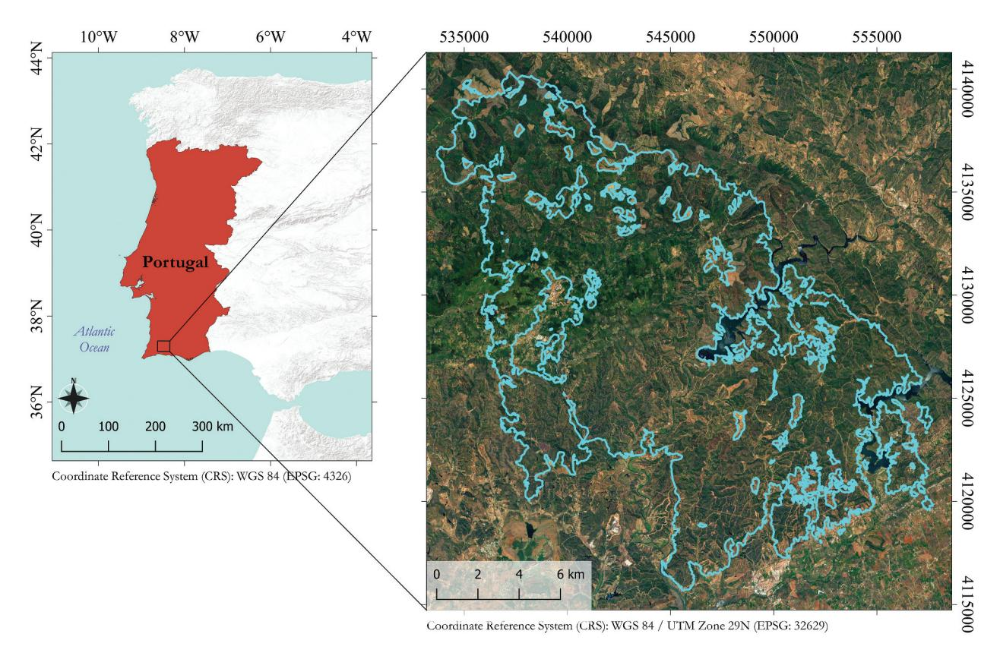
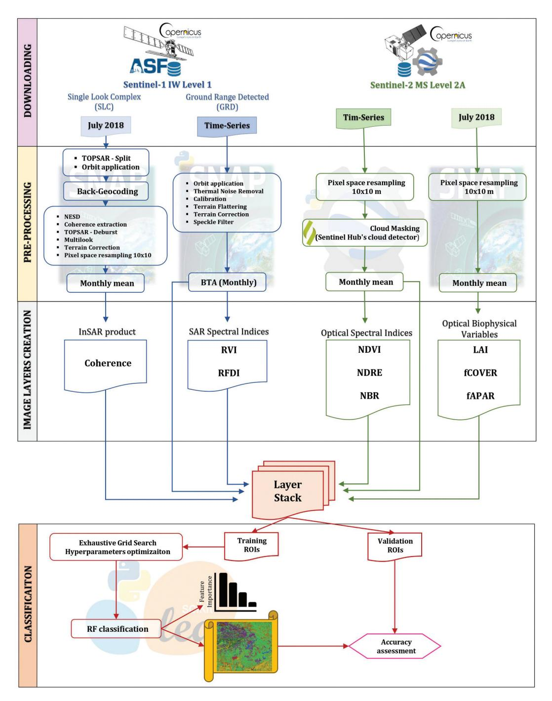
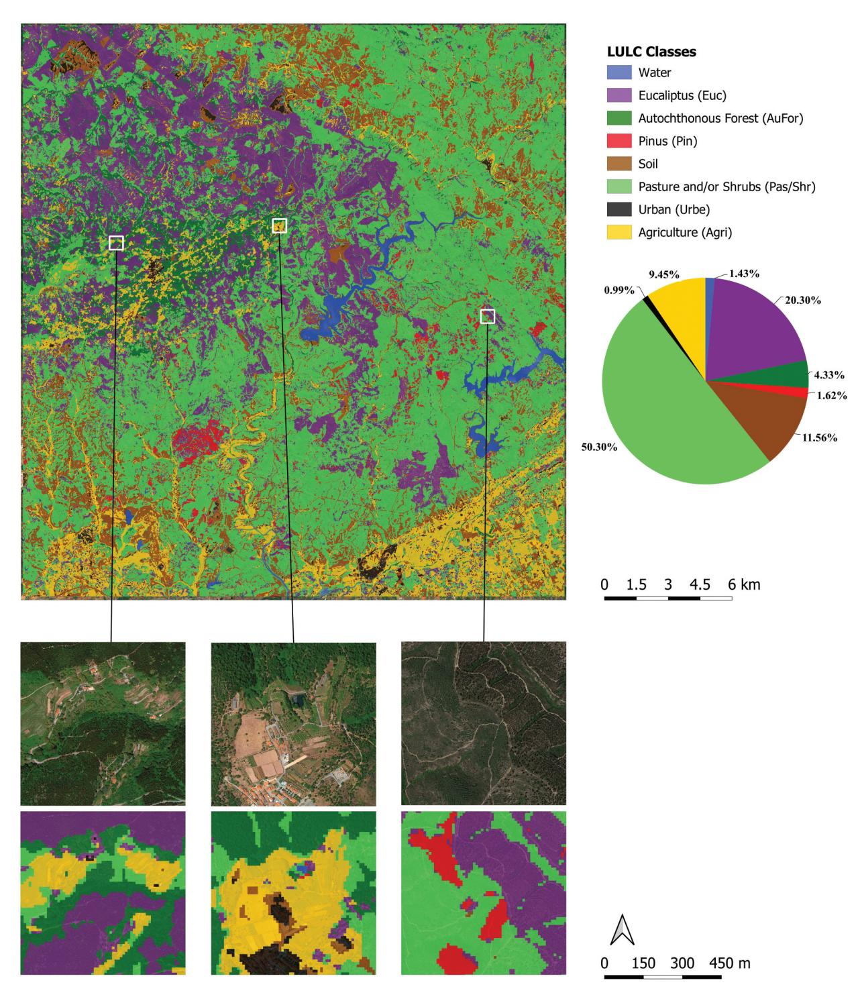
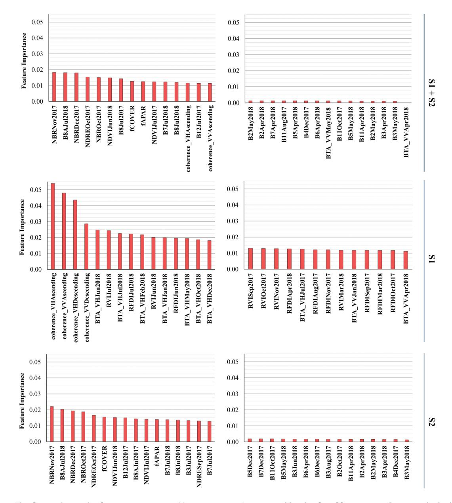

# **European Journal of Remote Sensing**

ISSN: 2279-7254 (Online) Journal homepage: www.tandfonline.com/journals/tejr20

# Integrated use of Sentinel-1 and Sentinel-2 data and open-source machine learning algorithms for land cover mapping in a Mediterranean region

Giandomenico De Luca, João M. N. Silva, Salvatore Di Fazio & Giuseppe Modica

**To cite this article:** Giandomenico De Luca, João M. N. Silva, Salvatore Di Fazio & Giuseppe Modica (2022) Integrated use of Sentinel-1 and Sentinel-2 data and open-source machine learning algorithms for land cover mapping in a Mediterranean region, European Journal of Remote Sensing, 55:1, 52-70, DOI: 10.1080/22797254.2021.2018667

To link to this article: <a href="https://doi.org/10.1080/22797254.2021.2018667">https://doi.org/10.1080/22797254.2021.2018667</a>

| 9              | © 2022 The Author(s). Published by Informa UK Limited, trading as Taylor & Francis Group. |
|----------------|-------------------------------------------------------------------------------------------------|
|                | Published online: 12 Jan 2022.                                                                  |
|                | Submit your article to this journal 🗗                                                           |
| ılıl           | Article views: 9883                                                                             |
| Q \ | View related articles 🗗                                                                         |
| CrossMark      | View Crossmark data 🗗                                                                           |
| 4              | Citing articles: 52 View citing articles 🗹                                                      |

# Integrated use of Sentinel-1 and Sentinel-2 data and open-source machine learning algorithms for land cover mapping in a Mediterranean region

Giandomenico De Luca 📭, João M. N. Silva 🕞, Salvatore Di Fazio 🕞 and Giuseppe Modica 🕞

aDipartimento Di Agraria, Università Degli Studi Mediterranea Di Reggio Calabria, Reggio Calabria, Italy; bForest Research Centre, School of Agriculture, University of Lisbon, Lisboa, Portugal

#### **ABSTRACT**

This paper aims to develop a supervised classification integrating synthetic aperture radar (SAR) Sentinel-1 (S1) and optical Sentinel-2 (S2) data for land use/land cover (LULC) mapping in a heterogeneous Mediterranean forest area. The time-series of each SAR and optical bands, three optical indices (normalized difference vegetation index, NDVI; normalized burn ratio, NBR; normalized difference red-edge index, NDRE), and two SAR indices (radar vegetation index, RVI; radar forest degradation index, RFDI), constituted the dataset. The coherence information from SAR interferometry (InSAR) analysis and three optical biophysical variables (leaf area index, LAI; fraction of green vegetation cover, fCOVER; fraction of absorbed photosynthetically active radiation, fAPAR) of the single final month of the time-series were added to exploit their correlation with the canopy structure and improve the classification. The random forests (RF) algorithm was used to train and classify the final dataset, and an exhaustive grid search analysis was applied to set the optimal hyperparameters. The overall accuracy reached an F-scoreM of 90.33% and the integration of SAR improved it by 2.53% compared to that obtained using only optical data. The whole process was performed using freely available data and open-source software and libraries (SNAP, Google Earth Engine, Scikit-Learn) executed in Python-script language.

#### **ARTICLE HISTORY**

Received 11 September 2021 Revised 18 November 2021 Accepted 11 December 2021

#### **KEYWORDS**

Synthetic aperture radar (SAR): SAR interferometry (inSAR); interferometric coherence: Google Earth Engine (GEE); SAR and multispectral time-series analysis; biophysical indicators

#### Introduction

Mapping the vegetation composition, besides providing information on the quantitative and qualitative status of the area under study, is a necessary early step in the analysis and monitoring protocols of the state of the vegetation and ecosystems' responses affected by various environmental disturbances (Choudhury et al., 2021; Grabska et al., 2020; Monroe et al., 2020; Pollino & Modica, 2013; Rodman et al., 2021; Semeraro et al., 2019), including wildfires (Gitas et al., 2012), storms (Giannetti et al., 2021; Hamdi et al., 2019), deforestation (Nicolau et al., 2021), forest degradation (Modica et al., 2015), desertification (Hill et al., 2008) and climate change effect (Yang et al., 2013). Therefore, mapping the composition of forest vegetation is fundamental for the concrete implementation of sustainable land management policies at any scale, regional to global (e.g., the REDD + activities; Gulinck et al., 2018; Nicolau et al., 2021).

In the context of vegetation mapping and monitoring, several remote sensing techniques based on different types of multispectral sensors have been developed and successfully used over the years (Grabska et al., 2019; De Luca et al., 2019; Modica et al., 2016; Morin et al., 2019; Praticò et al., 2021; Solano et al., 2019). The use of spectral signatures, temporally

differentiated following the phenological cycles of the various seasons, allows a better spectral separability of the investigated vegetation types and, therefore, their recognition and characterization (Aragones et al., 2019; Aubard et al., 2019; Grabska et al., 2020, 2019; Morin et al., 2019; Praticò et al., 2021). Grabska et al. (2019) used a Sentinel-2 (S2) time-series to map forest composition showing the effectiveness of seasonal phenology variations in improving spectral discrimination between species, achieving better accuracy results than using single images. Moreover, the spectral vegetation indices (VIs) enhance the sensibility of single-bands spectral signals to the variability of the bio-physical state of plant tissues, the photosynthetic activity, and leaf productivity (Aragones et al., 2019; Marzialetti et al., 2019; Praticò et al., 2021; Semeraro et al., 2019). Strong correlations were found between specific regions of the electromagnetic spectrum and species-specific physiological characteristics useful in estimating forest cover, especially using VIs based on infrared wavelengths: the normalized difference vegetation index (NDVI; Marzialetti et al., 2019; Spadoni et al., 2020), the normalized difference red-edge index (NDRE; Evangelides & Nobajas, 2020), the normalized burn index (NBR; Praticò et al., 2021; Shaun et al., 2020). The red-edge, near infra-red (NIR) and short-

wave infra-red (SWIR) regions have, respectively, a long-established correlation to the leaf pigments content, vegetation net primary productivity, and leaf water content, being very effective in vegetation monitoring (Arevalo-Ramirez et al., 2020; Delegido et al., 2011; Eitel et al., 2011; Knipling, 1970).

The free availability of the higher temporal and spatial resolution Copernicus S2 mission multispectral data (ESA Sentinel Homepage, 2021), provided by the European Space Agency (ESA), improved the accuracy of forest cover classification maps and allowed for the launch of several successful monitoring studies at a higher scale of detail (Grabska et al., 2020; Immitzer et al., 2016; Inglada et al., 2017; Praticò et al., 2021; Solano et al., 2019).

In addition to the use of multispectral data, several authors studied the applicability of active synthetic aperture radar (SAR) systems for mapping land cover (Lapini et al., 2020; Nicolau et al., 2021; Perko et al., 2011; Waske & Braun, 2009). Besides the all-day and all-weather operational capability, these sensors provide different and complementary physical information helpful for improving the spectral data when combined with optical imagery (Nicolau et al., 2021; Spracklen & Spracklen, 2021; Stroppiana et al., 2015). The total signal backscattered from forest vegetation results from the combination and interaction of the canopy and ground backscatters (Lapini et al., 2020; Saatchi, 2019; Yu & Saatchi, 2016). This backscatter response is affected by implicit sensor variables, such as wavelength and polarization, and by some vegetation features as cover shape, structure, and orientation, moisture content, geometric and dielectric property of the surface (Lapini et al., 2020; De Luca et al., 2021a).

The Copernicus mission provides two polar-orbiting SAR satellite platforms belonging to the Sentinel-1 (S1) constellation (S1-A and S1-B) carrying a C-band sensor (wavelength of 5.6 cm) with both cross-polarized (VH) and co-polarized (VV) polarization (ESA Sentinel Homepage, 2021). At these wavelengths, the backscatter is mainly due to the leaves, needles, and small branches of the upper canopy and presents lower penetration power than longer wavelengths (Lapini et al., 2020). Potentially, the information from the upper canopy could allow the discrimination between forest and non-forest areas.

Referring to forest applications, recently, Nicolau et al. (2021) assessed the potential of S1 time-series for land use/land cover (LULC) purposes in tropical forests, while Numbisi et al. (2019) utilized S1 time series to discriminate agroforests environments in a heterogeneous savannah-forest transition zone. On the other hand, Lapini et al. (2020) assessed the multi-frequency approach for Mediterranean forest classification, discriminating forest from non-forest areas and broadleaved from coniferous forests, using data from

different SAR sensors (X-, C- and L-band). These authors concluded that the L-band is better for the first purpose, but C-band and X-band performed better for distinguishing coniferous and broadleaves.

The utility of SAR signal in forest vegetation discrimination can be also explicated by its particular sensitivity to the forest stand height (Deutscher et al., 2013; Li et al., 2020; Perko et al., 2011; Siqueira, 2019). The simple SAR backscatter is indirectly and empirically related to the forest stand height since its value increases with a high presence of canopy scattering elements, proportional to forest height (vertical distribution) and canopy density, as a function of wavelength and polarization. Moreover, there is a geometric relationship between the SAR signal and the heights of the objects on the Earth's surface, estimable through SAR interferometry (InSAR) models (Siqueira, 2019). The InSAR technique exploits the phase information of the radar signal to obtain information about the topography and height of the Earth's surfaces (Ferretti et al., 2007; Ghosh et al., 2020). The S1 constellation observes the same scene at two different times, applying the repeat-pass InSAR. The amount of temporal phase decorrelation occurring between two passes is one of the models used to estimate the forest stand height. The temporal decorrelation is assumed to be higher the greater the height of the canopy due to a more significant presence of small scatter elements (Siqueira, 2019). The interferometric coherence can represent the temporal phase decorrelation: the higher is the time phase decorrelation, the lower is the resulting coherence. Several authors (Deutscher et al., 2013; Ghosh et al., 2020; Perko et al., 2011; Siqueira, 2019) applied empirical models to estimate the forest stand height from the interferometric coherence measure, with levels of accuracy that can vary greatly depending on various factors. For this reason, in this study, the coherence relationship with the forest stand height was exploited to discriminate the presence of standing forest concerning the other surrounding LULC classes.

Considering the research experiences mentioned above, the combined use of both optical and SAR data would further improve the identification of forest cover, as confirmed by several authors (Ienco et al., 2019; Morin et al., 2019; Polychronaki et al., 2014; Spracklen & Spracklen, 2021; Zhang et al., 2019). Spracklen and Spracklen (2021) used S1 and S2 timeseries to distinguish natural and plantation forests in a tropical monsoon climate zone, concluding that the different sensitivity of these two sensors makes them complementary in analyzing the investigated vegetation surface. In particular, while the SAR backscatter depends on the vegetation's physical properties, the optical signal is correlated to the biochemical state of vegetation. Several studies use combined data S1 and S2 data for vegetation cover purposes. Ienco et al.

(2019) proposed a Convolutional Neural Network (CNN) architecture, combining S1 and S2 time-series for LULC mapping in tropical regions, obtaining satisfactory results. Zhang et al. (2019) used the differences in temporal signatures between vegetation cover types, combining three temporal information of S1 and S2, for distinguishing woody canopy from the herbaceous canopy in savanna ecosystems using the Support Vector Machines (SVM) classifier. Morin et al. (2019) combined the use of S1, S2 and ALOS-PALSAR data to estimate forest structure parameters and the aboveground biomass in maritime pine plantations. In Mediterranean environment, besides the literature concerning the single use of optical sensors (e.g., Aragones et al., 2019; Aubard et al., 2019; Modica et al., 2016; Praticò et al., 2021), there seems to be a lack of studies exploiting the SAR (Lapini et al., 2020) and its integration with optical imagery for LULC classification. Polychronaki et al. (2014), integrated the Système Pour l'Observation de la Terre (SPOT) optical data with the European Remote Sensing (ERS) C-band VV for LULC object-based classification affected by a fire in a Mediterranean landscape. They observed that the use of SAR backscatter improved the accuracy, reducing the commission errors related to forest land cover class and the misclassification between forest and shrub classes in shadowed areas. Chust et al. (2004) assessed the performances of combining ERS and SPOT images for Mediterranean LULC discrimination, resulting in a slight improvement of the obtained accuracy.

Chatziantoniou et al. (2017) evaluated the combined use of Sentinel-1 and Sentinel-2 data for a regional-scale Mediterranean wetlands classification, and they concluded that SAR data did not significantly improve classification accuracy. Some other authors focused on Mediterranean crop detection (Campos-Taberner et al., 2017; Lobo et al., 1996; Villa et al., 2015). Considering this, more studies should be carried out to explore the potential of integrating multispectral and SAR sensors on mapping heterogeneous Mediterranean ecosystems and to investigate how the single information contributes to the obtained accuracy. This work aimed to develop a supervised classification procedure by integrating S1 and S2 data for forest cover mapping in a Mediterranean area of southern Portugal. The obtained results are essential to fulfilling the main research framework in which this work was conducted, based on applying remote sensing methodologies to analyze and monitor wildfires' effects in Mediterranean forest ecosystems. The first analysis on this study area was carried out to develop an unsupervised classification of the burned areas and based only on SAR S1 data and reported in De Luca et al. (2021a), while the combined use of SAR S1 and optical S2 data allowed to map the spatial distribution of burn severity (De Luca et al., 2021b).

The initial goal was to create a binary map to distinguish the forest cover from other LULC classes (pastures/shrubs, urban, agricultural, etc.). Afterward, we decided to implement this workflow further by subdividing the forest ecosystems into three forests LULC classes better representing the territory: Eucalyptus, Pine, and native broadleaf forest (Quercus suber, Q. ilex, etc.). In the same way, the main surrounding noforest LULC classes were classified individually (pastures/shrubs, bare soil, urban and agricultural). For this purpose, we provided an original and open workflow (i. e., implemented using diverse open-source software and freely available upon a reasonable request to the authors) based on an advanced coupling of SAR (S1) and multispectral (S2) time-series imagery. In particular, the time-series of SAR S1 backscatter (both VH and VV polarizations) and two derived indices, radar vegetation index (RVI) and radar forest degradation index (RFDI), were combined to the time-series of the optical S2 bands and three derived VIs: NDVI, NDRE, and NBR. In order to optimize the classification procedure, the coherence measure coming from InSAR analysis of different pairs of dates in July 2018 was also added as additional information, as well as the optical-based biophysical variables fraction of green vegetation cover (fCOVER), the fraction of absorbed photosynthetically active radiation (fAPAR), and the leaf area index (LAI) calculated for the same month. The well-known Random Forests (RF) machine learning algorithm (Breiman, 2001) was applied for classification through the use of open-source and Python-based libraries (The Python Language Reference, 2021). One of the main problems in applying machine learning classification algorithms is choosing the optimal values of the model's hyperparameters. In this direction, another original contribution of this study was to provide an open workflow in which a thorough grid search approach automatically sets the optimal hyperparameters. The feature importance was performed during the RF classification process to evaluate each input variable's contribution to the final mapping performance.

#### Study area

The study area (Figure 1) extends over the Serra de Monchique mountain range located in the southern region of Portugal, Algarve (37° 18'N; 08° 30'W). Part of the study area is a Special Area of Conservation (SAC) falling within the European Natura 2000 network (Natura 2000 Site Code: PTCON0037). The territory is characterized by the typical heterogeneous and fragmented Mediterranean mountain landscape. The forest cover was mainly composed of Eucalyptus plantations (Eucalyptus globulus, Labill. 1800), mixed Mediterranean indigenous deciduous forests (Quercus suber L., Quercus ilex L., and other secondary Mediterranean native species), and coniferous

**Figure 1.** Location of the study area in Portugal (left). Overview of the study area (right) using the Google Earth image as a basemap; the perimeter of the wildfire occurred in August 2018 is overlaid and marked in light blue.

plantations, composed by *Pinus pinea* L. and *Pinus pinaster* Aiton. A part of the autochthonous oak forest cover can be associated with the typical semi-natural landscape of the Iberian peninsula (*dehesa* and *montado*): woodlands and agro-forestry systems used for cork harvesting and grazing. A large part of the territory was covered by non-forest LULC classes represented by heathlands, sclerophyllous shrublands, pastures, bare soil, general uncultivated lands (e.g., derived from harvested forest plantations, agricultural and urban lands) (Sistema Nacional de Informação Geográfica, SNIG, 2021).

#### Materials and methods

The implemented procedure (Figure 2) was carried out using different free and open-source software solutions, starting from download to the classification output and testing and exploiting their interoperability. Most of the Sentinel images were unavailable on the official Copernicus Open Access Hub platform due to the Long-Term Access policy adopted by the ESA (Copernicus Long Term Archive Access, 2021). Therefore, we adopted other alternative ways to speed up the data download phase. The S1 images were downloaded using the Alaska Satellite Facility (ASF) interface (ASF, 2021), while the Google Earth Engine (GEE) Python API (Google Earth Engine Guides, 2021) was employed to pre-process and then

download the S2 dataset. The data pre-processing for S1 was carried out using the Sentinel-1 Toolboxes implemented in the SNAP v.8.0.3 open-source software (ESA SNAP Homepage, 2021) provided by ESA. The classification algorithms were processed using the modules integrated into the Scikit-learn Python library (Pedregosa et al., 2011).

# Sentinel-1 dataset and pre-processing

The SAR dataset was composed of a time-series of S1-A/B ground range detected (GRD), acquired in interferometric wide (IW) mode, for each of the two available polarizations: co-polarized VV and cross-polarized VH. The time series comprised the period from April 2017 to July 2018, immediately prior to the fire event of August 2018, and it was composed of 82 images deriving from both ascending (42 images) and descending (40 images) flight paths. In order to perform the InSAR analysis for coherence extraction, a total of six Single Look Complex (SLC) format images (three for ascending and three for descending flight path), presenting respective same orbit-path and covering the month of July 2018, were downloaded. This month was chosen as it was the closest to the fire event, and, presumably, the vegetation conditions were more consistent with those at the time of the event. The images were in IW mode, which contains both amplitude and phase information of the backscattered SAR signal.

Figure 2. The workflow of the implemented procedure, based on free and open-source software and Sentinel-1 (S1) and Sentinel-2 (S2) time-series imagery.

# Sentinel-1 ground range detected (GRD) preprocessing

Concerning the GRD imagery, the application of the auto-downloaded orbit file and the thermal noise removal started the S1 pre-processing workflow. Subsequently, the images were first radiometric calibrated (β0) and then applied the radiometric terrain correction (RTC). The reduction of geometric and topographic errors was carried out by applying the radiometric terrain flattening and the terrain correction processes using the shuttle radar topography mission (SRTM) digital elevation model (DEM), characterized by a spatial sampling of 1 arc-second.

The correction of topographical errors, in particular the ground flattening process, is an essential step to map the land cover because it reduces the error due to the difference in the structure and shape of the ground surface and, therefore, in the backscatter values (Mendes et al., 2019; Small, 2011).

The bilinear interpolation resampling method was used for both DEM and output image resampling. All the S1 images were stacked using the product geolocation as the initial offset method. Since the speckle noise is an impactful error for land cover mapping purposes (Lapini et al., 2020), a multitemporal Lee filter (Quegan et al., 2000; Santoso et al., 2015) with a

 $5 \times 5$  pixel window size was applied, followed by a backscatter time (monthly) averaging (BTA). This last step further improves the image signal concerning speckle noise and minimizes the effects of environmental and seasonal variables (Lapini et al., 2020; De Luca et al., 2021a).

#### Sentinel-1 SLC InSAR pre-processing

For each of the two S1 platforms (A and B), all the pair combinations of the three SLC images were subjected to TOPS InSAR processing. Before applying the coregistration (Back-Geocoding) and Network Enhanced Spectral Diversity (NESD) optimization for each coregistered S1pair, we split the single images (TOPS-Split) and added the auto-downloaded orbit file. Then, we extracted the coherence information, characterized by a range value from 0 (minimum coherence) to 1 (maximum coherence). A final terrain correction was applied, using the 1 arc-second digital elevation model (DEM) derived from the Shuttle Radar Topography Mission (SRTM; Farr et al., 2007), where the pixel spacing was resampled to 10 m x10 m. The three coherence maps resulting for each of the two flight paths were averaged to reduce the speckle noise, obtaining one coherence map for ascending and one for descending paths.

# Sentinel-2 dataset and pre-processing

The optical S2 Level-2A (Bottom-Of-Atmosphere, BOA) multispectral time-series was composed of 64 images, considering the same time period of the S1 dataset (April 2017 - July 2018). Subsequently, a monthly average for each band was performed, while a pixel size resampling of 10 m x10m was performed semi-automatically by the system during the download step by setting the scale parameter (pixel resampled size = 10) and the projection system (EPSG: 32,629), using the default nearest neighbor resampling algorithm. Each single-date image was masked by clouds before this last step, which generated an image for each month and each band from April 2017 to August 2018 (as the final SAR dataset). In this case, we used the S2-Cloud Probability product available in the GEE data catalog as a mask image upsampled to 10 m spatial resolution. The cloud probability mask product is created with the Sentinel2cloud-detector package (s2cloudless; "Sentinel Hub's cloud detector repository," 2021) for automated pixelbased cloud detection and it is based on the LightGBM machine learning library (LightGBM documentation, 2021), developed by Sentinel Hub's research team (Sentinel Hub Homepage, 2021). Each pixel contains a value between 0 and 100, representing the probability that the pixel is cloudy. Higher values are more

likely to represent dense clouds or highly reflective surfaces but may omit less dense clouds. Lower values, although able to detect all clouds, could increase the risk that medium-high reflective surfaces could be mistaken for clouds (false positives). For our purpose, the value of 10 was considered the pixel's threshold value, greater than which a pixel is considered as a cloud. No-data values replaced the masked pixels of S2, filled by applying a temporal-linear interpolation between consecutive images. Water surfaces were also masked since three static water bodies characterized the study area (Barragem de Odelouca, Barragem do Funcho, and Barragem do Arade), and these were not targeted LCLUs. Effectively, the stable spectral features of the water surfaces, characterized by a significant absorption of most of the NIR wavelength radiation (Donchyts et al., 2016; Gao, 1996; Schwatke et al., 2019), made it simple to detect them by masking pixels of the S2 B8 band image (Jul2018) using the threshold <0.09.

## Layers creation

# Sentinel-1 image layers creation

From the resulted monthly BTA image layers, two dual-polarimetric SAR indices, adapted for the S1 sensor, were computed (eq. 1-2; Nasirzadehdizaji et al., 2019; Nicolau et al., 2021).

$$RVI_t = 4 \cdot BTA\_VH_t / (BTA\_VV_t + BTA\_VH_t)$$
 (1)

$$RFDI_{t} = (BTA.VV_{t} - BTA.VH_{t}) / (BTA.VV_{t} + BTA.VH_{t})$$
(2)

Where *t* represents one of the months constituting the time-series (from April 2017 to July 2018). The final SAR dataset used in the classification process was composed of the BTAVV, BTAVH, RVI, RFDI timeseries, and the two coherence maps (ascending and descending) for July 2018.

It is expected that the SAR vegetation indices potentially improve the discrimination of land cover because of the combination of VH polarization, related to the scattering elements of the canopy, and the VV polarization, sensitive to the topographic and morphological caratheristics of the ground (Nicolau et al., 2021).

# Sentinel-2 image layers creation

The 10 m and original 20 m (resampled to 10 m as in Section 3.2) spatial resolution bands (Drusch et al., 2012; ESA Sentinel Homepage, 2021), constituting the monthly S2 time-series, were used to compute four vegetation indices (eq. 3–5).

$$NDVI_t = (B8_t - B4_t)/(B8_t + B4_t)$$
 (3)

$$NBR_t = (B8_t - B12_t)/(B8_t + B12_t)$$
 (4)

$$NDRE_t = (B6_t - B5_t)/(B6_t + B5_t)$$
 (5)

Moreover, three additional biophysical variables were automatically computed for July 2018 using the SNAP toolbox biophysical variables processor: LAI, fCOVER, and fAPAR. The criterion of this month's choice for biophysical variables estimation was the same as that already explained for the InSAR analysis. The quantitative-qualitative conditions of the vegetations should be more similar to those at the time of the event (occurred in August 2018). These biophysical variables have been found helpful in integrating the information of the interferometric coherence considering their direct correlation with the structural characteristics of the vegetation canopy (Ghosh et al., 2020). The final S2 dataset resulted was composed of all the 10 m resampled bands, the relative four vegetation indices for each month, and the three biophysical variables referred to only July 2018. The three biophysical variables calculated for July 2018 were clipped on the same area and stacked to the S1 dataset (Section 3.3.1) using the latter dataset as the master extent (S1+ S2).

#### Image classification

Supervised pixel-based image classification of forest cover was carried out using the RF algorithm (Breiman, 2001; Cutler et al., 2007). This, based on a set of decision trees, is a machine learning model widely used in land cover mapping, forest classification and the estimation of other forest structural parameters (Ghosh et al., 2020; Li et al., 2020; De Luca et al., 2019; Morin et al., 2019; Numbisi et al., 2019; Praticò et al., 2021). The RF algorithm was performed using the RFClassifier function from the Scikit-learn Python library package. In this study, the optimal RF hyperparameters were set using an exhaustive grid search approach implemented in Scikit-learn (GridSearchCV), based on a cross-validation analysis between all the possible combinations of a given set of hyperparameters values (Table 1) and for a given training input set.

The image classification has been implemented according to the following seven LULC classes: Eucalyptus, Euc; Pinus, Pin; Autochthonous Forest, AuFor; Soil; Pasture and/or Shrubs, Past/Shr; Urban, Urbe; Agriculture, Agri. The training pixels were selected on 950 regions of interest (ROIs) with a square size of  $4 \times 4$  pixels. The ROIs, scattered over the entire study area and with a balanced distribution among the seven LULC classes (Euc, 298; Pin, 78; AuFor, 131; Soil, 95; Past/Shr, 240; Urbe, 52; Agri, 56), were manually drawn by visual interpretation supported by the use of Google Earth very high-resolution satellite images (Google Earth Homepage, 2021).

Numerous scholars (Kattenborn et al., 2019; Nicolau et al., 2021; Zhang et al., 2019) stated that training data for land use classification could be based on high-resolution imagery instead of field observations, allowing to achieve comparable results a saving time and costs, and adequate representativeness of the full range of environmental characteristics present in those large portions of territory, which are more challenging to catch by punctual field observations.

#### **Accuracy assessment**

The accuracy assessment of the classified map was performed using a validation dataset formed by 658 ROIs of different random sizes (from  $1 \times 1$  to  $20 \times 15$  pixels) drawn with the same criteria used for training ROIs and balancedly distributed among the seven classes. The confusion matrix was implemented and, following the calculation of the producer's and user's accuracies (Congalton & Green, 2019), the single-class F-score (F $score_i$ ; eq. 6) and the multi-class F-score (*F-scoreM*; eq. 7; Modica et al., 2021; Sokolova & Lapalme, 2009) were computed. The F-score; was calculated from the producer's and user's accuracies, representing the harmonic mean (De Luca et al., 2021b; Modica et al., 2021):

$$F - score_i = 2 \cdot (producer's_i \cdot user's_i) / (producer's_i + user's_i)$$
 (6)

where *i* represents the single class.

Table 1. Set of parameters values tested and combined for exhaustive grid search-based optimization. The name and the definition of each parameter are the original ones reported in the RFclassifier module user guide.

| Parameter name    | Values set                                                                                                       | Description                                                        |
|-------------------|------------------------------------------------------------------------------------------------------------------|--------------------------------------------------------------------|
| n_estimators      | 100, 650, 1200, 1750, 2300, 2850, 3400, 3950, 4500, 5050, 5600, 6150, 6700, 7250, 7800, 8350, 8900, 9450, 10,000 | The number of trees in the RF model                                |
| max_depth         | 10, 20, 30, 40, 50, 60, 70, 80, 90, 100, 110, 300, 500, 800, 1000                                                | The maximum depth of the tree                                      |
| min_samples_split | 2, 5, 10                                                                                                         | The minimum number of samples required to split an internal node   |
| min_samples_leaf  | 1, 2, 4                                                                                                          | The minimum number of samples required to be at a leaf node        |
| max_features      | "auto", "None", "log2"                                                                                           | The number of features to consider when looking for the best split |

The F-score $_M$  was calculated using the multi-class producer'sM (eq. 8) and user'sM (eq. 9) metrics, derived averaging the respective single-class producer's and user's accuracies for all the classes and expressed as:

$$F - score_{M} = 2 \cdot (producer's_{M} \cdot user's_{M}) /$$

$$(producer's_{i} + user's_{i})$$
(7)

$$producers_M = (\sum_{i=1} producers_i)/n$$
 (8)

$$\mathit{users}_{\mathit{M}} = (\sum_{i=1} \mathit{users}_i)/n \tag{9}$$

where n represents the total number of classes.

# **Dataset combinations results comparison**

In addition to the integrated S1+ S2 dataset (main target of this study), the entire classification process and subsequent accuracy assessment was applied using each of the two single optical and SAR datasets, in order to compare the results and evaluate how effectively the integration of the two types of information can improve the outcomes. The optimal RF parameter values and the feature importance were also computed for each S1 and S2 datasets.

#### Results

Table 2 shows the hyperparameters set for the RF algorithm using the exhaustive grid search optimization approach. The parameter optimization was carried out for each of the three dataset combination: the integrated SAR and optical (S1+ S2), the SAR (S1) and the optical (S2). Among the tested ones, the values resulted as optimal were: 1200 (S1+ S2, S2) for the number of trees; 110 (S1+ S2, S2) and 800 (S1) the maximum depth of a tree; the default values 2, 1, and "auto" (S1+ S2, S1, S2) resulted for the min\_samples\_split, min\_samples\_leaf and the max\_features, respectively. The value "auto" implies that the maximum number of features considered equals the square root of the total number of features. The initial out-of-bag (OOB) error, expressing a predicted accuracy performance estimated by the RF model during the training step, resulted in 98.13% (S1+ S2), 88.98% (S1) and 97.40% (S2) using the respective optimized hyperparameters set.

Figure 3 (top) shows the land cover map resulted from the RF classification process applied to the S1 + S2 dataset and covering the entire study area. They are also magnified (bottom) three sample areas showing the details of the obtained classification. The total surface occupied by forest classes resulting from the classification equals 673.59 km2 (excluding water surface that accounts for 9.81 km2).

The resulted distribution among the forest classes showed in Figure 3 (pie chart) is 139.13 km2 for Eucalyptus, 11.13 km2 for Pinus, 29.71 km2 for Autochthonous Forest. The classes corresponding to the unforested surfaces present an area equal to 344.77 for Pasture/Shrubs, 79.26 km2 for Soil, 64.80 for Agriculture km2, 6.79 km2 for Urban.

The Gini feature importance carried out from the RF process for each dataset combination tested (S1 + S2, S1 and S2), which expresses the influence of each data layer on the algorithm prediction, is reported in Figure 4. The top and bottom graphs respectively show the first fifteen layers with the highest importance, and the last fifteen layer bands describing the lowest importance values. The NBR index achieved the highest values of importance 0.0184 (S1+ S2) and 0.0220 (S2) (Nov 2017), 0.0180 (S1+ S2) and 0.0194 (S2) (Dec 2017), and 0.0151 (S1 + S2) and 0.0188 (S2) (Oct 2017), interspersed with the NIR band B8AJul2018 (0.0182, S1+ S2; 0.0203, S2) and the NDREOct2017 (0.0155, S1+ S2; 0.0166, S2). Observing the S1+ S2 plot, follow the NDVIJun2018 (0.0149),  $B8_{Jul2017}$  (0.0143), and the two biophysical variables fCOVER (0.0127) and fAPAR (0.0125). The cross- and co-polarized coherence image layers for ascending flight path, deriving from InSAR analysis, are present among the first fifteen layer bands that reached the highest importance, with 0.0117 and 0.0115, respectively. These are the layers that reached the highest importance when the single S1 dataset was used, with 0.0540 and 0.0479 respectively, together to the descending part of cross- (0.0436) and co-polarized (0.0286) coherence. The other optical layers represented were the NDVIJul2017 (0.0124, S1+ S2; 0.0142, S2), B7Jul2018 (0.0124, S1+ S2; 0.0138, S2),  $B8_{Jul2018}$  (0.0120, S1+ S2; 0.0),  $B12_{Jul2017}$  (0.0115, S1 + S2; 0.0149, S2), NDREMay2018 (0.0134, S1+ S2), B8AJul2017 (0.0133, S1+ S2; 0.0144, S2), B7Jul2018 (0.0129, S1+ S2; 0.0138, S2), NDREJan2018 (0.0125, S1 + S2). Concerning SAR layers, these are represented among the first fifteen only when the single S1 dataset is used: BTA\_VHJun2018 (0.02478), RVIJul2018 (0.0244),  $BTA_VH_{Jul2018}$  (0.0226), RFDI  $_{Jul2018}$  (0.0223), BTA\_VH Feb2018 (0.0217), RVI Jun2018 (0.0202), BTA\_VH Jan2018 (0.0199), RFDI Jun2018 (0.0197), BTA\_VH May2018 (0.0194), BTA\_VH Oct2018 (0.0187), BTA\_VH Dec2018 (0.0182). On the other end of the feature importance ranking, the BTA\_VVApr2018 expressed the lowest level of importance for both S1 + S2 and S1 datasets (0.0 and 0.0112), followed by the  $B3_{Mav2018}$  (0.001, S1+ S2) that represent the last layer when the single S2 is used. Using both the datasets,the B11Apr2018, B2May2018 and B3Apr2018 reached a level of importance lower than 0.0012; the B4Dec2017, B6Apr2018, BTA\_VVMay2018, B11Oct2017, B5May2018 lower than 0.0013; the  $B2_{May2018}$ ,  $B2_{Apr2018}$ ,  $B7_{Apr2018}$ ,  $B11_{Aug2017}$  and the  $B5_{Apr2018}$  equal to

Table 2. The adopted Random forests (RF) parameters values for each dataset combination tested (integrated SAR and optical, S1+ S2; only SAR, S1; only optical, S2), set using the exhaustive grid search approach.

| Parameter name    |                | Values set     |                |
|-------------------|----------------|----------------|----------------|
|                   | S1+ S2         | <b>S</b> 1     | S2             |
| n_estimators      | 1200           | 1750           | 1200           |
| max_depth         | 110            | 800            | 110            |
| min_samples_split | 2              | 2              | 2              |
| min_samples_leaf  | 1              | 1              | 1              |
| max_features      | "auto" (Square | "auto" (Square | "auto" (Square |
|                   | root of the    | root of the    | root of the    |
|                   | total          | total          | total          |
|                   | number of      | number of      | number of      |
|                   | features)      | features)      | features)      |

0.0013. The feature importance ranking for S2 resulted to be quite consistent with this order. Observing the S1 plot, RVIMar2018,

 $BTA_VV_{Jan2018}$ , RFDISep2017,  $RFDI_{Mar2018},\\$ RFDIOct2017, show importance values less than 0.012;  $RVI_{Oct2017}$ 

 $RVI_{Nov2017}$ , RFDIApr2018, BTA\_VHJul2017, RFDIAug2017, RFDINov2017, less than 0.013.

The accuracy level of the land cover map was assessed for each class deriving the producer's and user's metrics and their harmonic mean (F-score) from the confusion matrix showed in Figure 5.

Considering the integrated S1+ S2 dataset, the *produ*cer's accuracy reached values of 89.51% (Eucalyptus), 91.65% (Authorthnous Forest), 92.22% (Pinus), 76.30% (Soil), 96.72% (Pasture/Shrubs), 94.46% (Agriculture) and 98.98% (Urban). Th user's accuracy values were 97.75% (Eucalyptus), 70.32% (Authorthonous Forest), 88.68% (Pinus), 93.02% (Soil), 94.64% (Pasture/Shrubs), 89.81% (Agriculture) and 92.70% (Urban). Considering the *F-score*i for each class, the values reached are 93.45% (Eucalyptus), 79.58% (Authorthonous Forest), 90.41% (Pinus), 95.67% (Pas/Shr).

When one of the single dataset (S1 or S2) was tested, the producer's accuracy achieved values of 74.83% and 86.83% (S1 and S2) (Eucalyptus), 56.12% and 89.05% (S1 and S2) (Authorthnous Forest), 62.04% and 91.17% (S1 and S2) (Pinus), 46.10% and 76.60% (S1 and S2) (Soil), 81.68% and 96.59% (S1 and S2) (Pasture/Shrubs), 90.25% and 94.70% (S1 and S2) (Agriculture) and 84.75% and 88.22% (Urban). Th user's accuracy values were 90.82% and 97.44 (S1 and S2) (Eucalyptus), 32.25% and 60.36% (S1 and S2) (Authorthonous Forest), 45.41% and 89.32 (S1 and S2) (Pinus), 55.40% and 91.43% (S1 and S2) (Soil), 78.50% and 94.58% (S1 and S2) (Pasture/Shrubs), 72.04% and 87.40% (S1 and S2) (Agriculture) and 86.26% and 85.75% (Urban). The single-class *F-score*i values were 82.05% and 91.83 (S1 and S2) (Eucalyptus), 40.96% and 71.95% (S1 and S2) (Authorthonous Forest), 52.44% and 91.17% (S1 and S2) (Pinus), 80.06% and 95.57% (S1 and S2) and (Pas/Shr).

The overall accuracy of the map, expressed by the F-scoreM is equal to 90.33% (S1+ S2), 68.23% (S1), 87.80% (S2).

#### **Discussion**

The main objective of this study was to obtain a map of the forest cover of an area around the municipality of Monchique, in southern Portugal, where a high severe fire occurred in August 2018 (De Luca et al., 2021a, 2021b). The vegetation cover mapping and, especially, the distinction between forest and non-forest vegetation before a disturbance event is a decisive purpose for improving the analysis of its effects on the ecosystem and their monitoring from the short to the long term (Chu & Guo, 2013). The integrated use of S1 and S2 time-series for forest tree species classification was evaluated to deal with this aim. Several SAR vegetation indices (RVI, RFDI) and optical vegetation indices (NDVI, NFRE, NBR) were computed for each month of the time series and included. The coherence information of the last month of the time series (July 2018) was calculated from the InSAR process and implemented as additional information for image classification. The classification approach was carried out by training the RF machine learning algorithm.

#### **Accuracy and uncertainty**

The good overall accuracy achieved by the integrated optical and SAR datasets in this approach, represented by an F-scoreM equal to 90.33%, is in line with the outcomes obtained from other studies where the combination of optical and SAR data was used (Spracklen & Spracklen, 2021; Zhang et al., 2019). This value should have been higher considering that most of the single classes exceeded the 90% threshold of F-score, with the class relating to the pasture cover (Past/Shr) reaching the value of 95.67%. The lowest F-score, value was obtained by the AuFor (79.58%). It was caused by the wrong classification of pixels belonging to the AuFor class as Eucalyptus cover. These errors of commission of the AuFor class are represented by an user's accuracy equal to 70.32%, in contrast with the producer's accuracy value, equal to 91.65% in the same class. However, it is noticeable how the integration of the two sensors has improved the accuracy of this LULC class, considering that the Fscorei value for the optical single dataset was 71.95%. Probably, the origin of these errors relies on the combination of two main factors. First, the AuFor class comprises a mix of different Mediterranean broadleaved species, therefore not constituted by a specific and univocal spectral signature. Second, several isolated nuclei of Eucalyptus are scattered within Authorthonous forest. At the same time, within some gaps in the areas covered by Eucalyptus, there may be

Figure 3. Land cover map resulted from the Random Forests (RF) classification applied to the S1+ S2 dataset and referred to the entire study area (top); three exemplary square areas (500 m side) showing the details of the obtained classification (bottom). On the right, the surface distribution (%) of the land use/land cover (LULC) classes resulted from RF classification (pie chart). LULC classes definition: Eucalyptus (Euc), Pinus (Pin), Autochthonous Forest (AuFor), Soil, Pasture and/or Shrubs (Past/Shr), Urban (Urbe), Agriculture (Agri).

some small nucleus of species belonging to native vegetation, challenging to detect based on satellite imagery with 10 m of spatial resolution. It has to be considered that this spatial resolution of the Sentinel sensors could involve errors and uncertainties in the classification output to identify covers/crowns smaller than this dimension. Zhang et al. (2019) supposed that this could simultaneously conduct two opposite scenarios for each

pixel: overestimation or underestimation/missing of the actual cover of smaller covers/trees. Furthermore, Zhang et al. (2019) pointed out some other elements that could cause uncertainty in its study, based on the classification of wooded areas using S1 and S2 data: the method of selection of training data, which may not be optimally representative of the actual conditions of the study area depending on their number and spatial distribution; a

Figure 4. The figure shows the feature importance (Gini importance) expressed by the first fifteen image layers with the highest importance (left column) and by the last fifteen image layers with the lowest importance (right column), calculated for each dataset combination tested (integrated SAR and optical, S1+ S2; only SAR, S1; only optical, S2).

temporal miss-match between the interpreted Google Earth VHR data and Sentinel images; the presence of flooding, residual clouds, and shadows; other disturbances (e.g., fire, deforestation, etc.) that could affect the spectral signatures. Another source of errors could derive from edge pixels between different land classes (Lapini et al., 2020). However, this does not spoil the excellent effectiveness of these data, considering the small extent of these errors on the final accuracy values and, above all, the free availability of the images and software to process them. In fact, the precision obtained in the classification of areas not covered by forest is to be considered optimal, despite the complexity of the cover background that composes it (crops, orchards, towns, pastures, shrubs, grasses, soil, rock, etc.). On the other hand, this result was expected since the use of interferometric coherence is strongly correlated with the

structural characteristics of forest arboreal vegetation (Ghosh et al., 2020; Siqueira, 2019). Aspect demonstrated by the relevance resulting from the feature importance analysis of this data.

#### Coherence

As the tree canopy height is a dendrometric measure describing the vegetation structure and it is a significant indicator of the aboveground biomass of forest areas (Ghosh et al., 2020), in this study, we empirically exploited the geometric relationship between the InSAR coherence and the forest stand height as additional information to discriminate the forest cover. Through the InSAR analysis, it is possible to use the phase information of the SAR signal to characterize the topography and height of the Earth's surface and

SZ

the objects present on it. Phase decorrelation, with consequent loss of coherence values, occurs where the surfaces' conditions change during the two moments of acquisition of the pair of interferometric images. The relationship between this decorrelation and the height of the forest surface is based on the empirical assumption that as the height of the trees increases, the volume and quantity of canopy increases, causing greater decorrelation. Therefore, a decrease in coherence could indicate an increase in canopy height (Ghosh et al., 2020; Perko et al., 2011;

Siqueira, 2019). In this study, although the time gap was not large between the two acquisition dates of the SAR SLC images the average of the three coherence layers for each of the two flight paths was used to reduce the adverse effects of decorrelation. When observations are made at different times, the targets within a SAR resolution cell (e.g., small branches and leaves) may have moved, causing an error in measuring the trigonometric gaze angle and, therefore, a reduction in the interferometric coherence (Siqueira, 2019). The use of shorter wavelength SARs (X-band,

|                      | Eu     | AuFor  | Pin    | Soil   | Past/Shr | Urbe   | Agri   | User's |
|----------------------|--------|--------|--------|--------|----------|--------|--------|--------|
| Eu                   | 8914   | 108    | 0      | 0      | 93       | 0      | 4      | 97.75% |
| AuFor                | 768    | 2019   | 29     | 0      | 54       | 0      | 1      | 70.32% |
| Pin                  | 57     | 2      | 830    | 0      | 47       | 0      | 0      | 88.68% |
| Soil                 | 1      | 0      | 0      | 586    | 25       | 17     | 1      | 93.02% |
| Pas/Shr              | 212    | 38     | 41     | 76     | 7735     | 0      | 71     | 94.64% |
| Urbe                 | 0      | 0      | 0      | 43     | 0        | 546    | 0      | 92.70% |
| Agri                 | 7      | 36     | 0      | 63     | 43       | 0      | 1313   | 89.81% |
| Producer's           | 89.51% | 91.65% | 92.22% | 76.30% | 96.72%   | 96.98% | 94.46% |        |
| F-score i | 93.45% | 79.58% | 90.41% | 83.83% | 95.67%   | 94.79% | 92.08% | •      |

|                      | Eu     | AuFor  | Pin    | Soil   | Past/Shr | Urbe   | Agri   | User's |
|----------------------|--------|--------|--------|--------|----------|--------|--------|--------|
| Eu                   | 8282   | 351    | 98     | 0      | 386      | 0      | 2      | 90.82% |
| AuFor                | 1548   | 926    | 42     | 0      | 321      | 0      | 34     | 32.25% |
| Pin                  | 226    | 1      | 425    | 1      | 282      | 1      | 0      | 45.41% |
| Soil                 | 6      | 4      | 0      | 349    | 263      | 5      | 3      | 55.40% |
| Pas/Shr              | 986    | 277    | 120    | 245    | 6416     | 55     | 74     | 78.50% |
| Urbe                 | 6      | 1      | 0      | 20     | 27       | 339    | 0      | 86.26% |
| Agri                 | 14     | 90     | 0      | 142    | 160      | 0      | 1046   | 72.04% |
| Producer's           | 74.83% | 56.12% | 62.04% | 46.10% | 81.68%   | 84.75% | 90.25% |        |
|                      |        |        |        |        |          |        |        |        |
| F-score i | 82.05% | 40.96% | 52.44% | 50.32% | 80.06%   | 85.50% | 80.12% |        |

|                      | Eu     | AuFor  | Pin    | Soil   | Past/Shr | Urbe   | Agri   | User's |  |
|----------------------|--------|--------|--------|--------|----------|--------|--------|--------|--|
| Eu                   | 8886   | 116    | 2      | 0      | 111      | 0      | 4      | 97.44% |  |
| AuFor                | 1062   | 1733   | 25     | 0      | 51       | 0      | 0      | 60.36% |  |
| Pin                  | 59     | 6      | 836    | 0      | 35       | 0      | 0      | 89.32% |  |
| Soil                 | 0      | 0      | 0      | 576    | 27       | 26     | 1      | 91.43% |  |
| Pas/Shr              | 196    | 56     | 53     | 76     | 7730     | 0      | 62     | 94.58% |  |
| Urbe                 | 0      | 0      | 0      | 52     | 0        | 337    | 4      | 85.75% |  |
| Agri                 | 31     | 35     | 1      | 48     | 49       | 19     | 1269   | 87.40% |  |
| Producer's           | 86.83% | 89.05% | 91.17% | 76.60% | 96.59%   | 88.22% | 94.70% |        |  |
| F-score i | 91.83% | 71.95% | 90.23% | 83.36% | 95.57%   | 86.97% | 90.90% |        |  |

|                         | S1+S2  | S1     | S2     |
|-------------------------|--------|--------|--------|
| Producer's M | 91.12% | 70.83% | 89.02% |
| $User's_M$              | 89.56% | 65.81% | 86.61% |
| $F$ -score $_M$         | 90.33% | 68.23% | 87.80% |

Figure 5. The confusion matrix resulted from the accuracy assessment process and relative single-class User's and Producer's accuracies (upper). The bottom reported the single-class F-score, and the multi-class Producer'sM, User'sM and F-scoreM accuracy metrics. LULC classes definition: Eucalyptus (Euc), Pinus (Pin), Autochthonous Forest (AuFor), Soil, Pasture and/or Shrubs (Past/Shr), Urban (Urbe), Agriculture (Agri).

C-band) involves a higher temporal decorrelation due to interaction with smaller objects, even for a time interval of just one day (Ghosh et al., 2020). Concerning the coherence information in this study, the two polarizations resulted equally influent in the dataset classification. About this aspect conflicting testimonies were found in literature: Ghosh et al. (2020) used only the co-polarized (VV) coherence information for forest stand height estimation due the higher noise produced by the volumetric effect of canopy scatter elements on cross-polarized SAR signal; on the other hand, Siqueira (2019) affirms that the cross-polarized coherence signature is in general more appropriate for characterizing forest structure as it is more correlated to the multiple volume scattering of vegetation canopy.

# Optical and SAR layer integration; feature importance

In this study, temporal spectral signatures for each optical band were exploited as a valuable expression of the seasonal phenological and photosynthetic activity variations. In particular, the use of optical vegetation indices is essential in the phenological discrimination and observation of the different types of forest vegetation, such as Mediterranean evergreen conifers and deciduous forests (Aragones et al., 2019). However, the temporal spectral signature may also have limitations. Although their efficiency is proven, in Grabska et al. (2019), it is reported that the species-specific characteristics do not only and uniquely influence the spectral reflectance, but often there are intra-specific variations in reflectance caused by the age of the trees, by states of stress or disease, or by local site conditions such as level of coverage, the effects of the surface texture of the roof and the resulting shadow effects, the type of soil present which in conditions of sparse foliage contributes to the reflected signal. These factors can cause as much significant deviations of the typical spectral signature values as to create overlaps between species and make it difficult for classifiers to discriminate. Vegetation indices improve these aspects, better characterizing the species-specific temporal dynamics of the various forest cover types. Aragones et al. (2019) used the NDVI time-series to characterize the phenological changes of five Mediterranean Pinus species for species discrimination. They observed how the index is subject to a significant decrease during the summer drought. Zhang et al. (2019), focusing on a savanna ecosystem, encountered such high differences in NDVI time signatures between woody and nonwoody as to allow their distinction.

However, the feature importance analysis shows that not all the spectral bands/indices contributed equally to the forest cover classification. Whether the integrated dataset or the single dataset is used, the feature importance shows the SWIR-based index (NBR), the red-edge-based (NDRE) and the B8A, B8, B7 and B12 bands as the most significant optical layers for RF prediction. This confirmed the findings of other studies concerning the high efficiency of the SWIR and red-edge bands for vegetation mapping (Grabska et al., 2019; Immitzer et al., 2016). The red-edge bands are more sensitive to the photosynthetic pigments (chlorophyll a and b) levels and their variations from the biophysical and biochemical points of view. In contrast, the SWIR wavelengths are sensitive to the water content of the surface, since their optical absorbance increases with the increase of water content. Spracklen and Spracklen (2021) observed how the SWIR-based indices were the most important in distinguish plantation from natural forest. This is probably due to the different water content in plant tissues, with a more significant presence in plantations with a high growth rate. Observing the feature importance of respect to the imagery's seasonality, the autumn-winter images seem to have most influenced the algorithm performance, followed by the summer months. In these periods, the phenological difference between species is higher, contributing to the discrimination of broadleaved species (Grabska et al., 2019). The fCOVER and fAPAR S2 biophysical variables also appeared among the most influential image layers. It should be considered that Ghosh et al. (2020), combining the use of S1 coherence and S2 biophysical variables (LAI and fraction of vegetation cover, FVC) and modeling using the RF regressor, found an excellent correlation with the canopy height. They concluded that since coherence information could potentially be affected by any object on the Earth's surface greater than the SAR wavelength, the biophysical variables support this gap by indicating the presence and status of the vegetation cover, as well as by a proven direct correlation with the height of the canopy.

Cloud cover, which is the main obstacle in dealing with time-series of optical data, was effectively addressed in this study by applying the S2-Cloud Probability mask product available in GEE, based on an automated machine learning pixel-based cloud detection, followed by linear interpolation for filling the missing pixel values. Other errors could derive from discontinuities of time series due to cloud covers or other artifacts. In general, the gap-filling methods may impact the quality of the images at various levels. However, the consistency of these errors is relatively not relevant, and, generally, they do not weigh the statistical quality metrics, although they may be visually distinguishable (Inglada et al., 2017). If, on the one hand, the optical data require few and consolidated pre-processing steps, the SAR data are more complicated to manage during the processing and interpretation of the information due to various

factors intrinsic to the characteristics of the signal/ sensor and their interaction with the characteristics of the affected surface (De Luca et al., 2021a; Tanase et al., 2020). In order to reduce speckle noise, both a monthly BTA and a speckle filter were applied. In fact, as Lapini et al. (2020) stated, although the multitemporal averaging inherently introduces a reduction in speckle-noise, a performance improvement was observed when a filter was applied, mainly if the time series consists of a relatively low number of images. Moreover, these authors pointed out how the execution of the backscatter temporal average of the whole SAR time series reduces seasonality effects (soil moistures, presence/absence of leaves, trees water content, etc.) for forest classification purposes, preserving radiometric discrimination between classes.

Recently several other authors (Lasko, 2019; Lehmann et al., 2015; De Luca et al., 2021b; Morin et al., 2019; Spracklen & Spracklen, 2021; Stroppiana et al., 2015; Zhang et al., 2019) have demonstrated that the combined use of optical and SAR data optimize both usage potential, filling the gaps of each other's and increasing the accuracy of the returned products. However, excluding the case of InSAR coherence already discussed, no SARderived images are present among the most significant, and a co-polarized BTA image achieved the lowest value of feature importance. This indicates that, in the present case, the information given by the time-series of the SAR data was not actually decisive in classifying the forest cover. This can be confirmed by comparing the accuracy values, where the integration of the two sensors resulted in an improved *F-score*M of only 2.53%, in line with what was stated by Chust et al. (2004) and Chatziantoniou et al. (2017). However, the accuracy improvements of more than 7% (F-score;) found in some classes (e.g., Urbe), probable positive effect of the use of InSAR coherence on surfaces with lower decorrelation, should not be underestimated.

Concerning the SAR information, there are also much more pronounced limitations. Nicolau et al. (2021) demonstrated that classes with similar ground cover and similar backscatter have a lower separability potential than classes with distinct scattering mechanisms. Finally, he concluded that using dual-polarimetric SAR indices, relating the two different types of polarization (VV and VH), improved the spectral separability between classes. In the present study, we calculated the RVI and RFDI for each month, using the respective monthly BTA. The use of both polarizations, combined through dual-polarimetric indices, integrates their respective information (De Luca et al., 2021a; Nicolau et al., 2021). The crosspolarized backscatter is more sensitive to the distribution of volume scatters of canopy elements (leaves, branches, etc.) than the co-polarized signal. The latter is more associated with the underlayer soil backscatter (Meyer, 2019). Indeed, in the Mediterranean context, Lapini et al. (2020) better individuated the forest land cover when

cross-polarization was used, even in a simple visual RGB SAR composite. Nevertheless, other authors such as Nicolau et al. (2021), using S1 time series for land cover classification, observed that the single polarization (VV or VH) did not achieve good results for multiple land cover classes classification. For this reason, besides the simple backscatter values (VV and VH), they used SAR indices such as the VV/VH ratio and the modified RFDI as additional spectral information to train the classifier.

As mentioned above concerning coherence information, the sensitivity of the SAR signal to the structure of forest vegetation also depends on the wavelength used. Shorter wavelengths, such as C-band (5 cm) and the Xband (3 cm), are more sensitive to the canopy surface characteristics because comparable with the dimensions of needles and leaves, and therefore more helpful in differentiating between coniferous and broad lives (Lapini et al., 2020). However, due to confusion with non-forest or secondary vegetation cover, misclassification is encountered (Lapini et al., 2020; Nicolau et al., 2021). Another factor to consider is the ease of saturation that the C-band has towards dense forest cover due to lower penetration capacities than longer wavelengths (Lapini et al., 2020; Meyer, 2019). Longer wavelengths (L-band and P-band) are proven to be better to estimate forest parameters (Morin et al., 2019), and therefore to better discriminate the forest vegetation (Lapini et al., 2020). Lapini et al. (2020), using only SAR data, proved that combining more wavelengths (multi-frequency approach), coming from different sources, leads to the highest accuracy of forest cover map.

It is expected that the imminent (in 2022) launch of the BIOMASS mission (Le Toan et al., 2011), consisting of a P-band polarimetric SAR satellite, will further improve forests biomass estimations. This could also concern other aspects such as forest type classification and other forest parameters estimation. The future objective will be to evaluate these new data as integrative information of the already consolidated optical spectral response.

Meanwhile, the approach proposed in this study demonstrated the effective potential of the combined use of S1 and S2 imagery in classifying forest cover in a fragmented and heterogeneous Mediterranean landscape. The applicability of remote sensing in these conditions has always been a complex task due to the anthropogenic influence on the landscape and the natural variability of plants structure and response to the climaterelated typical events (e.g., summer aridity, higher fire severity, etc.; Lapini et al., 2020). The situation is worsened by the topographic aspect of the study area. The roughness and irregular Earth's surfaces are more complicated to classify correctly than flat and homogeneous areas, mainly if SAR data are used, due to the effect of the slope exposure on both the sensor signal and on the characteristics of the vegetation cover (Inglada et al., 2017).

With this research, we demonstrated the reliability of our open workflow based on diverse free and opensource software to accurately map the forest cover, distinguishing the non-forest vegetation among the others LULC classes. Moreover, our workflow has been able to classify the vegetation cover more in-depth, discriminating between Eucalyptus, pine, and other forest types. This information could also be helpful in the framework of programmes aimed at long-term mapping and monitor of natural (or semi-natural) and planted forest cover. Future analysis dealing with sustainable forest management, habitat and biodiversity monitoring, carbon cycle estimation, and forest inventory could further exploit the reliability of our proposed research.

#### **Conclusions**

The forest and plant composition mapping is essential to analyze ecosystems' quantitative and qualitative characteristics to facilitate various monitoring applications of their state and condition. In this context, remote sensing techniques and tools demonstrated to be very efficient, especially with the advent of easily accessible and open-source solutions (data and software). This study explored the potential of the combined use of SAR Sentinel-1 SAR and optical Sentinel-2 band and indices time-series, integrated the InSAR coherence measure and the optical biophysics variables to classify forest cover and discriminate it from the surrounding non-forest land covers. A new cloud detection tool, provided by the Sentinel Hub team, was implemented to optimize the cloud masking, followed by a temporal linear interpolation for gaps filling. This allowed us to effectively manage one of the main problems encountered in the analysis of optical images. Among the layers that have had greater importance in obtaining good results are the NBR and NDRE, mainly from the autumn, and interferometric coherence. This study aimed to optimize a supervised classification procedure for the quantitative and qualitative analysis of the forest vegetation cover in the Mediterranean region in the time period immediately prior to a wildfire occurred in August 2018. Obtaining a map of the vegetation cover, with a good level of accuracy achieved (> 90%), is a significant advantage to improve future monitoring and analysis of the study area and to be able to carry out an effective and more targeted management on specific ecosystems. This aspect is even more interesting if we consider that the approach presented by this study has been implemented with the combination of free imagery and open-source software, proving the efficiency of the interoperability of the various web platforms and open-source libraries, from download to final process (GEE, ASF, ESA SNAP, Scikit-learn, etc.). The spatial resolution offered by these satellites, although allowing classification at a good scale of detail, still does not allow the detection of small landscape elements, such as narrow roads and small patches of land cover, and still creates confusion where the land cover is not pure (e.g., commission errors were found where small nuclei of Eucalyptus settled in the autochthonous forest vegetation). In the distinction and classification of vegetation cover, the contribution of Cband backscatter was found not to be as decisive as the InSAR coherence itself or some optical bands, as already observed in the literature. It is expected that the imminent launch of new SAR satellite platforms, such as the SAR L-band mission BIOMASS, will improve the contribution of this type of information. Future studies should test and validate the proposed approach on different Mediterranean study areas, equally contributing to the poor state of the art on the use of multisensor data LULC classification in this biome. The results obtained in this work will be fundamental to set up a more focused investigation on the integrated use of SAR and optical data for monitoring over time the study area so as to assess the ecosystems' response to wildfires.

# Acknowledgments

Giandomenico De Luca was supported by the European Commission through the European Social Fund (ESF) and the Regione Calabria (POR Calabria FESR FSE 2014-2020). João Silva was funded by the Forest Research Centre, a research unit funded by Fundação para a Ciência e a Tecnologia I.P. (FCT), Portugal (UIDB/00239/2020). The authors would like to thank the two reviewers for their insightful comments on the earlier version of the manuscript, contributing to improving it significantly

## Data availability statement

The data that support the findings of this study are available from the corresponding author, upon reasonable request. These data were derived from the following resources available in the public domain, ESA Sentinel Homepage, https:// sentinel.esa.int/web/sentinel/home.

## **Disclosure statement**

No potential conflict of interest was reported by the author(s).

# **Funding**

This work was supported by the POR Calabria FESR FSE 2014-2020 [CUP C39B18000070002]; Fundação para a Ciência e a Tecnologia I.P. (FCT), Portugal [UIDB/00239/ 20201.

#### **ORCID**

Giandomenico De Luca http://orcid.org/0000-0002-

João M. N. Silva (D) http://orcid.org/0000-0001-5201-9836 Salvatore Di Fazio http://orcid.org/0000-0002-0603-0636 Giuseppe Modica (b) http://orcid.org/0000-0002-0388-0256

#### References

- ESA SNAP Cookbook (2021): https://senbox.atlassian.net/ wiki/spaces/SNAP/pages/24051769/Cookbook. access 11/03/2021
- Sentinel Hub's cloud detector repository (2021): https:// github.com/sentinel-hub/sentinel2-cloud-detector
- Sistema Nacional de Informação Geográfica (SNIG) (2021): https://snig.dgterritorio.gov.pt/. Last access 15/03/2021
- Aragones, D., Rodriguez-Galiano, V. F., Caparros-Santiago, J. A., & Navarro-Cerrillo, R. M. (2019). Could land surface phenology be used to discriminate Mediterranean pine species? Int. J. Appl. Earth Obs. Geoinf, 78, 281-294. https://doi.org/10.1016/j.jag.2018.11.003
- Arevalo-Ramirez, T., Villacrés, J., Fuentes, A., Reszka, P., & Auat Cheein, F. A. (2020). Moisture content estimation of Pinus radiata and Eucalyptus globulus from reconstructed leaf reflectance in the SWIR region. Biosyst. Eng, 193, 187-205. https://doi.org/https://doi.org/10. 1016/j.biosystemseng.2020.03.004
- ASF (2021): https://asf.alaska.edu/. Last access 11/03/2021 Aubard, V., Paulo, J. A., & Silva, J. M. N. (2019). Long-term monitoring of cork and holm oak stands productivity in Portugal with Landsat imagery. Remote Sens, 11(5), 525. https://doi.org/10.3390/rs11050525
- Breiman, L. (2001). Random forests. Mach. Learn, 45(1), 5-32. https://doi.org/10.1023/A:1010933404324
- Campos-Taberner, M., García-Haro, F. J., Camps-Valls, G., Grau-Muedra, G., Nutini, F., Busetto, L., Katsantonis, D., Stavrakoudis, D., Minakou, C., Gatti, L., Barbieri, M., Holecz, F., Stroppiana, D., & Boschetti, M. (2017). Exploitation of SAR and optical sentinel data to detect rice crop and estimate seasonal dynamics of leaf area index. Remote Sens, 9(3), 1-17. https://doi.org/10.3390/rs9030248
- Chatziantoniou, A., Petropoulos, G. P., & Psomiadis, E. (2017). Co-Orbital Sentinel 1 and 2 for LULC mapping with emphasis on wetlands in a Mediterranean setting based on machine learning. Remote Sens, 9(12), 1259. https://doi.org/10.3390/rs9121259
- Choudhury, A. M., Marcheggiani, E., Galli, A., Modica, G., & Somers, B. (2021). Mapping the Urban Atmospheric Carbon Stock by LiDAR and WorldView-3 Data. Forests, 12(6), 692. https://doi.org/10.3390/f12060692
- Chu, T., & Guo, X. (2013). Remote sensing techniques in monitoring post-fire effects and patterns of forest recovery in boreal forest regions: A review. Remote Sens, 6(1), 470-520. https://doi.org/10.3390/rs6010470
- Chust, G., Ducrot, D., & Pretus, J. L. L. (2004). Land cover discrimination potential of radar multitemporal series and optical multispectral images in a Mediterranean cultural landscape. Int. J. Remote Sens, 25(17), 3513-3528. https://doi.org/10.1080/0143116032000160480
- Congalton, R. G., & Green, K. (2019). Assessing the Accuracy of Remotely Sensed Data. CRC Press. Principles and Practices
- Copernicus Long Term Archive Access (2021): https://sci hub.copernicus.eu/userguide/LongTermArchive. Last access 11/03/2021

- Copernicus Open Access Hub (2021): https://scihub.coper nicus.eu/. Last access 11/03/2021
- Cutler, D. R., Edwards, T. C., Beard, K. H., Cutler, A., Hess, K. T., Gibson, J., & Lawler, J. J. (2007). Random forests for classification in ecology. Ecology, 88(11), 2783-2792. https://doi.org/10.1890/07-0539.1
- De Luca, G., Silva, J. M. N., & Modica, G. (2021a). A workflow based on Sentinel-1 SAR data and open-source algorithms for unsupervised burned area detection in Mediterranean ecosystems. GIScience Remote Sens, 58(4), 516–541. https:// doi.org/10.1080/15481603.2021.1907896
- De Luca, G., Silva, J. M. N., Oom, D., & Modica, G. (2021b). Combined Use of Sentinel-1 and Sentinel-2 for Burn Severity Mapping in a Mediterranean Region. Computational Science and Its Applications - ICCSA 2021. Lecture Notes in Computer Science, 12955, 139-154. https://doi.org/10.1007/978-3-030-87007-2\_11
- De Luca, G., Silva, N., Cerasoli, J. M., Araújo, J., S., Campos, J., Fazio, D., & Modica, G., S. (2019). Object-Based Land Cover Classification of Cork Oak Woodlands using UAV Imagery and Orfeo ToolBox. Remote Sens, 11(10), 1238. https://doi.org/10.3390/rs11101238
- Delegido, J., Verrelst, J., Alonso, L., & Moreno, J. (2011). Evaluation of sentinel-2 red-edge bands for empirical estimation of green LAI and chlorophyll content. Sensors, 11(7), 7063-7081. https://doi.org/10.3390/s110707063
- Deutscher, J., Perko, R., Gutjahr, K., Hirschmugl, M., & Schardt, M. (2013). Mapping tropical rainforest canopy disturbances in 3D by COSMO-SkyMed spotlight inSARstereo data to detect areas of forest degradation. Remote Sens, 5(2), 648-663. https://doi.org/10.3390/rs5020648
- Donchyts, G., Schellekens, J., Winsemius, H., Eisemann, E., & van de Giesen, N. (2016). A 30 m resolution surfacewater mask including estimation of positional and thematic differences using landsat 8, SRTM and OPenStreetMap: A case study in the Murray-Darling basin, Australia. Remote Sens, 8(5), 386. https://doi.org/10.3390/rs8050386
- Drusch, M., Del Bello, U., Carlier, S., Colin, O., Fernandez, V., Gascon, F., Hoersch, B., Isola, C., Laberinti, P., Martimort, P., Meygret, A., Spoto, F., Sy, O., Marchese, F., & Bargellini, P. (2012). Sentinel-2: ESA's Optical High-Resolution Mission for GMES Operational Services. Remote Sens. Environ, 120, 25-36. https://doi.org/ https://doi.org/10.1016/j.rse.2011.11.026
- Eitel, J. U. H., Vierling, L. A., Litvak, M. E., Long, D. S., Schulthess, U., Ager, A. A., Krofcheck, D. J., & Stoscheck, L. (2011). Broadband, red-edge information from satellites improves early stress detection in a New Mexico conifer woodland. Remote Sens. Environ, 115(12), 3640-3646. https://doi.org/10.1016/j.rse.2011.09.002
- ESA Sentinel Homepage (2021): https://sentinel.esa.int/ web/sentinel/home. Last access 11/03/2021
- ESA SNAP Homepage (2021): http://step.esa.int/main/tool boxes/snap/. Last access 11/03/2021
- Evangelides, C., & Nobajas, A. (2020). Red-Edge Normalised Difference Vegetation Index (NDVI705) from Sentinel-2 imagery to assess post-fire regeneration. Remote Sens. Appl. Soc. Environ, 17, 100283. https://doi. org/https://doi.org/10.1016/j.rsase.2019.100283
- Farr, T. G., Rosen, P. A., Caro, E., Crippen, R., Duren, R., Hensley, S., Kobrick, M., Paller, M., Rodriguez, E., Roth, L., Seal, D., Shaffer, S., Shimada, J., Umland, J., Werner, M., Oskin, M., Burbank, D., & Alsdorf, D. (2007). The Shuttle Radar Topography Mission. Rev. Geophys, 45(2), 1-33. https://doi.org/10.1029/ 2005RG000183

- Ferretti, A., Monti-Guarnieri, A., Prati, C., & Rocca, F. (2007). InSAR Principles: Guidelines for SAR Interferometry *Processing and Interpretation*. ESA Publications.
- Gao, B. (1996). NDWI-A normalized difference water index for remote sensing of vegetation liquid water from space. Remote Sens. Environ, 58(3), 257-266. https://doi.org/10.1016/S0034-4257(96)00067-3
- Ghosh, S. M., Behera, M. D., & Paramanik, S. (2020). Canopy height estimation using sentinel series images through machine learning models in a Mangrove Forest. Remote Sens, 12(9), 1519. https://doi.org/10.3390/ RS12091519
- Giannetti, F., Pecchi, M., Travaglini, D., Francini, S., Amico, G. D., Vangi, E., Cocozza, C., & Chirici, G. (2021). Estimating VAIA Windstorm Damaged Forest Area in Italy Using Time Series Sentinel-2 Imagery and Continuous Change Detection Algorithms. Forests, 12I6), 680.
- Gitas, I., Mitri, G., Veraverbeke, S., & Polychronaki, A. (2012). Advances in Remote Sensing of Post-Fire Vegetation Recovery Monitoring - A Review. Remote Sens. Biomass - Princ. Appl. https://doi.org/10.5772/20571
- Google Earth Engine Guides (2021): https://developers.goo gle.com/earth-engine/guides
- Google Earth Homepage (2021): https://www.google.it/intl/ it/earth/. November/03/2021
- Grabska, E., Hawryło, P., & Socha, J. (2020). Continuous Detection of Small-Scale Changes in Scots Pine Dominated Stands Using Dense Sentinel-2 Time Series. Remote Sens, 12 (8), 1298. https://doi.org/10.3390/RS12081298
- Grabska, E., Hostert, P., Pflugmacher, D., & Ostapowicz, K. (2019). Forest stand species mapping using the sentinel-2 time series. Remote Sens, 11(8), 1298. https://doi.org/10. 3390/rs11101197.
- Gulinck, H., Marcheggiani, E., Verhoeve, A., Bomans, K., Dewaelheyns, V., Lerouge, F., & Galli, A. (2018). The fourth regime of open space. Sustain, 10(7), 1-15. https://doi.org/10.3390/su10072143
- Hamdi, Z. M., Brandmeier, M., & Straub, C. (2019). Forest damage assessment using deep learning on high resolution remote sensing data. Remote Sens, 11(17), 1-14. https://doi.org/10.3390/rs11171976
- Hill, J., Stellmes, M., Udelhoven, T., Röder, A., & Sommer, S. (2008). Mediterranean desertification and land degradation. Mapping related land use change syndromes based on satellite observations. Glob. Planet. Change, 64(3-4), 146–157. https://doi.org/10.1016/j.gloplacha.2008.10.005
- Ienco, D., Interdonato, R., Gaetano, R., & Ho Tong Minh, D. (2019). Combining Sentinel-1 and Sentinel-2 Satellite Image Time Series for land cover mapping via a multisource deep learning architecture. ISPRS J. Photogramm. Remote Sens, 158(3), 11-22. https://doi.org/10.1016/j. isprsjprs.2019.09.016
- Immitzer, M., Vuolo, F., & Atzberger, C. (2016). First experience with Sentinel-2 data for crop and tree species classifications in central Europe. Remote Sens, 8. https:// doi.org/10.3390/rs8030166
- Inglada, J., Vincent, A., Arias, M., Tardy, B., Morin, D., & Rodes, I. (2017). Operational High Resolution Land Cover Map Production at the Country Scale Using Satellite Image Time Series. Remote Sens, 9(1), 95. https://doi.org/10.3390/rs9010095
- Kattenborn, T., Lopatin, J., Förster, M., Braun, A. C., & Fassnacht, F. E. (2019). UAV data as alternative to field sampling to map woody invasive species based on combined Sentinel-1 and Sentinel-2 data. Remote Sens. Environ, 227, 61-73. https://doi.org/10.1016/j.rse.2019.03.025

- Knipling, E. B. (1970). Physical and physiological basis for the reflectance of visible and near-infrared radiation from vegetation. Remote Sens. Environ, 1(3), 155–159. https:// doi.org/10.1016/S0034-4257(70)80021-9
- Lapini, P., Santi, P., Fontanelli, G., Paloscia, S., Fontanelli, G., & Garzelli, A. (2020). Comparison of Machine Learning Methods Applied to SAR Images for Forest Classification in Mediterranean Areas. Remote Sens, 12 (3), 369. https://doi.org/10.3390/rs12030369
- Lasko, K. (2019). Incorporating Sentinel-1 SAR imagery with the MODIS MCD64A1 burned area product to improve burn date estimates and reduce burn date uncertainty in wildland fire mapping Incorporating Sentinel-1 SAR imagery with the MODIS MCD64A1 burned area product to imp. Geocarto Int, 36(3), 1-21. https://doi.org/ 10.1080/10106049.2019.1608592
- Le Toan, T., Quegan, S., Davidson, M. W. J., Balzter, H., Paillou, P., Papathanassiou, K., Plummer, S., Rocca, F., Saatchi, S., Shugart, H., & Ulander, L. (2011). The BIOMASS mission: Mapping global forest biomass to better understand the terrestrial carbon cycle. Remote Sens. Environ, 115(11), 2850-2860. https://doi.org/10. 1016/j.rse.2011.03.020
- Lehmann, E. A., Caccetta, P., Lowell, K., Mitchell, A., Zhou, Z. S., Held, A., Milne, T., & Tapley, I. (2015). SAR and optical remote sensing: Assessment of complementarity and interoperability in the context of a large-scale operational forest monitoring system. Remote Sens. Environ, 156, 335–348. https://doi.org/10.1016/j.rse.2014.09.034
- Li, W., Niu, Z., Shang, R., Qin, Y., Wang, L., & Chen, H. (2020). High-resolution mapping of forest canopy height using machine learning by coupling ICESat-2 LiDAR with Sentinel-1, Sentinel-2 and Landsat-8 data. Int. J. Appl. Earth Obs. Geoinf, 92, 102163. https://doi.org/10. 1016/j.jag.2020.102163
- LightGBM documentation (2021): https://lightgbm.readthe docs.io/en/latest/index.html
- Lobo, A., Chic, O., & Casterad, A. (1996). Classification of Mediterranean crops with multisensor data: Per-pixel versus per-object statistics and image segmentation. Int. J. Remote Sens, 17(12), 2385-2400. https://doi.org/10. 1080/01431169608948779
- Marzialetti, F., Giulio, S., Malavasi, M., Sperandii, M. G., Acosta, A. T. R., & Carranza, M. L. (2019). Capturing coastal dune natural vegetation types using a phenology-based mapping approach: The potential of Sentinel-2. Remote Sens, 11(12), 1506. https://doi.org/ 10.3390/rs11121506
- Mendes, F. D. S., Baron, D., Gerold, G., Liesenberg, V., & Erasmi, S. (2019). Optical and SAR remote sensing synergism for mapping vegetation types in the endangered Cerrado/Amazon ecotone of Nova Mutum-Mato Grosso. Remote Sens, 11(10), 1161. https://doi.org/10. 3390/rs11101161
- Meyer, F. (2019). Spaceborne Synthetic Aperture Radar: Principles, Data Access, and Basic Processing Techniques. The SAR Handbook. Comprehensive Methodologies for Forest Monitoring and Biomass Estimation. NASA. 21-43. https://doi.org/10.25966/nr2c-s697
- Modica, G., De Luca, G., Messina, G., & Praticò, S. (2021). Comparison and assessment of different object-based classifications using machine learning algorithms and UAVs multispectral imagery in the framework of precision agriculture. Eur. J. Remote Sens, 54(1), 431-460. https://doi.org/10.1080/ 22797254.2021.1951623

- Modica, G., Merlino, A., Solano, F., & Mercurio, R. (2015). An index for the assessment of degraded Mediterranean forest ecosystems. For. Syst. 24(3), e037. https://doi.org/ 10.5424/fs/2015243-07855
- Modica, G., Solano, F., Merlino, A., Di Fazio, S., Barreca, F., Laudari, L., & Fichera, C. R. (2016). Using Landsat 8 imagery in detecting cork oak (Quercus suber L.) woodlands: A case study in Calabria (Italy). J. Agric. Eng, 47(4), 205–215. https://doi.org/10.4081/jae.2016.571
- Monroe, A. P., Aldridge, C. L., O'Donnell, M. S., Manier, D. J., Homer, C. G., & Anderson, P. J. (2020). Using remote sensing products to predict recovery of vegetation across space and time following energy development. Ecol. Indic, 110, 105872. https://doi.org/10.1016/j.ecolind.2019.105872
- Morin, D., Planells, M., Guyon, D., Villard, L., Mermoz, S., Bouvet, A., Thevenon, H., Dejoux, J. F., Le Toan, T., & Dedieu, G. (2019). Estimation and mapping of forest structure parameters from open access satellite images: Development of a generic method with a study case on coniferous plantation. Remote Sens, 11(11), 1275. https:// doi.org/10.3390/rs11111275
- Nasirzadehdizaji, R., Sanli, F. B., Abdikan, S., Cakir, Z., Sekertekin, A., & Ustuner, M. (2019). Sensitivity analysis of multi-temporal Sentinel-1 SAR parameters to crop height and canopy coverage. Appl. Sci. 9(4), 655. https:// doi.org/10.3390/app9040655
- Nicolau, A. P., Flores-Anderson, A., Griffin, R., Herndon, K., & Meyer, F. J. (2021). Assessing SAR C-band data to effectively distinguish modified land uses in a heavily disturbed Amazon forest. International Journal of Applied Earth Observation and Geoinformation, 94, 102214. https://doi.org/10. 1016/j.jag.2020.102214
- Numbisi, F. N., Van Coillie, F. M. B., & De Wulf, R. (2019). Delineation of cocoa agroforests using multiseason sentinel-1 SAR images: A low grey level range reduces uncertainties in GLCM texture-based mapping. ISPRS Int. J. Geo-Information, 8(4), 179. https://doi.org/10.3390/ ijgi8040179
- Pedregosa, F., Varoquaux, G., Gramfort, A., Michel, V., Thirion, B., Grisel, O., Blondel, M., Prettenhofer, P., Weiss, R., Dubourg, V., Vanderplas, J., Passos, A., Cournapeau, D., Brucher, M., Perrot, M., & Duchesnay, É. (2011). Scikit-learn: Machine learning in Python. J. Mach. Learn. Res, 12(85), 2825-2830.
- Perko, R., Raggam, H., Deutscher, J., Gutjahr, K., & Schardt, M. (2011). Forest assessment using high resolution SAR data in X-Band. Remote Sens, 3(4), 792-815. https://doi. org/10.3390/rs3040792
- Pollino, M., & Modica, G. (2013). Free Web Mapping Tools to Characterise Landscape Dynamics and to Favour e-Participation, in: Springer (Ed.). B. Murgante, et Al. Eds. Computational Science and Its Applications - ICCSA 2013. ICCSA 2013. Lecture Notes in Computer Science. Vol. 7973 Springer. 566-581. https://doi.org/https://doi. org/10.1007/978-3-642-39646-5\_41
- Polychronaki, A., Gitas, I. Z., & Minchella, A. (2014). Monitoring post-fire vegetation recovery in the Mediterranean using SPOT and ERS imagery. Int. J. Wildl. Fire, 23(5), 631-642. https://doi.org/10.1071/WF12058
- Praticò, S., Solano, F., Di Fazio, S., & Modica, G. (2021). Machine learning classification of Mediterranean forest habitats in google earth engine based on seasonal sentinel-2

- time-series and input image composition optimisation. Remote Sens, 13(4), 1-28. https://doi.org/10.3390/
- Quegan, S., Toan, T. L., Yu, J. J., Ribbes, F., & Floury, N. (2000). Multitemporal ERS SAR analysis applied to forest mapping. IEEE, Trans. Geosci. Remote Sens, 38(2), 741-753. https://doi.org/10.1109/36.842003
- Rodman, K. C., Andrus, R. A., Veblen, T. T., & Hart, S. J. (2021). Remote Sensing of Environment Disturbance detection in landsat time series is influenced by tree mortality agent and severity, not by prior disturbance. Remote Sens. Environ, 254, 112244. https://doi.org/10.1016/j.rse.2020.112244
- Saatchi, S. (2019). SAR Methods for Mapping and Monitoring Forest Biomass, in: The SAR Handbook. Comprehensive Methodologies for Forest Monitoring and Biomass Estimation. NASA. https://doi.org/10.25966/nr2c-s697
- Santoso, A. W., Pebrianti, D., Bayuaji, L., & Zain, J. M. (2015). Performance of various speckle reduction filters on Synthetic Aperture Radar image. 2015 4th Int. Conf. Softw. Eng. Comput. Syst. ICSECS 2015 Virtuous Softw. Solut. Big Data, 11-14. https://doi.org/10.1109/ICSECS.2015.7333103
- Schwatke, C., Scherer, D., & Dettmering, D. (2019). Automated extraction of consistent time-variable water surfaces of lakes and reservoirs based on Landsat and Sentinel-2, Remote Sensing, 11(9), 1010. https://doi.org/10.3390/rs11091010
- Semeraro, T., Vacchiano, G., Aretano, R., & Ascoli, D. (2019). Application of vegetation index time series to value fire effect on primary production in a Southern European rare wetland. Ecol. Eng, 134, 9-17. https://doi. org/10.1016/j.ecoleng.2019.04.004
- Sentinel Hub Homepage (2021): https://www.sentinel-hub.
- Shaun, K., Ndaimani, H., & Kavhu, B. (2020). Exploring the utility of Sentinel-2 MSI derived spectral indices in mapping burned areas in different land-cover types. Sci. African, 10, e00565. https://doi.org/10.1016/j.sciaf.2020.e00565
- Siqueira, P. (2019). Forest Stand Height Estimation, in: The SAR Handbook. Comprehensive Methodologies for Forest Monitoring and Biomass Estimation. NASA. 173-185. https://doi.org/10.25966/nr2c-s697
- Small, D. (2011). Flattening gamma: Radiometric terrain correction for SAR imagery. IEEE, Trans. Geosci. Remote Sens, 49(8), 3081-3093. https://doi.org/10.1109/ TGRS.2011.2120616
- Sokolova, M., & Lapalme, G. (2009). A systematic analysis of performance measures for classification tasks. Inf. Process. Manag, 45(4), 427-437. https://doi.org/10.1016/ j.ipm.2009.03.002
- Solano, F., Colonna, N., Marani, M., & Pollino, M. (2019). Geospatial Analysis to Assess Natural Park Biomass Resources for Energy Uses in the Context of the Rome Metropolitan Area BT - New Metropolitan Perspectives (pp. 173181). ((pp. 173181). (F. Calabrò, L. Della Spina, & C. Bevilacqua, Eds.). Springer International Publishing.
- Spadoni, G. L., Cavalli, A., Congedo, L., & Munafò, M. (2020). Analysis of Normalized Difference Vegetation Index (NDVI) multi-temporal series for the production of forest cartography. Remote Sens. Appl. Soc. Environ, 20, 100419. https://doi.org/https://doi.org/10.1016/j.rsase.2020.100419
- Spracklen, B., & Spracklen, D. V. (2021). Synergistic use of sentinel-1 and sentinel-2 to map natural forest and acacia plantation and stand ages in north-central Vietnam. Remote Sens, 13(2), 1-19. https://doi.org/10.3390/rs13020185

- Stroppiana, D., Azar, R., Calò, F., Pepe, A., Imperatore, P., Boschetti, M., Silva, J. M. N., Brivio, P. A., & Lanari, R. (2015). Integration of optical and SAR data for burned area mapping in Mediterranean regions. Remote Sens, 7(2), 1320-1345. https://doi.org/10.3390/rs70201320
- Tanase, M. A., Belenguer-Plomer, M. A., Roteta, E., Bastarrika, A., Wheeler, J., Fernández-Carrillo, Á., Tansey, K., Wiedemann, W., Navratil, P., Lohberger, S., Siegert, F., & Chuvieco, E. (2020). Burned Area Detection and Mapping: Intercomparison of Sentinel-1 and Sentinel-2 Based Algorithms over Tropical Africa. Remote Sens, 12(2), 334. https://doi.org/10.3390/rs12020334
- The Python Language Reference (2021): https://docs. python.org/3/reference/. Last access 15/03/2021
- Villa, P., Stroppiana, D., Fontanelli, G., Azar, R., & Brivio, P. A. (2015). In-season mapping of crop type with optical and Xband SAR data: A classification tree approach using synoptic seasonal features. Remote Sens, 7(10), 12859–12886. https:// doi.org/10.3390/rs71012859

- Waske, B., & Braun, M. (2009). Classifier ensembles for land cover mapping using multitemporal SAR imagery. ISPRS J. Photogramm. Remote Sens, 64(5), 450-457. https://doi. org/10.1016/j. is prsjprs. 2009. 01.003
- Yang, J., Gong, P., Fu, R., Zhang, M., Chen, J., Liang, S., Xu, B., Shi, J., & Dickinson, R. (2013). The role of satellite remote sensing in climate change studies. Nat. Clim. Chang, 3(10), 875-883. https://doi.org/10.1038/ nclimate1908
- Yu, Y., & Saatchi, S. (2016). Sensitivity of L-band SAR backscatter to aboveground biomass of global forests. Remote Sens, 8(6), 522. https://doi.org/10.3390/ rs8060522
- Zhang, W., Brandt, M., Wang, Q., Prishchepov, A. V., Tucker, C. J., Li, Y., Lyu, H., & Fensholt, R. (2019). From woody cover to woody canopies: How Sentinel-1 and Sentinel-2 data advance the mapping of woody plants in savannas. Remote Sens. Environ, 234, 111465. https:// doi.org/10.1016/j.rse.2019.111465