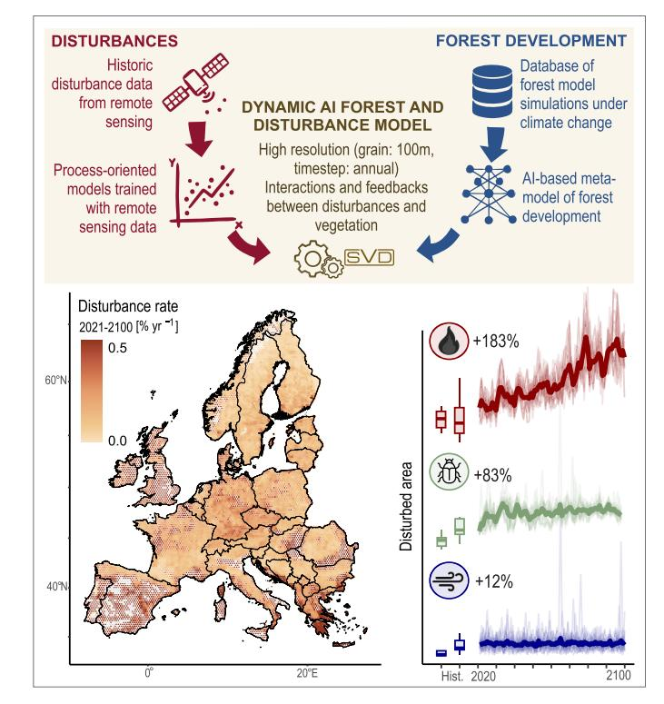
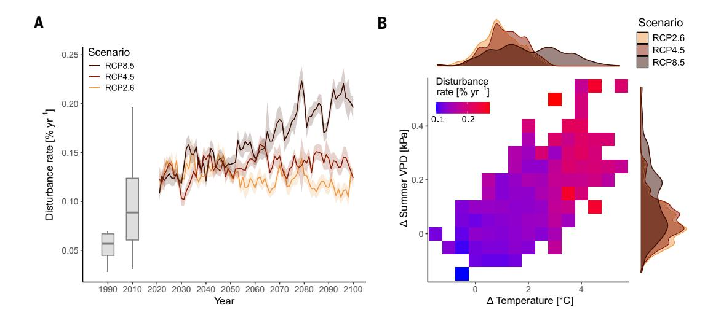
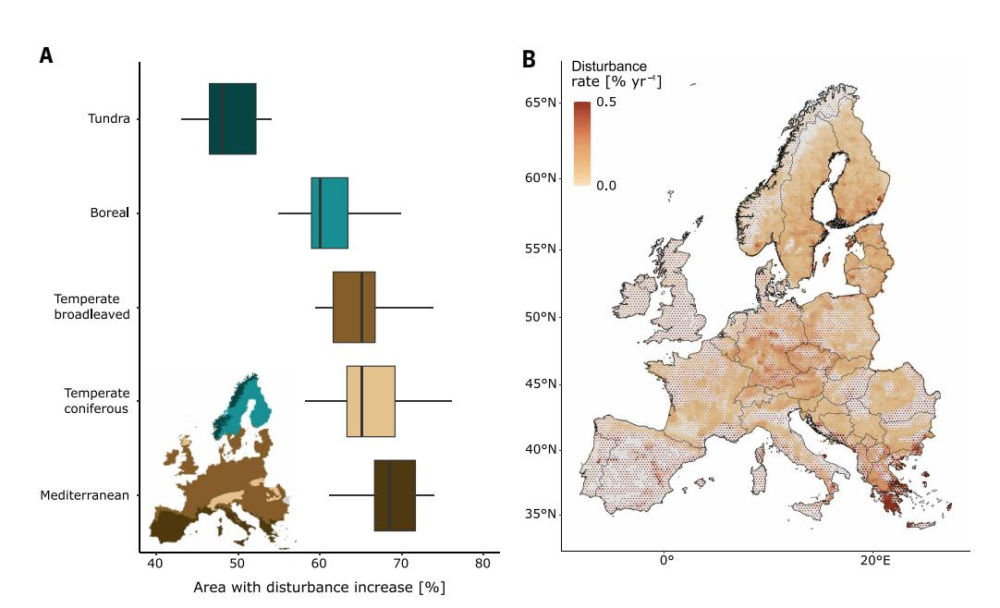
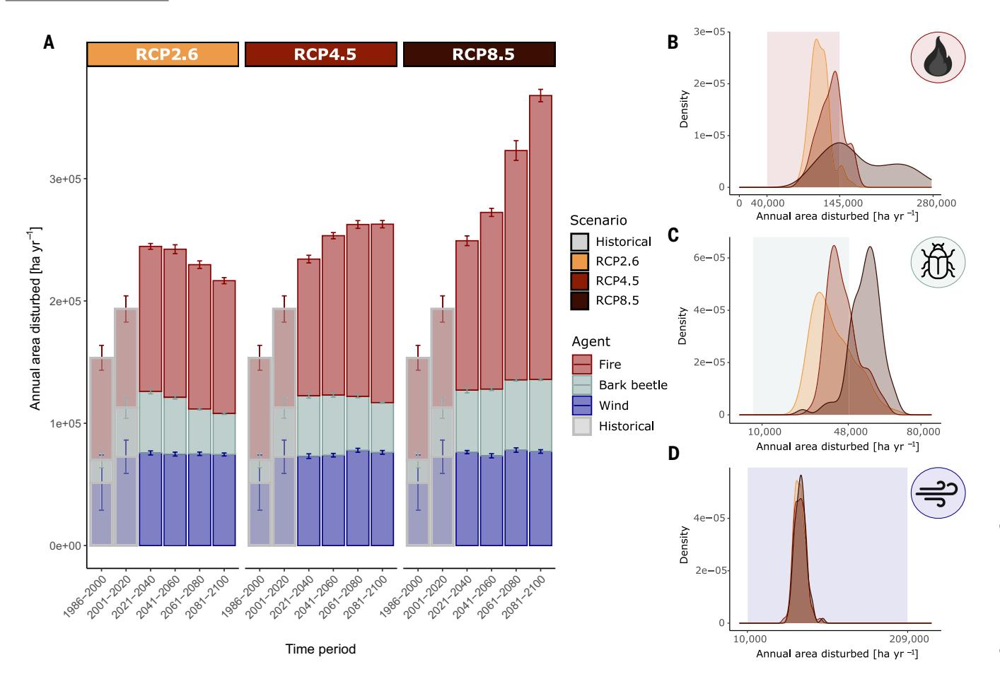
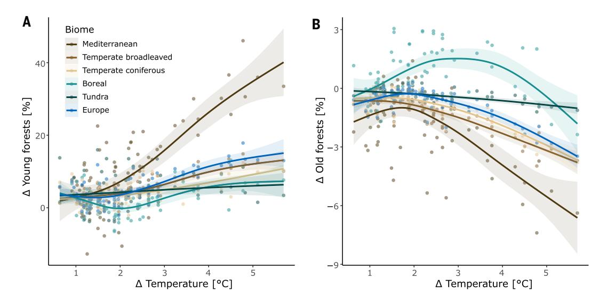

#### RESEARCH ARTICLE SUMMARY

#### **FOREST ECOLOGY**

## Climate change will increase forest disturbances in Europe throughout the 21st century

Marc Grünig et al.

Full article and list of author affiliations: https://doi.org/10.1126/science.adx6329

**INTRODUCTION:** Forests across the globe face increasing risks from natural disturbances such as wildfires, insect outbreaks, and windstorms. These disturbances are highly sensitive to changes in the climate system and have already increased in many parts of the globe recently. Changing disturbance regimes can substantially alter ecosystems, e.g., through changing their demography and habitat value as well as altering the ecosystem services they provide to society. Anticipating potential future disturbance change is thus crucial for forest policy and management. However, projecting future disturbance regimes remains challenging because there are intricate interactions between individual disturbance agents, and feedbacks between vegetation development and disturbance change could considerably dampen or amplify climate impacts.

**RATIONALE:** Here, we present a modeling framework to simulate future trajectories of forest disturbance at high spatial resolution (100  $\times$  100 meters) and across a large spatial extent (187 million hectares of forests in Europe). We leveraged a deep learning-based simulation framework to integrate a large body of local projections made by processbased forest models with climate-sensitive disturbance modules for wildfire, windthrow, and bark beetle outbreaks. Our modeling framework is designed to capture crucial disturbance processes such as the spatial spread of fire and bark beetles across forest landscapes and incorporates disturbance interactions and vegetation feedbacks. Our specific objectives were to quantify potential changes in stand-replacing forest disturbances in Europe until the end of the 21st century under different scenarios of climate change and to assess impacts of disturbance change on Europe's forest demography.

**RESULTS:** Forest disturbances in Europe are highly likely to increase in the coming decades. Simulated future levels of disturbance were higher than those observed for the period 1986 to 2020 under all climate scenarios. Under scenarios of unabated climate change, the simulated area disturbed more than doubled by the end of the century (+122%). In scenarios assuming effective emissions reduction, peak disturbance was reached by midcentury. Wildfire was the disturbance agent most sensitive to changes in the climate system, heavily affecting Mediterranean areas but also expanding into temperate and boreal regions. Vegetation feedbacks dampened climate-induced disturbance change but were not able to completely buffer from disturbance increases. We project profound implications of future disturbance change on Europe's forest demography, with the share of young forests increasing by up to 14% and old forests decreasing by up to 3% relative to simulations without changing climate and disturbance regimes.

**Simulation framework.** Shown is a simulation framework combining processoriented disturbance models trained with remote sensing data and local processmodel simulations in a deep learning—based dynamic forest and disturbance model (top). This framework was used to simulate future forest disturbance regimes in Europe at 100-meter spatial resolution (bottom left) and annual time step (bottom right). Our results show that disturbances in Europe's forests will increase throughout the 21st century (shown here for a scenario of unabated warming).

**CONCLUSION:** The large-scale changes in forest disturbance regimes projected for the coming decades have important implications for biodiversity and the ecosystem services provided by forests. They could, for instance, hamper policy goals of using nature-based solutions for climate change mitigation, further amplifying climate change. Consequently, forest policy and management need to plan for a future with more disturbance. Nonetheless, our results highlight that mitigating anthropogenic climate change remains a potent lever for limiting future disturbance risk and safeguarding forests and their services to society. □

Email: marc.gruenig@swisstph.ch Cite this article as M. Grünig et al., Science 391, eadx6329 (2026). DOI: 10.1126/science.adx6329

Science 5 MARCH 2026 1003

#### **FOREST ECOLOGY**

# Climate change will increase forest disturbances in Europe throughout the 21st century

Marc Grünig1,2,3\*, Werner Rammer1, Cornelius Senf4, Katharina Albrich5,6, Frédéric André7, Andrey L. D. Augustynczik8, Martin Baumann1, Friedrich J. Bohn9,10, Meike Bouwman11, Harald Bugmann12, Alessio Collalti13,14, Irina Cristal15,16, Daniela Dalmonech13,14, Francois De Coligny17, Laura Dobor18, Christina Dollinger1, Josep Maria Espelta19, David I. Forrester20, Jordi Garcia-Gonzalo16, José Ramón González-Olabarria16, Ulrike Hiltner12, Tomáš Hlásny18, Juha Honkaniemi5, Nica Huber12,21, Mathieu Jonard7, Anna Maria Jönsson22, Georges Kunstler23, Fredrik Lagergren22, Marcus Lindner24, Marco Mina25, Christine Moos26, Xavier Morin27, Bart Muys28, Gert-Jan Nabuurs11,29, Mats Nieberg24,30, Marco Patacca11,29, Mikko Peltoniemi5, Christopher P. O. Reyer30, Mart-Jan Schelhaas11,29, Ilié Storms28, Dominik Thom31,32, Maude Toïgo33,34, Rupert Seidl1,35

Wildfires, insect outbreaks, and storms cause large pulses of tree mortality. Climate change amplifies these forest disturbances, yet their future magnitude and extent remain uncertain. Here, we simulated future forest disturbance regimes at 100-meter resolution across Europe using a deep learning—based simulation framework. Our results show that forest disturbances will continue to increase throughout the 21st century, with disturbed areas more than doubling relative to the recent past under an unabated continuation of climate change. Wildfires are the main agent driving future disturbance change. Changing disturbances result in an increase in young forests, substantially altering Europe's forest demography. Because of their profound implications for forest carbon storage and the habitat value of forest ecosystems, disturbances should be a priority of forest policy and management.

Forests around the globe are changing in response to climate change, and increasing tree mortality is one of the most prominent causes of climate-mediated changes in forest dynamics (1-3). Tree mortality often happens in large, discrete pulses called disturbances, which are caused by agents such as wildfires, insect outbreaks, and storms. These disturbances are among the most climate-sensitive processes in forest ecosystems (4) and are therefore expected to respond strongly to ongoing climate change (5-7). New disturbance regimes have already emerged in recent years, e.g., with the occurrence of megafires in Australia (8), North America (9), and Mediterranean Europe (10, 11), or with unprecedented bark beetle outbreaks in North America in 2000 to 2008 (12) and Central and Northern Europe in 2018 to 2022 (13, 14).

Disturbances have profound impacts on forest ecosystems and the services they provide to society. An increase in disturbance can lead to considerably younger and more open forest landscapes (6, 15, 16), with important implications for forest biodiversity (17). Disturbances can also have strong negative impacts on forest ecosystem services. The eruption of bark beetles in North America and Europe in the early 21st century, for instance, has slowed forest carbon uptake (18) and even turned some forests into a carbon source (12). Forest disturbances can thus create feedbacks to the global climate system (19), further amplifying anthropogenic climate change. Massive wildfires are also a direct threat to human lives (20), have strong negative impacts on

human health through effects on air quality (21), and can destroy people's livelihoods, leading to long-lasting socio-economic consequences (22, 23). Understanding the future of forest disturbances is thus of paramount importance for forest policy and management.

Projecting future trajectories of forest disturbance remains challenging for several reasons. First, disturbances alter forest structure and composition, which in turn affect the probability and severity of future disturbances (24). A fire burning through a forest, for instance, may exhaust the available fuel and thus reduce the risk for high-intensity fire in subsequent years (25). Susceptibility to wind increases with tree height (26). If a storm downs the initial cohort of tall trees, the risk of subsequent windthrow is temporally close to zero, even in the event of extreme wind speeds (27). Projecting future disturbances purely based on climate (28-30) therefore disregards negative vegetation feedbacks and is likely to overestimate disturbance change. Second, climate change not only affects tree mortality, but simultaneously alters tree growth, which in turn could influence disturbance regimes (31). Longer vegetation periods and warmer temperatures can, for instance, increase forest productivity in parts of the globe (32). Higher productivity increases fuel loads and canopy heights, elevating the susceptibility to disturbances from wildfire and wind (33, 34). Third, individual agents of disturbance do not occur in isolation but often interact (35). Windthrown conifers, for instance, are the preferred breeding material for aggressive bark beetles in Europe (36). This often leads to eruptions of tree-killing bark beetle populations in the wake of large-scale storm events (37). Quantifying future trajectories of disturbance in isolation for individual agents (29, 30) is thus likely to lead to biased outcomes. As a consequence of these complex interactions and feedbacks, we still lack robust projections of future disturbance regimes at large spatial scale and high resolution.

Here, we projected 21st-century forest disturbance regimes under climate change in Europe, explicitly accounting for disturbance interactions and vegetation feedbacks. Two recent developments enable these high-resolution forest disturbance projections. First, recent advances in remote sensing allow the consistent quantification of disturbances from space across large spatiotemporal scales (38, 39). We here used these advances in the form of annual disturbance rates inferred from Landsat time series for building robust, climate-sensitive models of disturbance from wildfire, bark beetles, and storms for Europe. We developed a disturbance modeling framework that builds on fundamental process understanding of the individual disturbance agents (e.g., by explicitly considering underlying processes such as fire ignition, spread, and vegetation impacts) and trained it with remotely sensed data. Second, advances in deep learning now enable the simulation of climate-driven forest development at high spatial resolution (i.e.,  $100 \times 100$  m for the spatial domain of 187 million ha of Europe's forests), with disturbance-vegetation feedbacks as an emerging property of the simulation, and processes such as spatial contagion explicitly considered (e.g., wildfires and bark beetles spreading from one affected cell to the next). Specifically, we harnessed the wealth of detailed local forest simulations available in Europe [a total of 135 million data points generated from 17 locally parametrized forest models distributed throughout Europe (40)] to train a deep neural network (DNN) of forest development using a feedforward network architecture with 22 layers and three blocks with residual connections. We subsequently used this network to simulate climate- and disturbancedriven vegetation changes in the integrated metamodeling framework Scaling Vegetation Dynamics (SVD) (41), which tracks transitions between a large number of vegetation states, defined by tree species composition, canopy height, and leaf area index. We quantified future disturbance regimes by calculating disturbance rate (i.e., the percentage of forest area that is disturbed annually, with higher values indicating increasing disturbance activity), disturbance rotation (i.e., an indicator of disturbance frequency, giving the mean time needed to disturb an area equivalent to the size of the focal area, with lower values

Science 5 MARCH 2026 1 of 11

indicating increasing disturbance activity), and annual area disturbed (i.e., the absolute area affected by disturbances per year, with higher values indicating increasing disturbance activity). Spatial hotspots were assessed at the level of 25-km hexagons (area: 541.3 km2), and disturbance change was quantified at the continental and biome levels relative to observed disturbances for the period 1986 to 2020. Demographic effects were assessed at the end point of the analysis (year 2100), specifically focusing on young forests (i.e., those affected by high-severity disturbance in the past 10 years) and old forests (i.e., forests not disturbed throughout the simulation and hence >80 years old). All simulations assumed a continuation of business-as-usual forest management. Before addressing our objectives, we conducted a thorough model evaluation. Specifically, we compared simulated annual harvest levels as well as simulated wind, bark beetle, and wildfire disturbances to observations (see supplementary text section "Disturbance modules" for details). Subsequently, we addressed our specific objectives: (i) to quantify stand-replacing disturbance change in Europe at the continental scale until the end of the 21st century for three different representative concentration pathways (RCP2.6, RCP4.5, and RCP8.5); (ii) to identify the location of potential hotspots of future disturbance in Europe; (iii) to assess the specific contribution of individual disturbance agents to overall disturbance change; and

(iv) to evaluate the impact of changing disturbances on the demographic structure of Europe's forests.

#### Results

#### **Future disturbance rates and hotspots**

Disturbance rates across Europe increased throughout the 21st century under all climate scenarios. At the end of the century (2081 to 2100), disturbance rates (summed across all disturbance agents) were substantially higher than in recent decades (1986 to 2020), increasing by up to +122% under RCP8.5 (+61% under RCP4.5 and +31% under RCP2.6) (Fig. 1A). Disturbance rotation decreased nearly by a factor of three under RCP8.5, dropping from an average of 1485 [ $\pm$  756] years to 510 [ $\pm$  36] years (708 [ $\pm$  31] years under RCP4.5, 869 [ $\pm$  51] years under RCP2.6) (fig. S1). The temporal progression of disturbance change throughout the 21st century differed distinctly between climate scenarios: Under a continuation of unabated climate change (RCP8.5), disturbance rates increased throughout the century, peaking at values around 0.2% year-1 in the last decades of the century (Fig. 1A). Conversely, under RCP2.6 and RCP4.5, peak disturbance rates occurred in the 2030s and 2050s, respectively, with declining rates toward the end of the century. Nonetheless, disturbance rates remained above the average values observed in recent decades (i.e., 0.09% year-1 from 1986

Fig. 1. Climate-mediated disturbance change in Europe's forests. (A) Simulated disturbance rates until the end of the 21st century for three different RCP scenarios across all considered disturbance agents. Lines show the mean annual disturbance rate across all simulations for Europe, with the 95% CI area shaded. For reference, gray boxes indicate observed annual disturbance rates derived from remote sensing (1990: 1986 to 2000, 2010: 2001 to 2020), with whiskers extending to 1.5 times the interquartile range. See fig. S1 for simulated disturbance rotations for the three RCPs. (B) Climate sensitivity of disturbance rate. Climate anomalies were calculated relative to the climate of 1986 to 2020 for mean annual temperature and summer (i.e., June, July, and August) VPD. All climate scenarios and simulation years were aggregated and their mean disturbance rate visualized. Marginal density plots indicate the distribution of simulation years over anomalies by RCP scenario. The climate sensitivity of each individual disturbance agent is shown in figs. S2 to S4.

Science 5 MARCH 2026 2 of 11

&lt;sup>1Technical University of Munich, TUM School of Life Sciences, Ecosystem Dynamics and Forest Management Group, Freising, Germany. 2Swiss Tropical and Public Health Institute (Swiss TPH), Allschwil, Switzerland. 3University of Basel, Basel, Switzerland. 4Technical University of Munich, TUM School of Life Sciences, Earth Observation for Ecosystem Management, Freising, Germany. 5Natural Resources Institute Finland, Forest Health and Biodiversity Group, Helsinki, Finland. 6University of Eastern Finland, Faculty of Science, Forestry and Technology, School of Forest Biosphere Futures Research Group, Laxenburg, Austria. 9Helmholtz Centre for Environmental Research UFZ, Leipzig, Germany. 10BaM Nachhaltigkeit Beratung Medien GmbH-VE, Berlin, Germany. 11Wageningen University & Research, Forest Ecology and Forest Management Group, Wageningen, Netherlands. 12ETH Zürich, Forest Ecology, Institute of Terrestrial Ecosystems, Zürich, Switzerland. 13National Research Council of Italy (CNR-ISAFOM), Institute for Agriculture and Forestry Systems in the Mediterranean, Forest Modelling Lab, Perugia, Italy. 14National Biodiversity Future Center (NBFC), Palermo, Italy. 15Departament de Ciències Ambientals, Facultat de Ciències, Universitat de Girona, Girona, Catalonia, Spain. 16Forest Science and Technology Center of Catalonia (CTFC), Solsona, Spain. 17AMAP, INRAE-CIRAD-CNRS-IRD-Univ Montpellier, Montpellier, France. 18Czech University of Life Sciences Prague, Faculty of Forestry and Wood Sciences, Prague, Czech Republic. 19CREAF, Catalonia, Spain. 20CSIRO Environment, Australian Capital Territory, Australia. 21Swiss Ornithological Institute, Sempach, Switzerland. 22Lund University, Department of Physical Geography and Ecosystem Science, Lund, Sweden. 23Université Grenoble Alpes, INRAE, UR LESSEM, Saint-Martin-d'Hères, France. 24European Forest Institute, Bonn, Germany. 25Institute for Alpine Environment, Eurac Research, Bolzano, Italy. 26Bern University of Applied Sciences, BFH-HAFL, Zo

to 2020) throughout the century under all climate scenarios, underlining that disturbance activity will remain high regardless of emissions pathway. Analyzing the climate sensitivity of disturbance regimes in more detail, we found that temperature and summer aridity were main drivers of 21st-century disturbance change (Fig. 1B). Across all climate scenarios, years with strong positive anomalies in temperature and summer aridity were also highly likely to be strong disturbance years (with disturbance rates >0.2% year-1). Vegetation feedbacks considerably dampened disturbance rates. To assess the strength of vegetation feedbacks, we contrasted simulations incorporating these feedbacks (the default in our model) to simulations disregarding vegetation feedbacks. This analysis showed that the probability of a cell being disturbed more than once decreased by a factor of between 2.6 (RCP2.6) and 3.9 (RCP8.5) (see supplementary text section "Vegetation feedback effect") as a result of vegetation feedbacks, highlighting their importance for future disturbance trajectories.

Disturbance rates increased in 76% of the forested hexagons of Europe under RCP8.5 (59% under RCP4.5, 45% under RCP2.6) during the simulation period. Aggregated at the level of biomes, disturbance rates increased in large parts of the Mediterranean biome (89% of the area under RCP8.5, 69% under RCP4.5, and 52% under RCP2.6) (Fig. 2A). In the temperate broadleaved biome (78%, 62%, and 45%, respectively) and the temperate coniferous biome (80%, 55%, and 45%, respectively), disturbance rates increased under RCP8.5 and RCP4.5 but decreased moderately under RCP2.6. In the boreal forest (63%, 50%, and 46%, respectively) and tundra (57%, 47%, and 36%, respectively), disturbance rates only increased throughout most of the biome under RCP8.5. The spatial distribution of disturbance rates showed that hotspot areas with particularly high disturbance rates (i.e., >0.3% year-1, which is more than three times the average disturbance rate observed at continental scale for past decades) emerged in all major biomes, from southern Finland to Germany and Greece (Fig. 2B; see figs. S5 and S6 for the other RCP scenarios). The main hotspots of disturbance change relative to 1986 to 2020 were along the coastline of the

Mediterranean Sea, in western France and the British Isles, as well as in the Carpathian mountains (figs. S7 to S9).

#### Agents of disturbance change

Increasing wildfires contributed most strongly to 21st-century disturbance change in Europe. Mean annual area burned increased from  $82,016 \text{ ha year}^{-1}$  (1986 to 2020) to  $232,061 \pm 9924 \text{ ha year}^{-1}$  [95% confidence interval (CI)] under RCP8.5 until the end of the 21st century (2081 to 2100) (RCP4.5:  $145,856 \pm 5870$  ha year-1, RCP2.6:  $108,580 \pm$ 4907 ha year-1) (Fig. 3A). The level of burning that historically constituted an extreme fire year (i.e., above the 90th percentile of observations for 1986 to 2020, 144,779 ha year-1) was exceeded every year at the end of the century (i.e., 2081 to 2100) under scenario RCP8.5 (return period 1.01  $\pm$  0.00 years) (Fig. 3B). Under RCP4.5, historical extreme fire years occurred on average every other year at the end of the century (2.14 ± 0.03 years). Bark beetle disturbances also contributed distinctly to increasing 21st-century forest disturbances. The annual area disturbed by bark beetles increased from 32,251 ha year-1 observed between 1986 and 2020 to  $58,923 \pm 1,599$  ha year-1 at the end of the century (RCP8.5) and still reached  $40,714 \pm 1,052$  ha year-1 under scenario RCP4.5. Under scenario RCP2.6, bark beetle disturbances increased in the first decades of the simulation, peaking at  $46,424 \pm$ 2899 ha year-1 in the period 2021 to 2040, and then decreased to 33,512  $\pm$ 1539 ha year-1 at the end of the century. Historical extreme bark beetle disturbances (48,396 ha year-1) occurred every other year by midcentury in all climate scenarios (return periods of between  $1.42 \pm 0.03$  years and  $2.50 \pm 0.04$  years across all scenarios) (Fig. 3C). At the end of the century, scenarios diverged, with historical extreme values occurring every year under scenario RCP8.5 (1.10  $\pm$  0.01) and return periods between 6 and 11 years for the other climate scenarios. Bark beetle disturbances were highly sensitive to interactions with windthrows. These interactions were responsible for 31% of the total simulated area disturbed by bark beetles across all scenarios (see supplementary text section "Disturbance interaction effect"). However, wind disturbances

Fig. 2. Spatial patterns of future forest disturbance. (A) Percentage of area (expressed as the share of 25-km hexagons within a biome) for which disturbances increase under scenario RCP8.5 [biome information was obtained from Olsen et al. (107)]. The whiskers extend to 1.5 times the interquartile range across all simulations conducted under RCP8.5 (n = 30). (B) Simulated 21st-century disturbance rates under scenario RCP8.5 (see figs. S5 and S6 for other scenarios). Values show the mean disturbance rate across all simulation years (2021 to 2100) (see figs. S7 to S9 for spatial patterns of disturbance change between 2021 to 2030 and 2091 to 2100). The size of the points corresponds to the share of forest area in each 25-km hexagon. For the sake of visualization, we capped disturbance rates at 0.5% year-1 (i.e., the 83rd percentile of the data). Gray areas mark nonforest hexagons.

Science 5 MARCH 2026 3 of 11

Fig. 3. Agents of disturbance change. (A) Annual area disturbed by agent and climate scenario. Historical records (shaded), including attribution to the three disturbance agents, are observed values and were obtained from Senf and Seidl (79) and Seidl and Senf (96). Error bars give the SE across all years of the time period. (B to D) Density distributions of annual area disturbed in 2021 to 2100 by agent and climate scenario. Each distribution contains all simulation years for the given RCP. The range between the 10th and 90th percentile of historical values (1986 to 2020) is shown as a shaded rectangle [derived from Senf and Seidl (79) and Seidl and Senf (96)]. We used data from Patacca et al. (2) to calculate the proportional contribution of bark beetles and wind, enabling us to disentangle the disturbance shares of the two agents per year. Because no data were available for the year 2020, disturbed area for bark beetle and wind were omitted for that year in this analysis. See also figs. S10 to S15 for disturbance rate maps of the individual agents and figs. S16 to S18 for time series of annual disturbed area per agent.

themselves remained relatively stable throughout the 21st century resulting from a lack of robust future wind projections and the assumption of unchanged wind climate. Wind disturbances nonetheless increased slightly in all scenarios as a result of changing forest structure to between 74,485  $\pm$  2417 ha year-1 and 76,920  $\pm$  2843 ha year-1 at the end of the century (relative to 1986 to 2020: 68,537 ha). The return periods of historical extreme values (208,738 ha year-1) decreased slightly under all climate change scenarios, with values ranging from 12.86  $\pm$  0.15 years (RCP4.5, 2061 to 2080) to 21.00  $\pm$  0.00 years (RCP8.5, 2081 to 2100) (Fig. 3D).

#### Impacts on forest demography

Climate-mediated increases in disturbance activity distinctly altered Europe's forest demography. At the end of the century, the proportion of young forests (i.e., forests disturbed or harvested in the past 10 years) compared with baseline simulations (i.e., 80 years simulated under historical climate and disturbance regimes) increased by between 0.4% (RCP2.6) and 14.2% (RCP8.5). Generally, with warmer climate, the number of young forests increased (Fig. 4A). This effect was strongest in the Mediterranean biome, where warming beyond 2°C nonlinearly increased the number of young forests by up to 34% at a warming level of 4°C compared with baseline simulations. In the temperate and tundra biomes, young forests increased linearly with warming, whereas

no climate response was found in the boreal biome. As the number of young forests increased, the number of old forests (i.e., forests not disturbed or managed for at least 80 years) decreased with warming by between 0.8% (RCP2.6) and 2.9% (RCP8.5) at the end of the century compared with baseline simulations. Particularly Mediterranean and temperate biomes lost old forests with warming, with accelerating losses beyond warming levels of 2°C. By contrast, the number of old forests increased moderately in the boreal biome up to a warming level of  $\sim\!\!3^\circ\mathrm{C}$  (Fig. 4B).

#### **Discussion and conclusions**

We present a high-resolution analysis on future forest disturbance change at continental scale, harnessing a simulation framework that explicitly considers disturbance interactions and vegetation feedbacks. Our results show that forest disturbances in Europe will continue to increase over the coming decades under all climate scenarios. Moreover, disturbances are likely to reach unprecedented levels in the second half of the century if climate change continues unabated. To contextualize the future disturbance levels reported here, it is important to note that our baseline period for calculating change (1986 to 2020) already saw the highest level of disturbances in at least 170 years (42). Our findings are consistent with general expectations of increased disturbance activity under climate change (4) and with previous modeling

Science 5 MARCH 2026 4 of 11

Fig. 4. Changes in Europe's forest demography under altered climate and disturbance regimes. (A) Changes in young forests with warming. Young forests were here defined as forests <10 years of age. (B) Changes in old forests with warming. Old forests were here defined as forests not disturbed or harvested after the year 2020, i.e., forests >80 years of age (see also figs. S19 to S21). For a sensitivity analysis of different definitions of young forests, see fig. S22 and table S2. Each point represents the value of a unique simulation and 10-year time step. Change values were calculated relative to simulations under historical climate and disturbance regimes. Model fits are plotted with 95% CI (shaded). For demographic responses to changes in VPD, see fig. S23.

studies that projected such increases under climate change for wildfire and bark beetles (28, 30, 43). Specifically, we show that wildfire is the agent most strongly driving future disturbance change, particularly in Mediterranean Europe (28, 44). However, our analyses indicate that wildfires will also increase in the temperate and boreal biomes (45, 46), indicating the emergence of new disturbance regimes in areas where fire was less prevalent previously. The second agent contributing strongly to disturbance change, particularly in the temperate biome, was bark beetles. The high climate sensitivity of bark beetles found here is consistent with observations, with bark beetle infestations erupting across Central Europe (13) in recent years in response to warmer temperatures and prolonged periods of drought, accelerating the life cycle of the beetle (47) and decreasing the ability of trees to defend against bark beetle attacks (48). A particularly interesting finding is that under moderate warming, negative vegetation feedbacks could eventually dampen disturbances from bark beetles (43, 49) while they continue to increase under unabated climate change (RCP8.5).

Important limitations need to be considered when interpreting our findings. First, because our focus was solely on the effects of climate on disturbances, we assumed a continuation of business-as-usual management in our simulations. Therefore, management approaches such as changing forest structure and composition to reduce disturbance risks (50, 51) were not considered here. Furthermore, we note that high uncertainties remain regarding the development of future wind extremes (52). Because of these uncertainties, we here assumed no directional change in the future wind climate. The moderate increase in wind disturbance rates reported here thus results from an indirect effect of a changing forest structure on the susceptibility to wind. Because wind was historically the most important disturbance agent in Europe (2) and wind disturbances strongly interact with bark beetles (37), even small changes in future wind extremes could have a large impact on Europe's disturbance regime. We also note that we here only considered stand-replacing disturbances (i.e., disturbances with high severity) while disregarding low-severity disturbance events. Low-severity disturbances are ecologically important in many forest ecosystems (53), yet they remain difficult to detect through remote sensing (39). Finally, we here focused on the single most important biotic disturbance agent in Europe, the European spruce bark beetle Ips typographus L. and disregard other herbivores that can cause tree mortality (54). Notably, we also did not consider the potential spread of non-native pest species, which could be facilitated by climate change (55, 56). Thus, the estimates reported here are likely conservative. Notwithstanding these limitations, the extensive evaluations conducted show that our approach was well able to reproduce recent disturbance regimes in Europe (see supplementary text section "Disturbance modules"), lending support to our results.

Our findings have important implications for forest policy and management. First, they highlight that a further increase in forest disturbances in the coming decades is highly likely, underscoring the imperative of adapting to disturbance change. This could be done, for instance, by fostering mixed forests of climate-adapted tree species (57, 58) because such forests have increased resilience to high severity disturbance. Furthermore, managing for structurally complex and uneven-aged stands has proven effective to buffer the impacts of wind and bark beetle disturbances (50, 59). The fact that disturbance hotspots emerge throughout the continent in our simulations highlights that disturbance change is a pan-European issue that requires attention at supranational scale (60) but also highlights the importance of regionally adapted strategies and policies for addressing this challenge (61). Our fine-grained analysis of spatial disturbance patterns also indicates that some areas might serve as future disturbance refugia (62), e.g., the forests of Europe's high North and the Mediterranean mountain ranges (e.g., Pyrenees, Apennine). Highlighting demographic effects as one important impact of disturbance change, we here show that Europe's forests could become younger and more open in the future. This is consistent with general expectations (6, 15, 16) and highlights that increasing disturbance activity could distinctly alter the face of Europe's forests. These changes could, for instance, affect forest carbon storage (63, 64) and reduce the carbon sink strength of Europe's forests (65), disrupt timber markets (23, 66), and challenge the transition to a forestbased bioeconomy (67). They furthermore have important implications for biodiversity, potentially increasing overall species richness because recently disturbed forests harbor very high levels of biodiversity (17, 68, 69) while negatively affecting species that are particularly adapted to old forests (70). Forest-related policies should take these findings into account, e.g., when considering the contribution of forest carbon sinks to the European Union's climate ambition (71) or when setting aside protected areas to fight biodiversity loss (72). We conclude

Science 5 MARCH 2026 5 of 11

that changing forest disturbance regimes are a major challenge for forests in the 21st century. Disturbance change needs to be explicitly considered in forest policy and planning to safeguard important ecosystem functions and services. Finally, effective mitigation of anthropogenic climate change is key for preventing unprecedented forest disturbances and their negative impacts.

#### **Materials and methods**

To project future trajectories of forest disturbance accounting for agent interactions and vegetation feedbacks, we developed an integrated simulation framework consisting of two major components: (i) simulations of undisturbed forest development through a deep learning-based model trained on a large dataset of harmonized, local-scale forest process model simulations and (ii) disturbance modules for the agents wildfire, bark beetle outbreaks, and wind, combining process understanding and empirical data from remote sensing to model the occurrence and impact of disturbances contingent on climate and vegetation conditions. As a framework for integrating these two components, we used the meta-model SVD (41), which is able to track forest development and disturbances, as well as their interactions and feedbacks, at high spatiotemporal resolution (100 × 100 m, annual time step) at continental scale. Below, we describe all of the components of our simulation framework in more detail. An overview of our conceptual approach and analysis steps is given in the supplementary text and fig. S25.

#### **SVD** framework

At its core, SVD follows a state and transition approach (73) to simulate vegetation and disturbance dynamics, where vegetation is classified into discrete states and transitions between states are probabilistic. However, SVD differs from classical state and transition models in at least two fundamental ways: the consideration of a very large number of vegetation states and the estimation of transition probabilities through artificial intelligence, based on a large body of underlying simulation data. This data-driven approach is a key innovation of the framework: Instead of relying on transition rules defined by human experts, SVD "learns" the probabilities of vegetation transitions directly from a large database of simulated forest data, creating a representation of complex ecosystem dynamics that is scalable across large spatial domains. The SVD framework thus acts as a metamodel, integrating the complex response of ecosystems to environmental drivers from underlying process models.

In SVD, vegetation states in a given cell are characterized as unique combinations of three dimensions: tree species composition, canopy height, and leaf area index (LAI). These three variables were chosen as state variables of the model because they broadly represent different dimensions of forest ecosystems [i.e., their composition, structure, and functioning (74)] and because they can be consistently derived from remote sensing across large spatial scales (see below). To create the discrete state space used in this study, canopy height was categorized into 2-m bins of dominant canopy height (from zero to 50 m) and leaf area index into three classes: LAI < 2 m² m², 2  $\leq$  LAI  $\leq$  4 m² m², and LAI > 4 m² m²). Species composition was discretized by dominant species (representing  $\geq$ 66% of stand basal area) and/or up to four co-occurring species (with a proportion of basal area of at least 20%). For the current application of the model, 5445 unique forest states were defined to represent the forest ecosystems of Europe in SVD.

Transitions between states can happen through two conceptually distinct pathways. Slow transitions occur regularly and result in gradual changes, such as those from tree growth and regeneration. These are simulated using a dedicated DNN trained to predict the next state and the timing of the transition based on the current state and environmental drivers such as climate and soil conditions. By contrast, fast transitions are discrete in space and time and have the potential for abrupt changes that reset stand development, such as tree mortality from disturbance or harvesting. These events are simulated by dedicated

process-oriented modules of disturbance (considering wildfire, the European spruce bark beetle *I. typographus* L., and wind) and forest management. The approaches to modeling slow and fast transitions are described in more detail in the following sections. For a more detailed description of SVD, we refer to Rammer and Seidl (41) and Grünig *et al.* (75).

#### Slow transitions: A DNN of forest development

To simulate slow transitions of forest development in the absence of disturbance and management, we trained a DNN on simulation data from local process models. The empirical foundation for the DNN was a harmonized dataset of local process-model simulations throughout Europe. Specifically, the dataset comprised 1.1 million harmonized forest simulations from 17 locally validated models for 13,600 locations across Europe [a total of  $135 \times 10^6$  simulation years (40, 76)]. Continuous simulation outputs were transformed into the discrete forest states considered in SVD and the transitions between them.

The DNN was designed to predict two outputs for each grid cell: the target state (i.e., which state the cell will transition to next) and the target time (i.e., the number of years until this transition occurs, focusing on a 10-year forecasting window). Both predictions are contingent on the current state and its residence time (i.e., the time elapsed since the last transition) as well as the prevailing soil conditions [i.e., water-holding capacity (WHC), soil texture, soil depth, and plant-available nitrogen] and climate conditions [i.e., temperature, precipitation, radiation and vapor pressure deficit (VPD); see supplementary text section "Climate data" for more details]. In addition, the DNN includes a dynamic memory of the three previous state transitions and respective residence times, allowing the model to account for the influence of a forest stand's past trajectory on its future development.

The chosen DNN architecture was a feedforward neural network comprising 6.6 million trainable parameters structured in 22 layers and three blocks with residual connections and implemented using the TensorFlow (77) and Keras (78). It considered 5445 discrete forest states and 10 classes of target times (10-year forecasting window). The trained DNN demonstrated strong predictive capabilities in the model tests undertaken. For the validation dataset, it correctly predicted the target state after transition with an accuracy of 86.9%. Predicting the exact timing of a transition was more challenging (61.1% accuracy). However, the true time to transition fell within the top two classes predicted in 79.3% of cases, and the true target state was within the top two most probable predictions in 95.4% of cases (see supplementary text section "Meta-model DNN" for more details on model evaluation).

#### Fast transitions: Disturbance and management modules

We developed disturbance modules for simulating the major European disturbance agents wildfire, bark beetles, and wind, together accounting for 87% of all disturbances that occurred over the past 70 years (2). Our disturbance modules combine process understanding with the latest continental-scale remote sensing information, allowing us to capture the climate sensitivity of disturbances as well as their complex interactions with vegetation. The modules are briefly described below. For additional information on algorithms, datasets, and evaluation exercises, see supplementary text section "Disturbance modules."

The wildfire module simulates the processes of ignition and spread of wildfires using a two-step approach. First, a time series of fire events (i.e., ignition, locations, and the maximum size of a fire) was generated statistically and, second, those events were dynamically simulated within SVD. The statistical modeling step links historical fire events from remote sensing (79, 80) with environmental information. To create a robust training data set from the remotely sensed disturbance maps, we first aggregated individual fire disturbance patches into larger fire complexes by combining patches from the same year <150 m apart following the methodology of Grünig  $et\ al.\ (30)$ . We then modeled the number of fire complexes per year on a  $100\times100\ km\ grid.$ 

Science 5 MARCH 2026 6 of 11

Specifically, we calibrated a linear mixed-effects model with negative binomial error distribution (to account for overdispersion in count data) to quantify the relationship between fire frequency and VPD. For each ignition generated by the frequency model, a spatial location was then determined using a separate spatial probability model that incorporated factors influencing ignition, such as population density (81), lightning density (82), topography [i.e., elevation, slope, and aspect derived from a global digital elevation model (83)], distance to waterbodies (derived from Copernicus CORINE landcover data (84)], and climate [i.e., mean temperature, precipitation, and temperature seasonality from the 1981 to 2010 period (85)]. Further, for each ignition, maximum fire size was estimated based on a relationship between observed fire sizes and local VPD (30). This series of statistically predicted fire events was then used to drive dynamic fire spread in SVD. The spread mechanism is a probabilistic cellular automaton (86) in which the probability of fire spreading from a burning cell to its neighbors is calculated based on fuel availability (derived from the current vegetation state), wind conditions, and topography. Fires stop burning when they run out of fuel or when they reach the statistically determined maximum fire size, thus explicitly accounting for the dampening feedback of fuel limitation. See supplementary text section "Fire module" for more details.

The bark beetle module models outbreaks of tree-killing insects based on climate-mediated beetle population growth, spread of beetles from an initial outbreak spot, and vegetation predisposition to beetle attack. We here focused solely on the European spruce bark beetle (I. typographus L.), which is the single most important biotic disturbance agent in Europe (2). Beetle pressure was modeled mechanistically by first calculating the number of potential beetle generations completed per year using an approach based on the PHENIPS model (87). This phenology model uses daily data on minimum and maximum temperature, radiation, and latitude to determine voltinism. Highergeneration numbers under warmer conditions lead to higher beetle pressure, which in turn determines the size of dispersal kernels used for spread (88). Winter mortality was also explicitly modeled as a function of the number of days with minimum temperatures below a critical threshold of -15°C. A key feature of the module is that outbreaks are not predetermined events but emerge dynamically from the interaction of beetle pressure and forest conditions. Infestations are initiated probabilistically, driven by a combination of a regional background infestation probability, host tree presence [with *Picea abies* (L.) Karst of at least 10 m in height being the sole host tree of the insect], and climate-dependent drought stress, which is approximated by summer VPD (89). Moreover, the presence of windthrown trees increases the probability of bark beetle infestation because these trees have a low defense capacity against beetles. To initiate bark beetle activity, we calculated a background outbreak probability, defined as the annual likelihood of a bark beetle outbreak occurring in a given cell in the absence of a local outbreak. This probability was constrained to the current distribution range of Norway spruce [according to Brus et al. (90)] and approximated based on data derived from the European disturbance map (39). Because bark beetle and wind disturbances could not be separated in the remotely sensed data, we used data from Patacca et al. (2) to calculate the proportional contribution of bark beetles and wind to reported damages, enabling us to disentangle the disturbance proportion of the two agents per year. Once an outbreak is established, beetles spread from infested cells based on generationdependent dispersal kernels and host susceptibility. The specific shape of the symmetric dispersal kernels was derived from empirical data (91), with an exponentially decreasing spread probability with increasing distance from the source cell. Each forest state has a specific susceptibility to bark beetle attack, derived mainly from the proportion of the host tree species on the cell as well as canopy height as a proxy for tree size (92). Moreover, interactions between wind disturbances and bark beetle outbreaks were considered explicitly: Cells of the host

tree Norway spruce affected by wind events in the previous year exhibit increased susceptibility to bark beetle attacks. The impact of bark beetles on infested cells is influenced by a combination of a base mortality rate, cold spells, and the elapsed time since the initiation of the local outbreak. This approach represents the effect of density-dependent feedbacks in the bark beetle population, as well as the effect of antagonists on population development, and results in realistically pulsed outbreak dynamics. See supplementary text section "Bark beetle module" for more details and model evaluation.

The wind module simulates the effects of storm occurrence and disturbance spread. Similar to the wildfire module described above, a series of storm events (i.e., number, location, and extent) throughout Europe were determined statistically based on historical windthrow data (39). We first identified discrete storm events from the raw disturbance maps by connecting neighboring disturbed cells (i.e., 10-km grid cells where at least one disturbed 30-m pixel was included) using a queen-contiguity algorithm. The annual number of storms and their extent (i.e., the number of 10-km grid cells) and severity (defined as the relative area affected by disturbance) were then determined by sampling from the statistical distribution of historical events. To determine the location for each storm event, we modeled the spatial probability of occurrence using a binomial generalized additive model (GAM). Key predictors for this GAM, 5-year wind speed return intervals and maximum storm gusts, were obtained from a comprehensive pan-European storm reanalysis database (93), which represents historical storm conditions across Europe. Once a storm event occurs in SVD, the spread of wind disturbance is simulated dynamically. The simulation starts by identifying the most susceptible 100-m cells as starting points for the disturbance within the storm's footprint (i.e., of one or more 10-km cells). Stand susceptibility to wind was defined as a function of species composition and tree height (27). From these initial points, the disturbance spreads using a neighborhood-based approach. The probability of a neighboring cell being affected is influenced by its own susceptibility, but also by its proximity to edges created by already affected cells (94), thus explicitly accounting for spatial contagion in windthrow events. See supplementary text section "Wind module" for more details.

The disturbance modules were integrated into the SVD framework and operate on annual time step and  $100 \times 100$  m spatial resolution. We here only considered high-severity disturbances from all agents; if a cell was affected, then the impact of the disturbance was simulated as a reset of the vegetation to an early seral state (i.e., lowest tree height and leaf area index values within the state space considered) with the same tree species composition as the predisturbance state. The exception to this rule were the host-specific effects of bark beetles: In mixed stands, only the host tree species Norway spruce was affected, altering the postdisturbance species composition.

Most of Europe's forests are managed (95), and management distinctly influences forest structure, which in turn determines susceptibility to disturbance. It was thus important to also simulate forest management to derive realistic future disturbance projections for Europe. To that end, we implemented a forest management module into SVD. The intention was not to capture the nuances of forest management across Europe nor to simulate innovative management approaches aimed at climate change adaptation. Rather, the management implemented here provides a counterfactual basis for the assessment of disturbance change, serving as a baseline for disturbance analyses by keeping management constant at the historical default. Because even-aged management remains the most prevailing silvicultural system in Europe (95), we simulated a stand-level management system. We focused on final harvesting only; tending and thinning operations were not considered. To mimic decision-making in timber-oriented forestry, we determined the time of final harvesting based on standlevel principles of growth and yield. A stand became a potential candidate for harvesting once its height increment (i.e., broadly speaking,

Science 5 MARCH 2026 7 of 11

its return on investment, here expressed in terms of height growth) fell below a predefined threshold of 0.5% per year, a value derived from an analysis of yield tables for major European tree species. After this identification of candidate cells for harvesting, interventions were implemented probabilistically with a base probability of 0.33 assigned to candidate stands. Stands with trees taller than 30 m received priority for harvesting (expressed as increased probabilities), mimicking the risk reduction behavior of forest managers, particularly in the context of wind and bark beetle disturbances (27). To avoid unrealistically large pulses of management at the start of the simulation, a burn-in period gradually scaled management probabilities and a regional cap limited harvested area to 1.25 times the observed maximum from remote sensing data at regional scale (100  $\times$  100 km). Stands scheduled for harvesting were also determined at a regional scale to account for local variations in tree growth across different regions, such as the lower growth rates typical for the Mediterranean region compared with other parts of Europe. Because our management regime was designed to broadly represent the business-as-usual of current management, we assumed no management-related changes in tree species composition over the current status quo. Furthermore, forest area was time invariant in our simulations, i.e., we did not simulate transitions to nonforest states. To ensure that the forest structures emerging from the thus-simulated management were realistic, we compared simulations with independent estimates of harvested area from remote sensing data (96). We found good agreement between simulation and observation; the median annual harvested area from historical records (1.037 million ha) was well represented in our historical simulation runs (median 1.056 million ha). See supplementary text section "Management module" for further details.

#### Model initialization and drivers

High-resolution simulations of future forest and disturbance regimes require wall-to-wall information on both the initial state of the vegetation and its drivers (i.e., climate and soil data). Our simulations were initialized with the state of the vegetation in the year 2020. Forest area was defined by a forest mask derived from Copernicus Land Monitoring Service data (97). To determine SVD states for each  $100 \times 100$  m cell, we combined multiple data sources. For canopy height, we used a high-resolution canopy height map derived from a deep learning-based fusion of Sentinel-2 and Global Ecosystem Dynamics Investigation (GEDI) space-borne LiDAR (98), which we then aggregated from the native 10-m resolution to 100-m resolution using the 80th percentile to approximate dominant stand height. For LAI, we calculated the yearly maximum from MODIS data (99) over 3 years (2019 to 2021) and downscaled to 100-m resolution using bilinear interpolation. For species composition, we combined tree species maps (90) with highresolution species distribution models (100) to assign proportions of 23 tree species, which were then downscaled from 1-km to 100-m resolution using a sampling algorithm informed by local potential species diversity. Finally, these three layers were combined to assign a discrete forest state to each grid cell. Whenever a state created in this way was not contained in the state space of the DNN training data, we assigned it to the most similar state available using a dedicated mapping algorithm. For more details, see supplementary text section "Initialization of forest vegetation."

EURO-CORDEX climate data (85) were used to characterize climate conditions until the end of the century in different climate scenarios. Daily climate data for temperature, precipitation, relative humidity, and solar radiation were compiled for three scenarios, RCP2.6, RCP4.5, and RCP8.5, representing increasing severity of climate change, as well as for historical climate, and used for model evaluation and as counterfactual scenario to determine climate change effects on forest demography (years 1981 to 2010, sampled with replacement). Across Europe, the three RCP scenarios project increasing mean annual temperature (+4.25°C under RCP8.5, +2.18°C under RCP4.5, and +1.35°C

under RCP2.6) and increasing VPD (+0.29 kPa under RCP8.5, +0.11 kPa under RCP4.5, and +0.06 kPa under RCP2.6) until the end of the century (2081 to 2100) compared with the historical baseline period (1986 to 2020) (table S3). Each RCP scenario was simulated with three global circulation models (GCMs), MPI-M-MPI-ESM-LR (101), ICHEC-EC-EARTH (102), and NCC-NorESM1-M (103), all downscaled with the RCM SMHI-RCA4 (104), resulting in nine climate change scenarios and three historical scenarios. GCMs were selected based on the GCMeval tool (105) and represent rather conservative change in temperature and precipitation (see supplementary text section "Climate data" for more details). VPD was calculated from relative humidity and air temperature. All climate data were aggregated to monthly and yearly averages for subsequent use in SVD. Soil conditions were quantified through effective soil depth, soil texture (sand, silt, and clay content), WHC, and soil fertility, with the latter approximated by plant-available nitrogen. Data on soil depth, texture, and WHC were obtained from the European Soil Data Centre (ESDAC) (106). Plant-available nitrogen was derived from nitrogen stocks and a pseudomineralization rate determined through inverse modeling [see (40) and supplementary text section "Soil conditions" for details]. All soil variables were kept time invariant throughout the simulations.

#### Analyses

We ran 10 replicated simulations for each of the four forcing scenarios (three RCP scenarios plus historical climate) and three GCM scenarios, resulting in a total of 120 simulated future trajectories. Scenario simulations were run for 80 years from 2021 to 2100. Disturbance rates were calculated as the percentage of forest area disturbed based on simulated area disturbed at the  $100 \times 100$  m grid cell level. Disturbance return period was calculated by dividing the forest area by the annual area disturbed, i.e., describing the amount of time needed until the cumulative area disturbed equals forest area. All calculations were done at the level of individual disturbance agents, which were subsequently summed to derive metrics for overall disturbances. As reference values for assessing disturbance change, we used remotely sensed observations for the period 1986 to 2020 (39). Changes in disturbance rates were assessed at the continental and biome levels (107).

To evaluate the performance of the integrated simulation framework, we adopted a consistent strategy across all modules: We ran the full SVD model under historical climate conditions (sampling from the 1981 to 2010 period with replacement) and compared the distributions of simulated annual disturbed area against historical remote sensing records. This approach confirmed that simulations corresponded well with observations. For instance, the simulated time series of fire events showed good agreement with observations for both the number of fires (r=0.95) and burned area (r=0.71). For bark beetles, the simulations correctly reproduced the elevated disturbance levels of the early 21st century, with the simulated median annual area disturbed of 33,871 ha corresponding well with the observed outbreak activity in 2001 to 2020 (observed median 29,046 ha).

We conducted specific experiments to quantify the effects of key feedbacks and interactions within the model. To quantify the impact of vegetation feedbacks on simulated disturbance regimes, we compared simulations with dynamic vegetation (i.e., where vegetation states changed in response to disturbance) against simulations in which the initial forest state was kept static (i.e., with no feedback from disturbances on vegetation state). To quantify the effect of disturbance interactions, we focused on the link between windthrow and subsequent beetle outbreaks. We ran simulations in which this interaction was experimentally turned off in the model and compared them with the full model (see supplementary text sections "Vegetation feedback effect" and "Disturbance interaction effect" for more details).

For the analyses of disturbance hotspots and demographic impacts, results were aggregated to 25-km hexagons (area: 541.3 km2). We excluded hexagons with <5% forest area from the analyses. Demographic

Science 5 MARCH 2026 8 of 11

impacts were analyzed at the end of the simulation (year 2100). Reference values to determine the effects of changing climate and disturbance regimes on forest demography were derived from simulations under historical climate and disturbance (i.e., baseline simulations). Specifically, we focused on two age classes of particular interest in the context of disturbances in our analyses of demographic effects: young forests (i.e., disturbed or harvested within the past 10 years) and old forests (i.e., cells that were neither disturbed nor harvested throughout the entire 80-year simulation period and are thus more than 80 years old). A sensitivity analysis on other thresholds for defining young forests can be found in fig. S22 and table S2. All data were analyzed at the level of RCP scenarios, averaging over GCMs and replicates. All statistical analyses were performed in R (108) primarily using the R packages "terra" (109), "sf" (110), and "tidyverse" (111).

#### **REFERENCES AND NOTES**

- N. McDowell et al., Drivers and mechanisms of tree mortality in moist tropical forests. New Phytol. 219, 851–869 (2018). doi: 10.1111/nph.15027; pmid: 29451313
- M. Patacca et al., Significant increase in natural disturbance impacts on European forests since 1950. Glob. Chang. Biol. 29, 1359–1376 (2023). doi: 10.1111/gcb.16531; pmid: 36504289
- R. Seidl et al., Forest disturbances under climate change. Nat. Clim. Chang. 7, 395–402 (2017). doi: 10.1038/nclimate3303; pmid: 28861124
- R. Seidl et al., Globally consistent climate sensitivity of natural disturbances across boreal and temperate forest ecosystems. Ecography 43, 967–978 (2020). doi: 10.1111/ecog.04995
- V. H. Dale et al., Climate change and forest disturbances: Climate change can affect forests by altering the frequency, intensity, duration, and timing of fire, drought, introduced species, insect and pathogen outbreaks, hurricanes, windstorms, ice storms, or landslides. *Bioscience* 51, 723–734 (2001). doi: 10.1641/0006-3568(2001)051[0723:CCAFD]2.0.CO;2
- N. G. McDowell et al., Pervasive shifts in forest dynamics in a changing world. Science 368, eaaz9463 (2020). doi: 10.1126/science.aaz9463; pmid: 32467364
- M. G. Turner, Disturbance and landscape dynamics in a changing world. *Ecology* 91, 2833–2849 (2010). doi: 10.1890/10-0097.1; pmid: 21058545
- N. J. Abram et al., Connections of climate change and variability to large and extreme forest fires in southeast Australia. Commun. Earth Environ. 2, 8 (2021). doi: 10.1038/ s43247-020-00065-8
- A. P. Williams et al., Observed impacts of anthropogenic climate change on wildfire in California. Earths Futur. 7, 892–910 (2019). doi: 10.1029/2019EF001210
- T. M. Giannaros et al., Meteorological analysis of the 2021 extreme wildfires in Greece: Lessons learned and implications for early warning of the potential for pyroconvection. Atmosphere (Basel) 13, 475 (2022), doi: 10.3390/atmos13030475
- M. Turco et al., Climate drivers of the 2017 devastating fires in Portugal. Sci. Rep. 9, 13886 (2019). doi: 10.1038/s41598-019-50281-2; pmid: 31601820
- W. A. Kurz et al., Mountain pine beetle and forest carbon feedback to climate change. Nature 452, 987–990 (2008). doi: 10.1038/nature06777; pmid: 18432244
- T. Hlásny et al., Devastating outbreak of bark beetles in the Czech Republic: Drivers, impacts, and management implications. For. Ecol. Manage. 490, 119075 (2021). doi: 10.1016/j.foreco.2021.119075
- S. Kärvemo, L. Huo, P. Öhrn, E. Lindberg, H. J. Persson, Different triggers, different stories: Bark-beetle infestation patterns after storm and drought-induced outbreaks. For. Ecol. Manage. 545, 121255 (2023). doi: 10.1016/j.foreco.2023.121255
- T. A. M. Pugh et al., The anthropogenic imprint on temperate and boreal forest demography and carbon turnover. Glob. Ecol. Biogeogr. 33, 100–115 (2024). doi: 10.1111/ geb.13773; pmid: 38516343
- R. Seidl, D. Thom, S. Seibold, M. Maroschek, W. Rammer, Climate change threatens old-growth forests in the Northern Alps. *Environ. Res. Lett.* 20, 094057 (2025). doi: 10.1088/1748-9326/adf861
- T. Hilmers et al., Biodiversity along temperate forest succession. J. Appl. Ecol. 55, 2756–2766 (2018). doi: 10.1111/1365-2664.13238
- G.-J. Nabuurs et al., First signs of carbon sink saturation in European forest biomass. Nat. Clim. Chang. 3, 792–796 (2013). doi: 10.1038/nclimate1853
- T. A. M. Pugh, A. Arneth, M. Kautz, B. Poulter, B. Smith, Important role of forest disturbances in the global biomass turnover and carbon sinks. *Nat. Geosci.* 12, 730–735 (2019). doi: 10.1038/s41561-019-0427-2; pmid: 31478009
- M. Burke et al., The changing risk and burden of wildfire in the United States. Proc. Natl. Acad. Sci. U.S.A. 118, e2011048118 (2021). doi: 10.1073/pnas.2011048118; pmid: 33431571
- C. Y. Park et al., Attributing human mortality from fire PM2.5 to climate change. Nat. Clim. Chang. 14, 1193–1200 (2024). doi: 10.1038/s41558-024-02149-1
- S. Meier, R. J. R. Elliott, E. Strobl, The regional economic impact of wildfires: Evidence from Southern Europe. *J. Environ. Econ. Manage.* 118, 102787 (2023). doi: 10.1016/ i.eem. 2023.102787
- J. S. Mohr et al., Rising cost of disturbances for forestry in Europe under climate change. Nat. Clim. Chang. 15, 1078–1083 (2025). doi: 10.1038/s41558-025-02408-9

- R. Seidl, M. G. Turner, Post-disturbance reorganization of forest ecosystems in a changing world. Proc. Natl. Acad. Sci. U.S.A. 119, e2202190119 (2022). doi: 10.1073/ pnas.2202190119; pmid: 35787053
- S. S. Rabin, F. N. Gérard, A. Arneth, The influence of thinning and prescribed burning on future forest fires in fire-prone regions of Europe. *Environ. Res. Lett.* 17, 055010 (2022). doi: 10.1088/1748-9326/ac6312
- A. Zubizarreta-Gerendiain, T. Pukkala, H. Peltola, Effects of wind damage on the optimal management of boreal forests under current and changing climatic conditions. Can. J. For. Res. 47, 246–256 (2017). doi: 10.1139/cjfr-2016-0226
- M. S. Schmidt, M. H. Hanewinkel, G. K. Kändler, E. K. Kublin, U. K. Kohnle, An inventory-based approach for modeling single-tree storm damage Experiences with the winter storm of 1999 in southwestern Germany. *Can. J. For. Res.* 40, 1636–1652 (2010). doi: 10.1139/X10-099
- J. Altman, P. Fibich, V. Trotsiuk, N. Altmanova, Global pattern of forest disturbances and its shift under climate change. Sci. Total Environ. 915, 170117 (2024). doi: 10.1016/ j.scitotenv.2024.170117; pmid: 38237786
- G. Forzieri et al., Emergent vulnerability to climate-driven disturbances in European forests. Nat. Commun. 12, 1081 (2021). doi: 10.1038/s41467-021-21399-7; pmid: 33623030
- M. Grünig, R. Seidl, C. Senf, Increasing aridity causes larger and more severe forest fires across Europe. Glob. Chang. Biol. 29, 1648–1659 (2023). doi: 10.1111/gcb.16547; pmid: 36517954
- C. P. O. Reyer et al., Are forest disturbances amplifying or canceling out climate change-induced productivity changes in European forests? *Environ. Res. Lett.* 12, 034027 (2017). doi: 10.1088/1748-9326/aa5ef1; pmid: 28855959
- H. Pretzsch, P. Biber, G. Schütze, E. Uhl, T. Rötzer, Forest stand growth dynamics in Central Europe have accelerated since 1870. Nat. Commun. 5, 4967 (2014). doi: 10.1038/ ncomms5967; pmid: 25216297
- K. Blennow, M. Andersson, J. Bergh, O. Sallnäs, E. Olofsson, Potential climate change impacts on the probability of wind damage in a south Swedish forest. *Clim. Change* 99, 261–278 (2010). doi: 10.1007/s10584-009-9698-8
- J. G. Pausas, E. Ribeiro, The global fire-productivity relationship. Glob. Ecol. Biogeogr. 22, 728-736 (2013). doi: 10.1111/geb.12043
- B. Buma, Disturbance interactions: Characterization, prediction, and the potential for cascading effects. Ecosphere 6, art70 (2015). doi: 10.1890/ES15-00058.1
- P. Mezei et al., Storms, temperature maxima and the Eurasian spruce bark beetle *lps typographus*—An infernal trio in Norway spruce forests of the Central European High Tatra Mountains. *Agric. For. Meteorol.* 242, 85–95 (2017). doi: 10.1016/ j.agrformet.2017.04.004
- M. Potterf et al., Landscape-level spread of beetle infestations from windthrown- and beetle-killed trees in the non-intervention zone of the Tatra National Park, Slovakia (Central Europe). For. Ecol. Manage. 432, 489–500 (2019). doi: 10.1016/ ifpress 2018.08.050
- T. Hermosilla, M. A. Wulder, J. C. White, N. C. Coops, G. W. Hobart, Regional detection, characterization, and attribution of annual forest change from 1984 to 2012 using Landsat-derived time-series metrics. *Remote Sens. Environ.* 170, 121–132 (2015). doi: 10.1016/j.rse.2015.09.004
- C. Senf, R. Seidl, Mapping the forest disturbance regimes of Europe. Nat. Sustain. 4, 63–70 (2021). doi: 10.1038/s41893-020-00609-y
- M. Grünig et al., A harmonized database of European forest simulations under climate change. Data Brief 54, 110384 (2024). doi: 10.1016/j.dib.2024.110384; pmid: 38646195
- W. Rammer, R. Seidl, A scalable model of vegetation transitions using deep neural networks. *Methods Ecol. Evol.* 10, 879–890 (2019). doi: 10.1111/2041-210X.13171; pmid: 31244986
- 42. C. Senf, R. Seidl, Persistent impacts of the 2018 drought on forest disturbance regimes in Europe. *Biogeosciences* 18, 5223–5230 (2021). doi: 10.5194/bg-18-5223-2021
- A. Sommerfeld et al., Do bark beetle outbreaks amplify or dampen future bark beetle disturbances in Central Europe? J. Ecol. 109, 737–749 (2021). doi: 10.1111/1365-2745.13502; pmid: 33664526
- M. Turco et al., Exacerbated fires in Mediterranean Europe due to anthropogenic warming projected with non-stationary climate-fire models. Nat. Commun. 9, 3821 (2018). doi: 10.1038/s41467-018-06358-z; pmid: 30279564
- I. Lehtonen, A. Venäläinen, M. Kämäräinen, H. Peltola, H. Gregow, Risk of large-scale fires in boreal forests of Finland under changing climate. *Nat. Hazards Earth Syst. Sci.* 16, 239–253 (2016). doi: 10.5194/nhess-16-239-2016
- J. Machado Nunes Romeiro, T. Eid, C. Antón-Fernández, A. Kangas, E. Trømborg, Natural disturbances risks in European Boreal and Temperate forests and their links to climate change – A review of modelling approaches. For. Ecol. Manage. 509, 120071 (2022). doi: 10.1016/j.foreco.2022.120071
- L. Jaime, E. Batllori, F. Lloret, Bark beetle outbreaks in coniferous forests: A review of climate change effects. Eur. J. For. Res. 143, 1–17 (2023). doi: 10.1007/s10342-023-01623-3
- R. Teskey et al., Responses of tree species to heat waves and extreme heat events. Plant Cell Environ. 38, 1699–1712 (2015). doi: 10.1111/pce.12417; pmid: 25065257
- C. Temperli, H. Bugmann, C. Elkin, Cross-scale interactions among bark beetles, climate change, and wind disturbances: A landscape modeling approach. *Ecol. Monogr.* 83, 383–402 (2013). doi: 10.1890/12-1503.1

Science 5 MARCH 2026 9 of 11

- J. Mohr, D. Thom, H. Hasenauer, R. Seidl, Are uneven-aged forests in Central Europe less affected by natural disturbances than even-aged forests? For. Ecol. Manage. 559, 121816 (2024). doi: 10.1016/j.foreco.2024.121816
- F. Moreira et al., Wildfire management in Mediterranean-type regions: Paradigm change needed. Environ. Res. Lett. 15, 011001 (2020). doi: 10.1088/1748-9326/ab541e
- M. D. K. Priestley et al., Forced trends and internal variability in climate change projections of extreme European windstorm frequency and severity. Q. J. R. Meteorol. Soc. 150, 4933–4950 (2024). doi: 10.1002/qj.4849
- G. W. Meigs et al., More ways than one: Mixed-severity disturbance regimes foster structural complexity via multiple developmental pathways. For. Ecol. Manage. 406, 410–426 (2017). doi: 10.1016/j.foreco.2017.07.051
- 54. B. Wermelinger, Forest Insects in Europe: Diversity, Functions and Importance (CRC Press, 2021).
- M. Grünig, D. Mazzi, P. Calanca, D. N. Karger, L. Pellissier, Crop and forest pest metawebs shift towards increased linkage and suitability overlap under climate change. Commun. Biol. 3, 233 (2020). doi: 10.1038/s42003-020-0962-9; pmid: 32393851
- R. Seidl et al., Invasive alien pests threaten the carbon stored in Europe's forests.
   Nat. Commun. 9, 1626 (2018). doi: 10.1038/s41467-018-04096-w; pmid: 29691396
- J. Sebald, T. Thrippleton, W. Rammer, H. Bugmann, R. Seidl, Mixing tree species at different spatial scales: The effect of alpha, beta and gamma diversity on disturbance impacts under climate change. J. Appl. Ecol. 58, 1749–1763 (2021). doi: 10.1111/1365-2664.13912
- J. Bauhus et al., "Ecological stability of mixed-species forests" in Mixed-Species Forests: Ecology and Management, H. Pretzsch, D. I. Forrester, J. Bauhus, Eds. (Springer, 2017), pp. 337–382; https://doi.org/10.1007/978-3-662-54553-9\_7.
- A. Repo et al., Contrasting forest management strategies: Impacts on biodiversity and ecosystem services under changing climate and disturbance regimes.
   J. Environ. Manage. 371, 123124 (2024). doi: 10.1016/j.jenvman.2024.123124; pmid: 39541807
- P. J. Verkerk et al., Climate-smart forestry: The missing link. For. Policy Econ. 115, 102164 (2020). doi: 10.1016/j.forpol.2020.102164
- E. Cantarello, J. B. Jacobsen, F. Lloret, M. Lindner, Shaping and enhancing resilient forests for a resilient society. *Ambio* 53, 1095–1108 (2024). doi: 10.1007/s13280-024-02006-7; pmid: 38580897
- M. A. Krawchuk et al., Disturbance refugia within mosaics of forest fire, drought, and insect outbreaks. Front. Ecol. Environ. 18, 235–244 (2020). doi: 10.1002/fee.2190
- M. D. Hurteau, M. P. North, G. W. Koch, B. A. Hungate, Opinion: Managing for disturbance stabilizes forest carbon. *Proc. Natl. Acad. Sci. U.S.A.* 116, 10193–10195 (2019). doi: 10.1073/pnas.1905146116; pmid: 31113888
- R. Pilli, M. Vizzarri, G. Chirici, Combined effects of natural disturbances and management on forest carbon sequestration: The case of Vaia storm in Italy. *Ann. For. Sci.* 78, 46 (2021). doi: 10.1007/s13595-021-01043-6
- K. Albrich, R. Seidl, W. Rammer, D. Thom, From sink to source: Changing climate and disturbance regimes could tip the 21st century carbon balance of an unmanaged mountain forest landscape. Forestry 96, 399–409 (2023). doi: 10.1093/forestry/cpac022
- T. Knoke et al., Assessing the economic resilience of different management systems to severe forest disturbance. Environ. Resour. Econ. 84, 343–381 (2023). doi: 10.1007/ s10640-022-00719-5; pmid: 36712582
- M. Lindner, M. Hanewinkel, G.-J. Nabuurs, "How can a forest-based bioeconomy contribute to climate change adaptation and mitigation?" in *Towards a Sustainable European Forest-Based Bioeconomy* (European Forest Institute, 2017); pp. 77–85.
- T. Richter et al., Effects of climate and forest development on habitat specialization and biodiversity in Central European mountain forests. Commun. Biol. 7, 1518 (2024). doi: 10.1038/s42003-024-07239-6; pmid: 39548332
- M. E. Swanson et al., The forgotten stage of forest succession: Early-successional ecosystems on forest sites. Front. Ecol. Environ. 9, 117–125 (2011). doi: 10.1890/090157
- M.-L. Viljur et al., The effect of natural disturbances on forest biodiversity: An ecological synthesis. Biol. Rev. Camb. Philos. Soc. 97, 1930–1947 (2022). doi: 10.1111/brv.12876; pmid: 35808863
- M. Migliavacca et al., Securing the forest carbon sink for the European Union's climate ambition. Nature 643, 1203–1213 (2025). doi: 10.1038/s41586-025-08967-3; pmid: 40739022
- 72. K. Gregor et al., Reconciling the EU forest, biodiversity, and climate strategies. Glob. Chang. Biol. 30, e17431 (2024). doi: 10.1111/gcb.17431; pmid: 39092769
- B. T. Bestelmeyer et al., State-and-Transition Models for Heterogeneous Landscapes: A Strategy for Development and Application. Rangeland Ecol. Manag. 62, 1–15 (2009). doi: 10.2111/08-146
- J. F. Franklin, Ecological Characteristics of Old-Growth Douglas-Fir Forests (US Department of Agriculture, 1981), vol. 118.
- M. Grünig et al., Loss of competitive strength in European conifer species under climate change. bioRxiv 705703 [Preprint] (2026); https://doi.org/10.64898/2026.02.13.705703.
- M. Grünig et al., Data for: A harmonized database of european forest simulations under climate change, version 1.1. (Zenodo, 2024); URL.
- M. Abadi et al., TensorFlow: Large-scale machine learning on heterogeneous systems. arXiv:1603.04467 [cs.DC] (2015).
- 78. F. Chollet, "keras" (GitHub, 2015); https://github.com/fchollet/keras.
- C. Senf, R. Seidl, Storm and fire disturbances in Europe: Distribution and trends. Glob. Chang. Biol. 27, 3605–3619 (2021). doi: 10.1111/gcb.15679; pmid: 33969582

- C. Senf, European forest disturbance map, version 1.1.4 (Zenodo, 2021); https://doi. org/10.5281/zenodo.7080016.
- K. Klein Goldewijk, G. van Drecht, "HYDE 3: Current and historical population and land cover. Integrated modelling of global environmental change" in *An Overview of IMAGE 2.4*, A. F. Bouwman, T. Kram, K. Klein Goldewijk, Eds. (Netherlands Environmental Assessment Agency, 2006); pp. 93–111.
- J. O. Kaplan, H.-K. Lau, "The WGLC global gridded monthly lightning stroke density and climatology [dataset]" (PANGAEA, 2019); https://doi.org/10.1594/PANGAEA.904253.
- J. J. Danielson, D. B. Gesch, "Global multi-resolution terrain elevation data 2010 (GMTED2010)" (US Geological Survey, 2011), Open-File Report 2011–1073; https://doi. org/10.3133/ofr20111073.
- European Environment Agency, Copernicus Land Monitoring Service, "CORINE Land Cover 2018 (raster 100 m), Europe, 6-yearly – version 2010\_20u1 (EEA, 2021); https://doi.org/10.2909/960998c1-1870-4e82-8051-6485205ebbac.
- Copernicus Climate Change Service, Climate Data Store, "CORDEX regional climate model data on single levels" (CDS, 2019); https://doi.org/10.24381/cds.bc91edc3.
- W. Rammer et al., Widespread regeneration failure in forests of Greater Yellowstone under scenarios of future climate and fire. Glob. Chang. Biol. 27, 4339–4351 (2021). doi: 10.1111/gcb.15726; pmid: 34213047
- P. Baier, J. Pennerstorfer, A. Schopf, PHENIPS—A comprehensive phenology model of *lps typographus* (L.) (Col., Scolytinae) as a tool for hazard rating of bark beetle infestation. For. Ecol. Manage. 249, 171–186 (2007). doi: 10.1016/j.foreco.2007.05.020
- R. Seidl, W. Rammer, Climate change amplifies the interactions between wind and bark beetle disturbances in forest landscapes. *Landsc. Ecol.* 32, 1485–1498 (2017). doi: 10.1007/s10980-016-0396-4; pmid: 28684889
- A. K. Das et al., The increasing role of drought as an inciting factor of bark beetle outbreaks can cause large-scale transformation of Central European forests. *Landsc. Ecol.* 40, 108 (2025). doi: 10.1007/s10980-025-02125-w; pmid: 40416838
- D. J. Brus et al., Statistical mapping of tree species over Europe. Eur. J. For. Res. 131, 145–157 (2012). doi: 10.1007/s10342-011-0513-5
- M. Kautz, K. Dworschak, A. Gruppe, R. Schopf, Quantifying spatio-temporal dispersion of bark beetle infestations in epidemic and non-epidemic conditions. *For. Ecol. Manage.* 262, 598–608 (2011). doi: 10.1016/j.foreco.2011.04.023
- R. Seidl, P. Baier, W. Rammer, A. Schopf, M. J. Lexer, Modelling tree mortality by bark beetle infestation in Norway spruce forests. *Ecol. Modell.* 206, 383–399 (2007). doi: 10.1016/j.ecolmodel.2007.04.002
- European Environment Agency, Copernicus Climate Change Service, Climate Data Store, "Winter windstorm indicators for Europe from 1979 to 2021 derived from reanalysis" (CDS, 2022); https://doi.org/10.24381/cds.9b4ea013.
- R. Seidl, W. Rammer, K. Blennow, Simulating wind disturbance impacts on forest landscapes: Tree-level heterogeneity matters. *Environ. Model. Softw.* 51, 1–11 (2014). doi: 10.1016/j.envsoft.2013.09.018
- Forest Europe, "State of Europe's Forests 2020" (Forest Europe, 2020); https:// foresteurope.org/state-europes-forests-2020/.
- R. Seidl, C. Senf, Changes in planned and unplanned canopy openings are linked in Europe's forests. Nat. Commun. 15, 4741 (2024). doi: 10.1038/s41467-024-49116-0; pmid: 38834542
- 97. European Environment Agency, Copernicus Land Monitoring Service, Forest Type 2018

  Present (raster 100m), Europe, 3-yearly, Nov. 2024 (EEA, 2019); https://doi.org/10.2909/bcc329c2-0676-40f5-bb62-91d36f956355.
- N. Lang, W. Jetz, K. Schindler, J. D. Wegner, A high-resolution canopy height model of the Earth. Nat. Ecol. Evol. 7, 1778–1789 (2023). doi: 10.1038/s41559-023-02206-6; pmid: 37770546
- R. Myneni, Y. Knyazikhin, T. Park, "MODIS/Terra Leaf Area Index/FPAR 8-Day L4 Global 500m SIN Grid V061 [Data set] (NASA Land Processes Distributed Active Archive Center, 2021); https://doi.org/10.5067/MODIS/MOD15A2H.061.
- 100. C. Bonannella et al., Forest tree species distribution for Europe 2000-2020: Mapping potential and realized distributions using spatiotemporal machine learning. Peer J 10, e13728 (2022). doi: 10.7717/peerj.13728; pmid: 35910765
- M. Giorgetta et al., "CMIP5 simulations of the Max Planck Institute for Meteorology (MPI-M) based on the MPI-ESM-LR model: The amip4xCO2 experiment, served by ESGF" (World Data Center for Climate at Deutsches Klimarechenzentrum, 2012); https://doi. org/10.1594/WDCC/CMIP5.MXELa2.
- 102. EC-Earth Consortium, "EC-EARTH model output prepared for CMIP5, served by ESGF" (World Data Center for Climate at Deutsches Klimarechenzentrum, 2014); https://hdl. handle.net/21.14106/4008a720db188e0c395097b1e1dc007f20e82872.
- 103. NORCE Norwegian Research Centre, Norwegian Meteorological Institute (MET Norway, "NorESM1-M model output prepared for CMIP5, served by ESGF" (World Data Center for Climate at Deutsches Klimarechenzentrum, 2011); https://hdl.handle.net/21.14106/c8e0b84a1444a87a40cd36a29ed41e186a0f6bc1.
- 104. G. Strandberg et al., "CORDEX scenarios for Europe from the Rossby Centre regional climate model RCA4" (Swedish Meteorological and Hydrological Institute, 2014); https://www.smhi.se/publikationer-fran-smhi/sok-publikationer/2015-06-15-cordex-scenarios-for-europe-from-the-rossby-centre-regional-climate-model-rca4.
- 105. K. M. Parding et al., GCMeval An interactive tool for evaluation and selection of climate model ensembles. Clim. Serv. 18, 100167 (2020). doi: 10.1016/j.cliser.2020.100167

Science 5 MARCH 2026 10 of 11

- 106. R. Hiederer, "Mapping soil properties for Europe: Spatial representation of soil database attributes" (European Union, 2013); https://data.europa.eu/doi/10.2788/94128.
- 107. D. M. Olson et al., Terrestrial ecoregions of the world: A new global map of terrestrial ecoregions provides an innovative tool for conserving biodiversity. Bioscience 51, 933–938 (2001). doi: 10.1641/0006-3568(2001)051[0933:TEOTWA]2.0.CO;2
- 108. R Core Team, "R: A language and environment for statistical computing" (R Foundation for Statistical Computing, 2021); www.R-project.org/.
- 109. R. J. Hijmans, "Package 'terra'" (R package version 1.8-93, 2023); https://cran.r-project.org/web//packages/terra/terra.pdf.
- E. Pebesma, Simple Features for R: Standardized Support for Spatial Vector Data. R.J. 10, 439–446 (2018). doi: 10.32614/RJ-2018-009
- H. Wickham et al., Welcome to the Tidyverse. J. Open Source Softw. 4, 1686 (2019). doi: 10.21105/joss.01686
- 112. M. Grünig et al., Data for: Climate change will increase forest disturbances in Europe throughout the 21st century, Dryad (2025); https://doi.org/10.5061/dryad.tb2rbp0dv.
- W. Rammer, R. Seidl, SVD, version 1.0, Zenodo (2025); https://doi.org/10.5281/ zenodo.17412997.

#### **ACKNOWLEDGMENTS**

We thank three anonymous reviewers for constructive comments and suggestions. **Funding:** This work was supported by the European Union's Horizon 2020 Research and Innovation Programme (grant 101000574, RESONATE: Resilient forest value chains – enhancing resilience through natural and socio-economic responses). R.S. and W.R. acknowledge support from the European Research Council under the European Union's Horizon 2020 Research and Innovation Programme (grant 101001905, FORWARD). W.R. and M.G. acknowledge support from the German Federal Ministry for the Environment and Nature Conservation (FutureForest, grant 67Kl21002D). C.S. acknowledges support from the ForestPaths project (grant, 101056755, Co-designing holistic forest-based policy pathways

for climate change mitigation) funded by the European Union's Horizon Europe Research and Innovation Programme. Author contributions: Conceptualization: M.G., W.R., R.S.; Data curation: M.G., W.R.; Formal analysis: M.G.; Funding acquisition: R.S., W.R., C.S.; Investigation: M.G.; Methodology: M.G., W.R., C.S., R.S.; Project administration: R.S.; Resources: M.G., W.R., C.S., R.S., K.A., F.A., A.L.D.A., M.B., F.J.B., M.B., H.B., A.C., I.C., D.D. F.D.C., L.D., C.D., J.M.E., D.I.F., J.G.-G., J.R.G.-O., U.H., T.H., J.H., N.H., M.J., A.M.J., G.K., F.L., M.L., M.M., C.M., X.M., B.M., G.-J.N., M.N., M.Pa., M.Pe., C.P.O.R., M.-J.S., I.S., D.T., M.T. Software: M.G., W.R., C.S.; Supervision: W.R., R.S.; Validation: M.G., W.R.; Visualization: M.G., W.R., R.S.; Writing – original draft: M.G., W.R., C.S., R.S.; Writing – review & editing: M.G., W.R., C.S., R.S., K.A., F.A., A.L.D.A., M.B., F.J.B., M.B., H.B., A.C., I.C., D.D., F.D.C., L.D., C.D. J.M.E., D.I.F., J.G.-G., J.R.G.-O., U.H., T.H., J.H., N.H., M.J., A.M.J., G.K., F.L., M.L., M.M., C.M., X.M., B.M., G.-J.N., M.N., M.Pa., M.Pe., C.P.O.R., M.-J.S., I.S., D.T., M.T. Competing interests: B.M. is a member of the scientific advisory boards of the European Forest Institute (EFI) and the Circular Bioeconomy Alliance (CBA). The remaining authors declare no competing interests. Data, code, and materials availability: All data, including the future disturbance scenarios presented here and the code, are available at Dryad (112). The code is also available under the following GitHub repository: https://github.com/magrueni/disturbance\_ scenarios\_europe. The SVD model was published on Zenodo (113) and can be found here: https://github.com/edfm-tum/SVD. No new materials were generated in this study. License **information:** Copyright © 2026 the authors, some rights reserved; exclusive licensee American Association for the Advancement of Science. No claim to original US government works. https://www.science.org/about/science-licenses-journal-article-reuse

#### SUPPLEMENTARY MATERIALS

science.org/doi/10.1126/science.adx6329 Supplementary Text; Figs. S1 to S36; Tables S1 to S3; References (114, 115)

Submitted 25 March 2025; accepted 21 November 2025

10.1126/science.adx6329

Science 5 MARCH 2026 11 of 11

### Climate change will increase forest disturbances in Europe throughout the 21st century

Marc Grünig, Werner Rammer, Cornelius Senf, Katharina Albrich, Frédéric André, Andrey L. D. Augustynczik, Martin Baumann, Friedrich J. Bohn, Meike Bouwman, Harald Bugmann, Alessio Collalti, Irina Cristal, Daniela Dalmonech, Francois De Coligny, Laura Dobor, Christina Dollinger, Josep Maria Espelta, David I. Forrester, Jordi Garcia-Gonzalo, José Ramón González-Olabarria, Ulrike Hiltner, Tomáš Hlásny, Juha Honkaniemi, Nica Huber, Mathieu Jonard, Anna Maria Jönsson, Georges Kunstler, Fredrik Lagergren, Marcus Lindner, Marco Mina, Christine Moos, Xavier Morin, Bart Muys, Gert-Jan Nabuurs, Mats Nieberg, Marco Patacca, Mikko Peltoniemi, Christopher P. O. Reyer, Mart-Jan Schelhaas, Ilié Storms, Dominik Thom, Maude Toïgo, and Rupert Seidl

Science 391 (6789), eadx6329. DOI: 10.1126/science.adx6329

#### Editor's summary

Climate change has already increased the occurrence of wildfires, convective storms, and bark beetle outbreaks, all of which are major drivers of tree mortality in forests. However, the future trajectories of these disturbances are unknown, particularly because they can interact with one another. Grünig *et al.* projected changes in disturbance rates and tree mortality across Europe in the 21st century under three climate change scenarios. They predicted an increase in disturbance-induced mortality especially that due to wildfires. These changes will lead to a decline in old forests and an increase in young forests, particularly in the Mediterranean, with implications for carbon sequestration and biodiversity. —Bianca Lopez

#### View the article online

https://www.science.org/doi/10.1126/science.adx6329

#### **Permissions**

https://www.science.org/help/reprints-and-permissions

Use of this article is subject to the Terms of service