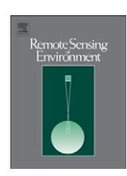
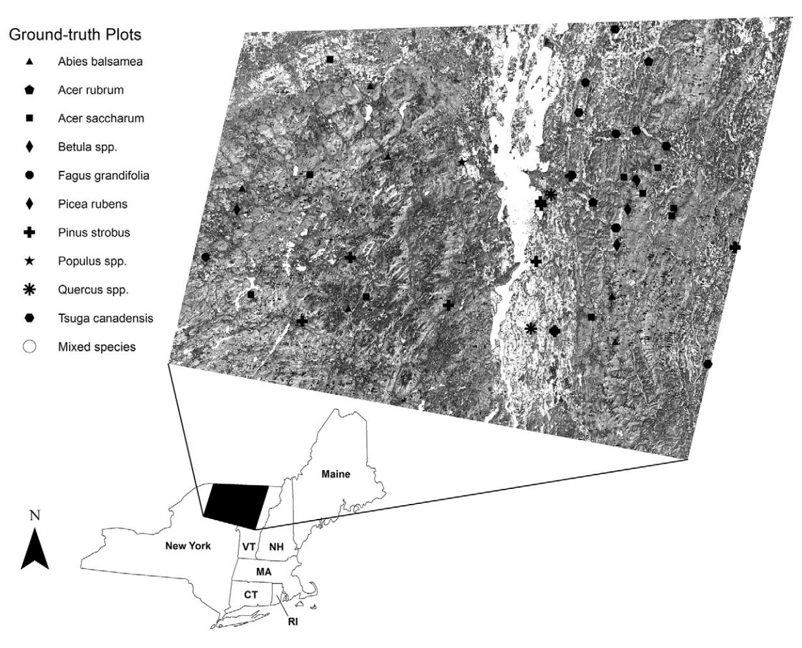
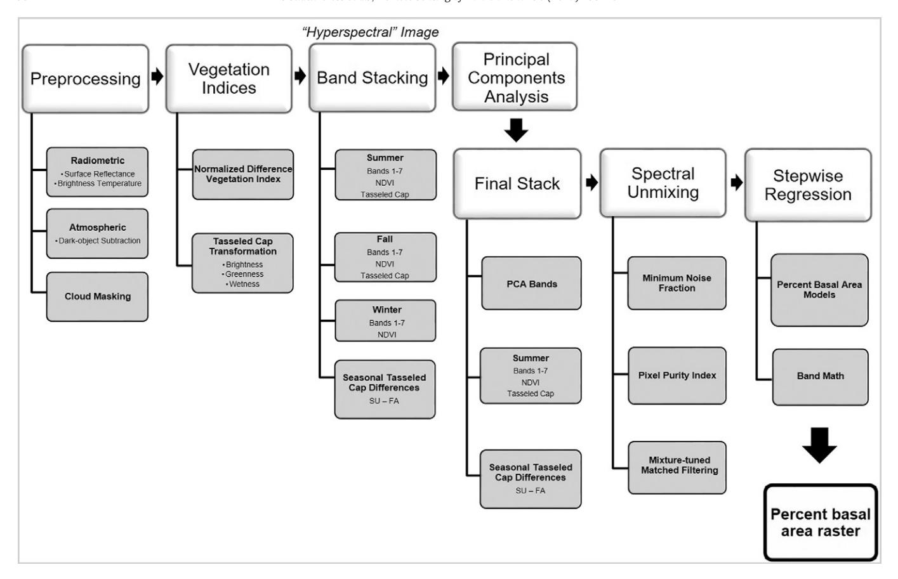
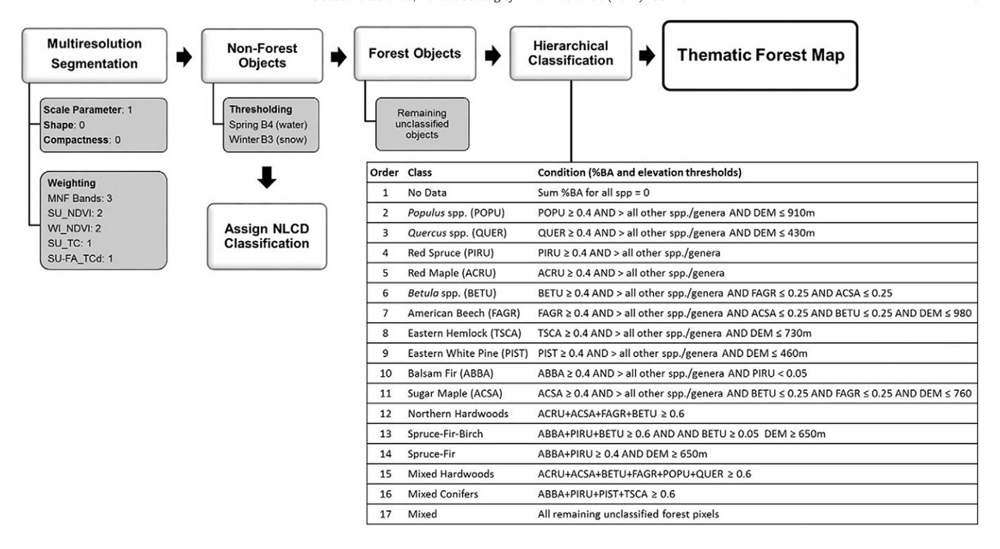
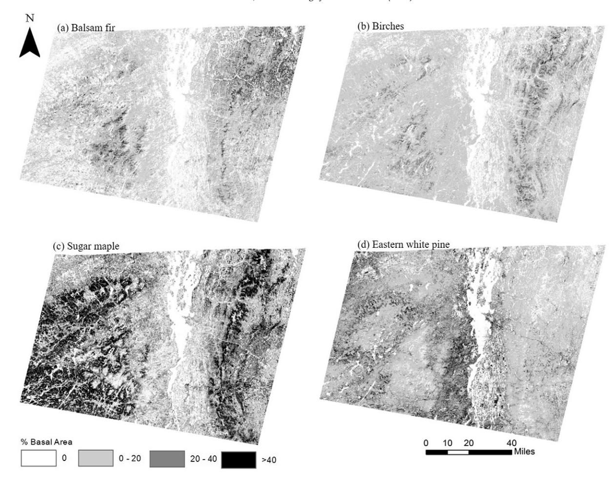
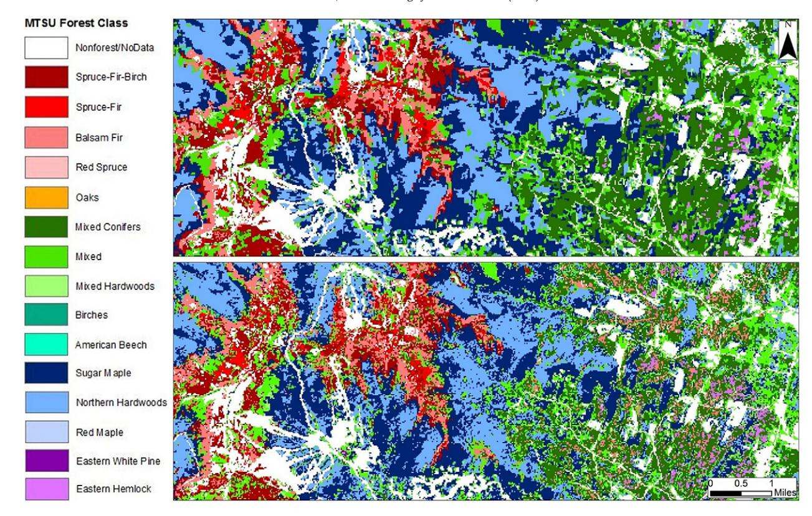
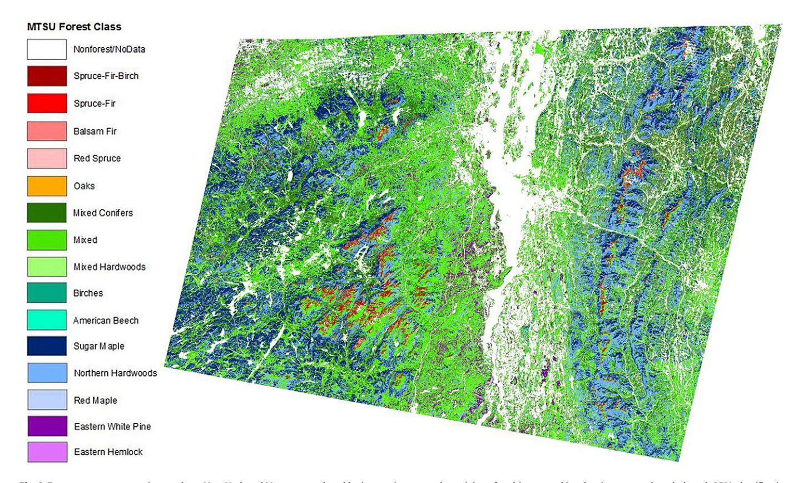
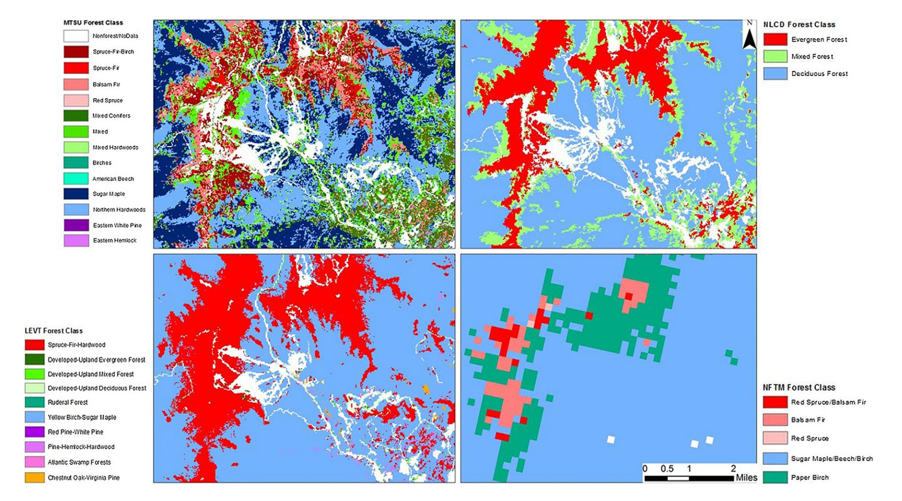

ELSEVIER

Contents lists available at ScienceDirect

### Remote Sensing of Environment

journal homepage: www.elsevier.com/locate/rse

# Enhanced forest cover mapping using spectral unmixing and object-based classification of multi-temporal Landsat imagery

David Gudex-Cross \*, Jennifer Pontius, Alison Adams

The Rubenstein School of Environment and Natural Resources, University of Vermont - Aiken Center, 81 Carrigan Drive, Burlington, VT 05405, United States

#### ARTICLE INFO

Article history: Received 7 November 2016 Received in revised form 24 April 2017 Accepted 8 May 2017 Available online 17 May 2017

Keywords:
Remote sensing
Basal area mapping
Biophysical modeling
Hierarchical classification
Object-based image analysis

#### ABSTRACT

Spatially-explicit tree species distribution maps are increasingly valuable to forest managers and researchers in light of the effects of climate change and invasive pests on forest resources. Traditional forest classifications are limited to broad classes of forest types with variable accuracy. Advanced remote sensing techniques, such as spectral unmixing and object-based image analysis, offer novel forest mapping approaches by quantifying proportional species composition at the pixel level and utilizing ancillary environmental data for forest classifications. This is particularly useful in the Northeastern region of the United States where species composition is often mixed

Here we employed a hierarchical forest mapping approach using spectral unmixing of multi-temporal Landsat imagery to quantify percent basal area for ten common tree species/genera across northern New York and Vermont. Basal area maps were then refined using an object-based ruleset to produce a thematic forest classification. Validation with 50 field inventory plots covering a range of species compositions indicated that the quality of percent basal area mapping largely reflected the number of "pure" (>80% BA) endmember plots available for calibration, with more common species mapped at a higher accuracy (i.e. *Acer saccharum*, adj.  $\rm r^2=0.44$ , compared to *Populus sp.*, adj.  $\rm r^2=0.24$ ). The resulting thematic forest classification mapped 15 forest classes (nine species/genus level and six common species assemblages) with overall accuracy = 42%, KHAT = 33%, fuzzy accuracy = 86% at the pixel level, and 38%, KHAT = 29%, fuzzy accuracy = 84% at the object level.

Using the validation plots to compare existing forest classification products, this hierarchical approach provided more class detail (11 represented classes) and higher accuracy than the National Forest Type Map (six represented classes, overall accuracy 18%, fuzzy accuracy 70%), LANDFIRE (five represented classes, overall accuracy 28%, fuzzy accuracy 80%) and National Land Cover Database (three represented classes, overall accuracy = 56%). These results show that more detailed and accurate forest mapping is possible using a combination of multi-temporal imagery, spectral unmixing, and rule-based classification techniques. Improved large-scale forest mapping has important implications for natural resource management and other modeling applications.

© 2017 Elsevier Inc. All rights reserved.

#### 1. Introduction

Developing cost-effective methods to accurately classify forest cover is essential to inform sustainable forest management at local, regional, and national levels. These products are increasingly valuable in light of the anticipated effects of climate change and invasive pests on forest resources. Warming temperatures and changing precipitation regimes are expected to cause shifts in tree species distributions (Hamann and Wang, 2006; Iverson and Prasad, 2001; Tang et al., 2012) and increases in the duration and severity of pest/pathogen outbreaks (Dale et al., 2001; Dukes et al., 2009). Yet our ability to direct management actions is limited by the coarse detail and relatively low accuracy of existing large-scale forest cover maps.

\* Corresponding author. E-mail address: dgudexcr@uvm.edu (D. Gudex-Cross). Existing forest cover maps include field inventory and remote sensing based products, including those generated through the Forest Inventory and Analysis program (FIA; http://www.fia.fs.fed.us/), the National Land Cover Database (NLCD; http://www.mrlc.gov/) and LANDFIRE Existing Vegetation Type (LANDFIRE EVT; http://www.landfire.gov/). More recently, the United States Forest Service (USFS) has also used FIA data, multi-temporal Moderate Resolution Spectroradiometer (MODIS) imagery, vegetation indices, and other ancillary environmental data to produce the National Forest Type map (National Forest Type Map, http://data.fs.usda.gov/geodata/rastergateway/forest\_type/index.php). The LANDFIRE and NLCD programs provide national forest type maps at a 30 m  $\times$  30 m spatial resolution, but in coarser forest type classes than FIA/USFS species-level products.

Several remote sensing studies have successfully mapped species-level distributions, though largely at highly localized spatial scales (Carleer and Wolff, 2004; Immitzer et al., 2012; Ke et al., 2010; Martin

et al., 1998; Plourde et al., 2007). These studies typically rely on data-intensive hyperspectral and/or high spatial resolution imagery (e.g. Ikonos, QuickBird, WorldView-2, Airborne Visible/Infrared Imaging Spectrometer – AVIRIS, Light Detection and Ranging – LiDAR), limiting their applicability to tree species/genus classification across larger regions.

Wolter et al. (1995), Mickelson et al. (1998), and Hill et al. (2010) achieved relatively accurate species-type classifications by utilizing multi-temporal Landsat imagery, demonstrating the usefulness of acquiring multiple image dates that capture phenologically-significant differences among species (e.g. green-up, senescence, etc.). Dymond et al. (2002) also found improved deciduous forest type discrimination when multi-temporal Landsat imagery was supplemented with Normalized Difference Vegetation Index (NDVI) and Tasseled Cap Transformation (TC) bands, as well as their respective differences among image dates.

Advanced remote sensing techniques, such as spectral unmixing and object-based image analysis (OBIA), utilize a wealth of spectral, spatial, and ancillary environmental data to enable more precise forest cover mapping (see Pu, 2013 for reviews; Xie et al., 2008). Spectral unmixing has been shown to outperform traditional pixel-based classifiers by decomposing ("unmixing") mixed pixels and assigning component proportions at the subpixel level (Huguenin et al., 1997; Oki et al., 2002). This is particularly useful in northeastern forests where species composition is often heterogeneous. The resulting per-pixel proportions of each species obtained from the spectral unmixing process also facilitate the mapping of other forest attributes that are dependent upon the complexity of species composition common in northeastern forests (e.g. carbon storage, basal area, productivity) (Hall et al., 1995; Sonnentag et al., 2007; Yan et al., 2015). OBIA techniques overcome individual pixel constraints by segmenting imagery into homogenous "objects" upon which classification is then carried out. This allows for the additional characterization of shape, size, and texture into classifications and minimizes impacts of canopy architecture-driven variability in spectral signatures (Chubey et al., 2006).

While OBIA is often more accurate than pixel-based methods for mapping forest cover at high spatial resolutions (Agarwal et al., 2013; Dorren et al., 2003; Oruc et al., 2004), comparative studies indicate that coupling pixel-based and OBIA techniques can improve the accuracy of forest type classifications (Aguirre-Gutiérrez et al., 2012; Wang et al., 2004). Using Ikonos imagery, Wang et al. (2004) achieved the highest mangrove classification accuracies when integrating a pixel-level classification to identify spectrally-distinct classes, then carrying out an object-based nearest neighbor analysis on spectrally-mixed classes. Similarly, Aguirre-Gutiérrez et al. (2012) obtained the highest accuracy in montane landscapes when merging the best pixel-based and object-based classes to produce the final thematic land cover classification.

Here, we test a novel approach to tree species mapping that integrates many of the successful approaches used in these previous studies. This involves pixel-level **spectral unmixing** that integrates **multi-temporal** Landsat imagery to develop **percent basal area coverages** for 10 common species. These percent basal area coverages are then incorporated into an object-based hierarchical **ruleset** to generate 16 forest classes (10 species/genera and 6 common assemblages). To evaluate the utility of this integrated multi-temporal, spectral unmixing (**MTSU**) approach, we compare accuracy with existing large-scale forest mapping products, including LANDFIRE EVT, National Forest Type Map, and NLCD.

Achieving accurate, species-specific forest classifications is necessary to fill critical gaps in our knowledge of current tree species distributions. This integrated approach attempts to maximize the accuracy and detail possible from widely available Landsat imagery, allowing for improved, widespread mapping of important forest resources.

#### 2. Methods

#### 2.1. Study area and base imagery

This study was conducted on Landsat Row 29, Path 14, which spans much of northern New York and Vermont (Fig. 1). Forest composition across the region is highly heterogeneous with dominant canopy species including sugar maple (*Acer saccharum*), red maple (*Acer rubrum*), American beech (*Fagus grandifolia*), eastern hemlock (*Tsuga canadensis*), eastern white pine (*Pinus strobus*), and yellow birch (*Betula alleghaniensis*). Upper elevations are dominated by balsam fir (*Abies balsamea*), red spruce (*Picea rubens*), and birches (*Betula spp.*) (Morin and Widmann, 2016; Widmann, 2015).

Seasonal Landsat Operational Land Imager and Thermal Infrared Sensor (OLI-TIRS) and Enhanced Thematic Mapper Plus (ETM+) images (USGS level 1 T products) were acquired for targeted, phenologically-representative dates: full snow cover (winter), green up (spring), mid-growing season (summer), and peak fall color (fall). Because cloud cover is a common issue across this mountainous region, we included the lowest cloud cover image within a two-year buffer around the representative year (i.e. "2014" candidate images were chosen from 2012 to 2016). Cloud cover was masked, then backfilled via seamless mosaicking with another image acquired within two weeks of the base image. Even within these parameters, for this study we were unable to compile a spring image with sufficiently low cloud cover and hence excluded this season from further processing.

#### 2.2. Ground-reference data

"Pure" endmember spectra (plots with >80% basal area for a given species) for spectral unmixing algorithms were obtained from FIA plots distributed throughout the region, with an additional 20 variable-radius plots (collected with a 10 factor wedge prism) also used to improve representation of species underrepresented in the FIA data (Fig. 1). Aggregated to the plot level, this resulted in 54 plots containing >80% basal area to calibrate the unmixing models for ten common species or genera (Table 1).

For model validation, the FIA endmember plots were supplemented by mixed species composition plots from the Vermont Monitoring Cooperative (VMC; http://www.uvm.edu/vmc/) for a total of 50 plots covering a range of species compositions (Table 1). Both programs employ the same sampling design, with four 1/24 acre subplots (see Bechtold and Patterson, 2005) and measurement of all stems greater than five inches diameter at breast height.

Sugar maple, birches, American beech, red spruce, and red maple respectively occurred on the most ground-reference plots, while sugar maple, balsam fir, birches, and eastern hemlock had the highest percent basal area. It is important to note that percent basal area measurements did not differentiate between canopy dominant and understory trees, likely contributing to error in the resulting percent basal areas models that are based solely on reflectance signatures from the top of the canopy.

#### 2.3. Preprocessing

Landsat Level 1 T products come with basic radiometric calibration and topographically corrected georegistration. In-house preprocessing (Fig. 2) included atmospheric corrections to at-surface reflectance using a dark-object subtraction technique (Chavez, 1989). We then derived NDVI and TC (Crist and Cicone, 1984) bands for each season, and calculated seasonal TC differences between summer and fall. These indices have previously been shown to improve landscape-level forest type discrimination of multi-temporal Landsat imagery (Dymond et al., 2002).

Running a principal component analysis (PCA) on forested pixels only on the resulting 33 band imagery stack as a precursor to the

Fig. 1. The study area, spanning northern New York and Vermont, and distribution of ground-reference plots (Landsat Path 14, Row 29).

Minimum Noise Fraction (MNF) transform (see Section 2.4 below) allowed us to minimize autocorrelation among the full component of input bands. This step removed noise inherent in many of these bands due to differences in illumination and atmospheric conditions across different image acquisition dates, and isolated the spectral signal specific to distinguishing forested pixels.

The final stacked image for spectral unmixing included the first three PCA bands (accounting for >99% of the spectral variability in the full 33-band stack). Because these PCA bands were primarily distinguishing among species composition (see Section 3.1), the final stacked image also included summer Landsat reflectance bands, NDVI, Tasseled Cap, and Tasseled Cap difference vegetation index products (Fig. 2) to capture information about canopy density for percent basal area modeling.

**Table 1**The species composition of ground-reference plots used for development of percent basal area (%BA) models.

| Tree spp./genus    | No. of pure endmember plots | Mean %BA (±SD) | Max %BA | No. of plots w/species |  |  |
|--------------------|-----------------------------|-------------------|---------|---------------------------|--|--|
| Balsam fir         | 8                           | 14.3 (27.7)       | 92.5    | 14                        |  |  |
| Red maple          | 2                           | 6.7 (14.2)        | 80.5    | 18                        |  |  |
| Sugar maple        | 10                          | 27.7 (36.6)       | 96.0    | 27                        |  |  |
| Birches            | 6                           | 13.1 (20.4)       | 80.7    | 26                        |  |  |
| American beech     | 2                           | 6.3 (13.2)        | 81.8    | 22                        |  |  |
| Red spruce         | 1                           | 5.7 (14.6)        | 92.0    | 20                        |  |  |
| Eastern white pine | 11                          | 5.8 (21.4)        | 100.0   | 6                         |  |  |
| Aspens             | 1                           | 3.3 (13.8)        | 86.5    | 5                         |  |  |
| Oaks               | 2                           | 3.4 (13.1)        | 65.0    | 4                         |  |  |
| Eastern hemlock    | 11                          | 9.2 (25.0)        | 93.1    | 10                        |  |  |

#### 2.4. Spectral unmixing

The spectral unmixing process outlined here largely follows that developed by Nielsen (2001) and Boardman and Kruse (2011), which has previously been used to classify tree species with hyperspectral imagery (see Hallett et al., 2010; Plourde et al., 2007). A MNF transform was first applied to the final imagery stack (17 bands) for data decorrelation and spectral noise reduction (Green et al., 1988) (Fig. 2). Endmember pixels were refined using a Pixel Purity Index to ensure spectral similarity of MNF bands among geographically distinct sites, with spectral outliers being excluded from further analysis. The resulting MNF image was then "unmixed" using a Mixture-tuned Matched Filtering (MTMF) algorithm (Boardman, 1998) based on the target endmember spectra (i.e. tree species signatures). MTMF is a form of spectral mixture analysis that employs partial linear unmixing to map the abundance or fraction of target endmember spectra within each pixel (Boardman and Kruse, 2011). The MTMF output consists of a matched filter and infeasibility score for each pixel, with the former reflecting how well the pixel matches the target spectra and the latter representing the likelihood of a false positive.

We considered several approaches to model percent basal area for input into the object-based classification ruleset based on the MTMF products. The traditional approach involves identifying thresholds for matched filter and infeasibility scores to maximize the binary accuracy of a species' presence/absence. Because we were mapping heterogeneous forest cover dominated by mixed species composition, such a binary classification was ruled out for our purposes. Regression models have also been used to map species fractional basal area using hyperspectral imagery (Pontius et al., 2005). This study differed from

Fig. 2. The Landsat preprocessing and percent basal area modeling workflow.

these previous single species efforts based on the large number of ground-reference plots across a range of forest species composition. The diverse plot network resulted in a variable number of plots where the target species was completely absent, as well as a suite of possible matched filter and infeasibility scores derived from the 10 species unmixing products.

Using linear regression models based only on plots that contained the species of interest produced more stable regression metrics, but resulted in many false positives where particular species were absent. We also tested zero-inflated regression to account for the propensity of zero basal area plots in the calibration data. Results were generally lower model fit than the general linear models, with continued over-prediction of zero basal area plots. Further, zero-inflation p-values resulting from regression estimates were not significant, indicating that the presence of zero value data was not a significant contributor to overall model variability.

Our most consistently accurate results came from a stepwise linear regression model that included all ground-reference plots (including those where the target species was absent). Model terms were limited to match filter and infeasibility variables significant at the 0.05 level, with a maximum variance inflation factor of 10 to avoid autocorrelation among parameters. We used the minimum Bayesian Information Criterion (Bhat and Kumar, 2010) to select the best fit model. The resulting regression equation was then applied to the MTMF image via band math to create a percent basal area raster for each target species/genus.

It is important to note that the resulting fractional basal area products were not intended to be stand-alone products, but instead to be used as inputs to quantify the *relative* abundance of species within each pixel in order to *inform* classification. These relative abundances were not aggregated for all species but instead used as independent inputs to the object-based hierarchical ruleset (see Section 2.5 below).

#### 2.5. Object-based classification

Percent basal area rasters obtained from the pixel-based spectral unmixing were then incorporated into an object-based, hierarchical ruleset classification scheme (Fig. 3). This allowed us to refine the percent basal area products using ancillary environmental data (i.e. digital elevation data from the National Elevation Dataset available through the U.S. Geological Survey) and produce classifications on a stand- versus pixel-level.

Object-based classifications begin with segmentation to aggregate like pixels into larger image objects. Segmentation settings and input layer weightings were informed by knowledge of the image resolution, spatial characteristics of the landscape, and spectral nature of the feature objects. As is common in object-based classifications, iterations of various settings were evaluated to confirm selection of final segmentation settings. We used a multiresolution segmentation algorithm (see Chubey et al., 2006 for further explanation) based on layer inputs that highlighted differences in vegetation characteristics across our study area. This included weighting the first three MNF bands most, followed by summer and winter NDVI and seasonal TC differences. Given the moderate spatial resolution of Landsat imagery and heterogeneous nature of forest composition patterns across the landscape, a very low scale parameter (1) with no shape or compactness weighting was used for object segmentation. To compare the pixel-level ruleset results to this object-based approach, a chessboard segmentation with a scale parameter of 1 and no band weighting was used to create pixel "objects".

The ruleset started by differentiating forest from non-forest objects using thresholds for winter band 3 leveraging snow cover (non-forest > 0.60), and spring band 4, masking water (non-forest < 0.065). Forest classes were then assigned based on percent basal area rasters and

Fig. 3. The object-based image analysis (OBIA) workflow to generate a 16-class thematic forest cover map.

elevational constraints outlined by Burns and Honkala (1990) (Fig. 3) following a rule-based hierarchy. A species/genus class was assigned if the object contained >40% basal area of that species or genus and did not exceed the specified elevation threshold (if there was one). Since rare species are spottier across the landscape and more likely to be smoothed out when averaged within image objects, forest type assignment in the hierarchical ruleset progressed from the least to most common species to maximize representation of rare species in the final thematic classification

To capture regionally-common species assemblages where no species was >40% basal area, we also classified six common forest assemblages by summing the percent basal area values for their respective component species (Fig. 3). The final thematic forest classification of 16 possible forest types was then exported as a 30-m by 30-m raster product.

#### 2.6. Accuracy assessment

Inventory data for the FIA and VMC plots described above (see Section 2.2) were used to assign a forest class according to the same rule thresholds applied to the imagery. A confusion matrix of actual versus predicted forest classes was created to examine overall, kappa, User's, and Producer's accuracies. We also determined fuzzy accuracy by allowing misclassification between common species/species assemblages. For example, we considered sugar maple pixels that were classified as northern hardwoods to be "correct" at the fuzzy level.

We similarly calculated accuracy for three existing forest mapping products: the 2011 LANDFIRE EVT classification; the National Forest Type Map classification; and the 2011 NLCD classification. Only the LANDFIRE and National Forest Type Map classifications could be compared at the species-type level, with accuracy being determined following the same process outlined above with field plots assigned to match their respective classes. For the NLCD product, we classified the validation data as deciduous (>75% deciduous species), evergreen (>75% evergreen species), or mixed forest (a plot was considered mixed when both deciduous and evergreen species were present but neither exceeded 75% of the plot basal area).

#### 3. Results and discussion

#### 3.1. Spectral decomposition

Our approach included the aggregation of a variety of image dates and vegetation index products in order to maximize the spectral information available to differentiate physiologically similar species. Eigenvectors from spectral decomposition were used to identify which bands accounted for the most variability among forested pixels. From the full 33 band multi-temporal stack, the largest eigenvectors came from the fall image (Table 2). It is important to keep in mind that this PCA was run on forested pixels only in order to isolate the potential spectral signal specific to differentiation among forest types (not forest/non-forest). The fall image was timed at the peak of physiological differentiation among species for our region, providing key spectral information to help separate otherwise spectrally similar species. Other studies have also cited the importance of using shoulder seasons with unique phenological information to assist in species classification (Dymond et al., 2002; Hill et al., 2010).

#### 3.2. Percent basal area modeling

MTMF models of percent basal area resulted in significant but relatively weak (adj. r2 = 0.24; RMSE = 0.04, *Populus* sp.) to moderate relationships (adj. r2 = 0.59; RMSE = 0.06, American beech). These relatively low model fits likely result from several sources of known error. The sensor primarily records the spectral reflectance from the

**Table 2**Principal components analysis eigenvectors highlight the input bands that account for the most spectral variability among forested pixels.

| Input band           | PCA band | Eigenvector |
|----------------------|----------|-------------|
| Fall band 5 (mid-IR) | 1        | 0.233       |
| Fall band 2 (green)  | 1        | 0.207       |
| Fall band 4 (NIR)    | 2        | 0.295       |
| Fall NDVI            | 2        | 0.271       |

canopy surface, with a mix of canopy dominant trees that may differ from understory composition included in ground-reference inventories. Further, percent basal area is based on main trunk diameter at breast height with no accounting for variability in crown size or geometry among species. This is reflected in lower fit statistics for species that are more common in the understory of Northeastern forests (e.g. eastern hemlock), or with relatively small crown geometry relative to common co-occurring species.

The lack of fit is likely also driven by the preponderance of "pure" species plots included in the validation dataset. This resulted in plots with extreme high and extreme low (zero occurrence) values of each target species, levels where regression models are typically weakest. Species/genera with the lowest percent basal area fit were those with the fewest endmember calibration plots and lowest general abundance across the study area (per FIA forest demographic reports). For these target species, percent basal area was typically under-predicted (Table 3). The most accurate percent basal area models were associated with the dominant species in our region (e.g. American beech).

These results are similar other species mapping efforts. Savage et al. (2015) used a zero-inflated regression model, based on a two-step process, to first predict the presence or absence of the target species and then species composition only where the target species was present. They modeled five different conifer species in heterogeneous forests of northwestern Montana using Landsat TM and OLI imagery, reporting independent accuracy assessment RMSE from 0.11 to 0.23 (no r² values were reported). These errors are slightly higher than the range of RMSE values reported for our ten target species (0.04 to 0.16).

Moisen et al. (2006) compared generalized additive regression modeling, classification and regression tree (CART) techniques, and stochastic gradient boosting for modeling live basal area from multi-temporal Landsat imagery for thirteen tree species in Utah. Basal area prediction results for all modeling techniques were poor for most species ( $\rm r^2 < 0.5$  and RMS errors > 0.8). While the general approach employed by Moisen et al. (2006) is similar to that described here (multi-temporal Landsat imagery), our range of model fit is higher, indicating that the additional image processing techniques and spectral unmixing approach employed here may improve abundance mapping using Landsat imagery.

Our percent basal area modeling results also compare favorably to those obtained in other studies using MTMF techniques. Hyperspectral imagery, with its wealth of narrow reflectance bands, is well suited to spectral unmixing and species abundance mapping. Hyperspectral instruments have reported comparable accuracy to that reported here for eastern hemlock abundance in the Catskills region ( $r^2=0.65$ ; RMSE 0.12, Pontius et al. (2005)). Plourde et al. (2007) used spectral unmixing to model percent sugar maple and American beech in New Hampshire using both hyperspectral AVIRIS imagery as well as modifications of the hyperspectral imagery to match broadband sensors. They found weak relationships between field-measured and predicted percent basal area based on the broadband imagery, but results similar to those reported here for spectral unmixing of the full hyperspectral

**Table 3**Percent basal area model fits derived from spectral unmixing.

| Tree spp./genus       | r2   | Adj. r2 | Mean %BA | RMSE | PRESS RMSE |
|-----------------------|------|---------|----------|------|------------|
| Balsam fir            | 0.34 | 0.32    | 0.15     | 0.11 | 0.12       |
| Red maple             | 0.47 | 0.46    | 0.08     | 0.06 | 0.06       |
| Sugar maple           | 0.46 | 0.44    | 0.28     | 0.16 | 0.17       |
| Birches (Betula spp.) | 0.32 | 0.30    | 0.13     | 0.08 | 0.09       |
| American beech        | 0.60 | 0.59    | 0.07     | 0.06 | 0.07       |
| Red spruce            | 0.52 | 0.51    | 0.07     | 0.06 | 0.06       |
| Eastern white pine    | 0.3  | 0.29    | 0.1      | 0.1  | 0.1        |
| Aspens (Populus spp.) | 0.25 | 0.24    | 0.04     | 0.04 | 0.04       |
| Oaks (Quercus spp.)   | 0.49 | 0.48    | 0.05     | 0.05 | 0.05       |
| Eastern hemlock       | 0.32 | 0.30    | 0.11     | 0.09 | 0.1        |

data ( $r^2 = 0.49$ ; RMSE = 0.09 for sugar maple and  $r^2 = 0.36$ ; RMSE = 0.18 for beech).

These studies collectively underscore that modeling continuous variables, like individual tree species basal area, is a difficult task. Clearly the spatial resolution of Landsat imagery is limiting for mapping forest cover at the species level in highly mixed forests. Difficulties associated with scaling field data to the Landsat pixel level include: overlap in canopy dominant species (Hallett et al., 2010; Plourde et al., 2007); incongruities between field measurements (which include understory stems) and sensor-derived canopy reflectance (particularly for shade-tolerant species such as hemlock); and incorrect registration between calibration field plots and pixel centers. Atmospheric and topographic shadow impacts on spectra are also particularly troublesome in mountainous regions. Within-species spectral variability due to differences in tree health can also confound unmixing algorithms (Carter, 1993; Plourde et al., 2007).

While these errors impact the overall accuracy of the models, it is interesting to note that the multi-temporal, broadband, spectral unmixing approach described here reports similar accuracy to hyperspectral efforts (Plourde et al., 2007; Pontius et al., 2005) and improved accuracy compared to other broadband-based tree species abundance mapping (Moisen et al., 2006; Plourde et al., 2007; Savage et al., 2015). We attribute the improved performance of our MTSU integrative approach to a combination of factors: 1) the use of multi-temporal imagery to capture species-specific spectral characteristics during key phenological times; 2) the inclusion of vegetation indices derived from the multi-temporal images to isolate species-specific differences in vegetation characteristics across seasons; and 3) the use of MTMF products from multiple species components to model abundance of the target species. Previous broadband sensor-based studies have shown the utility of using multiple phenologically-important image dates and vegetation indices when classifying heterogeneous forest cover at the species-type level (e.g. Dymond et al., 2002; Hill et al., 2010). Others have highlighted that the use of multiple endmembers in spectral mixture analysis can improve assessments of forest structural attributes (Hall et al., 1995; Roberts et al., 1998).

Our resulting maps of species percent basal area match expected patterns across northern New York and Vermont (see Burns and Honkala, 1990 for species-specific descriptions), particularly for the five most abundant species (Fig. 4). Balsam fir (Fig. 4a) was predicted throughout the high elevations of both the Green and Adirondack mountains, in addition to the lowland boreal forest areas of northeastern Vermont, Betula sp. (Fig. 4b) followed a spatial distribution similar to sugar maple but with greater occurrence at higher elevations. Since birches were modeled at the genus level, this reflects the northern hardwood type-driven distribution of yellow birch (*Betula alleghaniensis*) and that of paper birches (Betula papyrifera/cordifolia), which are common constituents of high elevation spruce-fir forests in the northeastern USA (Burns and Honkala, 1990; Leak et al., 2014). Sugar maple was predicted as prevalent throughout much of the region (Fig. 4c), which matches recent FIA field inventories in both states (Morin and Widmann, 2016; Widmann, 2015). Its highest estimated percent basal area densities were along the low to mid elevation slopes of the Adirondack and Green mountain ranges, where it is an integral component of the northern hardwoods forest type (Leak et al., 2014). Eastern white pine (Fig. 4d) was largely predicted to be found along the Lake Champlain valley lowlands of both states, but more prevalent in New York

#### 3.3. Thematic forest classification

## 3.3.1. Comparison of pixel-level and object-based MTSU classification schemes

Rule-based, OBIA classification schemes are commonly used with high spatial resolution imagery that exhibits unique shape and texture features. Due to the relatively coarse pixels of Landsat, we compared

Fig. 4. The spatial distribution of percent basal area derived from spectral unmixing for four common species in northern New York and Vermont.

the thematic results of the hierarchical ruleset applied to both individual pixels (pixel-level, PL) and image-segmented stand "objects" (objectlevel, OL) to determine if image segmentation was necessary to maximize accuracy of forest classifications. The relative abundance of the 16 forest classes was similar for both the pixel-level (PL) and objectbased (OB) maps. The most striking difference was far fewer pixels classified as species-dominant in the OB map. This result is to be expected given the averaging of neighboring pixel values to create one common value for each stand-level object, which effectively washes out singlespecies dominant pixels. Spatial patterns for the PL and OB maps were indiscernible at the regional level. However, a localized, side-by-side comparison of both products revealed the PL map's finer species-level detail and grainier appearance against the smoother, species assemblage-dominated OB map (Fig. 5). In the Stowe region of Vermont, for example, the PL map predicted more single-species dominant stands of balsam fir, red spruce, and eastern hemlock, largely in areas classified as mixed conifers on the OB map. Yet the general spatial distribution patterns of the predominant forest classes around Stowe were very similar, with both maps showing mixed classes around lowland and developed areas, mountain slopes dominated by northern hardwoods and sugar maple, and spruce-fir related classes at high elevations.

Based on ground-reference plots, overall classification accuracy among forest types was slightly higher for the PL (overall accuracy = 42%, KHAT = 33%, fuzzy accuracy = 86%) versus the OB classification (overall = 38%, KHAT = 29%, fuzzy = 84%). The increased detail of the PL classification also better matches the complex spatial heterogeneity of forests across the region. Given this, we consider the PL more appropriate for mapping forest types using Landsat imagery in the

Northeast. For this reason, we include only a discussion of the PL results below.

#### 3.3.2. Pixel-level thematic forest classification

Applying the classification ruleset across the study area shows a spatial distribution of forest classes that match expected patterns across northern New York and Vermont (Fig. 6). Mixed hardwoods dominate the lowlands, while sugar maple and northern hardwoods occupy the low to mid elevation slopes of the Adirondack and Green mountain ranges. Spruce-fir and spruce-fir-birch assemblages were classified throughout the high elevations of both the Green and Adirondack mountains. Eastern white pine and hemlock were classified primarily along the Lake Champlain valley corridor. Interesting anomalies include the near absence of pixels classified as oak- or birch-dominant, and complete absence of aspens. While this may simply reflect their relatively low abundance as pure stands across the region, it is also likely that the low number of calibration endmembers has limited our ability to capture a sufficient range of spectral signatures for these tree species.

Accuracy assessment for the pixel-level classification resulted in 42% overall accuracy (KHAT =33%) (Table 4). When allowing for confusion between pure target species and common assemblages that by definition contain a significant portion of the target species, overall accuracy doubled (fuzzy accuracy =86%), indicating that a majority of error resulted from incorrectly predicting mixed species classes for plots that were dominated by one species (but likely also contained others). Typically, the actual dominant species was an important component of the incorrectly predicted mixed species class (e.g. sugar maple was often incorrectly classified as northern hardwoods, of which it is a major component).

Fig. 5. A side-by-side comparison of the object-based (top) and pixel-level (bottom) classifications in the Stowe region of Vermont.

Fig. 6. Forest cover map spanning northern New York and Vermont produced by integrating spectral unmixing of multi-temporal Landsat imagery and a rule-based, OBIA classification scheme.

 Table 4

 Error matrix based on 50 ground-reference plots for the MTSU pixel-level forest classification. Bold indicates correct at the species-type level; italics indicate correct at the fuzzy level.

|           |                  | Actual class   |              |                   |                       |         |                  |            |               |     |                    |                       |       |                |                    |        |           |       |                       |               |
|-----------|------------------|----------------|--------------|-------------------|-----------------------|---------|------------------|------------|---------------|-----|--------------------|-----------------------|-------|----------------|--------------------|--------|-----------|-------|-----------------------|---------------|
|           | Count            | Sugar maple | Red maple | American beech | Northern hardwoods | Birches | Spruce-fir-birch | Spruce-fir | Red spruce |     | Eastern hemlock | Eastern white Pine | Mixed | Mixed conifers | Mixed hardwoods | Aspens | Oaks Tota | Total | Total User's accuracy | Fuzzy y UA |
| Predicted | Sugar maple      | 10             | 1            |                   | 2                     | 1       |                  |            |               |     |                    |                       |       |                |                    |        |           | 14    | 71%                   | 93%           |
| class     | Red maple        |                | 0            |                   |                       |         |                  |            |               |     |                    |                       |       |                |                    |        |           | 0     | 0%                    | 0%            |
|           | American         |                |              | 0                 |                       |         |                  |            |               |     |                    |                       |       |                |                    |        |           | 0     | 0%                    | 0%            |
|           | beech            |                |              |                   |                       |         |                  |            |               |     |                    |                       |       |                |                    |        |           |       |                       |               |
|           | Northern         | 3              |              | 1                 | 3                     | 2       |                  |            |               |     |                    |                       | 1     |                |                    |        | 2         | 12    | 25%                   | 83%           |
|           | hardwoods        |                |              |                   |                       |         |                  |            |               |     |                    |                       |       |                |                    |        |           |       |                       |               |
|           | Birches          |                |              |                   |                       | 0       |                  |            |               |     |                    |                       |       |                |                    |        |           | 0     | 0%                    | 0%            |
|           | Spruce-fir-birch |                |              |                   |                       |         | 5                |            |               |     |                    |                       |       |                |                    |        |           | 5     | 100%                  | 100%          |
|           | Spruce-fir       |                |              |                   |                       |         | 1                | 0          |               |     |                    |                       |       |                |                    |        |           | 1     | 0%                    | 100%          |
|           | Red spruce       |                |              |                   |                       |         |                  |            | 1             |     |                    |                       |       |                |                    |        |           | 1     | 100%                  | 100%          |
|           | Balsam fir       |                |              |                   |                       |         |                  |            |               | 0   |                    |                       |       |                | 1                  |        |           | 1     | 0%                    | 0%            |
|           | Eastern          |                |              |                   |                       |         |                  |            |               | 1   | 1                  |                       |       |                |                    |        |           | 2     | 50%                   | 50%           |
|           | hemlock          |                |              |                   |                       |         |                  |            |               |     |                    |                       |       |                |                    |        |           |       |                       |               |
|           | Eastern white    |                |              |                   |                       |         |                  |            |               |     |                    | 1                     |       |                |                    | 1      |           | 2     | 50%                   | 50%           |
|           | pine             |                |              |                   |                       |         |                  |            |               |     |                    |                       |       |                |                    |        |           |       |                       |               |
|           | Mixed            | 1              |              |                   |                       | 1       |                  |            |               | 1   | 2 2                | 2                     | 0     |                |                    | 1      |           | 8     | 0%                    | 100%          |
|           | Mixed conifers   |                |              |                   |                       |         |                  |            |               | 1   | 2                  |                       |       | 0              |                    |        |           | 3     | 0%                    | 100%          |
|           | Mixed            | 1              |              |                   |                       |         |                  |            |               |     |                    |                       |       |                | 0                  |        |           | 1     | 0%                    | 0%            |
|           | hardwoods        |                |              |                   |                       |         |                  |            |               |     |                    |                       |       |                |                    |        |           |       |                       |               |
|           | Aspens           |                |              |                   |                       |         |                  |            |               |     |                    |                       |       |                |                    | 0      |           | 0     | 0%                    | 0%            |
|           | Oaks             |                |              |                   |                       |         |                  |            |               |     |                    |                       |       |                |                    |        | 0         | 0     | 0%                    | 0%            |
|           | Total            | 15             | 1            | 1                 | 5                     | 4       | 6                | 0          | 1             | 3   | 5                  | 3                     | 1     | 0              | 1                  |        | 2         | 50    |                       |               |
|           | Producer's       | 67%            | 0%           | 0%                | 60%                   | 0%      | 83%              | 0%         | 100%          | 0%  | 20%                | 33%                   | 0%    | 0%             | 0%                 | 0%     | 0%        |       |                       |               |
|           | accuracy         |                |              |                   | 1000/                 |         | 1000             |            |               |     |                    | 1000/                 |       |                |                    | =00/   |           |       |                       |               |
|           | Fuzzy PA         | 93%            | 100%         | 100%              | 100%                  | 80%     | 100%             | 0%         | 100%          | 67% | 100%               | 100%                  | 100%  | 0%             | 0%                 | 50%    | 0%        |       |                       |               |
|           | Overall          | 42%            |              |                   |                       |         |                  |            |               |     |                    |                       |       |                |                    |        |           |       |                       |               |
|           | accuracy         | 000/           |              |                   |                       |         |                  |            |               |     |                    |                       |       |                |                    |        |           |       |                       |               |
|           | KHAT             | 33%            |              |                   |                       |         |                  |            |               |     |                    |                       |       |                |                    |        |           |       |                       |               |
|           | Fuzzy accuracy   | 86%            |              |                   |                       |         |                  |            |               |     |                    |                       |       |                |                    |        |           |       |                       |               |

The highest producer's accuracies were obtained for the most common forest types across the study area (Table 4): sugar maple, northern hardwoods, and spruce-fir-birch. Lower user's accuracies for northern hardwoods highlight the tendency of the ruleset to categorize single species-dominant validation plots into this species assemblage class. The lowest user's accuracies were obtained for less common species with relatively low abundance across the study area. These included birches and the three conifer species (balsam fir, eastern hemlock, and eastern white pine), all of which were often classified as mixed species assemblages. If identification of less abundant species is desired, the percent basal area thresholds of the ruleset could be lowered to denote "dominant stands". However, we suggest that if the goal of using these forest maps is examining the spatial and structural distribution of a particular species, using the percent basal area maps themselves would be preferential to using the thematic classification.

#### 3.3.3. Comparison to other forest mapping products

In order to evaluate how this integrated forest classification compared to other commonly used forest cover maps, we consider the specificity of forest classes (number and structure of distinct classes), the spatial resolution, and the mapping accuracy of each product (Table 5).

Our forest classification resulted in 15 forest types (no aspen stands mapped) across the study area, based on the 10 most common genera/ species in the region and six common assemblages of these species. The National Forest Type Map and LANDFIRE EVT forest class structures are most comparable to our MTSU integrated classification with 29 and 17 predicted across the study area. Both include common species assemblages such as spruce-fir and northern hardwoods. The National Forest Type Map also includes species-specific classes (e.g. balsam fir, eastern hemlock, eastern white pine, etc.). Where the LANDFIRE EVT classification diverges from ours is in its use of disturbance and geographic modifiers to describe certain forest types (e.g. ruderal forest, Atlantic swamp forest). Further, its mixed forest classes often cover a broader range of species assemblages, (e.g. pine-hemlock-hardwood and spruce-fir-hardwood). The NLCD product only classifies three broad forest types: deciduous, evergreen, and mixed.

Our 50 ground-reference plots represented 11 forest types for our MTSU integrated classification, five for the LANDFIRE EVT, and six for the National Forest Type Map (Table 5). Of the five LANDFIRE EVT classes, nearly all were predicted as belonging to one of three mixed forest types (pine-hemlock-hardwood, spruce-fir-hardwood, or yellow birchsugar maple). Of the six National Forest Type Map classes, our ground-reference plots were predominantly categorized as one mixed forest type (sugar maple-beech-yellow birch). This simplification of the heterogeneity of species assemblages found across the Northern Forest region into broad categories resulted in a gross over-prediction of yellow birch-sugar maple (LANDFIRE EVT) and sugar maple-beech-yellow birch (National Forest Type Map) across the landscape, while missing other species entirely.

Focusing on the topographically diverse forests in the Stowe region of Vermont, a comparison of these forest classifications highlights the increased spatial detail and specificity of our MTSU product (Fig. 7). The MTSU predicts balsam fir, red spruce, spruce-fir, and spruce-fir-birch stands at high elevations, in addition to scattered balsam fir dominated stands in lowland swamp areas near suburban developments. Along mountain slopes, northern hardwoods and sugar maple stands are found throughout the low-mid elevations, with rare occurrences

of birch and American beech dominated pixels. The valleys are largely dominated by the MTSU's broadest species assemblages: mixed, mixed conifers, and mixed hardwoods. These results contrast those of the National Forest Type Map and LANDFIRE EVT, which both classify much of the region as a mixed northern hardwoods-type (maple/beech/birch and yellow birch-sugar maple, respectively). The National Forest Type Map also does poorly distinguishing forest from non-forest, and has a more pixelated appearance due to its coarse spatial resolution. The spatial distribution of NLCD forest cover aligns most closely with that of the MTSU product, but at a much coarser forest type specificity.

To compare accuracy among the mapping products, we used the same 50 ground-reference plots referenced throughout this study. Since there are inherent differences in how each product categorizes forest types, ground-reference plots were assigned to match the comparison product categories based on their species composition. Our results indicate that our MTSU classification was more accurate than the LANDFIRE EVT product (42% compared to 28% overall accuracy respectively) and more than twice as accurate as the National Forest Type Map (42% compared to 18% overall accuracy respectively) (Table 5). While fuzzy accuracies are improved for the National Forest Type Map and LANDFIRE EVT products, this is likely inflated by their broad class structure and near uniform assignment of plots into mixed forest type classes that include most of the common species/genera found within our ground-reference dataset.

When modifying all four classifications to match the coarser NLCD forest types (i.e. deciduous, evergreen, and mixed forest) for a more direct comparison of the general performance of these models, again the MTSU outperformed the LANDFIRE EVT, National Forest Type Map, and NLCD products (76%, 66%, 62% and 56% overall accuracy, respectively) (Table 5). Most of the error in the MTSU was due to an over-prediction of mixed forest in conifer dominated plots. Deciduous forest, by far the most common class in the ground-reference data, was also the most accurately predicted in each classification. The high deciduous class accuracies of the LANDFIRE EVT and National Forest Type Map were again driven by their propensity to predict yellow birch-sugar maple and sugar maple-beech-yellow birch across the landscape.

#### 4. Conclusions

Our results indicate that the use of multi-temporal Landsat imagery, spectral unmixing, and a hierarchical ruleset classification ('MTSU' integrated approach) offers improved species specificity and accuracy relative to existing forest classification products. The key to this approach includes: 1) the use of multi-temporal imagery to capture species-specific differences during important phenological periods; 2) spectral unmixing to more accurately characterize the mixed composition of forests in the study area; and 3) integration of resulting percent basal area maps and ancillary environmental variables into a hierarchical, rule-based classification scheme.

Public availability of Landsat and FIA data enable the broad implementation, as well as scalable nature, of this approach. However, it is important to note that this approach hinges upon the user's ability to obtain high quality (low cloud cover) multi-temporal imagery during key phenological periods, which is often difficult in temperate and mountainous regions. It also requires a robust set of "pure" species plots for use as endmembers in spectral unmixing and calibration of the percent basal area models. This can be difficult for rare and non-

**Table 5**Comparison of class specificity, spatial resolution, and accuracy of forest mapping products.

| Product                  | # Forest classes | Spatial resolution (m) | Spp-type accuracy | Fuzzy accuracy | NLCD coarse accuracy |
|--------------------------|------------------|------------------------|-------------------|----------------|----------------------|
| MTSU                     | 15               | 30                     | 42%               | 86%            | 76%                  |
| LANDFIRE                 | 17               | 30                     | 28%               | 80%            | 66%                  |
| National forest type map | 29               | 250                    | 18%               | 70%            | 62%                  |
| NLCD                     | 3                | 30                     | -                 | -              | 56%                  |

Fig. 7. A side-by-side comparison of the MTSU (top left), LANDFIRE EVT (bottom left), NLCD (top right), and National Forest Type Map (bottom right) forest cover maps in the Stowe region of Vermont.

dominant species, or those that typically do not form homogeneous stands

Accurate, species-specific percent basal area and thematic forest maps provide forest researchers, managers, and policymakers with powerful demographic tools to inform management activities, identify potential 'hotspots' for invasive pest/pathogen outbreaks, and inform other large-scale modeling applications (e.g. carbon storage dynamics, forest fragmentation/conversion, wildlife habitat/movements, etc.). That we were successful in mapping species distributions in the Northeast, given the high spatial heterogeneity of its often mixed species forests, bodes well for applying this approach in other, less diverse regions. Further, the extensive Landsat archive lends itself to using this approach to investigate spatiotemporal trends in tree species composition, of particular interest given the anticipated effects of climate change on forest demographics.

#### Acknowledgements

This research was funded by the Northeastern States Research Cooperative (NSRC) through the US Forest Service Northern Research Station (Grant #14-DG-11242307-087), and the McIntire-Stennis Cooperative Forestry Program through the USDA National Institute of Food and Agriculture (Grant #2017-32100-06050). The authors would like to thank several people for their assistance with this project: Shelly Rayback, Anthony D'Amato, Terri Donovan, and Jennifer Santoro for reviewing the manuscript; Noah Ahles and Jarlath O'Neill-Dunne of the UVM Spatial Analysis Lab for eCognition support; and the McIntire-Stennis "Integrated Forest Ecosystem Assessment to Support Sustainable Management Decisions in a Changing Climate" research group for helpful feedback. We are also very grateful to our senior undergraduate field crew: Anna Smith, Benjamin Comai, Monica Johnson, Matthias Sirch, Harry Voelkel, Quinn Wilcox, and William Sherman.

#### References

- Agarwal, S., Vailshery, L.S., Jaganmohan, M., Nagendra, H., 2013. Mapping urban tree species using very high resolution satellite imagery: comparing pixel-based and object-based approaches. ISPRS Int. J. Geo-Inf. 2, 220–236.
- Aguirre-Gutiérrez, J., Seijmonsbergen, A.C., Duivenvoorden, J.F., 2012. Optimizing land cover classification accuracy for change detection, a combined pixel-based and object-based approach in a mountainous area in Mexico. Appl. Geogr. 34, 29–37.
- Bechtold, W.A., Patterson, P.L., 2005. The Enhanced Forest Inventory and Analysis Program: National Sampling Design and Estimation Procedures. US Department of Agriculture Forest Service, Southern Research Station Asheville, North Carolina.
- Bhat, H.S., Kumar, N., 2010. On the Derivation of the Bayesian Information Criterion. School of Natural Sciences, University of California.
- Boardman, J.W., 1998. Leveraging the high dimensionality of AVIRIS data for improved subQpixel target unmixing and rejection of false positives: mixure tuned matched filtering. Summaries of the Seventh Annual JPL Airborne Geoscience Workshop: Pasadena, CA
- Boardman, J.W., Kruse, F.A., 2011. Analysis of imaging spectrometer data using-dimensional geometry and a mixture-tuned matched filtering approach. IEEE Trans. Geosci. Remote Sens. 49, 4138–4152.
- Burns, R.M., Honkala, B.H., 1990. Silvics of North America. United States Department of Agriculture.
- Carleer, A., Wolff, E., 2004. Exploitation of very high resolution satellite data for tree species identification. Photogramm. Eng. Remote. Sens. 70, 135–140.
- Carter, G.A., 1993. Responses of leaf spectral reflectance to plant stress. Am. J. Bot. 239–243.
- Chavez Jr., P.S., 1989. Radiometric calibration of Landsat Thematic Mapper multispectral images. Photogramm. Eng. Remote. Sens. 55, 1285–1294.
- Chubey, M.S., Franklin, S.E., Wulder, M.A., 2006. Object-based analysis of Ikonos-2 imagery for extraction of forest inventory parameters. Photogramm. Eng. Remote. Sens. 72, 383–394.
- Crist, E.P., Cicone, R.C., 1984. A physically-based transformation of Thematic Mapper data—the TM Tasseled Cap. IEEE Trans. Geosci. Remote Sens. 256–263.
- Dale, V.H., Joyce, L.A., McNulty, S., Neilson, R.P., Ayres, M.P., Flannigan, M.D., Hanson, P.J., Irland, L.C., Lugo, A.E., Peterson, C.J., 2001. Climate change and forest disturbances: climate change can affect forests by altering the frequency, intensity, duration, and timing of fire, drought, introduced species, insect and pathogen outbreaks, hurricanes, windstorms, ice storms, or landslides. Bioscience 51, 723–734.
- Dorren, L.K., Maier, B., Seijmonsbergen, A.C., 2003. Improved Landsat-based forest mapping in steep mountainous terrain using object-based classification. For. Ecol. Manag. 183. 31–46.
- Dukes, J.S., Pontius, J., Orwig, D., Garnas, J.R., Rodgers, V.L., Brazee, N., Cooke, B., Theoharides, K.A., Stange, E.E., Harrington, R., 2009. Responses of insect pests,

- pathogens, and invasive plant species to climate change in the forests of northeastern North America: what can we predict? This article is one of a selection of papers from NE Forests 2100: a synthesis of climate change impacts on forests of the Northeastern US and Eastern Canada. Can. I. For. Res. 39. 231–248.
- Dymond, C.C., Mladenoff, D.J., Radeloff, V.C., 2002. Phenological differences in Tasseled Cap indices improve deciduous forest classification. Remote Sens. Environ. 80, 460–472
- Green, A.A., Berman, M., Switzer, P., Craig, M.D., 1988. A transformation for ordering multispectral data in terms of image quality with implications for noise removal. IEEE Trans. Geosci. Remote Sens. 26, 65–74.
- Hall, F.G., Shimabukuro, Y.E., Huemmrich, K.F., 1995. Remote sensing of forest biophysical structure using mixture decomposition and geometric reflectance models. Ecol. Appl. 993–1013.
- Hallett, R., Martin, M., Lepine, L., Pontius, J., Siemion, J., 2010. Assessment of Regional Forest Health and Stream and Soil Chemistry Using a Multi-Scale Approach and New Methods of Remote Sensing Interpretation in the Catskill Mountains of New York. New York State Energy Research and Development Authority.
- Hamann, A., Wang, T., 2006. Potential effects of climate change on ecosystem and tree species distribution in British Columbia. Ecology 87, 2773–2786.
- Hill, R., Wilson, A., George, M., Hinsley, S., 2010. Mapping tree species in temperate deciduous woodland using time-series multi-spectral data. Appl. Veg. Sci. 13, 86–99.
- Huguenin, R.L., Karaska, M.A., Van Blaricom, D., Jensen, J.R., 1997. Subpixel classification of bald cypress and tupelo gum trees in Thematic Mapper imagery. Photogramm. Eng. Remote. Sens. 63, 717–724.
- Immitzer, M., Atzberger, C., Koukal, T., 2012. Tree species classification with random forest using very high spatial resolution 8-band WorldView-2 satellite data. Remote Sens. 4, 2661–2693.
- Iverson, L.R., Prasad, A.M., 2001. Potential changes in tree species richness and forest community types following climate change. Ecosystems 4, 186–199.
- Ke, Y., Quackenbush, L.J., Im, J., 2010. Synergistic use of QuickBird multispectral imagery and LIDAR data for object-based forest species classification. Remote Sens. Environ. 114, 1141–1154.
- Leak, W.B., Yamasaki, M., Holleran, R., 2014. Silvicultural Guide for Northern Hardwoods in the Northeast.
- Martin, M., Newman, S., Aber, J., Congalton, R., 1998. Determining forest species composition using high spectral resolution remote sensing data. Remote Sens. Environ. 65, 249–254.
- Mickelson, J.G., Civco, D.L., Silander, J., 1998. Delineating forest canopy species in the northeastern United States using multi-temporal TM imagery. Photogramm. Eng. Remote. Sens. 64. 891–904.
- Moisen, G.G., Freeman, E.A., Blackard, J.A., Frescino, T.S., Zimmermann, N.E., Edwards, T.C., 2006. Predicting tree species presence and basal area in Utah: a comparison of stochastic gradient boosting, generalized additive models, and tree-based methods. Ecol. Model. 199, 176–187.
- Morin, R.S., Widmann, R.H., 2016. Forest of Vermont, 2015. Northern Research Station, Newton Square, PA, p. 4.
- Nielsen, A.A., 2001. Spectral mixture analysis: Linear and semi-parametric full and iterated partial unmixing in multi-and hyperspectral image data. J. Math. Imaging Vision 15, 17–37.
- Oki, K., Oguma, H., Sugita, M., 2002. Subpixel classification of alder trees using multitemporal Landsat Thematic Mapper imagery. Photogramm. Eng. Remote. Sens. 68, 77–82.
- Oruc, M., Marangoz, A., Buyuksalih, G., 2004. Comparison of pixel-based and object-oriented classification approaches using Landsat-7 ETM spectral bands. Proceedings of the IRSPS 2004 Annual Conference, pp. 19–23.
- Plourde, L.C., Ollinger, S.V., Smith, M.-L., Martin, M.E., 2007. Estimating species abundance in a northern temperate forest using spectral mixture analysis. Photogramm. Eng. Remote. Sens. 73, 829–840.
- Pontius, J., Hallett, R., Martin, M., 2005. Using AVIRIS to assess hemlock abundance and early decline in the Catskills, New York. Remote Sens. Environ. 97, 163–173.
- Pu, R., 2013. Tree species classification. In: Wang, G., Weng, Q. (Eds.), Remote Sensing of Natural Resources. CRC Press, Boca Raton, FL, pp. 239–258.
- Roberts, D.A., Gardner, M., Church, R., Ustin, S., Scheer, G., Green, R., 1998. Mapping chaparral in the Santa Monica Mountains using multiple endmember spectral mixture models. Remote Sens. Environ. 65, 267–279.
- Savage, S.L., Lawrence, R.L., Squires, J.R., 2015. Predicting relative species composition within mixed conifer forest pixels using zero-inflated models and Landsat imagery. Remote Sens. Environ. 171, 326–336.
- Sonnentag, O., Chen, J., Roberts, D., Talbot, J., Halligan, K., Govind, A., 2007. Mapping tree and shrub leaf area indices in an ombrotrophic peatland through multiple endmember spectral unmixing. Remote Sens. Environ. 109, 342–360.
- Tang, G., Beckage, B., Smith, B., 2012. The potential transient dynamics of forests in New England under historical and projected future climate change. Clim. Chang. 114, 357–377.
- Wang, L., Sousa, W., Gong, P., 2004. Integration of object-based and pixel-based classification for mapping mangroves with IKONOS imagery. Int. J. Remote Sens. 25, 5655–5668.
- Widmann, R.H., 2015. Forests of New York, 2014. Northern Research Station, Newton Square, PA, p. 4.
- Wolter, P.T., Mladenoff, D.J., Host, G.E., Crow, T.R., 1995. Improved forest classification in the Northern Lake States using multi-temporal Landsat imagery. Photogramm. Eng. Remote. Sens. 61, 1129–1144.
- Xie, Y., Sha, Z., Yu, M., 2008. Remote sensing imagery in vegetation mapping: a review. J. Plant Ecol. 1, 9–23.
- Yan, E., Lin, H., Wang, G., Sun, H., 2015. Improvement of forest carbon estimation by integration of regression modeling and spectral unmixing of Landsat data. IEEE Geosci. Remote Sens. Lett. 12, 2003–2007.