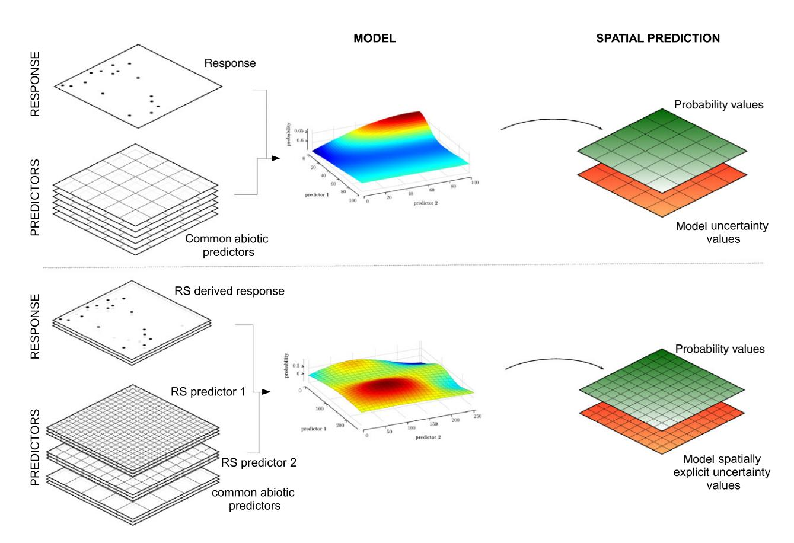

# Remote Sensing in Ecology and Conservation

Open Access

#### INTERDISCIPLINARY PERSPECTIVES

# Will remote sensing shape the next generation of species distribution models?

Kate S. He1, Bethany A. Bradley2, Anna F. Cord3, Duccio Rocchini4, Mao-Ning Tuanmu5, Sebastian Schmidtlein6, Woody Turner7, Martin Wegmann8,9 & Nathalie Pettorelli10

#### Keywords

Ecological niche modeling, habitat suitability modeling, hyperspectral and multispectral data, LiDAR and RADAR metrics, predictor and response variables, spatial and temporal resolution

#### Correspondence

Kate S. He, Department of Biological Sciences, Murray State University, Murray, KY 42071. Tel: +1 270 809 3135; Fax: +1 270 809 2788:

E-mail: xhe@murraystate.edu

#### **Funding Information**

No funding information provided.

Editor: Harini Nagendra Associate Editor: Ned Horning

Received: 8 April 2015; Revised: 30 August 2015; Accepted: 3 September 2015

doi: 10.1002/rse2.7

## **Abstract**

Two prominent limitations of species distribution models (SDMs) are spatial biases in existing occurrence data and a lack of spatially explicit predictor variables to fully capture habitat characteristics of species. Can existing and emerging remote sensing technologies meet these challenges and improve future SDMs? We believe so. Novel products derived from multispectral and hyperspectral sensors, as well as future Light Detection and Ranging (LiDAR) and RADAR missions, may play a key role in improving model performance. In this perspective piece, we demonstrate how modern sensors onboard satellites, planes and unmanned aerial vehicles are revolutionizing the way we can detect and monitor both plant and animal species in terrestrial and aquatic ecosystems as well as allowing the emergence of novel predictor variables appropriate for species distribution modeling. We hope this interdisciplinary perspective will motivate ecologists, remote sensing experts and modelers to work together for developing a more refined SDM framework in the near future.

#### Introduction

Over the past two decades, a tremendous amount of work has been undertaken to map species' distributions and use the collected information to identify suitable habitats (Austin, 2002; Araújo et al. 2005; Franklin 2010). An array of sophisticated modeling tools are available to ecologists

interested in predicting species occurrence (Elith and Leathwick 2009; Kissling et al. 2012) and species distribution models (SDMs) are now commonly used for pursuing diverse research endeavors, such as testing ecological theories (e.g. Petitpierre et al. 2012); predicting species range dynamics in response to environmental change (e.g. Schurr et al. 2012; Fordham et al. 2013, 2014; Dolos et al. 2015);

&lt;sup>1Department of Biological Sciences, Murray State University, Murray, Kentucky 42071, USA

&lt;sup>2Department of Environmental Conservation, University of Massachusetts, Amherst, Massachusetts 01003, USA

&lt;sup>3Department of Computational Landscape Ecology, Helmholtz Centre for Environmental Research – UFZ, Permoserstraße 15, 04318, Leipzig, Germany

&lt;sup>4GIS and Remote Sensing Unit, Department of Biodiversity and Molecular Ecology, Research and Innovation Center, Fondazione Edmund Mach, Via E. Mach 1, S. Michele all'Adige, Trento 38010, Italy

&lt;sup>5Department of Ecology and Evolutionary Biology, Yale University, New Haven, Connecticut 06520, USA

&lt;sup>6Institute of Geography and Geoecology, Karlsruhe Institute of Technology (KIT), 76131 Karlsruhe Germany

&lt;sup>7Earth Science Division, NASA, Washington, District of Columbia, USA

&lt;sup>8Department of Remote Sensing, University of Wuerzburg, 97074, Wurzburg, Germany

&lt;sup>9CEOS Biodiversity at German Remote Sensing Data Centre, German Aerospace Centre DLR, 82234 Wessling, Germany

&lt;sup>10Institute of Zoology, Zoological Society of London, Regent's Park, London, NW1 4RY, UK

assessing invasion risks of introduced species (e.g. Bradley et al. 2009); and facilitating the design and selection of nature reserves (e.g. Kremen et al. 2008).

In most of the SDMs published in the last decade, the response variable (species occurrence data) is derived from herbaria or atlases, whereas predictor variables are mostly derived from spatially interpolated data (e.g. climate variables of climate research unit (CRU), New et al. 2002 and Worldclim, Hijmans et al. 2005), or categorical data (e.g. land cover and vegetation type). Occurrence data derived from remote sensing technology have started to be used in SDM studies (e.g. Bradley and Mustard 2006; Andrew and Ustin 2009), yet the utilities of remotely derived occurrence or abundance data remain largely unexplored. Environmental predictor variables derived from remote sensing data are more common in SDMs; this is particularly true when thinking of topographical information derived from the Shuttle Radar Topography Mission (SRTM) (see examples in Franklin 2010) and land cover maps (e.g. Pearson et al. 2004; Thuiller et al. 2004; Luoto et al. 2007; Newton-Cross et al. 2007; Morán-Ordóñez et al. 2012; Rickbeil et al. 2014). Continuous remotely sensed metrics as predictors of habitat condition, such as the normalized different vegetation index (NDVI) and leaf area index (LAI), both effective proxies for vegetation productivity (Zimmermann et al. 2007; Buermann et al. 2008; Pettorelli 2013), are still relatively under used. Yet, these and other remotely sensed products are becoming increasingly available for ecological analyses. We believe that continuous remote sensing metrics have become an integral part of SDM studies and will contribute significant amount of spatially explicit data for multi-scales and multi-taxa distribution models given recent development in remote sensing technologies and products.

Here, we describe examples of response and predictor variables derived from remote sensing that could provide novel information for species distribution modeling. We focus our attention on spaceborne and airborne systems, targeting both passive and active sensors. Passive sensors considered in this work range from panchromatic (e.g. high-resolution aerial photography with a single grayscale spectral band) to multispectral (e.g. moderate resolution sensors like Landsat collecting information in 4–11 bands) and hyperspectral (e.g. airborne high to moderate resolution data from AVIRIS with over one hundred narrow spectral bands). Active sensors include laser-light remote sensing Light Detection and Ranging (LiDAR) and microwave RADARs. Specific information on these sensors and others is provided in Table 1. We demonstrate how remotely derived variables have helped improve our understanding of species distribution over the past decade with a few case studies, while pointing out the uncertainty and constraints related to the use of remote sensing variables in SDMs. Lastly, we discuss how new technologies and products may shape the next generations of SDMs (NG-SDMs).

# Remote Sensing of Species Distributions: The Response Variable

In SDMs, presence data are the most common response variable, with presence/absence or abundance data only occasionally available (Elith and Leathwick 2009). Occurrence records are generally derived from herbarium and museum collections, national atlases, large-scale field surveys, regional checklists, expert range maps and collections from citizen science groups (Jetz et al. 2012). However, these data can be associated with a variety of limitations, including sampling biases, inaccuracies in geo-referencing and taxonomy (Dickinson et al. 2010). Species occurrence data such as presence and absence records from museum and herbarium collections and field sampling can indeed be quite biased. This can sometimes be traced back to the distribution of collection sites, with some sites being under-sampled due to accessibility and other logistics issues. Reliable species absence data can be even more problematic to acquire since some species can be present in the considered site, but undetected. As demonstrated below, these limitations can be overcome in certain cases by using remotely derived species occurrence records.

# **Plants**

Remote detection of plant species is most likely to be viable if the target plant species has a unique growth form or phenology. Many ecologists are familiar with global or national land cover classifications derived from satellite reflectance data (e.g. Friedl et al. 2002). Even with a few spectral bands, it is possible to separate functional types of vegetation (i.e. grasslands, forests, deserts, salt marshes, etc.) across broad spatial extents (He et al. 2009). A similar approach could enable species-level detection in cases where the target plant is the dominant form or a homogenous stand. For example dominant tree species in shrublands or grasslands have been identified based on unique vegetation index time series signatures (extracted from MODIS; Morisette et al. 2006) as well as through object-based identification of tree crowns given high enough spatial resolution (based on aerial photos; Weisberg et al. 2007). In a perennial shrubland, invasive annual grasses were detectable using Landsat imagery (Peterson 2005).

In addition to identifying distinct plant functional types through growth form, multispectral remote sensing can be used to identify plants with unique phenologies. This approach has been used most often to identify invasive plants (Bradley 2014). For example inter-annual variability in phenology has been used to identify annual grasses

Table 1. Specifics on sensors and missions with platform types, spatial and temporal resolutions and swath width information provided.

| Platform and sensor              | Spatial resolution (pan)                                                                                                                                                                                                   | Spatial resolution (multi) | Spatial resolution (thermal) | Swath width | Revisiting time (theoretical maximum) | Temporal availability |
|----------------------------------|----------------------------------------------------------------------------------------------------------------------------------------------------------------------------------------------------------------------------|----------------------------|------------------------------|----------------|---------------------------------------|--------------------------|
| Passive sensors Multispectral |                                                                                                                                                                                                                            |                            |                              |                |                                       |                          |
| Worldview (-3)                   | 0.31 m                                                                                                                                                                                                                     | 1.24 m                     |                              | 13 km          | 1–4 days                              | 2009(14)- present     |
| Quickbird                        | 0.61 m                                                                                                                                                                                                                     | 2.4 m                      |                              | 17 km          | 1–3 days                              | 2001-present             |
| Pleiades                         | 0.7 m                                                                                                                                                                                                                      | 2 m                        |                              | 20–120 km      | Daily                                 | 2000-present             |
| Ikonos                           | 0.82 m                                                                                                                                                                                                                     | 3.2 m                      |                              | 11 km          | 1–3 days                              | 1999-present             |
| TopSAT                           | 2.8 m                                                                                                                                                                                                                      | 5.6 m                      |                              | 10–15 km       | Daily                                 | 2005-present             |
| RapidEye                         |                                                                                                                                                                                                                            | 6.5 m                      |                              | 77 km          | 5.5 days                              | 2008-present             |
| RapidEye+                        | <1 m                                                                                                                                                                                                                       | Similar to RapidEye        |                              |                |                                       | Launch 2019              |
| SPOT (5)                         | 5 m                                                                                                                                                                                                                        | 10–20 m                    |                              | 60 km          | 2–3 days                              | 1986 (2002)- present  |
| SENTINEL 2A                      |                                                                                                                                                                                                                            | 10–60 m                    |                              | 290 km         | 5 days                                | Launch in 2015           |
| ASTER                            |                                                                                                                                                                                                                            | 15–30 m                    | 90 m                         | 60 km          | 16 days                               | 2000-present             |
| CBERS                            | 20 m                                                                                                                                                                                                                       | 20–260 m                   | 80 m                         | 120–890 km     | 26 days                               | 1999-present             |
| Landsat TM 4/5                | 30 m                                                                                                                                                                                                                       | 30 m                       |                              | 185 km         | 16 days                               | 1982-present             |
| Landsat 7/8                      | 15 m                                                                                                                                                                                                                       | 30 m                       | 60/100 m                     | 185 km         | 16 days                               | 1999/2013- present    |
| MODIS                            |                                                                                                                                                                                                                            | 250–1000 m                 | 1000 m                       | 2330 km        | 1–2 days                              | 2000-present             |
| AVHRR                            |                                                                                                                                                                                                                            | 1090 m                     | 1090 m                       | 2600 km        | Daily                                 | 1978-present             |
| Hyperspectral Hyperion        |                                                                                                                                                                                                                            | 30 m                       |                              | 7.7 km         | Tasked                                | 2000-present             |
| НуМар                            | Spatial resolution depending on flight altitude (c. 3–20 m), availability on request, up to several hundred bands                                                                                                          |                            |                              |                |                                       |                          |
| HySpex AVIRIS EnMAP OMI | Hyperspectral space-borne mission by DLR, c. 30 m spatial resolution, launch planned before c. 2020 Hyperspectral space-borne mission for atmospheric parameters by NIVR and FMI, planned with 13–24 km spatial resolution |                            |                              |                |                                       |                          |

| Platform and sensor | Spatial resolution                                                   | Revisiting time (theoretical maximum) | Temporal availability |
|---------------------|----------------------------------------------------------------------|---------------------------------------|-----------------------|
| Active sensors      |                                                                      |                                       |                       |
| COSMO-Skymed        | 1–15 m                                                               | 1–15 days                             | 2007-present          |
| TerraSAR-X          | 1–18 m                                                               | 2.5 days                              | 2007-present          |
| Tandem-X            | 1–18 m                                                               | 2.5 days                              | 2010-present          |
| RADARSAT-2          | 3–100 m                                                              | 24 days                               | 2007-present          |
| Sentinel 1          | 5–40 m                                                               | c. 12 days                            | 2014-present          |
| ENVISAT             | 30–1000 m                                                            | 35 days                               | 2002–2012             |
| ICESAT 1 (2)        | 2003–2009 (launch 2017, Advanced Topographic Laser Altimeter System) |                                       |                       |
| LiDAR               | Airborne, availability on request                                    |                                       |                       |
| GEDI                | Space-borne LiDAR, planned                                           |                                       |                       |
| TRMM                | 5 km                                                                 | 16 times per day                      | 1997-present          |
| GPM                 | 5 km                                                                 | c. 3 hours                            | 2014-present          |
| SMAP                | 1–3 km                                                               | 2–3 days                              | 2015-present          |
| SRTM                | Global DEM, 30–90 m spatial resolution                               |                                       |                       |
| ASTER-DEM           | Global DEM, 30 m spatial resolution                                  |                                       |                       |
| TerraSAR-X/Tandem-X | Global DEM, 12 m spatial resolution, forthcoming                     |                                       |                       |

in desert ecosystems, including cheatgrass (*Bromus tectorum*) (Bradley and Mustard 2005) and Lehmann lovegrass (*Eragrostis lehmanniana*) (Huang and Geiger 2008). Early growth and late senescence has been used to map dominant forest understory species including two bamboo spe-

cies (*Bashania faberi* and *Fargesia robusta*) (Tuanmu et al. 2010) and honeysuckle (*Lonicera maackii*) (e.g. Wilfong et al. 2009).

The previous examples of broad-scale plant detection rely on unique functional or phenological properties. But,

detection of plant species is also possible thanks to the higher thematic details provided by hyperspectral data. With over a hundred spectral bands being monitored, hyperspectral sensors can detect subtle differences in reflectance resulting from unique plant chemistries. This could help reduce misidentification and taxonomic biases found in field surveys. Numerous case studies of successful plant species detection using hyperspectral information can be found for exotic and invasive plants (Huang and Asner 2009; He et al. 2011). For example Andrew and Ustin (2008) used HyMap to identify unique white flowers of invasive pepperweed (Lepidium latifolium) near Sacramento, California. Similarly, Mitchell and Glenn (2009) also used HyMap to identify the unique yellow bracts of invasive leafy spurge (Euphorbia esula) in south-east Idaho. In Hawaii, a combination of differences in pigmentation and leaf water content enabled the detection of non-native trees using AVIRIS (Asner et al. 2008a). Other tree species were also successfully mapped with hyperspectral data within the tropics and subtropics (Clark et al. 2005; Carlson et al. 2007; Lucas et al. 2008; Yang et al. 2009; Féret and Asner 2013) as well as in temperate forest ecosystems (Fassnacht et al. 2014). Given sufficient expertise, effective classification algorithms and available data, many more plant species could be detectable using hyperspectral data.

LiDAR coupled with multispectral or hyperspectral data has also been used for identifying tree species (Jones et al. 2010; Heinzel and Koch 2011; Dalponte et al. 2012; Alonzo et al. 2014; Ghosh et al. 2014). This approach takes the advantage of using complementary information gathered from spectral reflectance and vertical structure of target species. Using a multi-sensor system (hyperspectral AISA, multispectral GeoEye-1, and high point density LiDAR), Dalponte et al. (2012) identified eight tree species in the Southern Alps with accuracies ranging from 76.5 to 93.2%. Similar conclusions were also made when mapping eleven tree species in coastal south-western Canada thanks to a combination of hyperspectral imagery and LiDAR data (Jones et al. 2010). In Hawaii, Asner et al. (2008b) employed a hybrid airborne system, combining the Carnegie Airborne Observatory small-footprint LiDAR system with AVIRIS to map the three-dimensional spectral and structural properties of three highly invasive trees. In this particular study, the authors separated the tree species based on their unique biophysical properties with a multi-stage spectral mixture analysis.

## **Animals**

Tracking the presence of animal species using satellite remote sensing is feasible given fine enough pixel resolution and large enough animals under an unobstructed view. For example Yang et al. (2014) used both expert interpretation and an automated object-based classification to estimate populations of zebra (*Equus quagga burchellii*) and wildebeest (*Connochaetes taurinus*) and investigate their migration patterns in the open savannah of the Maasai Mara National Reserve, Kenya, thanks to very high-resolution GeoEye-1 satellite images (0.5 m resolution). Fretwell et al. (2014) identified 55 southern right whales (*Eubalaena australis*) in a breeding ground off the coast of Argentina based on brighter reflectance from WordView-2 (50 cm resolution). Similar approaches have been used to identify polar bears (*Ursus maritimus*) (Stapleton et al. 2014), walrus (*Odobenus rosmarus*) (Platonov et al. 2013) and emperor penguins (*Aptenodytes forsteri*) (Fretwell et al. 2012).

Spaceborne and airborne remote sensing can be very effective in supplementing species occurrence data (presence-absence, presence-only and point events), but getting very high-resolution remote sensing imagery is still costly in general even though no-cost imagery and open-source software for imagery processing are an increasingly common practice worldwide (Wegmann et al. 2015). At times, these high costs can be reduced by employing light-weight unmanned aerial vehicles (UAVs; Anderson and Gaston 2013).

For example UAVs mounted with off the shelf cameras and GPS were used to count marine mammals (dugong, *Dugong dugon*) in western Australia (Hodgson et al. 2013), along with a variety of other marine species. In a terrestrial case study, UAV images were used to identify orangutan (*Pongo abelii*) and elephant (*Elephas maximus*) in Sumatra, Indonesia (Koh and Wich 2012).

High spatial resolution remote sensing of terrestrial and marine animals is an excellent tool for measuring populations and identifying important habitat (e.g. stopovers on migratory routes, breeding grounds). Thus far, most animal detection studies have focused on a small area due to the reliance on very high spatial resolution data. However, increasingly available high-resolution imagery and inexpensive UAVs coupled with object-based identification of animals might enable much broader scale identification of animal occurrence. The use of UAVs can also be a particularly cost-efficient way to collect input data for model calibration and validation.

Similarly to species occurrence data collected from field surveys, remotely derived response variables come with uncertainty and errors. These errors are typically introduced during data acquisition and processing, and through associated analytical algorithms. Studies have used various metrics to estimate classifiers' performance, ideally based on independent validation data, such as the Cohen's kappa statistics, confusion matrix, F-scores, overall accuracy and the receiver operating characteristic (ROC) curve (obtained by plotting fraction of true posi-

tive against fraction of false positive). The typically acceptable accuracies range from 60 to 90% for plant species and error rates for validation or training data are not reported in most studies (He et al. 2011). Furthermore, false-positive and false-negative detections can be identified by using plot-scale surveys guided by remotely sensed data (Asner et al. 2008c). When modeling species potential ranges with presence-only data, omission errors (identifying a species as absent when it is actually present) can lead to underestimates of potential range. In contrast, commission errors (identifying a species as present when it is actually absent) can lead to overestimates of potential range. The relative amount of omission versus commission error in the initial remote sensing map can inform interpretation of a resulting SDM output.

Regardless of the relative error rates, remote sensing of plants and animals provides both presence and absence data, which is more informative for SDMs than presenceonly data, a relative measure that only represents a partial estimate of species occurrence (Fithian and Hastie 2013). Recent developments in SDMs have shown that a Poisson process model can combine presence-absence and presence-only data for correcting sampling bias in SDMs (Fithian et al. 2015). Furthermore, treating presence-only data as point events and estimating the intensity of the spatial location of presence points with a point process modeling framework, may also reduce uncertainty in SDMs (Renner et al. 2015). In the latter case, remote sensing can effectively provide point event data at various spatial scales to complement survey data. Most importantly, remote sensing may provide an estimate of absolute population density rather than relative density and this can be achieved with LiDAR and RADAR systems, particularly for tree species. Lastly, we want to point out that response variables derived from remote sensing can be updated every year or at desired time span, which allows a more dynamic approach to understanding habitat suitability and species range expansion or contraction. As time series data become more readily available, phenological events in plants and animals can be tracked and linked to fine-scale species distribution studies.

# Remote Sensing of Environmental Conditions: The Predictor Variable

Good distribution models require spatial predictor variables that are ecologically relevant (Franklin 1995) for the modeled organisms. In some cases, remote sensing metrics can be challenging to translate into meaningful ecological entities, particularly those that provide indirect measures of ecosystem processes (e.g. surface roughness from RADAR; Buermann et al. 2008) making it unclear why to consider them in SDMs in the first place.

# Abiotic predictor variables

Climate data have been commonly used to predict potential species distributions across broad spatial scales (e.g. Franklin 2010). CRU (New et al. 2002), WorldClim (Hijmans et al. 2005), CliMond (Kriticos et al. 2012) and PRISM (US only; Daly et al. 2002), are all examples of spatially explicit datasets of climatic conditions. These datasets encompass information on modeled temperature, precipitation, solar radiation and soil moisture (along with several derived bioclimatic combinations of temperature and precipitation), which are based on interpolations from global weather stations. However, interpolations are only as good as the underlying data, and uneven geographical coverage leads to high model uncertainty, especially in developing countries where few weather stations are in place (Daly 2006; Bedia et al. 2013; Waltari et al. 2014). When uncertainty in spatial climate variables is not accounted for, coefficient estimates tend to be biased which lead to poor performances of SDMs as shown with recent simulations (Stoklosa et al. 2015).

Remotely sensed climate data are continuously observed without interpolation and geographical biases. Therefore, satellite-based temperature, precipitation and radiation measurements could improve climate predictor variables. For example land surface temperature (LST) is measured globally four times per day by the MODIS Terra and Aqua satellites (Wan et al. 2004; Sims et al. 2008) and a derived product at 250 m spatial resolution is freely available at http://gis.cri.fmach.it/eurolst for Europe (Metz et al. 2014). MODIS LST data are increasingly being used in SDMs to understand and predict ecological processes (Buermann et al. 2008; Bisrat et al. 2012; Neteler et al. 2013; Pau et al. 2013; Still et al. 2014). Recently, efforts have been made to use LST to facilitate interpolation of weather station data as weather station data have a long temporal span, which cannot be fully covered by remote sensing data (Parmentier et al. 2015). In addition, the global UV-B radiation dataset from NASA Aura-OMI (Beckmann et al. 2014), designed for macroecological studies, offers exciting opportunities for both correlative and process-based species distribution modeling.

Precipitation estimates from satellite are available historically from TRMM (Tropical Rainfall Measuring Mission; Huffman et al. 2007) at a 4 km spatial resolution covering the tropical region (20°N–20°S) and extended to 50°N–50°S (Wang et al. 2014). New rainfall products are just becoming available from the Global Precipitation Measurement (GPM) mission, which has replaced TRMM (TRMM data collection stopped in 2105). With the recent launch of NASA's Soil Moisture Active Passive (SMAP) Mission, high-resolution soil moisture data (3 and 9 km) with global coverage will also soon be available. Finally,

an analysis of global cloud cover from MODIS can serve as a proxy for average precipitation (A. Wilson and W. Jetz, pers.comm. 2015). Satellite measurements of temperature, precipitation and soil moisture may thus soon provide better wall to wall estimates of climatic conditions than weather station interpolations and are becoming increasingly accessible to ecologists for building SDMs with less uncertainty.

Topographic features of land surface derived from SRTM digital elevation data (the DEM products) and GDEM (Global Digital Elevation Map) from ASTER are already commonly used as predictor variables in SDMs (Franklin 2009). For finer-scale studies of local and micro-topography, airborne LiDAR and stereographic DEMs from WorldView-2 are both options. Very highresolution topographic data derived from LiDAR have been incorporated in SDMs while assessing habitat suitability of eleven at-risk plant species in Hawaii (Questad et al. 2014) and for assessing diversity and composition of a temperate montane forest in Germany (Leutner et al. 2012). However, both datasets are costly and LiDAR data are currently limited in temporal coverage and spatial extent. An emerging alternative source of very high-resolution DEMs are UAVs (Anderson and Gaston 2013), which are rapidly becoming more reliable, lightweight and cost effective for LiDAR instrumentation (Watts et al. 2012).

In the marine realm, sea-surface temperature derived from Aqua MODIS (https://podaac.jpl.nasa.gov/SeaSurfaceTemperature), with global resolutions as fine as  $1 \times 1$  km, has been one of the most influential predictors in SDMs for identifying productivity hotspots and seascape modeling (Louzao et al. 2011; Ramírez et al. 2014). Furthermore, the Bio-ORACLE (ocean rasters for analyses of climate and environment at http://www.bio-oracle.ugent.be), a marine counterpart of the WorldClim database has been developed, consisting of 23 environmental rasters, derived from both satellite-based and in situ data for modeling the distribution of shallow water marine species at a global scale (Tyberghein et al. 2012). A comprehensive review on using remotely derived variables to inform marine habitat mapping and monitoring can be found in Kachelriess et al. (2014).

## **Biotic predictor variables**

Vegetation characteristics can be important predictors of species' habitat, acting as a proxy for sources of food availability or shelter. Many studies have used remotely sensed variables to model habitat suitability for animals, in particular using satellite-derived land cover classifications (Leyequien et al. 2007) as well as continuous metrics of vegetation productivity such as NDVI (Pettorelli

et al. 2011). For example NDVI data from MODIS was used as a predictor of food availability in a model of vervet monkey (*Chlorocebus pygerythrus*) habitat in Africa (Willems et al. 2009). Similarly, researchers used NDVI data from AVHRR to assess habitat availability of the Iberian mole (*Talpa occidentalis*) along a biogeographic gradient in Spain (Suárez-Seoane et al. 2014). Although being increasingly used (Bradley et al. 2012; Cord et al. 2013), incorporating remotely sensed metrics of vegetation into models of habitat suitability requires a more careful approach, particularly when it comes to plants. Bradley et al. (2012) indeed caution that the use of NDVI metrics in plant models could create biases in cases where they measure properties of the target species directly.

Vegetation structure derived from RADAR or LiDAR could also be an important predictor of habitat (Vierling et al. 2008). For example Buermann et al. (2008) used RADAR data from QuikSCAT as a proxy for Amazonian forest canopy roughness and found that it improved habitat suitability models for several species of birds. Similarly, Farrell et al. (2013) concluded that models incorporating LiDAR-derived metrics, such as tree height, improved model predictions of bird habitat in Texas.

In addition, vegetation phenology derived from satellite time series can provide important information about timing of biological events (Morisette et al. 2009) and serve as a proxy for habitat. For example NDVI-based estimate of the length of summer was an important predictor of moose (Alces alces) body weight, and therefore habitat quality, in Norway (Herfindal et al. 2006). Tuanmu et al. (2011) suggested that multi-year phenology metrics derived from MODIS can reduce model complexity and multicollinearity among predictor variables and thus improve model transferability (i.e. the ability of a model developed in one time period/area to be applied to a different time period/area) for giant panda (Ailuropoda melanoleuca) habitat change in China. Furthermore, remotely sensed seasonal variation in vegetated land surfaces can be influential predictor variables when modeling species distribution and habitat suitability (Osborne and Suárez-Seoane 2007).

Multi-year NDVI and its predicted values under climate change scenarios have been used to assess likely impacts of environmental change on future species distributions and extinction risks, which are a major motivation for SDM research. Singh and Milner-Gulland (2011) for example used 25 years of temperature and NDVI data to identify the changing drivers of migratory saiga (*Saiga tatarica*) distribution in Central Kazakhstan under a range of scenarios, including changes in temperature and productivity. In this study, projected NDVI values were proven as one of the critical predictors in modeling future saiga distribution and changes in population density.

Thus, if remotely sensed predictors, such as NDVI in this case, improve SDMs, then predicted extinction risks from environmental change are going to become more reliable.

Information on biotic conditions can also be derived from UAVs. For example Koh and Wich (2012) note that imagery from a UAV in Sumatra, Indonesia could detect evidence of small-scale human disturbance, including logging and local oil palm plantations. Similarly, Getzin et al. (2014) used a UAV to identify small forest gaps in Germany, which could be an important predictor of early successional species occurrence.

For a few satellite missions (e.g. Landsat), data archives are now decades long, enabling the tracking of temporal changes in ecosystems. While land use/land cover change is a long recognized discipline (e.g. Meyer and Turner 1994), including change metrics as predictors in SDMs is exceedingly rare. Yet, temporal trends in NDVI (e.g. Verbyla 2008) and other satellite measurements may be key indicators of ecological changes likely to influence the distribution of species. With MODIS archives reaching 15 years and Landsat 40, plus the recently launched Sentinel 1 and 2 missions, the combination of higher spatial and longer-term temporal analyses is increasingly possible.

# **Future Opportunities**

## New space missions and sensor networks

Remote sensing products provide dynamic information that is increasingly relevant to the fields of ecology and conservation biology (Pettorelli et al. 2014a; Turner 2014). In recent years, the potential of remote sensing to support ecological research has been boosted by the prospects of new technological developments and new space missions, including a number of very high spatial and spectral resolution passive optical satellites as well as active optical (LiDAR) and RADAR imaging systems equipped with state-of-the-art technology (Pettorelli et al. 2014b).

New optical satellite missions include the European Sentinel-2 satellites, the Pleiades of CNES, the TopSat (UK), CBERS (China and Brazil) and the Resourcesat series (India) along with a host of private sector missions seeking to offer high spatial resolution imagery of the sunlit Earth essentially everywhere at all times. Recently launched and planned RADAR and LiDAR missions include Sentinel 1 with C-Band, the TerraSAR-X/Tan-DEM-X mission, the RadarSat program of the Canadian Space Agency, the RADAR mission by the JAXA space agency in Japan and the NASA Global Ecosystem Dynamics Investigation (GEDI) LiDAR planned for the International Space Station (Koch 2010). Detailed information on sensors and missions is listed in Table 1. In

addition, there are continued new developments in low-cost, light-weight, and long-duration UAVs (Lucieer et al. 2014). New missions and new sensors will allow mapping and monitoring of global ecosystems at an unprecedented level of detail (sub-meter spatial resolution and 3-D profiles are now possible), potentially providing invaluable data for improving the predictive power of SDMs.

# Novel predictor variables bring new possibilities

Biophysical, biochemical and physiological predictors derived from modern remote sensing have huge potential when it comes to improving the predictive power of SDMs. Advances over the more widely used NDVI include LAI3g (third generation of LAI data with bestquality and significantly improved post-processing algorithms) and fraction of absorbed photosynthetically active radiation (fPAR, especially fPAR3g), both of which are available from MODIS data. In addition to detecting plant pigmentation, hyperspectral data can be used to measure leaf water content and leaf nitrogen content, along with other unique chemical signals. Active LiDAR and RADAR can estimate canopy/tree height and stem density, canopy moisture and 3-D habitat structural profiles (a vertical description of the habitat, such as the position of leaves, branches and ground) (Simonson et al. 2014). These and other potential predictor variables are outlined in Table 2.

With new high-resolution sensors, remotely sensed data could add insight into the spatial patterns of plant interactions at local to landscape scales. These sorts of biotic interactions are absent from SDMs due to lack of data (Kissling et al. 2012). But, hyperspectral data can be used to classify vegetation communities into plant functional types based on optical reflectance values (Ustin and Gamon 2010), creating very high-resolution maps of plant assemblages, which can provide information on interactions among species in terms of competition for water and light. Hyperspectral data have also been used to map plant communities based on competitive, stress tolerant, ruderal strategy (Schmidtlein et al. 2012) where C strategists are highly competitive, S strategists are stress tolerant and R strategists are ruderals with rapid growth and short life spans (sensu Grime 1974, 1977). At broader scales, remote measurements including fPAR, NDVI, LAI and tree/canopy height can combine to estimate overall ecological diversity (van Ewijk et al. 2014), a proxy for competition. These sorts of remote sensing products could enable assessments of intensity and spatial location of biotic interactions across thousands of hectares, much larger than current plot studies.

**Table 2.** Remotely derived predictor variables with sources and case studies provided.

| Predictor variables                                             | Source                                                                          | Examples                                                                                                                                                                                       |
|-----------------------------------------------------------------|---------------------------------------------------------------------------------|------------------------------------------------------------------------------------------------------------------------------------------------------------------------------------------------|
| Abiotic predictors                                              |                                                                                 |                                                                                                                                                                                                |
| Land cover                                                      | MODIS, Landsat, Landsat ETM +                                        | Pearson et al. (2004); Thuiller et al. (2004); Luoto et al. (2007); Newton-Cross et al. (2007); Morán-Ordóñez et al. (2012); Rickbeil et al. (2014); Tuanmu and Jetz (2014)              |
| Topographic features/ elevation                              | SRTM, (DEM products), LiDAR, WorldView-2, ASTER, GTOPO30, GMTED2010, UAVs | Buermann et al. (2008); Franklin (2010); Pradervand et al. (2014); Questad et al. (2014); van Ewijk et al. (2014)                                                                           |
| Land surface temperature (LST)                                  | Landsat-8, MODIS                                                                | Cord and Rödder (2011); Bisrat et al. (2012); Neteler et al. (2013); Pau et al. (2013); Still et al. (2014)                                                                                    |
| Sea-surface temperature (SST)                                   | Aqua MODIS                                                                      | Louzao et al. (2011); Ramírez et al. (2014); Rickbeil et al. (2014)                                                                                                                            |
| Precipitation                                                   | TRMM, GPM, MODIS cloud cover                                                    | Saatchi et al. (2008); Rovero et al. (2014); Seiler et al. (2014)                                                                                                                              |
| Soil moisture Biotic predictors                              | NASA SMAP                                                                       | Not in SDM literature yet                                                                                                                                                                      |
| Normalized difference vegetation index (NDVI)                   | AVHRR, Landsat, MODIS, QuickBird                                                | Morisette et al. (2006); Zimmermann et al. (2007); Prates-Clark et al. (2008); Pettorelli et al. (2011); Feilhauer et al. (2012); Hall et al. (2012); van Ewijk et al. (2014)                  |
| Vegetation phenology                                            | MODIS, Landsat                                                                  | Bradley and Mustard (2005); Morisette et al. (2009); Wilfong et al. (2009); Tuanmu et al. (2010)                                                                                               |
| Leaf area index (LAI)                                           | MODIS                                                                           | Buermann et al. (2008); Prates-Clark et al. (2008); Saatchi et al. (2008)                                                                                                                      |
| Fraction of absorbed photosynthetically active radiation (fPAR) | MODIS, Landsat                                                                  | Bisrat et al. (2012); Fitterer et al. (2012); Rickbeil et al. (2014); Gould et al. (2015)                                                                                                      |
| Canopy/tree height                                              | LiDAR and RADAR                                                                 | Goetz et al. (2007); Swatantran et al. 2012; Tattoni et al. (2012); Farrell et al. (2013); Alonzo et al. (2014); Ficetola et al. (2014); Simonson et al. (2014); van Ewijk et al. (2014) |
| Stem density                                                    | LiDAR and RADAR                                                                 | Swatantran et al. (2012)                                                                                                                                                                       |
| Canopy moisture                                                 | Hyperspectral sensors, QSCAT                                                    | Buermann et al. (2008); Prates-Clark et al. (2008)                                                                                                                                             |
| Canopy roughness                                                | QSCAT                                                                           | Saatchi et al. (2008)                                                                                                                                                                          |
| 3-D habitat structural profile                                  | LiDAR and RADAR                                                                 | Bergen et al. (2009); Goetz et al. (2010); Simonson et al. (2014)                                                                                                                              |
| Leaf water content                                              | Hyperspectral sensors                                                           | Not in SDM literature yet                                                                                                                                                                      |
| Leaf nitrogen content                                           | Hyperspectral sensors                                                           | Not in SDM literature yet                                                                                                                                                                      |
| Spectral heterogeneity/ functional types                     | Hyperspectral sensors, Landsat                                                  | Morán-Ordóñez et al. (2012); Schmidtlein et al. (2012); Henderson et al. (2014); Pottier et al. (2014)                                                                                         |
| Spatial heterogeneity of vegetation                          | MODIS, Landsat                                                                  | Lahoz-Monfort et al. (2010); Culbert et al. (2012); Tuanmu and Jetz (2015)                                                                                                                     |

# The NG-SDMs

Given the opportunities provided by remote sensing presented above, along with data collected from well-designed experiments, field plots and *in situ* sensors, the NG-SDMs could develop rapidly, building upon recent development in SDMs (Lurgi et al. 2015; Renner et al. 2015). NG-SDMs could be integrative models that (1) operate at different areas along the correlative-process model continuum (sensu Dormann et al. 2012). The majority of current SDMs either fall at one extreme end of the continuum for bring correlative (with explanatory variables which may or may not be casual factors for species occurrence) or fit at the other extreme end of the continuum for being process-based (with clearly defined

ecological meaningful parameters); (2) form a hierarchically nested predictive framework, allowing for assessing species distribution at multiple biological levels and spatial scales; and (3) explicitly consider biotic interactions and variation in demographic rates with a process-oriented approach driven by underlying mechanisms (Schurr et al. 2012; Kissling 2013; Wisz et al. 2013; Renner et al. 2015). We provide a comparative modeling framework between the current SDMs and the NG-SDMs proposed in this perspective in Figure 1.

The concrete contributions to the development of NG-SDMs from remote sensing could include a variety of ecologically meaningful predictors. First, ecophysiologically relevant variables, such as remotely derived earth surface temperature, precipitation and MODIS phenologi-

**Figure 1.** A comparative modeling framework of the current SDMs (above) and the NG-SDMs (below), showing remotely derived response variable and multi-scale predictor variables, including spatially explicit uncertainty of predictor variables. In classical SDMs, uncertainty is often not reported in a spatially explicit manner and one layer per predictor is used. In contrast, NG-SDMs can have a stack of images organized systematically by scales in time to capture each predictor, thus resulting predictions with high accuracy. NG-SDMs, next generation species distribution models.

cal metrics as discussed in previous sections, can be the basis for mapping a species' tolerance to abiotic constraints. These variables are mostly suited for broad-scale models developed at the correlative end of the continuum for both plant and animal species. Second, demographic parameters capturing differences in life histories, such as a population's growth rates obtained from LiDAR (e.g. tree height, stem density for both canopy and sub-canopy layers at different points in time) and species' biophysical traits derived from hyperspectral sensors (e.g. leaf water and nitrogen contents, pigment characteristics and other biochemistry traits), provide opportunities for developing process-based models at the local scale. Third, biotic predictors, including plant functional types, fPAR (an indirect proxy for light competition and growth) and 3-D habitat structure (capable of depicting reliance among species), can be related to biotic interactions at both local and broader scales. The response variables in NG-SDMs will be multi-level in nature, and could include the presence/absence of a single taxon; species fitness metrics; trait diversity information; and occurrence or abundance of aggregated taxa, functional groups and community assemblages. Being integrative models as suggested by Lurgi et al. (2015), the NG-SDMs can handle a wide range of data types and resolutions, and model uncertainty, while being capable of revealing the underlying causal factors of shaping species distribution and abundance.

Finally, we also want to stress the limitations and challenges of remote sensing in NG-SDMs. First of all, not all plant and animal species can be detected by remote sensors. Understory species and species with lesser distinctive spectral features are difficult to detect. To this end, sensor networks and data fusion (optical/RADAR/LiDAR) may play a key role in tracking species distribution (Koch 2010; Dalponte et al. 2012). Second, there is always a trade-off between spatial and temporal resolutions and a trade-off between spatial and spectral resolution. For

example high temporal resolution data usually have low spatial resolution (such as time series of multispectral sensors, Landsat or MODIS). Low spatial resolution can hardly discriminate objects on the ground resulting in lower classification accuracy. In general, finer spatial resolution increases classification accuracy, but at the same time, smaller pixels increase spectral variance resulting in decreased spectral separability of classes (Nagendra and Rocchini 2008). Third, remote sensing data are limited by the short time span of their availability and their contributions to modeling future projections of species distributions under climate change scenarios are limited at this stage. However, current archives of remote sensing data provide important baseline information such as changes in plant physiology and phenology for future climate change studies. New sensors with high temporal resolutions will become an integral part of monitoring instrument for tracking and predicting future species distribution under global climate change. Fourth, using species distributions that have been derived from remote sensing as responses in image-based SDMs bears the risk of circularity. Even if we have an independent response and aim at using remote sensing as predictor we should consider that the response may have had an influence on reflectance. Fifth, to fully utilize remote sensing data, one needs expertise in data processing and software development. In recent years, this has been facilitated by open-source algorithms and software as well as powerful computing capacities. Lastly, accessibility to free remote sensing data with global coverage can be challenging and this is particularly true in developing countries where data processing, storage and sharing are still hampered by information technology and archiving capability (Pettorelli et al. 2014b).

To overcome these limitations and constraints, we call for (1) the creation of sensor networks and improved interoperability between remotely sensed information and *in situ* biological data collections, as *in situ* data provide powerful information for accurate imagery interpretation; (2) development of ecologically meaningful predictors and application of cross-scale approaches; and (3) targeted coordination of field campaigns and the acquisition of remote sensing data.

#### Conclusions

Remote sensing has been one of the most powerful approaches to provide observations of key species distribution patterns in terms of reduced time and costs. Novel analytical techniques, increasing computational capacity, enhanced sensor fusion and networking capability as well as free access to satellite data (Turner 2014) have greatly promoted the use of remote sensing in species distribu-

tion modeling and provide the opportunity to develop a novel modeling framework as we propose here, the NG-SDMs. This modeling framework will bring new possibilities for hypothesis testing and further exploration of generalized patterns of biodiversity and underlying environmental drivers in both terrestrial and aquatic ecosystems. We hope that this interdisciplinary perspective will stimulate more discussions on species distribution modeling and motivate ecologists, remote sensing experts and modelers to work together for developing a more refined modeling framework in the near future.

# **Acknowledgments**

This paper emerged from a Plenary Symposium 'Tracking Changes from Space: Advances of Remote Sensing in Biogeography' at the 7th Biennial Conference of the International Biogeography Society (IBS), held in Bayreuth, Germany from 8 to 12 January 2015. The symposium organizers, Kate S. He, Anna F. Cord and Mao-Ning Tuanmu, thank the IBS for making the symposium possible. We are also very fortunate to have had very thorough and insightful reviewers; the current paper has benefited greatly from their comments and suggestions.

### **Conflict of Interest**

None declared.

# References

Alonzo, M., B. Bookhagen, and D. A. Roberts. 2014. Urban tree species mapping using hyperspectral and LiDAR data fusion. Remote Sens. Environ. 148:70–83.

Anderson, K., and K. J. Gaston. 2013. Lightweight unmanned aerial vehicles will revolutionize spatial ecology. Front. Ecol. Environ. 11:138–146.

Andrew, M. E., and S. L. Ustin. 2008. The role of environmental context in mapping invasive plants with hyperspectral image data. Remote Sens. Environ. 112:4301–4317.

Andrew, M. E., and S. L. Ustin. 2009. Habitat suitability modelling of an invasive plant with advanced remote sensing data. Divers. Distrib. 15:627–640.

Araújo, M. B., R. G. Pearson, W. Thuiller, and M. Erhard. 2005. Validation of species–climate impact models under climate change. Glob. Change Biol. 11:1504–1513.

Asner, G. P., M. O. Jones, R. E. Martin, D. E. Knapp, and R. F. Hughes. 2008a. Remote sensing of native and invasive species in Hawaiian forests. Remote Sens. Environ. 112:1912–1926.

Asner, G. P., D. E. Knapp, T. Kennedy-Bowdoin, M. O. Jones, R.
E. Martin, J. Boardman, et al. 2008b. Invasive species detection in Hawaiian rainforests using airborne imaging spectroscopy and LiDAR. Remote Sens. Environ. 112:1942–1955.

- Asner, G. P., R. F. Hughes, P. M. Vitousek, E. David, D. E. Knapp, T. Kennedy-Bowdoin, et al. 2008c. Invasive plants transform the three-dimensional structure of rain forests. Proc. Natl. Acad. Sci. USA 105:4519–4523.
- Austin, M.P. 2002. Spatial prediction of species distribution: an interface between ecological theory and statistical modelling. Ecol. Model. 157:101–118.
- Beckmann, M., T. Václavík, A. M. Manceur, L. Šprtová, H. von Wehrden, E. Welk, et al. 2014. glUV: a global UV-B radiation dataset for macroecological studies. Methods Ecol. Evol. 5:372–383
- Bedia, J., S. Herrera, and J. M. Gutierrez. 2013. Dangers of using global bioclimatic datasets for ecological niche modeling. Limitations for future climate projections. Global Planet. Change 107:1–12.
- Bergen, K., S. Goetz, R. Dubayah, G. Henebry, M. Imhoff, R. Nelson, et al. 2009. Remote sensing of vegetation 3D structure for biodiversity and habitat: review and implications for LiDAR and RADAR spaceborne missions. J. Geophys. Res. 114:GE00E06.
- Bisrat, S. A., M. A. White, K. H. Beard, and D. Richard Cutler. 2012. Predicting the distribution potential of an invasive frog using remotely sensed data in Hawaii. Divers. Distrib. 18:648–660.
- Bradley, B. A. 2014. Remote detection of invasive plants: a review of spectral, textural and phenological approaches. Biol. Invasions 16:1411–1425.
- Bradley, B. A., and J. F. Mustard. 2005. Identifying land cover variability distinct from land cover change: cheatgrass in the Great Basin. Remote Sens. Environ. 94:204–213.
- Bradley, B. A., and J. F. Mustard. 2006. Characterizing the landscape dynamics of an invasive plant and risk of invasion using remote sensing. Ecol. Appl. 16:1132–1147.
- Bradley, B. A., M. Oppenheimer, and D. S. Wilcove. 2009. Climate change and plant invasion: restoration opportunities ahead? Glob. Change Biol. 15:1511–1521.
- Bradley, B. A., A. D. Olsson, O. Wang, B. G. Dickson, L. Pelech, S. E. Sesnie, et al. 2012. Species detection vs. habitat suitability: are we biasing habitat suitability models with remotely sensed data? Ecol. Model. 244:57–64.
- Buermann, W., S. Saatchi, T. Smith, B. Zutta, J. Chaves, B. Mila, et al. 2008. Predicting species distributions across the Amazonian and Andean regions using remote sensing data. J. Biogeogr. 35:1160–1176.
- Carlson, K. M., G. P. Asner, R. F. Hughes, R. Ostertag, and R. E. Martin. 2007. Hyperspectral remote sensing of canopy biodiversity in Hawaiian lowland rainforests. Ecosystems 10:526–549.
- Clark, M., D. A. Roberts, and D. B. Clark. 2005. Hyperspectral discrimination of tropical rain forest tree species at leaf to crown scales. Remote Sens. Environ. 96:497–508.
- Cord, A. F., and D. Rödder. 2011. Inclusion of habitat availability in species distribution models through multitemporal remote-sensing data? Ecol. Appl. 21:3285–3298.

- Cord, A. F., R. K. Meentemeyer, P. J. Leitão, and T. Václavík. 2013. Modelling species distributions with remote sensing data: bridging disciplinary perspectives. J. Biogeogr. 40:2226–2227.
- Culbert, P. D., V. C. Radeloff, V. St-Louis, C. H. Flather, C. D. Rittenhouse, T. P. Albright, et al. 2012. Modeling broadscale patterns of avian species richness across the Midwestern United States with measures of satellite image texture. Remote Sens. Environ. 118:140–150.
- Dalponte, M., L. Bruzzone, and D. Gianelle. 2012. Tree species classification in the Southern Alps based on the fusion of very high geometrical resolution multispectral/hyperspectral images and LiDAR data. Remote Sens. Environ. 123:258–270.
- Daly, C. 2006. Guidelines for assessing the suitability of spatial climate data sets. Int. J. Climatol. 26:707–721.
- Daly, C., W. P. Gibson, G. H. Taylor, G. L. Johnson, and P. Pasteris. 2002. A knowledge-based approach to the statistical mapping of climate. Clim. Res. 22:99–113.
- Dickinson, J. L., B. Zuckerberg, D. N. Bonter, A. F. Dickinson, and L. Janis. 2010. Citizen science as an ecological research tool: challenges and benefits. Annu. Rev. Ecol. Evol. Syst. 41:149–172.
- Dolos, K., A. Bauer, and S. Albrecht. 2015. Site suitability for tree species: is there a positive relation between a tree species' occurrence and its growth? Eur. J. Forest Res. 134:609–621.
- Dormann, C. F., S. J. Schymanski, J. Cabral, I. Chuine, C. Graham, F. Hartig, et al. 2012. Correlation and process in species distribution models: bridging a dichotomy. J. Biogeogr. 39:2119–2131.
- Elith, J., and J. R. Leathwick. 2009. Species distribution models: ecological explanation and prediction across space and time. Annu. Rev. Ecol. Evol. Syst. 40:677–697.
- van Ewijk, K. Y., C. F. Randin, P. M. Treitz, and N. A. Scott. 2014. Predicting fine-scale tree species abundance patterns using biotic variables derived from LiDAR and high spatial resolution imagery. Remote Sens. Environ. 150:120–131.
- Farrell, S. L., B. A. Collier, K. L. Skow, A. M. Long, A. J. Campomizzi, M. L. Morrison, et al. 2013. Using LiDAR-derived vegetation metrics for high-resolution, species distribution models for conservation planning. Ecosphere 4:42. doi: 10.1890/ES12-000352.1
- Fassnacht, F. E., C. Neumann, M. Förster, H. Buddenbaum, A. Ghosh, A. Clasen, et al. 2014. Comparison of feature reduction algorithms for classifying tree species with hyperspectral data on three central European test sites. IEEE J. Sel. Top. Appl. Earth Obs. Remote Sens. 7:2547–2561.
- Feilhauer, H., K. S. He, and D. Rocchini. 2012. Modeling species distribution using niche-based proxies derived from composite bioclimatic variables and MODIS NDVI. Remote Sens. 4:2057–2075.

- Féret, J., and G. P. Asner. 2013. Tree species discrimination in tropical forests using airborne imaging spectroscopy. IEEE Trans. Geosci. Remote Sens. 51:73–84.
- Ficetola, G. F., A. Bonardi, C. A. Mücher, N. L. M. Gilissen, and E. Padoa-Schioppa. 2014. How many predictors in species distribution models at the landscape scale? Land use versus LiDAR-derived canopy height. Int. J. Geogr. Inf. Sci. 28:1723–1739.
- Fithian, W., and T. Hastie. 2013. Finite-sample equivalence in statistical models for presence-only data. Ann. Appl. Stat. 7:1917–1939
- Fithian, W., J. Elith, T. Hastie, and D. A. Keith. 2015. Bias correction in species distribution models: pooling survey and collection data for multiple species. Methods Ecol. Evol. 6:424–438.
- Fitterer, J. L., T. A. Nelson, N. C. Coops, and M. A. Wulder. 2012. Modelling the ecosystem indicators of British Columbia using Earth observation data and terrain indices. Ecol. Ind. 20:151–162.
- Fordham, D. A., H. R. Akcakaya, B. W. Brook, A. Rodriguez, P. C. Alves, E. Civantos, et al. 2013. Adapted conservation measures are required to save the Iberian lynx in a changing climate. Nat. Clim. Chang. 3:899–903.
- Fordham, D. A., K. T. Shoemaker, N. H. Schumaker, H. R. Akcakaya, N. Clisby, and B. W. Brook. 2014. How interactions between animal movement and landscape processes modify local range dynamics and extinction risk. Biol. Lett. 10:20140198.
- Franklin, J. 1995. Predictive vegetation mapping: geographic modelling of biospatial patterns in relation to environmental gradients. Prog. Phys. Geogr. 19:474–499.
- Franklin, J. 2009. Mapping species distributions: spatial inference and prediction. Cambridge University Press, Cambridge.
- Franklin, J. 2010. Moving beyond static species distribution models in support of conservation biogeography. Divers. Distrib. 16:321–330.
- Fretwell, P. T., M. A. LaRue, P. Morin, G. L. Kooyman, B. Wienecke, N. Racliffe, et al. 2012. An emperor penguin population estimate: the first global, synoptic survey of a species from space. PLoS One 7:e33751.
- Fretwell, P. T., I. J. Staniland, and J. Forcada. 2014. Whales from space: counting southern right whales by satellite. PLoS One 9:e88655.
- Friedl, M. A., D. K. McIver, J. C. F. Hodges, X. Y. Zhang, D. Muchoney, A. H. Strahler, et al. 2002. Global land cover mapping from MODIS: algorithms and early results. Remote Sens. Environ. 83:287–302.
- Getzin, S., R. S. Nuske, and K. Wiegand. 2014. Using unmanned aerial vehicles (UAV) to quantify spatial gap patterns in forests. Remote Sens. 6:6988–7004.
- Ghosh, A., F. E. Fassnacht, P. K. Joshi, and B. Koch. 2014. A framework for mapping tree species combining hyperspectral and LiDAR data: role of selected classifiers

- and sensor across three spatial scales. Int. J. Appl. Earth Obs. Geoinf. 26:49–63.
- Goetz, S. J., D. Steinberg, R. Dubayah, and B. Blair. 2007. Laser remote sensing of canopy habitat heterogeneity as a predictor of bird species richness in an eastern temperate forest, USA. Remote Sens. Environ. 108:254–263.
- Goetz, S. J., D. Steinberg, M. G. Betts, R. T. Holmes, P. J. Doran, R. Dubayah, et al. 2010. Lidar remote sensing variables predict breeding habitat of a Neotropical migrant bird. Ecology 91:1569–1576.
- Gould, S. F., S. Hugh, L. L. Porfirio, and B. Mackey. 2015. Ecosystem greenspots pass the first test. Landscape Ecol. 30:141–151.
- Grime, J. P. 1974. Vegetation classification by reference to strategies. Nature 250:26–31.
- Grime, J. P. 1977. Evidence for the existence of three primary strategies in plants and its relevance to ecological and evolutionary theory. Am. Nat. 111:1169–1194.
- Hall, K., T. Reitalu, M. T. Sykes, and H. C. Prentice. 2012. Spectral heterogeneity of QuickBird satellite data is related to fine-scale plant species spatial turnover in semi-natural grasslands. Appl. Veg. Sci. 15:145–157.
- He, K. S., J. Zhang, and R. Zhang. 2009. Linking variability in species composition and MODIS NDVI based on beta diversity measurements. Acta Oecol. 35:14–21.
- He, K. S., D. Rocchini, M. Neteler, and H. Nagendra. 2011. Benefits of hyperspectral remote sensing for tracking plant invasions. Divers. Distrib. 17:381–392.
- Heinzel, J., and B. Koch. 2011. Exploring full-waveform LiDAR parameters for tree species classification. Int. J. Appl. Earth Obs. Geoinf. 2011:152–160.
- Henderson, E. B., J. L. Ohmann, M. J. Gregory, H. M. Roberts, and H. Zald. 2014. Species distribution modelling for plant communities: stacked single species or multivariate modelling approaches? Appl. Veg. Sci. 17:516–527.
- Herfindal, I., E. J. Solberg, B. E. Saether, K. A. Hogda, and R. Andersen. 2006. Environmental phenology and geographical gradients in moose body mass. Oecologia 150:213–224.
- Hijmans, R. J., S. E. Cameron, J. L. Parra, P. G. Jones, and A. Jarvis. 2005. Very high resolution interpolated climate surfaces for global land areas. Int. J. Climatol. 25:1965–1978.
- Hodgson, A., N. Kelly, and D. Peel. 2013. Unmanned aerial vehicles (UAVs) for surveying marine fauna: a dugong case study. PLoS One 8:e79556.
- Huang, C. Y., and G. P. Asner. 2009. Applications of remote sensing to alien invasive plant studies. Sensors 9:4869–4889.
- Huang, C. Y., and E. L. Geiger. 2008. Climate anomalies provide opportunities for large-scale mapping of non-native plant abundance in desert grasslands. Divers. Distrib. 14:875–884.
- Huffman, G. J., D. T. Bolvin, E. J. Nelkin, D. B. Wolff, R. F. Adler, G. Gu, et al. 2007. The TRMM multisatellite precipitation analysis (TMPA): quasi-global, multiyear,

- combined-sensor precipitation estimates at fine scales. J. Hydrometeorol. 8:38–55.
- Jetz, W., J. M. McPherson, and R. P. Guralnick. 2012. Integrating biodiversity distribution knowledge: toward a global map of life. Trends Ecol. Evol. 27:151–159.
- Jones, T. G., N. C. Coops, and T. Sharma. 2010. Assessing the utility of airborne hyperspectral and LiDAR data for species distribution mapping in the coastal Pacific Northwest, Canada. Remote Sens. Environ. 114:2841–2852.
- Kachelriess, D., M. Wegmann, M. Gollock, and N. Pettorelli. 2014. The application of remote sensing for marine protected area management. Ecol. Ind. 36:169–177.
- Kissling, W. D. 2013. Estimating extinction risk under climate change: next-generation models simultaneously incorporate demography, dispersal, and biotic interactions. Front. Biogeogr. 5:163–165.
- Kissling, W. D., C. F. Dormann, J. Groeneveld, T. Hickler, I. Kühn, G. J. McInerny, et al. 2012. Towards novel approaches to modelling biotic interactions in multispecies assemblages at large spatial extents. J. Biogeogr. 39:2163–2178.
- Koch, B. 2010. Status and future of laser scanning, synthetic aperture RADAR and hyperspectral remote sensing data for forest biomass assessment. ISPRS J. Photogramm. Remote Sens. 65:581–590.
- Koh, L. P., and S. A. Wich. 2012. Dawn of drone ecology: low-cost autonomous aerial vehicles for conservation. Trop. Conserv. Sci. 5:121–132.
- Kremen, C., A. Cameron, A. Moilanen, S. J. Phillips, C. D. Thomas, H. Beentje, et al. 2008. Aligning conservation priorities across taxa in Madagascar with high-resolution planning tools. Science 320:222–226.
- Kriticos, D. J., B. L. Webber, A. Leriche, N. Ota, I. Macadam, J. Bathols, et al. 2012. CliMond: global high resolution historical and future scenario climate surfaces for bioclimatic modelling. Methods Ecol. Evol. 3:53–64.
- Lahoz-Monfort, J. J., G. Guillera-Arroita, E. J. Milner-Gulland, R. P. Young, and E. Nicholson. 2010. Satellite imagery as a single source of predictor variables for habitat suitability modelling: how Landsat can inform the conservation of a critically endangered lemur. J. Appl. Ecol. 47:1094–1102.
- Leutner, B. F., B. Reineking, J. Müller, M. Bachmann, C. Beierkuhnlein, S. Dech, et al. 2012. Modelling forest α-diversity and floristic composition on the added value of LiDAR plus hyperspectral remote sensing. Remote Sens. 4:2818–2845.
- Leyequien, E., J. Verrelst, M. Slot, G. Schaepman-Strub, I. M. A. Heitkonig, and A. Skidmore. 2007. Capturing the fugitive: applying remote sensing to terrestrial animal distribution and diversity. Int. J. Appl. Earth Obs. Geoinf. 9:1–20.
- Louzao, M., D. Pinaud, C. Peron, K. Delord, T. Wiegand, and H. Weimerskirch. 2011. Conserving pelagic habitats:

- seascape modelling of an oceanic top predator. J. Appl. Fcol. 48:121–131.
- Lucas, R. M., A. C. Lee, and P. J. Bunting. 2008. Retrieving forest biomass through integration of CASI and LiDAR data. Int. J. Remote Sens. 29:1553–1577.
- Lucieer, A., Z. Malenovsky, T. Yeness, and L. Wallace. 2014. HyperUAS – imaging spectroscopy from a multirotor unmanned aircraft system. J. Field Robotics 31:571–590.
- Luoto, M., R. Virkkala, and R. K. Heikkinen. 2007. The role of land cover in bioclimatic models depends on spatial resolution. Glob. Ecol. Biogeogr. 16:34–42.
- Lurgi, M., B. W. Brook, F. Saltre, and D. A. Fordham. 2015. Modelling range dynamics under global change: which framework and why? Methods Ecol. Evol. 6:247–256.
- Metz, M., D. Rocchini, and M. Neteler. 2014. Surface temperatures at continental scale: tracking changes with remote sensing at unprecedented detail. Remote Sens. 6:3822–3840.
- Meyer, W. B., and B. L. Turner, eds. 1994. Changes in land use and land cover: a global perspective Vol. 4. Cambridge University Press, Cambridge, UK.
- Mitchell, J. J., and N. F. Glenn. 2009. Subpixel abundance estimates in mixture-turned matched filtering classifications of leafy spurge (*Euphorbia esuls* L.). Int. J. Remote Sens. 30:6099–6119.
- Morán-Ordóñez, A., S. Suárez-Seoane, J. Elith, L. Calvo, and E. de Luis. 2012. Satellite surface reflectance improves habitat distribution mapping: a case study on heath and shrub formations in the Cantabrian Mountains (NW Spain). Divers. Distrib. 18:588–602.
- Morisette, J. T., C. S. Jarnevich, A. Ullah, W. J. Cai, J. A. Pedelty, J. E. Gentle, et al. 2006. A tamarisk habitat suitability map for the continental United States. Front. Ecol. Environ. 4:11–17.
- Morisette, J. T., A. D. Richardson, A. K. Knapp, J. I. Fisher, E. A. Graham, J. Abatzoglou, et al. 2009. Tracking the rhythm of the seasons in the face of global change: phenological research in the 21st century. Front. Ecol. Environ. 7:253–260.
- Nagendra, H., and D. Rocchini. 2008. High resolution satellite imagery for tropical biodiversity studies: the devil is in the detail. Biodivers. Conserv. 17:3431–3442.
- Neteler, M., M. Metz, D. Rocchini, A. Rizzoli, E. Flacio, L. Engeler, et al. 2013. Is Switzerland suitable for the invasion of *Aedes albopictus*? PLoS One 8:e82090.
- New, M., D. Lister, M. Hulme, and I. Makin. 2002. A high-resolution data set of surface climate over global land areas. Clim. Res. 21:1–25.
- Newton-Cross, G., P. C. L. White, and S. Harris. 2007. Modelling the distribution of badgers *Meles meles*: comparing predictions from field-based and remotely derived habitat data. Mamm. Rev. 37:54–70.
- Osborne, P., and S. Suárez-Seoane. 2007. Identifying core areas in a species' range using temporal suitability analysis: an

- example using little bustards *Tetrax tetrax* L. in Spain. Biodivers. Conserv. 16:3505–3518.
- Parmentier, B., B. J. McGill, A. M. Wilson, J. Regetz, W. Jetz, R. Guralnick, et al. 2015. Using multi-timescale methods and satellite-derived land surface temperature for the interpolation of daily maximum air temperature in Oregon. Int. J. Climatol., doi: 10.1002/joc.4251
- Pau, S. P., E. J. Edwards, and C. J. Still. 2013. Improving our understanding of environmental controls on the distribution of C3 and C4 grasses. Glob. Change Biol. 19:184–196.
- Pearson, R. G., T. E. Dawson, and C. Liu. 2004. Modelling species distributions in Britain: a hierarchical integration of climate and land-cover data. Ecography 27:285–298.
- Peterson, E. B. 2005. Estimating cover of an invasive grass (*Bromus tectorum*) using tobit regression and phenology derived from two dates of Landsat ETM plus data. Int. J. Remote Sens. 26:2491–2507.
- Petitpierre, B., C. Kueffer, O. Broennimann, C. Randin, C. Daehler, and A. Guisan. 2012. Climatic niche shifts are rare among terrestrial plant invaders. Science 335:1344–1348.
- Pettorelli, N. 2013. The normalised difference vegetation index. Oxford University Press, Oxford, UK.
- Pettorelli, N., S. Ryan, T. Mueller, N. Bunnefeld, B. Jedrzejewska, M. Lima, et al. 2011. The normalized difference vegetation index (NDVI): unforeseen successes in animal ecology. Clim. Res. 46:15–27.
- Pettorelli, N., B. Laurance, T. O'Brien, M. Wegmann, H. Nagendra, and W. Turner. 2014a. Satellite remote sensing for applied ecologists: opportunities and challenges. J. Appl. Ecol. 51:839–848.
- Pettorelli, N., K. Safi, and W. Turner. 2014b. Satellite remote sensing, biodiversity research and conservation of the future. Philos. Trans. R. Soc. B 369:20130190.
- Platonov, N. G., I. N. Mordvintsev, and V. V. Rozhnov. 2013. The possibility of using high resolution satellite imagery for detection of marine mammals. Biol. Bull. 40:197–205.
- Pottier, J., Z. Malenovský, A. Psomas, L. Homolová, M.E. Schaepman, P. Choler, W. Thuiller, A. Guisan, and N. E. Zimmermann. 2014. Modelling plant species distribution in alpine grasslands using airborne imaging spectroscopy. Biol. Lett. 10:20140347.
- Pradervand, J.-N., A. Dubuis, L. Pellissier, A. Guisan, and C. Randin. 2014. Very high resolution environmental predictors in species distribution models: moving beyond topography? Prog. Phys. Geogr. 38:79–96.
- Prates-Clark, C. D. C., S. Saatchi, and D. Agosti. 2008. Predicting geographical distribution models of high-value timber trees in the Amazon Basin using remotely sensed data. Ecol. Model. 211:309–323.
- Questad, E. J., J. R. Kellner, K. Kinney, S. Cordell, G. P. Asner, J. Thaxton, et al. 2014. Mapping habitat suitability for atrisk plant species and its implications for restoration and reintroduction. Ecol. Appl. 24:385–395.

- Ramírez, F., I. Afán, K. A. Hobson, M. Bertellotti, G. Blanco, and M. G. Forero. 2014. Natural and anthropogenic factors affecting the feeding ecology of a top marine predator, the Magellanic penguin. Ecosphere 5:art38.
- Renner, I. W., J. Elith, A. Baddeley, W. Fithian, T. Hastie, S. J. Phillips, et al. 2015. Point process models for presence-only analysis. Methods Ecol. Evol. 6:366–379.
- Rickbeil, G. J. M., N. C. Coops, M. C. Drever, and T. A. Nelson. 2014. Assessing coastal species distribution models through the integration of terrestrial, oceanic and atmospheric data. J. Biogeogr. 41:1614–1625.
- Rovero, F., M. Menegon, J. Fjeldså, L. Collett, N. Doggart, C. Leonard, et al. 2014. Targeted vertebrate surveys enhance the faunal importance and improve explanatory models within the Eastern Arc Mountains of Kenya and Tanzania. Divers. Distrib. 20:1438–1449.
- Saatchi, S., W. Buermann, H. ter Steege, S. Mori, and T. Smith. 2008. Modelling distribution of Amazonian tree species and diversity using remote sensing measurements. Remote Sens. Environ. 112:2000–2017.
- Schmidtlein, S., H. Feihauer, and H. Bruelheide. 2012. Mapping plant strategy types using remote sensing. J. Veg. Sci. 23:395–405.
- Schurr, F. M., J. Pagel, J. S. Cabral, J. Groeneveld, O. Bykova, R. B. O'Hara, et al. 2012. How to understand species' niches and range dynamics: a demographic research agenda for biogeography. J. Biogeogr. 39:2146–2162.
- Seiler, C., R. W. A. Hutjes, B. Kruijt, J. Quispe, S. Añez, V. K. Arora, et al. 2014. Modeling forest dynamics along climate gradients in Bolivia. J. Geophys. Res. Biogeosci. 119:758– 775
- Simonson, W. D., H. D. Allen, and D. A. Coomes. 2014. Applications of airborne LiDAR for the assessment of animal species diversity. Methods Ecol. Evol. 5:719–729.
- Sims, D. A., A. F. Rahman, V. D. Cordova, B. Z. El-Masri, D. D. Baldocchi, P. V. Bolstad, et al. 2008. A new model of gross primary productivity for North American ecosystems based solely on the enhanced vegetation index and land surface temperature from MODIS. Remote Sens. Environ. 112:1633–1646.
- Singh, N. J., and E. J. Milner-Gulland. 2011. Conserving a moving target: planning protection for a migratory species as its distribution changes. J. Appl. Ecol. 48:35–46.
- Stapleton, S., M. LaRue, N. Lecomte, S. Atkinson, D. Garshelis, C. Porter, et al. 2014. Polar bears from space: assessing satellite imagery as a tool to track Arctic wildlife. PLoS One 9:e101513.
- Still, C. J., S. Pau, and E. J. Edwards. 2014. Land surface skin temperature captures thermal environments of C3 and C4 grasses. Glob. Ecol. Biogeogr. 23:286–296.
- Stoklosa, J., C. Daly, S. D. Foster, M. B. Ashcroft, and D. I. Warton. 2015. A climate of uncertainty: accounting for error in climate variables for species distribution models. Methods Ecol. Evol. 6:412–423.

- Suárez-Seoane, S., E. Virgós, O. Terroba, X. Pardavila, and J. M. Barea-Azcón. 2014. Scaling of species distribution models across spatial resolutions and extents along a biogeographic gradient. The case of the Iberian mole *Talpa occidentalis*. Ecography 37:279–292.
- Swatantran, A., R. Dubayah, S. Goetz, M. Hofton, M. G. Betts, M. Sun, et al. 2012. Mapping migratory bird prevalence using remote sensing data fusion. PLoS One 7:e28922.
- Tattoni, C., F. Rizzolli, and P. Pedrini. 2012. Can LiDAR data improve bird habitat suitability models? Ecol. Model. 245:103–110.
- Thuiller, W., M. B. Araújo, and S. Lavorel. 2004. Do we need land-cover data to model species distributions in Europe? J. Biogeogr. 31:353–361.
- Tuanmu, M.-N., and W. Jetz. 2014. A global 1-km consensus land-cover product for biodiversity and ecosystem modelling. Glob. Ecol. Biogeogr. 23:1031–1045.
- Tuanmu, M.-N., and W. Jetz, 2015. A global, remote sensing-based characterization of terrestrial habitat heterogeneity for biodiversity and ecosystem modeling. Glob. Ecol. and Biogeogr, doi: 10.1111/geb.12365.
- Tuanmu, M.-N., A. Viña, S. Bearer, W. Xu, Z. Ouyang, H. Zhang, et al. 2010. Mapping understory vegetation using phenological characteristics derived from remotely sensed data. Remote Sens. Environ. 114:1833–1844.
- Tuanmu, M.-N., A. Viña, G. J. Roloff, W. Liu, Z. Ouyang, H. Zhang, et al. 2011. Temporal transferability of wildlife habitat models: implications for habitat monitoring. J. Biogeogr. 38:1510–1523.
- Turner, W. 2014. Sensing biodiversity. Science 346:301–302.
  Tyberghein, L., H. Verbruggen, K. Pauly, C. Troupin, F.
  Mineur, and O. De Clerck. 2012. Bio-ORACLE: a global environmental dataset for marine species distribution modelling. Glob. Ecol. Biogeogr. 21:272–281.
- Ustin, S. L., and J. A. Gamon. 2010. Remote sensing of plant functional types. New Phytol. 186:795–816.
- Verbyla, D. 2008. The greening and browning of Alaska based on 1982–2003 satellite data. Glob. Ecol. Biogeogr. 17:547–555.
- Vierling, K. T., L. A. Vierling, W. A. Gould, S. Martinuzzi, and R. M. Clawges. 2008. LiDAR: shedding new light on habitat characterization and modeling. Front. Ecol. Environ. 6:90–98.
- Waltari, E., R. Schroeder, K. McDonald, R. P. Anderson, and A. Carnaval. 2014. Bioclimatic variables derived from

- remote sensing: assessment and application for species distribution modelling. Methods Ecol. Evol. 5:1033–1042.
- Wan, Z., Y. Zhang, Q. Zhang, and Z. L. Li. 2004. Quality assessment and validation of the MODIS global land surface temperature. Int. J. Remote Sens. 25:261–274.
- Wang, J. J., R. F. Adler, G. J. Huffman, and D. Bolvin. 2014. An updated TRMM composite climatology of tropical rainfall and its validation. J. Clim. 27:273–284.
- Watts, A. C., V. G. Ambrosia, and E. A. Hinkley. 2012. Unmanned aircraft systems in remote sensing and scientific research: classification and considerations of use. Remote Sens. 4:1671–1692.
- Wegmann, M., B. Leutner, and S. Dech. 2015. Remote sensing and GIS for ecologists: using open source software. Pelagic Publishing, Exeter, UK.
- Weisberg, P. J., E. Lingua, and R. B. Pillai. 2007. Spatial patterns of pinyon-juniper woodland expansion in central Nevada. Rangeland Ecol. Manag. 60:115–124.
- Wilfong, B. N., D. L. Gorchov, and M. C. Henry. 2009. Detecting an invasive shrub in deciduous forest understories using remote sensing. Weed Sci. 57:512–520.
- Willems, E. P., R. A. Barton, and R. A. Hill. 2009. Remotely sensed productivity, regional home range selection, and local range use by an omnivorous primate. Behav. Ecol. 20:985–992.
- Wisz, M. S., J. Pottier, W. D. Kissling, L. Pellissier, J. Lenoir, C. F. Damgaard, et al. 2013. The role of biotic interactions in shaping distributions and realised assemblages of species: implications for species distribution modelling. Biol. Rev. 88:15–30.
- Yang, C., J. H. Everitt, R. S. Fletcher, R. R. Jensen, and P. W. Mausel. 2009. Evaluating AISA+hyperspectral imagery for mapping black mangrove along the south Texas Gulf Coast. Photogramm. Eng. Remote Sensing 75:425–435.
- Yang, Z., T. Wang, A. K. Skidmore, J. de Leeuw, M. Y. Said, and J. Freer. 2014. Spotting East African mammals in open savannah from space. PLoS One 9:e115989.
- Zimmermann, N. E., T. C. Edwards, G. G. Moisen, T. S. Frescino, and J. A. Blackard. 2007. Remote sensing-based predictors improve distribution models of rare, early successional and broadleaf tree species in Utah. J. Appl. Ecol. 44:1057–1067.