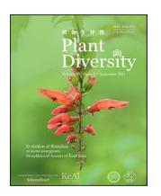
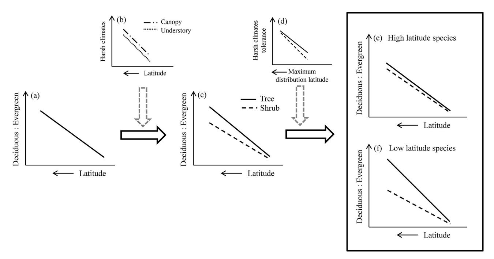
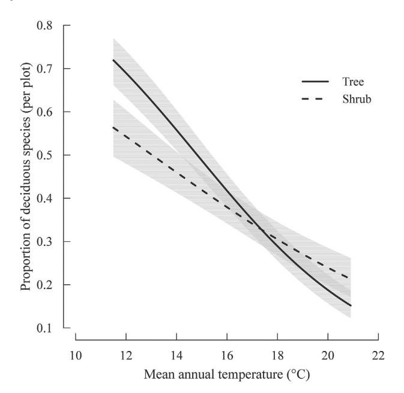
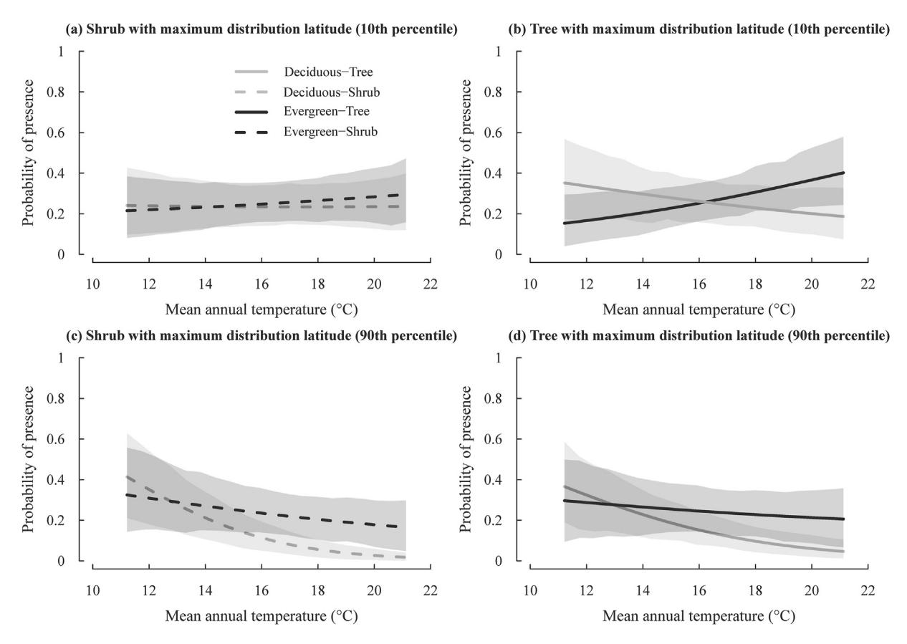
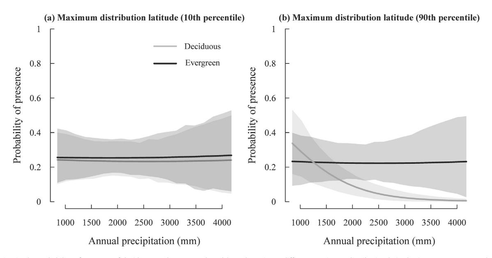

KeA1

CHINESE ROOTS
GLOBAL IMPACT

Contents lists available at ScienceDirect

## **Plant Diversity**

journal homepage: http://www.keaipublishing.com/en/journals/plant-diversity/ http://journal.kib.ac.cn

### Research paper

# Drivers of the differentiation between broad-leaved trees and shrubs in the shift from evergreen to deciduous leaf habit in forests of eastern Asian subtropics

Yi Jin a, \*, Hong Qian b

- a Key Laboratory of National Forestry and Grassland Administration on Biodiversity Conservation in Karst Mountainous Areas of Southwestern China, Guizhou Normal University, Guiyang 550025, China
- b Research and Collections Center, Illinois State Museum, 1011 East Ash Street, Springfield, IL, 62703, USA

#### ARTICLE INFO

Article history:
Received 1 August 2022
Received in revised form
26 December 2022
Accepted 29 December 2022
Available online 4 January 2023

Keywords: Functional trait Leaf life span Forest dynamics plot Latitudinal gradient

#### ABSTRACT

In eastern Asian subtropical forests, leaf habit shifts from evergreen to deciduous broad-leaved woody plants toward higher latitudes. This shift has been largely explained by the greater capacity of deciduous broad-leaved plants to respond to harsh climatic conditions (e.g., greater seasonality). The advantages of deciduous leaf habit over evergreen leaf habit in more seasonal climates have led us to hypothesize that leaf habits would shift in response to climate changes more conspicuously in forest canopy trees than in forest understory shrubs. Furthermore, we hypothesize that in the forests of the subtropics, plants at higher latitudes, regardless of growth form, would better tolerate seasonal harsh climates, and hence show less differentiation in leaf habit shift, compared to those at lower latitudes. To test these two hypotheses, we modelled the proportion of deciduous broad-leaved species and the incidence of deciduous and evergreen broad-leaved species in woody angiosperm species compositions of ten largesized forest plots distributed in the Chinese subtropics. We found that the rate of leaf habit shift along a latitudinal gradient was higher in forest trees than in forest shrubs. We also found that the differentiation in leaf habit shift between trees and shrubs is greater at lower latitudes (i.e., warmer climates) than at higher latitudes (i.e., colder climates). These findings indicate that specialized forest plants are differentially affected by climate in distinct forest strata in a manner dependent on latitudinal distribution. These differences in forest plant response to changes in climate suggest that global climate warming will alter growth forms and geographical distributions and ranges of forests.

Copyright © 2023 Kunming Institute of Botany, Chinese Academy of Sciences. Publishing services by Elsevier B.V. on behalf of KeAi Communications Co., Ltd. This is an open access article under the CC BY-NC-ND license (http://creativecommons.org/licenses/by-nc-nd/4.0/).

#### 1. Introduction

One prominent feature of the broad-leaved forests in the subtropics of eastern Asia is a gradual shift in the dominance from evergreen broad-leaved angiosperm plants to deciduous broad-leaved angiosperm plants (i.e., an increase in the proportion of deciduous broad-leaved species in a forest) with increasing latitude (Wu, 1980; Kira, 1991; Tang, 2015). Empirical studies suggest that climatic factors, including temperature (e.g., Zhang et al., 2010; Kikuzawa and Lechowicz, 2011; Che et al., 2020) and precipitation (e.g., Ge and Xie, 2017; Song, 1999), which are correlates of latitude (Qian et al., 2003), are the major underlying drivers of the latitudinal shift of leaf habit among forests. The latitudinal pattern of

leaf habit shift in the broad-leaved forests of eastern Asian subtropics is consistent with the theoretical prediction that deciduous leaf habit is more advantageous than evergreen leaf habit in increasingly seasonal climates towards higher latitudes (Fig. 1a; Givnish, 1979). Regions at higher latitudes generally have longer winters, when below-zero temperatures are frequent and water availability is low, which favor deciduous plants that shed leaves to minimize plant transpiration, respiration and physical damage in unfavorable seasons (Zanne et al., 2014) and maximize photosynthetic capacity in favorable seasons (Givnish, 2002). Regions at lower latitudes with lower climate (e.g., temperature and precipitation) seasonality and longer growing season favor plants with evergreen leaf habit that offers a longer photosynthetic season to maximize yearly photosynthetic return, compared with deciduous leaf habit (Zhao and Mao, 2022).

Structural variation in forests (i.e., canopy vs. understory) may also drive differences in leaf habit. Trees that form the canopy,

\* Corresponding author.

E-mail address: codon@126.com (Y. Jin).

Peer review under responsibility of Editorial Office of Plant Diversity.

Fig. 1. Schematic representation of the effects of forest canopy and species geographical distribution range on leaf habit shift from evergreen to deciduous broad-leaf in the broad-leaved forests of the subtropics. The general trend of leaf habit shift (a) shows the dominance of deciduous over evergreen species (i.e., the 'Deciduous : Evergreen' axis in the diagrams) increases with increasing latitude. The canopy effects on ameliorating understory environments create the canopy—understory discrepancy (b), which slows down the leaf habit shift from evergreen to deciduous for the understory shrub species compared with the canopy tree species (c). Furthermore, as a species maximum distribution latitude (i.e., the northernmost latitude of a species geographical distribution range in the Northern Hemisphere) increases, its capacity in harsh climate tolerance also increases (d), which makes it less responsive to latitude-related harsh climates, in other words, less responsive to the canopy effects; consequently, the difference between shrub and tree species at higher maximum distribution latitude (e) should be smaller compared with species at lower maximum distribution latitude (f).

which are directly exposed to climatic elements, face a high risk of hydraulic conductance failure, and experience damage from intense irradiance and storms (Jin et al., 2015). Because these canopy trees are greatly affected by climatic conditions, their distributions are likely to be highly responsive to climate shifts (Ge and Xie, 2017; Oian et al., 2017, 2022). Forest shrubs are protected from climatic extremes by the forest canopy, however, have access to lower levels of resources (e.g., irradiance). Even under the same climatic regime, the resource-conserved evergreen leaf habit is expected to be more advantageous for shrubs (Fig. 1b), as evergreen leaves serve longer functional periods that ensure their construction costs are paid off (Givnish, 2002). However, research has yet to demonstrate that forest trees and shrubs are differentially affected by climatic conditions (Tang et al., 2012). If forest trees and shrubs respond similarly to climate shifts, the latitudinal shift of leaf habit for trees and shrubs should be similar. If trees respond more strongly to climate shifts than do shrubs (Yang et al., 2020), the climate-driven latitudinal shift of leaf habit from evergreen broad-leaved plants toward higher latitudes should be more pronounced for forest trees than for shrubs (Fig. 1c). Previous studies suggest that geographical distribution range represents an intrinsic property of species response to climate shifts (e.g., Qian et al., 2003; Su et al., 2020). For example, in subtropical eastern Asia, the proportion of tropical plants generally decline with increasing latitude and decreasing temperature and precipitation, whereas the opposite pattern holds for temperate plants (Qian et al., 2003). At latitudes closer to the North Pole, the environmental discrepancy between the canopy and understory decreases. At these latitudes, the intense climatic seasonality increases canopy deciduousness and it is expected that the capacity of shrub species to cope with harsh seasonal climates approaches that of forest trees (Fig. 1d).

Consequently, the difference in the shift of leaf habit between shrubs and trees should be increasingly smaller for species at northern boundaries, even for the forests within the climate gradients of the subtropics (Fig. 1e and f).

Climate effects on forest leaf habit shift might be modified by a variety of factors. Geographical isolation (e.g., islands) interferes with plant dispersal and hence regulates community composition (Kadmon and Pulliam, 1993), and possibly also leaf habit composition in the forest. In addition, local-scale factors, such as topography, which shape the spatial pattern of species distribution of deciduous broad-leaved plants in the forest (e.g., Fang et al., 2016; Tang and Ohsawa, 2002), along with sample size (e.g., the area of forest sampled), which can cause 'sample effects', are also potential influencing factors of community composition and hence forest leaf habit composition.

In subtropical eastern Asia, broad-leaved forests are located in a transitional zone that includes forest zones from tropical to temperate regions. In this subtropical forest zone, plant species with different leaf habits and latitudinal distributions intermingle (Qian et al., 2003). Here, we hypothesize that (1) in response to climate changes, the rate of leaf habit shift from evergreen broadleaved plants to deciduous broad-leaved plants in forest communities is higher in forest trees than in forest shrubs; and (2) in the forests of the subtropics, plants at higher latitudes, regardless of growth form, better tolerate harsh seasonal climates, and hence show less differentiation in leaf habit shift, compared to those at lower latitudes. To test these hypotheses, we modelled the proportion of deciduous broad-leaved species and the incidence of deciduous and evergreen broad-leaved species in woody angiosperm species compositions in ten large broad-leaved forest plots (Song et al., 2015; Yin et al., 2020; Li et al., 2021) across the Asian subtropical forest zone.

#### 2. Materials and methods

#### 2.1. Study sites and species

This study used ten forest dynamics plots located in the subtropical region of eastern Asia. Eight forest plots were located on the Eurasian continent and the other two on Taiwan island (Fig. S1), with a geographical range of 23°10′N-33°32′N in latitude and 108°22′E–121°47′E in longitude (Song et al., 2015; Yin et al., 2020; Li et al., 2021), which covers the whole latitudinal range of the subtropical forest zone of China (Tang, 2015) and represents a large fraction of the latitudinal range of the evergreen (20°N-30°N) as well as the evergreen and deciduous mixed forest zones (30°N-35°N) of eastern Asia (Ohsawa, 1993; Song, 1999). These forest plots were selected because each represents a large piece of the regional forests of eastern Asian subtropics (Anderson-Teixeira et al., 2015). The climate variables used in this study included mean annual temperature (MAT) and annual precipitation (AP), which were local measurements reported by Ricklefs and He (2016), Yin et al. (2020), and Li et al. (2021). The topographic variables of a forest plot included its mean elevation and elevational range (Ricklefs and He, 2016); plot size was the projected area of a plot; isolation was represented by the status of isolation, which was classified as either isolated (on Taiwan island) or not isolated (on Eurasian continent) (Table 1).

In total, 847 angiosperm species (with infraspecific taxa combined with their species) of woody plants with stem diameter at breast height (DBH) > 1 cm were recorded in the ten forest plots, including 468 tree species and 379 shrub species. For the Chebaling and Qinlinghuangguan plots, the data of leaf habit and growth form were respectively obtained from Yin et al. (2020) and Li et al. (2021); for the other eight plots, the data of leaf habit and growth form were obtained from Song et al. (2015). The latitudinal distribution boundary of each of these species was determined by the highest and lowest latitudes of the species distribution, extracted from the species distribution data of China (Qian et al., 2017) as well as the species distribution data of Mongolia (Grubov, 2001), Siberia (Krasnoborov et al., 1988–1997) and Russian Far East (Charkevicz, 1985–1996). Specifically, if a species' latitudinal distribution range extended beyond the northern limits of China, its northern distribution limit (i.e., maximum distribution latitude) was represented by the northernmost latitude of its distribution in Mongolia, Siberia or Russian Far East. If the species' distribution range extended beyond the southern limits of China, its southern distribution limit was represented by the southernmost latitude of China; the southern distribution limit of a species was used when selecting species to be included in this study but was not included

 Table 1

 Summary information of the variables used in this study.

| Predictor variables                          |                           |       |      |
|----------------------------------------------|---------------------------|-------|------|
| Categorical                                  | Levels                    |       |      |
| Growth form                                  | Tree, shrub               |       |      |
| Leaf habit                                   | deciduous broad-leaf,     |       |      |
|                                              | evergreen broad-leaf      |       |      |
| Continuous                                   | Range                     | Mean  | SD   |
| Maximum distribution latitude (°)            | 33.62-68.91               | 38.73 | 4.37 |
| Mean annual temperature (°C)                 | 11.5-20.9                 | 16.7  | 3.6  |
| Annual precipitation (mm)                    | 908-4067                  | 2024  | 844  |
| Plot size (ha)                               | 5-50                      | 24    | 11   |
| Response variables                           |                           |       |      |
| Continuous                                   | Range                     | Mean  | SD   |
| Proportion of deciduous broad-leaved species | 0.14 - 0.97               | 0.39  | 0.23 |
| Binomial                                     |                           |       |      |
| Species occurrence                           | 0 (absence), 1 (presence) |       |      |

in data analysis of species occurrence. Species names in different sources were standardized using the package U.Taxonstand (Zhang and Qian, 2023) based on World Flora Online (WFO; www.worldfloraonline.org).

#### 2.2. Statistics

Variation in the richness of deciduous versus evergreen species of different growth forms (tree vs. shrub) in response to the environmental factors (i.e., MAT, AP, mean elevation, elevational range) and spatial factors (i.e., isolation, plot size) were examined using a linear regression model implemented in the "gls" function of the nlme package in R statistical software (R Core Team, 2016). The model included the proportion of deciduous broad-leaved plant species of a plot over total woody species for each growth form as the response variable. Species were categorized as either deciduous broad-leaved or evergreen broad-leaved plants. An increase in the proportion of deciduous broad-leaved plants indicates a forest leaf habit shift toward deciduous leaf habit, whereas a decrease in the proportion of deciduous broad-leaved plants indicates a leaf habit shift toward evergreen leaf habit. The proportion of deciduous broad-leaved plants in a plot was assumed to be normally distributed, where  $p_{hi}$  is the proportion of deciduous broad-leaved species of each growth form h (i.e., tree or shrub) in plot j. We tested for collinearity among predictor variables and excluded predictors with Pearson correlation coefficients > 0.7 (a threshold recommended by Dormann et al., 2013). Latitude and mean elevation were excluded due to their high intrinsic collinearities with MAT (Pearson's r < -0.8 in both cases; Table S1). Elevational range and isolation were also excluded due to their high collinearities with AP (Pearson's r = -0.734 and 0.719, respectively; Table S1). Using the linear regression approach, we modeled the variation in  $p_i$  with growth form (*G*), MAT (*T*), AP (*R*), plot size (*S*), and the interactions between growth form and the two climatic factors. The model structure was as follows,

$$p_{hj} = \alpha + \beta_1 G_{hj} + \beta_2 T_j + \beta_3 R_j + \beta_4 S_j + \gamma_1 G_{hj} T_j + r_2 G_{hj} R_j + \varepsilon,$$

where  $\beta_1$  is a fixed-effect term representing variation in growth form, with a variable indicating if the type is tree (G=1) or shrub (G=0),  $\beta_2$  through  $\beta_4$  represent variations in MAT, AP, and plot size, respectively.  $\gamma_1$  through  $\gamma_2$  represent fixed-effect coefficients for the interactive effect of growth form and the two climatic factors.  $\varepsilon$  is the error term, which is assumed to be normally distributed as  $\varepsilon \sim N(0, \sigma)$ , where the  $\sigma$  term is standard deviation. Spatial autocorrelation of the response variable (Moran's I = 0.155, p < 0.05) was accounted for by including an exponential spatial correlation structure in the model. The backward model selection approach was adopted for model selection (Jin et al., 2018). Starting from the full model, the term that produced the largest drop in Akaike information criterion corrected for small sample size (AlCc) was sequentially deleted, starting from the interaction terms, and the model with the lowest AlCc was considered the most supported model (Table S2).

In estimating the effects of species geographical distribution range on leaf habit shift, only the species with geographical distribution that extends across the entire latitudinal range of the ten plots (i.e., 23°10′N—33°32′N) were selected, ensuring that all the species could theoretically be distributed in every plot studied. In total, 523 species met this criterion and were analyzed. The estimation of the effect of species geographical distribution range on leaf habit shift was modeled as the maximum distribution latitude effects on the plot-level occurrence of a species, because maximum distribution latitude is expected to be positively related to species capacity in tolerating climates at the northern boundaries of species in the Northern Hemisphere (Qian et al., 2022).

We adopted a generalized linear mixed-effects model (GLMM) using Markov chain Monte Carlo (MCMC) simulation implemented in the MCMCglmm package (Hadfield, 2010), as well as a backward model selection procedure to find the most supported species occurrence model. The phylogenetic tree of the 523 species was constructed by the V.PhyloMaker2 package (Jin and Qian, 2019, 2022) based on the megatree reported by Smith and Brown (2018). Phylogenetic trees generated by V.PhyloMaker2, or an earlier version of it (e.g., Jin and Qian, 2019), have been broadly used in ecological and biogeographic studies (e.g., Yue and Li, 2021; Zhang et al., 2021; Huang et al., 2023; Qian, 2023; Zhou et al., 2023). Previous studies showed that phylogenetic trees generated this way are robust for ecological and biogeographic studies (Qian and Jin, 2021). We used a likelihood ratio test to compare whether the evolution of leaf habit and growth form were better explained by a macroevolutionary model fitted using the resolved phylogenetic relationships vs. a null model fitted using a star phylogeny, performed using the "fitDiscrete" function with the "ER" model in the geiger package (Harmon et al., 2008). We found statistically significant phylogenetic conservatism in leaf habit (Pagel's  $\lambda = 0.835, p < 0.001$ ) and growth form (Pagel's  $\lambda = 0.947, p < 0.01$ ) for the 523 study species. However, when we used the "phylosig" function in the phytools package (Revell, 2012) to test the phylogenetic signal of species-level random intercepts from the results of the most supported model, we found the residuals of the model were not phylogenetically conserved (Pagel's  $\lambda = 0.026$ , p = 0.266). We therefore did not model the residuals as phylogenetically correlated in our species occurrence models (Revell, 2010). In the MCMCglmm model that we adopted, a weakly informative Wishart prior was used for the residual structure (R-side effects), and a parameter-expanded prior for the random effect (G-side effects for correlations due to group membership) structure (Hadfield, 2010; Bolker, 2013; McCarthy, 2013; Jin et al., 2018). The number of MCMC iterations was set to 210,000, with a thinning interval of 200 and a burn-in of 10,000 iterations. Plot size was log-transformed, and all continuous predictor variables were standardized by subtracting the mean and dividing by the standard deviation before analysis (Table 1). The response variable was species occurrence (i.e., presence/absence) in a plot, whether or not species i is present in plot j was assumed to be distributed as a Bernoulli random variable as  $V_{ij}$  ~ Bernoulli( $s_{ij}$ ), where  $s_{ij}$  is the probability of species i present in plot j. Using a logit link function, we modeled variation in  $s_{ij}$  as a function of leaf habit ( $L_{ij}$ ; deciduous broad-leaved vs. evergreen broad-leaved habit), growth form ( $G_{ij}$ ; tree vs. shrub), maximum distribution latitude  $(N_i)$ , MAT  $(T_i)$ , AP  $(R_i)$ , plot size  $(S_i)$ , plus all the two-way, three-way and four-way interactions between  $L_{ij}$ ,  $G_{ij}$ ,  $N_{ij}$ ,  $T_{ij}$ , and between  $L_{ij}$ ,  $G_{ij}$ ,  $N_{ij}$ ,  $R_{j}$ . Latitude and mean elevation were excluded due to their high intrinsic collinearities with MAT (Pearson's r = -0.873 and -0.827, respectively; Table S1). Elevational range and isolation were excluded due to their high collinearities with AP (Pearson's r = -0.734 and 0.719, respectively; Table S1). The random part of the model included the intercept of species and the intercept of plot. The model structure was as follows:

$$\log\left(\frac{p_{ij}}{1 - p_{ij}}\right) = \alpha + \beta_1 L_{ij} + \beta_2 G_{ij} + \beta_3 N_{ij} + \beta_4 T_j + \beta_5 R_j + \beta_6 S_j$$

$$+ \gamma_1 L_{ij} G_{ij} + \gamma_2 L_{ij} N_j + \gamma_3 L_{ij} T_i + \gamma_4 L_{ij} R_j + \gamma_5 G_{ij} N_{ij}$$

$$+ \gamma_6 G_{ij} T_j + \gamma_7 G_{ij} R_j + \gamma_8 N_{ij} T_j + \gamma_9 N_{ij} R_j$$

$$+ \delta_1 L_{ij} G_{ij} N_{ij} + \delta_2 L_{ij} G_{ij} T_j + \delta_3 L_{ij} G_{ij} R_j + \delta_4 L_{ij} N_{ij} T_j$$

$$+ \delta_5 L_{ij} N_{ij} R_j + \delta_6 G_{ij} N_{ij} T_j + \delta_7 G_{ij} N_{ij} R_j$$

$$+ \theta_1 L_{ij} G_{ij} N_{ij} T_j + \theta_2 L_{ij} G_{ij} N_{ij} R_j + \varphi_i + \mu_j,$$

where  $\beta_1$  is a fixed-effect term representing variation of leaf habit,  $\beta_2$  is a fixed-effect term representing variation of growth form,  $\beta_3$ through  $\beta_6$  represent the variations of maximum distribution latitude, MAT, AP, and plot size, respectively. The  $\gamma$ ,  $\delta$  and  $\theta$  terms represent the fixed-effect coefficients for the second-, third- and fourth-order interactions, respectively, of leaf habit, growth form, and maximum distribution latitude with the two climatic factors.  $\varphi$ is the random term accounting for variation among species in traitand geographical distribution-independent incidence (i.e., probability of presence), which was assumed to be normally distributed as  $\varphi_i \sim N(0, \sigma_{\varphi})$ .  $u_i$  is the random term for variation among plots, which was assumed to be normally distributed as  $\mu_i \sim N(0, \sigma_u)$ . The backward selection of fixed-effect terms was based on the deviance information criterion (DIC; Gelman et al., 2004), which is a hierarchical modeling generalization of the Akaike information criterion (AIC), starting from the full model, to select the most supported model. The fixed terms that produced the largest drop in the DIC value were sequentially deleted, starting from the independent terms and the highest-level interaction terms, and the model with the lowest DIC was considered the most supported model (Table S3). In the most supported model, inference was based on the mean and 95% credible intervals estimated from the posterior distribution for each parameter and pMCMC value, which represents a test of whether the posterior parameter estimate is different from zero.

All analyses were conducted in R 3.2.4 (R Core Team, 2016).

#### 3. Results

In the most supported model of the plot-level proportion of deciduous broad-leaved species, the largest fraction of variance was explained by the interaction between growth form and MAT as well as the main effect of MAT. This interaction indicates a leaf habit shift from evergreen broad-leaved to deciduous broad-leaved habit (i.e., increase in the proportion of deciduous broad-leaved species in a forest plot) with decreasing MAT for both trees and shrubs, but the rate of the shift was greater for trees than for shrubs (Table 2; Fig. 2). The other climatic factor (i.e., AP) explained a small amount of variance (Table S2). The proportion of deciduous broad-leaved species in the plot increased with decreasing AP (Table 2). Plot size was not retained in the most supported model.

In the most supported model of plot-level species occurrence, a four-way interaction was detected among leaf habit, growth form, maximum distribution latitude and MAT (Table 3; Fig. 3). The interaction implies that the difference in the probability of plot-level presence of deciduous broad-leaved vs. evergreen broadleaved species between different growth forms was larger for species at lower maximum distribution latitude than for species at higher maximum distribution latitude (compare Fig. S2b with S2a). Specifically, for species at lower maximum distribution latitude, trees showed a much greater rate of leaf habit shift (i.e., increase in

Table 2 Model of growth form and environmental factor effects on the proportion of deciduous broad-leaved woody plant species. MAT, mean annual temperature; AP, annual precipitation. Significance levels: \*, p < 0.05; \*\*, p < 0.01; \*\*\*, p < 0.001.

| Factors                                                    | Coefficient                  |
|------------------------------------------------------------|------------------------------|
| Growth form (Tree) MAT AP                            | 0.024 -0.137** -0.079* |
| Plot size Growth form (Tree) × MAT Growth form (Tree) × AP | -0.078***                    |

**Fig. 2.** Variation in the proportion of deciduous broad-leaved trees and shrubs with respect to mean annual temperature (MAT) as predicted by the most-supported linear regression model in Table 2. The lines represent the predicted relationship between the proportion of deciduous broad-leaved species and MAT. The shaded regions represent 95% confidence intervals of the predicted relationship for each growth form.

the relative probability of presence of deciduous broad-leaved vs. evergreen broad-leaved species as shown in Fig. S2a), compared with shrubs in response to the decrease of MAT; however, this difference between trees and shrubs decreased as species maximum distribution latitude shifted toward the North Pole (as shown in Fig. S2b). Furthermore, a three-way interaction was

detected among leaf habit, maximum distribution latitude and AP (i.e., a three-way interaction without growth form; Table 3; Fig. 4). This interaction implies that species at lower maximum distribution latitude displayed a much lower rate of leaf habit shift with AP than the species at higher maximum distribution latitude (as shown in Fig. S3), and this pattern was mainly caused by the steep increase in the incidence of deciduous broad-leaved species with increasing maximum distribution latitudes as AP decreased (Fig. 4b). Plot size was also not retained in the most supported model.

#### 4. Discussion

In the subtropical evergreen broad-leaved forests of eastern Asia, the proportion of deciduous broad-leaved angiosperm plants generally increases from south to north, whereas that of evergreen broad-leaved angiosperm plants decreases (Ge and Xie, 2017). However, to the best of our knowledge, it remains unknown until now whether this pattern holds similarly for plants specialized to different forest strata.

In this study, we sampled ten large-sized broad-leaved forest plots distributed across 23°N–33°N, which represent almost the entire range of latitudinal shift of leaf habit observed in the forests of eastern Asian subtropics (e.g., Ge and Xie, 2017). We found that the leaf habit shift of forest shrubs was less profound along the temperature gradient (i.e., MAT), compared with forest trees. This finding agrees, to some degree, with Tang et al.'s (2012) finding showing that species turnover is less pronounced for forest shrubs than for forest trees along a large latitudinal gradient in China. Together, findings of our and Tang et al.'s (2012) studies point to the difference between forest shrubs and trees in responding to climate shifts. Our finding that deciduous broad-leaved plant dominance for both trees and shrubs increases with decreasing MAT in the study forests agrees with previous studies that found temperature

Table 3
MCMCgImm model showing the effects of leaf habit, growth form, maximum distribution latitude, and plot size on the occurrence of woody angiosperm species in ten broad-leaved forests of the subtropics. Abbreviations: N, maximum distribution latitude; MAT, mean annual temperature; AP, annual precipitation; EBL, evergreen broadleaf; post.mean, the mean parameter estimate of posterior distribution; 95%CI, 95% confidence interval of the mean; eff.samp, effective samples size, which is the number of samples adjusted for autocorrelation in the chains; pMCMC, Markov chain Monte Carlo probability that the parameter estimate is not different from zero. Specifically, pMCMC is two times the smaller of two MCMC probability estimates: that the parameter value is either smaller or greater than zero.

| Fixed effects                                                        | post.mean | 95%CI            | eff.samp | рМСМС   |
|----------------------------------------------------------------------|-----------|------------------|----------|---------|
| Leaf habit (EBL)                                                     | 0.682     | (0.319, 1.001)   | 1206.7   | < 0.001 |
| Growth form (Tree)                                                   | 0.310     | (-0.045, 0.617)  | 1165.1   | 0.072   |
| N                                                                    | -0.782    | (-1.079, -0.473) | 742      | < 0.001 |
| MAT                                                                  | -0.734    | (-1.469, -0.014) | 1000     | 0.04    |
| AP                                                                   | -0.649    | (-1.320, 0.196)  | 1000     | 0.088   |
| Plot size                                                            |           |                  |          |         |
| $N \times MAT$                                                       | -0.913    | (-1.155, -0.631) | 695.2    | < 0.001 |
| $N \times AP$                                                        | -0.799    | (-1.003, -0.602) | 578.4    | < 0.001 |
| Leaf habit (EBL) $\times$ MAT                                        | 0.686     | (0.402, 0.959)   | 741.6    | < 0.001 |
| Leaf habit (EBL) $\times$ AP                                         | 0.660     | (0.419, 0.908)   | 686.5    | < 0.001 |
| Leaf habit (EBL) $\times$ Growth form (Tree)                         | -0.179    | (-0.594, 0.311)  | 1214.7   | 0.41    |
| Growth form $\times$ MAT                                             | -0.037    | (-0.33, 0.227)   | 890      | 0.774   |
| Growth form $\times$ AP                                              |           |                  |          |         |
| Leaf habit (EBL) $\times$ N                                          | 0.661     | (0.224, 1.086)   | 855.1    | 0.004   |
| Growth form (Tree) $\times$ N                                        | 0.233     | (-0.112, 0.594)  | 829.8    | 0.19    |
| Leaf habit (EBL) $\times$ Growth form (Tree)                         |           |                  |          |         |
| Leaf habit (EBL) $\times$ Growth form (Tree) $\times$ N              | -0.235    | (-0.766, 0.299)  | 1000     | 0.414   |
| Leaf habit (EBL) $\times$ Growth form (Tree) $\times$ MAT            | 0.402     | (0.034, 0.766)   | 749.2    | 0.03    |
| Leaf habit (EBL) $\times$ N $\times$ MAT                             | 0.570     | (0.219, 0.935)   | 809.9    | < 0.001 |
| Leaf habit (EBL) $\times$ N $\times$ AP                              | 0.787     | (0.558, 1.092)   | 682.1    | < 0.001 |
| Growth form (Tree) $\times$ N $\times$ MAT                           | 0.519     | (0.178, 0.807)   | 730.2    | < 0.001 |
| Leaf habit (EBL) $\times$ Growth form (Tree) $\times$ AP             |           |                  |          |         |
| Leaf habit (EBL) $\times$ N $\times$ AP                              | 0.739     | (0.455, 0.997)   | 783.9    | < 0.001 |
| Growth form (Tree) $\times$ N $\times$ AP                            |           |                  |          |         |
| Leaf habit (EBL) $\times$ Growth form (Tree) $\times$ N $\times$ MAT | -0.645    | (-1.062, -0.153) | 771.3    | 0.004   |
| Leaf habit (EBL) $\times$ Growth form (Tree) $\times$ N $\times$ AP  |           |                  |          |         |

Fig. 3. Variation in the probability of presence of deciduous and evergreen broad-leaved leaf habits for trees and shrubs at different maximum distribution latitudes in response to mean annual temperature (MAT) as predicted by the most supported generalized linear mixed-effects model presented in Table 3. Lines represent the predicted relationships between the probability of species presence of each plant group and MAT. The shaded regions represent 95% confidence intervals of the predicted relationship for each plant group.

**Fig. 4.** Variation in the probability of presence of deciduous and evergreen broad-leaved species at different maximum distribution latitudes in response to annual precipitation (AP) as predicted by the most supported generalized linear mixed-effects model presented in Table 3. Lines represent the predicted relationships between the probability of species presence of each leaf habit group and AP. The shaded regions represent 95% confidence intervals of the predicted relationship for each leaf habit group.

underlies the leaf habit shift in eastern Asian subtropical forests (e.g., Zhang, et al., 2010; Kikuzawa and Lechowicz, 2011). As MAT controls plant growing season length (Matsumoto et al., 2003), the decrease in MAT towards higher latitudes would result in shorter

growing seasons, which is expected to favor plants with deciduous leaf habit that shed leaves in unfavorable periods to minimize metabolism (Givnish, 2002). Furthermore, we suggest the differentiation between trees and shrubs in temperature-driven

latitudinal leaf habit shift at least partly stems from the effects imposed by forest canopy on the understory environments, which buffers climate influences on forest shrubs, along the latitudinal climate gradient. Forest canopy generally reduces the light and heat/cold above the canopy to reach forest interior, and the forest understory environment is usually dimmer and more stable compared with forest canopy (Kimmins, 2004). Therefore, the forest understory environment is expected to favor the resourceconserved evergreen broad-leaved plants than deciduous broadleaved plants (Jin et al., 2018), as evergreen leaves generally have longer life spans to recoup the resource and energy invested on leaf construction in low resource and stable environments compared with deciduous leaves (Givnish, 2002). Occasionally, disturbance (e.g., forest gap derived from fallen trees) occurs and opens up a window with high resource (e.g., light) availabilities in forest understory that likely facilitate the regeneration of deciduous plants in the forest (Jin et al., 2018). However, the window eventually closes as forest recovers, and deciduous broad-leaved shrubs, even as adults, do not reach the canopy like deciduous broad-leaved trees. Thus, disturbance probably favors the persistence of deciduous broad-leaved trees over deciduous broad-leaved shrubs in the forests. As a result, disturbance is unlikely to significantly offset canopy effects on the differentiation of leaf habit shift between forest trees and shrubs along the latitudinal climate gradient.

We found the leaf habit shifted toward deciduous broad-leaved plant dominance with decreasing precipitation (Table S2), which agrees with some previous studies (e.g., Luo et al., 2005; Zhang et al., 2010), and is consistent with the prediction that low precipitation favors deciduous broad-leaved plants that shed leaves to minimize plant transpiration and respiration in dry seasons (Zanne et al., 2014). However, the power of AP in explaining the leaf habit shift was relatively small, compared with MAT, pointing to the possibility that leaf longevity is only part of a larger syndrome of plant adaptive alternatives to water shortage, as suggested by Kikuzawa and Lechowicz (2011). Furthermore, we found that plant growth form did not show an interaction with AP in modeling leaf habit shift, and showed no interaction with leaf habit and AP in the model predicting the plot-level species occurrence, which both imply that the leaf habit shift on the studied precipitation gradient did not differ between trees and shrubs. This might be because water absorption in these plants is through its underground root system, and the canopy effects on intercepting rainfall do not necessarily translate to different soil water availabilities for trees and shrubs. As a result, we suspect precipitation is not a significant climate factor that underlies the differentiation between trees and shrubs in leaf habit shift in the study forests.

Species geographical distribution range is related to species climatic niche (Ricklefs, 2001). In the Northern Hemisphere, on average, a more northerly species distribution range boundary indicates a greater capacity to tolerate harsh climates (e.g., lower temperature and/or precipitation; Qian et al., 2022). This property underlies the species range shift under climate change (e.g., Lomolino et al., 2017), in that species range boundary moves toward higher latitudes (Lomolino et al., 2017; Stevens, 1989) and higher elevations (Fadrique et al., 2018) as climate gets warmer. Our findings suggest this property also underlies the differentiation of forest trees and shrubs in climate-driven leaf habit shift (i.e., change in the relative probability of presence of deciduous broad-leaved vs. evergreen broad-leaved species), even in forests of the subtropics that are in the interior of the study species' geographical distribution ranges. For species with distribution range boundaries restricted to relatively low latitudes, the difference in leaf habit shift between different plant growth forms across the MAT gradient (probably reflecting species temperature niche) is large, suggesting that plants at low latitudes vary, to a large extent, in their

temperature tolerance capacities, likely due to the highly developed forest vertical structures at low latitudes, which create large environmental contrasts (e.g., light and heat) between the canopy and forest interior (Terborgh, 1985). At higher latitudes, forest vertical structure becomes increasingly simpler, and the forest interior is less foliated (Spicer et al., 2020), which reduces environmental differences between the forest canopy and interior; consequently, trees and shrubs with geographical ranges extending to higher latitudes would experience more similar climates and hence their capacity to tolerate harsh climates would differ less. These geographical range-related differences between different growth forms of species likely resulted in the increasingly smaller differentiation in leaf habit shift between trees and shrubs with increasing maximum distribution latitudes observed in the forests of the subtropics.

Furthermore, we found that the leaf habit shift of plants at higher maximum distribution latitudes on the precipitation gradient was more obvious than plants at lower maximum distribution latitudes, and this difference was mainly due to the striking response of deciduous broad-leaved plants at higher maximum distribution latitudes. In particular, a steep increase in the incidence of deciduous broad-leaved plants at higher maximum distribution latitudes with decreasing AP, in contrast to evergreen broad-leaved plants at higher maximum distribution latitudes and plants at lower maximum distribution latitudes, likely reflects a distinct differentiation in the underlying hydraulic niche (Arenas-Navarro and Garcia-Oliva, 2020). We suspect that deciduous broad-leaved plants at higher maximum distribution latitudes have more advantages in lower precipitation conditions, compared with evergreen broad-leaved plants (Marchin et al., 2010) and deciduous broad-leaved plants at lower maximum distribution latitudes, though the underlying causes are still unclear. This group of plants is probably the floristic elements of the deciduous broad-leaved forests in the higher latitude temperate regions of eastern Asia, where the precipitation is less abundant (Müller, 1982).

Similar to evergreen broad-leaved plants at relatively low maximum distribution latitudes, the incidence of deciduous broad-leaved plants at relatively low maximum distribution latitudes changed quite mildly with precipitation across the study forests, suggesting that leaf habit is not the trait that partitions these plant distributions on the precipitation gradient of the subtropics. Other niche axes, such as temperature (Zanne et al., 2018) and soil fertility (Fang et al., 2016), might be more important in separating the distribution of these low-latitude plants in forests of the subtropics.

In conclusion, we found the growth-form-dependent patterns of leaf habit shift in the broad-leaved forests of eastern Asian subtropics. We suggest this differentiation between plant growth forms is at least partly due to the forest canopy effects (i.e., habitat effects). In addition, species intrinsic properties (i.e., climatic niche), reflected by species geographical distribution ranges, play a significant role in further complicating the pattern of leaf habit shift in these forests. Our findings on forest plant response to changes in climate indicate that global climate warming will alter growth forms and geographical distributions and ranges of forests.

#### **Authors' contributions**

Y.J. conceived the idea, with input from H.Q.; Y.J. and H.Q. collected the data; Y.J. analysed the data; Y.J. and H.Q. wrote the paper.

#### Data availability

Data used in this study have been included in this paper, or published elsewhere and cited in this paper.

#### **Declaration of competing interest**

The authors declare that they have no known competing financial interests or personal relationships that could have appeared to influence the work reported in this paper.

#### Acknowledgements

We are grateful to Raymond Porter and anonymous reviewers for their constructive comments and edits on the manuscript. We are grateful to the people who contribute to the establishments of the forest dynamics plots of this study. This work was supported by the Natural Science and Technology Foundation of Guizhou Province [[2020]1Z013]; and the Joint Fund of the National Natural Science Foundation of China and the Karst Science Research Center of Guizhou Province [U1812401].

## Appendix A. Supplementary data

Supplementary data to this article can be found online at https://doi.org/10.1016/j.pld.2022.12.008.

#### References

- Anderson-Teixeira, et al., 2015. CTFS-Forest GEO: a worldwide network monitoring forests in an era of global change. Global Change Biol. 21, 528–549.
- Arenas-Navarro, M., García-Oliva, F., et al., 2020. Leaf habit and stem hydraulic traits determine functional segregation of multiple oak species along a water availability gradient. Forests 11, 894.
- Bolker, B.M., 2013. Linear and generalized linear mixed models. In: Fox, G.A., Negrete-Yankelevich, S., Sosa, V.J. (Eds.), Ecological Statistics: Contemporary Theory and Application. Oxford University Press, Oxford, UK, pp. 309—333.
- Charkevicz, S.S., 1985—1996. Plantae Vasculares Orientis Extremi Sovietici, s. vols. 1—8. Nauka. Leningrad.
- Che, J., Zheng, J., Jiang, Y., et al., 2020. Separation of phylogeny and ecological behaviors between evergreen and deciduous woody angiosperms in the subtropical forest dynamics plots of China. Chin. J. Plant Ecol. 44, 1007–1014 (In Chinese)
- Dormann, C.F., Elith, J., Bacher, S., et al., 2013. Collinearity: a review of methods to deal with it and a simulation study evaluating their performance. Ecography 36, 27–46
- Fadrique, B., Báez, S., Duque, Á., et al., 2018. Widespread but heterogeneous responses of Andean forests to climate change. Nature 564, 207–212.
- Fang, X., Shen, G., Yang, Q., et al., 2016. Habitat heterogeneity explains mosaics of evergreen and deciduous trees at local-scales in a subtropical evergreen broadleaved forest. J. Veg. Sci. 28, 379–388.
  Ge, J., Xie, Z., 2017. Geographical and climatic gradients of evergreen versus de-
- Ge, J., Xie, Z., 2017. Geographical and climatic gradients of evergreen versus deciduous broad-leaved tree species in subtropical China: implications for the definition of the mixed forest. Ecol. Evol. 7, 3636—3644.
- Gelman, A., Carlin, J.B., Stern, H.S., Rubin, D.B., 2004. Bayesian data analysis. In: Texts in Statistical Science, second ed. CRC Press. Boca Raton, FL.
- Givnish, T.J., 1979. On the adaptive significance of leaf form. In: Solbrig, O.T., Jain, S., Johnson, G.B., Raven, P.H. (Eds.), Topics in Plant Population Biology. Palgrave, London, pp. 375–407.
- Givnish, T.J., 2002. Adaptive significance of evergreen vs. deciduous leaves: solving the triple paradox. Silva Fenn. 36, 703–743.
- Grubov, V.I., 2001. Key to the Vascular Plants of Mongolia (With an Atlas). Science Publishers. Inc., Enfield, New Hampshire.
- Hadfield, J.D., 2010. MCMC methods for multi-response generalized linear mixed models: the MCMCglmm R package. J. Stat. Software 33, 1–22.
- Harmon, L.J., Weir, J.T., Brock, C.D., et al., 2008. GEIGER: investigating evolutionary radiations. Bioinformatics 24, 129–131.
- Huang, X., Li, F., Wang, Z., et al., 2023. Are allometric model parameters of aboveground biomass for trees phylogenetically constrained? Plant Divers 45, 229–233.
- Jin, Y., Chen, J., Mi, X., et al., 2015. Impacts of the 2008 ice storm on structure and composition of an evergreen broad-leaved forest community in eastern China. Biodivers. Sci. 23, 610–618 (In Chinese).
- Jin, Y., Russo, S.E., Yu, M., 2018. Effects of light and topography on regeneration and coexistence of evergreen and deciduous tree species in a Chinese subtropical forest. J. Ecol. 106, 1634–1645.
- Jin, Y., Qian, H., 2019. V.PhyloMaker: an R package that can generate very large phylogenies for vascular plants. Ecography 42, 1353–1359.
- Jin, Y., Qian, H., 2022. V.PhyloMaker2: an updated and enlarged R package that can generate very large phylogenies for vascular plants. Plant Divers. 44, 335–339.
- Kadmon, R., Pulliam, H.R., 1993. Island biogeography: effect of geographical isolation on species composition. Ecology 74, 977–981.

Kikuzawa, K., Lechowicz, M.J., 2011. Ecology of Leaf Longevity. Springer Science & Business Media, New York.

- Kimmins, J.P., 2004. Forest Ecology, third ed. Prentice-Hall, Upper Saddle River, New Jersey.
- Kira, T., 1991. Forest ecosystems of east and southeast Asia in a global perspective. Ecol. Res. 6, 185–200.
- Krasnoborov, I.M., Peschkova, G.A., Malyschev, L.I., et al., 1988—1997. Flora Sibiriae, s. vols. 1–14. Nauka, Novosibirsk, Russia.
- Lomolino, M.V., Riddle, B.R., Whittaker, R.J., 2017. Biogeography, Fifth ed. Oxford University Press, Sunderland.
- Li, B., Wu, Z., Bin, Y., et al., 2021. Community Composition and Structure of the Chebaling Forest Dynamics Plot in a Mid-subtropical Evergreen Broadleaved Forest, Guangdong Science & Technology Press, Guangzhou.
- Luo, T., Luo, J., Pan, Y., 2005. Leaf traits and associated ecosystem characteristics across subtropical and timberline forests in the Gongga Mountains, Eastern Tibetan Plateau. Oecologia 142, 261–273.
- Marchin, R., Zeng, H., Hoffmann, W., 2010. Drought-deciduous behavior reduces nutrient losses from temperate deciduous trees under severe drought. Oecologia 163, 845–854.
- McCarthy, M.A., 2013. Approaches to statistical inference. In: Fox, G.A., Negrete-Yankelevich, S., Sosa, V.J. (Eds.), Ecological Statistics: Contemporary Theory and Application. Oxford University Press, Oxford, UK, pp. 15–43.
- Müller, M.J., 1982. Selected Climate Data for a Global Set of Standard Stations for Vegetation Science. Dr. W. Junk Publishers, The Hague.
- Ohsawa, M., 1993. Latitudinal pattern of mountain vegetation zonation in southern and eastern Asia. J. Veg. Sci. 4, 13–18.
- Qian, H., 2023. Patterns of phylogenetic relatedness of non-native plants across the introduction—naturalization—invasion continuum in China. Plant Divers. 45, 169–176
- Qian, H., Song, J., Krestov, P., et al., 2003. Large-scale phytogeographical patterns in East Asia in relation to latitudinal and climatic gradients. J. Biogeogr. 30, 129–141.
- Qian, H., Jin, Y., Ricklefs, R.E., 2017. Patterns of phylogenetic relatedness of angiosperm woody plants across biomes and life-history stages. J. Biogeogr. 44, 1383–1392.
- Qian, H., Jin, Y., 2021. Are phylogenies resolved at the genus level appropriate for studies on phylogenetic structure of species assemblages? Plant Divers. 43, 255–263.
- Qian, H., Zhang, Y., Ricklefs, R.E., et al., 2022. Relationship of minimum winter temperature and temperature seasonality to the northern range limit and species richness of trees in North America. J. Geogr. Sci. 32, 280–290.
- R Core Team, 2016. R: A Language and Environment for Statistical Computing. R Foundation for Statistical Computing, Vienna, Austria.
- Revell, L.J., 2010. Phylogenetic signal and linear regression on species data. Methods Ecol. Evol. 1, 319–329.
- Revell, L.J., 2012. phytools: an R package for phylogenetic comparative biology (and other things). Methods Ecol. Evol. 3, 217–223.
- Ricklefs, R.E.,  $\bar{2}001$ . The Economy of Nature: a Textbook in Basic Ecology, Fifth ed. W.H. Freeman, New York.
- Ricklefs, R.E., He, F., 2016. Region effects influence local tree species diversity. Proc. Natl. Acad. Sci. U.S.A. 113, 674–679.
- Smith, S.A., Brown, J.W., 2018. Constructing a broadly inclusive seed plant phylogeny. Am. J. Bot. 105, 302–314.
- Song, Y., 1999. Perspective of the vegetation zonation of forest region in eastern China. Acta Bot. Sin. 41, 541–552 (In Chinese).
- Song, Y., Yan, E., Song, K., 2015. Synthetic comparison of eight dynamics plots in evergreen broadleaf forests, China. Biodivers. Sci. 23, 139–148 (In Chinese).
- Spicer, M.E., Mellor, H., Carson, W.P., 2020. Seeing beyond the trees: a comparison of tropical and temperate plant growth forms and their vertical distribution. Ecology 101. e02974.
- Stevens, G.C., 1989. The latitudinal gradient in geographical range: how so many species coexist in the tropics. Am. Nat. 133, 240–256.
- Su, X., Shrestha, N., Xu, X., et al., 2020. Phylogenetic conservatism and biogeographic affinity influence woody plant species richness-climate relationships in eastern Eurasia. Ecography 43, 1027–1040.
- Tang, C.Q., Ohsawa, M., 2002. Coexistence mechanisms of evergreen, deciduous and coniferous trees in a mid-montane mixed forest on Mt. Emei, Sichuan, China. Plant Ecol. 161, 215–230.
- Tang, Z., Fang, J., Chi, X., et al., 2012. Patterns of plant beta-diversity along elevational and latitudinal gradients in mountain forests of China. Ecography 35, 1083–1091.
- Tang, C.Q., 2015. The Subtropical Vegetation of Southwestern China: Plant Distribution, Diversity and Ecology. Springer, London New-York.
- Terborgh, J., 1985. The vertical component of plant species diversity in temperate and tropical forests. Am. Nat. 126, 760–776.
- Wu, Z., 1980. Vegetation of China. Science Press, Beijing (In Chinese).
- Yang, J., Cooper, D.J., Li, Z., et al., 2020. Differences in tree and shrub growth responses to climate change in a boreal forest in China. Dendrochronologia 63, 125744
- Yin, Q., Jia, S., He, C., et al., 2020. Qinling Huangguan Forest Dyanmics Plot: Tree Species and Their Distribution Patterns. China Forestry Publishing House, Beijing (In Chinese).
- Yue, J., Li, R., 2021. Phylogenetic relatedness of woody angiosperm assemblages and its environmental determinants along a subtropical elevational gradient in China. Plant Divers. 43, 111–116.

- Zanne, A.E., Tank, D.C., Cornwell, W.K., et al., 2014. Three keys to the radiation of angiosperms into freezing environments. Nature 506, 89–92.
- Zanne, A.E., Pearse, W.D., Cornwell, W.K., et al., 2018. Functional biogeography of angiosperms: life at the extremes. New Phytol. 218, 1697–1709.
- Zhang, J., Qian, H., 2023. U.Taxonstand: an R package for standardizing scientific names of plants and animals. Plant Divers. 45, 1–5. https://doi.org/10.1016/j.pld.2022.09.001.
- Zhang, L., Luo, T., Zhu, H., et al., 2010. Leaf life span as a simple predictor of evergreen forest zonation in China. J. Biogeogr. 37, 27–36.
- Zhang, Y.Z., Qian, L.S., Spalink, D., et al., 2021. Spatial phylogenetics of two topographic extremes of the Hengduan Mountains in southwestern China and its implications for biodiversity conservation. Plant Divers. 43, 181–191.
- Zhao, W., Mao, Q., et al., 2022. Patterns of compound-leaf form and deciduous-leaf habit across forests in China: their association and key climatic factors. Sci. Total Environ. 851, 158108.
- Zhou, Y.D., Qian, H., Jin, Y., et al., 2023. Geographic patterns of taxonomic and phylogenetic β-diversity of aquatic angiosperms in China. Plant Divers. 45, 177–184