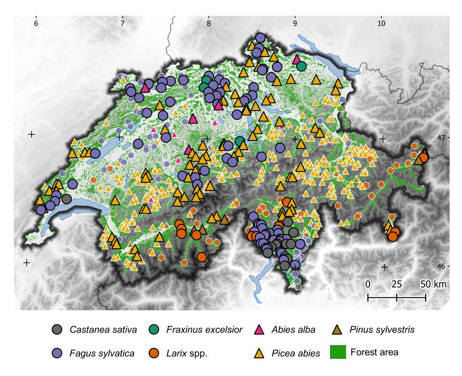
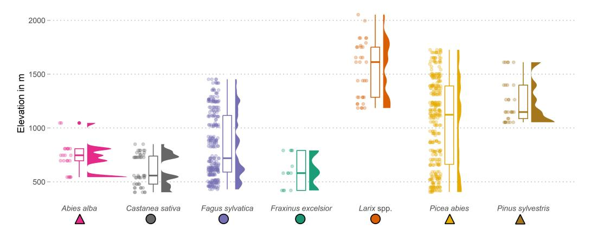
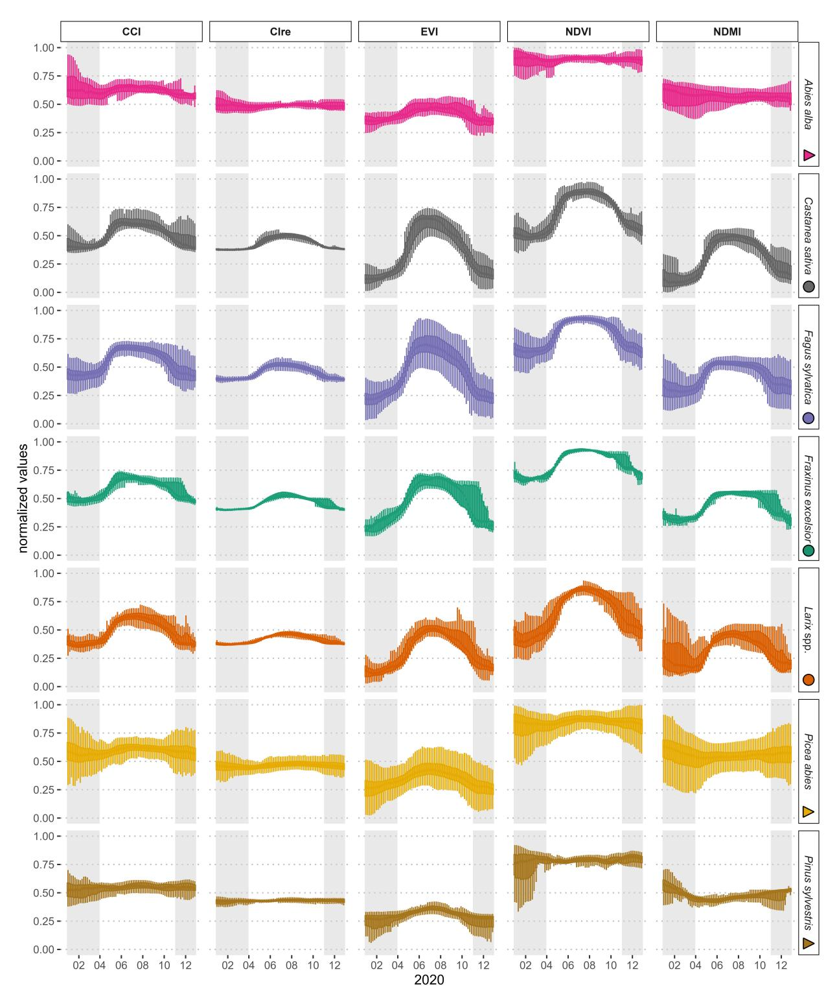
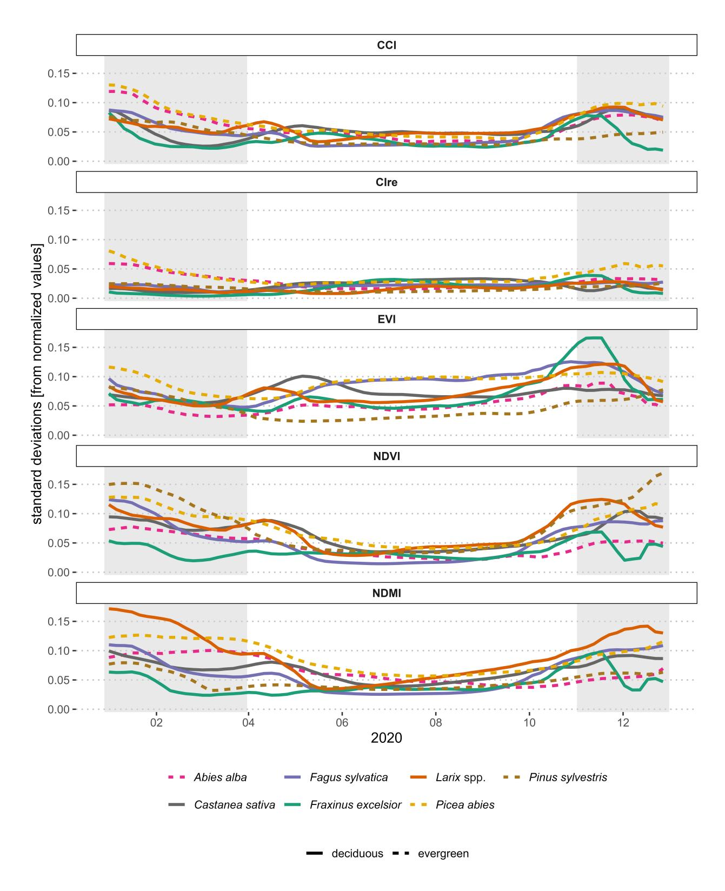
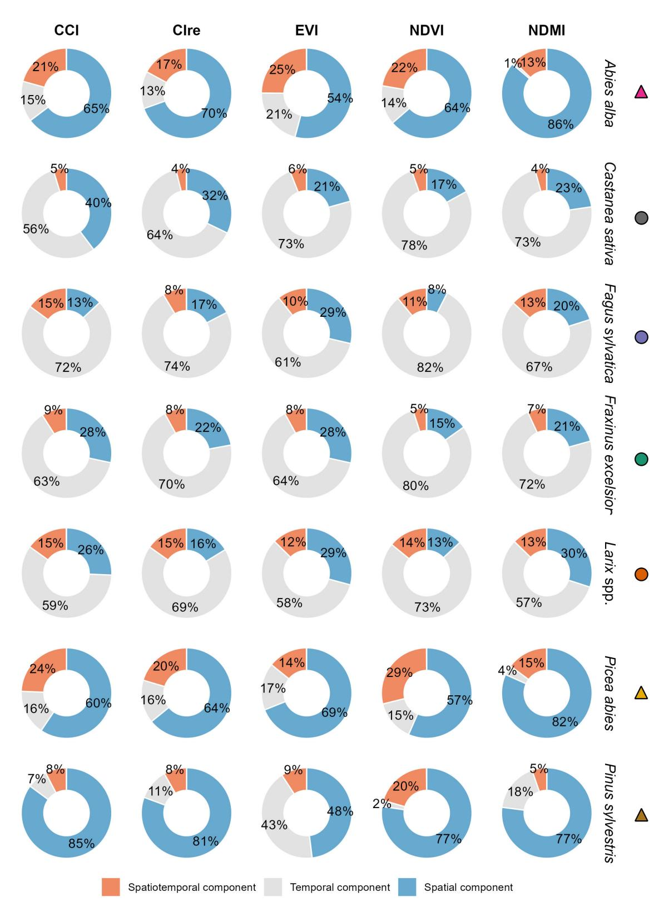
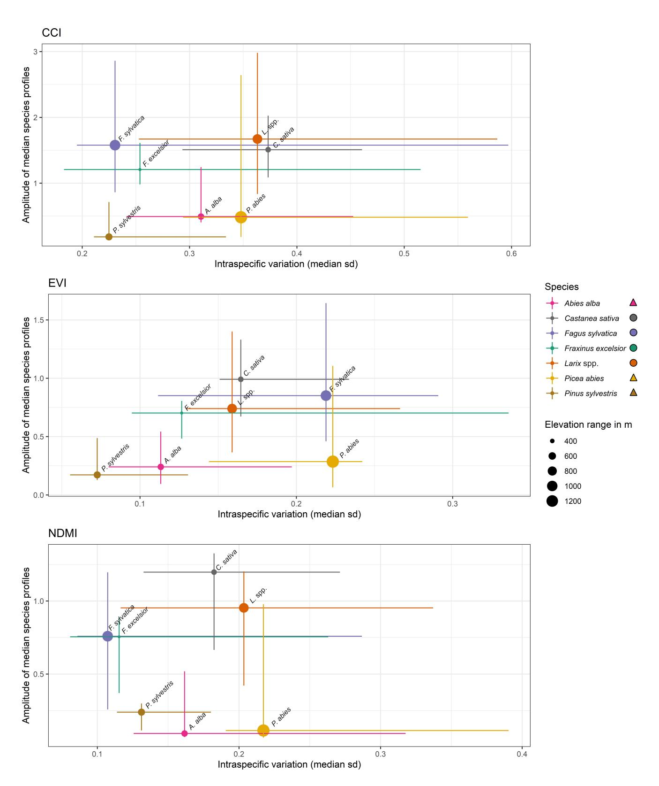

Article

# Assessing Intraspecific Variation of Tree Species Based on Sentinel-2 Vegetation Indices Across Space and Time

Tiziana L. Koch 1,2,\*, Martina L. Hobi 1, Felix Morsdorf 1,2, Alexander Damm 2,3, Dominique Weber 1, Marius Rüetschi 1,2, Jan D. Wegner 4, and Lars T. Waser 1

- Swiss Federal Research Institute WSL, Zürcherstrasse 111, 8903 Birmensdorf, Switzerland; martina.hobi@wsl.ch (M.L.H.); felix.morsdorf@geo.uzh.ch (F.M.); dominique.weber@wsl.ch (D.W.); marius.rueetschi@wsl.ch (M.R.); lars.waser@wsl.ch (L.T.W.)
- Department of Geography, University of Zurich, Winterthurerstrasse 190, 8057 Zurich, Switzerland; alexander.damm@geo.uzh.ch
- Department of Surface Waters-Research and Management, Swiss Federal Institute of Aquatic Science and Technology (Eawag), Ueberlandstrasse 133, 8600 Duebendorf, Switzerland
- Department of Mathematical Modeling and Machine Learning, University of Zurich, Winterthurerstrasse 190, 8057 Zurich, Switzerland; jandirk.wegner@uzh.ch
- \* Correspondence: tiziana.koch@wsl.ch

**Abstract:** Forest ecosystems are vital for biodiversity, climate regulation, and ecosystem services. Their resilience depends not only on species diversity but also on intraspecific variation—the genetic and phenotypic differences within species—which underpins adaptive capacity to environmental change. However, large-scale, continuous monitoring of intraspecific variation remains challenging. Here, we present a remote sensing approach using Sentinel-2 time series of five vegetation indices as proxies for pigment content, canopy structure, and water content to detect intraspecific variation in seven tree species across a broad environmental gradient in Switzerland. Using pure-species plot data from the Swiss National Forest Inventory, we decomposed variation into spatial, temporal, and spatiotemporal components. We found that spatial variation dominated in evergreen species (48-86%), while temporal variation was more pronounced in deciduous species (56-82%), reflecting their stronger seasonality. These findings demonstrate that speciesspecific Sentinel-2 time series can effectively track intraspecific variation, providing a scalable method for forest monitoring. This approach opens new pathways for studying forest adaptation, informing management strategies, and guiding species selection for conservation under changing climate conditions.

**Keywords:** Sentinel-2 time series; National Forest Inventory; phenology; physiological traits; forests

Academic Editor: Carlos Alberto Silva

Received: 14 May 2025 Revised: 16 June 2025 Accepted: 17 June 2025 Published: 18 June 2025

Citation: Koch, T.L.; Hobi, M.L.; Morsdorf, F.; Damm, A.; Weber, D.; Rüetschi, M.; Wegner, J.D.; Waser, L.T. Assessing Intraspecific Variation of Tree Species Based on Sentinel-2 Vegetation Indices Across Space and Time. *Remote Sens.* **2025**, *17*, 2094. https://doi.org/10.3390/rs17122094

Copyright: © 2025 by the authors. Licensee MDPI, Basel, Switzerland. This article is an open access article distributed under the terms and conditions of the Creative Commons Attribution (CC BY) license (https://creativecommons.org/licenses/by/4.0/).

# 1. Introduction

Forest ecosystems and their diversity of tree species play an essential role in fostering biodiversity, regulating the climate, and providing resources and ecosystem services for human populations [1]. Species presence in forests is shaped by multiple factors, including their ability to adapt to the local environmental and climatic conditions, as well as interactions, such as competition with other species [2]. Tree species are characterized by functional traits—morphological, physiological, or phenological features—that determine the overall fitness of species as they affect growth, reproduction, and survival [3]. Traits can vary not only between species (interspecific variation) but also within the same species

Remote Sens. 2025, 17, 2094 2 of 20

(intraspecific variation). Therefore, traits are particularly important in ecology as they determine how an individual functions within a given environment [4].

To cope with a changing environment, tree species can employ two strategies: (1) phenotypic plasticity and (2) local adaptation [5]. Phenotypic plasticity is the ability of an organism to alter its phenotype in response to environmental conditions. It results from the interaction of multiple traits and reflects both genetics and environmental influence [6]. Local adaptation, in contrast, involves genetic changes within a species population that enhance survival and reproduction in specific environments [7]. Both mechanisms are distinct for each individual species and contribute to intraspecific variation, allowing species to respond to climatic variability [8]. The degree to which phenotypic plasticity and local adaptation are expressed varies within species; however, there are indications that phenotypic plasticity has a larger contribution to intraspecific variation [9]. Therefore, understanding intraspecific variation is crucial for predicting species distributions, enhancing forest resilience under climate change, and informing sustainable forest management [7,10].

One of the key questions concerning the sustainable management of forest ecosystems is which species possess a specific set of traits that can cope with future climate conditions and should be promoted through management interventions. Common garden experiments and provenance trials are carried out to test the ability of species to adapt to changing environmental conditions (e.g., [11]). They are based on plantings in an experimental design and are used to assess species-specific phenotypic plasticity and local adaptation of fitnessrelated traits under varying climatic conditions [7]. The goal is to identify species with their specific geno- and phenotypes that can survive in certain environments. Several studies showed that traits do not differ uniformly, and hence, an evaluation of multiple traits can contribute to a better identification of the capability of species in the context of climate change [7]. While these experimental approaches are indispensable, they are labor-intensive, time-consuming, and thus limited to a small number of species and sites [12]. An additional challenge is that these observations must be conducted over extended time periods to yield valuable results [11], mainly determined by the time it takes for a tree to mature from a planted seedling to a full-grown tree. Given the challenges and spatial limitations of in situ methods, remote sensing has emerged as a promising complementary approach, offering the potential for continuous, large-scale trait assessment across multiple species.

Remote sensing technologies allow for the calculation of vegetation indices, which act as proxies for a subset of phenotypic traits, particularly those related to photosynthetic pigments, canopy structure, and water content [13]. Recent studies using drones and airborne imaging spectroscopy have demonstrated that intraspecific variation in traits can be linked to genetic variation and local adaptation (e.g., [14–18]). D'Odorico et al. [16] were able to distinguish Fagus sylvatica from its subspecies Fagus sylvatica spp. orientalis based on top-of-canopy leaf reflectance and found significant differences in traits, such as nitrogen, lignin, cellulose, and chlorophyll content, which were derived from spectral information. Czyz et al. [14] revealed a relationship of intraspecific genetic variation visible in airborne imaging spectroscopy and pinpointed the strongest relationships to spectral regions representative of leaf water content, phenols, pigments, and waxes. These traits reflect genotype-specific phenotypic responses [14]. Drone-based remote sensing was able to detect differences in local adaptation using retrieved phenotypic information in provenance trials, with stronger relationships observed for spectral than structural traits [17]. In addition, seasonal dynamics of vegetation indices with multiple drone acquisitions revealed differences in climatic adaptation and hybridization [18]. However, as most of these remote sensing-based studies focus on single species and are limited in their spatial extent and observed time periods, large-scale and temporal patterns of intraspecific variation of multiple species—particularly as captured by satellite remote sensing—remain Remote Sens. 2025, 17, 2094 3 of 20

understudied. This could limit large-scale insight into the physiological and structural phenotypes of tree species, thereby limiting our understanding of the resilience of tree species and forests in the context of environmental change.

Sentinel-2, whose first satellite was launched in 2015, enables the use of time-series data within a year and across years, opening the pathways for continuous monitoring. However, to fully leverage the high revisit frequency and 10 m spatial resolution provided by this multispectral dataset, further methodological developments are necessary. Advancements in this area have been achieved with vegetation indices derived from Sentinel-2 time series, which have been extensively employed in various studies to monitor forest phenology [19–21]. But none of these studies focused on intraspecific variation from vegetation indices across time and space.

In our study, we aim to investigate the spatiotemporal intraspecific variation of biochemical and structural plant traits of seven forest tree species for a year across a large environmental gradient. We use rigorously processed Sentinel-2 time series-derived vegetation indices to approximate several plant traits sensitive to key adaptation mechanisms, including two pigment-related indices, two canopy structure-related indices, and one index linked to canopy water content. We use in situ species reference data from the Swiss National Forest Inventory, which is continuously and regularly spread across space and time over a large environmental gradient in Swiss forests, to identify pure species plots. We comprehensively describe the intraspecific variation of all vegetation indices and quantify the contribution of temporal and spatial dimensions to the observed variation. We discuss the results in consideration of plant physiological concepts, data-specific properties, and implications for current and future forest management.

## 2. Materials and Methods

#### 2.1. Study Area

Switzerland is located on the Alpine arc in Central Europe and covers an area of 41,285 km2. The country comprises a vast variety of landscapes and a wide environmental gradient due to its broad elevation range from 197 m to 4634 m a.s.l. and its topographic complexity (Figure 1). Approximately 32% of Switzerland is forested areas, composed of 48% broadleaved and 52% coniferous trees regarding the crown extent [22]. Pure stands account for 17% of the forest area and occur mainly in alpine areas, whereas 48% of the forests consist of two to three species and 34% consist of more than three species [23].

## 2.2. Sentinel-2 Time Series Processing

We used multispectral Sentinel-2 data from the Copernicus Program operated by the European Space Agency. Sentinel-2, during the time of acquisitions used in this study, consisted of two identical satellites (Sentinel-2A and Sentinel-2B) that provide acquisitions over Switzerland every 2 to 5 days [24]. The high temporal frequency increases the chances of obtaining cloud-free data, which is essential for assessing vegetation dynamics and phenology.

We downloaded Level 1C data from all 14 Sentinel-2 tiles covering Switzerland with an estimated cloud cover of less than 80%, and we processed the data with FORCE v. 3.7.8-12 [25] (further details: <a href="https://github.com/TLKoch/Sentinel-2\_CH">https://github.com/TLKoch/Sentinel-2\_CH</a> (accessed on 18 April 2024); [26,27]). We used FORCE to perform multiple corrections, including corrections of atmospheric and topographic effects using the digital elevation model from Copernicus Land Monitoring Service (EU-DEM v. 1.1), with a 25 m spatial resolution, a bidirectional reflectance distribution function (BRDF) correction, and an adjacency effect correction. We used an improved Fmask algorithm for cloud masking, and we applied buffers of 300 m for clouds, 90 m for shadows, and 30 m for snow [28,29]. We resam-

Remote Sens. 2025, 17, 2094 4 of 20

pled all bands to a 10 m spatial resolution using cubic convolution and stored the images in a data cube structure. We also co-registered all Sentinel-2 images with monthly Landsat Collection 2 composites based on near-infrared images from 2014 to 2021 to improve the geometric consistency of the full time series [30,31].

**Figure 1.** Map of Switzerland showing the locations and species information of the seven selected tree species from sample plots of the Swiss National Forest Inventory (NFI). Circular symbols represent deciduous tree species and triangular symbols represent evergreen species. Species symbols with black borders show the NFI records used in this study, whereas symbols with white borders show the NFI plots that had to be excluded in the second filtering step regarding the Sentinel-2 data of 2020. A digital elevation model (Copernicus Land Monitoring Service EU-DEM v. 1.1) and the Swiss forest mask [32] are displayed in the background.

To obtain continuous and consistent time series without gaps, we generated regularly interpolated Sentinel-2 time series with a 5-day interval referring to the theoretical revisit time. We could not use all the Sentinel-2 images available due to factors such as snow and clouds. Additionally, it is important to note that the 5-day time series for 2020, which we analyzed, is not composed of the original images but rather a time series of interpolated and smoothed composites derived from the original Sentinel-2 images. We used the radial basis convolutional filtering (RBF) available in the FORCE time-series analysis (TSA) submodule [33]. The RBF is comparable to a spatial moving window average approach, but over time [33]. We used kernel width values of 10, 20, 30, and 50 days as recommended by [34]. Within this step, we removed curve outliers and pixels that failed quality checks for clouds and their shadows, snow, saturation, and limited illumination.

We calculated the following vegetation indices as proxies for pigments, canopy structure, and water content to cover important adaptation mechanisms that can be assessed with remote sensing [13]. These indices have been used to study functional traits and species in forest ecosystems [21,35,36]. Namely, we generated the following: Normalized Difference Vegetation Index (NDVI; [37]), Enhanced Vegetation Index (EVI; [38]), Chlorophyll Carotenoid Index (CCI; [39]), Red-edge Chlorophyll Index (CIre; [40]), and Normalized Difference Water Index (NDMI/NDWI; [41]). NDVI and EVI use the red band and a near-infrared band, while the EVI also uses the blue band to correct the influences of aerosols [42].

Remote Sens. 2025, 17, 2094 5 of 20

The NDVI is well-established for measuring vegetation productivity and monitoring vegetation dynamics [43]. However, the EVI is preferred in certain cases, e.g., for land surface phenology (e.g., [44–46]), thanks to its greater sensitivity to high biomass and canopy structural variations [38]. The NDMI is a proxy for the water content of canopies [41]. The CIre functions as a representation of canopy chlorophyll content [40], and the CCI was originally developed for detecting photosynthetic phenology in evergreen conifers as an interaction of carotenoid and chlorophyll [39].

# 2.3. Tree Species References

The Swiss National Forest Inventory (NFI) is a continuous survey that assesses the state of Swiss forests and monitors their development. The NFI surveys approximately 6600 sample plots in a cycle of 9 years on a regular 1.4 km grid covering the country [47,48]. A two-phase sampling approach involving aerial stereo-image interpretation in the first phase and terrestrial surveys in the second phase is carried out [47,48]. The aerial interpretation and part of the field survey are gathered from a square of 50 m  $\times$  50 m representing the forest stand. More detailed information is obtained through forest inventories carried out on sample circles with the same center and areas of 200 m² and 500 m² [48]. All trees with a diameter at breast height (DBH)  $\geq$  12 cm are recorded within the smaller circle, and all trees with a DBH  $\geq$  36 cm are recorded within the larger circle [48]. In this study, we utilized NFI data collected between 2013 and 2021, spanning the entire country, to ensure that these data are consistent with or closely match the Sentinel-2 observations from 2020.

# 2.4. Tree Species-Specific Sentinel-2 Time Series

To link tree species with the satellite data and to ensure representative species-specific Sentinel-2 time series, we applied a two-step filtering approach. This approach also minimizes the influence of possible confounding factors (e.g., canopy coverage) and insufficient satellite observations. The first step focused on the NFI data, which represent the forest attributes of the plots, and the second step considered the quality of the Sentinel-2 time series at these plot locations.

In the first filtering step, we filtered for pure species plots. For this, we utilized tree species information, the location of the trees within the two sample circles, and additional data from aerial interpretation and field observations to filter the data. The information was obtained from the following two different scales: information on the plot, which represented the two sample circles, and information about the stand, which encompassed the plot and its adjacent areas. We considered trees of the upper canopy layer of the stand and only included plots dominated by one species in this layer. We then filtered for stands with a total canopy coverage of at least 60%, followed by the argument that one tree species must dominate the stand with coverage of at least 80%. Moreover, we only considered tree species that occurred on at least ten different plots to ensure a minimum sample size for each species. In this step, we selected 610 plots, which resulted in 10 to 371 plots per species (Table 1). This set of plots covers the seven predominant tree species growing on 95% of all the NFI plots and is spread over different elevational ranges (Figure 2).

In the second step, we filtered species-specific Sentinel-2 time series by accounting for an adequate amount of Sentinel-2 imagery used for generating the time series (Table 1). We set our criteria, taking into consideration the Nyquist–Shannon sampling theorem [49,50]. We ensured that one image was present every 30 days within the vegetation period from April to October 2020, and at least one image was present in the winter period from November to March (including images from 2019 and 2021) before and after the vegetation period. The winter images were important to represent species phenology, and as we removed snow and poorly illuminated areas, vegetation can still be characterized using

Remote Sens. 2025, 17, 2094 6 of 20

these images. This procedure reduced the dataset for the year 2020 in step two from 610 to 200 plots. These plots contained 763 pixels with tree trunk positions, which were used for the analyses. A total of 380 pixels represent evergreen species, and 383 pixels represent deciduous species. The dataset is openly available [51].

**Table 1.** Two-step data filtering for provisioning species-specific Sentinel-2 time series. The pure species plots available from the Swiss NFI (Filter 1) are shown, as well as the plots available after accounting for adequate Sentinel-2 coverage throughout the year (Filter 2). Representative species profiles were derived for about one-third of the available pure species plots. The number of excluded plots for each species differs substantially due to the availability and quality of Sentinel-2 data. The data is from 2020.

| Species            | Filter 1 Pure Plots | Filter 1 → Filter 2 Excluded Plots [in Percent] Considering Sufficient Sentinel-2 Imagery | Filter 2 Pure Plots with Sufficient Sentinel-2 Imagery | Filter 2 Pure Pixels with Sufficient Sentinel-2 Imagery |
|--------------------|------------------------|-------------------------------------------------------------------------------------------|--------------------------------------------------------------|---------------------------------------------------------------|
| Abies alba         | 11                     | 55%                                                                                       | 5                                                            | 22                                                            |
| Castanea sativa    | 19                     | 37%                                                                                       | 12                                                           | 51                                                            |
| Fagus sylvatica    | 141                    | 46%                                                                                       | 76                                                           | 285                                                           |
| Fraxinus excelsior | 10                     | 60%                                                                                       | 4                                                            | 13                                                            |
| Larix spp.         | 46                     | 74%                                                                                       | 12                                                           | 34                                                            |
| Picea abies        | 371                    | 77%                                                                                       | 85                                                           | 329                                                           |
| Pinus sylvestris   | 12                     | 50%                                                                                       | 6                                                            | 29                                                            |
| Total              | 610                    | 67%                                                                                       | 200                                                          | 763                                                           |

**Figure 2.** Elevational range of the filtered species samples, ensuring species purity at the NFI plot level and adequate availability of continuous Sentinel-2 images in 2020. The distribution of the elevation for each species is depicted in three different ways: (1) the raw data as jittered points, (2) the data in a standard box plot, and (3) the data in a density plot.

## 2.5. Assessing Intraspecific Variation

This study employed various statistical measures to assess intraspecific variation of the vegetation index time series, which enabled comparisons within species, across species, and across vegetation indices. For this purpose, the index time series were normalized to enhance their comparability. We used a min–max normalization to rescale all values of an index and species to a range between 0 and 1. All analyses and visualizations were conducted in R, based on vegetation index time series processed using the FORCE framework as described above in Section 2.2 [52].

First, we visualized intraspecific variation using time series of box plots. Separate box plots of time series were created for each species and vegetation index. These box plots display the distribution of index values across different samples of each species over time, making temporal patterns evident. This approach captures the species-specific

Remote Sens. 2025, 17, 2094 7 of 20

yearly trajectory for each vegetation index. Second, we calculated the standard deviation for each time step, again separated by species and index, and presented these as time series. Unlike the box plots, these standard deviation time series include outliers, which can potentially inflate values due to their sensitivity to extreme index values. In contrast, for the box plot, time series outliers were excluded for improved visualization (outlierinclusive figure: Supplementary Material Figure S1.1). Another key distinction is that box plots represent the median, while standard deviations are calculated using the mean. Third, we calculated the total variation and its contributing components (temporal, spatial, and spatiotemporal) for each species and index separately using the method proposed by [53] for the vegetation period. This method, available via the R package stdiversity (https://github.com/RossiBz/stdiversity, accessed on 24 November 2024), was originally developed to assess spectral diversity and decompose the components of diversity into time, space, and their interaction based on the sum of squares. In our study, we employed this method to assess variation and derived the contributions as percentages for the temporal, spatial, and spatiotemporal components. The variation calculation involves dividing the sum of squares by the number of pixel values and temporal time steps, accounting for the pairwise dissimilarity between pixel values at the same time and the dissimilarity between pixel values across different time periods. The temporal component reflects seasonal changes (amplitude), the spatial component captures intraspecific variation across sample pixels, and the spatiotemporal component indicates whether temporal and spatial variation average out, as described by [54] as a measure of asynchrony.

In addition, we analyzed the relationship between the median standard deviation and the value range (amplitude) per species to evaluate if species with higher amplitudes also comprise a higher intraspecific variation, both within the vegetation period and across the entire year (Additional Supplementary Materials Figures S4.1–S4.7). This analysis also considered the respective elevational ranges of the species. Only here did we use the original index time series that were not normalized. Furthermore, relationships between the median standard deviation, elevational range, and sample size are presented in the appendix (Supplementary Materials Figures S5.1–S6.5), along with Welch's F-tests [55] and their associated effect sizes (Supplementary Materials Figures S3.1–S3.2).

## 3. Results

We derived species-specific time series for each of the five vegetation indices and each of the seven tree species over the year 2020 (Figure 3). The magnitude of the intraspecific variation varies across the species and the vegetation indices. Please note that full-length species-specific time series could only be generated for approximately one-third of the pure species plots of the Swiss NFI due to the inconsistent availability or low quality of Sentinel-2 images (Table 1). The data availability in our study differed across species; the largest number of plots needed to be discarded for *Picea abies* (77%), *Larix* spp. (74%), and *Fraxinus excelsior* (60%), and the lowest number of plots were excluded for *Castanea sativa* (37%) and *Fagus sylvatica* (46%) (Table 1).

In general, as expected, there was a stronger seasonality and, therefore, a higher amplitude/value range for deciduous species (*Castanea sativa*, *Fagus sylvatica*, *Fraxinus excelsior*, *Larix* spp.) than for evergreen species for all five vegetation indices (Figure 3). In addition, there was a tendency for very similar courses over the year within the evergreen and deciduous species. The greatest intraspecific variation indicated by larger box plots was observable for *Picea abies* and *Fagus sylvatica*, followed by *Abies alba* (Figure 3). The intraspecific variation of the CIre was the smallest among all indices, and the highest for the EVI and the NDMI. The intraspecific variation of CCI, CIre, NDVI, and NDMI was lower

Remote Sens. 2025, 17, 2094 8 of 20

within the vegetation period than outside of it. During the start of the growing season, the intraspecific variation of the deciduous species was among the lowest in the whole year.

**Figure 3.** Species-specific vegetation index time series as box plots for seven tree species all over Switzerland for the year 2020. The box plots indicate the distribution of the pixel values of the respective vegetation index at one specific time step. The index values were normalized individually for better comparability across the individual species and indices, and outliers are not shown (Outlier-inclusive figure: Supplementary Material Figure S1.1). A gray background indicates the time outside the vegetation period (January–March and November–December 2020).

Remote Sens. 2025, 17, 2094 9 of 20

Standard deviations over all of the selected plots for every five days leading to a time series were used to quantify the intraspecific variation of species further (Figure 4). Higher standard deviations occurred outside of the vegetation period for all evergreen species and only partly for the deciduous species. Towards the end of the season, approximately starting in October, most of the standard deviation time series started rising. For all indices except EVI, the lowest standard deviations occurred during the growing season from mid-May to mid-October. There was a peak of standard deviation at the EVI for Castanea sativa in the first half of May, a smaller peak for Larix spp. earlier, in the first half of April, and a peak for Fraxinus excelsior in November. Similar peaks with smaller magnitudes for these species were present in the NDVI. However, the peak for Castanea sativa occurred earlier in the NDVI than in the EVI. All five vegetation indices showed a peak for *Fraxinus excelsior* in the first half of November. While *Picea abies* and *Fagus sylvatica* had the greatest intraspecific variation (Figure 3), this was not as apparent in Figure 4. Only in the EVI from June to October did these two species have the highest standard deviations throughout a longer period. However, *Picea abies* also had the highest standard deviations for other indices at other times, but mostly outside of the vegetation period.

The associated percentages for the spatial, temporal, and spatiotemporal components of intraspecific variation are shown in Figure 5 (further details in Supplementary Materials Figures S2.1–S2.6). For the deciduous species, the temporal component explained about two-thirds of the variation for all five indices (Figure 5). For the evergreen species, the temporal variation of the EVI was the largest among all indices. The spatiotemporal component, referring to phenological asynchrony, meaning that similar values are present but at different times, contributed largely to the variation of *Abies alba* and *Picea abies*. Except for the CCI and NDVI of *Fagus sylvatica* and the NDVI of *Larix* spp., the spatiotemporal component of the deciduous species had the lowest percentage of the three components. However, the spatial component was the most interesting for intraspecific variation as it represents different specific phenotypes at a particular location. Between 48 and 86% were associated with this spatial component for the evergreen species among all indices. These percentages ranged from 8 to 40% for the deciduous species.

Deciduous species were typically characterized by larger seasonal variation due to annual leaf growth and senescence compared to evergreen species (Figure 6). This would imply a larger seasonal amplitude of vegetation indices sensitive to pigments, canopy water content, and green biomass, as well as a possible larger spatial variation along elevation gradients of deciduous species compared to evergreen species. However, this was not necessarily the case. In the EVI *Picea abies* and *Fagus sylvatica* represented the highest median standard deviations while occurring in locations with the highest elevation ranges (Figure 6). *Fraxinus excelsior* had the widest range from minimum to maximum standard deviation. *Castanea sativa* had the highest amplitude and a quite high median standard deviation, while covering a lower elevation range than *Larix* spp.

A different distribution of amplitude and median standard deviation was present for the NDMI and the CCI (Figure 6). However, a similar amplitude pattern with low amplitudes for the evergreens and higher amplitudes for the deciduous species can be observed. Although *Picea abies* had the highest median standard deviation in the NDMI, *Fagus sylvatica* had the lowest among all species. Similar patterns can be seen for the CCI. As for the EVI, *Castanea sativa* had the largest amplitude for the NDMI.

Remote Sens. 2025, 17, 2094 10 of 20

**Figure 4.** Standard deviations for the five normalized vegetation indices per time point and species. The times apart from the vegetation season (January–March and November–December 2020) are highlighted in a grey background.

Remote Sens. 2025, 17, 2094 11 of 20

**Figure 5.** The proportions of the components of intraspecific variation of each vegetation index and species within the vegetation period. The contribution to the overall variation is represented as percentages attributed to the temporal, spatial, and spatiotemporal components. The temporal component reflects seasonal changes (amplitude), while the spatial component reflects intraspecific variation across sample pixels, referring to differences in locations. The spatiotemporal component indicates whether temporal and spatial variation are neutralizing each other, as described by [54] as a measure of asynchrony. The method proposed by [53] was used, which is available in the R package *stdiversity* (https://github.com/RossiBz/stdiversity, accessed on 24 November 2024).

Remote Sens. 2025, 17, 2094 12 of 20

**Figure 6.** The relationship of intraspecific variation (standard deviation (SD)) and index amplitude of the vegetation indices CCI, EVI, and NDMI throughout the vegetation period in 2020. We assumed the larger the amplitude, the greater the potential for intraspecific variation. The deciduous tree species have a greater amplitude due to leaf emergence and senescence. The x-axis shows the median SD for all SDs across time and the range from minimum to maximum SD across time. The y-axis is the range of the median species profiles and the range from the minimum to the maximum. The index time series used for this figure were not normalized.

Remote Sens. 2025, 17, 2094 13 of 20

# 4. Discussion

## 4.1. Spatial and Temporal Patterns of Intraspecific Variation

We analyzed the intraspecific variation of seven forest tree species, represented by five vegetation index time series that serve as proxies for key phenotypic traits (i.e., pigment and water content, canopy structure), which may possibly be altered in the context of environmental change. The greatest intraspecific variation was found for *Picea abies* and Fagus sylvatica (Figure 3), with at times a lower spatial contribution (standard deviation) compared to temporal contribution (amplitude) (Figure 4). In addition, Picea abies also had the highest spatial variation (standard deviations) for other indices at other time steps within the analyzed year, but mostly outside of the vegetation period. However, the EVI values from June to October for *Picea abies* and *Fagus sylvatica* showed the highest standard deviations among all species. As the EVI can be related to structural differences, we hypothesize that this is due to different structural phenotypes, which could be reactions to differing environmental conditions throughout the samples. Picea abies and Fagus sylvatica were attributed with the highest elevation ranges in their distribution (Figure 2), which is known to be directly related to phenology. However, especially spring phenology (referring to leaf-out dates), became more uniform across elevations [56] due to global warming. Still, Chaurasia et al. [57] detected higher spectral variability within abundant species and related this to higher capacities to adapt to local conditions. Referring to Gárate-Escamilla et al. [7], we most likely unfolded the phenotypic plasticity of Fagus sylvatica and not patterns of local adaptation. However, our proposed method could be used to study this in more detail, offering the potential to make connections with population genetics and disentangle these effects. Fagus sylvatica is believed to be intolerant to drought; however, it is debated, and findings by [58] suggest a high resilience of the species. In our study, Fagus sylvatica exhibited not much intraspecific variation in the NDMI and CCI during the growing season (Figures 4 and 6), especially compared to the other species, which could indicate relative stability of water content and chlorophyll-carotenoid contents throughout the environmental gradient and hence some resilience to drought. As Klesse et al. [59] evaluated the distribution of Fagus sylvatica and expected water availability to constrain it, and as other studies show that beech has difficulties dealing with drought stress (e.g., [60,61]), we suggest conducting further studies with our methodology targeting beech populations which are already impacted by drought to assess if similar results can be obtained using remote sensing.

Interestingly, several local maxima in standard deviation for different species and indices were observed. There is a local maximum of standard deviation at the EVI for Castanea sativa in the first half of May, and a smaller local maximum for Larix spp. earlier, in the first half of April. Similar peaks were also visible for the CCI. We relate this to different timings of leaf and needle outbursts and development among the samples. All five vegetation indices reached a (local) maximum for *Fraxinus excelsior* in the first half of November (Figure 4), which we assume to be a data problem caused by limited sampling size and remaining remote sensing constraints (e.g., clouds, shadow and limited illumination) occurring at the very end of the vegetation period. Still, another possibility is that different timings of leaf senescence or understory caused this. In general, today Fraxinus excelsior is threatened in Switzerland by multiple threats such as ash dieback [62] and the awaited invasion of the emerald ash borer [63,64]. Even though it would be important to observe the species over their full environmental gradient for intraspecific variation, observing these severe threats and their distribution and spread is the key to assessing the potential future of Fraxinus excelsior in Swiss forests. Recently, Gossner et al. [64] found intraspecific variation in the resistance of Fraxinus excelsior in Switzerland, but it remains unclear if these trait patterns would be detectable with remote sensing approaches.

Remote Sens. 2025, 17, 2094 14 of 20

Although all vegetation indices showed an annual pattern, differences between evergreen and deciduous species were apparent (Figures 3 and 5). Among the five vegetation indices analyzed, the EVI and NDMI exhibited the highest levels of intraspecific variation across species, while the CIre was notably more stable. This could be related to a more a stable carotenoid–chlorophyll relation throughout the year, whilst leaf biomass and water availability vary substantially. In addition, the higher intraspecific variation in the EVI compared to the CCI and CIre points to the potential of Sentinel-2 to differentiate between structural rather than pigment-related phenotypes. This likely stems from the fact that leaf biomass is directly linked to pigments—without leaves, there are no pigments. The EVI showed higher intraspecific variation than the NDVI, which could originate from the saturation that the NDVI is usually prone to while the EVI would still be able to capture canopy variations in such cases [38].

Interpretations for times outside the vegetation period (November to March) remain difficult. We partly observed more variation during these times (e.g., Figures 3 and 4), but astonishingly, evergreen species showed slightly greater variation even though all of these trees should have maintained most of their needles during this period. We assume that remote sensing constraints (e.g., illumination conditions, shadow fractions, clouds, and snow) have distorted the information, or that evergreens exhibit greater variation in order to cope with cold temperatures.

Intraspecific variation due to temporal differences (Figure 5) plays a significant role in deciduous tree species. This raises the question of whether deciduous trees have a greater adaptive capacity to climate change, as evidenced by their ability to adjust leaf unfolding and senescence. Our samples also revealed location-based intraspecific variation, demonstrating the presence of diverse phenotypes across all selected vegetation indices. Applying our methodology in different years and locations could reveal the effects of climatic pressures. For example, lower amplitudes in vegetation indices may indicate shorter growing seasons, which in turn limits canopy development. In contrast, greater variation could indicate regional or temporal challenges within a species, which can help identify potential local interventions. Moreover, analyzing stability across vegetation indices can help identify species resilience and provide benchmarks for comparison with other species.

## 4.2. Limitations and Challenges of Tree Species-Specific Satellite Remote Sensing Approaches

While remote sensing can offer valuable insights into ecological patterns, it also presents challenges when applied to assessments of intraspecific variation, particularly with Sentinel-2 time series. The presented remote sensing approach provides additional information to in situ methods and can therefore be understood as a complementary approach, potentially facilitating continuous large-scale ecological studies.

In our study, the rigorous filtering process applied to the species-specific Sentinel-2 time series significantly reduced data availability but was essential to ensure species-specific signals, which is a major challenge [65]. Due to the spatial resolution of Sentinel-2's spectral bands (10–20 m), we could not target individual trees but focused on species-specific canopy signals. To study the species-specific vegetation indices and their variation, we selected mostly pure stands as the premise for conducting our study. Only 17% of the Swiss NFI plots used as reference were located in pure species forest [23], and only 10% of all NFI plots matched our conservative approach within the first filtering step to minimize the influence of other confounding factors (e.g., sparse canopy cover or competition) and to finally guarantee species-specific canopy signals within the pixel size of Sentinel-2. From an ecological perspective, this is not too surprising because some species favor growing or are predominantly planted in mixed-species stands (e.g., *Acer* spp. [66]). Another important

Remote Sens. 2025, 17, 2094 15 of 20

factor was the selection of plots having a relatively closed canopy, which might not be the dominating forest structure due to the growth habit of individual species (e.g., conifers) or due to heterogeneity in the canopy caused by natural disturbances or by diseases and pests (e.g., ash dieback), effectively creating large heterogeneity in the canopy through gaps. In addition, only about one-third of the samples (about 3% from all NFI plots) matched our criteria for representative Sentinel-2 time series in the second filtering step. The criteria were one image every 30 days within the vegetation period, from April to October, and at least one image in the winter period, from November to March. The criterion for a winter image was crucial in creating a representative species phenology that enabled us to fit the time series throughout the year, as well as to represent the leaf-off conditions of deciduous tree species and the winter conditions of evergreen trees, which are not well understood.

Mountainous areas, with their high cloud frequency and topography-induced shadows [67], posed additional challenges and mostly affected species like *Picea abies* and *Larix* spp., which are more abundant in mountainous habitats. Furthermore, the availability of Sentinel-2 data varies annually, posing a fundamental challenge to the transferability of these remote sensing approaches. However, we focused on the year 2020, which presented the best remote sensing conditions with a high availability of images for establishing our method. Nevertheless, the specific Sentinel-2 time series generation and filtering enable transferability to other years, even with reduced sampling sizes.

We found differences in the number of neglected samples across the species. Most plots were discarded for *Picea abies* (77%), *Larix* spp. (74%), and *Fraxinus excelsior* (60%). Picea abies and Larix spp. favor mountainous habitats, and their conical crown shape leads to more shadows within the canopy, and likely due to these shadows these Sentinel-2 images were sorted out. As Fraxinus excelsior is threatened, e.g., by ash dieback [62], their canopies are becoming more open, and individuals are dying, which most likely leads to more shadows and less availability of high-quality Sentinel-2 images of the canopy for this species. The fewest plots were discarded from Castanea sativa (37%) and Fagus sylvatica (46%). This can be attributed to their habitats in lower elevations and their behavior of having interlocked crowns, resulting in a more homogeneous canopy structure [68]. Overall, mixed species stands are an essential component of temperate forests in Europe and will become even more so in the future as they are known to be more resilient and resistant in the context of climate change, e.g., to drought [69]. However, in this study, we focused on evaluating species-specific behavior, which, in our opinion, will help to understand and study mixed stands in the future when climate change affects species differently and induces shifts in species compositions in forests [70].

We believe that our physical understanding of tree traits and their relationship to vegetation indices is an important research topic to follow. It is essential to recognize that vegetation indices measured at the pixel size of Sentinel-2 will always be a combination of multiple physiological and structural canopy traits, and further research is needed on approaches to disentangle these. An in situ validation of our approach is not feasible due to the pixel size, including one or multiple canopies, and the previously mentioned combination of multiple traits in one vegetation index. Thus, data-driven studies like ours, using well-selected forest stands, are a promising approach to understanding the potential and limitations of wall-to-wall Sentinel-2 data for ecological studies.

#### 4.3. Implications of Findings

Our study demonstrates the potential of using Sentinel-2 time series to assess intraspecific variation caused by phenotypic plasticity and local adaptation. This methodology significantly contributes to forest management and climate change mitigation efforts by identifying species' adaptive strategies, which are particularly needed for assisted mi-

Remote Sens. 2025, 17, 2094 16 of 20

gration strategies of tree species [11]. In contrast to common garden experiments, which require time and resources to establish, remote sensing offers rapid and scalable insights into natural environments, enabling continuous monitoring of vegetation indices as proxies for physiological and structural traits across broad spatial scales. Furthermore, our approach is able to complement common garden trials and observe adaptation strategies by pinpointing specific times and vegetation indices which can be used for assessing in situ traits within common garden experiments or beyond. In combination with in situ observations, our method can be used to determine and localize phenotypes of interest, which can then be used for genetic sampling or to establish further common garden experiments.

In addition, species that are not part of common garden trials can be evaluated with remote sensing [12], given that there is a large enough sample size. Regarding samples, our findings are also valuable for tree species mapping, highlighting the importance of including the full scope of intraspecific variation in reference data to improve classification accuracy. Misclassifications may stem from high intraspecific variation, emphasizing the need for representative reference data in large-scale mapping efforts. While multispectral satellites, such as Sentinel-2, capture vegetation indices, other sensors, like LiDAR, can complement our approach by focusing on vertical structural indices. This in turn offers a more comprehensive view of tree species adaptations.

The transferability of our method across different regions or monitoring systems, such as NFIs, further underscores its potential. By expanding this method to larger geographic areas, such as Europe, we can enhance our understanding of intraspecific variation on a broader scale and encompass a wider range of environments that a species inhabits. In addition, an expansion to different genotypes and phenotypes allows for the studying of intraspecific variation without risking pathogen transfer, which is a concern of common garden experiments [11,71]. Moreover, operationalizing our method enables annual or seasonal monitoring of species, providing insights into how climate change affects tree phenotypes and their temporal and spectral expression.

In a broader ecological context, monitoring intraspecific variation helps to understand species' responses to climate change, their role in ecosystem functioning, and biodiversity conservation. Greater intraspecific variation promotes species coexistence across diverse environments while also influencing community assembly and ecosystem functioning [72–74]. Given the critical role that intraspecific variation plays in species adaptation and ecosystem processes (e.g., [8,75]), our findings highlight the importance of integrating this variation into conservation and forest management strategies to support species resilience in a changing climate.

# 5. Conclusions

We presented a method for deriving intraspecific variation in the biochemical and structural plant information of seven forest tree species from satellite data over a large environmental gradient. With this method, traits and their variations can be observed throughout the year for multiple tree species and across large spatial extents. The five Sentinel-2-based vegetation indices examined served as proxies for pigment and water content, as well as canopy structure, and were sensitive to tracking intraspecific variation across our samples. We observed intraspecific differences across the species and different vegetation indices. The decomposition of the intraspecific variation into its spatial, temporal, and spatiotemporal components allows us to conclude that deciduous species have great proportions of variation associated with temporal differences. This is related to their apparent stronger seasonality caused by their phenology. However, the seasonality in trait variation may be indicative of strategies for surviving in a changing climate.

Remote Sens. 2025, 17, 2094 17 of 20

All species revealed intraspecific variation across locations, highlighting that there are differences in traits induced by a species being at a specific location. This demonstrated that our method was capable of detecting phenotypic plasticity.

The samples of *Fagus sylvatica* and *Picea abies* were characterized by the largest distributions across elevations and encompassed the most intraspecific variation. Surprisingly, *Fagus sylvatica*, compared to the other species, exhibited not much variation of the vegetation indices NDMI and CCI during the vegetation period.

We conclude that species-specific Sentinel-2 time series can be used to assess intraspecific variation and that our method can be applied to other areas, times, and species, paving the way forward for using satellite remote sensing to study intraspecific variation, particularly in the context of climate change.

**Supplementary Materials:** The following supporting information can be downloaded at: https://www.mdpi.com/article/10.3390/rs17122094/s1, Figures S1.1, S2.1–2.6, S3.1–3.2, S4.1–4.7, S5.1–5.5, S6.1–6.5.

**Author Contributions:** Conceptualization, T.L.K., M.L.H., F.M., A.D., and L.T.W.; methodology, T.L.K., M.L.H., F.M., A.D., and L.T.W.; software, T.L.K.; formal analysis, T.L.K.; data curation, T.L.K. and D.W.; writing—original draft preparation, T.L.K.; writing—review and editing, T.L.K., M.L.H., F.M., A.D., D.W., M.R., J.D.W., and L.T.W.; visualization, T.L.K.; project administration, L.T.W.; funding acquisition, M.L.H. and L.T.W. All authors have read and agreed to the published version of the manuscript.

**Funding:** This research was funded by the Swiss National Science Foundation (SNSF) with the grant number 200021\_184605.

Data Availability Statement: The generated Sentinel-2 time series can be found in these two sources: Koch, T.; Weber, D.; Waser, L. Sentinel-2 imagery of Switzerland, accessed on 23 May 2024. https://doi.org/10.16904/envidat.510. Koch, T.; Weber, D.; Waser, L. Sentinel-2 time series of Switzerland, accessed on 23 May 2024. https://doi.org/10.16904/envidat.511. The tree species profiles can be found here: Koch, T.; Hobi, M.; Morsdorf, F.; Weber, D.; Rüetschi, M.; Damm, A.; Wegner, J.D.; Waser, L. Tree Species Profiles from Sentinel-2 Time Series, accessed on 11 June 2024. https://doi.org/10.16904/envidat.522.

Acknowledgments: We are grateful to the Swiss National Forest Inventory team, particularly to Meinrad Abegg, for his valuable assistance and expertise in providing data access. Further, we acknowledge the European Space Agency (ESA) for granting access to the Sentinel-2 data, which was key for our remote sensing analysis. We also acknowledge the FORCE team for providing the open-source processing software used in this study. Their software allowed us to efficiently process and improve the Sentinel-2 data, facilitating the production of meaningful results. We thank Christian Rossi for fruitful discussions. We thank Melissa Dawes for the professional language editing of parts of this manuscript. We thank the two reviewers and the editor for their valuable comments and suggestions.

Conflicts of Interest: One of the authors—Lars T. Waser—is the Section Associate Editor for "Forest remote sensing" of the Remote Sensing journal. The other authors declare no conflicts of interest. The funders had no role in the design of the study; in the collection, analyses, or interpretation of data; in the writing of the manuscript; or in the decision to publish the results.

#### References

- 1. DeFries, R. Why Forest Monitoring Matters for People and the Planet. In *Global Forest Monitoring from Earth Observation*; Achard, F., Hansen, M.C., Eds.; Taylor and Francis: Boca Raton, FL, USA, 2012; p. 14.
- 2. Forrester, D.I. The spatial and temporal dynamics of species interactions in mixed-species forests: From pattern to process. *For. Ecol. Manag.* **2014**, *312*, 282–292. [CrossRef]
- 3. Violle, C.; Navas, M.L.; Vile, D.; Kazakou, E.; Fortunel, C.; Hummel, I.; Garnier, E. Let the concept of trait be functional! *Oikos* **2007**, *116*, 882–892. [CrossRef]

Remote Sens. 2025, 17, 2094 18 of 20

4. Cornelissen, J.H.C.; Lavorel, S.; Garnier, E.; Díaz, S.; Buchmann, N.; Gurvich, D.E.; Reich, P.B.; Steege, H.t.; Morgan, H.D.; van der Heijden, M.G.A.; et al. A handbook of protocols for standardised and easy measurement of plant functional traits worldwide. *Aust. J. Bot.* 2003, *51*, 335–380. [CrossRef]

- 5. Aitken, S.N.; Yeaman, S.; Holliday, J.A.; Wang, T.; Curtis-McLane, S. Adaptation, migration or extirpation: Climate change outcomes for tree populations. *Evol. Appl.* **2008**, *1*, 95–111. [CrossRef]
- 6. Willmore, K.E.; Young, N.M.; Richtsmeier, J.T. Phenotypic Variability: Its Components, Measurement and Underlying Developmental Processes. *Evol. Biol.* **2007**, *34*, 99–120. [CrossRef]
- 7. Gárate-Escamilla, H.; Hampe, A.; Vizcaíno-Palomar, N.; Robson, T.M.; Benito Garzón, M. Range-wide variation in local adaptation and phenotypic plasticity of fitness-related traits in *Fagus sylvatica* and their implications under climate change. *Glob. Ecol. Biogeogr.* 2019, 28, 1336–1350. [CrossRef]
- 8. Leites, L.; Benito Garzón, M. Forest tree species adaptation to climate across biomes: Building on the legacy of ecological genetics to anticipate responses to climate change. *Glob. Change Biol.* **2023**, *29*, 4711–4730. [CrossRef] [PubMed]
- 9. Benito Garzón, M.; Robson, T.M.; Hampe, A. TraitSDMs: Species distribution models that account for local adaptation and phenotypic plasticity. *New Phytol.* **2019**, 222, 1757–1765. [CrossRef]
- 10. Benito Garzón, M.; Alía, R.; Robson, T.M.; Zavala, M.A. Intra-specific variability and plasticity influence potential tree species distributions under climate change. *Glob. Ecol. Biogeogr.* **2011**, *20*, 766–778. [CrossRef]
- 11. Streit, K.; Brang, P.; Frei, E.R. The Swiss common garden network: Testing assisted migration of tree species in Europe. *Front. For. Glob. Change* **2024**, *7*, 1396798. [CrossRef]
- 12. Fréjaville, T.; Fady, B.; Kremer, A.; Ducousso, A.; Benito Garzón, M. Inferring phenotypic plasticity and population responses to climate across tree species ranges using forest inventory data. *Glob. Ecol. Biogeogr.* **2019**, *28*, 1259–1271. [CrossRef]
- 13. Damm, A.; Paul-Limoges, E.; Haghighi, E.; Simmer, C.; Morsdorf, F.; Schneider, F.D.; van der Tol, C.; Migliavacca, M.; Rascher, U. Remote sensing of plant-water relations: An overview and future perspectives. *J. Plant Physiol.* **2018**, 227, 3–19. [CrossRef] [PubMed]
- 14. Czyz, E.A.; Guillen Escriba, C.; Wulf, H.; Tedder, A.; Schuman, M.C.; Schneider, F.D.; Schaepman, M.E. Intraspecific genetic variation of a Fagus sylvatica population in a temperate forest derived from airborne imaging spectroscopy time series. *Ecol. Evol.* 2020, *10*, 7419–7430. [CrossRef]
- 15. Czyż, E.A.; Schmid, B.; Hueni, A.; Eppinga, M.B.; Schuman, M.C.; Schneider, F.D.; Guillén-Escribà, C.; Schaepman, M.E. Genetic constraints on temporal variation of airborne reflectance spectra and their uncertainties over a temperate forest. *Remote Sens. Environ.* **2023**, 284, 113338. [CrossRef]
- 16. D'Odorico, P.; Schuman, M.C.; Kurz, M.; Csilléry, K. Discerning Oriental from European beech by leaf spectroscopy: Operational and physiological implications. *For. Ecol. Manag.* **2023**, *541*, 121056. [CrossRef]
- 17. Grubinger, S.; Coops, N.C.; O'Neill, G.A. Picturing local adaptation: Spectral and structural traits from drone remote sensing reveal clinal responses to climate transfer in common-garden trials of interior spruce (*Picea engelmannii* × *glauca*). *Glob. Change Biol.* **2023**, 29, 4842–4860. [CrossRef]
- 18. Grubinger, S.; Coops, N.C.; O'Neill, G.A.; Degner, J.C.; Wang, T.; Waite, O.J.M.; Riofrío, J.; Koch, T.L. Seasonal vegetation dynamics for phenotyping using multispectral drone imagery: Genetic differentiation, climate adaptation, and hybridization in a common-garden trial of interior spruce (*Picea Engelmannii* × *glauca*). *Remote Sens. Environ.* **2025**, 317, 114512. [CrossRef]
- 19. Löw, M.; Koukal, T. Phenology Modelling and Forest Disturbance Mapping with Sentinel-2 Time Series in Austria. *Remote Sens.* **2020**, *12*, 4191. [CrossRef]
- 20. Misra, G.; Cawkwell, F.; Wingler, A. Status of Phenological Research Using Sentinel-2 Data: A Review. *Remote Sens.* **2020**, 12, 2760. [CrossRef]
- 21. Grabska-Szwagrzyk, E.; Tymińska-Czabańska, L. Sentinel-2 time series: A promising tool in monitoring temperate species spring phenology. For. Int. J. For. Res. 2024, 97, 267–281. [CrossRef]
- 22. Cioldi, F.; Brändli, U.B.; Didion, M.; Fischer, C.; Ginzler, C.; Herold, A.; Huber, M.; Thürig, E. Waldressourcen. In *Schweizerisches Landesforstinventar*. *Ergebnisse der Vierten Erhebung* 2009–2017; Brändli, U., Abegg, M., Allgaier Leuch, B., Eds.; Eidgenössische Forschungsanstalt für Wald Schnee und Landschaft, Birmensdorf & Bundesamt für Umwelt: Bern, Germany, 2020; pp. 35–119.
- 23. Brändli, U.B.; Abegg, M.; Düggelin, C. Biologische Vielfalt. In Schweizerisches Landesforstinventar. Ergebnisse der Vierten Erhebung 2009–2017; Brändli, U., Abegg, M., Allgaier Leuch, B., Eds.; WSL & BAFU: Bern, Germany, 2020; pp. 189–237.
- 24. Drusch, M.; Bello, U.D.; Carlier, S.; Colin, O.; Fernandez, V.; Gascon, F.; Hoersch, B.; Isola, C.; Laberinti, P.; Martimort, P.; et al. Sentinel-2: ESA's Optical High-Resolution Mission for GMES Operational Services. *Remote Sens. Environ.* 2012, 120, 25–36. [CrossRef]
- 25. Frantz, D. FORCE—Landsat + Sentinel-2 Analysis Ready Data and Beyond. Remote Sens. 2019, 11, 1124. [CrossRef]
- Koch, T.; Weber, D.; Waser, L. Sentinel-2 Imagery of Switzerland. 2024. Available online: https://envidat.ch/#/metadata/ sentinel-2-imagery-of-switzerland (accessed on 23 May 2024). [CrossRef]
- 27. Koch, T.; Weber, D.; Waser, L. Sentinel-2 Time Series of Switzerland. 2024. Available online: https://envidat.ch/#/metadata/sentinel-2-time-series-of-switzerland (accessed on 23 May 2024). [CrossRef]

Remote Sens. 2025, 17, 2094 19 of 20

28. Frantz, D.; Haß, E.; Uhl, A.; Stoffels, J.; Hill, J. Improvement of the Fmask algorithm for Sentinel-2 images: Separating clouds from bright surfaces based on parallax effects. *Remote Sens. Environ.* **2018**, 215, 471–481. [CrossRef]

- 29. Zhu, Z.; Wang, S.; Woodcock, C.E. Improvement and expansion of the Fmask algorithm: Cloud, cloud shadow, and snow detection for Landsats 4–7, 8, and Sentinel 2 images. *Remote Sens. Environ.* **2015**, *159*, 269–277. [CrossRef]
- 30. Rengarajan, R.; Choate, M.; Storey, J.; Franks, S.; Micijevic, E.; Butler, J.J.; Xiong, X.; Gu, X. Landsat Collection-2 geometric calibration updates. In Proceedings of the Earth Observing Systems XXV, Online, 24 August–4 September 2020.
- 31. Rufin, P.; Frantz, D.; Yan, L.; Hostert, P. Operational Coregistration of the Sentinel-2A/B Image Archive Using Multitemporal Landsat Spectral Averages. *IEEE Geosci. Remote Sens. Lett.* **2021**, *18*, 712–716. [CrossRef]
- 32. Waser, L.T.; Fischer, C.; Wang, Z.; Ginzler, C. Wall-to-Wall Forest Mapping Based on Digital Surface Models from Image-Based Point Clouds and a NFI Forest Definition. *Forests* **2015**, *6*, 4510–4528. [CrossRef]
- 33. Schwieder, M.; Leitão, P.J.; da Cunha Bustamante, M.M.; Ferreira, L.G.; Rabe, A.; Hostert, P. Mapping Brazilian savanna vegetation gradients with Landsat time series. *Int. J. Appl. Earth Obs. Geoinf.* **2016**, *52*, 361–370. [CrossRef]
- 34. Hemmerling, J.; Pflugmacher, D.; Hostert, P. Mapping temperate forest tree species using dense Sentinel-2 time series. *Remote Sens. Environ.* **2021**, 267, 112743. [CrossRef]
- 35. Helfenstein, I.S.; Schneider, F.D.; Schaepman, M.E.; Morsdorf, F. Assessing biodiversity from space: Impact of spatial and spectral resolution on trait-based functional diversity. *Remote Sens. Environ.* **2022**, 275, 113024. [CrossRef]
- 36. Helfenstein, I.S.; Sturm, J.T.; Schmid, B.; Damm, A.; Schuman, M.C.; Morsdorf, F. Satellite Observations Reveal a Positive Relationship Between Trait-Based Diversity and Drought Response in Temperate Forests. *Glob. Change Biol.* **2025**, *31*, e70059. [CrossRef]
- 37. Rouse, J.W.; Haas, R.H.; Schell, J.A.; Deering, D.W. *Monitoring Vegetation Systems in the Great Plains with ERTS*; Goddard Space Flight Center 3d ERTS-1 Symp.; NASA: Washington, DC, USA, 1974; Volume 1, p. 309.
- 38. Huete, A. Overview of the radiometric and biophysical performance of the MODIS vegetation indices. *Remote Sens. Environ.* **2002**, *83*, 195–213. [CrossRef]
- 39. Gamon, J.A.; Huemmrich, K.F.; Wong, C.Y.S.; Ensminger, I.; Garrity, S.; Hollinger, D.Y.; Noormets, A.; Peñuelas, J. A remotely sensed pigment index reveals photosynthetic phenology in evergreen conifers. *Proc. Natl. Acad. Sci. USA* **2016**, *113*, 13087–13092. [CrossRef] [PubMed]
- 40. Gitelson, A.A.; Gritz, Y.; Merzlyak, M.N. Relationships between leaf chlorophyll content and spectral reflectance and algorithms for non-destructive chlorophyll assessment in higher plant leaves. *J. Plant Physiol.* **2003**, *160*, 271–282. [CrossRef]
- 41. Gao, B.C. NDWI—A normalized difference water index for remote sensing of vegetation liquid water from space. *Remote Sens. Environ.* **1996**, *58*, 257–266. [CrossRef]
- 42. Glenn, E.P.; Nagler, P.L.; Huete, A.R. Vegetation Index Methods for Estimating Evapotranspiration by Remote Sensing. *Surv. Geophys.* **2010**, *31*, 531–555. [CrossRef]
- 43. Pettorelli, N.; Vik, J.O.; Mysterud, A.; Gaillard, J.M.; Tucker, C.J.; Stenseth, N.C. Using the satellite-derived NDVI to assess ecological responses to environmental change. *Trends Ecol. Evol.* **2005**, 20, 503–510. [CrossRef]
- 44. Kosczor, E.; Forkel, M.; Hernández, J.; Kinalczyk, D.; Pirotti, F.; Kutchartt, E. Assessing land surface phenology in Araucaria-Nothofagus forests in Chile with Landsat 8/Sentinel-2 time series. *Int. J. Appl. Earth Obs. Geoinf.* 2022, 112, 102862. [CrossRef]
- 45. Liang, L.; Schwartz, M.D.; Fei, S. Validating satellite phenology through intensive ground observation and landscape scaling in a mixed seasonal forest. *Remote Sens. Environ.* **2011**, *115*, 143–157. [CrossRef]
- 46. Kowalski, K.; Senf, C.; Hostert, P.; Pflugmacher, D. Characterizing spring phenology of temperate broadleaf forests using Landsat and Sentinel-2 time series. *Int. J. Appl. Earth Obs. Geoinf.* **2020**, 92, 102172. [CrossRef]
- 47. Brändli, U.B.; Abegg, M.; Allgaier Leuch, B. *Schweizerisches Landesforstinventar*. *Ergebnisse der Vierten Erhebung* 2009–2017; WSL & BAFU: Birmensdorf and Bern, Switzerland, 2020.
- 48. Brändli, U.B.; Hägeli, M. Swiss NFI at a Glance. In *Swiss National Forest Inventory—Methods and Models of the Fourth Assessment*; Fischer, C., Traub, B., Eds.; Springer International Publishing: Cham, Switzerland, 2019; pp. 3–35.
- 49. Nyquist, H. Certain Topics in Telegraph Transmission Theory. Trans. Am. Inst. Electr. Eng. 1928, 47, 617–644. [CrossRef]
- 50. Shannon, C. Communication in the Presence of Noise. Proc. IRE 1949, 37, 10–21. [CrossRef]
- 51. Koch, T.; Hobi, M.; Morsdorf, F.; Weber, D.; Rüetschi, M.; Damm, A.; Wegner, J.D.; Waser, L. Tree Species Profiles from Sentinel-2 Time Series. 2024. Available online: https://envidat.ch/#/metadata/tree-species-profiles-from-sentinel-2-time-series (accessed on 11 June 2024). [CrossRef]
- 52. R Core Team. R: A Language and Environment for Statistical Computing; R Core Team: Vienna, Austria, 2024.
- 53. Rossi, C.; Kneubühler, M.; Schütz, M.; Schaepman, M.E.; Haller, R.M.; Risch, A.C. Remote sensing of spectral diversity: A new methodological approach to account for spatio-temporal dissimilarities between plant communities. *Ecol. Indic.* **2021**, *130*, 108106. [CrossRef]
- 54. Rossi, C.; McMillan, N.A.; Schweizer, J.M.; Gholizadeh, H.; Groen, M.; Ioannidis, N.; Hauser, L.T. Parcel level temporal variance of remotely sensed spectral reflectance predicts plant diversity. *Environ. Res. Lett.* **2024**, *19*, 074023. [CrossRef]

Remote Sens. 2025, 17, 2094 20 of 20

- 55. Welch, B.L. On the Comparison of Several Mean Values: An Alternative Approach. Biometrika 1951, 38, 330–336. [CrossRef]
- 56. Vitasse, Y.; Signarbieux, C.; Fu, Y.H. Global warming leads to more uniform spring phenology across elevations. *Proc. Natl. Acad. Sci. USA* **2018**, *115*, 1004–1008. [CrossRef]
- 57. Chaurasia, A.N.; Dave, M.G.; Parmar, R.M.; Bhattacharya, B.; Marpu, P.R.; Singh, A.; Krishnayya, N.S.R. Inferring Species Diversity and Variability over Climatic Gradient with Spectral Diversity Metrics. *Remote Sens.* **2020**, *12*, 2130. [CrossRef]
- 58. Pflug, E.E.; Buchmann, N.; Siegwolf, R.T.W.; Schaub, M.; Rigling, A.; Arend, M. Resilient Leaf Physiological Response of European Beech (*Fagus sylvatica* L.) to Summer Drought and Drought Release. *Front. Plant Sci.* **2018**, *9*, 187. [CrossRef]
- 59. Klesse, S.; Peters, R.L.; Alfaro-Sánchez, R.; Badeau, V.; Baittinger, C.; Battipaglia, G.; Bert, D.; Biondi, F.; Bosela, M.; Budeanu, M.; et al. No Future Growth Enhancement Expected at the Northern Edge for European Beech due to Continued Water Limitation. *Glob. Change Biol.* **2024**, *30*, e17546. [CrossRef] [PubMed]
- 60. Rohner, B.; Kumar, S.; Liechti, K.; Gessler, A.; Ferretti, M. Tree vitality indicators revealed a rapid response of beech forests to the 2018 drought. *Ecol. Indic.* **2021**, *120*, 106903. [CrossRef]
- 61. Schmied, G.; Pretzsch, H.; Ambs, D.; Uhl, E.; Schmucker, J.; Fäth, J.; Biber, P.; Hoffmann, Y.D.; Šeho, M.; Mellert, K.H.; et al. Rapid beech decline under recurrent drought stress: Individual neighborhood structure and soil properties matter. *For. Ecol. Manag.* 2023, 545, 121305. [CrossRef]
- 62. Pautasso, M.; Aas, G.; Queloz, V.; Holdenrieder, O. European ash (*Fraxinus excelsior*) dieback—A conservation biology challenge. *Biol. Conserv.* **2013**, *158*, 37–49. [CrossRef]
- 63. Valenta, V.; Moser, D.; Kapeller, S.; Essl, F. A new forest pest in Europe: A review of Emerald ash borer (*Agrilus planipennis*) invasion. *J. Appl. Entomol.* **2017**, 141, 507–526. [CrossRef]
- 64. Gossner, M.M.; Perret-Gentil, A.; Britt, E.; Queloz, V.; Glauser, G.; Ladd, T.; Roe, A.D.; Cleary, M.; Liziniewicz, M.; Nielsen, L.R.; et al. A glimmer of hope—Ash genotypes with increased resistance to ash dieback pathogen show cross-resistance to emerald ash borer. *New Phytol.* **2023**, 240, 1219–1232. [CrossRef]
- 65. Rocchini, D.; Santos, M.J.; Ustin, S.L.; Feret, J.B.; Asner, G.P.; Beierkuhnlein, C.; Dalponte, M.; Feilhauer, H.; Foody, G.M.; Geller, G.N.; et al. The Spectral Species Concept in Living Color. *J. Geophys. Res. Biogeosci.* 2022, 127, e2022JG007026. [CrossRef] [PubMed]
- 66. Hein, S.; Collet, C.; Ammer, C.; Goff, N.L.; Skovsgaard, J.P.; Savill, P. A review of growth and stand dynamics of *Acer pseudoplatanus* L. in Europe: Implications for silviculture. *Forestry* **2008**, *82*, 361–385. [CrossRef]
- 67. Waser, L.T.; Rüetschi, M.; Psomas, A.; Small, D.; Rehush, N. Mapping dominant leaf type based on combined Sentinel-1/-2 data—Challenges for mountainous countries. *ISPRS J. Photogramm. Remote Sens.* **2021**, *180*, 209–226. [CrossRef]
- 68. Heinzel, J.; Koch, B. Investigating multiple data sources for tree species classification in temperate forest and use for single tree delineation. *Int. J. Appl. Earth Obs. Geoinf.* **2012**, *18*, 101–110. [CrossRef]
- 69. Pardos, M.; del Río, M.; Pretzsch, H.; Jactel, H.; Bielak, K.; Bravo, F.; Brazaitis, G.; Defossez, E.; Engel, M.; Godvod, K.; et al. The greater resilience of mixed forests to drought mainly depends on their composition: Analysis along a climate gradient across Europe. *For. Ecol. Manag.* **2021**, *481*, 118687. [CrossRef]
- Scherrer, D.; Ascoli, D.; Conedera, M.; Fischer, C.; Maringer, J.; Moser, B.; Nikolova, P.S.; Rigling, A.; Wohlgemuth, T. Canopy Disturbances Catalyse Tree Species Shifts in Swiss Forests. *Ecosystems* 2021, 25, 199–214. [CrossRef]
- 71. Gordon, T.R.; Kirkpatrick, S.C.; Aegerter, B.J.; Wood, D.L.; Storer, A.J. Susceptibility of Douglas fir (*Pseudotsuga menziesii*) to pitch canker, caused by *Gibberella circinata* (anamorph = *Fusarium circinatum*). *Plant Pathol.* **2006**, *55*, 231–237. [CrossRef]
- 72. Violle, C.; Enquist, B.J.; McGill, B.J.; Jiang, L.; Albert, C.H.; Hulshof, C.; Jung, V.; Messier, J. The return of the variance: Intraspecific variability in community ecology. *Trends Ecol. Evol.* **2012**, 27, 244–252. [CrossRef] [PubMed]
- 73. Bolnick, D.I.; Amarasekare, P.; Araújo, M.S.; Bürger, R.; Levine, J.M.; Novak, M.; Rudolf, V.H.W.; Schreiber, S.J.; Urban, M.C.; Vasseur, D.A. Why intraspecific trait variation matters in community ecology. *Trends Ecol. Evol.* **2011**, *26*, 183–192. [CrossRef] [PubMed]
- 74. Sides, C.B.; Enquist, B.J.; Ebersole, J.J.; Smith, M.N.; Henderson, A.N.; Sloat, L.L. Revisiting Darwin's hypothesis: Does greater intraspecific variability increase species' ecological breadth? *Am. J. Bot.* **2014**, *101*, 56–62. [CrossRef] [PubMed]
- 75. Petibon, F.; Czyż, E.A.; Ghielmetti, G.; Hueni, A.; Kneubühler, M.; Schaepman, M.E.; Schuman, M.C. Uncertainties in measurements of leaf optical properties are small compared to the biological variation within and between individuals of European beech. *Remote Sens. Environ.* **2021**, 264, 112601. [CrossRef]

**Disclaimer/Publisher's Note:** The statements, opinions and data contained in all publications are solely those of the individual author(s) and contributor(s) and not of MDPI and/or the editor(s). MDPI and/or the editor(s) disclaim responsibility for any injury to people or property resulting from any ideas, methods, instructions or products referred to in the content.