# Efficient BackProp

Yann LeCun1, Leon Bottou1, Genevieve B. Orr2, and Klaus-Robert Müller3

- 1 Image Processing Research Department AT& T Labs Research, 100 Schulz Drive, Red Bank, NJ 07701-7033, USA
  - Willamette University, 900 State Street, Salem, OR 97301, USA
     GMD FIRST, Rudower Chaussee 5, 12489 Berlin, Germany

{yann,leonb}@research.att.com, gorr@willamette.edu, klaus@first.gmd.de originally published in

Orr, G. and Müller, K. "Neural Networks: tricks of the trade", Springer, 1998.

Abstract. The convergence of back-propagation learning is analyzed so as to explain common phenomenon observed by practitioners. Many undesirable behaviors of backprop can be avoided with tricks that are rarely exposed in serious technical publications. This paper gives some of those tricks, and offers explanations of why they work. Many authors have suggested that second-order optimization methods are advantageous for neural net training. It is shown that most "classical" second-order methods are impractical for large neural networks. A few methods are proposed that do not have these limitations.

#### 1 Introduction

Backpropagation is a very popular neural network learning algorithm because it is conceptually simple, computationally efficient, and because it often works. However, getting it to work well, and sometimes to work at all, can seem more of an art than a science. Designing and training a network using backprop requires making many seemingly arbitrary choices such as the number and types of nodes, layers, learning rates, training and test sets, and so forth. These choices can be critical, yet there is no foolproof recipe for deciding them because they are largely problem and data dependent. However, there are heuristics and some underlying theory that can help guide a practitioner to make better choices.

In the first section below we introduce standard backpropagation and discuss a number of simple heuristics or tricks for improving its performance. We next discuss issues of convergence. We then describe a few "classical" second-order non-linear optimization techniques and show that their application to neural network training is very limited, despite many claims to the contrary in the literature. Finally, we present a few second-order methods that do accelerate learning in certain cases.

# 2 Learning and Generalization

There are several approaches to automatic machine learning, but much of the successful approaches can be categorized as gradient-based learning methods. The

learning machine, as represented in Figure 1, computes a function  $M(Z^p, W)$  where  $Z^p$  is the p-th input pattern, and W represents the collection of adjustable parameters in the system. A cost function  $E^p = C(D^p, M(Z^p, W))$ , measures the discrepancy between  $D^p$ , the "correct" or desired output for pattern  $Z^p$ , and the output produced by the system. The average cost function  $E_{train}(W)$  is the average of the errors  $E^p$  over a set of input/output pairs called the training set  $\{(Z^1, D^1), ..., (Z^P, D^P)\}$ . In the simplest setting, the learning problem consists in finding the value of W that minimizes  $E_{train}(W)$ . In practice, the performance of the system on a training set is of little interest. The more relevant measure is the error rate of the system in the field, where it would be used in practice. This performance is estimated by measuring the accuracy on a set of samples disjoint from the training set, called the test set. The most commonly used cost function is the Mean Squared Error:

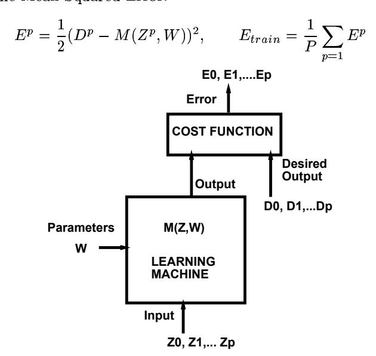

Fig. 1. Gradient-based learning machine.

This chapter is focused on strategies for improving the process of minimizing the cost function. However, these strategies must be used in conjunction with methods for maximizing the network's ability to *generalize*, that is, to predict the correct targets for patterns the learning system has not previously seen for more detail).

To understand generalization, let us consider how backpropagation works. We start with a set of samples each of which is an input/output pair of the function to be learned. Since the measurement process is often noisy, there may be errors in the samples. We can imagine that if we collected multiple *sets* of samples then each set would look a little different because of the noise and because of the different points sampled. Each of these data sets would also result

in networks with minima that are slightly different from each other and from the true function. In this chapter, we concentrate on improving the process of finding the minimum for the particular set of examples that we are given. Generalization techniques try to correct for the errors introduced into the network as a result of our choice of dataset. Both are important.

Several theoretical efforts have analyzed the process of learning by minimizing the error on a training set (a process sometimes called Empirical Risk Minimization) [40,41].

Some of those theoretical analyses are based on decomposing the generalization error into two terms: bias and variance (see e.g. [12]). The bias is a measure of how much the network output, averaged over all possible data sets differs from the desired function. The variance is a measure of how much the network output varies between datasets. Early in training, the bias is large because the network output is far from the desired function. The variance is very small because the data has had little influence yet. Late in training, the bias is small because the network has learned the underlying function. However, if trained too long, the network will also have learned the noise specific to that dataset. This is referred to as overtraining. In such a case, the variance will be large because the noise varies between datasets. It can be shown that the minimum total error will occur when the sum of bias and variance are minimal.

There are a number of techniques (e.g. early stopping, regularization) for maximizing the generalization ability of a network when using backprop.

The idea of this chapter, therefore, is to present minimization strategies (given a cost function) and the tricks associated with increasing the speed and quality of the minimization. It is however clear that the choice of the model (model selection), the architecture and the cost function is crucial for obtaining a network that generalizes well. So keep in mind that if the wrong model class is used and no proper model selection is done, then even a superb minimization will clearly not help very much. In fact, the existence of overtraining has led several authors to suggest that inaccurate minimization algorithms can be better than good ones.

## 3 Standard Backpropagation

Although the tricks and analyses in this paper are primarily presented in the context of "classical" multi-layer feed-forward neural networks, many of them also apply to most other gradient-based learning methods.

The simplest form of multilayer learning machine trained with gradient-based learning is simply a stack of modules, each of which implements a function  $X_n = F_n(W_n, X_{n-1})$ , where  $X_n$  is a vector representing the output of the module,  $W_n$  is the vector of tunable parameters in the module (a subset of W), and  $X_{n-1}$  is the module's input vector (as well as the previous module's output vector). The input  $X_0$  to the first module is the input pattern  $Z^p$ . If the partial derivative of  $E^p$  with respect to  $X_n$  is known, then the partial derivatives of  $E^p$  with respect

to  $W_n$  and  $X_{n-1}$  can be computed using the backward recurrence

$$\frac{\partial E^{p}}{\partial W_{n}} = \frac{\partial F}{\partial W}(W_{n}, X_{n-1}) \frac{\partial E^{p}}{\partial X_{n}}$$

$$\frac{\partial E^{p}}{\partial X_{n-1}} = \frac{\partial F}{\partial X}(W_{n}, X_{n-1}) \frac{\partial E^{p}}{\partial X_{n}}$$
(1)

where  $\frac{\partial F}{\partial W}(W_n, X_{n-1})$  is the Jacobian of F with respect to W evaluated at the point  $(W_n, X_{n-1})$ , and  $\frac{\partial F}{\partial X}(W_n, X_{n-1})$  is the Jacobian of F with respect to X. The Jacobian of a vector function is a matrix containing the partial derivatives of all the outputs with respect to all the inputs. When the above equations are applied to the modules in reverse order, from layer N to layer 1, all the partial derivatives of the cost function with respect to all the parameters can be computed. The way of computing gradients is known as back-propagation.

Traditional multi-layer neural networks are a special case of the above system where the modules are alternated layers of matrix multiplications (the weights) and component-wise sigmoid functions (the units):

$$Y_n = W_n X_{n-1} \tag{2}$$

$$X_n = F(Y_n) \tag{3}$$

where  $W_n$  is a matrix whose number of columns is the dimension of  $X_{n-1}$ , and number of rows is the dimension of  $X_n$ . F is a vector function that applies a sigmoid function to each component of its input.  $Y_n$  is the vector of weighted sums, or *total inputs*, to layer n.

Applying the chain rule to the equation above, the classical backpropagation equations are obtained:

$$\frac{\partial E^p}{\partial y_n^i} = f'(y_n^i) \frac{\partial E^p}{\partial x_n^i} \tag{4}$$

$$\frac{\partial E^{p}}{\partial w_{n}^{ij}} = x_{n-1}^{j} \frac{\partial E^{p}}{\partial y_{n}^{i}} \tag{5}$$

$$\frac{\partial E^p}{\partial x_{n-1}^k} = \sum_i w_n^{ik} \frac{\partial E^p}{\partial y_n^i}.$$
 (6)

The above equations can also be written in matrix form:

$$\frac{\partial E^p}{\partial Y_n} = F'(Y_n) \frac{\partial E^p}{\partial X_n} \tag{7}$$

$$\frac{\partial E^p}{\partial W_n} = X_{n-1} \frac{\partial E^p}{\partial Y_n} \tag{8}$$

$$\frac{\partial E^p}{\partial X_{n-1}} = W_n^T \frac{\partial E^p}{\partial Y_n}. (9)$$

The simplest learning (minimization) procedure in such a setting is the gradient descent algorithm where W is iteratively adjusted as follows:

$$W(t) = W(t-1) - \eta \frac{\partial E}{\partial W}.$$
 (10)

In the simplest case,  $\eta$  is a scalar constant. More sophisticated procedures use variable  $\eta$ . In other methods  $\eta$  takes the form of a diagonal matrix, or is an estimate of the inverse Hessian matrix of the cost function (second derivative matrix) such as in the Newton and Quasi-Newton methods described later in the chapter. A proper choice of  $\eta$  is important and will be discussed at length later.

#### 4 A Few Practical Tricks

Backpropagation can be very slow particularly for multilayered networks where the cost surface is typically non-quadratic, non-convex, and high dimensional with many local minima and/or flat regions. There is no formula to guarantee that (1) the network will converge to a good solution, (2) convergence is swift, or (3) convergence even occurs at all. However, in this section we discuss a number of tricks that can greatly improve the chances of finding a good solution while also decreasing the convergence time often by orders of magnitude. More detailed theoretical justifications will be given in later sections.

#### 4.1 Stochastic versus Batch learning.

At each iteration, equation (10) requires a complete pass through the entire dataset in order to compute the average or true gradient. This is referred to as batch learning since an entire "batch" of data must be considered before weights are updated. Alternatively, one can use stochastic (online) learning where a single example  $\{Z^t, D^t\}$  is chosen (e.g. randomly) from the training set at each iteration t. An estimate of the true gradient is then computed based on the error  $E^t$  of that example, and then the weights are updated:

$$W(t+1) = W(t) - \eta \frac{\partial E^t}{\partial W}.$$
 (11)

Because this estimate of the gradient is noisy, the weights may not move precisely down the gradient at each iteration. As we shall see, this "noise" at each iteration can be advantageous. Stochastic learning is generally the preferred method for basic backpropagation for the following three reasons:

#### Advantages of Stochastic Learning

- 1. Stochastic learning is usually much faster than batch learning
- 2. Stochastic learning also often results in better solutions.
- 3. Stochastic learning can be used for tracking changes.

Stochastic learning is most often *much* faster than batch learning particularly on large redundant datasets. The reason for this is simple to show. Consider the simple case where a training set of size 1000 is inadvertently composed of 10 identical copies of a set with 100 samples. Averaging the gradient over all 1000 patterns gives the exact same result as computing the gradient based on just the first 100. Thus, batch gradient descent is wasteful because it recomputes

the same quantity 10 times before one parameter update. On the other hand, stochastic gradient will see a full epoch as 10 iterations through a 100-long training set. In practice, examples rarely appear more than once in a dataset, but there are usually clusters of patterns that are very similar. For example in phoneme classification, all of the patterns for the phoneme /æ/ will (hopefully) contain much of the same information. It is this redundancy that can make batch learning much slower than on-line.

Stochastic learning also often results in better solutions because of the noise in the updates. Nonlinear networks usually have multiple local minima of differing depths. The goal of training is to locate one of these minima. Batch learning will discover the minimum of whatever basin the weights are initially placed. In stochastic learning, the noise present in the updates can result in the weights jumping into the basin of another, possibly deeper, local minimum. This has been demonstrated in certain simplified cases [15, 30].

Stochastic learning is also useful when the function being modeled is changing over time, a quite common scenario in industrial applications where the data distribution changes gradually over time (e.g. due to wear and tear of the machines). If the learning machine does not detect and follow the change it is impossible to learn the data properly and large generalization errors will result. With batch learning, changes go undetected and we obtain rather bad results since we are likely to average over several rules, whereas on-line learning – if operated properly (see below in section 4.7) – will track the changes and yield good approximation results.

Despite the advantages of stochastic learning, there are still reasons why one might consider using batch learning:

#### Advantages of Batch Learning

- 1. Conditions of convergence are well understood.
- 2. Many acceleration techniques (e.g. conjugate gradient) only operate in batch learning.
- 3. Theoretical analysis of the weight dynamics and convergence rates are simpler.

These advantages stem from the same noise that make stochastic learning advantageous. This noise, which is so critical for finding better local minima also prevents full convergence to the minimum. Instead of converging to the exact minimum, the convergence stalls out due to the weight fluctuations. The size of the fluctuations depend on the degree of noise of the stochastic updates. The variance of the fluctuations around the local minimum is proportional to the learning rate  $\eta$  [28,27,6]. So in order to reduce the fluctuations we can either decrease (anneal) the learning rate or have an adaptive batch size. In theory [13, 30, 36, 35] it is shown that the optimal annealing schedule of the learning rate is of the form

$$\eta \sim \frac{c}{t},$$
 (12)

where t is the number of patterns presented and c is a constant. In practice, this may be too fast

Another method to remove noise is to use "mini-batches", that is, start with a small batch size and increase the size as training proceeds. Møller discusses one method for doing this [25] and Orr [31] discusses this for linear problems. However, deciding the rate at which to increase the batch size and which inputs to include in the small batches is as difficult as determining the proper learning rate. Effectively the size of the learning rate in stochastic learning corresponds to the respective size of the mini batch.

Note also that the problem of removing the noise in the data may be less critical than one thinks because of generalization. Overtraining may occur long before the noise regime is even reached.

Another advantage of batch training is that one is able to use second order methods to speed the learning process. Second order methods speed learning by estimating not just the gradient but also the curvature of the cost surface. Given the curvature, one can estimate the approximate location of the actual minimum.

Despite the advantages of batch updates, stochastic learning is still often the preferred method particularly when dealing with very large data sets because it is simply much faster.

#### 4.2 Shuffling the Examples

Networks learn the fastest from the most unexpected sample. Therefore, it is advisable to choose a sample at each iteration that is the most unfamiliar to the system. Note, this applies only to stochastic learning since the order of input presentation is irrelevant for batch1. Of course, there is no simple way to know which inputs are information rich, however, a very simple trick that crudely implements this idea is to simply choose successive examples that are from different classes since training examples belonging to the same class will most likely contain similar information.

Another heuristic for judging how much new information a training example contains is to examine the error between the network output and the target value when this input is presented. A large error indicates that this input has not been learned by the network and so contains a lot of new information. Therefore, it makes sense to present this input more frequently. Of course, by "large" we mean relative to all of the other training examples. As the network trains, these relative errors will change and so should the frequency of presentation for a particular input pattern. A method that modifies the probability of appearance of each pattern is called an *emphasizing scheme*.

#### Choose Examples with Maximum Information Content

- 1. Shuffle the training set so that successive training examples never (rarely) belong to the same class.
- 2. Present input examples that produce a large error more frequently than examples that produce a small error.

&lt;sup>1 The order in which gradients are summed in batch may be affected by roundoff error if there is a significant range of gradient values.

However, one must be careful when perturbing the normal frequencies of input examples because this changes the relative importance that the network places on different examples. This may or may not be desirable. For example, this technique applied to data containing outliers can be disastrous because outliers can produce large errors yet should not be presented frequently. On the other hand, this technique can be particularly beneficial for boosting the performance for infrequently occurring inputs, e.g. /z/ in phoneme recognition

#### 4.3 Normalizing the Inputs

Convergence is usually faster if the average of each input variable over the training set is close to zero. To see this, consider the extreme case where all the inputs are positive. Weights to a particular node in the first weight layer are updated by an amount proportional to  $\delta x$  where  $\delta$  is the (scalar) error at that node and x is the input vector (see equations (5) and (10)). When all of the components of an input vector are positive, all of the updates of weights that feed into a node will be the same sign (i.e.  $\text{sign}(\delta)$ ). As a result, these weights can only all decrease or all increase together for a given input pattern. Thus, if a weight vector must change direction it can only do so by zigzagging which is inefficient and thus very slow.

In the above example, the inputs were all positive. However, in general, any shift of the average input away from zero will bias the updates in a particular direction and thus slow down learning. Therefore, it is good to shift the inputs so that the average over the training set is close to zero. This heuristic should be applied at all layers which means that we want the average of the *outputs* of a node to be close to zero because these outputs are the inputs to the next layer [19]. This problem can be addressed by coordinating how the inputs are transformed with the choice of sigmoidal activation function. Here we discuss the input transformation. The discussion of the sigmoid follows.

Convergence is faster not only if the inputs are shifted as described above but also if they are scaled so that all have about the same covariance,  $C_i$ , where

$$C_i = \frac{1}{P} \sum_{p=1}^{P} (z_i^p)^2. \tag{13}$$

Here, P is the number of training examples,  $C_i$  is the covariance of the  $i^{th}$  input variable and  $z_i^p$  is the  $i^{th}$  component of the  $p^{th}$  training example. Scaling speeds learning because it helps to balance out the rate at which the weights connected to the input nodes learn. The value of the covariance should be matched with that of the sigmoid used. For the sigmoid given below, a covariance of 1 is a good choice.

The exception to scaling all covariances to the same value occurs when it is known that some inputs are of less significance than others. In such a case, it can be beneficial to scale the less significant inputs down so that they are "less visible" to the learning process.

#### Transforming the Inputs

- 1. The average of each input variable over the training set should be close to zero.
- 2. Scale input variables so that their covariances are about the same.
- 3. Input variables should be uncorrelated if possible.

The above two tricks of shifting and scaling the inputs are quite simple to implement. Another trick that is quite effective but more difficult to implement is to decorrelate the inputs. Consider the simple network in Figure 2. If inputs are uncorrelated then it is possible to solve for the value of  $w_1$  that minimizes the error without any concern for  $w_2$ , and vice versa. In other words, the two variables are independent (the system of equations is diagonal). With correlated inputs, one must solve for both simultaneously which is a much harder problem. Principal component analysis (also known as the Karhunen-Loeve expansion) can be used to remove linear correlations in inputs [10].

Inputs that are linearly dependent (the extreme case of correlation) may also produce degeneracies which may slow learning. Consider the case where one input is always twice the other input  $(z_2 = 2z_1)$ . The network output is constant along lines  $W_2 = v - (1/2)W_1$ , where v is a constant. Thus, the gradient is zero along these directions (see Figure 2). Moving along these lines has absolutely no effect on learning. We are trying to solve in 2-D what is effectively only a 1-D problem. Ideally we want to remove one of the inputs which will decrease the size of the network.

Figure 3 shows the entire process of transforming inputs. The steps are (1) shift inputs so the mean is zero, (2) decorrelate inputs, and (3) equalize covariances.

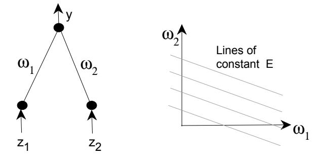

Fig. 2. Linearly dependent inputs.

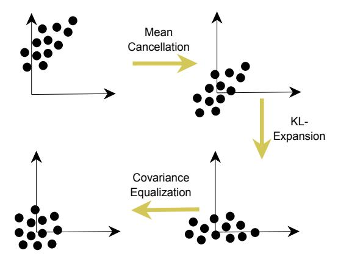

Fig. 3. Transformation of inputs.

## 4.4 The Sigmoid

Nonlinear activation functions are what give neural networks their nonlinear capabilities. One of the most common forms of activation function is the sigmoid which is a monotonically increasing function that asymptotes at some finite value as  $\pm \infty$  is approached. The most common examples are the standard logistic function  $f(x) = 1/(1 + e^{-x})$  and hyperbolic tangent  $f(x) = \tanh(x)$  shown in Figure 4. Sigmoids that are symmetric about the origin (e.g. see Figure 4b) are preferred for the same reason that inputs should be normalized, namely, because they are more likely to produce outputs (which are *inputs* to the next layer) that are on average close to zero. This is in contrast, say, to the logistic function whose outputs are always positive and so must have a mean that is positive.

## Sigmoids

- 1. Symmetric sigmoids such as hyperbolic tangent often converge faster than the standard logistic function.
- 2. A recommended sigmoid [19] is:  $f(x) = 1.7159 \tanh(\frac{2}{3}x)$ . Since the tanh function is sometimes computationally expensive, an approximation of it by a ratio of polynomials can be used instead.
- 3. Sometimes it is helpful to add a small linear term, e.g.  $f(x) = \tanh(x) + ax$  so as to avoid flat spots.

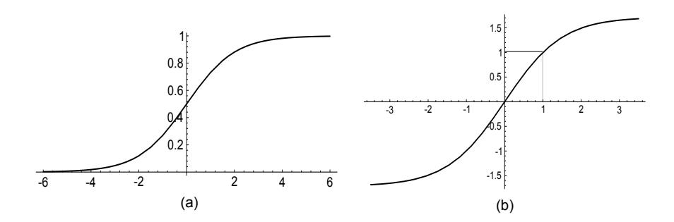

**Fig. 4.** (a) Not recommended: the standard logistic function,  $f(x) = 1/(1 + e^{-x})$ . (b) Hyperbolic tangent,  $f(x) = 1.7159 \tanh\left(\frac{2}{3}x\right)$ .

The constants in the recommended sigmoid given above have been chosen so that, when used with transformed inputs (see previous discussion), the variance of the outputs will also be close to 1 because the effective gain of the sigmoid is roughly 1 over its useful range. In particular, this sigmoid has the properties (a)  $f(\pm 1) = \pm 1$ , (b) the second derivative is a maximum at x = 1, and (c) the effective gain is close to 1.

One of the potential problems with using symmetric sigmoids is that the error surface can be *very* flat near the origin. For this reason it is good to avoid initializing with very small weights. Because of the saturation of the sigmoids, the error surface is also flat far from the origin. Adding a small linear term to the sigmoid can sometimes help avoid the flat regions.

#### 4.5 Choosing Target Values

In classification problems, target values are typically binary (e.g.  $\{-1,+1\}$ ). Common wisdom might seem to suggest that the target values be set at the value of the sigmoid's asymptotes. However, this has several drawbacks.

First, instabilities can result. The training process will try to drive the output as close as possible to the target values, which can only be achieved asymptotically. As a result, the weights (output and even hidden) are driven to larger and larger values where the sigmoid derivative is close to zero. The very large weights increase the gradients, however, these gradients are then multiplied by an exponentially small sigmoid derivative (except when a twisting term2 is added to the sigmoid) producing a weight update close to zero. As a result, the weights may become stuck.

Second, when the outputs saturate, the network gives no indication of confidence level. When an input pattern falls near a decision boundary the output class is uncertain. Ideally this should be reflected in the network by an output value that is in between the two possible target values, i.e. not near either asymptote. However, large weights tend to force all outputs to the tails of the sigmoid regardless of the uncertainty. Thus, the network may predict a wrong class without giving any indication of its low confidence in the result. Large weights that saturate the nodes make it impossible to differentiate between typical and nontypical examples.

A solution to these problems is to set the target values to be within the range of the sigmoid, rather than at the asymptotic values. Care must be taken, however, to insure that the node is not restricted to only the linear part of the sigmoid. Setting the target values to the point of the maximum second derivative on the sigmoid is the best way to take advantage of the nonlinearity without saturating the sigmoid. This is another reason the sigmoid in Figure 4b is a good choice. It has maximum second derivative at  $\pm 1$  which correspond to the binary target values typical in classification problems.

#### Targets

Choose target values at the point of the maximum second derivative on the sigmoid so as to avoid saturating the output units.

&lt;sup>2 A twisting term is a small linear term added to the node output, e.g.  $f(x) = \tanh(x) + ax$ .

#### 4.6 Initializing the weights

The starting values of the weights can have a significant effect on the training process. Weights should be chosen randomly but in such a way that the sigmoid is primarily activated in its linear region. If weights are all very large then the sigmoid will saturate resulting in small gradients that make learning slow. If weights are very small then gradients will also be very small. Intermediate weights that range over the sigmoid's linear region have the advantage that (1) the gradients are large enough that learning can proceed and (2) the network will learn the linear part of the mapping before the more difficult nonlinear part.

Achieving this requires coordination between the training set normalization, the choice of sigmoid, and the choice of weight initialization. We start by requiring that the distribution of the outputs of each node have a standard deviation  $(\sigma)$  of approximately 1. This is achieved at the input layer by normalizing the training set as described earlier. To obtain a standard deviation close to 1 at the output of the first hidden layer we just need to use the above recommended sigmoid together with the requirement that the input to the sigmoid also have a standard deviation  $\sigma_y = 1$ . Assuming the inputs,  $y_i$ , to a unit are uncorrelated with variance 1, the standard deviation of the units weighted sum will be

$$\sigma_{y_i} = \left(\sum_j w_{ij}^2\right)^{1/2}.\tag{14}$$

Thus, to insure that the  $\sigma_{y_i}$  are approximately 1 the weights should be randomly drawn from a distribution with mean zero and a standard deviation given by

$$\sigma_w = m^{-1/2} \tag{15}$$

where m is the number of inputs to the unit.

#### Initializing Weights

Assuming that:

- 1. the training set has been normalized, and
- 2. the sigmoid from Figure 4b has been used

then weights should be randomly drawn from a distribution (e.g. uniform) with mean zero and standard deviation

$$\sigma_w = m^{-1/2} \tag{16}$$

where m is the fan-in (the number of connections feeding *into* the node).

#### 4.7 Choosing Learning rates

There is at least one well-principled method (described in section 9.2) for estimating the ideal learning rate  $\eta$ . Many other schemes (most of them rather empirical) have been proposed in the literature to automatically adjust the learning

rate. Most of those schemes decrease the learning rate when the weight vector "oscillates", and increase it when the weight vector follows a relatively steady direction. The main problem with these methods is that they are not appropriate for stochastic gradient or on-line learning because the weight vector fluctuates all the time.

Beyond choosing a single global learning rate, it is clear that picking a different learning rate  $\eta_i$  for each weight can improve the convergence. A well-principled way of doing this, based on computing second derivatives, is described in section 9.1. The main philosophy is to make sure that all the weights in the network converge roughly at the same speed.

Depending upon the curvature of the error surface, some weights may require a small learning rate in order to avoid divergence, while others may require a large learning rate in order to converge at a reasonable speed. Because of this, learning rates in the lower layers should generally be larger than in the higher layers (see Figure 21). This corrects for the fact that in most neural net architectures, the second derivative of the cost function with respect to weights in the lower layers is generally smaller than that of the higher layers. The rationale for the above heuristics will be discussed in more detail in later sections along with suggestions for how to choose the actual value of the learning rate for the different weights (see section 9.1).

If shared weights are used such as in time-delay neural networks (TDNN) [42] or convolutional networks [20], the learning rate should be proportional to the square root of the number of connections sharing that weight, because we know that the gradients are a sum of more-or-less independent terms.

# Equalize the Learning Speeds

- give each weight its own learning rate
- learning rates should be proportional to the square root of the number of inputs to the unit
- weights in lower layers should typically be larger than in the higher layers

Other tricks for improving the convergence include:

#### Momentum Momentum

$$\Delta w(t+1) = \eta \frac{\partial E_{t+1}}{\partial w} + \mu \Delta w(t),$$

can increase speed when the cost surface is highly nonspherical because it damps the size of the steps along directions of high curvature thus yielding a larger effective learning rate along the directions of low curvature [43] ( $\mu$  denotes the strength of the momentum term). It has been claimed that momentum generally helps more in batch mode than in stochastic mode, but no systematic study of this are known to the authors.

Adaptive learning rates Many authors, including Sompolinsky et al. [37], Darken & Moody [9], Sutton [38], Murata et al. [28] have proposed rules for automatically adapting the learning rates (see also [16]). These rules control the speed of convergence by increasing or decreasing the learning rate based on the error.

We assume the following facts for a learning rate adaptation algorithm: (1) the smallest eigenvalue of the Hessian (see Eq.(27)) is sufficiently smaller than the second smallest eigenvalue and (2) therefore after a large number of iterations, the parameter vector w(t) will approach the minimum from the direction of the minimum eigenvector of the Hessian (see Eq.(27), Figure 5). Under these conditions the evolution of the estimated parameter can be thought of as a one-dimensional process and the minimum eigenvector  $\mathbf{v}$  can be approximated (for a large number of iterations: see Figure 5) by

$$\mathbf{v} = \langle \frac{\partial E}{\partial w} \rangle / \|\langle \frac{\partial E}{\partial w} \rangle \|,$$

where  $\| \ \|$  denotes the  $L^2$  norm. Hence we can adopt a projection

$$\xi = \langle \mathbf{v}^T \frac{\partial E}{\partial w} \rangle = \|\langle \frac{\partial E}{\partial w} \rangle \|$$

to the approximated minimum Eigenvector  $\mathbf{v}$  as a one dimensional measure of the distance to the minimum. This distance can be used to control the learning rate (for details see [28])

$$w(t+1) = w(t+1) - \eta_t \frac{\partial E_t}{\partial w},\tag{17}$$

$$\mathbf{r}(t+1) = (1-\delta)\mathbf{r}(t) + \delta \frac{\partial E_t}{\partial w}, \quad (0 < \delta < 1)$$
(18)

$$\eta(t+1) = \eta(t) + \alpha \eta(t) \left( \beta \| \mathbf{r}(t+1) \| - \eta(t) \right), \tag{19}$$

where  $\delta$  controls the leak size of the average,  $\alpha$ ,  $\beta$  are constants and  $\mathbf{r}$  is used as auxiliary variable to calculate the leaky average of the gradient  $\frac{\partial E}{\partial v}$ .

Note that this set of rules is easy to compute and straightforward to implement. We simply have to keep track of an additional vector in Eq.(18): the averaged gradient  $\mathbf{r}$ . The norm of this vector then controls the size of the learning rate (see Eq.(19)). The algorithm follows the simple intuition: far away from the minimum (large distance  $\xi$ ) it proceeds in big steps and close to the minimum it anneals the learning rate (for theoretical details see [28]).

#### 4.8 Radial Basis Functions vs Sigmoid Units

Although most systems use nodes based on dot products and sigmoids, many other types of units (or layers) can be used. A common alternative is the radial basis function (RBF) network (see [7, 26, 5, 32]) In RBF networks, the dot product of the weight and input vector is replaced with a Euclidean distance between

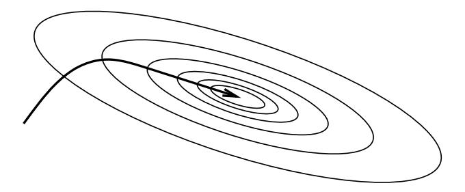

Fig. 5. Convergence of the flow. During the final stage of learning the average flow is approximately one dimensional towards the minimum  $\mathbf{w}^*$  and it is a good approximation of the minimum eigenvalue direction of the Hessian.

the input and weight and the sigmoid is replaced by an exponential. The output activity is computed, e.g. for one output, as

$$g(x) = \sum_{i=1}^{N} w_i \exp\left(-\frac{1}{2\sigma_i^2} ||x - \nu_i||^2\right),$$

where  $\nu_i$  ( $\sigma_i$ ) is the mean (standard deviation) of the *i*-th Gaussian. These units can replace or coexist with the standard units and they are usually trained by combination of gradient descent (for output units) and unsupervised clustering for determining the means and widths of the RBF units.

Unlike sigmoidal units which can cover the entire space, a single RBF unit covers only a small local region of the input space. This can be an advantage because learning can be faster. RBF units may also form a better set of basis functions to model the input space than sigmoid units, although this is highly problem dependent. On the negative side, the locality property of RBFs may be a disadvantage particularly in high dimensional spaces because may units are needed to cover the spaces. RBFs are more appropriate in (low dimensional) upper layers and sigmoids in (high dimensional) lower layers.

# 5 Convergence of Gradient Descent

#### 5.1 A Little Theory

In this section we examine some of the theory behind the tricks presented earlier. We begin in one dimension where the update equation for gradient descent can be written as

$$W(t+1) = W(t) - \eta \frac{dE(W)}{dW}.$$
 (20)

We would like to know how the value of  $\eta$  affects convergence and the learning speed. Figure 6 illustrates the learning behavior for several different sizes of  $\eta$  when the weight W starts out in the vicinity of a local minimum. In one dimension, it is easy to define the optimal learning rate,  $\eta_{opt}$ , as being the learning rate that will move the weight to the minimum,  $W_{min}$ , in precisely one step (see Figure 6(i)b). If  $\eta$  is smaller than  $\eta_{opt}$  then the stepsize will be smaller and convergence will take multiple timesteps. If  $\eta$  is between  $\eta_{opt}$  and  $2\eta_{opt}$  then the weight will oscillate around  $W_{min}$  but will eventually converge (Figure 6(i)c). If  $\eta$  is more than twice the size of  $\eta_{opt}$  (Figure 6(i)d) then the stepsize is so large that the weight ends up farther from  $W_{min}$  than before. Divergence results.

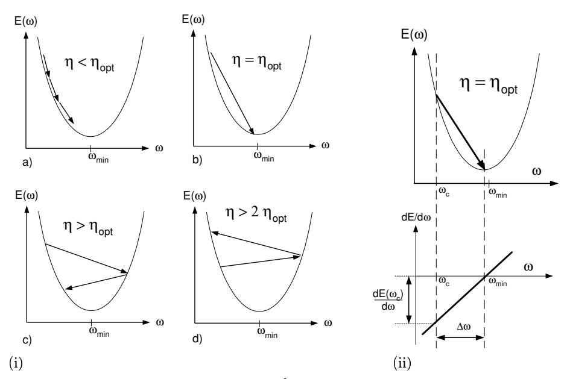

Fig. 6. Gradient descent for different learning rates.

What is the optimal value of the learning rate  $\eta_{opt}$ ? Let us first consider the case in 1-dimension. Assuming that E can be approximated by a quadratic function,  $\eta_{opt}$  can be derived by first expanding E in a Taylor series about the current weight,  $W_c$ :

$$E(W) = E(W_c) + (W - W_c) \frac{dE(W_c)}{dW} + \frac{1}{2} (W - W_c)^2 \frac{d^2 E(W_c)}{dW^2} + \dots,$$
 (21)

where we use the shorthand  $\frac{dE(W_c)}{dW} \equiv \frac{dE}{dW}|_{W=W_c}$ . If E is quadratic the second order derivative is constant and the higher order terms vanish. Differentiating both sides with respect to W then gives

$$\frac{dE(W)}{dW} = \frac{dE(W_c)}{dW} + (W - W_c) \frac{d^2 E(W_c)}{dW^2}.$$
 (22)

Setting  $W = W_{min}$  and noting that  $dE(W_{min})/dW = 0$ , we are left after rearranging with

$$W_{min} = W_c - \left(\frac{d^2 E(W_c)}{dW^2}\right)^{-1} \frac{dE(W_c)}{dW}.$$
 (23)

Comparing this with the update equation (20), we find that we can reach a minimum in one step if

$$\eta_{opt} = \left(\frac{d^2 E(W_c)}{dW^2}\right)^{-1}.$$
 (24)

Perhaps an easier way to obtain this same result is illustrated in Figure 6(ii). The bottom graph plots the gradient of E as a function of W. Since E is quadratic, the gradient is simply a straight line with value zero at the minimum and  $\frac{\partial E(W_c)}{\partial W}$  at the current weight  $W_c$ .  $\partial^2 E/\partial^2 W$  is simply the slope of this line and is computed using the standard slope formula

$$\partial^2 E/\partial^2 W = \frac{\partial E(W_c)/\partial W - 0}{W_c - W_{min}}.$$
 (25)

Solving for  $W_{min}$  then gives equation (23).

While the learning rate that gives fastest convergence is  $\eta_{opt}$ , the largest learning rate that can be used without causing divergence is (also see Figure 6(i)d)

$$\eta_{max} = 2\eta_{opt}. (26)$$

If E is not exactly quadratic then the higher order terms in equation (21) are not precisely zero and (23) is only an approximation. In such a case, it may take multiple iterations to locate the minimum even when using  $\eta_{opt}$ , however, convergence can still be quite fast.

In multiple dimensions, determining  $\eta_{opt}$  is a bit more difficult because the right side of (24) is a matrix  $H^{-1}$  where H is called the Hessian whose components are given by

$$H_{ij} \equiv \frac{\partial^2 E}{\partial W_i \partial W_j} \tag{27}$$

with  $1 \le i, j \le N$ , and N equal to the total number of weights.

H is a measure of the curvature of E. In two dimensions, the lines of constant E for a quadratic cost are oval in shape as shown in Figure 7. The eigenvectors of H point in the directions of the major and minor axes. The eigenvalues measure the steepness of E along the corresponding eigendirection.

**Example.** In the least mean square (LMS) algorithm, we have a single layer linear network with error function

$$E(W) = \frac{1}{2P} \sum_{p=1}^{P} |d^p - \sum_{i} w_i x_i^p|^2$$
 (28)

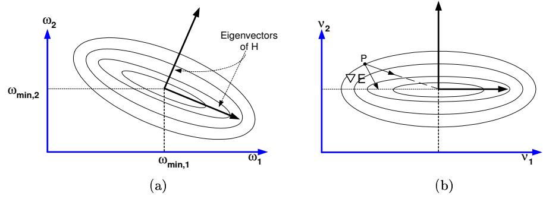

Fig. 7. Lines of constant E.

where P is the number of training vectors. The Hessian in this case turns out the be the same as the covariance matrix of the inputs,

$$H = \frac{1}{P} \sum_{p} x^p x^{pT}.$$
 (29)

Thus, each eigenvalue of H is also a measure of the covariance or spread of the inputs along the corresponding eigendirection as shown in Figure 8.

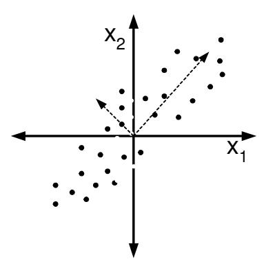

Fig. 8. For the LMS algorithm, the eigenvectors and eigenvalues of H measure the spread of the inputs in input space.

Using a scalar learning rate is problematic in multiple dimensions. We want  $\eta$  to be large so that convergence is fast along the shallow directions of E (small eigenvalues of H), however, if  $\eta$  is too large the weights will diverge along the steep directions (large eigenvalues of H). To see this more specifically, let us again expand E, but this time about a minimum

$$E(W) \approx E(W_{min}) + \frac{1}{2}(W - W_{min})^T H_{(W_{min})}(W - W_{min}).$$
 (30)

Differentiating (30) and using the result in the update equation (20) gives

$$W(t+1) = W(t) - \eta \frac{\partial E(t)}{\partial W}$$
(31)

$$= W(t) - \eta H_{(W_{min})}(W(t) - W_{min}). \tag{32}$$

Subtracting  $W_{min}$  from both sides gives

$$(W(t+1) - W_{min}) = (I - \eta H(W_{min}))(W(t) - W_{min}). \tag{33}$$

If the prefactor  $(I - \eta H(W_{min}))$  is a matrix transformation that always shrinks a vector (i.e. its eigenvalues all have magnitude less than 1) then the update equation will converge.

How does this help with choosing the learning rates? Ideally we want different learning rates along the different eigendirections. This is simple if the eigendirections are lined up with the coordinate axes of the weights. In such a case, the weights are uncoupled and we can assign each weight its own learning rate based on the corresponding eigenvalue. However, if the weights are coupled then we must first rotate H such that H is diagonal, i.e. the coordinate axes line up with the eigendirections (see Figure 7b). This is the purpose of diagonalizing the Hessian discussed earlier.

Let  $\Theta$  be the rotation matrix such that

$$\Lambda = \Theta H \Theta^T \tag{34}$$

where  $\Lambda$  is diagonal and  $\Theta^T\Theta=I$ . The cost function then can be written as

$$E(W) \approx E(W_{min}) + \frac{1}{2} \left[ (W - W_{min})^T \Theta^T \right] \left[ \Theta H_{(W_{min})} \Theta^T \right] \left[ \Theta(W - W_{min}) \right].$$
(35)

Making a change of coordinates to  $\nu = \Theta(W - W_{min})$  simplifies the above equation to

$$E(\nu) \approx E(0) + \frac{1}{2}\nu^T \Lambda \nu \tag{36}$$

and the transformed update equation becomes

$$\nu(t+1) = (I - \eta \Lambda)\nu(t). \tag{37}$$

Note that  $I - \eta \Lambda$  is diagonal with diagonal components  $1 - \eta \lambda_i$ . This equation will converge if  $|1 - \eta \lambda_i| < 1$ , i.e.  $\eta < \frac{2}{\lambda_i}$  for all i. If constrained to have a *single* scalar learning rate for all weights then we must require

$$\eta < \frac{2}{\lambda_{max}} 
\tag{38}$$

in order to avoid divergence, where  $\lambda_{max}$  is the largest eigenvalue of H. For fastest convergence we have

$$\eta_{opt} = \frac{1}{\lambda_{max}}. (39)$$

If  $\lambda_{min}$  is a lot smaller than  $\lambda_{max}$  then convergence will be very slow along the  $\lambda_{min}$  direction. In fact, convergence time is proportional to the condition number  $\kappa \equiv \lambda_{max}/\lambda_{min}$  so that it is desirable to have as small an eigenvalue spread as possible.

However, since we have rotated H to be aligned with the coordinate axes, (37) consists actually of N independent 1-dimensional equations. Therefore, we can choose a learning rate for each weight independent of the others. We see that the optimal rate for the  $i^{th}$  weight  $\nu_i$  is  $\eta_{opt,i} = \frac{1}{\lambda_i}$ .

#### 5.2 Examples

**Linear Network** Figure 10 displays a set of 100 examples drawn from two Gaussian distributed classes centered at (-0.4,-0.8) and (0.4,0.8). The eigenvalues of the covariance matrix are 0.84 and 0.036. We train a single layer linear network with 2 inputs, 1 output, 2 weights, and 1 bias (see Figure (9)) using the LMS algorithm in batch mode. Figure 11 displays the weight trajectory and error during learning when using a learning rates of  $\eta = 1.5$  and 2.5. Note that the learning rate (see Eq. 38)  $\eta_{max} = 2/\lambda_{max} = 2/.84 = 2.38$  will cause divergences as is evident for  $\eta = 2.5$ .

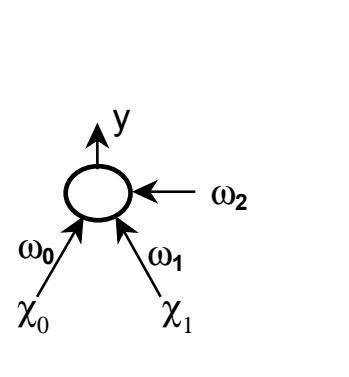

Fig. 9. Simple linear network.

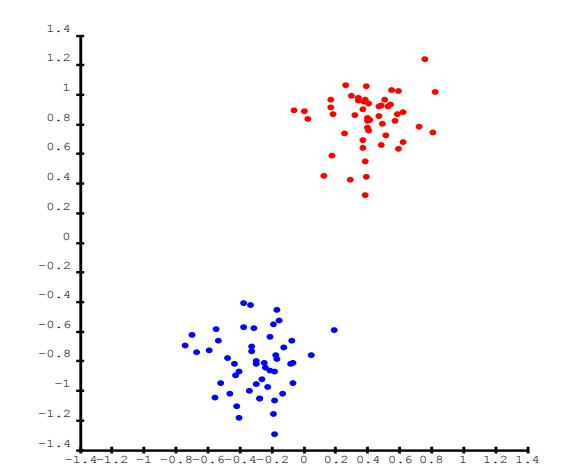

Fig. 10. Two classes drawn from gaussian distributions centered at (-0.4, -0.8) and (0.4, 0.8).

Figure 12 shows the same example using stochastic instead of batch mode learning. Here, a learning rate of  $\eta = 0.2$  is used. One can see that the trajectory is much noisier than in batch mode since only an estimate of the gradient is used at each iteration. The cost is plotted as a function of epoch. An epoch here is simply defined as 100 input presentations which, for stochastic learning,

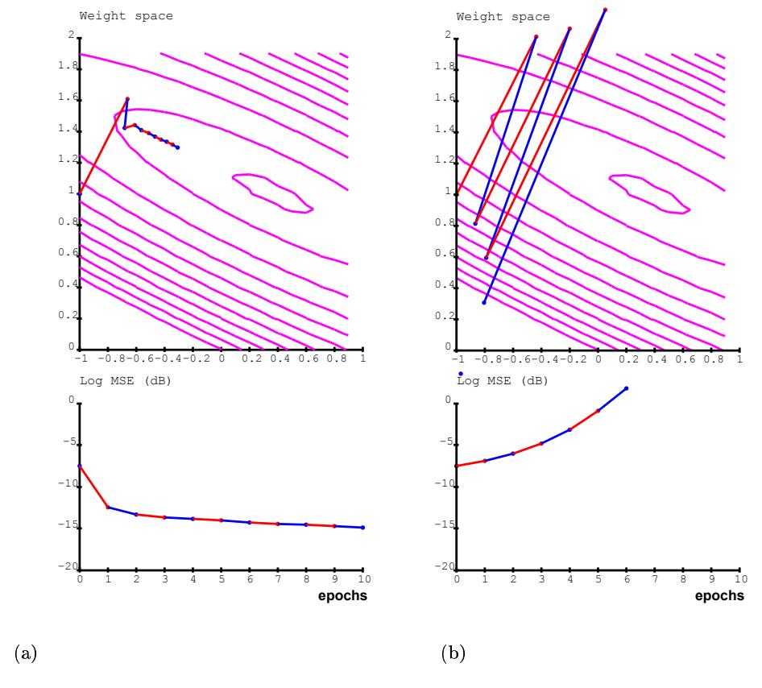

Fig. 11. Weight trajectory and error curve during learning for (a)  $\eta=1.5$  and (b)  $\eta=2.5$ .

corresponds to 100 weight updates. In batch, an epoch corresponds to one weight update.

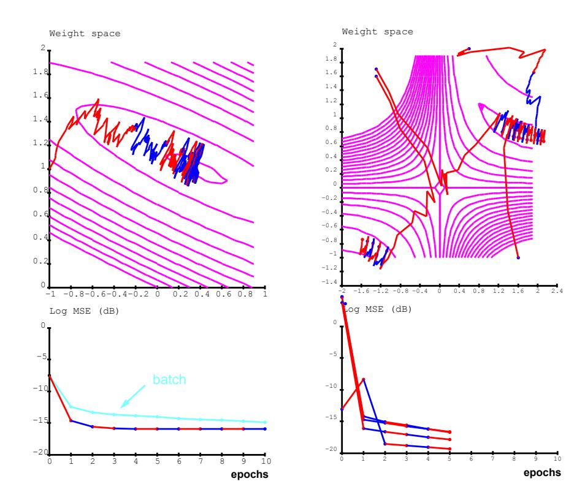

Fig. 12. Weight trajectory and error curve during stochastic learning for  $\eta = 0.2$ .

Fig. 13. Weight trajectories and errors for 1-1-1 network trained using stochastic learning.

Multilayer Network Figure 14 shows the architecture for a very simple multilayer network. It has 1 input, 1 hidden, and 1 output node. There are 2 weights and 2 biases. The activation function is  $f(x) = 1.71 \tanh((2/3)x)$ . The training set contains 10 examples from each of 2 classes. Both classes are Gaussian distributed with standard deviation 0.4. Class 1 has a mean of -1 and class 2 has a mean of +1. Target values are -1 for class 1 and +1 for class 2. Figure 13 shows the stochastic trajectory for the example.

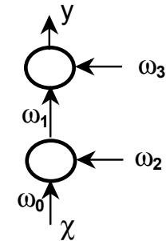

Fig. 14. The minimal multilayer network.

#### 5.3 Input Transformations and Error Surface Transformations Revisited

We can use the results of the previous section to justify several of the tricks discussed earlier.

#### Subtract the means from the input variables

The reason for the above trick is that a nonzero mean in the input variables creates a *very large* eigenvalue. This means the condition number will be large, i.e. the cost surface will be steep in some directions and shallow in others so that convergence will be very slow. The solution is to simply preprocess the inputs by subtracting their means.

For a single linear neuron, the eigenvectors of the Hessian (with means subtracted) point along the principal axes of the cloud of training vectors (recall Figure 8). Inputs that have a large variation in spread along different directions of the input space will have a large condition number and slow learning. And so we recommend:

#### Normalize the variances of the input variables.

If the input variables are correlated, this will not make the error surface spherical, but it will possibly reduce its eccentricity.

Correlated input variables usually cause the eigenvectors of H to be rotated away from the coordinate axes (Figure 7a versus 7b) thus weight updates are not decoupled. Decoupled weights make the "one learning rate per weight" method optimal, thus, we have the following trick:

## Decorrelate the input variables.

Now suppose that the input variables of a neuron have been decorrelated, the Hessian for this neuron is then diagonal and its eigenvalues point along the coordinate axes. In such a case the gradient is not the best descent direction as can be seen in Fig 7b. At the point P, an arrow shows that gradient does not point towards the minimum. However, if we instead assign each weight its own learning rate (equal the inverse of the corresponding eigenvalue) then the

descent direction will be in the direction of the other arrow that points directly towards the minimum:

Use a separate learning rate for each weight.

# 6 Classical second order optimization methods

In the following we will briefly introduce the Newton, conjugate gradient, Gauss-Newton, Levenberg Marquardt and the Quasi-Newton (BFGS) method (see also [11, 34, 3, 5]).

#### 6.1 Newton Algorithm

To get an understanding of the Newton method let us recapitulate the results from section 5.1. Assuming a quadratic loss function E (see Eq.(21)) as depicted in Figure 6(ii), we can compute the weight update along the lines of Eq.(21)-(23)

in Figure 6(ii), we can compute the weight update along the lines of Eq.(21)-(23) 
$$\Delta w = \eta \left(\frac{\partial^2 E}{\partial w^2}\right) \frac{\partial E}{\partial w} = \eta H(w)^{-1} \frac{\partial E}{\partial w}, \tag{40}$$

where  $\eta$  must to be chosen in the range  $0 < \eta < 1$  since E is in practice not perfectly quadratic. In this equation information about the Hessian H is taken into account. If the error function was quadratic one step would be sufficient to converge.

Usually the energy surface around the minimum is rather ellipsoid, or in the extreme like a taco shell, depending on the conditioning of the Hessian. A whitening transform, well known from signal processing literature [29] can change this ellipsoid shape to a spherical shape through  $u = \Theta \Lambda^{1/2} w$  (see Figure 15 and Eq.(34)). So the inverse Hessian in Eq.(40) basically spheres out the error surface locally. The following two approaches can be shown to be equivalent: (a) use the Newton algorithm in an untransformed weight space and (b) do usual gradient descent in a whitened coordinate system (see Figure 15) [19].

Summarizing, the Newton algorithm converges in one step if the error function is quadratic and (unlike gradient descent) it is invariant with respect to linear transformations of the input vectors. This means that the convergence time is not affected by shifts, scaling and rotation of input vectors. However one of the main drawbacks is that an  $N \times N$  Hessian matrix must be stored and inverted, which takes  $O(N^3)$  per iterations and is therefore impractical for more than a few variables. Since the error function is in general non-quadratic, there is no guarantee of convergence. If the Hessian is not positive definite (if it has some zero or even negative Eigenvalues where the error surface is flat or some directions are curved downward), then the Newton algorithm will diverge, so the Hessian must be positive definite. Of course the Hessian matrix of multilayer networks is in general not positive definite everywhere. For these reasons the Newton algorithm in its original form is not usable for general neural network learning. However it gives good insights for developing more sophisticated algorithms, as discussed in the following.

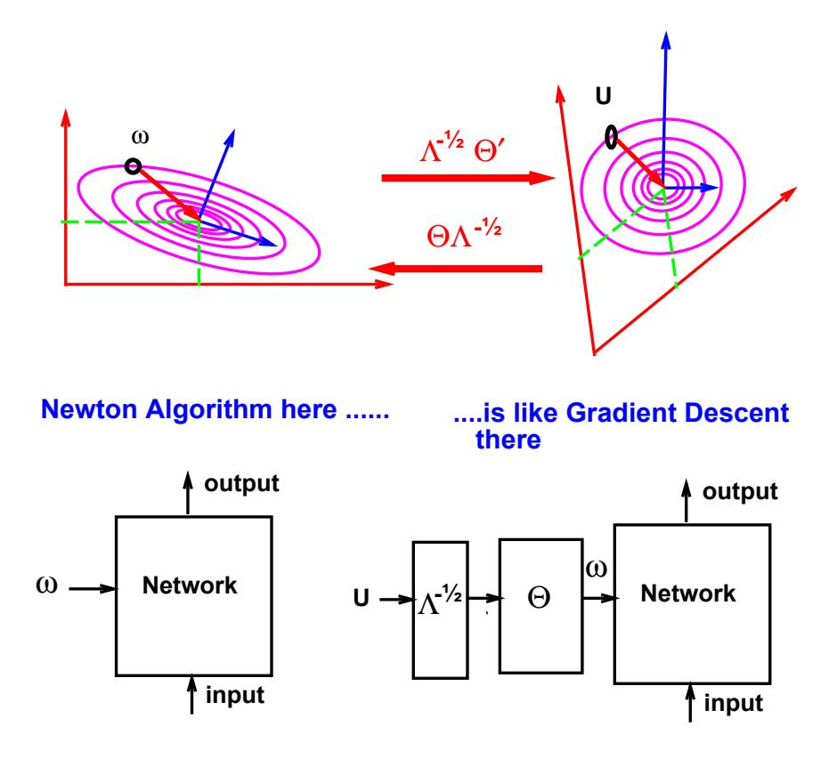

Fig. 15. Sketch of the whitening properties of the Newton algorithm.

#### 6.2 Conjugate Gradient

There are several important properties in conjugate gradient optimization: (1) it is a O(N) method, (2) it doesn't use the Hessian explicitly, (3) it attempts to find descent directions that try to minimally spoil the result achieved in the previous iterations, (4) it uses a line search, and most importantly, (5) it works only for batch learning.

The third property is shown in Figure 16. Assume we pick a descent direction, e.g. the gradient, then we minimize along a line in this direction (line search). Subsequently we should try to find a direction along which the gradient does not change its direction, but merely its length (conjugate direction), because moving along this direction will not spoil the result of the previous iteration. The evolution of the descent directions  $\rho_k$  at iteration k is given as

$$\rho_k = -\nabla E(w_k) + \beta_k \rho_{k-1},\tag{41}$$

where the choice of  $\beta_k$  can be done either according to Fletcher and Reeves [34]

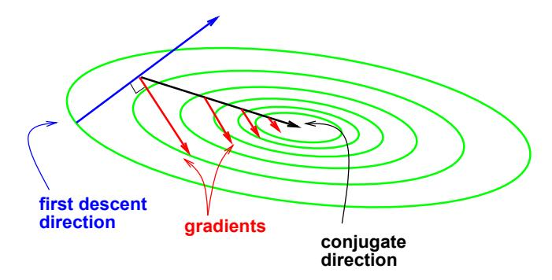

Fig. 16. Sketch of conjugate gradient directions in a 2D error surface.

$$\beta_k = \frac{\nabla E(w_k)^T \nabla E(w_k)}{\nabla E(w_{k-1})^T \nabla E(w_{k-1})}$$
(42)

or Polak and Ribiere

$$\beta_k = \frac{(\nabla E(w_k) - \nabla E(w_{k-1}))^T \nabla E(w_k)}{\nabla E(w_{k-1})^T \nabla E(w_{k-1})}.$$
(43)

Two directions  $\rho_k$  and  $\rho_{k-1}$  are defined as conjugate if

$$\rho_k^T H \rho_{k-1} = 0,$$

i.e. conjugate directions are orthogonal directions in the space of an identity Hessian matrix (see Figure 17). Very important for convergence in both choices is

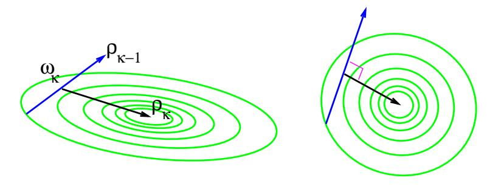

Fig. 17. Sketch of conjugate gradient directions in a 2D error surface.

a good line search procedure. For a perfectly quadratic function with N variables

a convergence within N steps can be proved. For non-quadratic functions Polak and Ribiere's choice seems more robust. Conjugate gradient (41) can also be viewed as a smart choice for choosing the momentum term known in neural network training. It has been applied with large success in multi-layer network training on problems that are moderate sized with rather low redundancy in the data. Typical applications range from function approximation, robotic control [39], time-series prediction and other real valued problems where high accuracy is wanted. Clearly on large and redundant (classification) problems stochastic backpropagation is faster. Although attempts have been made to define minibatches [25], the main disadvantage of conjugate gradient methods remains that it is a batch method (partly due to the precision requirements in line search procedure).

#### 6.3 Quasi-Newton (BFGS)

The Quasi-Newton (BFGS) method (1) iteratively computes an estimate of the inverse Hessian, (2) is an  $O(N^2)$  algorithm, (3) requires line search and (4) it works only for batch learning.

The positive definite estimate of the inverse Hessian is done directly without requiring matrix inversion and by only using gradient information. Algorithmically this can be described as follows: (1) first a positive definite matrix M is chosen, e.g. M = I, (2) then the search direction is set to

$$\rho(t) = M(t)\nabla E(w(t)),$$

(3) a line search is performed along  $\rho$ , which gives the update for the parameters at time t

$$w(t) = w(t-1) - \eta(t)\rho(t).$$

Finally (4) the estimate of the inverse Hessian is updated. Compared to the Newton algorithm the Quasi-Newton approach only needs gradient information. The most successful Quasi-Newton algorithm is the Broyden-Fletcher-Goldfarb-Shanno (BFGS) method. The update rule for the estimate of the inverse Hessian is

$$M(t) = M(t-1) \left( 1 + \frac{\phi^T M \phi}{\delta^T \phi} \right) \frac{\delta \delta^T}{\delta^T \phi} - \left( \frac{\delta \phi^T M + M \phi \delta^T}{\delta^T \phi} \right), \tag{44}$$

where some abbreviations have been used for the following  $N \times 1$  vectors

$$\phi = \nabla E(w(t)) - \nabla E(w(t-1))$$

$$\delta = w(t) - w(t-1). \tag{45}$$

Although, as mentioned above, the complexity is only  $O(N^2)$ , we are still required to store a  $N \times N$  matrix, so the algorithm is only practical for small networks with non-redundant training sets. Recently some variants exist that aim to reduce storage requirements (see e.g. [3]).

#### 6.4 Gauss-Newton and Levenberg Marquardt

Gauss-Newton and Levenberg Marquardt algorithm (1) use the square Jacobi approximation, (2) are mainly designed for batch learning, (3) have a complexity of  $O(N^3)$  and (4) most important, they work only for mean squared error loss functions. The Gauss-Newton algorithm is like the Newton algorithm, however the Hessian is approximated by the square of the Jacobian (see also section 7.2 for a further discussion)

$$\Delta w = \left(\sum_{p} \frac{\partial f(w, x_p)}{\partial w}^T \frac{\partial f(w, x_p)}{\partial w}\right)^{-1} \nabla E(w). \tag{46}$$

The Levenberg Marquardt method is like the Gauss-Newton above, but it has a regularization parameter  $\mu$  that prevents it from blowing up, if some eigenvalues are small

$$\Delta w = \left(\sum_{p} \frac{\partial f(w, x_p)}{\partial w}^{T} \frac{\partial f(w, x_p)}{\partial w} + \mu I\right)^{-1} \nabla E(w), \tag{47}$$

where I denotes the unity matrix. The Gauss Newton method is valid for quadratic cost functions however a similar procedure also works with Kullback-Leibler cost and is called Natural Gradient (see e.g. [1, 44, 2]).

# 7 Tricks to compute the Hessian information in multilayer networks

We will now discuss several techniques aimed at computing full or partial Hessian information by (a) finite difference method, (b) square Jacobian approximation (for Gauss-Newton and Levenberg-Marquardt algorithm), (c) computation of the diagonal of the Hessian and (d) by obtaining a product of the Hessian and a vector without computing the Hessian. Other semi-analytical techniques that allow the computation of the full Hessian are omitted because they are rather complicated and also require many forward/backward propagation steps [5, 8].

#### 7.1 Finite Difference

We can write the k-th line of the Hessian

$$H^{(k)} = \frac{\partial(\nabla E(w))}{\partial w_k} \sim \frac{\nabla E(w + \delta \phi_k) - \nabla E(w)}{\delta},$$

where  $\phi_k = (0, 0, 0, \dots, 1, \dots, 0)$  is a vector of zeros and only one 1 at the k-th position. This can be implemented with a simple recipe: (1) compute the total gradient by multiple forward and backward propagation steps. (2) Add  $\delta$  to the k-th parameter and compute again the gradient, and finally (3) subtract both results and divide by  $\delta$ . Due to numerical errors in this computation scheme the resulting Hessian might not be perfectly symmetric. In this case it should be summetrized as described below.

# 7.2 Square Jacobian approximation for the Gauss-Newton and Levenberg-Marquardt algorithms

Assuming a mean squared cost function

$$E(w) = \frac{1}{2} \sum_{p} (d_p - f(w, x_p))^T (d_p - f(w, x_p))$$
(48)

then the gradient is

$$\frac{\partial E(w)}{\partial w} = -\sum_{p} (d_p - f(w, x_p))^T \frac{\partial f(w, x_p)}{\partial w}$$
(49)

and the Hessian follows as

$$H(w) = \sum_{p} \frac{\partial f(w, x_p)}{\partial w}^{T} \frac{\partial f(w, x_p)}{\partial w} + \sum_{p} (d_p - f(w, x_p))^{T} \frac{\partial^2 f(w, x_p)}{\partial w \partial w}.$$
 (50)

A simplifying approximation of the Hessian is the square of the Jacobian which is a positive semi-definite matrix of dimension:  $N \times O$ 

$$H(w) \sim \sum_{p} \frac{\partial f(w, x_p)}{\partial w}^T \frac{\partial f(w, x_p)}{\partial w},$$
 (51)

where the second term from Eq.(50) was dropped. This is equivalent to assuming that the network is a linear function of the parameters w. Again this is readily implemented for the k-th column of the Jacobian: for all training patterns, (1) we forward propagate, then (2) set the activity of the output units to 0 and only the k-th output to 1, (3) a backpropagation step is taken and the gradient is accumulated.

#### 7.3 Backpropagating second derivatives

Let us consider a multi-layer system with some functional blocks with  $N_i$  inputs,  $N_o$  outputs and N parameters of the form O = F(W, X). Now assume we knew  $\partial^2 E/\partial O^2$ , which is a  $N_o \times N_o$  matrix. Then it is straight forward to compute this matrix

$$\frac{\partial^2 E}{\partial W^2} = \frac{\partial O}{\partial W}^T \frac{\partial^2 E}{\partial O^2} \frac{\partial O}{\partial W} + \frac{\partial E}{\partial O} \frac{\partial^2 O}{\partial W^2}.$$
 (52)

We can drop the second term in Eq.(52) and the resulting estimate of the Hessian is positive semi-definite. A further reduction is achieved, if we ignore all but the diagonal terms of  $\frac{\partial^2 E}{\partial O^2}$ :

$$\frac{\partial^2 E}{\partial w_i^2} = \sum_k \frac{\partial^2 E}{\partial o_k^2} \left( \frac{\partial o_k}{\partial w_i} \right)^2. \tag{53}$$

A similar derivation can be done to obtain the  $N_i$  times  $N_i$  matrix  $\partial^2 E/\partial x^2$ .

#### 7.4 Backpropagating the diagonal Hessian in neural nets

Backpropagation procedures for computing the diagonal Hessian are well known [18, 4, 19]. It is assumed that each layer in the network has the functional form  $o_i = f(y_i) = f(\sum_j w_i j x_j)$  (see Figure 18 for the sigmoidal network). Using the Gauss-Newton approximation (dropping the term that contain f''(y)) we obtain:

$$\frac{\partial^2 E}{\partial y_k^2} = \frac{\partial^2 E}{\partial o_k^2} \left( f'(y_k) \right)^2, \tag{54}$$

$$\frac{\partial^2 E}{\partial w_{ki}^2} = \frac{\partial^2 E}{\partial y_k^2} x_i^2 \tag{55}$$

and

$$\frac{\partial^2 E}{\partial x_i^2} \sum_k \frac{\partial^2 E}{\partial y_k^2} w_{ki}^2. \tag{56}$$

With f being a Gaussian nonlinearity as shown in Figure 18 for the RBF networks we obtain

$$\frac{\partial^2 E}{\partial w_{ki}^2} = \frac{\partial^2 E}{\partial y_k^2} (x_i - w_{ki})^2 \tag{57}$$

and

$$\frac{\partial^2 E}{\partial x_i^2} = \sum_k \frac{\partial^2 E}{\partial y_k^2} (x_i - w_{ki})^2. \tag{58}$$

The cost of computing the diagonal second derivatives by running these equations from the last layer to the first one is essentially the same as the regular backpropation pass used for the gradient, except that the square of the weights are used in the weighted sums. This technique is applied in the "optimal brain damage" pruning procedure (see [21]).

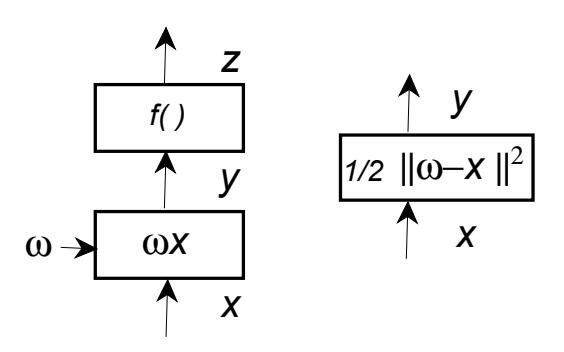

Fig. 18. Backpropagating the diagonal Hessian: sigmoids (left) and RBFs (right).

#### 7.5 Computing the product of the Hessian and a vector

In many methods that make use of the Hessian, the Hessian is used exclusively in products with a vector. Interestingly, there is a way of computing such products without going through the trouble of computing the Hessian itself. The finite difference method can fulfill this task for an arbitrary vector  $\Psi$ 

$$H\Psi \sim \frac{1}{\alpha} \left( \frac{\partial E}{\partial w} (w + \alpha \Psi) - \frac{\partial E}{\partial w} (w) \right),$$
 (59)

using only two gradient computations (at point w and  $w + \alpha \Psi$  respectively), which can be readily computed with backprop ( $\alpha$  is a small constant).

This method can be applied to compute the principal eigenvector and eigenvalue of H by the power method. By iterating and setting

$$\Psi(t+1) = \frac{H\Psi(t)}{\|\Psi(t)\|},\tag{60}$$

the vector  $\Psi(t)$  will converge to the largest eigenvector of H and  $\|\Psi(t)\|$  to the corresponding eigenvalue [23, 14, 10]. See also [33] for an even more accurate method that (1) does not use finite differences and (2) has similar complexity.

# 8 Analysis of the Hessian in multi-layer networks

It is interesting to understand how some of the tricks shown previously influence on the Hessian, i.e. how does the Hessian change with architecture and details of the implementation. Typically, the eigenvalue distribution of the Hessian looks like the one sketched in Figure 20: a few small eigenvalues, many medium ones and few very large ones. We will now argue that the *large eigenvalues* will cause the trouble in the training process because [23, 22]

- non-zero mean inputs or neuron states [22]
- wide variations of the second derivatives from layer to layer
- correlation between state variables.

To exemplify this, we show the eigenvalue distribution of a network trained on OCR data in Figure 20. Clearly, there is a wide spread of eigenvalues (see Figure 19) and we observe that the ratio between e.g. the first and the eleventh eigenvalue is about 8. The long tail of the eigenvalue distribution (see Figure 20) is rather painful because the ratio between the largest and smallest eigenvalue gives the conditioning of the learning problem. A large ratio corresponds to a big difference in the axis of the ellipsoidal shaped error function: the larger the ratio, the more we find a taco-shell shaped minima, which are extremely steep towards the small axis and very flat along the long axis.

Another general characteristic of the Hessian in multi-layer networks is the spread between layers. In Figure 21 we roughly sketch how the shape of the Hessian varies from being rather flat in the first layer to being quite steep in

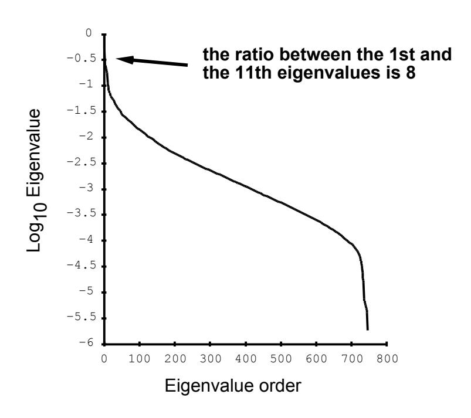

Fig. 19. Eigenvalue spectrum in a 4 layer shared weights network  $(256 \times 128 \times 64 \times 10)$  trained on 320 handwritten digits.

the last layer. This affects the learning speed and can provide an ingredient to explain the slow learning in lower layers and the fast (sometime oscillating) learning in the last layer. A trick to compensate this different scale of learning is to use the inverse diagonal Hessian to control the learning rate (see also section 6

# 9 Applying Second Order Methods to Multilayer Networks

Before we concentrate in this section on how to tailor second order techniques for training large networks, let us first repeat some rather pessimistic facts about applying classical second order methods. Techniques using full Hessian information (Gauss -Newton, Levenberg-Marquardt and BFGS) can only apply to very small networks trained in batch mode, however those small networks are not the ones that need speeding up the most. Most second order methods (conjugate gradient, BFGS, ...) require a line-search and can therefore not be used in the stochastic mode. Many of the tricks discussed previously apply only to batch learning. From our experience we know that a carefully tuned stochastic gradient descent is hard to beat on large classification problems. For smaller problems that require accurate real-valued outputs like in function approximation or control problems, we see that conjugate gradient (with Polak-Ribiere

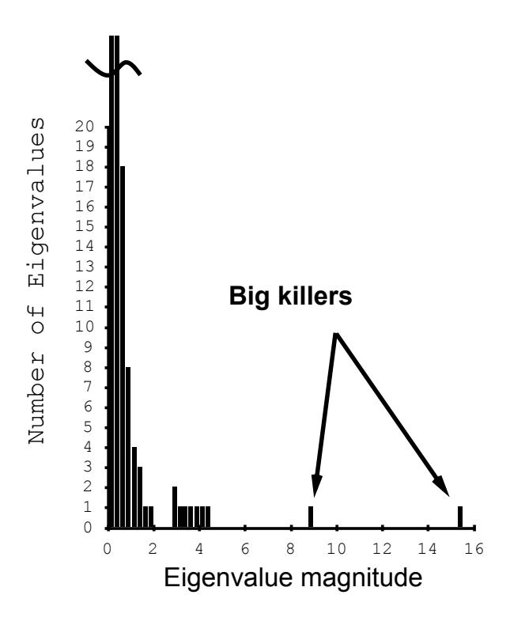

**Fig. 20.** Eigenvalue spectrum in a 4 layer shared weights network  $(256 \times 128 \times 64 \times 10)$  trained on 320 handwritten digits.

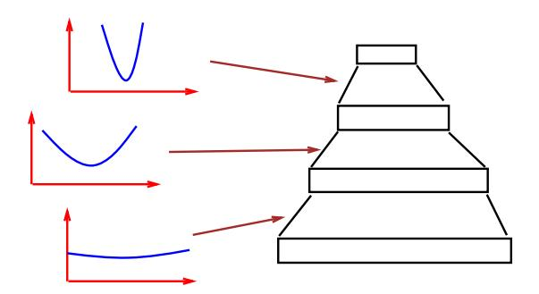

Fig. 21. Multilayered architecture: the second derivative is often smaller in lower layers.

Eq.(43)) offers the best combination of speed, reliability and simplicity. Several attempts using "mini batches" in applying conjugate gradient to large and redundant problems have been made recently [17, 25, 31]. A variant of conjugate gradient optimization (called scaled CG) seems interesting: here the line search procedure is replaced by a 1D Levenberg Marquardt type algorithm [24].

#### 9.1 A stochastic diagonal Levenberg Marquardt method

To obtain a stochastic version of the Levenberg Marquardt algorithm the idea is to compute the diagonal Hessian through a running estimate of the second derivative with respect to each parameter. The instantaneous second derivative can be obtained via backpropagation as shown in the formulas of section 7. As soon as we have those running estimates we can use them to compute individual learning rates for each parameter

$$\eta_{ki} = \frac{\epsilon}{\langle \frac{\partial^2 E}{\partial w_{ki}^2} \rangle + \mu},\tag{61}$$

where  $\epsilon$  denotes the global learning rate, and  $\langle \frac{\partial^2 E}{\partial w_{ki}^2} \rangle$  is a running estimate of the diagonal second derivative with respect to  $w_{ki}$ .  $\mu$  is a parameter to prevent  $\eta_{ki}$  from blowing up in case the second derivative is small, i.e. when the optimization moves in flat parts of the error function. The running estimate is computed as

$$\langle \frac{\partial^2 E}{\partial w_{ki}^2} \rangle_{new} = (1 - \gamma) \langle \frac{\partial^2 E}{\partial w_{ki}^2} \rangle_{old} + \gamma \frac{\partial^2 E^p}{\partial w_{ki}^2}, \tag{62}$$

where  $\gamma$  is a small constant that determines the amount of memory that is being used. The second derivatives can be computed prior to training over e.g. a subset of the training set. Since they change only very slowly they only need to be reestimated every few epochs. Note that the additional cost over regular backpropagation is negligible and convergence is – as a rule of thumb – about three times faster than a carefully tuned stochastic gradient algorithm.

In Figure 22 and 23 we see the convergence of the stochastic diagonal Levenberg Marquardt method (61) for a toy example with two different sets of learning rates. Obviously the experiment shown Figure 22 contains fewer fluctuations than in Figure 23 due to smaller learning rates.

#### 9.2 Computing the principal Eigenvalue/vector of the Hessian

In the following we give three tricks for computing the principal eigenvalue/Vector of the Hessian without having to compute the Hessian itself. Remember that in section 4.7 we also introduced a method to approximate the smallest eigenvector of the Hessian (without having to compute the Hessian) through averaging (see also [28]).

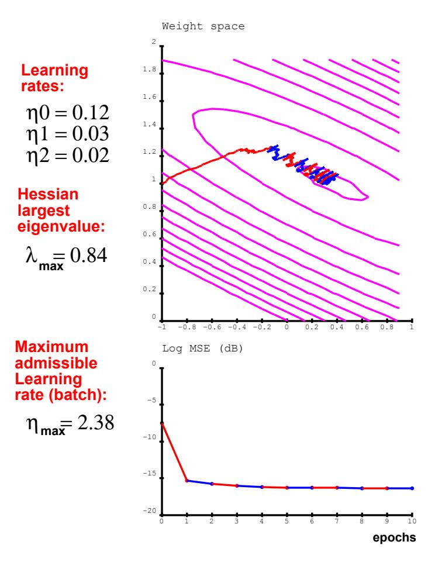

Fig. 22. Stochastic diagonal Levenberg-Marquardt algorithm. Data set from 2 Gaussians with 100 examples. The network has one linear unit, 2 inputs and 1 output, i.e. three parameters (2 weights, 1 bias).

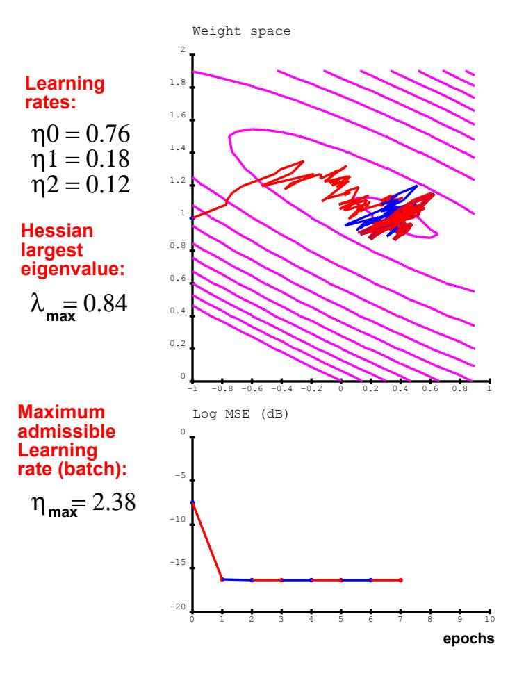

Fig. 23. Stochastic diagonal Levenberg-Marquardt algorithm. Data set from 2 Gaussians with 100 examples. The network has one linear unit, 2 inputs and 1 output, i.e. three parameters (2 weights, 1 bias).

**Power Method** We repeat the result of our discussion in section 7.5: starting from a random initial vector  $\Psi$ , the iteration

$$\Psi_{new} = H \frac{\Psi_{old}}{\|\Psi_{old}\|},$$

will eventually converge to the principal eigenvector (or a vector in the principal eigenspace) and  $\|\Psi_{old}\|$  will converge to the corresponding eigenvalue [14, 10].

Taylor Expansion Another method makes use of the fact that small perturbations of the gradient also lead to the principal eigenvector of H

$$\Psi_{new} = \frac{1}{\alpha} \left( \frac{\partial E}{\partial w} (w + \alpha \frac{\Psi_{old}}{\|\Psi_{old}\|}) - \frac{\partial E}{\partial w} (w) \right), \tag{63}$$

where  $\alpha$  is a small constant. One iteration of this procedure requires two forward and two backward propagation steps for each pattern in the training set.

Online Computation of  $\Psi$  The following rule makes use of the running average to obtain the largest eigenvalue of the average Hessian very fast

$$\Psi_{new} = (1 - \gamma)\Psi + \frac{1}{\alpha} \left( \frac{\partial E^p}{\partial w} (w + \alpha \frac{\Psi_{old}}{\|\Psi_{old}\|}) - \frac{\partial E}{\partial w} (w) \right). \tag{64}$$

To summarize, the eigenvalue/vector computations:

- 1. a random vector is chosen for initialization of  $\Psi$ ,
- 2. an input pattern is presented with desired output, a forward and backward propagation, step is performed and the gradients G(w) are stored, 3.  $\alpha \frac{\Psi_{old}}{\|\Psi_{old}\|}$  is added to the current weight vector w,
- 4. a forward and backward propagation step is performed with the perturbed weight vector and the gradients G(w') are stored,
- 5. the difference  $1/\alpha(G(w')-G(w))$  is computed and the running average of the eigenvector is updated,
- 6. we loop from (2)-(6) until a reasonably stable result is obtained for  $\Psi$ ,
- 7. the optimal learning rate is then given as

$$\eta_{opt} = \frac{1}{\|\Psi\|}.$$

In Figure 24 we see the evolution of the eigenvalue as a function of the number of pattern presentations for a neural network in a handwritten character recognition task. In practice we adapt the leak size of the running average in order to get fewer fluctuations (as also indicated on the figure). In the figure we see that after fewer than 100 pattern presentations the correct order of magnitude for the eigenvalue, i.e the learning rate is reached. From the experiments we also observe that the fluctuations of the average Hessian over training are small.

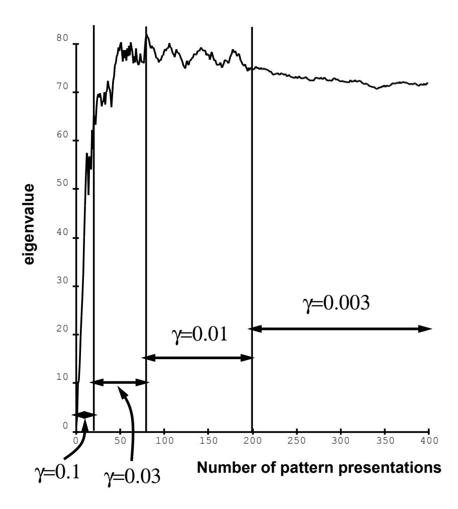

**Fig. 24.** Evolution of the eigenvalue as a function of the number of pattern presentations for a shared weight network with 5 layers, 64638 connections and 1278 free parameters. The training set consists of 1000 handwritten digits.

In Figure 25 and 26 we start with the same initial conditions, and perform a fixed number of epochs with learning rates computed by multiplying the predicted learning rate by a predefined constant. Choosing constant 1 (i.e. using the predicted optimal rate) always gives residual errors which are very close to the error achieved by the best choice of the constant. In other words, the "predicted optimal rate" is optimal enough.

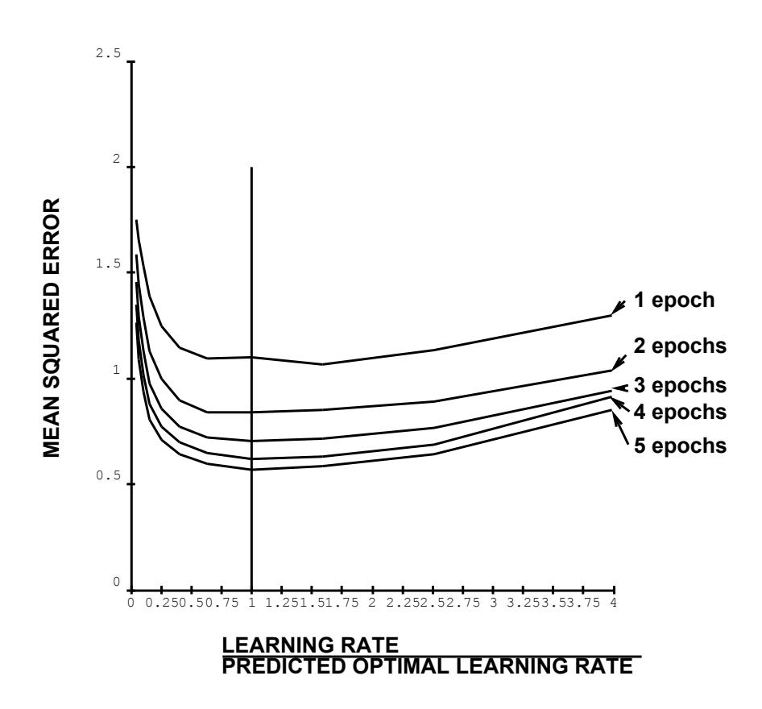

**Fig. 25.** Mean squared error as a function of the ratio between learning rate and predicted optimal learning rate for a fully connected network ( $784 \times 30 \times 10$ ). The training set consists of 300 handwritten digits.

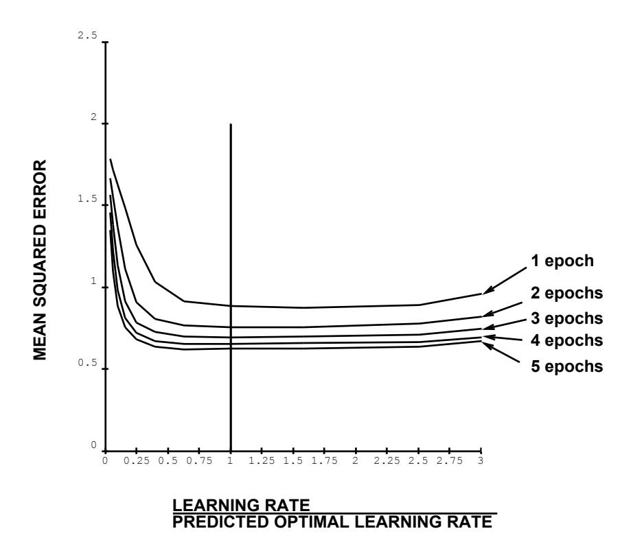

**Fig. 26.** Mean squared error as a function of the ratio between learning rate and predicted optimal learning rate for a shared weight network with 5 layers ( $1024 \times 1568 \times 392 \times 400 \times 100 \times 10$ ), 64638 (local) connections and 1278 free parameters (shared weights). The training set consists of 1000 handwritten digits.

#### 10 Discussion and Conclusion

According to the recommendations mentioned above, a practitioner facing a multi-layer neural net training problem would go through the following steps:

- shuffle the examples
- center the input variables by subtracting the mean
- normalize the input variable to a standard deviation of 1
- if possible, decorrelate the input variables.
- pick a network with the sigmoid function shown in figure 4
- set the target values within the range of the sigmoid, typically +1 and -1.
- initialize the weights to random values as prescribed by 16.

The preferred method for training the network should be picked as follows:

- if the training set is large (more than a few hundred samples) and redundant,
   and if the task is classification, use stochastic gradient with careful tuning,
   or use the stochastic diagonal Levenberg Marquardt method.
- if the training set is not too large, or if the task is regression, use conjugate gradient.

Classical second-order methods are impractical in almost all useful cases.

The non-linear dynamics of stochastic gradient descent in multi-layer neural networks, particularly as it pertains to generalization, is still far from being well understood. More theoretical work and systematic experimental work is needed.

**Acknowledgement** Y.L. & L.B. & K.-R. M. gratefully acknowledge mutual exchange grants from DAAD and NSF.

#### References

- S. Amari. Neural learning in structured parameter spaces natural riemannian gradient. In Michael C. Mozer, Michael I. Jordan, and Thomas Petsche, editors, Advances in Neural Information Processing Systems, volume 9, page 127. The MIT Press, 1997.
- S. Amari. Natural gradient works efficiently in learning. Neural Computation, 10(2):251-276, 1998.
- 3. R. Battiti. First- and second-order methods for learning: Between steepest descent and newton's method. *Neural Computation*, 4:141-166, 1992.
- 4. S. Becker and Y. LeCun. Improving the convergence of backbropagation learning with second oder methods. In David Touretzky, Geoffrey Hinton, and Terrence Sejnowski, editors, *Proceedings of the 1988 Connectionist Models Summer School*, pages 29–37. Lawrence Erlbaum Associates, 1989.
- C. M. Bishop. Neural Networks for Pattern Recognition. Clarendon Press, Oxford, 1995
- L. Bottou. Online algorithms and stochastic approximations. In David Saad, editor, Online Learning in Neural Networks (1997 Workshop at the Newton Institute), Cambridge, 1998. The Newton Institute Series, Cambridge University Press.

- D. S. Broomhead and D. Lowe. Multivariable function interpolation and adaptive networks. Complex Systems, 2:321-355, 1988.
- 8. W. L. Buntine and A. S. Weigend. Computing second order derivatives in Feed-Forward networks: A review. *IEEE Transactions on Neural Networks*, 1993. To appear.
- 9. C. Darken and J. E. Moody. Note on learning rate schedules for stochastic optimization. In R. P. Lippmann, J. E. Moody, and D. S. Touretzky, editors, *Advances in Neural Information Processing Systems*, volume 3, pages 832–838. Morgan Kaufmann, San Mateo, CA, 1991.
- K. I. Diamantaras and S. Y. Kung. Principal Component Neural Networks. Wiley, New York, 1996.
- 11. R. Fletcher. Practical Methods of Optimization, chapter 8.7: Polynomial time algorithms, pages 183–188. John Wiley & Sons, New York, second edition, 1987.
- S. Geman, E. Bienenstock, and R. Doursat. Neural networks and the bias/variance dilemma. Neural Computation, 4(1):1-58, 1992.
- L. Goldstein. Mean square optimality in the continuous time Robbins Monro procedure. Technical Report DRB-306, Dept. of Mathematics, University of Southern California, LA, 1987.
- G. H. Golub and C. F. Van Loan. Matrix Computations, 2nd ed. Johns Hopkins University Press, Baltimore, 1989.
- T.M. Heskes and B. Kappen. On-line learning processes in artificial neural networks. In J. G. Tayler, editor, Mathematical Approaches to Neural Networks, volume 51, pages 199–233. Elsevier, Amsterdam, 1993.
- Robert A. Jacobs. Increased rates of convergence through learning rate adaptation. Neural Networks, 1:295-307, 1988.
- A. H. Kramer and A. Sangiovanni-Vincentelli. Efficient parallel learning algorithms for neural networks. In D. S. Touretzky, editor, Advances in Neural Information Processing Systems. Proceedings of the 1988 Conference, pages 40-48, San Mateo, CA, 1989. Morgan Kaufmann.
- 18. Y. LeCun. Modeles connexionnistes de l'apprentissage (connectionist learning models). PhD thesis, Universitè P. et M. Curie (Paris VI), 1987.
- Y. LeCun. Generalization and network design strategies. In R. Pfeifer, Z. Schreter,
   F. Fogelman, and L. Steels, editors, Connectionism in Perspective, Amsterdam,
   1989. Elsevier. Proceedings of the International Conference Connectionism in Perspective, University of Zürich, 10. 13. October 1988.
- Y. LeCun, B. Boser, J. S. Denker, D. Henderson, R. E. Howard, W. Hubbard, and L. D. Jackel. Handwritten digit recognition with a backpropagation network. In D. S. Touretsky, editor, Advances in Neural Information Processing Systems, vol. 2, San Mateo, CA, 1990. Morgan Kaufman.
- Y. LeCun, J.S. Denker, and S.A. Solla. Optimal brain damage. In D. S. Touretsky, editor, Advances in Neural Information Processing Systems, vol. 2, pages 598-605, 1990.
- Y. LeCun, I. Kanter, and S. A. Solla. Second order properties of error surfaces. In Advances in Neural Information Processing Systems, vol. 3, San Mateo, CA, 1991. Morgan Kaufmann.
- 23. Y. LeCun, P. Y. Simard, and B. Pearlmutter. Automatic learning rate maximization by on-line estimation of the hessian's eigenvectors. In Giles, Hanson, and Cowan, editors, *Advances in Neural Information Processing Systems*, vol. 5, San Mateo, CA, 1993. Morgan Kaufmann.
- M. Møller. A scaled conjugate gradient algorithm for fast supervised learning. Neural Networks, 6:525-533, 1993.

- 25. M. Møller. Supervised learning on large redundant training sets. *International Journal of Neural Systems*, 4(1):15-25, 1993.
- J. E. Moody and C. J. Darken. Fast learning in networks of locally-tuned processing units. Neural Computation, 1:281-294, 1989.
- 27. N. Murata. (in Japanese). PhD thesis, University of Tokyo, 1992.
- 28. N. Murata, K.-R. Müller, A. Ziehe, and S. Amari. Adaptive on-line learning in changing environments. In Michael C. Mozer, Michael I. Jordan, and Thomas Petsche, editors, *Advances in Neural Information Processing Systems*, volume 9, page 599. The MIT Press, 1997.
- A.V. Oppenheim and R.W. Schafer. Digital Signal Processing. Prentice Hall, Englewood Cliffs, 1975.
- G. B. Orr. Dynamics and Algorithms for Stochastic learning. PhD thesis, Oregon Graduate Institute, 1995.
- 31. G.B. Orr. Removing noise in on-line search using adaptive batch sizes. In Michael C. Mozer, Michael I. Jordan, and Thomas Petsche, editors, Advances in Neural Information Processing Systems, volume 9, page 232. The MIT Press, 1997.
- M.J.L. Orr. Regularization in the selection of radial basis function centers. Neural Computation, 7(3):606-623, 1995.
- 33. B.A. Pearlmutter. Fast exact multiplication by the hessian. *Neural Computation*, 6:147–160, 1994.
- 34. W. H. Press, B. P. Flannery, S. A. Teukolsky, and W. T. Vetterling. *Numerical Recipies in C: The art of Scientific Programming*. Cambridge University Press, Cambridge, England, 1988.
- 35. D. Saad, editor. Online Learning in Neural Networks (1997 Workshop at the Newton Institute). The Newton Institute Series, Cambridge University Press, Cambridge, 1998.
- D. Saad and S. A. Solla. Exact solution for on-line learning in multilayer neural networks. *Physical Review Letters*, 74:4337-4340, 1995.
- 37. H. Sompolinsky, N. Barkai, and H.S. Seung. On-line learning of dichotomies: algorithms and learning curves. In J-H. Oh, C. Kwon, and S. Cho, editors, Neural Networks: The Statistical Mechanics Perspective, pages 105–130. Singapore: World Scientific, 1995.
- 38. R.S. Sutton. Adapting bias by gradient descent: An incremental version of delta-bar-delta. In William Swartout, editor, *Proceedings of the 10th National Conference on Artificial Intelligence*, pages 171–176, San Jose, CA, July 1992. MIT Press.
- 39. P. van der Smagt. Minimisation methods for training feed-forward networks. Neural Networks, 7(1):1-11, 1994.
- V. Vapnik. The Nature of Statistical Learning Theory. Springer Verlag, New York, 1995.
- 41. V. Vapnik. Statistical Learning Theory Wiley, New York, 1998.
- 42. A. Waibel, T. Hanazawa, G. Hinton, K. Shikano, and K. J. Lang. Phoneme recognition using time-delay neural networks. *IEEE Transactions on Acoustics, Speech, and Signal Processing*, ASSP-37:328-339, 1989.
- W. Wiegerinck, A. Komoda, and T. Heskes. Stochastic dynamics of learning with momentum in neural networks. *Journal of Physics A*, 27:4425-4437, 1994.
- 44. H.H. Yang and S. Amari. The efficiency and the robustness of natural gradient descent learning rule. In Michael I. Jordan, Michael J. Kearns, and Sara A. Solla, editors, Advances in Neural Information Processing Systems, volume 10. The MIT Press, 1998.