Article

# Comparison of Remote Sensing Time-Series Smoothing Methods for Grassland Spring Phenology Extraction on the Qinghai-Tibetan Plateau

Nan Li 1,2, Pei Zhan 1,2, Yaozhong Pan 1,3,\*, Xiufang Zhu 1,2, Muyi Li 1,2 and Dujuan Zhang 1,2

- State Key Laboratory of Remote Sensing Science, Jointly Sponsored by Beijing Normal University and Institute of Remote Sensing and Digital Earth of Chinese Academy of Sciences, Beijing 100875, China; lena@mail.bnu.edu.cn (N.L.); peizhan@mail.bnu.edu.cn (P.Z.); zhuxiufang@bnu.edu.cn (X.Z.); lmy\_geo@mail.bnu.edu.cn (M.L.); duduzdj@mail.bnu.edu.cn (D.Z.)
- Institute of Remote Sensing Science and Engineering, Faculty of Geographical Sciences, Beijing Normal University, Beijing 100875, China
- 3 Academy of Plateau Science and Sustainability, Qinghai Normal University, Xining 810016, China
- \* Correspondence: pyz@bnu.edu.cn

Received: 14 September 2020; Accepted: 12 October 2020; Published: 16 October 2020

**Abstract:** Accurate evaluation of start of season (SOS) changes is essential to assess the ecosystem's response to climate change. Smoothing method is an understudied factor that can lead to great uncertainties in SOS extraction, and the applicable situation for different smoothing methods and the impact of smoothing parameters on SOS extraction accuracy are of critical importance to be clarified. In this paper, we use MOD13Q1 normalized difference vegetation index (NDVI) data and SOS observations from eight agrometeorological stations on the Qinghai-Tibetan Plateau (QTP) during 2001–2011 to compare the SOS extraction accuracies of six popular smoothing methods (Changing Weight (CW), Savitzky-Golay (SG), Asymmetric Gaussian (AG), Double-logistic (DL), Whittaker Smoother (WS) and Harmonic Analysis of NDVI Time-Series (HANTS)) for two types of different SOS extraction methods (dynamic threshold (DT) with 9 different thresholds and double logistic (Zhang)). Furthermore, a parameter sensitivity analysis for each smoothing method is performed to quantify the impacts of smoothing parameters on SOS extraction. Finally, the suggested smoothing methods and reference ranges for the parameters of different smoothing methods were given for grassland phenology extraction on the QTP. The main conclusions are as follows: (1) the smoothing methods and SOS extraction methods jointly determine the SOS extraction accuracy, and a bad denoising performance of smoothing method does not necessarily lead to a low SOS extraction accuracy; (2) the default parameters for most smoothing methods can result in acceptable SOS extraction accuracies, but for some smoothing methods (e.g., WS) a parameter optimization is necessary, and the optimal parameters of the smoothing method can increase the  $R^2$  and reduce the RMSE of SOS extraction by up to 25% and 331%; (3) The main influencing factor of the SOS extraction using the DT method is the stability of the minimum value in the NDVI curve, and for the Zhang method the curve shape before the peak of the NDVI curve impacts the most; (4) HANTS is the most stable method no matter with (fitness = 35.05) or without parameter optimization (fitness = 33.52), which is recommended for QTP grassland SOS extraction. The findings of this study imply that remote sensing-based vegetation phenology extraction can be highly uncertain, and a careful selection and parameterization of the time-series smoothing method should be taken to achieve an accurate result.

**Keywords:** phenology; smoothing methods; Start of season (SOS); Qinghai–Tibetan Plateau (QTP); grassland

Remote Sens. 2020, 12, 3383 2 of 26

#### 1. Introduction

As a result of anthropogenic activities, global warming has brought widespread impacts on the terrestrial ecosystem [1,2]. Vegetation phenology is a sensitive indicator of climate change, and it has been widely reported that global warming has altered the vegetation phenology in the past few decades [3–5]. Changes in vegetation phenology can bring changes to the interaction between the biosphere and the atmosphere, and finally lead to changes in carbon balance [6], water balance [7] and even vegetation feedback mechanisms towards climate change [8]. Therefore, an accurate assessment of vegetation phenology is of crucial importance for understanding the impact of global climate change on terrestrial ecosystem cycle of carbon and for making effective adaptive management decisions [9].

There are two main data sources of vegetation phenology observations, one is from ground and near-ground measurements, and the other one is generated from remote sensing data [10–12]. Traditional ground and near-ground measurements have the advantage of high accuracy, but they lack the spatial continuity due to the limited number of observation stations [5]. Remote sensing, on the contrary, can provide simultaneous and spatial-continuous observations at large scales, and thus can present more insights at a spatial scale [13]. In recent years, satellite-based remote sensing technology has been widely used for vegetation phenology extraction and monitoring [9,14-20]. However, the extraction of vegetation phenology using remote sensing technology can have serious uncertainties due to different data sources, time-series smoothing methods and phenology extraction methods. These uncertainties may even lead to different conclusions regarding the same question. For instance, using GIMMS NDVI data, Yu et al. [21] found an advanced followed by a delayed trend for start of season (SOS) on the Qinghai-Tibetan Plateau (QTP). However, Zhang et al. [22] reported that the SOS of alpine vegetation on the QTP is continuously advanced from 1982 to 2011. Only a few studies have been conducted to quantify the uncertainties regarding remote sensing phenology extraction, and these studies mainly focus on the raw remote sensing data and phenology extraction methods [23–28]. However, we have not yet acquired an explicit understanding of the impact of remote sensing time-series smoothing methods as well as the parameters of the smoothing methods on SOS extraction.

The current remote sensing time-series smoothing methods have large differences in the model structure [29], which may lead to great differences among smoothed curves and, furthermore, the extracted vegetation phenology. At present, the research regarding smoothing methods mostly focuses on the quality of curve reconstruction rather than the extraction of vegetation phenology [30,31]. Although several studies compared the phenology extraction results based on different smoothing methods [32,33], there is still a lack in quantitative evaluation of the interaction of different smoothing methods and different phenology extraction methods for grassland phenology extraction. Another problem regarding the time-series smoothing for phenology extraction is the parameter setting of the smoothing methods. Most smoothing methods require setting smoothing parameters manually [34–36], although the default parameter values were suggested for some of the smoothing methods when they were proposed (e.g., the default values of parameters *m* and *d* for Savitzky-Golay filter were suggested to be 4 and 6, respectively [35]), the optimal parameter values can vary across different study area and vegetation types due to different vegetation growth trajectories, and improper smoothing parameter values will lead to great uncertainties for the smoothing results [37–39] and inaccurate phenology extraction results. The vegetation phenology on the QTP has been widely studied due to its nature of being vulnerable and sensitive to climate change [21,24,40]. However, to our knowledge, there is still no comprehensive research of smoothing parameter comparison for grassland phenology extraction on the QTP; therefore, it is difficult for the users to parameterize the smoothing methods without an expert knowledge of this region.

In this study, we focus on quantifying the uncertainties arise from remote sensing time-series smoothing methods as well as the parameters of the smoothing methods for SOS extraction. To solve this problem, we used MODIS normalized difference vegetation index (NDVI) data and ground phenology measurement records from eight agrometeorological stations to compare six smoothing

Remote Sens. 2020, 12, 3383 3 of 26

methods for grassland SOS extraction. The Qinghai–Tibetan Plateau, one of the most sensitive areas to global climate change, was chosen as the study area to conduct the study. This study aimed to examine three questions: (1) how do smoothing methods and their parameters impact on phenology extraction? (2) What are the main factors that bring uncertainties to the phenology extraction using remote sensing data? (3) What are the applicable conditions for different smoothing methods?

## 2. Study Area and Data

## 2.1. Study Area

The Qinghai–Tibetan Plateau stands in the center of Eurasia, spanning 31 longitude degrees  $(73^{\circ}18'52''E-104^{\circ}46'59''E)$  and 13 latitude degrees  $(26^{\circ}00'12''N-39^{\circ}46'50''N)$ , with a total area of almost  $2.5 \times 10^6$  km² [41]. The QTP is known as the roof of the world and the third pole (the highest plateau in the world), with an average altitude of 4000 m. As for the climate, the QTP is the coldest region at the same latitude due to its high altitude, the average surface temperature of the coldest month is between -10 to -15 °C. The average daily radiation on the QTP is 21 MJ m $^{-2}$  day $^{-1}$ , which is much higher than that of other areas at the same altitude [42]. The vegetation type on the QTP varies according to different temperature and water conditions, presenting a landscape of forests–grassland–desert from southeast to northwest (Figure 1). The Alpine steppe has the widest distribution and the largest area among all vegetation types, covering 59.15% of the total area of the QTP [40]. The cold, dry and strong radiation conditions make the QTP one of the most sensitive areas to global climate change [43], and the QTP has experienced significant warming with the surface temperature increased by ~1.8 °C during the past five decades [44], making it a hotspot for studying phenology change and its relationship with climate change [24,40,45].

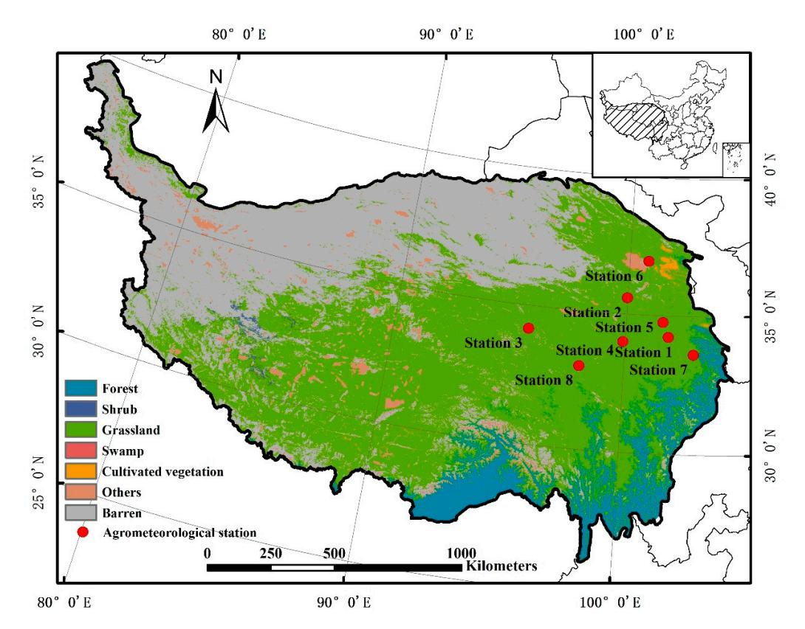

**Figure 1.** Study area and the agrometeorological stations. The land cover types are from MODIS Land Cover Product (MCD12Q1) in 2011.

Remote Sens. 2020, 12, 3383 4 of 26

#### 2.2. Ground Observation Data

The grassland phenology records for the QTP were collected from the nationwide phenological observation network established by the China Meteorological Administration, and the dataset involves observations from eight agrometeorological stations. We excluded data that are not herbal, and the final dataset includes seven phenological metrics (Green-up date, Tillering data, Heading date, Florescence, Senescence) for nine herbaceous plants (*Elymus nutans* Griseb., *Poa pratensis*, Stipa krylovii Roshev, *Leymus secalinus* (Georgi) Tzvel., *Agropyron cristatum*, *Festuca*, *Kobresia humilis* (C. A. Mey ex Trauvt.) Sergievskaya, *Astragalus adsurgen*, *Artemisia scoparia*). We used the green-up date to represent the SOS date, and if a station recorded more than 1 herbal species then the averaged SOS was used. The spatial distribution of these eight stations is shown in Figure 1.

## 2.3. Remote Sensing Data and Processing

In this study, we used MODerate resolution Imaging Spectroradiometer (MODIS) Vegetation Indices product (MOD13Q1) version 6 during 2001–2011 for remote sensing-based SOS extraction, MOD13Q1 provides composited vegetation index (NDVI and enhanced vegetation index) time-series data at a 16-day interval and 250 m resolution, and we used the NDVI data for its wide-usage for SOS extraction [46–48] and for that most time-series smoothing methods are proposed based on NDVI data [35,36,49]. MODIS Land Cover Type product (MCD12Q1) version 6 was used for the extraction of grassland pixels, and the 500 m land cover data was resampled into 250 m resolution using nearest neighboring to consist with the NDVI data.

We used the grassland NDVI pixels within the 10 km  $\times$  10 km (43 pixel  $\times$  43 pixel at 250 m resolution) spatial range around each agrometeorological station to represent the grassland for the agrometeorological stations. Firstly, MOD13Q1 and MCD12Q1 data within the 10 km  $\times$  10 km window for each station were downloaded from the MODIS/VIIRS Global Subsets (https://modis.ornl.gov/cgi-bin/MODIS/global/subset.pl). Secondly, the MOD13Q1 NDVI time-series data within the 10 km  $\times$  10 km window for each station were smoothed, and the SOS for each pixel were extracted. Finally, the grassland pixels in the window were identified according to MCD12Q1 land cover data, and the averaged SOS of the grassland pixels in the window is used as the final SOS extracted using remote sensing data of the corresponding station.

# 3. Methodology

# 3.1. The Time-Series Smoothing Methods

We chose six popular smoothing methods for the comparison based on previous studies [25,30–32,50,51], including one empirical method (Changing-weight (CW)), four curve fitting methods (Savitzky-Golay (SG), Asymmetric Gaussian (AG) and Double-logistic (DL) and Whittaker Smoother (WS)) and one data transformation methods (Harmonic Analysis of NDVI Time-Series (HANTS)). Although the parameters of smoothing methods varied for different applications, since there is no similar work, we test the accuracy of default values (derived from the original or high citation papers) of each method. The details for each smoothing method and default values are shown in Table 1.

## 3.2. The Phenology Extraction Methods

We used two widely-adopted vegetation phenology extraction methods for grassland phenology extraction, one is the vegetation index ratio threshold method (also known as the dynamic threshold method), which has received a broad attention and application [23,55,56]; the other phenology extraction method is the double-logistic method (also known as the Zhang method), which has been reported to have ecologically meaning [15] and also has been applied in many phenology extraction related works [18,57,58].

**Table 1.** Parameters of smoothing methods.

| Method | Category               | Parameter Meaning                                                   | Default Value | Range       | Step       | Platform | Reference | Default Value Reference |
|--------|------------------------|---------------------------------------------------------------------|------------------|-------------|------------|----------|-----------|----------------------------|
|        |                        | r:radius of sliding window                                          | 7                | [1, 7]      | 2          |          |           |                            |
| CW     | empirical              | fet: the threshold to determine the local maximum/minimum points | 0.05             | [0.01, 0.1] | 0.01       | IDL      | [34]      | [34]                       |
|        |                        | imax: the maximum iteration cycle                                   | 10               | [1, 20]     | 1          |          |           |                            |
|        |                        | <i>m</i> : the radius of smoothing window                           | 4                | [2, 11]     | 1          |          |           |                            |
| SG     | curve fitting          | m. the radius of shibothing whitow                                  | 6                | [2, 8]      | 1          | IDL      | [35]      | [35]                       |
|        |                        | d: the degree of the smoothing polynomial                           |                  |             |            |          |           |                            |
| AG     | curve fitting          | /                                                                   | /                | /           | /          | TIMESAT  | [52]      | /                          |
| DL     | curve fitting          | /                                                                   | /                | /           | /          | TIMESAT  | [52]      | /                          |
| MIC    | curve fitting          | $\lambda$ : the weight parameter set by the user                    | 15               | [1, 30]     | 1          | IDI      | [50]      | [22]                       |
| WS     | curve mung             | <i>d</i> : the order of the difference of sparse matrix             | 2                | [1, 10]     | ,10] 1 IDL |          | [53]      | [32]                       |
|        |                        | fet: the maximum fit error tolerance of the downward                |                  |             |            |          |           |                            |
| HANTS  | data transformation | deviation between the Fourier fit and NDVI original values          | 0.05             | [0, 0.6]    | 0.01       | IDL      | [36]      | [54]                       |
|        |                        | nf: the number of frequencies for the curve fitting                 | 4                | [2, 9]      | 1          |          |           |                            |

Remote Sens. 2020, 12, 3383 6 of 26

## 3.2.1. Dynamic Threshold Method

The dynamic threshold method was originally proposed by White et al. [59]. This method normalizes the NDVI time-series data of a single pixel to 0–1, and uses the percentage of NDVI to represent the vegetation growth status of the pixel range.

$$NDVI_{ratio} = \frac{NDVI_t - NDVI_{min}}{NDVI_{max} - NDVI_{min}} \tag{1}$$

where  $NDVI_t$  is the NDVI value of t-th year and  $NDVI_{max}$  is the maximum NDVI value of  $NDVI_t$ , while the  $NDVI_{min}$  is the minimum of the left half curve for SOS extraction. When  $NDVI_{ratio}$  exceeds a certain threshold, the corresponding day of year (DOY) is determined as the SOS.

Different thresholds represent different phenology phases. The thresholds chosen by previous studies are mostly 20% and 50% [21,26]. In this paper, we used thresholds ranging from 10% to 50% with a 5% increment, and there are 9 thresholds in total.

# 3.2.2. Double-Logistic Method

Double-logistic method is proposed by Zhang et al. [15], and hence the method is also called the Zhang method. In this method, the logistic curve is used to simulate the vegetation growth curve by piecewise fitting. After simulating the vegetation growth using the logistic model, the curvature change rate of the fitted logistic model is used to determine the vegetation phenology. The model's rate of change of curvature (*RCC*) is:

$$RCC = b^{3}cz \times 3z(1-z)(1+z)^{3} \frac{2(1+z)^{3} + b^{2}c^{2}z}{\left[(1+z)^{4} + (bcz)^{2}\right]^{2.5}} -b^{3}cz \times (1+z)^{2} \frac{1+2z+5z^{2}}{\left[(1+z)^{4} + (bcz)^{2}\right]^{1.5}}$$
(2)

where z = ea + bz, a and b are the fitting parameters, d is the initial background VI value, and c + d is the maximum VI value. SOS is the date in which the first local maximum of the curvature change rate of the model.

# 3.3. The Evaluation of the Phenology Extraction Accuracy

We evaluated the accuracy of the phenology extraction by comparing the satellite-derived SOS against the ground observed SOS. A simple linear regression was conducted where the ground observed SOS was used as the independent variable and the satellite-derived SOS was used as the predictor. The coefficient of determination ( $R^2$ ) and the root mean square error (RMSE) of the linear regression were calculated to represent the trend similarity and the numerical closeness between the satellite-derived SOS and the ground observed SOS, respectively. Moreover, we defined a metric "fitness" to comprehensively measure the accuracy of the phenology extraction by combining  $R^2$  and RMSE, which is calculated using the following equation:

$$fitness = \frac{RMSE}{R^2} \tag{3}$$

A lower fitness illustrates a smaller phenology extraction error, or a higher phenology extraction accuracy. Based on the temporal interval of MOD13Q1 (16 days), a fitness equal or less than 64 (corresponding to  $R^2 \ge 0.25$  [60] and  $RMSE \le 16$  [21]) is defined as a good result.

# 3.4. Sensitivity Analysis of the Smoothing Parameters

Different parameter values directly affect the smoothing performance and the final SOS extraction accuracy. In this study, we used the grid search method to test the SOS extraction accuracy under different smoothing parameters. Each parameter set for different smoothing methods was tested at a

Remote Sens. 2020, 12, 3383 7 of 26

stepwise according to the parameter ranges and steps in Table 1, and the SOS was extracted based on the corresponding parameter combination, and a fitness was used as the measure of the SOS extraction accuracy. The grid search was conducted for the 4 parameterized smoothing methods (CW, SG, WS and HANTS) combined with the two types of phenology extraction method (9 thresholds of DT and the Zhang method). For each phenology extraction method, the smoothing methods with the parameter sets that achieved the lowest fitness were chosen as the optimal smoothing methods, and the four optimal methods are abbreviated as O-CW, O-SG, O-WS, and O-HANTS.

To further quantify the contribution of each smoothing parameter to the SOS extraction accuracy, a standardized multi-linear regression was conducted by taking the value of different smoothing parameters as independent variables and the fitness as the dependent variable. The contribution of each parameter to the SOS extraction accuracy was characterized with the absolute value of the corresponding coefficient.

# 3.5. Statistical Significance Test of the Results

In order to investigate whether the value of SOS extracted by different smoothing methods for the same extraction method is significantly different, and whether the accuracy of the same smoothing method for different extraction methods is significantly different, we performed a two-way ANOVA analysis and least significant difference (LSD) post hoc multiple comparisons using the smoothing method and extraction method as the factors, and SOS as the dependent.

#### 4. Results

# 4.1. Performance of the Time-Series Smoothing Results

The main differences among smoothing methods are mainly reflected in the smoothing performance towards the low value, the ability of keeping the maximum value of the curve and the shape of the fitted curve. For default parameters of the smoothing methods (including AG and DL), the smoothing methods managed to eliminate most of the noise in the raw NDVI curves, but different smoothing methods resulted in smoothed curves with varied maximum and minimum values. In all the smoothing methods, SG always managed to maintain the annual maximum value, while the annual maximum value of WS is significantly smaller than that of the other methods (Figure 2a). As for the minimum values, HANTS with the default parameters has the smoothest effect (Figure 2a), with the highest minimum values (average minimum NDVI = 0.21) among all the smoothing methods. Generally, the tendency variation (evaluated using the mean value of the standard deviation (SD) among different smoothing methods for the standardized maximum/minimum values of the 8 stations during the 11 years) among the smoothed curves are the greatest for the annual minimum values (average SD = 0.06) (Figure 2a).

To further present the performance of different smoothing methods under different noise conditions, we manually picked three typical cases according to the quality assessment (QA) band of the NDVI data. The three cases represent conditions with almost no noise (station 1 in the year 2001), discontinuous noise (station 4 in the year 2002), and continuous noise (station 5 in the year 2011) (for the results of the smoothed curves at all stations during 2001–2011 see Figures A1 and A2). Overall, the smoothing methods result in smoothed curved with similar shapes and trends under the condition with almost no noise. However, as the noise increases, the shapes of the curves smoothed by different methods starts to differ, and the curves smoothed by WS has the greatest difference compared with other methods, especially in the first half of the curve, with lower starting values and larger slopes before DOY 150. It can be easily observed that HANTS is sensitive to small fluctuations in the curve during the smoothing process, resulting in the presence of multiple peaks in the NDVI curve. Such peaks usually appear at the beginning of the NDVI curve, but the heights of these peaks are relatively low (Figure 3a,c). For the case with continuous noise, most methods show good resistance against the

Remote Sens. 2020, 12, 3383 8 of 26

continuous noise, but NDVI curves smoothed by SG and CW show much lower value than the raw NDVI right after the appearance of the continuous noise (Figure 3c).

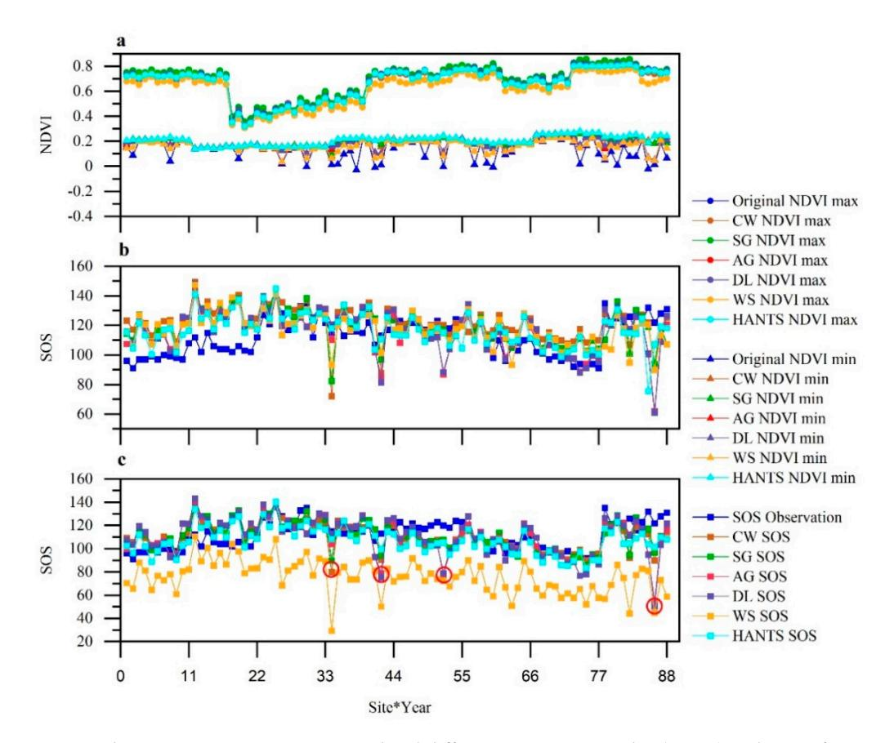

**Figure 2.** The maximum, minimum normalized difference vegetation index (NDVI) and start of season (SOS) under the default parameters for different stations from 2001 to 2011. The x-axis is the 11-year result of eight stations.  $x = 1 \sim 11$  represents the result of 11 years of station 1. (a) The maximum and minimum NDVI; (b) SOS extraction results of each smoothing method for the optimal threshold DT; (c) SOS extraction results of each smoothing method for Zhang.

As for the optimal parameters, the data range of the parameters is similar for the DT and Zhang method (Tables 2 and 3). Since we focus on the optimal parameter of the smoothing methods that achieve the highest accuracy, we only use the DT with the lowest fitness for each smoothing method from the 9 DTs for further analysis. It can be found that although the tendency variation of the minimum values among the 4 smoothing methods (AG and DL excluded) (average SD = 0.18 for DT and 0.16 for Zhang method) are still much greater than that of the maximum values (average SD = 0.04 for DT and 0.03 for Zhang method) after adopting the optimal parameters, the tendency variation of the minimum values decreases substantially compared with that with the default parameters (decrease by 51.4% for DT and 56.76% for Zhang method), and there are much fewer points with extremely low values and fewer fluctuations of the minimum values in the smoothed curves (Figures 2a and 4a,b). O-HANTS have the smoothest effects for low values in the raw NDVI curve, resulting in an annual minimum NDVI value (0.23) higher than that of other methods.

| Table 2. Comparison of default parameter and optimal parameter results of each smoothing metho | d |
|------------------------------------------------------------------------------------------------|---|
| for best threshold of Dynamic Threshold (DT).                                                  |   |

| Smoothing |       | Before C           | Optimiz | ation | After Optimization |       |                    |      |      |    |
|-----------|-------|--------------------|---------|-------|--------------------|-------|--------------------|------|------|----|
| Method    | RMSE  | R 2 (%) | p1      | p2    | р3                 | RMSE  | R 2 (%) | p1   | p2   | р3 |
| CW        | 17.54 | 11.21              | 7       | 0.05  | 10                 | 17.53 | 11.45              | 3    | 0.02 | 1  |
| SG        | 15.53 | 12.95              | 4       | 6     |                    | 13.91 | 12.83              | 7    | 2    |    |
| WS        | 15.40 | 5.77               | 15      | 2     |                    | 11.58 | 24.90              | 1    | 1    |    |
| HANTS     | 13.74 | 16.29              | 0.05    | 4     |                    | 13.41 | 27.87              | 0.01 | 3    |    |

**Table 3.** Comparison of default parameter and optimal parameter results of each smoothing method for Zhang method.

| Smoothing |       | Before C           | )ptimiz | ation |    | After Optimization |                    |      |      |    |  |
|-----------|-------|--------------------|---------|-------|----|--------------------|--------------------|------|------|----|--|
| Method    | RMSE  | R 2 (%) | p1      | p2    | р3 | RMSE               | R 2 (%) | p1   | p2   | р3 |  |
| CW        | 12.20 | 22.77              | 7       | 0.05  | 10 | 12.13              | 24.63              | 1    | 0.09 | 1  |  |
| SG        | 12.34 | 26.77              | 4       | 6     |    | 12.22              | 26.89              | 9    | 8    |    |  |
| WS        | 39.42 | 6.51               | 15      | 2     |    | 11.61              | 30.20              | 1    | 3    |    |  |
| HANTS     | 11.76 | 33.55              | 0.05    | 4     |    | 11.52              | 34.36              | 0.06 | 4    |    |  |

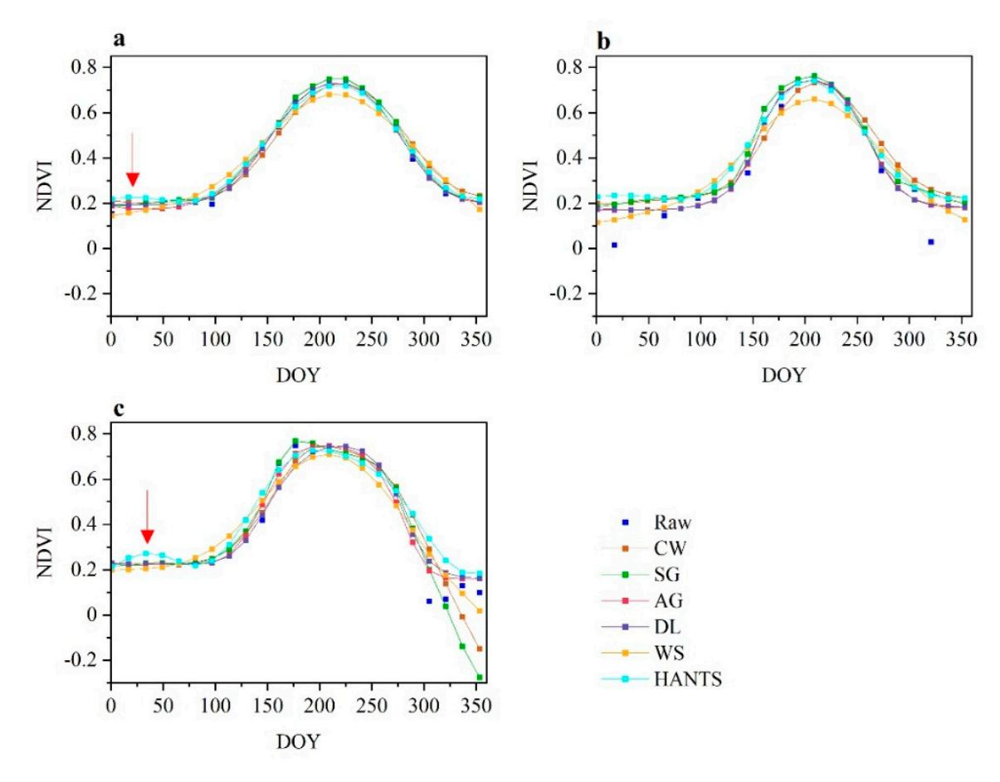

**Figure 3.** NDVI curve of each smoothing method with default parameters (**a**) station1 2001 (**b**) station4 2002 (**c**) station5 2011.

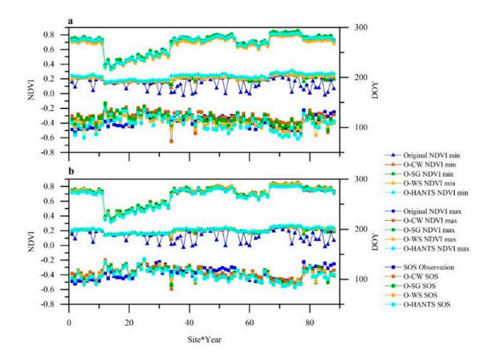

**Figure 4.** The maximum, minimum NDVI and SOS under the optimal parameters for different stations from 2001 to 2011. The x-axis is the 11-year result of eight stations.  $x = 1 \sim 11$  represents the result of 11 years of station 1. (a) The maximum, minimum NDVI and SOS extraction results of each smoothing method for the optimal threshold DT (b) The maximum, minimum NDVI and SOS extraction results of each smoothing method for Zhang.

# 4.2. Inter-Comparison of SOS Extraction Using Different Smoothing Methods

The default parameters of all the smoothing methods result in an overestimation of SOS regarding DT in station 1, 2 and 7, which is especially severe for station 1 and 2, with an overestimation of SOS of ~20 days (Figure 2b). However, for Zhang method, almost all the smoothing methods with the default parameter result in prediction of SOS close to the observation level except for WS, which shows a pervasive underestimation of SOS of  $35.79 \pm 16.51$  for all the stations and years (Figure 2c). It is interesting to note that there are four points (marked with red circles in Figure 2b,c) with large underestimation (up to ~80 days) of SOS for both DT and Zhang SOS extraction methods, and most of the smoothing methods show this underestimation with varying degrees, in which AG and DL have the greatest underestimations. As for the SOS extraction accuracy, most of the smoothing methods achieve a RMSE less than 16 days for both DT and Zhang methods (Tables 2 and 3), which is acceptable according to the temporal interval of the NDVI data [21], but WS with default parameters results in a RMSE that is even larger than 2 times the temporal interval of the NDVI data (Table 3). It is worth noting that even with the default parameters, all the smoothing methods have different performances for different SOS extraction methods, and for most of the smoothing methods, the fitness for Zhang is significantly lower than that for DT, with an average fitness 75.36 lower for Zhang compared with that for DT. For the two phenology extraction methods, the smoothing methods that lead to the highest (HANTS) and lowest (WS) accuracy are the same, in which WS has much greater RMSE for Zhang method, while the  $R^2$  of HANTS SOS almost doubled for Zhang method compared with DT.

The optimal parameters improve the SOS extraction accuracies for all the smoothing methods compared with the default parameters, and the fitness decrease from 84.38-266.68 to 46.51-153.36 for DT and from 35.05-605.82 to 33.52-49.26 for Zhang after adopting the optimal parameters (Tables 2 and 3), and the average fitness of the four optimal smoothing methods for DT and Zhang are 89.04 (decreased by 43.24% compared with the default parameters) and 41.68 (decreased by 77.49% compared with the default parameters), respectively. WS has the greatest improvement in SOS extraction accuracy for both DT and Zhang after adopting the optimal parameters, with a *RMSE* decrease and  $R^2$  increase of 27.81 (3.82) and 24% (19%) for Zhang (DT), respectively. Moreover, the underestimation of SOS of WS for Zhang method has been significantly improved after using the optimal parameters (Figures 2c and 4b).

For the DT methods with nine thresholds for SOS extraction, O-CW, AG and DL result in similar fitness that are above 150, while the fitness for O-SG are generally lower than the 3 methods, but the values are still all over 100 (Figure 5). On the contrary, O-WS and O-HANTS has much smaller fitness compared with the other 4 smoothing methods for the 9 DTs, with an average fitness value less than 90 for the 9 DTs (Table A1). The low fitness of O-HANTS and O-WS can be attributed to both higher  $R^2$  and smaller RMSE compared with other smoothing methods (average  $R^2$  and RMSE are 0.23 (0.23) and 13.75 (19.30) for O-WS (O-HANTS)). However, O-HANTS has higher  $R^2$  compared with O-WS for the best threshold, while O-WS shows small RMSE (RMSE < 12) with a wide range of thresholds (15%-40%), leading to a close fitness for these thresholds. The best thresholds of DT for grassland SOS ranges from 15–25% for different smoothing methods (Figure 5 and Table A1), in which 15% (averaged fitness is 103.50 for all smoothing methods) and 20% (average fitness is 103.86 for all smoothing methods) are the two thresholds with the lowest fitness. For all smoothing methods, the fitness gradually increases as the DT extraction threshold increases and decreases relative to their corresponding best thresholds, showing a typical 'U' shape (Figure 5). However, the fitness variations among different thresholds for O-WS are the smallest (SD = 17.25), and the smaller fitness variation compared with other smoothing methods correspond well with the smaller  $R^2$  and RMSE variation. As for the Zhang method for SOS extraction, the fitness for all smoothing methods are significantly lower than DTs, and the average fitness for Zhang (64.43) is 40.07 lower than that for the best threshold of DT (Figure 5 and Table A1), with both reduced RMSE and increased R2 (Figure 6). Moreover, the four smoothing methods with the optimal parameters all achieve a fitness below 50 ( $R^2 > 0.25$  and RMSE < 12.5) (Figure 6 and Table A1). Compared with the best DT, the SOS extracted by Zhang are closer and more consistent with the observed SOS and less overestimation or underestimation can be found (Figure 6), illustrating a more stable and accurate SOS extracted by Zhang compared with DT. O-HANTS and O-WS are the two methods with the lowest fitness for Zhang, and AG and DL are the two methods with the highest fitness. Taking all the SOS extraction methods (9 DTs and Zhang method) into account, O-HANTS has the lowest fitness of 33.52, followed by O-WS, which is 4.93 higher than that of O-HANTS (Table A1).

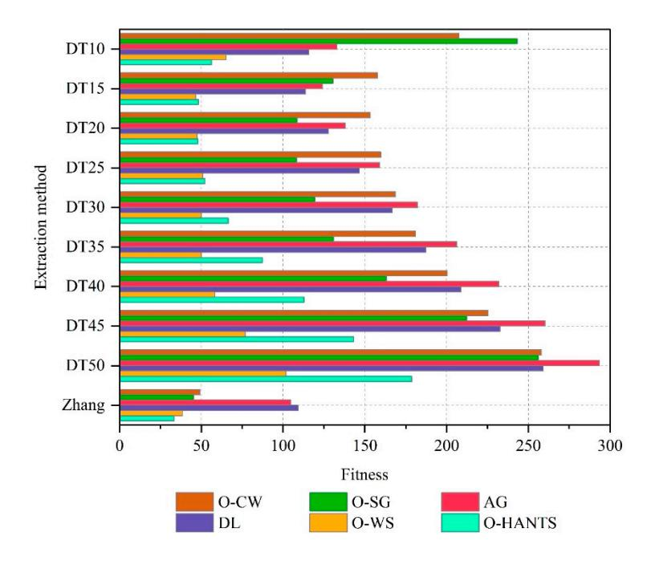

Figure 5. Fitness for different smoothing methods and extraction methods.

Remote Sens. 2020, 12, 3383 12 of 26

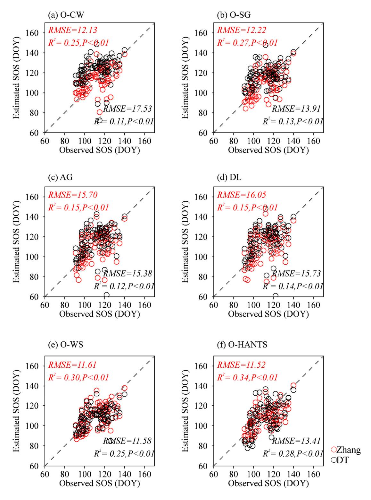

**Figure 6.** Scatter plots of SOS and observed SOS of different smoothing methods for DT and Zhang method. (a) Optimized Changing-weight (O-CW) (b) Optimized Savitzky-Golay (O-SG) (c) Asymmetric Gaussian (AG) (d) Double-logistic (DL) (e) Optimized Whittaker Smoother (O-WS) (f) Optimized Harmonic Analysis of NDVI Time-Series (O-HANTS).

Figure 7 shows the difference between the SOS results of the different smoothing methods and the extraction methods. Statistically significant differences are found for all the smoothing methods except for AG and DL, and SG and HANTS. However, there are statistically significant differences for different

extraction methods. Interestingly, the results of F-test of analysis of variance show that the interaction between the smoothing method and the extraction method is extremely significant (p = 0.000).

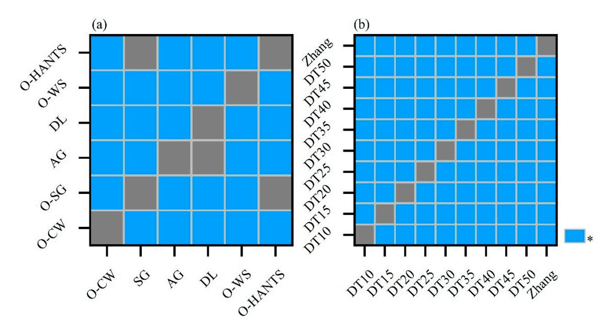

**Figure 7.** ANOVA analysis of (**a**) smoothing methods and (**b**) extraction methods. The blue grid means statistical significantly different (at the p = 0.01 level).

## 4.3. Parameter Sensitivity of Different Smoothing Methods

The fitness achieved by different smoothing parameters of different smoothing methods for DT and Zhang SOS extraction methods are presented in Figures 8 and 9. We only present the DT results with the best thresholds, and for each smoothing methods the threshold achieving the lowest fitness is used. On general, the changing trends of fitness for different parameters of the smoothing methods are very similar for DT and Zhang methods (Figures 8 and 9), but Zhang has lower fitness with 94.81% of the parameter values compared with DT, resulting in the average fitness of Zhang is 5609.66 lower than DT. As for DT, the fitness of CW and SG with different parameters are all over 100 (equal to the situation with RMSE = 16 and  $R^2 = 0.16$  (R = 0.4)), and although HANTS and WS can achieve fitness below 100 or even below 50 with the right parameterization, the proportion of such parameters are less than 30% for HANTS and 8% for WS of all parameters (Figure 8). On the contrary, most of the smoothing methods (except for WS) can result in a fitness less than 100 for Zhang with most of the parameter values, especially for CW, the fitness for all parameter values for which are less than 60 (Figure 9). No matter for DT or Zhang methods, the fitness variation of CW and SG with different parameters are much smaller than HANTS and WS, where the fitness SD for CW is 6.15 and 1.38 for DT and Zhang, respectively, which is the smallest among all methods. Oppositely, HANTS has the largest fitness range, with a fitness SD of 3142.98 for DT and 6697.88 for Zhang method, followed by WS with a fitness SD of 3126.62 and 208.71 for DT and Zhang method, respectively.

Remote Sens. 2020, 12, 3383 14 of 26

Although the parameters have different effects for different phenology extraction methods (Figures 8–10), they show some regular patterns in common. As for CW, different parameter values show small fitness variation for both DT and Zhang, and a lower fitness can be achieve with larger r and smaller fet (Figure 8), which also correspond well with the fact that r and fet are the two dominant factors for SOS extraction accuracy, and r has the most dominant impact for most cases (Figure 9). The two parameters (*m* and *d*) of SG have roughly the same contribution (45.48% from m vs. 54.52% from d on average) for the fitness value of SOS extraction (Figure 10b), and a lower fitness appears in the regions with lower *m* and larger *d* (Figures 8 and 9). WS and HANTS can have lower fitness compared with CW and SG, but only within a narrow parameter range (Figures 8 and 9). Furthermore, the parameter ranges of HANTS and WS that can result in high SOS extraction accuracy are very close for DT and Zhang method. Regarding WS, a low fitness can be achieved with parameter d set to 3 for DT or parameter d set to 3 or 4 for Zhang method, and generally as parameter  $\lambda$  decreases the fitness decrease. It is surprising to find that the WS parameter contribution to the fitness varies much for different thresholds of DT, and as the threshold increases the contribution of parameter d increases (from 15.75 to 94.81) (Figure 10c). In terms of HANTS, a nf set to 3 or 4 can lead to lower fitness, and a lower fet can bring lower fitness (Figures 8 and 9). It should be noticed that when nf is set to 2, the fitness increases dramatically for both DT and Zhang (increases by 49 times for DT and 529 times for Zhang method), suggesting that nf = 2 is a bad option for vegetation growth smoothing.

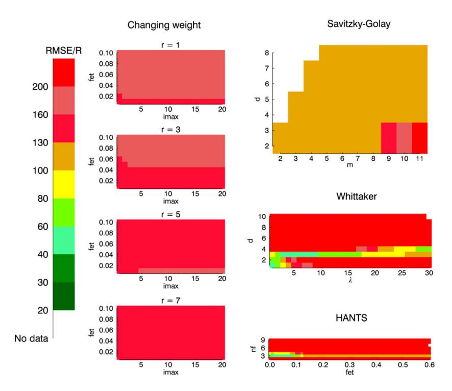

Figure 8. SOS extraction accuracy with various parameters (best threshold DT).

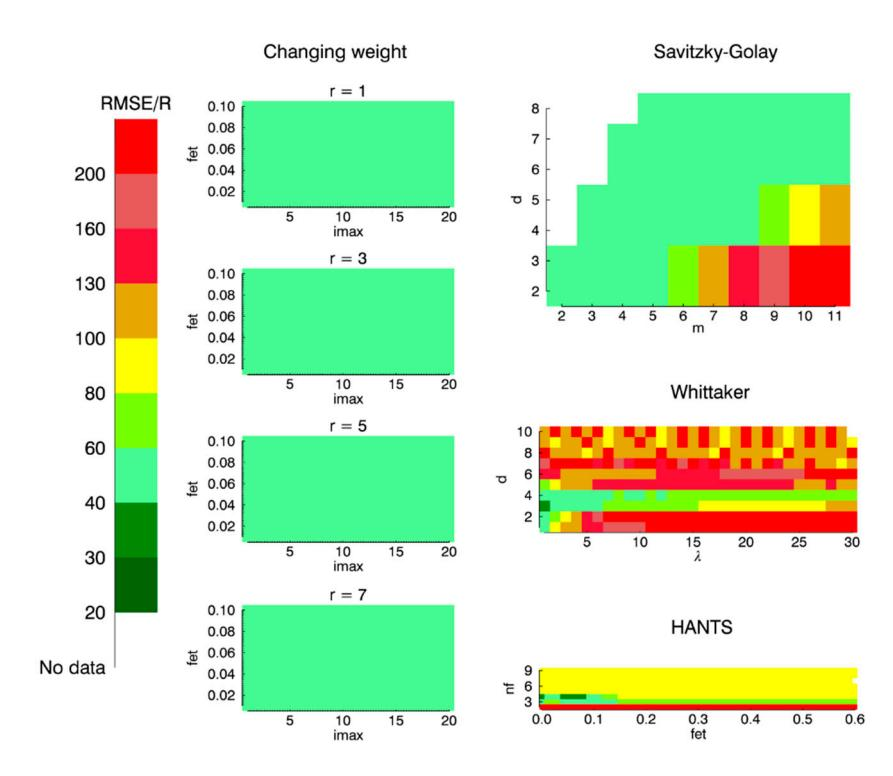

Figure 9. SOS extraction accuracy with various parameters (Zhang).

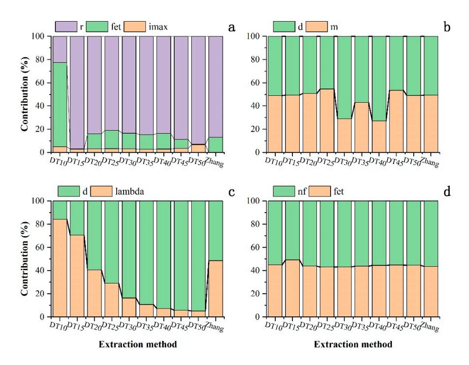

**Figure 10.** Smoothing method parameter contribution rate (a) Changing-weight (CW) (b) Savitzky-Golay (SG) (c) Whittaker Smoother (WS) (d) Harmonic Analysis of NDVI Time-Series (HANTS).

Remote Sens. 2020, 12, 3383 16 of 26

#### 5. Discussion

## 5.1. The Impact of the Choice of Smoothing Methods on the Accuracy of SOS Extraction

In this paper, it was found that for a certain SOS extraction method, different choices of smoothing methods can lead to large differences in phenology extraction accuracy, which is consistent with the conclusion of Atkinson et al. [32] that is based on four smoothing methods for the phenology extraction of the major vegetation types in India. This phenomenon also emphasizes that different combinations of phenology extraction methods and smoothing methods will lead to different accuracies of phenology extraction, but previous phenology extraction researches applied the ensemble mean of several methods as the main conclusion, and the individual method as the complementary analysis [61,62], which barely consider the impact of the interaction of phenology extraction methods and smoothing methods. We found that the values of smoothing parameters have a great impact on the phenology extraction results, which is similar to the results of Cai et al. [63] who found that smoothing methods can have different curve smoothing performances and curve shapes with different parameters, which can be explained that the valuing of the smoothing parameters affects the curve smoothness as well as the value ranges of the smoothed curves (Figures 2 and 4).

Our study showed that for most of the smoothing methods, the default parameters can bring acceptable SOS extraction results, while the default parameters for WS showed poor SOS extraction performance regarding both DT and Zhang methods, which may be because the default parameters of WS in Atkinson et al. [32] are set oriented for multiple vegetation types rather than for grassland. Besides, our results showed that WS can have high SOS extraction accuracy for a large range (10% to 45%) of the threshold of DT method (Figure 5) with specific parameter optimizations, although a high SOS extraction accuracy is preferable, a high accuracy achieved at an unsuitable threshold suggests that the shape of WS may be unstable and can change dramatically with different parameters, which can also be confirmed that the contributions of the WS parameters vary across different DT thresholds (Figure 10c). The findings in our study suggest that when using WS to extract vegetation phenology, careful attention should be paid to its parameters, and a parameter optimization may be required to achieve a satisfactory result. The two non-parameter smoothing method (AG and DL) have always resulted in lower SOS extraction accuracies than other methods, which is because AG and DL adopt Gaussian and Logistic function to fit the NDVI curve, and the fitted curves are susceptible to low-value noise, resulting in changing curve shape (Figure 11b-d) and leading to a lower SOS extraction fitness. HANTS was found to have the highest SOS extraction accuracy no matter with the optimal parameters or the default parameters, which is because HANTS can maintain the annual minimum (Figures 2a and 4a), and the slope of the curve around SOS is stable (Figure 3). The default parameter set and the optimal parameter sets for HANTS are very close (Table 2), suggest the default parameter set for HANTS is a good choice for grassland SOS extraction.

Previous studies evaluate the performances of smoothing methods mostly aiming at their denoising effect against the simulated noise [54,64]. However, by comparing different smoothing methods and their SOS extraction accuracy, we found that the performance of curve denoising does not definitely match the accuracy of SOS extraction. For example, the errors introduced by CW and SG during their preprocessing of the continuous noise destroy the correct shape of the curve and cause new noise in some cases, reducing the accuracy of DT-based SOS extraction (Figure 3c). On the other hand, the smoothing result of the O-WS introduces many extreme low values in the right half curve using the Zhang method (Figure A2), but the growth rate of the grassland is maintained well in the first half of the smoothed curves, leading to a high SOS extraction accuracy (Figure A2). Overall, based on our findings, the recommended smoothing method for grassland SOS extraction is HANTS, not only for its highest SOS extraction accuracies with both default and optimal parameters, but its stable performance for different SOS extraction methods as well. Although HANTS has the large variation of SOS extraction accuracy with different parameters, it is mainly due to the magnificent fitness values

Remote Sens. 2020, 12, 3383 17 of 26

when parameter nf is set to 2, and after excluding value 2 from the nf value range, the fitness variation of HANTS (SD = 64.00) drops dramatically to the CW and SG level.

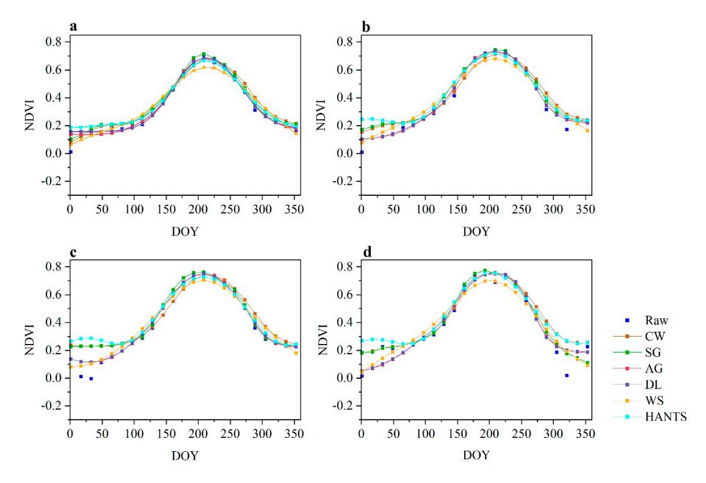

**Figure 11.** NDVI curve of each smoothing method under default parameters (**a**) station4 2001; (**b**) station4 2009; (**c**) station5 2008; (**d**) station8.

## 5.2. The Impact of Smoothing Method Parameters on the Accuracy of SOS Extraction

Different smoothing methods show different parameter sensitivities, and CW was found to have a lesser impact on parameters than the other methods. It can be explained that parameter r is the dominant parameter impacting the SOS extraction accuracy of CW (Figure 10a), and as the searching radius of the local maximum and minimum, parameter r is the important parameter of preserving original maximum and minimum. However, the variation of the minima in left half of the curve with different r is small for single growing season vegetation (e.g., grassland). Furthermore, the three-point weight strategy that CW adopts can preserve the whole shape of the original curve with different local minimum and maximum [34]. Therefore, no matter for DT and Zhang, the SD of O-CW with different parameters is far smaller than others. As for SG, our results are consistent with Chen et al.'s [35] findings that smaller value *m* and a larger *d* leading to a better smoothing time-series. Atkinson et al. [32] concluded that the use of a smaller parameter  $\lambda$  of WS will produce larger errors, a  $\lambda = 15$  is suitable for vegetation phenology extraction. However, in this paper, the SOS extraction accuracy with a  $\lambda = 15$  is much lower than with a smaller  $\lambda$  (e.g.,  $\lambda = 2$ ). It may be because that Atkinson et al. [32] carried out their study based on a variety of vegetation, and since the growth curves of different vegetation differ greatly [65], a smoother curve can to blur the differences among vegetation to obtain an overall high accuracy of SOS extraction. For the SOS extraction of grassland in our study, more accurate characterization may be required, and when the smoothed curves are too smooth, the under-fitted results may lead to errors. There are no objective rules for determining parameters for HANTS [36], and the *nf* is believed as a key parameter for HANTS [54]. Based on our findings, parameter nf of HANTS was recommended to set between 3–4, which is close to the optimizations of previous studies [36,54,66]. As parameter nf represents the number of frequencies of the Fourier components in HANTS [36], a large value *nf* makes HANTS easily affected by noise and Remote Sens. 2020, 12, 3383 18 of 26

prone to have multi-peaks in the smoothed curves. Besides, we found a large *nf* can result in a failure of smoothing under some of the condition with a large number of noise during the simulations, so a smaller *nf* is more preferable for vegetation indices time-series smoothing, especially at large scales.

Here, suggestions about the parameter optimizations of different smoothing methods for grassland SOS extraction are drawn based on our findings. As for CW, parameter setting has little impact on the SOS extraction accuracy, the default parameter setting is good enough to achieve an acceptable or good SOS extraction result. However, if a parameter optimization is required, parameter r is the key parameter that need to be taken into consideration first, followed by parameter fet. Generally, a smaller r and fet is recommended for grassland SOS extraction; the two parameters of SG have the same influence on SOS extraction, where parameter d is not suggested to be set to a too small value; for WS method, parameter d is recommended to set between 3 and 4, and a smaller  $\lambda$  can bring higher SOS extraction accuracy; Similar to WS, parameter nf of HANTS is suggested to set between 3 and 4 for a higher SOS extraction accuracy, and a smaller fet is also suggested.

## 5.3. The Impacting Factors on SOS Extraction Accuracies for Phenology Extraction Methods

In this study, the best threshold of DT for grassland SOS extraction was found to be between 15–25%, which is in line with the widely adopted 20% threshold in previous studies [21,26]. However, the best thresholds vary cross different smoothing methods, and even with the best threshold, the SOS extraction accuracy of DT is commonly lower than Zhang method. According to Sections 4.1 and 4.2, we attribute the varied thresholds and low accuracy of DT to the fact that the performance of DT is greatly affected by the fluctuations of the minimum value in the NDVI curves (Figures 2a and 4a). To solve this problem, Yu et al. [21] manually fixed the minimum value of NDVI, and the DT with a fixed minimum value (hereinafter referred to as DT-fix) was used for grassland SOS extraction. To further validate the effects of low-value noise on DT SOS extraction, we followed the concept of Yu et al. [21] to fix the NDVI minimum value, and to simplify the simulating process, the minimum NDVI value was fixed to 0.05 to represent a bare soil condition according to Hird and McDermid [67], and the result from DT-fix were compared with that from DT and Zhang methods. It is easy to find that DT-fix substantially improves SOS extraction accuracy from DT, with both reduced RMSE (decreased by 3.13 for default parameter and 2.44 for optimal parameter on average) and increased  $R^2$  (increased by 12.97 for default parameter and 11.79 for optimal parameter on average) (Tables 2 and 4), resulting in 49.72% and 23.70% fitness reduction for default parameters and optimal parameters, respectively. Moreover, for the most cases, DT-fix has even achieved a lower fitness (higher SOS extraction accuracy) compared with Zhang method for both default parameters and optimal parameters, with a fitness 71.65% and 7.54% lower on average (Tables 3–5). The best thresholds of DT-fix for different smoothing methods are all 35%, and the higher threshold compared with 20% may be due to that 0.05 is much lower than annual NDVI minimum of grassland on QTP. However, the uniform threshold highlighted that DT-fix indeed suffer less from the adverse effects from the fluctuations of NDVI minima. The DT-fix results showed that with the fixed NDVI minimum, the negative effects from NDVI minima fluctuations are mitigated to a great extent, and DT-fix has higher accuracy for SOS extraction compared with DT and Zhang methods.

**Table 4.** Comparison of default parameter and optimal parameter results of each smoothing method for best threshold DT-fix.

| Smoothing |       | Before C           | Optimiza | ation | After Optimization |       |                    |      |      |    |
|-----------|-------|--------------------|----------|-------|--------------------|-------|--------------------|------|------|----|
| Method    | RMSE  | R 2 (%) | p1       | p2    | р3                 | RMSE  | R 2 (%) | p1   | p2   | р3 |
| cw        | 12.06 | 24.54              | 7        | 0.05  | 10                 | 12.02 | 25.22              | 3    | 0.04 | 1  |
| sg        | 12.67 | 29.23              | 4        | 6     |                    | 12.25 | 29.58              | 7    | 6    |    |
| ws        | 10.64 | 31.04              | 15       | 2     |                    | 10.56 | 37.03              | 6    | 3    |    |
| hants     | 12.96 | 27.05              | 0.05     | 4     |                    | 11.31 | 37.80              | 0.36 | 3    |    |

|           | O-CW    | O-SG   | AG     | DL     | O-WS   | O-HANTS | Mean   | SD     |
|-----------|---------|--------|--------|--------|--------|---------|--------|--------|
| DT-fix 10 | 1149.55 | 262.28 | 279.80 | 340.70 | 143.06 | 117.58  | 382.16 | 351.81 |
| DT-fix 15 | 993.49  | 260.06 | 249.89 | 293.73 | 145.82 | 117.18  | 343.36 | 297.48 |
| DT-fix20  | 756.71  | 274.98 | 191.61 | 219.83 | 138.31 | 115.03  | 282.74 | 218.31 |
| DT-fix25  | 494.03  | 285.51 | 102.39 | 115.69 | 101.27 | 92.19   | 198.51 | 148.19 |
| DT-fix30  | 116.22  | 75.77  | 59.01  | 62.85  | 50.15  | 48.86   | 68.81  | 23.00  |
| DT-fix35  | 47.67   | 41.39  | 52.14  | 54.55  | 35.17  | 29.91   | 43.47  | 8.88   |
| DT-fix40  | 59.32   | 51.01  | 62.25  | 62.72  | 42.29  | 33.63   | 51.87  | 10.85  |
| DT-fix45  | 81.26   | 61.91  | 78.30  | 77.08  | 56.04  | 40.41   | 65.83  | 14.59  |
| DT-fix50  | 107.54  | 74.26  | 100.50 | 97.63  | 73.07  | 55.74   | 84.79  | 18.36  |
| Zhang     | 49.26   | 45.46  | 104.75 | 109.15 | 38.45  | 33.52   | 63.43  | 31.20  |

143.39

98.33

82.36

43.33

68.41 35.74

**Table 5.** Fitness for different smoothing methods and extraction methods (The numbers in bold indicate the lowest fitness).

In our study, the Zhang method showed superior SOS extraction accuracies for grasslands compared with DT, which is consistent with a previous study that based on winter wheat [57]. This could be explained by the idea that the Zhang method is to fit the curve with the DL function and calculate the local maximum value of the curvature transformation rate of the fitted curve [15], so the shape of the first half of the curve, especially the shape of the first half curve around SOS, is the main factor affecting the extraction accuracy of SOS, while the fluctuations of NDVI minimum values have less impact on the Zhang method compared with DT [68], and the better performance of Zhang may be due to that the minimum of first half of the curve is more susceptible by noise than shape of the first half curve around SOS after smoothing in the most instances. This can also be confirmed by the curves of the four red-circled points in Figure 2c, and the NDVI curves smoothed by different smoothing methods of the 4 points are shown in Figure 11. In point 1, the curve shapes of CW and SG deviates farther from those of other methods (Figure 11a), while at the remaining three points (Figure 11b–d), similar deviations can be found for AG and DL, and these deviations of the curve shapes correspond well with the differences in the SOS extraction accuracies.

## 5.4. Applicability of Different Smoothing Methods

In this study, the grassland SOS extracted using different smoothing methods and different phenology extraction methods were compared, and the results can provide some guiding insights for the choice of smoothing methods and phenology extraction methods under different scenarios. Firstly, when there are no available observed data to optimize smoothing parameters, HANTS is the most recommended method due to its high SOS extraction accuracies for both DT and Zhang with the default parameters. Besides, CW and SG are also recommended because of their acceptable (for DT) and good (for Zhang) accuracies of SOS extraction and stable performance (less sensitive to parameter settings). AG, DL and WS with the default parameters is not suggested for grassland SOS extraction, mainly due to their low accuracies of SOS extraction. Secondly, if there are abundant phenology observations to optimize the smoothing parameters, HANTS and WS are more recommended due to their excellent for both DT and Zhang performance after adopting the optimal parameters.

As for the phenology extraction methods, the Zhang method has obvious advantages over DT, and is more suggested for grassland SOS extraction. However, DT can have a robust and accurate performance of SOS extraction by fixing the minimum value, with a SOS extraction accuracy even higher than the Zhang method. The threshold of DT-fix in suggestion for grassland SOS extraction is 35% based on our results.

# 6. Conclusions

Mean

SD

385.51

409.75

143.26

104.78

128.06

78.23

In this paper, based on MOD13Q1 NDVI time-series and observed SOS records of 8 agrometeorological stations, we compared six smoothing methods for grassland SOS extraction

Remote Sens. 2020, 12, 3383 20 of 26

on the Qinghai–Tibetan Plateau during 2001–2011. We found that the bad denoising performance is not in line with the low SOS extraction accuracy (e.g., O-WS achieved a low fitness for Zhang method even with extremely low values in the smoothed curve). Different smoothing methods show different parameter sensitivities, and the optimal parameters can improve the accuracy of SOS extraction. In addition, the optimal parameters are different for different extraction methods, the average fitness of the four optimal smoothing methods for DT and Zhang are decreased by 43.24% and 77.49% compared with the default parameters, respectively. For the 6 smoothing methods, HANTS has lowest fitness for Zhang (fitness = 33.52 with parameter optimization and fitness = 35.05 without parameter optimization) and the denoising ability of HANTS are all better than other methods. The phenology extraction method has a greater impact on accuracy than the smoothing method and the main influencing factor of DT and Zhang are the stability of the annual minimum and curve shape near SOS, respectively. Zhang is better and more stable than DT method for all smoothing methods. However, after setting the minimum value of the NDVI curve to eliminate the fluctuation error of the annual NDVI minimum value, with a suitable threshold, the DT-fix method has less difference in fitness for the default parameters or optimal parameters for all smoothing methods and can achieve better SOS extraction results than Zhang, with a fitness decreased by 71.65% for default parameters and 7.54% for optimal parameters on average.

**Author Contributions:** N.L. performed the experiments, analyzed the data; N.L. and P.Z. wrote the paper; Y.P., X.Z., M.L. and D.Z. revised the paper. All authors have read and agreed to the published version of the manuscript.

**Funding:** This research was funded by the National High Resolution Earth Observation System (The Civil Part) Technology Projects of China, grant number 11-Y20A16-9001-17/18.

**Acknowledgments:** The authors would like to acknowledge China Meteorological Administration for providing ground observed phenology data.

**Conflicts of Interest:** The authors declare no conflict of interest. The funders had no role in the design of the study; in the collection, analyses, or interpretation of data; in the writing of the manuscript, or in the decision to publish the results.

# Appendix A

**Table A1.** Fitness for different smoothing methods and extraction methods (The numbers in bold indicate the lowest fitness).

|       | O-CW   | O-SG   | AG     | DL     | O-WS   | O-HANTS | Mean   | SD    |
|-------|--------|--------|--------|--------|--------|---------|--------|-------|
| DT10  | 207.67 | 243.26 | 132.89 | 115.75 | 65.27  | 56.39   | 136.87 | 68.80 |
| DT15  | 157.77 | 130.56 | 124.15 | 113.63 | 46.51  | 48.38   | 103.50 | 41.82 |
| DT20  | 153.16 | 108.57 | 138.11 | 127.68 | 47.52  | 48.10   | 103.86 | 41.79 |
| DT25  | 159.73 | 108.38 | 159.07 | 146.66 | 50.83  | 52.19   | 112.81 | 46.59 |
| DT30  | 168.76 | 119.56 | 182.08 | 166.58 | 50.03  | 66.59   | 125.60 | 51.58 |
| DT35  | 181.11 | 130.91 | 206.26 | 187.26 | 50.09  | 87.39   | 140.50 | 56.64 |
| DT40  | 200.31 | 163.31 | 231.97 | 208.82 | 58.25  | 112.83  | 162.58 | 60.19 |
| DT45  | 225.27 | 212.53 | 260.24 | 232.62 | 76.95  | 143.30  | 191.82 | 62.51 |
| DT50  | 258.02 | 256.32 | 293.48 | 258.99 | 101.78 | 178.68  | 224.54 | 64.86 |
| Zhang | 49.26  | 45.46  | 104.75 | 109.15 | 38.45  | 33.52   | 63.43  | 31.20 |
| Mean  | 176.11 | 151.89 | 183.30 | 166.71 | 58.57  | 82.74   | 1      | /     |
| SD    | 52.92  | 63.32  | 59.83  | 50.70  | 17.68  | 45.27   | /      | /     |
|       |        |        |        |        |        |         |        |       |

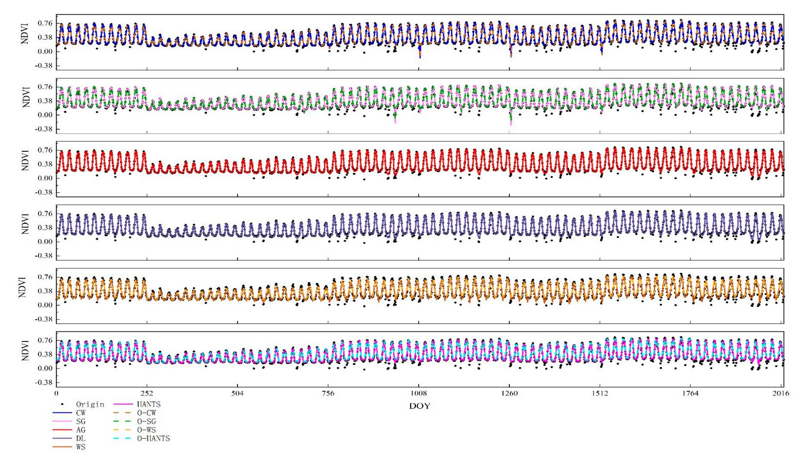

**Figure A1.** Smoothed results of each smoothing method for the optimal threshold DT for eight stations from 2001 to 2011. The *x*-axis is the 11-year result of 8 stations.  $x = 1 \sim 23$  represents the result of station 1 in the year 2001.

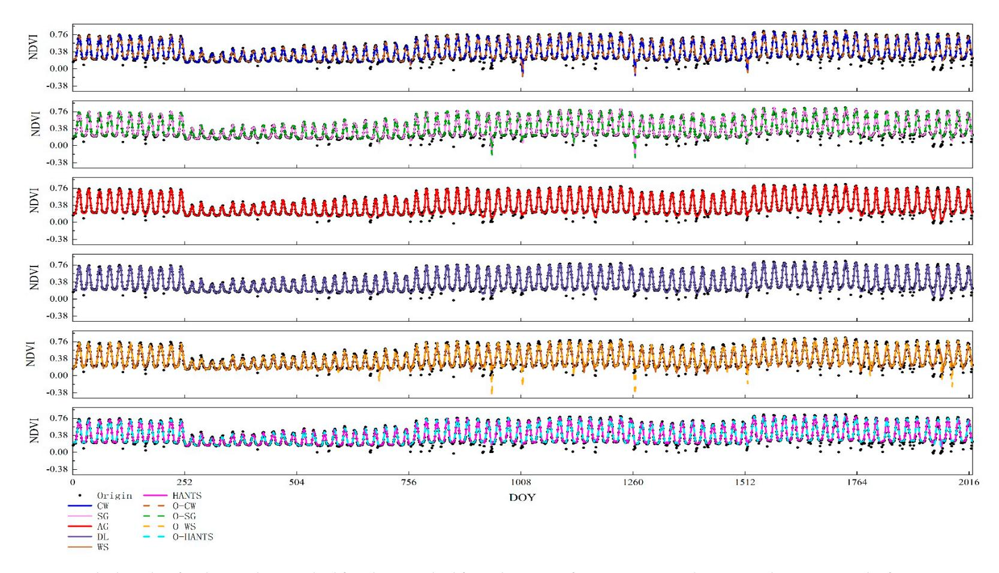

**Figure A2.** Smoothed results of each smoothing method for Zhang method for eight stations from 2001 to 2011. The x-axis is the 11-year result of 8 stations.  $x = 1 \sim 23$  represents the result of station 1 in the year 2001.

Remote Sens. 2020, 12, 3383 23 of 26

#### References

1. Stocker, T.F.; Qin, D.; Plattner, G.K.; Tignor, M.; Allen, S.K.; Boschung, J.; Nauels, A.; Xia, Y.; Bex, B.; Midgley, P.M. Ipcc, 2013: Summary for policymakers. In *Climate Change 2013: The Physical Science Basis. Contribution of Working Group i to the Fifth Assessment Report of the Intergovernmental Panel on Climate Change;* Cambridge University Press: Cambridge, UK; New York, NY, USA, 2013.

- 2. Tylianakis, J.M.; Didham, R.K.; Bascompte, J.; Wardle, D.A. Global change and species interactions in terrestrial ecosystems. *Ecol. Lett.* **2008**, *11*, 1351–1363. [CrossRef]
- 3. Badeck, F.W.; Bondeau, A.; Böttcher, K.; Doktor, D.; Lucht, W.; Schaber, J.; Sitch, S. Responses of spring phenology to climate change. *New Phytol.* **2004**, *162*, 295–309. [CrossRef]
- 4. Menzel, A.; Fabian, P. Growing season extended in Europe. Nature 1999, 397, 659. [CrossRef]
- 5. Yang, B.; He, M.; Shishov, V.; Tychkov, I.; Vaganov, E.; Rossi, S.; Ljungqvist, F.C.; Bräuning, A.; Grießinger, J. New perspective on spring vegetation phenology and global climate change based on tibetan plateau tree-ring data. *Proc. Natl. Acad. Sci. USA* **2017**, *114*, 6966–6971. [CrossRef] [PubMed]
- 6. Piao, S.; Friedlingstein, P.; Ciais, P.; Viovy, N.; Demarty, J. Growing season extension and its impact on terrestrial carbon cycle in the northern hemisphere over the past 2 decades. *Glob. Biogeochem. Cycles* **2007**, 21. [CrossRef]
- 7. Richardson, A.D.; Keenan, T.F.; Migliavacca, M.; Ryu, Y.; Sonnentag, O.; Toomey, M. Climate change, phenology, and phenological control of vegetation feedbacks to the climate system. *Agric. For. Meteorol.* **2013**, *169*, 156–173. [CrossRef]
- 8. Bonan, G.B. Forests and climate change: Forcings, feedbacks, and the climate benefits of forests. *Science* **2008**, 320, 1444–1449. [CrossRef]
- 9. Piao, S.; Fang, J.; Zhou, L.; Ciais, P.; Zhu, B. Variations in satellite-derived phenology in China's temperate vegetation. *Glob. Chang. Biol.* **2006**, *12*, 672–685. [CrossRef]
- 10. Rodriguez-Galiano, V.F.; Dash, J.; Atkinson, P.M. Intercomparison of satellite sensor land surface phenology and ground phenology in Europe. *Geophys. Res. Lett.* **2015**, *42*, 2253–2260. [CrossRef]
- 11. Richardson, A.D.; Hufkens, K.; Milliman, T.; Aubrecht, D.M.; Chen, M.; Gray, J.M.; Johnston, M.R.; Keenan, T.F.; Klosterman, S.T.; Kosmala, M.; et al. Tracking vegetation phenology across diverse North American biomes using phenocam imagery. *Sci. Data* **2018**, *5*, 180028. [CrossRef]
- 12. Vrieling, A.; Meroni, M.; Darvishzadeh, R.; Skidmore, A.K.; Wang, T.; Zurita-Milla, R.; Oosterbeek, K.; O'Connor, B.; Paganini, M. Vegetation phenology from sentinel-2 and field cameras for a Dutch barrier island. *Remote Sens. Environ.* **2018**, *215*, 517–529. [CrossRef]
- 13. Yang, W.; Kobayashi, H.; Wang, C.; Shen, M.; Chen, J.; Matsushit, B.; Tang, Y.; Kim, Y.; Bret-Harte, M.S.; Zona, D.; et al. A semi-analytical snow-free vegetation index for improving estimation of plant phenology in tundra and grassland ecosystems. *Remote Sens. Environ.* **2019**, 228, 31–44. [CrossRef]
- 14. Myneni, R.B.; Keeling, C.D.; Tucker, C.J.; Asrar, G.; Nemani, R.R. Increased plant growth in the northern high latitudes from 1981 to 1991. *Nature* **1997**, *386*, 698–702. [CrossRef]
- 15. Zhang, X.; Friedl, M.A.; Schaaf, C.B.; Strahler, A.H.; Hodges, J.C.F.; Gao, F.; Reed, B.C.; Huete, A. Monitoring vegetation phenology using MODIS. *Remote Sens. Environ.* **2003**, *84*, 471–475. [CrossRef]
- 16. Jeong, S.-J.; Ho, C.-H.; Gim, H.-J.; Brown, M.E. Phenology shifts at start vs. end of growing season in temperate vegetation over the Northern Hemisphere for the period 1982–2008. *Glob. Chang. Biol.* **2011**, 17, 2385–2399. [CrossRef]
- 17. Piao, S.; Wang, X.; Ciais, P.; Zhu, B.; Wang, T.; Liu, J. Changes in satellite-derived vegetation growth trend in temperate and boreal Eurasia from 1982 to 2006. *Glob. Chang. Biol.* **2011**, *17*, 3228–3239. [CrossRef]
- 18. Liu, Q.; Fu, Y.H.; Zhu, Z.; Liu, Y.; Liu, Z.; Huang, M.; Janssens, I.A.; Piao, S. Delayed autumn phenology in the Northern Hemisphere is related to change in both climate and spring phenology. *Glob. Chang. Biol.* **2016**, 22, 3702–3711. [CrossRef]
- 19. Stendardi, L.; Karlsen, S.R.; Niedrist, G.; Gerdol, R.; Zebisch, M.; Rossi, M.; Notarnicola, C. Exploiting time series of sentinel-1 and sentinel-2 imagery to detect meadow phenology in mountain regions. *Remote Sens.* **2019**, *11*, 542. [CrossRef]
- 20. Pan, Z.; Huang, J.; Zhou, Q.; Wang, L.; Cheng, Y.; Zhang, H.; Blackburn, G.A.; Yan, J.; Liu, J. Mapping crop phenology using ndvi time-series derived from hj-1 a/b data. *Int. J. Appl. Earth Obs. Geoinf.* **2015**, 34, 188–197. [CrossRef]

Remote Sens. 2020, 12, 3383 24 of 26

21. Yu, H.; Luedeling, E.; Xu, J. Winter and spring warming result in delayed spring phenology on the Tibetan plateau. *Proc. Natl. Acad. Sci. USA* **2010**, *107*, 22151–22156. [CrossRef] [PubMed]

- 22. Zhang, G.; Dong, J.; Zhang, Y.; Xiao, X. Reply to shen et al.: No evidence to show nongrowing season NDVI affects spring phenology trend in the tibetan plateau over the last decade. *Proc. Natl. Acad. Sci. USA* **2013**, 110, E2330–E2331. [CrossRef] [PubMed]
- 23. White, M.A.; de Beurs, K.M.; Didan, K.; Inouye, D.W.; Richardson, A.D.; Jensen, O.P.; O'Keefe, J.; Zhang, G.; Nemani, R.R.; van Leeuwen, W.J.D.; et al. Intercomparison, interpretation, and assessment of spring phenology in North America estimated from remote sensing for 1982–2006. *Glob. Chang. Biol.* **2009**, *15*, 2335–2359. [CrossRef]
- 24. Zhang, G.; Zhang, Y.; Dong, J.; Xiao, X. Green-up dates in the Tibetan plateau have continuously advanced from 1982 to 2011. *Proc. Natl. Acad. Sci. USA* **2013**, *110*, 4309–4314. [CrossRef] [PubMed]
- 25. Wang, H.; Dai, J.; Ge, Q. Comparison of satellite and ground-based phenology in China's temperate monsoon area. *Adv. Meteorol.* **2014**. [CrossRef]
- 26. White, K.; Pontius, J.; Schaberg, P. Remote sensing of spring phenology in northeastern forests: A comparison of methods, field metrics and sources of uncertainty. *Remote Sens. Environ.* **2014**, *148*, 97–107. [CrossRef]
- 27. Ma, Y.; Niu, X.; Liu, J. A comparison of different methods for studying vegetation phenology in Central Asia. In *Geo-Informatics in Resource Management and Sustainable Ecosystem*; Springer: Heidelberg/Berlin, Germany, 2016; pp. 301–307. [CrossRef]
- 28. Bao, G.; Bao, Y.; Alateng, T.; Bao, Y.; Qin, Z.; Wang, M.; Zhou, Y. Spatio-temporal dynamics of vegetation phenology in the Mongolian plateau during 1982~2011. *Remote Sens. Technol. Appl.* **2017**, 32, 866–874. [CrossRef]
- 29. Zeng, L.; Wardlow, B.D.; Xiang, D.; Hu, S.; Li, D. A review of vegetation phenological metrics extraction using time-series, multispectral satellite data. *Remote Sens. Environ.* **2020**, 237, 111511. [CrossRef]
- Kandasamy, S.; Baret, F.; Verger, A.; Neveux, P.; Weiss, M. A comparison of methods for smoothing and gap filling time series of remote sensing observations—Application to modis lai products. *Biogeosciences* 2013, 10, 4055–4071. [CrossRef]
- 31. Geng, L.Y.; Ma, M.G.; Wang, X.F.; Yu, W.P.; Jia, S.Z.; Wang, H.B. Comparison of eight techniques for reconstructing multi-satellite sensor time-series NDVI data sets in the Heihe river basin, China. *Remote Sens.* **2014**, *6*, 2024–2049. [CrossRef]
- 32. Atkinson, P.M.; Jeganathan, C.; Dash, J.; Atzberger, C. Inter-comparison of four models for smoothing satellite sensor time-series data to estimate vegetation phenology. *Remote Sens. Environ.* **2012**, *123*, 400–417. [CrossRef]
- 33. Lara, B.; Gandini, M. Assessing the performance of smoothing functions to estimate land surface phenology on temperate grassland. *Int. J. Remote Sens.* **2016**, 37, 1801–1813. [CrossRef]
- 34. Zhu, W.; Pan, Y.; He, H.; Wang, L.; Mou, M.; Liu, J. A changing-weight filter method for reconstructing a high-quality NDVI time series to preserve the integrity of vegetation phenology. *IEEE Trans. Geosci. Remote Sens.* **2012**, *50*, 1085–1094. [CrossRef]
- 35. Chen, J.; Jönsson, P.; Tamura, M.; Gu, Z.; Matsushita, B.; Eklundh, L. A simple method for reconstructing a high-quality NDVI time-series data set based on the Savitzky–Golay filter. *Remote Sens. Environ.* **2004**, *91*, 332–344. [CrossRef]
- 36. Roerink, G.J.; Menenti, M.; Verhoef, W. Reconstructing cloudfree NDVI composites using fourier analysis of time series. *Int. J. Remote Sens.* **2000**, 21, 1911–1917. [CrossRef]
- 37. Vivó-Truyols, G.; Schoenmakers, P.J. Automatic selection of optimal Savitzky–Golay smoothing. *Anal. Chem.* **2006**, *78*, 4598–4608. [CrossRef]
- 38. Zhao, A.; Tang, X.; Zhang, Z.; Liu, J. The parameters optimization selection of Savitzky-Golay filter and its application in smoothing pretreatment for FTIR spectra. In Proceedings of the 2014 9th IEEE Conference on Industrial Electronics and Applications, Hangzhou, China, 9–11 June 2014; pp. 516–521. [CrossRef]
- 39. Spiess, A.-N.; Deutschmann, C.; Burdukiewicz, M.; Himmelreich, R.; Klat, K.; Schierack, P.; Rödiger, S. Impact of smoothing on parameter estimation in quantitative DNA amplification experiments. *Clin. Chem.* **2020**, *61*, 379–388. [CrossRef]
- 40. Ding, M.; Zhang, Y.; Sun, X.; Liu, L.; Wang, Z.; Bai, W. Spatiotemporal variation in alpine grassland phenology in the Qinghai-Tibetan plateau from 1999 to 2009. *Chin. Sci. Bull.* **2013**, *58*, 396–405. [CrossRef]

Remote Sens. 2020, 12, 3383 25 of 26

41. Zhao, L.; Li, Y.; Xu, S.; Zhou, H.; Gu, S.; Yu, G.; Zhao, X. Diurnal, seasonal and annual variation in net ecosystem CO2 exchange of an alpine shrubland on Qinghai-Tibetan plateau. *Glob. Chang. Biol.* **2006**, 12, 1940–1953. [CrossRef]

- 42. Liu, J.; Liu, J.; Linderholm, H.W.; Chen, D.; Yu, Q.; Wu, D.; Haginoya, S. Observation and calculation of the solar radiation on the Tibetan plateau. *Energy Convers. Manag.* **2012**, *57*, 23–32. [CrossRef]
- 43. Piao, S.; Fang, J.; He, J. Variations in vegetation net primary production in the Qinghai-Xizang plateau, China, from 1982 to 1999. *Clim. Chang.* **2006**, 74, 253–267. [CrossRef]
- 44. Wang, B.; Bao, Q.; Hoskins, B.; Wu, G.; Liu, Y. Tibetan plateau warming and precipitation changes in east Asia. *Geophys. Res. Lett.* **2008**, 35. [CrossRef]
- 45. Piao, S.; Cui, M.; Chen, A.; Wang, X.; Ciais, P.; Liu, J.; Tang, Y. Altitude and temperature dependence of change in the spring vegetation green-up date from 1982 to 2006 in the Qinghai-Xizang plateau. *Agric. For. Meteorol.* 2011, 151, 1599–1608. [CrossRef]
- 46. Hwang, T.; Band, L.E.; Miniat, C.F.; Song, C.; Bolstad, P.V.; Vose, J.M.; Love, J.P. Divergent phenological response to hydroclimate variability in forested mountain watersheds. *Glob. Chang. Biol.* **2014**, *20*, 2580–2595. [CrossRef]
- 47. Bart, R.R.; Tague, C.L.; Dennison, P.E. Modeling annual grassland phenology along the central coast of California. *Ecosphere* **2017**, *8*, e01875. [CrossRef]
- 48. Marchin, R.M.; McHugh, I.; Simpson, R.R.; Ingram, L.J.; Balas, D.S.; Evans, B.J.; Adams, M.A. Productivity of an Australian mountain grassland is limited by temperature and dryness despite long growing seasons. *Agric. For. Meteorol.* **2018**, 256–257, 116–124. [CrossRef]
- 49. Bradley, B.A.; Jacob, R.W.; Hermance, J.F.; Mustard, J.F. A curve fitting procedure to derive inter-annual phenologies from time series of noisy satellite NDVI data. *Remote Sens. Environ.* **2007**, *106*, 137–145. [CrossRef]
- 50. Tang, G.; Xiang, B.; Liang, S.; Ma, G.; Wang, J. Comparison of denoising multi-algorithms for the modis NDVI time-series signal. In Proceedings of the 2012 5th International Congress on Image and Signal Processing, Suzhou, China, 16–18 October 2012; pp. 1773–1777. [CrossRef]
- 51. Wang, C.; Zhang, Z.; Chen, Y.; Tao, F.; Zhang, J.; Zhang, W. Comparing different smoothing methods to detect double-cropping rice phenology based on lai products—A case study in the Hunan province of China. *Int. J. Remote Sens.* **2018**, *39*, 6405–6428. [CrossRef]
- 52. Jonsson, P.; Eklundh, L. Seasonality extraction by function fitting to time-series of satellite sensor data. *IEEE Trans. Geosci. Remote Sens.* **2002**, *40*, 1824–1832. [CrossRef]
- 53. Eilers, P.H.C. A perfect smoother. *Anal. Chem.* **2003**, *75*, 3631–3636. [CrossRef]
- 54. Zhou, J.; Jia, L.; Menenti, M. Reconstruction of global modis NDVI time series: Performance of harmonic analysis of time series (HANTS). *Remote Sens. Environ.* **2015**, *163*, 217–228. [CrossRef]
- 55. Tang, G.; Arnone Iii, J.A.; Verburg, P.S.J.; Jasoni, R.L.; Sun, L. Trends and climatic sensitivities of vegetation phenology in semiarid and arid ecosystems in the us great basin during 1982–2011. *Biogeosciences* **2015**, *12*, 6985–6997. [CrossRef]
- 56. Zhou, X.; Geng, X.; Yin, G.; Hänninen, H.; Hao, F.; Zhang, X.; Fu, Y.H. Legacy effect of spring phenology on vegetation growth in temperate China. *Agric. For. Meteorol.* **2020**, *281*, 107845. [CrossRef]
- 57. Gan, L.; Cao, X.; Chen, J. Comparison of winter wheat spring phenology extraction by various remote sensing vegetation indices and methods. In Proceedings of the IGARSS 2019—2019 IEEE International Geoscience and Remote Sensing Symposium, Yokohama, Japan, 28 July–2 August 2019; pp. 6302–6305. [CrossRef]
- 58. Wu, C.; Peng, D.; Soudani, K.; Siebicke, L.; Gough, C.M.; Arain, M.A.; Bohrer, G.; Lafleur, P.M.; Peichl, M.; Gonsamo, A.; et al. Land surface phenology derived from normalized difference vegetation index (NDVI) at global fluxnet sites. *Agric. For. Meteorol.* **2017**, 233, 171–182. [CrossRef]
- 59. White, M.A.; Thornton, P.E.; Running, S.W. A continental phenology model for monitoring vegetation responses to interannual climatic variability. *Glob. Biogeochem. Cycles* **1997**, *11*, 217–234. [CrossRef]
- 60. Cohen, J. Chapter 3—The significance of a product moment rs. In *Statistical Power Analysis for the Behavioral Sciences*, Cohen, J., Ed.; Academic Press: Cambridge, MA, USA, 1977; pp 75–107.rs. In *Statistical Power Analysis for the Behavioral Sciences*, Cohen, J., Ed.; Academic Press: Cambridge, MA, USA, 1977; pp. 75–107.
- 61. Cong, N.; Wang, T.; Nan, H.; Ma, Y.; Wang, X.; Myneni, R.B.; Piao, S. Changes in satellite-derived spring vegetation green-up date and its linkage to climate in china from 1982 to 2010: A multimethod analysis. *Glob. Chang. Biol.* **2013**, *19*, 881–891. [CrossRef]

Remote Sens. 2020, 12, 3383 26 of 26

62. Shen, M.; Piao, S.; Cong, N.; Zhang, G.; Jassens, I.A. Precipitation impacts on vegetation spring phenology on the Tibetan plateau. *Glob. Chang. Biol.* **2015**, *21*, 3647–3656. [CrossRef]

- 63. Cai, Z.; Jonsson, P.; Jin, H.; Eklundh, L. Performance of smoothing methods for reconstructing NDVI time-series and estimating vegetation phenology from MODIS data. *Remote Sens.* **2017**, *9*, 1271. [CrossRef]
- 64. Cao, R.; Chen, Y.; Shen, M.; Chen, J.; Zhou, J.; Wang, C.; Yang, W. A simple method to improve the quality of ndvi time-series data by integrating spatiotemporal information with the Savitzky-Golay filter. *Remote Sens. Environ.* **2018**, 217, 244–257. [CrossRef]
- 65. Tang, K.; Zhu, W.; Zhan, P.; Ding, S. An identification method for spring maize in northeast China based on spectral and phenological features. *Remote Sens.* **2018**, *10*, 193. [CrossRef]
- 66. Jun, W.; Zhongbo, S.; Yaoming, M. Reconstruction of a cloud-free vegetation index time series for the Tibetan plateau. *Mt. Res. Dev.* **2004**, 24, 348–353, 346. [CrossRef]
- 67. Hird, J.N.; McDermid, G.J. Noise reduction of NDVI time series: An empirical comparison of selected techniques. *Remote Sens. Environ.* **2009**, *113*, 248–258. [CrossRef]
- 68. Bórnez, K.; Descals, A.; Verger, A.; Peñuelas, J. Land surface phenology from vegetation and proba-v data. Assessment over deciduous forests. *Int. J. Appl. Earth Obs. Geoinf.* **2020**, *84*, 101974. [CrossRef]

**Publisher's Note:** MDPI stays neutral with regard to jurisdictional claims in published maps and institutional affiliations.

© 2020 by the authors. Licensee MDPI, Basel, Switzerland. This article is an open access article distributed under the terms and conditions of the Creative Commons Attribution (CC BY) license (http://creativecommons.org/licenses/by/4.0/).