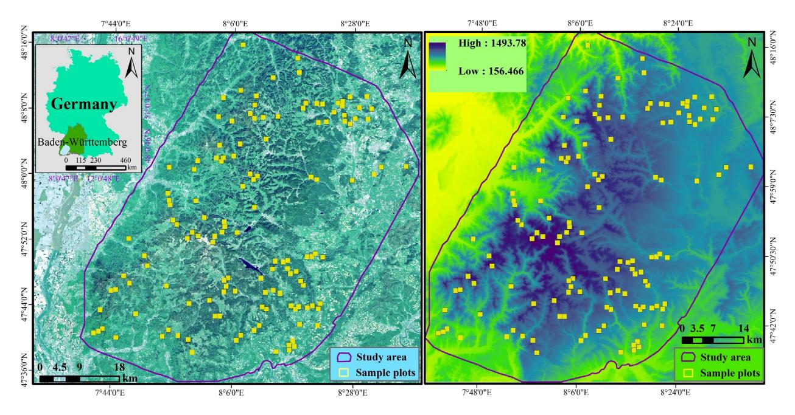
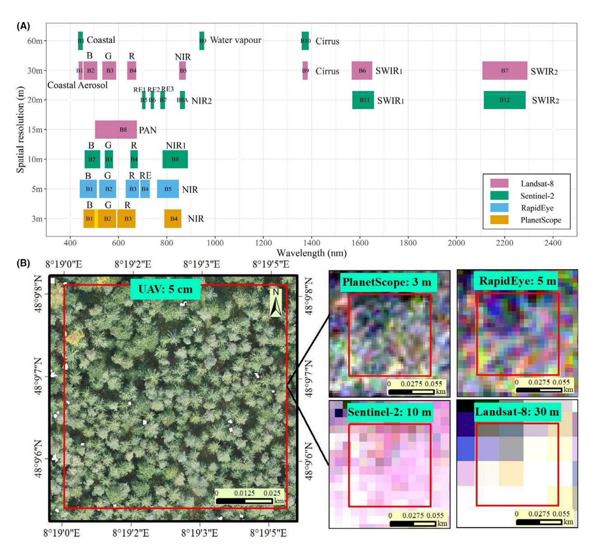
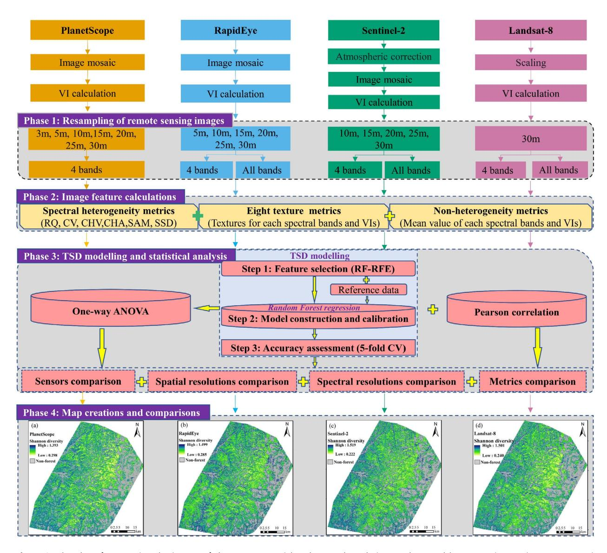
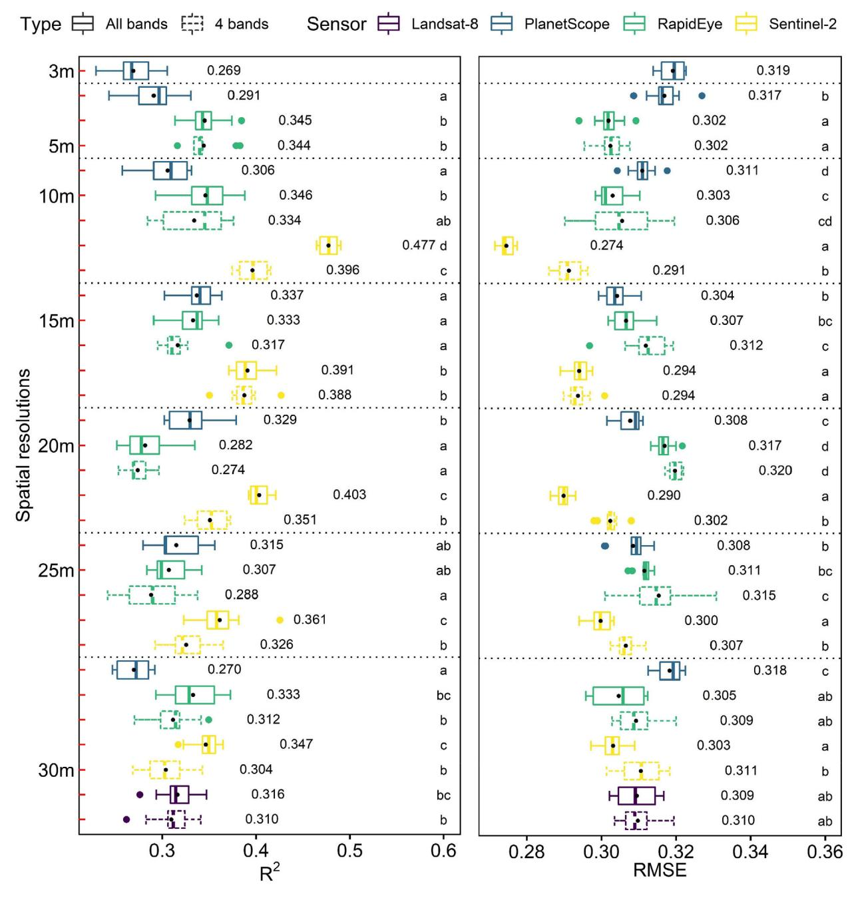
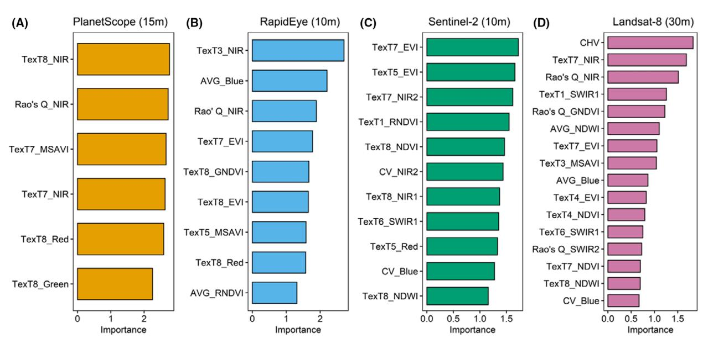
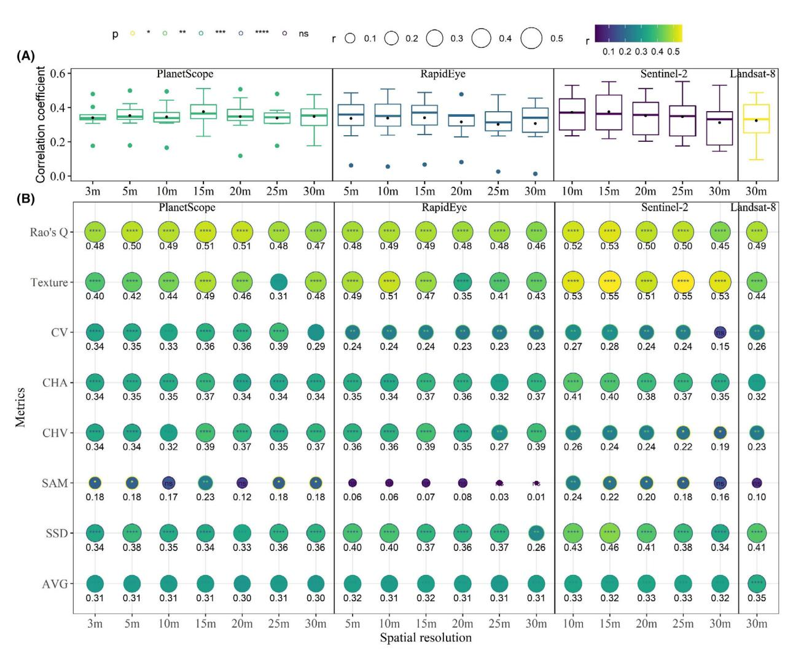
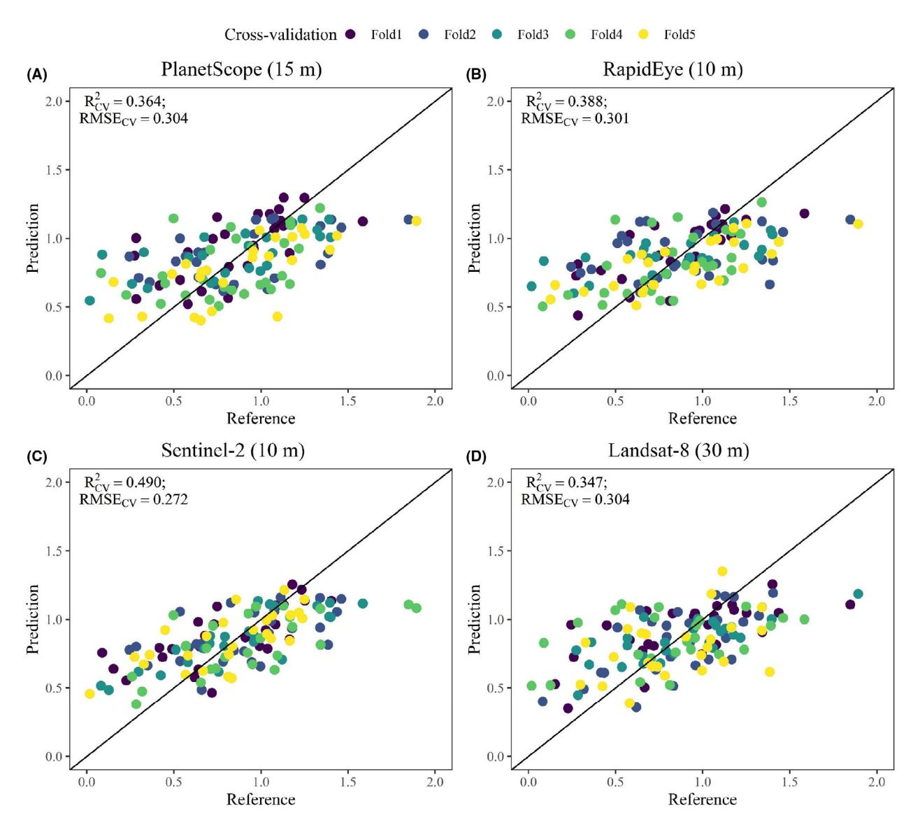
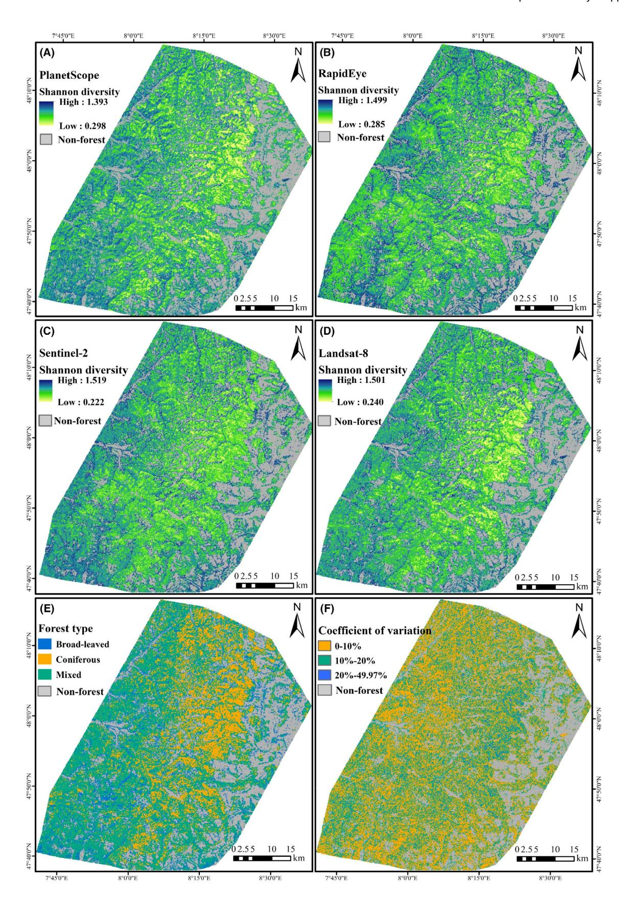

RESEARCH ARTICLE

# Tree species diversity mapping from spaceborne optical images: The effects of spectral and spatial resolution

Xiang Liu1 (D), Julian Frey2 (D), Catalina Munteanu3 (D), Martin Denter1 & Barbara Koch1

#### Keywords

Spaceborne optical imagery, spatial resolution, spectral heterogeneity metric, spectral resolution, tree species diversity

#### Correspondence

Xiang Liu, Chair of Remote Sensing and Landscape Information Systems, University of Freiburg, Freiburg 79106, Germany. Tel: +49 15226165094; E-mail: liu.xiang@felis.unifreiburg.de

Editor: Mat Disney Associate Editor: Anna Cord

Received: 19 March 2023; Revised: 27 December 2023; Accepted: 7 January 2024

doi: 10.1002/rse2.383

Remote Sensing in Ecology and Conservation 2024;**10** (4):463–479

#### **Abstract**

Increasingly available spaceborne sensors provide unprecedented opportunities for large-scale, timely and continuous tree species diversity (TSD) monitoring. However, given differences in spectral and spatial resolutions, the choice of sensor is not always straightforward. In this work, we investigated the effects of spatial and spectral resolutions for four spaceborne sensors (RapidEye, Landsat-8, Sentinel-2 and PlanetScope) on TSD mapping in an area of approximately 4000 km2 within the Black Forest, Germany. We employed a random forest (RF) regression model to predict Shannon-Wiener diversity based on seven types of spectral heterogeneity metrics (texture, coefficient of variation, Rao's Q, convex hull volume, spectral angle mapper, convex hull area and spectral species diversity) and a full survey dataset from 135 one-ha sample plots. We compared the RF model's performance across sensors and spatial resolutions. Our results demonstrated that the Sentinel-2-based TSD model achieved the highest accuracy (mean  $R^2$ : 0.477, mean root-mean-square error (RMSE): 0.274). The RapidEye-based TSD model produced lower accuracy (mean  $R^2$ : 0.346, mean RMSE: 0.303), but it was better than the PlanetScope- and Landsat-based TSD models. The 10 m (for Sentinel-2 and RapidEye) and 15 m (for PlanetScope) were the best spatial resolutions for predicting TSD. The NIR band was the most favourable spectral band for predicting TSD. Texture metrics and Rao's Q outperformed the other spectral heterogeneity metrics. Our results highlighted that spaceborne optical imagery (especially Sentinel-2) can be successfully used for large-scale TSD mapping but that the choice of sensors can significantly affect the resulting mapping accuracy in temperate montane forests.

#### Introduction

Forest biodiversity has an essential role in the provision of a variety of forest ecosystem services such as water retention and supply, nutrient use and conversion, and carbon storage (Huang et al., 2003; Song et al., 2021). As the most fundamental element of forest ecosystems, forest trees provide habitat and resources for a large number of plant and animal species (Huang et al., 2003; Mallinis et al., 2020). Tree species diversity (TSD) is regarded as a particularly significant indicator of forest ecosystem health and stability (Gyamfi-Ampadu et al., 2021). However, TSD is under threat due to habitat destruction, fire,

pollution, human activities, climate change and invasive alien species (Wang, Qiu, et al., 2022). Therefore, timely and accurate information on the magnitude and distribution of TSD is essential for implementing appropriate conservation strategies and management plans to prevent or mitigate losses (Torresani et al., 2021). Following the rapid advances in remote sensing technology in recent decades, especially the improvement in spectral, spatial, radiometric and temporal resolutions of sensors, as well as the significant reduction in the associated costs of remote sensing data acquisition and analysis, remote sensing methods exhibit unprecedented and unique advantages over any traditional methods in providing

&lt;sup>1Chair of Remote Sensing and Landscape Information Systems, University of Freiburg, Freiburg 79106, Germany

&lt;sup>2Chair of Forest Growth and Dendroecology, University of Freiburg, Freiburg 79106, Germany

&lt;sup>3Chair of Wildlife Ecology and Management, University of Freiburg, Freiburg 79106, Germany

consistent and spatially explicit measurements of TSD (Mallinis et al., 2020).

Ground-based or airborne hyperspectral images, which can provide rich and detailed spectral, spatial and textural information on tree canopies, have been well-received in the research community for TSD mapping (Wang, Qiu, et al., 2022; Zhao et al., 2018). However, the limited and sparse coverage and high cost of these data hinder their use in long-term and large-scale TSD mapping (Gyamfi-Ampadu et al., 2021; Mallinis et al., 2020). While unmanned aerial vehicles (UAVs) or airborne aerial multispectral images have significantly reduced the cost, they have similar disadvantages of limited coverage (Chrysafis et al., 2020; Gyamfi-Ampadu et al., 2021). In this context, spaceborne imagery offers tremendous merits in terms of area coverage, operating costs and data availability, making them a popular choice for broad-scale TSD mapping (Gyamfi-Ampadu et al., 2021).

For landscape-level TSD mapping, the most popular strategy is to first employ machine learning (or deep learning) based classification algorithms to classify tree species in the image. The species diversity indices (e.g., Shannon diversity) are then computed based on the derived classification products (Grabska et al., 2020). However, this two-step strategy requires a considerable amount of time and effort to collect sufficient labelled training data (Zhao et al., 2018). Moreover, classification methods often overlook uncommon or rare species due to insufficient training data (Fassnacht et al., 2022). To overcome these problems, spectral diversity-based methods building upon the Spectral Variability Hypothesis (Palmer et al., 2002) provide an alternative solution for predicting species diversity. The Spectral Variability Hypothesis states that the spectral variance of a given area is positively related to species diversity (Palmer et al., 2002; Rocchini et al., 2017). Based on this hypothesis, species diversity in different ecosystems has been estimated directly using spaceborne optical sensors such as (Rocchini, 2007), IKONOS (Nagendra et al., 2010), WorldView-2 (Mallinis et al., 2020; Wang, Qiu, et al., 2022), RapidEye (Gyamfi-Ampadu et al., 2021; Mallinis et al., 2020), Sentinel-2 (Chrysafis et al., 2020; Gyamfi-Ampadu et al., 2021) and Landsat (Mallinis et al., 2020; Nagendra et al., 2010).

The accuracy of existing TSD predictions varies among studies greatly due to differences in forest ecosystems, spatial and spectral resolutions of the spaceborne imagery and the spectral heterogeneity metrics used. Image spatial resolution is an important factor affecting the relationship between TSD and spectral diversity. Studies have shown that if the spatial resolution is too fine relative to the crown diameter of a species, a correspondingly large intra-species spectral variance will overestimate species

diversity, while images with too coarse spatial resolution will be insensitive to inter-species spectral variance and thus underestimate species diversity (Fassnacht et al., 2022; Rocchini, 2007). As such, finding the optimal spatial resolution is essential for the accurate mapping of TSD. Spectral resolution is another key factor in determining how accurately a satellite image can predict TSD. Higher spectral resolution images capture more spectral information from tree canopies and will therefore better differentiate tree species (Rocchini, 2007). Given the different instrumental characteristics of satellite sensors, assessing the performance of multiple sensors and determining the optimal performance are conducive to informing long-term and large-scale TSD prediction and mapping applications. However, very few studies to date have compared the performance of different spaceborne sensors in predicting TSD (e.g., Gyamfi-Ampadu et al., 2021; Mallinis et al., 2020), and knowledge on how spectral and spatial resolutions affect TSD in montane temperate forests is lacking entirely.

The choice of spectral heterogeneity metrics also affects species diversity predictions (Torresani et al., 2021). To date, many spectral heterogeneity metrics have been proposed for estimating species diversity, such as convex hull area (CHA) (Gholizadeh et al., 2018), Rao's Q (Rao, 1982; Rocchini et al., 2017), convex hull volume (CHV) (Cornwell et al., 2006), texture metrics (Haralick et al., 1973), spectral angle mapper (SAM) (Kruse et al., 1993), and coefficient of variation (CV). Among these spectral heterogeneity metrics, the recently proposed Rao's O performed well in many studies because it considers both the abundance of pixels and their pairwise distances (Rocchini et al., 2017; Torresani et al., 2019). However, applications of the Rao's Q metric for mapping forest biodiversity have been limited to a few forest ecosystems (Torresani et al., 2021; Wang, Qiu, et al., 2022). Furthermore, a recent study reported contradictory results in a heterogeneous temperate forest, where they found that Rao's Q had no significant effect on predicting TSD (Hoffmann et al., 2022). Overall, no single spectral heterogeneity metric was found to be highly applicable to all cases of species diversity predictions, as different spectral heterogeneity metrics quantify image heterogeneity in different ways (Torresani et al., 2021). Therefore, it is essential to use different spectral heterogeneity metrics to properly assess the ability of different spaceborne images in mapping TSD.

In this research, we evaluated the potential of four spaceborne optical images (i.e., RapidEye, Landsat-8, Sentinel-2 and PlanetScope) for large-scale TSD mapping in temperate montane forests. Specifically, we addressed the following questions: (i) Which spaceborne sensor provides the best prediction accuracy for TSD mapping?

(ii) What is the best spatial resolution for TSD mapping? (iii) Which spectral bands are most important for TSD mapping? (iv) How do different spectral heterogeneity metrics perform in mapping TSD?

#### **Materials and Methods**

# Study area

The research region covers about 4000 km2 in the southern Black Forest of Baden-Württemberg, Germany (Fig. 1). The elevation of the region ranges from 208 m (Rhine Valley) to 1493 m (the highest peak of the Feldberg mountain) (Frey et al., 2018). This region is characterized by a moderate maritime climate with an average annual precipitation of approximately 1205 mm and an average annual temperature of around 6.9°C (Storch et al., 2020). The climate in the region is influenced by the altitudinal gradient, with a difference in yearly average temperature of up to 6.4°C between the highlands and lowlands (Storch et al., 2020). The research area is predominantly covered by coniferous and mixed forests with high age variability (Frey et al., 2020). Norway spruce (Picea abies L.), silver fir (Abies alba Mill.) and European beech (Fagus sylvatica L.) are the dominant tree species covering over 70% of the forest area. Less common tree species are mainly Acer pseudoplatanus L., Pseudotsuga menziesii Mirbel., Pinus sylvestris L., Larix decidua Mill., Quercus robur L. and Betulus pendula L. (Storch et al., 2020).

#### Field data

Our study is part of the 'Conservation of Forest Biodiversity in Multiple-Use Landscapes of Central Europe (Con-FoBi)' project, which encompasses 135 1 ha  $(100 \times 100 \text{ m})$ sample plots. To ensure a comprehensive representation of various forest types, vegetation communities and topographic features while minimizing potential biases, the plot selection process centred on two essential factors: landscape-scale forest connectivity and forest structure (Storch et al., 2020). For the evaluation of forest connectivity, the proportion of forest within a 25 km2 area surrounding each plot was quantified based on a raster map of  $25 \times 25$  m resolution (Table S1.1). This analysis resulted in the classification of plots into three distinct levels of forest cover (<50, 50-75% and ≥75%). Regarding forest structure, plots with varying levels of old or dead trees rich in microhabitats were considered. As a result, the plots were categorized into three classes: low, medium and high structure categories, based on the number of standing dead trees associated with forest structure. Taking these two factors into account, the study area was divided into nine distinct strata with random sampling plots selection in each stratum. The minimum distance between plots is 750 m to ensure the spatial independence of each sample plot.

Tree species data were collected in the 135 sample plots during a comprehensive forest inventory between October 2016 and February 2018 (Fig. 1). The ConFoBi project

Figure 1. Location of the study area and distribution of the 135 sample plots. The Sentinel-2 and digital elevation model images are utilized as backgrounds in the left and right panels, respectively.

team measured and recorded diameter at breast height (DBH), species names and heights for all trees with a DBH  $\geq 7$  cm in each sample plot. In addition, we inventoried all plots in 2017/2018 and 2019/2020 with a multirotor UAV (Frey et al., 2020). By visually inspecting the collected UAV images for each sample plot in 2017/2018 and 2019/2020, we found that five sample plots had significant tree mortality between 2018–2019. Therefore, we removed these five sample plots in subsequent analyses. For the remaining 130 plots, we calculated the Shannon–Wiener diversity (H') indicator for each plot. We chose this indicator as a proxy of TSD because it can take into account both species richness and evenness, which together determine the environmental heterogeneity of a region (Morris et al., 2014).

$$H' = -\sum_{i=1}^{n} p_i \ln p_i \tag{1}$$

where  $p_i$  is the proportion of the basal area for the *i*th species relative to the total basal area of all tree species found within a sample plot.

# Remote sensing data and pre-processing

Because the timing of data acquisition has a strong influence on spectral variability (Wang, Gamon, Cavender-Bares, et al., 2018), we selected data with the three main considerations in mind: (1) consistency of data acquisition timing; (2) data availability and high quality (e.g., cloud-free) and (3) vegetation phenology. After inspecting all images from the four satellite sensors between May and October for the years 2016–2019, we selected the images acquired in October, as cloud-free images were available for all four sensors only during this period. October imagery is also ideal because it captures leaf discolouration and senescence, which are important phenological events for distinguishing individual tree species (Grabska et al., 2020; Hościło & Lewandowska, 2019).

Landsat-8 has 9 spectral bands, which cover the visible to shortwave infrared (SWIR) spectral regions, having a spatial resolution of 15 m (Panchromatic) to 30 m (Fig. 2). We used only the 30 m spectral bands and excluded the Cirrus and Coastal aerosol bands. We downloaded Landsat-8 OLI Collection 2 Level-2 surface reflectance data acquired on 10 October 2019, from the United States Geological Service (https://earthexplorer.usgs.gov/). Further processing was undertaken to convert the pixel value to surface reflectance using the scale factor of 0.0000275 and an offset of -0.2. The Sentinel-2 has 13 spectral bands also spanning from the visible to the SWIR regions (Fig. 2). We used the 10 m (i.e., Blue, Green, Red, and NIR1) and 20 m (Red-edge1, Red-edge2, Red-edge3,

NIR2, SWIR1 and SWIR2) spectral bands and excluded the Cirrus, Water vapour and Coastal aerosol bands. Two tiles of Sentinel-2 (TMT and UMU) level-1C images covering the whole study area captured from 12 October 2018, which were downloaded from the Copernicus Open Access Hub of the European Space Agency (ESA) (https://scihub.copernicus.eu/). We first performed an atmospheric correction for the Sentinel-2 level-1C images using the Sen2Cor in SNAP (ESA, 2020) and then resampled all 20 m bands to 10 m using the cubic convolution method.

High spatial resolution PlanetScope and RapidEye imagery were acquired at 3 and 5 m resolution, respectively, and were provided by the Planet Labs under the Education and Research Program (https://www.planet.com/markets/education-and-research/). The PlanetScope has four basic spectral bands (i.e., Blue, Green, Red and NIR), while RapidEye includes an additional Red-edge band (Fig. 2A). We downloaded the Level-3A products of PlanetScope and RapidEye images acquired on 14 and 15 October 2018, respectively. Both PlanetScope and RapidEye data were geometrically, radiometrically and atmospherically corrected and can therefore be used directly in practical applications. All data were mosaiced for the entire study region.

Based on the original spectral bands, we computed several vegetation indices (VIs) (see Table S1.2 for more details).

# Methodology

We developed a four-phase workflow to assess the impacts of satellite sensors, spatial and spectral resolutions and spectral heterogeneity metrics on forest TSD mapping (Fig. 3). Details on the phases are described in Sections 3.1–3.5.

#### Resampling of satellite imagery

Because the four satellite images have different spatial resolutions, direct comparisons of these data may be problematic for accurately exploring the effects of spatial resolution on TSD mapping due to their differences in spectral bands and spectral ranges (Fig. 2). Other discrepancies, such as the imaging time, view geometry and image quality of the satellite data, may also affect impartial comparisons. Therefore, we not only directly compared the performance of different satellite images in TSD mapping but considered the mapping capability of individual images at various spatial resolutions. To do so, we resampled each satellite imagery from original (fine) to coarser spatial resolutions utilizing the nearest neighbour resampling algorithm. As shown in Figure 3, we

**Figure 2.** Details of the spatial and spectral resolutions of Sentinel-2, RapidEye, PlanetScope and Landsat-8 images (A) and an example sample plot (Plot 134) on the UAV and the four satellite images (B). B, blue; R, red; G, green; RE, red-edge; NIR, near-infrared; SWIR, shortwave infrared; PAN, panchromatic.

considered seven (3, 5, 10, 15, 20, 25 and 30 m), six (5, 10, 15, 20, 25 and 30 m), five (10, 15, 20, 25 and 30 m) and one (30 m) spatial grains for the PlanetScope, RapidEye, Sentinel-2 and Landsat-8, respectively. We conducted assessments on three frequently employed resampling methods: nearest neighbour, bilinear interpolation and cubic interpolation. None of these methods displayed significant differences in the final result (Appendix S2).

Whereas PlanetScope data have only four basic spectral bands, the Sentinel-2, RapidEye and Landsat-8 data all possess additional spectral bands (Red-edge or SWIR). To

investigate the role of these additional spectral bands on TSD mapping, we also created a 4-band-based dataset for Sentinel-2, RapidEye and Landsat-8 data (i.e., containing only the four bands (Blue, Green, Red and NIR) and their associated VIs), and compared their performance with the all-band-based dataset (all bands and VIs) at different spatial resolutions.

# Image feature extraction

Since the reliability of the Spectral Variability Hypothesis varies with the spectral heterogeneity metric used and

**Figure 3.** Flowchart for assessing the impact of the sensors, spatial and spectral resolutions and spectral heterogeneity metrics on tree species diversity mapping. VI, vegetation index; CV, cross-validation; ANOVA, analysis of variance; RF-RFE, random forest-based recursive feature elimination.

currently no consensus is reached on the preference of a specific spectral heterogeneity metric for remotely sensed TSD estimates (Wang, Gamon, Schweiger, et al., 2018; Wang, Qiu, et al., 2022), we calculated seven types of commonly used spectral heterogeneity metrics including Rao's Q, CV, CHV, CHA, SAM, spectral species diversity (SSD), and texture metrics (Table 1). More information on the calculation of each spectral heterogeneity metric and its corresponding formula can be found in Appendix S3. Additionally, we also included the average (AVG) values of the base variables (i.e., bands and VIs) corresponding to each sample plot to maximize the possibility of mining all the information in favour of TSD

mapping. This would be also more conducive to an unbiased assessment of the mapping potential of various satellite sensors.

All spectral heterogeneity metrics were calculated for each satellite sensor at each spatial resolution. Apart from SSD, which is usually computed based on categorical data (i.e., classified images), all other metrics can be calculated directly based on spectral bands or VIs, and their higher values indicate greater spectral diversity in theory (Gholizadeh et al., 2018; Rocchini et al., 2017). In this research, we calculated the Rao's Q and CV for all bands and VIs of four satellite sensors. The CHV and SSD were computed using the first three principal components

Table 1. Information on the image features (spectral heterogeneity and non-heterogeneity metrics) from the four satellite sensors.

|                                  |                                        | Number of predictors |    |     |    |  |
|----------------------------------|----------------------------------------|----------------------|----|-----|----|--|
| Metrics (Abbreviation)           | Base variable used for the calculation | PS                   | RE | S2  | L8 |  |
| Spectral angle mapper (SAM)      | All spectral bands                     | 1                    | 1  | 1   | 1  |  |
| Convex hull area (CHA)           | All spectral bands                     | 1                    | 1  | 1   | 1  |  |
| Spectral species diversity (SSD) | The first three principal components   | 1                    | 1  | 1   | 1  |  |
| Convex hull volume (CHV)         | The first three principal components   | 1                    | 1  | 1   | 1  |  |
| Rao's Q                          | Each spectral band and each VI         | 8                    | 10 | 16  | 11 |  |
| Coefficient of variation (CV)    | Each spectral band and each VI         | 8                    | 10 | 16  | 11 |  |
| Texture metrics                  | Each spectral band and each VI         | 64                   | 80 | 128 | 88 |  |
| Average (AVG) a       | Each spectral band and each VI         | 8                    | 10 | 16  | 11 |  |

PS, PlanetScope; L8, Landsat-8; RE, RapidEye; S2, Sentinel-2.

transformed from multiple spectral bands. The CHA and SAM were calculated using all spectral bands.

We calculated eight commonly used texture metrics in a single direction (vertical 90°) based on the Gray-Level-Co-Occurrence-Matrix method (Haralick et al., 1973) (see Appendix S3 for more details). The texture metrics were computed for all spectral bands and VIs of the satellite imagery using the Co-occurrence Measures function in the ENVI 5.5 software.

#### TSD modelling

The TSD modelling consists of three steps: feature selection, model construction and calibration, and accuracy assessment. We performed a feature selection to remove redundant and highly collinear variables. To do this, we first calculated the importance values for all predictor variables by training a random forest (RF) (Breiman, 2001) regression model using the field data and all predictor variables. We used the IncNodePurity metric from the RF model to estimate feature importance. In cases where variables exhibited a high degree of correlation (Pearson  $r \ge 0.8$ ), we applied a filtering process to exclude those with lower importance values. To further refine our variable selection, we employed an RF-based recursive feature elimination (RF-RFE) algorithm to eliminate unimportant variables. The RF-RFE process initiated with fitting the RF model with all the remaining predictors. Each predictor variable was then ranked based on its importance value as determined by the RF model. Subsequently, the algorithm iteratively removed one unimportant predictor variable at each step until only one predictor remained as input. During each iteration, the importance of every predictor variable was recalculated using the RF model in the context of the retained feature set. Following this, the model was retrained, and prediction accuracy was assessed. This evaluation procedure employed a 10-fold cross-validation method, with each iteration repeated three times to ensure robustness and reliability. The prediction accuracy achieved in each iteration was then compared, and the final set of predictors was determined based on this comparative analysis. This feature selection procedure was performed for all four sensors across all spatial resolutions (Table 2 and Table \$1.3).

In the second step, we applied the RF algorithm to model TSD using the selected predictor variables from the first step and the field data. As a non-parametric machine learning method, RF has been widely used for various prediction tasks (Grabska et al., 2020; Gyamfi-Ampadu et al., 2021; Mallinis et al., 2020). We tuned the main parameter *mtry* from 1 to 8 and set the *ntree* as default (i.e., 500). We employed a grid search combined with a 5-fold cross-validation method to select the optimal parameters.

In the third step, we evaluated the model performance using a 5-fold cross-validation method. We randomly split the field data (n=130) into five folds and conducted five iterations. In each iteration, we used the four folds ( $\sim 80\%$ ) to train the RF model and the remaining 1-fold ( $\sim 20\%$ ) to calculate the coefficient of determination ( $R^2$ ) and root-mean-square error (RMSE). The mean values of  $R^2$  and RMSE over the five iterations were used to quantify the model performance. We repeated the above procedure 10 times to reflect the variability in model performances.

# Statistical analysis

Based on the accuracy results from 10 replications, we used the one-way ANOVA with Tukey multiple-comparison to examine the statistical significance of differences in prediction accuracy among satellite datasets. Additionally, we calculated Pearson correlation coefficients between different spectral heterogeneity metrics

&lt;sup>aNon-heterogeneity metrics.

**Table 2.** The number of variables selected by the feature selection method for different satellite sensors at different spatial and spectral resolutions.

| Sensor      |          | Total number of variables at each spatial resolution | Number of selected variables at different spatial resolutions |     |      |      |      |      |      |
|-------------|----------|------------------------------------------------------|---------------------------------------------------------------|-----|------|------|------|------|------|
|             | Dataset  |                                                      | 3 m                                                           | 5 m | 10 m | 15 m | 20 m | 25 m | 30 m |
| PlanetScope | All-band | 92                                                   | 15                                                            | 2   | 12   | 6    | 11   | 10   | 10   |
| RapidEye    | All-band | 114                                                  | _                                                             | 10  | 9    | 6    | 15   | 11   | 5    |
|             | 4-band   | 92                                                   | -                                                             | 11  | 3    | 3    | 20   | 2    | 5    |
| Sentinel-2  | All-band | 180                                                  | _                                                             | _   | 11   | 20   | 8    | 18   | 15   |
|             | 4-band   | 92                                                   | -                                                             | -   | 13   | 15   | 9    | 20   | 8    |
| Landsat-8   | All-band | 125                                                  | _                                                             | _   | _    | _    | _    | _    | 16   |
|             | 4-band   | 92                                                   | _                                                             | _   | =    | =    | =    | =    | 15   |

and field-measured H' index to explore the ability of individual spectral metrics in predicting TSD at different spatial resolutions across sensors.

# TSD map creation and analysis

In the final phase of the workflow, we employed the topperforming model from each satellite sensor to make predictions for TSD across the entire study area. After generating the maps, we evaluated variations in predictions across sensors at various geographic locations by computing the coefficient of variance for each pixel across the four maps. Subsequently, we conducted an analysis to examine the spatial distribution pattern of TSD in relation to forest type and elevation.

#### Results

#### **Model performance**

Model performance was affected by the satellite sensor, spatial resolution and spectral band. Sentinel-2 data (10 m) obtained the highest prediction accuracy (mean  $R^2 = 0.477$ ; mean RMSE = 0.274), followed by RapidEye (10 m) (mean  $R^2 = 0.346$ ; mean RMSE = 0.303) and PlanetScope (15 m) (mean  $R^2 = 0.337$ ; mean RMSE = 0.304), while Landsat-8 (30 m) (mean  $R^2 = 0.316$ ; mean RMSE = 0.309) performed the worst on the TSD predictions (Fig. 4). The all-band-based Sentinel-2 dataset performed the best in all spatial resolution scenarios. In contrast, PlanetScope data performed the worst at almost all spatial resolutions except for a few spatial resolutions (15, 20 and 25 m) (Fig. 4). The highest accuracy for Sentinel-2 was achieved at 10 m. However, for high spatial resolution images RapidEye and PlanetScope, the highest prediction accuracy was not achieved at their original spatial resolution (3 and 5 m), but at 15 and 10 m, respectively. Furthermore, for the Sentinel-2, a significantly higher accuracy in predicting TSD can be obtained for its all-band-based dataset than for the 4-band-based dataset at almost all spatial resolution scenarios (except for the 15 m resolution) (P < 0.05) (Fig. 4). For RapidEye and Landsat-8, the prediction accuracy of their all-band-based datasets was only slightly higher than that of the 4-band-based datasets (P > 0.05).

# Variable importance

Among the spectral heterogeneity metrics, texture features showed very high importance for all the best models (Fig. 5). Rao's Q played an important role in the best models for PlanetScope, RapidEye and Landsat but was not involved in the best Sentinel-2 model. Rao's O was excluded from the best Sentinel-2 model most likely due to its high correlation with the texture metrics (Figure S1.1), and thus being removed during the feature selection process. CV contributed moderately to the best Sentinel-2 model but showed low importance to the other best models for PlanetScope, RapidEye and Landsat-8. AVG also contributed to the best model for RapidEye and Landsat-8 but did not participate in the best model for PlanetScope and Sentinel-2. All the other spectral heterogeneity metrics, except the CHV, which showed the highest importance to the best Landsat-8 model (Fig. 5D), did not contribute to the best models.

Overall, the spectral heterogeneity metrics calculated based on the NIR bands contributed much more to the best models than those derived from the other spectral bands (Fig. 5). In contrast, the Red band-derived spectral heterogeneity metrics contributed consistently low to the best models. Although the Red-edge band related VI (i.e., RNDVI) contributed to both the best RapidEve and Sentinel-2 models, its role in the Sentinel-2 model was more important. The SWIR bands and their associated VIs contributed to the best Sentinel-2 and RapidEye models, but they were much more important for the best Landsat-8 model. The importance values of the other spectral bands were not consistent across sensors. The blue band had high importance for the best RapidEye model but contributed far less to the best Seninel-2 and PlanetScope models. The green band showed a low importance value to the best models for

**Figure 4.** Prediction accuracies ( $R^2$  and RMSE) of RF models applied on different datasets at different spatial resolutions. All bands and 4 bands denote the derived variables from all spectral bands and only 4 spectral bands, respectively. The mean values of  $R^2$  and RMSE over 10 replicates are shown near the boxplot. Different colours represent different sensors. Letters on the rightmost side of the boxplot show statistically significant differences (P < 0.05) in prediction accuracy between datasets at the same spatial resolution using ANOVA with Tukey multiple-comparison tests. Any two groups that have the same letter (e.g., a and ab) indicate no significant difference between the two groups ( $P \ge 0.05$ ).

PlanetScope and Sentinel-2, but its associated VI contributed moderately to the best models for RapidEye and Landsat-8. In addition to the spectral bands, the VIs, especially EVI and MSAVI, played significant roles in the best model of the four satellite sensors.

# Correlations between TSD and spectral heterogeneity metrics

Since the spectral metrics that were based on the NIR band were the most relevant to the H' index (Figure S1.2), we

**Figure 5.** Variable importance of the best model for PlanetScope (A), RapidEye (B), Sentinel-2 (C) and Landsat-8 (D). Predictor abbreviations follow the rule: metric \_ base variable. TexT 1–8 are texture metrics mean, variation, homogeneity, contrast, dissimilarity, entropy, second moment and correlation, respectively; CV, coefficient of variation; CHV, convex hull volume; AVG, average; RedE, red-edge.

only displayed results for the NIR band-derived texture, Rao's Q, CV and AVG metrics. Results demonstrated that the Spectral Variability Hypothesis held true for all satellites. However, the spectral-species diversity relationship varied among the spectral heterogeneity metrics (Fig. 6B). Of the eight spectral metrics, the Rao's Q and texture metrics have the highest correlation with the H' index, followed by SSD and CHA; the SAM showed the worst correlation with the H' index. The most commonly used CV showed a moderate correlation with the H' index. Although the CHV performed similarly to the CHA on the PlanetScope and RapidEve, it performed much worse on the Landsat and Sentinel-2 images. On the other hand, the spectral-species diversity relationship was affected by spatial resolution. Generally, the largest correlation coefficients between spectral metrics and the H' index were shown at 15 m resolution for the PlanetScope imagery and 10 m for the RapidEye and Sentinel-2 imagery (Fig. 6A). Resampling the images to a coarser resolution did not significantly change the correlation between the spectral AVG and the H' index.

# Landscape maps of TSD

In general, all the best models tended to overestimate the low TSD values and underestimate the high TSD values (Fig. 7). In addition, the predictive accuracy of each model was influenced by the forest type (Figure \$1.3).

The predicted TSD values of four maps were characterized by a distribution of low diversity in the middle high

elevations and of high diversity in the surrounding low-lands (Fig. 8A–D and Figure S1). Furthermore, the predicted TSD in the broad-leaved and mixed forests was higher than that in the coniferous forests (Fig. 8A–E and Figure S1.4A). The TSD values predicted by the four satellite images were relatively consistent, with the CV less than 10% in most areas (Fig. 8F). The areas with large differences in predictions were mainly located in the central high altitude (Fig. 8F and Figure S1.4B) and the southwest corner of the mixed forest areas (Fig. 8F).

#### Discussion

#### **Spatial resolution**

Our results suggest that the optimal spatial resolution for TSD mapping is 10 or 15 m. For high spatial resolution images (i.e., PlanetScope and RapidEye), a higher spatial resolution was not more favourable for predicting the TSD. This is in line with the findings of other studies (e.g., Nagendra et al., 2010; Rocchini, 2007). Many studies have shown that high spatial resolution imagery has a relatively high spectral variation within a single tree crown because its pixels can cover various portions of the canopy, such as shaded foliage, sunlit foliage and even the understory and forest floor (Fassnacht et al., 2016; Ghosh et al., 2014; Nagendra et al., 2010). The higher spectral variation within a tree species may lead to lower spectral separability between tree species (Fassnacht et al., 2016).

**Figure 6.** Correlations between in-situ measured Shannon–Wiener diversity indicator and the selected spectral metrics from the PlanetScope, RapidEye, Sentinel-2 and Landsat-8 satellite images at different spatial resolutions. Boxplots (A) reflect the distribution ranges of the correlation coefficients between the selected spectral metrics and Shannon–Wiener diversity at different spatial resolutions. The following bubble plots (B) detail the correlation coefficients between the selected spectral metrics and Shannon–Wiener diversity at different spatial resolutions. The Rao's Q, texture, CV and AVG metrics for various sensors presented here are derived from their respective NIR bands. Abbreviations of different metrics are explained in Table 1 and Appendix S3.

For PlanetScope and RapidEye, resampling the pixel size from the original to a lower one improved the prediction accuracy. Moreover, the correlation between species diversity and spectral heterogeneity was improved with such a resample process (Fig. 6). However, when resampled pixels reach a certain size, the prediction accuracy decreased. This suggests that when image spatial resolution exceeds a certain threshold the spectral signatures of different species may become overgeneralized and the effect of intra-pixel spectral mixing is enhanced, thus reducing the spectral separability of different tree species (Ghosh et al., 2014). Our study found that 10 or 15 m is an appropriate pixel size for TSD mapping, which is

generally in agreement with the results of some other studies. For instance, Gyamfi-Ampadu et al. (2021) found Sentinel-2 10 m can produce the highest accuracy for TSD predictions in an Afromontane subtropical forest. Ghosh et al. (2014) found that 8 m is the best resolution for tree species mapping in a temperate forest using hyperspectral data. It is important to note that the optimal spatial resolution for TSD predictions may vary across different application scenarios. This variability may arise from factors such as the composition of forest stands, the diversity of species and various structural parameters on the one hand, and the choice of remote sensing data and sample plot sizes on the other.

2056/3485, 2024. 4, Downloaded from https://zslpublications.onlinelibrary.wiley.com/doi/10.1002/rse2.383, Wiley Online Library on [05/08/2025]. See the Terms and Conditions (https://onlinelibrary.wiley.com/drems-ad-conditions) on Wiley Online Library for rules of use; OA articles are governed by the applicable Creative Commons. License

**Figure 7.** Scatterplots between the tree species diversity (TSD) measured from 130 sample plots and the predicted TSD of 5-folds cross-validation from the four best models. The best prediction accuracy over the 10 repetitions for each sensor-based model is shown in the figure.

# **Spectral resolution**

Our results showed that higher spectral resolution led to higher mapping accuracy. However, most of the high spatial resolution satellite images, for instance, IKONOS, GeoEye-1, PlanetScope (DOVE-R) and SPOT-6/7, only offer the four basic spectral bands. The lower spectral resolution of the PlanetScope data resulted in relatively

lower prediction accuracy than the Sentinel-2 and RapidEye imagery. Similar results were found in several studies of TSD estimation in other forest ecosystems (Gyamfi-Ampadu et al., 2021; Mallinis et al., 2020; Nagendra et al., 2010). The correlation analysis results showed that the most relevant spectral bands for TSD were the Red-edge and NIR bands (Figure S1.2). The NIR and Red-edge bands-derived spectral metrics also

Figure 8. Landscape maps of Shannon–Wiener diversity from PlanetScope (A), RapidEye (B), Sentinel-2 (C) and Landsat-8 (D). (E) The forest type map. (F) The distribution of the coefficient of variation of Shannon–Wiener diversity values predicted by the four spaceborne sensors.

-and-conditions) on Wiley Online Library for rules of use; OA articles are governed by the applicable Creativ

played essential roles in the best TSD models. The importance of NIR and Red-edge bands has been pointed out in many studies of tree species classification (Bhattarai et al., 2021; Grabska et al., 2020; Immitzer et al., 2019). While numerous studies have emphasized the significance of SWIR bands in mapping tree species (Bhattarai et al., 2021; Hościło & Lewandowska, 2019; Immitzer et al., 2019), it is important to note that the correlations between TSD and SWIR bands are comparatively lower than those between TSD and NIR and Red-edge bands, underscoring the significance of the latter bands.

# Satellite sensor type

Our results demonstrated that the Sentinel-2 data can better predict TSD than the other three sensors, as also suggested by Gyamfi-Ampadu et al. (2021). We confirmed that the moderate spatial resolution (10 m) and the spectral resolution (particularly three additional Red-edge bands) are indeed the main reason for the superior performance over other satellite sensors. Moreover, we have emphasized that Sentinel-2's 4-band-based dataset consistently outperforms other satellite imagery across spatial resolutions ranging from 10 to 25 m. This observation brings to light an important consideration: the use of very high spatial resolution imagery may introduce a significant amount of noise into the data. Although resampling methods can alleviate the noise effects to some extent, they still impact the accuracy of predictions. Furthermore, the result underscores the significance of Sentinel-2's unique bandwidth characteristics, characterized by narrower RGB bands and broader NIR bands, in contributing to its superior performance relative to the other satellite sensors. This finding aligns with similar outcomes observed when using Sentinel-2 and Landsat-8 imagery for predicting forest structure or classifying tree species (Astola et al., 2019; Wang, Zheng, et al., 2022).

Unlike Sentinel-2, where the images are sourced from a single satellite, both RapidEye and PlanetScope are constellations of several satellites. Therefore, subtle differences between different satellites (e.g., the timing of image acquisition and solar altitude angle) may also affect the prediction performance. In contrast, although Landsat-8 also has a large swath width, the worst prediction accuracy of Landsat-8 is likely due to its coarse spatial resolution. However, several studies found that Landsat-8 performed equally or slightly better than high spatial resolution imagery (e.g., Quickbird, RapidEye and IKONOS) for predicting TSD (Mallinis et al., 2020; Nagendra et al., 2010; Rocchini, 2007). Notably, all these studies compared the high spatial resolution imagery directly with Landsat-8 data without considering the effect of

spatial resolution. We also had the same result when the Landsat-8 was compared with the PlanetScope at the original spatial resolution (Figure S1.5). However, resampling spatial resolution to a coarser resolution improved the predictive accuracy of PlanetScope, which was even higher than that of Landsat-8 images. Therefore, it may be necessary to consider TSD predictions at multiple spatial resolutions for high spatial resolution images to properly evaluate their performance.

# **Spectral heterogeneity metrics**

Our results revealed that the spectral-species diversity relationship was sensitive to the selection of the spectral heterogeneity metrics as well. Although all spectral heterogeneity metrics were positively correlated with the H' indicator, the differences in the spectral heterogeneity they characterized were significant. The maximum differences in the correlation coefficients (r) with the H' index between the different spectral heterogeneity metrics reached 0.39, 0.45, 0.37 and 0.39 on PlanetScope, RapidEye, Sentinel-2 and Landsat-8, respectively (Fig. 6B). These results suggest that selecting a suitable metric is important for the validation of Spectral Variability Hypothesis. Among the spectral heterogeneity metrics, Rao's Q and texture had significantly higher correlations with the H' index than the others did. The better performance of the Rao's Q is due to its consideration of both pixel abundance and pairwise distances (Rocchini et al., 2017), which therefore may be less sensitive to extremes and outliers caused by background effects (e.g., bare and sparse soil). Texture metrics have been shown to have the ability to characterize the structural complexity of plants and provide complementary information about the heterogeneity of plant components (Farwell et al., 2021; Hoffmann et al., 2022). These properties of texture explain their high performance in predicting TSD in our case. Moreover, unlike other spectral heterogeneity metrics, texture metrics can be computed in different ways (e.g., homogeneity, variance and entropy), thus enabling quantify spectral heterogeneity differently (Farwell et al., 2020).

CV and CHV had a much lower correlation with the H' index than the Rao's Q and texture metrics did. Moreover, their correlation coefficients also varied widely across sensors. This implies that the CV and CHV might be susceptible to the effects of spectral noise and illumination geometry, bare soil and dead biomass (Gholizadeh et al., 2018; Rossi et al., 2021). The SAM had the worst performance, probably due to the fact that it assigned the same weight to each spectral band. Yet, the correlation analysis result showed that not all spectral bands were beneficial in predicting TSD. Compared to the CV, CHV

and SAM, the CHA and SSD also had a higher and more stable relationship with the H' index across different sensors and spatial resolutions. The CHA comes with the function of feature selection, which may be the reason for its superiority over CHV and SAM (Gholizadeh et al., 2018; Liu et al., 2023). SSD has proven to be much less sensitive to extremes than the CV and CHV (Rossi et al., 2021).

Although the texture and Rao's Q showed a high correlation with TSD, neither of them consistently maintained the highest correlation coefficient with the H' index across different satellite sensors and spatial resolutions. Therefore, to maximize the spectral–species diversity relationship, we recommend comparing and testing multiple spectral heterogeneity metrics. Moreover, using multiple metrics is also beneficial to avoid underestimating the ability of a particular dataset to map TSD.

#### Method consideration and outlook

Our study demonstrated the potential of using spectral diversity-based methods combined with machine learning techniques to estimate and map large-scale TSD in a montane temperate forest. Compared to image classification methods, spectral diversity-based approaches do not require consideration of the representativeness and balance of pre-classified samples of individual tree species (Wang, Qiu, et al., 2022). They thus have better general applicability to large areas. To date, gaps still remain in the tree species distribution maps used to estimate TSD in the Black Forest region. Although the first nationalscale tree species distribution map was published very recently, it classified only seven dominant species and used training samples from the 2012 national survey inventory (Welle et al., 2022). Therefore, such a product may not estimate TSD accurately and there is still an urgent need for effective methods to accurately map TSD to provide continuous and timely information on TSD distribution. Our study illustrated the feasibility of operational spaceborne imagery for large-scale TSD mapping, which is a good signal for future TSD mapping on a national and even global scale.

To fairly compare the mapping capabilities of different satellite images, we chose images acquired during the vegetation senescence period (i.e., October), when temperate forest tree species are usually easier to distinguish by remote sensing methods than during the peak vegetation season (Grabska et al., 2019; Persson et al., 2018). We achieved the highest accuracy with a mean  $R^2$  of 0.477 and a mean RMSE of 0.274, which was comparable to that of many other studies using Sentinel-2 imagery (Hoffmann et al., 2022; Mallinis et al., 2020; Wang, Qiu, et al., 2022). However, we assume that the accuracy can

be further enhanced by applying multi-temporal analysis, which has proven to be effective in improving prediction accuracy in many studies (Chrysafis et al., 2020; Madonsela et al., 2021; Torresani et al., 2021).

Furthermore, some factors that may influence the spectral–species diversity relationship were not taken into consideration. For instance, previous studies have shown that backgrounds (e.g., bare soil) can augment spectral heterogeneity, potentially weakening the spectral–species diversity relationship (Gholizadeh et al., 2018; Wang, Qiu, et al., 2022). Therefore, future studies should take into account these background effects, particularly when using high spatial resolution images. Additionally, since different species diversity indicators quantify diversity in diverse ways, the selection of a particular indicator may also influence the spectral–species diversity relationship (Gyamfi-Ampadu et al., 2021). Future studies should explore the performance of satellite sensors in predicting other species diversity indicators (e.g., Simpson diversity).

# **Acknowledgements**

This study was funded by the German Research Foundation (DFG) and ConFoBi grant number GRK 2123. We are most grateful to Forst Baden-Württemberg (ForstBW) for enabling and facilitating field work – without their excellent work, our study would not have been possible. We thank two reviewers for the constructive comments and suggestions that helped improve our manuscript. The article processing charge was funded by the Open Access Project DEAL from University of Freiburg. Open Access funding enabled and organized by Projekt DEAL.

### **Author Contributions**

XL conceived the ideas and designed methodology; JF and MD collected the data in the field; XL analyzed the data and led the writing of the manuscript; JF, CM and BK provided useful feedback on an earlier draft. All authors contributed critically to the drafts and gave final approval for publication.

# References

Astola, H., Häme, T., Sirro, L., Molinier, M. & Kilpi, J. (2019) Comparison of Sentinel-2 and Landsat 8 imagery for forest variable prediction in boreal region. *Remote Sensing of Environment*, **223**, 257–273. Available from: https://doi.org/10.1016/j.rse.2019.01.019

Bhattarai, R., Rahimzadeh-Bajgiran, P., Weiskittel, A., Meneghini, A. & MacLean, D.A. (2021) Spruce budworm tree host species distribution and abundance mapping using multi-temporal Sentinel-1 and Sentinel-2 satellite imagery. *ISPRS Journal of Photogrammetry and Remote Sensing*, 172,

- 28–40. Available from: https://doi.org/10.1016/j.isprsjprs. 2020.11.023
- Breiman, L. (2001) Random Forests. *Machine Learning*, **45**, 5–32. Available from: https://doi.org/10.1023/A:1010933404324
- Chrysafis, I., Korakis, G., Kyriazopoulos, A.P. & Mallinis, G. (2020) Predicting tree species diversity using geodiversity and Sentinel-2 multi-seasonal spectral information. *Sustainability*, **12**, 9250. Available from: https://doi.org/10. 3390/su12219250
- Cornwell, W.K., Schwilk, D.W. & Ackerly, D.D. (2006) A trait-based test for habitat filtering: convex hull volume. *Ecology*, **87**, 1465–1471. Available from: https://doi.org/10.1890/0012-9658(2006)87[1465:ATTFHF]2.0.CO;2
- ESA. (2020) SNAP. ESA Sentinel Application Platform.
- Fassnacht, F.E., Latifi, H., Stereńczak, K., Modzelewska, A., Lefsky, M., Waser, L.T. et al. (2016) Review of studies on tree species classification from remotely sensed data. *Remote Sensing of Environment*, **186**, 64–87. Available from: https://doi.org/10.1016/j.rse.2016.08.013
- Fassnacht, F.E., Müllerová, J., Conti, L., Malavasi, M. & Schmidtlein, S. (2022) About the link between biodiversity and spectral variation. *Applied Vegetation Science*, 25, e12643. Available from: https://doi.org/10.1111/avsc.12643
- Frey, J., Asbeck, T. & Bauhus, J. (2020) Predicting tree-related microhabitats by multisensor close-range remote sensing structural parameters for the selection of retention elements. *Remote Sensing*, **12**, 867. Available from: https://doi.org/10. 3390/rs12050867
- Frey, J., Kovach, K., Stemmler, S. & Koch, B. (2018) UAV photogrammetry of forests as a vulnerable process. A sensitivity analysis for a structure from motion RGB-image pipeline. *Remote Sensing*, **10**, 912. Available from: https://doi.org/10.3390/rs10060912
- Gholizadeh, H., Gamon, J.A., Zygielbaum, A.I., Wang, R., Schweiger, A.K. & Cavender-Bares, J. (2018) Remote sensing of biodiversity: soil correction and data dimension reduction methods improve assessment of α-diversity (species richness) in prairie ecosystems. *Remote Sensing of Environment*, **206**, 240–253. Available from: https://doi.org/10.1016/j.rse.2017.12.014
- Ghosh, A., Fassnacht, F.E., Joshi, P.K. & Koch, B. (2014) A framework for mapping tree species combining hyperspectral and LiDAR data: role of selected classifiers and sensor across three spatial scales. *International Journal of Applied Earth Observation and Geoinformation*, **26**, 49–63. Available from: https://doi.org/10.1016/j.jag.2013.05.017
- Grabska, E., Frantz, D. & Ostapowicz, K. (2020) Evaluation of machine learning algorithms for forest stand species mapping using Sentinel-2 imagery and environmental data in the Polish Carpathians. *Remote Sensing of Environment*, 251, 112103. Available from: https://doi.org/10.1016/j.rse. 2020.112103
- Grabska, E., Hostert, P., Pflugmacher, D. & Ostapowicz, K. (2019) Forest stand species mapping using the Sentinel-2

- time series. *Remote Sensing*, **11**, 24. Available from: https://doi.org/10.3390/rs11101197
- Gyamfi-Ampadu, E., Gebreslasie, M. & Mendoza-Ponce, A. (2021) Evaluating multi-sensors spectral and spatial resolutions for tree species diversity prediction. *Remote Sensing*, 13, 1033. Available from: https://doi.org/10.3390/rs13051033
- Haralick, R.M., Shanmugam, K. & Dinstein, I. (1973) Textural features for image classification. *IEEE Transactions on Systems, Man, and Cybernetics*, SMC-3, 610–621. Available from: https://doi.org/10.1109/TSMC.1973.4309314
- Hoffmann, J., Muro, J. & Dubovyk, O. (2022) Predicting species and structural diversity of temperate forests with satellite remote sensing and deep learning. *Remote Sensing*, 14, 1631. Available from: https://doi.org/10.3390/rs14071631
- Hościło, A. & Lewandowska, A. (2019) Mapping Forest type and tree species on a regional scale using multi-temporal Sentinel-2 data. *Remote Sensing*, 11, 929. Available from: https://doi.org/10.3390/rs11080929
- Huang, W., Pohjonen, V., Johansson, S., Nashanda, M., Katigula, M.I.L. & Luukkanen, O. (2003) Species diversity, forest structure and species composition in Tanzanian tropical forests. *Forest Ecology and Management*, 173, 11–24. Available from: https://doi.org/10.1016/S0378-1127(01) 00820-9
- Immitzer, M., Neuwirth, M., Böck, S., Brenner, H., Vuolo, F. & Atzberger, C. (2019) Optimal input features for tree species classification in Central Europe based on multitemporal Sentinel-2 data. *Remote Sensing*, 11, 2599.
  Available from: https://doi.org/10.3390/rs11222599
- Kruse, F.A., Heidebrecht, K.B., Shapiro, A.T., Barloon, P.J. & Goetz, A.F.H. (1993) The Spectral Image Processing System (SIPS) interactive visualization and analysis of imaging spectrometer data. *Remote Sensing of Environment*, **19**, 145–163. Available from: https://doi.org/10.1016/0034-4257(93) 90013-N
- Liu, X., Frey, J., Munteanu, C., Still, N. & Koch, B. (2023) Mapping tree species diversity in temperate montane forests using Sentinel-1 and Sentinel-2 imagery and topography data. *Remote Sensing of Environment*, **292**, 113576. Available from: https://doi.org/10.1016/j.rse.2023.113576
- Madonsela, S., Cho, M.A., Ramoelo, A. & Mutanga, O. (2021) Investigating the relationship between tree species diversity and Landsat-8 spectral heterogeneity across multiple phenological stages. *Remote Sensing*, 13, 2467. Available from: https://doi.org/10.3390/rs13132467
- Mallinis, G., Chrysafis, I., Korakis, G., Pana, E. & Kyriazopoulos, A.P. (2020) A random forest modelling procedure for a multi-sensor assessment of tree species diversity. *Remote Sensing*, **12**, 1210. Available from: https://doi.org/10.3390/rs12071210
- Morris, E.K., Caruso, T., Buscot, F., Fischer, M., Hancock, C., Maier, T.S. et al. (2014) Choosing and using diversity indices: insights for ecological applications from the German

- biodiversity Exploratories. *Ecology and Evolution*, **4**, 3514–3524. Available from: https://doi.org/10.1002/ece3.1155
- Nagendra, H., Rocchini, D., Ghate, R., Sharma, B. & Pareeth, S. (2010) Assessing plant diversity in a dry tropical Forest: comparing the utility of Landsat and Ikonos satellite images. *Remote Sensing*, **2**, 478–496. Available from: https://doi.org/10.3390/rs2020478
- Palmer, M.W., Earls, P.G., Hoagland, B.W., White, P.S. & Wohlgemuth, T. (2002) Quantitative tools for perfecting species lists. *Environmetrics*, **13**, 121–137. Available from: https://doi.org/10.1002/env.516
- Persson, M., Lindberg, E. & Reese, H. (2018) Tree species classification with multi-temporal Sentinel-2 data. *Remote Sensing*, **10**, 1794. Available from: https://doi.org/10.3390/rs10111794
- Rao, C.R. (1982) Diversity and dissimilarity coefficients: a unified approach. *Theoretical Population Biology*, **21**, 24–43. Available from: https://doi.org/10.1016/0040-5809(82)90004-1
- Rocchini, D. (2007) Effects of spatial and spectral resolution in estimating ecosystem α-diversity by satellite imagery. *Remote Sensing of Environment*, **111**, 423–434. Available from: https://doi.org/10.1016/j.rse.2007.03.018
- Rocchini, D., Marcantonio, M. & Ricotta, C. (2017) Measuring Rao's Q diversity index from remote sensing: an open source solution. *Ecological Indicators*, **72**, 234–238. Available from: https://doi.org/10.1016/j.ecolind.2016.07.039
- Rossi, C., Kneubühler, M., Schütz, M., Schaepman, M.E., Haller, R.M. & Risch, A.C. (2021) Spatial resolution, spectral metrics and biomass are key aspects in estimating plant species richness from spectral diversity in speciesrich grasslands. *Remote Sensing in Ecology and Conservation*, 8, 297–314. Available from: https://doi.org/ 10.1002/rse2.244
- Song, X., Cao, M., Li, J., Kitching, R.L., Nakamura, A., Laidlaw, M.J. et al. (2021) Different environmental factors drive tree species diversity along elevation gradients in three climatic zones in Yunnan, southern China. *Plant Diversity*, 43, 433–443. Available from: https://doi.org/10.1016/j.pld. 2021.04.006
- Storch, I., Penner, J., Asbeck, T., Basile, M., Bauhus, J., Braunisch, V. et al. (2020) Evaluating the effectiveness of retention forestry to enhance biodiversity in production forests of Central Europe using an interdisciplinary, multiscale approach. *Ecology and Evolution*, **10**, 1489–1509. Available from: https://doi.org/10.1002/ece3.6003
- Torresani, M., Feilhauer, H., Rocchini, D., Féret, J., Zebisch, M. & Tonon, G. (2021) Which optical traits enable an estimation of tree species diversity based on the spectral

- variation hypothesis? *Applied Vegetation Science*, **24**, e12586. Available from: https://doi.org/10.1111/avsc.12586
- Torresani, M., Rocchini, D., Sonnenschein, R., Zebisch, M., Marcantonio, M., Ricotta, C. et al. (2019) Estimating tree species diversity from space in an alpine conifer forest: the Rao's Q diversity index meets the spectral variation hypothesis. *Ecological Informatics*, **52**, 26–34. Available from: https://doi.org/10.1016/j.ecoinf.2019.04.001
- Wang, D., Qiu, P., Wan, B., Cao, Z. & Zhang, Q. (2022) Mapping α- and β-diversity of mangrove forests with multispectral and hyperspectral images. *Remote Sensing of Environment*, 275, 113021. Available from: https://doi.org/ 10.1016/j.rse.2022.113021
- Wang, M., Zheng, Y., Huang, C., Meng, R., Pang, Y., Jia, W. et al. (2022) Assessing Landsat-8 and Sentinel-2 spectral-temporal features for mapping tree species of northern plantation forests in Heilongjiang Province, China. *Forest Ecosystems*, **9**, 100032. Available from: https://doi.org/10. 1016/j.fecs.2022.100032
- Wang, R., Gamon, J.A., Cavender-Bares, J., Townsend, P.A. & Zygielbaum, A.I. (2018) The spatial sensitivity of the spectral diversity–biodiversity relationship: an experimental test in a prairie grassland. *Ecological Applications*, **28**, 541–556. Available from: https://doi.org/10.1002/eap.1669
- Wang, R., Gamon, J.A., Schweiger, A.K., Cavender-Bares, J., Townsend, P.A., Zygielbaum, A.I. et al. (2018) Influence of species richness, evenness, and composition on optical diversity: a simulation study. *Remote Sensing of Environment*, 211, 218–228. Available from: https://doi.org/10.1016/j.rse. 2018.04.010
- Welle, T., Aschenbrenner, L., Kuonath, K., Kirmaier, S. & Franke, J. (2022) Mapping dominant tree species of German forests. *Remote Sensing*, **14**, 3330. Available from: https://doi.org/10.3390/rs14143330
- Zhao, Y., Zeng, Y., Zheng, Z., Dong, W., Zhao, D., Wu, B. et al. (2018) Forest species diversity mapping using airborne LiDAR and hyperspectral data in a subtropical forest in China. *Remote Sensing of Environment*, **213**, 104–114. Available from: https://doi.org/10.1016/j.rse.2018.05.014

# **Supporting Information**

Additional supporting information may be found online in the Supporting Information section at the end of the article.

**Appendix S1.** Supplemental figures and tables. **Appendix S2.** Comparison of resampling methods. **Appendix S3.** Spectral heterogeneity metrics.