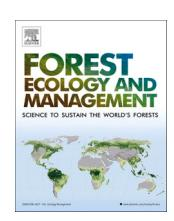
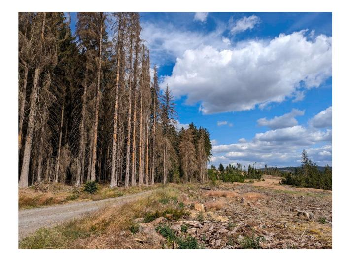
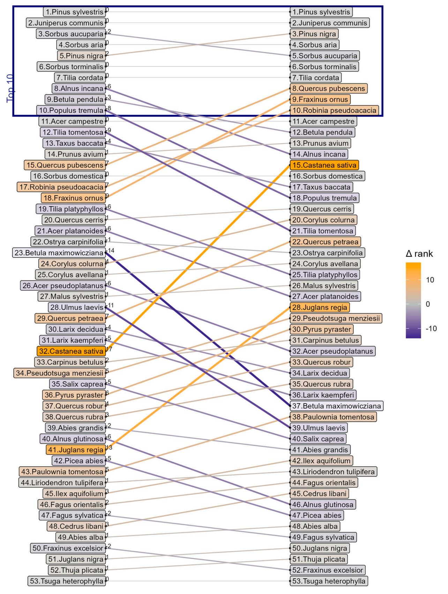
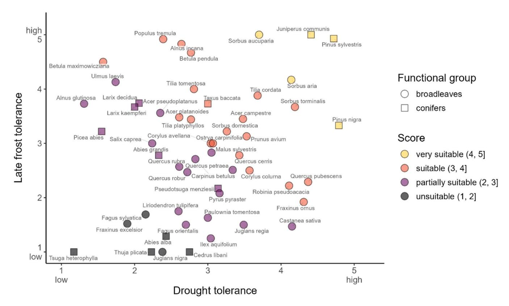
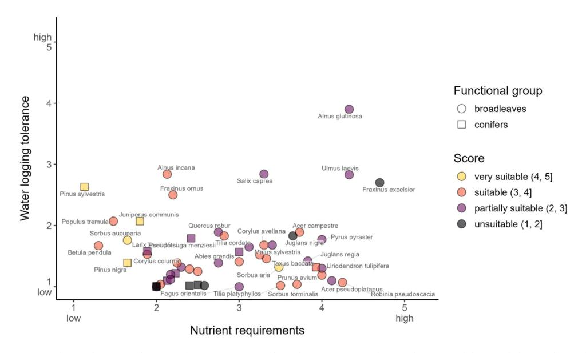
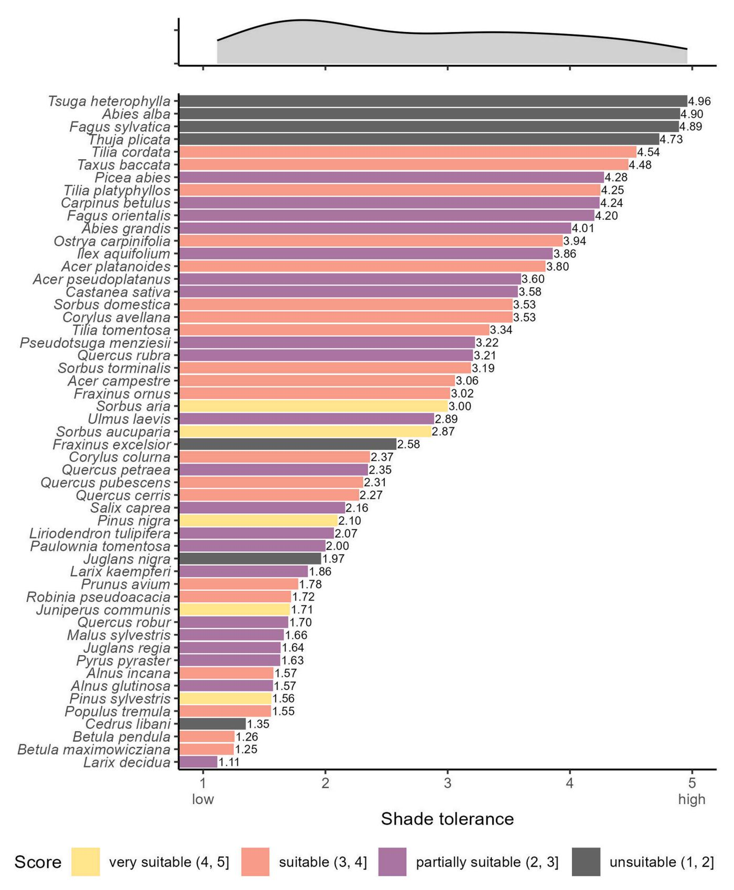

ELSEVIER

Contents lists available at ScienceDirect

### Forest Ecology and Management

journal homepage: www.elsevier.com/locate/foreco

## Coping with novel disturbance regimes: Suitability of 53 tree species for regenerating Central European forests

Dominik Thom a,b,\*, Marie-Christin Wimmler a,c, Sarah Le Berre a, Anna Wöhlbrandt a,d, Holger Fischer a, Frieder Füger a, Karola Plümpe a, Falk Schrewe a, Katja Skibbe a, Beatrice Thumb von Neuburg e, Katharina Tiebel a

- a Chair of Silviculture, Institute of Silviculture and Forest Protection, TUD Dresden University of Technology, Pienner Str. 8, Tharandt 01737, Germany
- b Gund Institute for Environment, University of Vermont, 617 Main Street, Burlington, VT, USA
- c Chair of Forest Biometrics and Systems Analysis, Institute of Forest Growth and Forest Computer Sciences, Technische Universität Dresden, Dresden 01069, Germany
- d Landesforstanstalt Mecklenburg-Vorpommern, Department of Forest Planning/Forest Research/Information Systems, Research Unit Silviculture and Forest Growth, Zeppelinstrasse 3, Schwerin 19061, Germany
- e Ecosystem Dynamics and Forest Management Group, School of Life Sciences, Technical University of Munich, Hans-Carl-von-Carlowitz-Platz 2, Freising 85354, Germany

#### ARTICLE INFO

# Keywords: Afforestation Adaptive forest management Reforestation Regeneration Tree species selection Weather extremes

#### ABSTRACT

Managing forests after large-scale, severe disturbance events constitutes an increasing challenge for forest practitioners. Tree species selection plays a crucial role in guiding forest ecosystems towards a desired state. However, regeneration success varies significantly among species, particularly under the harsh environmental conditions resulting from the loss of a protective forest canopy. In this study, our aim was to (i) determine the suitability of tree species for regenerating Central European forests following major disturbance events, (ii) assess the site conditions under which these species can thrive, and (iii) estimate their potential for survival and growth in complex forest structures emerging as stands continue to develop. To address the key knowledge gap of tree species selection for adaptive forest management after disturbance, we conducted an extensive literature review, including grey literature, and incorporated our expert knowledge for species with limited documented sources. In doing so, we were able to rank the suitability of 53 tree species to regenerate on large disturbed areas based on their drought and late frost tolerance. We also gathered information on their nutrient requirements and waterlogging tolerance to identify suitable site conditions for all species. Moreover, we used shade tolerance to determine the potential of these species to thrive within complex forest structures. Nearly half of the examined species were identified as suitable or highly suitable for regenerating large disturbed areas, including many species native to Central Europe. Several of the top-ranked tree species are likely able to thrive in nutrient-poor, but only few in waterlogged soils. Furthermore, many suitable species were moderately to highly shade tolerance, indicating strong potential for growth and survival in structurally complex forests. Our study may improve management guidelines for regenerating forests after major disturbance events. However, our qualitative ranking approach comes with uncertainties that need to be addressed by quantitative experiments in the future. Despite intensifying disturbance regimes under climate change, our findings remain optimistic, demonstrating that viable regeneration options exist to ensure the continued supply of timber and other ecosystem services.

#### 1. Introduction

The unprecedented disturbance period from 2018 to 2020 (Fig. 1) provided a preview of future disturbance regimes in temperate European forests that can be expected due to an intensification of climate change

(Millar and Stephenson, 2015; Seidl et al., 2017). In Germany alone, approximately half a million hectares were affected by compound drought and bark beetle disturbances, corresponding to about 4.4 % of the forest area (Thonfeld et al., 2022). In particular, low- to mid-elevation forests have experienced, and are likely to continue experiencing,

E-mail address: dominik.thom@tu-dresden.de (D. Thom).

https://doi.org/10.1016/j. foreco. 2025. 123247

\* Corresponding author at: Chair of Silviculture, Institute of Silviculture and Forest Protection, TUD Dresden University of Technology, Pienner Str. 8, Tharandt 01737, Germany.

**Fig. 1.** A salvage-logged site adjacent to a bark beetle outbreak in Northern Bavaria, Germany. The photo, taken in 2021, captures the aftermath of the record-breaking drought period from 2018 to 2020. This compound drought and bark beetle event significantly disrupted the forest microclimate across large parts of Central Europe. Establishing new forests that are both resilient to climate change and capable of covering the demands of societies for ecosystem services constitutes an increasing challenge for European foresters as climate change and disturbance regimes continue to intensify.

a strong increase in disturbance activity, driven by rising water stress and a high proportion of site-inappropriate tree species (Hlásny et al., 2021). This new dimension of disturbance extent and severity necessitates novel management approaches (Thom, 2023). Forest practitioners are facing considerable uncertainty in dealing with large disturbed areas, because of a lack in experience with these novel disturbance regimes. A crucial uncertainty in this context is the choice of tree species for regenerating disturbed forests (Braunschweiger et al., 2024).

Guiding forest development in Central Europe is of paramount importance given the high population densities and the growing societal demands for ecosystem services and nature conservation (Hernández-Morcillo et al., 2022). Productive stands of conifers, primarily composed of Norway spruce (Picea abies [Karst.]) or Scots pine (Pinus sylvestris [L.]), have historically played a dominant role in the wood-based industry of Central Europe (Bemmann, 2024). Over recent decades, the recognition of forests as biodiversity hotspots has increased (European Commission, 2023). More recently, forests have come into focus as nature-based solutions to climate change (Seddon et al., 2020). Additionally, the Covid-19 pandemic has further emphasized the value of forests for outdoor recreation (Derks et al., 2020; Pichlerová et al., 2023). To ensure that future forests can serve multiple purposes and to mitigate the risks posed by climate change and increasing disturbance activity, reforestation efforts should include a diverse range of suitable tree species (Brang et al., 2014). However, the selection of tree species for large disturbed areas (i.e., several ha without or with a very limited forest canopy) remains limited, that is, because tree species must be capable of coping with harsh environmental conditions, as cleared sites lack microclimatic buffering (De Frenne et al., 2019), supporting the regeneration of many of the main tree species in Central Europe (Schattenberg et al., 2024; Thom et al., 2023a). As the root system of tree recruits has not been fully developed, buds burst earlier as compared to mature trees (Osada and Hiura, 2019), and plants are exposed to near-ground frost (Marquis et al., 2020). As a result, regeneration is particularly vulnerable to drought (Bolte et al., 2016) and late frost (Muffler et al., 2024) during the initial years which can lead to reduced growth performance and higher mortality. Considering drought and late frost tolerance for the correct species choice may become even more important under climate change. First, compound hot and dry events will very likely increase in most parts of Europe, even under low

emission scenarios (Dosio et al., 2023; Grillakis, 2019). Second, climate change causes an earlier bud burst, while late frost events may remain common (Zohner et al., 2020).

The comparison of various species regarding their suitability for regenerating disturbed forests in Central Europe is challenging due to a lack of empirical data. A direct comparison would require all species to be planted or seeded at the same experimental sites or in growth chambers where environmental conditions can be controlled. Comparing species suitability under controlled site conditions is also possible by means of process-based simulation modeling. However, simulation models are based on functional traits derived from empirical data or expert judgement, and there are significant uncertainties about the traits of rare species (Thom et al., 2024) which might become more abundant under climate change (Thurm et al., 2018; Wessely et al., 2024). Additionally, simulation models often do not account for microclimatic differences (but see Braziunas et al., 2025), leading to further uncertainty in estimating regeneration success. Consequently, simulating the initial phase of tree regeneration offers little advantage over solely assessing species traits for estimating the potential success of regenerating large disturbed areas.

In this study, we employ a functional trait-based approach to address the large uncertainty about tree species selection for forest regeneration. The objectives of our study are to (i) determine the suitability of tree species for regenerating Central European forests following major disturbance events, (ii) assess the site conditions under which these species can thrive, and (iii) estimate their potential for survival and growth in complex forest structures emerging as stands continue to develop. We considered a large number of potentially relevant species, including both native and exotic tree species, which may serve different silvicultural goals.

#### 2. Methods

#### 2.1. Tree species selection

We conducted a comprehensive assessment of traits for tree species that are currently or potentially relevant with a focus on species for which some experience exists in Central European forestry. Given that the future ecological or economic importance of tree species can hardly be determined objectively, the choice of tree species for this study was determined by the expert opinion of the authors. We were explicitly interested in rare native, but also non-native species, which may widen the portfolio of suitable tree species for climate change adaptation. The final list comprised 53 tree species (Fig. 2).

The native species in the list are either highly abundant (e.g., Picea abies (L.) H. Karst. and Fagus sylvatica L.) or expected to gain importance under climate change (e.g., Acer campestre L. and Sorbus torminalis (L.) CRANTZ) in Central Europe. Species currently bound to Southern Europe, including Castanea sativa (Mill.), Corylus colurna (L.), Quercus cerris (L.), Quercus frainetto (Ten.), Quercus pubescens (Willd.), Ostrya carpinifolia (Scop.), Fraxinus ornus (L.), Fagus orientalis (LIPSKY), Pinus nigra (J.F. Arnold), and Tilia tomentosa (Moench) are generally more socially accepted, as they were present in Central Europe before the last glacial cycle (Krebs et al., 2004) and they may offer more compatible habitat conditions for native forest-dwelling species as they are closer related to native species compared to exotic species from other continents (Peterson St-Laurent et al., 2018). The natural ranges of these species shift northward without human intervention, but their migration speed is too slow to keep pace with the rapid progression of climate change (Loarie et al., 2009). Thus, assisted migration of these species is often considered the primary choice when selecting alternative tree species (Pedlar et al., 2012), assuming that these species enhance the climate resilience of forest ecosystems and help preserve the European forest carbon sink under climate change (Chakraborty et al., 2024). Nonetheless, we also included eight species from North America (Abies grandis (Douglas ex D.Don) Lindl., Liriodendron tulipifera (L.), Pseudotsuga

| Abies grandis - 2.33 2.78 3.00 1.57                                      | 4.90 4.01 3.06 3.80 |
|--------------------------------------------------------------------------|------------------------------|
| 3. 146. 3.1. 14. <b>3</b> 1. 14. 14. 14. 14. 14. 14. 14. 14. 14.         | 3.06                         |
| Acer campastre 3.48 3.45 3.73 1.90                                       |                              |
| 7.66 Callipestre 3.40 3.73 1.09                                          | 3.80                         |
| Acer platanoides - 2.61 3.48 3.33 1.46                                   | 0.00                         |
| Acer pseudoplatanus - 2.35 3.56 4.12 1.10                                | 3.60                         |
| Alnus glutinosa- 1.30 3.73 4.33 3.90                                     | 1.57                         |
| Alnus incana - 2.64 4.83 2.13 2.84                                       | 1.57                         |
| Betula maximowicziana - 1.57 4.50 2.50 1.25                              | 1.25                         |
| Betula pendula - 2.77 4.67 1.30 1.67                                     | 1.26                         |
| Carpinus betulus - 2.83 2.71 3.12 1.65                                   | 4.24                         |
| Castanea sativa - 4.15 1.47 2.30 1.32                                    | 3.58                         |
| Cedrus libani - 2.75 1.00 2.50 1.03                                      | 1.35                         |
| Corylus avellana - 3.04 3.00 3.30 1.68                                   | 3.53                         |
|                                                                          | 2.37                         |
| Fagus orientalis         2.70         1.50         3.00         1.00     | 4.20                         |
|                                                                          | 4.89                         |
| Fraxinus excelsior- 1.90 1.52 4.70 2.70                                  | 2.58                         |
| Fraxinus ornus - 4.31 1.92 2.20 2.50                                     | 3.02                         |
| <i>Ilex aquifolium</i> 3.04 1.25 2.75 1.39                               | 3.86                         |
| Juglans nigra - 2.38 1.00 3.65 1.83                                      | 1.97                         |
| Juglans regia - 3.49 1.50 3.83 1.42                                      | 1.64                         |
| Juniperus communis -         4.41         5.00         1.80         2.07 | 1.71                         |
| Larix decidua - 2.06 3.74 2.13 1.10                                      | 1.11                         |
| Larix kaempferi - 2.00 3.67 1.89 1.58                                    | 1.86                         |
| Liriodendron tulipifera - 2.60 1.75 4.00 1.30                            | 2.07                         |
|                                                                          | 1.66                         |
| Ostrya carpinifolia - 3.07 3.00 3.00 1.41                                | 3.94                         |
| Paulownia tomentosa - 3.00 1.62 2.00 1.00                                | 2.00                         |
| Picea abies - 1.55 3.22 2.23 1.22                                        | 4.28                         |
| Pinus nigra - 4.79 3.33 1.65 1.39                                        | 2.10                         |
| Pinus sylvestris - 4.72 4.93 1.12 2.63                                   | 1.56                         |
| Populus tremula - 2.39 4.92 1.48 2.07                                    | 1.55                         |
| Prunus avium- 3.53 3.13 4.00 1.19                                        | 1.78                         |
| Pseudotsuga menziesii - 3.14 2.17 2.42 1.79                              | 3.22                         |
| Pyrus pyraster- 3.15 2.08 4.00 1.77                                      | 1.63                         |
| Quercus cerris         3.43         2.78         2.40         1.29       | 2.27                         |
| Quercus petraea-         3.34         2.51         2.17         1.20     | 2.35                         |
| Quercus pubescens         4.37         2.29         2.25         1.39    | 2.31                         |
|                                                                          | 1.70                         |
| Quercus rubra-         2.61         2.57         2.17         1.12       | 3.21                         |
|                                                                          | 1.72                         |
| Salix caprea - 2.24 3.00 3.30 2.84                                       | 2.16                         |
| Sorbus aria - 4.14 4.17 3.48 1.32                                        | 3.00                         |
|                                                                          | 2.87                         |
| Sorbus domestica - 3.26 3.22 2.05 1.04                                   | 3.53                         |
| Sorbus torminalis 4.18 3.67 3.70 1.04                                    | 3.19                         |
| Taxus baccata- 3.00 3.73 3.92 1.32                                       | 4.48                         |
|                                                                          | 4.73                         |
|                                                                          | 4.54                         |
|                                                                          | 4.25                         |
|                                                                          | 3.34                         |
|                                                                          | 4.96                         |
| Ulmus laevis 1.74 4.13 4.33 2.83                                         | 2.89                         |

Fig. 2. Collection of qualitative traits relevant for tree species selection on disturbed sites. Traits were standardized on a scale from 1 (minimum) to 5 (maximum), and, subsequently, averaged across all entries per species. Details about individual references for traits can be found in an online repository (https://github.com/mcwimm/thom\_etal\_species\_suitability).

menziesii (Mirbel) Franco, Quercus rubra (L.), Robinia pseudoacacia (L.), Thuja plicata (Donn ex D.Don), Tsuga heterophylla (Raf.) Sarg., Juglans nigra (L.)) and five from Asia (Betula maximowicziana (Regel), Larix kaempferi (LAMB.) CARRIÈRE, Cedrus libani (A.Rich)., Paulownia tomentosa (Thunb.) Steud., Juglans regia (L.)). Some of these species, such as Abies grandis, Pseudotsuga menziesii, and Robinia pseudoacacia, are already abundant and have been integrated into European forest management for decades to centuries (Eckhart et al., 2019). Other species, such as Cedrus libani, Liriodendron tulipifera, and Paulownia tomentosa have received less attention, but are discussed as promising alternative tree species for Central Europe.

#### 2.2. Collection of functional traits

First, we identified the characteristics most critical for tree species regeneration in open areas devoid of a forest microclimate after largescale disturbances. These included tolerance to drought, heat, and late frost. However, we excluded heat tolerance from our analysis as we only found standardizable information for about half the species (Hauck et al., 2025). Drought is expected to increase in Central Europe as a direct consequence of climate change (Dosio et al., 2023; Grillakis, 2019). In addition, the risk of late frost damage may rise in the future due to earlier bud break coupled with a high variability in the timing of frost events (Augspurger, 2013; Zohner et al., 2020). Second, we defined traits related to site conditions more broadly to determine where tree species can thrive. For this purpose, we considered nutrient requirements and tolerance to waterlogging. Nutrient requirements need to be considered in order to estimate how well a tree species can grow and survive under resource limitations, whereas waterlogging tolerance permits species to grow and survive despite low oxygen availability in soils. Third, we used shade tolerance as an indicator of tree species' ability to grow and survive within complex forest structures (i.e., vertical stratification) which is an important factor to consider when establishing new forests for their future resilience (Diaci et al., 2017). Moreover, canopy space filling of different species and differently sized trees drive complementary effects which may increase forest productivity and carbon sequestration (Pretzsch, 2014).

We began with the derivation of functional traits using the TRY database (Kattge et al., 2020). Since the parameters we sought were supported by only a limited number of studies within the database, we examined the original sources in more detail. In effect, we only used the TRY database to search for published literature from where we then obtained the trait data directly. In addition, we conducted an extensive additional literature review. To allow for the inclusion of grey literature, we opted for a narrative instead of a systematic review (Stratton, 2019). Furthermore, when limited information was available for a specific trait, we incorporated our own expert estimates based on ecological knowledge and field observations. The trait information gathered from all sources was qualitative, as we were unable to derive traits on a relative scale across a large number of species due to the lack of standardized experimental settings and measures. Moreover, although the search was primarily for traits that are valid during the regeneration stage, only little information about the corresponding development stage was provided. Consequently, the qualitative trait data included in this study should not be interpreted as definitive evidence (see discussion below). Nevertheless, despite these limitations, our approach helps reduce parameter uncertainty by integrating multiple qualitative sources. Further details on the references of the functional traits can be found in an online repository (https://github.com/mcwimm/thom\_etal\_species\_ suitability).

#### 2.3. Analysis

First, we scaled data sources for all five traits from one (minimum) to five (maximum) as this scale was also used by Niinemets and Valladares (2006), which is among the most well-known and most comprehensive

study on drought, shade, and waterlogging tolerance. Based on their definition, values can be interpreted as 1, very intolerant; 2, intolerant; 3, moderately tolerant; 4, tolerant; and 5, very tolerant. Then we averaged all gathered data per trait and species (Fig. 2). Based on that, we used the data on drought and late frost tolerance to derive a ranking of tree species suitability after large-scale disturbance. The correlation coefficient (Spearman's rho) between drought and late-frost tolerance was r = 0.1 assuring high independence of both traits and thus a high individual information value. As drought might be of greater concern than late-frost in the future (IPCC, 2012), we conducted a sensitivity analysis of the ranking by assigning drought tolerance twice the weight of late frost tolerance. More details on the computation of the ranking can be found in the online repository (https://github.com/mcwimm/th om\_etal\_species\_suitability). Lastly, we tested the Spearman rank correlation coefficient to examine the relationship between the species suitability ranking score and site conditions, including nutrient requirements and waterlogging tolerance, as well as shade tolerance. All visualizations were conducted in R (version 4.4.2), using the packages 'ggplot2' (Wickham, 2019), 'ggpubr' (Kassambara, 2025), 'ggrepel' (Slowikowski et al., 2024), and 'ggcorrplot' (Kassambara, 2023).

#### 3. Results

#### 3.1. Tree species suitability for regenerating large disturbed forest areas

Our ranking revealed distinct differences in the tree species suitability for regenerating large disturbed forest areas (Fig. 3, Fig. 4). Notably, several species exhibit high potential to thrive under the challenging conditions provided by open areas that lack a protective forest microclimate. We did not detect any pattern that either broadleaved or coniferous tree species perform better or worse than the other.

The top ten species in the ranking assuming equal weights for drought and late frost tolerance consisted only of species native to Central Europe (Figs. 3 and 4). In total, five species (Pinus sylvestris, Juniperus communis, Sorbus aucuparia, Sorbus aria, and Pinus nigra) were identified as very suitable (score > 4). Among these, Pinus sylvestris, Juniperus communis, and Sorbus aria are exceptionally tolerant to both drought and late frost (Fig. 4). 20 species (Sorbus torminalis, Tilia cordata, Alnus incana, Betula pendula, Populus tremula, Acer campestre, Tilia tomentosa, Taxus baccata, Prunus avium, Quercus pubescens, Sorbus domestica, Robinia pseudoacacia, Fraxinus ornus, Tilia platyphyllos, Quercus cerris, Acer platanoides, Betula maximowicziana, Ostrya carpinifolia, Corylus colurna, and Corylus avellana) are considered suitable (4 > score > 3). Another group of 21 species (Acer pseudoplatanus, Malus sylvestris, Ulmus laevis, Quercus petraea, Larix decidua, Larix kaempferi, Castanea sativa, Carpinus betulus, Pseudotsuga menziesii, Salix caprea, Pyrus pyraster, Quercus robur, Quercus rubra, Abies grandis, Alnus glutinosa, Juglans regia, Picea abies, Paulownia tomentosa, Liriodendron tulipifera, Ilex aquifolium, and Fagus orientalis) are deemed partially suitable (3  $\geq$  score > 2). Finally, only seven species were found to be unsuitable (score  $\leq$  2) (Fagus sylvatica, Cedrus libani, Abies alba, Fraxinus excelsior, Juglans nigra, Thuja plicata, and Tsuga heterophylla).

Increasing the weighting of drought tolerance did not significantly alter the overall ranking, but some notable shifts occurred. The species with the greatest upward movement was *Castanea sativa* (+17 ranks), highlighting its strong drought tolerance, but comparably low late frost tolerance. A strong upwards shift in the ranking was also observed for *Juglans regia* (+ 13 ranks), and *Fraxinus ornus* (+ nine ranks), *Robinia pseudoacacia* (+ seven ranks), and *Quercus pubescens* (+ seven ranks). Notably, *Quercus pubescens*, *Fraxinus ornus*, and *Robinia pseudoacacia* moved into the top ten of the ranking. Conversely, two of the species that dropped out of the top ten were also among those experiencing the most significant downward shifts. That is, *Populus tremula* declined by eight ranks, followed by *Alnus incana*, which dropped by six ranks.

Fig. 3. Tree species suitability rank for regenerating large disturbed forest areas in Central Europe. The ranking of the left panel is based on the average of drought and late-frost tolerance of the regeneration of 53 tree species. The ranking of the right panel weighs drought tolerance twice and late-frost tolerance once in order to account for the potentially strong increase in drought frequency and intensity under climate change. The lines indicate the delta between both ranking approaches.

Fig. 4. Drought and late frost tolerance of 53 tree species. The colors per species denote the score of the suitability ranking of tree species (range: 1-5). Circles and squares distinguish the functional groups broadleaves and conifers, respectively. The score of the suitability ranking translates approximately into > 4: Very suitable; 3-4 suitable; 2-3 partially suitable; and < 2 unsuitable for regenerating disturbed areas lacking a forest microclimate.

#### 3.2. Site conditions requirements

The relationship between the suitability score and site conditions was only low to moderate (Fig. 5). While nutrient requirements showed a negative correlation (rho  $=-0.19,\,p=0.180),$  waterlogging tolerance was positively correlated (rho  $=0.29,\,p=0.034)$  with the suitability score. In effect, our results suggest a weak tendency for species adapted to large disturbed sites to tolerate both nutrient-poor and waterlogged

conditions better than less-adapted species. However, no consistent pattern between suitability scores and site conditions could be identified (Fig. 5).

Overall, coniferous tree species tended to have relatively low nutrient requirements (max. 3). Among the species ranked as highly suitable or suitable for regenerating forests after large-scale disturbance (score > 3), Betula pendula, Corylus colurna, Juniperus communis, Populus tremula, Pinus nigra, Pinus sylvestris, and Sorbus aucuparia stood out due

Fig. 5. Nutrient requirements and waterlogging tolerance of 53 tree species. The colors per species denote the score of the suitability ranking of tree species (range: 1 – 5). Circles and squares distinguish the functional groups broadleaves and conifers, respectively.

to their very low nutrient requirements ( $\leq$  2). Of those, *Juniperus communis, Populus tremula*, and *Pinus sylvestris* also have some capacity to thrive on waterlogged soils (waterlogging tolerance > 2). Other highly ranked species capable of coping with waterlogged conditions to some extent (waterlogging tolerance > 2) while requiring a moderate amount of nutrients ( $3 \geq$  nutrient requirements > 2) included *Alnus incana* and *Fraxinus ornus*. Moreover, while six of the highly ranked species (*Betula maximowicziana, Ostrya carpinifolia, Quercus cerris, Quercus pubescens, Sorbus domestica*, and *Tilia cordata*) have only a very limited tolerance to waterlogged soils (waterlogging tolerance < 2), they are able to grow in soils with moderate nutrient levels ( $3 \geq$  nutrient requirements > 2).

#### 3.3. Ability of species to grow in complex forest structures

The ability of tree species to thrive in complex forest structures showed likewise only a moderate correlation with the suitability score. The correlation analysis resulted in a negative relationship between shade tolerance and the suitability score (rho=-0.23, p=0.110), indicating a weak trend that species adapted to large disturbed areas are less capable to grow in the shade of a forest canopy.

Among the highly ranked species (score > 3), three exhibited very high shade tolerance (shade tolerance > 4), that is, *Taxus baccata*, *Tilia cordata*, and *Tilia platyphyllos* (Fig. 6). An additional eight species ranked as suitable demonstrated fairly high shade tolerance ( $4 \ge$  shade tolerance > 3), including *Acer campestre*, *Acer platanoides*, *Corylus avellana*, *Fraxinus ornus*, *Ostrya carpinifolia*, *Sorbus domestica*, *Sorbus torminalis*, and *Tilia tomentosa*.

#### 4. Discussion

The primary objective of our study was to address a central question in forest management: which tree species are suitable for regeneration following major disturbance events? In particular, we examined which additional species, beyond well-known pioneer species, may be appropriate for large-scale disturbed areas. This study thus provides an impetus for expanding the species pool considered in reforestation efforts. It can serve as a practical guide for trials involving tree species that have thus far received limited attention in the context of regeneration after major disturbance events. Besides that, the findings are relevant for afforestation or renaturation projects, such as the ecological restoration of abandoned mining sites.

Our qualitative research approach revealed that, among the 53 tree species examined, nearly half were identified as suitable or highly suitable for regenerating areas where the microclimatic buffering effects of forest canopies are absent (Fig. 4). This result represents a general categorization that must be interpreted in the context of local site conditions. For example, at higher elevations, where precipitation is greater but temperatures are lower, drought tolerance becomes less critical, while late frost tolerance gains importance. Soil conditions must also be considered; therefore, we subsequently analyzed the specific site nutrient and waterlogging conditions under which these species can thrive. Notably, several of the highly ranked species are well-adapted to nutrient-poor soils, but only few can tolerate waterlogged conditions to some degree (Fig. 5). Finally, we assessed the ability of tree species to thrive in structurally complex forests—an attribute increasingly emphasized in contemporary forest management strategies aimed at enhancing ecosystem resilience (European Commission, 2023). We found that many of the top-ranked species exhibit intermediate to high shade tolerance (Fig. 6), suggesting their potential to survive and grow in forest ecosystems with complex canopy structures. Overall, our findings underscore the availability of multiple promising tree species for regenerating large-scale, severely disturbed forests across a range of site conditions, highlighting the potential to sustain ecosystem services well into the future.

#### 4.1. Regenerating severely disturbed forests

Our study identified several promising species for regenerating severely disturbed forest areas. The selection of tree species for active reforestation—often a substantial financial investment—depends strongly on the specific ecosystem service goals at stake. For instance, species that are well-adapted to harsh site conditions, such as Juniperus communis, may be unsuitable for meeting production-oriented objectives. Accordingly, selecting optimal species requires balancing ecological compatibility with the targeted supply of ecosystem services. In many regions of Europe, timber production remains a core objective of forest management. We found Pinus sylvestris, a key species of timber production across large parts of the continent, to be highly suitable for reforesting large forest gaps (Fig. 4). However, recent studies have shown that adult Pinus sylvestris trees may also respond strongly to drought stress (Schuldt and Ruehr, 2022; Thom et al., 2023b), especially under compounding stressors (Desprez-Loustau et al., 2006; Tubby et al., 2023), underscoring the risk associated with single-species strategies. Instead, forest regeneration efforts should emphasize species diversity tailored to local site conditions. Notably, Sorbus domestica, Sorbus torminalis, and Prunus avium emerged as well-suited for severely disturbed forests. While the increment rates of these species are lower than those of the main tree species in Europe, their high-value timber could potentially offset economic losses resulting from reduced timber production. Given the limited availability and high cost of seeds and planting material for these species (see e.g., https://www.baumschuled irekt.de/), a practical approach might involve introducing them in small groups or at wider spacings to enhance economic efficiency and/or support their future regeneration. Moreover, production-oriented forest mixtures can incorporate species that, while not primarily selected for timber, improve site conditions or enhance the growth of more commercially valuable trees (Stark et al., 2015). For example, the highly ranked Tilia cordata can be interplanted between groups of high-value timber species to improve stand structure and resilience (De Jaegere et al., 2016).

With the exception of Pinus sylvestris, the most abundant native tree species in Central Europe were found to be poorly suited for regenerating severely disturbed forest areas (Fig. 4). For instance, Fagus sylvatica, the most widespread broadleaf species in Central Europe, and Abies alba, often used as a substitute for the disturbance-prone Picea abies, both showed low suitability for reforesting disturbed sites due to their dependence on a forest microclimate (Schattenberg et al., 2024; Thom et al., 2023a). This also means, pine remains the only taxa among the highly ranked species for reforesting large and severely disturbed forests to hold significant commercial value for the current European timber industry. Pine alone is unlikely to compensate for the reduction in wood production caused by disturbances that primarily affect Norway spruce, the most important commercial tree species in Europe (Knoke et al., 2021). Alternative species currently lack comparable market relevance. However, the future timber market remains highly uncertain, and the value of species used for reforestation today may differ substantially from their value in decades when mature trees are harvested (West et al., 2021). To increase the appeal of alternative species for reforestation, targeted efforts are needed to develop new value chains and product uses. This includes fostering market demand, adjusting downstream processing infrastructure, and expanding utilization potential in wood-based industries. In parallel, improvements in seed and planting material procurement systems are essential to ensure consistent availability and affordability, thereby enabling broader adoption of these species in future-oriented forest management strategies.

Due to the current demands of the timber industry but also limited management experience, reforestation efforts oftentimes still focus on historically common tree species for timber production. Yet, alternative approaches, such as working with pioneer forests (German: "Vorwald"), have gained traction, particularly following the widespread tree mortality during the 2018–2020 drought period (Tiebel, 2024). *Alnus* 

Fig. 6. Shade tolerance of 53 tree species. The colors per species denote the score of the suitability ranking of tree species (range: 1-5). The frequency distribution on top of the figure indicates that the shade tolerance of the assessed tree species is relatively evenly distributed, with a slight peak at the lower end of the shade-tolerance scale.

incana, Betula pendula, Juniperus communis, Populus tremula, Sorbus aria, and Sorbus aucuparia, which are typical early seral species, were among the top-ranked species for regenerating severely disturbed areas in our study. While these species may be of limited commercial value, they offer potential economic benefits (i.e., minimizing costs for artificial regeneration), enhance biodiversity, stabilize microclimates, and improve soil conditions, thereby facilitating the establishment of later seral, economically more valuable species (Hynynen et al., 2010; Kuzovkina and Quigley, 2005; Raspé et al., 2000; Worrell, 1995).

In addition to commonly defined early seral pioneer species, our study highlights alternative species that might be capable to thrive at large disturbed sites. Defining pioneer species purely based on functional traits can be challenging. While shade tolerance is commonly used to categorize early successional species, we found only a weak indication that shade tolerant species are less suited for disturbed areas (rho = -0.23, p = 0.110), suggesting that a generalization only based on shade tolerance is insufficient. For instance, shade-tolerant species such as *Tilia cordata*, *Tilia tomentosa*, *Tilia platyphyllos*, and *Taxus baccata*, typically classified as intermediate to late-successional, ranked highly in our study. Meanwhile, *Cedrus libani*, classified as an early successional species, received a low ranking, due to its low tolerance to late frost—a trait associated with its Mediterranean origin.

The considerable number of native species in Central Europe capable of tolerating harsh environmental conditions identified in this study (Fig. 3, Fig. 4) indicates strong potential for forest regeneration using native species rather than introducing exotic ones. Exotic tree species may become invasive (Langmaier and Lapin, 2020), or not align with conservation goals (Pötzelsberger et al., 2020), and can be in conflict with forest certification systems (e.g., FSC) (Matias et al., 2024). Nonetheless, exotic species have the potential to diversify the risks of an increasingly uncertain future. For instance, *Corylus colurna*, or *Tilia tomentosa* could widen the portfolio of the comparatively small pool of approximately 70 native central European tree species (Dimitrova et al., 2022).

Not only species, but also provenances need to be considered in adaptive forest management. Assisted gene flow has been proposed as an alternative to assisted migration (Chludil et al., 2025; Sgrò et al., 2011), though its effectiveness depends on species-specific trait variability. Some species, such as *Fagus sylvatica* and *Juniperus communis*, exhibit limited variation in drought tolerance, restricting the benefits of provenance-based approaches (Unterholzner et al., 2024, 2020). Additionally, provenances are often more difficult to communicate than species-level strategies. Nonetheless, identifying provenances with enhanced drought and late-frost tolerance may offer promising opportunities for ensuring the successful regeneration of large disturbed areas (Matisons et al., 2021).

A scientifically informed species or provenance selection strategy is only meaningful when biotic stressors that threaten tree establishment are adequately addressed. Factors such as mammalian herbivory (e.g., Apodemus spp., Cervus elaphus), pathogenic fungi (e.g., Heterobasidion annosum, Armillaria spp.), and insect pests (e.g., Hylobius abietis) can significantly impair regeneration success if left unmanaged. Accordingly, effective control measures, such as site-specific wildlife management strategies, protective fencing, or silvicultural treatments, must be integrated into reforestation planning (Löf et al., 2021). For example, a fallow period following clear-cutting (German: "Schlagruhe") has proven effective in reducing H. abietis populations on reforestation sites (Nordlander et al., 2017).

As the selection of suitable tree species for reforesting large, severely disturbed areas is currently one of the major concerns of forest managers in Central Europe, many foresters have begun experimenting with species with which they have little prior experience. This is an important step toward expanding knowledge and building a robust species portfolio that can help prevent severe post-reforestation losses. However, persistent knowledge gaps, legal constraints, and market pressures from the timber industry continue to pose significant challenges to selecting

species that can safeguard the future provision of ecosystem services and the conservation of biodiversity (Mori et al., 2017). Addressing these challenges will require both further research and targeted political incentives.

#### 4.2. Implications for species distribution modelling

Climate change is a critical factor in tree species selection for forest regeneration, yet its inherent uncertainty poses major challenges for long-term planning. The trajectories of climate projections make adaptation a moving target and is difficult to determine which scenarios are most relevant for guiding species selection. Recent advances in species distribution models (e.g., Wessely et al., 2024) have improved our understanding of how species suitability may shift over time, accounting for gradual transitions between current and future climatic conditions. However, many species identified by such models as climatically suitable under future scenarios in Central Europe (Thurm et al., 2018; Wessely et al., 2024) were not among the top candidates for regeneration following disturbance in our study. This discrepancy reflects key limitations of SDMs: they typically rely on multi-year climate averages derived from the current geographic ranges of species, which are often shaped by biotic interactions (i.e., the realized niche) rather than the full physiological potential of the species (i.e., the physiological niche) (Lissovsky et al., 2021). Moreover, most models do not account for weather extremes, such as late frosts and severe droughts, or for the particularly harsh environmental conditions that characterize large disturbed forest areas (Norberg et al., 2019). Adding to this, projections for variables like frost frequency or temperature extremes carry considerable uncertainty and rarely capture fine-scale microclimatic heterogeneity, which can strongly influence seed and seedling survival (Talsma et al., 2023). Consequently, species suitability estimates from standard SDMs may be biased if disturbance regimes continue to intensify in the future (Sallmannshofer et al., 2021). To improve the predictive power of SDMs in the context of forest regeneration, future research should explicitly incorporate the unique ecological (e.g., soils, weeds) and microclimatic conditions (e.g., weather extremes, light conditions) of disturbed environments. Such improvements in SDMs would facilitate the identification of species that are not only capable of establishing in open, exposed sites but are also resilient to the increasingly variable and extreme climatic conditions expected over their lifetime.

#### 4.3. Study limitations

Our study has three major limitations. The most important limitation stems from the inherent uncertainty in trait assessments. Because traits were estimated qualitatively, rather than quantitatively, they should be interpreted with caution. We followed the scaling approach of Niinemets and Valladares (2006), in which traits are rated from 1 (very intolerant) to 5 (very tolerant). While observational estimates provide a general understanding, the values derived from our references are not exact. To mitigate this issue, we incorporated multiple expert-based references and supplemented them with our own expertise, particularly for species with limited documented sources. This allowed us to generate what is likely the currently most robust specification possible of these traits and for these species, going beyond the widely used Ellenberg values. Although Ellenberg values were incorporated into our analysis, the correlations between our final values and the Ellenberg indicators for drought and late frost were r = 0.83 and r = 0.74, respectively, indicating overall agreement but also some divergence However, the final trait values presented should not be regarded as precise scientific measurements. A more detailed and accurate approach would have involved a finer-scaled review of individual attributes that contribute to each of the five traits examined. Yet, this method presents several challenges. First, selecting which individual attributes to include and determining their relative importance in describing the overall target trait, such as

drought tolerance, is complex. For example, Aubin et al. (2016) identified 12 individual attributes linked to drought tolerance. Second, finding consistent data in the literature for all relevant traits across species would be highly difficult. Third, collecting sufficient information to enable meaningful comparisons among the large number of species in our study, in particular rare species, would have been nearly impossible. Given that many rare species play a crucial role in regenerating large disturbed forest areas (Fig. 4), a more detailed approach would have prevented us from providing an overview of a broad suite of species essential for post-disturbance forest recovery.

The second major limitation of our study is that our approach relies on mean trait values, without accounting for differences in provenances or variations among individuals of a species. While this simplification may be less problematic for some traits, such as the drought tolerance of Juniperus communis and Fagus sylvatica (Unterholzner et al., 2024, 2020), it presents challenges for species like Abies alba, which exhibit significant provenance-based differences in drought tolerance (Hansen and Larsen, 2004). Additionally, the use of mean traits disregards changes throughout the trees' lifetime. Although our primary focus was on regeneration traits, it is important to note that not all trait values presented strictly refer to the regeneration stage, but may also express general averages across different developmental phases. Certain traits used in this study, such as late frost tolerance, address the regeneration stage directly, while others, like shade tolerance, are less specific and may vary significantly over a tree's lifespan (Niinemets, 2010). However, in the case of shade tolerance, this variation affects our analysis only moderately, as our evaluation of whether tree species can thrive in complex forest structures extends beyond the regeneration phase. In contrast, average drought tolerance values are likely a greater limitation in the context of our study. Estimating how drought tolerance changes throughout a tree's lifetime is challenging. Early regeneration is particularly vulnerable to water stress due to an underdeveloped root system (Tiebel et al., 2023; Way et al., 2013). Once established, trees exhibit high hydraulic efficiency and are less susceptible to drought, but as they continue to grow, their hydraulic efficiency declines, increasing drought vulnerability again (Fernández-de-Uña et al., 2023). While there might be species-specific differences in how drought tolerance changes as trees age, this pattern likely occurs across all species, meaning that our comparative assessment of drought tolerance among species should remain overall valid despite this simplification.

A third limitation is that our ranking is based solely on drought and late frost tolerance. While these are likely among the most critical traits for determining species survival in the absence of microclimatic buffering from forest canopies, additional traits could refine the ranking further. In particular, we initially planned to incorporate heat tolerance (Hauck et al., 2025), given that droughts frequently coincide with extreme heat events (Suarez-Gutierrez et al., 2023). Unfortunately, due to the lack of available data on heat tolerance and as we were not confident to provide qualified expert opinions for many species, we proceeded with the ranking without this trait. Distinguishing the individual effects of drought and heat stress on tree mortality and growth reduction remains challenging (Brodribb et al., 2020), as drought and heat often occur at the same time. Thus, more controlled experiments are needed to assess whether a species is able to cope well with severe drought stress and extreme heat (Teskey et al., 2015).

#### 5. Conclusions

Our study demonstrates that forest managers in Central Europe have a variety of tree species to choose from when regenerating large-scale, severely disturbed forests, even given the harsh environmental conditions of those areas. Of the 53 species evaluated, 25 were identified as suitable based on our qualitative assessment. One of the most difficult challenges in post-disturbance regeneration is establishing forests on either oligotrophic or waterlogged sites. Our findings indicate that among the highly ranked species for open areas (score > 3), Betula

pendula, Corylus colurna, Juniperus communis, Populus tremula, Pinus nigra, and Pinus sylvestris are particularly well-suited for nutrient-poor soils. In disturbed forests with waterlogged soils, Alnus incana, Pinus sylvestris, and Fraxinus ornus may have the highest potential for successful regeneration. Moreover, our study highlights the strong potential to use native species for forest restoration. However, assisted migration and the introduction of exotic species from other continents may further enhance forest resilience by increasing the response diversity to climate change (Chakraborty et al., 2024). Despite the intensifying disturbance regimes in a changing climate (Seidl et al., 2017), our findings remain optimistic, indicating that multiple viable options exist to maintain the supply of ecosystem services in the future.

#### CRediT authorship contribution statement

Karola Plümpe: Writing – review & editing, Funding acquisition, Data curation. Falk Schrewe: Writing – review & editing, Data curation. Katja Skibbe: Writing – review & editing, Data curation. Beatrice Thumb von Neuburg: Writing – review & editing, Data curation. Katharina Tiebel: Writing – review & editing, Funding acquisition, Data curation. Dominik Thom: Writing – review & editing, Writing – original draft, Methodology, Funding acquisition, Formal analysis, Data curation, Conceptualization. Marie-Christin Wimmler: Writing – review & editing, Visualization, Formal analysis, Data curation. Sarah Le Berre: Writing – review & editing, Formal analysis, Data curation. Anna Wöhlbrandt: Writing – review & editing, Data curation. Frieder Füger: Writing – review & editing, Data curation. Frieder Füger: Writing – review & editing, Data curation.

#### **Declaration of Competing Interest**

The authors have no competing interests to declare.

#### Acknowledgements

DT acknowledges support from the EU Horizon project "Precilience" (grant number: 101157094) and the project "RECLAIM" (grant number: 101084481 — FORWARDS — HORIZON-CL6-2022-CLIMATE-01) funded by the European Forest Institute. AW's work was only conceivable thanks to funding from the Interreg Central Europe program (project number: 93424001). MCW acknowledge and KT acknowledge funding from the Agency for Renewable Resources (FNR) of the Federal Ministry of Food and Agriculture (BMEL) (grant numbers: 2224NR098X and 2224NR104B, respectively). BTN was supported by the Bavarian State Ministry of Food, Agriculture, Forestry and Tourism (grant number: klifW027). FF acknowledges funding from the Ministry of Agriculture and Consumer Protection of the State of North Rhine-Westphalia (Kapitel 66 030 Titel 686 78). KP was supported by the German Federal Environmental Foundation (DBU) through a PhD scholarship (grant number: 20024/016). SLB was supported by the German Research Foundation (DFG) (grant number: 500726124). We thank Franka Huth, Alexandra Wehnert, Rein Drenkhan, and two anonymous reviewers for their comments on a previous version of this study. We used Microsoft Copilot to improve the language in parts of this manuscript.

#### Data availability

All supporting data are included in an online repository (https://github.com/mcwimm/thom\_etal\_species\_suitability), along with the R code used for the analyses.

#### References

Aubin, I., Munson, A.D., Cardou, F., Burton, P.J., Isabel, N., Pedlar, J.H., Paquette, A., Taylor, A.R., Delagrange, S., Kebli, H., Messier, C., Shipley, B., Valladares, F., Kattge, J., Boisvert-Marsh, L., McKenney, D., 2016. Traits to stay, traits to move: a review of functional traits to assess sensitivity and adaptive capacity of temperate

- and boreal trees to climate change. Environ. Rev. 24, 164–186. https://doi.org/
- Augspurger, C.K., 2013. Reconstructing patterns of temperature, phenology, and frost damage over 124 years: spring damage risk is increasing. Ecology 94, 41–50. https://doi.org/10.1890/12-0200.1.
- Bemmann, M., 2024. Wood-based businesses and the economic development of Europe in the nineteenth and twentieth centuries an introduction. Econ. Hist. Yearb. 65, 279–305. https://doi.org/10.1515/jbwg-2024-0015.
- Bolte, A., Czajkowski, T., Cocozza, C., Tognetti, R., Miguel, M.D., Pšidová, E., Ditmarová, L., Dinca, L., Delzon, S., Cochard, H., Ræbild, A., Luis, M.D., Cvjetkovic, B., Heiri, C., Müller, J., 2016. Desiccation and mortality dynamics in seedlings of different european beech (Fagus sylvatica L.) populations under extreme drought conditions. Front. Plant Sci. 7, 1–12. https://doi.org/10.3389/fpls.2016.00751
- Brang, P., Spathelf, P., Larsen, J.B., Bauhus, J., Bončína, A., Chauvin, C., Drössler, L., García-Güemes, C., Heiri, C., Kerr, G., Lexer, M.J., Mason, B., Mohren, F., Mühlethaler, U., Nocentini, S., Svoboda, M., 2014. Suitability of close-to-nature silviculture for adapting temperate european forests to climate change. Forestry 87, 492–503. https://doi.org/10.1093/forestry/cpu018.
- Braunschweiger, D., Ohmura, T., Schweier, J., Olschewski, R., Schulz, T., 2024.
  Preferences for proactive and reactive climate-adaptive forest management and the role of public financial support. For. Policy Econ. 169, 103348. https://doi.org/10.1016/j.forpol.2024.103348.
- Braziunas, K.H., Rammer, W., De Frenne, P., Díaz-Calafat, J., Hedwall, P.-O., Senf, C., Thom, D., Zellweger, F., Seidl, R., 2025. Microclimate temperature effects propagate across scales in forest ecosystems. Land. Ecol. 40, 37. https://doi.org/10.1007/s10980-025-02054-8.
- Brodribb, T.J., Powers, J., Cochard, H., Choat, B., 2020. Hanging by a thread? Forests and drought. Science 368, 261–266. https://doi.org/10.1126/science.aat7631.
- Chakraborty, D., Ciceu, A., Ballian, D., Benito Garzón, M., Bolte, A., Bozic, G., Buchacher, R., Čepl, J., Cremer, E., Ducousso, A., Gaviria, J., George, J.P., Hardtke, A., Ivankovic, M., Klisz, M., Kowalczyk, J., Kremer, A., Lstibůrek, M., Longauer, R., Mihai, G., Nagy, L., Petkova, K., Popov, E., Schirmer, R., Skrøppa, T., Solvin, T.M., Steffenrem, A., Stejskal, J., Stojnic, S., Volmer, K., Schueler, S., 2024. Assisted tree migration can preserve the european forest carbon sink under climate change. Nat. Clim. Chang 14, 845–852. https://doi.org/10.1038/s41558-024-0288-5
- Chludil, D., Čepl, J., Steffenrem, A., Stejskal, J., Sagariya, C., Pook, T., Schueler, S., Korecký, J., Almqvist, C., Chakraborty, D., Berlin, M., Lstibůrek, M., 2025. A Pollen-Based assisted migration for rapid forest adaptation. Glob. Change Biol. 31, e70014. https://doi.org/10.1111/gcb.70014.
- De Frenne, P., Zellweger, F., Rodríguez-Sánchez, F., Scheffers, B.R., Hylander, K., Luoto, M., Vellend, M., Verheyen, K., Lenoir, J., 2019. Global buffering of temperatures under forest canopies. Nat. Ecol. Evol. 3, 744–749. https://doi.org/ 10.1038/s41559-019-0842-1.
- De Jaegere, T., Hein, S., Claessens, H., 2016. A review of the characteristics of Small-Leaved lime (Tilia cordata Mill.) and their implications for silviculture in a changing climate. Forests 7, 56. https://doi.org/10.3390/f7030056.
- Derks, J., Giessen, L., Winkel, G., 2020. COVID-19-induced visitor boom reveals the importance of forests as critical infrastructure. For. Policy Econ. 118, 102253. https://doi.org/10.1016/j.forpol.2020.102253.
- Desprez-Loustau, M.-L., Marçais, B., Nageleisen, L.-M., Piou, D., Vannini, A., 2006. Interactive effects of drought and pathogens in forest trees. Ann. For. Sci. 63, 597–612. https://doi.org/10.1051/forest;2006040.
- Diaci, J., Rozenbergar, D., Fidej, G., Nagel, T.A., 2017. Challenges for uneven-aged silviculture in restoration of post-disturbance forests in central Europe: a synthesis. Forests 8. https://doi.org/10.3390/f8100378.
- Dimitrova, A., Csilléry, K., Klisz, M., Lévesque, M., Heinrichs, S., Cailleret, M., Andivia, E., Madsen, P., Böhenius, H., Cvjetkovic, B., De Cuyper, B., De Dato, G., Ferus, P., Heinze, B., Ivetić, V., Köbölkuti, Z., Lazarević, J., Lazdina, D., Maaten, T., Makovskis, K., Milovanović, J., Monteiro, A.T., Nonić, M., Place, S., Puchalka, R., Montagnoli, A., 2022. Risks, benefits, and knowledge gaps of non-native tree species in Europe. Front. Ecol. Evol. 10, 908464. https://doi.org/10.3389/ feva 2022 908464
- Dosio, A., Spinoni, J., Migliavacca, M., 2023. Record-breaking and unprecedented compound hot and dry summers in Europe under different emission scenarios. Environ. Res. Clim. 2, 045009. https://doi.org/10.1088/2752-5295/acfa1b.
- Eckhart, T., Pötzelsberger, E., Koeck, R., Thom, D., Lair, G.J., Loo, M. van, Hasenauer, H., 2019. Forest stand productivity derived from site conditions: an assessment of old Douglas-fir stands (Pseudotsuga menziesii (Mirb.) Franco var. menziesii) in central Europe. Ann. For. Sci. 76. https://doi.org/10.1007/s13595-019-0805-3.
- European Commission, 2023. Guidelines on Closer-to-nature Forest Management (Ed.). Publications Office, Luxembourg. https://doi.org/10.2779/898789.
- Fernández-de-Uña, L., Martínez-Vilalta, J., Poyatos, R., Mencuccini, M., McDowell, N.G., 2023. The role of height-driven constraints and compensations on tree vulnerability to drought. N. Phytol. 239, 2083–2098. https://doi.org/10.1111/nph.19130.
- Grillakis, M.G., 2019. Increase in severe and extreme soil moisture droughts for Europe under climate change. Sci. Total Environ. 660, 1245–1255. https://doi.org/ 10.1016/j.scitotenv.2019.01.001.
- Hansen, J., Larsen, J., 2004. European silver fir (Abies alba Mill.) provenances from calabria, Southern Italy: 15-year results from danish provenance field trials. Eur. J. For. Res. https://doi.org/10.1007/s10342-004-0031-9.
- Hauck, M., Schneider, T., Bahlinger, S., Fischbach, J., Oswald, G., Csapek, G., Dulamsuren, C., 2025. Heat tolerance of temperate tree species from central Europe. For. Ecol. Manag. 580, 122541. https://doi.org/10.1016/j.foreco.2025.122541.

- Hernández-Morcillo, M., Torralba, M., Baiges, T., Bernasconi, A., Bottaro, G., Brogaard, S., Bussola, F., Díaz-Varela, E., Geneletti, D., Grossmann, C.M., Kister, J., Klingler, M., Loft, L., Lovric, M., Mann, C., Pipart, N., Roces-Díaz, J.V., Sorge, S., Tiebel, M., Tyrväinen, L., Varela, E., Winkel, G., Plieninger, T., 2022. Scanning the solutions for the sustainable supply of forest ecosystem services in Europe. Sustain Sci. 17, 2013–2029. https://doi.org/10.1007/s11625-022-01111-4.
- Hlásny, T., Zimová, S., Merganičová, K., Štěpánek, P., Modlinger, R., Turčáni, M., 2021. Devastating outbreak of bark beetles in the Czech Republic: drivers, impacts, and management implications. For. Ecol. Manag. 490, 119075. https://doi.org/10.1016/ i.foreco.2021.119075.
- Hynynen, J., Niemistö, P., Viherä-Aarnio, A., Brunner, A., Hein, S., Velling, P., 2010. Silviculture of birch (Betula pendula Roth and Betula pubescens Ehrh.) in Northern Europe. Forestry 83, 103–119. https://doi.org/10.1093/forestry/cpp035.
- IPCC, 2012. In: Field, C.B., Barros, V., Stocker, T.F., Qin, D., Dokken, D.J., Ebi, K.L., Mastrandrea, M.D., Mach, K.J., Plattner, G.K., Allen, S.K., Tignor, M., Midgley, P.M. (Eds.), Managing the Risks of Extreme Events and Disasters to Advance Climate Change Adaptation. Cambridge University Press. https://doi.org/10.1017/ CBO9781139177245.
- Kassambara, A., 2023. Package 'ggcorrplot.' Kassambara, A., 2025. Package 'ggpubr.'
- Kattge, J., Bönisch, G., Díaz, S., Lavorel, S., Prentice, I.C., Leadley, P., Tautenhahn, S., Werner, G.D.A., Aakala, T., Abedi, M., Acosta, A.T.R., Adamidis, G.C., Adamson, K., Aiba, M., Albert, C.H., Alcántara, J.M., C, C.A., Aleixo, I., Ali, H., Amiaud, B., Ammer, C., Amoroso, M.M., Anand, M., Anderson, C., Anten, N., Antos, J., Apgaua, D.M.G., Ashman, T.L., Asmara, D.H., Asner, G.P., Aspinwall, M., Atkin, O., Aubin, I., Baastrup-Spohr, L., Bahalkeh, K., Bahn, M., Baker, T., Baker, W.J., Bakker, J.P., Baldocchi, D., Baltzer, J., Banerjee, A., Baranger, A., Barlow, J., Barneche, D.R., Baruch, Z., Bastianelli, D., Battles, J., Bauerle, W., Bauters, M., Bazzato, E., Beckmann, M., Beeckman, H., Beierkuhnlein, C., Bekker, R., Belfry, G., Belluau, M., Beloiu, M., Benavides, R., Benomar, L., Berdugo-Lattke, M.L., Berenguer, E., Bergamin, R., Bergmann, J., Carlucci, M.B., Berner, L., Bernhardt-Römermann, M., Bigler, C., Bjorkman, A.D., Blackman, C., Blanco, C., Blonder, B., Blumenthal, D., Bocanegra-González, K.T., Boeckx, P., Bohlman, S., Böhning-Gaese, K., Boisvert-Marsh, L., Bond, W., Bond-Lamberty, B., Boom, A., Boonman, C. C.F., Bordin, K., Boughton, E.H., Boukili, V., Bowman, D.M.J.S., Bravo, S., Brendel, M.R., Broadley, M.R., Brown, K.A., Bruelheide, H., Brumnich, F., Bruun, H. H., Bruy, D., Buchanan, S.W., Bucher, S.F., Buchmann, N., Buitenwerf, R., Bunker, D. E., Bürger, J., Burrascano, S., Burslem, D.F.R.P., Butterfield, B.J., Byun, C., Marques, M., Scalon, M.C., Caccianiga, M., Cadotte, M., Cailleret, M., Camac, J., Camarero, J.J., Campany, C., Campetella, G., Campos, J.A., Cano-Arboleda, L., Canullo, R., Carbognani, M., Carvalho, F., Casanoves, F., Castagnevrol, B., Catford, J. A., Cavender-Bares, J., Cerabolini, B.E.L., Cervellini, M., Chacón-Madrigal, E., Chapin, K., Chapin, F.S., Chelli, S., Chen, S.C., Chen, A., Cherubini, P., Chianucci, F., Choat, B., Chung, K.S., Chytrý, M., Ciccarelli, D., Coll, L., Collins, C.G., Conti, L., Coomes, D., Cornelissen, J.H.C., Cornwell, W.K., Corona, P., Coyea, M., Craine, J., Craven, D., Cromsigt, J.P.G.M., Csecserits, A., Cufar, K., Cuntz, M., Silva, A.C. da, Dahlin, K.M., Dainese, M., Dalke, I., Fratte, M.D., Dang-Le, A.T., Danihelka, J., Dannoura, M., Dawson, S., Beer, A.J. de, Frutos, A.D., Long, J.R.D., Dechant, B., Delagrange, S., Delpierre, N., Derroire, G., Dias, A.S., Diaz-Toribio, M.H., Dimitrakopoulos, P.G., Dobrowolski, M., Doktor, D., Dřevojan, P., Dong, N., Dransfield, J., Dressler, S., Duarte, L., Ducouret, E., Dullinger, S., Durka, W., Duursma, R., Dymova, O., E-Vojtkó, A., Eckstein, R.L., Ejtehadi, H., Elser, J., Emilio, T., Engemann, K., Erfanian, M.B., Erfmeier, A., Esquivel-Muelbert, A., Esser, G., Estiarte, M., Domingues, T.F., Fagan, W.F., Fagúndez, J., Falster, D.S., Fan, Y., Fang, J., Farris, E., Fazlioglu, F., Feng, Y., Fernandez-Mendez, F., Ferrara, C., Ferreira, J., Fidelis, A., Finegan, B., Firn, J., Flowers, T.J., Flynn, D.F.B., Fontana, V., Forey, E., Forgiarini, C., François, L., Frangipani, M., Frank, D., Frenette-Dussault, C., Freschet, G.T., Fry, E.L., Fyllas, N.M., Mazzochini, G.G., Gachet, S. Gallagher, R., Ganade, G., Ganga, F., García-Palacios, P., Gargaglione, V. Garnier, E., Garrido, J.L., Gasper, A.L. de, Gea-Izquierdo, G., Gibson, D., Gillison, A. N., Giroldo, A., Glasenhardt, M.C., Gleason, S., Gliesch, M., Goldberg, E., Göldel, B., Gonzalez-Akre, E., Gonzalez-Andujar, J.L., González-Melo, A., González-Robles, A., Graae, B.J., Granda, E., Graves, S., Green, W.A., Gregor, T., Gross, N., Guerin, G.R., Günther, A., Gutiérrez, A.G., Haddock, L., Haines, A., Hall, J., Hambuckers, A. Han, W., Harrison, S.P., Hattingh, W., Hawes, J.E., He, T., He, P., Heberling, J.M., Helm, A., Hempel, S., Hentschel, J., Hérault, B., Hereş, A.M., Herz, K., Heuertz, M., Hickler, T., Hietz, P., Higuchi, P., Hipp, A.L., Hirons, A., Hock, M., Hogan, J.A., Holl, K., Honnay, O., Hornstein, D., Hou, E., Hough-Snee, N., Hovstad, K.A., Ichie, T., Igić, B., Illa, E., Isaac, M., Ishihara, M., Ivanov, L., Ivanova, L., Iversen, C.M. Izquierdo, J., Jackson, R.B., Jackson, B., Jactel, H., Jagodzinski, A.M., Jandt, U., Jansen, S., Jenkins, T., Jentsch, A., Jespersen, J.R.P., Jiang, G.F., Johansen, J.L., Johnson, D., Jokela, E.J., Joly, C.A., Jordan, G.J., Joseph, G.S., Junaedi, D., Junker, R.R., Justes, E., Kabzems, R., Kane, J., Kaplan, Z., Kattenborn, T., Kavelenova, L., Kearsley, E., Kempel, A., Kenzo, T., Kerkhoff, A., Khalil, M.I., Kinlock, N.L., Kissling, W.D., Kitajima, K., Kitzberger, T., Kjøller, R., Klein, T., Kleyer, M., Klimešová, J., Klipel, J., Kloeppel, B., Klotz, S., Knops, J.M.H., Kohyama, T., Koike, F., Kollmann, J., Komac, B., Komatsu, K., König, C., Kraft, N.J. B., Kramer, K., Kreft, H., Kühn, I., Kumarathunge, D., Kuppler, J., Kurokawa, H., Kurosawa, Y., Kuyah, S., Laclau, J.P., Lafleur, B., Lallai, E., Lamb, E., Lamprecht, A., Larkin, D.J., Laughlin, D., Bagousse-Pinguet, Y.L., Maire, G. le, Roux, P.C. le, Roux, E. le, Lee, T., Lens, F., Lewis, S.L., Lhotsky, B., Li, Y., Li, X., Lichstein, J.W., Liebergesell, M., Lim, J.Y., Lin, Y.S., Linares, J.C., Liu, C., Liu, D., Liu, U., Livingstone, S., Llusià, J., Lohbeck, M., López-García, Á., Lopez-Gonzalez, G., Lososová, Z., Louault, F., Lukács, B.A., Lukeš, P., Luo, Y., Lussu, M., Ma, S., Pereira, C.M.R., Mack, M., Maire, V., Mäkelä, A., Mäkinen, H., Malhado, A.C.M., Mallik, A., Manning, P., Manzoni, S., Marchetti, Z., Marchino, L., Marcilio-Silva, V.,

- Marcon, E., Marignani, M., Markesteijn, L., Martin, A., Martínez-Garza, C., Martínez-Vilalta, J., Masková, T., Mason, K., Mason, N., Massad, T.J., Masse, J., Mayrose, I., McCarthy, J., McCormack, M.L., McCulloh, K., McFadden, I.R., McGill, B.J., McPartland, M.Y., Medeiros, J.S., Medlyn, B., Meerts, P., Mehrabi, Z., Meir, P., Melo, F.P.L., Mencuccini, M., Meredieu, C., Messier, J., Mészáros, I., Metsaranta, J., Michaletz, S.T., Michelaki, C., Migalina, S., Milla, R., Miller, J.E.D., Minden, V., Ming, R., Mokany, K., Moles, A.T., Molnár, A., Molofsky, J., Molz, M., Montgomery, R.A., Monty, A., Moravcová, L., Moreno-Martínez, A., Moretti, M., Mori, A.S., Mori, S., Morris, D., Morrison, J., Mucina, L., Mueller, S., Muir, C.D., Müller, S.C., Munoz, F., Myers-Smith, I.H., Myster, R.W., Nagano, M., Naidu, S., Narayanan, A., Natesan, B., Negoita, L., Nelson, A.S., Neuschulz, E.L., Ni, J., Niedrist, G., Nieto, J., Niinemets, Ü., Nolan, R., Nottebrock, H., Nouvellon, Y., Novakovskiy, A., Nystuen, K.O., O'Grady, A., O'Hara, K., O'Reilly-Nugent, A., Oakley, S., Oberhuber, W., Ohtsuka, T., Oliveira, R., Öllerer, K., Olson, M.E., Onipchenko, V., Onoda, Y., Onstein, R.E., Ordonez, J.C., Osada, N., Ostonen, I., Ottaviani, G., Otto, S., Overbeck, G.E., Ozinga, W.A., Pahl, A.T., Paine, C.E.T., Pakeman, R.J., Papageorgiou, A.C., Parfionova, E., Pärtel, M., Patacca, M., Paula, S., Paule, J., Pauli, H., Pausas, J.G., Peco, B., Penuelas, J., Perea, A., Peri, P.L., Petisco-Souza, A.C., Petraglia, A., Petritan, A.M., Phillips, O.L., Pierce, S., Pillar, V.D., Pisek, J., Pomogaybin, A., Poorter, H., Portsmuth, A., Poschlod, P., Potvin, C., Pounds, D., Powell, A.S., Power, S.A., Prinzing, A., Puglielli, G., Pyšek, P., Raevel, V., Rammig, A., Ransijn, J., Ray, C.A., Reich, P.B., Reichstein, M., Reid, D.E.B., Réjou-Méchain, M., Dios, V.R. de, Ribeiro, S., Richardson, S., Riibak, K., Rillig, M.C., Riviera, F., Robert, E.M.R., Roberts, S., Robroek, B., Roddy, A., Rodrigues, A.V., Rogers, A., Rollinson, E., Rolo, V., Römermann, C., Ronzhina, D., Roscher, C., Rosell, J.A., Rosenfield, M.F., Rossi, C., Roy, D.B., Royer-Tardif, S., Rüger, N., Ruiz-Peinado, R., Rumpf, S.B., Rusch, G.M., Ryo, M., Sack, L., Saldaña, A., Salgado-Negret, B., Salguero-Gomez, R., Santa-Regina, I., Santacruz-García, A.C., Santos, J., Sardans, J., Schamp, B., Scherer-Lorenzen, M., Schleuning, M., Schmid, B., Schmidt, M., Schmitt, S., Schneider, J.V., Schowanek, S.D., Schrader, J., Schrodt, F., Schuldt, B., Schurr, F., Garvizu, G.S., Semchenko, M., Seymour, C., Sfair, J.C., Sharpe, J.M., Sheppard, C.S., Sheremetiev, S., Shiodera, S., Shipley, B., Shovon, T.A., Siebenkäs, A., Sierra, C., Silva, V., Silva, M., Sitzia, T., Sjöman, H., Slot, M., Smith, N. G., Sodhi, D., Soltis, P., Soltis, D., Somers, B., Sonnier, G., Sørensen, M.V., Sosinski, E. E., Soudzilovskaia, N.A., Souza, A.F., Spasojevic, M., Sperandii, M.G., Stan, A.B., Stegen, J., Steinbauer, K., Stephan, J.G., Sterck, F., Stojanovic, D.B., Strydom, T., Suarez, M.L., Svenning, J.C., Svitková, I., Svitok, M., Svoboda, M., Swaine, E., Swenson, N., Tabarelli, M., Takagi, K., Tappeiner, U., Tarifa, R., Tauugourdeau, S., Taysanoglu, C., Beest, M. te, Tedersoo, L., Thiffault, N., Thom, D., Thomas, E., Thompson, K., Thornton, P.E., Thuiller, W., Tichý, L., Tissue, D., Tjoelker, M.G., Tng. D.Y.P., Tobias, J., Török, P., Tarin, T., Torres-Ruiz, J.M., Tóthmérész, B., Treurnicht, M., Trivellone, V., Trolliet, F., Trotsiuk, V., Tsakalos, J.L., Tsiripidis, I., Tysklind, N., Umehara, T., Usoltsey, V., Vadeboncoeur, M., Vaezi, J., Valladares, F., Vamosi, J., Bodegom, P.M. van, Breugel, M. van, Cleemput, E.V., Weg, M. van de, Merwe, S. van der, Plas, F. van der, Sande, M.T. van der, Kleunen, M. van, Meerbeek, K.V., Vanderwel, M., Vanselow, K.A., Vårhammar, A., Varone, L. Valderrama, M.Y.V., Vassilev, K., Vellend, M., Veneklaas, E.J., Verbeeck, H., Verheyen, K., Vibrans, A., Vieira, I., Villacís, J., Violle, C., Vivek, P., Wagner, K., Waldram, M., Waldron, A., Walker, A.P., Waller, M., Walther, G., Wang, H., Wang, F., Wang, W., Watkins, H., Watkins, J., Weber, U., Weedon, J.T., Wei, L., Weigelt, P., Weiher, E., Wells, A.W., Wellstein, C., Wenk, E., Westoby, M., Westwood, A., White, P.J., Whitten, M., Williams, M., Winkler, D.E., Winter, K., Womack, C., Wright, I.J., Wright, S.J., Wright, J., Pinho, B.X., Ximenes, F., Yamada, T., Yamaji, K., Yanai, R., Yankov, N., Yguel, B., Zanini, K.J., Zanne, A.E., Zelený, D., Zhao, Y.P., Zheng, Jingming, Zheng, Ji, Ziemińska, K., Zirbel, C.R., Zizka, G., Zo-Bi, I.C., Zotz, G., Wirth, C., 2020. TRY plant trait database - enhanced coverage and open access. Glob. Change Biol. 26, 119-188. https://doi.org/ 10.1111/gcb.14904.
- Knoke, T., Gosling, E., Thom, D., Chreptun, C., Rammig, A., Seidl, R., 2021. Economic losses from natural disturbances in Norway spruce forests a quantification using Monte-Carlo simulations. Ecol. Econ. 185, 107046. https://doi.org/10.1016/j.ecolecon.2021.107046.
- Krebs, P., Conedera, M., Pradella, M., Torriani, D., Felber, M., Tinner, W., 2004. Quaternary refugia of the sweet chestnut (Castanea sativa Mill.): an extended palynological approach. Veget Hist. Archaeobot. 13. https://doi.org/10.1007/ s00334-004-0041-z.
- Kuzovkina, Y.A., Quigley, M.F., 2005. Willows beyond wetlands: uses of salix L. Species for environmental projects. Water Air Soil Pollut. 162, 183–204. https://doi.org/ 10.1007/s11270-005-6272-5.
- Langmaier, M., Lapin, K., 2020. A systematic review of the impact of invasive alien plants on forest regeneration in european temperate forests. Front. Plant Sci. 11, 524969. https://doi.org/10.3389/fpls.2020.524969.
- Lissovsky, A.A., Dudov, S.V., Obolenskaya, E.V., 2021. Species-Distribution modeling: advantages and limitations of its application. 1. general approaches. Biol. Bull. Rev. 11, 254–264. https://doi.org/10.1134/S2079086421030075.
- Loarie, S.R., Duffy, P.B., Hamilton, H., Asner, G.P., Field, C.B., Ackerly, D.D., 2009. The velocity of climate change. Nature 462, 1052–1055. https://doi.org/10.1038/ nature08649.
- Löf, M., Barrere, J., Engman, M., Petersson, L.K., Villalobos, A., 2021. The influence of fencing on seedling establishment during reforestation of oak stands: a comparison of artificial and natural regeneration techniques including costs. Eur. J. For. Res. 140, 807–817. https://doi.org/10.1007/s10342-021-01369-w.
- Marquis, B., Bergeron, Y., Simard, M., Tremblay, F., 2020. Growing-season frost is a better predictor of tree growth than mean annual temperature in boreal mixedwood forest plantations. Glob. Change Biol. 26, 6537–6554. https://doi.org/10.1111/ gcb.15327.

- Matias, G., Cagnacci, F., Rosalino, L.M., 2024. FSC forest certification effects on biodiversity: a global review and meta-analysis. Sci. Total Environ. 908, 168296. https://doi.org/10.1016/j.scitotenv.2023.168296.
- Matisons, R., Jansone, D., Bāders, E., Dubra, S., Zeltiņš, P., Schneck, V., Jansons, 2021. Weather–growth responses show differing adaptability of Scots pine provenances in the south-eastern parts of baltic sea region. Forests 12, 1–17. https://doi.org/ 10.3390/fj.2121641.
- Millar, C.I., Stephenson, N.L., 2015. Temperate forest health in an era of emerging megadisturbance. Science 349, 823–826. https://doi.org/10.1126/science.aaa9933
- Mori, A.S., Lertzman, K.P., Gustafsson, L., 2017. Biodiversity and ecosystem services in forest ecosystems: a research agenda for applied forest ecology. J. Appl. Ecol. 54, 12–27. https://doi.org/10.1111/1365-2664.12669.
- Muffler, L., Weigel, R., Beil, I., Leuschner, C., Schmeddes, J., Kreyling, J., 2024. Winter and spring frost events delay leaf-out, hamper growth and increase mortality in european beech seedlings, with weaker effects of subsequent frosts. Ecol. Evol. 14. https://doi.org/10.1002/ece3.70028.
- Niinemets, Ü., 2010. A review of light interception in plant stands from leaf to canopy in different plant functional types and in species with varying shade tolerance. Ecol. Res. 25, 693–714. https://doi.org/10.1007/s11284-010-0712-4.
- Niinemets, Ü., Valladares, F., 2006. Tolerance to shade, drought, and waterlogging of temperate Northern hemisphere trees and shrubs. Ecol. Monogr. 76, 521–547. https://doi.org/10.1890/0012-9615(2006)076[0521:TTSDAW]2.0.CO;2.
- Norberg, A., Abrego, N., Blanchet, F.G., Adler, F.R., Anderson, B.J., Anttila, J., Araújo, M. B., Dallas, T., Dunson, D., Elith, J., Foster, S.D., Fox, R., Franklin, J., Godsoe, W., Guisan, A., O'Hara, B., Hill, N.A., Holt, R.D., Hui, F.K.C., Husby, M., Kålås, J.A., Lehikoinen, A., Luoto, M., Mod, H.K., Newell, G., Renner, I., Roslin, T., Soininen, J., Thuiller, W., Vanhatalo, J., Warton, D., White, M., Zimmermann, N.E., Gravel, D., Ovaskainen, O., 2019. A comprehensive evaluation of predictive performance of 33 species distribution models at species and community levels. Ecol. Monogr. 89, e01370. https://doi.org/10.1002/ecm.1370.
- Nordlander, G., Mason, E., Hjelm, K., Nordenhem, H., Hellqvist, C., 2017. Influence of climate and forest management on damage risk by the pine weevil hylobius abietis in Northern Sweden. Silva Fenn. 51. https://doi.org/10.14214/sf.7751.
- Osada, N., Hiura, T., 2019. Intraspecific differences in spring leaf phenology in relation to tree size in temperate deciduous trees. Tree Physiol. 39, 782–791. https://doi.org/10.1093/treephys/tpz011.
- Pedlar, J.H., McKenney, D.W., Aubin, I., Beardmore, T., Beaulieu, J., Iverson, L., O'Neill, G.A., Winder, R.S., Ste-Marie, C., 2012. Placing forestry in the assisted migration debate. BioScience 62, 835–842. https://doi.org/10.1525/ bio.2012.62.9.10.
- Peterson St-Laurent, G., Hagerman, S., Kozak, R., 2018. What risks matter? Public views about assisted migration and other climate-adaptive reforestation strategies. Clim. Change 151, 573–587. https://doi.org/10.1007/s10584-018-2310-3.
- Pichlerová, M., Výbošťok, J., Önkal, D., Lamatungga, K.E., Tamatam, D., Marcineková, L., Pichler, V., 2023. Increased appreciation of forests and their restorative effects during the COVID-19 pandemic. Ambio 52, 647–664. https://doi. org/10.1007/s13280-022-01816-x.
- Pötzelsberger, E., Spiecker, H., Neophytou, C., Mohren, F., Gazda, A., Hasenauer, H., 2020. Growing Non-native trees in european forests brings benefits and opportunities but also has its risks and limits. Curr. For. Rep. 6, 339–353. https:// doi.org/10.1007/s40725-020-00129-0.
- Pretzsch, H., 2014. Canopy space filling and tree crown morphology in mixed-species stands compared with monocultures. For. Ecol. Manag. 327, 251–264. https://doi. org/10.1016/j.foreco.2014.04.027.
- Raspé, O., Findlay, C., Jacquemart, A., 2000. Sorbus aucuparia l. J. Ecol. 88, 910–930. https://doi.org/10.1046/j.1365-2745.2000.00502.x.
- Sallmannshofer, M., Chakraborty, D., Vacik, H., Illés, G., Löw, M., Rechenmacher, A., Lapin, K., Ette, S., Stojanović, D., Kobler, A., Schueler, S., 2021. Continent-Wide tree species distribution models May mislead regional management decisions: a case study in the transboundary biosphere reserve Mura-Drava-Danube. Forests 12, 330. https://doi.org/10.3390/f12030330.
- Schattenberg, C., Stritih, A., Thom, D., 2024. More water, less light: how to improve silver fir seeding to convert Norway spruce monocultures into mixed stands in a drier region of Germany. For. Int. J. For. Res. 97, 615–624. https://doi.org/10.1093/ forestry/cpad/069.
- Schuldt, B., Ruehr, N.K., 2022. Responses of european forests to global change-type droughts. Plant Biol. J. 24, 1093–1097. https://doi.org/10.1111/plb.13484.
- Seddon, N., Chausson, A., Berry, P., Girardin, C.A.J., Smith, A., Turner, B., 2020. Understanding the value and limits of nature-based solutions to climate change and other global challenges. Philos. Trans. R. Soc. B Biol. Sci. 375, 20190120. https:// doi.org/10.1098/rstb.2019.0120.
- Seidl, R., Thom, D., Kautz, M., Martin-Benito, D., Peltoniemi, M., Vacchiano, G., Wild, J., Ascoli, D., Petr, M., Honkaniemi, J., Lexer, M.J., Trotsiuk, V., Mairota, P., Svoboda, M., Fabrika, M., Nagel, T.A., Reyer, C.P.O., 2017. Forest disturbances under climate change. Nat. Clim. Change 7, 395–402. https://doi.org/10.1038/ pclimate/3303
- Sgrò, C.M., Lowe, A.J., Hoffmann, A.A., 2011. Building evolutionary resilience for conserving biodiversity under climate change. Evolut. Appl. 4, 326–337. https://doi. org/10.1111/j.1752-4571.2010.00157.x.
- Slowikowski, K., Schep, A., Hughes, S., Dang, T.K., Lukauskas, S., Irisson, J.-O., Kamvar, Z.N., Ryan, T., Christophe, D., Hiroaki, Y., Gramme, P., 2024. Package 'ggrepel.'
- Stark, H., Nothdurft, A., Block, J., Bauhus, J., 2015. Forest restoration with betula ssp. And populus ssp. Nurse crops increases productivity and soil fertility. For. Ecol. Manag. 339, 57–70. https://doi.org/10.1016/j.foreco.2014.12.003.
- Stratton, S.J., 2019. Literature reviews: methods and applications. Prehosp. Disaster Med. 34, 227–229. https://doi.org/10.1017/s1049023x19004412.

- Suarez-Gutierrez, L., Müller, W.A., Marotzke, J., 2023. Extreme heat and drought typical of an end-of-century climate could occur over Europe soon and repeatedly. Commun. Earth Environ. 4, 415. https://doi.org/10.1038/s43247-023-01075-y.
- Talsma, C.J., Solander, K.C., Mudunuru, M.K., Crawford, B., Powell, M.R., 2023. Frost prediction using machine learning and deep neural network models. Front. Artif. Intell. 5, 963781. https://doi.org/10.3389/frai.2022.963781.
- Teskey, R., Wertin, T., Bauweraerts, I., Ameye, M., Mcguire, M.A., Steppe, K., 2015.
  Responses of tree species to heat waves and extreme heat events. Plant Cell Environ.
  38, 1699–1712. https://doi.org/10.1111/pce.12417.
- Thom, D., 2023. Natural disturbances as drivers of tipping points in forest ecosystems under climate change – implications for adaptive management. For. Int. J. For. Res. 305–315. https://doi.org/10.1093/forestry/cpad011.
- Thom, D., Ammer, C., Annighöfer, P., Aszalós, R., Dittrich, S., Hagge, J., Keeton, W.S., Kovacs, B., Krautkrämer, O., Müller, J., Oheimb, G. von, Seidl, R., 2023a. Regeneration in european beech forests after drought: the effects of microclimate, deadwood and browsing. Eur. J. For. Res. 142, 259–273. https://doi.org/10.1007/s10342-022-01520-1.
- Thom, D., Buras, A., Heym, M., Klemmt, H., Wauer, A., 2023b. Varying growth response of central european tree species to the extraordinary drought period of 2018 2020. Agric. For. Meteorol. 338, 109506. https://doi.org/10.1016/j.
- Thom, D., Rammer, W., Albrich, K., Braziunas, K.H., Dobor, L., Dollinger, C., Hansen, W. D., Harvey, B.J., Hlásny, T., Hoecker, T.J., Honkaniemi, J., Keeton, W.S., Kobayashi, Y., Kruszka, S.S., Mori, A., Morris, J.E., Peters-Collaer, S., Ratajczak, Z., Simensen, T., Storms, I., Suzuki, K.F., Taylor, A.R., Turner, M.G., Willis, S., Seidl, R., 2024. Parameters of 150 temperate and boreal tree species and provenances for an individual-based forest landscape and disturbance model. Data Brief. 55, 110662. https://doi.org/10.1016/j.dib.2024.110662.
- Thonfeld, F., Gessner, U., Holzwarth, S., Kriese, J., Da Ponte, E., Huth, J., Kuenzer, C., 2022. A first assessment of canopy cover loss in Germany's forests after the 2018–2020 drought years. Remote Sens. 14, 562. https://doi.org/10.3390/rs14030562
- Thurm, E.A., Hernandez, L., Baltensweiler, A., Ayan, S., Rasztovits, E., Bielak, K., Zlatanov, T.M., Hladnik, D., Balic, B., Freudenschuss, A., Büchsenmeister, R., Falk, W., 2018. Alternative tree species under climate warming in managed european forests. For. Ecol. Manag. 430, 485–497. https://doi.org/10.1016/j. foreco.2018.08.028.
- Tiebel, K., 2024. Waldbauliche Empfehlungen zur Erhaltung einer sukzessionsgestützten Wiederbewaldung von Störungsflächen mit Pionierbaumarten vol. 64.
- Tiebel, K., Karge, A., Wagner, S., 2023. Does shading and ground cover of moss and litter improve germination and establishment of betula pendula roth, salix caprea L. And populus tremula L. Seedlings during drought stress in climate change? – A greenhouse study. For. Ecol. Manag. 544, 121212. https://doi.org/10.1016/j. foreco.2023.121212.

- Tubby, K., Adamčikova, K., Adamson, K., Akiba, M., Barnes, I., Boroń, P., Bragança, H., Bulgakov, T., Burgdorf, N., Capretti, P., Cech, T., Cleary, M., Davydenko, K., Drenkhan, R., Elvira-Recuenco, M., Enderle, R., Gardner, J., Georgieva, M., Ghelardini, L., Husson, C., Iturritxa, E., Markovskaja, S., Mesanza, N., Ogris, N., Oskay, F., Piškur, B., Queloz, V., Raitelaitytė, K., Raposo, R., Soukainen, M., Strasser, L., Vahalík, P., Vester, M., Mullett, M., 2023. The increasing threat to european forests from the invasive foliar pine pathogen, lecanosticta acicola. For. Ecol. Manag. 536, 120847. https://doi.org/10.1016/j.foreco.2023.120847.
- Unterholzner, L., Carrer, M., Bär, A., Beikircher, B., Dämon, B., Losso, A., Prendin, A.L., Mayr, S., 2020. *Juniperus communis* populations exhibit low variability in hydraulic safety and efficiency. Tree Physiol. 40, 1668–1679. https://doi.org/10.1093/treephys/tpaa103.
- Unterholzner, L., Stolz, J., Van Der Maaten-Theunissen, M., Liepe, K., Van Der Maaten, E., 2024. Site conditions rather than provenance drive tree growth, climate sensitivity and drought responses in european beech in Germany. For. Ecol. Manag. 572, 122308. https://doi.org/10.1016/j.foreco.2024.122308.
- Way, D.A., Domec, J., Jackson, R.B., 2013. Elevated growth temperatures alter hydraulic characteristics in trembling aspen (*Populus tremuloides*) seedlings: implications for tree drought tolerance. Plant Cell Environ. 36, 103–115. https://doi.org/10.1111/ j.1365-3040.2012.02557.x.
- Wessely, J., Essl, F., Fiedler, K., Gattringer, A., Hülber, B., Ignateva, O., Moser, D., Rammer, W., Dullinger, S., Seidl, R., 2024. A climate-induced tree species bottleneck for forest management in Europe. Nat. Ecol. Evol. 8, 1109–1117. https://doi.org/10.1038/s41559-024-02406-8.
- West, T.A.P., Salekin, S., Melia, N., Wakelin, S.J., Yao, R.T., Meason, D., 2021.
  Diversification of forestry portfolios for climate change and market risk mitigation.
  J. Environ. Manag. 289, 112482. https://doi.org/10.1016/j.jenvman.2021.112482.
  Wickham, H., 2019. Package "ggplot2."
- Worrell, R., 1995. European aspen (*Populus tremula* L.): a review with particular reference to scotland II. Values, silviculture and utilization. Forestry 68, 231–244. https://doi.org/10.1093/forestry/68.3.231.
- Zohner, C.M., Mo, L., Renner, S.S., Svenning, J.-C., Vitasse, Y., Benito, B.M., Ordonez, A., Baumgarten, F., Bastin, J.-F., Sebald, V., Reich, P.B., Liang, J., Nabuurs, G.-J., de-Miguel, S., Alberti, G., Antón-Fernández, C., Balazy, R., Brändli, U.-B., Chen, H.Y.H., Chisholm, C., Cienciala, E., Dayanandan, S., Fayle, T.M., Frizzera, L., Gianelle, D., Jagodzinski, A.M., Jaroszewicz, B., Jucker, T., Kepfer-Rojas, S., Khan, M.L., Kim, H. S., Korjus, H., Johannsen, V.K., Laarmann, D., Lang, M., Zawila-Niedzwiecki, T., Niklaus, P.A., Paquette, A., Pretzsch, H., Saikia, P., Schall, P., Šebeň, V., Svoboda, M., Tikhonova, E., Viana, H., Zhang, C., Zhao, X., Crowther, T.W., 2020. Late-spring frost risk between 1959 and 2017 decreased in North America but increased in Europe and Asia. Proc. Natl. Acad. Sci. 117, 12192–12200. https://doi.org/10.1073/pnas.1920816117.