ELSEVIER

Contents lists available at ScienceDirect

## Remote Sensing of Environment

journal homepage: www.elsevier.com/locate/rse

# Tree canopy extent and height change in Europe, 2001–2021, quantified using Landsat data archive

Svetlana Turubanova a,\*, Peter Potapov a, Matthew C. Hansen a, Xinyuan Li a, Alexandra Tyukavina a, Amy H. Pickens a, Andres Hernandez-Serna a, Adrian Pascual Arranz a, Juan Guerra-Hernandez b, Cornelius Senf c, Tuomas Häme d, Ruben Valbuena e, Lars Eklundh f, Olga Brovkina g, Barbora Navrátilová g, Jan Novotný g, Nancy Harris h, Fred Stolle h

- a Department of Geographical Sciences, University of Maryland, College Park, MD, USA
- b Forest Research Centre, School of Agriculture, University of Lisbon, Tapada da Ajuda, 1349-017 Lisbon, Portugal
- c Ecosystem Dynamics and Forest Management, TUM School of Life Sciences, Technical University of Munich, Munich, Germany
- d VTT Technical Research Centre of Finland Ltd., Espoo, Finland
- e Department of Forest Resource Management, Swedish University of Agricultural Sciences, Umeå, Sweden
- f Department of Physical Geography and Ecosystem Science, Lund University, Lund, Sweden
- g Global Change Research Institute of the Czech Academy of Sciences, Brno, Czech Republic
- h World Resources Institute, Washington, DC, USA

## ARTICLE INFO

Edited by Dr. Marie Weiss

Keywords:
Europe
Forest
Tree canopy height
Landsat
Lidar
Forest change

## ABSTRACT

European forests are among the most extensively studied ecosystems in the world, yet there are still debates about their recent dynamics. We modeled the changes in tree canopy height across Europe from 2001 to 2021 using the multidecadal spectral data from the Landsat archive and calibration data from Airborne Laser Scanning (ALS) and spaceborne Global Ecosystem Dynamics Investigation (GEDI) lidars. Annual tree canopy height was modeled using regression tree ensembles and integrated with annual tree canopy removal maps to produce harmonized tree height map time series. From these time series, we derived annual tree canopy extent maps using a > 5 m tree height threshold. The root-mean-square error (RMSE) for both ALS-calibrated and GEDIcalibrated tree canopy height maps was  $\leq 4$  m. The user's and producer's accuracies estimated using reference sample data are  $\geq$ 94% for the tree canopy extent maps and  $\geq$  80% for the annual tree canopy removal maps. Analyzing the map time series, we found that the European tree canopy extent area increased by nearly 1% overall during the past two decades, with the largest increase observed in Eastern Europe, Southern Europe, and the British Isles. However, after the year 2016, the tree canopy extent in Europe declined. Some regions reduced their tree canopy extent between 2001 and 2021, with the highest reduction observed in Fennoscandia (3.5% net decrease). The continental extent of tall tree canopy forests (≥ 15 m height) decreased by 3% from 2001 to 2021. The recent decline in tree canopy extent agrees with the FAO statistics on timber harvesting intensification and with the increasing extent and severity of natural disturbances. The observed decreasing tree canopy height indicates a reduction in forest carbon storage capacity in Europe.

## 1. Introduction

Humans are a major force shaping the vegetation cover of Europe during the Holocene (Vera, 2000). The current extent, structure, composition, and dynamics of woody vegetation in Europe are determined largely by historical land use (Kaplan et al., 2012; Fuchs et al., 2013; Roberts et al., 2018). The high demand for timber resources

stimulated their reproduction, management, and assessment, making Europe the birthplace of modern forestry and forest inventory methods (Tomppo et al., 2010; McGrath et al., 2015). As of today, many countries in Europe have advanced systems for forest inventory and monitoring. Moreover, Europe was one of the first regions of the world to adopt satellite data for continental-scale forest mapping (Reese et al., 2003; Schuck et al., 2003; Tomppo et al., 2008). Many European countries are

E-mail address: sveta@umd.edu (S. Turubanova).

\* Corresponding author.

leading in forest data transparency, publicly providing open access to their forest monitoring data, including national forest inventory data and high-resolution remote sensing surveys (Nilsson et al., 2017; Pascual et al., 2021).

Tree cover retention, sustainable management, and afforestation are proposed as viable natural solutions for climate change mitigation (Griscom et al., 2017; Harris et al., 2021). At the same time, climate change has been shown to increase natural disturbances across Europe, such as wildfires, wind damage, and insect infestations (Schröter et al., 2005; Senf et al., 2020). In recent decades, monitoring of tree canopy extent and change has become an essential tool for measuring the terrestrial carbon balance and understanding the effectiveness of climate change mitigation and adaptation actions (Vizzarri et al., 2022).

European forests are currently monitored through national forest inventories (NFI). However, the NFI methods have limitations concerning the provision of complete and consistent up-to-date information on tree canopy extent, tree canopy height, and change of these parameters at the continental scale. NFI methods are inconsistent among European countries regarding their forest definitions, temporal frequency, and data collection methods (McRoberts et al., 2009; Seebach et al., 2011). Forest inventories are primarily focused on forest lands and usually do not consider tree canopy extent outside of forests (de Foresta et al., 2013; Liu et al., 2023), and neither are they designed to detect forest disturbance events (Schroeder et al., 2012). Further, the official forest definition used by the Forest Resource Assessment (FRA) of the Food and Agriculture Organization of the United Nations (FAO) and adopted by most NFIs for international reporting, includes temporarily unstocked lands (FAO, 2020). This makes the FRA data incompatible with remote sensing observations and doesn't allow estimating of changes in tree canopy extent caused by logging and natural disturbances from the FRA data alone (Nabuurs et al., 2022).

Global and continental land cover maps derived from satellite remotely sensed data support tree canopy extent and change monitoring (Hansen and Loveland, 2012). Recently published Sentinel-2 maps at 10 m spatial resolution (Malinowski et al., 2020; Zanaga et al., 2021, 2022) augment forest inventory data with information about tree cover outside of forests and the tree cover presence within forest land use areas, supporting tree cover mapping in highly fragmented landscapes. However, because Sentinel-2 satellites were launched in 2015 and 2017, these data do not provide the multidecadal monitoring capabilities of the Landsat archive. Existing global forest monitoring products may be inadequate for continental-scale tree canopy cover change assessments using area estimation via map pixel counting. For instance, the temporal inconsistency of the Global Forest Change product (Hansen et al., 2013) due to the changes in data processing methodology precludes direct estimation of annual tree canopy change trend from the map time series (Ceccherini et al., 2020; Palahí et al., 2021; Breidenbach et al., 2022).

Our research goal was to quantify the annual changes in tree canopy extent and height in Europe over the past 21 years. To achieve this goal, we formulated three specific objectives for our study.

The first objective was to develop an annual tree canopy height dataset in Europe from 2001 to 2021 at a spatial resolution of 0.00025 degrees (~ 30 m per pixel) using the Landsat archive. To achieve this objective, we improved several recently developed methods and machine-learning tools including the automated Landsat data processing (Potapov et al., 2020), tree height modeling using the integration of lidar and Landsat data (Potapov et al., 2021a, 2022), and Landsat-based annual tree canopy removal detection (Potapov et al., 2019). These methods were integrated to produce spatiotemporally consistent continental-scale annual tree canopy height and extent maps that are provided for public use at https://glad.earthengine.app/view/europe-tree-dynamics.

The second objective was to estimate the accuracy of the developed dataset. We used set-aside lidar data to validate tree canopy height maps and visually interpreted reference sample data to validate tree canopy extent and change maps following good practice guidance (Olofsson

et al., 2014). We also provided a comparison of our maps with the year 2021 Sentinel-2 tree canopy extent map (Zanaga et al., 2022) and compared our tree canopy extent estimates with the FAO FRA forest

The third objective was to quantify and analyze the tree canopy extent and height dynamics within Europe at the continental and regional scales using our annual maps and sample reference data.

## 2. Data and methods

We mapped continental tree canopy height annually using a set of locally calibrated empirical models (section 2.4) that employed Landsat phenological metrics (section 2.3.1) as predictors and lidar vegetation height measurements (sections 2.3.2 and 2.3.3) as calibration data (Fig. S1). The lidar height measurements were collected from two different sources: Airborne Laser Scanning data (ALS) for Northern Europe and spaceborne Global Ecosystem Dynamics Investigation (GEDI) data for Central and Southern Europe. The 2001–2021 annual modeled tree height maps (section 2.4) were aggregated with separately produced annual tree canopy removal detection maps (section 2.5). We applied a set of filters (section 2.6) to create a consistent 21-year tree canopy height time series which were further transformed into the annual tree canopy extent maps using a  $\geq 5\,\mathrm{m}$  tree height threshold. To validate the continental product, we used set-aside lidar observations (section 2.7.1) and visually interpreted reference sample data (section 2.7.2).

## 2.1. Analysis area

Our analysis area included 26 European Union countries (except the Republic of Cyprus and overseas territories). The analysis area also included the following countries and regions: Albania, Andorra, Bosnia and Herzegovina, Gibraltar, Guernsey, Isle of Man, Jersey, Kosovo, Liechtenstein, Moldova, Monaco, Montenegro, North Macedonia, Norway, San Marino, Serbia, Switzerland, United Kingdom, Vatican City, and the Kaliningrad region of Russia. We employed Eurostat's Nomenclature of Territorial Units for Statistics (NUTS; https://ec.europa.eu/eurostat) database to define the analysis area. For the sub-continental analysis, we aggregated the countries into the following geographic regions: Iberian Peninsula, Apennine Peninsula, Balkan Peninsula, Baltic States, Fennoscandia, British Isles, Eastern Europe, and Western Europe (Fig. 1).

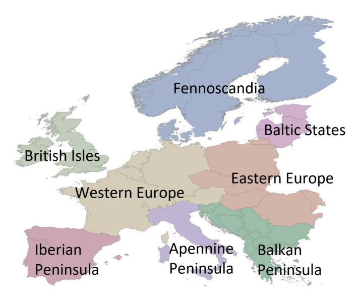

Fig. 1. Analysis area and geographic regions.

## 2.2. Definitions

 $A \sim 30 \times 30$  m Landsat pixel includes a mosaic of tree canopies with different heights. Thus, a certain statistic from the higher spatial resolution ALS canopy height model data is used to define tree height at Landsat resolution. Typically, the top of the canopy height (90th - 95th percentile of the ALS canopy height model data) was used for Landsatbased tree height model calibration (Matasci et al., 2018; Potapov et al., 2021a). As a result, pixels with a small proportion of tree canopy cover, such as boundary mixed pixels and clearcuts with tree retention were included in the training dataset as tall trees. Fig. 2 provides an example where the 95th percentile of the 1 m per pixel ALS canopy height model within 30 m Landsat pixels suggests the presence of trees within clearcuts with tree retention and over peat bogs while the 77th percentile and Landsat spectral data show tree absence. The use of a lower percentile thus improves the identification of the clearcut areas with tree retention that are common in Northern Europe (Kruys et al., 2013). Using an empirical comparison of different ALS-based metrics we found that the 77th percentile provides the best balance between the tree height mapping and detection of logging sites with tree retention. Here, we defined the tree canopy height at the Landsat pixel scale as the 77th percentile of the ALS-based canopy height values within the Landsat pixel. To separate tree canopies from non-woody vegetation, we consider a tree height of 3 m and above. We did not map short woody vegetation and young trees with heights below 3 m.

Consistent with FAO FRA forest definition (FAO, 2020), we defined tree canopy extent as a land cover class with at least 5 m tree canopy height. The use of the 5-m height criterion supported the intercomparison of our tree canopy extent and FAO FRA forest extent areas. The use of the 5 m threshold also made the reference sample interpretation easier. Trees with 5 m height usually can be readily interpreted using

high spatial resolution images, while visual separation of the shrubs and young short tree canopies is often problematic. Tree canopy height is a continuous variable at the Landsat pixel scale, while tree canopy extent derived from tree canopy height is a binary (presence/absence) variable.

## 2.3. Source data

#### 2.3.1. Landsat data

The source Landsat Collection 2 data archive was provided by the U. S. Geological Survey Earth Resources Observation and Science (EROS) Center. Collection 2 data is a result of improvement of the Landsat data processing that features higher absolute geometric accuracy and data quality compared to Collection 1 (U.S. Geological Survey, 2021). Here we used the Landsat Level 1 (top of the atmosphere radiance and reflectance) Tier 1 (highest quality images) data from 1997 to 2021 collected over Europe (236,420 Landsat scenes in total). Images affected by seasonal snow cover were not processed.

The Landsat image archive was converted into Analysis Ready Data (ARD) using the fully automated data processing method developed and implemented by the Global Land Analysis and Discovery (GLAD) Lab at the University of Maryland. The GLAD ARD processing methods and output format were identical to the published data processing methodology (Potapov et al., 2020) that employed Collection 1 imagery. The image processing steps consisted of observation quality assessment, reflectance normalization using Moderate Resolution Imaging Spectroradiometer (MODIS) surface reflectance as a normalization target, and temporal aggregation. The GLAD ARD represents a 16-day time series of the highest quality observation composites. Each composite consists of normalized surface reflectance for six reflective bands, a land surface brightness temperature value, and an observation quality flag. The GLAD ARD product is stored in geographic coordinates using the

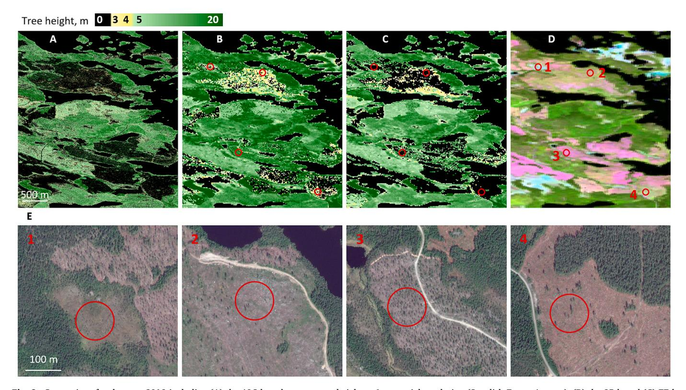

Fig. 2. Comparison for the year 2019 including (A) the ALS-based tree canopy height at 1 m spatial resolution (Swedish Forest Agency); (B) the 95th and (C) 77th percentiles of ALS-based tree canopy height at the 30 m Landsat resolution; and (D) the year 2019 Landsat image composite (SWIR1-NIR-Red). The highlighted red circles show the location of peat bogs and clearcuts where the 95th percentile data shows tree canopy presence, while the 77th percentile data and Landsat spectral data show the tree canopy absence. (E) The high-resolution data from Google EarthTM centered on the highlighted circles to confirm low tree canopy cover. Sample area in Sweden, center at 16.91°E; 62.78°N. (For interpretation of the references to colour in this figure legend, the reader is referred to the web version of this article.)

World Geodetic System (WGS84) and has a spatial resolution of 0.00025 degrees ( $\sim 30$  m) per pixel. This coordinate system and spatial resolution were used to resample all other datasets, for the output maps, and throughout all analyses in this study.

To create a feature space for tree height modeling, we aggregated the 16-day GLAD ARD data into a set of annual phenological metrics for each year, 2001-2021. The annual phenological metrics represent a set of reflectance data distribution and vegetation phenology statistics extracted from the observation time series. Using these data distribution statistics, rather than 16-day observation time series, as input features for tree canopy structure modeling reduces the effect of inconsistent clear-sky image availability between regions and years and supports empirical model calibration and application for multiple years (Hansen et al., 2011; Potapov et al., 2019, 2021a). To create an annual phenological metric set we used only clear-sky observations from the 16-day GLAD ARD composites. If a gap in clear-sky observations was longer than two months, we used data from up to four preceding years to fill the gap to ensure the consistency of the land surface phenology information (Potapov et al., 2020). The phenological metrics consist of three sets of data distribution statistics (Table S1). The first set represents statistics extracted from the annual distribution of normalized surface reflectance and vegetation indices values and includes minimum and maximum values, quartiles, interquartile averages, and amplitudes. The second set represents seasonality metrics, calculated as data distribution statistics derived from the observation time series ranked by the vegetation index and brightness temperature values (e.g., the value of each reflectance band corresponding to the annual maximum surface temperature). The third set consists of the vegetation phenology statistics (start, peak, and end of the growing season) based on the time series of the normalized difference vegetation index (NDVI). The growing season boundaries for phenology statistics were defined as an interval between the beginning of NDVI consistent increase and the end of NDVI consistent decrease. Potapov et al. (2020, 2021a) provide a detailed explanation of the phenological metrics approach.

Tree canopy removal events were detected using the annual change detection metrics set. Change detection metrics were confirmed to be an effective tool to map annual forest disturbance regionally (Potapov et al., 2019) and globally (Hansen et al., 2013). Here, we employed the change detection metrics set identical to the one described in Potapov et al. (2019, 2020). Each annual change detection metric set was created from the 16-day clear-sky observations of the corresponding and preceding years; the preceding year spectral data were aggregated over three years, taking the mean reflectance value for each 16-day interval. To create the annual change detection metrics (Table S2), we calculated distribution statistics for spectral bands and index values separately for the corresponding and preceding years and the difference for each statistic value between these years. To highlight changes in seasonal reflectance, we computed differences in spectral reflectance and vegetation index values between the corresponding and preceding years for each 16-day interval and extracted selected data distribution statistics from the time series of difference values. Finally, we calculated the slope of the linear regression between the spectral value and observation date.

## 2.3.2. Airborne laser scanning data

The growing season (leaf-on) ALS data for tree height model calibration were available for Norway, Sweden, Finland, Estonia, and Denmark (Table 1; Fig. 3). We used the high-resolution Canopy Height Model (CHM) outputs derived from the ALS point clouds by data providers. The CHM data were provided in different coordinate systems and different spatial resolutions, from 1 to 10 m. We resampled all CHM data to the geographic coordinates and spatial resolution of 0.000025 degrees ( $\sim 3$  m) per pixel, using the nearest neighbor resampling method. These high-resolution raster images were used to calculate the 77th percentile of tree height within Landsat pixels. We assigned zero tree height to Landsat pixels with tree height value <3 m, within water, snow/ice, and built-up areas masks (see section 2.3.4), and within areas

**Table 1**Airborne Laser Scanning (ALS) data sources.

| Region                | Data Format | Acquisition Year(s) | National Data Provider                                                                  |
|-----------------------|----------------|------------------------|-----------------------------------------------------------------------------------------|
| Norway (national)  | CHM, 1 m    | 2009–2021              | Norway's national mapping agency (Kartverket); https://hoydedata. no/LaserInnsyn/ |
| Sweden                | CHM, 1         | 2018-2020              | Swedish Forest Agency                                                                   |
| (selected areas)      | m              |                        | (Skogsstyrelsen); https://www. skogsstyrelsen.se/                                    |
| Finland               | CHM, 1         | 2010-2019              | Finnish Land Survey                                                                     |
| (national)            | m              |                        | (Maanmittauslaitos);                                                                    |
| Estonia               | CHM, 4         | 2019                   | https://www.maanmittauslaitos.fi/ Republic of Estonia Land Board                     |
| (selected areas)      | m              |                        | (Maa-amet); https://geoportaal. maaamet.ee/                                          |
| Denmark (national) | CHM, 10 m   | 2014–2015              | Assmann et al., 2021; https://zenodo.org/record/5752926                                 |
| Spain (Galicia)*   | CHM, 2 m    | 2015–2016              | Spain's National Geographic Institute (IGN); https://pnoa.ign.es/                       |

\* Data used for product validation only.

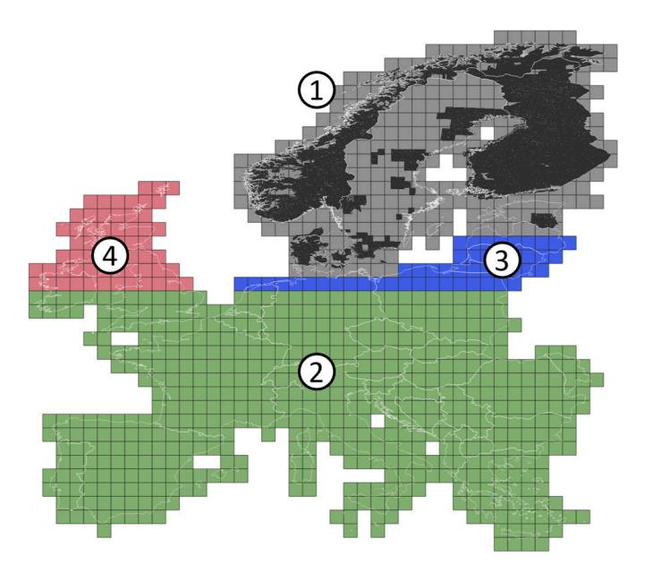

**Fig. 3.** Training data regions (groups of GLAD ARD  $1\times1^\circ$  tiles): 1 – ALS data (actual ALS data extent shown in black); 2 – GEDI data; 3 – GEDI-based and ALS-based Landsat modeled products; 4 – GEDI-based Landsat modeled product.

affected by the tree canopy removal (based on the map described in section 2.5) during the year of ALS data acquisition. Pixels near power lines (see section 2.3.4) were excluded from the data set. The year of ALS data collection (usually provided as a vector file) was rasterized to the Landsat spatial resolution, creating the acquisition date layer.

To enable tree height map validation, we separated the ALS-based tree canopy height layer for Northern Europe into the calibration (99.99%) and reference (0.01%; 230,149 pixels) data sets using random sampling. In addition, we used the ALS data for the entire area of the Galicia autonomous community of Spain to validate the GEDI-based tree canopy height model. A 0.1% random sample (53,938 pixels) of the Galicia ALS-based tree height data was used as reference data.

## 2.3.3. GEDI data

The GEDI Version 2 Level 2A Relative Height (RH) metrics available from the NASA/USGS Land Processes Distributed Active Archive Center (Dubayah et al., 2021), served as calibration and validation data for the southern (south of 52°N) portion of the continent. Version 2 data has

improved geolocation compared to the Version 1 data that was used for global tree height mapping in Potapov et al. (2021a). We used all GEDI data collected between 18th April 2019 and 23rd November 2021. Following Potapov et al. (2021a), we filtered the GEDI data to select only the high-quality observations. Specifically, we selected only observations (i) collected in power beam mode, (ii) collected during the night, and (iii) with beam sensitivity  $\geq$ 0.9. To select only GEDI observations within the growing season, we used the growing season start/end dates from the VIIRS/NPP Land Cover Dynamics product (Zhang et al., 2020) resampled to GLAD ARD spatial resolution.

We selected the GEDI RH metric using the approach prototyped by Potapov et al. (2021a). To select the GEDI RH metric for mapping tree canopy height at the Landsat scale, we used the co-located ALS and GEDI observations in the USA and Mexico from the Potapov et al. (2021a) training dataset, because most of the available ALS data in Europe were outside the GEDI data range. Overall, we used 42,802 GLAD ARD pixels to establish the correspondence between the GEDI RH metric and the 77th ALS height percentile, identified in section 2.2 as optimal for mapping tree canopy height at Landsat resolution. We found that the GEDI RH83 metric, which represents the height of 83% energy return relative to the ground, has the best match to the 77th ALS canopy height percentile within the Landsat pixel. The coefficient of determination (R2) between the 77th ALS canopy height percentile and GEDI RH83 metric was 0.73, the root-mean-square error (RMSE) was 5 m, and the mean absolute error (MAE) was 3.1 m. We selected the GEDI RH83 metric to represent the tree canopy height value at the Landsat pixel scale. We assigned zero tree canopy height values if the RH83 value was <3 m, within the water, snow/ice, and built-up areas masks, and within areas affected by the tree canopy removal after the year 2019. We also assigned zero value to pixels within the no-trees mask according to Malinowski et al. (2020) dataset (see section 2.3.4). The GEDI-based tree canopy height data were separated into calibration (99%) and reference (1%; 938,909 pixels) set using random sampling.

## 2.3.4. Auxiliary datasets

We used several auxiliary datasets to improve the lidar training data, to support the tree canopy height mapping, and to analyze the tree canopy extent area and change. The land surface elevation data combined from the Shuttle Radar Topography Mission (Reuter et al., 2007; south of  $60^{\circ}$ N) and Global Multi-resolution Terrain Elevation Data 2010 (Danielson and Gesch, 2011; north of  $60^{\circ}$ N) was used as an additional input for image classification.

Neither ALS nor GEDI height data by themselves discriminate trees from buildings. The ALS data is sensitive to the height of power lines, which affects the model calibration. The GEDI data frequently overestimate tree height over treeless areas, especially in the mountains (Potapov et al., 2021a). To correct these issues, we used datasets that indicate the presence of buildings, power lines, and permanently treeless areas. We mapped power lines (with a 30-m buffer) using the Open Street Map (OpenStreetMap (OSM) contributors, 2022). We generated a built-up areas mask that included pixels within the building outlines from the Open Street Map and the "Artificial surfaces and constructions" class from the year 2017 Sentinel-2 land cover map of Europe (Malinowski et al., 2020). This mask was used to filter out ALS and GEDI observations that represented the height of buildings. To filter possible errors in GEDI tree height data within treeless areas, we derived a tree cover mask from the Malinowski et al. (2020) land cover map.

The areas of permanent water and snow/ice were excluded from the tree canopy height mapping. The time series of GLAD ARD data quality layers (Potapov et al., 2020) were used to produce annual permanent water and snow/ice maps.

We used several reference datasets to compare our results. The FAO FRA (FAO, 2020) forest areas for the years 2000 and 2020 were aggregated for the analysis regions and compared with the tree canopy extent and change estimated from our maps. The Sentinel-2-based WorldCover 2021 land cover map (Zanaga et al., 2022) developed by

the European Space Agency (ESA) was used for the year 2021 tree cover extent comparison and per-pixel map consistency analysis. The tree cover mask was derived from the WorldCover map (spatial resolution 10 m) using a 50% threshold of the tree cover class presence within a 30-m GLAD ARD pixel.

## 2.4. Tree canopy height mapping

To map tree canopy height annually we implemented an empirical modeling using the bagged (bootstrap aggregated) regression tree method (Breiman et al., 1984; Breiman, 1996). The bagged regression tree is an ensemble machine learning algorithm in which a set of non-parametric regression models is calibrated using random subsets of the training data. Regression tree ensembles were used earlier to map tree canopy height globally by Potapov et al. (2021a, 2022). To ensure the high accuracy of the model output, we calibrated a separate regression tree ensemble model for each of the 982 GLAD ARD 1  $\times$  1° tiles within Europe (Fig. 3).

The training data for model calibration represented the 77th ALS canopy height percentile (Region 1, Fig. 3) and GEDI RH83 metric (Region 2). For the tiles with no lidar training data (Regions 3 and 4), we used the Landsat-based modeled annual tree height data from the neighboring tiles as training. We used both ALS-based and GEDI-based model outputs from the neighboring tiles for Region 3 and GEDI-based model outputs only for Region 4.

The model predictors (independent variables) for tree canopy height modeling included (i) annual phenological metrics (described in section 2.3.1); (ii) land surface elevation (section 2.3.4); and (iii) a selected set of the annual change detection metrics that were added to improve the mapping of tree absence within areas of recent tree canopy removal (section 2.3.1). To ensure the model's adequate performance for years with different Landsat sensor compositions, we calibrated the model using the Landsat phenological metrics from (i) the year of the lidar data acquisition and (ii) the year 2002. Only pixels that have no indication of tree height change, based on the Global Forest Height Change 2000–2020 map by Potapov et al. (2022), were considered for the year 2002 training data collection.

To calibrate each regression tree ensemble model, we collected training data from the target and neighboring tiles, following the approach of Potapov et al. (2021a). Here, instead of using a static radius to define neighboring tiles, we used a dynamic radius. For each tile, we started with the 1-degree radius for the ALS region and the 3-degree radius for the GEDI region and increased the radius until the training set for each tree model included at least 100,000 pixels.

For each of the 982 tiles, we calibrated an ensemble of 25 regression tree models using the algorithm developed by Breiman et al. (1984). Each regression tree was calibrated using an independent sample of training data (100,000 training pixels on average). The tree growth was limited by the deviance decrease threshold of 0.01% of root deviance. When an ensemble of tree models was applied to a set of annual phenological metrics, the median predicted tree height value of all models was recorded as the output value.

Each model was calibrated using two steps: first, using an initial set of training data; second, adding training data collected from tree canopy extent commission errors detected after the initial model run to suppress model overestimation. The presence of commission errors (treeless areas incorrectly mapped as tree cover height  $\geq 5$  m) was identified via a comparison of the initial model run for the year 2020 to the tree cover presence in the European land cover product (Malinowski et al., 2020). The final regression tree ensemble models were applied to all years, 2001 to 2021, using the corresponding annual phenological metric sets.

## 2.5. Tree canopy removal detection

The annual canopy removal maps were produced independently and integrated with the annual tree canopy height maps to improve the

representation of tree canopy disturbance and recovery (see section 2.6). We performed the regional tree canopy removal detection following the approach of Potapov et al. (2019) to create a continentally consistent annual product that detects only complete or near-complete tree canopy removal events.

The tree canopy removal was mapped using a bagged decision tree model (Breiman et al., 1984; Breiman, 1996). The model represents an ensemble of 25 decision trees calibrated using random samples of training data; the median class likelihood of all trees was thresholded at 50% to define the tree canopy removal class presence (Potapov et al., 2019). We manually collected training data for the model through visual image interpretation. The training data collection was an iterative process, also known as active learning, where the new training data was added if, after the model application, we visually observed map errors. The model predictors (independent variables) included Landsat change detection metrics (described in section 2.3.1) and land surface elevation (section 2.3.4). To account for regional specifics of tree canopy dynamics, we calibrated a set of regional tree canopy removal detection models: a separate model for Fennoscandia, Central Europe, the Iberian Peninsula, the Mediterranean region, and the British Isles. The final models were applied to each year 2001-2021 separately to create a tree canopy removal map time series.

## 2.6. Continental tree canopy height time series

Both the annual modeled tree canopy height and the annual tree canopy removal detection products had noise due to Landsat data inconsistency, specifically, the lack of clear-sky observations during important phenological stages for some of the years or remaining atmospheric contamination. We filtered both datasets and integrated the tree canopy removal with the tree canopy height to derive a 21-year spatiotemporally consistent time series product. The filtering included three stages: an initial stage to remove outliers, a temporal filtering stage to create a consistent tree height time series product, and a spatial filtering stage to remove noise in mixed pixels.

At the initial stage, we applied filters for both annual change detection and tree height products. The annual tree canopy removal time series were filtered to exclude change detection instances where the modeled tree canopy height for the year after the disturbance detection was the same or higher than the year before the disturbance. For the annual tree canopy height map time series, values that were significantly (by 5 m or more) higher or lower compared to the year before and the year after were replaced with a 3-year median value. This step improved the stability of the follow-up filtering algorithm.

During the temporal filtering stage, we first selected pixels with  $\leq 2$ non-zero annual tree height detections if both years 2001 and 2021 had tree height < 5 m. The annual tree height values for these pixels were set to zero. Second, we selected pixels with stable tree height using the following criteria: (i) tree canopy removal was not detected; (ii) ranges of predicted tree height values for each 5-year interval overlapped with the preceding/following time intervals; and (iii) no increase or decrease in tree height was observed over 21 years. The annual tree height values for these pixels were calculated as the median for the 2001-2021 interval. For all other pixels, we adjusted the annual tree height values using a linear trend calculated using up to four preceding and following years. The number of years used to calculate the linear regression model for the target year was limited by the tree canopy removal events (e.g., if a change was detected two years before the target year i, the interval for the linear trend included years from the year i-2 to i+4). The tree canopy height for the year of the detected tree canopy removal event was set to zero. We also limited the annual tree height increase to 3 m.

At the spatial filtering stage, we checked pixels that were located at the edge of the tree canopy extent. For the boundary pixels that have frequent changes in modeled tree height but no detected tree canopy removal, we replaced the annual modeled tree height values with the median value. After we completed the adjustment of the tree height time series product, we generated the final annual tree canopy removal product using the annual tree height maps. That is, we assign tree canopy removal detection to pixels that have zero canopy height in the target year, and tree canopy height  $\geq 5$  m one to three years before that. From the tree height time series, we created the annual tree canopy extent maps using the  $\geq 5$  m tree canopy height threshold. The final map time series are available from the dedicated web portal (https://glad.earthengine.app/view/europe-tree-dynamics).

## 2.7. Validation of tree canopy height, extent, and change maps

## 2.7.1. Validation using reference Lidar data

Landsat-based canopy height validation employed as a reference a set-aside of 938,909 GEDI data pixels and 230,149 Northern European ALS data pixels that were not used for model calibration. In addition, we used 53,938 ALS data pixels for Galicia (Spain) to validate the GEDI-based product. We applied the same data filters and rules to the validation data as to the training data (see sections 2.3.2 and 2.3.3).

The product uncertainty was quantified by comparing GEDI and ALS tree canopy height metrics with the Landsat-based tree canopy height map for the year of the lidar data collection. In addition to height value uncertainty, we analyzed the error of tree canopy extent mapping. To do that, we converted both the reference and map tree height into tree canopy extent class using a  $\geq 5~\text{m}$  threshold and used the resulting confusion matrix to calculate map accuracies. To check the effect of the low canopy height areas on the map accuracy, we performed additional map accuracy estimates excluding pixels with tree height of 4–6 m (both in the map or reference data) from the calculation.

## 2.7.2. Validation using reference sample data

To validate the results of continental tree canopy extent and change mapping, we performed sample-based area estimation and map validation using a well-established approach (Cochran, 1977; Olofsson et al., 2014; Stehman, 2014). Landsat GLAD ARD data pixels (spatial resolution  $0.00025^{\circ}$ ,  $\sim 30$  m per pixel) represented sample units that were selected using a stratified random design. We defined sampling strata based on tree canopy height dynamic and the proximity to tree canopy extent and change areas for targeting tree canopy extent omission and commission errors within mixed pixels (Olofsson et al., 2020). The resulting nine strata are presented in Table S3.

We randomly selected 200 pixels from each stratum (1800 pixels in total). The reference data for each sample pixel were collected through the visual interpretation of high-resolution imagery time series available from Google EarthTM, 16-day Landsat spectral reflectance and vegetation index values, annual and bi-monthly Landsat image composites, and annual change detection metric composites that highlight abrupt change events (Fig. S2). We used auxiliary data such as European land cover (Malinowski et al., 2020) and landscape photographs available in Google EarthTM to support differentiation between trees and shrubs.

Each sample pixel was interpreted independently by two experts using all available reference data; the disagreements between interpreters were discussed to reach a consensus. For visual interpretation, we defined tree canopy extent as pixels with at least 25% of tree canopy cover from trees ≥5 m. Tree canopy removal events were defined as tree canopy cover reduction below 25% of the pixel area. The following information was collected for each sample pixel: (i) tree canopy extent presence for the years 2001, 2011, and 2021; (ii) years and proximate causes of tree canopy removal events (such as natural disturbance, logging, and land use transformation); (iii) proximate causes of tree canopy extent gain (regeneration after disturbances, afforestation over abandoned agricultural lands, and new tree plantation establishment). To interpret proximate causes of tree canopy extent change we used the latest high spatial resolution (≤ 1 m/pixel) images from Google Earth™ and bi-monthly Landsat image time-series. The sample reference data is available for download and review from https://glad.earthengine.

#### app/view/europe-tree-dynamics.

Sample interpretation results served as a basis to estimate (i) the accuracies of the tree canopy extent and change maps, (ii) the sample-based tree canopy extent area for the years 2001, 2011, and 2021, and (iii) the average sample-based annual tree canopy removal area for the 2001–2011 and 2012–2021 intervals. Using the sample pixels that represented net tree canopy gain (tree canopy absence in 2001 and presence in 2021) and net tree canopy loss we estimated the proportion of net tree canopy gain and loss related to various proximate causes (Geist and Lambin, 2002).

For sample-based estimation, we split each stratum into two post-strata south and north of  $55^\circ N$  to address the latitudinal difference in GLAD ARD sample pixels area. The resulting minimal sample size for a post-stratum was 55 pixels. We used the area and accuracy equations from Potapov et al. (2021b) where the strata weights were calculated from their respective areas, and not pixel counts, to account for the variation of the GLAD ARD pixel area.

## 3. Results

## 3.1. Map validation results

## 3.1.1. Comparison with the reference Lidar data

There is no single reference lidar tree canopy height dataset for entire Europe. Instead, we performed three independent comparisons between our Landsat-based map and lidar observations: (i) a comparison of the ALS-calibrated model output with the set-aside ALS reference data in Northern Europe (Norway, Sweden, Finland, Denmark, and Estonia); (ii) a comparison of the GEDI-calibrated model output with the set-aside GEDI data (south of 52°N); and (iii) a comparison of the GEDI-calibrated map with ALS data in Galicia, Spain.

We found a strong correlation between the ALS-calibrated Landsat-based map and the set-aside ALS reference data in Northern Europe ( $R^2 = 0.77$ ; Fig. 4A, Table 2A). European North features a nearly complete gradient of tree canopy height, which is evident from the scatterplot (Fig. 4A). In contrast, within the GEDI data extent (south of 52°N) the scatterplot shows a bimodal pattern of tall (temperate moist and montane forests) and short (Mediterranean) forests (Fig. 4B). A comparison of the GEDI-calibrated height map with the set-aside GEDI reference data revealed a lower  $R^2$  and a higher RMSE compared to the ALS-calibrated map (Table 2A). The high RMSE and low  $R^2$  values resulting from the comparison of the GEDI-calibrated model output with ALS data in Galicia indicated the limitation of the GEDI height measurements for Landsat-based model calibration compared to the ALS-based training data (Fig. 4C).

The mean difference (computed by subtracting the map height from the reference height, Table 2A) indicates that the Landsat-based map

Table 2

(A) Comparison statistics between the reference lidar data and Landsat-based tree canopy height map. (B) Landsat-based tree canopy extent map accuracy statistics using the lidar data as a reference. Tree canopy extent was defined as areas with tree height  $\geq 5$  m. Accuracy statistics computed excluding pixels with tree height of 4–6 m are shown in parenthesis.

|                                                | ALS (Northern Europe) | GEDI       | ALS (Galicia, Spain) |  |  |
|------------------------------------------------|--------------------------|------------|-------------------------|--|--|
| A. Tree canopy height comparison statistics    |                          |            |                         |  |  |
| Root-mean-square error (RMSE), m               | 3.31                     | 3.89       | 4.05                    |  |  |
| Mean absolute error (MAE), m                | 1.82                     | 1.58       | 2.49                    |  |  |
| Mean difference, m                             | 0.33                     | 0.27       | 0.14                    |  |  |
| Coefficient of determination (R 2 ) | 0.77                     | 0.70       | 0.58                    |  |  |
| B. Tree canopy extent accuracy statistics      |                          |            |                         |  |  |
| Overall accuracy                               | 91 (96)                  | 92 (95) | 84 (92)                 |  |  |
| User's accuracy                                | 89 (96)                  | 81 (87) | 77 (88)                 |  |  |
| Producer's accuracy                            | 90 (94)                  | 77 (84) | 81 (88)                 |  |  |

underestimates the tree height, which is consistent with our earlier observations (Potapov et al., 2021a, 2022). We see the effect of model saturation, with the greatest tree height underestimation within the tall tree stands in Central and Southern Europe (> 25 m, Fig. 4B).

To validate the tree canopy extent, we converted both the map and the reference data into binary presence/absence maps using a  $\geq 5$  m tree canopy height criterion. The accuracy of the tree canopy extent mapping (Table 2B) confirms the suitability of the Landsat-based tree canopy height maps for continental tree canopy extent monitoring. The highest tree canopy extent accuracy was found in Northern Europe, while the accuracy within Central and Southern Europe (within the GEDI data range) was lower. The nearly balanced user's and producer's accuracies suggested that map errors do not cause systematic tree canopy extent omission or commission. We further suggest that most of the mapping errors are due to the uncertainty of canopy height modeling within the interval from 4 to 6 m. If sample pixels with a tree height of 4–6 m are removed from computation, the accuracy increases (Table 2B).

## 3.1.2. Validation using reference sample data

We used the reference sample of visually interpreted tree canopy extent (section 2.7.2) to estimate the accuracy of the years 2001, 2011, and 2021 tree canopy extent maps (Table 3). The accuracies of all three maps are high, with user's and producer's accuracies  $\geq$ 94% for each year. We presume that the map accuracies for other years must be analogous.

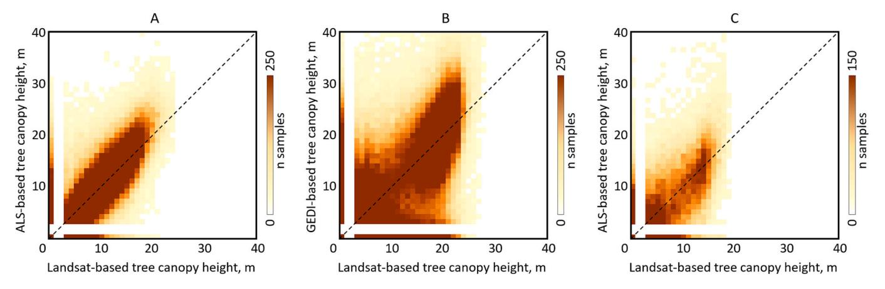

Fig. 4. Comparison of the Landsat-based tree canopy height map with (A) ALS reference data in Northern Europe; (B) GEDI reference data south of 52°N; and (C) ALS reference data for Galicia, Spain.

Table 3
Accuracy statistics for the year 2001, 2011, and 2021 tree canopy extent maps and tree canopy removal maps for 2001–2011 and 2012–2021 intervals. Standard errors are shown in parentheses.

|                     |           | Overall accuracy | User's accuracy | Producer's accuracy |
|---------------------|-----------|------------------|-----------------|---------------------|
| Tree canopy extent  | 2001      | 96.7 (0.3)       | 95.3 (0.7)      | 94.9 (0.6)          |
|                     | 2011      | 96.6 (0.3)       | 95.1 (0.6)      | 95.3 (0.7)          |
|                     | 2021      | 96.1 (0.4)       | 94.5 (0.7)      | 94.0 (0.8)          |
| Tree canopy removal | 2001-2011 | 99.3 (0.1)       | 81.8 (2.6)      | 93.2 (2.1)          |
|                     | 2012-2021 | 99.1 (0.1)       | 80.2 (2.9)      | 92.9 (2.4)          |

Visually interpreted reference sample data also allowed us to validate tree canopy removal detection. In the map time series, we defined tree canopy removal as an instant reduction in tree canopy height from ≥5 m to zero, and we assigned the year of this event. For the reference sample, we recorded the year of nearly complete canopy removal (if the remaining tree canopy cover was <25%) within the sample pixel. We aggregated the dates of the tree canopy removal into intervals 2001-2011 and 2012-2021. The accuracy metrics for both the 2001-2011 and 2012-2021 intervals were similar, which confirms the temporal consistency of our tree canopy removal maps (Table 3). The tree canopy removal detection has a high (> 93%) producer's accuracy but a lower user's accuracy which indicates model commission errors. We suggest that this commission is mostly due to the confusion between complete and partial tree canopy removal within the Landsat pixel. We found that out of 96 sample pixels where map-based canopy removal was not confirmed by the reference data, 72 sample pixels (75%) experienced partial canopy removal due to selective logging, natural disturbance, or clearcut edge.

## 3.2. Regional tree canopy extent and change

## 3.2.1. Annual tree canopy extent and height

Our map time series shows that the tree canopy extent (area with tree canopy height  $\geq 5$  m at the Landsat pixel scale) in Europe increased from 2001 to 2021 by 1%, or by 1.5 Mha (Fig. 5). The tree canopy extent estimated from the reference sample data shows a similar increase of 1.2 Mha, from 161.9 Mha (95% confidence interval +/- 3.6 Mha) in the year 2001 to 163.1 Mha (+/- 3.8 Mha) in the year 2021 (Fig. 5). Both the map and the reference sample data suggest that the tree canopy extent area increased during the 2000s and declined during the late 2010s. The annual map data indicate that the tree canopy extent increased by 1.7% from 2001 to 2016, reaching its maximum around 2016. From 2016 to 2021, however, the tree canopy extent declined by 0.7%.

The annual dynamics of map-based tree canopy extent area were different among regions (Fig. S3). From 2001 to 2021, the tree canopy

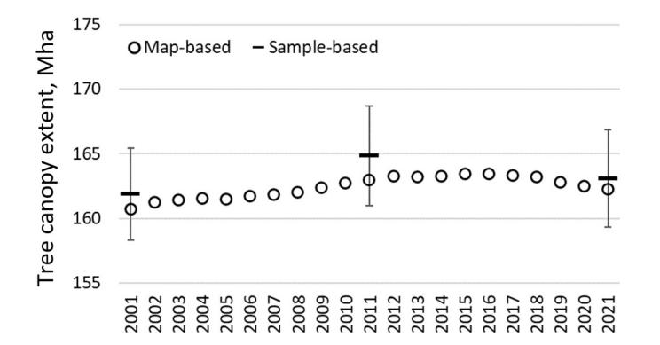

**Fig. 5.** Map-based annual tree canopy extent area and sample-based tree canopy extent area estimates for the years 2001, 2011, and 2021 for the entire area of analysis. Sample-based estimates are shown with 95% confidence intervals; map-based estimates are pixel counts and do not have associated uncertainty measures.

extent area increased in all regions except the Baltic States, Fennoscandia, and Western Europe. The British Isles had the largest relative net tree canopy extent increase of all regions (10.7%), while Eastern Europe had the highest absolute net gain (1.4 Mha). Eastern Europe, Western Europe, and the Baltic States exhibited a net increase in tree canopy extent in the 2000s, with the subsequent decrease of its area during the 2010s. The maximum tree canopy extent was reached by 2018, 2016, and 2010 for Eastern Europe, Western Europe, and the Baltic States, respectively. Overall, from 2001 to 2021, the tree canopy extent area decreased in Western Europe and the Baltic States by 0.3% and 2.5%, respectively. Fennoscandia was the only region that showed a continuous reduction of the tree canopy extent area, with the highest absolute (1.9 Mha) and relative (3.5% of the year 2001 extent) net area reduction among all the regions.

The aggregation of the tree canopy extent maps at the  $50\times50~km$  equal area grid revealed change hotspots (Fig. 6A). Tree canopy extent reduction was the highest within Central and Southern Sweden and Finland, Estonia, Latvia, Rhenish Massif and Harz mountains in Germany, the Czech Republic, Austria, the Landes forest region of France, and Serra da Estrela mountains in Portugal. Regions with the highest net tree canopy extent gain included Ireland, Galicia autonomous community of Spain, Central Italy, and most Eastern European countries from Poland in the North to Bulgaria in the South.

The continental tree canopy height map (Fig. S4) shows that the tree canopy is the tallest in Central Europe while shorter in Northern and Southern Europe. Fennoscandia represents a gradient from the tall tree stands in the South to short woody vegetation in the North. The tallest tree stands in Europe are found within montane areas of Central Europe, such as Schwarzwald in Germany and the Carpathians in Romania.

To simplify the analysis of tree canopy height dynamics, we aggregated the continuous canopy height map into three brackets: 5–9 m, 10–14 m, and 15 m and above (Table S4). In the year 2021, the tall tree canopy bracket ( $\geq 15$  m) represented nearly half (46%) of the total tree canopy extent, while the area of the 5–9 and 10–14 m height brackets represented 29% and 25%, respectively. Within temperate forests regions such as Eastern and Western Europe and the Baltic States, the tall tree canopy bracket ( $\geq 15$  m) represented >60% of the total tree canopy extent, while in the Iberian Peninsula this bracket represented <10% of the total area.

The tree canopy height brackets experienced different dynamics over the past 20 years. We found that the area of the 5–9 and 10–14 m height brackets increased by 2 and 8%, respectively, while the tall tree canopy ( $\geq 15$  m) bracket extent was reduced by 3% (Table S4). The largest reduction of tall tree canopy bracket area was found in Fennoscandia (by 20%, Fig. 6B) and Baltic States (by 7%) most probably due to the increase of annual logging area and slow regeneration of trees on the logging sites in the northern forests (see section 4.2.3). The largest increase within the 10–14 m height bracket was found in the British Isles, Eastern Europe, and Balkan Peninsula by 29%, 24%, and 16%, respectively.

## 3.2.2. Annual tree canopy removal

The annual tree canopy removal is an important metric that characterizes the forest disturbance dynamics. Using the annual tree canopy height map time series, we define tree canopy removal as the reduction

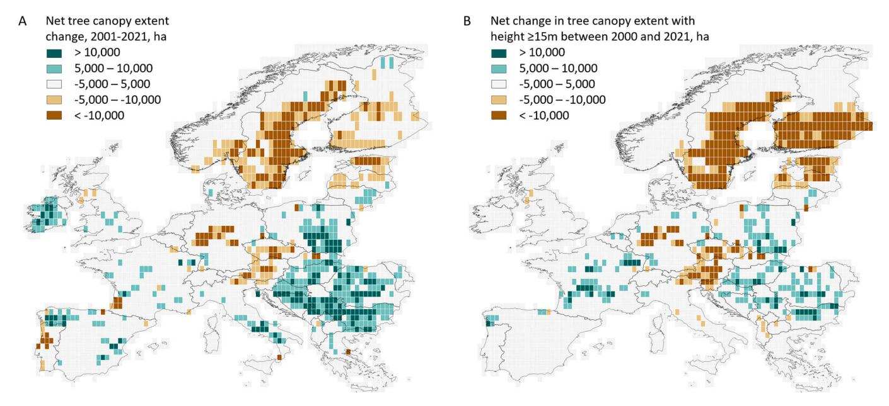

Fig. 6. (A) The net change in map-based tree canopy extent area from 2001 to 2021 per  $50 \times 50$  km equal area grid cell. (B) The net change in tall tree canopy bracket area ( $\geq 15$  m height) from 2001 to 2021 per  $50 \times 50$  km equal area grid cell.

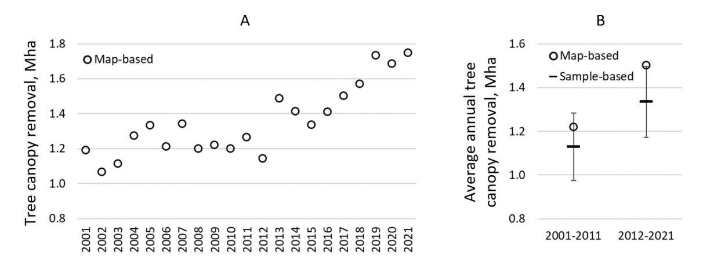

Fig. 7. (A) Map-based annual tree canopy removal area estimates. (B) Map-based and sample-based average annual tree canopy removal area estimates for 2001–2011 and 2012–2021 intervals. Sample-based estimates are shown with 95% confidence intervals; map-based estimates are pixel counts and do not have associated uncertainty measures.

of the tree height from  $\geq 5$  m to zero. On the continental scale, the annual tree canopy removal area increased from 1.2 Mha per year in 2001 to 1.75 Mha per year in 2021 (Fig. 7A). We observed the highest annual tree canopy removal area during the last three years of the analyzed time interval (2019–2021). The average annual tree canopy removal area between 2001–2011 and 2012–2021 intervals increased by 23% according to our map time series. Our sample-based estimates showed an 18% increase in the annual tree canopy removal area between these intervals (Fig. 7B).

The annual dynamics of the tree canopy removal area (Fig. S5) revealed differences between regions. The Balkan Peninsula, Iberian Peninsula, and British Isles showed a fluctuation of the annual tree canopy removal area around 21-years average value without a statistically significant trend (p-value >0.2). All other regions displayed a statistically significant increasing trend of annual tree canopy removal (p-value  $\leq 0.05$ ). Comparing map-based average annual tree canopy removal areas between 2001–2011 and 2012–2021 intervals, the Baltic States, Eastern, and Western Europe had the highest increase of 47%, 44%, and 23%, respectively. Fennoscandia had the highest increase in the absolute area of annual tree canopy removal between 2001–2011

and 2012-2021 intervals by 85,000 ha per year (a 17% increase).

The visual hotspot analysis using a  $50 \times 50$  km equal area grid highlighted areas of pronounced change in the annual tree canopy removal between 2001–2011 and 2012–2021 intervals (Fig. 8). The hotspots of tree canopy removal increase included timber harvesting intensification regions (Southern Fennoscandia, Baltic States, and Poland), bark beetle outbreak hotspots (Central Germany and the Czech Republic), and the region affected by the recent wildfires in Portugal and Spain. The areas of tree canopy removal decrease mostly represented forests that experienced an intensive disturbance in the first half of the analysis interval with subsequent regeneration. Such regions included Southern Sweden affected by Cyclone Gudrun in 2005 and the Landes forest region of France damaged by Cyclone Klaus in 2009.

## 3.3. Data Intercomparison

The FAO FRA (FAO, 2020) forest area in Europe (excluding the Kaliningrad region of Russia) for the year 2020 is 12% higher than our year 2020 map-based tree canopy extent area which was defined using the  $\geq 5$  m canopy height threshold. Landsat-based tree canopy extent

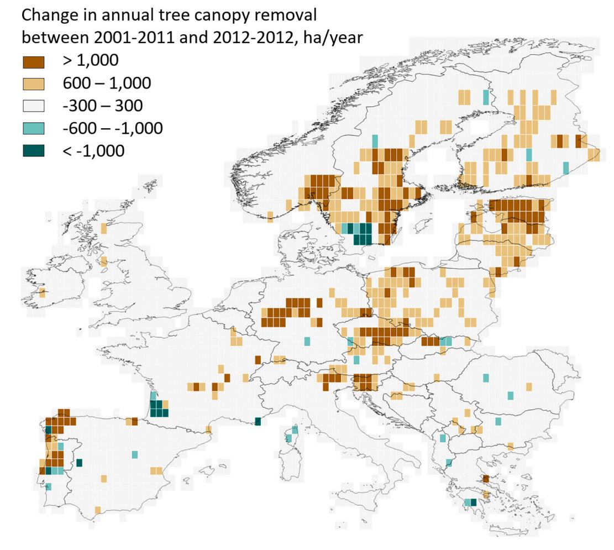

Fig. 8. Changes in map-based average annual tree canopy removal area between 2001–2011 and 2012–2021 intervals per  $50 \times 50$  km equal area grid cell.

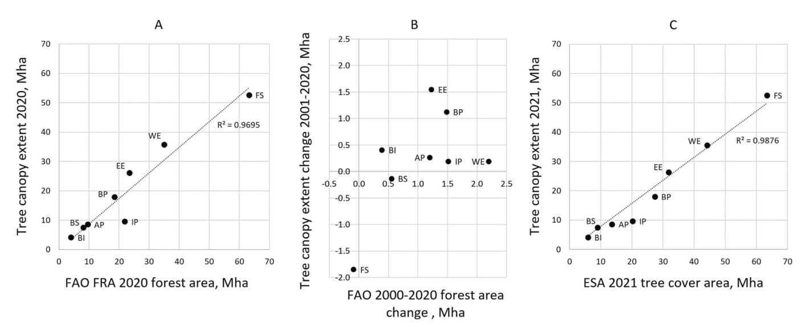

Fig. 9. (A) A comparison of the FAO FRA forest area with tree canopy extent area for the year 2020. (B) A comparison of the FAO FRA 2000–2020 forest area changes with the 2001–2020 tree canopy extent changes. (C) A comparison of the ESA WorldCover 2021 tree canopy cover area with tree canopy extent for the year 2021. The region name abbreviations: AP - Apennine Peninsula, BP - Balkan Peninsula, BS - Baltic States, BI - British Isles, EE - Eastern Europe, IP - Iberian Peninsula, FS – Fennoscandia, WE - Western Europe.

and FAO FRA forest areas are within an 11% difference for all regions except Fennoscandia and the Iberian Peninsula, where the Landsatbased tree canopy extent is 17% and 56% lower compared to the FAO

FRA forest area, respectively (Fig. 9A). We suggest that this underestimation is due to low canopy cover forests where our product, which is based on 77th percentile of tree height within Landsat pixel, shows tree

height below 5 m.

A comparison of our tree canopy extent change estimates with the FAO FRA forest area change (Fig. 9B) revealed poor agreement. The change estimates were within a 26% difference only for the Balkan Peninsula, British Isles, and Eastern Europe. We presume that the difference between definitions is the main reason for the observed disagreement. FAO defines forests as a land use class and considers temporarily unstocked areas within forestry land use as "forest". Thus, the effect of the recent increase in tree canopy removal due to logging and natural factors was not reflected in the FAO reporting.

The ESA WorldCover 2021 map defines tree cover as an "area dominated by trees with a cover of 10% or more", including tree plantations and orchards (Zanaga et al., 2022). A comparison of regional tree cover area from WorldCover product with our tree canopy extent map shows a strong relationship (Fig. 9C). However, our tree canopy extent underestimated the ESA WorldCover tree cover area by 25%. The highest agreement (underestimation below 20%) was found in the Baltic States, Eastern and Western Europe, and Fennoscandia. The highest disagreement was within Mediterranean forest regions and the British Isles. The primary reason for the observed underestimation is the omission of short and open canopy tree stands in our map data. We speculate that the observed difference is partly due to the overestimation of the tree cover within the areas of recent tree canopy removal by the WorldCover map. We show an example of such overestimation in Fig. S6. Another factor is the higher spatial resolution of the Sentinel-2 data that supports better mapping of tree cover in urban areas and heterogeneous agricultural landscapes. The pixel-based comparison of tree canopy extent using the WorldCover tree cover product as a reference yielded 87% overall accuracy; the overall accuracy for the Baltic States, Eastern and Western Europe, and the British Isles, was  $\geq$ 89%.

## 4. Discussion

## 4.1. The value and limitations of the continental tree canopy height maps

Spatiotemporally consistent, multidecadal annual tree canopy height change mapping using the Landsat archive at a continental scale is a daunting task. Many factors affect Landsat data consistency, including changes in satellite sensor properties, observation frequency, and interannual changes in vegetation phenology among others. Empirical modeling, the most common method for satellite image characterization, is prone to errors due to incorrect and insufficient calibration data.

Here, we implemented several approaches that helped us to improve the spatiotemporal consistency of annual maps. First, we focused on a single land cover type, tree canopy. We suggest that the attempt to map land use classes (as defined by FAO FRA; FAO, 2020) rather than land cover types would not result in sufficiently high map accuracy due to the inability to separate spectrally and phenologically similar land cover types (e.g., tree canopy) into land use types (e.g., forest lands versus trees outside forests). Second, we utilized an analysis-ready satellite data time series, GLAD ARD (Potapov et al., 2020), that provided spatiotemporally consistent input data and simplified extrapolation of characterization models in time and space (i.e., application of the same model to each year's spectral inputs to create a 2001-2021 annual map time series). Third, we employed a continentally consistent source of training data that was collected from physical observations (lidar tree height measurements) in contrast to the manual image interpretation typically used to calibrate land cover mapping models. Evenly distributed lidar calibration data supported local model calibration (Potapov et al., 2021a). Finally, we suggest that the use of the 77th percentile of the ALS canopy height within Landsat data pixel as a tree canopy height definition helped us to avoid tree extent overestimation that is typical for models calibrated with top-of-the-canopy height metrics (such as Lang et al., 2022). We suggest that our approach is better at mapping temporarily unstocked areas (such as recent clearcuts presented in Fig. S6) than the tree cover extent mapped by WorldCover 2021 (Zanaga

et al., 2022).

The regression tree models used all phenological metrics (section 2.3.1, Table S1) to predict tree canopy height. On average, each regression tree ensemble used 82% of all phenological metrics. The analysis of metric importance is complicated due to the large number of models (25 models per ensemble for each of 982 tiles), the difference in training data (ALS and GEDI), and the diversity of forest landscapes. The most important metrics (contributing 75% of the total deviance reduction) for the ALS-calibrated models in Fennoscandia included NDVI phenology statistics (annual average, growing season average, and average between minimum and 25% percentile values within the year), green band reflectance (annual average and reflectance values for the observation with the highest NDVI), maximum annual shortwave infrared (2201 nm) reflectance, and minimum values of normalized ratios of shortwave infrared and near-infrared reflectance (indices S1N and S2N in Table S1). Surface elevation played a minor role in the tree canopy height model, contributing 1% to the total deviance decrease. The tree canopy height mapping in the Lower Mekong (Potapov et al., 2019) similarly observed the high importance of NDVI-based phenology metrics and the low importance of topography data. In Central Europe, where the tree canopy models were calibrated with GEDI, the most important metrics included annual average values of visible reflectance bands, NDVI, and indices S1N and S2N (Table S1). We suggest that the metric importance depends on the landscape heterogeneity, and the visible spectral reflectance data is beneficial to distinguish tree canopy from treeless land cover in highly fragmented landscapes. The average total deviance decrease within the regression tree model was higher in Fennoscandia (77% of root deviance) than in Central Europe (67%), explaining the higher accuracy of the ALS-calibrated model.

Our tree canopy removal detection time series is an improvement compared to the Global Forest Loss product (Hansen et al., 2013) with less than half as much commission error and only one-fifth as much omission error. We suggest that this is due to the application of the same annual change detection model to all years and the integration of the annual tree canopy height and tree canopy removal detection products. The comparison of the 2001–2021 tree canopy loss detection accuracy between the final product (tree canopy removal derived from the tree canopy height time series, see section 2.6), the tree canopy removal detection model outputs (intermediate product described in section 2.5), and Hansen et al. (2013) annual forest loss data showed that our final product has the highest accuracy and the best balance between the user's and producer's accuracies of all three datasets (Table 4). Our results show a less pronounced increase in annual tree canopy removal compared to the analysis of Ceccherini et al. (2020), which was based on the Global Forest Loss product with known limitations (Palahí et al., 2021). The annual time series of the tree canopy height may better support aboveground biomass change estimation and CO2 emission reporting at the continental level compared to other tree canopy cover and loss products (Harris et al., 2021; Potapov et al., 2022; Tyukavina et al., 2015).

Despite the major improvements outlined above, some limitations remain mainly caused by (i) the calibration data limitations; (ii) the

**Table 4**Accuracies of the tree canopy removal maps and the Global Forest Loss product estimated using the same reference sample data (section 2.7.2) for the 2001–2021 time interval. Standard errors are shown in parentheses.

|                                                                   | Overall accuracy | User's accuracy | Producer's accuracy |
|-------------------------------------------------------------------|---------------------|--------------------|------------------------|
| Global Forest Loss (Hansen et al., 2013)                          | 95.8 (0.5)          | 59.5 (4.3)         | 71.4 (2.5)             |
| Annual tree canopy removal detection model (intermediate product) | 98.0 (0.2)          | 78.8 (2.4)         | 87.8 (2)               |
| Tree canopy removal from the final map time series                | 98.6 (0.1)          | 81.7 (1.9)         | 95.0 (1.4)             |

limitations of the Landsat data, and (iii) the modeling method

Several factors limited the application of lidar measurements for model calibration. Both ALS and GEDI data do not separate the height of live trees from dead trees, buildings, and other objects. GEDI data overestimate tree height within treeless areas, especially within alpine meadows and pastures and on steep slopes (Potapov et al., 2021a). The validation results (section 3.1.1) showed that the tree height accuracy was higher for the ALS-calibrated map compared to the GEDI-calibrated map. We suggest that the uncertainty of tree height modeling can be improved if systematically collected ALS data were available for continental model calibration. Closing this data gap should be of high priority for national and pan-national agencies.

The inconsistency of the annual Landsat data image availability affected the tree canopy removal detection. The low tree canopy removal area in 2012 compared to the year before and after within most of the regions (Fig. S5) was due to the lack of Landsat observations after the suspension of the Landsat 5 data acquisition in 2011 and before the launch of Landsat 8 in 2013. The number of images processed for the GLAD ARD for the year 2012 was 48% of the 20-year annual average, indicating unusually low data availability for change detection. Most change events that were omitted in 2012 were detected during 2013, resulting in an inflated annual tree canopy removal area.

In a landscape where trees represent a small proportion of the total land cover, Landsat data has limited capacity to consistently detect tree presence due to the predominance of non-tree spectral response. The spatial resolution of the Landsat data limited our capacity to map tree canopy presence and height in highly fragmented landscapes, such as urban trees and tree rows along roads and fields. While the tree canopy extent from our product has good agreement with the WorldCover map (Zanaga et al., 2022), the use of higher spatial resolution Sentinel-2 imagery produced a better map of urban trees than our method.

The moderate resolution optical data from the Landsat satellites don't allow direct estimation of the tree height, which instead is modeled empirically. As was shown earlier (Potapov et al., 2021a; Lang et al., 2022), such models tend to overestimate the height of short vegetation and underestimate the height of tall forests. While our map time series provides a reliable indication of tree canopy extent and change, direct area estimation via pixel counting is not recommended for official national and international reporting unless confirmed with the reference sample data (Olofsson et al., 2014). Statistical sampling analysis using satellite imagery and ground-based forest inventory data is a more accurate method for tree canopy extent area estimation and change assessment compared to map pixel counting, but maps are useful to inform and guide sample-based studies.

## 4.2. Causes of tree canopy extent change

## 4.2.1. Sample-based assessment of tree canopy extent change causes

For each reference sample where tree canopy extent change was detected between the years 2001 and 2021, we attributed the proximate cause of this change using visual interpretation of Landsat and high spatial resolution images (see section 2.7.2). Using these sample data, we estimated the proportion of each proximate cause of tree canopy loss and gain for the entire continent.

We found that 68% (standard error 8%) of the 2001–2021 tree canopy extent area gain was due to tree regeneration after logging or natural disturbances. The remaining 32% (s.e. 7%) was attributed to land use change, predominantly tree encroachment or planting over abandoned agricultural lands or conversion of temporary crops to permanent crops (orchards). For the areas of 2001–2021 tree canopy extent loss, we found that 87% (s.e. 9%) were due to natural disturbance or mechanical tree removal without signs of land use change. That is, we expect that 87% of the gross loss areas will recover tree canopy cover within the next few years. Gross tree canopy loss due to natural disturbances without subsequent mechanical clearing was attributed only to

4% (s.e. 8%); most of the areas affected by natural disturbance were cleared by salvage logging soon after the disturbance event. The remaining 13% (s.e. 7%) of the total tree canopy extent loss was attributed to land use change: 5% represented a conversion to pastures or temporary crops and 8% tree canopy replacement by buildings, infrastructure development (including existing infrastructure management, such as road widening), or mining sites.

## 4.2.2. Interannual dynamics and causes of tree canopy removal

We suggest that the combination of the timber harvesting intensification and natural disturbance dynamics, including wildfires, wind damage, and insect outbreaks, explained interannual changes in the tree canopy removal area for most of the regions (Fig. S5). The observed annual fluctuation of canopy loss within the Balkan and Iberian Peninsulas reflects the regional fire dynamics (Tyukavina et al., 2022). The wildfires of 2007 and 2016 in Greece and of 2012 in Albania, Montenegro, and Bosnia resulted in spikes in tree canopy removal in the following year within the Balkan Peninsula. Similarly, wildfires of 2003, 2005, 2013, and 2017 in Portugal were evident from the Iberian Peninsula's annual tree canopy removal dynamics.

In Northern Italy, the annual tree canopy removal area was the highest in 2018/19 due to the wind damage by storm Adrian (Vaia), after which the annual tree removal area returned to the multidecadal average. The year 2007 tree canopy removal spike in Western Europe was due to wind damage by Cyclone Kyrill (Klaus et al., 2011). Extensive wind damages to forests in Slovakia in 2004 and Poland in 2017 were clearly visible on the annual tree canopy removal area graph (Fig. S5). The effect of wind damage was also evident in Fennoscandia, such as the tree canopy removal spikes in 2005 following Cyclone Gudrun and in 2010 after a windstorm in southern Finland.

The recent (2018–2021) tree canopy removal spike in Eastern and Western Europe was due to the bark beetle outbreak affecting conifer forests followed by a mechanical clearing of the damaged tree stands. In Germany, the bark beetle damage and subsequent forest clearing were the highest in the most recent years (2019–2021), which was the main driver of the regional tree removal area increase in Western Europe (Hlásny et al., 2021a). In Eastern Europe, the bark beetle outbreak severely affected forests in the Czech Republic in 2017/18 (Bárta et al., 2021; Hlásny et al., 2021b), while the intensity of tree dieback and salvage logging decreased by 2021.

The growth of the annual tree canopy removal area in Central and Northern Europe was also linked to the timber harvesting increase. Fig. 10 illustrates a relationship between the annual tree canopy removal area and the roundwood production reported by FAO (FAOSTAT, 2022). The average annual roundwood production increased by 11% between the 2001–2010 and 2011–2020 intervals. The annual dynamics of tree canopy removal and timber production are similar for most years. The spikes in tree canopy loss and roundwood production in 2005 and 2007 are due to salvage logging after the Cyclones Gudrun and Kyrill.

## 4.2.3. Tree canopy extent change in Fennoscandia

Our map-based estimate indicated a 3.5% net tree canopy extent reduction in Fennoscandia between 2001 and 2021. The estimated tree canopy extent reduction is much higher than the 0.15% forest area reduction from 2000 to 2020 reported by the FAO FRA (FAO, 2020). To confirm our findings, we performed a sample-based analysis for the Fennoscandia region using a subset of our reference sample data (see section 2.7.2). Of the total 1800 sample pixels, 691 were in Fennoscandia, with a minimum of 41 sample pixels per stratum. The regional sample analysis confirmed the tree canopy extent reduction (Fig. 11A). The sample-based tree canopy extent reduction between 2001 and 2021 was 2.4 Mha (+/- 1.2 Mha). For each of the years 2001, 2011, and 2021, the map-based area estimates were within a 95% confidence interval of the sample means.

We suggest that two factors played a major role in the tree canopy

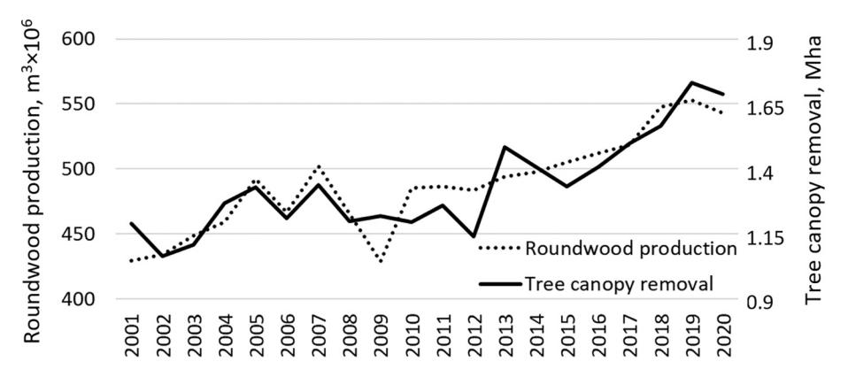

Fig. 10. Continental comparison of the annual tree canopy removal area and the FAO roundwood production statistics (FAOSTAT, 2022) for the 2001–2020 interval.

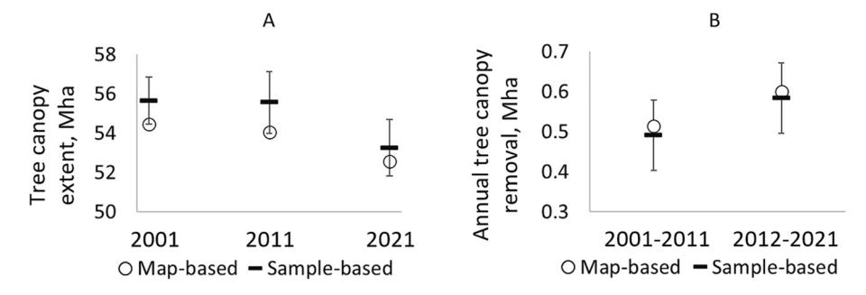

Fig. 11. (A) Map-based and sample-based tree canopy extent area in Fennoscandia for 2001, 2011, and 2021. (B) Map-based and sample-based annual tree canopy removal area in Fennoscandia for 2001–2011 and 2012–2021 intervals. Sample-based estimates are shown with 95% confidence intervals; map-based estimates are pixel counts and do not have associated uncertainty measures.

area reduction in Fennoscandia. The first factor is the increase in tree canopy removal during the last decade, which was confirmed by our regional sample analysis in Fennoscandia (Fig. 11B). We estimated a 17% and 19% increase in the annual tree canopy removal area between 2001–2011 and 2012–2021 intervals based on the map and sample data, respectively. The second factor is the slow regeneration of trees on the logging sites in the northern part of Fennoscandia. To test the effect of this factor, we estimated the total continental area of Landsat pixels that (i) were affected by canopy removal between 2001 and 2006, and (ii) had tree canopy height below 5 m in 2021 ( $\geq$  15 years after disturbance). We found that 51% of such areas are in Fennoscandia with the highest concentration in Central and Northern Sweden (Fig. S7), which supports our conclusion that slow regeneration after clearcuts in northern Fennoscandia played an important role in the observed regional net tree canopy extent reduction.

The disagreement between our results and the FAO FRA data in Fennoscandia calls for further investigation of the relationship between the remotely sensed land cover and the NFI field measurements. The official estimates of forest area decline in Fennoscandia (FAO, 2020) are much lower than our map-based and sample-based estimates (Section 3.3). Moreover, the NFI data in Finland suggest a significant increase in the growing stock (Korhonen et al., 2021) despite the increase in the annual tree canopy removal observed in our data. The difference in forest definition and the analysis intervals (the latest NFI data in Finland are from 2018; Korhonen et al., 2021) may cause this divergence. We suggest that the spatial intercomparison of the NFI plot data with Landsat-based maps and additional research on the dynamics of forest recovery after clearcuts in the northern forests are required to understand the observed differences. This can only be attained after developing methods to effectively provide access to NFI plot positions while keeping their confidentiality to preserve the statistical robustness of NFI data (Nabuurs et al., 2022).

## 4.3. Implications of the observed tree canopy change in Europe

Both our product and the FAO data (FAO, 2020; FAOSTAT, 2022) show the same change trajectories in Europe: the expansion of area covered with trees and the intensification of timber harvesting and natural disturbances. The highest relative increase in tree canopy extent was observed in Eastern and Southern Europe and the British Isles (Fig. S3). We speculate that two major factors explain the tree canopy expansion. The first factor is the growth of commercial tree plantation areas (Freer-Smith et al., 2019). Another factor is agricultural land abandonment and subsequent afforestation, a process that is especially intensive in Eastern Europe (Potapov et al., 2015, 2021b; Estel et al., 2015). The observed increase in tree canopy extent through plantation establishment may have negative consequences on biodiversity and other ecosystem functions when monoculture plantations of non-native species predominate the forest landscape (Bremer and Farley, 2010; Liu et al., 2018; Seidl et al., 2018; Brus et al., 2019). The structurally homogeneous forests that are frequently established in areas affected by windthrow and insect outbreaks may exacerbate such disturbances in the future (Griess et al., 2012; Felton et al., 2016). Developing and implementing policies and financial incentives to encourage mixedspecies and structurally diverse forests may support biodiversity and increase the resilience of European forests to future natural disturbances (Seidl et al., 2016). This might include promoting natural regeneration rather than planting after disturbances (Senf et al., 2019), as well as considering alternative management strategies (i.e., keeping deadwood on site; Thorn et al., 2020).

Large-scale natural disturbance dynamics, such as windthrow, insect outbreaks, and wildfire, play an important role in the observed annual variation of tree canopy removal (i.e., annual extremes such as those caused by storm Kyrill in 2007) and the recent decrease of tree canopy extent in Western and Eastern Europe. The recent increases in natural disturbance extent and intensity are linked to drier and warmer

conditions facilitating insect outbreaks and more intensive fire activity (Senf and Seidl, 2021b; Grünig et al., 2022). Most of the forests affected by disturbances, even if affected only by partial tree mortality, are subsequently cleared by salvage logging, which further increases the area of tree canopy removal. The global demand for timber has increased since 2000 and it is expected to grow considerably in the next decades (FAO, 2022), in particular, driven by energy production (O'Brien and Bringezu, 2018). We suggest that European forests may experience an increase in the annual tree canopy removal area in the future caused by a concurrent increase in timber harvesting and natural disturbances.

The observed increase in annual tree canopy removal and the decrease of the tall, high-biomass tree canopy areas are well aligned with more theoretical predictions by McDowell et al. (2020), who suggest that forests globally shift toward shorter and younger stands. In Europe, for instance, changing disturbance dynamics can substantially alter forest demography (Senf et al., 2021), which can reduce their carbon storage potential in the future (Seidl et al., 2014; Messier et al., 2022). These processes may already reduce the carbon storage potential of Europe's forests, although the magnitude of these changes is probably lower than recent estimates by Ceccherini et al. (2020).

## 5. Conclusion

In this study, we presented a new spatiotemporally consistent 2001–2021 annual tree canopy height dataset for Europe produced through the integration of the lidar observations and Landsat data archive. The presented method employed the integration of annual tree canopy height and tree canopy removal mapping, and it is suitable for future annual continental-scale tree canopy monitoring. The high accuracies of the tree canopy extent and removal maps derived from the annual tree canopy height map time series were confirmed with a rigorous reference sample analysis. The new annual tree canopy removal time series is an improvement compared to the Global Forest Loss product (Hansen et al., 2013).

The presented dataset supports tree canopy extent monitoring at national to continental scales in numerous ways. The data reflect annual changes in all categories of tree canopy (including trees outside of forests) and thus are complementary to the NFI and FAO FRA data. Our product is complementary to existing annual forest disturbance maps (Senf and Seidl, 2021a), providing information on post-disturbance tree canopy recovery and afforestation. Our data may support the harmonization of the national forest area estimates. Our map time series may also be used as an efficient stratifier to design the reference sample data collection to analyze the drivers of forest change. Finally, our product may serve as an input for continental modeling of forest biomass and carbon storage using existing methodologies of Tyukavina et al. (2015) and Harris et al. (2021).

## **Author contributions**

ST and PP developed the continental time-series product and performed product validation. ST, PP, MH, AT, CS, TH, RV, LE, HN, and FS analyzed the results and wrote the manuscript. XL and AH-S supported lidar data processing. AP created a data visualization portal. APA, JG-H, OB, BN, and JN provided regional lidar data. All authors provided substantial edits and comments to the manuscript.

## CRediT authorship contribution statement

**Svetlana Turubanova:** Conceptualization, Methodology, Validation, Writing – original draft. **Peter Potapov:** Conceptualization, Methodology, Software, Validation, Writing – original draft. **Matthew C. Hansen:** Conceptualization, Writing – review & editing, Supervision, Funding acquisition. **Xinyuan Li:** Writing – review & editing, Resources. **Alexandra Tyukavina:** Methodology, Writing – review & editing. **Amy** 

H. Pickens: Visualization, Writing – review & editing. Andres Hernandez-Serna: Resources. Adrian Pascual Arranz: Resources. Juan Guerra-Hernandez: Resources. Cornelius Senf: Writing – review & editing. Tuomas Häme: Writing – review & editing. Ruben Valbuena: Writing – review & editing. Lars Eklundh: Writing – review & editing. Olga Brovkina: Writing – review & editing, Resources. Barbora Navrátilová: Resources. Jan Novotný: Resources. Nancy Harris: Writing – review & editing. Fred Stolle: Writing – review & editing.

## **Declaration of Competing Interest**

The authors declare that they have no known competing financial interests or personal relationships that could have appeared to influence the work reported in this paper.

#### Data availability

All data are publicly available

## Acknowledgments

This study was supported by the Bezos Earth Fund, the WRI Global LCLU Monitoring Program (#G2436), the WRI Global Forest Watch (#19113040), and the NASA/USGS Landsat Science Team (#140G0118C0013).

## Appendix A. Supplementary data

Supplementary data to this article can be found online at https://doi.org/10.1016/j.rse.2023.113797.

## References

- Assmann, J.J., Moeslund, J.E., Treier, U.A., Normand, S., 2021. EcoDes-DK15: High-resolution ecological descriptors of vegetation and terrain derived from Denmark's national airborne laser scanning data set (1.1.0). Zenodo. https://doi.org/10.5281/zenodo.5752926 [dataset].
- Breidenbach, J., Ellison, D., Petersson, H., Korhonen, K.T., Henttonen, H.M., Wallerman, J., Fridman, J., Gobakken, T., Astrup, R., Næsset, E., 2022. Harvested area did not increase abruptly—how advancements in satellite-based mapping led to erroneous conclusions. Ann. For. Sci. 79, 2. https://doi.org/10.1186/s13595-022-01120-4.
- Bárta, V., Lukeš, P., Homolová, L., 2021. Early detection of bark beetle infestation in Norway spruce forests of Central Europe using Sentinel-2. Int. J. Appl. Earth Obs. Geoinf. 100, 102335 https://doi.org/10.1016/j.jag.2021.102335.
- Bremer, L.L., Farley, K.A., 2010. Does plantation forestry restore biodiversity or create green deserts? A synthesis of the effects of land-use transitions on plant species richness. Biodivers. Conserv. 19, 3893–3915. https://doi.org/10.1007/s10531-010-9936-4
- Breiman, L., 1996. Bagging predictors. Mach. Learn. 24, 123–140.
- Breiman, L., Friedman, J.H., Olshen, R.A., Stone, C.J., 1984. Classification and Regression Trees. Wadsworth and Brooks/Cole, Monterey, California.
- Brus, R., Pötzelsberger, E., Lapin, K., Brundu, G., Orazio, C., Straigyte, L., Hasenauer, H., 2019. Extent, distribution and origin of non-native forest tree species in Europe. Scand. J. For. Res. 34, 533–544. https://doi.org/10.1080/02827581.2019.1676464.
- Ceccherini, G., Duveiller, G., Grassi, G., Lemoine, G., Avitabile, V., Pilli, R., Cescatti, A., 2020. Abrupt increase in harvested forest area over Europe after 2015. Nature 583, 72–77. https://doi.org/10.1038/s41586-020-2438-y.
- Cochran, W.G., 1977. Sampling Techniques, 3d, ed. ed. In: Wiley Series in Probability and Mathematical Statistics. Wiley, New York.
- Danielson, J.J., Gesch, D.B., 2011. Global multi-resolution terrain elevation data 2010 (GMTED2010): U.S. Geological Survey Open-File Report 2011–1073, 26 p.
- de Foresta, H., Somarriba, E., Temu, A., Boulanger, D., Feuilly, H., Gauthier, M., 2013. Towards the assessment of trees outside forests, resources assessment working paper 183. FAO. Rome. Italy.
- Dubayah, R., Hofton, M., Blair, J., Armston, J., Tang, H., Luthcke, S., 2021. GEDI L2A Elevation and Height Metrics Data Global Footprint Level V002. NASA EOSDIS Land Processes DAAC. https://doi.org/10.5067/GEDI/GEDI02 A.002 [dataset].
- Estel, S., Kuemmerle, T., Alcántara, C., Levers, C., Prishchepov, A., Hostert, P., 2015. Mapping farmland abandonment and recultivation across Europe using MODIS NDVI time series. Remote Sens. Environ. 163, 312–325. https://doi.org/10.1016/J. RSF. 2015.03.028
- FAO, 2022. Global forest sector outlook 2050: assessing future demand and sources of timber for a sustainable economy. FAO, Rome, Italy. https://doi.org/10.4060/ cc2265en
- FAOSTAT, 2022. FAO. https://www.fao.org/faostat/en/#home.

- FAO, 2020. Global Forest resources assessment 2020: Main report. FAO, Rome, Italy. https://doi.org/10.4060/ca9825en.
- Felton, A., Nilsson, U., Sonesson, J., Felton, A.M., Roberge, J.-M., Ranius, T., Ahlström, M., Bergh, J., Björkman, C., Boberg, J., Drössler, L., Fahlvik, N., Gong, P., Holmström, E., Keskitalo, E.C.H., Klapwijk, M.J., Laudon, H., Lundmark, T., Niklasson, M., Nordin, A., Pettersson, M., Stenlid, J., Sténs, A., Wallertz, K., 2016. Replacing monocultures with mixed-species stands: ecosystem service implications of two production forest alternatives in Sweden. Ambio 45, 124–139. https://doi. org/10.1007/s13280-015-0749-2.
- Freer-Smith, P., Muys, B., Bozzano, M., Drössler, L., Farrelly, N., Jactel, H., Korhonen, J., Minotta, G., Nijnik, M., Orazio, C., 2019. Plantation forests in Europe: challenges and opportunities. From Science to Policy 9. European Forest Institute, Joensuu, Finland, 10.36333/fs09.
- Fuchs, R., Herold, M., Verburg, P.H., Clevers, J.G.P.W., 2013. A high-resolution and harmonized model approach for reconstructing and analysing historic land changes in Europe. Biogeosciences 10, 1543–1559. https://doi.org/10.5194/bg-10-1543-2013
- Geist, H.J., Lambin, E.F., 2002. Proximate causes and underlying driving forces of tropical deforestation: tropical forests are disappearing as the result of many pressures, both local and regional, acting in various combinations in different geographical locations. Bioscience 52, 143–150. https://doi.org/10.1641/0006-3568(2002)052[0143:PCAUDF]2.0.CO;2.
- Griess, V.C., Acevedo, R., Härtl, F., Staupendahl, K., Knoke, T., 2012. Does mixing tree species enhance stand resistance against natural hazards? A case study for spruce. For. Ecol. Manag. 267, 284–296. https://doi.org/10.1016/j.foreco.2011.11.035.
- Griscom, B.W., Adams, J., Ellis, P.W., Houghton, R.A., Lomax, G., Miteva, D.A.,
  Schlesinger, W.H., Shoch, D., Siikamäki, J.V., Smith, P., Woodbury, P., Zganjar, C.,
  Blackman, A., Campari, J., Conant, R.T., Delgado, C., Elias, P., Gopalakrishna, T.,
  Hamsik, M.R., Herrero, M., Kiesecker, J., Landis, E., Laestadius, L., Leavitt, S.M.,
  Minnemeyer, S., Polasky, S., Potapov, P., Putz, F.E., Sanderman, J., Silvius, M.,
  Wollenberg, E., Fargione, J., 2017. Natural climate solutions. Proc. Nat. Acad. Sci.
  114, 11645–11650. https://doi.org/10.1073/pnas.1710465114.
- Grünig, M., Seidl, R., Senf, C., 2022. Increasing aridity causes larger and more severe forest fires across Europe. Glob. Chang. Biol. 1–12 https://doi.org/10.1111/ gcb.16547
- Hansen, M.C., Egorov, A., Roy, D.P., Potapov, P., Ju, J., Turubanova, S., Kommareddy, I., Loveland, T.R., 2011. Continuous fields of land cover for the conterminous United States using Landsat data: first results from the web-enabled Landsat data (WELD) project. Remote Sens. Lett. 2, 279–288. https://doi.org/10.1080/ 01431161.2010.519002.
- Hansen, M.C., Loveland, T.R., 2012. A review of large area monitoring of land cover change using landsat data. Remote Sens. Environ. Landsat Legacy Special Issue 122, 66–74. https://doi.org/10.1016/j.rse.2011.08.024.
- Hansen, M.C., Potapov, P.V., Moore, R., Hancher, M., Turubanova, S.A., Tyukavina, A., Thau, D., Stehman, S.V., Goetz, S.J., Loveland, T.R., Kommareddy, A., Egorov, A., Chini, L., Justice, C.O., Townshend, J.R.G., 2013. High-resolution global maps of 21st-century forest cover change. Science 342, 850–853. https://doi.org/10.1126/science.1244693
- Harris, N.L., Gibbs, D.A., Baccini, A., Birdsey, R.A., de Bruin, S., Farina, M., Fatoyinbo, L., Hansen, M.C., Herold, M., Houghton, R.A., Potapov, P.V., Suarez, D.R., Roman-Cuesta, R.M., Saatchi, S.S., Slay, C.M., Turubanova, S.A., Tyukavina, A., 2021. Global maps of twenty-first century forest carbon fluxes. Nat. Clim. Chang. 11, 234–240. https://doi.org/10.1038/s41558-020-00976-6.
- Hlásny, T., König, L., Krokene, P., Lindner, M., Montagné-Huck, C., Müller, J., Qin, H., Raffa, K.F., Schelhaas, M.-J., Svoboda, M., Viiri, H., Seidl, R., 2021a. Bark beetle outbreaks in Europe: state of knowledge and ways forward for management. Curr. For. Rep. 7, 138–165. https://doi.org/10.1007/s40725-021-00142-x.
- Hlásny, T., Zimová, S., Merganičová, K., Štěpánek, P., Modlinger, R., Turčáni, M., 2021b. Devastating outbreak of bark beetles in the Czech Republic: drivers, impacts, and management implications. For. Ecol. Manag. 490, 119075 https://doi.org/10.1016/ j.foreco.2021.119075.
- Kaplan, J.O., Krumhardt, K.M., Zimmermann, N.E., 2012. The effects of land use and climate change on the carbon cycle of Europe over the past 500 years. Glob. Chang. Biol. 18, 902–914. https://doi.org/10.1111/j.1365-2486.2011.02580.x.
- Klaus, M., Holsten, A., Hostert, P., Kropp, J.P., 2011. Integrated methodology to assess windthrow impacts on forest stands under climate change. For. Ecol. Manag. 261, 1799–1810. https://doi.org/10.1016/j.foreco.2011.02.002.
- Korhonen, K.T., Ahola, A., Heikkinen, J., Henttonen, H.M., Hotanen, J.-P., Ihalainen, A., Melin, M., Pitkänen, J., Räty, M., Sirviö, M., Strandström, M., 2021. Forests of Finland 2014–2018 and their development 1921–2018. Silva Fennica 55, 10662. https://doi.org/10.14214/sf.10662.
- Kruys, N., Fridman, J., Götmark, F., Simonsson, P., Gustafsson, L., 2013. Retaining trees for conservation at clearcutting has increased structural diversity in young swedish production forests. For. Ecol. Manag. 304, 312–321. https://doi.org/10.1016/j. foreco.2013.05.018.
- Lang, N., Kalischek, N., Armston, J., Schindler, K., Dubayah, R., Wegner, J.D., 2022. Global canopy height regression and uncertainty estimation from GEDI LIDAR waveforms with deep ensembles. Remote Sens. Environ. 268, 112760 https://doi. org/10.1016/j.rse.2021.112760.
- Liu, C.L.C., Kuchma, O., Krutovsky, K.V., 2018. Mixed-species versus monocultures in plantation forestry: development, benefits, ecosystem services and perspectives for the future. Glob. Ecol. Conserv. 15, e00419 https://doi.org/10.1016/j.gecco.2018.
- Liu, S., Brandt, M., Nord-Larsen, T., Chave, J., Reiner, F., Lang, N., Tong, X., Ciais, P., Igel, C., Li, S., Mugabowindekwe, M., Saatchi, S., Yue, Y., Chen, Z., Fensholt, R., 2023. The overlooked contribution of trees outside forests to tree cover and woody

- biomass across Europe. PREPRINT (Version 1) available at Research Square. https://doi.org/10.21203/rs.3.rs-2573442/v1, 26 p.
- Malinowski, R., Lewiński, S., Rybicki, M., Gromny, E., Jenerowicz, M., Krupiński, Michal, Nowakowski, A., Wojtkowski, C., Krupiński, Marcin, Krätzschmar, E., Schauer, P., 2020. Automated production of a land Cover/Use map of Europe based on Sentinel-2 imagery. Remote Sens. 12, 3523. https://doi.org/10.3390/rs12213523.
- Matasci, G., Hermosilla, T., Wulder, M.A., White, J.C., Coops, N.C., Hobart, G.W., Zald, H.S.J., 2018. Large-area mapping of Canadian boreal forest cover, height, biomass and other structural attributes using landsat composites and lidar plots. Remote Sens. Environ. 209, 90–106. https://doi.org/10.1016/j.rse.2017.12.020.
- McDowell, N.G., Allen, C.D., Anderson-Teixeira, K., Aukema, B.H., Bond-Lamberty, B., Chini, L., Clark, J.S., Dietze, M., Grossiord, C., Hanbury-Brown, A., Hurtt, G.C., Jackson, R.B., Johnson, D.J., Kueppers, L., Lichstein, J.W., Ogle, K., Poulter, B., Pugh, T.A.M., Seidl, R., Turner, M.G., Uriarte, M., Walker, A.P., Xu, C., 2020. Pervasive shifts in forest dynamics in a changing world. Science 368, eaaz9463. https://doi.org/10.1126/science.aaz9463.
- McGrath, M.J., Luyssaert, S., Meyfroidt, P., Kaplan, J.O., Bürgi, M., Chen, Y., Erb, K., Gimmi, U., McInerney, D., Naudts, K., Otto, J., Pasztor, F., Ryder, J., Schelhaas, M.-J., Valade, A., 2015. Reconstructing european forest management from 1600 to 2010. Biogeosciences 12, 4291–4316. https://doi.org/10.5194/bg-12-4291-2015.
- McRoberts, R.E., Tomppo, E., Schadauer, K., Vidal, C., Ståhl, G., Chirici, G., Lanz, A., Cienciala, E., Winter, S., Smith, W.B., 2009. Harmonizing national forest inventories. J. For. 107, 179–187. https://doi.org/10.1093/jof/107.4.179.
- Messier, C., Potvin, C., Muys, B., Brancalion, P., Chazdon, R., Seidl, R., Bauhus, J., 2022.
  Warning: natural and managed forests are losing their capacity to mitigate climate change. For. Chron. 98, 2–8. https://doi.org/10.5558/tfc2022-007.
- Nabuurs, G.J., Harris, N., Sheil, D., Palahi, M., Chirici, G., Boissière, M., Fay, C., Reiche, J., Valbuena, R., 2022. Glasgow forest declaration needs new modes of data ownership. Nat. Clim. Chang. 12 (5), 415–417. https://doi.org/10.1038/s41558-022-01343-3.
- Nilsson, M., Nordkvist, K., Jonzén, J., Lindgren, N., Axensten, P., Wallerman, J., Egberth, M., Larsson, S., Nilsson, L., Eriksson, J., Olsson, H., 2017. A nationwide forest attribute map of Sweden predicted using airborne laser scanning data and field data from the national forest inventory. Remote Sens. Environ. 194, 447–454. https://doi.org/10.1016/j.rse.2016.10.022.
- O'Brien, M., Bringezu, S., 2018. European timber consumption: developing a method to account for timber flows and the EU's global Forest footprint. Ecol. Econ. 147, 322–332. https://doi.org/10.1016/j.ecolecon.2018.01.027.
- Olofsson, P., Arévalo, P., Espejo, A.B., Green, C., Lindquist, E., McRoberts, R.E., Sanz, M. J., 2020. Mitigating the effects of omission errors on area and area change estimates. Remote Sens. Environ. 236, 111492 https://doi.org/10.1016/j.rse.2019.111492.
- Olofsson, P., Foody, G.M., Herold, M., Stehman, S.V., Woodcock, C.E., Wulder, M.A., 2014. Good practices for estimating area and assessing accuracy of land change. Remote Sens. Environ. 148, 42–57. https://doi.org/10.1016/j.rse.2014.02.015.
- OpenStreetMap (OSM) contributors, 2022. https://planet.openstreetmap.org.
  Palahí, M., Valbuena, R., Senf, C., Acil, N., Pugh, T.A.M., Sadler, J., Seidl, R., Potapov, P.,
  Gardiner, B., Hetemäki, L., Chirici, G., Francini, S., Hlásny, T., Lerink, B.J.W.,
  Olsson, H., González Olabarria, J.R., Ascoli, D., Asikainen, A., Bauhus, J.,
  Berndes, G., Donis, J., Fridman, J., Hanewinkel, M., Jactel, H., Lindner, M.,
  Marchetti, M., Marušák, R., Sheil, D., Tomé, M., Trasobares, A., Verkerk, P.J.,
  Korhonen, M., Nabuurs, G.-J., 2021. Concerns about reported harvests in European
  forests. Nature 592. E15–E17. https://doi.org/10.1038/s41586-021-03292-x.
- Pascual, A., Guerra-Hernández, J., Cosenza, D.N., Sandoval-Altelarrea, V., 2021. Using enhanced data co-registration to update spanish National Forest Inventories (NFI) and to reduce training data under LiDAR-assisted inference. Int. J. Remote Sens. 42 (1), 126–147. https://doi.org/10.1080/01431161.2020.1813346.
- Potapov, P., Hansen, M.C., Kommareddy, I., Kommareddy, A., Turubanova, S., Pickens, A., Adusei, B., Tyukavina, A., Ying, Q., 2020. Landsat analysis ready data for global land cover and land cover change mapping. Remote Sens. 12, 426. https://doi.org/10.3390/rs12030426.
- Potapov, P., Hansen, M.C., Pickens, A., Hernandez-Serna, A., Tyukavina, A., Turubanova, S., Zalles, V., Li, X., Khan, A., Stolle, F., Harris, N., Song, X.-P., Baggett, A., Kommareddy, I., Kommareddy, A., 2022. The global 2000–2020 land cover and land use change dataset derived from the Landsat archive: first results. Front. Remote Sens. 3 https://doi.org/10.3389/frsen.2022.856903.
- Potapov, P., Li, X., Hernandez-Serna, A., Tyukavina, A., Hansen, M.C., Kommareddy, A., Pickens, A., Turubanova, S., Tang, H., Silva, C.E., Armston, J., Dubayah, R., Blair, J. B., Hofton, M., 2021a. Mapping global forest canopy height through integration of GEDI and landsat data. Remote Sens. Environ. 253, 112165 https://doi.org/10.1016/j.rse.2020.112165.
- Potapov, P., Turubanova, S., Hansen, M.C., Tyukavina, A., Zalles, V., Khan, A., Song, X.-P., Pickens, A., Shen, Q., Cortez, J., 2021b. Global maps of cropland extent and change show accelerated cropland expansion in the twenty-first century. Nature Food 1–10. https://doi.org/10.1038/s43016-021-00429-z.
- Potapov, P.V., Turubanova, S.A., Tyukavina, A., Krylov, A.M., McCarty, J.L., Radeloff, V. C., Hansen, M.C., 2015. Eastern Europe's forest cover dynamics from 1985 to 2012 quantified from the full Landsat archive. Remote Sens. Environ. 159, 28–43. https://doi.org/10.1016/j.rse.2014.11.027.
- Potapov, P., Tyukavina, A., Turubanova, S., Talero, Y., Hernandez-Serna, A., Hansen, M. C., Saah, D., Tenneson, K., Poortinga, A., Aekakkararungroj, A., Chishtie, F., Towashiraporn, P., Bhandari, B., Aung, K.S., Nguyen, Q.H., 2019. Annual continuous fields of woody vegetation structure in the lower Mekong region from 2000–2017 Landsat time-series. Remote Sens. Environ. 232, 111278 https://doi.org/10.1016/j.rse.2019.111278.
- Reese, H., Nilsson, M., Pahlén, T.G., Hagner, O., Joyce, S., Tingelöf, U., Egberth, M., Olsson, H., 2003. Countrywide estimates of Forest variables using satellite data and

- field data from the National Forest Inventory. Ambio 32, 542–548. https://doi.org/
- Reuter, H.I., Nelson, A., Jarvis, A., 2007. An evaluation of void filling interpolation methods for SRTM data. Int. J. Geogr. Inform. Sci. 21 (9), 983–1008. https://doi. org/10.1080/13658810601169899.
- Roberts, N., Fyfe, R.M., Woodbridge, J., Gaillard, M.-J., Davis, B.A.S., Kaplan, J.O., Marquer, L., Mazier, F., Nielsen, A.B., Sugita, S., Trondman, A.-K., Leydet, M., 2018. Europe's lost forests: a pollen-based synthesis for the last 11,000 years. Sci. Rep. 8, 716. https://doi.org/10.1038/s41598-017-18646-7.
- Schroeder, T.A., Moisen, G.G., Healey, S.P., Cohen, W.B., 2012. Adding value to the FIA inventory: combining FIA data and satellite observations to estimate forest disturbance, 478 p. In: Morin, R., Likens, G. (Eds.), Moving From Status to Trends: 2012 Forest Inventory and Analysis (FIA) Symposium. Gen. Tech. Rep. NRS-P-105. U.S. Department of Agriculture, Forest Service, Northern Research Station. https://www.srs.fs.usda.gov/pubs/42693.
- Schröter, D., Cramer, W., Leemans, R., Prentice, I., Araújo, M., Arnell, N., Bondeau, A., Brugmann, H., Carter, T.R., Gracia, C., de la Vega-Leinert, A., Erhard, M., Ewert, F., Glendining, M., House, J., Kankaanpää, S., Klein, R.J.T., Lavorel, S., Lindner, M., Zierl, B., 2005. Ecosystem service supply and vulnerability to global change in Europe. Science 310 (5752), 310.
- Schuck, A., Päivinen, R., Häme, T., Van Brusselen, J., Kennedy, P., Folving, S., 2003. In: Compilation of a European forest map from Portugal to the Ural mountains based on earth observation data and forest statistics. Forest Policy and Economics, Diamonds from the European Forest Institute. Evaluation of 10 Years Research in European Forestry Issues. 5, pp. 187–202. https://doi.org/10.1016/S1389-9341(03)00024-8.
- Seebach, L.M., Strobl, P., San Miguel-Ayanz, J., Gallego, J., Bastrup-Birk, A., 2011. Comparative analysis of harmonized forest area estimates for European countries. Forestry: An Int. J. For. Res. 84, 285–299. https://doi.org/10.1093/forestry/cpr013.
- Seidl, R., Klonner, G., Rammer, W., Essl, F., Moreno, A., Neumann, M., Dullinger, S., 2018. Invasive alien pests threaten the carbon stored in Europe's forests. Nat. Commun. 9, 1626. https://doi.org/10.1038/s41467-018-04096-w.
- Seidl, R., Schelhaas, M.-J., Rammer, W., Verkerk, P.J., 2014. Increasing forest disturbances in Europe and their impact on carbon storage. Nat. Clim. Chang. 4, 806–810. https://doi.org/10.1038/nclimate2318.
- Seidl, R., Spies, T.A., Peterson, D.L., Stephens, S.L., Hicke, J.A., 2016. REVIEW: searching for resilience: addressing the impacts of changing disturbance regimes on forest ecosystem services. J. Appl. Ecol. 53, 120–129. https://doi.org/10.1111/1365-2664-12511.
- Senf, C., Buras, A., Zang, C.S., Rammig, A., Seidl, R., 2020. Excess forest mortality is consistently linked to drought across Europe. Nat. Commun. 11, 6200. https://doi. org/10.1038/s41467-020-19924-1.
- Senf, C., Müller, J., Seidl, R., 2019. Post-disturbance recovery of forest cover and tree height differ with management in Central Europe. Landsc. Ecol. 34, 2837–2850. https://doi.org/10.1007/s10980-019-00921-9.
- Senf, C., Sebald, J., Seidl, R., 2021. Increasing canopy mortality affects the future demographic structure of Europe's forests. One Earth 4, 749–755. https://doi.org/ 10.1016/j.oneear.2021.04.008.
- Senf, C., Seidl, R., 2021a. Mapping the forest disturbance regimes of Europe. Nat. Sustain. 4, 63–70. https://doi.org/10.1038/s41893-020-00609-y.

- Senf, C., Seidl, R., 2021. Persistent impacts of the 2018 drought on forest disturbance regimes in Europe (preprint). Earth System Science/Response to Global Change: Climate Change. https://doi.org/10.5194/bg-2021-120.
- Stehman, S.V., 2014. Estimating area and map accuracy for stratified random sampling when the strata are different from the map classes. Int. J. Remote Sens. 35, 4923–4939. https://doi.org/10.1080/01431161.2014.930207.
- Thorn, S., Chao, A., Georgiev, K.B., Müller, J., Bässler, C., Campbell, J.L., Castro, J., Chen, Y.-H., Choi, C.-Y., Cobb, T.P., Donato, D.C., Durska, E., Macdonald, E., Feldhaar, H., Fontaine, J.B., Fornwalt, P.J., Hernández, R.M.H., Hutto, R.L., Koivula, M., Lee, E.-J., Lindenmayer, D., Mikusiński, G., Obrist, M.K., Perlík, M., Rost, J., Waldron, K., Wermelinger, B., Weiß, I., Żmihorski, M., Leverkus, A.B., 2020. Estimating retention benchmarks for salvage logging to protect biodiversity. Nat. Commun. 11, 4762. https://doi.org/10.1038/s41467-020-18612-4.
- Tomppo, E., Gschwantner, T., Lawrence, M., McRoberts, R.E., 2010. National Forest Inventories: Pathways for Common Reporting. Springer, Netherlands Springer ebooks, Dordrecht.
- Tomppo, E., Olsson, H., Ståhl, G., Nilsson, M., Hagner, O., Katila, M., 2008. Combining national forest inventory field plots and remote sensing data for forest databases. Remote Sens. Environ. 112, 1982–1999. https://doi.org/10.1016/j.rse.2007.03.032.
- Tyukavina, A., Baccini, A., Hansen, M.C., Potapov, P.V., Stehman, S.V., Houghton, R.A., Krylov, A.M., Turubanova, S., Goetz, S.J., 2015. Aboveground carbon loss in natural and managed tropical forests from 2000 to 2012. Environ. Res. Lett. 10, 074002 https://doi.org/10.1088/1748-9326/10/7/074002.
- Tyukavina, A., Potapov, P., Hansen, M.C., Pickens, A.H., Stehman, S.V., Turubanova, S., Parker, D., Zalles, V., Lima, A., Kommareddy, I., Song, X.P., 2022. Global trends of forest loss due to fire from 2001 to 2019. Front. Remote Sens. 3 https://doi.org/10.3389/frsen.2022.825190.
- U.S. Geological Survey, 2021. Landsat Collection 2 (ver. 1.1, January 15, 2021): U.S. Geological Survey Fact Sheet 2021–3002. https://doi.org/10.3133/fs20213002, 4 p. Vera, F.W.M., 2000. Grazing Ecology and Forest History. New York, NY, CABI Pub, Wallingford, Oxon.
- Vizzarri, M., Pilli, R., Korosuo, A., Frate, L., Grassi, G., 2022. The role of forests in climate change mitigation: The EU context. In: Tognetti, R., Smith, M., Panzacchi, P. (Eds.), Climate-Smart Forestry in Mountain Regions, Managing Forest Ecosystems. Springer International Publishing, Cham, pp. 507–520. https://doi.org/10.1007/978-3-030-80767-2 15.
- Zanaga, D., Van De Kerchove, R., De Keersmaecker, W., Souverijns, N., Brockmann, C., Quast, R., Wevers, J., Grosu, A., Paccini, A., Vergnaud, S., Cartus, O., Santoro, M., Fritz, S., Georgieva, I., Lesiv, M., Carter, S., Herold, M., Li, L., Tsendbazar, N.-E., Ramoino, F., Arino, O., 2021. ESA WorldCover 10 m 2020 v100. https://doi.org/10.5281/zenodo.5571936 [dataset].
- Zanaga, D., Van De Kerchove, R., Daems, D., De Keersmaecker, W., Brockmann, C., Kirches, G., Wevers, J., Cartus, O., Santoro, M., Fritz, S., Lesiv, M., Herold, M., Tsendbazar, N.E., Xu, P., Ramoino, F., Arino, O., 2022. ESA WorldCover 10 m 2021 v200. https://doi.org/10.5281/zenodo.7254221 [dataset].
- Zhang, X., Friedl, M., Henebry, G., 2020. VIIRS/NPP Land Cover Dynamics Yearly L3 Global 500m SIN Grid V001. https://doi.org/10.5067/VIIRS/VNP22Q2.001 [dataset].