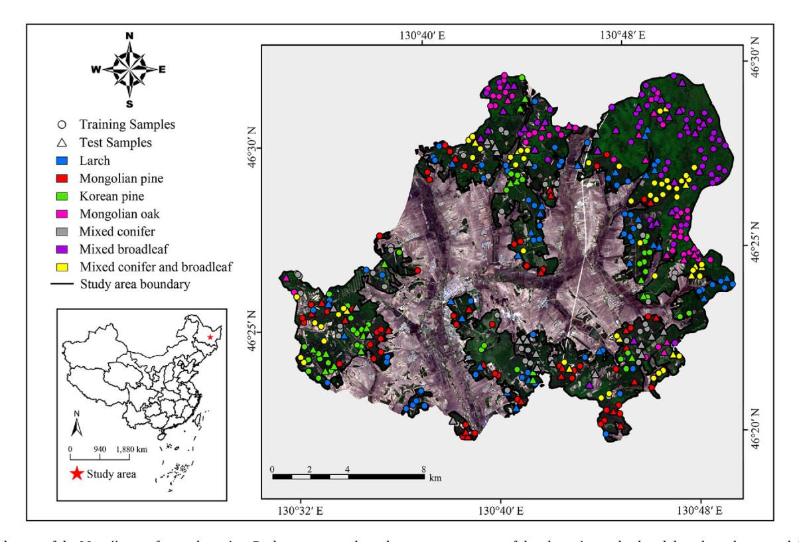
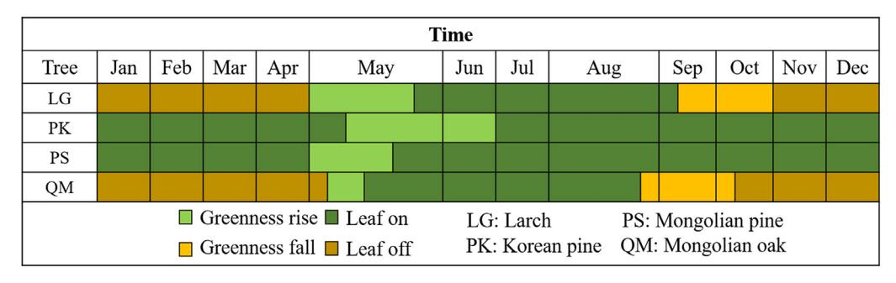
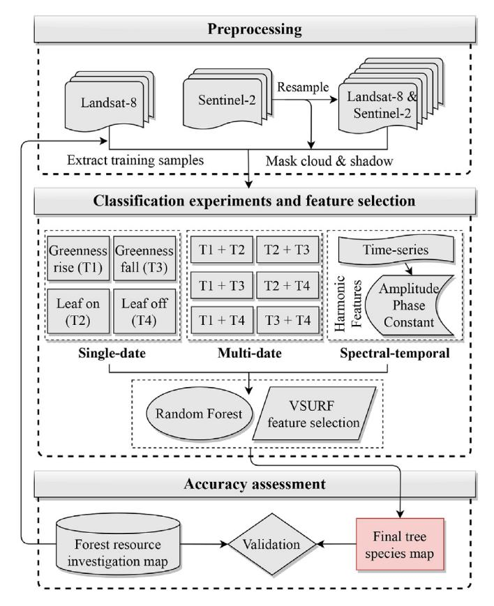
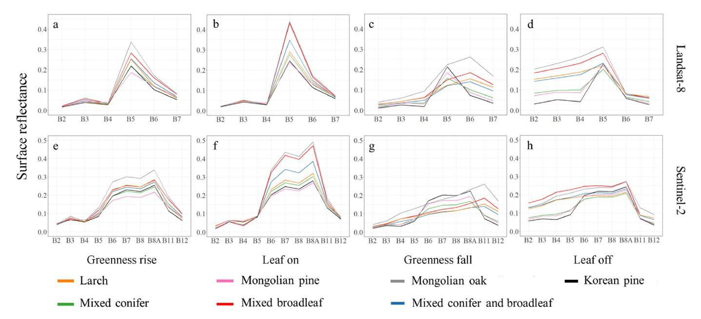
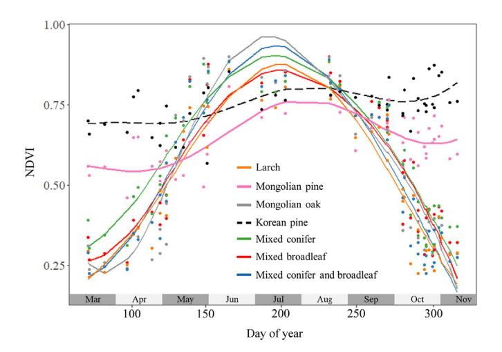
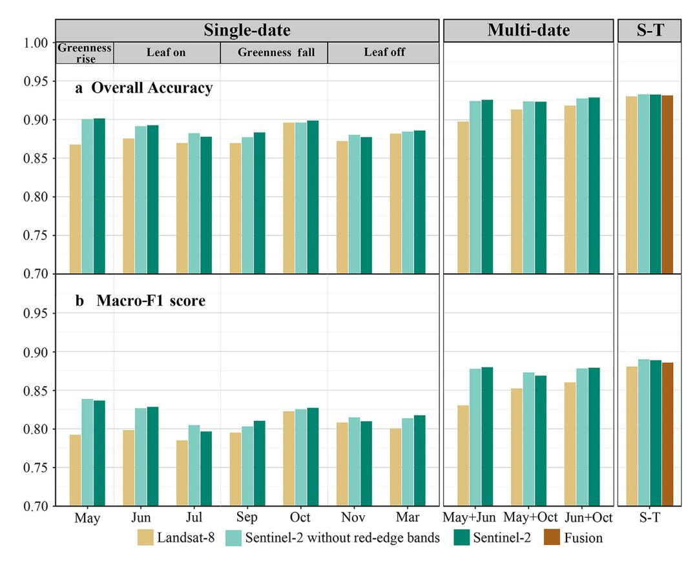
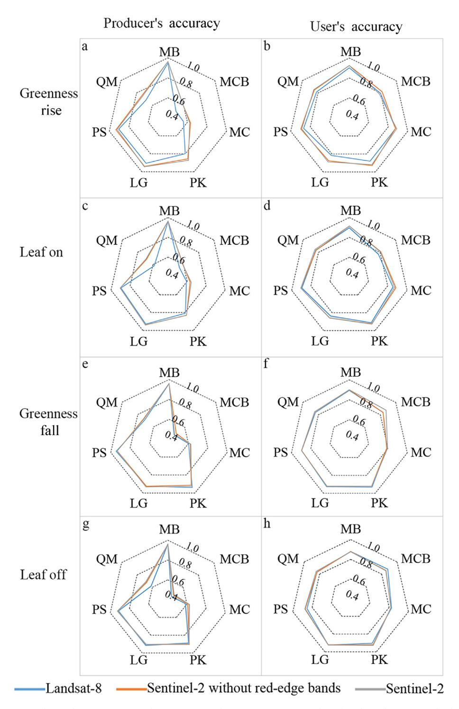
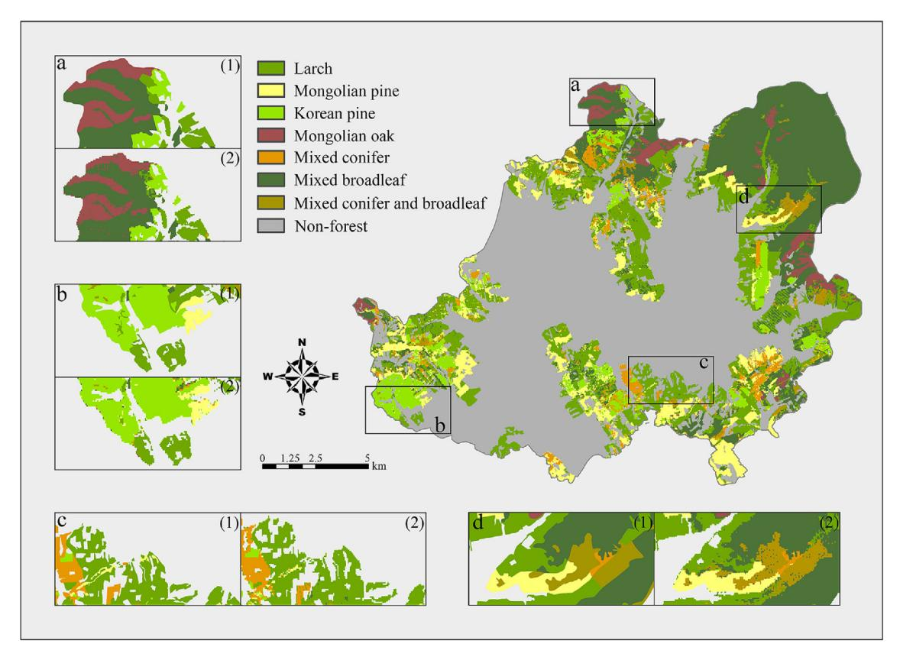
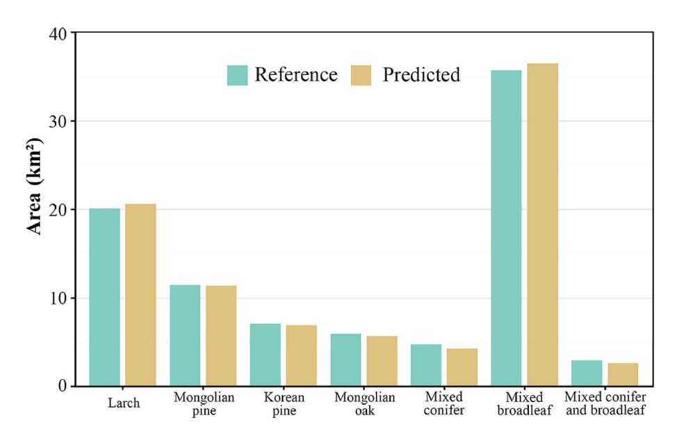

Contents lists available at ScienceDirect

### Forest Ecosystems

journal homepage: www.keaipublishing.com/cn/journals/forest-ecosystems

## Assessing Landsat-8 and Sentinel-2 spectral-temporal features for mapping tree species of northern plantation forests in Heilongjiang Province, China

Mengyu Wang a,1, Yi Zheng a,1, Chengquan Huang b, Ran Meng c, Yong Pang d,e, Wen Jia d,e, Jie Zhou a, Zehua Huang c, Linchuan Fang a, Feng Zhao a,\*

- a Key Laboratory of Geographical Process Analysis & Simulation of Hubei Province/College of Urban and Environmental Sciences, Central China Normal University, Wuhan, 430079, China
- b Department of Geographical Sciences, University of Maryland, College Park, MD, 20742, USA
- c Macro Agriculture Research Institute, Interdisciplinary Sciences Research Institute, College of Resources and Environment, Huazhong Agricultural University, Wuhan, 430070. China
- d Institute of Forest Resource Information Techniques, Chinese Academy of Forestry, Beijing, 100091, China
- e Key Laboratory of Forestry Remote Sensing and Information System, National Forestry and Grassland Administration, Beijing, 100091, China

#### ARTICLE INFO

# Keywords: Tree species mapping Plantation forests Red-edge features Temporal frequency of data acquisition Fusion of Landsat-8 and Sentinel-2

#### ABSTRACT

Background: Accurate mapping of tree species is highly desired in the management and research of plantation forests, whose ecosystem services are currently under threats. Time-series multispectral satellite images, e.g., from Landsat-8 (L8) and Sentinel-2 (S2), have been proven useful in mapping general forest types, yet we do not know quantitatively how their spectral features (e.g., red-edge) and temporal frequency of data acquisitions (e.g., 16-day vs. 5-day) contribute to plantation forest mapping to the species level. Moreover, it is unclear to what extent the fusion of L8 and S2 will result in improvements in tree species mapping of northern plantation forests in

Methods: We designed three sets of classification experiments (i.e., single-date, multi-date, and spectral-temporal) to evaluate the performances of L8 and S2 data for mapping keystone timber tree species in northern China. We first used seven pairs of L8 and S2 images to evaluate the performances of L8 and S2 key spectral features for separating these tree species across key growing stages. Then we extracted the spectral-temporal features from all available images of different temporal frequency of data acquisition (i.e., L8 time series, S2 time series, and fusion of L8 and S2) to assess the contribution of image temporal frequency on the accuracy of tree species mapping in the study area.

Results: 1) S2 outperformed L8 images in all classification experiments, with or without the red edge bands (0.4%–3.4% and 0.2%–4.4% higher for overall accuracy and macro-F1, respectively); 2) NDTI (the ratio of SWIR1 minus SWIR2 to SWIR1 plus SWIR2) and Tasseled Cap coefficients were most important features in all the classifications, and for time-series experiments, the spectral-temporal features of red band-related vegetation indices were most useful; 3) increasing the temporal frequency of data acquisition can improve overall accuracy of tree species mapping for up to 3.2% (from 90.1% using single-date imagery to 93.3% using S2 time-series), yet similar overall accuracies were achieved using S2 time-series (93.3%) and the fusion of S2 and L8 (93.2%).

Conclusions: This study quantifies the contributions of L8 and S2 spectral and temporal features in mapping keystone tree species of northern plantation forests in China and suggests that for mapping tree species in China's northern plantation forests, the effects of increasing the temporal frequency of data acquisition could saturate quickly after using only two images from key phenological stages.

E-mail address: fzhao@ccnu.edu.cn (F. Zhao).

\* Corresponding author.

&lt;sup>1 These authors contributed equally.

#### 1. Introduction

The planted forests provide important ecosystem services and represent valuable global resources, such as carbon sequestration and timber products (Wingfield et al., 2015; Chen et al., 2019; FAO, 2021). Plantation forest is a particular type of planted forests where planted trees are managed intensively and usually composed of one or two even-aged species with regular spacing (FAO, 2021). As home to the world's largest plantation forests, China has contributed to about one fourth of net global leaf area increase in the past two decades through land-use management activities such as afforestation, especially in northern China (Chen et al., 2019; FAO, 2021). Common timber species in China's northern plantation forests include larch, Mongolian pine, Korean pine and Mongolian oak, etc., which are also keystone species in Eurasian temperate-boreal ecozones (Hytteborn et al., 2005). These northern plantation forests provide valuable timber resources and support regional economic development, but their ecosystem services have been threatened by climate change and increasing disturbances (Hanewinkel et al., 2013; Wingfield et al., 2015; Harris et al., 2021). Accurate mapping of these tree species is essential for effective management of northern plantation forests in China (Zhang et al., 2000; Meng et al., 2022) and is also valuable for characterizing ecosystem services and forest-climate feedbacks in this region (Bonan et al., 1992; Duveiller et al., 2021). Traditional forest surveys could produce detailed and accurate maps of tree species distribution, but they are time-consuming and labor-intensive, and subjecting to artificial errors that could not be

Remote sensing has emerged as one of the most efficient tools for mapping tree species at regional (Lim et al., 2019; Kollert et al., 2021) and landscape scales (Shen and Cao, 2017; Fang et al., 2020; Lindberg et al., 2021). Because of its ability to penetrate the canopy and characterize tree structure, airborne Lidar data can successfully differentiate tree species and produce highly accurate species maps (Dalponte et al., 2012; Blomley et al., 2017; Mäyrä et al., 2021). However, airborne Lidar data are often expensive and have limited spatial coverage, making it challenging for large-scale applications (Heinzel and Koch, 2011; Li et al., 2013). Spaceborne Lidar data, such as data from the ICESat or GEDI missions, are more cost-effective, but they do not provide enough point cloud densities for distinguishing tree species at fine spatial scales (Queinnec et al., 2021; Silva et al., 2021; Leite et al., 2022). Radar data, especially L-band or P-band SAR, also provide helpful structural information to improve tree species mapping accuracies (Wong and Fung, 2014; Dostálová et al., 2021; Zhao et al., 2022). But the inherent speckle noises in SAR data pose huge challenges for extracting structural features from the data and it is not feasible to use SAR data alone for accurate mapping of tree species (Bjerreskov et al., 2021). As a result, for large-scale tree species mapping applications, optical remote sensing features (i.e., spectral and temporal features) are more commonly used than structural information from Lidar or SAR data.

For remote sensing-based tree species mapping, spectral information is key for distinguishing different species. Hyperspectral images were found effective in mapping tree species in many ecosystems (Dalponte et al., 2013; Shang and Chisholm, 2014; Meng et al., 2018a, 2018b; Wietecha et al., 2019; Modzelewska et al., 2020; Zhang et al., 2020; Yang et al., 2020), but the high costs and limited availability of high-resolution hyperspectral data hinders its application in fine-scale tree species monitoring that is relevant to forest management. Compared with natural forests, plantation forests are generally composed of even-aged single species and have simpler forest structure and species composition (Wingfield et al., 2015; Yu et al., 2020). Consequently, the spectral separability among plantation tree species is generally higher than that of the natural forests, making it possible to distinguish different species with multi-spectral measurements.

Recently, temporal features of multi-spectral imagery received much attention for tree species mapping. Approaches using time series multispectral images, mostly spaceborne, were found useful for mapping

tree species (Immitzer et al., 2019; Hemmerling et al., 2021; Chen et al., 2021). There are also some recent developments in tree species mapping using multi-spectral or multi-temporal images from airborne or UAV platforms (Cao et al., 2016; Shen and Cao, 2017; Xu et al., 2020; Egli and Höpke, 2020; Johansen et al., 2020; Belcore et al., 2021; Grybas and Congalton, 2021). Despite of their high spatial resolutions, images from airborne or UAV platforms are limited in its spatial coverage and it is impractical to acquire repeated airborne observations for large areas. On the contrary, satellite-borne multi-spectral images often have coarser spatial resolutions than airborne images, but readily available globally and repeatedly. Some images from recent commercial satellites also have very high spatial resolutions (i.e., sub-meter) and can be used for mapping tree species at fine spatial scales (Pu and Landry, 2012; Immitzer et al., 2012; Waser et al., 2014; Li et al., 2019; Ferreira et al., 2019; Meng et al., 2017). But the high costs of these high resolution satellite images limit their applications in tree species mapping.

Many people are turning to free satellite images with medium resolution, such as Landsat images, for solution. Although the spatial and spectral resolutions of Landsat image are not high, the temporal sequence of Landsat images will likely favor the discrimination of different tree species, as each species may show distinct phenology across the growing season and time series Landsat observations will likely capture this spectral-temporal separability (Pasquarella et al., 2018; Hemmerling et al., 2021). Therefore, the potential of these time series Landsat images in classifying tree species in plantation forests worth further investigations (Rocchini et al., 2016). Among all the methods for utilizing spectral-temporal information from time series Landsat data, harmonic analysis is one of the most popular ones, given its ability to capture the intra-annual variations among different vegetation types and conditions (Nguyen et al., 2020; Roy and Yan, 2020). This method can reconstruct time series feature of vegetation phenology from limited number and irregular time of observations, mostly via NDVI time series, meanwhile eliminating and replacing cloud-contaminated values (Menenti et al., 1993; Zhou et al., 2016). NDVI is most often used in harmonic analysis because it is a good indicator for vegetation phenology (Zhou et al., 2016). Harmonic regression coefficients from time series Landsat data were found to outperform median composite components in predicting forest canopy cover in conterminous USA (Derwin et al., 2020). Tasseled Cap harmonic parameters derived from all available Landsat imagery (1985-2015) were found useful for mapping general forest types (e.g., hardwood swamp, softwood swamp, etc.), and the spectral-temporal approach outperformed the single and multiple image approaches (Pasquarella et al., 2018). Despite the substantial contributions of these studies, a knowledge gap still existed about the effects of temporal frequency of data acquisitions on the spectral-temporal approach for mapping tree species in plantation forests.

In addition to the time series Landsat images, the availability of Sentinel-2 (S2) imagery since year 2015, with its fine spatial, spectral, and temporal resolutions, provides more possibilities for tree species mapping. S2 sensors (including S2A and S2B) were designed to obtain multispectral images at finer spatial and temporal resolutions than Landsat (Astola et al., 2019; Clark, 2020). The newly added red-edge bands of S2 sensors are sensitive to variations of chlorophyll contents in the leaves and have been shown to improve the monitoring capability of plant nutrition (Westergaard-Nielsen et al., 2021), health status (Zhen et al., 2021) and vegetation mapping (Immitzer et al., 2016, 2019). The increased temporal resolution and spectral bands of S2 imagery is promising for improving tree species and forest attributes mapping over Landsat-8 (L8), yet there were some discrepancies among findings from different studies. Korhonen et al. (2017) compared the performance of S2 and L8 in estimating boreal forest canopy cover and leaf area index, and found that S2 performed marginally better than L8. Chrysafis et al. (2017) assessed S2 and L8 for mapping forest stock volume and obtained almost the same accuracies from these images. In a tree species classification test in a Mediterranean natural forest, Clark (2020) found that predictor variables derived from S2 (excluding red-edge related

variables) were significantly better than comparable L8 variables. Despite the valuable insights provided by these studies, a comprehensive evaluation is still needed to examine the key spectral domains of L8 and S2 in mapping tree species in northern plantation forests, and to understand whether and to what extent the S2 red-edge bands can improve forest species mapping in these regions.

Harmonizing L8 and S2 images can further increase the temporal frequency of data acquisition and was found helpful in improving the accuracies of some vegetation monitoring and land cover classification studies than using single sensor alone (Carrasco et al., 2019; Griffiths et al., 2019). Although it is a general assumption that with increasing number of images, time-series based classification is prone to producing spectral redundancies and provide little additional information about plant condition, the correlations between S2 and L8 bands may vary in time - depending on the respective image acquisition frequency and the phenology of the depicted trees - and the mentioned assumption may not necessarily hold true for all tree species (Peña and Brenning, 2015; Peña et al., 2017; Pu. 2021). Some studies evaluated the performance of L8 and S2 fusion in mapping crop types and characterizing forest attributes (Liu et al., 2018, 2020; Htitiou et al., 2021). L8 and S2 together provided adequate observations to extract phenological characteristics for mapping sugarcane plantation (Wang et al., 2020). Fusion of L8 and S2 enabled improved mapping of cropping intensity in major crop producing areas in China (Liu et al., 2020). However, few studies have evaluated the effects of increased temporal frequency of data acquisition (from 16-day to 5-day and shorter) for tree species mapping in plantation forests. A better understanding of the separate and combined capabilities of these two sensors helps to improve tree species mapping in plantation forests over large spatial-temporal domains and thus is highly valuable.

In this study, we compared the utility of L8 and S2 in mapping several keystone plantation tree species (e.g., larch, Mongolian pine, and Korean pine) in northern plantation forests of China. Specific aims of the study

are

- Identify the key spectral domains of L8 and S2 for separating several keystone species in northern plantation forests across different phenological stages (greenness rise, greenness fall, leaf on and leaf off stages) as well as for the whole time-series, with a particular interest in the contributions of S2 red-edge features.
- 2) Evaluate whether, and to what extent, increasing the temporal frequency of data acquisitions (i.e., single image, multi-date, time series of L8, S2, and L8 and S2 fusion) can improve tree species mapping accuracies in northern plantation forests.

#### 2. Materials and methods

#### 2.1. Study area and tree species reference data

Our study area locates in Heilongjiang, the most northeastern province of China sharing a border with Russia (Fig. 1). This region is home to the largest forest ecosystem in China and produces one third of the country's timber product each year, including some of the keystone species of the temperate-boreal ecozones of the northern hemisphere (i.e., larch, Mongolian Pine, Korean Pine). Forestry in this area has been an important contributor to regional economy since 1950s. The Mengjiagang forest is one of the largest and well-managed plantation forests in Heilongjiang Province with a total management area of about 155 km2 (dark green areas in Fig. 1), of which 135 km2 are plantation forest. We chose Mengjiagang plantation forest as our study area because of its representativeness of northern plantation forests in China. It includes the common keystone species in the temperate-boreal ecozones in northern China (e.g., pure stands of larch, Mongolian Pine, Korean Pine, Mongolian Oak, and the mixtures of these species). As one of the most important plantation forests in northern China, the Mengjiagang plantation also has

Fig. 1. Study area of the Mengjiagang forest plantation. Dark green areas show the management area of the plantation and colored dots show the general distribution of the major timber species and mixed forest types. The left-bottom inset show the location of the study area in China. The base image is a Sentinel-2 image acquired on May 22, 2020, displayed with the following band combination: red, Band 4; green, Bands 3; blue, Bands 2. (For interpretation of the references to color in this figure legend, the reader is referred to the Web version of this article.)

accurate reference data so that we can fully evaluate the L8 and S2 spectral and temporal features of each species and forest type.

In this study, we conducted our classification experiments based on the above tree species and forest types with abundant samples - all undisturbed forest areas during 2016–2020 as our samples, which resulted in 131,246 samples at 30-m resolution (Table 1). Beginning and ending dates for key phenological stages of these species were identified from literature and confirmed with local forestry experts (Luan et al., 1992; Guo et al., 2011; Cheng and Sun, 2013; Zhang, 2013) (Fig. 2). We acquired the wall-to-wall sub-compartment map produced by the Mengjiagang plantation administration during the forest resource investigation in year 2016 (Fig. S2). The sub-compartment map was a shapefile, generated by manually drawing of polygons according to the high spatial resolution orthophoto aerial imaging in year 2016, and then modified in year 2017 during field visit. For each polygon, there include attributes such as species, stand age, area, etc.

#### 2.2. Data preparation and test setups for tree species classification

We have designed three sets of classification experiments - singledate, multi-date and spectral-temporal analysis (Fig. 3). For the singleand multi-date analysis, we selected 7 pairs of clear L8 and S2 observations obtained within two days apart between 2016 and 2020 (Table 2). For the spectral-temporal analysis, we used all cloud-free L8 and S2 images for the study area during 2016–2020 to ensure temporal consistency with our training and validation samples (see more details of these images in supplementary material Fig. S1). All the L8 and S2 imagery was terrain-corrected and atmospherically corrected to surface reflectance. All S2 images were resampled to 30-m resolution using the bilinear interpolation, and the spectrum was resampled to be consistent with L8 following Zhang et al. (2018). Cloud and shadow of both L8 and S2 images were masked using the cloud removal algorithm implemented in Google Earth Engine (GEE). Then the preprocessed L8 and S2 images were downloaded from GEE. We first examined the key spectral domains for separating these tree species across different phenological stages (single-date experiment, Fig. 3). The contributions of S2 red edge bands were examined by comparing the performances of S2 with and without red edge bands during key phenological stages.

To enhance the discrimination power of spectral features, multiple spectral bands are usually synthesized into vegetation indices (VIs). In this study, we extracted the surface reflectance and common VIs corresponding to the samples for L8 images and the spatially and spectrally resampled S2 images (supplementary material Table S1 and S2). For single-date classifications, there were 32 features for L8 or S2 without red-edge and 48 features for S2 with red-edge. For multi-date classification, we combined spectral features from two images (with the highest accuracies) from each of the phenological stages (Fig. 3). Then in the spectral-temporal experiments, we also compared the accuracies of S2 with and without red edge temporal features. We only changed the red edge related features and all other features remained constant.

To extract spectral-temporal features from time-series datasets, we fitted and calculated the harmonic coefficients (amplitude, phase and

**Table 1**The four tree species and three mixed forest type classes mapped in this study. Class sample locations were extracted from the local forest resource survey map.

| Species code | Common name/Scientific name                       | Training samples | Test samples |
|-----------------|---------------------------------------------------|------------------|-----------------|
| LG              | Larch/Larix gmelini                               | 19,879           | 8,458           |
| PS              | Mongolian pine/Pinus sylvestris var. mongolica | 11,544           | 4,874           |
| PK              | Korean pine/Pinus koraiensis                      | 7,194            | 3,157           |
| QM              | Mongolian oak/Quercus mongolica                   | 6,346            | 2,784           |
| MC              | Mixed conifer                                     | 4,678            | 1,986           |
| MB              | Mixed broadleaf                                   | 39,122           | 16,808          |
| MCB             | Mixed conifer and broadleaf                       | 3,109            | 1,307           |

constant) from each sample. As the harmonic analysis algorithm is sensitive to noise, we manually selected images with good quality to construct the time series and extract temporal features. Three sets of experiments with different temporal frequency of data acquisition were used as inputs: (1) sparse L8 time series (14 images), (2) dense S2 time series (34 images), and (3) super dense L8 and S2 fusion time series (48 images). We then fitted all valid data at pixel scale with the normal least-squares regression model (Eq. (1)).

$$p_{t} = \beta_{0} + A_{1}\cos(2\pi\omega_{1}t - \varphi_{1}) + A_{2}\cos(2\pi\omega_{2}t - \varphi_{2}) + e_{t}$$
(1)

where t represents time,  $p_t$  represents fitted value,  $\beta_0$  represents constant,  $A_1$  and  $A_2$  represent amplitude,  $\omega_1$  and  $\omega_2$  represent frequency and  $\omega_1$  and  $\omega_2$  represent phase. To fit this model to the time series, set  $\omega_1 = 1$  (1 cycle per year),  $\omega_2 = 2$  (2 cycles per year).  $e_t$  represents a random error.

We used higher frequencies harmonic model to capture more temporal variations from the time series. Each band or index corresponded five harmonic parameters. To reduce computation burden and avoid over-fitting, we limited the spectral-temporal features to the harmonic coefficients extracted from the original bands and the most important VIs selected by VSURF (Variable Selection Using Random Forest) from the single-date experiments (see section 2.3 for details).

To explore the effects of different temporal frequency of data acquisition for tree species classification, we prepared three datasets, with increasing temporal frequency of data acquisitions, as inputs for classification experiments and feature selection: (1) single-date L8 and S2 images, (2) multi-date L8 and S2 images, and (3) L8 time series, S2 time series and the fusion of L8 and S2 time series images (Fig. 3). The benefits of S2 red edge bands were examined for all three datasets. For each dataset, we extracted L8 and S2 sample features from GEE, referencing to the forest resource survey map. To coincide with the reference data, both L8 and S2 images between January 1, 2016 and December 31, 2020 were used in this study. To minimize the effects of disturbances on our classification experiments, we have applied the LandTrendr algorithm implemented in GEE (Kennedy et al., 2018) to remove the disturbed forest areas between 2016 and 2020.

#### 2.3. Tree species classification and feature selection

All classification experiments were performed using the Random Forest (RF) algorithm (Breiman, 1999) implemented in the R package randomForest. We set *ntree* (the number of random trees) to 500 and tuned *mtry* (the number of input variables used at each node) from 2 to k, where k is the number of features. The samples were randomly divided into a training set and a test set, equaling to 70% and 30% of the total samples, respectively.

Feature selection is vital for reducing the dimension of the high-dimensional datasets and preventing model overfitting (Grabska et al., 2020), and it is also helpful for us to understand the most important spectral bands and indices for tree species classification. In this study, we used VSURF procedure (Genuer et al., 2016) for feature selection, which is an R algorithm based on the variable importance metric of random forest classification. VSURF returns two feature subsets: an important subset with some redundancy and a smaller one trying to eliminate redundancy (Genuer et al., 2016; Grabska et al., 2020). We used the second subset from VSURF as our final classification inputs (see parameters we used in supplementary material Table S4).

#### 2.4. Accuracy assessments

Based on the test samples shown in Table 1, we evaluated the classification accuracies, including the overall accuracy (OA, Eq. (2)), producer's accuracy (PA, Eq. (3)), user's accuracy (UA, Eq. (4)) and macro-F1 score (Eq. (5)), for all the experiments. We also produced classification maps to examine the spatial consistency with the forest resource survey

Fig. 2. The phenological calendar for major timber tree species in the study area.

Fig. 3. Workflow for this study. VSURF: Variable Selection Using Random Forest

map, and calculated areas of each tree species and forest types.

$$OA = \frac{TP + TN}{TP + TN + FP + FN}$$
 (2)

$$PA = \frac{TP}{TP + FN}$$
 (3)

$$UA = \frac{TP}{TP + FP}$$
 (4)

Macro F1 = 
$$\frac{\sum_{n=1}^{x} \left(2 \times \frac{UA_x \times PA_x}{UA_x + PA_x}\right)}{r}$$
 (5)

where TP was true positive, representing the number of correct predictions for positive samples; FN was false negative, indicating the number of incorrect predictions for negative samples; TN was true negative, indicating the number of correct predictions for negative

**Table 2**Date of the Landsat-8 and Sentinel-2 images used for the single-date experiment. The image dates obtained from the two sensors were within two days apart to minimize the influence of phenological changes.

| Phenological stages | Sensor     | Date          |
|---------------------|------------|---------------|
| Greenness rise      | Landsat-8  | May 19, 2016  |
|                     | Sentinel-2 | May 18, 2016  |
| Leaf on             | Landsat-8  | Jun 3, 2018   |
|                     | Sentinel-2 | Jun 2, 2018   |
|                     | Landsat-8  | Jul 9, 2017   |
|                     | Sentinel-2 | Jul 7, 2017   |
| Greenness fall      | Landsat-8  | Sept 26, 2019 |
|                     | Sentinel-2 | Sept 25, 2019 |
|                     | Landsat-8  | Oct 25, 2018  |
|                     | Sentinel-2 | Oct 25, 2018  |
| Leaf off            | Landsat-8  | Nov 4, 2019   |
|                     | Sentinel-2 | Nov 4, 2019   |
|                     | Landsat-8  | Mar 22, 2018  |
|                     | Sentinel-2 | Mar 24, 2018  |

samples; FP was false positive, representing the number of incorrect predictions for positive samples; *x* was the class index.

#### 3. Results

#### 3.1. Spectral signatures of major tree species

The spectral curves of the four tree species showed the highest separability in the NIR region during greenness rise and leaf on stages, in the SWIR during greenness fall, and in the visible region during leaf off (Fig. 4). During greenness rise and leaf on stages, the Mongolian oak had the highest NIR reflectance (for both B8 and B8A), followed by larch, Korean pine and Mongolian pine. S2 red edge bands (especially B7) showed similar separability as the NIR band, while other spectrum showed little separability among the species. For the greenness fall stage, Mongolian oak also showed the highest SWIR reflectance, followed by larch, Mongolian pine and Korean pine. During the leaf-off stage, the Mongolian oak still had the highest reflectance, especially in the visible bands, followed by larch, Mongolian pine and Korean pine. For all the phenological stages, the red edge bands all showed similar or less separability than the NIR bands. For mixed forest types, the highest separability between mixed broadleaf forest and Mongolian oak were in the NIR and red edge bands during greenness rise, SWIR in the greenness fall, and visible bands in leaf off. The highest separability between mixed broadleaf forest and larch was consistent with the above. Mixed conifer and Mongolian pine as well as Korean pine can be most easily identified in the NIR and visible bands during the greenness fall and leaf off stages, respectively.

Spectral signatures from S2 showed higher separability than that of the L8, even for very similar types such as Mongolian oak and mixed broadleaf, indicating improved spectral performances of S2 sensor over L8. The additional red edge bands and narrow band NIR of S2 consistently showed similar or less separability than the broadband NIR band

Fig. 4. Snapshots of average Landsat-8 and Sentinel-2 spectra for the four timber tree species and three mixed forest types during different phenological stages.

for all the phenological stages.

The spectral-temporal features (e.g., NDVI time series) of different species also showed distinct patterns (Fig. 5). Evergreen needleleaf species, Mongolian pine and Korean pine, had the flattest temporal curve and the NDVI values of Korean pine were consistently higher than that of Mongolian pine across the annual cycle. For deciduous species, broadleaf Mongolian oak showed larger variations of NDVI values than narrowleaf larch, with both higher peak NDVI and lower bottom NDVI.

#### 3.2. Comparing L8 and S2 for tree species mapping

S2 showed better performances than L8 in all the classification experiments, even without the red edge bands (Fig. 6). The accuracy differences between L8 and S2 were highest in May (3.3% and 4.6% for OA and macro-F1, respectively) and lowest in October (0.3% and 0.5% for OA and macro-F1, respectively). Regarding PA and UA, classification accuracies based on S2 images were better than L8 in almost all cases,

**Fig. 5.** Observed (dots) and fitted (lines) temporal NDVI values, as inputs for time-series harmonic analysis, for the four tree species and three mixed forest types. Harmonic coefficients (amplitude, phase and constant) were further extracted from the fitted time-series NDVI curve as spectral-temporal features for tree species classifications.

especially for PA during greenness rise, leaf on and leaf off stages (Fig. 7). PAs were lowest for mixed conifer forests and mixed conifer and broadleaf and using S2 images can improve the PA for mixed conifer and broadleaf for about 20%. S2 red edge bands did not show significant improvements in species mapping accuracies in the classification experiments.

NDTI (the ratio of SWIR1 minus SWIR2 to SWIR1 plus SWIR2) and the Tasseled Cap coefficients (i.e., TCW and TCG) were selected as important spectral features for distinguishing four timber tree species and three mixed forest types throughout key phenological stages (Table 3). During the leaf on stage, NIR and SWIR1 were important spectral features, and during the leaf off stage, NDTI and the visible bands associated features (i.e., NormG, ARVI, RGRI and NormGR) played important roles. Even though red edge features were selected by VSURF as important features in single-date, multi-date and S2 spectral temporal experiments, especially during the greenness rise and fall stages, no additional accuracy gains were achieved by adding the red edge features.

For separating tree species within the deciduous forests, NDTI was one of the most important spectral features throughout all phenological stages (Table 4). In transition (greenness rise and greenness fall) and leaf on stages, the indices associated with NIR band (i.e., LSWI, DVI, SARVI, GNDVI and RVI) were also important. In leaf off stage, the indices associated with visible bands outperformed other indices. In distinguishing evergreen classes, the red edge related features showed outstanding separability in transition (greenness rise and greenness fall) and leaf off stages, especially the RE1 related indices. The most important spectral features for separating tree species within evergreen classes during the leaf on stage was TCW.

## 3.3. Effects of temporal frequency of data acquisition for tree species mapping

In China's northern plantation forests, with relatively homogenous forest stands and simple species composition, increasing the temporal frequency of data acquisition can increase the accuracies for tree species mapping for up to 3.2% (from 90.1% using single-date imagery to 93.3% using S2 spectral-temporal features, Fig. 6). For single date analysis, the highest accuracies were achieved using S2 images from the greenness rise and fall images (90.1% and 89.9% when using S2 images obtained in May and October, respectively), likely due to the maximized spectral differences of evergreen needleleaf (i.e., Mongolian pine and Korean

Fig. 6. Overall accuracy and macro-F1 score for species classifications. S-T: spectral-temporal; Fusion: fusion of Landsat-8 and Sentinel-2 without red edge. (For interpretation of the references to color in this figure legend, the reader is referred to the Web version of this article.)

pine), deciduous needleleaf (i.e., larch), and deciduous broadleaf (i.e., Mongolian oak) species during sprouting and senescence. Multi-date classification showed improved classification results compared with single-date classification, especially when combining complementary leaf on image and greenness fall or greenness rise images (92.9% and 92.6% when using S2 images obtained in June plus October and June plus May, respectively). Use of spectral-temporal images provided slightly better classification accuracies than using multi-date images, which is the case for both S2 and L8. Accuracies from S2 time series (93.3%) were marginally better than that of the L8 time series (93.0%) and the best multi-date accuracy, and adding L8 to S2 time series did not improve classification accuracies (93.2%), indicating that for China's northern plantation forests, the effects of increasing the temporal frequency of data acquisition could saturate quickly after using only two images from key phenological stages.

According to the feature selection results of three time series groups (L8 time series, S2 (without red edge features) time series and the fusion of L8 and S2 time series), the spectral-temporal features of the VIs associated with the red bands (i.e., ARVI, NDSVI, RGRI, etc.) showed important contributions for distinguishing major tree species in China's northern plantation forests. Time-series normalized difference VIs related to red edge bands and narrow NIR (i.e., NDVIre1n, NDVIre2n, NDVIre3n) as well as RE1-related indices (i.e., CIre, MSRren) were also found as useful features.

#### 3.4. Forest species map and area statistics

The predicted tree species map showed good spatial consistency with the forest resource survey map (Fig. 8). Mixed broadleaf and Mongolian oak took over most of the Northeastern corner of the plantation while the other species spread across the study area in a patchy manner. Mixed broadleaf forest was the largest forest type (Fig. 9). Larch, as the

dominant timber species, occupied more than  $20 \text{ km}^2$  of the plantation. The second largest timber species was the Mongolian pine, followed by Korean pine, Mongolian oak, and mixed conifer. The area of mixed broadleaf and conifer was less than  $5 \text{ km}^2$ .

#### 4. Discussions

Results from our study show that with near-equivalent bands and reduced spatial resolution, S2-based tree species mapping outperforms that of L8 (0.4%-3.4% and 0.2%-4.4% higher for OA and macro-F1, respectively) in tree species mapping for northern plantation forests in China, especially during the greenness rise and greenness fall stages. This might be explained by the fact that S2 is down-sampled from 10 to 30 m resolution and includes more spatial information for separating some of the species, such as Mongolian pine and mixed conifer (Figs. 4 and 7). This finding is consistent with some previous studies about the utilities of S2 for forest applications. Topaloğlu et al. (2016) and Astola et al. (2019) pointed out that even when S2 is down-sampled to the same spatial resolution as L8, the spatial information carried by S2 pixels still provides additional information for forest classification. Besides the rich spatial information that S2 can provide, other potential reasons for the superior performance of S2 might be its narrower visible bands and broader NIR band, which are worth of exploration in future studies.

S2-based tree species mapping outperforms that of L8 across phenological stages in our study, with or without the red edge bands (Fig. 6). Previous studies show that although red edge bands can be helpful for forest attributes estimation and forest stress monitoring, they had limited or marginal capability in improving the accuracy metrics (Delegido et al., 2011; Korhonen et al., 2017; Zarco-Tejada et al., 2018; Bhattarai et al., 2020). Results from our feature selection analysis coincide with these studies: the red edge bands were selected as important features when the leaves are changing the most (e.g., greenness rise and greenness fall)

Fig. 7. Spider charts representing the producer's accuracy and user's accuracy for seven tree species in key phenological stages. LG: larch; PS: Mongolian pine; PK: Korean pine; QM: Mongolian oak; MC: mixed conifer; MB: mixed broadleaf; MCB: mixed conifer and broadleaf.

(Table 3), but adding red edge bands do not result in significant accuracy gains. It is possible that for tree species classification in northern plantation forests, red edge bands do not provide additional information than other bands (e.g., visible, NIR and SWIR), who are also sensitive to changes in chlorophyll and leaf areas (Houborg et al., 2009). Thus, adding or removing red-edge bands does not significantly affect the classification outcomes in the northern plantation forests.

Our results demonstrate that the use of spectral-temporal features provided improved performances in tree species classification than using multi-date and individual images, which is the case for both S2 and L8.

This likely can be explained by the fact that for different phenological stages, NIR, SWIR and the visible bands provided high separability for these species (Fig. 4), and the spectral temporal features can combine these spectral differences and maximize the separability, and thus outperform features from single or multiple images. Although we can also reconstruct time-series spectral features from any single year and map annual tree species, given that we achieved the highest accuracies using spectral-temporal features extracted from 5-year time series data, using images from a single year will likely reduce the mapping accuracy. This is because with much fewer observations, the harmonic analysis will

**Table 3**Important spectral features for discriminating four tree species and three mixed forest types, selected by VSURF. The green shaded features are red edge bands related. Please see the full name, equation and reference for these features in the supplementary material.

| Single-date    |         |                |          | Multi-date | Spectral-temporal |                  |
|----------------|---------|----------------|----------|------------|-------------------|------------------|
| Greenness rise | Leaf on | Greenness fall | Leaf off | _          |                   |                  |
| NDSVI          | SWIR1   | NormG          | NDTI     | NDTI       | NDVIre2n-constant | S2REP-amplitude2 |
| Blue           | TCW     | NormGR         | DI       | NDSVI      | CIre-amplitude2   | S2REP-constant   |
| S2REP          | NDSVI   | ARVI           | NormG    | LSWI       | ARVI-constant     | RGRI-phase1      |
| SWIR1          | NIR     | NDTI           | ARVI     | SWIR1      | TCG-amplitude2    | NDSVI-phase1     |
| RE1            | NDTI    | NDVIre2n       | RGRI     | NormG      | NDSVI-constant    | NIR-amplitude2   |
| NormG          | LSWI    | LSWI           | NormGR   | NDRE2      | RGRI-constant     | NormGR-constant  |
| DI             | NDVI    | TCG            | SWIR1    | TCW        | Red-constant      | TCW-amplitude2   |
| TCG            | Blue    | MSR            | LSWI     | NormGR     | TCG-amplitude1    | S2REP-phase1     |
| TCW            | NormG   | NDSVI          | RE1      | TCB        | NDVI-amplitude1   | SWIR1-phase1     |
| MSRren         | GNDVI   | NDRE2          |          | Blue       | NDTI-constant     |                  |
| NDRE1          | NormGR  | TCW            |          | GNDVI      | RGRI-amplitude2   |                  |
| NDVIre2n       | RGRI    | SWIR1          |          | RGRI       | NIR-amplitude1    |                  |
| LSWI           |         |                |          | ARVI       | NDVIre3n-constant |                  |
|                |         |                |          | NIR        | NDVIre1n-constant |                  |
|                |         |                |          | NDVIre2n   | NDVIre2-constant  |                  |
|                |         |                |          | MSR        | MSR-constant      | _                |
|                |         |                |          | TCG        | MSRren-amplitude2 |                  |

not be able to do as a good job in fitting the phenological trends of each species (Zhou et al., 2016; Pasquarella et al., 2018).

Although some previous tree species classification research adopted the hierarchical classification method and achieved good classification results, we find that for separating tree species in our study area, a direct classification approach with the spectral-temporal features works the best (see results of our spectral-temporal approach and the hierarchical classification approach in supplementary material Tables S5 and S6, respectively). In a hierarchical classification, forest areas are often classified into evergreen and deciduous forest first, and then classify specific species within the evergreen and deciduous area masks (Chen et al., 2020; Illarionova et al., 2021). This approach is especially helpful when higher level class separability is much higher than lower class separability, and by dividing the multi-class classification task into several levels, it has more control over uncertainties associated with each level of classification (Sun and Lim, 2001). The downsides of the hierarchical classification method are error propagations among layers and complex processing procedures (Silla and Freitas, 2010). In our study, we did not use the hierarchical classification method as these tree species have enough separability for a direct classification and the added steps and processing of the hierarchical classification did not result in improved classification accuracies.

For mapping plantation tree species in our study area, the model using spectral-temporal features from time series S2 achieved the highest classification accuracy and adding L8 images to S2 time series did not further improve S2 classification results (Fig. 6). These findings are consistent with results from a previous study on mapping natural forest types using Landsat spectral-temporal features (Pasquarella et al., 2018), except that for plantation forests, the contribution of temporal frequency of data acquisition can saturate more quickly than natural forests. The use of multi-date images can achieve nearly as good accuracies as the spectral-temporal feature-based classification, which are important information for making decisions regarding what data and methods to use for mapping tree species in this region or regions with similar climate and species composition. For example, if a contemporary tree species map is needed for similar studies areas, time series S2 and our selected spectral indices will be most helpful; or if time series species maps dating back to

years without the S2 data are necessary, then the Landsat time series or even multi-date classification from Landsat could probably provide comparable classification accuracies.

Our results also showed that S2 time series provided similar accuracies as fusion of L8 and S2 time series (Fig. 6). One possible explanation might be that the increased temporal frequency of data acquisition does not necessarily mean added information: affected by clouds and snow, the clear images of L8 and S2 we used to extract harmonic parameters all clustered in several months of year (Fig. S1). The combination of L8 and S2 might have limited contribution in improving the fitting of harmonic analysis and the extraction of the subtle temporal variations. More intelligent temporal data mining algorithms, such as LSTM (Hochreiter and Schmidhuber, 1997) or NTM (Graves et al., 2014) from the recurrent neural network family, might be promising future directions for further improving tree species mapping accuracies using spectral-temporal features (Zhong et al., 2019).

The lowest classification accuracies (especially producer's accuracy) of the final classification results are from mixed conifer and broadleaf forest and mixed conifer forest (Fig. 7 and Table S6). Some mixed conifer pixels were mistakenly classified as larch or Mongolian pine. According to the forest resource survey map, larch or Mongolian pine were often the dominant tree species in the mixed conifer forest type, making it challenging to separate mixed conifer and these pure stands. In addition, many mixed conifer and broadleaf pixels were mistakenly classified as the mixed broadleaf or larch. This is because mixed conifer and broadleaf forest usually include larch and other broadleaf species. Therefore, these classes are highly similar in both spectral and temporal features, leading to the over-estimation of larch and mixed broadleaf and underestimation of mixed conifer and mixed conifer and broadleaf (Fig. 9). Even in transitional stages, the separability between the mixed forests with larch are low. For future studies, images with higher spectral or spatial resolutions might be helpful for increasing the separability of these species and further improving mapping accuracies.

In this study, we have identified important spectral features for separating all tree species (Table 3) and species within the evergreen and deciduous classes (Table 4), consistent with the spectrum identified as having the highest spectral separability in Fig. 4. These spectral features

Table 4

Important spectral features for discriminating species within the deciduous and evergreen classes: (a) Larch and Mongolian oak; (b) Mongolian pine and Korean pine, selected by VSURF. The green shaded features are features based on the red edge bands. Please see the full name, equation and reference for these features in the supplementary material.

| (a)            |          |                |          |
|----------------|----------|----------------|----------|
| Greenness rise | Leaf on  | Greenness fall | Leaf off |
| NDSVI          | GNDVI    | NDTI           | NDTI     |
| RE1            | TCB      | SARVI          | NDVIre2n |
| S2REP          | NDVIre2n | NDVIre2n       | NormG    |
| SWIR1          | NDTI     | EVI            | SARVI    |
| TCB            | TCG      | NDSVI          | GNDVI    |
| NDTI           | NIR      | GNDVI          | NormGR   |
| Green          | EVI      | NormG          | DVI      |
| NormG          | TCW      | SWIR1          | NIR      |
| NIR            | RE3      | RVI            | RGRI     |
| LSWI           | SAVI     | NDVIre2        | SWIR1    |
| BI             | NDVI     | TCB            | DI       |
| SWIR2          |          |                | EVI      |
| DVI            |          |                |          |

| (b)            |         |                |          |
|----------------|---------|----------------|----------|
| Greenness rise | Leaf on | Greenness fall | Leaf off |
| LSWI           | TCW     | GNDVI          | NDTI     |
| EVI            | NormG   | MSR            | CIre     |
| NDTI           | LSWI    | NDTI           | S2REP    |
| NDRE2          | SWIR1   | S2REP          | NDRE1    |
| TCG            | RGRI    | LSWI           | GNDVI    |
| NDVIre1n       | NormGR  | NormG          | NormG    |
| SARVI          | NBR     | NormGR         | RGRI     |
| MSRre          | NDTI    | MSRren         | Blue     |
| IPVI           | NDSVI   | TCW            | MSR      |
| MSR            |         | CIre           | SARVI    |
| NBR            |         | ARVI           | TCG      |
| RE3            |         |                | NDVIre1  |
|                | _       |                | RVI      |

will be helpful for forest managers or researchers who would like to build their own tree species classification models from L8 or S2 in ecosystems with similar species compositions. In addition, we can apply the best performing model to a larger study area to support regional forest management, such as the Huanan county where Mengjiagang plantation forest locates in (shown in supplementary material Fig. S3). Although we include most of the key timber tree species in northern China, such as larch, Mongolian pine, Korean pine and Mongolian oak, other typical tree species in northern China, such as poplar (Populus girinensis), Chinese pine (Pinus tabulaeformis), and locust (Robinia pseudoacacia) were not included, and a more comprehensive evaluation is suggested for future studies. Since our study area has little forest change (less than 1%) during 2016–2020, we only focused on stable forests, and our mapping results can represent species distribution during the whole study interval. By excluding the changed areas for the study interval, we also minimized the uncertainties induced by the time difference between validation sample points (acquired in 2016) and the image acquisition (2016-2020). For

areas with frequent forest disturbances, however, it will be helpful to extract pre-disturbance spectral-temporal features and identify the most commonly disturbed tree species by agents (i.e., fires, insects, etc.), to recognize priority species for future forest management (Rogers et al., 2015; Wingfield et al., 2015).

Our study area includes some of the keystone species in northern China and the temperate-boreal ecozone, such as larch, Mongolian pine and Mongolian oak. These species are widely used in plantation forests worldwide, providing important ecosystem services and pillaring regional economic development (Wingfield et al., 2015). Recent studies show that plantation forests are major carbon sinks around the world (Lei et al., 2019; Tong et al., 2020). Large-scale mapping of the species distribution and compositions are thus critical for quantitative evaluations of the carbon stored in these plantation trees. Accurate tree species maps are also critical for tracking species composition (Stanke et al., 2021) and scheduling harvesting activities (Ceccherini et al., 2020) to maximize the carbon sequestration potential of these plantation forests, in the face of climate change.

#### 5. Conclusions

In this study, we comprehensively evaluated the contributions of key spectral domains of L8 and S2 and different temporal frequency of data acquisitions to mapping several keystone tree species in China's northern plantation forests. Results indicate that: 1) S2 outperformed L8 images in all the tree species classification experiments, especially when using images from the greenness rise and greenness fall stages. With almost equivalent bands, S2 still significantly outperformed L8 classification accuracies, indicating that S2's superior performances over L8 in mapping key tree species in China's northern plantation forests were likely due to the improved spatial resolution, rather than the added red-edge bands; 2) In all the classification experiments, NDTI (the ratio of SWIR1 minus SWIR2 to SWIR1 plus SWIR2) and Tasseled Cap coefficients related features were among the most important features for distinguishing key tree species in China's northern plantation forests, and spectral-temporal features extracted from time-series, red band related VIs (i.e., ARVI, NDSVI, RGRI, etc.) were also useful for the time seriesbased classifications; 3) Use of spectral-temporal images provided slightly better classification accuracies than using multi-date images, which is the case for both S2 and L8. Accuracies from S2 time series (93.3%) were marginally better than that of the L8 time series (93.0%) and the multi-date accuracy (92.9%), and adding L8 to S2 time series did not improve classification accuracies (93.2%), indicating that for China's northern plantation forests, the effects of increasing the temporal frequency of data acquisition could saturate quickly after using only two images from key phenological stages. Including key tree species compositions in the temperate-boreal ecozone, this study thus has important implications for monitoring similar forest species composition over large scale and contributing to regional sustainable development.

#### Ethics approval and consent to participate

Not applicable.

#### Consent for publication

Not applicable.

#### **Funding**

This work was supported by National Natural Science Foundation of China (Grant No. 41901382), Open Fund of State Key Laboratory of Remote Sensing Science (Grant No. OFSLRSS201917), and the HZAU research startup fund (No. 11041810340; No. 11041810341).

Fig. 8. Predicted tree species map in Mengjiagang plantation forest, with insets **a**-**d** showing the comparisons between the forest resource survey map (**a**-**d** (1)) and the predicted map (**a**-**d** (2)) across the study area. This map was produced based on the best classification model results (i.e., S2 spectral-temporal classification).

Fig. 9. Areas of the four tree species and three mixed forest types in the study area. Reference areas are calculated from the forest resource survey map, while the predicted areas are from the best results of this study (i.e., S2 spectral-temporal classification).

#### Availability of data and materials

# The data and materials generated for this study is available from the corresponding author on reasonable request.

#### **Authors' contributions**

Mengyu Wang and Yi Zheng performed the experiments, analyzed the data, prepared figures and tables, and prepared the first draft of the

manuscript. Chengquan Huang, Ran Meng, Jie Zhou and Linchuan Fang edited and validated the manuscript with critical comments and reviewed the manuscript draft. Yong Pang and Wen Jia contributed to the data collection/validation and provided critical comments for the manuscript. Zehua Huang helped with data processing and provided some helpful comments for the manuscript. Feng Zhao conceived and designed the experiments, contributed to the data collection, allocated funding for the project, contributed to the first draft and revisions of the manuscript, and approved the final draft. All authors checked and approved the final manuscript.

#### Declaration of competing interest

The authors declare that they have no competing interests.

#### Acknowledgements

We would like to thank Zhengang Lv, Binyuan Xu, Yutao Zhao, Yigui Liao from Huazhong Agricultural University for their help during the field work. We also thank the staff members and managers from the Mengjiagang Forest Plantation for their local assistance.

#### Appendix A. Supplementary data

Supplementary data to this article can be found online at https://do i.org/10.1016/j.fecs.2022.100032.

#### References

- Astola, H., Häme, T., Sirro, L., Molinier, M., Kilpi, J., 2019. Comparison of Sentinel-2 and Landsat 8 imagery for forest variable prediction in boreal region. Remote Sens. Environ. 223, 257–273.
- Belcore, E., Pittarello, M., Lingua, A.M., Lonati, M., 2021. Mapping riparian habitats of natura 2000 network (91E0\*, 3240) at individual tree level using UAV multitemporal and multi-spectral data. Rem. Sens. 13 (9), 1756.
- Bhattarai, R., Rahimzadeh-Bajgiran, P., Weiskittel, A., MacLean, D.A., 2020. Sentinel-2 based prediction of spruce budworm defoliation using red-edge spectral vegetation indices. Remote Sens. Lett. 11 (8), 777–786.
- Bjerreskov, K.S., Nord-Larsen, T., Fensholt, R., 2021. Classification of nemoral forests with fusion of multi-temporal Sentinel-1 and 2 data. Rem. Sens. 13, 950.
- Blomley, R., Hovi, A., Weinmann, M., Hinz, S., Korpela, L., Jtzi, B., 2017. Tree species classification using within crown localization of waveform LiDAR attributes. ISPRS J. Photogramm. 133, 142–156.
- Bonan, G.B., Pollard, D., Thompson, S.L., 1992. Effects of boreal forest vegetation on global climate. Nature 3596397, 716–718.
- Breiman, L., 1999. Random forests. Mach. Learn. https://doi.org/10.1023/A: 1010933404324.
- Cao, L., Coops, N.C., Innes, J.L., Dai, J., Ruan, H., She, G., 2016. Tree species classification in subtropical forests using small-footprint full-waveform LiDAR data. Int. J. Appl. Earth Obs. 49, 39–51.
- Carrasco, L., O'Neil, A.W., Morton, R.D., Rowland, C.S., 2019. Evaluating combinations of temporally aggregated sentinel-1, sentinel-2 and Landsat 8 for land cover mapping with Google Earth engine. Rem. Sens. 11 (3), 288.
- Ceccherini, G., Duveiller, G., Grassi, G., Lemoine, G., Avitabile, V., Pilli1, R., Cescatti, A., 2020. Abrupt increase in harvested forest area over Europe after 2015. Nature 583 (7814), 72–77.
- Chen, C., Park, T., Wang, X., Piao, X., Xu, B., Chaturvedi, R.K., Fuchs, R., Brovkin, V., Ciais, P., Fensholt, R., Tømmervik, H., Bala, G., Zhu, Z., Nemani, R.R., Myneni, R.B., 2019. China and India lead in greening of the world through land-use management. Nat. Sustain. 2. 122–129.
- Chen, Y., Peng, Z., Ye, Y., Jiang, X., Lu, D., Chen, E., 2021. Exploring a uniform procedure to map *Eucalyptus* plantations based on fused medium–high spatial resolution satellite images. Int. J. Appl. Earth Obs. 103, 102462.
- Chen, Y., Zhao, S., Xie, Z., Lu, D., Chen, E., 2020. Mapping multiple tree species classes using a hierarchical procedure with optimized node variables and thresholds based on high spatial resolution satellite data. GIScience Remote Sens. 57, 526–542.
- Cheng, C., Sun, P., 2013. Phenological characteristics and trend analysis of *Pinus koraiensis* in Wuying forest area. Heilongjiang Meteorol 30 (2), 25.
- Chrysafis, I., Mallinis, G., Siachalou, S., Patias, P., 2017. Assessing the relationships between growing stock volume and Sentinel-2 imagery in a Mediterranean forest ecosystem. Remote Sens. Lett. 8 (6), 508–517.
- Clark, M.L., 2020. Comparison of multi-seasonal Landsat 8, Sentinel-2 and hyperspectral images for mapping forest alliances in Northern California. ISPRS J. Photogramm. 159, 26–40.

Dalponte, M., Bruzzone, L., Gianelle, D., 2012. Tree species classification in the Southern Alps based on the fusion of very high geometrical resolution multispectral/ hyperspectral images and LiDAR data. Remote Sens. Environ. 123, 258–270.

- Dalponte, M., Ørka, H.O., Gobakken, T., Gianelle, D., Naesset, E., 2013. Tree species classification in boreal forests with hyperspectral data. IEEE T. Geosci. Remote 51, 2632–2645.
- Delegido, J., Verrelst, J., Alonso, L., Moreno, J., 2011. Evaluation of Sentinel-2 red-edge bands for empirical estimation of green LAI and chlorophyll content. Sensors (Basel) 11 (7), 7063–7081.
- Derwin, J.M., Thomas, V.A., Wynne, R.H., Coulston, J.W., Liknes, G.C., Bender, S., Blinn, C.E., Brooks, E.B., Ruefenacht, B., Benton, R., Finco, M.V., Megown, K., 2020. Estimating tree canopy cover using harmonic regression coefficients derived from multitemporal Landsat data. Int. J. Appl. Earth Obs. 86, 101985.
- Dostálová, A., Lang, M., Ivanovs, J., Waser, L.T., Wagner, W., 2021. European wide forest classification based on Sentinel-1 data. Rem. Sens. 13, 337.
- Duveiller, G., Filipponi, F., Ceglar, A., Bojanowski, J., Alkama, R., Cescatti, A., 2021. Revealing the widespread potential of forests to increase low level cloud cover. Nat. Commun. 12 (1), 4337.
- Egli, S., Höpke, M., 2020. CNN-Based tree species classification using high resolution RGB image data from automated UAV observations. Rem. Sens. 12 (23), 3892.
- Fang, F., McNeil, B.E., Warner, T.A., Maxwell, A.E., Dahle, G.A., Eutsler, E., Li, J., 2020. Discriminating tree species at different taxonomic levels using multi-temporal WorldView-3 imagery in Washington D.C., USA. Remote Sens. Environ. 246, 111811.
- FAO, 2021. Global Forest Rescources Assessment 2020: Main Report. Food and Agriculture Organization of the United Nations, Rome.
- Ferreira, M.P., Wagner, F.H., Aragão, L., Shimabukuro, Y.E., de Souza Filho, C.R., 2019. Tree species classification in tropical forests using visible to shortwave infrared WorldView-3 images and texture analysis. ISPRS J. Photogramm. 149, 119–131.
- Genuer, R., Poggi, J.M., Tuleau-Malot, C., 2016. VSURF: An R package for variable selection using random forests. R J 7 (2), 19–33.
- Grabska, E., Frantz, D., Ostapowicz, K., 2020. Evaluation of machine learning algorithms for forest stand species mapping using Sentinel-2 imagery and environmental data in the Polish Carpathians. Remote Sens. Environ. 251, 112103.
- Graves, A., Wayne, G., Danihelka, I., 2014. Neural Turing Machines. Computer Science. https://arxiv.org/abs/1410.5401. (Accessed 15 July 2021).
- Griffiths, P., Nendel, C., Hostert, P., 2019. Intra-annual reflectance composites from Sentinel-2 and Landsat for national-scale crop and land cover mapping. Remote Sens. Environ. 220, 135–151.
- Grybas, H., Congalton, R.G., 2021. A comparison of multi-temporal RGB and multispectral UAS imagery for tree species classification in heterogeneous New Hampshire Forests. Rem. Sens. 13 (13), 2631.
- Guo, Q., Xin, X., Liu, W., Huang, M., 2011. Response of 4 common broad-leaved arbors phenology to climate change in the northern China. Sci. Silvae Sin. 47 (11), 181–187 (in Chinese).
- Hanewinkel, M., Cullmann, D.A., Schelhaas, M.J., Nabuurs, G.J., Zimmermann, N.E., 2013. Climate change may cause severe loss in the economic value of European forest land. Nat. Clim. Change 3 (3), 203–207.
- Harris, N.L., Gibbs, D.A., Baccini, A., Birdsey, R.A., de Bruin, S., Farina, M., Fatoyinbo, L., Hansen, M.C., Herold, M., Houghton, R.A., Potapov, P.V., Suarez, D.R., Roman-Cuesta, R.S., Saatchi, S.S., Slay, C.M., Turubanova, S.A., Tyukavina, A., 2021. Global mans of twenty-first century forest carbon fluxes. Nat. Clim. Change 11, 234–240.
- Heinzel, J., Koch, B., 2011. Exploring full-waveform LiDAR parameters for tree species classification. Int. J. Appl. Earth Obs. 13, 152–160.
- Hemmerling, J., Pflugmacher, D., Hostert, P., 2021. Mapping temperate forest tree species using dense Sentinel-2 time series. Remote Sens. Environ. 267, 112743.
- Hochreiter, S., Schmidhuber, J., 1997. Long short-term memory. Neural Comput. 9 (8), 1735–1780.
- Houborg, R., Anderson, M., Daughtry, C., 2009. Utility of an image-based canopy reflectance modeling tool for remote estimation of LAI and leaf chlorophyll content at the field scale. Remote Sens. Environ. 113 (1), 259–274.
- Htitiou, A., Boudhar, A., Lebrini, Y., Lionboui, H., Chehbouni, A., Benabdelouahab, T., 2021. Classification and status monitoring of agricultural crops in central Morocco: a synergistic combination of OBIA approach and fused Landsat-Sentinel-2 data. J. Appl. Remote Sens. 15 (1), 14504.
- Hytteborn, H., Maslov, A.A., Nazimova, D.I., Rysin, L.P., 2005. Boreal Forests of Eurasia. Elsevier BV, Amsterdam, Netherlands.
- Illarionova, S., Trekin, A., Ignatiev, V., Oseledets, I., 2021. Neural-based hierarchical approach for detailed dominant forest species classification by multispectral satellite imagery. IEEE J. Sel. Top. Appl. 14, 1810–1820.
- Immitzer, M., Atzberger, C., Koukal, T., 2012. Tree species classification with random forest using very high spatial resolution 8-Band WorldView-2 satellite data. Rem. Sens. 4, 2661–2693.
- Immitzer, M., Neuwirth, M., Böck, S., Brenner, H., Vuolo, F., Atzberger, C., 2019. Optimal input features for tree species classification in Central Europe based on multitemporal Sentinel-2 data. Rem. Sens. 11 (22), 2599.
- Immitzer, M., Vuolo, F., Atzberger, C., 2016. First experience with Sentinel-2 data for crop and tree species classifications in Central Europe. Rem. Sens. 8 (3), 27.
- Johansen, K., Duan, Q., Tu, Y.H., Searle, C., Wu, D., Phinn, S., Robson, A., McCabe, M.F., 2020. Mapping the condition of macadamia tree crops using multi-spectral UAV and WorldView-3 imagery. ISPRS J. Photogramm. 165, 28–40.
- Kennedy, R., Yang, Z., Gorelick, N., Braaten, J., Cavalcante, L., Cohen, W.B., Healey, S., 2018. Implementation of the LandTrendr algorithm on Google Earth engine. Rem. Sens. 10 (5), 691.
- Kollert, A., Bremer, M., Löw, M., Rutzinger, M., 2021. Exploring the potential of land surface phenology and seasonal cloud free composites of one year of Sentinel-2

- imagery for tree species mapping in a mountainous region. Int. J. Appl. Earth Obs. 94, 102208
- Korhonen, L., Packalen, P., Rautiainen, M., 2017. Comparison of Sentinel-2 and Landsat 8 in the estimation of boreal forest canopy cover and leaf area index. Remote Sens. Environ. 195, 259–274.
- Lei, Z., Yu, D., Zhou, F., Zhang, Y., Yu, D., Zhou, Y., Han, Y., 2019. Changes in soil organic carbon and its influencing factors in the growth of *Pinus sylvestris* var. mongolica plantation in Horqin Sandy Land, Northern China. Sci. Rep. 9 (1), 16453.
- Leite, R.V., Silva, C.A., Broadbent, E.N., Amaral, C.H., Liesenberg, V., Almeida, D.R.A., Mohan, M., Godinho, S., Cardil, A., Hamamura, C., Faria, B.L., Brancalion, P.H.S., Hirsch, A., Marcatti, G.E., Dalla Corte, A.P., Zambrano, A.M.A., Costa, M.B.T., Matricardi, E.A.T., Silva, A.L., Goya, L.R.R., Valbuena, R., Mendonça, B.A.F., Silva Junior, C.H.L., Aragão, L., García, M., Liang, J., Merrick, T., Hudak, A.T., Xiao, J., Hancock, S., Duncason, L., Ferreira, M.P., Valle, D., Saatchi, S., Klauberg, C., 2022. Large scale multi-layer fuel load characterization in tropical savanna using GEDI spaceborne lidar data. Remote Sens. Environ. 268, 112764.
- Li, J., Hu, B., Noland, T.L., 2013. Classification of tree species based on structural features derived from high density LiDAR data. Agric. For. Meteorol. 171, 104–114.
- Li, Q., Wong, F.K.K., Fung, T., 2019. Classification of mangrove species using combined WordView-3 and LiDAR data in Mai Po nature Reserve, Hong Kong. Rem. Sens. 11, 2114
- Lim, J., Kim, K.M., Jin, R., 2019. Tree species classification using Hyperion and Sentinel-2 Data with machine learning in South Korea and China. ISPRS Int. J. Geo-Inf. 8 (3), 150
- Lindberg, E., Holmgren, J., Olsson, H., 2021. Classification of tree species classes in a hemi-boreal forest from multispectral airborne laser scanning data using a mini raster cell method. Int. J. Appl. Earth Obs. 100, 102334.
- Liu, L., Xiao, X., Qin, Y., Wang, J., Xu, X., Hu, Y., Qiao, Z., 2020. Mapping cropping intensity in China using time series Landsat and Sentinel-2 images and Google Earth Engine. Remote Sens. Environ. 239, 111624.
- Liu, Y., Gong, W., Hu, X., Gong, J., 2018. Forest type identification with random forest using Sentinel-1A, Sentinel-2A, multi-temporal Landsat-8 and DEM data. Rem. Sens. 10, 946
- Luan, Y., Yu, J., Zhou, Z., 1992. Observation on phenology of Pinus koraiensis, Pinus mongolica and Larix olgensis. J. Jilin For. Sci. Technol. 5, 1–3.
- Mäyrä, J., Keski-Saari, S., Kivinen, S., Tanhuanpää, T., Hurskainen, P., Kullberg, P., Poikolainen, L., Viinikka, A., Tuominen, S., Kumpula, T., Vihervaara, P., 2021. Tree species classification from airborne hyperspectral and LiDAR data using 3D convolutional neural networks. Remote Sens. Environ. 256. 112322.
- Menenti, M., Azzali, S., Verhoef, W., van Swol, R., 1993. Mapping agroecological zones and time lag in vegetation growth by means of Fourier analysis of time series of NDVI images. Adv. Space Res. 13 (5), 233–237.
- Meng, R., Dennison, P.E., Zhao, F., Shendryk, I., Rickert, A., Hanavan, R.P., Cook, B.D., Serbin, S.P., 2018. Mapping canopy defoliation by herbivorous insects at the individual tree level using bi-temporal airborne imaging spectroscopy and LiDAR measurements. Remote Sens. Environ. 215, 170–183.
- Meng, R., Gao, R., Zhao, F., Huang, C., Sun, R., Lv, Z., Huang, Z., 2022. Landsat-based monitoring of southern pine beetle infestation severity and severity change in a temperate mixed forest. Remote Sens. Environ. 269, 112847.
- Meng, R., Wu, J., Schwager, K., Zhao, F., Dennison, P., Cook, B., Brewster, K., Green, T., Serbin, S., 2017. Using high spatial resolution satellite imagery to map forest burn severity across spatial scales in a Pine Barrens ecosystem. Remote Sens. Environ. 191, 95–109
- Meng, R., Wu, J., Zhao, F., Cook, B., Hanavan, R., Serbin, S., 2018. Measuring short-term post-fire forest recovery across a burn severity gradient in a mixed pine-oak forest using multi-sensor remote sensing techniques. Remote Sens. Environ. 210, 282–296. https://doi.org/10.1016/j.rse.2018.03.019.
- Modzelewska, A., Fassnacht, F.E., Stereńczak, K., 2020. Tree species identification within an extensive forest area with diverse management regimes using airborne hyperspectral data. Int. J. Appl. Earth Obs. 84, 101960.
- Nguyen, M., Baez-Villanueva, O., Bui, D., Nguyen, P., Ribbe, L., 2020. Harmonization of Landsat and Sentinel 2 for crop monitoring in drought prone areas: case studies of Ninh Thuan (Vietnam) and Bekaa (Lebanon). Rem. Sens. 12 (2), 281.
- Pasquarella, V.J., Holden, C.E., Woodcock, C.E., 2018. Improved mapping of forest type using spectral-temporal Landsat features. Remote Sens. Environ. 210, 193–207.
- Peña, M.A., Brenning, A., 2015. Assessing fruit-tree crop classification from Landsat-8 time series for the Maipo Valley, Chile. Remote Sens. Environ. 171, 234–244.
- Peña, M.A., Liao, R., Brenning, A., 2017. Using spectrotemporal indices to improve the fruit-tree crop classification accuracy. ISPRS J. Photogramm. 128, 158–169.
- Pu, R., 2021. Mapping tree species using advanced remote sensing technologies: a state-of-the-art review and perspective. J. Remote Sens., 9812624, 2021.
- Pu, R., Landry, S., 2012. A comparative analysis of high spatial resolution IKONOS and WorldView-2 imagery for mapping urban tree species. Remote Sens. Environ. 124, 516–533.
- Queinnec, M., White, J.C., Coops, N.C., 2021. Comparing airborne and spaceborne photon-counting LiDAR canopy structural estimates across different boreal forest types. Remote Sens. Environ. 262, 112510.
- Rocchini, D., Boyd, D.S., Féret, J.B., Foody, G.M., He, K.S., Lausch, A., Nagendra, H., Wegmann, M., Pettorelli, N., 2016. Satellite remote sensing to monitor species diversity: potential and pitfalls. Remote Sens. Ecol. Con. 2, 25–36.
- Rogers, B.M., Soja, A.J., Goulden, M.L., Randerson, J.T., 2015. Influence of tree species on continental differences in boreal fires and climate feedbacks. Nat. Geosci. 8 (3), 228–234.

- Roy, D.P., Yan, L., 2020. Robust Landsat-based crop time series modelling. Remote Sens. Environ. 238, 110810.
- Shang, X., Chisholm, L.A., 2014. Classification of Australian native forest species using hyperspectral remote sensing and machine-learning classification algorithms. IEEE J. Sel. Top. Appl. 7 (6), 2481–2489.
- Shen, X., Cao, L., 2017. Tree-species classification in subtropical forests using airborne hyperspectral and LiDAR data. Rem. Sens. 9 (11), 1180.
- Silla, C.N., Freitas, A.A., 2010. A survey of hierarchical classification across different application domains. Data Min. Knowl. Discov. 22, 31–72.
- Silva, C.A., Duncanson, L., Hancock, S., Neuenschwander, A., Thomas, N., Hofton, M., Fatoyinbo, L., Simard, M., Marshak, C.Z., Armston, J., Lutchke, S., Dubayah, R., 2021. Fusing simulated GEDI, ICESat-2 and NISAR data for regional aboveground biomass mapping. Remote Sens. Environ. 253, 112234.
- Stanke, H., Finley, A.O., Domke, G.M., Weed, A.S., MacFarlane, D.W., 2021. Over half of western United States' most abundant tree species in decline. Nat. Commun. 12 (1), 451
- Sun, A., Lim, E.P., 2001. Hierarchical text classification and evaluation. Proceedings 2001 IEEE International Conference on Data Mining 521–528.
- Tong, X., Brandt, M., Yue, Y., Ciais, P., Jepsen, M.R., Penuelas, J., Wigneron, J.P., Xiao, X., Song, X., Horion, S., Rasmussen, K., Saatchi, S., Fan, L., Wang, K., Zhang, B., Chen, Z., Wang, Y., Li, X., Fensholt, R., 2020. Forest management in southern China generates short term extensive carbon sequestration. Nat. Commun. 11 (1), 129.
- Topaloğlu, R.H., Sertel, E., Musaoğlu, N., 2016. Assessment of classification accuracies of Sentinel-2 and Landsat-8 data for land cover/use mapping. Int. Arch. Photogram. Rem. Sens. Spatial Inf. Sci. 41.
- Wang, J., Xiao, X., Liu, L., Wu, X., Qin, Y., Steiner, J.L., Dong, J., 2020. Mapping sugarcane plantation dynamics in Guangxi, China, by time series Sentinel-1, Sentinel-2 and Landsat images. Remote Sens. Environ. 247, 111951.
- Waser, L.T., Küchler, M., Jütte, K., Stampfer, T., 2014. Evaluating the potential of WorldView-2 data to classify tree species and different levels of ash mortality. Rem. Sens. 6, 4515–4545.
- Westergaard-Nielsen, A., Christiansen, C.T., Elberling, B., 2021. Growing season leaf carbon: nitrogen dynamics in Arctic tundra vegetation from ground and Sentinel-2 observations reveal reallocation timing and upscaling potential. Remote Sens. Environ. 262, 112512.
- Wietecha, M., Jelowicki, Ł., Mitelsztedt, K., Miścicki, S., Stereńczak, K., 2019. The capability of species-related forest stand characteristics determination with the use of hyperspectral data. Remote Sens. Environ. 231, 111232.
- Wingfield, M.J., Brockerhoff, E.G., Wingfield, B.D., Slippers, B., 2015. Plantation forest health: the need for a global strategy. Science 349 (6250), 832–836.
- Wong, F.K.K., Fung, T., 2014. Combining EO-1 hyperion and envisat ASAR data for mangrove species classification in Mai Po Ramsar site, Hong Kong. Int. J. Rem. Sens. 35, 7828–7856.
- Xu, Z., Shen, X., Cao, L., Coops, N.C., Goodbody, T.R.H., Zhong, T., Zhao, W., Sun, Q., Ba, S., Zhang, Z., Wu, X., 2020. Tree species classification using UAS-based digital aerial photogrammetry point clouds and multispectral imageries in subtropical natural forests. Int. J. Appl. Earth Obs. 92, 102173.
- Yang, D., Meng, R., Morrison, B.D., McMahon, A., Hantson, W., Hayes, D.J., Breen, A.L., Salmon, V.G., Serbin, S.P., 2020. A multi-sensor unoccupied aerial system improves characterization of vegetation composition and canopy properties in the Arctic tundra. Rem. Sens. 12 (16), 2638.
- Yu, Z., Zhao, H., Liu, S., Zhou, G., Fang, J., Yu, G., Tang, X., Wang, W., Yan, J., Wang, G., Ma, K., Li, S., Du, S., Han, S., Ma, Y., Zhang, D., Liu, J., Liu, S., Chu, G., Zhang, Q., Li, Y., 2020. Mapping forest type and age in China's plantations. Sci. Total Environ. 744, 140790.
- Zarco-Tejada, P.J., Hornero, A., Hernández-Clemente, R., Beck, P.S.A., 2018.
  Understanding the temporal dimension of the red-edge spectral region for forest decline detection using high-resolution hyperspectral and Sentinel-2a imagery. ISPRS J. Photogramm. 137, 134–148.
- Zhang, B., Zhao, L., Zhang, X., 2020. Three-dimensional convolutional neural network model for tree species classification using airborne hyperspectral images. Remote Sens. Environ. 247, 111938.
- Zhang, H.K., Roy, D.P., Yan, L., Li, Z., Huang, H., Vermote, E., Skakun, S., Roger, J.C., 2018. Characterization of Sentinel-2A and Landsat-8 top of atmosphere, surface, and nadir BRDF adjusted reflectance and NDVI differences. Remote Sens. Environ. 215, 482-494.
- Zhang, P., Shao, G., Zhao, G., Master, D.C.L., Parker, G.R., Dunning Jr., J.B., Li, Q., 2000. China's forest policy for the 21st century. Science 288 (5474), 2135–2136.
- Zhang, Z., 2013. Investigation and observation of growth and annual cycle phenology of four larch species. Anhui Agric. Sci. Bull. 19 (15), 106–107.
- Zhao, Feng, Sun, Rui, Zhong, Liheng, Huang, Chengquan, Zeng, Xiaoxi, Wang, Mengyu, Li, Yaxin, Wang, Ziyang, 2022. Monthly mapping of forest harvesting using dense time series Sentinel-1 SAR imagery and deep learning. Remote Sens. Environ. 269.
- Zhen, J., Jiang, X., Xu, Y., Miao, J., Zhao, D., Wang, J., Wang, J., Wu, G., 2021. Mapping leaf chlorophyll content of mangrove forests with Sentinel-2 images of four periods. Int. J. Appl. Earth Obs. 102, 102387.
- Zhong, L., Hu, L., Zhou, H., Tao, X., 2019. Deep learning based winter wheat mapping using statistical data as ground references in Kansas and northern Texas, US. Remote Sens. Environ. 233, 111411.
- Zhou, J., Jia, L., Menenti, M., Gorte, B., 2016. On the performance of remote sensing time series reconstruction methods—A spatial comparison. Remote Sens. Environ. 187, 367–384.