# **International Journal of Remote Sensing**

ISSN: 0143-1161 (Print) 1366-5901 (Online) Journal homepage: www.tandfonline.com/journals/tres20

# Tree species from space: a new product for Germany based on Sentinel-1 and -2 time series

Marco Wegler, Patrick Kacic, Frank Thonfeld, Stefanie Holzwarth, Niklas Jaggy, Ursula Gessner & Claudia Kuenzer

**To cite this article:** Marco Wegler, Patrick Kacic, Frank Thonfeld, Stefanie Holzwarth, Niklas Jaggy, Ursula Gessner & Claudia Kuenzer (2025) Tree species from space: a new product for Germany based on Sentinel-1 and -2 time series, International Journal of Remote Sensing, 46:16, 6075-6108, DOI: 10.1080/01431161.2025.2530236

To link to this article: <a href="https://doi.org/10.1080/01431161.2025.2530236">https://doi.org/10.1080/01431161.2025.2530236</a>

| 9              | © 2025 The Author(s). Published by Informa UK Limited, trading as Taylor & Francis Group. |
|----------------|-------------------------------------------------------------------------------------------------|
|                | Published online: 20 Jul 2025.                                                                  |
|                | Submit your article to this journal 🗹                                                           |
| ılıl           | Article views: 1429                                                                             |
| Q L | View related articles 🗗                                                                         |
| CrossMark      | View Crossmark data                                                                             |

# Tree species from space: a new product for Germany based on Sentinel-1 and -2 time series

Marco Wegler (a) Patrick Kacic (b), Frank Thonfeld (b), Stefanie Holzwarth (b), Niklas Jaggy (Db), Ursula Gessner (Da) and Claudia Kuenzer (Da,b)

aGerman Remote Sensing Data Center, Earth Observation Center, EOC of the German Aerospace Center, DLR, Weßling, Germany; bInstitute of Geography and Geology, Department of Remote Sensing, University of Würzburg, Würzburg, Germany

#### ARSTRACT

German forests are increasingly threatened by climate change, highlighting the need to understand tree species composition to preserve biodiversity, ecosystem resilience and climate regulation. Assessing tree species distribution is essential for effective forest management and adaptation to changing environmental conditions. The current remote-sensing-based dominant tree species products for Germany are based on reference data from the National Forest Inventory (NFI). The NFI data for Germany is not accessible to the general public, due to considerations pertaining to the safeguarding of individual privacy and the avoidance of unintended disruption to the dataset. Information on specific tree species can also be obtained from alternative sources. We collected a total of over 80 000 samples on dominant tree species across Germany by utilizing a range of databases, including city tree registers, Google Earth Pro, Google Street View, and our own onsite observations in order to generate a reference database. Spatiotemporal composites derived from Sentinel-2 (S2) and Sentinel-1 (S1) satellites, combined with a digital elevation model (DEM), were utilized to generate products showcasing the distribution of 10 specific tree species groups across Germany in 2022. This approach enabled continuous mapping of dominant tree species at a 10m resolution. The accuracy of different machine learning algorithms was assessed using various data combinations. The combination of S2, S1, and DEM yielded the highest overall F1-Score of 0.89. S2 alone achieved results that were nearly as accurate with an F1-Score of 0.86. The optimal model (S2-S1-DEM) demonstrated an F1-Score range of 0.76 to 0.98 for the four primary tree species (pine, spruce, beech, and oak). For other common tree species, including birch, alder, larch, Douglas fir, and fir, the F1-Score ranges from 0.88 to 0.96. Here, we present a cost-effective and reproducible method for monitoring tree species in response to the rapid changes occurring in German forests.

#### ARTICLE HISTORY

Received 8 January 2025 Accepted 1 July 2025

#### **KEYWORDS**

Tree species; forest; Germany; time series; machine learning; earth observation; remote sensing

# 1. Introduction

Forests play an essential role in carbon sequestration and climate regulation (Friedlingstein et al. 2020; Hansen, Stehman, and Potapov 2010; Mo et al. 2023; Pan et al. 2011), biodiversity conservation (FAO and UNEP 2020; Vihervaara et al. 2017), the water cycle and watershed protection (Duffy et al. 2020; Shah et al. 2022). They provide economic resources and livelihoods (Bahar et al. 2020; Pan et al. 2013), contribute to soil formation and erosion control (García-Ruiz 2010; Y.-F. Liu et al. 2020), offer cultural and recreational value (Acharya, Maraseni, and Cockfield 2019; Assessment 2005; Elsasser et al. 2021), and help regulate local climate and air quality (Baumgardner et al. 2012; Cudlín et al. 2013). The ecosystem functions provided by forests are likely to change as a result of climate change (Allen et al. 2010; Senf et al. 2020; Young et al. 2017), deforestation, fragmentation (Friedlingstein et al. 2020; Hansen, Stehman, and Potapov 2010; Ledig 1992) and invasion (Liebhold et al. 2017). The damage caused to European temperate forests by rising and intensifying extreme weather events is becoming increasingly evident (Bórnez et al. 2021; Brun et al. 2020; Lindner et al. 2010). In Germany, the farreaching consequences of such events have become apparent with the sharp increase in forest disturbance observed in recent years (Lange et al. 2024; Rakovec et al. 2022; Senf et al. 2020). The prolonged drought years since 2018 have led to widespread mortality mainly in dominant spruce stands (Schuldt et al. 2020; Thonfeld et al. 2022). In order to maintain the benefits of the forest, it is essential to gain an understanding of the distribution of tree species, as this allows for the preservation and restoration of biodiversity (Blickensdörfer et al. 2024; Gamfeldt et al. 2013; Vihervaara et al. 2017), the adaptation to climate-induced shifts, such as changes in growing seasons and temperature extremes, the maintenance of critical ecosystem services like carbon storage and water regulation and ensures long-term forest resilience (Crowe and Parker 2008; Hof, Dymond, and Mladenoff 2017).

The status of forests is monitored through the National Forest Inventory (NFI), which was initially established to document timber resources and facilitate their sustainable use (Breidenbach et al. 2021). Over time, the focus has expanded to include monitoring forest health, damage, and disease, overseeing forest management, assessing carbon storage, and evaluating ecosystem services and biodiversity indicators, such as tree species distribution (Gray et al. 2012; Riedel et al. 2017; Tomppo et al. 2010; Nord-Larsen, and Johannsen 2016). The collection of tabulated and reliable information on trees and their environment through field observations, as carried out by the German NFI, requires a substantial investment of resources (Riedel et al. 2021, 2024). However, they only represent a comprehensive sampling of the German forest. In this context, remote sensing can be employed as a complementary technique, offering a cost-effective, area-wide monitoring option for forest characteristics and essential biodiversity variables (Holzwarth et al. 2020, 2023; Skidmore et al. 2021; Torres et al. 2021; White et al. 2016).

The combination of spaceborne multi-temporal remote sensing data and NFIs are employed in the most recent area-wide dominant tree species classification studies (Blickensdörfer et al. 2024; Francini et al. 2024; Hermosilla et al. 2022; Welle et al. 2022). This represents a departure from earlier tree species classifications, which employed data-and algorithm-based approaches to assess the potential of specific sensors for their use in tree species classification in predominantly small-scale test areas (Fassnacht et al. 2016).

A comparison of the findings of different studies indicates that multi-spectral sensors are particularly effective for the purpose of dominant tree species classification (Fassnacht et al. 2016). Prior research has demonstrated that the accuracy of classification can be enhanced through the utilization of multi-temporal, and therefore phenology sensitive, remote sensing data (Grabska et al. 2019; Grabska-Szwagrzyk et al. 2024; Immitzer, Vuolo, and Atzberger 2016; Wessel, Brandmeier, and Tiede 2018). These attributes are possessed by the Sentinel-2 (S2) multi-spectral sensor, which has become a prominent tool for forest monitoring in recent years since the launch of S2 A in 2015 (Coleman, Müller, and Kuenzer 2024; Holzwarth et al. 2023; Wegler and Kuenzer 2024).

Accordingly, this sensor was also used for the first Germany-wide tree species classification. By employing a dense time series of S2 data and utilizing homogeneous NFI samples, Welle et al. (2022) were able to distinguish six distinct tree species classes, including spruce, pine, beech, oak, larch, Douglas fir, and other broadleaf species class. The NFI data utilized is based on a data acquisition conducted in 2011/2012 and is only repeated every 10 years (Riedel et al. 2017). Their XGBoost classification algorithm yielded weighted average F1-Scores between 0.77 and 0.91 for deciduous and between 0.85 and 0.94 for non-deciduous tree species. The incorporation of environmental data into spectral models has been observed to yield only modest enhancements for underrepresented species (Hemmerling, Pflugmacher, and Hostert 2021) and may be susceptible to bias (Sommer et al. 2015). In contrast, multi-temporal SAR data have been identified as a promising avenue for further exploration, given their independence from weather conditions and potential to address potential gaps in optical data (Dostálová et al. 2021; Lechner et al. 2022). Blickensdörfer et al. (2024) considered this potential and employed Sentinel-1 (S1) and S2 time series for national tree species mapping, additionally incorporating environmental conditions such as topography, meteorology, and climate. Similarly, the NFI data from 2011/2012 was used as the basis for the in-situ observations. A total of nine distinct tree species classes were identified, including spruce, pine, Douglas fir, larch, beech, birch, alder, and two additional classes including other deciduous trees with a high life span, and other deciduous trees with a low life span. The random forest classifier yielded an overall accuracy of approximately 87% in pure-stands. However, the F-score exhibited considerable variation across the classes (0.28–0.97). To provide detailed insights into the classification performance under diverse conditions, Blickensdörfer et al. (2024) distinguished between homogeneous and heterogeneous conditions during validation. The F-score for homogeneous NFI samples reached between 73% and 97% for the four main tree species (spruce, pine, beech, oak), with poorer results for all other tree species (apart from alder, which exhibited an F-score of approximately 82%). The incorporation of mixed forest stands into the accuracy assessment resulted in a notable decline in the majority of dominant tree species, with a reduction of 4–14 percentage points.

However, the NFI in Germany presents two noteworthy shortcomings with regard to tree species classification. Firstly, the survey is only conducted once every 10 years, which is a long time frame, particularly in recent years when there has been an increase in forest disturbance (Schuldt et al. 2020; Senf and Seidl 2020; Thonfeld et al. 2022) and steady changes in the forest ecosystem (Boonman et al. 2024; Govaert et al. 2021; Jump, Hunt, and Peñuelas 2006). Furthermore, the location data from the German National Inventory are not freely accessible. The positions of the debate on the release of this data range from demands for its complete release (Liang and Gamarra 2020) to the opposing viewpoint of

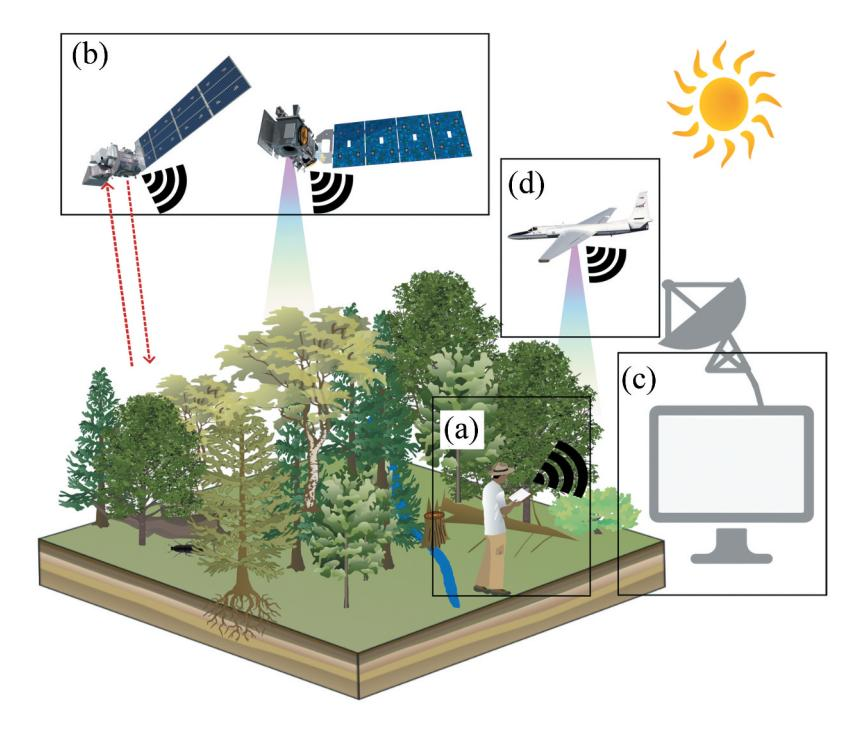

**Figure 1.** Illustration of the typical integration of in-situ (a) and remote-sensing data (b) into an areawide product (c), alongside our approach, which adds high-resolution optical data (d) as a top-of-canopy view before integrating in-situ data.

maintaining its confidentiality (Päivinen et al. 2023). Freudenberg, Schnell, and Magdon (2024) attempt to reconcile these two positions by creating a large database of 387,775 trees from 51 species using NFI plot data. Each sample includes species, an S2 time series, and an approximate location. To protect exact locations, time-series values were slightly randomized (0.95–1.05). Though promising, the data set's limited location accuracy prevents integration with other sources, and a significant time lag remains an issue.

In order to address these shortcomings, we have built upon the knowledge gained from previous nationwide tree species classifications, extended the machine learning (ML) approaches and combined them with a new multi-source top-of-canopy dominant tree species database. Figure 1 depicts the conventional approach to integrating in-situ observations and remote sensing signals into an area-wide product, which is commonly used in large-scale classification. Existing national tree species products rely on NFI data as a reference point, collected from a ground perspective (a). Satellite data (b), in combination with machine learning methods (c), enables the transfer of this information to broader areas. In our approach, we complement this framework by incorporating aerial imagery (d), which provides a top-of-canopy perspective. This viewpoint supports a more consistent integration between ground-based and satellite-derived information. By including this additional perspective, our dataset is well suited to fully exploit the potential of satellite sensors. As a result, we present the first Germany-wide

top-of-canopy optimized tree species mapping. The detailed objectives of this study are:

- (1) Generation of an extensive, spatial and taxonomic diverse top-of-canopy database of dominant tree species for Germany.
- (2) Preparation of an optimized dominant tree species classification model.
- (3) Comparison of Random Forest and XGBoost models, alongside various combinations of S2, S1, and a digital elevation model (DEM).
- (4) An in-depth model explanation using SHAP values and feature importance.
- (5) Presentation and evaluation of a Germany-wide remote sensing-based dominant tree species product.

#### 2. Materials and methods

# 2.1. Study area

At the outset of the millennium, almost one-third (31%) of Germany's total land area was covered by forest (Kändler, Schmidt, and Breidenbach 2004), and this proportion has persisted with approximately 32% as a result of the most recent NFI (Riedel et al. 2024). While the area of forest in Germany has remained relatively constant in recent decades, the distribution of species has changed substantially. Coniferous trees continue to be the most prevalent species, covering approximately 50% of the total forest area, although their proportion has declined since the third NFI in 2012. The share of deciduous trees in Germany's forest area is currently 47%, with an ongoing increase. The remaining 3% is comprised of clear-cuts and gaps (Riedel et al. 2024). A more detailed subdivision is possible via the genus. However, in the majority of cases, there is only one species per genus that predominates. This is the case for three of the four major tree species: pine (Pinus sylvestris) with 21.8%, spruce (Picea abies) with 20.9% and beech (Fagus sylvatica) with 16.6% area share. The genus oak, however, includes two species (Quercus petraea, Quercus robur) that occur more frequently and are grouped together as oaks and have an area share of 11.5%. These species constitute approximately 70% of the tree species found in Germany's forests. Other tree species are less frequently dominant, occupying areas between 4.8% and 1.9%. In descending order of prevalence, the remaining tree species/genus are birch (Betula pendula, Betula pubescens), maple (Acer campestre, Acer platanoides, Acer pseudoplatanus), larch (Larix decidua), alder (Alnus glutinosa), Douglas fir (Pseudosuga menziesii), fir (Abies alba) and ash (Fraxinus excelsior). The remaining tree species, not previously mentioned, collectively account for approximately 6% of the forest area (Riedel et al. 2024). Figure 2 illustrates the distribution of forest in Germany based on the Stocked Forest 2018 layer (Languer et al. 2022). In addition, the figure provides an example of the leaves, fruits or bark of the respective tree species/genus and shows the changes in the area share of each species between 2012 and 2022. Only those tree species utilized in the final product are depicted. This encompasses all the tree species mentioned above, with the exception of maple, which is typically mixed in and only rarely occurs as an obligate climax tree species (Kroiher and Schmitz 2015), and ash, which is the least common of the aforementioned tree species (Riedel et al. 2024).

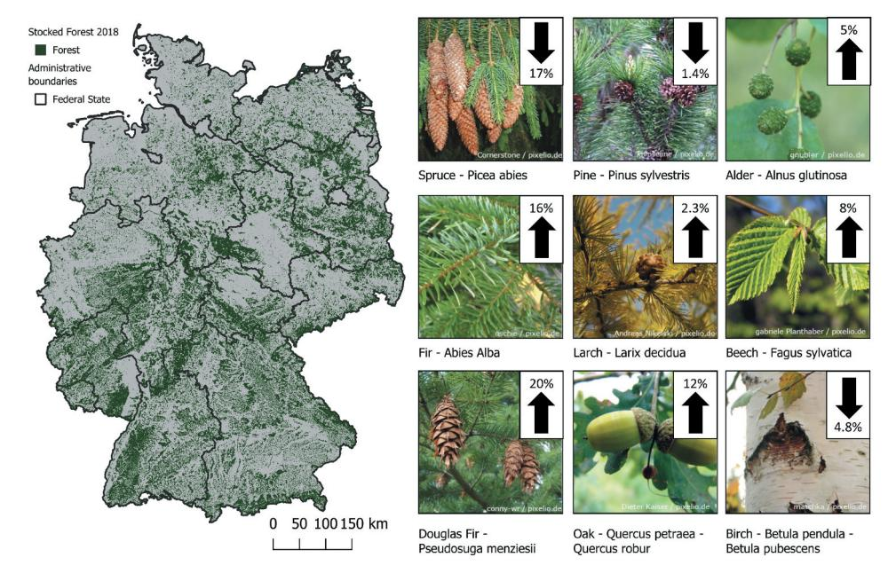

**Figure 2.** Map of the distribution of the German Forest Langner et al. (2022) and images of certain features of the nine tree species groups. The arrows in the right upper corner of each species image shows the in- or decrease of this species between 2012 (Polley et al. 2014) and 2022 (Riedel et al. 2024).

#### 2.2. Used datasets

## 2.2.1. In-situ data

The key to an accurate classification model of dominant tree species lies in an extensive tree species database that reflects the variety of the dominating tree species in the German forest. Given that our aim is to determine the dominant tree species or dominant genus, a substantial number of sources can be considered. Based on these sources, we have developed a multi-source approach that utilizes as many available sources as possible for a German-wide coverage. The sole prerequisite in the initial step was the clear assignment of a single crown-dominant tree species to the respective area. This is in accordance with the methodology employed in the majority of classification model training procedures (Axelsson et al. 2021; Bjerreskov, Nord-Larsen, and Fensholt 2021; Persson, Lindberg, and Reese 2018; Welle et al. 2022; Wessel, Brandmeier, and Tiede 2018).

The numerous individual sources can be grouped into five categories, as shown in Figure 3(a). The initial group of data sources comprises information obtained from available forest operation maps (limited free access). Additional georeferenced data was obtained from the tree cadastral maps of major urban areas (free access). Since also individual trees are mapped in this type of data set, only groups of trees of the same species were used. The same procedure was employed for a number of freely available databases pertaining to trees and forests. Such sources include, for example, individual special trees or groups of trees or entire areas (like UNESCO World Heritage, NATURA2000 and Federal Biotope Mapping). The advantage of this group of sources is that, in addition to the location, in some cases a photograph is also stored, which can be used for

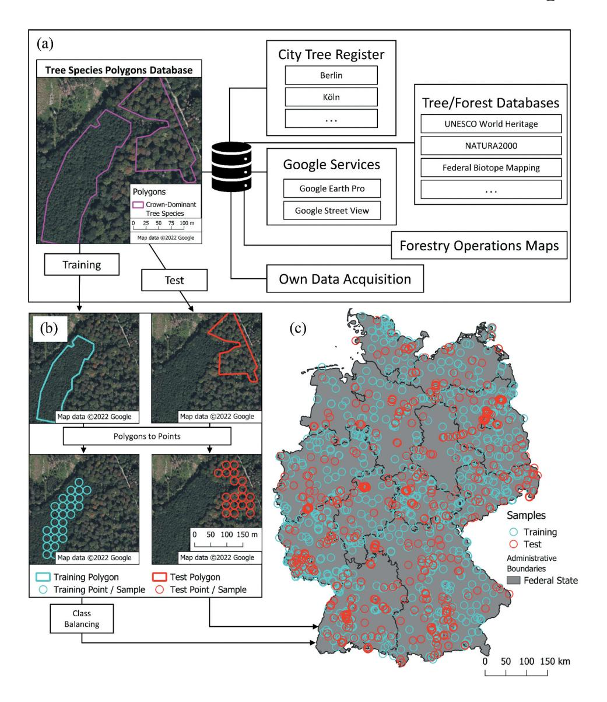

**Figure 3.** Data integration and sampling framework for tree species database for German Forests. The figure illustrates the workflow for data acquisition and processing to a final sampling database. On the top (a), diverse data sources feed into a tree species polygon database. The lower left panel (b) shows the split between training and test polygons and the polygons to points/samples process. The lower right panel (c) displays the spatial distribution of training and test samples across Germany.

verification. Another source of samples is Google Street View images, which are particularly useful in monocultures. These freely available georeferenced data can be employed to ascertain the tree species present in a multitude of locations. Another Google service allows the creation of georeferenced data regarding tree species: Google Earth Pro offers the valuable functionality of displaying a time series of historical aerial and satellite images, as well as user-generated images. A search query (for example 'oak forest' or

'beech forest') can be used to identify forests comprising a specific tree species, with images serving as a verification tool. Furthermore, the photographs can be utilized to verify other sources. Most recently, we conducted our own field data collection across Germany. The principal objective of this data generation was to address spatial and taxonomic deficiencies.

Each of these data sources was used to create polygons. The first step was to identify the tree species and its extent using the corresponding source. Aerial imagery was then used to draw the new boundaries of the polygon and ensure the homogeneity of the area. This top-of-canopy perspective is the basis for creating a database optimized for remote sensing data. Therefore, these polygons had to satisfy specific criteria. Firstly, a minimum diameter of 16 m was selected to ensure that a remote sensing pixel (10 m) would always be situated predominantly within the designated area. Additionally, the dominant tree species was corroborated through the examination of available photographic documentation. The extent of the territory that could be documented varied considerably according to the type of forest and tree species. In particular, large polygons result from monoculture plantations that are clearly identifiable in aerial photographs, predominantly with spruce or pine.

The tree species polygon database was randomly divided into two distinct subsets: 75% for training and 25% for testing. To facilitate the transition from polygons to individual sample points, the polygons were filled with point locations. As illustrated in Figure 3(b), this process was carried out in accordance with a pre-defined scheme. The points were positioned at a minimum distance of 8 m from the edge of the polygon and 15 m from the nearest sample point. In the case of polygons exceeding 10 ha in area, the distance was increased to 25 m to prevent the influence of a single, extensive polygon from being disproportionately amplified. The application of this method resulted in the collection of a total of 62 560 training and 20 257 test samples.

Balanced training data is needed to create a generally accurate model (Barandela et al. 2003; Batista, Prati, and Monard 2004). For a tree species model that is as valid as possible across Germany, this means that both the size of the classes and the spatial distribution must be balanced. In order to balance the dataset as accurately as possible, so-called growth areas were introduced. Germany can be divided into 82 growth areas, each of which is dominated by certain species (Gauer and Kroiher 2012). The introduction of growth areas ensured that each area was represented by a sufficient number of samples corresponding to the dominant tree species in that area. In addition, a limit of 1000 samples per species and growth area was introduced to avoid spatial overrepresentation. To circumvent under-representation of minority classes in the classification model, a maximum of 5000 samples per species was chosen. Therefore, pine, spruce and beech samples were randomly removed from the dataset to ensure over-sampling of the minority class and under-sampling of the majority class, which can improve the classifier performance (Chawla et al. 2002). The individual steps of class balancing thus resulted in a reduction of the database to 29 099 training samples. The spatial distribution of the balanced training and unprocessed test data is shown in Figure 3(c) and the distribution by species is shown in Table 1. The entire process of this method is time-consuming (approximately 1500 hours) and requires a high degree of accuracy in the interpretation of the data, but it can be repeated at any time.

**Table 1.** Taxonomic variety, Forest area shares, and sample sizes (number of data points) by tree species group: overview of total collected samples, modelling samples, and validation samples.

| Tree Species                                       | German Forest Area (Riedel | Number of all    | Number of balanced | Number of Test |
|----------------------------------------------------|----------------------------|------------------|--------------------|----------------|
| Group                                              | et al. 2024)               | Training Samples | Training Samples   | Samples        |
| Pine Pinus sylvestris                           | 2 396 433 ha               | 20 269           | 5 000              | 7 362          |
| Spruce Picea abies                              | 2 296 866 ha               | 6 756            | 5 000              | 2 215          |
| Douglas Fir Pseudosuga menziesii             | 260 653 ha                 | 3 105            | 2 915              | 702            |
| Larch <i>Larix decidua</i>                      | 314 251 ha                 | 1 561            | 1 561              | 665            |
| Fir Abies alba                                  | 211 325 ha                 | 831              | 831                | 395            |
| Beech Fagus sylvatica                           | 1 819 006 ha               | 21 179           | 5 000              | 6 145          |
| Oak Quercus petraea, Ouercus robur        | 1 265 470 ha               | 4 965            | 4 898              | 1 278          |
| Birch Betula pendula, Betula pubescens | 521 034 ha                 | 1 036            | 1 036              | 464            |
| Arl Alnus glutinosa                          | 280 710 ha                 | 1 042            | 1 042              | 384            |
| Other deciduous trees                              | 1 232 396 ha               | 1 816            | 1 816              | 557            |
| Total                                              | 10 828 144 ha              | 62 560           | 29 099             | 20 257         |

### 2.2.2. Remote Sensing data

The sun-synchronous satellites S2 pair (currently three satellites in orbit) are particularly well-suited for use in forest contexts, offering spatial resolutions of up to 10 metres and a broad spectral resolution (Drusch et al. 2012), which enables the detection of potential damage (N. Chen et al. 2021; Löw and Koukal 2020; Montzka et al. 2021; Olmo et al. 2021; Thonfeld et al. 2022), observation of vitality and biomass (Khan et al. 2020; Luo et al. 2021; Puliti et al. 2021), or classification of tree species (Grabska, Frantz, and Ostapowicz 2020; Hemmerling, Pflugmacher, and Hostert 2021; Immitzer, Vuolo, and Atzberger 2016; Kollert et al. 2021). While the S2 satellite is generally useful, studies have demonstrated that the informative value of the S2 bands differs with regard to distinguishing between different tree species. Kollert et al. (2021) demonstrated that shortwave infrared (SWIR) bands are the most effective at distinguishing between different tree species groups. Immitzer, Vuolo, and Atzberger (2016) corroborate the high value of the SWIR bands and identify the blue and the Red Edge bands as additional features of importance. Conversely, Grabska et al. (2019) highlight that the importance of features varies according to the class and observation time under consideration. Nevertheless, they concur that the differentiation is further enhanced when temporal data is employed. Changes in phenology permit the deduction of conclusions regarding the specific tree species.

In consideration of these findings, a series of S2 surface reflectance Germany-wide time series composites, incorporating seven bands and two indices, were constructed

spanning the period April 2021 to October 2023. Table 2 shows the bands, indices, wavelengths and equations. To ensure the exclusion of cloud coverage at the respective pixels, only scenes with a cloud coverage of less than 80% were utilized. Furthermore, pixels identified by the Sentinel-2 Level-2A processing algorithms as cloud, cloud shadow, snow, or ice were excluded (ESA, European Space Agency 2024), resulting in the Sentinel-2 Level-2A Collection 1 (C1) product. The extracted time series were interpolated, aggregated on a monthly basis, and limited to the period between March and October. Pretests indicated that selecting March, June, August, and October captures the key phenological characteristics of the tree species sufficiently. Tests with the three Red Edge bands indicated that Red Edge 2 contributes most to classification accuracy. Furthermore, combining all three Red Edge bands did not yield any additional improvement in performance. To maintain model simplicity, we therefore used only Red Edge 2 in the final workflow.

Similarly, S1 time series data were generated for the same months in 2022. We utilized the Sentinel-1 Analysis Ready Data (ARD) Normalized Radar Backscatter (NRB) product, which has been pre-processed to include terrain correction, denoising, projection, and geolocation, enabling seamless and immediate analysis for users (Albinet et al. 2022; Truckenbrodt et al. 2023). Table 2 presents the two S1 bands utilized in this study, along with their respective sources. By employing both the vertical and horizontal polarization, the Radar Vegetation Index (RVI) (Szigarski et al. 2018) was calculated. This index is highly sensitive to the crown volume of the trees (Meyer 2019), biomass and vegetation (Nasirzadehdizaji et al. 2019). Previous studies have demonstrated that SAR data has the capacity to enhance the accuracy of classification algorithms (Lechner et al. 2022), enable phenology monitoring (Rüetschi, Schaepman, and Small 2017; Tsokas et al. 2022) and is especially well-suited for the differentiation of coniferous tree species (Schulz et al. 2024) as well as the distinction between deciduous and coniferous forests (Dostálová et al. 2021). Based on over 3000 S2 and 6300 S1 scenes, Figure 4 illustrates the number of

Table 2. Spectral and Radar indices, bands, and products from Sentinel-2, Sentinel-1, and TanDEM-X sensors with corresponding wavelengths, equations, or sources.

| Sensor/Product                         | Band/Index                                                     | Wavelength/Equation/ Source                             |
|----------------------------------------|----------------------------------------------------------------|------------------------------------------------------------|
|                                        |                                                                |                                                            |
| Sentinel-2                             | Blue                                                           | 458–523 nm                                                 |
| Sentinel-2 L2A C1                      | Green                                                          | 543–578 nm                                                 |
|                                        | Red                                                            | 650–680 nm                                                 |
|                                        | Red Edge 2                                                     | 733–748 nm                                                 |
|                                        | Near-Infrared (NIR)                                            | 785–899 nm                                                 |
|                                        | Short-Wave Infrared 1 (SWIR1)                                  | 1565–1655 nm                                               |
|                                        | Short-Wave Infrared 2 (SWIR2)                                  | 2100-2280 nm                                               |
|                                        | Normalized Difference Vegetation Index (NDVI)                  | $NDVI = \frac{NIR - RED}{NIR + RED}$ Rouse et al.          |
|                                        |                                                                | (1974)                                                     |
|                                        | Normalized Difference Moisture Index (NDMI)                    | $NDMI = \frac{NIR - SWIR1}{NIR + SWIR1} $ Ji et al. (2011) |
| Sentinel-1 Sentinel-1 Normalized Radar | VV (vertical transmission and vertical reception) C-Band SAR   | 5.5 cm Truckenbrodt et al. (2023)                       |
| Backscatter                            | VH (vertical transmission and horizontal reception) C-Band SAR | 5.5 cm Truckenbrodt et al. (2023)                       |
|                                        | Radar Vegetation Index (RVI)                                   | $RVI = \frac{4*VH}{VV+VH}$ Szigarski et al. (2018)         |
| TanDEM-X Copernicus DEM GLO-30      | Digital Elevation Modell (DEM)                                 | ESA, European Space Agency (2019)                       |

informative pixels for S2 and S1. The grid-like distribution of informative pixels results from the orbits of the Sentinel satellite pairs per sensor and the resulting overlap of individual tiles. The weather independence of \$1 results in a more homogeneous spatial data availability compared to the often cloud-disturbed S2 observation. Consequently, reliable data can be obtained in a shorter period of observation time, which allows for the utilization of only 1 year of S1 data (2022), in contrast to 3 years of S2 data (2021–2023). The diverse characteristics of S1 and S2 are complemented by a digital elevation model. The Copernicus DEM GLO-30 (ESA, European Space Agency 2019) provides adequate elevation data for each sample and is included to assess whether environmental factors, such as elevation, influence the nationwide classification.

As an example, Figure 5 illustrates the distinct spectral signatures of the four dominant tree species in Germany over time (all relevant species are shown in the supplementary material Figure SM1). In the following, the time series were linear interpolated. The mean values and interquartile range (from 0.10 to 0.90) of the NDVI and SWIR1 time series for all training samples were spatially aggregated and are displayed in subplots. It is noteworthy that the maximum NDVI values during the peak vegetation period, between Day of Year (DOY) 150 and 200, for pine and spruce trees are substantially lower. The distinction between the two species is evident from the generally lower SWIR1. Compared to broadleaves, conifers, especially pine and spruce, have only slight changes in reflectance throughout the year. The spectral signatures of beech and oak are characterized by a greater degree of similarity. While the NDVI curve is almost identical, the SWIR1 signal of the oak exhibits a more pronounced decline from DOY 110, subsequently maintaining a relatively lower level.

The data utilized in this analysis represent the most recent level of processed product types Sentinel-2 L2A C1, Sentinel-1 NRB and Copernicus DEM GLO-30. All layers and bands were resampled to a resolution of 10 by 10 metres to ensure

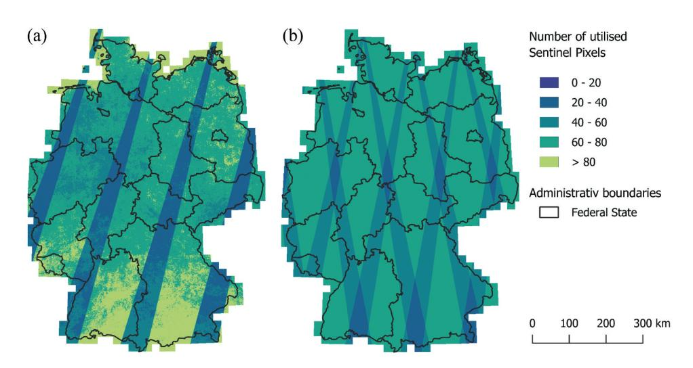

Figure 4. Germany map of utilized Sentinel pixels. Sentinel-2 between March 1st and October 31st from 2021 to 2023 (a). Sentinel-1 between March 1st and October 31st 2022 (b).

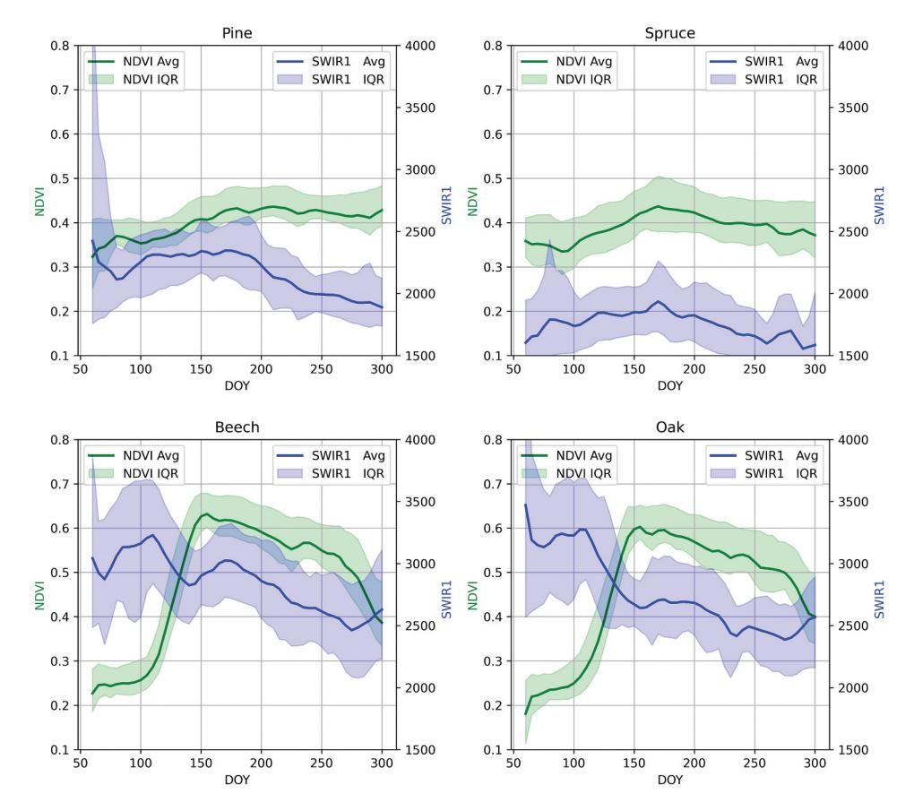

Figure 5. Average (avg) and interguartile range (IQR) (0.1–0.9) of spectral signatures of dominant coniferous (spruce, pine) and deciduous trees (beech, oak) at different Days of the Year (DOY).

consistent integration. The terrabyte platform developed by German Aerospace Center (DLR) and the Leibniz Supercomputing Center (LRZ) represents an optimal interface for the computationally demanding processing of satellite data (we used 40 cores with a total of 300GB of RAM). The geo python tools xarray (Hoyer and Hamman 2017) and dask (Rocklin 2015) were employed to extract a range of features for the designated training points, utilizing a variety of statistical techniques. These features can subsequently be incorporated into ML models. The combination of seven spectral S2 bands, two S1 bands, three indices and seven statistics (four monthly medians, median, variance and standard deviation) in conjunction with the elevation data resulted in 85 features. To prevent subsequent misclassifications due to outliers, only the interquartile range (0.05-0.95) of each feature was used.

# 2.2.3. Auxiliary data

Two masks were used to create the final product: first, the stocked forest mask for 2018 (Langner et al. 2022) as shown in Figure 2, and second, the canopy cover loss product for 2017–2023 (DLR, German Aerospace Center 2025). The use of this product excludes sites

affected by disturbance, as it is not possible to identify the specific tree species in areas with no canopy cover. In addition, information on tree species in seedlings replanted after disturbance is absent in the trainings data set.

#### 2.3. Method

The entire workflow is presented in Figure 6. The data, pre-processing steps, and the temporal and spectral metrics have been described in previous chapters. The following sections will provide a comprehensive account of the modelling process, model testing, and model explanation.

# 2.3.1. Classification and testina

Random Forest and XGBoost are among the established ML classification methods in remote sensing (Fassnacht et al. 2016; Shao, Nasar Ahmad, and Javed 2024; Sheykhmousa et al. 2020), and both belong to the ensemble algorithms (Belgiu and Drăgut 2016). However, they differ in their ensemble method. The Random Forest Classifier employs the bagging method. In this approach, a substantial number of decision trees are developed by applying a randomized iterative split to the training samples and variables and leaving a share of samples (bag fraction) out to avoid overfitting. Predictions are then aggregated through the use of majority voting (Breiman 2001). Moreover, independent training makes the Random Forest Classifier less prone to overfitting and more efficient, particularly when parallelization options are employed (Biau 2012). XGBoost is similarly regarded as a highly effective gradient boosting algorithm. In contrast to the Random Forest, the XGBoost algorithm is trained iteratively, whereby the errors of the previous trees are corrected for each new tree (T. Chen and Guestrin 2016). Gradient boosting entails minimizing the gradient of the error, which can lead to overfitting if hyperparameter selection is not conducted with sufficient care (Bengio 2000; He et al. 2019).

Both algorithms are well-suited to exploring complex relationships (Breiman 2001) in remote sensing data due to their capacity to make robust predictions using weak predictors (T. Chen and Guestrin 2016). The efficacy of these algorithms in the classification of tree species has been established for a considerable period of time (Fassnacht et al. 2016). They have also been used in the development of the most recent nationwide tree species products in Germany, including the Random Forest model by Blickensdörfer et al. (2024) and the XGBoost model by Welle et al. (2022). However, a comparison between those ML algorithms at the national level has yet to be conducted. In the case of Brandenburg, Hemmerling, Pflugmacher, and Hostert (2021) employed the Random Forest classifier to categorize 17 tree species. The resulting accuracies ranged from 66.8% to 98.9%, with the nine main tree species, each accounting for more than 0.5% of the total area, exhibiting the highest levels of precision. Conversely, misclassifications were more prevalent among tree species with smaller area shares.

The objective of this study is to perform a comparative analysis of two algorithms and two distinct sensor types, in combination with a DEM, for large-scale dominant tree species classification. To facilitate the comparison, the models were configurated in a consistent manner across all ten model setups:

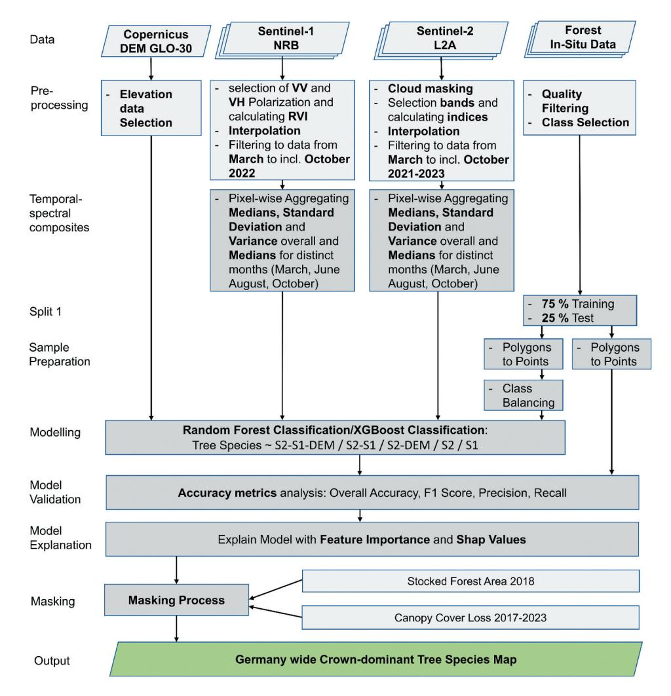

Figure 6. Schematic representation of the workflow.

- XGBoost/Random Forest:
- (a) S1
- (b) S2
- (c) S2-DEM
- (d) S2-S1
- (e) S2-S1-DEM

The models were constructed using the default parameters of the python package Scikit-Learn (Pedregosa et al. 2011) and XGBoost (T. Chen and Guestrin 2016), then exported and applied to the continuous S1, S2, and DEM composites covering Germany. Finally, the testing was performed in a separate step. For this, the most common model evaluation metrics overall accuracy (OA), precision, recall, and F1-score (Zhong et al. 2024) were used to compare

the different ML algorithms and remote sensing data combinations. The selection of the most optimal model was determined by the F1-Score, which is a metric that quantifies the accuracy of the model as a whole, irrespective of the class size (Sokolova and Lapalme 2009). The test samples give an information on whether the respective classification is correct at the point of interest. A confusion matrix was calculated for the model with the highest accuracies to gain a better understanding of which classes are predicted more accurately in which setup.

## 2.3.2. Model interpretation

A number of recent studies on forest science and remote sensing have underscored the importance of developing a more comprehensive understanding of ML and Deep Learning models (Fassnacht et al. 2024; Höhl et al. 2024). It is common for ML models to be employed without a thorough clarification of the internal mechanisms that underpin them, which hinders their interpretability. To address this issue, the concept of explainable artificial intelligence (XAI) has emerged in recent years (Ganatra et al. 2024), offering a range of methods that also support the understanding of ML and Deep Learning models. The utilization of distinct methodologies facilitates an investigation into the composition of features within a given model, thereby explaining the primary classification mechanisms of diverse ML models (Tuia et al. 2024). One approach is the implementation of SHAPley additive explanation (SHAP) values. The concept underlying SHAP values is derived from the principles of game theory, wherein the contribution of each feature to the final prediction is fairly distributed. The calculation is based on a weighted average of the results obtained from all possible feature combinations. By assigning each feature an importance value for a particular prediction, SHAP values are able to explain why a model predicts a certain class or not (Lundberg and Lee 2017). Thus far, these values have been predominantly employed in the explanation of medical and economic predictions (Ganatra et al. 2024; Y. Liu et al. 2022; Shirota, Kuno, and Yoshiura 2022), although they are beginning to gain prominence in remote sensing (Descals et al. 2023; Kawauchi and Fuse 2022; Temenos et al. 2023). Consequently, we have utilized the SHAP values to identify the extent to which each feature contributes to the model's prediction of a specific dominant tree species class, both positively and negatively. In the final stage of product generation, masking is applied using the Stocked Forest 2018 and Canopy Cover Loss products to exclude areas affected by disturbances. In such locations, tree species cannot be reliably identified due to the absence of canopy cover, and no recovery areas were included in the training data following disturbance events.

### 3. Results

#### 3.1. Model Assessment

Table 3 provides an overview of the results (overall accuracy, precision, recall, and F1-Score) of the various model combinations, while Table 4 presents the detailed metrics for all 10 classes. The classifications based exclusively on S1 data yielded the lowest model F1-Scores of 0.41. All other classifications produce almost similarly good classification results (F1-Scores between 0.8 and 0.89). XGBoost Classifier shows consistently better results than Random Forest (4-6% higher F1-Scores). This is also the case with regard to all accuracy metrics and the F1-Score range for the 10 classes. The best classification is the

**Table 3.** Comparison of the accuracy metrics derived from the 10 different models.

| Model         | Overall Accuracy | Precision | Recall | F1-Score | F1-Score Range |
|---------------|------------------|-----------|--------|----------|----------------|
| S1 RF         | 0.66             | 0.44      | 0.44   | 0.41     | 0.05-0.90      |
| S1 XGB        | 0.64             | 0.43      | 0.44   | 0.41     | 0.13-0.89      |
| S2 RF         | 0.89             | 0.81      | 0.8    | 0.8      | 0.63-0.96      |
| S2 XGB        | 0.92             | 0.86      | 0.86   | 0.86     | 0.68-0.97      |
| S2-S1 RF      | 0.9              | 0.83      | 0.82   | 0.82     | 0.66-0.97      |
| S2-S1 XGB     | 0.86             | 0.87      | 0.86   | 0.86     | 0.73-0.94      |
| S2-DEM RF     | 0.9              | 0.83      | 0.83   | 0.82     | 0.68-0.96      |
| S2-DEM XGB    | 0.93             | 0.88      | 0.89   | 0.88     | 0.76-0.97      |
| S2-S1-DEM RF  | 0.91             | 0.85      | 0.84   | 0.84     | 0.69-0.97      |
| S2-S1-DEM XGB | 0.94             | 0.89      | 0.9    | 0.89     | 0.76-0.98      |

XGBoost classifier in combination with S2, S1 and DEM. Here the OA reaches 0.94 and the average values of Precision with 0.89, Recall with 0.90 and F1-Score with 0.89 are also the highest of all different model setups. It is also noteworthy that the exclusion of S1 composites and DEM data does not result in a notable decline in the quality of the results. Indeed, the XGBoost classification, conducted with exclusively S2 data, yielded an F1-Score of 0.86, a mere 3% inferior to the model with the highest accuracy.

Table 4 provides a detailed comparison between the XGBoost model setups using S2 and S2-S1-DEM at the individual class level. The results indicate that conifer species achieve higher F1-Scores compared to deciduous trees. For conifers, the F1-Scores consistently exceed 0.88 with S2 and with S2-S1-DEM, with pine achieving values above 0.96 and 0.98, respectively. In contrast, the performance for deciduous tree species is less accurate. Beech achieves relatively high F1-Scores, with the best model scoring above 0.94 or 0.95. However, other deciduous species, such as oak, birch, and alder, have F1-Scores ranging between 0.68 and 0.84 for S2, and 0.76 and 0.9 for S2-S1-DEM. For classes such as fir, birch, alder, and other deciduous trees, precision values are consistently higher than recall, indicating a lower false positive rate but a higher false negative rate. This trend is in clear contrast to oak, where the recall values are comparatively higher. Overall, the analysis shows that the classification accuracy depends more on the tree species being classified than on the specific model setup. Beech trees are classified with greater accuracy than oak trees, regardless of the ML method or data combination used. The accuracy metrics for the other model setups are provided in the supplementary material (Table A1).

**Table 4.** Comprehensive presentation of the accuracy metrics precision, recall, and F1-Score for the XGBoost S2 and XGBoost S2-S1-DEM models.

| Model Metric | XGBoost S2 |        | XGBoost S2-S1-DEM |           |        |          |
|-----------------|------------|--------|-------------------|-----------|--------|----------|
|                 | Precision  | Recall | F1-Score          | Precision | Recall | F1-Score |
| Pine            | 0.96       | 0.95   | 0.96              | 1         | 0.96   | 0.98     |
| Spruce          | 0.87       | 0.95   | 0.91              | 0.93      | 0.96   | 0.94     |
| Douglas Fir     | 0.89       | 0.93   | 0.91              | 0.87      | 0.96   | 0.91     |
| Larch           | 0.91       | 0.91   | 0.91              | 0.94      | 0.97   | 0.96     |
| Fir             | 0.96       | 0.81   | 0.88              | 0.93      | 0.84   | 0.88     |
| Beech           | 0.96       | 0.92   | 0.94              | 0.96      | 0.94   | 0.95     |
| Oak             | 0.65       | 0.88   | 0.75              | 0.67      | 0.88   | 0.76     |
| Birch           | 0.85       | 0.84   | 0.84              | 0.91      | 0.89   | 0.9      |
| Alder           | 0.84       | 0.82   | 0.83              | 0.92      | 0.86   | 0.89     |
| Other           | 0.72       | 0.65   | 0.68              | 0.79      | 0.73   | 0.76     |

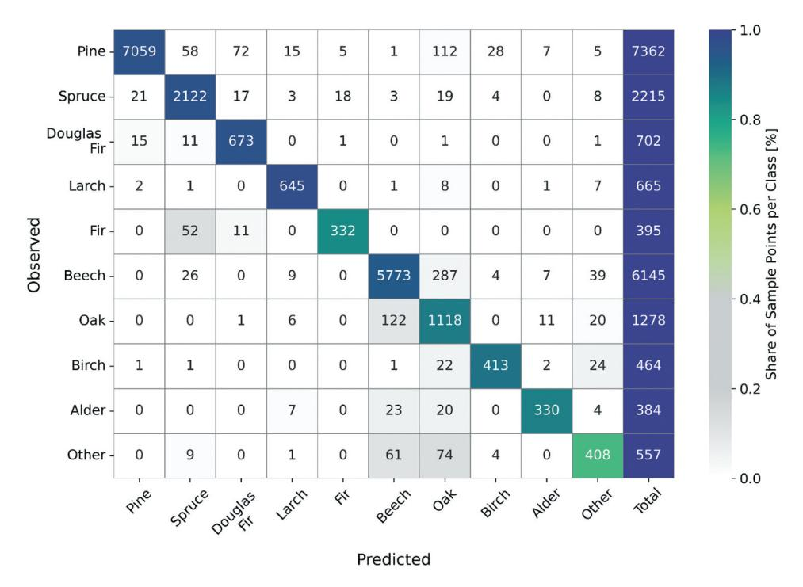

**Figure 7.** Confusion matrix of the classes of the model with the highest accuracies (XGBoost S2-S1-DEM) with predicted and observed samples. The last column shows the total of possible right predicted observed samples.

The confusion matrix (Figure 7) is a useful tool for demonstrating the respective correct and incorrect classification of the classes. In the case of pine and spruce, a negligible proportion of the sampling points are classified incorrectly. A similar situation is observed in the misclassification of Douglas fir and larch, with fir being erroneously identified as spruce in some instances. Among the deciduous tree species, misclassification is particularly prevalent between the classes beech and oak. The class comprising the other deciduous trees exhibits the lowest number of accurate classifications. These samples were frequently misclassified as beech or oak.

### 3.2. Model explanation

Figure 8 illustrates the relative importance of each feature to the overall performance of the respective model. As the accuracy of the model with all input data is essentially comparable to that of the model with only S2 data. It is notable that the 20 most important features are identical in both models on 17 occasions. In both models, the RE2 and SWIR1 median values are the most important features overall. The inclusion of S1–based features results in the RVI median ranking third and the VH median ranking eleventh in terms of importance. While the DEM is among the top 20 features, its relative importance is noticeably lower compared to other features. In both model setups, features derived directly or indirectly (e.g. NDMI) from SWIR and RE2 are predominant. In the XGBoost S2-S1-DEM model, nine of the top 20 features are associated with SWIR or

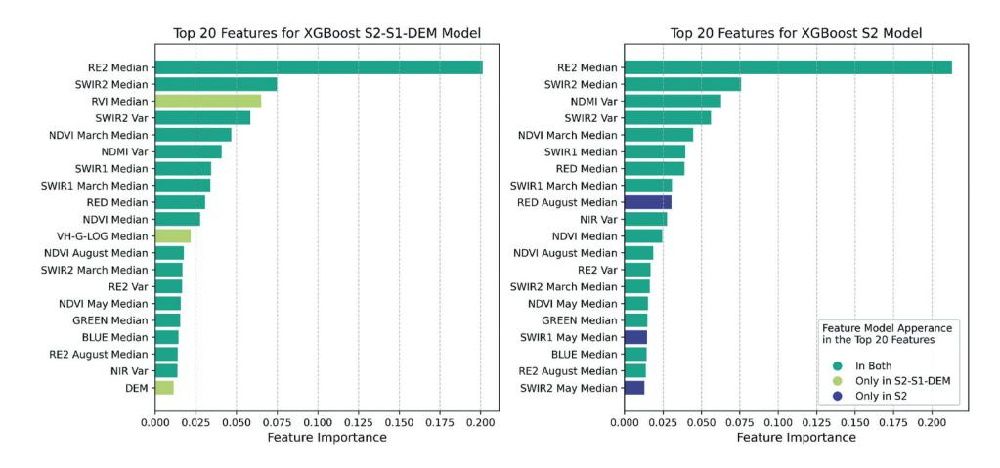

**Figure 8.** Feature importance of the 20 most important features of the XGBoost S2-S1-DEM model and the XGBoost S2 model.

RE2; in the XGBoost S2 model, this number increases to 11. Among the statistical aggregations, the median consistently shows the highest relevance. Features capturing seasonal variation account for about half of the top 20 features, with a stronger presence in the S2-only model. Additionally, features related to the month of March show increased importance in both models.

While the feature importance can only be used to explain the global significance of the individual features, the SHAP values enable the quantification of the respective contribution of the feature to the identification of the corresponding class. This yields a class-specific feature importance. Figure 9 illustrates the SHAP Summary Plots for the four most common tree species in Germany. The SHAP Summary Plots for all tree species are provided in the supplementary material (Figure SM2). The ordering of the features on the left-hand side of each subplot is in descending order of importance. Consequently, the first feature is the most important for the classification of the respective class. The values displayed along the x-axis illustrate the distribution of SHAP values. A positive value indicates that the feature in question contributes to a positive classification of the class. Should the SHAP values be negative, this characteristic functions as an exclusion criterion for the class. This also results in enhanced classification. The colour scale enables the assignment of feature values. For instance, if red (higher) feature values are on the positive side of the x-axis, this signifies that higher feature values contribute to the model by enabling the identification of the corresponding dominant tree species class.

A comparison between deciduous and coniferous tree species shows that most of the important SHAP values for coniferous species are negative. This suggests that these classes are primarily identified through exclusion. SWIR features are effective for distinguishing coniferous species, as illustrated by the spectral signatures of spruce and pine in Figure 5. Figure 9 underlines the relevance of Sentinel-1 data for classifying pine; here, the RVI median ranks as the fourth most important feature. Higher RVI values are associated with an increased likelihood of a sample being classified as pine. Conversely, the DEM shows an inverse pattern, with pine more likely to occur at lower elevations. The interpretability of SHAP values is particularly useful in distinguishing tree species that are more

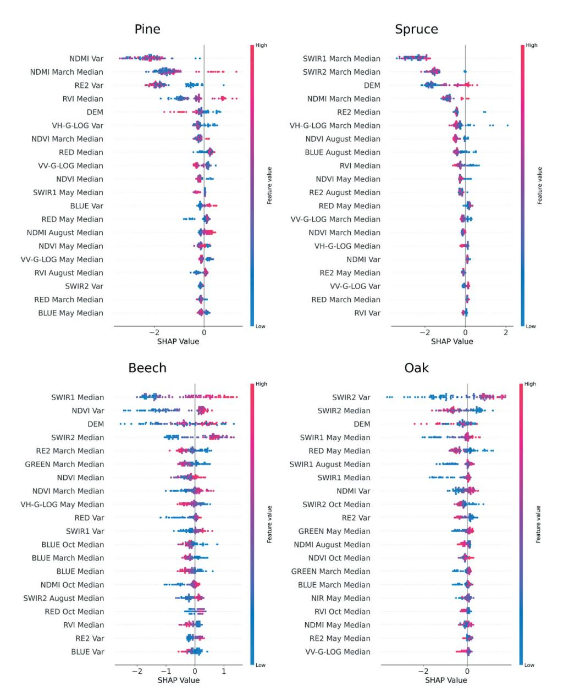

Figure 9. Summary SHAP value plots based on the best model (XGBoost S2-S1-DEM) for the four most common tree species in Germany.

similar, such as beech and oak. In these cases, SWIR features are especially relevant. A clear relationship exists between feature values and SHAP values: higher feature values generally increase the probability of classification as the respective species. The SWIR2 Variance feature is important for distinguishing oak, where higher variance values are linked to an increased likelihood of classification as oak. The SWIR2 Median feature further contributes to the separation of deciduous species. For beech, higher median values in

the SWIR2 range increase the likelihood of classification, whereas for oak, lower SWIR2 median values are associated with a higher probability of classification.

# 3.3. Dominant tree species map Assessment

The model that demonstrated the best results in the model evaluation was selected for incorporation into the final product. The remote sensing data is centred on the year 2022 (S2: 2021–2023, S1: 2022), so the final product depicts the distribution of dominant tree species for German forests during that year. The data set comprises five coniferous tree species (pine, spruce, larch, Douglas fir, and fir), five deciduous tree species classes (beech, oak, birch, alder, and other deciduous trees) and the Canopy Cover Loss class. Figure 10 presents both a comprehensive overview of tree species distribution throughout the study area and detailed examples of different forest regions.

As illustrated in Figure 11, the spatial distribution of tree species across counties exhibits comparable patterns. In a number of counties, pine and spruce combined represent more than three-quarters of the forest cover. Spruce is particularly prevalent in the Bavarian counties, whereas the pine is most common in the north-eastern states. With regard to deciduous trees, only beech exceeds two-thirds of the forest cover in a few counties, particularly in central Germany. Subsequently, oak trees constitute over half of the forest cover in a number of counties. Larches, which are naturally found as a dominant tree species primarily in the Alps, also comprise a substantial proportion of certain stands in Bavaria, Baden-Württemburg, Saxony, and Hesse, where they represent over 10% of the total forest area in some counties. The presence of firs is most concentrated, with proportions exceeding one-third observed only in the eastern foothills of the Black Forest. The prevalence of birch and alder is more pronounced in northern Germany. The distribution of birch is particularly extensive in counties bordering the North Sea, whereas alder is concentrated along the Baltic and North Sea.

#### 4. Discussion

### 4.1. Multi-source tree species database

The establishment of a nationwide tree species model is associated with a number of challenges. One of the primary challenges is the compilation of a comprehensive database of tree species. The product is based on a substantial number of sources that have been subjected to rigorous analysis prior to their incorporation into the database. Nevertheless, it is not possible to eliminate the possibility of some degree of spatial and taxonomic uncertainty in the reference data. As is the case with numerous other studies, this model employs a system of points that represent homogeneous forest areas. By creating sample points from large homogeneous polygons, our samples contain a wide range of potential atypical signals, including soils and other under-represented tree species. The model is therefore already capable of modelling the dominant tree species across a range of forest characteristics. However, the lack of reference data in a heterogeneous forest, where several tree species are equally represented or no dominant tree species can be identified, remains.

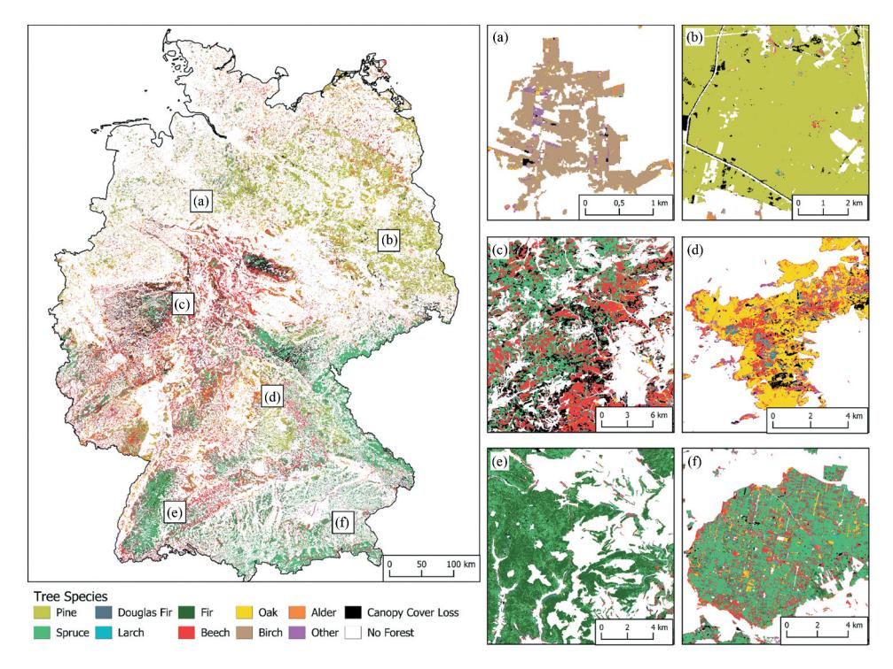

**Figure 10.** Tree species map of Germany with representative forest across Germany. Young birch forest in north-western Germany (a). Uniform pine monoculture in Brandenburg (b). Bark beetle – affected Hochsauerland region; beech forests remain largely intact (c). Oak-dominated forest in northwestern Bavaria with central beech stands (d). Fir forests in the eastern black Forest foothills (e). Grid-structured spruce stands in Ebersberg Forest, interspersed with beech (f).

All previous remote sensing-based Germany-wide tree species products are based on data from the NFI. Access to these data depends on the authors' institutional affiliation and may be subject to data-sharing agreements. Our multi-source approach shows that tree species information can also be derived through alternative methods, and additionally with a top-of-canopy focus. This enables a classification with similarly good, in some cases better results, while simultaneously offering full temporal and bureaucratic flexibility. At the same time, NFI plot locations remain protected, as disclosing them could influence local forest management decisions, thereby compromising the randomness and representativeness of the sample plots (Breidenbach et al. 2021; Gessler et al. 2024). However, it should be emphasized that the NFI data is still regarded as the most comprehensive and independent inventory data on German forests since our database is limited to dominant tree species. In particular, in the light of the growing possibilities of remote sensing, both in terms of hardware and methods (Artificial Intelligence), detailed in-situ data is becoming increasingly crucial.

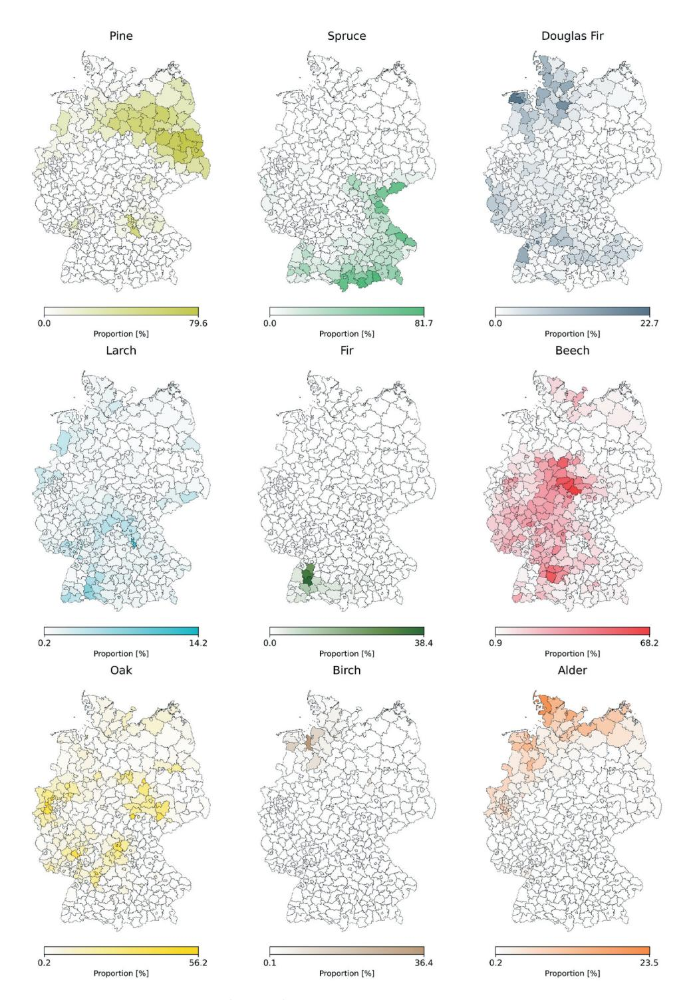

Figure 11. Spatial distribution of the different tree species groups across the counties.

# 4.2. Model and product Assessment

The optimal model attains F1-Scores within the range of 0.98 for pine and 0.76 for other deciduous trees. Consequently, the product in question demonstrates slightly superior accuracies in comparison to the two other German-wide products, which are based on the third NFI from 2012. In a comparable study conducted by Blickensdörfer et al. (2024), analogous validation outcomes were attained for the same number of dominant tree species in homogeneous test areas. Similarly, the classes spruce, pine and beech exhibited the high F1-Scores, exceeding 0.95. However, the comparison revealed discrepancies in the F1-Scores, with higher accuracies being achieved in all remaining dominant tree classes for our own product. A comparison with the not freely available product from Welle et al. (2022) for dominant species mapping in Germany reveals a similar outcome. In this instance, solely homogeneous samples of the NFI were employed for the purpose of distinguishing between seven distinct tree groups. The regional models achieved F1-Scores of 0.60 to 0.96 for spruce, with pine, spruce and beech also classified with the greatest accuracy. Comparable accuracy patterns were observed in a country-wide study in Poland, where Sentinel-2 time series achieved over 80% accuracy for 16 dominant tree species, with considerable species-specific variations (Grabska-Szwagrzyk et al. 2024).

In contrast to the methodology proposed by Welle et al. (2022), whereby the product was assembled by a multitude of local-level models, our approach is based on one national-wide model. It should be noted that the accuracy metrics presented do not represent a range; rather, they represent the total value of the validation data distributed across the entire national territory. The model is therefore more generalized while still achieving high levels of accuracy. This approach has the advantage of facilitating simpler implementation and delivering superior efficiency. Furthermore, in comparison to the more regional assembled nationwide tree species classifications, there are no artificial artefacts present in our final product. Moreover, a single Germany-wide model allows for a more straightforward explanation and interpretation of the model at the expense of assessing regional differences in model accuracy. In a manner analogous to that observed by Kollert et al. (2021), features based on SWIR have been identified as being of particular relevance in the model. A more comprehensive examination at the class level, for example, indicated that features based on median and SWIR are important for differentiation between oak and beech in our model. Moreover, the significance of the temporal data was validated through the examination of SHAP values. The high importance of SWIR is in accordance with the findings of previous studies (Blickensdörfer et al. 2024; Hemmerling, Pflugmacher, and Hostert 2021; Schulz et al. 2024). One reason for the importance of SWIR in classification is that the difference in reflectance and transmittance between coniferous and deciduous species is greatest at this wavelength (Hovi, Raitio, and Rautiainen 2017; Rautiainen et al. 2018). The Red Edge bands of S2 have consistently been reported as highly important for tree species classification (Grabska et al. 2019; Immitzer, Vuolo, and Atzberger 2016). This aligns with our findings, as we identified the median of the Red Edge 2 band as the most important feature.

Our novel comparison of different Germany-wide model setups has demonstrated that the incorporation of environmental data, such as the elevation model, does not notably enhance the accuracy of the models. The reason for this discrepancy is likely to be that the model represents a country with a predominantly managed forestry sector. It was common practice

to plant tree species outside their natural range, without consideration of the specific requirements of the respective species with regard to factors such as exposure, soil or elevation (Milnik 2007). Even in the case of smaller study areas, as demonstrated by Hemmerling, Pflugmacher, and Hostert (2021) the inclusion of elevation data did not result in improvement to the model. It was also found that SAR data obtained from S1 does not constitute a meaningful data basis for large-scale tree species products. The combination of S1 and S2 did not result in strong improvement, which is consistent with the findings of Bjerreskov, Nord-Larsen, and Fensholt (2021). They trained a random forest classifier with the Danish NFI data and achieved producers' accuracies for tree species groups of 34–74%. The hypothesis proposed by Schulz et al. (2024) that SAR vegetation indices, such as the RVI, lead to an improvement in classification, particularly in the differentiation of coniferous tree species, can be confirmed on the basis of the available data, albeit to a limited extent. In contrast to our study, this investigation identified a considerably greater number of distinct classes within temperate forests across Europe. It was also shown that XGBoost is a more effective approach than the Random Forest Classifier.

# 4.3. Outlook on improved tree species products

The primary challenge encountered with all remote sensing-based tree species products is the accurate recording of the full variety of the forest in the reference data. The issues resulting from varying forest densities, diverse species combinations and age discrepancies can only be addressed through a meticulously planned sample distribution and a substantial quantity of in-situ data. The current modelling does not incorporate saplings or seedlings as reference data. The presence of ground vegetation in areas with saplings results in signal mixing, which poses a considerable challenge in accurately assigning species. Furthermore, a disparity exists in the spectral characteristics exhibited by younger and older specimens of a particular species (Lang et al. 2015; Rautiainen et al. 2018).

Future improvements in result accuracy can be expected through the use of higher spatial resolution data, particularly since key features are derived from Red Edge and SWIR bands with a native resolution of 20 m. Higher accuracies with higher resolutions are underscored by Ahlswede et al. (2023), who demonstrated that ResNet models achieved weighted precision scores of up to 79% using 0.2 m RGB aerial imagery, compared to 74% with Sentinel-2 data alone, highlighting the crucial role of spatial resolution in tree species classification. In addition, further gains in classification performance may be achievable by incorporating a broader set of vegetation indices. However, care must be taken to avoid redundancy due to high correlation among indices derived from the same spectral bands. In such cases, dimensionality reduction techniques such as Principal Component Analysis (PCA) may help retain only the most informative features. While our current approach focused on a small set of indices (NDVI and NDMI) to ensure robustness and scalability, the exploration of extended index sets could be valuable in more heterogeneous or complex landscapes. Another challenge is the modelling of forests where multiple species are present within a single remotely sensed pixel. This issue has not been extensively investigated. Mixed pixel effects can occur not only at the boundaries between deciduous and coniferous forests but also in mixed stands, which can lead to misclassification. For example, pixels containing spruce and beech may be misclassified as larch because they have similar spectral reflectance characteristics throughout the year. Spectral unmixing offers a new technique that can distinguish sub-pixel components (Clasen et al. 2015; Mandl et al. 2024; Ruiz et al. 2020). While spectral unmixing can increase the number of classes, our intensive testing of different model setups allows future studies to increase the scale of the area without wasting resources. We have found that the use of S2 and XGBoost provides an ideal basis for further large-scale classification models, for example on a European scale. This can save resources and reduce the environmental impact of heavy computing.

Overall, temperate forests face increasing pressure, challenging the vitality of many tree species. Climate change and its effects, such as droughts, late frosts, high winds, and heavy rainfall, are causing substantial disturbances (Allen et al. 2010; Schuldt et al. 2020; Senf and Seidl 2020; Thonfeld et al. 2022). The 2018 drought severely impacted German forests, particularly monocultures like those in the Harz, which have since suffered large-scale bark beetle outbreaks (Putzenlechner et al. 2023). Due to their low structural diversity and biodiversity, such forests are especially prone to extensive damage (Jactel et al. 2017; O'Hara 2016) and may have reduced capacity to recover from disturbance (Mitchell et al. 2023). In contrast, high biodiversity can slow pest spread, as many disturbance agents are tree-species specific. Combining high-resolution tree species maps with forest structure and management data helps monitor and predict disturbance risks, enabling targeted mitigation in vulnerable stands.

# 5. Conclusion

The study presents the creation of a new Germany-wide dominant tree species product, comprising five distinct conifer tree species, four distinct deciduous species and one other deciduous tree species class. A key component was the development of a new canopy optimized database that can be updated at any time. By drawing on a range of sources and conducting our own surveys, we were able to compile a dataset of over 80 000 sample points. This reference data was used to produce a map of dominant tree species in Germany for the year 2022, processing over 9000 scenes from S1 and S2 satellites and a DEM. A comprehensive comparison of different ML models and the combination of input data on a national scale in the context of dominant tree species classifications was lacking. Therefore, a total of 10 model setups were tested, combining XGBoost and Random Forest with S2, S1, and DEM data. It was demonstrated that the combination of S2, S1, and DEM with the XGBoost classifier yielded the most accurate results with an F1-Score of 0.89. This classification model yields high F1-Scores between 0.88 and 0.98 for all coniferous trees, beech, birch as well as alder and the results are also highly satisfactory for oak and other deciduous trees (F1-Score: 0.76). The final product showed that spruce dominates forests in Bavarian counties, while pine is most common in the north-eastern states. Among deciduous trees, beech covers over two-thirds of the forest in some central German counties, and oak exceeds half in others. Larches, originally native to the Alps, make up over 10% of forest areas in parts of Bavaria, Baden-Württemberg, Saxony, and Hesse. Fir trees are concentrated in the eastern Black Forest foothills, where they exceed one-third of the forest cover. In northern Germany, birch is widespread near the North Sea, while alder thrives along both the Baltic and North Seas. XGBoost slightly outperforms Random Forest in every data combination. However, the choice of input data is of much greater importance. The inclusion of S1 and a DEM results in a small increase in F1-Score of 0.03 points. The most substantial influence on the results is the extensive use of the spectral and temporal potential of the multispectral data of S2. The analysis of the SHAP values and the feature importance has shown that in this globally trained model, the features based on the Red Edge 2 and SWIR bands have the greatest influence on the classification. However, it can be demonstrated that the influence of each feature on the respective classes varies considerably. The limitations of this product lie in the difficulty of representing the full variety of dominant tree species in the German forest in the reference data. The combination of this problem with the 10-metre resolution of the remote sensing data leads to difficulties in the classification of so-called mixed pixels. The presence of different soil reflectance signals, age classes or multiple tree species within a single pixel can lead to misclassification of pixels. To overcome these limitations, single tree detection with more spatially resolved remote sensing data and a more varied reference data set reflecting the full spectrum of the German forest is needed in the future. Nevertheless, we were able to demonstrate that a Germany-wide classification of 10 tree species classes is feasible with a top-of-canopy optimized multi-source approach, thereby developing an approach that offers full temporal and administrative flexibility. By employing detailed maps of dominant tree species, such as the one presented here, forest managers in Germany can enhance their capacity to respond effectively to the growing threats posed by climate change.

# **Acknowledgements**

The authors gratefully acknowledge the computational and data resources provided through the joint high-performance data analytics (HPDA) project "terrabyte" of the German Aerospace Center (DLR) and the Leibniz Supercomputing Center (LRZ). We would also like to thank the following people for their help in creating the multisource tree species database: Kjirsten Coleman, Niklas Heiß, Stefanie Holzwarth, Patrick Kacic, Manuela Klausz, Claudia Kuenzer, Clarissa Kusch, Jelte Schrader, Stephan Schmitzer, Andrea Schmitzer, Samip Shrestha, Marco Wegler.

#### Disclosure statement

No potential conflict of interest was reported by the author(s).

# **Funding**

This study has been supported by the ForstEO project [FKZ 2220WK81A4], funded by the Federal Ministry of Food and Agriculture and the Federal Ministry for the Environment, Nature Conservation, Nuclear Safety, and Consumer Protection based on a decision of the German Bundestag from Waldklimafonds through the Fachagentur Nachwachsende Rohstoffe e.V. (FNR).

#### ORCID

Marco Wegler (h) http://orcid.org/0009-0003-5434-5813 Patrick Kacic (D) http://orcid.org/0000-0002-4538-8286 Frank Thonfeld (http://orcid.org/0000-0002-3371-7206 Stefanie Holzwarth http://orcid.org/0000-0001-7364-7006 Niklas Jaggy (D) http://orcid.org/0009-0006-6401-2926 Ursula Gessner (i) http://orcid.org/0000-0002-8221-2554 Claudia Kuenzer (h) http://orcid.org/0009-0007-4933-5898

#### **Author contribution**

Marco Wegler: Conceptualization, Methodology, Software, Data curation Validation, Visualization, Investigation, Writing- Original draft preparation. Patrick Kacic: Conceptualization, Writing-Reviewing and Editing. Frank Thonfeld: Conceptualization, Writing- Reviewing and Editing. Stefanie Holzwarth: Conceptualization, Writing- Reviewing and Editing. Niklas Jaggy: Software. Ursula Gessner: Supervision. Claudia Kuenzer: Conceptualization, Supervision, Writing- Reviewing and Editing, Funding acquisition.

# Data availability

The remote sensing data is available on the terrabyte STAC API: Sentinel-1 Normalized Radar Backscatter (https://stac.terrabyte.lrz.de/browser/collections/sentinel-1-nrb), Sentinel-2 Collection 1 Level-2A (https://stac.terrabyte.lrz.de/browser/collections/sentinel-2-c1-l2a) and Copernicus DEM GLO-30 (https://stac.terrabyte.lrz.de/browser/collections/cop-dem-glo-30). The 2022 tree species product for Germany, derived from Sentinel-2, Sentinel-1, and DEM data, is available at https:// doi.org/10.15489/smh8w3j8i962. Other data will be made available on reasonable request.

#### References

- Acharya, R. P., T. Maraseni, and G. Cockfield. 2019. "Global Trend of Forest Ecosystem Services Valuation - An Analysis of Publications." Ecosystem Services 39. https://doi.org/10.1016/j.ecoser. 2019.100979.
- Ahlswede, S., C. Schulz, C. Gava, P. Helber, B. Bischke, M. Förster, F. Arias, J. Hees, B. Demir, and B. Kleinschmit. 2023. "TreeSatAl Benchmark Archive: A Multi-Sensor, Multi-Label Dataset for Tree Species Classification in Remote Sensing." Earth System Science Data 15 (2): 681-695. https://doi. org/10.5194/essd-15-681-2023.
- Albinet, C., W. Albright, J. Eberle, P. Friedl, K. Hogenson, F. Meyer, K. Molch, et al. 2022. "ESA-DLR-NASA Collaboration Around a Harmonised Sentinel-1 NRB ARD Product." Paper presented at the CEOS SAR Workshop on Calibration and Validation (CEOS SAR CalVal), Montreal, Kanada.
- Allen, C. D., A. K. Macalady, H. Chenchouni, D. Bachelet, N. McDowell, M. Vennetier, T. Kitzberger, et al. 2010. "A Global Overview of Drought and Heat-Induced Tree Mortality Reveals Emerging Climate Change Risks for Forests." Forest Ecology & Management 259 (4): 660–684. https://doi.org/ 10.1016/j.foreco.2009.09.001.
- Assessment, M. E. 2005. Ecosystems and Human Well-Being: Synthesis. In: World Resources Institute. Axelsson, A., E. Lindberg, H. Reese, and H. Olsson. 2021. "Tree Species Classification Using Sentinel-2 Imagery and Bayesian Inference." International Journal of Applied Earth Observation and Geoinformation: 100. https://doi.org/10.1016/j.jag.2021.102318.
- Bahar, N. H. A., M. Lo, M. Sanjaya, J. Van Vianen, P. Alexander, A. Ickowitz, and T. Sunderland. 2020. "Meeting the Food Security Challenge for Nine Billion People in 2050: What Impact on Forests?" Global Environmental Change: 62. https://doi.org/10.1016/j.gloenvcha.2020.102056.
- Barandela, R., J. Sánchez, V. García, and E. Rangel. 2003. "Strategies for Learning in Class Imbalance Problems." Pattern Recognition 36:849–851. https://doi.org/10.1016/S0031-3203(02)00257-1.
- Batista, G., R. Prati, and M.-C. Monard. 2004. "A Study of the Behavior of Several Methods for Balancing Machine Learning Training Data." SIGKDD Explorations 6:20–29. https://doi.org/10. 1145/1007730.1007735.
- Baumgardner, D., S. Varela, F. J. Escobedo, A. Chacalo, and C. Ochoa. 2012. "The Role of a Peri-Urban Forest on Air Quality Improvement in the Mexico City Megalopolis." Environmental Pollution 163:174–183. https://doi.org/10.1016/j.envpol.2011.12.016.
- Belgiu, M., and L. Drăgut. 2016. "Random Forest in Remote Sensing: A Review of Applications and Future Directions." Isprs Journal of Photogrammetry & Remote Sensing 114:24–31. https://doi.org/ 10.1016/j.isprsjprs.2016.01.011.

- Bengio, Y. 2000. "Gradient-Based Optimization of Hyperparameters." Neural Computation 12 (8): 1889–1900. https://doi.org/10.1162/089976600300015187.
- Biau, G. 2012. "Analysis of a Random Forests Model." Journal of Machine Learning Research: JMLR 13 (null): 1063-1095.
- Bjerreskov, K. S., T. Nord-Larsen, and R. Fensholt. 2021. "Classification of Nemoral Forests with Fusion of multi-Temporal Sentinel-1 and 2 Data." Remote Sensing 13 (5). https://doi.org/10.3390/ rs13050950.
- Blickensdörfer, L., K. Oehmichen, D. Pflugmacher, B. Kleinschmit, and P. Hostert. 2024. "National Tree Species Mapping Using Sentinel-1/2 Time Series and German National Forest Inventory Data." Remote Sensing of Environment 304. https://doi.org/10.1016/j.rse.2024.114069.
- Boonman, C. C. F., J. M. Serra-Diaz, S. Hoeks, W. Y. Guo, B. J. Enquist, B. Maitner, Y. Malhi, C. Merow, R. Buitenwerf, and J. C. Svenning. 2024. "More Than 17,000 Tree Species are at Risk from Rapid Global Change." Nature Communications 15 (1): 166. https://doi.org/10.1038/s41467-023-44321-9.
- Bórnez, K., A. Verger, A. Descals, and J. Peñuelas. 2021. "Monitoring the Responses of Deciduous Forest Phenology to 2000–2018 Climatic Anomalies in the Northern Hemisphere." Remote Sensing 13 (14). https://doi.org/10.3390/rs13142806.
- Breidenbach, J., R. E. McRoberts, I. Alberdi, C. Antón-Fernández, and E. Tomppo. 2021. "A Century of National Forest Inventories - Informing Past, Present and Future Decisions." Forest Ecosystems 8 (1). https://doi.org/10.1186/s40663-021-00315-x.
- Breiman, L. 2001. "Random Forests." Machine Learning 45 (1): 5-32. https://doi.org/10.1023/ A:1010933404324.
- Brun, P., A. Psomas, C. Ginzler, W. Thuiller, M. Zappa, and N. E. Zimmermann. 2020. "Large-Scale Early-Wilting Response of Central European Forests to the 2018 Extreme Drought." Global Change Biology 26 (12): 7021-7035. https://doi.org/10.1111/gcb.15360.
- Chawla, N., K. Bowyer, L. Hall, and W. Kegelmeyer. 2002. "SMOTE: Synthetic Minority Over-Sampling Technique." The Journal of Artificial Intelligence Research 16:321–357. https://doi.org/10.1613/jair.
- Chen, N., N.-E. Tsendbazar, E. Hamunyela, J. Verbesselt, and M. Herold. 2021. "Sub-Annual Tropical Forest Disturbance Monitoring Using Harmonized Landsat and Sentinel-2 Data." International Journal of Applied Earth Observation and Geoinformation 102. https://doi.org/10.1016/j.jag.2021. 102386.
- Chen, T., and C. Guestrin. 2016. "XGBoost: A Scalable Tree Boosting System." Proceedings of the 22nd ACM SIGKDD International Conference on Knowledge Discovery and Data Mining, San Francisco, California, USA: 785–794. Association for Computing Machinery.
- Clasen, A., B. Somers, K. Pipkins, L. Tits, K. Segl, M. Brell, B. Kleinschmit, D. Spengler, A. Lausch, and M. Förster. 2015. "Spectral Unmixing of Forest Crown Components at Close Range, Airborne and Simulated Sentinel-2 and enmap Spectral Imaging Scale." Remote Sensing 7 (11): 15361–15387. https://doi.org/10.3390/rs71115361.
- Coleman, K., J. Müller, and C. Kuenzer. 2024. "Remote Sensing of Forests in Bavaria: A Review." Remote Sensing 16. 10. https://doi.org/10.3390/rs16101805.
- Crowe, K. A., and W. H. Parker. 2008. "Using Portfolio Theory to Guide Reforestation and Restoration Under Climate Change Scenarios." Climatic Change 89 (3-4): 355-370. https://doi.org/10.1007/ s10584-007-9373-x.
- Cudlín, P., S. Josef, P. Jan, A. Jana, B. Olaf, and M. Michal. 2013. "Chapter 24 Forest Ecosystem Services Under Climate Change and Air Pollution." In Developments in Environmental Science, edited by R. Matyssek, N. Clarke, P. Cudlin, T. N. Mikkelsen, J. P. Tuovinen, G. Wieser, and E. Paoletti, 521–546. Amsterdam: Elsevier.
- Descals, A., A. Verger, G. Yin, I. Filella, and J. Peñuelas. 2023. "Local Interpretation of Machine Learning Models in Remote Sensing with SHAP: The Case of Global Climate Constraints on Photosynthesis Phenology." International Journal of Remote Sensing 44 (10): 3160-3173. https:// doi.org/10.1080/01431161.2023.2217982.
- DLR, German Aerospace Center. 2025. Forest Canopy Cover Loss (FCCL) Germany Monthly, 10m. https://doi.org/10.15489/ef9wwc5sff75

- Dostálová, A., M. Lang, J. Ivanovs, L. T. Waser, and W. Wagner. 2021. "European Wide Forest Classification Based on Sentinel-1 Data." Remote Sensing 13 (3). https://doi.org/10.3390/ rs13030337.
- Drusch, M., U. Del Bello, S. Carlier, O. Colin, V. Fernandez, F. Gascon, B. Hoersch, et al. 2012. "Sentinel-2: ESA's Optical High-Resolution Mission for GMES Operational Services." Remote Sensing of Environment 120:25–36. https://doi.org/10.1016/j.rse.2011.11.026.
- Duffy, C., C. O'Donoghue, M. Ryan, K. Kilcline, V. Upton, and C. Spillane. 2020. "The Impact of Forestry as a Land Use on Water Quality Outcomes: An Integrated Analysis." Forest Policy and Economics: 116. https://doi.org/10.1016/j.forpol.2020.102185.
- Elsasser, P., K. Altenbrunn, M. Köthke, M. Lorenz, and J. Meyerhoff. 2021. "Spatial Distribution of Forest Ecosystem Service Benefits in Germany: A Multiple benefit-Transfer Model." Forests 12 2 169. https://doi.org/10.3390/f12020169.
- ESA, European Space Agency. 2019 Copernicus DEM Global and European Digital Elevation ModelESA Accessed 24.09.2024. https://dataspace.copernicus.eu/explore-data/data-collections/ copernicus-contributing-missions/collections-description/COP-DEM.
- ESA, European Space Agency. 2024. "S2 Processing." ESA, Accessed 24.09.2024. https://sentiwiki. copernicus.eu/web/s2-processing.
- FAO and UNEP. 2020. The State of the World's Forests 2020. Forests, Biodiversity and People. Rome: FAO and UNEP. https://doi.org/10.4060/ca8642en.
- Fassnacht, F. E., H. Latifi, K. Stereńczak, A. Modzelewska, M. Lefsky, L. T. Waser, C. Straub, and A. Ghosh. 2016. "Review of Studies on Tree Species Classification from Remotely Sensed Data." Remote Sensing of Environment 186:64–87. https://doi.org/10.1016/j.rse.2016.08.013.
- Fassnacht, F. E., J. C. White, M. A. Wulder, E. Næsset, and A. Achim. 2024. "Remote Sensing in Forestry: Current Challenges, Considerations and Directions." Forestry: An International Journal of Forest Research 97 (1): 11–37. https://doi.org/10.1093/forestry/cpad024.
- Francini, S., M.-J. Schelhaas, E. Vangi, B. Lerink, G.-J. Nabuurs, R. E. McRoberts, and G. Chirici. 2024. "Forest Species Mapping and Area Proportion Estimation Combining Sentinel-2 Harmonic Predictors and National Forest Inventory Data." International Journal of Applied Earth Observation and Geoinformation: 131. https://doi.org/10.1016/j.jag.2024.103935.
- Freudenberg, M., S. Schnell, and P. Magdon. 2024. "A Sentinel-2 Machine Learning Dataset for Tree Species Classification in Germany."
- Friedlingstein, P., M. O'Sullivan, M. W. Jones, R. M. Andrew, J. Hauck, A. Olsen, G. P. Peters, et al. 2020. "Global Carbon Budget 2020." Earth System Science Data 12 (4): 3269-3340. https://doi.org/10. 5194/essd-12-3269-2020.
- Gamfeldt, L., T. Snall, R. Bagchi, M. Jonsson, L. Gustafsson, P. Kjellander, M. C. Ruiz-Jaen, et al. 2013. "Higher Levels of Multiple Ecosystem Services are Found in Forests with More Tree Species." Nature Communications 4:1340. https://doi.org/10.1038/ncomms2328.
- Ganatra, A., B. Y. Panchal, D. Doshi, D. Bhatt, J. Desai, B. Talati, N. Soni, and A. Shah. 2024 Introduction to Explainable AI Aluvalu, R., Mehta, M., Siarry, P. Explainable AI in Health Informatics (Singapore: Springer Nature): 1–31. https://doi.org/10.1007/978-981-97-3705-5.
- García-Ruiz, J. M. 2010. "The Effects of Land Uses on Soil Erosion in Spain: A Review." Catena 81 (1): 1–11. https://doi.org/10.1016/j.catena.2010.01.001.
- Gauer, J., and F. Kroiher. 2012. "Waldökologische Naturräume Deutschlands Forstliche Wuchsgebiete und Wuchsbezirke: Digitale topographische Grundlagen - Neubearbeitung Stand 2011." In Landbauforschung: Sonderheft 359, edited by J. Gauer and F. Kroiher. Braunschweig: Johann Heinrich von Thünen-Institut 48.
- Gessler, A., M. Schaub, A. Bose, V. Trotsiuk, R. Valbuena, G. Chirici, and N. Buchmann. 2024. "Finding the Balance Between Open Access to Forest Data While Safeguarding the Integrity of National Forest Inventory-Derived Information." The New Phytologist 242 (2): 344–346. https://doi.org/10. 1111/nph.19466.
- Govaert, S., P. Vangansbeke, H. Blondeel, K. Steppe, K. Verheyen, P. De Frenne, and F. Gilliam. 2021. "Rapid Thermophilization of Understorey Plant Communities in a 9 Year-Long Temperate Forest Experiment." The Journal of Ecology 109 (6): 2434-2447. https://doi.org/10.1111/1365-2745.13653.

- Grabska, E., D. Frantz, and K. Ostapowicz. 2020. "Evaluation of Machine Learning Algorithms for Forest Stand Species Mapping Using Sentinel-2 Imagery and Environmental Data in the Polish Carpathians." Remote Sensing of Environment: 251. https://doi.org/10.1016/j.rse.2020.112103.
- Grabska, E., P. Hostert, D. Pflugmacher, and K. Ostapowicz. 2019. "Forest Stand Species Mapping Using the Sentinel-2 Time Series." Remote Sensing 11. 10. https://doi.org/10.3390/rs11101197.
- Grabska-Szwagrzyk, E., D. Tiede, M. Sudmanns, and J. Kozak. 2024. "Map of Forest Tree Species for Poland Based on Sentinel-2 Data." Earth System Science Data 16 (6): 2877-2891. https://doi.org/ 10.5194/essd-16-2877-2024.
- Gray, A., T. Brandeis, J. Shaw, W. McWilliams, and P. Miles. 2012. "Forest Inventory and Analysis Database of the United States of America (FIA)." Biodiversity & Ecology 4:225–231. https://doi.org/ 10.7809/b-e.00079.
- Hansen, M. C., S. V. Stehman, and P. V. Potapov. 2010. "Quantification of Global Gross Forest Cover Loss." Proceedings of the National Academy of Sciences of the USA 107 (19): 8650–8655. https://doi. org/10.1073/pnas.0912668107.
- He, Z., D. Lin, T. Lau, and M. Wu. 2019. "Gradient Boosting Machine: A Survey". https://doi.org/10. 48550/arXiv.1908.06951.
- Hemmerling, J., D. Pflugmacher, and P. Hostert. 2021. "Mapping Temperate Forest Tree Species Using Dense Sentinel-2 Time Series." Remote Sensing of Environment: 267. https://doi.org/10. 1016/j.rse.2021.112743.
- Hermosilla, T., A. Bastyr, N. C. Coops, J. C. White, and M. A. Wulder. 2022. "Mapping the Presence and Distribution of Tree Species in Canada's Forested Ecosystems." Remote Sensing of Environment: 282. https://doi.org/10.1016/j.rse.2022.113276.
- Hof, A. R., C. C. Dymond, and D. J. Mladenoff. 2017. "Climate Change Mitigation Through Adaptation: The Effectiveness of Forest Diversification by Novel Tree Planting Regimes." Ecosphere 8 (11). https://doi.org/10.1002/ecs2.1981.
- Höhl, A., I. Obadic, M.-Á. Fernández-Torres, H. Najjar, D. Oliveira, Z. Akata, A. Dengel, and X. Zhu. 2024. "Opening the Black Box: A Systematic Review on Explainable Artificial Intelligence in Remote Sensing." IEEE Geoscience and Remote Sensing Magazine, 2–45. https://doi.org/10.1109/ MGRS.2024.3467001.
- Holzwarth, S., F. Thonfeld, S. Abdullahi, S. Asam, E. Da Ponte Canova, U. Gessner, J. Huth, T. Kraus, B. Leutner, and C. Kuenzer. 2020. "Earth Observation Based Monitoring of Forests in Germany: A Review." Remote Sensing 12. 21. https://doi.org/10.3390/rs12213570.
- Holzwarth, S., F. Thonfeld, P. Kacic, S. Abdullahi, S. Asam, K. Coleman, C. Eisfelder, et al. 2023. "Earth-Observation-Based Monitoring of Forests in Germany—Recent Progress and Research Frontiers: A Review." Remote Sensing 15 (17). https://doi.org/10.3390/rs15174234.
- Hovi, A., P. Raitio, and M. Rautiainen. 2017. "A Spectral Analysis of 25 Boreal Tree Species." Silva Fennica 51 (4). https://doi.org/10.14214/sf.7753.
- Hoyer, S., and J. Hamman. 2017. "Xarray: N-D Labeled Arrays and Datasets in Python." Journal of Open Research Software 5 (1). https://doi.org/10.5334/jors.148.
- Immitzer, M., F. Vuolo, and C. Atzberger. 2016. "First Experience with Sentinel-2 Data for Crop and Tree Species Classifications in Central Europe." Remote Sensing 8 (3). https://doi.org/10.3390/ rs8030166.
- Jactel, H., J. Bauhus, J. Boberg, D. Bonal, B. Castagneyrol, B. Gardiner, J. Olabarria, J. Koricheva, N. Meurisse, and E. Brockerhoff. 2017. "Tree Diversity Drives Forest Stand Resistance to Natural Disturbances." Current Forestry Reports 3:223-243. https://doi.org/10.1007/s40725-017-0064-1.
- Ji, L., L. Zhang, B. K. Wylie, and J. Rover. 2011. "On the Terminology of the Spectral Vegetation Index (NIR – SWIR)/(NIR + SWIR)." International Journal of Remote Sensing 32 (21): 6901–6909. https:// doi.org/10.1080/01431161.2010.510811.
- Jump, A. S., J. M. Hunt, and J. Peñuelas. 2006. "Rapid Climate Change-Related Growth Decline at the Southern Range Edge of Fagus Sylvatica." Global Change Biology 12 (11): 2163–2174. https://doi. org/10.1111/j.1365-2486.2006.01250.x.
- Kändler, G., M. Schmidt, and J. Breidenbach. 2004. "Die wichtigsten Ergebnisse der zweiten Bundeswaldinventur." FVA-Einblick 4 8: 1614-7707.

- Kawauchi, H., and T. Fuse. 2022. "Shap-Based Interpretable Object Detection Method for Satellite Imagery." Remote Sensing 14 (9). https://doi.org/10.3390/rs14091970.
- Khan, K., J. Igbal, A. Ali, and S. N. Khan. 2020. "Assessment of sentinel-2-Derived Vegetation Indices for the Estimation of above-Ground biomass/Carbon Stock, Temporal Deforestation and Carbon Emissions Estimation in the Moist Temperate Forests of Pakistan." Applied Ecology and Environmental Research 18 (1): 783-815. https://doi.org/10.15666/aeer/1801 783815.
- Kollert, A., M. Bremer, M. Löw, and M. Rutzinger. 2021. "Exploring the Potential of Land Surface Phenology and Seasonal Cloud Free Composites of One Year of Sentinel-2 Imagery for Tree Species Mapping in a Mountainous Region." International Journal of Applied Earth Observation and Geoinformation 94. https://doi.org/10.1016/j.jag.2020.102208.
- Kroiher, F., and F. Schmitz. 2015. "Tree Species Atlas of the Third National Forest Inventory (BWI 2012)." Johann Heinrich von Thünen-Institut Thünen Working Paper 49.
- Lang, C., F. R. Costa, J. L. Camargo, F. M. Durgante, and A. Vicentini. 2015. "Near Infrared Spectroscopy Facilitates Rapid Identification of Both Young and Mature Amazonian Tree Species." PLOS ONE 10 (8): e0134521. https://doi.org/10.1371/journal.pone.0134521.
- Lange, M., S. Preidl, A. Reichmuth, M. Heurich, and D. Doktor. 2024. "A Continuous Tree Species-Specific Reflectance Anomaly Index Reveals Declining Forest Condition Between 2016 and 2022 in Germany." Remote Sensing of Environment: 312. https://doi.org/10.1016/j.rse.2024.
- Langner, N., K. Oehmichen, L. Henning, L. Blickensdörfer, and T. Riedel. 2022 Bestockte Holzbodenkarte 2018. https://doi.org/10.3220/DATA20221205151218
- Lechner, M., A. Dostálová, M. Hollaus, C. Atzberger, and M. Immitzer. 2022. "Combination of Sentinel-1 and Sentinel-2 Data for Tree Species Classification in a Central European Biosphere Reserve." Remote Sensing 14 (11). https://doi.org/10.3390/rs14112687.
- Ledig, F. T. 1992. "Human Impacts on Genetic Diversity in Forest Ecosystems." Oikos 63 (1): 87–108. https://doi.org/10.2307/3545518.
- Liang, J., and J. G. P. Gamarra. 2020. "The Importance of Sharing Global Forest Data in a World of Crises." Scientific Data 7 (1): 424. https://doi.org/10.1038/s41597-020-00766-x.
- Liebhold, A. M., E. G. Brockerhoff, S. Kalisz, M. A. Nuñez, D. A. Wardle, and M. J. Wingfield. 2017. "Biological Invasions in Forest Ecosystems." Biological Invasions 19 (11): 3437–3458. https://doi. org/10.1007/s10530-017-1458-5.
- Lindner, M., M. Maroschek, S. Netherer, A. Kremer, A. Barbati, J. Garcia-Gonzalo, R. Seidl, et al. 2010. "Climate Change Impacts, Adaptive Capacity, and Vulnerability of European Forest Ecosystems." Forest Ecology & Management 259 (4): 698–709. https://doi.org/10.1016/j.foreco.2009.09.023.
- Liu, Y.-F., Y. Liu, Z.-H. Shi, M. López-Vicente, and G.-L. Wu. 2020. "Effectiveness of Re-Vegetated Forest and Grassland on Soil Erosion Control in the Semi-Arid Loess Plateau." Catena 195. https://doi. org/10.1016/j.catena.2020.104787.
- Liu, Y., Z. Liu, X. Luo, and H. Zhao. 2022. "Diagnosis of Parkinson's Disease Based on SHAP Value Feature Selection." Biocybernetics and Biomedical Engineering 42 (3): 856–869. https://doi.org/10. 1016/j.bbe.2022.06.007.
- Löw, M., and T. Koukal. 2020. "Phenology Modelling and Forest Disturbance Mapping with Sentinel-2 Time Series in Austria." Remote Sensing 12. 24. https://doi.org/10.3390/rs12244191.
- Lundberg, S., and S.-l. Lee. 2017. "A Unified Approach to Interpreting Model Predictions." Annals of Emergency Medicine 70 (1): 30-31. https://doi.org/10.1016/j.annemergmed.2017.05.019.
- Luo, K., Y. Wei, J. Du, L. Liu, X. Luo, Y. Shi, X. Pei, et al. 2021. "Machine Learning-Based Estimates of Aboveground Biomass of Subalpine Forests Using Landsat 8 OLI and sentinel-2B Images in the Jiuzhaigou National Nature Reserve, Eastern Tibet Plateau." Journal of Forestry Research 33 (4): 1329–1340. https://doi.org/10.1007/s11676-021-01421-w.
- Mandl, L., A. Viana-Soto, R. Seidl, A. Stritih, and C. Senf. 2024. "Unmixing-Based Forest Recovery Indicators for Predicting Long-Term Recovery Success." Remote Sensing of Environment 308:114194. https://doi.org/10.1016/j.rse.2024.114194.
- Meyer, F. 2019 Spaceborne Synthetic Aperture Radar: Principles, Data Access, and Basic Processing Techniques Flores-Anderson, A., Herndon, K., Thapa, R., Cherrington, E. The Synthetic Aperture Radar (SAR) Handbook: Comprehensive Methodologies for Forest Monitoring and Biomass

- Estimation 1 1 Huntsville: SERVIR Global Science Coordination Office National Space Science and Technology Center: 21-64. https://doi.org/10.25966/nr2c-s697.
- Milnik, A. 2007. "Zur Geschichte der Kiefernwirtschaft in Nordostdeutschland." In Die Kiefer im nordostdeutschen Tiefland – Ökologie und Bewirtschaftung, edited by R. Kätzel, K. Möller, S. Löffler, J. Engel, and K. Liero. Eberswalde: Ministerium für Ländliche Entwicklung, Umwelt und Verbraucherschutz (MLUV) des Landes Brandenburg 14–21.
- Mitchell, J. C., D. M. Kashian, X. Chen, S. Cousins, D. Flaspohler, D. S. Gruner, J. S. Johnson, T. D. Surasinghe, J. Zambrano, and B. Buma. 2023. "Forest Ecosystem Properties Emerge from Interactions of Structure and Disturbance." Frontiers in Ecology and the Environment 21 (1): 14–23. https://doi.org/10.1002/fee.2589.
- Mo, L., C. M. Zohner, P. B. Reich, J. Liang, S. de Miguel, G. J. Nabuurs, S. S. Renner, et al. 2023. "Integrated Global Assessment of the Natural Forest Carbon Potential." Nature 624 (7990): 92-101. https://doi.org/10.1038/s41586-023-06723-z.
- Montzka, C., B. Bayat, A. Tewes, D. Mengen, and H. Vereecken. 2021. "Sentinel-2 Analysis of Spruce Crown Transparency Levels and Their Environmental Drivers After Summer Drought in the Northern Eifel (germany." Frontiers in Forests and Global Change: 4. https://doi.org/10.3389/ffgc. 2021.667151.
- Nasirzadehdizaji, R., F. Balik Sanli, S. Abdikan, Z. Cakir, A. Sekertekin, and M. Ustuner. 2019. "Sensitivity Analysis of Multi-Temporal Sentinel-1 SAR Parameters to Crop Height and Canopy Coverage." Applied Sciences 9 (4). https://doi.org/10.3390/app9040655.
- Nord-Larsen, T Johannsen, V. K. 2016 Denmark Vidal, C., Alberdi, I. A., Hernández Mateo, L., Redmond, J.J. National Forest Inventories - Assessment of Wood Availability and Use Cham: Springer 327–345.
- O'Hara, K. L. 2016. "What is Close-to-Nature Silviculture in a Changing World?" Forestry: An International Journal of Forest Research 89 (1): 1-6. https://doi.org/10.1093/forestry/cpv043.
- Olmo, V., E. Tordoni, F. Petruzzellis, G. Bacaro, and A. Altobelli. 2021. "Use of Sentinel-2 Satellite Data for Windthrows Monitoring and Delimiting: The Case of "Vaia" Storm in Friuli Venezia Giulia Region (North-Eastern Italy." Remote Sensing 13 (8). https://doi.org/10.3390/rs13081530.
- Päivinen, R., R. Astrup, R. A. Birdsey, J. Breidenbach, J. Fridman, A. Kangas, P. E. Kauppi, et al. 2023. "Ensure Forest-Data Integrity for Climate Change Studies." Nature Climate Change 13 (6): 495–496. https://doi.org/10.1038/s41558-023-01683-8.
- Pan, Y., R. A. Birdsey, J. Fang, R. Houghton, P. E. Kauppi, W. A. Kurz, O. L. Phillips, et al. 2011. "A Large and Persistent Carbon Sink in the World's Forests." Science 333 (6045): 988–993. https://doi.org/ 10.1126/science.1201609.
- Pan, Y., R. A. Birdsey, O. L. Phillips, and R. B. Jackson. 2013. "The Structure, Distribution, and Biomass of the World's Forests." Annual Review of Ecology, Evolution, and Systematics 44 (1): 593-622. https://doi.org/10.1146/annurev-ecolsys-110512-135914.
- Pedregosa, F., Gaël Varoquaux, Alexandre Gramfort, Vincent Michel, Bertrand Thirion, Olivier Grisel, Mathieu Blondel, 2011. "Scikit-Learn: Machine Learning in Python." Journal of Machine Learning Research: JMLR 12 (null): 2825-2830.
- Persson, M., E. Lindberg, and H. Reese. 2018. "Tree Species Classification with Multi-Temporal Sentinel-2 Data." Remote Sensing 10 (11). https://doi.org/10.3390/rs10111794.
- Polley, H., H. Petra, K. Franz, M. Alexander, R. Thomas, S. Ursula, S. Franke, and S. Thomas. 2014 Der Wald in Deutschland - Ausgewählte Ergebnisse der dritten Bundeswaldinventur.Berlin: Bundesministerium für Ernährung und Landwirtschaft (BMEL).
- Puliti, S., J. Breidenbach, J. Schumacher, M. Hauglin, T. F. Klingenberg, and R. Astrup. 2021. "Above-Ground Biomass Change Estimation Using National Forest Inventory Data with Sentinel-2 and Landsat." Remote Sensing of Environment 265:112644. https://doi.org/10.1016/j.rse.2021.112644.
- Putzenlechner, B., P. Koal, M. Kappas, M. Low, P. Mundhenk, A. Tischer, J. Wernicke, and T. Koukal. 2023. "Towards Precision Forestry: Drought Response from Remote Sensing-Based Disturbance Monitoring and Fine-Scale Soil Information in Central Europe." Science of the Total Environment 880:163114. https://doi.org/10.1016/j.scitotenv.2023.163114.

- Rakovec, O., L. Samaniego, V. Hari, Y. Markonis, V. Moravec, S. Thober, M. Hanel, and R. Kumar. 2022. "The 2018–2020 multi-Year Drought Sets a New Benchmark in Europe." Earth's Future 10 (3). https://doi.org/10.1029/2021ef002394.
- Rautiainen, M., P. Lukeš, L. Homolová, A. Hovi, J. Pisek, and M. Mõttus. 2018. "Spectral Properties of Coniferous Forests: A Review of in situ and Laboratory Measurements." Remote Sensing 10. 2. https://doi.org/10.3390/rs10020207.
- Riedel, T., S. Bender, P. Hennig, F. Kroiher, S. Schnell, F. Schwitzgebel, T. Stauber, J. Kristina Stahlmann, and M. Kühling. 2024. Der Wald in Deutschland - Ausgewählte Ergebnisse der vierten Bundeswaldinventur. Bonn: Bundesministerium für Ernährung und Landwirtschaft (BMEL).
- Riedel, T., P. Hennig, F. Kroiher, H. Polley, F. Schmitz, and F. Schwitzgebel. 2017. "." In, Die dritte Bundeswaldinventur BWI 2012. Inventurund Auswertungsmethoden, Bundesforschungsinstitut für Ländliche Räume Johann Heinrich von Thünen-Institut, Wald and und Fischerei.
- Riedel, T., P. Hennig, H. Polley, and F. Schwitzgebel. 2021 Aufnahmeanweisung für die vierte Bundeswaldinventur (BWI 2022) (2021 - 2022) Berlin: Bundesministerium für Ernährung und Landwirts haft (BMEL).
- Rocklin, M. 2015. "Dask: Parallel Computation with Blocked Algorithms and Task Scheduling" 14th PYTHON IN SCIENCE CONFERENCE July 6, 2015 Austin.
- Rouse, J. W., Jr., R. H. Haas, J. A. Schell, and D. W. Deering Monitoring vegetation systems in the Great Plains with ERTS. 1974. NASA Special Publication.
- Rüetschi, M., M. Schaepman, and D. Small. 2017. "Using Multitemporal Sentinel-1 C-Band Backscatter to Monitor Phenology and Classify Deciduous and Coniferous Forests in Northern Switzerland." Remote Sensing 10 (1). https://doi.org/10.3390/rs10010055.
- Ruiz, H., J. D. Astrid, N. Schwartz, J. Powers, C. Reyes, F. Tun-Dzul, and J. Luis hernandez-Stefanoni. 2020. "Mapping Tree Species Deciduousness of Tropical Dry Forests Combining Reflectance, Spectral Unmixing, and Texture Data from High-Resolution Imagery." Forests 11:1234. https:// doi.org/10.3390/f11111234.
- Schuldt, B., A. Buras, M. Arend, Y. Vitasse, C. Beierkuhnlein, A. Damm, M. Gharun, et al. 2020. "A First Assessment of the Impact of the Extreme 2018 Summer Drought on Central European Forests." Basic & Applied Ecology 45:86–103. https://doi.org/10.1016/j.baae.2020.04.003.
- Schulz, C., M. Förster, S. Valentinova Vulova, A. Duarte Rocha, and B. Kleinschmit. 2024. "Spectral-Temporal Traits in Sentinel-1 C-Band SAR and Sentinel-2 Multispectral Remote Sensing Time Series for 61 Tree Species in Central Europe." Remote Sensing of Environment 307. https://doi.org/ 10.1016/j.rse.2024.114162.
- Senf, C., A. Buras, C. S. Zang, A. Rammig, and R. Seidl. 2020. "Excess Forest Mortality is Consistently Linked to Drought Across Europe." Nature Communications 11 (1): 6200. https://doi.org/10.1038/ s41467-020-19924-1.
- Senf, C., and R. Seidl. 2020. "Mapping the Forest Disturbance Regimes of Europe." Nature Sustainability 4 (1): 63–70. https://doi.org/10.1038/s41893-020-00609-y.
- Shah, N. W., B. R. Baillie, K. Bishop, S. Ferraz, L. Högbom, and J. Nettles. 2022. "The Effects of Forest Management on Water Quality." Forest Ecology & Management: 522. https://doi.org/10.1016/j. foreco.2022.120397.
- Shao, Z., M. Nasar Ahmad, and A. Javed. 2024. "Comparison of Random Forest and XGBoost Classifiers Using Integrated Optical and SAR Features for Mapping Urban Impervious Surface." Remote Sensing 16 (4). https://doi.org/10.3390/rs16040665.
- Sheykhmousa, M., M. Mahdianpari, H. Ghanbari, F. Mohammadimanesh, P. Ghamisi, and S. Homayouni. 2020. "Support Vector Machine versus Random Forest for Remote Sensing Image Classification: A meta-Analysis and Systematic Review." IEEE Journal of Selected Topics in Applied Earth Observations & Remote Sensing 13:6308–6325. https://doi.org/10.1109/jstars.2020. 3026724.
- Shirota, Y., K. Kuno, and H. Yoshiura. 2022. "Time Series Analysis of SHAP Values by Automobile Manufacturers Recovery Rates." Proceedings of the 2022 6th International Conference on Deep Learning Technologies Xi'an, 135-141.

- Skidmore, A., N. Coops, E. Neinavaz, A. Ali, M. Schaepman, and W. K. Marc Paganini. 2021. "Priority List of Biodiversity Metrics to Observe from Space." Nature Ecology & Evolution 5. https://doi.org/ 10.1038/s41559-021-01451-x.
- Sokolova, M., and G. Lapalme. 2009. "A Systematic Analysis of Performance Measures for Classification Tasks." Information Processing & Management 45 (4): 427-437. https://doi.org/10. 1016/j.ipm.2009.03.002.
- Sommer, C., S. Holzwarth, U. Heiden, M. Heurich, J. Müller, and W. Mause. 2015. "Feature-Based Tree Species Classification Using Hyperspectral and Lidar Data in the Bavarian Forest National Park." EARSeL eProceedings 14 List, 49–70. https://doi.org/10.12760/02-2015-2-05.
- Szigarski, C., T. Jagdhuber, M. Baur, C. Thiel, M. Parrens, J.-P. Wigneron, M. Piles, and D. Entekhabi. 2018. "Analysis of the Radar Vegetation Index and Potential Improvements." Remote Sensing 10 (11). https://doi.org/10.3390/rs10111776.
- Temenos, A., N. Temenos, M. Kaselimi, A. Doulamis, and N. Doulamis, 2023, "Interpretable Deep Learning Framework for Land Use and Land Cover Classification in Remote Sensing Using SHAP." IEEE Geoscience & Remote Sensing Letters 20:1–5. https://doi.org/10.1109/lgrs.2023.3251652.
- Thonfeld, F., U. Gessner, S. Holzwarth, J. Kriese, E. da Ponte, J. Huth, and C. Kuenzer. 2022. "A First Assessment of Canopy Cover Loss in Germany's Forests After the 2018–2020 Drought Years." Remote Sensing 14 (3). https://doi.org/10.3390/rs14030562.
- Tomppo, E., T. Gschwantner, M. Lawrence, and R. E. McRoberts. 2010 Tomppo, E., Gschwantner, T., Lawrence, M., McRoberts, R.E. National Forest Inventories - Pathways for Common Reporting 1. Dordrecht: Springer 612. https://doi.org/10.1007/978-90-481-3233-1.
- Torres, P., M. Rodes-Blanco, A. Viana-Soto, H. Nieto, and M. García. 2021. "The Role of Remote Sensing for the Assessment and Monitoring of Forest Health: A Systematic Evidence Synthesis." Forests 12 (8). https://doi.org/10.3390/f12081134.
- Truckenbrodt, J., M. Wolsza, A. Valentino, C. Albinet, A. Wendleder, J. Eberle, and K. Molch. 2023. The ESA Sentinel-1 Normalized Radar Backscatter Product PV2023 Geneva.
- Tsokas, A., M. Rysz, P. M. Pardalos, and K. Dipple. 2022. "SAR Data Applications in Earth Observation: An Overview." Expert Systems with Applications: 205. https://doi.org/10.1016/j.eswa.2022.117342 .
- Tuia, D., K. Schindler, B. Demir, X. Xiang Zhu, M. Kochupillai, S. Džeroski, J. N. van Rijn, et al. 2024. "Artificial Intelligence to Advance Earth Observation: A Review of Models, Recent Trends, and Pathways Forward." IEEE Geoscience and Remote Sensing Magazine: 2–25. https://doi.org/10.1109/ mgrs.2024.3425961.
- Vihervaara, P., A.-P. Auvinen, L. Mononen, M. Törmä, P. Ahlroth, S. Anttila, K. Böttcher, et al. 2017. "How Essential Biodiversity Variables and Remote Sensing Can Help National Biodiversity Monitoring." Global Ecology and Conservation 10:43–59. https://doi.org/10.1016/j.gecco.2017.01.
- Wegler, M., and C. Kuenzer. 2024. "Potential of Earth Observation to Assess the Impact of Climate Change and Extreme Weather Events in Temperate forests—A Review." Remote Sensing 16. 12. https://doi.org/10.3390/rs16122224.
- Welle, T., L. Aschenbrenner, K. Kuonath, S. Kirmaier, and J. Franke. 2022. "Mapping Dominant Tree Species of German Forests." Remote Sensing 14 (14). https://doi.org/10.3390/rs14143330.
- Wessel, M., M. Brandmeier, and D. Tiede. 2018. "Evaluation of Different Machine Learning Algorithms for Scalable Classification of Tree Types and Tree Species Based on Sentinel-2 Data." Remote Sensing 10 (9). https://doi.org/10.3390/rs10091419.
- White, J. C., N. C. Coops, M. A. Wulder, M. Vastaranta, T. Hilker, and P. Tompalski. 2016. "Remote Sensing Technologies for Enhancing Forest Inventories: A Review." Canadian Journal of Remote Sensing 42 (5): 619–641. https://doi.org/10.1080/07038992.2016.1207484.
- Young, D. J., J. T. Stevens, J. M. Earles, J. Moore, A. Ellis, A. L. Jirka, and A. M. Latimer. 2017. "Long-Term Climate and Competition Explain Forest Mortality Patterns Under Extreme Drought." Ecology Letters 20 (1): 78–86. https://doi.org/10.1111/ele.12711.
- Zhong, L., Z. Dai, P. Fang, Y. Cao, and L. Wang. 2024. "A Review: Tree Species Classification Based on Remote Sensing Data and Classic Deep learning-Based Methods." Forests 15 (5). https://doi.org/ 10.3390/f15050852.